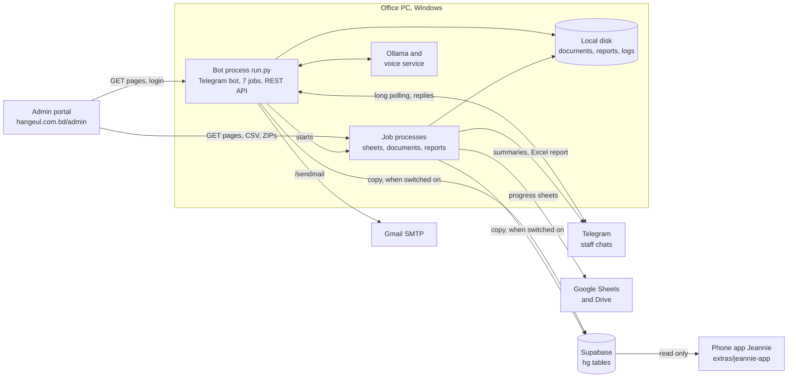

# Hangeul bot project

## What this repository is

This private repository holds the whole Hangeul bot project in one place, for the owner and his AI assistants. The root of the repository is the bot itself: one Python program that runs on a Windows PC in the agency's office, reads the agency's admin website, and reports to staff in Telegram. Beside the bot's code are the documents written for this repository (`docs/`) and three pieces of related code that live outside the bot's folder on the office PC (`extras/`): the local voice service, the trial scripts that chose the language model and the voices, and the phone app that reads what the bot publishes. The repository root is the bot folder: `run.py`, `src/` and `tests/` sit where the bot expects them.

Terms used on this page:

| Term | Meaning |
|---|---|
| portal | The agency's admin website, `https://hangeul.com.bd/admin` (setting `HANGEUL_BASE_URL`, `src/config.py:24`). It has HTML pages and no API. The bot only reads it. |
| bot folder | The folder that holds `run.py` and `.env`. The code finds it from its own location (`src/config.py:5-7`). On the office PC it is `C:\Hangeul\BOT` (`MIGRATION.md:18`). Here it is the repository root. |
| progress sheet | One Google Sheet per study program and intake, one row per student, rebuilt from the portal (`src/sheets/progress_builder.py`). The four programs are `KLP`, `EAP`, `BACHELOR` and `MASTER` (`src/verify/auto_verify.py:58`). |
| OCR | Reading text from a scanned image. The bot uses the EasyOCR library on the PC. |
| Ollama | A local server that runs the language model on the PC, at `http://127.0.0.1:11434`. The default model is `qwen3:4b-instruct` (`src/config.py:31-32`). |
| Supabase | A hosted Postgres database. When publishing is switched on, the bot copies what it reads there (`src/cloud/`). |
| record kind | The type of one row the bot publishes to Supabase. There are 26 kinds (`src/cloud/records.py:41-47`). |
| Jennie | The bot's voice: voice notes in, voice notes out, through a local voice service (`src/bot/voice.py`, `extras/jennie_voice/`). |
| Jeannie | The phone app that reads what the bot published to Supabase (`extras/jeannie-app/`). One letter differs from "Jennie"; they are two different programs. |
| mock mode | `MOCK_MODE=true`: some portal lookups answer with built-in demo data. It is not an offline switch (`.env.example:9-17`). |

## What the bot does

The numbers below are read from the code.

- **Reads 11 portal pages** with HTTP GET: `login.php`, `index.php`, `students.php`, `student_edit.php`, `view_doc.php`, `download_docs.php`, `progress.php`, `consult_requests.php`, `consult_performance.php`, `window_applications.php` and `calendar.php` ([docs/SITE_MAP.md](docs/SITE_MAP.md#12-every-page-the-code-requests)). The only other request it sends to the portal is the login POST (`src/scraper/client.py:184`). It changes nothing on the portal.
- **Answers 42 Telegram command names**, registered on 27 handler functions (`src/bot/telegram_bot.py:2377-2423`). 13 of them form the "/" menu (`src/bot/telegram_bot.py:2316-2332`). It also answers questions typed in plain words, routed by whole-word rules (`classify`, `src/bot/ask.py:529`), and, when `JENNIE_VOICE_ENABLED` is true, voice notes (`src/bot/telegram_bot.py:2430-2432`). Only the chats named in `TELEGRAM_ADMIN_CHAT_ID` and `TELEGRAM_AUTHORIZED_CHAT_IDS` are served (`src/config.py:114-126`).
- **Runs 7 scheduled jobs** (`src/bot/scheduler.py:419-514`), in the time zone `REPORT_TIMEZONE`, default `Asia/Dhaka` (`src/config.py:58`):

  | Job | When | What it does |
  |---|---|---|
  | `daily_executive_briefing` | `DAILY_REPORT_TIME`, default 18:05 | Sends the daily brief to the admin chat |
  | `passport_upload_watcher` | every 30 minutes | Checks each newly uploaded passport scan against the portal's fields |
  | `portal_sync` | every 15 minutes | Rebuilds changed progress sheets, downloads newly verified students' documents, checks them |
  | `missing_info_report` | 09:05 | Sends the missing-information report with an Excel file |
  | `passport_issue_refresh` | 08:30 | Re-reads every student's passport issue date |
  | `brain_keep_warm` | every 10 minutes | Only while the language model is pinned in GPU memory: reloads it when it is missing or only partly on the GPU |
  | `cloud_full_picture` | every 60 minutes, first run 7.5 minutes after start | Only while publishing is switched on: re-reads the main portal pages and publishes them to Supabase |

- **Writes Google Sheets and Drive**: one progress sheet per program and intake.
- **Keeps student documents on the PC and checks them**: downloads each document-verified student's files, reads them with OCR, and writes two Excel reports, `DOCUMENT CHECK.xlsx` and `FIELD CHECK.xlsx` (`src/verify/auto_verify.py:52-53`).
- **Publishes 26 record kinds to Supabase** under 9 job names (`src/cloud/__init__.py:23-24`), only when `SUPABASE_URL`, `SUPABASE_SECRET_KEY` and `CLOUD_PUBLISH_ENABLED` are all set (`src/cloud/publish.py:103-107`). It writes only through the database function `hg_sync` and the run table `hg_runs` (`src/cloud/__init__.py:18-19`).
- **Serves a REST API** on port 8000 (`src/config.py:80`): 11 routes, 9 under `/api` plus `/` and `/healthz`. No route asks the caller for a key.
- **Sends e-mail** to one student per approved `/sendmail`, through Gmail's SMTP server (`src/bot/telegram_bot.py:1148-1166`).

## The whole system

What the picture shows:

1. One process, `run.py`, hosts the Telegram bot, the scheduler and the REST API (`run.py:79-97`).
2. The scheduler runs heavy work in separate Python processes, each stopped after 1 hour, so that a problem in a job cannot take the bot down (`src/bot/scheduler.py:392-416`).
3. Ollama and the voice service are separate programs on the same PC. The bot starts without either.
4. The bot and the phone app never call each other. The bot writes to Supabase; the app reads from it. The table definitions are in the app's migration, `extras/jeannie-app/supabase/migrations/20260929030000_hangeul_context.sql`.

## Where to read what

| Question | Document |
|---|---|
| How does the bot collect information? Where does the information go, and why? | [docs/DATA_FLOW.md](docs/DATA_FLOW.md) |
| What portal pages, Telegram commands, jobs, REST routes and Supabase tables exist? | [docs/SITE_MAP.md](docs/SITE_MAP.md) |
| What is every file and folder? | [docs/PROJECT_STRUCTURE.md](docs/PROJECT_STRUCTURE.md) |
| What does each Python program do? | [docs/PYTHON_PROGRAMS.md](docs/PYTHON_PROGRAMS.md), which links into [docs/programs/](docs/programs/) |
| How is the code built underneath: layers, processes, flows, rules, state? | [docs/CODEBASE_GUIDE.md](docs/CODEBASE_GUIDE.md) |
| How do I build, configure, start, stop and test it? | [docs/BUILD_AND_RUN.md](docs/BUILD_AND_RUN.md) |
| What is the phone app, and how does it read the bot's data? | [docs/JEANNIE_APP.md](docs/JEANNIE_APP.md) |
| What is under `extras/`, and where did it come from? | [extras/README.md](extras/README.md) |
| The long reference, function by function | [docs/reference/00_INDEX.md](docs/reference/00_INDEX.md) |
| How did the project get here? | [docs/reference/08_HISTORY_STAGE_BY_STAGE.md](docs/reference/08_HISTORY_STAGE_BY_STAGE.md), and the 48 commits (`git log`) |
| Which rules must a coding agent follow? | [.agents/rules/hangeul_operational_guardrails.md](.agents/rules/hangeul_operational_guardrails.md), [docs/reference/09_BLUEPRINT_RULES_AND_LESSONS.md](docs/reference/09_BLUEPRINT_RULES_AND_LESSONS.md) |
| What is still open, and what are the known limits? | [docs/reference/11_OPEN_ITEMS_AND_KNOWN_LIMITS.md](docs/reference/11_OPEN_ITEMS_AND_KNOWN_LIMITS.md), [docs/DATA_FLOW.md section 7](docs/DATA_FLOW.md#7-gaps-and-risks-the-code-itself-shows) |
| What was replaced or removed before publishing? | [docs/SCRUB_NOTES.md](docs/SCRUB_NOTES.md), [docs/COMMIT_ID_MAP.md](docs/COMMIT_ID_MAP.md) |

## Suggested reading order for an AI assistant

1. This page.
2. [.agents/rules/hangeul_operational_guardrails.md](.agents/rules/hangeul_operational_guardrails.md) (43 lines): seven always-on rules for coding agents. Rule 1: the portal is read-only.
3. [docs/PROJECT_STRUCTURE.md](docs/PROJECT_STRUCTURE.md), sections 1, 2 and 4: the project in five lines, the top-level layout, and the three root files that must stay identical to their `src/` originals.
4. [docs/CODEBASE_GUIDE.md](docs/CODEBASE_GUIDE.md), sections 1 to 4: layers, processes, eight flows traced end to end, the rules the code follows everywhere.
5. [docs/SITE_MAP.md](docs/SITE_MAP.md), then [docs/DATA_FLOW.md](docs/DATA_FLOW.md).
6. [docs/PYTHON_PROGRAMS.md](docs/PYTHON_PROGRAMS.md), then the page under `docs/programs/` for the code you will touch, then the code itself. [docs/CODEBASE_GUIDE.md section 8](docs/CODEBASE_GUIDE.md#8-where-to-make-a-change) says where each kind of change belongs.
7. [docs/BUILD_AND_RUN.md](docs/BUILD_AND_RUN.md) before you run anything. Section 10 covers the tests.
8. [docs/JEANNIE_APP.md](docs/JEANNIE_APP.md) only when the task touches the phone app or the published data.
9. [docs/reference/](docs/reference/00_INDEX.md) for depth.

Three things to keep in mind while working:

- The code is the source of truth. The documents cite it as `path:line`. Where a document and the code disagree, the code decides.
- `telegram_bot.py`, `config.py` and `progress_builder.py` at the root are byte-identical copies of `src/bot/telegram_bot.py`, `src/config.py` and `src/sheets/progress_builder.py`. A change to one of those `src/` files must be copied to the root file; `tests/test_cloud.py:1126-1129` fails otherwise ([docs/PROJECT_STRUCTURE.md section 4](docs/PROJECT_STRUCTURE.md#4-the-three-root-files-that-are-copies)).
- Settings are named in the documents, never shown. Their values live in `.env`, which is not in this repository.

## What is in this repository, and what is not

In it:

| Part | Where |
|---|---|
| The bot's code, launchers, tests and settings template `.env.example` | the root, `src/`, `tests/`, `tools/`, `.agents/` |
| The bot's own earlier documents | `HANDOFF.md`, `MIGRATION.md`, `PC_BUILD.md`, and the original README as [docs/BOT_README.md](docs/BOT_README.md) |
| Documents written for this repository | `docs/` |
| The local voice service, the trial scripts and their results, the phone app | `extras/` ([extras/README.md](extras/README.md)) |

The first two rows are the bot's own repository: 113 tracked files on the office PC, of which 112 are here. The one left out is the image `test_passport.jpg` (next table).

Left out on purpose:

| Left out | Examples, by name | Why |
|---|---|---|
| Secrets | `.env`, `credentials.json`, `token.json`; the phone app's settings files | Live credentials (`.gitignore:1-11`) |
| Student data | `data/`, `passports/`, the downloaded document folders, CSV and Excel reports, the image `test_passport.jpg` | Personal data (`.gitignore:13-30`) |
| Logs | `hangeul_bot.log`, `hangeul_sync.log`, the voice service's logs | They quote student names and portal responses (`.gitignore:32-36`) |
| Audio | Jennie's reference voice clip, the filler clips, the trial samples, test voice notes | Binary files |
| Model weights | the Ollama model, EasyOCR's models, `thenlper/gte-small`, the Whisper and CosyVoice weights | Binary downloads that can be fetched again |
| Environments and build output | `.venv`, `node_modules/`, `.next/` | Rebuilt with `pip install -r requirements.txt`, `npm install` and `npm run build` |
| The phone app's media files and its `.claude` folder | avatar clips, posters, icons | Binary media; settings of a developer tool |

The full list, with the path where each item lives on the office PC, is in [docs/PROJECT_STRUCTURE.md section 7](docs/PROJECT_STRUCTURE.md#7-what-is-on-the-office-pc-but-not-in-this-repository-and-why). [docs/SCRUB_NOTES.md](docs/SCRUB_NOTES.md) describes what was replaced or removed before publishing. Real personal values in the code were replaced with made-up ones in every commit, so the commit ids here differ from those in the bot's repository on the office PC; [docs/COMMIT_ID_MAP.md](docs/COMMIT_ID_MAP.md) maps the old ids to the new ones.

## State of the project, as the code shows it

- **HEAD.** Branch `main`. The last commit is "consultant_performance: a scope that stays put all month; the backfill reads the page", dated 30 September 2026. The history has 48 commits from 27 to 30 September 2026; 8 of them are merges. The first commit, "Baseline: GitHub snapshot of hangeul-bot as downloaded", is the starting point of this history.
- **Tests.** `.venv\Scripts\python.exe -m pytest tests -m "not slow" -q` gives 1151 passed, 1 deselected (the one test marked `slow`, which loads a real embedding model). `pytest` is not in `requirements.txt`; install it first. When a skip appears, compare its reason with [docs/BUILD_AND_RUN.md section 10.2](docs/BUILD_AND_RUN.md#102-the-count).
- **Switches.** Four settings decide what runs. Which values the office PC uses is in its `.env` and cannot be determined from the code.

  | Setting | Default in the code | Value in `.env.example` | What it switches |
  |---|---|---|---|
  | `MOCK_MODE` | `true` (`src/config.py:21`) | `false` (`.env.example:18`) | Demo data for some portal lookups |
  | `ENABLE_SCHEDULED_REPORTS` | `true` (`src/config.py:59`) | `true` (`.env.example:75`) | All 7 scheduled jobs |
  | `JENNIE_VOICE_ENABLED` | `false` (`src/config.py:69`) | `false` (`.env.example:97`) | Voice notes, and keeping the model loaded |
  | `CLOUD_PUBLISH_ENABLED` | `false` (`src/config.py:88`) | `false` (`.env.example:116`) | Publishing to Supabase, together with `SUPABASE_URL` and `SUPABASE_SECRET_KEY` |

- **Phone app.** The app's part that reads the bot's data was built on a feature branch. The app's own spec says that work is "not yet merged or deployed" (`extras/jeannie-app/.scratch/hangeul-cloud-context/spec.md:3-5`). Whether that has changed since cannot be determined from the code.

## The bot's earlier documents

Three documents at the root come from the bot's own repository. They describe earlier stages of the project and are kept unchanged:

- [HANDOFF.md](HANDOFF.md): the system handoff of 25 September 2026. It does not mention the Supabase layer, the voice feature or the REST API.
- [MIGRATION.md](MIGRATION.md): how the bot was moved to the current PC, updated 27 September 2026, with the cold start phase by phase.
- [PC_BUILD.md](PC_BUILD.md): a hardware purchase proposal of 26 September 2026. It is not about the code.

[docs/BOT_README.md](docs/BOT_README.md) is the bot's original `README.md`, from its first version; most of it no longer matches the code. Where these documents disagree with the code is listed in [docs/BUILD_AND_RUN.md section 15](docs/BUILD_AND_RUN.md#15-where-the-older-documents-disagree-with-the-code).
