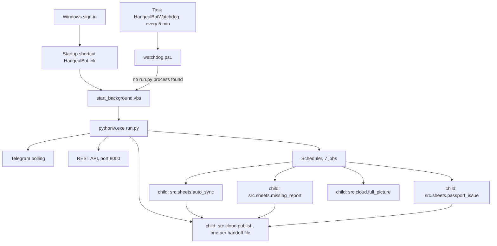
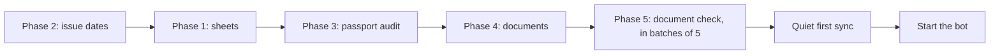

# Build and run

How to build, configure, start, stop and test every part of the project.

This document is written from the code. Statements cite the file and line they come from, as `path:line`, with paths relative to the repository root. Where the bot's own older documents ([MIGRATION.md](../MIGRATION.md), [HANDOFF.md](../HANDOFF.md), [BOT_README.md](BOT_README.md), [PC_BUILD.md](../PC_BUILD.md)) describe an older PC or disagree with the code, the code wins and the difference is stated ([section 15](#15-where-the-older-documents-disagree-with-the-code)).

Related documents: [PROJECT_STRUCTURE.md](PROJECT_STRUCTURE.md) (what is where), [SITE_MAP.md](SITE_MAP.md) (every page, command, job and table), [DATA_FLOW.md](DATA_FLOW.md) (what moves where), [PYTHON_PROGRAMS.md](PYTHON_PROGRAMS.md) (every Python program), [JEANNIE_APP.md](JEANNIE_APP.md) (the phone app).

## Contents

1. [What you need](#1-what-you-need)
2. [Get the code and create the virtual environment](#2-get-the-code-and-create-the-virtual-environment)
3. [The other programs](#3-the-other-programs)
4. [Configuration](#4-configuration)
5. [Google sign-in](#5-google-sign-in)
6. [The Telegram bot and who is authorised](#6-the-telegram-bot-and-who-is-authorised)
7. [First start from nothing](#7-first-start-from-nothing)
8. [Starting, stopping, checking](#8-starting-stopping-checking)
9. [What runs by itself once started](#9-what-runs-by-itself-once-started)
10. [The tests](#10-the-tests)
11. [The voice service](#11-the-voice-service-extrasjennie_voice)
12. [Publishing to Supabase](#12-publishing-to-supabase)
13. [The phone app](#13-the-phone-app-extrasjeannie-app)
14. [Troubleshooting](#14-troubleshooting)
15. [Where the older documents disagree with the code](#15-where-the-older-documents-disagree-with-the-code)

## Terms used here

| Term | Meaning |
|---|---|
| bot folder, `<bot>` | The folder that holds `run.py` and `.env`. The code finds it from its own location (`src/config.py:5-7`); every launcher finds it with `%~dp0` (for example `start.bat:2`). The proven installation uses `C:\Hangeul\BOT` (`MIGRATION.md:18`). In the published repository the bot folder is the repository root. |
| portal | The agency's admin website at `HANGEUL_BASE_URL` (default `https://hangeul.com.bd/admin`, `src/config.py:24`). The bot only reads it: GET requests plus the one login POST (`bootstrap.py:22`). |
| progress sheet | One Google Sheet per program and intake, built from the portal (`bootstrap.py:53-56`). |
| cold start | Rebuilding all data on a new PC from the portal, phase by phase (`bootstrap.py:1-22`). |
| mock mode | `MOCK_MODE=true`: some lookups answer with demo data. It is not an offline switch (`.env.example:9-17`). |
| brain | The one local language model the bot uses through Ollama (`src/config.py:28-32`). |
| Jennie | The bot's voice persona: speech-to-text and text-to-speech through a local service (`src/config.py:67-71`). |
| Jeannie | The owner's phone app (a Next.js web app) that reads what the bot publishes to Supabase (`src/cloud/__init__.py:3-5`). Note the different spelling. |
| handoff file | A JSON file a job writes under `data/cloud/pending/` for the publisher process to send to Supabase (`src/cloud/handoff.py:46`, `:109-115`). |
| full picture | The hourly job that re-reads the main portal pages and publishes them to Supabase (`src/cloud/full_picture.py:1-33`). |
| quiet window | 18:00-18:10, 08:25-08:40 and 09:00-09:10 in the business time zone. Bulk portal reads for Supabase do not start then, because scheduled jobs run then (`src/cloud/backfill.py:56-57`). |

## The parts at a glance

| Part | Where | Needed | Built with | Started by |
|---|---|---|---|---|
| The bot (Telegram bot, REST API, scheduler) | repository root | yes | Python 3.12 venv, `requirements.txt` | `start.bat` or `start_background.vbs` |
| Ollama with the model | separate install | optional | Ollama installer, `ollama pull` | Ollama itself |
| Voice service | `extras/jennie_voice/` | optional | its own Python 3.12 venv | `start_jennie_voice.vbs` |
| Supabase publishing | `src/cloud/` (inside the bot) | optional | same venv as the bot | switched on in `.env` |
| Phone app | `extras/jeannie-app/` | optional | Node 22, `npm` | `npm run dev`, or a Vercel deployment |
| Trials | `extras/trials/` | no | separate venvs, not rebuilt here | by hand; see [programs/trials.md](programs/trials.md) |

How the running bot is put together:



Sources: `install_autostart.bat:8`, `install_watchdog.bat:14`, `watchdog.ps1:13-31`, `start_background.vbs:12-13`, `run.py:79-103`, `src/bot/scheduler.py:392-416`, `src/cloud/handoff.py:109-115`, `src/cloud/sheet_hooks.py:3-11`. The full picture (M) publishes by itself, without a handoff file ([section 12.5](#125-switching-it-on)).

---

## 1. What you need

### 1.1 Operating system

Windows. Every launcher is a `.bat`, `.vbs` or `.ps1` file and uses `wscript.exe`, PowerShell (`Get-CimInstance Win32_Process`) and `schtasks` (`start_background.vbs:1-13`, `stop.bat:9`, `install_watchdog.bat:14`). `.gitattributes:1-6` forces CRLF line endings on these files because `cmd.exe` misreads labels in `.bat` files that have LF only.

Some Python code has a branch for other systems (the lock test uses `os.kill` when not on Windows, `src/verify/auto_verify.py:62-80`). Nothing in the repository describes a run on another system.

### 1.2 Python

Python 3.12, in a virtual environment named `.venv` inside the bot folder (`requirements.txt:1`, `:7`). Every launcher uses only `<bot>\.venv\Scripts\python.exe` or `pythonw.exe` and stops with an error when it is missing (`start.bat:8-9`, `start_background.vbs:4-11`). `MIGRATION.md:73-75` adds the rule: use `.venv\Scripts\python.exe` for every command, never a bare `python`, because a package installed into another Python is invisible to the launchers.

### 1.3 GPU, and what uses it

The versions in `requirements.txt` were proven on a PC with a Ryzen 5 8600G processor and an NVIDIA RTX 5060 graphics card with 8 GB of memory (`requirements.txt:1`; `src/bot/voice.py:56-64`). The pinned `torch==2.11.0+cu128` build is the CUDA 12.8 build, which suits RTX 50-series cards (`requirements.txt:11-13`).

| User of the GPU | What it does there | Without a GPU | Source |
|---|---|---|---|
| Document check (EasyOCR) | Reads scanned document pages | Runs on the CPU, slower. The switch is `torch.cuda.is_available()` | `src/verify/doc_verifier.py:55-60` |
| Ollama model | Holds the language model: 2.82 GiB at a context of 3072 tokens, measured | Ollama decides; the bot only checks whether the model is wholly on the GPU | `src/config.py:33-37`, `src/bot/scheduler.py:280-302` |
| Voice service | Speech-to-text peaks at about 2.2 GB, text-to-speech at about 3.5 GB | Works on the CPU with `JENNIE_GPU=0`, much slower | `extras/jennie_voice/README.md:206-214`, `:253` |

What does not use the GPU:

- The passport check. Its EasyOCR reader is built with `gpu=False` (`src/scraper/ocr_validator.py:79`).
- Supabase publishing. The embedding processes hide the GPU with `CUDA_VISIBLE_DEVICES=-1` before `torch` can be imported, so the 8 GB card stays with Ollama and the document check (`src/cloud/embed.py:6-12`, `:60-67`). They use about 1 GB of RAM (`src/cloud/embed.py:12`).

8 GB is tight. The comment at `src/bot/voice.py:56-64` records that the resident model, the desktop and the idle voice service use about 4.6 to 4.8 GiB of the card's 7.96 GiB, and that a speech render peaks at 3.55 to 3.67 GiB. `HANDOFF.md:241-242` records a CUDA out-of-memory error when a second OCR process started during a document check. `MIGRATION.md:139-140` records that a game open on the same GPU made OCR ten times slower.

RAM: the voice service's README calls the machine "this 16 GB PC" and measured 1.7 to 2.7 GB free while the bot and the service ran together (`extras/jennie_voice/README.md:221-222`).

### 1.4 Disk layout

Nothing is tied to a drive letter. Folder settings left empty take a default beside the bot folder (`src/config.py:94-112`).

| Path (default) | Setting | Contents | Source |
|---|---|---|---|
| `<bot>\` | none | Code, `.env`, `credentials.json`, `token.json`, `data\`, `passports\`, log files | `src/config.py:6-7`, `src/sheets/progress_builder.py:45-47`, `run.py:7-37` |
| `<bot>\.venv\` | none | The bot's Python 3.12 environment | `requirements.txt:7` |
| `<bot>\data\verification\` | `VERIFICATION_DIR` | OCR text cache (`text\`), `results.json`, `DOCUMENT CHECK.xlsx`, `FIELD CHECK.xlsx`, the check's lock file | `src/config.py:111-112`, `src/verify/auto_verify.py:47-53` |
| `<parent of bot>\VERIFIED STUDENT DOCUMENTS\` | `DOCS_ROOT` | Downloaded documents, `<PROGRAM>\<NAME (PASSPORT)>\` | `src/config.py:96`, `:101-102` |
| `<parent of bot>\VERIFIED STUDENT DOCUMENTS - ORIGINALS OVER 2MB\` | `DOCS_ORIGINALS_ROOT` | Untouched originals of files that were shrunk below 2 MB | `src/config.py:97`, `:104-106`, `src/sheets/verified_docs.py:243-245` |
| `<parent of bot>\KONYANG DOCUMENTS\` | `KONYANG_ROOT` | Older downloads. Skipped when the folder does not exist | `src/config.py:98`, `:108-109` |
| `<bot>\data\cloud\` | none | Supabase publishing: `pending\`, `dry_run\`, `publish.lock`, `student_index.json` | `src/cloud/publish.py:86-87` (`dry_run\`, `publish.lock`), `src/cloud/handoff.py:46` (`pending\`), `src/cloud/student_index.py:31` (`student_index.json`) |
| `<bot>\passports\` | none | Passport scans, saved by every passport check: the passport watcher every 30 minutes, `/passports` and the cross-check commands, and `audit_program.py`. All of them go through `audit_student_passport`, which saves into this folder | `src/scraper/client.py:675-678`; callers `src/bot/scheduler.py:206`, `src/bot/telegram_bot.py:1643`, `audit_program.py:151` |
| `<current folder>\passports\` | none | Scans saved by the hand-run `download_passports.py`. The path is relative, so it is `<bot>\passports\` only when the script is run from the bot folder | `download_passports.py:15`, `:29` |

A relative value in a folder setting counts from the bot folder (`src/config.py:10-16`). With the bot in `C:\Hangeul\BOT` the defaults are `C:\Hangeul\VERIFIED STUDENT DOCUMENTS` and so on (`.env.example:126-134`).

Files the bot writes in the bot folder while it runs:

| File | Written by | Contents |
|---|---|---|
| `hangeul_bot.log` | `run.py:37` | Every log record of the bot process at INFO and above |
| `hangeul_stdout.log`, `hangeul_stderr.log` | `run.py:8-22`, `:37-39` | Written only when the bot is started without a console (`pythonw.exe`). `sys.stdout` is then replaced by `hangeul_stdout.log` before logging is set up, and `run.py` adds a log handler on `sys.stdout`. So every log record goes into `hangeul_stdout.log` as well as `hangeul_bot.log`, and the file grows like the main log. `hangeul_stderr.log` gets what is written to `sys.stderr`, such as tracebacks |
| `hangeul_sync.log` | `src/bot/scheduler.py:340-341`, `:401-406`; `src/cloud/handoff.py:47`, `:111` | Output of the child job processes and of the Supabase publisher |
| `hangeul_watchdog.log` | `watchdog.ps1:6`, `:20`, `:26`, `:30` | One line per 5-minute watchdog check. Never trimmed |

None of these, and none of `.env`, `token.json`, `credentials.json`, `data/`, `passports/`, `*.csv`, `*.xlsx`, `*.log`, are in the repository (`.gitignore:4-36`). They hold secrets or student data.

Outside the bot folder, three model stores are filled by downloads:

- The Hugging Face cache, for the embedding model `thenlper/gte-small` ([section 12](#12-publishing-to-supabase)). The test that looks for it expects `<HF_HUB_CACHE>`, else `<HF_HOME>\hub`, else `<user home>\.cache\huggingface\hub` (`tests/test_cloud.py:1077-1080`).
- EasyOCR's model files. The code sets no model folder (`src/verify/doc_verifier.py:60`, `src/scraper/ocr_validator.py:79`), so the location is EasyOCR's own default.
- Ollama's model store. The bot never names it; it is Ollama's own default.

How much disk the documents need depends on the number of students. The recorded cold start downloaded 1.2 GB for 146 students (`MIGRATION.md:154`).

---

## 2. Get the code and create the virtual environment

### 2.1 Get the code

1. Clone the repository with git into a short path, for example `C:\Hangeul\BOT`. Use `git clone`, not a ZIP or raw download: git checks the Windows scripts out with CRLF line endings (`.gitattributes:1-6`), which `cmd.exe` needs.
2. Keep the path short. `schtasks` refuses a task command longer than 261 characters, and the watchdog task's command contains the bot folder path (`install_watchdog.bat:12-14`, `:31`).

The repository root is the bot folder. `docs/` and `extras/` sit beside the bot's code and are not needed to run the bot.

### 2.2 Create the environment and install, in this order

Run in PowerShell, inside the bot folder (`requirements.txt:7-12`, `MIGRATION.md:59-67`):

```powershell
py -3.12 -m venv .venv
.venv\Scripts\python.exe -m pip install --upgrade pip
.venv\Scripts\python.exe -m pip install torch==2.11.0+cu128 torchvision==0.26.0+cu128 --index-url https://download.pytorch.org/whl/cu128
.venv\Scripts\python.exe -m pip install -r requirements.txt
.venv\Scripts\python.exe -c "import torch; print(torch.cuda.is_available(), torch.cuda.get_device_name(0))"
```

The last command must print `True` (`MIGRATION.md:70-71`).

### 2.3 Why the order matters

`torch` must be installed first, from the CUDA package index. If `easyocr` is installed first, it pulls the CPU-only `torch` from PyPI. The CUDA install command then does nothing, and OCR silently runs on the CPU (`requirements.txt:3-5`, `MIGRATION.md:69-71`).

`requirements.txt` pins the `+cu128` builds of `torch` and `torchvision` (`requirements.txt:13-14`) but has no `--index-url` line of its own. The CUDA index appears only in the header comment's command (`requirements.txt:8`). So the `-r requirements.txt` command relies on the `torch` command before it having installed those two packages already.

### 2.4 What is pinned

`requirements.txt` pins 25 packages (`requirements.txt:13-49`):

| Group | Packages | Lines |
|---|---|---|
| GPU | `torch==2.11.0+cu128`, `torchvision==0.26.0+cu128` | 13-14 |
| OCR and document checks | `easyocr==1.7.2`, `pymupdf==1.28.2`, `opencv-python-headless==5.0.0.93`, `pyzbar==0.1.9`, `pillow==12.3.0`, `pypdf==6.19.0`, `openpyxl==3.1.5` | 17-23 |
| Portal, bot and API | `httpx==0.28.1`, `beautifulsoup4==4.15.0`, `python-telegram-bot==22.8`, `apscheduler==3.11.3`, `tzdata==2026.4`, `fastapi==0.141.1`, `uvicorn==0.54.0`, `pydantic==2.13.5`, `pydantic-settings==2.15.0`, `python-dotenv==1.2.3`, `rich==15.0.0` | 26-36 |
| Supabase publishing | `sentence-transformers==6.1.0`, `transformers==5.17.0` | 43-44 |
| Google Sheets and Drive | `google-api-python-client==2.200.0`, `google-auth-oauthlib==1.4.1`, `google-auth-httplib2==0.4.2` | 47-49 |

Three things the list does not cover:

- `pytest` is not in `requirements.txt`. `tests/conftest.py` imports it (`tests/conftest.py:13`), and so do 21 of the 24 test files; `tests/test_consultations.py`, `tests/test_final_fixes.py` and `tests/test_integration.py` do not. The suite needs `pytest` to run either way. Install it separately ([section 10](#10-the-tests)).
- `numpy` is imported (`src/scraper/ocr_validator.py:40`) but not pinned. It arrives as a dependency of the pinned packages, at whatever version pip resolves on the day.
- `google-auth` is imported (`src/sheets/progress_builder.py:355-356`) but not pinned. It arrives with the three pinned Google packages.

There is no Supabase client package. Publishing uses plain HTTP through `httpx` (`src/cloud/publish.py:92`, `:399-409`).

`gauth.bat:10` and `install_sheets.bat:33` each run an unpinned `pip install` of the three Google packages. On a venv installed from `requirements.txt` those packages are already present.

### 2.5 Files to add by hand

| File | How it gets there |
|---|---|
| `<bot>\.env` | Copy `.env.example` to `.env` and fill it in ([section 4](#4-configuration)) |
| `<bot>\credentials.json` | Download from Google Cloud ([section 5](#5-google-sign-in)) |
| `<bot>\token.json` | Written by the `--auth` step ([section 5](#5-google-sign-in)) |
| `<bot>\data\windows-ca.pem` | Only if Python cannot verify HTTPS certificates ([section 3.5](#35-https-certificates)) |

---

## 3. The other programs

### 3.1 Ollama and its model (optional)

Ollama is a local server that runs the language model. The bot talks to it at `OLLAMA_BASE_URL` (default `http://127.0.0.1:11434`, `src/config.py:31`) and uses one model for everything, named by `OLLAMA_MODEL` (default `qwen3:4b-instruct`, `src/config.py:32`).

1. Install Ollama (`MIGRATION.md:81-82` uses `winget install Ollama.Ollama` or the installer from ollama.com).
2. Pull the model the bot is configured for:

   ```powershell
   ollama pull qwen3:4b-instruct
   ```

   `run.py:55` prints this same hint, with the configured model name, when Ollama is running but the model is missing. `MIGRATION.md:83` and `docs/BOT_README.md:102` still say `qwen2.5:7b`; that is the older model and no longer the default.
3. Optional, for less GPU memory: set `OLLAMA_FLASH_ATTENTION=1` and `OLLAMA_KV_CACHE_TYPE=q8_0` as Windows environment variables for the Ollama server, then restart Ollama. The model then needs about 0.35 GiB less at the same context size (`src/config.py:38-40`, `.env.example:35-38`). The bot does not read these two variables.

Use `127.0.0.1`, not `localhost`, in `OLLAMA_BASE_URL`. On the proven PC `localhost` tries IPv6 first and loses about 2 seconds on every new connection (`src/config.py:29-30`).

What uses the model (all through `src/llm/ollama_client.py`; see [programs/voice_and_llm.md](programs/voice_and_llm.md)): the one-line summary under the daily brief, the choice of dashboard figures for a typed question with no fixed route, the e-mail draft of `/sendmail`, and, when the voice is on, routing a spoken question and wording the spoken sentence.

What happens without Ollama: the bot still runs. At start `run.py:57` prints that Ollama was not detected. `chat` returns `None` and never raises, so callers fall back ([programs/voice_and_llm.md](programs/voice_and_llm.md)). `MIGRATION.md:86-87` says the same: only the brief's summary, `/sendmail` drafting and free-text answers use it.

When the model is loaded:

- Pinned in GPU memory for good only when `JENNIE_VOICE_ENABLED` or `BRAIN_ALWAYS_LOADED` is true (`src/llm/ollama_client.py:37-44`). The bot then loads it at start (`src/bot/telegram_bot.py:2359-2362`) and checks it every 10 minutes (`src/bot/scheduler.py:317-337`).
- Otherwise the bot unloads it at start (`src/bot/telegram_bot.py:2363-2365`), it loads for a question, and Ollama unloads it after `BRAIN_IDLE_UNLOAD` (default `5m`) of no use (`src/llm/ollama_client.py:42-44`).

The comment at `.env.example:26-28` says the model "stays loaded in VRAM for good". That is true only with the voice on; the code above decides.

### 3.2 Microsoft Visual C++ Redistributable (x64)

`pyzbar` decodes QR codes with a bundled DLL that needs a Microsoft Visual C++ runtime. `MIGRATION.md:56-57` says only "Microsoft Visual C++ Redistributable (x64)", which can lead to the wrong package. The older reference document names the one that is needed: the **Visual C++ Redistributable Packages for Visual Studio 2013 (x64)**. It provides `msvcr120.dll`, which `pyzbar`'s bundled `libzbar-64.dll` needs, and the reference document says a newer Visual C++ 2015-2022 redistributable does not replace it ([reference/02_ENVIRONMENT_SETUP_AND_OPERATIONS.md](reference/02_ENVIRONMENT_SETUP_AND_OPERATIONS.md), section 3.1). The code itself cannot confirm the version.

What the code shows: when `pyzbar` cannot be imported, both places that read QR codes fall back to OpenCV's QR detector without any error or log line (`src/verify/page_checks.py:100-103` and `:331-334`). The code's own comment says OpenCV "often cannot" read real scans (`src/verify/page_checks.py:100`). So a missing runtime shows up as failed QR checks, not as a crash: the academic-file rule then fails with "no e-Apostille with a scannable QR" or "its QR could not be read" (`src/verify/page_checks.py:386-393`). The reference document, not `MIGRATION.md`, records the result as mass false QR failures (same section).

To check that `pyzbar` loads, the reference document's pre-flight encodes a QR code with OpenCV and decodes it with `pyzbar` ([reference/02_ENVIRONMENT_SETUP_AND_OPERATIONS.md](reference/02_ENVIRONMENT_SETUP_AND_OPERATIONS.md), section 3.9). An import error here means the runtime is missing:

```powershell
.venv\Scripts\python.exe -c "import cv2; from pyzbar.pyzbar import decode; i=cv2.QRCodeEncoder.create().encode('ok'); i=cv2.resize(i,None,fx=8,fy=8,interpolation=cv2.INTER_NEAREST); print(decode(i))"
```

The output should contain `data=b'ok'`.

### 3.3 EasyOCR model files

EasyOCR downloads its English model files the first time a reader is built (`src/verify/doc_verifier.py:57-59`). That first run needs internet. After it, OCR runs locally. Where the files are stored is EasyOCR's default; the code sets no folder.

### 3.4 The embedding model (only for Supabase publishing)

`thenlper/gte-small` at a pinned revision (`src/config.py:91-92`). It must already be in the Hugging Face cache, because every embedding process runs with `HF_HUB_OFFLINE=1` and downloads nothing (`src/cloud/embed.py:60-68`). Steps are in [section 12](#12-publishing-to-supabase).

### 3.5 HTTPS certificates

On some networks antivirus HTTPS scanning or the internet provider re-signs HTTPS with a root certificate that Windows trusts and Python's bundled list does not. Every Python HTTPS call then fails with `CERTIFICATE_VERIFY_FAILED`, including `pip` (`src/__init__.py:7-14`).

Check (`MIGRATION.md:93-99`):

```powershell
.venv\Scripts\python.exe -c "import urllib.request; urllib.request.urlopen('https://oauth2.googleapis.com/token', timeout=20)"
```

`HTTP Error 404` means HTTPS works. `CERTIFICATE_VERIFY_FAILED` means the fix below is needed.

1. Export the Windows certificate stores to `<bot>\data\windows-ca.pem` (`tools/export_windows_ca.ps1:8`, `:15-41`):

   ```powershell
   powershell -ExecutionPolicy Bypass -File tools\export_windows_ca.ps1
   ```
2. When that file exists, `import src` points `SSL_CERT_FILE`, `REQUESTS_CA_BUNDLE`, `CURL_CA_BUNDLE`, `HTTPX_SSL_CERT_FILE` and `GRPC_DEFAULT_SSL_ROOTS_FILE_PATH` at it, unless they are already set (`src/__init__.py:18-22`).
3. The script's header gives a second manual step for clients that ignore those variables: append the file to `certifi`'s own bundle, keeping a backup (`tools/export_windows_ca.ps1:10-13`).

### 3.6 Windows programs the launchers call

`wscript.exe` (`start_background.vbs`), `powershell.exe` (`stop.bat:9`, `check_status.bat:10`, `watchdog.ps1`), `schtasks` (`install_watchdog.bat:14`). All are part of Windows.

### 3.7 Services the code calls

| Service | Used for | Settings | Source |
|---|---|---|---|
| The admin portal | Every read of students, consultations, documents | `HANGEUL_BASE_URL`, `HANGEUL_USERNAME`, `HANGEUL_PASSWORD` | `src/scraper/client.py:100-118` |
| Telegram Bot API (`api.telegram.org`) | Receiving messages (long polling), sending answers and reports | `TELEGRAM_BOT_TOKEN` | `run.py:92-95`, `src/net_fix.py:72-105` |
| Google Drive and Sheets | Progress sheets, the "already complete in Drive" list | `credentials.json`, `token.json` | `src/sheets/progress_builder.py:44-52`, `:388-393` |
| Gmail SMTP (`smtp.gmail.com:465`) | `/sendmail` only | `GMAIL_ADDRESS`, `GMAIL_APP_PASSWORD` | `src/bot/telegram_bot.py:1148-1168` |
| Ollama (this PC) | The language model | `OLLAMA_BASE_URL`, `OLLAMA_MODEL`, `OLLAMA_NUM_CTX` | `src/config.py:31-42` |
| Voice service (this PC) | Speech in and out | `JENNIE_VOICE_ENABLED`, `JENNIE_VOICE_URL` | `src/bot/voice.py:125-137` |
| Supabase | The second copy for the phone app | `SUPABASE_URL`, `SUPABASE_SECRET_KEY`, `CLOUD_PUBLISH_ENABLED` | `src/cloud/publish.py:103-107` |

Not used anywhere in the bot: Tesseract (see [programs/verify.md](programs/verify.md) and [programs/scraper_and_config.md](programs/scraper_and_config.md)).

---

## 4. Configuration

### 4.1 Where `.env` lives and how it is read

- The file is `<bot>\.env`, beside `run.py` (`src/config.py:6-7`). Create it by copying `.env.example` (`.env.example:4`).
- It is read once, when `src.config` is imported, by `pydantic-settings`: UTF-8, unknown keys ignored (`src/config.py:141-147`).
- A key left out takes the default in `src/config.py`. A Windows environment variable with the same name overrides the value in the file (`.env.example:5-7`).
- Write paths without quotes. Inside double quotes a sequence such as `\n` or `\t` becomes a control character (`.env.example:128-130`).
- The settings are built once per process, at import (`src/config.py:147`). So a change reaches the bot only after a restart. Each child job is a new process and reads the file when it starts.
- The repository root also holds `config.py`, a copy of `src/config.py` kept for the legacy updater `apply_bot_update.bat` (`apply_bot_update.bat:20`, `:43-44`). Nothing imports it; `run.py:30` imports `src.config`.

### 4.2 Every field of `Settings` (`src/config.py:19-99`)

Values are never shown here. "Default" is the default in the code. All 32 fields are listed.

| NAME | Default | What it does | Needed for | Line |
|---|---|---|---|---|
| `MOCK_MODE` | `True` (`.env.example:18` ships `false`) | `true` makes the basic lookups answer with demo data. Not an offline switch: the sheet jobs, the passport watcher and several commands still read the real portal (`.env.example:11-17`). It also stops only part of the Supabase publishing ([section 12.5](#125-switching-it-on)) | Set `false` for any real use | 21 |
| `HANGEUL_BASE_URL` | `https://hangeul.com.bd/admin` | Base address of the portal | Every portal read | 24 |
| `HANGEUL_USERNAME` | a placeholder | Portal login name | Every portal read | 25 |
| `HANGEUL_PASSWORD` | a placeholder | Portal login password | Every portal read | 26 |
| `OLLAMA_BASE_URL` | `http://127.0.0.1:11434` | Address of the Ollama server | The language model | 31 |
| `OLLAMA_MODEL` | `qwen3:4b-instruct` | The one model used for every language-model job | The language model | 32 |
| `OLLAMA_NUM_CTX` | `3072` | Context window sent with every Ollama call. One number for all calls, because Ollama reloads the model when it changes | The language model | 42 |
| `TELEGRAM_BOT_TOKEN` | empty | The bot's token. Empty, or the placeholder from `.env.example`, means no Telegram bot and no scheduler: only the REST API runs (`src/bot/telegram_bot.py:2367-2372`) | Telegram and every scheduled job | 45 |
| `TELEGRAM_ADMIN_CHAT_ID` | empty | The primary allowed chat. The only recipient of the daily brief, the passport alerts and the pinned command list | Telegram access, brief, alerts | 46 |
| `TELEGRAM_AUTHORIZED_CHAT_IDS` | empty | Extra allowed chat IDs, separated by commas, semicolons or spaces (`src/config.py:114-126`) | Colleagues' access | 50 |
| `TELEGRAM_BRIEF_CHAT_IDS` | empty | Who receives the 15-minute sync summaries and the 09:05 missing-information report. Empty means everyone who is authorised (`src/config.py:128-139`) | Restricting those messages | 56 |
| `DAILY_REPORT_TIME` | `18:05` | Time of the daily brief, 24-hour `HH:MM`, in `REPORT_TIMEZONE`. Unparsable text falls back to 18:05 (`src/bot/scheduler.py:426-431`) | Daily brief | 57 |
| `REPORT_TIMEZONE` | `Asia/Dhaka` | Time zone of every scheduled time and of "today" | Scheduler, dates | 58 |
| `ENABLE_SCHEDULED_REPORTS` | `True` | `false` registers no scheduled job at all, not only the brief (`src/bot/scheduler.py:421-423`) | Every scheduled job | 59 |
| `GMAIL_ADDRESS` | empty | Sender address for `/sendmail` | `/sendmail` | 64 |
| `GMAIL_APP_PASSWORD` | empty | A Google app password (16 characters), not the account password. `/sendmail` stays off until both Gmail settings are set (`src/bot/telegram_bot.py:1154-1158`) | `/sendmail` | 65 |
| `JENNIE_VOICE_ENABLED` | `False` | `true` registers the voice-note handler, pins the model in GPU memory and prepares the filler clips | Voice | 69 |
| `JENNIE_VOICE_URL` | `http://127.0.0.1:8765` | Where the voice service listens. Any host other than this PC is refused (`src/bot/voice.py:125-131`) | Voice | 70 |
| `JENNIE_SPOKEN_BRIEF` | `True` | Also send a spoken summary after the text brief. Only while `JENNIE_VOICE_ENABLED` is true (`src/bot/scheduler.py:269`) | Voice | 71 |
| `BRAIN_ALWAYS_LOADED` | `False` | Keep the model in GPU memory for good even with the voice off. Not in `.env.example` | Optional | 75 |
| `BRAIN_IDLE_UNLOAD` | `5m` | How long an unpinned model stays loaded after its last use. Not in `.env.example` | Optional | 76 |
| `API_HOST` | `0.0.0.0` | Address the REST API listens on. `0.0.0.0` is every network interface; `127.0.0.1` is this PC only. The API has no password, and some routes expose the bot's logged-in portal session ([section 8.5](#85-checking-that-it-works)) | REST API | 79 |
| `API_PORT` | `8000` | Port of the REST API | REST API | 80 |
| `SUPABASE_URL` | empty | Address of the Supabase project. Must start with `https://` (`src/cloud/publish.py:405-408`) | Supabase publishing | 86 |
| `SUPABASE_SECRET_KEY` | empty | The project's secret key, never the publishable key. Never printed or logged | Supabase publishing | 87 |
| `CLOUD_PUBLISH_ENABLED` | `False` | The switch. Publishing runs only when this and the two settings above are all set (`src/cloud/publish.py:103-107`) | Supabase publishing | 88 |
| `CLOUD_EMBED_MODEL` | `thenlper/gte-small` | The embedding model. Leave it alone unless the phone app changes its model too (`.env.example:112-113`) | Supabase publishing | 91 |
| `CLOUD_EMBED_REVISION` | `17e1f347d17fe144873b1201da91788898c639cd` | The pinned revision of that model | Supabase publishing | 92 |
| `DOCS_ROOT` | empty: `<parent of bot>\VERIFIED STUDENT DOCUMENTS` | Where documents are downloaded | Document download and check | 96 |
| `DOCS_ORIGINALS_ROOT` | empty: `<parent of bot>\VERIFIED STUDENT DOCUMENTS - ORIGINALS OVER 2MB` | Where originals of shrunk files are kept | Document download | 97 |
| `KONYANG_ROOT` | empty: `<parent of bot>\KONYANG DOCUMENTS` | Older downloads; skipped when absent | Optional | 98 |
| `VERIFICATION_DIR` | empty: `<bot>\data\verification` | OCR text cache, `results.json`, the check reports | Document check | 99 |

The smallest `.env` for a live bot sets these:

| Setting | Why | Source |
|---|---|---|
| `MOCK_MODE=false` | The code default is `True`, which answers with demo data | `src/config.py:21`; `MIGRATION.md:127-128` |
| `HANGEUL_BASE_URL`, `HANGEUL_USERNAME`, `HANGEUL_PASSWORD` | The portal client reads all three; the name and password defaults are placeholders | `src/scraper/client.py:101-103`, `src/config.py:24-26` |
| `TELEGRAM_BOT_TOKEN` | Empty, or the placeholder, means no Telegram bot and no scheduler | `src/bot/telegram_bot.py:2369-2372` |
| `TELEGRAM_ADMIN_CHAT_ID` | Empty means the bot refuses everyone | `src/bot/telegram_bot.py:30-35`; `MIGRATION.md:129` |

`HANGEUL_BASE_URL` can be left out when the default address is right.

### 4.3 Environment variables read outside `Settings`

These are read with `os.environ`, so a value written in `.env` has no effect (`.env.example:136-144`). Set them as Windows environment variables, for example `setx TELEGRAM_DNS_FIX false`; that reaches only programs started afterwards.

| NAME | Default | What it does | Read at |
|---|---|---|---|
| `TELEGRAM_DNS_FIX` | on | `0`, `false`, `no` or `off` disables the Telegram address probe at start. Bot process only | `src/net_fix.py:77` |
| `TELEGRAM_API_IP` | empty | Forces one address for `api.telegram.org`, without probing it. Bot process only: the child jobs do not use it (see below) | `src/net_fix.py:81-86` |
| `SSL_CERT_FILE`, `REQUESTS_CA_BUNDLE`, `CURL_CA_BUNDLE`, `HTTPX_SSL_CERT_FILE`, `GRPC_DEFAULT_SSL_ROOTS_FILE_PATH` | unset | Set by the code to `data\windows-ca.pem` when that file exists and the variable is not already set | `src/__init__.py:18-22` |
| `CUDA_VISIBLE_DEVICES` | unset | Read to decide whether a process may load the embedding model: it must be exactly `-1` | `src/cloud/embed.py:65`, `:87-89` |
| `HF_HUB_CACHE`, `HF_HOME` | unset | Read only by one test, to find the cached embedding model | `tests/test_cloud.py:1077-1080` |
| `SUPABASE_URL`, `SUPABASE_SECRET_KEY`, `CLOUD_PUBLISH_ENABLED` | unset | Besides their use as settings, two tests look for these names in the process environment. If any is present (or a `.env` exists), the test skips itself, because it starts a real child process that could publish | `tests/test_cloud.py:891-893`, `tests/test_cloud_bot_jobs.py:618-620` |
| `USERPROFILE` | Windows | Two legacy launchers look in `%USERPROFILE%\Downloads` for update files | `apply_bot_update.bat:13`, `install_sheets.bat:15` |

What the Telegram address probe does at start (`src/net_fix.py:72-105`): it resolves `api.telegram.org`, tries a TCP connection to port 443 on each answer, and, when none is reachable, tries a fixed list of other addresses and overrides name resolution for that one host inside the bot process. It needs no administrator rights.

The probe and the override exist only in the bot process. `run.py:71` is the only caller; no other module imports `src.net_fix`. The override replaces `socket.getaddrinfo` in that process (`src/net_fix.py:84`, `:100`), and a child job is a new process without it. The child jobs send their Telegram messages themselves, each with its own HTTP client: the 15-minute sync summaries (`src/sheets/auto_sync.py:348-354`) and the 09:05 missing-information report (`src/sheets/missing_report.py:254-260`). On a network that needs the override, the bot's own answers work but those messages still fail, and `TELEGRAM_API_IP` does not fix them.

The voice service reads six variables of its own and sets six more for itself with `os.environ.setdefault`, so a value already set in its environment wins (`extras/jennie_voice/service.py:116-124`). Both lists are in [section 11.4](#114-settings).

### 4.4 Environment variables the code sets for itself

Nobody has to set these. They are listed so that a reader who sees them in a process knows where they came from.

| NAME and value | Set by | Why |
|---|---|---|
| `CUDA_VISIBLE_DEVICES=-1` | `src/cloud/publish.py:60-61`, `src/cloud/backfill.py:34-35`, `src/cloud/full_picture.py:40-41`, `src/cloud/embed.py:67`, `src/cloud/handoff.py:98` | Hides the GPU from the embedding processes. Not an empty value: on Windows, CPython drops a variable set to `""` from the real environment, and `torch` would still find the GPU (`src/cloud/embed.py:9-11`) |
| `HF_HUB_OFFLINE=1` | `src/cloud/embed.py:68`, `src/cloud/handoff.py:98` | The embedding model is never downloaded at run time |
| `HF_HUB_DISABLE_PROGRESS_BARS=1`, `TQDM_DISABLE=1` | `src/cloud/embed.py:69-70` | No progress bars in the log |
| `TRANSFORMERS_VERBOSITY=error`, `TOKENIZERS_PARALLELISM=false` | `src/cloud/embed.py:71-72` (only when not already set) | Quiet libraries |
| `PYTHONIOENCODING=utf-8` | `src/bot/scheduler.py:406`, `src/bot/telegram_bot.py:2229`, `src/cloud/handoff.py:98` | Child processes print UTF-8 |

Named in comments only, for the Ollama server and not read by the bot: `OLLAMA_FLASH_ATTENTION`, `OLLAMA_KV_CACHE_TYPE` (`src/config.py:38-40`).

The launchers also set script-local variables (`BOT_DIR`, `PY`, `PYTHON_EXE`) that hold their own folder (`stop.bat:6`, `build_sheets.bat:3`, `start.bat:8`). They are not settings.

The voice service, the phone app and the trials have their own settings: see sections [11](#11-the-voice-service-extrasjennie_voice) and [13](#13-the-phone-app-extrasjeannie-app), and [programs/trials.md](programs/trials.md).

---

## 5. Google sign-in

The bot writes Google Sheets and reads Google Drive as a signed-in Google user, through an OAuth "Desktop" client. There is no service account (`HANDOFF.md:87`). The two permission scopes are full Drive and Sheets access (`src/sheets/progress_builder.py:49-52`).

| File | What it is | Where | Made by |
|---|---|---|---|
| `credentials.json` | The OAuth client's ID and secret | `<bot>\credentials.json` (`src/sheets/progress_builder.py:46`) | Downloaded by hand from Google Cloud |
| `token.json` | The signed-in user's access and refresh token | `<bot>\token.json` (`src/sheets/progress_builder.py:47`) | Written by the `--auth` step |

Both are secrets and are excluded from git (`.gitignore:7-9`).

Steps (`MIGRATION.md:103-119`):

1. In Google Cloud, open the OAuth client of type **Desktop** and download its JSON. Save it as `credentials.json` in the bot folder. Windows often saves it as `credentials.json.json` because it hides extensions; the code accepts that name too (`src/sheets/progress_builder.py:374-381`).
2. Make sure the OAuth app's publishing status is **In production**. A sign-in made while the app is in "Testing" expires after 7 days (`MIGRATION.md:105-107`).
3. Delete any old `token.json`.
4. Run the sign-in:

   ```powershell
   .venv\Scripts\python.exe -m src.sheets.progress_builder --auth
   ```

   or double-click `gauth.bat`, which first runs a `pip install` of the three Google packages and then the same command (`gauth.bat:10`, `:17`).
5. A browser window opens. Sign in with the Google account the bot is to work as. It needs edit access to the Drive folders the sheets live in. At the warning "Google hasn't verified this app", choose **Advanced**, then continue, and allow both Drive and Sheets (`gauth.bat:12-15`, `MIGRATION.md:118-119`).
6. The command prints `Google login OK — token.json saved` (`src/sheets/progress_builder.py:566-569`).

What happens afterwards (`src/sheets/progress_builder.py:354-385`): each process loads `token.json`. When the access token has expired and a refresh token exists, the code refreshes it and rewrites `token.json`. When that fails and the process is not the interactive `--auth` run, it raises `Google login required. Run:  python -m src.sheets.progress_builder --auth`.

A working `token.json` is needed even when documents are saved only on this PC: the local download step first asks Drive which student folders an earlier Drive run already finished (`src/sheets/verified_docs.py:222-228`, `:345-347`).

The Drive folder IDs the sheets are written into are constants in the code (`src/sheets/progress_builder.py:56`, `:104-129`; see [programs/sheets.md](programs/sheets.md)). A new agency with its own Drive folders must change them in the code; there is no setting for them.

---

## 6. The Telegram bot and who is authorised

### 6.1 Create the bot and set the token

1. In Telegram, create a bot with @BotFather and copy its token into `TELEGRAM_BOT_TOKEN` (`.env.example:41-44`).
2. An empty token, or the exact placeholder `your_telegram_bot_token_here`, means the bot is not built. `run.py` then serves only the REST API, and no scheduled job runs, because the scheduler is started inside `build_telegram_application()` (`src/bot/telegram_bot.py:2367-2372`, `:2435-2436`; `run.py:88-103`).

### 6.2 Who may use it

Authorisation is by chat ID (`src/bot/telegram_bot.py:22-37`):

- Allowed IDs are `TELEGRAM_ADMIN_CHAT_ID` plus every ID in `TELEGRAM_AUTHORIZED_CHAT_IDS` (`src/config.py:114-126`).
- When no ID is configured at all, the bot refuses everyone and logs a warning (`src/bot/telegram_bot.py:30-35`).
- In a private chat the chat ID equals the user's ID. For a group chat the group's ID would have to be listed ([programs/bot_core.md](programs/bot_core.md)).

How to find your ID: send the bot `/start`. An unauthorised sender gets the reply `Unauthorized access. Your Chat ID is: <id>` (`src/bot/telegram_bot.py:43-45`). Put that number in `TELEGRAM_ADMIN_CHAT_ID` and restart the bot (`.env.example:50-52`). Use `/start` for this: most other commands, typed text and voice notes give an unknown chat no reply at all ([section 14.3](#143-telegram)).

`docs/BOT_README.md:92` says the bot "automatically authorizes the first user who sends `/start`". The code no longer does that; the comment at `src/bot/telegram_bot.py:31-32` explains why it was removed.

### 6.3 Who receives what

| Message | Recipients | Source |
|---|---|---|
| Daily brief, and its spoken version | `TELEGRAM_ADMIN_CHAT_ID` only. Skipped while it is empty | `src/bot/scheduler.py:251-254` |
| Passport alerts | `TELEGRAM_ADMIN_CHAT_ID` only. Skipped while it is empty | `src/bot/scheduler.py:164-166` |
| Pinned command list at each start | `TELEGRAM_ADMIN_CHAT_ID` only | `src/bot/telegram_bot.py:2337-2353` |
| 15-minute sync summaries, document-check results, repeated-failure warnings | `TELEGRAM_BRIEF_CHAT_IDS`; when empty, every authorised ID | `src/sheets/auto_sync.py:342`, `src/config.py:128-139` |
| 09:05 missing-information report with its Excel file | The same | `src/sheets/missing_report.py:247` |

The admin must press **Start** in the bot's chat once. Telegram does not let a bot message someone who has not, so the brief and the alerts would fail silently (`MIGRATION.md:130-132`).

### 6.4 What the bot does to Telegram at each start

`post_init` (`src/bot/telegram_bot.py:2314-2365`) sets the menu of 13 commands, sends the command list to the admin chat and pins it, then warms or unloads the language model in the background. `run.py:94` calls it by hand because `run.py` does not use the library's own run loop.

---

## 7. First start from nothing

A new PC inherits nothing. The cold start rebuilds the sheets, the caches, the passport audit, the document archive and the check results from the portal.

Before it: the venv ([section 2](#2-get-the-code-and-create-the-virtual-environment)), `.env` with `MOCK_MODE=false` and the portal login ([section 4](#4-configuration)), and the Google sign-in ([section 5](#5-google-sign-in)).

### 7.1 `bootstrap.py` and its phases

`bootstrap.py` runs each phase as a child Python process in the bot folder, with the same interpreter that runs it (`bootstrap.py:35-47`).

```powershell
.venv\Scripts\python.exe bootstrap.py            # every phase in order
.venv\Scripts\python.exe bootstrap.py --from 3   # carry on from phase 3
.venv\Scripts\python.exe bootstrap.py --only 2   # one phase
.venv\Scripts\python.exe bootstrap.py --plan     # show what would run, do nothing
```

(`bootstrap.py:9-12`, `:125-137`.)

The phases in the order the script runs them (`bootstrap.py:122`). "Took" is the time recorded on the proven PC in `MIGRATION.md:149-156`.

| # | What it runs | What it does | Took |
|---|---|---|---|
| 1 | `python -m src.sheets.progress_builder --all` (`bootstrap.py:50-56`) | Reads every direct student from the portal and builds one Google Sheet per program and intake in Drive. Main tabs only. Lists students with no intake at the end | 35 s |
| 2 | `python -m src.sheets.passport_issue --refresh` (`bootstrap.py:59-66`) | Reads the passport issue date from each student's edit page and caches it in `data\passport_issue.json`. The script's text says about 290 page reads | 2 min |
| 3 | `python audit_program.py "<program>"` four times, for `Korean Language Program (KLP)`, `EAP (English for Academic Purpose)`, `Bachelor's Degree`, `Master's Degree` (`bootstrap.py:69-81`) | Downloads each student's passport scan and compares name, passport number, date of birth, expiry and parents with the portal, using the check digits of the machine-readable zone. Writes one `program_audit_*.csv` per program in the current folder and opens it (`audit_program.py:199-226`) | 33 min for 326 students |
| 4 | `python -m src.sheets.verified_docs --local "<DOCS_ROOT>"` (`bootstrap.py:84-90`) | Downloads the whole document set of every student the portal marks document-verified. Files over 2 MB are shrunk; the original is kept. Students already downloaded are skipped | 15 min for 146 students, 1.2 GB |
| 5 | `python -m src.verify.auto_verify --recheck --budget 0` (`bootstrap.py:93-100`) | Reads every document (PDF text first, OCR for scans), checks it against the program's rules, compares portal fields with the documents. Writes `DOCUMENT CHECK.xlsx` and `FIELD CHECK.xlsx`. The script's text says "allow a few hours the first time" | 2 h 26 min (run in batches, see below) |
| 6 | Nothing. It prints instructions (`bootstrap.py:103-119`) | Tells the operator to run `start_background.vbs`, then `install_autostart.bat` and `install_watchdog.bat`. It does not start the bot, although the docstring at `bootstrap.py:20` says "start the bot" | none |

How the script behaves:

- It stops at the first phase whose process exits with a non-zero code, prints `python bootstrap.py --from <n>`, and exits 1 (`bootstrap.py:142-146`).
- Success is judged by the exit code alone (`bootstrap.py:43-44`). `progress_builder --all` prints `FAILED` for a sheet it could not build and still exits 0 (`src/sheets/progress_builder.py:573-584`). So a phase that did nothing useful can count as done.
- Phase 3 runs all four programs even when one fails, then reports failure (`bootstrap.py:70-81`). An audit that finds no student exits 1 on purpose (`audit_program.py:136-140`).
- No phase has a time limit and nothing is retried (`bootstrap.py:43`).
- `--only 7` or higher raises `KeyError`; `--only 0` is treated as not given (`bootstrap.py:132`).

### 7.2 The order that actually worked

`MIGRATION.md:136-181` records the move to the proven PC and deliberately differs from the script in four ways. This is the procedure to follow.



Rules first (`MIGRATION.md:138-144`):

- Do not run `bootstrap.py` unattended. Read each phase's summary before starting the next.
- Close games. OCR shares the GPU, and with a game open it ran ten times slower.
- Do not clear or delete tabs of the progress sheets in Drive. Phase 1 rewrites each main tab in place. If a main tab was deleted, the code overwrites the first remaining tab instead.

Steps, from the bot folder:

1. Phase 2 before phase 1, so the Passport Issue column is filled (`MIGRATION.md:146-147`):

   ```powershell
   .venv\Scripts\python.exe bootstrap.py --only 2
   ```

   It prints how many issue dates it cached. `0 cached` means the portal login failed (`MIGRATION.md:160-161`).
2. Phase 1:

   ```powershell
   .venv\Scripts\python.exe bootstrap.py --only 1
   ```

   Every sheet should say `updating existing sheet` and none `FAILED` (`MIGRATION.md:162`).
3. Phase 3:

   ```powershell
   .venv\Scripts\python.exe bootstrap.py --only 3
   ```

   Each program should report many students, never `Found 0 students`. A student who "differs" is a question for a person, not a confirmed error (`MIGRATION.md:163-165`).
4. Phase 4 by a direct command with one more flag than the script uses:

   ```powershell
   .venv\Scripts\python.exe -m src.sheets.verified_docs --local "<DOCS_ROOT>" --include-drive-done
   ```

   For `<DOCS_ROOT>` use the documents folder: the `DOCS_ROOT` setting, or when it is empty its default `<parent of bot>\VERIFIED STUDENT DOCUMENTS` (`src/config.py:101-102`). That is the folder `bootstrap.py` passes in phase 4 (`bootstrap.py:36`, `:86`). With the bot in `C:\Hangeul\BOT` it is `C:\Hangeul\VERIFIED STUDENT DOCUMENTS`.

   Keep `--include-drive-done`. Without it, students whose folder is marked complete in Drive are not downloaded (`src/sheets/verified_docs.py:345`, `:354-356`, `:422-423`). The run does say how many: `N already complete in Google Drive - not downloaded again.` at the start (`:346-347`), and `K already in Drive` in its last line (`:406-407`). It names none of them, so a reader can miss it. `MIGRATION.md:166-167` calls this "silently skipped"; the code prints the count. The run should end with `Finished: N saved, M already on this PC, 0 already in Drive, 0 failed.` (`:406-407`).
5. Phase 5 in batches, a fresh process for every five students:

   ```powershell
   do {
       $out = .venv\Scripts\python.exe -m src.verify.auto_verify --budget 5 2>&1
       $out | Select-String "Documents checked|more waiting|could not"
   } while ($LASTEXITCODE -eq 0 -and ($out -match "more waiting"))
   ```

   One long process keeps growing its GPU memory until Windows moves it into system RAM. Each student then slows from about 70 seconds to about 570 seconds (`MIGRATION.md:169-178`). The loop ends when the output no longer says "more waiting" (`src/verify/auto_verify.py:559`).
6. A quiet first sync:

   ```powershell
   .venv\Scripts\python.exe -m src.sheets.auto_sync --no-notify
   ```

   It records the starting state without messaging anyone. Without it, the bot's first 15-minute run announces every sheet as new (`MIGRATION.md:156`, `:180-181`; `src/sheets/auto_sync.py:486`).
7. Start the bot and make it survive restarts ([section 8](#8-starting-stopping-checking)).
8. Send the bot `/stats`. It must answer with live numbers, not demo data (`MIGRATION.md:196-198`).

Summary of the four differences:

| Topic | `bootstrap.py` | `MIGRATION.md` section 8 |
|---|---|---|
| Order | 1, 2, 3, 4, 5 (`bootstrap.py:122`) | 2, 1, 3, 4, 5 |
| Phase 4 flag | no `--include-drive-done` (`bootstrap.py:86`) | with `--include-drive-done` |
| Phase 5 | one process, `--recheck --budget 0` (`bootstrap.py:95`) | a loop of `--budget 5` processes, no `--recheck` |
| After phase 5 | nothing | a quiet first sync with `--no-notify` |

The script was not changed to match.

---

## 8. Starting, stopping, checking

### 8.1 The one process

The running system is one process: `run.py` (`run.py:59-110`). In order it:

1. Redirects output to `hangeul_stdout.log` and `hangeul_stderr.log` when there is no console (`run.py:8-22`).
2. Sets up logging to `hangeul_bot.log` and to `sys.stdout` (`run.py:37-45`). Without a console, `sys.stdout` is `hangeul_stdout.log` by then, so every log record is written to both files.
3. Prints a banner (`run.py:60-68`). Its text "Local Qwen2.5-7B LLM" (`:61`) and "on RTX 5060" (`:66`) is fixed text, not a reading of the machine. The model name in front of "on RTX 5060" is the configured `OLLAMA_MODEL` (`:66`).
4. Runs the Telegram address probe (`run.py:70-73`).
5. Asks Ollama whether the model is ready and prints one of three lines (`run.py:48-57`, `:76`). The line for "not running" always names `http://localhost:11434`, whatever `OLLAMA_BASE_URL` says (`run.py:57`).
6. Builds the Telegram application, which also starts the scheduler (`run.py:88`; `src/bot/telegram_bot.py:2435-2436`).
7. Starts polling Telegram, then serves the REST API on `API_HOST:API_PORT` until that server stops (`run.py:90-100`).

The Telegram bot lives only as long as the REST server runs (`run.py:96-100`).

### 8.2 The launchers

Thirteen launcher files exist. Each `.bat` that needs Python checks that `<bot>\.venv\Scripts\python.exe` (or `pythonw.exe`) exists first.

| Launcher | What it runs | Use |
|---|---|---|
| `start.bat` | `"<bot>\.venv\Scripts\python.exe" run.py` in a console window, then `pause` (`start.bat:8-13`) | Start and watch the banner and errors. Closing the window stops the bot |
| `start_background.vbs` | `"<bot>\.venv\Scripts\pythonw.exe" run.py`, hidden, working folder set to the bot folder, without waiting (`start_background.vbs:12-13`) | The normal start. It does not check whether a bot is already running |
| `stop.bat` | One PowerShell command that force-stops this folder's `run.py` processes, the real interpreter each starts, this venv's `-m src.*` job processes, and their children (`stop.bat:7-9`). `stop.bat nopause` skips the final pause (`stop.bat:11`) | Stop the bot and its jobs. Other Python programs on the PC are left alone |
| `check_status.bat` | The same process match, shown as a table of process ID, parent, name and command line, then the last 25 lines of `hangeul_bot.log` (`check_status.bat:9-15`) | See whether it runs and what it logged last |
| `install_autostart.bat` | Creates the shortcut `HangeulBot.lnk` in the current user's Startup folder: target `wscript.exe`, argument the path of `start_background.vbs`, minimised (`install_autostart.bat:8`) | Run once: start the bot at sign-in |
| `install_watchdog.bat` | `schtasks /Create /TN "HangeulBotWatchdog" ... /SC MINUTE /MO 5 /RL LIMITED /F`, running `watchdog.ps1` hidden (`install_watchdog.bat:14`) | Run once: restart the bot after a crash |
| `watchdog.ps1` | Looks for a `python.exe` or `pythonw.exe` under this folder's venv with `run.py` in its command line, or a child of one. If none, starts `start_background.vbs`. Writes one line to `hangeul_watchdog.log` each time (`watchdog.ps1:13-31`) | Run by the task, every 5 minutes |
| `build_sheets.bat` | `python -m src.sheets.progress_builder --all` (`build_sheets.bat:12`) | Rebuild every progress sheet by hand (the same command as cold-start phase 1) |
| `gauth.bat` | `pip install` of the three Google packages, then `python -m src.sheets.progress_builder --auth` (`gauth.bat:10`, `:17`) | The one-time Google sign-in |
| `run_passport_audit.bat` | `python audit_program.py "Bachelor's Degree"` (`run_passport_audit.bat:17`) | Passport audit of one program by double-click. For another program, edit the quoted name |
| `apply_bot_update.bat` | Legacy. Stops the bot, copies the root `telegram_bot.py` and `config.py` (or the newest matching file in Downloads) over `src\bot\telegram_bot.py` and `src\config.py`, clears `__pycache__`, checks two strings, starts `start.bat` (`apply_bot_update.bat:9-74`) | Do not use with a git checkout: it can overwrite newer code with an older root copy |
| `install_sheets.bat` | Legacy. Empties `src\sheets\__init__.py`, copies the root `progress_builder.py` over `src\sheets\progress_builder.py`, runs `pip install` of the Google packages (`install_sheets.bat:10-33`) | Same warning |
| `tools\export_windows_ca.ps1` | Exports the Windows certificate stores to `data\windows-ca.pem` (`tools/export_windows_ca.ps1:15-41`) | Only when HTTPS verification fails ([section 3.5](#35-https-certificates)) |

Why `stop.bat` and `watchdog.ps1` also look at child processes: the venv's `python.exe` is only a redirector that starts the real Python 3.12 interpreter as its child with the same arguments (`watchdog.ps1:10-12`). And each heavy scheduled job is a separate `python.exe -m src.<module>` process (`src/bot/scheduler.py:392-416`).

### 8.3 Start, autostart, watchdog

```powershell
wscript.exe start_background.vbs     # start now, hidden
.\install_autostart.bat              # start at Windows sign-in
.\install_watchdog.bat               # restart within 5 minutes after a crash
```

(`MIGRATION.md:187-191`.)

- The Startup shortcut covers a reboot followed by a sign-in. The watchdog covers a crash. Both run only once the Windows user is signed in. For recovery from a power cut, `MIGRATION.md:193-194` suggests setting the BIOS to power on when power returns and letting Windows sign in automatically.
- The watchdog checks for a process, not for a responsive bot. A hung bot counts as running (`watchdog.ps1:13-22`).
- `hangeul_watchdog.log` gains one line every 5 minutes and is never trimmed (`watchdog.ps1:20`).

### 8.4 Stopping for good

`stop.bat` alone is not enough once the watchdog is installed: the task starts the bot again within 5 minutes. To stop it for good, in this order (`MIGRATION.md:204-215`):

```powershell
schtasks /Delete /TN "HangeulBotWatchdog" /F
Remove-Item "$([Environment]::GetFolderPath('Startup'))\HangeulBot.lnk"
.\stop.bat
```

Then check that no `python -m src.*` job is still running. A sync in progress keeps writing after the bot has stopped.

`stop.bat` is a forced kill; there is no graceful Telegram shutdown (`stop.bat:9`).

Never run two bots at once. Two copies fight over the Telegram token and both write the same Google Sheets (`MIGRATION.md:204-205`).

### 8.5 Checking that it works

| Check | How | Expected |
|---|---|---|
| Process and last log lines | `check_status.bat` | A table of processes, then 25 log lines (`check_status.bat:10-15`) |
| REST API | Open `http://localhost:8000/healthz` | `{"status": "ok", "mock_mode": false}` (`src/api/main.py:67-69`) |
| Live data | Send the bot `/stats` | Live numbers, not demo data (`MIGRATION.md:196-198`) |
| Scheduler | Look in `hangeul_bot.log` for the line starting `Scheduler active:` | It names the brief time, the watcher, the sync and the 09:05 report, and ends with `Supabase full picture every 60m.` when publishing is on (`src/bot/scheduler.py:511-513`) |
| Menu | Look for `Successfully set 13 bot menu commands` | `src/bot/telegram_bot.py:2331-2333` |
| Child jobs | Read `hangeul_sync.log` | Output of the sync, the reports and the publisher |

The REST API has no authentication and, by default, listens on every network interface (`src/config.py:79-80`; `src/api/main.py:33-45` adds only a CORS rule that allows every origin; `MIGRATION.md:246` records this as known and left as is). It runs in the bot's own process (`run.py:79-85`) and uses the same portal client object as the bot, `admin_client` (`src/scraper/client.py:778`; `src/api/routes/auth.py:3`). That makes it more than a read-only status page:

| Route | What any caller gets | Source |
|---|---|---|
| `GET /api/auth/csrf` | The client's whole cookie jar, which holds the bot's logged-in portal session cookie | `src/api/routes/auth.py:7-10`, `src/scraper/client.py:136-143` |
| `POST /api/auth/login` | Logs the bot's shared portal client in, with the names given in the request or those in `.env` | `src/api/routes/auth.py:12-18` |
| `POST /api/crawler/parse-page` | Any portal page the caller names, read (GET) through the logged-in session and returned as parsed tables | `src/api/routes/crawler.py:7-12`, `src/scraper/client.py:741-775` |

So with the default `API_HOST=0.0.0.0`, any machine that can reach port 8000 can read the portal session and portal pages. Set `API_HOST=127.0.0.1` to keep it on this PC. Its routes are listed in [SITE_MAP.md](SITE_MAP.md) and [programs/api_scripts_launchers.md](programs/api_scripts_launchers.md).

### 8.6 Programs run by hand

Run from the bot folder with `.venv\Scripts\python.exe`. Details of each are in [PYTHON_PROGRAMS.md](PYTHON_PROGRAMS.md).

| Command | Flags | What it does |
|---|---|---|
| `python run.py` | none | The bot, the REST API and the scheduler |
| `python bootstrap.py` | `--from N`, `--only N`, `--plan` | Cold start ([section 7](#7-first-start-from-nothing)) |
| `python -m src.sheets.progress_builder` | `--auth`, `--all`, `--program <KEY>`, `--dump-profile <ID>`, `--dry-run` (`src/sheets/progress_builder.py:558-563`) | Google sign-in; build sheets |
| `python -m src.sheets.auto_sync` | `--no-notify`, `--no-verify` (`src/sheets/auto_sync.py:486-487`) | One sync run |
| `python -m src.sheets.verified_docs` | `--list`, `--limit N`, `--local FOLDER`, `--include-drive-done` (`src/sheets/verified_docs.py:418-422`) | Document download |
| `python -m src.sheets.passport_issue` | `--refresh`, `--limit N` (`src/sheets/passport_issue.py:124-125`) | Passport issue-date cache |
| `python -m src.sheets.missing_report` | `--no-notify`, `--student <ID>`, `--program <KEY>` (`src/sheets/missing_report.py:294-296`) | Missing-information report |
| `python -m src.sheets.stage_report` | `--program <KEY>` (required), `--intake <INTAKE>` (`src/sheets/stage_report.py:234-235`) | Stage report |
| `python -m src.verify.auto_verify` | `--budget N` (default 6, 0 = no limit), `--passport`, `--pending`, `--rebuild`, `--recheck`, `--recheck-all` (`src/verify/auto_verify.py:59`, `:573-579`) | Document check |
| `python -m src.verify.doc_verifier` | `--student <part of a name>`, `--passport <number>`, `--all`, `--program KLP\|EAP\|BACHELOR\|MASTER`, `--limit N`, `--report <file name>` (`src/verify/doc_verifier.py:1205-1211`) | Checks the downloaded documents of the chosen students against the program rules and writes a report. Without a choice it prints its help (`:1227-1229`) |
| `python -m src.verify.field_check` | `--passport <number>` or `--program <KEY>`, `--report <file name>`, `--skip <numbers, comma-separated>` (`src/verify/field_check.py:263-267`) | Compares portal fields with the documents and writes an `.xlsx` report (`:282`, `:297`) |
| `python -m src.sheets.attendance` | none | Prints today's office attendance as the 09:05 report will show it (`src/sheets/attendance.py:7-8`) |
| `python audit_program.py "<program>"` | one name; default `Bachelor's Degree` (`audit_program.py:126`) | Passport audit to a CSV file |
| `python download_passports.py` | none | Saves every passport scan not saved yet into `passports\` under the current folder (`download_passports.py:15`, `:29-40`) |
| `python inspect_passports.py` | none | Lists every student with an uploaded passport scan, with the passport fields (`inspect_passports.py:40-51`). The output is student data |
| `python get_consultations.py [date]` | `today` (default), `yesterday`, or a date (`get_consultations.py:14-17`, `:139-142`) | Prints one day's consultation requests |
| `python compress_docs.py` | none | Shrinks every PDF, JPG and PNG over 1.95 MB, in place, in a folder fixed in the code on an `E:\` drive (`compress_docs.py:7-8`, `:74`). Edit `TARGET_DIR` before any use |
| `python -m src.cloud.backfill` | see [section 12.4](#124-backfill) | The one-time Supabase copy |
| `python -m src.cloud.full_picture` | `--dry-run` (`src/cloud/full_picture.py:179`) | One full picture by hand ([section 12.3](#123-dry-run)) |
| `python -m src.cloud.publish` | `--from <file>` (required), `--timeout <seconds>` (default 3600), `--dry-run` (`src/cloud/publish.py:913-915`) | Publishes one handoff file, then deletes it whatever the outcome (`:888-892`). The bot starts it by itself ([section 12.5](#125-switching-it-on)) |

`--recheck-all` deletes `results.json`, which is the only copy of the corrections history ([programs/verify.md](programs/verify.md); `MIGRATION.md:41`).

Close `DOCUMENT CHECK.xlsx` and `FIELD CHECK.xlsx` before a document check. Excel locks them and the write fails at the very end (`HANDOFF.md:298-299`).

---

## 9. What runs by itself once started

All seven jobs are registered in `setup_scheduler` (`src/bot/scheduler.py:419-514`). The clock times are in `REPORT_TIMEZONE` (default `Asia/Dhaka`). Every job is added with `max_instances=1` and `coalesce=True`: a job never overlaps itself, and missed runs collapse into one.

`ENABLE_SCHEDULED_REPORTS=false` registers none of them (`src/bot/scheduler.py:421-423`). An empty or placeholder Telegram token also means none of them, because the scheduler is never started ([section 6.1](#61-create-the-bot-and-set-the-token)).

| Job id | When | What it does | Runs as | Lines |
|---|---|---|---|---|
| `daily_executive_briefing` | Every day at `DAILY_REPORT_TIME` (default 18:05). A late start is still allowed for 600 s | Composes the daily brief from live portal reads and sends it to the admin chat. With the voice on, also a spoken summary. Then hands the brief to the Supabase publisher | Inside the bot process | 425-444, 248-278 |
| `passport_upload_watcher` | Every 30 minutes, first run 30 minutes after start | Only while `TELEGRAM_ADMIN_CHAT_ID` is set: with it empty the job returns at once, so no scan is downloaded or checked and nothing goes to Supabase (lines 164-166). Otherwise it reads the whole student list, checks each newest passport scan not yet checked, and alerts the admin chat about scans that do not match the portal. A run stops starting new checks after 20 minutes; the rest wait for the next run | Inside the bot process | 446-456, 35, 158-166 |
| `portal_sync` | Every 15 minutes, first run 15 minutes after start | Rebuilds the progress sheets that changed, downloads newly verified students' documents, checks at most 6 students' documents, sends a Telegram summary when something changed | Child process `python -m src.sheets.auto_sync` | 458-466, 344-347 |
| `missing_info_report` | Every day at 09:05. A late start is allowed for 3600 s | Sends the missing-information report with its Excel file | Child process `python -m src.sheets.missing_report` | 468-477, 357-360 |
| `passport_issue_refresh` | Every day at 08:30. A late start is allowed for 3600 s | Re-reads every student's passport issue date | Child process `python -m src.sheets.passport_issue --refresh` | 479-488, 350-354 |
| `brain_keep_warm` | Every 10 minutes, first run 10 minutes after start | Only when the model is pinned: if it is not loaded, or only partly on the GPU, unload and load it again | Inside the bot process | 490-498, 317-337 |
| `cloud_full_picture` | Every 60 minutes, first run 7.5 minutes after start | Only when Supabase publishing is on: reads the main portal pages and publishes them. Skipped in a quiet window, in the 5 minutes before one, and during a portal sync | Child process `python -m src.cloud.full_picture` | 500-509, 363-389 |

Notes:

- Only the brief's time is a setting. 09:05, 08:30 and the intervals are fixed in the code.
- The three interval jobs without a start time (watcher, sync, keep-warm) are added as `IntervalTrigger(minutes=N)` with no `start_date` (`src/bot/scheduler.py:450`, `:461`, `:493`). The pinned APScheduler 3.11.3 (`requirements.txt`) then sets the first run to the start time plus one interval (`apscheduler/triggers/interval.py:69` in that package). So after a start the keep-warm job first runs at 10 minutes, the sync at 15 and the watcher at 30. Nothing runs at once. The code's comment relies on these beats: the full picture's first run at 7.5 minutes falls "midway between the portal sync's 15-minute and the watcher's 30-minute beats" (`src/bot/scheduler.py:363-366`).
- A child job process is stopped after 3600 seconds (`src/bot/scheduler.py:409-413`). Its output goes to `hangeul_sync.log` (`src/bot/scheduler.py:401-406`).
- The sync makes at most 3 attempts at a failing step, the first try and 2 retries, waiting 20 seconds between them (`RETRIES = 3`, `RETRY_WAIT = 20`; `src/sheets/auto_sync.py:370-371`, `:378-387`). It tells the user only from the third failed run in a row, then on every failed run until it recovers (`src/sheets/auto_sync.py:372`, `:392-400`).
- The sync's document check takes at most 6 students per run (`src/sheets/auto_sync.py:324`, `src/verify/auto_verify.py:59`). Each run is a fresh process, so it does not hit the GPU-memory slowdown of [section 7.2](#72-the-order-that-actually-worked) (`MIGRATION.md:229-230`).
- A second sync does not start while one is running: `data\auto_sync.lock` holds the running process's ID, and a lock older than 2 hours is ignored (`src/sheets/auto_sync.py:45-47`, `:414-417`).

Also at start, not on a timer: the menu, the pinned command list and the model warm-up or unload ([section 6.4](#64-what-the-bot-does-to-telegram-at-each-start)).

Outside the bot, at Windows level: the Startup shortcut and the `HangeulBotWatchdog` task ([section 8.3](#83-start-autostart-watchdog)); for the voice service, `JennieVoice.lnk` and `JennieVoiceWatchdog` ([section 11](#11-the-voice-service-extrasjennie_voice)).

---

## 10. The tests

### 10.1 The command

`pytest` is not in `requirements.txt`. Install it into the bot's venv first. The older reference document used version 9.1.1 ([reference/02_ENVIRONMENT_SETUP_AND_OPERATIONS.md](reference/02_ENVIRONMENT_SETUP_AND_OPERATIONS.md), section 3.2); the repository pins none.

```powershell
.venv\Scripts\python.exe -m pip install pytest
.venv\Scripts\python.exe -m pytest tests -m "not slow" -q
```

Point pytest at the `tests` folder. Two files in the repository root, `test_system.py` and `test_verified.py`, have test-like names but are scripts, not part of the suite ([section 10.4](#104-the-two-root-scripts)).

One file at a time, as the test files' own docstrings show (`tests/test_brief.py:11-12`):

```powershell
.venv\Scripts\python.exe -m pytest tests\test_brief.py -q
```

There is no `pytest.ini`, `pyproject.toml`, `setup.cfg` or `tox.ini`. `tests/conftest.py` is the only pytest configuration. No plugin is needed: the asynchronous code is driven with `asyncio.run(...)` inside ordinary test functions (for example `tests/test_brief.py:274`). No launcher and no CI file runs the tests.

### 10.2 The count

The suite is 24 test files plus `tests/conftest.py`.

| Run | Result | Source |
|---|---|---|
| No `.env` in the checkout, venv built from `requirements.txt`, with `-m "not slow"` | Expected: 1151 passed, 1 deselected | Derived, not run for this document: 1152 collected cases, all passing in a checkout without `.env` (reference document, below), minus the one test marked `slow` |
| The one deselected test | Marked `slow`, the only such mark in the suite. It loads the real embedding model and skips itself when the model is not in the Hugging Face cache | `tests/test_cloud.py:1077-1085`, `tests/conftest.py:20-21` |
| A checkout that has a `.env`, or Supabase settings in the environment | Two more tests skip themselves, because each starts a real publisher process that would read the real `.env` | `tests/test_cloud.py:888-893`, `tests/test_cloud_bot_jobs.py:617-620` |
| A venv without `sentence-transformers` | One more test skips itself | `tests/test_cloud_cf_email.py:363-365` |
| A venv without `torch` | One more test skips itself | `tests/test_cloud_dry_run.py:258-259` |

So a run that reports skips is not by itself a failure: compare the skip reasons with the table.

The figures come from the older reference document: 1152 collected cases; on the production PC (which has a `.env`) 1150 passed and 2 skipped; in a checkout without `.env` all 1152 pass ([reference/02_ENVIRONMENT_SETUP_AND_OPERATIONS.md](reference/02_ENVIRONMENT_SETUP_AND_OPERATIONS.md), section 3.2). The suite was not run for this document. If tests were added or removed after that record, the numbers differ.

### 10.3 How the suite stays offline

No GPU, no Ollama, no voice service and no internet are needed for the normal run. Each outside service is replaced by a fake ([programs/tests.md](programs/tests.md) has the details per file):

| Service | How it is kept out |
|---|---|
| Supabase | An automatic fixture blanks `SUPABASE_URL` and `SUPABASE_SECRET_KEY` and sets `CLOUD_PUBLISH_ENABLED` to false for every test (`tests/conftest.py:24-29`). A test that wants publishing uses a fixture that points at a fake Supabase |
| Portal | The portal client's HTTP client is replaced by an `httpx.MockTransport` that serves pages built in the test files |
| Telegram | Handlers get fake update and context objects. The application is built but never started or polled |
| Ollama | The client's `chat` and HTTP client are replaced by fakes |
| Voice service | The bot's HTTP client for it returns a mock transport |
| OCR | The reader is replaced by a stub; `easyocr` is never really imported |
| Files | Module path constants are redirected into pytest's temporary folder |

One limit to know: when the checkout has a real `.env`, it is loaded. `src/config.py:141-147` builds the settings at import with that file. Only the three Supabase settings are neutralised for the whole suite. Every other setting keeps its `.env` value unless a test overrides it. Running the suite in a checkout without `.env` avoids this.

Seven tests start real Python child processes of the repository's own modules ([programs/tests.md](programs/tests.md)).

### 10.4 The two root scripts

| Script | Command | What it does | Note |
|---|---|---|---|
| `test_system.py` | `python test_system.py` | A five-part smoke check: settings, parsers, portal client, language-model client, REST routes called in-process | Passes only with `MOCK_MODE=true`: it asserts a key that exists only in the client's mock answer (`test_system.py:81`). With `MOCK_MODE=false` it logs in to the live portal before failing ([programs/api_scripts_launchers.md](programs/api_scripts_launchers.md)) |
| `test_verified.py` | `python test_verified.py` | Prints the students whose payment was verified today | Reads the live portal |

### 10.5 Tests of the other parts

- Voice service: [section 11.5](#115-tests).
- Phone app: [section 13.3](#133-tests-and-checks).

---

## 11. The voice service (`extras/jennie_voice`)

A separate program on the same PC. It gives the bot speech-to-text (`POST /stt`) and text-to-speech (`POST /tts`) and listens only on `127.0.0.1:8765` (`extras/jennie_voice/service.py:49-50`). It is optional and off by default. Its own document is [extras/jennie_voice/README.md](../extras/jennie_voice/README.md); its code is described in [programs/voice_and_llm.md](programs/voice_and_llm.md).

### 11.1 What is and is not in the repository

`extras/jennie_voice/` holds the service's source, launchers, tests and result files. It does not hold the model files, the audio, the log files or the venv.

The service loads the following from fixed paths. None of them is in the repository:

| What | Path in the code | Lines |
|---|---|---|
| The CosyVoice source checkout | `C:\Hangeul\JARVIS\voice-trials\cosyvoice\repo` | `extras/jennie_voice/service.py:53-54` |
| The CosyVoice2-0.5B weights | `...\cosyvoice\repo\pretrained_models\CosyVoice2-0.5B` | `:55` |
| The reference voice recording | `...\cosyvoice\ref\ref_v2xl_ko_female.wav` | `:56` |
| The Whisper `medium` model (CPU fallback) | `C:\Hangeul\JARVIS\voice-trials\whisper\hf_home\hub\...` | `:88-92` |
| The Whisper `large-v3-turbo` model (GPU) | `<service folder>\models\hf\hub\...` | `:90` |

So the service cannot start from the published files alone. What the published trial scripts can make again, and what they cannot:

| What | Published script | What it does, or what is missing |
|---|---|---|
| The CosyVoice source checkout (`repo`) | none | How it was made is not recorded in the published files |
| The CosyVoice2-0.5B weights | `extras/trials/voice-trials/cosyvoice/dl_models.sh` | Downloads the inference files of CosyVoice-300M-SFT and CosyVoice2-0.5B with `curl` into `repo\pretrained_models\`, a path fixed in the script (`extras/trials/voice-trials/cosyvoice/dl_models.sh:2-3`, `:11-16`). It does not fetch the source checkout |
| The reference voice recording | `extras/trials/voice-trials/cosyvoice/synth.py` | Job `sft` renders `ref_sft_ko_female.wav` with the stock Korean female speaker of CosyVoice-300M-SFT (`extras/trials/voice-trials/cosyvoice/synth.py:74-87`). Job `v2b` then renders the reference sentence from it with CosyVoice2-0.5B under three seeds, scores each with Whisper `small`, and copies the best to `ref_v2xl_ko_female.wav` (`extras/trials/voice-trials/cosyvoice/synth.py:108-131`). The published log records that seed 7 was picked (`extras/trials/voice-trials/cosyvoice/synth_v2b.log:64`). The recording is machine speech, not a person's voice |
| The Whisper `medium` model (CPU fallback) | `extras/trials/voice-trials/whisper/download_models.py` | Downloads `Systran/faster-whisper-large-v3` and `Systran/faster-whisper-medium` with `snapshot_download` into the trial's own `hf_home` folder (`extras/trials/voice-trials/whisper/download_models.py:4-5`; `extras/trials/voice-trials/whisper/common.py:9`, `:34-37`, `:91-93`) |
| The Whisper `large-v3-turbo` model (GPU, the default `STT_MODEL`) | none | The service expects `models--mobiuslabsgmbh--faster-whisper-large-v3-turbo` under `<service folder>\models\hf\hub` (`extras/jennie_voice/service.py:90`, `:95`). Its README says only "downloaded once, 1.6 GB" (`extras/jennie_voice/README.md:10`) |

To run the service elsewhere, change the path constants at the top of `service.py` (`extras/jennie_voice/service.py:53-56`, `:88-94`).

At run time the service is meant to download nothing. It sets `HF_HUB_OFFLINE=1` and `TRANSFORMERS_OFFLINE=1` with `os.environ.setdefault`, so only when they are not already set in its environment; a value already set wins (`extras/jennie_voice/service.py:116-118`). The full list is in [section 11.4](#114-settings).

### 11.2 Install

The service has its own Python 3.12 venv, separate from the bot's, with a different `torch` version (`extras/jennie_voice/README.md:278-290`):

```powershell
py -3.12 -m venv .venv
.venv\Scripts\python.exe -m pip install "setuptools<81" wheel
.venv\Scripts\python.exe -m pip install torch==2.7.1+cu128 torchaudio==2.7.1+cu128 --index-url https://download.pytorch.org/whl/cu128
.venv\Scripts\python.exe -m pip install -r requirements.txt -c constraints.txt
```

Run these inside the service folder. As for the bot, `torch` goes in first from the CUDA index. `constraints.txt` keeps later installs from replacing it and holds `numpy<2` and the pinned `transformers`, `faster-whisper` and `ctranslate2` versions (`extras/jennie_voice/constraints.txt:1-9`). `stubs\pyworld.py` stands in for a package that has no Windows build for Python 3.12 (`extras/jennie_voice/requirements.txt:7`).

### 11.3 Start and stop

| Action | Command | Source |
|---|---|---|
| Start hidden | Double-click `start_jennie_voice.vbs`. It runs `.venv\Scripts\pythonw.exe service.py` from its own folder | `extras/jennie_voice/start_jennie_voice.vbs:5-15` |
| Start in a console | `.venv\Scripts\python.exe service.py` (Ctrl+C stops it) | `extras/jennie_voice/README.md:229` |
| Ready check | `http://127.0.0.1:8765/health` answers `"ok": true`. Startup was measured at 35 to 60 seconds | `extras/jennie_voice/README.md:71`, `:226-228` |
| Autostart and watchdog | Run `install_jennie_voice.bat` once. It creates the Startup shortcut `JennieVoice.lnk` and the task `JennieVoiceWatchdog`, every 5 minutes | `extras/jennie_voice/install_jennie_voice.bat:14-21` |
| Stop | `stop_jennie_voice.bat`. It stops only `service.py` under this folder's venv | `extras/jennie_voice/stop_jennie_voice.bat:7-10` |
| Keep it stopped | First `schtasks /Change /TN "JennieVoiceWatchdog" /DISABLE`, or the watchdog starts it again within 5 minutes | `extras/jennie_voice/stop_jennie_voice.bat:8-9` |
| Remove autostart | `schtasks /Delete /TN "JennieVoiceWatchdog" /F` and delete `JennieVoice.lnk` from the Startup folder | `extras/jennie_voice/install_jennie_voice.bat:25-26` |

The watchdog (`extras/jennie_voice/watchdog_jennie_voice.ps1:39-72`) asks `/health` twice, 20 seconds apart. If both fail it restarts the service, or starts it when it is not running. A process younger than 5 minutes is left alone while it loads. `/health` answers 503 once one request has held the service's lock for 600 seconds, so a hung service is restarted too (`extras/jennie_voice/service.py:110`).

Only one copy can run: the port is taken before any model is loaded, and a second copy exits (`extras/jennie_voice/README.md:241-243`).

Logs are beside `service.py`: `jennie_voice.log` (rotating) and `jennie_watchdog.log` (`extras/jennie_voice/service.py:113`, `extras/jennie_voice/watchdog_jennie_voice.ps1:9`).

### 11.4 Settings

The service reads six environment variables of its own process (`extras/jennie_voice/service.py:63-64`, `:98`, `:108-110`; `extras/jennie_voice/README.md:245-254`):

| NAME | Default | Meaning |
|---|---|---|
| `JENNIE_TTS_IDLE_S` | 300 | Idle seconds before the speech model leaves the GPU |
| `JENNIE_TTS_MAX_S` | 100 | A `/tts` request is answered within this many seconds, or with 503. Keep it under the bot's 120-second timeout (`src/bot/voice.py:54`) |
| `JENNIE_STT_GPU_KEEP_S` | 0 | Idle seconds the Whisper weights stay on the GPU. 0 unloads them after each request |
| `JENNIE_GPU` | 1 | `0` means never use the GPU |
| `JENNIE_LOCK_WAIT_S` | 120 | Seconds a request waits for the one-at-a-time lock before 503 |
| `JENNIE_HUNG_S` | 600 | `/health` answers 503 once one request has held the lock this long |

The service also sets these for its own process (`extras/jennie_voice/service.py:116-124`). The first six are set with `os.environ.setdefault`, so each applies only when the variable is not already set; a value already set in the environment wins:

| NAME | Value it sets | Why |
|---|---|---|
| `HF_HUB_OFFLINE` | `1` | Never reach the Hugging Face hub at run time |
| `TRANSFORMERS_OFFLINE` | `1` | The same for `transformers` |
| `HF_HOME` | `<service folder>\models\hf` | The process's Hugging Face cache. The `large-v3-turbo` and `small` model folders the service names are inside it (`:90`, `:93`) |
| `MODELSCOPE_CACHE` | `<service folder>\models\modelscope` | The ModelScope cache |
| `HF_HUB_DISABLE_SYMLINKS_WARNING` | `1` | No symlink warning in the log |
| `TQDM_DISABLE` | `1` | No progress bars in the log |
| `CUDA_VISIBLE_DEVICES` | empty | Only when `JENNIE_GPU=0`, and set even when it was set before, so CosyVoice opens no CUDA context (`:123-124`) |

Everything else is a constant at the top of `service.py`.

### 11.5 Tests

| Script | Needs | What it checks | Last recorded result |
|---|---|---|---|
| `offline_test.py` | The venv only. No model, no port | Text preparation, log redaction, the request guard, the non-speech filter | 58 of 58 (`extras/jennie_voice/README.md:272-275`) |
| `smoke_test.py` | A running service, sample audio files that are not in the repository, `nvidia-smi` | Health, `/stt`, `/tts`, error answers, GPU memory | 24 of 24 (`extras/jennie_voice/README.md:266-271`) |
| `bench_stt.py` | The Whisper models and the sample files | The speech-to-text comparison | See the README's table |

### 11.6 The flags that switch it on in the bot

1. Start the voice service first and wait until `/health` answers.
2. In the bot's `.env` set `JENNIE_VOICE_ENABLED=true`. Optionally leave `JENNIE_SPOKEN_BRIEF=true` for the spoken daily brief. `JENNIE_VOICE_URL` must point at this PC (`src/bot/voice.py:125-131`).
3. Restart the bot. The voice handler is registered only at start, and only when the flag is true (`src/bot/telegram_bot.py:2428-2433`). The log then shows `Jennie voice replies enabled`.

What the flag changes in the bot:

| Effect | Source |
|---|---|
| Voice notes and audio files from authorised chats are answered | `src/bot/telegram_bot.py:2430-2433` |
| The language model is pinned in GPU memory and loaded at start | `src/llm/ollama_client.py:37-44`, `src/bot/telegram_bot.py:2359-2362` |
| The 10-minute keep-warm job does real work | `src/bot/scheduler.py:324-326` |
| Six short "one moment" clips are rendered once into `data\jennie_fillers\` | `src/bot/scheduler.py:308-313` |
| With `JENNIE_SPOKEN_BRIEF=true`, a spoken summary follows the daily brief | `src/bot/scheduler.py:269-274` |

The voice needs Ollama: one model call routes the spoken question and another words the spoken sentence ([programs/voice_and_llm.md](programs/voice_and_llm.md)). If the voice service is down, the written answers and the text brief still arrive (`.env.example:95-96`).

To switch it off: set the flag to `false`, restart the bot, disable the voice watchdog, then stop the service. Disable the watchdog before stopping, or it starts the service again within 5 minutes (`extras/jennie_voice/README.md:238-240`).

---

## 12. Publishing to Supabase

Everything the bot reads from the portal, and every report it builds, can also be written to a Supabase project as rows, text and embeddings, so the phone app can answer while the PC is off. Drive, Sheets and Telegram do not depend on it; a Supabase failure is one log line (`src/config.py:82-85`). The design is in [programs/cloud.md](programs/cloud.md) and [reference/13_SUPABASE_PUBLISHING.md](reference/13_SUPABASE_PUBLISHING.md).

### 12.1 What must exist first

| Requirement | Detail | Source |
|---|---|---|
| Packages | `sentence-transformers` and `transformers`, already in `requirements.txt` | `requirements.txt:38-44` |
| The embedding model in the Hugging Face cache | `thenlper/gte-small` at the pinned revision. Every embedding process is offline and downloads nothing | `src/cloud/embed.py:60-68`, `src/config.py:91-92` |
| The database objects | The table `hg_runs` and the function `hg_sync`, with the rest of the `hg_*` schema. The bot only writes rows; it does not create the schema | `src/cloud/__init__.py:18-19`, `src/cloud/publish.py:366-367` |
| The settings | `SUPABASE_URL` (must be `https://`), `SUPABASE_SECRET_KEY`, `CLOUD_PUBLISH_ENABLED` | `src/cloud/publish.py:103-107`, `:405-408` |
| Live mode | Mock mode stops only part of the publishing. The hourly full picture, the brief, the passport watcher and command answers publish nothing while `MOCK_MODE` is true. The sheet jobs and the backfill do not check it ([section 12.5](#125-switching-it-on)) | `src/cloud/full_picture.py:137-139`, `src/cloud/bot_jobs.py:62-77`, `src/cloud/command_hooks.py:74-82`; `src/cloud/sheet_hooks.py:56-77`, `src/cloud/backfill.py:614-674` |

**The database migrations** live with the phone app, in `extras/jeannie-app/supabase/migrations/`. There are four files. Apply them in file-name order, in the Supabase SQL editor or with `supabase db push` (`extras/jeannie-app/README.md:66-68`):

1. `20260928000000_jeannie_memory.sql`
2. `20260928180000_jeannie_memory_revoke_public.sql`
3. `20260929030000_hangeul_context.sql` (the one the bot's code names as its schema, `src/cloud/__init__.py:18`)
4. `20260929030100_jeannie_memory_grant_service_role.sql`

When they are missing, the publisher's log line says `HTTP 404 (hg_sync or hg_runs not found: is the Jeannie migration applied?)` (`src/cloud/publish.py:366-367`).

**The embedding model.** No script in the repository downloads it; `requirements.txt:41-42` only says the weights "are downloaded once into the Hugging Face cache". The older reference document records the one-time download that was used, with `huggingface_hub.snapshot_download` for the model name and revision above, and an offline check afterwards ([reference/02_ENVIRONMENT_SETUP_AND_OPERATIONS.md](reference/02_ENVIRONMENT_SETUP_AND_OPERATIONS.md), section 3.11, step 2). The code needs the result: the folder `models--thenlper--gte-small\snapshots\<revision>` in the Hugging Face cache (`tests/test_cloud.py:1077-1080`).

### 12.2 The settings

| NAME | Value to set |
|---|---|
| `SUPABASE_URL` | The project's address, starting with `https://` |
| `SUPABASE_SECRET_KEY` | The project's secret key (the kind that starts `sb_secret_`), never the publishable key (`.env.example:110-111`) |
| `CLOUD_PUBLISH_ENABLED` | `true` to switch on. Leave it `false` until the backfill is done |
| `CLOUD_EMBED_MODEL`, `CLOUD_EMBED_REVISION` | Leave at the defaults (`.env.example:112-113`) |

The secret key is sent as the `apikey` and `Authorization: Bearer` headers (`src/cloud/publish.py:342-347`). A log filter replaces Supabase keys and the Telegram token in log lines of the HTTP libraries and of the `hangeul.cloud` logger (`src/__init__.py:38-79`).

### 12.3 Dry run

A dry run writes each request body, exactly as it would be sent, to `data\cloud\dry_run\<run>\` and sends nothing. It leaves the local hash state unchanged and works while publishing is off (`src/cloud/publish.py:36-37`; `src/cloud/backfill.py:638-641`). It still reads the portal and still needs the embedding model.

```powershell
.venv\Scripts\python.exe -m src.cloud.backfill --dry-run
```

The hourly full picture has the same flag. `python -m src.cloud.full_picture --dry-run` runs one full picture and writes its payloads instead of sending them (`src/cloud/full_picture.py:179-190`). It runs while publishing is off (`:134`), but it still does nothing in mock mode, in a quiet window or during a portal sync (`:137-143`). The publisher also takes `--dry-run`, for one handoff file (`src/cloud/publish.py:915`).

The dry-run files hold complete records, including student data and embeddings. Treat the folder as student data.

### 12.4 Backfill

The backfill is the one-time copy of everything the bot has read: every student, every consultation day since the first, every document check, every OCR page text (`src/cloud/backfill.py:1-27`). It is run by hand; nothing schedules it.

```powershell
.venv\Scripts\python.exe -m src.cloud.backfill
```

| Flag | Meaning | Line |
|---|---|---|
| `--dry-run` | Write the payloads, send nothing | `src/cloud/backfill.py:616` |
| `--only <kinds>` | Comma-separated record kinds; default every kind | 617 |
| `--skip-portal` | Publish only what is on disk | 618 |
| `--skip-disk` | Publish only what the portal shows | 619 |
| `--days N` | Consultations of the last N days only | 620-621 |
| `--ignore-state` | Send every record, not only changed ones. Moves the hash state to `cloud_state.json.bak` | 622-623, 648-654 |
| `--data-dir`, `--verification-dir`, `--docs-root` | Read the local files from other folders | 624-626 |
| `--force` | Run even in a quiet window or during a portal sync | 627 |

Behaviour:

- It refuses to start when publishing is off, unless `--dry-run` (`src/cloud/backfill.py:638-641`).
- It refuses to start in a quiet window or while a portal sync runs, unless `--force` or `--skip-portal` (`src/cloud/backfill.py:642-645`).
- It prints progress per kind, counts only, never student data (`src/cloud/backfill.py:18`), and ends with `Done in N s; M read(s) failed.` (`src/cloud/backfill.py:670-673`).
- Exit codes: 0 done; 1 another publisher holds the lock; 2 cannot embed, publishing off, or not now (`src/cloud/backfill.py:636-645`, `:659-661`).

To run the real backfill before the bot itself starts publishing, the older reference document set `CLOUD_PUBLISH_ENABLED=true` as an environment variable for that one process only, leaving `.env` at `false` ([reference/02_ENVIRONMENT_SETUP_AND_OPERATIONS.md](reference/02_ENVIRONMENT_SETUP_AND_OPERATIONS.md), section 3.11, step 7). This works because an environment variable overrides `.env` (`.env.example:5-7`).

### 12.5 Switching it on

1. Set `CLOUD_PUBLISH_ENABLED=true` in `.env`.
2. Restart the bot.
3. Check `hangeul_bot.log`: the `Scheduler active:` line now ends with `Supabase full picture every 60m.` (`src/bot/scheduler.py:512-513`).
4. Check `hangeul_sync.log`: within about 8 minutes the first full picture writes a line of the form `Supabase publish (full_picture): ok, N upserted, ...` (`src/cloud/publish.py:445-449`; first run 7.5 minutes after start, `src/bot/scheduler.py:365-366`).

What then publishes, without anyone doing anything:

| What publishes | When | Source in code |
|---|---|---|
| The hourly full picture | Every 60 minutes | `src/bot/scheduler.py:369-389` |
| The 15-minute sync, the 09:05 report, the 08:30 refresh, the stage and missing reports | As their last step | `src/cloud/sheet_hooks.py` ([programs/cloud.md](programs/cloud.md)) |
| The daily brief and the passport watcher | After they finish | `src/bot/scheduler.py:243`, `:278` |
| Telegram commands and typed questions | After the reply is sent | `src/cloud/command_hooks.py` ([programs/cloud.md](programs/cloud.md)) |

These rows reach Supabase in two different ways:

- **The full picture** (first row) is a CPU-only process of its own, started by the scheduler like the other child jobs. It reads the portal and publishes the result itself, with `publish.publish_batches`, while it holds the publish lock. It writes no handoff file and starts no publisher process (`src/cloud/full_picture.py:21-22`, `:132-161`). It waits at most 120 seconds for the lock, then skips that hour (`src/cloud/full_picture.py:59`, `:144-147`).
- **Every other row** writes a handoff file and starts one publisher process, `python -m src.cloud.publish --from <file>`, without waiting for it (`src/cloud/handoff.py:109-138`). The publisher embeds on the CPU, uploads, and deletes the file whether it was sent or not (`src/cloud/publish.py:5-7`, `:888-892`). Only one publisher runs at a time; others wait up to 20 minutes for `data\cloud\publish.lock` (`src/cloud/publish.py:87`, `:93`). A publisher stops itself after 3600 seconds (`src/cloud/publish.py:94`, `:895-908`).

**Mock mode does not switch all of this off.** Three paths check `MOCK_MODE` and publish nothing while it is true:

| Path | Check |
|---|---|
| The hourly full picture | `src/cloud/full_picture.py:137-139` |
| The brief and the passport watcher (in-bot jobs) | `src/cloud/bot_jobs.py:62-77` |
| Command answers and typed questions | `src/cloud/command_hooks.py:74-82` |

The sheet jobs (the 15-minute sync, the 08:30 refresh, the 09:05 report, the `/missing` and `/stage` reports) check only whether publishing is on (`src/cloud/sheet_hooks.py:56-77`), and so does the backfill (`src/cloud/backfill.py:638-641`). With publishing on and `MOCK_MODE=true`, they still hand over what they read. That includes what they read from Google Sheets and local files: the 09:05 report is built from the progress sheets (`src/bot/scheduler.py:357-360`), and when the sync's document check ran, its records include the results kept in `results.json` (`src/cloud/sheet_hooks.py:203-207`, `:266-272`). Their portal reads are another matter. In mock mode the portal client's `login()` reports success without contacting the portal (`src/scraper/client.py:158-165`), and a page that comes back as the login page is a failed read (`src/scraper/client.py:328-334`). How much of the portal they can read then depends on how the portal answers a request without a session, which the code does not show. To stop publishing, use `CLOUD_PUBLISH_ENABLED=false` ([section 12.6](#126-switching-it-off)), not `MOCK_MODE`.

Local files the publishing keeps:

| File or folder | What it holds | Source |
|---|---|---|
| `data\cloud_state.json` | The hash of every record Supabase accepted, so only changes are sent | `src/cloud/publish.py:84`; its format `:43-48` |
| `data\cloud\pending\` | Handoff files. One a publisher never finished is removed after 6 hours | `src/cloud/handoff.py:46`, `:48`, `:59-65` |
| `data\cloud\publish.lock` | The lock that lets one publisher run at a time | `src/cloud/publish.py:87` |
| `data\cloud\dry_run\` | The payloads of dry runs ([section 12.3](#123-dry-run)) | `src/cloud/publish.py:86` |
| `data\cloud\student_index.json` | Which portal student a passport number belongs to, kept from every student list read, so records keyed by passport get the student's ids | `src/cloud/student_index.py:1-17`, `:31` |

### 12.6 Switching it off

Set `CLOUD_PUBLISH_ENABLED=false`, or remove the line, and restart the bot. `enabled()` is then false everywhere: no handoff file is written and no process is started (`src/cloud/handoff.py:122-124`). The hash state and Supabase's rows stay as they are.

### 12.7 Limits worth knowing

| Limit | Value | Source |
|---|---|---|
| Rows per `hg_sync` call | 200 | `src/cloud/publish.py:89` |
| Bytes per `hg_sync` body | 1,000,000 | `src/cloud/publish.py:91` |
| Seconds per HTTP call | 30 | `src/cloud/publish.py:92` |
| Full picture stops itself after | 45 minutes | `src/cloud/full_picture.py:58` |
| Full picture waits for the publish lock | 120 seconds, then skips this hour | `src/cloud/full_picture.py:59` |
| Full picture does not start this close to a quiet window | 5 minutes | `src/cloud/full_picture.py:60` |
| Retry of a failed call | None. The record goes again the next time its reader runs, because its hash was not recorded | `src/cloud/publish.py:5-6`, `:17-18` |

Do not run two bots that publish to the same Supabase project. Each has its own hash state, and a complete read by one deletes records the other's read does not show ([reference/02_ENVIRONMENT_SETUP_AND_OPERATIONS.md](reference/02_ENVIRONMENT_SETUP_AND_OPERATIONS.md), section 5.5; the deletion rule is at `src/cloud/publish.py:14-16`).

---

## 13. The phone app (`extras/jeannie-app`)

A Next.js web app that installs on a phone's home screen. It reads the `hg_*` data the bot publishes and answers from it. It is a separate project with its own README ([extras/jeannie-app/README.md](../extras/jeannie-app/README.md)) and is described in [JEANNIE_APP.md](JEANNIE_APP.md). The copy in this repository has the code, tests, database migrations and notes, and no media files.

### 13.1 Build and run

Node `22.x` is required (`extras/jeannie-app/package.json:19-21`).

```bash
npm install
cp .env.example .env.local   # every key is optional
npm run dev                  # http://localhost:3000
```

(`extras/jeannie-app/README.md:44-48`.)

| Command | What it runs | Line in `extras/jeannie-app/package.json` |
|---|---|---|
| `npm run dev` | `node scripts/copy-ort.mjs`, then `next dev` | 7-8 |
| `npm run build` | `node scripts/copy-ort.mjs`, then `next build` | 9-10 |
| `npm start` | `next start` | 11 |
| `npm test` | `vitest run` | 14 |
| `npm run lint` | `eslint .` | 12 |
| `npm run typecheck` | `next typegen && tsc --noEmit` | 13 |
| `npm run memory:upload -- <files> [--pin]` | `node scripts/upload-memory.mjs`: uploads note files through the app's `/api/memory` route | 15 |
| `npm run avatar:clips`, `npm run avatar:ingest` | Avatar clip scripts; not needed to run the app | 16-17 |

`scripts/copy-ort.mjs` copies the ONNX runtime files of the on-device search model into `public/ort/` before `dev` and `build`. `.npmrc` tells npm to skip a binary download the app never uses (`extras/jeannie-app/.npmrc:1-5`).

### 13.2 Environment settings (names only)

For local work the file is `.env.local`; on a deployment the settings go into the host's environment variables. A value that is empty or still the `your_...` placeholder counts as not set (`extras/jeannie-app/src/lib/env.ts:7-14`). Every key is optional; without any, the app runs with reduced features (`extras/jeannie-app/README.md:50-54`).

| Group | Names | Needed for |
|---|---|---|
| Hangeul data | `SUPABASE_URL` (or `NEXT_PUBLIC_SUPABASE_URL`), `SUPABASE_SERVICE_ROLE_KEY` (or `SUPABASE_SECRET_KEY`), `JEANNIE_ACCESS_KEY` | Reading and answering from the bot's data (`extras/jeannie-app/src/lib/env.ts:121-128`; `extras/jeannie-app/README.md:51-52`) |
| Time zone | `JEANNIE_TIMEZONE` | The business time zone |
| Language model | `LLM_PROVIDER`, `DEEPSEEK_API_KEY`, `DEEPSEEK_MODEL`, `DEEPSEEK_VISION_MODEL`, `DEEPSEEK_BASE_URL`, `ANTHROPIC_API_KEY`, `ANTHROPIC_MODEL`, `ANTHROPIC_VISION_MODEL`, `OPENAI_API_KEY`, `OPENAI_BASE_URL`, `DEFAULT_MODEL`, `VISION_MODEL`, `OLLAMA_BASE_URL`, `OLLAMA_MODEL`, `OLLAMA_VISION_MODEL` | Model-written answers. The Hangeul answers work without a model |
| Web search | `DEEPSEEK_ANTHROPIC_BASE_URL`, `DEEPSEEK_SEARCH_MODEL`, `TAVILY_API_KEY`, `GOOGLE_CSE_API_KEY`, `GOOGLE_CSE_ID` | Extra search providers |
| Voice | `ELEVENLABS_API_KEY`, `ELEVENLABS_VOICE_ID`, `ELEVENLABS_MODEL_ID`, `EDGE_TTS_ENABLED`, `EDGE_TTS_VOICE_EN`, `EDGE_TTS_VOICE_KO`, `EDGE_TTS_VOICE_MIXED` | Spoken replies |
| Telegram bridge | `TELEGRAM_BOT_TOKEN`, `TELEGRAM_ADMIN_CHAT_ID`, `TELEGRAM_WEBHOOK_SECRET` | Chatting with the app from Telegram |
| Display and other | `NEXT_PUBLIC_APP_NAME`, `NEXT_PUBLIC_VOICE_NAME`, `MOCK_MODE`, `CRON_SECRET`, `NEXT_PUBLIC_SUPABASE_PUBLISHABLE_KEY` | Names shown; a greeting template; a trusted bearer for memory; the last one is listed in the template but not read by the app |
| Script only | `JEANNIE_URL` | `npm run memory:upload` (`extras/jeannie-app/README.md:62`) |

The names in the table come from `extras/jeannie-app/.env.example`, plus `NEXT_PUBLIC_SUPABASE_URL` and `SUPABASE_SECRET_KEY`, which the app reads as alternatives but the template does not list (`extras/jeannie-app/src/lib/env.ts:121-122`).

The code reads a few more names that are not in the template. None is needed to run the app:

| NAME | Read at | What it does |
|---|---|---|
| `NEXT_PUBLIC_DEPLOY_ENV` | `extras/jeannie-app/src/components/EmotePicker.tsx:23` | Set at build time from `VERCEL_ENV`, or `local` when that is unset (`extras/jeannie-app/next.config.mjs:15-17`). It decides whether the preview-only emote picker may show |
| `VERCEL_ENV`, `VERCEL` | `extras/jeannie-app/next.config.mjs:17`, `extras/jeannie-app/src/lib/env.ts:25` | Set by Vercel. With `VERCEL` set, a loopback `OLLAMA_BASE_URL` (`localhost`, `127.x.x.x`, `[::1]` or `0.0.0.0`) counts as not set, because a Vercel function cannot reach it (`extras/jeannie-app/src/lib/env.ts:22-32`) |
| `NODE_ENV` | `extras/jeannie-app/src/components/ServiceWorkerRegister.tsx:8` | Set by Next.js. The service worker registers only in a production build |
| `FFMPEG` | `extras/jeannie-app/scripts/avatar-clips/ffmpeg.mjs:7` | Path of `ffmpeg` for the avatar clip scripts; default `ffmpeg` |
| `HYPERFRAMES_VERSION`, `HYPERFRAMES_BROWSER_PATH` | `extras/jeannie-app/scripts/avatar-clips/build.mjs:26`, `:90` | Version of the `hyperframes` package (default `0.8`) and the browser it uses, for the avatar clip scripts |
| `LIVE_EDGE_TTS`, `LIVE_EDGE_TTS_VIA_PROXY`, `LIVE_EDGE_TTS_OUT`, `HTTPS_PROXY`, `LIVE_SEARCH` | `extras/jeannie-app/tests/edge-tts.live.test.ts:54-76`, `extras/jeannie-app/tests/search-agent.test.ts:614` | Switch on the tests that contact a live service, and give one of them its proxy and output folder ([section 13.3](#133-tests-and-checks)) |

The Supabase key must be the server-only secret key. It must never get a `NEXT_PUBLIC_` prefix (`extras/jeannie-app/src/lib/env.ts:118-120`).

Note that the app's `SUPABASE_SERVICE_ROLE_KEY` and the bot's `SUPABASE_SECRET_KEY` are two settings in two programs. Both hold a server-only secret key of the one Supabase project that the bot writes to and the app reads. The app's `MOCK_MODE`, `TELEGRAM_*` and `OLLAMA_*` settings are its own and are separate from the bot's settings of the same names.

### 13.3 Tests and checks

```bash
npm test          # Vitest
npm run lint
npm run typecheck
```

Vitest runs the files matching `tests/**/*.test.ts` in a Node environment (`extras/jeannie-app/vitest.config.mts`). That is 38 test files. The `tests/` folder holds 3 more files, which are helpers the tests import, not tests: `hangeul-fixtures.ts`, `hangeul-postgrest.ts` and `idb-shim.ts`. The app's own notes record 1169 passed and 8 skipped on 1 October 2026 (`extras/jeannie-app/.scratch/hangeul-cloud-context/issues/06-pwa-shell-offline.md:72`). The migration test runs the SQL against an in-process Postgres (the `@electric-sql/pglite` packages, `extras/jeannie-app/package.json:39-40`), so the tests need no Supabase project. A few tests that would contact a live service run only when a `LIVE_...` environment variable is set (`LIVE_EDGE_TTS`, `LIVE_SEARCH`).

### 13.4 Database and search function

- Apply the four files in `extras/jeannie-app/supabase/migrations/` ([section 12.1](#121-what-must-exist-first)).
- The search function `extras/jeannie-app/supabase/functions/hg-embed/index.ts` turns a question into a vector on the Supabase side. Deploy it with the Supabase CLI:

  ```bash
  supabase functions deploy hg-embed --no-verify-jwt --project-ref <project-ref>
  ```

  `--no-verify-jwt` is required; a later deploy without it makes the function refuse the secret key (`extras/jeannie-app/README.md:112-120`).

### 13.5 Deploy target

Vercel, with the framework preset Next.js (`extras/jeannie-app/vercel.json`; `extras/jeannie-app/README.md:132-143`):

1. Put the code in a GitHub repository and import it at vercel.com/new.
2. Copy the settings you need from `.env.example` into the project's environment variables. Set `JEANNIE_ACCESS_KEY` on any public deployment.
3. Deploy. `vercel.json` schedules no cron job.

Which runtime each route uses is set in the route files: Edge for `/api/chat`, `/api/search`, `/api/session` and `/api/status`; Node.js for `/api/tts`, `/api/memory`, `/api/telegram/webhook` and every `/api/hangeul/*` route (the `export const runtime` line in each `extras/jeannie-app/src/app/api/**/route.ts`). The service worker registers only in a production build (`extras/jeannie-app/src/components/ServiceWorkerRegister.tsx:8`).

For the optional Telegram bridge, register the webhook once with Telegram's `setWebhook`, giving the deployment's `/api/telegram/webhook` address and the value of `TELEGRAM_WEBHOOK_SECRET` (`extras/jeannie-app/README.md:145-158`).

Whether a deployment exists, and its address, cannot be determined from the code.

---

## 14. Troubleshooting

Only items the code or the bot's own documents support.

### 14.1 Install

| Symptom | Cause | What to do |
|---|---|---|
| `torch.cuda.is_available()` prints `False`; OCR is slow | `easyocr` was installed before the CUDA build of `torch`, so the CPU-only build is in place (`requirements.txt:3-5`) | Rebuild the venv in the order of [section 2.2](#22-create-the-environment-and-install-in-this-order) |
| A launcher says `...\.venv\Scripts\python.exe is missing` | The venv does not exist in the bot folder (`start.bat:16-18`) | Create it ([section 2.2](#22-create-the-environment-and-install-in-this-order)) |
| `.bat` files jump to the wrong place or fail oddly | The files have LF line endings, for example after a raw download (`.gitattributes:1-6`) | Get the code with `git clone` |
| Every Python HTTPS call, including `pip`, fails with `CERTIFICATE_VERIFY_FAILED` | Something re-signs HTTPS with a root Windows trusts and Python does not (`src/__init__.py:7-14`) | [Section 3.5](#35-https-certificates) |
| `pytest` is not found | It is not in `requirements.txt` | Install it ([section 10.1](#101-the-command)) |

### 14.2 Start

| Symptom | Cause | What to do |
|---|---|---|
| Only the REST API runs: no Telegram, no scheduled job | `TELEGRAM_BOT_TOKEN` is empty or still the placeholder (`src/bot/telegram_bot.py:2367-2372`) | Set the token and restart |
| The log says `No reachable Telegram address found. Bot startup will likely time out.` | Neither the DNS answer nor any fallback address accepts a connection (`src/net_fix.py:94-105`) | Check the network. Or set the Windows environment variable `TELEGRAM_API_IP` to a reachable address. That helps the bot process only: the 15-minute sync summaries and the 09:05 report are sent by child processes that do not use the override, so they still fail on such a network ([section 4.3](#43-environment-variables-read-outside-settings)) |
| The banner says "Local Qwen2.5-7B LLM", or "on RTX 5060" after the model name | Fixed text at `run.py:61` and `:66`. The model name on the same line as "on RTX 5060" is the configured `OLLAMA_MODEL` (`run.py:66`) | Not an error |
| The start line says "Ollama not detected at http://localhost:11434" although `OLLAMA_BASE_URL` names another address | The address in that line is fixed text (`run.py:57`). The check itself asks `OLLAMA_BASE_URL` (`src/llm/ollama_client.py:66`, `:103-106`), and the log line `Ollama not reachable at <address>` names the real address (`src/llm/ollama_client.py:118`) | Check that Ollama runs at the address in `OLLAMA_BASE_URL` |
| The start line says `Target model '<name>' not found` | Ollama runs but the model is not pulled (`run.py:54-55`) | `ollama pull <name>` |
| The bot stops right after starting, with an error about a setting in `.env` | A setting has a value its type cannot read. The older reference document records this for a true-or-false setting left with an empty value, such as `CLOUD_PUBLISH_ENABLED=` ([reference/02_ENVIRONMENT_SETUP_AND_OPERATIONS.md](reference/02_ENVIRONMENT_SETUP_AND_OPERATIONS.md), section 3.11, step 8). The settings are built at import (`src/config.py:147`) | Write `true` or `false`, or remove the line |
| The bot is back 5 minutes after `stop.bat` | The watchdog task started it (`watchdog.ps1:19-31`) | Delete the task first ([section 8.4](#84-stopping-for-good)) |
| Messages or sheet writes are doubled | Two copies of the bot use the same Telegram token. A copy that lasts is a second installation with the same token, for example on another PC (`MIGRATION.md:204-205`), or a second copy on this PC with a different `API_PORT`. A second copy on this PC with the same `API_PORT` does not last, although `start_background.vbs` does not check for a running bot (`start_background.vbs:12-13`): it cannot bind the port, `server.serve()` ends, and `run.py` stops polling and exits (`run.py:90-100`, `:106-110`). Before that it polls for a moment and pins the command list again. The older reference document records such a copy ending about 3 seconds after it started ([reference/02_ENVIRONMENT_SETUP_AND_OPERATIONS.md](reference/02_ENVIRONMENT_SETUP_AND_OPERATIONS.md), section 5.5) | Run `check_status.bat` on every PC that has the bot, and stop all copies but one ([section 8.4](#84-stopping-for-good)). A second bot needs its own token |
| Nothing starts after a reboot until someone signs in | The Startup shortcut and the task run only for a signed-in user (`MIGRATION.md:193-194`) | Let Windows sign in automatically |
| `install_watchdog.bat` reports that `/TR` is too long | The bot folder path makes the task command longer than 261 characters (`install_watchdog.bat:13`, `:31`) | Move the bot folder to a shorter path |

### 14.3 Telegram

| Symptom | Cause | What to do |
|---|---|---|
| A command or message gets no answer at all, or the reply `Unauthorized access. Your Chat ID is: <id>` | The chat ID is not in `TELEGRAM_ADMIN_CHAT_ID` or `TELEGRAM_AUTHORIZED_CHAT_IDS`; with both empty everyone is refused (`src/bot/telegram_bot.py:22-37`). Only some commands reply with the chat ID: `/start`, `/help`, `/report`, `/brief`, `/dailybrief`, the `/performance` commands, `/verified`, `/passports`, `/calendar`, `/sendmail`, `/crosscheck_range` and `/crosscheck`, with their other names (`src/bot/telegram_bot.py:43-44`, `:125-127`, `:166-167`, `:745-768`, `:867-869`, `:979-981`, `:1106-1107`, `:1475-1476`, `:1861-1862`, `:1936-1937`). These give no reply: `/stats`, `/students`, `/pin`, `/commands`, `/admitted`, `/alerts`, `/inquiries`, `/consultations`, `/inquiries_today`, `/inquiries_date`, `/verified_today`, `/verified_date`, `/crosscheck_today`, `/crosscheck_date`, `/missing`, `/stage`, typed text and voice notes (for example `:235-236`, `:250-251`, `:322-323`, `:609-610`, `:1989-1990`, `:2251-2252`; `src/bot/voice.py:1726-1729`). The `/missing` and `/stage` buttons answer "Not authorized" (`src/bot/telegram_bot.py:2198-2200`, `:2264-2266`, `:2297-2299`) | Send `/start` to see the chat ID, put it into `.env` and restart |
| `/stats` answers, but with made-up numbers | `MOCK_MODE` is true, or the line is missing so the code default applies (`src/config.py:21`; `MIGRATION.md:127-128`) | Set `MOCK_MODE=false` and restart |
| No daily brief and no passport alerts arrive | `TELEGRAM_ADMIN_CHAT_ID` is empty (`src/bot/scheduler.py:164-166`, `:251-254`); or the admin never pressed Start (`MIGRATION.md:130-132`); or `ENABLE_SCHEDULED_REPORTS=false` (`src/bot/scheduler.py:421-423`) | Set the ID; press Start in the bot's chat; check the switch |
| A sync warning arrives every 15 minutes | A sync step failed in three or more runs in a row; the warning repeats on every failed run (`src/sheets/auto_sync.py:370-372`, `:392-400`) | Read `hangeul_sync.log` for the error named in the warning |
| The first sync after a cold start announces every sheet as new | The quiet first sync was skipped (`MIGRATION.md:180-181`) | Run `python -m src.sheets.auto_sync --no-notify` once before starting the bot |
| `/sendmail` answers "Gmail is not configured" | `GMAIL_ADDRESS` or `GMAIL_APP_PASSWORD` is empty (`src/bot/telegram_bot.py:1156-1158`) | Set both; the password must be a Google app password |
| Voice notes get no answer | `JENNIE_VOICE_ENABLED` is false, so no voice handler exists (`src/bot/telegram_bot.py:2430-2433`) | [Section 11.6](#116-the-flags-that-switch-it-on-in-the-bot) |
| A voice note gets the written answer and "Voice reply unavailable right now" | The voice service did not return speech (`src/bot/voice.py:82`) | Check `http://127.0.0.1:8765/health` and `jennie_voice.log` |
| The log says `JENNIE_VOICE_URL must point at this PC` | The setting names another host (`src/bot/voice.py:125-131`) | Use `http://127.0.0.1:8765` |

### 14.4 Google, sheets and the cold start

| Symptom | Cause | What to do |
|---|---|---|
| `Google login required. Run:  python -m src.sheets.progress_builder --auth` | `token.json` is missing or its refresh failed (`src/sheets/progress_builder.py:358-372`) | Sign in again ([section 5](#5-google-sign-in)) |
| The sign-in works but expires after a week | The OAuth app is in "Testing" (`MIGRATION.md:105-107`) | Publish the OAuth app, then sign in again |
| `credentials.json not found` | The file is missing, or under another name (`src/sheets/progress_builder.py:374-381`) | Put it in the bot folder. `credentials.json.json` is accepted too |
| Phase 2 prints `0 passport issue date(s) cached` | The portal login failed (`MIGRATION.md:160-161`; `src/sheets/passport_issue.py:131`) | Check `HANGEUL_USERNAME`, `HANGEUL_PASSWORD` and `MOCK_MODE=false` |
| A passport audit says `Found 0 students` | The program name does not match the portal's own name. `KLP` or `EAP` alone match nobody (`bootstrap.py:71-74`; `audit_program.py:136-140`) | Use the full names listed in [section 7.1](#71-bootstrappy-and-its-phases) |
| `bootstrap.py` says a phase is done, but a sheet was not built | Success is judged by the exit code; a per-sheet `FAILED` still exits 0 (`src/sheets/progress_builder.py:573-578`; `bootstrap.py:43-44`) | Read each phase's output; do not run it unattended (`MIGRATION.md:138-139`) |
| A university tab of a progress sheet was overwritten | A main tab had been deleted, so the first remaining tab was rewritten (`MIGRATION.md:142-144`) | Never delete or clear main tabs. The code does not repair this |
| Some verified students are never downloaded; the run's last line shows a non-zero `already in Drive` | Their folder is flagged complete in Drive and the run did not use `--include-drive-done` (`src/sheets/verified_docs.py:345-356`, `:406-407`; `MIGRATION.md:166-167`) | Run the download once with `--include-drive-done` |

### 14.5 Document check and GPU

| Symptom | Cause | What to do |
|---|---|---|
| Each student slows from about 70 s to about 570 s during a long check | One long process grows its GPU memory until Windows moves it into system RAM (`MIGRATION.md:169-171`) | Run in batches of 5 ([section 7.2](#72-the-order-that-actually-worked)) |
| OCR is about ten times slower than usual | Another program, such as a game, uses the same GPU (`MIGRATION.md:139-140`, `:247`) | Close it during long checks |
| CUDA out-of-memory error during a check | A second OCR process started on the 8 GB card (`HANDOFF.md:241-242`) | Run one check at a time |
| Many academic files fail with "an e-Apostille page is there but its QR could not be read" or "no e-Apostille with a scannable QR" (`src/verify/page_checks.py:386-393`), while the scans look fine | `pyzbar` could not load its DLL, so both QR readers fell back to OpenCV's detector without an error or log line (`src/verify/page_checks.py:100-103`, `:331-334`). The code's own comment says OpenCV "often cannot" read real scans (`src/verify/page_checks.py:100`). The older reference document records the result as mass false QR failures ([reference/02_ENVIRONMENT_SETUP_AND_OPERATIONS.md](reference/02_ENVIRONMENT_SETUP_AND_OPERATIONS.md), section 3.1) | Install the **Visual C++ Redistributable Packages for Visual Studio 2013 (x64)**, which provides `msvcr120.dll`. A Visual C++ 2015-2022 redistributable does not replace it. Then run the `pyzbar` check of [section 3.2](#32-microsoft-visual-c-redistributable-x64) |
| Every scan reads as unreadable on the first run | EasyOCR's first model download failed. This was seen on a Windows console and fixed by building the reader with `verbose=False` (`src/verify/doc_verifier.py:57-60`; `MIGRATION.md:240`) | Make sure the first run has internet |
| Writing `DOCUMENT CHECK.xlsx` or `FIELD CHECK.xlsx` fails at the end of a run | The file is open in Excel (`HANDOFF.md:298-299`) | Close it and run again |
| The model answers slowly; the log says it is "only partly on the GPU" | The GPU was full when Ollama loaded the model (`src/bot/scheduler.py:296-298`, `:317-337`) | With the model pinned, the keep-warm job reloads it within 10 minutes. Otherwise free GPU memory |

### 14.6 Supabase publishing

Most of these appear in `hangeul_sync.log` as `Supabase publish failed (<kind>): <reason>` (`src/cloud/publish.py:30-34`), or on the console of the backfill.

| Symptom | Cause | What to do |
|---|---|---|
| `HTTP 404 (hg_sync or hg_runs not found: is the Jeannie migration applied?)` | The database objects do not exist (`src/cloud/publish.py:366-367`) | Apply the migrations ([section 12.1](#121-what-must-exist-first)) |
| `HTTP 401 (the key was refused)` or `HTTP 403` | Wrong key, or the publishable key instead of the secret key (`src/cloud/publish.py:364-365`) | Set `SUPABASE_SECRET_KEY` to the project's secret key |
| `SUPABASE_URL is not an https:// address` | The address does not start with `https://` (`src/cloud/publish.py:405-408`) | Correct `SUPABASE_URL` |
| `gte-small could not be loaded` | The model is not in the Hugging Face cache, and the process is offline (`src/cloud/embed.py:60-68`, `:221-224`) | Download the model once ([section 12.1](#121-what-must-exist-first)) |
| `Supabase holds chunks embedded with ..., but this process embeds with ...` | `CLOUD_EMBED_MODEL` or `CLOUD_EMBED_REVISION` changed after records were published (`src/cloud/publish.py:743-753`) | Restore the old values. Or, as the message says, clear the records on the Supabase side and delete `data\cloud_state.json` |
| Backfill prints `Publishing is off` | The three settings are not all set (`src/cloud/backfill.py:638-641`) | Set them, or use `--dry-run` |
| Backfill prints `Not now: ...` | A quiet window, or a portal sync is running (`src/cloud/backfill.py:642-645`) | Try again in a few minutes |
| Backfill prints `Another publisher is running` | Another process holds `data\cloud\publish.lock` (`src/cloud/backfill.py:658-661`) | Try again later |
| The full picture, the brief, the passport watcher and command answers publish nothing although the settings are set | `MOCK_MODE` is true. These three paths check it (`src/cloud/full_picture.py:137-139`, `src/cloud/bot_jobs.py:62-77`, `src/cloud/command_hooks.py:74-82`). The full picture and the in-bot jobs log a line that names mock mode (`src/cloud/full_picture.py:138`, `src/cloud/bot_jobs.py:76`); command answers skip without a line. The sheet jobs and the backfill do not, so they can still publish ([section 12.5](#125-switching-it-on)) | Set `MOCK_MODE=false` for live publishing. To stop all publishing, set `CLOUD_PUBLISH_ENABLED=false` instead |

### 14.7 Tests and legacy launchers

| Symptom | Cause | What to do |
|---|---|---|
| Two tests are reported as skipped | The checkout has a `.env`; the two tests that start a real publisher skip themselves (`tests/test_cloud.py:891-893`, `tests/test_cloud_bot_jobs.py:618-620`) | Expected. Run in a checkout without `.env` to run them |
| `test_system.py` fails, after reading the live portal | It passes only in mock mode (`test_system.py:81`) | Run it only with `MOCK_MODE=true`, or not at all |
| After `apply_bot_update.bat` or `install_sheets.bat`, recent changes are gone | They copy the root `telegram_bot.py`, `config.py` or `progress_builder.py` over the files in `src\` (`apply_bot_update.bat:11`, `:36-47`; `install_sheets.bat:13`, `:21-22`) | Do not use them with a git checkout. Restore the files with git |

### 14.8 Voice service and phone app

| Symptom | Cause | What to do |
|---|---|---|
| A second copy of the voice service exits at once with "already in use" | The port is taken by the first copy (`extras/jennie_voice/README.md:241-243`) | Nothing; one copy is enough |
| The voice service is back 5 minutes after `stop_jennie_voice.bat` | Its watchdog task (`extras/jennie_voice/stop_jennie_voice.bat:8-9`) | Disable the task first |
| `/tts` answers 503 quickly | The GPU has no room and a CPU render would not finish within `JENNIE_TTS_MAX_S` (`extras/jennie_voice/README.md:96-102`) | Free GPU memory; the bot still sends the written answer |
| The phone app's Telegram webhook answers 503 to every update | `TELEGRAM_WEBHOOK_SECRET` is not set (`extras/jeannie-app/README.md:156`) | Set it and register the webhook again |
| The `hg-embed` function refuses the secret key | It was deployed without `--no-verify-jwt` (`extras/jeannie-app/README.md:119-120`) | Deploy again with the flag |
| The phone app does not answer questions about agency data | One of `SUPABASE_URL`, the Supabase key or `JEANNIE_ACCESS_KEY` is not set (`extras/jeannie-app/README.md:51-52`) | Set all three |

---

## 15. Where the older documents disagree with the code

| Document says | The code says | Sources |
|---|---|---|
| Python 3.11 at a fixed path | Python 3.12 in `<bot>\.venv` | `docs/BOT_README.md:68`, `:79`; `HANDOFF.md:295`; `requirements.txt:1`, `:7` |
| The bot lives in `E:\BOT`; paths are written into the source | The code finds its own folder; the other folders are settings | `HANDOFF.md:237-238`, `:295-296`; `src/config.py:5-7`, `:94-112` |
| Pull the model `qwen2.5:7b` | The default model is `qwen3:4b-instruct` | `docs/BOT_README.md:102`; `MIGRATION.md:83`; `src/config.py:32` |
| With no admin ID, the first user who sends `/start` is authorised | With no ID configured, everyone is refused | `docs/BOT_README.md:92`; `src/bot/telegram_bot.py:30-35` |
| The model "stays loaded in VRAM for good" | Only when `JENNIE_VOICE_ENABLED` or `BRAIN_ALWAYS_LOADED` is true | `.env.example:26-28`; `src/llm/ollama_client.py:37-44` |
| `ENABLE_SCHEDULED_REPORTS=false` switches off five named jobs | It switches off all seven | `.env.example:72-74`; `src/bot/scheduler.py:421-423`, `:490-509` |
| Five scheduled jobs | Seven: the five listed, plus the 10-minute keep-warm job and the hourly full picture | `MIGRATION.md:221-227`; `src/bot/scheduler.py:435-509` |
| "Passport watcher sends 3 alerts per run and marks the rest sent" | Every pending alert is sent; an alert is marked sent only after Telegram accepted its message; on a refusal the rest stay pending | `MIGRATION.md:245`; `src/bot/scheduler.py:26-30`, `:131-155` |
| Phase 6 of the cold start starts the bot | It only prints the commands | `bootstrap.py:20`, `:103-119` |
| The startup message expects "9 ... bot menu commands" | The bot sets 13 | `apply_bot_update.bat:78`; `src/bot/telegram_bot.py:2316-2333` |
| A proposed new PC with an Intel Core i7-14700 and an RTX 5080 with 16 GB | The versions were proven on a Ryzen 5 8600G with an RTX 5060. `PC_BUILD.md` is a purchase proposal, not a description of the running machine | `PC_BUILD.md:31-35`; `requirements.txt:1`; `MIGRATION.md:3` |
| The voice service's README describes Ollama holding `qwen2.5:7b` and the bot asking with `keep_alive: 0` | The bot uses `qwen3:4b-instruct` and, with the voice on, sends `keep_alive` -1 (never unload) | `extras/jennie_voice/README.md:122-130`; `src/llm/ollama_client.py:34-44` |
