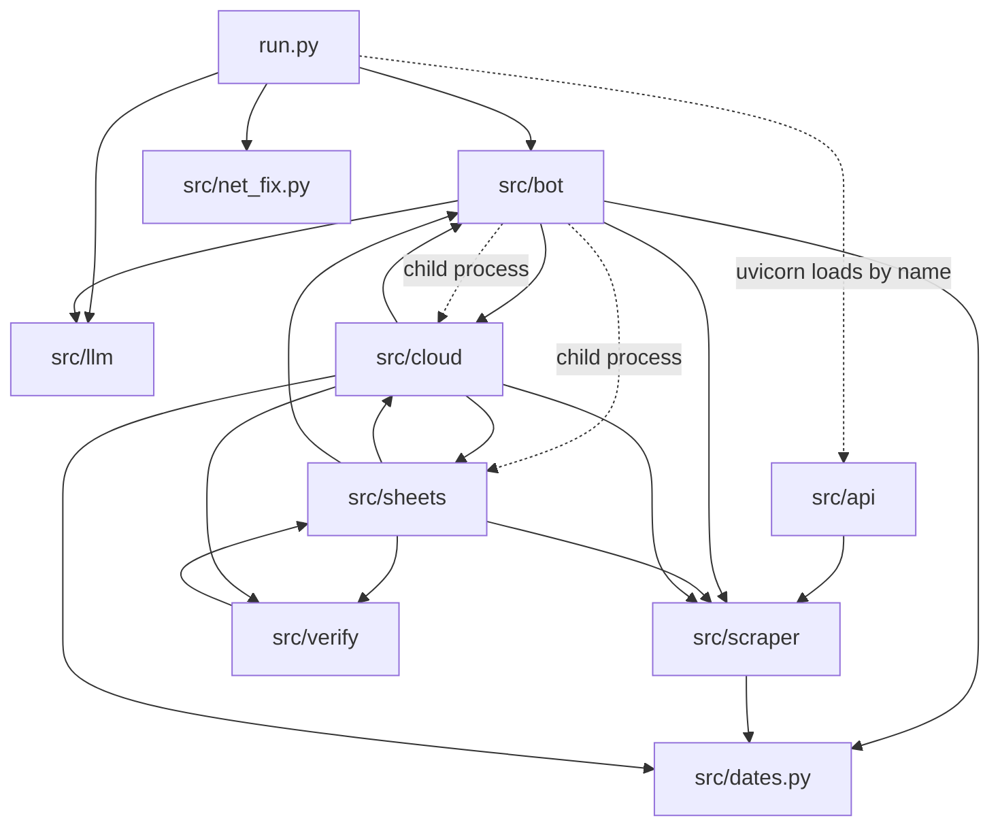
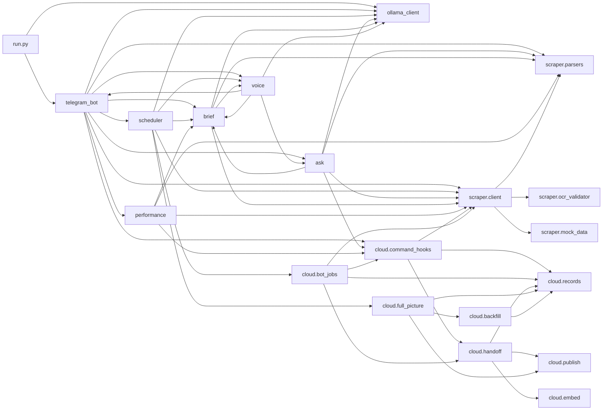
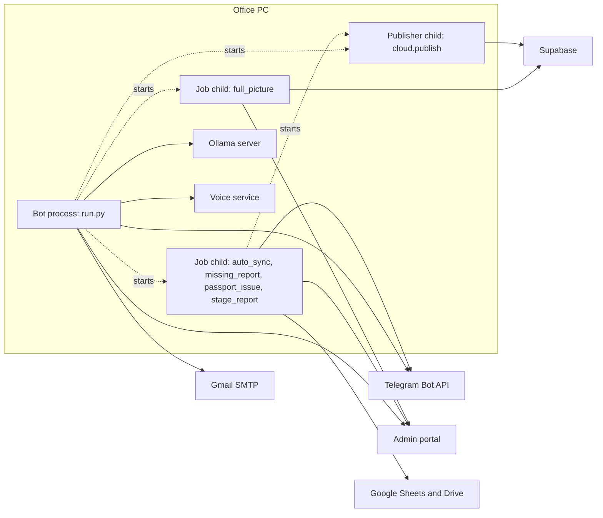

# Codebase guide

How the code of the Hangeul bot is put together: the layers, the processes that run, eight flows traced hop by hop, the rules the code follows everywhere, the state it keeps, how it runs things at the same time, the tests, where to make a change, and a glossary.

How to read this document:

- Code is cited as `path:line`. Paths are relative to the repository root. Line numbers are those of the published commit.
- A bare `:N` means line N of the file cited just before it. Example: in "`src/dates.py:149`, `:245`" both lines are in `src/dates.py`.
- "The portal" is the agency's admin website. Its address is the setting `HANGEUL_BASE_URL` (default `https://hangeul.com.bd/admin`, `src/config.py:24`).
- "The bot folder" is the folder that holds `run.py` and `.env` (`BOT_ROOT`, `src/config.py:6`).
- Settings are named, never shown. Their values live in `.env`, which is not in the repository.
- Where a behaviour belongs to a library and not to this code, the text says "library behaviour".

Related documents: [PROJECT_STRUCTURE.md](PROJECT_STRUCTURE.md) (what each folder holds), [SITE_MAP.md](SITE_MAP.md) (every portal page, command, job and table), [DATA_FLOW.md](DATA_FLOW.md) (what data moves where), [BUILD_AND_RUN.md](BUILD_AND_RUN.md) (install and start), [PYTHON_PROGRAMS.md](PYTHON_PROGRAMS.md) (one entry per Python file, with the detail pages under [programs/](programs/)), [JEANNIE_APP.md](JEANNIE_APP.md) (the phone app that reads what the bot publishes). The older long reference is in [reference/](reference/00_INDEX.md); where it and this guide differ, the code decides.

Contents:

1. [Layers](#1-layers)
2. [Processes at run time](#2-processes-at-run-time)
3. [Eight flows, end to end](#3-eight-flows-end-to-end)
4. [Rules the code follows everywhere](#4-rules-the-code-follows-everywhere)
5. [State](#5-state)
6. [Concurrency](#6-concurrency)
7. [Tests](#7-tests)
8. [Where to make a change](#8-where-to-make-a-change)
9. [Glossary](#9-glossary)

---

## 1. Layers

### 1.1 What each layer owns

| Layer | Files (lines) | Owns | Does not do |
|---|---|---|---|
| Entry point | [`run.py`](../run.py) (110) | Starts everything in one process: log files, the Telegram DNS fix, the Ollama check, the Telegram application, long polling, the REST server. `asyncio.run(start_all())` at `run.py:107`. | No business logic. |
| Package setup | [`src/__init__.py`](../src/__init__.py) (79), [`src/config.py`](../src/config.py) (147), [`src/net_fix.py`](../src/net_fix.py) (105), [`src/dates.py`](../src/dates.py) (259) | Runs on first import of anything under `src`: trusts the Windows certificate bundle when `data/windows-ca.pem` exists (`src/__init__.py:18-22`) and installs the log filter that redacts secrets (`:41-79`). `config.py` loads `.env` into the `settings` object (`src/config.py:141-147`). `net_fix.py` points `api.telegram.org` at a reachable address inside the process when the normal DNS answer is dead. `dates.py` is the one strict date reader. | `net_fix.py` reads its two switches, `TELEGRAM_DNS_FIX` and `TELEGRAM_API_IP`, with `os.environ.get` (`src/net_fix.py:77`, `:81`), so they must be set as Windows environment variables. A value written in `.env` has no effect: pydantic-settings reads `.env` into `settings` only and does not copy it into `os.environ`. The module's own docstring says to put them in `.env` (`src/net_fix.py:11-12`); that is wrong, and `.env.example:136-141` says so. |
| Telegram layer | [`src/bot/telegram_bot.py`](../src/bot/telegram_bot.py) (2437), [`src/bot/replies.py`](../src/bot/replies.py) (165) | Who may use the bot (`is_authorized`, `src/bot/telegram_bot.py:22-37`), every command, button and text handler, the `/sendmail` conversation, the passport cross-check, the command menu, the handler registration (`:2367-2437`). `replies.py` splits long text and builds the two stock error replies. | It does not parse HTML and does not call Google or Supabase itself. |
| Answers and reports | [`src/bot/ask.py`](../src/bot/ask.py) (1411), [`src/bot/brief.py`](../src/bot/brief.py) (687), [`src/bot/performance.py`](../src/bot/performance.py) (303) | `ask.classify` turns plain words into a route (`src/bot/ask.py:529`) and `ask.reply` builds the answers that have no command (`:1065`). `brief.py` composes the daily brief in code and checks the one or two sentences the language model may add (`src/bot/brief.py:365`, `:527`). `performance.py` formats the portal's Consultant Performance page. | `classify` never reads the portal. |
| Scheduler | [`src/bot/scheduler.py`](../src/bot/scheduler.py) (515) | The one `AsyncIOScheduler` (`src/bot/scheduler.py:24`), the seven jobs (`setup_scheduler`, `:419-514`), the passport watcher and its memory file, the brief job, the model warm-up, and the helper that runs a module as a child process (`_run_module`, `:392`). | It does not run sheet or document work in the bot process. |
| Portal client and parsers | [`src/scraper/client.py`](../src/scraper/client.py) (778), [`src/scraper/parsers.py`](../src/scraper/parsers.py) (1351), [`src/scraper/mock_data.py`](../src/scraper/mock_data.py) (209) | The only code that talks to the portal: login, session, every page read (`portal_get`, `src/scraper/client.py:314`), the passport scan download. `parsers.py` turns each page's HTML into dicts by header names and CSS classes, after undoing Cloudflare's e-mail hiding (`decode_cf_emails`, `src/scraper/parsers.py:64`). The shared instance is `admin_client` (`src/scraper/client.py:778`). | It never writes to the portal. The one POST is the login (`src/scraper/client.py:184`). |
| Passport OCR | [`src/scraper/ocr_validator.py`](../src/scraper/ocr_validator.py) (897) | Reads a passport scan with EasyOCR on the CPU (`src/scraper/ocr_validator.py:79`), finds the machine-readable zone, checks its check digits and compares seven fields with the portal's values (`validate_passport_data`, `:739`). | No network. No settings. |
| Sheets | [`src/sheets/`](../src/sheets/): `progress_builder.py` (595), `auto_sync.py` (493), `verified_docs.py` (437), `missing_report.py` (358), `stage_report.py` (270), `passport_issue.py` (145), `attendance.py` (111) | Google Sheets and Drive, the 15-minute portal sync, the document download, the missing-information report, the stage report, the passport issue-date cache. The bot starts four of them as child processes with `python -m`: `auto_sync`, `missing_report`, `passport_issue`, `stage_report` (`src/bot/scheduler.py:347`, `:354`, `:360`; `src/bot/telegram_bot.py:2205`, `:2271`, `:2304`). `progress_builder` and `verified_docs` run inside the `auto_sync` child (`src/sheets/auto_sync.py:236`, `:281`). Every module has a `__main__` block, so each can also be run by hand; `build_sheets.bat:12` runs `progress_builder --all`. | Not imported by any file in `src/bot` (see 1.2). `attendance.py` is not called by anything and nothing starts it. |
| Document verification | [`src/verify/`](../src/verify/): `rules.py` (134), `doc_verifier.py` (1241), `page_checks.py` (452), `field_check.py` (302), `auto_verify.py` (609) | Checks each downloaded student folder (under `DOCS_ROOT` and, for older downloads, `KONYANG_ROOT`; `src/verify/doc_verifier.py:40`) against the document guideline and against the portal's fields; keeps the results store and writes two Excel reports. Runs inside the portal-sync process. | No portal call of its own; it uses the CSV export through `progress_builder`. |
| Cloud publish | [`src/cloud/`](../src/cloud/): `records.py` (1491), `publish.py` (938), `backfill.py` (684), `sheet_hooks.py` (470), `command_hooks.py` (357), `bot_jobs.py` (309), `embed.py` (298), `full_picture.py` (204), `handoff.py` (144), `student_index.py` (132), `__init__.py` (24) | Copies what the bot read to Supabase as rows, text and embeddings. `records.py` builds records, the three hook modules collect what a command or job read, `handoff.py` writes a file and starts the publisher, `publish.py` sends only what changed. | Off unless three settings are set (`src/cloud/publish.py:103-107`). It never changes what Telegram, Sheets or Drive receive. |
| Language-model client | [`src/llm/ollama_client.py`](../src/llm/ollama_client.py) (274), [`src/llm/prompts.py`](../src/llm/prompts.py) (20) | The only code that talks to the local Ollama server. One model (`OLLAMA_MODEL`), one option set for every call (`options`, `src/llm/ollama_client.py:71-76`). The shared instance is `ollama_client` (`:274`). | It holds one prompt only (the fact picker). The other prompts live with their callers. |
| Voice path | [`src/bot/voice.py`](../src/bot/voice.py) (1877), [`extras/jennie_voice/service.py`](../extras/jennie_voice/service.py) (1309) | `voice.py` is the bot side: voice note in, transcript, routing, the same command as when typed, one spoken sentence out. `service.py` is a separate local HTTP service for speech-to-text and text-to-speech. | `voice.py` reads no portal page itself. The service has no language model. |
| REST API | [`src/api/main.py`](../src/api/main.py) (69), `src/api/routes/` (`auth.py` 27, `dashboard.py` 16, `applications.py` 26, `crawler.py` 12), `src/api/schemas.py` (76) | A FastAPI wrapper around `admin_client`, served by uvicorn in the bot process (`run.py:79-85`). Nine routes under `/api` plus `/` and `/healthz` (`src/api/main.py:42-69`). | No authentication on any route. Nothing in `src/bot` uses it. |
| Root scripts and launchers | `bootstrap.py`, `audit_program.py`, `compress_docs.py`, `download_passports.py`, `get_consultations.py`, `inspect_passports.py`, `test_system.py`, `test_verified.py`; `start.bat`, `start_background.vbs`, `stop.bat`, `watchdog.ps1`, `install_*.bat`, `check_status.bat`, `apply_bot_update.bat`, `build_sheets.bat`, `gauth.bat`, `run_passport_audit.bat`, `tools/export_windows_ca.ps1` | One-off tools run by hand and the Windows launchers. See [programs/api_scripts_launchers.md](programs/api_scripts_launchers.md). | Not part of the running bot. |

Three files at the root are byte-identical copies of files under `src/`: `telegram_bot.py`, `config.py`, `progress_builder.py`. Nothing imports them. `apply_bot_update.bat` and `install_sheets.bat` copy them over the `src/` files. A test fails when a pair differs (`tests/test_cloud.py:1126`). Edit both copies or neither.

### 1.2 Package dependencies

The diagram is built from the `import` statements in `src/` and `run.py`. A solid arrow is an import. A dotted arrow is a start of another process or a load by name. Every package also imports `src/config.py`; those arrows are left out.

The less obvious arrows, with the line that makes each one:

| Arrow | What is imported | Where |
|---|---|---|
| `sheets` to `bot` | only `src.bot.replies.split_text` | `src/sheets/auto_sync.py:340`, `src/sheets/missing_report.py:251` |
| `sheets` to `verify` | `auto_verify` (the document check runs inside the sync) | `src/sheets/auto_sync.py:320` |
| `sheets` to `cloud` | `sheet_hooks` (the last step of each sheet job) | `src/sheets/auto_sync.py:422`, `src/sheets/missing_report.py:285`, `src/sheets/stage_report.py:257`, `src/sheets/passport_issue.py:115` |
| `verify` to `sheets` | `progress_builder` (the CSV export and the sheet layout), `passport_issue` (the issue-date cache) | `src/verify/doc_verifier.py:1121`, `src/verify/field_check.py:28`, `src/verify/auto_verify.py:128` |
| `cloud` to `bot` | `ask.dashboard_facts`, `ask.calendar_items` (reused as parsers), `performance._range_dates` | `src/cloud/backfill.py:268`, `:283`, `src/cloud/records.py:816` |
| `cloud` to `sheets` | `passport_issue.passport_key`, `progress_builder`, `auto_sync._row_key`, `verified_docs.fetch_verified_students`, `stage_report.read_progress` | `src/cloud/records.py:184`, `:641-642`, `src/cloud/backfill.py:127`, `:138` |
| `cloud` to `verify` | `auto_verify.TEXT_DIR`, `doc_verifier.student_folders` | `src/cloud/sheet_hooks.py:250`, `:303` |
| `run.py` to `api` | the string `"src.api.main:app"` given to uvicorn | `run.py:79-80` |

Facts that follow from the imports:

- No file under `src/bot` imports `src/sheets` or `src/verify`. The bot runs their work only by starting `python -m src.sheets.<name>` (`src/bot/scheduler.py:347`, `:354`, `:360`; `src/bot/telegram_bot.py:2205`, `:2271`, `:2304`).
- With publishing on, the bot process still loads two sheet modules as helpers, through the cloud layer: `src/cloud/records.py:184` imports `passport_issue.passport_key`, and `passport_issue` imports `progress_builder` (`src/sheets/passport_issue.py:30`). The Google libraries are imported only inside `_load_credentials` and `_services` (`src/sheets/progress_builder.py:355-389`), which this path does not call. One more path loads sheet modules: before the hourly full-picture child is started, `backfill.quiet_reason` imports `auto_sync._pid_alive` when `data/auto_sync.lock` exists and is younger than 2 hours (`src/cloud/backfill.py:74-77`). That import also loads `verified_docs` (`src/sheets/auto_sync.py:38-39`).
- Nothing under `src/api` imports `src/bot`, and nothing under `src/bot` imports `src/api`.
- `src/scraper` imports only `src/config.py` and `src/dates.py` from the rest of the project (`src/scraper/client.py:10-39`).
- `src/llm` imports only `src/config.py` (`src/llm/ollama_client.py:8-9`).

### 1.3 Modules inside the bot process

The modules of `src/bot`, `src/llm` and `src/scraper`, and the cloud modules the bot process loads. Left out to keep the picture readable: the arrows to `src/config.py`; to `src/dates.py` (imported by every module of `src/bot` except `scheduler`); and to `replies` (imported by every other module of `src/bot`).

`scheduler` imports `cloud.full_picture` only for `skip_reason`, the check made before the hourly child is started (`src/bot/scheduler.py:381`). That import also loads `backfill`, `publish` and `records`, which `full_picture` imports at the top of the file (`src/cloud/full_picture.py:51`). `handoff` imports `records` when it writes a file (`src/cloud/handoff.py:72`) and `embed.NO_GPU` when it starts the publisher (`:97`); `embed` loads no model at import (its top-level imports are standard-library modules, `src/cloud/embed.py:23-30`). While publishing is off, `run_full_picture` returns before it imports `full_picture` (`src/bot/scheduler.py:379-381`).

The graph has cycles. They work because one side imports inside a function, not at the top of the file:

| Cycle | Top-level import | Function-level import |
|---|---|---|
| `telegram_bot` and `voice` | none | `src/bot/telegram_bot.py:2431` imports the voice handler; `src/bot/voice.py:649` and `:1720` import `telegram_bot` |
| `brief` and `voice` | none | `src/bot/brief.py:416`, `:424`, `:524` import number helpers from `voice`; `src/bot/voice.py:1136`, `:1309` import `brief.claims_problem` |
| `telegram_bot`, `scheduler`, `brief` | `src/bot/telegram_bot.py:18` imports `setup_scheduler`; `src/bot/scheduler.py:15` imports `compose_brief`, `compose_daily_brief`, `_send_brief` | `src/bot/telegram_bot.py:175` imports the brief functions back from `scheduler` for `/brief` |
| `cloud.handoff` and `cloud.publish` | `src/cloud/handoff.py:41` imports `CHILD_TIMEOUT`, `CLOUD_DIR`, `enabled` from `publish` | `src/cloud/publish.py:662` imports `handoff` |
| `sheets.auto_sync` and `cloud.records` | none | `src/sheets/auto_sync.py:422` imports `sheet_hooks`; `src/cloud/records.py:642` imports `auto_sync._row_key` |

---

## 2. Processes at run time

### 2.1 The picture

### 2.2 The bot process and its event loop

One Python process runs `run.py`. `start.bat:12` starts it with the virtual environment's `python.exe` (a console window). `start_background.vbs:13` starts it with `pythonw.exe` (no window). `watchdog.ps1` starts the hidden form when no `run.py` process is found; `install_watchdog.bat:14` registers it as a Windows task every 5 minutes.

Start-up order (`run.py`):

1. If the process has no console (`pythonw.exe`), standard output and error are opened as `hangeul_stdout.log` and `hangeul_stderr.log` (`run.py:8-22`).
2. Importing `src.config` runs `src/__init__.py` first: the certificate bundle and the log filter.
3. Logging goes to `hangeul_bot.log` and to standard output at level INFO (`run.py:37-45`).
4. `asyncio.run(start_all())` creates the one event loop (`run.py:107`).
5. `apply_telegram_dns_fix()` (`run.py:71`) and the Ollama health check (`run.py:76`).
6. `build_telegram_application()` (`run.py:88`) registers 42 command names, 3 button handlers and the text handler, adds the voice handler when `JENNIE_VOICE_ENABLED` is true, and calls `setup_scheduler(app)` (`src/bot/telegram_bot.py:2374-2437`). It returns `None` when `TELEGRAM_BOT_TOKEN` is empty or still the placeholder (`:2369-2372`); then only the REST API runs and there is no scheduler.
7. `async with telegram_app:` then `start()`, `post_init()`, `updater.start_polling()` (`run.py:92-95`). The bot uses long polling, not a webhook.
8. `await server.serve()` (`run.py:97`). The REST server keeps the process alive. When it returns, the updater and the application are stopped (`run.py:98-100`).

`post_init` (`src/bot/telegram_bot.py:2314`) sets the 13-entry command menu (`:2316-2332`), pins the command sheet in the admin chat (`:2338-2353`), and starts one background task: load the model when it is pinned, or unload it when it is not (`:2359-2365`). `run.py:94` calls `post_init` by hand. The builder also registers it (`src/bot/telegram_bot.py:2374`), but the library does not call it on this path. With the pinned `python-telegram-bot==22.8` (`requirements.txt:28`), `Application.initialize()` (run by `async with`) and `start()` do not call `post_init`; only `run_polling()` and `run_webhook()` do (library behaviour, stated in the docstring of `Application.initialize`). `run.py` uses neither, so `post_init` runs exactly once, from `run.py:94`.

What shares the one event loop:

| Tenant | Where it starts | Note |
|---|---|---|
| Telegram handlers | `src/bot/telegram_bot.py:2377-2432` | The application is built without `concurrent_updates` (`:2374`), so updates are handled one after another: the builder's default in python-telegram-bot 22.8 is one update at a time (library behaviour). Only the voice handler is registered with `block=False` (`:2432`). |
| Long polling | `run.py:95` | |
| REST server (uvicorn, FastAPI) | `run.py:79-85`, `:97` | Listens on `API_HOST`:`API_PORT` (defaults `0.0.0.0` and `8000`, `src/config.py:79-80`). |
| Scheduler jobs | `src/bot/scheduler.py:511` | `scheduler.start()` runs inside `start_all()`, so the loop is already running. Jobs are coroutines on the same loop. |
| Background tasks | `src/bot/telegram_bot.py:2362`, `:2365`; `src/bot/voice.py:1672-1676`; `src/cloud/command_hooks.py:157` | Model warm-up or release, filler clips, the Supabase handoff. |

### 2.3 The scheduler

`setup_scheduler` returns before adding any job when `ENABLE_SCHEDULED_REPORTS` is false (`src/bot/scheduler.py:421-423`). Every job is added with `replace_existing=True`, `max_instances=1`, `coalesce=True`. Cron times are in `REPORT_TIMEZONE` (default `Asia/Dhaka`, `:433`).

| Job id | Trigger | Function | Runs as | Lines |
|---|---|---|---|---|
| `daily_executive_briefing` | Cron at `DAILY_REPORT_TIME` (default `18:05`; unreadable value falls back to 18:05), `misfire_grace_time=600` | `send_daily_briefing` | coroutine in the bot | `:426-444` |
| `passport_upload_watcher` | every 30 minutes | `check_new_passport_uploads` | coroutine in the bot; OCR in a worker thread | `:448-456` |
| `portal_sync` | every 15 minutes | `run_portal_sync` | child process `src.sheets.auto_sync` | `:459-466` |
| `missing_info_report` | Cron 09:05, `misfire_grace_time=3600` | `run_missing_report` | child process `src.sheets.missing_report` | `:469-477` |
| `passport_issue_refresh` | Cron 08:30, `misfire_grace_time=3600` | `run_issue_date_refresh` | child process `src.sheets.passport_issue --refresh` | `:480-488` |
| `brain_keep_warm` | every 10 minutes | `keep_brain_warm` | coroutine; returns at once unless the model is pinned (`:324-326`) | `:491-498` |
| `cloud_full_picture` | every 60 minutes, first run 7.5 minutes after start (`:365-366`) | `run_full_picture` | child process `src.cloud.full_picture`; nothing while publishing is off (`:379-380`) | `:501-509` |

Only the brief's time is a setting. The other times and intervals are literals in `setup_scheduler`. The interval jobs without a `start_date` first fire one interval after the scheduler starts: in the pinned `apscheduler==3.11.3` (`requirements.txt:29`) an interval trigger's start defaults to now plus the interval (library behaviour; the code sets no first-run time for them). Only the three cron jobs set `misfire_grace_time`; the interval jobs keep the library default of 1 second (see 6.1 for what that means when the loop is blocked).

### 2.4 Child processes

The bot never runs sheet work, document checks or Supabase uploads inside itself. It starts another Python process.

| Module started | Started by | How | Time limit | Output goes to |
|---|---|---|---|---|
| `src.sheets.auto_sync` | `run_portal_sync` (`src/bot/scheduler.py:344`) | `_run_module` (`:392-416`): `asyncio.create_subprocess_exec(<python>, "-m", ...)`, working folder = bot folder, environment plus `PYTHONIOENCODING=utf-8`, no console window (`creationflags=0x08000000`), `pythonw.exe` swapped for `python.exe` (`:397-399`) | 3600 s, then `proc.kill()` (`:409-413`) | appended to `hangeul_sync.log` (`:401-405`) |
| `src.sheets.passport_issue --refresh` | `run_issue_date_refresh` (`:350`) | same | 3600 s | `hangeul_sync.log` |
| `src.sheets.missing_report` | `run_missing_report` (`:357`) | same | 3600 s | `hangeul_sync.log` |
| `src.cloud.full_picture` | `run_full_picture` (`:369`), only after `handoff.enabled()` and `skip_reason()` allow it (`:378-388`) | same | 3600 s from the scheduler; the process also stops itself after 45 minutes (`DEADLINE`, `src/cloud/full_picture.py:58`, `:164-174`) | `hangeul_sync.log` |
| `src.sheets.missing_report --program <KEY>` | the `/missing` program button (`src/bot/telegram_bot.py:2205`) | `_run_report_module` (`:2215-2240`): same start, but standard output and error are pipes | 180 s (`asyncio.wait_for(proc.communicate(), timeout=180)`, `:2232`). On a timeout the function logs and returns `None`; it has no `kill()` call of its own. The child does not keep running for long, though: once `proc` goes out of scope, CPython's asyncio subprocess transport is closed or garbage-collected, and closing it kills a child that has not exited (library behaviour, `asyncio/base_subprocess.py`, `close` and `__del__`, Python 3.12). The code does not control exactly when that happens. | its standard output is the Telegram reply |
| `src.sheets.stage_report --program <KEY>` and `... --intake <INTAKE>` | the `/stage` buttons (`:2271`, `:2304`) | same | 180 s | the first prints JSON (the intake list), the second prints the report |
| `src.cloud.publish --from <file> --timeout 3600` | `handoff.spawn` (`src/cloud/handoff.py:109-115`), called from the bot and from the sheet job children | `subprocess.Popen`, not awaited: standard input closed, output appended to `hangeul_sync.log`, no window, environment plus `CUDA_VISIBLE_DEVICES=-1`, `HF_HUB_OFFLINE=1`, `PYTHONIOENCODING=utf-8` (`:93-106`) | the publisher stops itself after `CHILD_TIMEOUT` = 3600 s with exit code 3 (`src/cloud/publish.py:94`, `:895-908`) | `hangeul_sync.log` |

A job child logs in to the portal with a session of its own. The session is only the cookie jar of an `httpx.AsyncClient` in memory (`src/scraper/client.py:113-119`); nothing is saved between processes.

### 2.5 The voice service and Ollama

Neither is started by the bot. Each is a separate program on the same PC. The bot keeps working when either is down. Without Ollama the brief goes out with no summary, an unrouted question is answered by label match only, a `/sendmail` draft comes from a template, and a voice note is routed by the typed-question router. Without the voice service a voice note gets one short note asking the sender to type instead (`src/bot/voice.py:1760-1769`).

| Service | Address | What the bot asks of it | Code |
|---|---|---|---|
| Ollama | `OLLAMA_BASE_URL` (default `http://127.0.0.1:11434`, `src/config.py:31`) | `GET /api/tags` (health), `POST /api/chat`, `POST /api/generate`, `GET /api/ps` (is the model loaded, and wholly on the GPU) | `src/llm/ollama_client.py:103-208` |
| Voice service | `JENNIE_VOICE_URL` (default `http://127.0.0.1:8765`, `src/config.py:70`). The bot refuses any host other than `127.0.0.1`, `localhost` or `::1` (`src/bot/voice.py:125-131`). | `POST /stt` (speech to text), `POST /tts` (text to speech) | `src/bot/voice.py:163-199`. The service itself listens on `127.0.0.1:8765` (`extras/jennie_voice/service.py:49-50`) with one worker (`:1302`). |

The model stays loaded only when it is "pinned": `JENNIE_VOICE_ENABLED` or `BRAIN_ALWAYS_LOADED` is true (`brain_pinned`, `src/llm/ollama_client.py:37-39`). Every call then sends `keep_alive: -1`; otherwise it sends `BRAIN_IDLE_UNLOAD` (default `5m`) (`:42-44`). When pinned, `warm_brain` loads the model at start, up to 3 attempts 30 s apart, and unloads a copy that landed partly on the CPU before trying again (`src/bot/scheduler.py:280-314`).

### 2.6 What runs on the GPU and what on the CPU

| Work | Device | Process | Evidence |
|---|---|---|---|
| The language model (`OLLAMA_MODEL`, default `qwen3:4b-instruct`) | GPU, managed by Ollama. The bot only checks that the model's VRAM size equals its full size. | Ollama | `src/config.py:32`, `src/llm/ollama_client.py:172-185` |
| Speech-to-text (faster-whisper `large-v3-turbo`) | GPU when at least 3.0 GB of VRAM is free at request time; otherwise the CPU model `medium` | voice service | `extras/jennie_voice/service.py:95-97`, `:933-944` |
| Text-to-speech (CosyVoice2) | GPU when 3.8 GB is free (1.2 GB when the model is already there); otherwise the CPU | voice service | `extras/jennie_voice/service.py:61-62`, `:1055-1063` |
| Passport OCR (cross-check and watcher) | CPU: `easyocr.Reader(['en'], gpu=False)` | bot process, worker thread | `src/scraper/ocr_validator.py:79`, `src/scraper/client.py:711` |
| Document-check OCR | GPU when PyTorch sees one: `gpu=torch.cuda.is_available()` | the `auto_sync` child | `src/verify/doc_verifier.py:60` |
| Embeddings (gte-small, 384 numbers) | CPU only. The process hides the GPU before PyTorch can be imported. | publisher, full picture, backfill | `src/cloud/publish.py:60-61`, `src/cloud/embed.py:60-73`, `:221-222` |
| HTML parsing, record building, Excel, PDF work | CPU | where it is called | |

---

## 3. Eight flows, end to end

### 3.1 A slash command: `/verified_date <date>`

1. Long polling delivers the update (`run.py:95`). `CommandHandler("verified_date", verified_date_command)` matches (`src/bot/telegram_bot.py:2380`). The aliases `/verified` and `/verified_students` go straight to `verified_command` (`:2414-2415`); `/verified_today` sets the date to `today` first (`:650-655`).
2. `verified_date_command` (`:657`) checks the sender (`is_authorized`, `:22-37`; an unlisted chat gets no reply here, `:659-660`). With no argument it stores `awaiting_date_for = "verified"`, asks "which date?" and returns (`:668-677`). The next plain message is then read as the answer (step 5 of flow 3.2).
3. With an argument it stores the words as `override_date` and calls `verified_command` (`:679-680`).
4. `verified_command` (`:858`) takes the words (`:874-882`) and reads the date with `normalize_date_input(raw_input, strict=strict)` (`:884`, defined at `:88`). `strict` is true here, because the words arrived as `override_date`; only words routed from a free-text question (`override_text`) turn it off (`:874-876`). In strict mode a text that is not a date gives `None`. The bot then re-opens the date question when the words were an answer to it (`_ask_date_again`, `:595`), replies with the date error and stops (`:885-889`). It never falls back to today. The date reader is `parse_user_date` (`src/dates.py:149`); the error text is `date_error_reply` (`src/bot/replies.py:147`).
5. The portal prints verification times without a year. `yearless_day_problem` (`src/dates.py:245`) is asked next (`src/bot/telegram_bot.py:894`): a future day, or a day a year or more back, gets "not available" with the reason (`:895-899`).
6. The bot sends a "please wait" message (`:903`).
7. `admin_client.get_verified_students(target_date=day)` (`:905`) calls `read_verified_students(..., all_pages=True)` (`src/scraper/client.py:547-551`, `:522`), which calls `read_students` (`:501`), which calls `read_student_pages` (`:454`).
8. `read_student_pages` reads `students.php`, then `students.php?pg=2` to `pg=N` following the page's own "Page 1 of N" text (`:471-473`). Each GET goes through `fetch_html` (`:339`) and `portal_get` (`:314`): log in when there is no session (`:325`), one fresh login and one repeat when the answer ended on `login.php` (`:328-334`), `PortalUnavailable` on HTTP 400 or above (`:335-336`), on a timeout or on a refused connection (`:303-312`). It raises when the list cannot be read whole: no table, a full page with no pager, more than 40 pages, fewer students than the pager counts (`:474-498`).
9. Each page is parsed in a worker thread by `parse_students_page` (`src/scraper/parsers.py:413`), called at `src/scraper/client.py:512`. Students are kept once, by portal id (`:515-519`).
10. Two layout guards: student rows but no "Payment verified by" line on any of them, or a line whose date cannot be read, raise `PortalUnavailable` (`:537-544`).
11. `verified_on_day(students, day)` (`:545`) keeps the students whose own stamp is on the day. It is defined at `src/scraper/parsers.py:862` and uses `verification` (`:814`); the day rule is `stamp_on_day` (`src/dates.py:230`).
12. `cloud.seen(reads, verified=(day, verified_list))` keeps the read for Supabase (`src/bot/telegram_bot.py:906`, `src/cloud/command_hooks.py:93`). It does nothing while publishing is off.
13. `format_verified_students_report` (`src/bot/telegram_bot.py:907`, defined at `:798`) counts the students and sums the amounts in Python (`:809-833`) and writes one block per student (`:842-854`).
14. Any exception in steps 7 to 13 becomes the reply "Couldn't read the portal: ..." (`:908-910`), built by `portal_error_reply` (`src/bot/replies.py:159`). It is never reported as "no payments".
15. `reply_long(update.message, report_text, edit=status_msg)` (`src/bot/telegram_bot.py:911`) splits the text into pieces of at most 3900 characters and turns the waiting message into the first piece (`src/bot/replies.py:122`, `:102`, `:55`).
16. `cloud.publish(reads)` (`src/bot/telegram_bot.py:912`) hands the read to the publisher without waiting (flow 3.8).

### 3.2 A free-text question

1. Every text message that is not a command reaches `handle_natural_language_message` (`src/bot/telegram_bot.py:2426`, defined at `:1973`).
2. Unlisted chats get no reply (`:1989-1990`).
3. The text is `update.message.text`; a voice note passes its English words as `query` instead (`:1992-1994`).
4. If a `/sendmail` conversation is open in this chat, the message belongs to it (`:1997-1999`, `_handle_email_flow` at `:1354`).
5. If a command asked "which date?" earlier, `awaiting_date_for` is popped and the matching command runs with the text as its date (`:2004-2016`). `DATE_PROMPT_KEY` tells the command that the words answer its own question (`:592`, `:2011`).
6. `ask.classify(query, today)` (`:2021`) returns a `Route` (`src/bot/ask.py:529`, `:370-376`): a `kind`, and where it applies a `day`, a `window` (a span of days), a `topic`, `words`, or a `problem` (why a date-like part cannot be read). It matches whole words with regular expressions and reads dates with the strict parser. It reads nothing from the portal. The kinds are tried in a fixed order; the first match wins (`:563-652`).
7. The handler dispatches on `route.kind` (`src/bot/telegram_bot.py:2028-2161`):

   | Kind | What runs | Lines |
   |---|---|---|
   | `hello` | the fixed greeting `ask.HELLO` | `:2028-2030` |
   | `pin` | `pin_command` | `:2031-2033` |
   | `performance` | `performance_month_command`, `performance_today_command`, or the fixed "what the commands cover" reply | `:2036-2043` |
   | a one-day kind (`inquiries`, `verified`, `passports`) asked for a span of days | passports: the range cross-check; the others: ask which day | `:2047-2055` |
   | `inquiries` | `inquiries_today_command` or `inquiries_date_command` | `:2059-2070` |
   | `crosscheck` | range, today, a date, or a student | `:2073-2103` |
   | `passports` | the live cross-check for the day | `:2106-2115` |
   | `verified` | `verified_today_command`, `verified_date_command` or `verified_command` | `:2119-2130` |
   | `admitted` | `admitted_command` with the leftover words as the search | `:2134-2143` |
   | `missing`, `stage`, `calendar`, `report`, `stats` | the command of the same name | `:2145-2161` |

   How the words reach the command differs by kind:

   - `calendar` and `report` put the whole question in `context.user_data["override_text"]` (`:2152`, `:2156`). The dated branches of `inquiries`, `crosscheck`, `passports` and `verified` put the question, the day, or a "first to last" range there (for example `:2061`, `:2068`, `:2077`, `:2123`).
   - `admitted` removes the question words and puts what is left in `context.user_data["override_query"]` (`:2135-2141`).
   - `missing`, `stage`, `stats`, `pin` and `performance`, and the "today" branches (for example `verified_today_command`, `:2121`), call the command with no words.

   From here the flow is the same as for the typed command.
8. Every other kind (`pending`, `window_review`, `dashboard`, `intake`, `applied`, `unknown`) goes to `ask.reply(update.message, route, query)` (`:2170`). An `applied` question with an unreadable date gets the date error first (`:2166-2169`).
9. `ask.reply` (`src/bot/ask.py:1065`) sends "Reading the live portal..." (`:1073`) and calls one answer function by kind (`:1075-1086`).
10. Example, kind `pending` ("show pending payments"): `answer_pending` (`:882`) reads every page of `students.php?status=pending` (`:892`), reads the portal's own badge from the first page (`:893`), parses each page in a worker thread (`:897`), keeps the read for Supabase (`:907`), counts in Python the rows whose own Payment column says Pending (`:908`), lists up to 30 names (`MAX_NAMES_LISTED`, `:41`, `:911`), and adds a warning line when the badge and the count differ (`:929-930`). The page reader is `read_student_pages` (`src/scraper/client.py:454`); the badge parser is `parse_pending_payments` (`src/scraper/parsers.py:890`).
11. Example, kind `unknown`: `answer_unknown` (`src/bot/ask.py:1038`) reads the dashboard (`_dashboard`, `:770-776`: `index.php`, 30 s), keeps the facts that have a number as one line each (`:1051`), first picks the facts whose whole label the question names, without the model (`:1052`), and only when none matches asks the model to pick fact numbers (`:1055`). The reply shows the picked facts word for word (`:1057-1062`). With no pick the reply is the fixed "I can't answer that from the portal yet" text (`:1059-1060`, `cant_answer` at `:753`). The two pickers are `_answer_query_fallback` (`src/llm/ollama_client.py:250`) and `answer_agent_query` (`:214`).
12. An exception becomes the portal error reply (`src/bot/ask.py:1087-1090`).
13. `reply_long(message, text, edit=status)` (`:1091`), then `cloud.publish(reads)` (`:1092`).

### 3.3 A voice note

The handler exists only when `JENNIE_VOICE_ENABLED` is true (`src/bot/telegram_bot.py:2430-2432`). It is registered with `block=False`, so a voice round trip does not hold up typed commands.

1. `handle_voice_message` (`src/bot/voice.py:1693`) wraps `_answer_voice` (`:1719`). No exception leaves the handler (`:1700-1702`). One log line records chat id, audio seconds, language, what ran and stage timings, never the words (`:1704-1707`).
2. Unlisted chats get nothing: no download, no transcript (`:1726-1729`).
3. A recording over 60 s or over 20 MiB is refused before download (`:1734-1738`; limits at `:73-74`).
4. A filler clip is sent in a background task, in the language of the chat's last voice turn, Korean when there is none (`:1742-1743`, `_send_filler` at `:310`, `last_language` at `:352`). Not while a `/sendmail` conversation is open.
5. The audio is downloaded from Telegram into memory (`:1747-1749`).
6. The bot takes its own turn at the voice service (`_voice_turn`, `:1758`, defined at `:103`) and calls `transcribe` (`:1759`, `:163`): `POST /stt`, 60 s limit (`STT_TIMEOUT`, `:53`). A 503 or a read timeout is "busy"; anything else is "unavailable" (`:147-160`, `:1760-1769`).
7. No words: one note and stop (`:1772-1775`). The language is Korean when the service says `ko` or at least 30 % of the letters are Hangul; any other language is answered in English (`spoken_language`, `:1522-1528`; `:1776-1777`).
8. The text "heard: ..." is sent in the background (`:1781`).
9. If a `/sendmail` conversation is open, the bot says it does not handle e-mail from voice and stops (`:1784-1788`). The check is repeated after routing (`:1797-1800`).
10. `route(heard, turns)` (`:1791`, `:534`) makes one model call with the routing prompt and a JSON schema whose `command` must be one of ten names (`_ROUTER_SYSTEM` `:385`, `_ROUTER_SCHEMA` `:412-421`, the call at `:541-542`, 160 tokens, 30 s). The answer is rejected unless the command is in `ROUTE_COMMANDS` (`:553`). The date the model gives is checked against the words in code (`:558-563`, `_words_date` at `:617`).
11. The chosen command runs on a stand-in for the update that records every text it sends, edits or deletes (`_Capture` `:1533`, `_CapturingUpdate` `:1592`, `:1804-1805`). `_dispatch` (`:1810`, defined at `:644`) calls the same handler functions as typed commands, for example `verified_today_command` (`:693-705`) or `crosscheck_range_command` (`:710-714`).
12. If the model is down, answered nonsense, or the command was not placed, the words go through the typed-question router: `handle_natural_language_message(proxy, context, query=query)` (`:1816-1821`). From here it is flow 3.2.
13. The captured written answer is `capture.text()` (`:1830`). With no answer and no small talk the flow stops (`:1831-1832`).
14. `spoken_reply(heard, reply_language, answer, turns, day=ran_day)` (`:1844`, defined at `:1240`) makes one short sentence:
    - It extracts at most 8 "label: figure" facts from the written answer (`answer_facts`, `:1036`, `:1263`).
    - Korean: the sentence is built in code from the headline fact (`_korean_line`, `:1204`, `:1266-1270`). The model is not asked.
    - English: the model words it (`_say`, `:980`, at most 2 calls) and every figure is checked against the facts by `_fact_problem` (`:1122`), which calls `brief.claims_problem`. When both tries fail, a sentence built in code is used (`_english_line`, `:1225`, `:1281`).
    - A failed portal read is spoken as a fixed line (`:1283-1285`).
    - Small talk (no written answer) is worded by the model in either language, Korean included; the only check is that every number it says is in the question (`:1257-1261`, `_facts_ok` at `:950`). A written answer with no figure is also worded by the model in either language; it may say no number that is not in the question and no word for "none" (`:1286-1292`). Either way, when the model is down or both tries fail, a fixed line is used (`_FALLBACK`, `:832`).
15. For small talk the sentence is also sent as text (`:1845-1846`). The turn is stored in the chat's memory, 6 turns per chat, in RAM only (`_remember`, `:342`, `:1847`; `HISTORY_TURNS`, `:79`).
16. The bot takes its turn again and calls `synthesize(speech, reply_language, "aegyo")` (`:1852-1853`, `:186`): `POST /tts`, 120 s limit. The body must start with `OggS` (`:197-198`).
17. `context.bot.send_voice(...)` sends `jennie.ogg` (`:1855-1856`). Any failure in steps 16 and 17 sends one note; the text answer is already in the chat (`:1858-1860`).
18. Afterwards, missing filler clips are rendered in the background (`:1709`, `_prepare_fillers_later` at `:277`).

### 3.4 The 15-minute portal sync

1. The scheduler fires `portal_sync` (`src/bot/scheduler.py:459-466`). `run_portal_sync` (`:344`) calls `_run_module("src.sheets.auto_sync", "Portal sync")` (`:392`). The bot process only waits for the child to exit.
2. In the child, `main` (`src/sheets/auto_sync.py:483`) calls `run_once(send, verify)` (`:412`). The flags `--no-notify` and `--no-verify` switch off the Telegram messages and the document check (`:486-489`).
3. Lock: if `data/auto_sync.lock` is younger than 2 hours and holds the id of a live process, the run prints "Another sync is still running" and returns (`:413-416`, `_lock_held` at `:72`). Otherwise it writes its own process id (`:417`).
4. If publishing is on, a `cloud` dict is started to collect what this run reads and sends (`:420-427`).
5. `data/sheet_state.json` is loaded (`:429`).
6. Sheets step, up to 3 attempts 20 s apart, each with a fresh portal client (`_with_retries`, `:375`, `:432`): `sync_sheets(state)` (`:231`).
   - The targets are every program and intake that has a direct student (`pb.all_targets()`, `:236`).
   - Per target, a snapshot of its rows is built and each row is hashed (`_snapshot` `:119`, `_digest` `:133`, `:244-245`).
   - New, removed and edited rows are found against the last run (`sheet_changes`, `:199`, `:248`).
   - Unchanged on the portal: the sheet is compared cell by cell and rebuilt if someone edited it by hand (`pb.sheet_drift`, `:252-257`).
   - Changed: the sheet's main tab is rebuilt (`pb.build_target`, `:260`) and summary lines are added (`:261-269`).
   - In `progress_builder`: `all_targets` (`src/sheets/progress_builder.py:282`) reads the portal's CSV export once per process, `GET students.php?export=csv`, 60 s (`:223-240`, cached at `:245-253`). `sheet_drift` is at `:434` and `build_target` at `:462`.
7. The state file is written (`src/sheets/auto_sync.py:439`).
8. Documents step, with the same retry rule (`:441`): `sync_docs` (`:275`) runs `verified_docs.run_local(DOCS_ROOT)` on a new event loop (`:279-283`).
   - Log in, then read every page of `students.php?source=direct&filter_docs=verified` (`src/sheets/verified_docs.py:339-340`, `:38`, `:71`).
   - Skip students whose folder name is flagged complete in Google Drive (`:345`, `:354-356`) and students whose `.download_complete` marker still equals the portal's file list (`:362-372`).
   - For the rest: `GET download_docs.php?uid=<uid>&zip=1` (`_download_zip`, `:208`, `:380`), write each new file through a `.part` file (`:383-392`), shrink files over 2 MB (`:393`, `shrink_large_files` at `:292`), write the marker (`:395-396`).
9. The state file is written again (`src/sheets/auto_sync.py:448`). The summary is printed; in the scheduled run the print goes to `hangeul_sync.log` (`:449-450`).
10. If any line was produced, `notify(lines)` sends "Portal sync — changes found" to every brief recipient with a plain HTTP `sendMessage` call (`:453-455`, `:335-363`). Nothing is sent when nothing changed.
11. The document check runs (flow 3.5) and, when it checked anyone, its lines are sent as a second message titled "Document check" (`:459-472`). A failure here is logged and never fails the sync (`:462-466`).
12. If publishing is on, `sheet_hooks.after_sync(cloud)` hands the export, the document list, the summary and the check results to the publisher (`:475-477`).
13. The lock file is deleted (`:479-480`).
14. Back in the bot, `_run_module` logs the exit code (`src/bot/scheduler.py:414`).

A step that keeps failing is reported in Telegram only from the third failed run in a row (`REPORT_AFTER_FAILURES`, `src/sheets/auto_sync.py:372`, `:390-400`).

### 3.5 A document verification pass

It runs inside the sync child, after the sync summary has gone out.

1. `verify_docs(cloud)` (`src/sheets/auto_sync.py:315`, called at `:461`) calls `auto_verify.run(budget=DEFAULT_BUDGET)` (`:324`). The budget is 6 students per pass (`src/verify/auto_verify.py:59`).
2. `run` (`src/verify/auto_verify.py:453`) creates the report folder and checks its own lock: `auto_verify.lock`, honoured when younger than 4 hours and held by a live process (`:464-467`, `_lock_held` at `:83`, `LOCK_STALE_SECONDS` at `:51`). It then writes its process id (`:468`).
3. The store `results.json` is loaded (`:470`, `load_store` at `:136`).
4. Folders and portal records (`:476`):
   - `dv.student_folders()` maps passport number to folder from `<root>/<PROGRAM>/<NAME (PASSPORT)>/` (`src/verify/doc_verifier.py:1100`). It reads two roots, in this order: `DOCS_ROOT` and `KONYANG_ROOT`, the folder of older downloads (`DOCS_ROOTS`, `src/verify/doc_verifier.py:40`). A root that does not exist is skipped. When both roots hold the same passport number, the first folder found is kept (`setdefault`, `:1116`).
   - `dv.portal_students()` maps passport number to the student's CSV record (`src/verify/doc_verifier.py:1120`). It calls `pb.fetch_all_students()` (`:1123`), which reads the portal only when this process has no cached export (`src/sheets/progress_builder.py:248-253`). When the sheets step read the export, it is cached and no second portal request is made. When every sheets attempt failed before or at the export, the check reads it now. If that read fails, the pass stops with the error before any student is checked, and `auto_sync` logs "Document check could not run" (`src/sheets/auto_sync.py:462-466`). The lock file written in step 2 is then not removed, because the `try` that removes it starts later (`src/verify/auto_verify.py:484`, `:516-517`); the next pass clears it, because its process is no longer alive (`_lock_held`, `:83-97`).
5. The queue is `pending(store, folders, portal)` (`src/verify/auto_verify.py:477`, defined at `:154`): passports whose document fingerprint or field fingerprint differs from the stored one, oldest folder first. The document fingerprint is a SHA-1 of each file's name, size and modification time (`:105-117`). The field fingerprint adds every field of the portal record and the cached passport issue date (`:120-133`). The queue is cut to the budget (`:479-480`).
6. Per student, `check_one` (`:491`, defined at `:277`):
   1. `install_text_cache(pas)` replaces `read_document` and `read_pages` with wrappers that cache text per file name, size and time in `text/<PASSPORT>.json` (`:172-234`, `:289`). A file is read by OCR once.
   2. If the document fingerprint changed: `dv.verify_student(folder, student, program)` (`:292-293`, `src/verify/doc_verifier.py:1048`).
      - Each file is classified by its name; the longest matching pattern wins (`classify`, `src/verify/doc_verifier.py:1036`; patterns in `src/verify/rules.py:56`).
      - For each required and optional document of the program (`src/verify/rules.py:78-88`): a required document with no file gets a `MISSING` row (`src/verify/doc_verifier.py:1060-1064`).
      - The file's text is read: the PDF text layer when a page has more than 80 characters of it, otherwise OCR at 150 dpi (`read_document`, `:122-150`).
      - The document's own rules run (`CHECKS`, `:913-925`), then the page checks for every file except the photo: colour scan, QR code, untranslated Bangla (`:1076-1080`; the checks are at `src/verify/page_checks.py:138`, `:156`, `:175`).
      - The row's verdict is the worst finding: `FAIL`, else `FLAG`, else `PASS` (`src/verify/doc_verifier.py:1081-1084`).
      - Cross-document checks add rows for names, date of birth and passport number (`cross_checks`, `:956`, `:1085`).
   3. The student's verdict: `INCOMPLETE` if any row is missing, else `FAIL`, else `REVIEW` if any flag, else `PASS` (`student_verdict`, `:1089`; stored at `src/verify/auto_verify.py:294-298`).
   4. If the field fingerprint changed: `fc.check_student(pas, folder, student)` (`:301-303`) builds the student's progress-sheet row and looks for each checkable value in the documents that can carry it (`src/verify/field_check.py:182`). Fields whose portal value changed since the last check are appended to the corrections list (`_record_corrections`, `src/verify/auto_verify.py:252`, `:305`).
   5. The text cache is saved and the original readers are put back (`save_text_cache`, `:237`, `:314-315`).
7. A `NameError`, `AttributeError`, `ImportError` or `TypeError` is treated as a fault in the rules and stops the whole pass (`:492-500`). Any other exception skips that student (`:501-504`).
8. After each student the store is saved through `results.tmp` and a rename (`:505`, `save_store` at `:147-151`).
9. Both workbooks, `DOCUMENT CHECK.xlsx` and `FIELD CHECK.xlsx`, are rebuilt from the store when anyone was checked or a workbook is missing (`:514-515`, `:448`).
10. The lock is removed (`:516-517`). The result holds who was checked, how many still wait, who was skipped, and the store (`:522-523`).
11. `summary_lines(result)` builds the Telegram text: one line per student with the verdict and the first failing rule or missing document, cut to 160 characters (`:542-562`, `:526-539`). It is empty when nobody was checked.
12. `auto_sync` sends it under the title "Document check" (`src/sheets/auto_sync.py:467-471`) and hands the result to Supabase with the rest of the run (`:326`, `src/cloud/sheet_hooks.py:266`).

### 3.6 The daily brief

1. The scheduler fires `daily_executive_briefing` at `DAILY_REPORT_TIME` (`src/bot/scheduler.py:435-444`).
2. `send_daily_briefing` (`:248`) returns with a warning when `TELEGRAM_ADMIN_CHAT_ID` is empty (`:251-254`).
3. `compose_brief()` (`:258`, `src/bot/brief.py:600`) makes its portal reads one after another through `_PortalReads.read` (`:575`). Each read gets at most 75 s and all reads together 150 s (`READ_TIMEOUT`, `PORTAL_BUDGET`, `:69-70`, `:579-585`). Once the portal does not answer (a timeout, a refused or dropped connection), the remaining reads are skipped (`:576-578`, `:590-595`).

   | Order | Read | Called at | Reader | Page |
   |---|---|---|---|---|
   | 1 | the day's consultation requests | `src/bot/brief.py:615` | `src/scraper/client.py:382` | `consult_requests.php?status=all&from=DAY&to=DAY` |
   | 2 | students whose payment was verified on the day | `src/bot/brief.py:620-621` | `src/scraper/client.py:522` | `students.php`, every page |
   | 3 | all-time consultation counts | `src/bot/brief.py:623` | `src/scraper/client.py:368` | `consult_requests.php?status=file_opened` |
   | 4 | pending payments | `src/bot/brief.py:624` | `src/scraper/client.py:553` | `students.php?status=pending`, first page |
   | 5 | window applications under review | `src/bot/brief.py:625` | `src/scraper/client.py:561` | `window_applications.php?status=under_review` |
   | 6 | dashboard tiles | `src/bot/brief.py:626` | `src/scraper/client.py:202` | `index.php` |
   | 7 | today's calendar reminders (today's brief only) | `src/bot/brief.py:627` | `src/scraper/client.py:570` | `calendar.php` |
   | 8 | the last document check (local file, in a worker thread) | `src/bot/brief.py:628` | `src/bot/brief.py:332` | `results.json` |

4. Five section builders turn the reads into Markdown lines and into plain "one figure per line" facts: `section_consultations` (`src/bot/brief.py:141`), `section_verified` (`:210`), `section_portal` (`:268`), `section_calendar` (`:297`), `section_documents` (`:345`); they are joined at `:638-646`. A read that failed prints "not available" with the reason, never 0.
5. `llm_summary(facts, is_today=...)` (`:648`, `:541`) asks the model for one short summary of the fact lines only (`:550-553`, 120 tokens, 30 s). No summary is asked for when no fact has a digit (`:546-547`).
6. `check_summary` (`:519`) cleans the text: plain text, outer quotes and a leading "Summary:" or "In short:" removed (`:524-526`). It keeps the first two sentences (`:527`). Then it drops the summary, so the brief goes out without one, in any of these cases:
   - the text is empty or longer than 350 characters (`SUMMARY_MAX_CHARS`, `:68`; `:528-529`). A long summary is not cut down; it is thrown away;
   - the brief is for a past day (`/report <date>`) and the text says today, tonight, yesterday, tomorrow, this morning, this afternoon or this evening (`_RELATIVE_DAY_RE`, `:516`; `:530-533`);
   - `claims_problem` (`:456`) finds a claim that is not one of the facts (`:534-537`).
7. A summary that passes is appended as the last line, labelled as written by the local model (`:649-650`).
8. `compose_brief` returns `Brief(text, facts, reads)` (`:662`).
9. `_send_brief(bot, chat_id, composed.text)` (`src/bot/scheduler.py:259`, `src/bot/brief.py:684`) sends the pieces through `send_pieces` (`src/bot/replies.py:102`). If composing or sending fails, the job logs and returns; nothing else is sent (`src/bot/scheduler.py:261-263`).
10. When `JENNIE_VOICE_ENABLED` and `JENNIE_SPOKEN_BRIEF` are true, `send_spoken_brief(bot, chat_id, "\n".join(composed.facts))` runs (`src/bot/scheduler.py:269-274`, `src/bot/voice.py:1863`). The model words one or two sentences from the fact lines; `claims_problem` checks them; after two failed tries a fixed line is spoken (`spoken_brief`, `src/bot/voice.py:1303-1315`). The audio is `jennie-brief.ogg` (`:1869-1872`).
11. `bot_jobs.hand_over("daily_brief", bot_jobs.brief_batches, composed)` builds the Supabase records in a worker thread and hands them over, waiting at most 30 s (`src/bot/scheduler.py:278`, `src/cloud/bot_jobs.py:67-89`, `:185`).

`/brief` runs the same composer for today (`src/bot/telegram_bot.py:163-185`). `/report <date>` runs it for a past day (`:122-161`); the brief's calendar section then says it is shown for today only (`src/bot/brief.py:297-300`).

### 3.7 The 30-minute passport watcher

1. The scheduler fires `passport_upload_watcher` (`src/bot/scheduler.py:448-456`). `check_new_passport_uploads` (`:158`) returns at once when `TELEGRAM_ADMIN_CHAT_ID` is empty (`:164-166`).
2. `admin_client.read_students()` reads every page of `students.php` (`:170`). If that fails, the run logs and stops; nothing is audited or sent (`:171-173`).
3. The memory file is loaded: `data/alerted_passport_issues.json`, `{"version": 2, "scans": {"<uid>|<file name>": entry}}` (`:180`, `load_watcher_cache` at `:43`). An unreadable file or the old format gives an empty memory (`:52-59`).
4. For each student the newest file whose name starts with `passport_` is taken (`passport_scan`, `:74-78`; the upload time is the number in the file name, `:36`, `:81-83`). The current set is keyed `uid|file name` (`:182-186`).
5. Entries for scans the portal no longer lists are forgotten, with any unsent alert (`:189-190`).
6. The scans not yet in memory are sorted newest upload first (`:191`).
7. For each of them, until 20 minutes have passed since the loop began (`WATCHER_BUDGET_SECONDS`, `:35`, `:196-197`): the form to compare is built from the list row (name, date of birth, passport number, expiry, `:200-203`) and `admin_client.audit_student_passport(uid, form, scan)` is awaited (`:206`).
8. Inside `audit_student_passport` (`src/scraper/client.py:630`):
   1. `GET student_edit.php?id=<uid>`, 30 s (`:654`). An unreadable page or a page with no name field returns status `PORTAL_UNREADABLE` (`:655-659`). The form fields are merged into the form (`:657-665`).
   2. The file name must match `[A-Za-z0-9._-]+` and hold no `..` (`:673-674`). The target is `passports/<uid>_<file>` under the bot folder (`:675-678`).
   3. If that exact file is already saved, at least 1000 bytes and not a web page, it is reused (`:680-686`). Otherwise `GET view_doc.php?f=<file>`, 60 s (`:688`); a web page or a body of 1000 bytes or less is refused (`:691-695`); the bytes are written to a `.part` file and renamed (`:701-705`).
   4. `validate_passport_data` runs in a worker thread (`:711-713`).
9. Inside `validate_passport_data` (`src/scraper/ocr_validator.py:739`): one lock lets one audit run at a time (`:749`, `_ocr_lock` at `:67`). `_validate_passport_data` (`:767`) reads the page with EasyOCR upright, then turned 270, 90 and 180 degrees, until a machine-readable zone is found (`read_passport_scan`, `:375`, rotations at `:49-50`, loop at `:393`). No scan gives `MISSING_DOCUMENT` (`:773-775`); no OCR engine gives `OCR_UNAVAILABLE` (`:778-780`); a file that is not a picture gives `SCAN_UNREADABLE` (`:781-783`); no zone at any turn gives `MRZ_UNREADABLE` (`:785-787`). Otherwise seven fields are compared and the status is `TYPO`, `DISCREPANCY`, `CHECK_BY_EYE` or `MATCH` (`:890-895`). `is_valid` is true when there is no discrepancy (`:896`).
10. Back in the watcher: a result with status `MISSING_DOCUMENT`, `PORTAL_UNREADABLE` or `OCR_UNAVAILABLE` checked nothing. It is neither alerted nor remembered, and is tried again next run (`src/bot/scheduler.py:39`, `:213-220`).
11. Any other result is stored as an entry. It gets an alert text only when `is_valid` is false and there are discrepancies (`:221-226`, `_alert_block` at `:91`). The memory file is saved after every audit, through a `.part` file and a rename (`:228`, `:63-71`).
12. Pending alerts (an alert text, not yet sent) are sorted newest first (`:231-232`) and packed into as few messages as fit under 3900 characters (`_alert_messages`, `:104-128`).
13. `_send_alerts` (`:131`) sends each message through `send_pieces` (`:141-142`). Only after Telegram accepted a message are its alerts marked sent and the memory saved (`:147-151`). A refusal stops the sending; the rest stay pending for the next run (`:143-146`).
14. One log line sums up the run (`:237-239`).
15. `bot_jobs.hand_over("passport_watcher", bot_jobs.watcher_batches, ...)` hands the student list, this run's audits, the memory, the profiles read and the accepted alert messages to the publisher (`:243-244`, `src/cloud/bot_jobs.py:270`).

### 3.8 One publish to Supabase, from read to row

The example continues flow 3.1: `/verified_date <date>` read the day's verified students.

In the bot process:

1. After each portal read the handler calls `cloud.seen(reads, verified=(day, verified_list))` (`src/bot/telegram_bot.py:906`). `seen` stores the value and the read time in the handler's own `reads` dict (`src/cloud/command_hooks.py:93-109`). It does nothing unless publishing is on and the bot is not in mock mode (`active`, `:74-84`).
2. After the reply is sent, `cloud.publish(reads)` (`src/bot/telegram_bot.py:912`) copies the dict and starts a background task; the handler does not wait for it (`src/cloud/command_hooks.py:139-148`, `_background` at `:151-160`). A strong reference keeps the task alive (`:71`, `:158-159`).
3. In a worker thread, `_build_and_submit` (`:171`) calls `build(reads)` (`:183`). For the key `verified` it calls `verification_day(day, verified, today, read_at)` (`:199-201`, `:277`).
4. `verification_day` builds one record per student with `records.verification` (`src/cloud/records.py:540`): kind `verification`, key = the portal id, scope = the ISO day, the parsed fields as `data`, a short text as `content`. `records.make` (`:297-313`) adds `content_hash`, the SHA-256 of the canonical JSON of kind, key, scope, data and content (`:160-167`).
5. The records are wrapped as one batch by `records.batch("verification", <day>, rows, complete)` (`src/cloud/records.py:338`), called at `src/cloud/command_hooks.py:290`. `complete` is true only when the yearless stamps can be dated on that day (`:289`). A batch with no rows that deletes nothing is dropped (`:247`).
6. `handoff.submit("command", batches, failed)` (`src/cloud/command_hooks.py:177-178`, `src/cloud/handoff.py:118`) writes `data/cloud/pending/<time>-command.json` through a `.part` file (`write`, `:70-83`) and starts the publisher with `spawn` (`:109-115`). If the start fails, the file is removed and one line is logged (`:129-138`).

In the publisher process (`python -m src.cloud.publish --from <file> --timeout 3600`):

7. Before any other import, `CUDA_VISIBLE_DEVICES` is set to `-1` (`src/cloud/publish.py:60-61`). `embed.prepare_process()` also sets the Hugging Face hub offline (`:932-934`, `src/cloud/embed.py:60-73`).
8. `main` (`src/cloud/publish.py:911`) starts the deadline timer (`:925`, `_deadline` at `:895`) and calls `process_file` (`:871`), which reads the file and calls `publish_batches(job, batches, failed_reads)` (`:885-886`). The file is deleted afterwards whether the publish worked or not (`:888-892`).
9. `publish_batches` (`:836`) takes the publisher lock, waiting up to 20 minutes for another publisher (`:845-849`, `publisher_lock` at `:251`, `LOCK_WAIT` at `:93`).
10. `run(job, failed_reads)` (`:850`, defined at `:452`) opens a run: `_start` posts one row to `/rest/v1/hg_runs` with the run id, the job name and the start time (`:399-412`).
11. For each batch, `publish(kind, scope, rows, complete, ...)` (`:861-863`, `:639`) calls `_publish` (`:678`):
    1. `_normalise` cleans and re-hashes each row and leaves out rows with no key, another kind or scope, no data or no source (`:683`, `:518-549`). If any row was left out the read is no longer treated as complete (`:684-687`).
    2. The hash state `data/cloud_state.json` is loaded (`:696`). A row whose hash and scope equal the stored ones is not sent (`:710-711`). A row older than the version last sent is not sent (`:712-715`).
    3. For a complete read, the keys the state knows in this scope that the read no longer shows are the ones to delete, unless a newer read showed them (`:720-729`). A complete read older than the last complete read of its scope deletes nothing (`:700-705`).
    4. Nothing changed, nothing gone and the same key list: no request is made (`:736-738`).
    5. Each changed row's text is cut into chunks (`:755`) and embedded on the CPU, at most 200 rows and 250 chunks at a time (`_groups`, `:552`; `_embedded`, `:566`; limits at `:89-90`).
    6. The rows are split so that no request body exceeds 1,000,000 bytes (`_by_size`, `:589`, `MAX_BODY` at `:91`).
    7. `POST /rest/v1/rpc/hg_sync` with `p_run`, `p_kind`, `p_scope`, `p_rows` and `p_all_keys` (`:769`, `:780`). `p_all_keys` carries the full key list only on the last call of a complete read; otherwise it is null and Supabase deletes nothing (`:766-769`).
    8. Only after Supabase accepted a call are its rows written into the hash state; deleted keys are forgotten only after the last call of a complete read was accepted (`:792-803`).
12. Leaving `run`, `_finish` patches the `hg_runs` row with the end time, the status (`ok`, `partial` or `failed`), the counts and a short note (`:423-449`, `:415-420`).
13. A failure anywhere is one log line of the form "Supabase publish failed (kind): reason". The reason is built from the HTTP status and the Postgres code only, never from the server's text (`:307-314`, `:353-372`). The row is not written to the hash state, so the next read of the same data sends it again.

On the Supabase side, the function `hg_sync` and the tables are defined by the phone app's migration, [`extras/jeannie-app/supabase/migrations/20260929030000_hangeul_context.sql`](../extras/jeannie-app/supabase/migrations/20260929030000_hangeul_context.sql). The bot only calls `hg_sync` and writes `hg_runs` (`src/cloud/__init__.py:18-19`). See [JEANNIE_APP.md](JEANNIE_APP.md).

The same path serves every other source. Only the first steps differ:

| Source | Collects with | Hands over with | Job name |
|---|---|---|---|
| Commands and free-text answers | `command_hooks.seen` | `command_hooks.publish` (background task) | `command` |
| Brief and passport watcher | the job's own variables | `bot_jobs.hand_over` (worker thread, 30 s wait) (`src/cloud/bot_jobs.py:67`) | `daily_brief`, `passport_watcher` |
| Sheet jobs (child processes) | a `cloud` dict in the job | `sheet_hooks.hand_over` (`src/cloud/sheet_hooks.py:65`), as the job's last step | `portal_sync`, `missing_report`, `stage_report`, `issue_refresh` |
| Hourly full picture | its own portal reads | no handoff: it is already a CPU-only process and calls `publish_batches` itself (`src/cloud/full_picture.py:158`) | `full_picture` |
| One-time backfill (run by hand) | portal reads and local files | calls `publish` itself | `backfill` |

---

## 4. Rules the code follows everywhere

### 4.1 Figures are counted in code; the language model only words them

The local model is used for six jobs. They are all the model calls in `src/`: `src/bot/brief.py:550`, `src/bot/ask.py:1055`, `src/bot/voice.py:541`, `src/bot/voice.py:991` (shared by the spoken sentence and the spoken brief) and `src/bot/telegram_bot.py:1330`. In none of them may it state a number of its own.

| Job | What the model does | What stops an invented figure | Evidence |
|---|---|---|---|
| Brief summary | Writes one or two sentences from a list of fact lines: counts, one total, and staff names with their counts (for example `src/bot/brief.py:182-189`). It is given no student rows. | `claims_problem` checks the text. It is refused when it is empty, not plain ASCII English, off-topic (visa, passport, intake, rate, percent...), uses a vague or comparing count word, a negation, a number or decimal not in the facts, or a word that is neither a fact word nor a plain connecting word. Then, clause by clause, each number must equal the figure of the fact whose keywords best match the clause. | `src/bot/brief.py:364-374` (prompt), `:456-511` (checker), `:519-538` |
| Unrouted question | Returns fact numbers only, as JSON checked against a schema. | The bot prints the portal's own fact lines. A pick outside 1..N is dropped. At most 5 facts. A prompt that would not fit the context window is not sent. | `src/llm/prompts.py:7-20`, `src/llm/ollama_client.py:214-248`, `src/bot/ask.py:1051-1062` |
| Voice routing | Picks one of ten command names and a date. | The command must be in the list. The date is checked against the spoken words in code; a date that does not exist gets the date error, never another day. | `src/bot/voice.py:380-381`, `:553`, `:558-563`, `:617-636` |
| Spoken sentence | Words one short English sentence about the written answer. Also words the reply to small talk (a voice note that ran no command) and to a written answer with no figure, in English or Korean. | An answer with figures: the sentence is checked against the facts extracted from the answer; Korean sentences with a figure are built in code, not by the model; after two failed tries a code-built sentence is used. Small talk is checked for numbers only: every number said must be in the question (`_facts_ok`). An answer with no figure may say no number that is not in the question and no word for "none". When those two kinds fail twice, or the model is down, a fixed line is used (`_FALLBACK`). | `src/bot/voice.py:1036`, `:1122-1138`, `:1204`, `:1225`, `:1263-1281`; small talk `:1257-1261`, `:950-962`; no figure `:1286-1292`; fixed lines `:832-837` |
| Spoken daily brief | `spoken_brief` words one or two short English sentences from the brief's fact lines. It runs after the text brief when `JENNIE_VOICE_ENABLED` and `JENNIE_SPOKEN_BRIEF` are true. The prompt asks for at most 140 characters; an answer over 160 (`BRIEF_MAX_CHARS`) is asked for once more, shorter, and then cut to fit. | Every number must be in the fact lines (`_facts_ok`), and `claims_problem` checks the words against the facts, with a list of extra cheerful words allowed (`_BRIEF_CHEER_WORDS`). After two failed tries, or when the model is down, the fixed line `_BRIEF_FALLBACK` is spoken. | `src/bot/voice.py:1297-1315`, `:69` (`BRIEF_MAX_CHARS`), `:838`; `src/bot/scheduler.py:269-274` |
| `/sendmail` draft | Writes an e-mail body from the manager's short brief. | No figures are involved. Nothing is sent until the person answers the draft with one of the confirm words `send`, `yes`, `confirm`, `ok`, `okay` or `send it` (the whole message, compared in lower case). `edit`, `rewrite`, `change` or `redo` asks for a new brief; `deny`, `cancel`, `no`, `stop` or `quit` drops the draft; any other text gets "Please reply SEND, EDIT, or DENY". The canned "model is down" text is detected and replaced by a template. | `src/bot/telegram_bot.py:1312-1351`, `:1358`, `:1442-1466` |

Everything else is plain Python:

- The brief's five sections and their facts are built by the `section_*` functions (`src/bot/brief.py:141-359`). The comment at `src/llm/ollama_client.py:210-212` records that the brief used to be written by the model and is not any more.
- Counts and sums in reports are computed where the report is formatted, for example `src/bot/telegram_bot.py:809-833` and `src/bot/ask.py:908`.
- A figure that could not be read is printed as "not available", never as 0 (`src/bot/brief.py:60`, `:99-100`; `src/bot/telegram_bot.py:187-189`).
- Pending payments and window applications under review are two figures and are never added together (`src/bot/brief.py:255-292`, `:371`; `src/bot/ask.py:933`, `:967`; `src/bot/telegram_bot.py:206`). The repository's guardrail file states the same rule (`.agents/rules/hangeul_operational_guardrails.md:13-16`).

Tests pin these rules: `tests/test_brief.py`, `tests/test_freetext.py`, `tests/test_voice_fast.py`, `tests/test_repair_voice.py` (see section 7).

Where the checks stop: in small talk and in a spoken answer with no figure, only the numbers (and, for the second, words for "none") are checked, not the other words. The `/sendmail` draft is checked only for length (at least 15 characters) and for the canned "model is down" text (`src/bot/telegram_bot.py:1336-1343`); it has no figures, and a person reads it before it is sent.

### 4.2 Strict date handling

One module reads dates: [`src/dates.py`](../src/dates.py).

- `parse_user_date` returns a date or `None`. `None` means the text names no date, two different dates, or an impossible one. It never returns a stand-in such as today (`src/dates.py:149-161`).
- Numbers are read day first: `08/09/2026` is 8 September (`src/dates.py:5-6`).
- A date typed without a year is in the current year. With `prefer_past`, a day still to come this year is last year's (`src/dates.py:112-115`).
- `user_date_problem` gives the reason in plain words for the reply (`src/dates.py:164-180`).
- "Today" is the day in `REPORT_TIMEZONE` (`local_today`, `src/dates.py:73-76`).
- In the Telegram layer, `normalize_date_input(text, strict)` (`src/bot/telegram_bot.py:88-106`) first asks `parse_user_date`. When that finds no date, it removes the command and the filler words around a date (`_DATE_FILLER_RE`, `:80-85`: words such as "report", "verified", "students", "for", "the", "how", "many") and looks at what is left (`:101-105`):

  | What is left | Without `strict` | With `strict` |
  |---|---|---|
  | nothing (a bare `/verified`, "how many students were verified") | today | today |
  | words with nothing date-like in them (`foo`) | today | `None` |
  | something date-like that is not a date (`31 Sep 2026`, `Sep`, `12th`, `last week`; `has_date_hint`) | `None` | `None` |

  `None` makes the caller reply with `date_error_reply` (`src/bot/replies.py:147`). `strict` is on for `/verified_date`, `/verified` and `/verified_today`, whether the words were typed after the command or in answer to the date question (`:874-879`, `:884`); for `/inquiries_date` (`:639`, `:648`); and for both dates of a range cross-check (`:1840`). It is off for `/report` (`:138`) and for a free-text question that the router sends straight to `verified_command` (`override_text`, `:876`, `:2128`). `/crosscheck_date` and `/crosscheck_today` read their words with their own function, which in date-only mode also refuses any leftover word (`_crosscheck_query`, `:1517`, `:1535-1539`).
- Portal stamps carry no year. `yearless_day_problem` refuses a future day and a day whose day and month have come round again since (`src/dates.py:245-259`). It is asked before every read by verification stamp: `src/bot/telegram_bot.py:894`, `:1909`, `:1958`; `src/bot/brief.py:196-201`; `src/cloud/records.py:564-571`.
- A stamp matches a day on whole tokens: `8 Sep` is not found inside `18 Sep` (`src/dates.py:191-193`, `:204-215`). A student who applied after the day cannot have been verified on it (`stamp_on_day`, `src/dates.py:230-242`).
- A range cross-check is refused above 92 days, and an end date after today is cut to today (`src/bot/telegram_bot.py:1897-1916`).
- After a date the command could not read, `_ask_date_again` (`src/bot/telegram_bot.py:595-604`) opens the "which date?" question again only when both hold (`:603`): the words were typed in answer to that same command's question (`DATE_PROMPT_KEY` equals the command's kind, set at `:2011`), and they either look like a date try (`has_date_hint`: a digit, a month or weekday name) or are at most two words long (a typo such as "tomorow"). A longer answer with nothing date-like in it closes the question, so the next message is read as a new question.

### 4.3 Long replies

Telegram refuses a message over 4096 characters and a message whose Markdown it cannot parse. Every reply that can grow goes through [`src/bot/replies.py`](../src/bot/replies.py).

- Pieces are at most 3900 characters (`CHUNK_CHARS`, `src/bot/replies.py:33`), counted as Telegram counts them, in UTF-16 units (`telegram_len`, `:38-40`).
- Text is split between lines; a single overlong line is cut at a space (`split_text`, `:55-76`).
- A piece Telegram rejects for its Markdown is sent once more as plain text; other errors are raised (`_send_one`, `:92-99`).
- With a "please wait" message, the first piece replaces it (`reply_long`, `:122-131`; `send_pieces`, `:102-119`).
- Reports made of blocks are never cut inside a block: cross-check cards (`_send_blocks`, `src/bot/telegram_bot.py:1720-1742`), consultant records (`performance.message_pieces`, `src/bot/performance.py:247`), passport alerts (`_alert_messages`, `src/bot/scheduler.py:104-128`).
- The job children, which have no Telegram application, use the same splitter and a plain HTTP call (`src/sheets/auto_sync.py:340-346`, `src/sheets/missing_report.py:251`).

### 4.4 Portal errors

- Every reader built on `portal_get` raises `PortalUnavailable` instead of returning a login page, an error page or an empty result (`src/scraper/client.py:66-77`, `:314-337`). The exception carries a short reason and the flag `unreachable`.
- `portal_error_reason` turns any exception into a short reason (`src/scraper/client.py:80-90`). `portal_error_reply` builds the standard reply: "Couldn't read the portal: reason. What: not available right now." (`src/bot/replies.py:159-165`).
- A page whose layout is not recognised raises too: `StudentListLayoutError` (`src/scraper/parsers.py:337`), `PerformanceLayoutError` (`:955`), and the checks in `read_consultation_day` that the page applied the date filter and that its rows agree with its own counts (`src/scraper/client.py:401-422`).
- A session that expired is renewed once, then the read is repeated once (`src/scraper/client.py:328-334`). Inside the bot process no failed read is tried again. The only fallback is the `/sendmail` student lookup: when the CSV export read fails or finds nobody, it reads every page of `students.php` through `read_students` instead (`src/bot/telegram_bot.py:1174-1184`, `:1229`). Outside the bot process, the portal sync tries its sheets step and its documents step up to 3 times each (flow 3.4, steps 6 and 8).
- `get_dashboard` never raises: an unreadable dashboard is `{"error": reason}` and callers print "not available" (`src/scraper/client.py:202-212`).
- Four older readers in `client.py` do not go through `portal_get` and do not raise. `get_consultation_requests` (`:269`) returns `[]` on any error and `get_student_full_profile` (`:592`) returns `{}`. `get_calendar_events` (`:570`) and `crawl_page` (`:741`) return a dict with an `error` key (`:587-590`, `:774-775`). The REST API uses the first and the last; the brief and the bare `/calendar` command use `get_calendar_events`; the `/sendmail` lookup uses `get_student_full_profile`. These four use the HTTP client's default timeout of 15 s (`src/scraper/client.py:116`).
- Three more reads under `src/`, outside `client.py`, call the HTTP client directly (`admin_client.client.get`); the root script `get_consultations.py:20` does the same. They do not check that a login worked, they get none of `portal_get`'s `PortalUnavailable` handling, and they set their own timeouts. Unlike the four above, they raise on failure:

  | Read | Page and timeout | Runs in | Checks made | Where |
  |---|---|---|---|---|
  | `progress_builder._fetch_all_students_async` | `students.php?export=csv`, 60 s | the job children that build sheets and reports, and the document check | logs in when there is no session; logs in again and repeats once when the answer ended on `login.php`; raises on HTTP 400 or above (`raise_for_status`) and when the answer is not the CSV | `src/sheets/progress_builder.py:223-242` |
  | `telegram_bot._find_student_in_export` (the `/sendmail` lookup) | `students.php?export=csv`, 60 s | the bot process | logs in when there is no session; logs in again and repeats once on `login.php`; no HTTP-status check; raises `RuntimeError` when the first row has no "Student ID" column | `src/bot/telegram_bot.py:1187-1201` |
  | `verified_docs._download_zip`, and the same GET in the Drive mode `verified_docs.run` | `download_docs.php?uid=<uid>&zip=1`, 300 s | the `auto_sync` child (`_download_zip`); a run by hand (`run`) | relies on the login made at the start of the run (`:145`, `:339`); raises `RuntimeError` when the answer is not a ZIP. The download loop catches it and lists that student as failed (`:402-405`). | `src/sheets/verified_docs.py:208-214`, `:178-183` |
- In the brief, once the portal does not answer, the remaining reads are skipped so the brief still goes out on time (`src/bot/brief.py:562-597`).

### 4.5 Read-only use of the portal

- The only request to the portal that is not a GET is the login POST (`src/scraper/client.py:184`). A search of `src/` and the root scripts for `.post(`, `.put(`, `.patch(` and `.delete(` finds no other call to the portal; the other POSTs go to Ollama, the voice service, Telegram and Supabase.
- Forms on portal pages are read only for their hidden ids and are never submitted (`src/scraper/parsers.py:615`, `:761`).
- The test fixture that stands in for the portal fails any test that sends a non-GET (`tests/test_foundation.py:118-119`).
- The guardrail file states the rule and its limits: no write to the portal, students from `students.php` only (never `signed_students.php`), no use of the portal's own AI pages (`.agents/rules/hangeul_operational_guardrails.md:8-11`, `:35-42`).
- The code keeps the read-only part of the guardrails (GETs only), but not the narrow page list. Guardrail 7 limits portal access to the `students.php?export=csv` export, the student list pages and the `download_docs.php` ZIPs (`.agents/rules/hangeul_operational_guardrails.md:42`); guardrail 5 adds `student_edit.php` and `view_doc.php` (`:30`). The bot also reads `index.php`, `consult_requests.php`, `calendar.php`, `window_applications.php`, `consult_performance.php` and `progress.php` (the stage report, `src/sheets/stage_report.py:89`). Guardrails 2 and 4 name `window_applications.php` and `calendar.php` as the source of their figures (`:15`, `:27`); the other four pages are named in no guardrail.
- One route differs in kind: `POST /api/crawler/parse-page` fetches any path the caller gives under the portal base, with a GET (`src/api/routes/crawler.py:7-12`, `src/scraper/client.py:741-775`). It writes nothing, but it has no list of allowed pages at all, so it can read a page the guardrails forbid, such as `signed_students.php`. Every other read in the code names its page. The root script `test_system.py`, run by hand, uses the same `crawl_page` reader on `payments.php` (`test_system.py:80`), a page no guardrail names.
- The bot does write elsewhere: Telegram messages, e-mail through Gmail SMTP for `/sendmail`, Google Sheets and Drive from the sheet jobs, Supabase rows.

### 4.6 Mock mode

`MOCK_MODE` defaults to true in code (`src/config.py:21`); the example `.env` sets it to false. It is a demo switch, not an offline switch.

| Reader | In mock mode | Line |
|---|---|---|
| `get_login_page`, `login` | fake token, success without any request | `src/scraper/client.py:127`, `:158` |
| `get_dashboard`, `get_applications`, `get_admitted_students`, `get_inquiries` | demo data from `mock_data.py` | `:206`, `:221`, `:253`, `:289` |
| `read_pending_payments`, `read_window_apps_under_review` | `None` | `:556`, `:564` |
| `get_calendar_events` | empty lists | `:572` |
| `crawl_page` | a fixed sample table | `:744` |
| `read_consultation_view`, `read_consult_performance` | raise `PortalUnavailable` ("the bot is in mock mode") | `:357`, `:440` |
| every other reader (`read_students`, `read_verified_students`, `audit_student_passport`, `portal_get`...) | no mock branch: it sends real GETs after the fake login | |

Mock data is never published: `command_hooks.active` (`src/cloud/command_hooks.py:81-82`), `bot_jobs.hand_over` (`src/cloud/bot_jobs.py:75-77`) and `full_picture.run` (`src/cloud/full_picture.py:137-139`) all stop in mock mode. The sheet code has no mock check at all.

### 4.7 Secrets stay out of the logs

- `src/__init__.py` attaches one filter to the loggers `httpx`, `httpcore` (and five of its sub-loggers) and `hangeul.cloud` (`src/__init__.py:76-79`). The HTTP library logs every request URL, and a Telegram URL contains the bot token.
- The filter replaces seven patterns: the bot token in a URL, also with its colon URL-encoded; a `Bearer` value; an `apikey` value; Supabase secret keys, publishable keys and personal access tokens; and JWT-shaped strings (`:36-49`). `redact(text)` applies them (`:52-56`).
- The filter sits on named loggers only. A secret printed through another logger, for example `hangeul.bot`, would not be redacted.
- The Supabase layer avoids the problem at the source: a failure reason is built from the HTTP status and the Postgres code, never from the server's message, because a message can quote a record key and keys can hold passport numbers (`src/cloud/publish.py:30-32`, `:353-372`). Internal errors log the exception type only (`:673-674`).
- The voice log line holds metadata only (`src/bot/voice.py:1705-1707`).
- A test checks that no key shape reaches a log line (`tests/test_cloud.py:1106-1123`).

---

## 5. State

The bot has no database of its own. Its state is a set of files under the bot folder, plus memory that is lost on restart. `data/`, `passports/`, logs, `.env` and the Google token files are all excluded from git (`.gitignore:4-36`).

### 5.1 Files

| File | Contents | Written by | Read by | Protection |
|---|---|---|---|---|
| `.env` | every setting | the owner | `src/config.py:141-147` at import | not in git |
| `token.json`, `credentials.json` | Google OAuth token and client file | `progress_builder._load_credentials` (`src/sheets/progress_builder.py:354`) rewrites the token after a refresh | the sheet jobs | not in git |
| `data/windows-ca.pem` | certificates exported from Windows | `tools/export_windows_ca.ps1`, by hand | `src/__init__.py:18-22` | none needed |
| `hangeul_bot.log`, `hangeul_stdout.log`, `hangeul_stderr.log` | the bot's log | `run.py:8-45` | people | append only |
| `hangeul_sync.log` | output of every job child and publisher | `src/bot/scheduler.py:401-405`, `src/cloud/handoff.py:111-112` | people | append; several processes can write at once |
| `hangeul_watchdog.log` | one line per watchdog tick | `watchdog.ps1:6` | people | append |
| `data/alerted_passport_issues.json` | the watcher's memory: `{"version": 2, "scans": {"uid\|file": {uid, student_id, status, checked, alert, sent, sent_at}}}` | `save_watcher_cache` (`src/bot/scheduler.py:63-71`) after every audit and every accepted alert | `load_watcher_cache` (`:43`); the backfill (`src/cloud/backfill.py:399`) | `.part` + `os.replace`; one watcher run at a time (`max_instances=1`) |
| `passports/<uid>_<file>` and `<name>_extracted.jpg` | downloaded passport scans; the first picture of a PDF scan | `audit_student_passport` (`src/scraper/client.py:701-705`); `load_passport_image` | the OCR | `.part` + `os.replace`, with no `await` between the check, the write and the rename; `_ocr_lock` for the extracted picture |
| `data/jennie_fillers/<lang>_<n>.ogg`, `fillers.json` | six pre-rendered voice clips and the line each was rendered from | `prepare_fillers` (`src/bot/voice.py:247-274`) | `_pick_filler` (`:284`) | `.tmp` + `os.replace` (`:241-244`) |
| `data/sheet_state.json` | per sheet, every row with its hash; consecutive failure counts | `auto_sync.run_once` (`src/sheets/auto_sync.py:439`, `:448`) | the next sync run (`:429`) | plain `write_text`; guarded by `auto_sync.lock` |
| `data/auto_sync.lock` | the process id of a running sync | `src/sheets/auto_sync.py:417`, removed at `:480` | the next sync; `backfill.quiet_reason` (`src/cloud/backfill.py:74-80`) | honoured when younger than 2 hours and its process is alive |
| `data/passport_issue.json` | `{"by_passport": {passport number: issue date}}` | `passport_issue.refresh` (`src/sheets/passport_issue.py:106-110`) at 08:30 | `progress_builder.issue_date_for` (`src/sheets/progress_builder.py:318`), `field_check`, `auto_verify.field_fingerprint` | plain `write_text`; not written when the read raised (a refused login, an unreadable student list, or more than 10 edit pages that did not answer, `src/sheets/passport_issue.py:78-83`) |
| `data/missing_reports/missing_information_<date>.xlsx` | the daily missing-information report | `missing_report.write_excel` (`src/sheets/missing_report.py:220`) | Telegram upload; the backfill | none |
| `<VERIFICATION_DIR>/results.json` | the document-check store: `documents`, `fields`, `corrections` | `auto_verify.save_store` (`src/verify/auto_verify.py:147-151`) after every student | `auto_verify`; the brief's section 5 (`src/bot/brief.py:332`); `sheet_hooks`; the backfill | `results.tmp` + rename; guarded by `auto_verify.lock` |
| `<VERIFICATION_DIR>/text/<PASSPORT>.json` | cached text of every document, keyed by file name, size and time | `save_text_cache` (`src/verify/auto_verify.py:237-248`) | `install_text_cache` (`:172`); `sheet_hooks._page_texts` | plain `write_text`; same lock |
| `<VERIFICATION_DIR>/auto_verify.lock` | the process id of a running pass | `src/verify/auto_verify.py:468`, removed at `:517` | the next pass | honoured when younger than 4 hours and its process is alive |
| `<VERIFICATION_DIR>/apostille.json` | apostille id to qualification level | nothing in the repository writes it | `page_checks.apostille_subject` | none |
| `<VERIFICATION_DIR>/DOCUMENT CHECK.xlsx`, `FIELD CHECK.xlsx` | the two reports, rebuilt in full from the store | `auto_verify.write_reports` (`src/verify/auto_verify.py:448`) | staff | none |
| `<DOCS_ROOT>/<PROGRAM>/<NAME (PASSPORT)>/` with `.download_complete` | each verified student's documents; the marker holds the portal's file list | `verified_docs.run_local` (`src/sheets/verified_docs.py:330`) | `doc_verifier`, `field_check` | files via `.part` + rename; existing files never overwritten |
| `<KONYANG_ROOT>/<PROGRAM>/<NAME (PASSPORT)>/` | older document downloads, kept in a second folder | nothing in the repository writes it | `doc_verifier.student_folders`, as the second root after `DOCS_ROOT` (`DOCS_ROOTS`, `src/verify/doc_verifier.py:40`, `:1100-1117`), so the document check, the field check and `sheet_hooks` see these students too | read only; skipped when the folder does not exist; when both roots hold the same passport number, the `DOCS_ROOT` folder is used (`setdefault`, `:1116`) |
| `<DOCS_ORIGINALS_ROOT>/...` | untouched originals of files shrunk under 2 MB | `shrink_large_files` (`src/sheets/verified_docs.py:292`) | staff | copied before the file is replaced |
| `data/cloud_state.json` | the hash state: per record its hash, scope and read time; per scope the digest of its key list and the time of its last complete publish | `publish.save_state` (`src/cloud/publish.py:164-168`) | `load_state` (`:146`), `known_keys`, `known_scopes` | `.part` + `os.replace`; only under the publisher lock |
| `data/cloud/publish.lock` | one locked byte | `publisher_lock` (`src/cloud/publish.py:251`) | every publisher | OS file lock; the OS frees it when the process dies |
| `data/cloud/pending/<time>-<job>.json` | one handoff: full records in clear text | `handoff.write` (`src/cloud/handoff.py:70`) | its one publisher, which deletes it | `.part` + `os.replace`; files older than 6 hours are pruned (`:59-67`) |
| `data/cloud/dry_run/<run>/NNNN-<label>.json` | the exact request bodies of a dry run | `Run.write` (`src/cloud/publish.py:316-324`) | the operator | none |
| `data/cloud/student_index.json` | passport number to portal id and HNG id | `student_index.remember` (`src/cloud/student_index.py:112-127`) | `student_index.load` | `.part` + `os.replace` |

`VERIFICATION_DIR` defaults to `data/verification` in the bot folder. `DOCS_ROOT`, `DOCS_ORIGINALS_ROOT` and `KONYANG_ROOT` default to folders beside the bot folder: `VERIFIED STUDENT DOCUMENTS`, `VERIFIED STUDENT DOCUMENTS - ORIGINALS OVER 2MB` and `KONYANG DOCUMENTS` (`src/config.py:96-112`).

### 5.2 Memory only (lost on restart)

| State | Where | Used for |
|---|---|---|
| The portal session (cookie jar) and `is_authenticated` | `admin_client` (`src/scraper/client.py:113-119`) | every portal read in the process |
| `_profile_cache` (portal id to profile fields) | `src/scraper/client.py:660-662` | the cross-check; read by `command_hooks.profile_of` |
| `context.user_data` per chat: `override_text`, `override_date`, `override_query`, `crosscheck_date_only`, `awaiting_date_for`, `date_prompt_answer`, `email_flow` | `src/bot/telegram_bot.py` | passing words between handlers, the open date question, the `/sendmail` conversation |
| Voice chat history, 6 turns per chat | `_history` (`src/bot/voice.py:335-339`) | follow-up questions |
| Filler clips and their Telegram `file_id` | `_filler_clips` (`src/bot/voice.py:216`) | re-sending a clip without uploading it again |
| The CSV export of one process | `_ALL_STUDENTS_CACHE` (`src/sheets/progress_builder.py:245-253`) | one portal request per job process |
| The OCR readers | `src/scraper/ocr_validator.py:59`, `src/verify/doc_verifier.py:49` | loaded once per process |
| The embedding model | `src/cloud/embed.py:279-286` | loaded once per publisher |
| Background task references | `src/cloud/command_hooks.py:71`, `src/bot/voice.py:1669`, `src/cloud/handoff.py:52` | keeping tasks and child handles alive |

### 5.3 State outside the PC

Google Sheets (one spreadsheet per program and intake, the main tab a mirror of the portal), Google Drive folders, and the Supabase tables written through `hg_sync` and `hg_runs`. The portal itself is never changed.

---

## 6. Concurrency

### 6.1 The event loop and what must not block it

All handlers, jobs and the REST server share one loop (section 2.2). A coroutine that computes for seconds without awaiting freezes Telegram, the scheduler and the API together. The code moves such work off the loop:

| Work | Moved with | Where |
|---|---|---|
| Parsing a student-list page (about 1 MB each) | `asyncio.to_thread` | `src/scraper/client.py:512` |
| Parsing the consultations page (about 2 MB) | `asyncio.to_thread` | `src/scraper/client.py:349`, `:360` |
| Parsing the performance, pending and window-application pages | `asyncio.to_thread` | `src/scraper/client.py:444`, `:559`, `:567` |
| Dashboard facts, pending pages, calendar items for free-text answers | `asyncio.to_thread` | `src/bot/ask.py:773`, `:893`, `:897`, `:1404` |
| Passport OCR | `asyncio.to_thread` | `src/scraper/client.py:711-713` |
| Reading the document-check store for the brief | `asyncio.to_thread` | `src/bot/brief.py:628` |
| Building Supabase records and writing the handoff file | `asyncio.to_thread`, in a task or with a 30 s wait | `src/cloud/command_hooks.py:157`, `src/cloud/bot_jobs.py:83`, `src/cloud/handoff.py:144` |
| Sheets, document checks, embeddings, uploads | another process | section 2.4 |

Known places that still run synchronously on the loop:

- `_send_gmail` uses `smtplib` with `timeout=30` (a limit on each network wait, not on the whole send; library behaviour) and is called directly from the `/sendmail` confirm step (`src/bot/telegram_bot.py:1148-1171`, `:1446`).
- Small pages are parsed on the loop, for example the dashboard in `get_dashboard` (`src/scraper/client.py:209`).

A blocked loop also costs scheduled runs. The four interval jobs (the passport watcher, the portal sync, the keep-warm job and the full picture) keep APScheduler's default misfire grace of 1 second; only the three cron jobs set `misfire_grace_time` (`src/bot/scheduler.py:443`, `:476`, `:487`), and the comment at `:434` notes the 1-second default. In the pinned `apscheduler==3.11.3`, a run that starts more than its grace after its due time is logged as missed and dropped, and the job next runs one interval later (library behaviour). So if `_send_gmail` holds the loop when, for example, the portal sync is due, that sync waits 15 minutes for its next turn. The brief has 600 s of grace and the two morning jobs 3600 s, so a short block does not drop them.

Other loop facts:

- Updates are handled one at a time (library behaviour; `concurrent_updates` is not set at `src/bot/telegram_bot.py:2374`). A long cross-check therefore delays later typed messages. Voice notes are the exception (`block=False`, `:2432`).
- Because voice notes run beside typed commands, the voice flow re-checks the `/sendmail` state after its model call and before it runs a command, with no `await` in between (`src/bot/voice.py:1795-1800`).
- No error handler is registered on the application (there is no `add_error_handler` call in `src/`). Handlers catch their own exceptions and reply with an error text.
- Tasks started with `create_task` are kept in a set until done, because the loop holds only weak references (`src/bot/voice.py:1669-1676`, `src/cloud/command_hooks.py:157-159`).

### 6.2 Threads

| Thread | Started by | Purpose |
|---|---|---|
| Worker threads of the default executor | `asyncio.to_thread` at the call sites above | parsing, OCR, record building |
| `cloud-handoff` daemon thread | `src/cloud/command_hooks.py:155` | the handoff when no event loop is running |
| Deadline timer | `src/cloud/publish.py:905`, `src/cloud/full_picture.py:171` | ends a publisher after 3600 s, a full picture after 2700 s (`os._exit(3)`) |
| `idle-offload` thread in the voice service | `extras/jennie_voice/service.py:1300` | moves the speech model off the GPU when idle |

### 6.3 Locks

| Lock | Kind | Protects | Rule |
|---|---|---|---|
| `_ocr_lock` | `threading.RLock` (`src/scraper/ocr_validator.py:67`) | the one EasyOCR reader and a PDF scan's extracted picture | `validate_passport_data` holds it for a whole audit (`:749`). The watcher and a cross-check never run OCR at the same time. The reader is built once under the same lock (`:70-84`). |
| Scan save | no lock object | `passports/<uid>_<file>` | The "already saved?" check, the write and the rename have no `await` between them, so two audits never write one scan twice (`src/scraper/client.py:696-705`). |
| `_voice_turn` | `asyncio.Lock`, one per event loop (`src/bot/voice.py:99-120`) | the voice service, which serves one request at a time | Every STT call, TTS call, filler render and spoken brief takes a turn. Waiting more than 240 s raises "busy" (`VOICE_TURN_WAIT`, `:75`). |
| Publisher lock | `threading.RLock` in the process plus an OS file lock on `data/cloud/publish.lock` (`src/cloud/publish.py:210-271`) | the hash state, and one embedding model in memory at a time | A publisher waits up to 20 minutes (`LOCK_WAIT`, `:93`), polling every 0.25 s (`:234`), then drops its handoff with one log line. The full picture waits 120 s, then skips its hour (`src/cloud/full_picture.py:59`, `:144-147`). The lock is re-entrant in one process (`src/cloud/publish.py:255-261`). |
| `data/auto_sync.lock` | a file holding a process id | overlapping sync runs | `src/sheets/auto_sync.py:72-86`. The full picture and the backfill only read it, to stay out of a running sync (`src/cloud/backfill.py:66-83`). |
| `auto_verify.lock` | a file holding a process id | overlapping document-check passes | `src/verify/auto_verify.py:83-97` |
| Scheduler | `max_instances=1`, `coalesce=True` on every job | two runs of the same job | `src/bot/scheduler.py:435-509` |
| Model load | `threading.Lock` (`src/cloud/embed.py:206`, `:276`) | loading gte-small once | double-checked |
| Voice service engine | `threading.Lock` (`extras/jennie_voice/service.py:630`, `:845`) | its models and the GPU | a request waiting more than 120 s gets HTTP 503 (`:109`) |

Quiet windows are a softer guard. The full picture and the backfill do not read the portal between 18:00 and 18:10, 08:25 and 08:40, or 09:00 and 09:10, when the scheduled jobs run (`QUIET_WINDOWS`, `src/cloud/backfill.py:57`). The full picture also stays away for 5 minutes before a window (`src/cloud/full_picture.py:60`, `:66-74`) and checks again before every page (`:111-115`).

### 6.4 Concurrency inside the job children

- `auto_sync` and `progress_builder` are synchronous programs. They run each async portal call on a new event loop and close it (`src/sheets/progress_builder.py:215-220`, `src/sheets/auto_sync.py:279-283`). After the CSV fetch the shared portal client is closed (`src/sheets/progress_builder.py:241-242`), so each retry starts with a fresh client (`src/sheets/auto_sync.py:89-93`).
- `stage_report` reads progress pages 4 at a time behind a semaphore, after reading the first one alone so the login happens once (`PROGRESS_READERS`, `src/sheets/stage_report.py:65`, `:81`, `:99-101`).
- The publisher is single-threaded apart from its deadline timer.

---

## 7. Tests

### 7.1 How they are organised

`tests/` holds 25 files: `conftest.py` and 24 test modules with 604 test functions (`def test_`). There is no `pytest.ini` and no CI file; `conftest.py` is the only pytest configuration. `pytest` is not listed in `requirements.txt`. Each module is run from the bot folder with `.venv\Scripts\python.exe -m pytest tests\test_<name>.py -q` (written in the docstrings of thirteen modules). The marker `slow` is registered (`tests/conftest.py:20-21`); one test that loads the real embedding model carries it.

| Area | Modules (test functions) |
|---|---|
| Shared base: dates, long replies, portal session, student list, `/verified`, `/admitted`, `/students` | `test_foundation.py` (38) |
| Consultations and inquiries | `test_consultations.py` (8), `test_inquiries.py` (15) |
| Daily brief and its checker | `test_brief.py` (42) |
| Free-text routing, dashboard and calendar answers, the fact pick | `test_freetext.py` (31) |
| Cross-check, passport OCR, the watcher off the event loop | `test_crosscheck.py` (36), `test_watcher_nonblocking.py` (7) |
| Consultant Performance page | `test_performance.py` (52) |
| Scheduled jobs and sheet reports | `test_jobs.py` (41) |
| Voice | `test_voice.py` (21), `test_voice_fast.py` (41), `test_repair_voice.py` (7) |
| Regression sets from review rounds | `test_repair.py` (15), `test_final_fixes.py` (8), `test_integration.py` (9) |
| Supabase publishing | `test_cloud.py` (59), `test_cloud_all.py` (5), `test_cloud_bot_jobs.py` (29), `test_cloud_cf_email.py` (18), `test_cloud_commands.py` (29), `test_cloud_dry_run.py` (17), `test_cloud_fixes.py` (30), `test_cloud_jobs.py` (26), `test_cloud_performance.py` (20) |

The modules share helpers by importing from each other. `test_foundation.py` is imported by most of the others; the cloud modules import the `cloud` fixture from `test_cloud.py`; the voice modules import the fakes from `test_voice.py`.

Details per module: [programs/tests.md](programs/tests.md).

### 7.2 The fakes

| Stands in for | Fake | Where | How it works |
|---|---|---|---|
| The portal | fixture `portal` | `tests/test_foundation.py:108-133` | Replaces `admin_client.client` with an `httpx.MockTransport` that serves a dict of "page?query" to HTML. A missing page answers 404. Any non-GET fails the test (`:118-119`). `admin_client.login` raises (`:124-125`). |
| Today | `pin_today` | `tests/test_foundation.py:136-140` | Fixes `local_today` in `src.dates` and in `src.bot.ask`. |
| Telegram updates and messages | `Sent`, `Chat`, `Message`, `fake_update`, `run` | `tests/test_foundation.py:143-188` | Plain objects that record what a handler sends, edits and deletes. |
| The Telegram bot object | `FakeBot` | `tests/test_brief.py:285`, `tests/test_voice.py:103` | Records `send_message` and `send_voice`. |
| The Telegram HTTP API used by job children | `telegram` context manager; `Http` | `tests/test_cloud_jobs.py:62`, `tests/test_jobs.py:379` | Replaces `httpx.Client` and records `sendMessage` and `sendDocument`. |
| The language model | `FakeBrain`; `FakeLLM` | `tests/test_brief.py:221`, `tests/test_voice.py:209` | Replace `ollama_client.chat` with scripted answers. |
| The voice service | `FakeVoiceService`; autouse fixture `offline` | `tests/test_voice.py:145`, `:255-290` | A mock transport for `/stt` and `/tts`. `offline` also replaces the portal and Ollama clients with a transport that fails on any request. |
| Passport OCR | `StubReader`; `BurningReader` | `tests/test_crosscheck.py:383`, `tests/test_watcher_nonblocking.py:177` | Stand-ins for `easyocr.Reader`; the second burns CPU on purpose to prove the loop stays free. |
| Supabase | `FakeSupabase`; fixture `cloud` | `tests/test_cloud.py:66-99`, `:200-223` | An in-memory `hg_runs` and `hg_sync` that accept only the expected host, paths and methods. The fixture moves the hash state, lock, handoff and dry-run folders into a temporary folder, sets a stub embedder and replaces `handoff.spawn` with a recorder. |
| Google Sheets and Drive | monkeypatched functions | fixtures `sync` (`tests/test_cloud_jobs.py:128`) and `sheets` (`:437`) | `progress_builder.all_targets`, `fetch_roster`, `build_target`, `sheet_drift`, `missing_report.read_sheets` and `verified_docs.run_local` are replaced. No Google call is made. |
| Files | pytest's `tmp_path` | throughout | Module path constants are pointed into the temporary folder. |

One guard applies to every test: the autouse fixture in `tests/conftest.py:24-29` blanks `SUPABASE_URL` and `SUPABASE_SECRET_KEY` and sets `CLOUD_PUBLISH_ENABLED` to false.

Things to know before running the suite on a PC that has a real `.env`:

- `src/config.py` loads `.env` at import, so every other setting keeps its real value unless a test overrides it. Only the three Supabase settings are forced off suite-wide.
- Seven tests start real Python child processes of the repository's own modules. Two of them skip themselves when a `.env` exists, because the child would load it.
- `tests/test_cloud_commands.py` asserts that the folder `data/cloud/pending` of the checkout itself does not exist (`:126`). The path does not depend on the working folder: `BOT_ROOT` is the parent of `tests/` (`:32`). The test therefore fails in a checkout where that folder exists, for example the live bot folder after the bot has handed anything to the publisher (`handoff.write` creates the folder, `src/cloud/handoff.py:73`, and nothing removes it).

### 7.3 What is not covered

Found by searching `tests/` for each module's names:

| Not covered by `tests/` | Note |
|---|---|
| The document rules: `src/verify/doc_verifier.py` (`verify_student`, every `check_*`, `cross_checks`), `src/verify/page_checks.py`, `src/verify/rules.py`, `field_check.check_field` | The tests fake `auto_verify.run` and check only `summary_lines` and what is handed to Supabase. |
| Real Google calls: `progress_builder.build_target`, `sheet_drift`, `_load_credentials`, `_services`; the Drive mode `verified_docs.run` | Always replaced by fakes. |
| File shrinking: `_shrink_pdf`, `_shrink_image` | No test names them. |
| `src/net_fix.py` | No test imports it. |
| The REST API (`src/api`) | No test in `tests/` imports it. The root script `test_system.py`, run by hand, calls the app in-process. |
| `src/sheets/attendance.py` | Not imported by anything. |
| The SMTP send in `/sendmail` | `_send_gmail` is replaced in the one test that reaches it (`tests/test_voice.py:507`). |
| Root scripts `bootstrap.py`, `compress_docs.py`, `download_passports.py`, `get_consultations.py`, `test_system.py`, `test_verified.py` and the `.bat`, `.vbs`, `.ps1` launchers | `audit_program.py` and `inspect_passports.py` are partly covered by `tests/test_integration.py`. `test_system.py` and `test_verified.py` are not pytest tests despite their names: they are scripts run by hand that use the real portal client (`test_system.py` also asks Ollama and calls the REST app in-process; `test_verified.py` prints today's payment-verified students). They define no `test_` function, and nothing under `tests/` refers to them. |
| The voice service itself | It has its own checks beside it: `extras/jennie_voice/offline_test.py` and `smoke_test.py`. |
| The real portal, Telegram, Ollama, Google and Supabase | By design, never contacted. |
| The phone app | It has its own tests under `extras/jeannie-app/tests/`; see [JEANNIE_APP.md](JEANNIE_APP.md). |

---

## 8. Where to make a change

| To change | Start at | Also touch |
|---|---|---|
| Who may use the bot | `src/bot/telegram_bot.py:22` (`is_authorized`), `src/config.py:114` (`authorized_ids`) | settings `TELEGRAM_ADMIN_CHAT_ID`, `TELEGRAM_AUTHORIZED_CHAT_IDS` |
| Add or rename a slash command | `src/bot/telegram_bot.py:2377` (handler registration) | the menu at `:2316`, the command sheet at `:279`, the `/start` text at `:51`; mirror the file to the root copy `telegram_bot.py` |
| Which words a free-text question needs for a route | `src/bot/ask.py:529` (`classify`) and the word patterns at `:52-152` | the dispatch at `src/bot/telegram_bot.py:2028` |
| Add an answer that has no command | `src/bot/ask.py:1065` (`reply`) | a new `answer_*` function beside `:882` |
| How a typed date is read | `src/dates.py:149` (`parse_user_date`) | `src/bot/telegram_bot.py:88` (`normalize_date_input`) |
| The yearless-stamp rule | `src/dates.py:245` | |
| The size of a Telegram piece | `src/bot/replies.py:33` (`CHUNK_CHARS`) | |
| The wording of the two stock error replies | `src/bot/replies.py:147`, `:159` | |
| A portal page changed its layout | the page's parser: students `src/scraper/parsers.py:413`, consultations `:671`, dashboard `:269`, performance `:1088`, calendar `:1313`, pending `:890`, window applications `:920` | the layout guards in `src/scraper/client.py` |
| Read a new portal page | `src/scraper/client.py:314` (`portal_get`); add a reader beside `:553` | a parser in `src/scraper/parsers.py`, starting with `decode_cf_emails` |
| Portal timeouts and page limits | The page limits and the connect timeout: `src/scraper/client.py:44-58` (`STUDENTS_PER_PAGE`, `MAX_STUDENT_PAGES`, `CONNECT_TIMEOUT` = 10 s, `CONSULT_LIST_LIMIT`). The read timeout of `portal_get` and `fetch_html` defaults to 60 s (`:315`, `:339`). | Many callers pass their own read timeout, for example 30 s for the dashboard (`src/scraper/client.py:209`, `src/bot/ask.py:772`), for the student edit page in the cross-check (`src/scraper/client.py:654`) and for the progress pages of the stage report (`src/sheets/stage_report.py:89`), and 60 s for the passport scan (`src/scraper/client.py:688`). Reads that bypass `portal_get` use the HTTP client's default of 15 s (`:116`) or their own value (section 4.4). The brief has its own limits per read and in total (`READ_TIMEOUT`, `PORTAL_BUDGET`, `src/bot/brief.py:69-70`). |
| A section of the daily brief | `src/bot/brief.py:141`, `:210`, `:268`, `:297`, `:345` | the section list at `:638-644`; the facts each section returns |
| What the brief summary may say | `src/bot/brief.py:364` (prompt), `:376-411` (checker vocabulary), `:456` (`claims_problem`) | `src/bot/voice.py:1109-1119` (the extra words a spoken sentence may use) |
| The brief's time | setting `DAILY_REPORT_TIME` (`src/config.py:57`) | The quiet window that keeps the full picture and the backfill off the portal at brief time is fixed at 18:00 to 18:10 (`QUIET_WINDOWS`, `src/cloud/backfill.py:57`) and does not follow the setting. The fallback time for an unreadable value is the literal 18:05 (`src/bot/scheduler.py:431`). The command menu says "6:05 PM" (`src/bot/telegram_bot.py:2325`; also the `/brief` docstring at `:164`). `.env.example:69-70` shows 18:05 as the value and explains it. |
| Any other job time or interval | `src/bot/scheduler.py:448-509` | the quiet windows at `src/cloud/backfill.py:57` |
| The watcher's time budget or the statuses it retries | `src/bot/scheduler.py:35`, `:39` | |
| The wording of a passport alert | `src/bot/scheduler.py:91` (`_alert_block`), `:104` | |
| Passport comparison rules | `src/scraper/ocr_validator.py:767` (`_validate_passport_data`), constants at `:44-56` | |
| How many scans `/passports` checks, how many names a name search checks | `src/bot/telegram_bot.py:915` (`PASSPORTS_OCR_MAX`), `:1506` (`CROSSCHECK_NAME_MAX`) | |
| A document rule threshold or keyword | `src/verify/rules.py:19` (bank amounts), `:56` (file-name patterns), `:78` (required documents) | |
| A document rule's logic | the checker named in `CHECKS` (`src/verify/doc_verifier.py:913`) | page checks in `src/verify/page_checks.py:138-175` |
| How many students one document pass checks | `src/verify/auto_verify.py:59` (`DEFAULT_BUDGET`) | |
| Columns of the progress sheets, the program list | `src/sheets/progress_builder.py:61` (`COLUMNS`), `:108` (`PROGRAMS`) | mirror to the root copy `progress_builder.py` |
| Which fields count as missing | `src/sheets/missing_report.py:34-42` | |
| Sync retries and failure reporting | `src/sheets/auto_sync.py:370-372` | |
| Who receives the sync and report messages | `src/config.py:128` (`brief_recipient_ids`) | setting `TELEGRAM_BRIEF_CHAT_IDS` |
| The model, its context size, how long it stays loaded | settings `OLLAMA_MODEL`, `OLLAMA_NUM_CTX`, `BRAIN_ALWAYS_LOADED`, `BRAIN_IDLE_UNLOAD` (`src/config.py:32`, `:42`, `:75-76`) | `src/llm/ollama_client.py:71` (the one option set) |
| The fact-picking prompt | `src/llm/prompts.py:7` | `AGENT_MAX_FACTS` at `src/llm/ollama_client.py:16` |
| Commands a voice note can reach | `src/bot/voice.py:380` (`ROUTE_COMMANDS`), `:385` (prompt), `:644` (`_dispatch`) | |
| Filler lines, spoken sentence limits | `src/bot/voice.py:210-213`, `:65-66` | |
| Voice limits (recording length, timeouts) | `src/bot/voice.py:53-80` | the service's own limits in `extras/jennie_voice/service.py:59-111` |
| Add or change a Supabase record kind | a builder in `src/cloud/records.py`; the kind list is at `src/cloud/records.py:41` | the hook that collects the read: `src/cloud/command_hooks.py:183`, `src/cloud/bot_jobs.py`, `src/cloud/sheet_hooks.py`; the app's migration and readers |
| What counts as "no value" before upload | `src/cloud/records.py:206-271` | |
| Publish limits (rows, body size, timeouts, lock wait) | `src/cloud/publish.py:89-96` | |
| Switch publishing on or off | settings `SUPABASE_URL`, `SUPABASE_SECRET_KEY`, `CLOUD_PUBLISH_ENABLED` (`src/cloud/publish.py:103`) | |
| The embedding model | settings `CLOUD_EMBED_MODEL`, `CLOUD_EMBED_REVISION` (`src/config.py:91-92`) | The publisher refuses to send when the state was built with another model (`src/cloud/publish.py:743-753`). |
| What the hourly full picture reads | `src/cloud/full_picture.py:103-110` | the `collect_*` readers in `src/cloud/backfill.py:88-315` |
| A secret pattern to redact from logs | `src/__init__.py:41-49` | the logger list at `:77-78` |
| A REST route | `src/api/routes/` | router registration at `src/api/main.py:42-45` |
| A setting's default or a new setting | `src/config.py:19-99` | `.env.example`; mirror to the root copy `config.py` |

After any change to `src/bot/telegram_bot.py`, `src/config.py` or `src/sheets/progress_builder.py`, copy the file to its root twin, or `tests/test_cloud.py:1126` fails and `apply_bot_update.bat` or `install_sheets.bat` could later overwrite the change.

---

## 9. Glossary

| Term | Meaning in this project |
|---|---|
| Portal | The agency's admin website, read page by page. Address: `HANGEUL_BASE_URL`. |
| Bot folder | The folder holding `run.py` and `.env` (`BOT_ROOT`, `src/config.py:6`). |
| uid | The portal's numeric id of a student, as in `student_edit.php?id=<uid>` (`src/scraper/parsers.py:326`). |
| HNG id, Student ID | The agency's own student id, shaped `HNG-<year>-<number>` (`src/scraper/parsers.py:330`). List rows call it `student_id`; the CSV export calls it `Student ID`. |
| Program key | One of `KLP`, `EAP`, `BACHELOR`, `MASTER` (`src/sheets/progress_builder.py:108`). |
| Intake | The term a student aims for, written in upper case, for example a month and a year (`normalize_intake`, `src/sheets/progress_builder.py:261`). |
| Direct student | A student whose CSV `Source` is `direct`. Partner (B2B) students are left off the progress sheets (`src/sheets/progress_builder.py:256-258`, `:273`). |
| Stage | A student's position in the application pipeline, from the student list's "Stage" column (`status` in a parsed row). The ten stage names are at `src/bot/ask.py:171`; the report order is at `src/sheets/stage_report.py:33`. |
| Verified (payment) | A student row carries the line "Payment verified by <staff name> · <day> <month>, <time>". The `/verified` commands and the brief's section 2 count these (`src/scraper/parsers.py:332`, `:814`). |
| Verified (documents) | The portal marks a student's documents as verified. The list `students.php?source=direct&filter_docs=verified` names them; their files are downloaded and checked (`src/sheets/verified_docs.py:38`). Not the same as payment verified. |
| Stamp | The day, month and time in a verification line. It has no year (`Stamp`, `src/dates.py:196`). |
| Pending payment | A student listed under `students.php?status=pending` whose Payment column says Pending. |
| Window application | A student's application to a university admission window, listed on `window_applications.php`. The bot counts those "under review" (`src/scraper/client.py:561`). Always reported apart from pending payments. |
| Consultation, inquiry | A request for a consultation, listed on `consult_requests.php`. The code uses both words for the same thing. |
| Consultant Performance page | The portal's own leaderboard page `consult_performance.php`, shown as printed for today or this month (`src/bot/performance.py`). |
| Tile | One figure box on the portal dashboard (`index.php`). |
| Fact | (1) One dashboard figure with its group and label (`Fact`, `src/bot/ask.py:657`). (2) One plain line "label: figure" that the brief builds for the summary and for the spoken sentence (`src/bot/brief.py:73-78`). |
| Brief | The daily factual report: five sections built in code, sent at `DAILY_REPORT_TIME`, also on demand with `/brief` and for a past day with `/report` (`src/bot/brief.py`). |
| Summary | The one or two sentences the model may add to the brief, kept only when the checker passes it. |
| Cross-check, audit | Comparing a student's passport scan with the portal's fields by OCR (`audit_student_passport`, `src/scraper/client.py:630`). |
| MRZ | The machine-readable zone of a passport: two lines of 44 characters with check digits (`src/scraper/ocr_validator.py:44`). |
| Card | The dict, and the block of text, for one student in a cross-check report (`_crosscheck_card`, `src/bot/telegram_bot.py:1597`). |
| Watcher | The 30-minute job that audits every newly uploaded passport scan once and alerts the admin chat (`src/bot/scheduler.py:158`). |
| Watcher memory | `data/alerted_passport_issues.json`: which scans were audited and which alerts were sent. |
| Portal sync | The 15-minute job child `src.sheets.auto_sync`: sheets, document download, document check. |
| Progress sheet | One Google spreadsheet per program and intake whose main tab mirrors the portal. |
| Drift | Cells on a sheet's main tab that differ from the portal because someone typed over them (`sheet_drift`, `src/sheets/progress_builder.py:434`). |
| Document check | The rule check of a student's downloaded files against the guideline (`src/verify/doc_verifier.py`). Finding levels: PASS, FLAG, FAIL, NOTE. Student verdicts: PASS, REVIEW, FAIL, INCOMPLETE. |
| Field check | The check of each portal value against the documents that can prove it (`src/verify/field_check.py`). Results: MATCH, DIFFERS, UNREADABLE, NO DOCUMENT, BLANK. |
| Fingerprint | A SHA-1 over a folder's file names, sizes and times (and, for fields, the portal record). A changed fingerprint puts the student back in the queue (`src/verify/auto_verify.py:101-133`). |
| Budget | A cap on work per run: 6 students per document pass (`src/verify/auto_verify.py:59`), 20 minutes of new audits per watcher run (`src/bot/scheduler.py:35`), 150 s of portal reads per brief (`src/bot/brief.py:70`). |
| Route, kind (free text) | The result of `ask.classify`: `Route.kind` names the answer a question asks for, for example `verified`, `pending`, `dashboard`, `unknown` (`src/bot/ask.py:370`). |
| One-day kind | `inquiries`, `verified`, `passports`: answers given for one day at a time (`src/bot/ask.py:380`). |
| Window (dates) | A span of days read from words such as "this week" (`Window`, `src/bot/ask.py:221`). Not related to a window application. |
| Reads dict | The plain dict in which a handler keeps what it read for Supabase (`src/cloud/command_hooks.py:93`). |
| Record | One item published to Supabase: kind, key, scope, student columns, `data`, `content`, `content_hash`, `source`, `read_at` (`src/cloud/records.py:297`). |
| Kind (cloud) | The type of a record. There are 26, listed in `CLOUD_KINDS` (`src/cloud/records.py:41-47`), for example `student`, `verification`, `passport_audit`, `report`. |
| Key | A record's identity within its kind, for example the portal id. |
| Scope | The unit a complete read covers and may delete within: `all`, one day, one passport, one report (`src/cloud/records.py:338-358`). |
| Complete read | A read that provably saw everything in its scope (every page, counts matched). Only then may Supabase delete records the read no longer shows. |
| Batch | Records of one kind and scope with a `complete` flag, ready to publish (`records.batch`, `src/cloud/records.py:338`). |
| Job (cloud) | The name written to `hg_runs.job`: `portal_sync`, `passport_watcher`, `daily_brief`, `missing_report`, `issue_refresh`, `stage_report`, `command`, `backfill`, `full_picture` (`src/cloud/__init__.py:23-24`). |
| Run | One row in the Supabase table `hg_runs`: one job run, with its start, end, status and counts (`src/cloud/publish.py:281`, `:452`). |
| Handoff | The JSON file a job writes under `data/cloud/pending/` and the act of starting the publisher on it (`src/cloud/handoff.py`). |
| Publisher | The CPU-only child process `python -m src.cloud.publish --from <file>` that embeds and uploads one handoff. |
| Hash state | `data/cloud_state.json`: what Supabase was sent, by hash, so only changed records are sent again. |
| Full picture | The hourly child that re-reads the main portal pages and publishes them (`src/cloud/full_picture.py`). |
| Backfill | The one-time full copy to Supabase, run by hand: `python -m src.cloud.backfill` (`src/cloud/backfill.py`). |
| Dry run | A publish that writes each request body to `data/cloud/dry_run/` and sends nothing (`--dry-run`, `src/cloud/publish.py:316-324`). `progress_builder` has its own `--dry-run` that builds rows without writing to Drive. |
| Quiet window | A time of day when the full picture and the backfill stay off the portal because a scheduled job runs then (`src/cloud/backfill.py:57`). |
| Chunk, embedding | A piece of a record's text of at most 350 words, and its vector of 384 numbers from the gte-small model (`src/cloud/embed.py:34-38`). |
| Brain | The code's word for the local language model. "Pinned" means kept loaded in GPU memory (`src/llm/ollama_client.py:37`). |
| Jennie | The bot's voice persona. |
| Jeannie | The owner's phone app that reads the Supabase copy. A different thing from Jennie. |
| Turn | (1) The bot's exclusive slot at the voice service (`_voice_turn`). (2) One exchange in a chat's voice history. |
| Filler clip | A short pre-rendered voice clip sent the moment a voice note arrives (`src/bot/voice.py:204-214`). |
| aegyo | The `style` value the bot sends with every `/tts` call (`src/bot/voice.py:259`, `:1853`, `:1870`). |
| Mock mode | `MOCK_MODE=true`: some readers answer from demo data. Not an offline switch (section 4.6). |
| Guardrail | A numbered rule in `.agents/rules/hangeul_operational_guardrails.md`. The code comments cite "guardrail 2" for the rule that pending payments and window applications are never added. |
| Staging copy | One of the three root files that duplicate a file under `src/` (section 1.1). |
