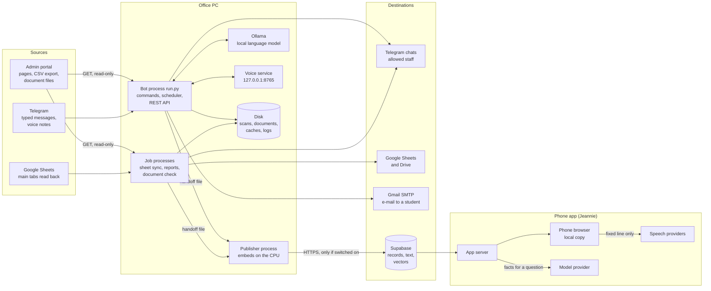

# How the bot collects information, where the information goes, and why

This document follows every piece of information the Hangeul bot handles: where it is read, what is done to it on the office PC, where it is sent, what staff use it for, and how long it stays.

It is written from the code. Citations are `path:line`, relative to the repository root. Paths that start with `extras/` point into the copies of the phone app and the voice service that ship in this repository.

Related documents: [SITE_MAP.md](SITE_MAP.md) (every page, command and job), [PROJECT_STRUCTURE.md](PROJECT_STRUCTURE.md), [BUILD_AND_RUN.md](BUILD_AND_RUN.md), [JEANNIE_APP.md](JEANNIE_APP.md) (the phone app), [programs/cloud.md](programs/cloud.md) (the Supabase publisher), [reference/13_SUPABASE_PUBLISHING.md](reference/13_SUPABASE_PUBLISHING.md), [SCRUB_NOTES.md](SCRUB_NOTES.md).

## Contents

1. [The whole flow on one page](#1-the-whole-flow-on-one-page)
2. [What is collected and how](#2-what-is-collected-and-how)
3. [Where it goes and why](#3-where-it-goes-and-why)
4. [Personal-data table](#4-personal-data-table)
5. [What never leaves the PC](#5-what-never-leaves-the-pc)
6. [The controls in the code](#6-the-controls-in-the-code)
7. [Gaps and risks the code itself shows](#7-gaps-and-risks-the-code-itself-shows)

## Terms used here

| Term | Meaning |
|---|---|
| Portal | The agency's admin website. Its address is the setting `HANGEUL_BASE_URL`, default `https://hangeul.com.bd/admin` (`src/config.py:24`). It has web pages only, no API. |
| uid | The portal's own number for a student, read from the `student_edit.php?id=N` link of the student's row (`src/scraper/parsers.py:326`, `:378-379`). |
| HNG id | The student id the portal prints, shaped `HNG-YYYY-N` (`src/scraper/parsers.py:330`). |
| Direct student | A student whose `Source` column in the portal's CSV export is `direct`. Only these go on the Google sheets; partner (B2B) students are left out (`src/sheets/progress_builder.py:256-258`, `:273-274`). |
| Progress sheet | One Google spreadsheet per program and intake, named `<program name> <INTAKE>`, whose main tab mirrors the portal (`src/sheets/progress_builder.py:462`). |
| Brief | The daily summary message, sent at `DAILY_REPORT_TIME` (default 18:05) (`src/bot/scheduler.py:425-444`). |
| Watcher | The job that checks each newly uploaded passport scan every 30 minutes (`src/bot/scheduler.py:448-456`). |
| Record, kind, key, scope | The shape of what is published to Supabase. A record has a kind (one of 26, `src/cloud/records.py:41-47`), a key that identifies it, and a scope: the unit one complete read covers, used to decide what may be deleted (`src/cloud/records.py:1-11`). |
| Handoff file | A JSON file a job writes so that a separate process can upload it to Supabase (`src/cloud/handoff.py:1-19`). |
| Bot folder | The folder that holds `run.py` and `.env` (`BOT_ROOT`, `src/config.py:5-7`). Local paths below are relative to it unless they start with `<`. |
| Jennie | The name the bot uses for its voice and its local language model ("Jennie's brain", `src/config.py:28`). |
| Jeannie | A different program: the phone app (a Next.js web app) that reads what the bot publishes. Its code is under `extras/jeannie-app/`. |

---

## 1. The whole flow on one page

### The flow in words

1. **Reading.** The bot logs in to the portal with one account and reads pages with HTTP GET. The login form is the only POST it ever sends (`src/scraper/client.py:150-184`). It also reads Telegram messages and voice notes from allowed chats, and it reads the Google progress sheets back to compare them with the portal.
2. **Working on the PC.** It parses the pages (`src/scraper/parsers.py`), downloads passport scans and each verified student's documents, reads them with OCR, checks them against rules, and compares portal fields with the documents. A local language model (Ollama) writes a few short sentences and picks facts; a local voice service turns speech into text and text into speech.
3. **Sending.** It answers in Telegram, writes Google Sheets, keeps files on the PC's disk, and can send one e-mail to a student through Gmail when a staff member approves the draft.
4. **Publishing (optional).** When three settings are set, a separate process uploads what was read, as records with text and vectors, to a Supabase database (`src/cloud/publish.py:103-107`). The phone app reads that database.
5. **The phone app.** Its server reads Supabase with a secret key, builds every figure in code, and may send the built facts to a model provider to get one or two sentences of wording. A browser that holds the access key, while its device-copy setting is on (the default), also downloads the whole data set into the browser's own database. On mobile data, with data saving on, or on a phone whose connection type the browser cannot name, the first full download waits for the owner's consent (section 3.8).

### Every network endpoint the bot's code contacts

| Endpoint | Used for | Code |
|---|---|---|
| The portal (`HANGEUL_BASE_URL`) | Read pages, the CSV export, passport scans, document ZIPs | `src/scraper/client.py:113-118`, `:314-337` |
| Telegram Bot API (`api.telegram.org`) | Receive updates by long polling; send replies, voice notes, one Excel file | `run.py:92-95`; `src/sheets/auto_sync.py:353`; `src/sheets/missing_report.py:259`, `:270` |
| Google Drive API v3 and Sheets API v4 | Find folders and sheets, write and read the main tabs | `src/sheets/progress_builder.py:388-393` |
| Gmail SMTP (`smtp.gmail.com:465`) | Send one approved e-mail | `src/bot/telegram_bot.py:1166-1168` |
| Supabase REST (`SUPABASE_URL`, HTTPS only) | Publish records; only when switched on | `src/cloud/publish.py:342-347`, `:405-408` |
| Ollama (`OLLAMA_BASE_URL`, default `http://127.0.0.1:11434`) | The local language model | `src/llm/ollama_client.py:65-69` |
| Voice service (`JENNIE_VOICE_URL`, must be this PC) | Speech to text, text to speech | `src/bot/voice.py:125-137` |

At start-up `src/net_fix.py` also opens plain TCP test connections to `api.telegram.org:443` and to a list of Telegram addresses, to find one that answers (`src/net_fix.py:22-25`, `:42-45`, `:72-100`). They carry no data. When the Windows environment variable `TELEGRAM_API_IP` is set, no probe runs and every connection to `api.telegram.org` goes to that address (`src/net_fix.py:81-86`). Besides these, the OCR library downloads its model files the first time it runs (section 7, item 16).

### When things run by themselves

All seven jobs are registered in `setup_scheduler` and only when `ENABLE_SCHEDULED_REPORTS` is true (`src/bot/scheduler.py:419-423`). Times are in `REPORT_TIMEZONE` (default `Asia/Dhaka`, `src/config.py:58`).

| Job id | When | What it reads | What it sends or writes | Code |
|---|---|---|---|---|
| `portal_sync` | Every 15 minutes | CSV export; verified-documents list; document ZIPs; Google sheet tabs | Google sheets; document folders; document check; Telegram summaries; Supabase handoff | `src/bot/scheduler.py:459-466`; `src/sheets/auto_sync.py:412-480` |
| `passport_upload_watcher` | Every 30 minutes | Every page of `students.php`; one profile page and one scan per new upload. Nothing at all while `TELEGRAM_ADMIN_CHAT_ID` is empty (`src/bot/scheduler.py:164-166`) | Alerts to the admin chat; watcher memory file; Supabase handoff | `src/bot/scheduler.py:448-456`, `:158-246` |
| `cloud_full_picture` | Every 60 minutes, first run 7.5 minutes after start | Eight groups of portal pages | Supabase only | `src/bot/scheduler.py:363-389`, `:501-509`; `src/cloud/full_picture.py:103-110` |
| `brain_keep_warm` | Every 10 minutes | Ollama's loaded-model list | Reloads the model if needed; only when the model is pinned | `src/bot/scheduler.py:317-337`, `:491-498` |
| `passport_issue_refresh` | 08:30 daily | Every page of `students.php`; every student's edit page | `data/passport_issue.json`; Supabase handoff | `src/bot/scheduler.py:480-488`; `src/sheets/passport_issue.py:58-109` |
| `missing_info_report` | 09:05 daily | Every progress sheet's first tab; CSV export | Telegram text and Excel file; Supabase handoff | `src/bot/scheduler.py:469-477`; `src/sheets/missing_report.py:332-354` |
| `daily_executive_briefing` | `DAILY_REPORT_TIME`, default 18:05 | Seven portal reads and one local file. Nothing while `TELEGRAM_ADMIN_CHAT_ID` is empty (`src/bot/scheduler.py:251-254`) | The brief to the admin chat; an optional spoken version; Supabase handoff | `src/bot/scheduler.py:425-444`, `:248-278`; `src/bot/brief.py:600-662` |

The three interval jobs without a start date (sync, watcher, keep-warm) do not state their first run time in the code; that is decided by the scheduler library.

---

## 2. What is collected and how

### 2.1 The admin portal

#### How the bot reads the portal

- **One account.** The user name and password come from the settings `HANGEUL_USERNAME` and `HANGEUL_PASSWORD` (`src/scraper/client.py:101-103`). Their defaults in the code are placeholders, not real credentials: the user name `admin` and the literal word `password` (`src/config.py:25-26`). With the settings missing, the bot still tries to log in, with those placeholders. In mock mode the login sends nothing at all and only marks the client as logged in (`src/scraper/client.py:158-165`).
- **Login.** GET `login.php` (30 s) to read the form's CSRF token, then POST `login.php` with the fields `_csrf`, `username`, `password` (`src/scraper/client.py:134-136`, `:176-184`). A response that still ends on `login.php` is a refused login (`:186-188`).
- **Session.** The session is the cookie jar of one in-memory HTTP client. Nothing about the session is written to disk. Each process logs in for itself.
- **Reading a page.** Most readers go through `portal_get`. It sends one GET. If the answer is the login page, it logs in again once and repeats the GET. It raises `PortalUnavailable` on a second login page, on HTTP status 400 or above, on a timeout or on a refused connection (`src/scraper/client.py:314-337`). Its default read timeout is 60 s and its connect timeout at most 10 s (`:48`, `:315`, `:326`).
- **Readers that bypass `portal_get`.** Some reads call the HTTP client directly, with their own timeouts:

  | Read | Timeout | On a failure | Code |
  |---|---|---|---|
  | `get_consultation_requests` (unfiltered `consult_requests.php`) | 15 s, the client's default | Returns an empty list | `src/scraper/client.py:116`, `:269-285` |
  | `get_calendar_events` (`calendar.php`) | 15 s | Returns empty lists with an `error` key; its callers show "not available" | `src/scraper/client.py:570-590`; `src/bot/telegram_bot.py:1026`; `src/bot/brief.py:301-306` |
  | `get_student_full_profile` (`student_edit.php`, the `/sendmail` fallback) | 15 s | Returns an empty profile | `src/scraper/client.py:592-628` |
  | `crawl_page` (any path, REST route) | 15 s | Returns `{"error": ...}` | `src/scraper/client.py:741-775` |
  | The login page | 30 s | Returns an error | `src/scraper/client.py:136` |
  | The CSV export, for the sheets, the document check and `/sendmail` | 60 s | Raises | `src/sheets/progress_builder.py:223-242`; `src/bot/telegram_bot.py:1187-1201` |
  | `download_docs.php` ZIP | 300 s | Raises | `src/sheets/verified_docs.py:208-214` |

  The one-time backfill reads the CSV export through `portal_get` instead (`src/cloud/backfill.py:113`).
- **No guessing.** A read built on `portal_get` that fails is reported as "not available". It is never turned into 0 or an empty list (`src/scraper/client.py:66-72`). The direct reads in the table above do not all follow this rule: the consultation list and the profile read return an empty result on any error.
- **Paging.** Only `students.php` has pages: 50 students a page, followed with `pg=2..N`, refused above 40 pages (`src/scraper/client.py:44-45`, `:454-499`).
- **Hidden e-mail addresses.** The portal sits behind Cloudflare, which replaces e-mail addresses in the HTML. Every parser first puts the real addresses back (`decode_cf_emails`, `src/scraper/parsers.py:12-97`).
- **Browser-like header.** Requests carry a Chrome user-agent string (`src/scraper/client.py:107-111`).
- **Certificate check is off** for the portal connection: `verify=False` (`src/scraper/client.py:117`).

#### Pages, fields and who reads them

| Page (relative to the portal address) | What is taken from it | Read by | How often |
|---|---|---|---|
| `login.php` (GET, then POST) | CSRF token; session cookie | Every process, before its first read and after a session expires | As needed (`src/scraper/client.py:124-200`) |
| `students.php`, every page | Per student: uid, HNG id, name, university, application lines, program, intake, documents status, payment status, stage, applied date; the details block (every label the portal shows, for example Full Name, Passport No, Passport Expiry, Passport Status, DOB, Gender, Mobile, Email, Guardian WhatsApp, Father, Mother, Address, District, Consultant); document file names; amount paid, method, verified income, who verified the payment and when (`src/scraper/parsers.py:364-410`, `:499-533`) | Watcher; hourly full picture; `/verified*`, `/crosscheck*`, `/passports`, `/admitted`; intake and applied-date questions; the brief; 08:30 issue-date refresh; `/stage`; `/sendmail` fallback | Every 30 min (watcher), every 60 min (full picture), 08:30, 18:05, and on each command |
| `students.php`, first page only | The 50 newest applications | `/students`; REST route `/api/applications` | On demand (`src/scraper/client.py:214-234`) |
| `students.php?status=pending` | Students whose payment is pending; the portal's "Pending Payments N" badge | Brief (first page only, `src/scraper/client.py:553-559`); the typed "pending payments" question (every page, `src/bot/ask.py:892`); full picture | 18:05; hourly; on demand |
| `students.php?export=csv` | Every student, every CSV column (one request, 60 s) | Portal sync; missing-information report; `/missing` and `/stage` buttons; document check; `/sendmail` lookup | Every 15 min; 09:05; on demand (`src/sheets/progress_builder.py:223-242`; `src/bot/telegram_bot.py:1187-1226`) |
| `students.php?source=direct&filter_docs=verified`, every page | Per document-verified Direct student: uid, Full Name, Passport No, Program, document file names | Portal sync | Every 15 min (`src/sheets/verified_docs.py:38`, `:71-80`) |
| `download_docs.php?uid=<uid>&zip=1` | A ZIP of all the student's documents (300 s) | Portal sync, only for new students or students whose file list changed | Every 15 min (`src/sheets/verified_docs.py:208-210`, `:362-378`) |
| `student_edit.php?id=<uid>` | Every filled field of the student's profile form, by its form name; the link to the passport scan; the value of `passport_issue_date` | Passport checks (watcher, cross-check commands); 08:30 refresh (every student); `/sendmail` fallback | Per new scan; daily; on demand (`src/scraper/client.py:654`, `:716-736`; `src/sheets/passport_issue.py:54`, `:77`) |
| `view_doc.php?f=<file>` | The passport scan file (image or PDF, 60 s) | Passport checks | Once per upload: a saved copy is reused (`src/scraper/client.py:677-705`) |
| `progress.php?uid=<uid>` | Progress percent, stage, status (30 s, four at a time) | `/stage` report; the one-time backfill | On demand (`src/sheets/stage_report.py:65-89`) |
| `consult_requests.php?status=all&from=<day>&to=<day>` | The day's consultation requests (id, name, contact, city, program, consultant, details, received time, status, who handled it, remarks) and the day's status counts | `/inquiries*`; brief; full picture (yesterday and today); the one-time backfill (every day from the oldest request up to today, plus about 13 reads over date ranges to find that oldest day) | On demand; 18:05; hourly; once by hand (`src/scraper/client.py:382-423`; `src/scraper/parsers.py:718-780`; `src/cloud/backfill.py:154-175`, `:532-560`) |
| `consult_requests.php?status=file_opened` | All-time status counts: All, New, No Answer, Wrong Number, Consulted, File Opened | `/inquiries*`; brief; full picture | Same (`src/scraper/client.py:53`, `:368-380`) |
| `consult_performance.php?period=today` and `?period=month` | Tiles, the top-performer card, the leaderboard: consultant name, rank, score, conversion, files opened, consultancies, points, documents ready | `/performance*`; full picture | On demand; hourly (`src/scraper/client.py:57-58`, `:425-452`) |
| `window_applications.php?status=under_review` | Rows (student, window, status); the count under review | Brief; typed question; full picture | 18:05; on demand; hourly (`src/scraper/client.py:561-568`) |
| `index.php` | Dashboard tiles and cards (figures with their labels, for example programs and universities with counts) and the text of up to five recent window-application links | `/stats`, `/alerts`, `/admitted`, typed dashboard questions; brief; full picture; REST routes | On demand; 18:05; hourly (`src/scraper/client.py:202-212`; `src/bot/ask.py:770-777`) |
| `calendar.php` | Today's reminders, the upcoming timeline, the page's event list (title, type, university, dates, notes, done flag) | `/calendar`; brief (today only); full picture | On demand; 18:05; hourly (`src/scraper/client.py:570-590`; `src/bot/ask.py:1403`) |
| `consult_requests.php` with no filter | The requests table, filtered in code to a date | REST routes `/api/applications/inquiries` and `/api/applications/consultations`; the hand-run script `get_consultations.py` | On demand (`src/scraper/client.py:269-292`) |
| Any path the caller names | Every HTML table on that page | REST route `POST /api/crawler/parse-page` | On demand (`src/scraper/client.py:741-775`) |

The one-time backfill (`python -m src.cloud.backfill`, section 3.7) also reads the portal live, with a client and session of its own, in this order: every page of `students.php`; every student's `progress.php`, four at a time; the CSV export; the verified-documents list; `consult_requests.php` day by day as in the table above; the all-time counts; every page of `students.php?status=pending`; `window_applications.php?status=under_review`; `index.php`; `calendar.php`; and `consult_performance.php` for today and for this month (`src/cloud/backfill.py:500-578`). Its module docstring says only the hourly job reads the performance page, but the code at `:568-569` reads it too. `--skip-portal` leaves all of these out and `--days N` reads only the last N days of requests (`:614-625`).

Things worth knowing about these reads:

- The payment-verification stamp the portal prints has no year ("DD Mon, HH:MM"). The bot refuses to answer for a day that could be confused with the same day a year later (`src/scraper/client.py:522-545`).
- The admitted list is picked in code from the whole student list. Search words typed after `/admitted` never go into a portal URL (`src/scraper/client.py:236-267`).
- The consultation day read is cross-checked in five ways before it counts as complete (`src/scraper/client.py:397-423`).
- The forms on the consultation page (remarks, update status) are read for their hidden ids only and never submitted (`src/scraper/parsers.py:615`, `:761`).

#### What the brief reads

In this order, one after another, each within 75 s and all within 150 s (`src/bot/brief.py:69-70`, `:562-597`, `:615-628`):

1. The day's consultation requests.
2. Every page of `students.php` for that day's payment verifications.
3. The all-time consultation counts.
4. The first page of `students.php?status=pending`.
5. `window_applications.php?status=under_review`.
6. `index.php`.
7. `calendar.php` (today's brief only).
8. The local file `data/verification/results.json`, for the document-check totals (`src/bot/brief.py:332-342`).

#### What the hourly full picture reads

Eight steps, GET only, with a portal session of its own (`src/cloud/full_picture.py:103-110`): all of `students.php`; all of `students.php?status=pending`; consultation requests of yesterday and today; the all-time counts; window applications under review; the dashboard; the calendar; the performance page for today and for this month. It runs only when publishing is on, never in mock mode, and it stays away from the times the other jobs run: 18:00-18:10, 08:25-08:40 and 09:00-09:10, with a five-minute lead, and while a portal sync is running (`src/cloud/full_picture.py:132-153`; `src/cloud/backfill.py:57`, `:66-84`).

### 2.2 Student documents and passport scans downloaded from the portal

**Passport scans.** A passport check needs the scan itself.

1. The file name comes from the student's row on `students.php` (a name starting `passport_`) or, failing that, from the link on the profile page (`src/bot/scheduler.py:74-78`; `src/scraper/client.py:667-669`).
2. The name must match `[A-Za-z0-9._-]+` and hold no `..` (`src/scraper/client.py:673`).
3. The scan is saved as `passports/<uid>_<file name>`. The file name carries the upload time, so a saved copy is the same upload and is not downloaded again (`src/scraper/client.py:675-686`).
4. A download that is a web page, or 1000 bytes or smaller, is rejected (`src/scraper/client.py:691-695`).
5. The file is written to a `.part` name and then renamed (`src/scraper/client.py:701-705`).

The watcher checks each student's newest scan once. A re-upload has a new file name and is checked again. A run stops starting new checks after 20 minutes; the rest wait 30 minutes for the next run (`src/bot/scheduler.py:26-35`, `:191-197`).

**All documents of a verified student.** Every 15 minutes the sync lists the Direct students whose documents the portal marks verified, and downloads the portal's own ZIP for each new one (`src/sheets/verified_docs.py:330-400`):

1. The folder is `<DOCS_ROOT>/<PROGRAM>/<FULL NAME> (<PASSPORT NO>)/`. `DOCS_ROOT` defaults to a folder named `VERIFIED STUDENT DOCUMENTS` beside the bot folder (`src/config.py:101-102`; `src/sheets/verified_docs.py:91`, `:357`).
2. A marker file `.download_complete` in the folder holds the portal's list of file names at download time. While the portal still shows the same list, the student is skipped. When the list changes, the ZIP is downloaded again (`src/sheets/verified_docs.py:362-378`, `:395-396`).
3. Files already on disk are never overwritten; only new files are added (`src/sheets/verified_docs.py:383-392`).
4. A file over 2 MB is re-encoded to at most 1.95 MB. The untouched original is first copied to `<DOCS_ORIGINALS_ROOT>` (`src/sheets/verified_docs.py:243-245`, `:292-326`). `DOCS_ORIGINALS_ROOT` defaults to a folder named `VERIFIED STUDENT DOCUMENTS - ORIGINALS OVER 2MB` beside the bot folder (`src/config.py:104-106`).
5. A student whose folder name is flagged complete in Google Drive is not downloaded by the sync (`src/sheets/verified_docs.py:345-355`).

**Which folders the document check reads.** The check looks for student folders under two roots: `DOCS_ROOT` and `KONYANG_ROOT`. `KONYANG_ROOT` holds older downloads; it defaults to a folder named `KONYANG DOCUMENTS` beside the bot folder, and is skipped when it does not exist. No code in the repository writes to it (`src/config.py:98`, `:108-109`; `src/verify/doc_verifier.py:40`). A folder counts when its name ends in `(<PASSPORT NO>)`; the first root that has a passport wins (`src/verify/doc_verifier.py:1100-1117`). Everything the check writes goes to `VERIFICATION_DIR`, which defaults to `data/verification` in the bot folder (`src/config.py:99`, `:111-112`; `src/verify/auto_verify.py:47-53`). For all four folder settings, an empty value means the default and a relative path counts from the bot folder (`src/config.py:10-16`).

### 2.3 Messages and voice notes from Telegram

The bot receives updates by long polling (`run.py:95`). From each update it reads:

| What | Used for | Kept where |
|---|---|---|
| The chat id | The allow-list check (`src/bot/telegram_bot.py:22-37`) | Log lines |
| Command text and arguments, typed messages | Choosing the command, the day, the student (`src/bot/telegram_bot.py:1973-1999`) | Memory only. Per-chat state such as an open date question or an open `/sendmail` conversation lives in `context.user_data` |
| Button taps (`missing:<KEY>`, `stage:<KEY>`, `stagei:<KEY>` plus intake) | Which report to run (`src/bot/telegram_bot.py:2385-2389`) | Not kept |
| Voice notes and audio files, only when `JENNIE_VOICE_ENABLED` is true | Speech to text on the local voice service (`src/bot/telegram_bot.py:2430-2433`) | The audio bytes are held in memory, sent to `127.0.0.1`, and not written to disk by the bot (`src/bot/voice.py:1747-1749`, `:163-167`) |
| The typed subject and short brief of a `/sendmail` conversation | Drafting an e-mail (`src/bot/telegram_bot.py:1406-1419`) | Memory, until the conversation ends |

Limits on voice notes: at most 60 seconds and 20 MiB (`src/bot/voice.py:73-74`, `:1735`). The last six voice turns of each chat (the heard words, language, command, day and the spoken sentence) are kept in memory only and are lost when the bot restarts (`src/bot/voice.py:79`, `:335-348`).

Typed questions are routed by whole-word rules, not by a language model (`src/bot/telegram_bot.py:1976-1988`). The model is used for typed text only when no rule fits, and then only to pick which dashboard figures to show (see 3.5).

### 2.4 Google Sheets the code reads back

| Read | What is taken | Why | Code |
|---|---|---|---|
| The first tab of every progress sheet whose portal data did not change | Every cell | To find cells edited by hand. The tab is then rebuilt from the portal, and the Telegram summary says how many cells were restored | `src/sheets/auto_sync.py:249-258`; `src/sheets/progress_builder.py:434-455` |
| The first tab of every progress sheet | Every row | The missing-information report counts blank required fields per student | `src/sheets/missing_report.py:303`, `:335` |
| Drive folder and file listings | Folder ids and names | To find the intake folder and the sheet by name; to list student folders flagged complete | `src/sheets/progress_builder.py:388-393`; `src/sheets/verified_docs.py:345` |
| An attendance spreadsheet, tab `Today` | Staff name, in, out, punches | Only by a hand-run command; no job or report uses it | `src/sheets/attendance.py` (see [programs/sheets.md](programs/sheets.md)) |

The bot signs in to Google as a user through OAuth, with the full Drive scope and the Spreadsheets scope (`src/sheets/progress_builder.py:49-52`). The token is kept in `token.json` in the bot folder (`:47`, `:358-366`).

### 2.5 What is derived on the PC

| Derived data | Made from | How | Kept in |
|---|---|---|---|
| Passport reading: the machine-readable zone (MRZ: the two coded lines at the bottom of a passport page), with name, passport number, date of birth, sex, expiry; printed parents' names and address | The passport scan | EasyOCR, English, on the CPU (`src/scraper/ocr_validator.py:79`); the page is tried upright and turned 270, 90 and 180 degrees (`:49`); each MRZ field is trusted only when its own ICAO 9303 check digit agrees (`:109`, `:265`) | Returned to the caller; not stored as such |
| Passport cross-check result: per field a status, a list of confirmed differences, a list of "check by eye", a one-line verdict | The reading above and the profile fields from `student_edit.php` | `validate_passport_data` in a worker thread (`src/scraper/client.py:711-713`) | The alert text in `data/alerted_passport_issues.json`; Telegram; Supabase kinds `passport_audit` and `passport_alert` |
| Text of the first pages of each document | Each file in a student's folder | The PDF's own text layer when it has one, else a page image read by EasyOCR, on the GPU when one is available (`src/verify/doc_verifier.py:52-60`, `:92-150`). Not every page: in the scheduled check a whole-file read stops after the first 6 pages, the default of the text cache's wrapper (`src/verify/auto_verify.py:191`); `read_document` called directly would stop after 20 (`src/verify/doc_verifier.py:122`). Per-page reads stop after 8, 10 or 20 pages, depending on the rule (`src/verify/doc_verifier.py:92`, `:474`, `:731`) | `data/verification/text/<PASSPORT>.json` (`src/verify/auto_verify.py:49`, `:237-242`) |
| Page-level findings: colour scan or black and white, QR codes, Bangla text, seals, apostille order | Page images | OpenCV, pyzbar, PyMuPDF. QR contents are compared as text; no link is opened (`src/verify/page_checks.py:314`, `:385-417`; no HTTP library is imported under `src/verify/`) | Inside the verdict rows |
| Document verdicts: per file PASS, FLAG, FAIL or MISSING with a detail line; per student PASS, REVIEW, FAIL or INCOMPLETE | Document text and the student's CSV record | Rules in `src/verify/rules.py` and `src/verify/doc_verifier.py:1048-1096` | `data/verification/results.json`; `DOCUMENT CHECK.xlsx` |
| Field check: for each portal field a document can prove, MATCH, DIFFERS, UNREADABLE, NO DOCUMENT or BLANK, with the portal value | The sheet row built from the CSV and the document text | `src/verify/field_check.py:39-56`, `:95-218` | `results.json`; `FIELD CHECK.xlsx` |
| Corrections history: which portal field changed after a check, the value before and after | Two field checks of the same student | `src/verify/auto_verify.py:252-274` | `results.json`, sheet "Corrections" |
| Change detection for sheets | Each sheet row | A SHA-1 of the row, compared with the previous run (`src/sheets/auto_sync.py:133-134`, `:245-248`) | `data/sheet_state.json` |
| Daily brief text and its fact lines | The brief's reads | Counted in code, section by section (`src/bot/brief.py:141-250`, `:637-646`) | Sent; not stored locally |
| One or two summary sentences | The brief's fact lines | The local model, then a checker that rejects any number or word the facts do not back (`src/bot/brief.py:541-557`) | Last line of the brief |
| A spoken sentence | The written answer of a command | The local model for English, checked the same way; Korean sentences with figures are built in code (see [programs/voice_and_llm.md](programs/voice_and_llm.md)) | A voice note |
| An e-mail draft | A staff member's subject and short brief, and the student's name | The local model, or a template when the model is down (`src/bot/telegram_bot.py:1312-1351`) | Shown in Telegram for approval |
| Records for Supabase: a data object, a text form and a SHA-256 hash | Whatever a reader or report returned | `src/cloud/records.py:164-167`, `:297-313` | A handoff file, then Supabase |
| Embeddings: 384 numbers per text chunk | Each changed record's text, cut into chunks of at most 350 words | The model `thenlper/gte-small` at a pinned revision, on the CPU, offline (`src/cloud/embed.py:34-38`, `:60-73`, `:221`) | Sent to Supabase with the record |

---

## 3. Where it goes and why

### 3.1 Telegram

**Who receives what**

| Message | Goes to | Code |
|---|---|---|
| The reply to a command, a typed question, a button or a voice note | The chat that asked, if it is on the allow-list | `src/bot/telegram_bot.py:22-37` |
| The scheduled daily brief and its optional spoken version | Only the chat in `TELEGRAM_ADMIN_CHAT_ID`. Skipped while that setting is empty. A brief asked for with `/brief` or `/report` goes to the chat that asked | `src/bot/scheduler.py:251-259`, `:269-272` |
| Passport alerts from the watcher | Only `TELEGRAM_ADMIN_CHAT_ID` | `src/bot/scheduler.py:164-166`, `:233` |
| The command list pinned at start-up | Only `TELEGRAM_ADMIN_CHAT_ID` | `src/bot/telegram_bot.py:2338-2350` |
| The sync summary, the document-check summary and the 09:05 missing-information report with its Excel file | The chats in `TELEGRAM_BRIEF_CHAT_IDS`; when that is empty, every allowed chat | `src/config.py:128-139`; `src/sheets/auto_sync.py:341-342`; `src/sheets/missing_report.py:247` |
| "Unauthorized access. Your Chat ID is: N" | A sender who is not allowed, for some commands | `src/bot/telegram_bot.py:43-45` |

**What the messages contain and what staff use them for**

| Message | Data in it | Purpose | How often |
|---|---|---|---|
| Inquiries report | All-time and per-day status counts; who handled how many; a log of up to 10 requests with the enquirer's name, program, status, handler and city (`src/bot/telegram_bot.py:439`, `:464-531`). The enquirer's contact is not in it | See how many leads came in and who dealt with them | On demand |
| Payment verifications | Count; total amount; per student the name, program, payment, verifier and time (`src/bot/telegram_bot.py:798-856`) | See whose payment was verified on a day and the total | On demand |
| Cross-check report | Per student: name, uid, HNG id, program, payment, verifier; the portal's passport number, expiry and date of birth; from the scan the father's name, mother's name and the first 40 characters of the address; the verdict (`src/bot/telegram_bot.py:1675-1717`) | Catch typing mistakes in passport data before an application goes out | On demand |
| Passport alert | Student name, HNG id, uid, the check's status, the differences found, a link to the student's portal edit page (`src/bot/scheduler.py:91-101`) | Hear about a wrong scan or wrong typed data soon after upload | When the watcher finds one; sent again each run until Telegram accepts it (`:131-155`) |
| Daily brief | Consultation counts and who handled them; each verified student with name, program, payment, verifier and time; pending and under-review figures; today's reminders; document-check totals (`src/bot/brief.py:141-250`) | One end-of-day picture | Daily at the set time; on demand with `/brief` or `/report` |
| Sync summary "Portal sync — changes found" | Sheet names and counts; names of new, removed and edited students (up to 8 a section) with the names of changed columns; for documents the folder name, which holds the student's name and passport number, the program and file counts (`src/sheets/auto_sync.py:231-271`, `:289-311`) | Know what changed on the portal without opening a sheet | Every 15 minutes, only when something changed (`:453-455`) |
| "Document check" | Per checked student: name, program, verdict, the first failing rule (or, for INCOMPLETE, the first missing document) cut to 160 characters, how many fields differ (`src/verify/auto_verify.py:526-562`). The rule's detail line can quote values read from the documents by OCR, for example "highest amount found is N BDT" from a bank statement, a family certificate's issue date or a trade licence's fiscal year, and also a passport expiry date (`src/verify/doc_verifier.py:319-321`, `:544`, `:693`, `:844`) | Know which student's documents need attention | After a sync that checked someone |
| Missing-information report | Per sheet how many students are incomplete; up to 10 students per sheet with HNG id, name and up to six missing field names. The attached Excel file has Program, Intake, Student ID, Full Name, Mobile, Missing count, Missing fields (`src/sheets/missing_report.py:157-169`, `:228`, `:270-272`) | Chase students whose records are incomplete | 09:05 daily; per program on `/missing` |
| Stage report | Per stage the students' HNG id, name, status and progress percent (`src/sheets/stage_report.py:210-220`) | See where an intake's students are | On `/stage` |
| Pending payments | Count; up to 30 students with name, HNG id, program, intake, applied date, stage (`src/bot/ask.py:41`, `:908-923`) | See who still has to pay | On demand |
| Performance report | Per consultant the figures the portal's own page shows (`src/bot/performance.py:218`) | See consultant performance today or this month | On demand |
| Voice round trip | The text "heard: ..." with the transcript; the normal written answer; a short voice note (`src/bot/voice.py:1781`, `:1855`) | Ask by voice | On demand, voice on only |

The bot sends text messages, voice notes and exactly one kind of file: the missing-information Excel file (`src/sheets/missing_report.py:270`). It never sends a passport scan or a student document to Telegram; no other call that sends a file exists in `src/`.

**How long it stays.** The code deletes only its own "please wait" notes. How long Telegram keeps the other messages is not decided in this code.

### 3.2 Google Sheets and Drive

**Progress sheets.** For every program (KLP, EAP, Bachelor's, Master's) and intake that has at least one Direct student, the sync keeps one spreadsheet named `<program name> <INTAKE>` in an intake folder under that program's Drive folder (`src/sheets/progress_builder.py:108-132`, `:282-290`).

- **Columns.** 36 columns for Master's; 32 for the other three programs, which leave out the four university columns (`src/sheets/progress_builder.py:61-101`, `:308-312`):
  - Identity and contact: Student ID, Full Name, Surname, Given Name, Email, Mobile, Guardian WhatsApp, DOB, Gender, District, Address, Father, Mother.
  - Education: Study Status, SSC Year, SSC GPA, SSC Group, SSC School, HSC Year, HSC GPA, HSC Group, HSC College, Previous University, Subject, Degree, CGPA, Program, IELTS/TOPIK.
  - Passport and money: Passport Status, Passport No, Passport Issue, Passport Expiry, Visa Rejection History, Sponsor, Sponsor Occupation, Bank Certificate.
- **Cleaning.** "No value" markers become blank, dates become `YYYY-MM-DD`, phone numbers are normalised, Gender is upper-cased (`src/sheets/progress_builder.py:134-146`, `:332-350`).
- **What is written.** Only the main tab. Tabs staff add are never touched. A hand edit on the main tab is undone at the next sync (`src/sheets/auto_sync.py:249-258`).
- **Purpose.** Staff work from one always-current sheet per program and intake instead of retyping portal data.
- **How often.** Checked every 15 minutes; a sheet is rewritten only when its students changed or its cells differ from the portal.
- **How long.** The sheet always holds the current portal state. A student who leaves an intake disappears from that sheet at the next sync. An intake that empties is rebuilt empty once (`src/sheets/auto_sync.py:237-242`). The code never deletes a spreadsheet.

**Drive folders.** The code creates a missing intake folder (`src/sheets/progress_builder.py:405-418`). A second mode of `src/sheets/verified_docs.py` uploads each verified student's documents into Drive under `VERIFIED STUDENT DOCUMENTS/<PROGRAM>/<FULL NAME> (<PASSPORT NO>)/` (`:39`, `:142-205`). That mode runs only when started by hand; the scheduled sync uses the local-disk mode (`src/sheets/auto_sync.py:281`).

### 3.3 The PC's disk

Nothing on this list is encrypted by the code. "Never deleted" means no line of code under `src/` removes it; the only deletions in the code are lock files, handoff files, a PNG replaced by its JPEG after shrinking, and `results.json` on `--recheck-all` (`src/verify/auto_verify.py:583`).

The `data/verification/...` paths below are the default of the setting `VERIFICATION_DIR`. When it is set, `results.json`, `text/` and both Excel reports are written there instead (`src/config.py:99`, `:111-112`; `src/verify/auto_verify.py:47-53`).

| Path | What it holds | Purpose | Written by | How long it stays |
|---|---|---|---|---|
| `passports/<uid>_<file>` | A passport scan | OCR needs a local copy; the same upload is never downloaded twice | `src/scraper/client.py:675-705` | Never deleted |
| `passports/<...>_extracted.jpg` | The first image inside a PDF scan | So the OCR engine can read a PDF | `src/scraper/ocr_validator.py:135` | Never deleted |
| `<DOCS_ROOT>/<PROGRAM>/<FULL NAME> (<PASSPORT NO>)/` | Every document of a verified student | Staff have the full set ready, under the 2 MB upload limit | `src/sheets/verified_docs.py:383-392` | Never deleted; replaced portal documents stay beside the new ones |
| `<DOCS_ORIGINALS_ROOT>/...` (default: `VERIFIED STUDENT DOCUMENTS - ORIGINALS OVER 2MB` beside the bot folder) | Untouched originals of files that were shrunk | Keep the original quality | `src/sheets/verified_docs.py:316-319`; `src/config.py:104-106` | Never deleted |
| `<KONYANG_ROOT>/...` (default: `KONYANG DOCUMENTS` beside the bot folder) | Older downloaded student documents, in folders named `<NAME> (<PASSPORT NO>)` | The document check reads them as well as `<DOCS_ROOT>` | No code writes it; read only (`src/config.py:98`, `:108-109`; `src/verify/doc_verifier.py:40`, `:1100-1117`) | Not touched by the code |
| `data/sheet_state.json` | The full sheet row of every Direct student, with a hash, plus failure counters | Detect and name changes between sync runs | `src/sheets/auto_sync.py:245`, `:439`, `:448` | Overwritten every sync |
| `data/passport_issue.json` | Passport number to issue date, read from the edit pages | The field check uses it; the sheets use it when the CSV export has no issue-date column (`src/sheets/progress_builder.py:318-329`) | `src/sheets/passport_issue.py:106-109` | Overwritten daily at 08:30 |
| `data/alerted_passport_issues.json` | The watcher's memory: per scan the uid, HNG id, status, check time, the full alert text and whether it was sent | Check each scan once; send each alert once | `src/bot/scheduler.py:63-71`, `:221-228` | An entry is dropped when the portal no longer lists that scan (`:187-190`) |
| `data/missing_reports/missing_information_<date>.xlsx` | Program, Intake, Student ID, Full Name, Mobile, missing count, missing fields | The file attached to the 09:05 report | `src/sheets/missing_report.py:220-238` | One file per day; never deleted |
| `data/verification/results.json` | Every document verdict with its detail line, every field result with the portal value, the corrections history | The single store both Excel reports are rebuilt from | `src/verify/auto_verify.py:147-151`, `:295-311` | Kept; replaced per student on a new check |
| `data/verification/text/<PASSPORT>.json` | The text of every document of one student | A scan is read by OCR once only | `src/verify/auto_verify.py:191-202`, `:237-242` | Kept; entries for older file versions are not removed |
| `data/verification/DOCUMENT CHECK.xlsx`, `FIELD CHECK.xlsx` | The two staff reports | Staff open them in Excel | `src/verify/auto_verify.py:339`, `:384` | Rebuilt on each pass that checked someone |
| `data/cloud/pending/<time>-<job>.json` | Whole records in clear text, waiting for upload | Lets the bot hand work to the publisher without waiting | `src/cloud/handoff.py:70-83` | Deleted by the publisher when done, sent or not (`src/cloud/publish.py:888-892`), and by a publisher that reaches its own time limit (`:895-904`). A file left by a publisher that was killed is removed only when a later handoff file is written and the leftover is by then older than 6 hours (`src/cloud/handoff.py:48`, `:59-67`, `:73-74`). If no handoff follows, for example after publishing is switched off, it stays |
| `data/cloud_state.json` | For each published record its key, hash, scope and read time. Keys can hold passport numbers and names; no record data | Upload only what changed | `src/cloud/publish.py:43-48`, `:164-168` | Kept |
| `data/cloud/student_index.json` | Passport number to uid and HNG id | Give passport-keyed records a stable student id | `src/cloud/student_index.py:31`, `:112-127` | Kept |
| `data/cloud/dry_run/<run>/` | The exact request bodies of a dry run, with all fields | Lets the owner inspect what would be sent | `src/cloud/publish.py:316-324` | Never deleted |
| `data/jennie_fillers/` | Six short voice clips of fixed sentences | An instant "one moment" voice reply | `src/bot/voice.py:209`, `:256-267` | Kept; no personal data |
| `hangeul_bot.log` | Every log line of the bot process at INFO and above | Diagnosis | `run.py:37-45` | Appended; no rotation in the code |
| `hangeul_stdout.log`, `hangeul_stderr.log` | Console output when the bot runs without a window | Diagnosis | `run.py:8-17` | Appended |
| `hangeul_sync.log` | The output of every scheduled job process (sync, 08:30 refresh, 09:05 report, full picture) and of every publisher process. Several jobs print personal data into it: the sync's summary lines, with names and folder names that hold passport numbers (`src/sheets/auto_sync.py:449-450`); a line per downloaded student with the folder name (`src/sheets/verified_docs.py:377`, `:399`, `:405`); the document check's summary and a line per checked student with the name and verdict, plus the name and passport number of each student it could not read (`src/sheets/auto_sync.py:468`; `src/verify/auto_verify.py:502`, `:510-512`, `:518-521`); up to ten passport numbers with their issue dates from the 08:30 refresh (`src/sheets/passport_issue.py:131-133`); the whole 09:05 report text, with HNG ids and names (`src/sheets/missing_report.py:349`) | Diagnosis | `src/bot/scheduler.py:340-341`, `:401-405`; `src/cloud/handoff.py:47`, `:111` | Appended |
| `hangeul_watchdog.log` | One line per watchdog run | Diagnosis | `watchdog.ps1:6-30` | Appended |
| `token.json`, `credentials.json` | The Google OAuth token and client file | Google access without a person present | `src/sheets/progress_builder.py:46-47`, `:365`, `:384` | Kept |
| `.env` | Every setting and secret | Configuration | Read by `src/config.py:141-145` | Kept |
| `program_audit_<program>_<time>.csv` | A hand-run passport audit: per student the wrong fields with the portal value and the scan value | A one-off audit of one program | `audit_program.py:200-204` | Never deleted |

The repository's `.gitignore` keeps `.env`, `token.json`, `credentials.json`, `data/`, `passports/`, `*.csv`, `*.xlsx`, the document folders and `*.log` out of git (`.gitignore:4-9`, `:18-30`, `:35-36`).

### 3.4 E-mail through Gmail SMTP

The command `/sendmail` (also `/email`, `/mail`) sends one e-mail to one student.

1. A staff member names the student. The bot finds the student in the CSV export, or on the list pages, or on the edit page, and takes the e-mail address (`src/bot/telegram_bot.py:1174-1309`).
2. The staff member types a subject and a short brief.
3. The local model writes the body from the brief, the subject and the student's name; a template is used when the model is down (`src/bot/telegram_bot.py:1312-1351`).
4. The bot shows the draft with the address and waits for SEND, EDIT or DENY (`src/bot/telegram_bot.py:1427-1466`).
5. Only on SEND it connects to `smtp.gmail.com:465` over SSL (30 s) and sends a plain-text message from `GMAIL_ADDRESS` to the student's address (`src/bot/telegram_bot.py:1148-1171`, `:1443-1448`).

- **Data.** The student's e-mail address, the subject, the body.
- **Purpose.** Write to a student without leaving Telegram, with a person approving every message.
- **How often.** Only on that command. With `GMAIL_ADDRESS` or `GMAIL_APP_PASSWORD` empty, nothing is sent (`:1156-1158`).
- **How long.** The bot keeps no copy. The conversation state is dropped after sending or cancelling (`:1447`, `:1462`).

### 3.5 The local language model (Ollama)

One model, named by `OLLAMA_MODEL` (default `qwen3:4b-instruct`), reached at `OLLAMA_BASE_URL` (default `http://127.0.0.1:11434`) (`src/config.py:31-32`; `src/llm/ollama_client.py:65-69`).

| Job | What is sent to the model | What comes back | Code |
|---|---|---|---|
| Brief summary | Only the brief's fact lines: counts, a BDT total and, when the day's list is whole, counsellor names with their counts. No student names (`src/bot/brief.py:182-189`, `:218-237`) | At most two sentences, dropped unless every number and word is backed by the facts | `src/bot/brief.py:541-557` |
| Fact pick for a typed question no rule fits | The question and numbered dashboard figures | Line numbers only; the bot then shows the portal's own lines | `src/bot/ask.py:1038-1062`; `src/llm/ollama_client.py:214-248` |
| Voice routing | The transcript and the last three voice turns of that chat | Which command to run, and a date | `src/bot/voice.py:80`, `:534-542` |
| Spoken sentence | "Label: figure" lines taken from the written answer, or up to 2000 characters of the answer when it has no figure (`src/bot/voice.py:70`) | One short sentence | [programs/voice_and_llm.md](programs/voice_and_llm.md) |
| E-mail draft | The staff member's brief, the subject, the student's name | An e-mail body | `src/bot/telegram_bot.py:1312-1351` |

**Does anything leave the PC here?** With the default setting, no: the address is `127.0.0.1`. The code does not check that `OLLAMA_BASE_URL` is a local address, so this rests on the setting (`src/llm/ollama_client.py:66`). The client keeps nothing on disk. The model stays loaded only while voice is on or `BRAIN_ALWAYS_LOADED` is set; otherwise it unloads after `BRAIN_IDLE_UNLOAD` (default 5 minutes) (`src/llm/ollama_client.py:37-44`).

### 3.6 The local voice service

A separate program on the same PC, `extras/jennie_voice/service.py`, listening on `127.0.0.1:8765` (`extras/jennie_voice/service.py:49-50`).

- **Data in.** The audio of a staff voice note (`POST /stt`), and the short sentence to speak (`POST /tts`) (`src/bot/voice.py:163-199`).
- **Data out.** The transcript and language; an OGG voice clip.
- **Purpose.** Staff can ask by voice and hear a one-sentence answer.
- **Does anything leave the PC?** No. The bot refuses any voice address whose host is not `127.0.0.1`, `localhost` or `::1`, and its client ignores proxy settings (`src/bot/voice.py:86`, `:125-137`). The service binds to `127.0.0.1` only, refuses requests with a foreign `Host` header or any `Origin` header, and sets the model libraries to offline mode (`extras/jennie_voice/service.py:49`, `:117-118`, `:1145-1150`).
- **How long.** The bot does not store the audio. The service's log holds at most the first 40 characters of a transcript or a sentence (`extras/jennie_voice/service.py:114`, `:169-171`). The bot's own log line for a voice note has the chat id, length, language and timings, never the words (`src/bot/voice.py:1704-1707`).

### 3.7 Supabase

Supabase is a hosted Postgres database. The bot writes a second copy of what it reads there so the phone app can answer while the office PC is off (`src/cloud/__init__.py:1-7`).

**When publishing is on.** Only when all three of `SUPABASE_URL`, `SUPABASE_SECRET_KEY` and `CLOUD_PUBLISH_ENABLED` are set (`src/cloud/publish.py:103-107`). The defaults are empty, empty and false (`src/config.py:86-88`). The address must start with `https://` (`src/cloud/publish.py:405-408`). Whether it is switched on in the live installation cannot be told from the code.

**Mock mode does not stop all publishing.** Only some paths check `MOCK_MODE`:

| Path | Checks mock mode? | Code |
|---|---|---|
| Commands and typed questions in the bot process | Yes: nothing is handed over in mock mode | `src/cloud/command_hooks.py:74-84` |
| The scheduled brief and the watcher, in the bot process | Yes | `src/cloud/bot_jobs.py:62-64`, `:75-77` |
| The hourly full picture | Yes: it reads nothing in mock mode | `src/cloud/full_picture.py:137-139` |
| The sheet jobs run as their own processes: the 15-minute sync, the 08:30 issue-date refresh, the 09:05 missing-information report, and the `/missing` and `/stage` reports | No: they check only that publishing is on | `src/cloud/sheet_hooks.py:56-77` |
| The one-time backfill, the handoff and the publisher | No: neither `MOCK_MODE` nor the client's mock flag is read anywhere in `src/cloud/backfill.py`, `src/cloud/handoff.py`, `src/cloud/publish.py` or `src/cloud/sheet_hooks.py` | - |

So with publishing on and mock mode on, the sheet jobs and the backfill still publish what they built. What they read is not demo data: the Google sheets and the files on disk are real, and their portal requests go to the real portal. In mock mode the login sends nothing, so those requests carry no portal session; a request the portal answers with its login page is treated as a failed read (`src/scraper/client.py:158-165`, `:328-334`; `src/sheets/progress_builder.py:231-239`).

**How a record gets there**

1. A job or command finishes its own work first: the reply is sent, the sheet is written.
2. It builds records from what it already read. Nothing is read from the portal a second time (`src/cloud/sheet_hooks.py:13-16`). Two jobs are the exception, because they read the portal for Supabase only: the hourly full picture, and the one-time backfill, which also publishes in its own process without a handoff file (`src/cloud/full_picture.py:103-110`; `src/cloud/backfill.py:482-499`).
3. It writes one handoff file and starts the publisher process without waiting (`src/cloud/handoff.py:118-138`). The brief and the watcher, which run inside the bot process, wait at most 30 s for this step (`src/cloud/bot_jobs.py:45`, `:83`).
4. The publisher hides the GPU, loads the embedding model on the CPU with the model hub set offline, and takes a lock so only one publisher runs (`src/cloud/publish.py:60-61`, `:251`; `src/cloud/embed.py:60-73`).
5. It compares each record's hash with `data/cloud_state.json`. Only changed records are embedded and sent (`src/cloud/publish.py:9-13`).
6. It calls the database function `hg_sync` with at most 200 rows and 1,000,000 bytes per call, 30 s per call (`src/cloud/publish.py:89-92`).
7. It writes one row to the table `hg_runs` at the start and updates it at the end with counts and a status `ok`, `partial` or `failed` (`src/cloud/publish.py:399-449`).
8. It deletes the handoff file, sent or not. There is no retry queue: a record that failed has no hash recorded, so it goes again the next time its reader runs (`src/cloud/publish.py:5-6`, `:888-892`).

A failure is one log line and never stops the job (`src/cloud/publish.py:30-34`). The log reason holds the HTTP status and the database error code only, because a server message could quote a key, and keys hold passport numbers (`:31-32`, `:353-372`).

**What is sent in each row** (`src/cloud/publish.py:515`, `:538-548`, `:580-585`): `key`, `student_uid`, `student_hng_id`, `student_name`, `passport_no`, `day`, `data` (every parsed field), `content` (the text form), `content_hash`, `source`, `read_at`, and `chunks`. Each chunk has its order number, its text, 384 numbers and the model id.

**Record kinds**

| Kind | One record is | Personal data in it | Builder |
|---|---|---|---|
| `student` | One student from the list | Everything the list shows, including the whole details block and document file names | `src/cloud/records.py:474-487` |
| `pending_payment` | One student whose payment is pending | The same fields as `student`, plus the badge figure | `:501-524` |
| `verification` | One payment verification on one day | Name, program, amounts, method, verifier, time | `:540-561` |
| `student_export` | One row of the CSV export | Every CSV column | `:637` |
| `student_documents` | One verified student's document list | uid, name, passport number, program, file names | `:610` |
| `student_profile` | One student's edit-page form | Every filled form field | `:680` |
| `student_progress` | One student's progress page | Percent, stage, status, HNG id, name | `:698` |
| `consultation` | One consultation request | Enquirer's name and contact, city, program, consultant, free-text details and remarks, handler | `:731-758` |
| `consultation_day`, `consultation_totals` | Counts for a day; all-time counts | None | `:769`, `:784` |
| `consultant_performance` | One leaderboard row or the page summary | Consultant names and figures | `:847` |
| `window_application` | One application under review | Student name, window, status | `:960` |
| `dashboard_fact` | One dashboard figure | None | `:987` |
| `calendar_item` | One calendar entry | Free-text title and note | `:1027` |
| `passport_audit` | One passport cross-check | The whole result, the portal values compared, name, ids | `:1058-1096` |
| `passport_alert` | One watcher memory entry | The alert text, status, sent flag | `:1100` |
| `passport_issue` | One passport number with its issue date | Passport number, date | `:1127` |
| `doc_verdict`, `doc_check` | One file's verdict; one student's overall verdict | Name, passport number, detail lines | `:1164`, `:1186` |
| `field_check`, `field_correction` | One checked field; one correction | The portal value of the field; the values before and after | `:1222`, `:1255` |
| `doc_page_text` | The text of one document page | The full OCR text | `:1297-1344` |
| `report`, `report_section`, `brief_fact` | A report as sent, its parts, the brief's facts | The report text, and in `data.facts` the figures and rows it was built from. For the 09:05 missing-information report and the `/missing` list, `data.facts.rows` holds every row of the Excel file: program, intake, HNG id, full name, mobile, missing count and missing fields, so it carries mobile numbers the Telegram text does not hold (`src/cloud/records.py:1409-1425`; `src/cloud/sheet_hooks.py:341-352`, `:361-376`). A `/stage` report's facts list each student's HNG id, name, stage and progress (`src/cloud/sheet_hooks.py:396-410`) | `:1360`, `:1374`, `:1390` |
| `notification` | One Telegram notice a job sent | The notice text | `:1399` |

**What is blanked, dropped or decoded before upload**

| Rule | Detail | Code |
|---|---|---|
| Filler words become blank | A cell that holds only `na`, `none`, `null`, `nil`, `pending`, `tbd`, `not available`, `not applicable`, `not provided` or `[email protected]` (compared on letters and digits only, in any case), or only punctuation, is stored as empty. The field's name is listed in `data["blank_on_portal"]` | `src/cloud/records.py:206-207`, `:230-239`, `:266-271` |
| "Pending" is kept where it is a real state | In any field whose name contains status, stage, result or step, and in a short list of payment and document fields | `src/cloud/records.py:214-227` |
| Placeholder passport numbers become blank | A value shorter than 6 characters or without a digit is not a passport number | `src/cloud/records.py:188-192`; `src/sheets/passport_issue.py:47-52` |
| Stand-in words are removed | `Unassigned` (consultant), `Event` (calendar kind), `Dashboard` (tile group) | `src/cloud/records.py:279-282` |
| Changing fields are dropped | The list row number, the details row as one text, the duplicate `id`, and keys starting with `_` | `src/cloud/records.py:49-52`, `:464-465` |
| Stale CSV columns are marked | `Current Stage`, `Current Status`, `Progress %` stay in the data but are left out of the text | `src/cloud/records.py:53-54` |
| E-mail addresses are decoded | The portal's hidden addresses are put back before parsing. One that cannot be decoded is treated as a filler | `src/scraper/parsers.py:64-73` |
| Some results are not published | Passport checks that checked nothing; unreadable or empty OCR pages; list rows with no uid; a profile read that still holds the form's CSRF token | `src/cloud/records.py:58-60`, `:480-481`, `:1335-1336`; `src/cloud/bot_jobs.py:298` |
| Nothing is masked | Names, passport numbers, dates of birth, phone numbers, parents' names, addresses and OCR text are sent as they are. The phone app's design notes record this as a decision | `src/cloud/records.py:416-456`; `extras/jeannie-app/.scratch/hangeul-cloud-context/spec.md` (decisions D2 and D3) |
| Files are never uploaded | Only parsed fields, file names and text. No scan, no document, no Excel file | `src/cloud/backfill.py:437-439` |

**How often**

| Trigger | What it refreshes |
|---|---|
| Most commands and typed questions that read the portal | Exactly what that command read, after the reply (`src/cloud/command_hooks.py:139-148`). Not every reading command publishes: `/brief` and `/report` make no publish call (only the scheduled brief at 18:05 does), `/calendar` with no words after it publishes nothing (only a worded calendar question does), and the `/sendmail` lookups publish nothing (`src/bot/telegram_bot.py:122-185`, `:1129-1146`; `src/bot/scheduler.py:276-278`) |
| Every 15 minutes (sync) | CSV rows, verified-documents list, sync summary, document-check results, OCR page text, notices sent (`src/cloud/sheet_hooks.py:160-213`, `:266-333`) |
| Every 30 minutes (watcher) | The whole student list, passport checks, alerts, profiles read (`src/cloud/bot_jobs.py:270-309`) |
| Every 60 minutes (full picture) | Ten kinds from eight portal reads (`src/cloud/full_picture.py:11-19`) |
| 08:30, 09:05, 18:05 | Issue dates and profiles; the missing-information report; the brief and its reads |
| Once, by hand | `python -m src.cloud.backfill` re-reads the portal live, with a session of its own: every page of `students.php`, every student's `progress.php`, the CSV export, the verified-documents list, `consult_requests.php` for every day from the oldest request up to today, the all-time counts, every page of the pending list, the window applications under review, `index.php`, `calendar.php` and the performance page (section 2.1). It then reads local files: `results.json`, every OCR text cache, the watcher's memory, `data/passport_issue.json` and the newest missing-information Excel file (`src/cloud/backfill.py:1-16`, `:500-578`, `:581-613`). It refuses to start while publishing is off (unless `--dry-run`), and in the quiet windows or while a portal sync runs (unless `--force` or `--skip-portal`) (`:638-645`) |

**How long it stays**

- A record is rewritten only when its content hash changes; a row with the same hash is left alone (`extras/jeannie-app/supabase/migrations/20260929030000_hangeul_context.sql:131-137`). Below, "migration" means this file.
- A record is deleted only after a read that provably covered its whole scope and no longer showed it. A partial or failed read deletes nothing (`src/cloud/publish.py:14-16`; migration `:232-234`).
- Kinds that are never read "whole" are never deleted by the bot: `report`, `notification`, `calendar_item` (`src/cloud/records.py:1027-1031`, `:1360-1365`; `src/cloud/sheet_hooks.py:130-144`) and `field_correction`, which the database treats as append-only (`src/cloud/records.py:26-27`; migration `:149`).
- On the database side, a trigger writes every change to a table `hg_changes`, including the record's `data` for an insert or update. The migration has no pruning for that table (migration `:103-128`).

### 3.8 From Supabase to the phone app

The phone app (Jeannie) does not write the bot's tables: its module for the bot's data says it only reads and never calls `hg_sync`, and the only database functions it calls are the two read functions `hg_match` and `hg_changes_since` (`extras/jeannie-app/src/lib/hangeul/store.ts:1-3`, `:96`). It reads four tables: `hg_records`, `hg_chunks`, `hg_runs`, `hg_changes`. It does not talk to the portal either: a search of `extras/jeannie-app/src/` for the portal's host name `hangeul.com.bd` and for its page names `students.php` and `login.php` finds nothing.

**The app server.** It reads Supabase with the server-only secret key, sent in the `apikey` header (and also as a bearer token when it is an older JWT-shaped key), with caching off (`extras/jeannie-app/src/lib/memory/supabase.ts:52-70`). The address comes from the setting `SUPABASE_URL` or `NEXT_PUBLIC_SUPABASE_URL`, and the key from `SUPABASE_SERVICE_ROLE_KEY` or `SUPABASE_SECRET_KEY` (`extras/jeannie-app/src/lib/env.ts:121-123`). Unlike the bot, which refuses an address that does not start with `https://` (`src/cloud/publish.py:405-408`), the app does not check the scheme, so whether it uses HTTPS rests on that setting (`extras/jeannie-app/src/lib/memory/supabase.ts:64`). The database gives the public keys no rights at all: row-level security is on with no policies, and only the secret key's role may read or write (migration `:321-337`). The browser never talks to Supabase directly.

**To the phone's own storage.** A browser can download the whole data set into its own database. All of these must hold (`extras/jeannie-app/src/app/page.tsx:64-71`; `extras/jeannie-app/src/hooks/useHangeulLocal.ts:153`, `:332`, `:341`, `:405`):

1. The server has the Hangeul data configured and requires an access key, and this browser holds a key. A wrong key is refused by the server (section 6.7).
2. The browser is online.
3. The browser's own device-copy preference is "auto", its default. "Delete local copy" sets it to "off" and stops every later sync, also in the browser's other tabs (`extras/jeannie-app/src/lib/client/hg-local/device.ts:18-22`, `:50-52`).
4. For the first, full download only: the owner has agreed, when the connection needs it. It needs it when the browser reports data saving on, or a cellular connection, or, on a phone, when the browser cannot name the connection type (`extras/jeannie-app/src/lib/client/hg-local/sync.ts:296-307`; `extras/jeannie-app/src/hooks/useHangeulLocal.ts:345-349`). On Wi-Fi or Ethernet, or on a computer whose connection type is unknown, it starts without asking.

What moves, and when:

| Step | What moves | Code |
|---|---|---|
| First sync | Every record with all columns, and every chunk with its text and vector, in pages of about 3 MB | `extras/jeannie-app/src/app/api/hangeul/snapshot/route.ts:16-22`; `extras/jeannie-app/src/lib/hangeul/store.ts:57`, `:592`, `:623` |
| Later syncs | The change log after the phone's position: whole changed records, or only the key for a delete | `extras/jeannie-app/src/lib/hangeul/store.ts:413` |
| When | On opening the app, on returning to it (at most once in 30 s), every 5 minutes while it is visible, and whenever the browser reports that the network connection changed | `extras/jeannie-app/src/hooks/useHangeulLocal.ts:42-44`, `:403-427` |
| Where it lands | The browser database `jeannie-hg` (IndexedDB): stores `records`, `chunks`, `meta`. Not encrypted | `extras/jeannie-app/src/lib/client/hg-local/db.ts:11-16`, `:180-182` |

- **Purpose.** Speed: a structured answer can be built on the phone with no network round trip. The copy is used only when it caught up within the last 6 minutes (`extras/jeannie-app/src/lib/client/hg-local/ask.ts:30`, `:70`).
- **How long.** Until the owner presses "Delete local copy" or "Re-sync everything", or clears the site's data (`extras/jeannie-app/src/lib/client/hg-local/device.ts:108-113`). Signing out of the access key does not delete it (`extras/jeannie-app/.scratch/hangeul-cloud-context/issues/07-hg-local-device-copy.md:101`; see also [JEANNIE_APP.md](JEANNIE_APP.md)).
- **Not in the app's cache.** The service worker never handles or caches any `/api/` address (`extras/jeannie-app/public/sw.js:3`, `:27`, `:149`).

**To the screen.** Every figure, table and "as of" time is built by code from the rows (`extras/jeannie-app/src/lib/hangeul/answer.ts`). A second route sends answers to a Telegram chat: the phone app's own Telegram bridge answers only the chat whose id equals its `TELEGRAM_ADMIN_CHAT_ID` setting, and its `/report` command sends the code-built daily brief (`extras/jeannie-app/src/lib/telegram.ts:253-269`, `:366-389`).

### 3.9 From the phone app to its model and speech providers

| Receiver | What is sent | When | Code |
|---|---|---|---|
| The language model provider: DeepSeek by default (`https://api.deepseek.com`), or Anthropic, or an OpenAI-compatible address, or an Ollama server, by setting | A system prompt holding the code-built answer as JSON: headline, facts, the first 20 rows of each table, notes, the "as of" line, with real values, personal data included. Also the conversation so far and the owner's recalled notes | For each data question, when a model is configured and the data could be read | `extras/jeannie-app/src/lib/hangeul/respond.ts:99-126`; `extras/jeannie-app/src/lib/hangeul/answer.ts:1691-1702`; `extras/jeannie-app/src/lib/agents/llm.ts:35-76` |
| The same provider | The question text, to rewrite it as an English search query | Only for a search question written in Korean or Bangla | `extras/jeannie-app/src/lib/hangeul/respond.ts:81-97`; `answer.ts:1431`, `:1479` |
| The same provider | The last 6 turns of the conversation, each cut to 400 characters, both the owner's and the app's, so an earlier data answer can be among them; the model is asked for one web search query | A web (not Hangeul-data) question that follows up an earlier one, when a model is configured; 4 s limit | `extras/jeannie-app/src/lib/agents/orchestrator.ts:58-59`, `:473-497` |
| Web search providers, tried in this order until one gives results: DeepSeek's search model (when a DeepSeek key is set), Tavily (`api.tavily.com`), Google Custom Search (`www.googleapis.com`), DuckDuckGo (`api.duckduckgo.com`, `html.duckduckgo.com`, `lite.duckduckgo.com`), each but DuckDuckGo only when its key is set | The search query, at most 400 characters. For a follow-up it is the model's rewrite above; with no model, or when the rewrite fails, it is up to three earlier questions of the owner, each cut to 150 characters, joined to the new one, so text the owner typed earlier reaches the search provider with no model involved | Each web search question | `extras/jeannie-app/src/lib/agents/search-agent.ts:12`, `:124-152`, `:296-308`, `:329-331`, `:355-357`, `:508`, `:526-527`, `:602-612`; `extras/jeannie-app/src/lib/agents/orchestrator.ts:473-476`, `:497-506` |
| Supabase Edge Function `hg-embed` | The question text, at most 2000 characters | When a search question arrives without a vector made on the phone | `extras/jeannie-app/src/lib/hangeul/store.ts:702`; `extras/jeannie-app/supabase/functions/hg-embed/index.ts:26-28` |
| Supabase database queries | A student name, passport number or HNG id from the question, as query filters | For a student lookup | `extras/jeannie-app/src/lib/hangeul/store.ts:224-232` |
| Hugging Face Hub, from the phone | A download request for the small embedding model `Supabase/gte-small`. No question text, no data | Once per browser | `extras/jeannie-app/src/lib/client/hg-local/embed-protocol.ts:9-10`; `embed.worker.ts:5-7`, `:16-17` |
| Speech providers (ElevenLabs; Microsoft Edge read-aloud) | For a data answer only the fixed line "The answer is on your screen." The answer itself is not read aloud | When voice replies are on | `extras/jeannie-app/src/lib/client/speech-text.ts:9-26`; `extras/jeannie-app/src/lib/agents/tts-engine.ts:89`; `edge-tts.ts:17` |
| The browser's speech recognition | The owner's spoken question, as microphone audio. Which service the browser uses is not named in the code | When the owner asks by voice | `extras/jeannie-app/src/hooks/useSpeechRecognition.ts:38-39` |
| Telegram Bot API | The answer text, to the app's admin chat | When the owner asks through the app's Telegram bridge | `extras/jeannie-app/src/lib/telegram.ts:131-135` |

What limits the model's part: the model's wording is checked before anything is shown. A sentence with a number, time, date or id that is not in the code-built answer is dropped, and at most two sentences are kept (`extras/jeannie-app/src/lib/hangeul/answer.ts:1772`). The call has an 8 s limit and no retry (`respond.ts:25`, `:124`). With no model configured the answer is the code-built text alone (`respond.ts:112`).

How long the providers keep what they receive is not in this code.

### 3.10 The bot's own REST API and hand-run scripts

**REST API.** `run.py` serves a small web API in the same process as the bot, on `API_HOST:API_PORT`, default `0.0.0.0:8000` (`run.py:79-85`; `src/config.py:79-80`). It returns portal data as JSON to whoever calls it:

| Route | Returns | Code |
|---|---|---|
| `GET /api/dashboard/stats`, `/api/dashboard/alerts` | The parsed dashboard | `src/api/routes/dashboard.py:6-12` |
| `GET /api/applications` | Student records from the list | `src/api/routes/applications.py:7-8` |
| `GET /api/applications/inquiries`, `/consultations` | Consultation requests of a day | `src/api/routes/applications.py:15-21` |
| `GET /api/auth/csrf`, `POST /api/auth/login`, `GET /api/auth/status` | The login page's token and the client's cookies; a login; session state | `src/api/routes/auth.py:7-21`; `src/scraper/client.py:138-143` |
| `POST /api/crawler/parse-page` | Every table on any portal page the caller names | `src/api/routes/crawler.py:7-8` |

The routes have no access check, and cross-origin requests are allowed from any site (`src/api/main.py:33-39`). No file in the repository calls these routes except the smoke-test script. See section 7.

**Hand-run scripts** (see [programs/api_scripts_launchers.md](programs/api_scripts_launchers.md)): `audit_program.py` writes a CSV of passport-check results into the current folder (`audit_program.py:200-204`); `download_passports.py` saves scans into `passports/`; `inspect_passports.py`, `get_consultations.py` and `test_verified.py` print student or lead data to the console. Two more move personal data in bulk:

| Script | What it does with personal data | Code |
|---|---|---|
| `bootstrap.py` | The cold start of a new PC. It runs, one after another as separate processes: every progress sheet built from the portal and written to Google (`python -m src.sheets.progress_builder --all`); the issue-date refresh of every student, which also publishes to Supabase when publishing is on; a passport audit of every student, program by program, with `audit_program.py`, which downloads each scan and writes its CSV; the download of every document-verified student's files to `<DOCS_ROOT>`; and the document check of every downloaded student (`--recheck --budget 0`). A sixth phase only prints how to start the bot | `bootstrap.py:1-21`, `:50-122` |
| `compress_docs.py` | Re-encodes every PDF, JPG and PNG over 1.95 MB under a folder path written into the script, and replaces the file in place: no original is kept. It prints each folder and file name it works on | `compress_docs.py:7-8`, `:73-84`, `:102`, `:125-146` |

---

## 4. Personal-data table

How to read it:

- "Supabase" and "phone app" apply only while publishing is on (section 3.7).
- "Third-party model or speech service" means the phone app's model provider or speech providers (section 3.9). The bot's own model and voice service are on the PC and are covered in section 5.
- A plain "no" means a search of the code found no path. Where a line of code states the rule, it is cited.
- Phone-app citations are shortened: `answer.ts` is `extras/jeannie-app/src/lib/hangeul/answer.ts`, `store.ts` is `extras/jeannie-app/src/lib/hangeul/store.ts`.

| Field | Collected from | Stored locally in | Sent to Telegram | To Google | To Supabase | Reaches the phone app | Can reach a third-party model or speech service |
|---|---|---|---|---|---|---|---|
| Student name | `students.php` list; CSV export (`src/scraper/parsers.py:510-515`; `src/sheets/progress_builder.py:63`) | yes: `data/sheet_state.json` (`src/sheets/auto_sync.py:245`); `results.json` (`src/verify/auto_verify.py:295-298`); document folder names (`src/sheets/verified_docs.py:91`); alert memory (`src/bot/scheduler.py:98`, `:221-226`); `hangeul_sync.log` (`src/sheets/auto_sync.py:450`) | yes (`src/bot/telegram_bot.py:850`, `:1697`; `src/bot/scheduler.py:98`) | yes: sheet column (`src/sheets/progress_builder.py:63`) | yes: column `student_name` (`src/cloud/records.py:484-487`) | yes: whole rows (`store.ts:623`) | yes: model (`answer.ts:457-462`, `:1692-1702`) |
| HNG id and portal uid | `students.php` (`src/scraper/parsers.py:378-379`, `:516`) | yes: alert memory (`src/bot/scheduler.py:221`); `data/cloud/student_index.json` (`src/cloud/student_index.py:112-127`) | yes (`src/bot/telegram_bot.py:1688`) | HNG id yes (`src/sheets/progress_builder.py:62`); uid no | yes (`src/cloud/records.py:309-311`) | yes | yes: model (`answer.ts:459`) |
| Passport number | Details block and CSV; the scan's MRZ (`src/scraper/parsers.py:373-376`; `src/sheets/progress_builder.py:91`; `src/scraper/ocr_validator.py:265`) | yes: folder names (`src/sheets/verified_docs.py:91`); `data/passport_issue.json` (`src/sheets/passport_issue.py:109`); `results.json` keys (`src/verify/auto_verify.py:295`); OCR cache file names (`:168-169`); `data/cloud_state.json` keys (`src/cloud/publish.py:43-48`); `hangeul_sync.log` (section 3.3) | yes (`src/bot/telegram_bot.py:1702`; folder names in the sync summary, `src/sheets/auto_sync.py:297`) | yes (`src/sheets/progress_builder.py:91`) | yes: column `passport_no` (`src/cloud/records.py:486`) | yes | yes: model (`answer.ts:482`) |
| Passport expiry and issue date | Details block; edit page field `passport_issue_date` (`src/sheets/passport_issue.py:54`, `:77`) | yes: `data/passport_issue.json`; `data/sheet_state.json`; `results.json` field rows; up to ten issue dates with their passport numbers in `hangeul_sync.log` (`src/sheets/passport_issue.py:131-133`) | expiry yes (`src/bot/telegram_bot.py:1702`; also in a failing passport rule of the document check, `src/verify/doc_verifier.py:319-321`); issue date no | yes (`src/sheets/progress_builder.py:92-93`) | yes (`src/cloud/records.py:443-445`, `:1127-1137`) | yes | expiry yes: model (`answer.ts:483`). Issue date yes, two ways: in the "Fields that did not match" table, with its portal value, when the field check's `Passport Issue` did not match (`src/verify/field_check.py:53`; `answer.ts:1000-1008`); and inside a search result card of a `passport_issue` record, whose data are the passport number and the issue date (`src/cloud/records.py:1136`; `answer.ts:1446-1455`) |
| Date of birth | Details block; CSV; the scan's MRZ (`src/sheets/progress_builder.py:69`) | yes: `data/sheet_state.json`; `results.json` field rows (`src/verify/auto_verify.py:308-311`) | yes (`src/bot/telegram_bot.py:1702`) | yes (`src/sheets/progress_builder.py:69`) | yes (`src/cloud/records.py:446`) | yes | yes: model (`answer.ts:484`) |
| Phone numbers (Mobile, Guardian WhatsApp) | Details block; CSV (`src/sheets/progress_builder.py:67-68`) | yes: `data/sheet_state.json`; the daily Excel file (`src/sheets/missing_report.py:228`) | yes: inside the Excel file (`src/sheets/missing_report.py:157-158`, `:270`) | yes (`src/sheets/progress_builder.py:67-68`) | yes (`src/cloud/records.py:448`, `:450`); the Mobile column also in the rows of the missing-information report records (`src/cloud/records.py:1416-1417`) | yes | yes: model (`answer.ts:485`, `:487`); Guardian WhatsApp also in the "Fields that did not match" table when it did not match (`src/verify/field_check.py:54`; `answer.ts:1000-1008`) |
| E-mail address | Decoded from the portal pages; CSV (`src/scraper/parsers.py:64-97`; `src/bot/telegram_bot.py:1222`) | yes: `data/sheet_state.json` | yes: shown to the staff member in `/sendmail` (`src/bot/telegram_bot.py:1402`, `:1429`) | yes: sheet column (`src/sheets/progress_builder.py:66`); also the "To" address of a Gmail message (`src/bot/telegram_bot.py:1161`) | yes (`src/cloud/records.py:449`) | yes | yes: model (`answer.ts:486`) |
| Parents' names | Details block; CSV; edit page; printed text on the scan (`src/scraper/ocr_validator.py:422`) | yes: `data/sheet_state.json`; `results.json` field rows | yes (`src/bot/telegram_bot.py:1705-1714`) | yes (`src/sheets/progress_builder.py:73-74`) | yes (`src/cloud/records.py:451-452`) | yes | yes: model (`answer.ts:488-489`) |
| Address and district | Details block; CSV; edit page; printed text on the scan | yes: `data/sheet_state.json`; `results.json` field rows | yes: the scan's address, first 40 characters (`src/bot/telegram_bot.py:1709-1712`) | yes (`src/sheets/progress_builder.py:71-72`) | yes (`src/cloud/records.py:431`, `:453`) | yes | district yes (`answer.ts:490`). Address and district both reach the model in the "Fields that did not match" table, with their portal values, whenever the field check found they did not match: a student's document question builds that table and sends it (`src/verify/field_check.py:45-46`; `answer.ts:1000-1008`, `:1692-1702`). Otherwise the address only inside a search result card or matched document text (`answer.ts:1446-1460`) |
| Gender | Details block; CSV; the scan's MRZ (`src/scraper/ocr_validator.py:288`) | yes: `data/sheet_state.json`; `results.json` field rows (`src/verify/field_check.py:44`) | field name only, as "missing" (`src/sheets/missing_report.py:36`, `:165-167`); no value | yes: sheet column, upper-cased (`src/sheets/progress_builder.py:70`, `:347-348`) | yes: in the student record's text (`src/cloud/records.py:447`) and the export row | yes | in the "Fields that did not match" table when the field check found it did not match (`answer.ts:1000-1008`); can appear inside a search result card of an export row (`answer.ts:1446-1455`) |
| School results, sponsor, bank certificate status, visa rejection history | CSV export (`src/sheets/progress_builder.py:75-97`) | yes: `data/sheet_state.json`; `results.json` for the fields the field check covers (`src/verify/field_check.py:39-56`) | field names only, as "missing" (`src/sheets/missing_report.py:165-167`); no portal value. The document check's message can quote values read from the documents, such as the highest amount on a bank statement (see the OCR row) | yes (`src/sheets/progress_builder.py:75-97`) | yes: kind `student_export` (`src/cloud/records.py:637`) | yes | SSC and HSC fields, CGPA, Previous University and Sponsor Occupation are field-check fields: whenever one did not match, its portal value is in the "Fields that did not match" table that a student's document question sends to the model (`src/verify/field_check.py:49-52`, `:55`; `answer.ts:1000-1008`, `:1692-1702`). Any of them can also appear inside a search result card, which shows up to 12 fields of a matched record (`answer.ts:1446-1455`) |
| Payment amounts, method, verifier, time | `students.php` details row (`src/scraper/parsers.py:386-410`) | no lasting file; inside a handoff file until uploaded (`src/cloud/handoff.py:70-83`) | yes (`src/bot/telegram_bot.py:850-853`; `src/bot/brief.py:240-249`) | no: not among the sheet columns (`src/sheets/progress_builder.py:61-98`) | yes: kind `verification` (`src/cloud/records.py:540-561`) | yes | yes: model (`answer.ts:478-481`) |
| Passport scan (the file) | `view_doc.php` (`src/scraper/client.py:688`) | yes: `passports/` (`src/scraper/client.py:675-705`) | no | no | no: the file name only (`src/cloud/records.py:1074`) | no | no |
| Other student documents (the files) | `download_docs.php` ZIP (`src/sheets/verified_docs.py:208-210`) | yes: `<DOCS_ROOT>` and the originals folder (`src/sheets/verified_docs.py:316-319`, `:383-392`) | no | only in the hand-run Drive mode (`src/sheets/verified_docs.py:142-205`) | no: file names only (`src/cloud/records.py:610`; `src/cloud/backfill.py:437-439`) | no | no |
| OCR text of documents | Derived on the PC (`src/verify/doc_verifier.py:92-150`) | yes: `data/verification/text/<PASSPORT>.json` (`src/verify/auto_verify.py:237-242`) | not the text itself, but values read from it: the "Document check" message carries each failing student's first failing rule, up to 160 characters (`src/verify/auto_verify.py:526-538`, `:551-557`), and a rule's detail can quote what OCR read, for example "highest amount found is N BDT" from a bank statement, a family certificate's issue date or a trade licence's fiscal year (`src/verify/doc_verifier.py:544`, `:693`, `:844`) | no | yes: kind `doc_page_text` (`src/cloud/records.py:1297-1344`) | yes | yes: model, up to the first 20 lines of a matched page (`answer.ts:1457-1460`, `:1698`). Values read from documents also travel in the detail lines of a document question's tables, each cut to 160 characters: the document verdicts' details (`answer.ts:998`) and the field check's details, such as "<document> shows <dates> instead" or "the passport shows <numbers> instead" (`answer.ts:1007`; `src/verify/field_check.py:145`, `:157`) |
| Document verdicts and field-check results, with the portal value of each field | Derived on the PC | yes: `results.json`; the two Excel reports (`src/verify/auto_verify.py:295-311`, `:339`, `:384`) | yes: name, program, verdict, first failing rule (`src/verify/auto_verify.py:549-557`) | no | yes (`src/cloud/sheet_hooks.py:307-332`) | yes | yes: model, for a student's document question: the documents table and the "Fields that did not match" table with each field's portal value (`answer.ts:993-1008`, `:1692-1702`) |
| Passport cross-check result | Derived on the PC (`src/scraper/ocr_validator.py:767`) | yes: the alert text in `data/alerted_passport_issues.json` (`src/bot/scheduler.py:221-226`) | yes (`src/bot/scheduler.py:91-101`; `src/bot/telegram_bot.py:1715`) | no | yes: kinds `passport_audit`, `passport_alert` (`src/cloud/records.py:1058-1096`, `:1100`) | yes | partly. The app's passport answer shows only each scan's student, status, check time and whether an alert was sent (`answer.ts:1065-1112`). In a search result card a `passport_alert` record shows its uid, HNG id, status, check time, sent flag and file name, but not its alert text, and a `passport_audit` record shows the uid, file name, HNG id and name, but not the result or the portal values compared (`answer.ts:1444-1454`). The differences found can still reach the model one way: the alert message as sent to Telegram is also published as a `notification` record (`src/cloud/bot_jobs.py:303-306`), and a notification's search card carries up to 20 lines of its text (`answer.ts:1457-1460`, `:1698`) |
| Consultation requests: enquirer's name, contact, city, free text | `consult_requests.php` (`src/scraper/parsers.py:718-780`) | no lasting file; inside a handoff file until uploaded | name, program, status, handler, city yes; contact no (`src/bot/telegram_bot.py:517-523`) | no | yes, contact and free text included (`src/cloud/records.py:731-758`) | yes | yes: model (`answer.ts:1692-1702`); the contact only inside a search result card (`answer.ts:1446-1455`) |
| Staff names (consultants, payment verifiers) and performance figures | `consult_performance.php`; verification stamps; consultation rows | no lasting file | yes (`src/bot/telegram_bot.py:853`, `:507-513`) | no | yes (`src/cloud/records.py:847`) | yes | yes: model (`answer.ts:1692-1702`) |
| A staff member's voice note and its transcript | Telegram (`src/bot/voice.py:1749`) | audio: no. Transcript: memory only (`src/bot/voice.py:335-348`); first 40 characters in the voice service's log (`extras/jennie_voice/service.py:114`) | yes: the transcript is echoed to the same chat (`src/bot/voice.py:1781`) | no | no | no | no (`src/bot/voice.py:125-131`) |
| Telegram chat id | Telegram update | yes: log lines (`src/bot/telegram_bot.py:33`; `src/bot/voice.py:1706`) | yes: shown back to an unauthorised sender (`src/bot/telegram_bot.py:44`) | no | no | no | no |

---

## 5. What never leaves the PC

"Leaves the PC" here means: sent to any address other than this PC.

| Item | Why it stays | Code |
|---|---|---|
| Passport scans, as files | Saved under `passports/` and read by OCR on the PC. No code uploads them | `src/scraper/client.py:675-713` |
| Student documents, as files | Saved under `<DOCS_ROOT>`. The scheduled sync uses the local mode. The only upload path is the hand-run Drive mode | `src/sheets/auto_sync.py:281`; `src/sheets/verified_docs.py:142-205` |
| The Excel reports `DOCUMENT CHECK.xlsx` and `FIELD CHECK.xlsx`, as files | Written for staff to open on the PC. Their content goes to Supabase as text records when publishing is on, never as a file | `src/verify/auto_verify.py:52-53`; `src/cloud/sheet_hooks.py:328-332` |
| Page images and every OCR step | EasyOCR, PyMuPDF, OpenCV and pyzbar run in the bot's own processes. No HTTP library is imported under `src/verify/` | `src/verify/doc_verifier.py:52-60`; `src/scraper/ocr_validator.py:79` |
| A staff member's voice recording | Held in memory, sent only to `127.0.0.1:8765`, not stored | `src/bot/voice.py:125-137`, `:163-167` |
| Prompts to the bot's language model | Sent to `OLLAMA_BASE_URL`, which defaults to `127.0.0.1`. This holds only while that setting points at this PC | `src/config.py:31`; `src/llm/ollama_client.py:66` |
| The embedding step | The model runs on the CPU in the publisher process with the model hub set offline. Only the resulting numbers and the text leave, to Supabase | `src/cloud/embed.py:60-73`; `src/cloud/handoff.py:93-98` |
| Change-tracking and state files | `data/sheet_state.json`, `data/cloud_state.json`, the lock files and the logs are read only by the bot's own processes | `src/sheets/auto_sync.py:43-45`; `src/cloud/publish.py:83-87` |
| The portal session cookie | Kept in memory only. One exception: the REST route `/api/auth/csrf` returns the cookie jar to its caller | `src/scraper/client.py:113-118`, `:138-143` |
| The portal password | Sent only to the portal's `login.php` | `src/scraper/client.py:176-184` |
| The Supabase secret key | Sent only to `SUPABASE_URL`, over HTTPS; the log filter replaces it if a line would show it | `src/cloud/publish.py:342-347`, `:405-408`; `src/__init__.py:41-49` |

Two things that do leave even though the files stay: document file names and the text read from documents go to Supabase when publishing is on (`src/cloud/records.py:610`, `:1297-1344`).

---

## 6. The controls in the code

### 6.1 Who may talk to the bot

- Every command, button, typed message and voice note is checked by `is_authorized` (`src/bot/telegram_bot.py:22-37`, `:1989`, `:2198`; `src/bot/voice.py:1726`).
- The allow-list is `TELEGRAM_ADMIN_CHAT_ID` plus every id in `TELEGRAM_AUTHORIZED_CHAT_IDS` (`src/config.py:114-126`).
- If the list is empty, everyone is refused. The comment records why an older "first sender becomes admin" rule was removed (`src/bot/telegram_bot.py:30-35`).
- The comparison is on the chat id, as an exact string.
- A sender who is not allowed gets either no reply or a line showing their own chat id; a button answers "Not authorized" (`src/bot/telegram_bot.py:43-45`, `:2198-2200`).
- With no bot token, or the template's placeholder token, the Telegram side does not start at all (`src/bot/telegram_bot.py:2369-2372`).

### 6.2 Read-only use of the portal

- The login is the only POST; every other request is a GET (`src/scraper/client.py:150-152`, `:314-316`).
- The project's rule file states the same and names the pages the bot may read (`.agents/rules/hangeul_operational_guardrails.md`, rules 1, 6 and 7).
- The test suite's fake portal fails any test that sends a request other than GET (`tests/test_foundation.py:117-119`).
- This is a rule the code follows, not a technical block: the portal account's own rights are not visible in the code.

### 6.3 Feature flags and their defaults

| Setting | Default in code | Effect | Code |
|---|---|---|---|
| `MOCK_MODE` | `True` (the template file sets `false`) | Basic lookups answer with built-in demo data. Not an offline switch, and it does not stop every Supabase publish: see 6.4 | `src/config.py:21`; `.env.example:9-18` |
| `HANGEUL_USERNAME`, `HANGEUL_PASSWORD` | `admin` and the literal word `password` (placeholders) | The portal login. With the settings missing, the bot logs in with these placeholders | `src/config.py:25-26`; `src/scraper/client.py:101-103` |
| `ENABLE_SCHEDULED_REPORTS` | `True` | `false` registers none of the seven jobs | `src/config.py:59`; `src/bot/scheduler.py:421-423` |
| `TELEGRAM_BOT_TOKEN` | empty | Empty or placeholder: no bot and no scheduler; only the REST API runs | `src/bot/telegram_bot.py:2369-2372` |
| `TELEGRAM_ADMIN_CHAT_ID` | empty | Empty: the passport watcher returns before reading anything, so there are no audits, no alerts, no update of its memory file and no Supabase copy of the student list it would have read; the scheduled brief reads nothing and publishes nothing; no command list is pinned at start-up. Commands still work for the ids in `TELEGRAM_AUTHORIZED_CHAT_IDS` | `src/bot/scheduler.py:164-166`, `:251-254`; `src/bot/telegram_bot.py:2338-2340`; `src/config.py:114-126` |
| `TELEGRAM_BRIEF_CHAT_IDS` | empty | Empty: sync summaries and the missing-information report go to every allowed chat | `src/config.py:128-133` |
| `GMAIL_ADDRESS`, `GMAIL_APP_PASSWORD` | empty | Either empty: `/sendmail` sends nothing | `src/bot/telegram_bot.py:1156-1158` |
| `JENNIE_VOICE_ENABLED` | `False` | `False`: voice notes are ignored; no voice handler is registered | `src/config.py:69`; `src/bot/telegram_bot.py:2430-2433` |
| `JENNIE_SPOKEN_BRIEF` | `True` | Speak the brief too, only while voice is on | `src/bot/scheduler.py:269` |
| `BRAIN_ALWAYS_LOADED` | `False` | Keep the model loaded even with voice off | `src/llm/ollama_client.py:37-39` |
| `SUPABASE_URL`, `SUPABASE_SECRET_KEY`, `CLOUD_PUBLISH_ENABLED` | empty, empty, `False` | Publishing runs only when all three are set | `src/cloud/publish.py:103-107` |
| `API_HOST`, `API_PORT` | `0.0.0.0`, `8000` | Where the REST API listens | `src/config.py:79-80` |
| `DOCS_ROOT` | empty: `VERIFIED STUDENT DOCUMENTS` beside the bot folder | Where the sync saves each verified student's documents, and the first folder the document check reads | `src/config.py:96`, `:101-102` |
| `DOCS_ORIGINALS_ROOT` | empty: `VERIFIED STUDENT DOCUMENTS - ORIGINALS OVER 2MB` beside the bot folder | Where the untouched originals of shrunk files are copied | `src/config.py:97`, `:104-106`; `src/sheets/verified_docs.py:245` |
| `KONYANG_ROOT` | empty: `KONYANG DOCUMENTS` beside the bot folder | A second folder of older student documents that the document check reads; skipped when it does not exist | `src/config.py:98`, `:108-109`; `src/verify/doc_verifier.py:40` |
| `VERIFICATION_DIR` | empty: `data/verification` in the bot folder | Where `results.json`, the OCR text caches and both Excel reports are written, and where the brief and the backfill read them | `src/config.py:99`, `:111-112`; `src/verify/auto_verify.py:47-53`; `src/bot/brief.py:335` |
| `TELEGRAM_DNS_FIX` (Windows environment, not `.env`) | on | Set to `false` to skip the start-up connection probe, and with it `TELEGRAM_API_IP` | `src/net_fix.py:77-79` |
| `TELEGRAM_API_IP` (Windows environment, not `.env`) | not set | When set, no probe runs and every connection to `api.telegram.org` from the bot process goes to that address | `src/net_fix.py:81-86` |

The two Telegram network settings are read from the process environment only (`os.environ`). The module's own docstring says `TELEGRAM_API_IP` can be set in `.env`, but no code in the repository loads `.env` into the environment; the settings class reads `.env` only for its own fields. The template file says the same (`src/net_fix.py:11-12`; `src/config.py:141-145`; `.env.example:137-140`).

### 6.4 Mock mode

- With `MOCK_MODE` true, these answer from built-in demo data with no portal request: the login page and the login, the dashboard, the application list, the admitted list, the inquiries list and the generic page reader, which returns a sample table (`src/scraper/client.py:127`, `:158`, `:206`, `:221`, `:253`, `:289`, `:744`).
- Three readers send no request but give no demo data either: the pending payments and the under-review count return `None`, which the brief shows as "not available", and the calendar returns empty lists (`src/scraper/client.py:556-557`, `:564-565`, `:572-573`; `src/bot/brief.py:99-100`).
- The consultation and performance readers refuse to run in mock mode (`src/scraper/client.py:357-358`, `:440-441`).
- Other readers have no mock branch and still send real requests, without a portal session, since the mock login sent nothing. The scheduled sheet jobs do not check the flag at all. The template file says so in its own words: mock mode "is NOT an offline switch" (`.env.example:13-16`).
- Publishing to Supabase is skipped in mock mode only by the commands, the scheduled brief, the watcher and the hourly full picture (`src/cloud/command_hooks.py:74-84`; `src/cloud/bot_jobs.py:75-77`; `src/cloud/full_picture.py:137-139`). The sheet jobs (sync, 08:30 refresh, 09:05 report, `/missing`, `/stage`) and the backfill do not check it, and still publish while publishing is on (`src/cloud/sheet_hooks.py:56-77`; section 3.7).

### 6.5 Keeping secrets out of the logs

- A log filter replaces the Telegram bot token, bearer tokens, `apikey` values, Supabase keys and JWT-shaped strings before a line is written (`src/__init__.py:36-56`).
- It is attached to the HTTP libraries' loggers and to the publisher's logger, which are the ones that print request addresses and headers (`src/__init__.py:74-79`).
- The publisher's failure lines hold the HTTP status and database code only, and failed-read reasons replace any address with `<url>` and are cut to 200 characters (`src/cloud/publish.py:353-372`; `src/cloud/sheet_hooks.py:83-99`).
- The full-picture job and the backfill log counts, not student data (`src/cloud/full_picture.py:33`, `:159-160`; `src/cloud/backfill.py:18`).

### 6.6 Controls around publishing

- Off by default; HTTPS only; no redirects followed (`src/cloud/publish.py:344-345`, `:405-408`).
- Deletion only after a complete read; a failed read publishes nothing (`src/cloud/publish.py:14-16`).
- The publisher stops itself after 3600 s; the full-picture process after 45 minutes (`src/cloud/publish.py:94`; `src/cloud/full_picture.py:58`).
- A dry run writes the request bodies to disk and sends nothing (`src/cloud/publish.py:36-37`).

### 6.7 The phone app's access key

- Every data route of the phone app first calls one gate. It answers 403 when no access key is configured on the server, 401 when the caller did not present the right key, and 503 when Supabase is not configured (`extras/jeannie-app/src/lib/hangeul/http.ts:10-21`). So a deployment with no key serves none of the data.
- The key is compared in constant time and may arrive in the header `x-jeannie-key` or as a bearer token (`extras/jeannie-app/src/lib/auth.ts:15-25`).
- In the chat route, the data agent needs that same key. A second secret meant for scheduled calls never unlocks the data (`extras/jeannie-app/src/app/api/chat/route.ts:81`; `extras/jeannie-app/src/lib/auth.ts:46-54`).
- The phone stores the key in the browser's `localStorage` (`extras/jeannie-app/src/lib/client/api.ts:28`, `:57-71`).
- The database itself refuses the public keys: row-level security with no policies, rights only for the secret key's role (migration `:321-337`).
- The app's Telegram webhook refuses every request unless a webhook secret is configured and matches (`extras/jeannie-app/src/app/api/telegram/webhook/route.ts:9-24`).
- A data answer is never sent to the speech providers; a fixed line is spoken instead (`extras/jeannie-app/src/lib/client/speech-text.ts:16-26`).

### 6.8 The voice service's own guard

The service listens on `127.0.0.1` only and refuses a foreign `Host` header and any `Origin` header before reading the request body (`extras/jennie_voice/service.py:49`, `:1145-1150`).

---

## 7. Gaps and risks the code itself shows

Each item states what the code does. Where a next step is named, it is one line.

**The bot on the PC**

1. **The REST API has no access check and listens on every network interface by default.** Any machine that can reach port 8000 can read student lists and consultation requests as JSON (`src/api/main.py:33-45`; `src/config.py:79-80`). Setting `API_HOST=127.0.0.1` limits it to this PC.
2. **`GET /api/auth/csrf` returns the portal client's cookies.** After a login that is the bot's own portal session (`src/scraper/client.py:138-143`).
3. **`POST /api/crawler/parse-page` fetches any portal path its caller names.** There is no list of allowed pages (`src/scraper/client.py:741-775`).
4. **The portal connection does not verify the server certificate** (`verify=False`, `src/scraper/client.py:117`). The comment says only "Allow flexible SSL handling".
5. **Mock mode is not an offline switch, and it is the code's default when the setting is missing** (`src/config.py:21`; `.env.example:13-17`). It also does not stop the sheet jobs or the backfill from publishing to Supabase (section 6.4).
6. **Access is by chat id.** If a group chat's id were put on the allow-list, every member of that group would have access (`src/bot/telegram_bot.py:27-37`). Whether groups are used is not in the code.
7. **Personal data sits on disk in clear text and is never removed by the code.** Passport scans, document folders, OCR text, the full sheet rows in `data/sheet_state.json`, the daily Excel files and the dry-run folders (section 3.3).
8. **Logs hold student names and passport numbers and are never rotated.** `hangeul_sync.log` receives everything the job processes print (`src/bot/scheduler.py:401-405`): the sync's summary lines and download lines with folder names (`src/sheets/auto_sync.py:449-450`; `src/sheets/verified_docs.py:377`, `:399`, `:405`), the document check's names and the passport numbers of students it could not read (`src/verify/auto_verify.py:502`, `:510-512`, `:518-521`), up to ten passport numbers with issue dates (`src/sheets/passport_issue.py:131-133`), and the whole 09:05 report text with HNG ids and names (`src/sheets/missing_report.py:349`).
9. **The secret filter covers named loggers only.** A key or address printed through another logger is not redacted (`src/__init__.py:74-79`).
10. **`OLLAMA_BASE_URL` is not checked to be a local address.** The "local model" promise depends on that setting (`src/llm/ollama_client.py:66`). The voice address, by contrast, is checked.
11. **The older consultation reader hides failures.** `get_consultation_requests` returns an empty list on any error, so two REST routes can show "no requests" for a failed read (`src/scraper/client.py:283-285`).
12. **A replaced document stays on disk beside the new one.** A second download only adds files (`src/sheets/verified_docs.py:383-388`).
13. **Students whose folder is flagged complete in Google Drive are never downloaded locally by the sync** (`src/sheets/verified_docs.py:345-355`). Whether such folders exist cannot be told from the code.
14. **Reading a sheet can create a Drive folder.** Looking up a sheet creates its intake folder when missing (`src/sheets/progress_builder.py:405-418`).
15. **The Google token has the full Drive scope**, not a per-file scope (`src/sheets/progress_builder.py:49-52`).
16. **OCR model files are downloaded from the internet on first use** (`src/verify/doc_verifier.py:55-58`). The embedding model's first download is not done by any code in the repository, and the publisher runs offline (`src/cloud/embed.py:62-64`).

**Supabase**

17. **Everything is published unmasked.** Passport numbers, dates of birth, phone numbers, parents' names, addresses and the full text of documents (`src/cloud/records.py:416-456`, `:1297-1344`).
18. **The PC's `.env` holds a key that can read and delete the whole Supabase copy.** The phone app's design notes list this, and deferred key rotation, as accepted risks (`extras/jeannie-app/.scratch/hangeul-cloud-context/spec.md`, "Accepted risks").
19. **Some kinds are never deleted:** reports, notifications, field corrections, calendar items (`src/cloud/records.py:26-27`, `:1027-1031`, `:1360-1365`; migration `:149`).
20. **The change log keeps each record's data with no pruning** (migration `:103-128`).
21. **Handoff files hold whole records in clear text** until the publisher deletes them. A file left by a publisher that was killed is removed only when a later handoff is written and the file is by then older than 6 hours; if no handoff follows, for example after publishing is switched off, it stays with no time limit (`src/cloud/handoff.py:48`, `:59-67`, `:73-74`, `:122-124`).
22. **Local state files hold passport numbers and names as keys** (`src/cloud/publish.py:43-48`; `src/cloud/student_index.py:31`).

**The phone app**

23. **One shared access key protects everything.** Anyone who holds it can read every student record; there is no per-user login (`extras/jeannie-app/src/lib/hangeul/http.ts:10-21`).
24. **The key is kept in plain `localStorage`, and the data in plain IndexedDB** (`extras/jeannie-app/src/lib/client/api.ts:28`; `extras/jeannie-app/src/lib/client/hg-local/db.ts:11-16`).
25. **Changing the key does not remove data already on a phone**, and signing out does not delete the copy (`extras/jeannie-app/src/lib/client/hg-local/device.ts:108-113`).
26. **The model provider receives personal values** whenever the answer shows them (`extras/jeannie-app/src/lib/hangeul/answer.ts:1691`). What the provider keeps is not in the code.
27. **Earlier answers travel again.** The chat history, which can hold an earlier data answer, is sent with later questions; for a follow-up web search the model rewrites the query from the last 6 turns, and that query goes to a web search provider: DeepSeek, Tavily, Google Custom Search or DuckDuckGo (`extras/jeannie-app/src/lib/agents/orchestrator.ts:473-507`; `extras/jeannie-app/src/lib/agents/search-agent.ts:602-612`). Whether a name ends up in the rewritten query depends on the model's output. With no model configured, or when the rewrite fails, the query is the owner's earlier questions joined to the new one, so a name the owner typed earlier reaches the search provider with no model involved (`orchestrator.ts:474-476`, `:497-499`; `search-agent.ts:124-152`).
28. **The app server does not require HTTPS for Supabase.** It uses whatever address its setting holds; the bot, by contrast, refuses any address that does not start with `https://` (`extras/jeannie-app/src/lib/env.ts:121-123`; `extras/jeannie-app/src/lib/memory/supabase.ts:64`; `src/cloud/publish.py:405-408`).
29. **The app's Telegram admin chat reads the data without the access key**, and its answers pass through Telegram (`extras/jeannie-app/src/lib/agents/orchestrator.ts:430`; `extras/jeannie-app/src/lib/telegram.ts:366-389`).
30. **A spoken question goes to the browser's speech recognition**, a service the code does not name (`extras/jeannie-app/src/hooks/useSpeechRecognition.ts:38-39`).
31. **The app's general routes are open when no access key is configured**; only the data routes fail closed (`extras/jeannie-app/src/lib/auth.ts:35-44`).

**What cannot be told from the code**

32. Whether publishing, voice and the phone app are switched on in the live installation: that is in `.env` and in the hosting settings, which this document did not read.
33. Whether anything outside the repository calls the REST API on port 8000.
34. How long Telegram, Google, Supabase, the model provider and the speech providers keep what they receive.
35. Which rights the bot's portal account has.
