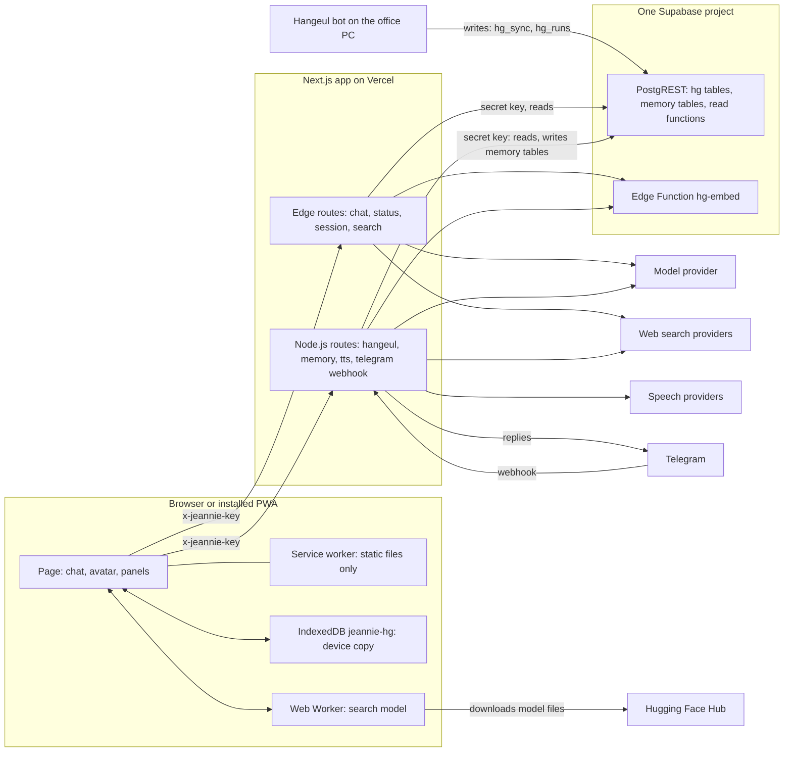
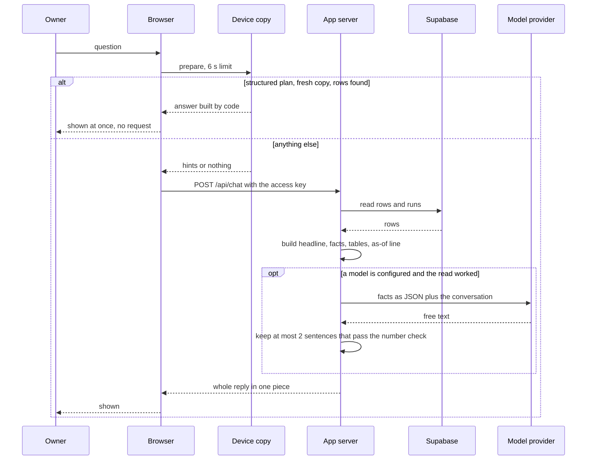

# Jeannie: the phone app that reads what the bot publishes

Jeannie is a web app with a chat screen. The owner opens it on a phone or a PC and asks questions. One kind of question is about the agency: students, payments, consultation requests, document checks, passport checks, reports. Jeannie answers those from the rows the Hangeul bot has published to Supabase. It never reads the agency's portal itself and it never writes the bot's data.

The app's code is in this repository under [`extras/jeannie-app/`](../extras/jeannie-app/). It is a snapshot of another repository, not part of the bot.

Related documents:

- [DATA_FLOW.md](DATA_FLOW.md): how data moves from the portal through the bot to Supabase and on to this app.
- [SITE_MAP.md](SITE_MAP.md): every place the whole project reads from or writes to.
- [programs/cloud.md](programs/cloud.md): the bot's Python code that publishes to Supabase (the writer side).
- [reference/13_SUPABASE_PUBLISHING.md](reference/13_SUPABASE_PUBLISHING.md): the bot-side description of what each record holds.
- [SCRUB_NOTES.md](SCRUB_NOTES.md): what was replaced or removed before publishing.
- [`extras/jeannie-app/README.md`](../extras/jeannie-app/README.md): the app's own README.

## How to read this document

- Every file of the app is under `extras/jeannie-app/`. Code is cited as `path:line` from the repository root.
- To keep lines readable, a file is cited with its full path the first time it appears in a numbered section (or in the file list at the start of sections 3 and 4). After that the same section uses the bare file name (`store.ts:36`) or, right after a citation of the same file, `:line` alone. When the sentence above a table names one file, the rows of that table give `:line` only.
- Paths that start with `src/cloud/` (no `extras/` prefix) are the bot's Python code at the repository root.
- The published copy holds no media files. The code names paths such as `/avatar/idle.mp4` and `/icons/icon-192.png`; those files are not in this repository.
- Nothing in this document was run. Every statement comes from reading the code and the app's own tickets. Measurements are quoted from the tickets and marked as such.

| Term | Meaning | Where defined |
|---|---|---|
| Hangeul bot | The Telegram bot on the office PC. It reads the portal and publishes what it reads. | repository root |
| portal | The agency's admin website. Only the bot reads it. | [SITE_MAP.md](SITE_MAP.md) |
| Jeannie | This app. Its npm package is at version 1.0.0; the package name is in the same file. | `extras/jeannie-app/package.json:2-3` |
| HUD | The app's wide-screen layout: a chat column with status panels. | `extras/jeannie-app/src/app/page.tsx:294-385` |
| avatar screen | The layout a phone held upright gets: a video avatar, subtitles and a hold-to-talk button. | `extras/jeannie-app/src/lib/avatar/view-mode.ts:9-10`, `extras/jeannie-app/src/app/page.tsx:282-293` |
| PWA | Progressive web app: a website the phone can install on its home screen. | `extras/jeannie-app/src/app/manifest.ts:6-25` |
| record | One row of the table `hg_records`: the latest state of one thing the bot read. | `extras/jeannie-app/src/lib/hangeul/types.ts:43-61` |
| kind | The type of a record. There are 26 kinds. | `extras/jeannie-app/src/lib/hangeul/types.ts:7-34` |
| chunk | A piece of a record's text with a 384-number vector, used for search. | `extras/jeannie-app/src/lib/hangeul/types.ts:64-71` |
| run | One row of `hg_runs`: one execution of a bot job. | `extras/jeannie-app/src/lib/hangeul/types.ts:76-84` |
| plan | What a question asks for, as code understood it. There are 17 plan types. | `extras/jeannie-app/src/lib/hangeul/types.ts:190-214` |
| access key | One shared secret, the setting `JEANNIE_ACCESS_KEY`. There are no user accounts. | `extras/jeannie-app/src/lib/auth.ts:20-25` |
| device copy | The full Hangeul dataset kept in the browser's IndexedDB. | `extras/jeannie-app/src/lib/client/hg-local/db.ts:1-12` |
| "as of" line | The last line of a Hangeul answer whose data was read and dated. It says when the bot last confirmed the data. An answer whose read failed, or that dated nothing, has no such line (section 3.6). | `extras/jeannie-app/src/lib/hangeul/answer.ts:1611-1639`, `:1671-1682` |

---

## 1. What it is and how it relates to the bot

### 1.1 What the app does

Jeannie is a Next.js 15 application (App Router, TypeScript) (`extras/jeannie-app/package.json:31`). It has one page and 12 API route files. Each chat message goes to exactly one "agent". The order of the checks is fixed (`extras/jeannie-app/src/lib/agents/orchestrator.ts:631-674`, `:81-105`):

1. A short approval or rejection that answers a pending "mistake audit" gets a fixed confirmation. No model is called (`:603-614`).
2. A smart-home command gets one fixed sentence. No device is contacted; the reply is simulated (`extras/jeannie-app/src/lib/agents/iot-interceptor.ts:1-6`).
3. A request to audit something for mistakes goes to the audit agent (`orchestrator.ts:94`).
4. A question about the agency's data goes to the Hangeul agent (`:96-98`). This is the subject of section 3.
5. A message with an image goes to the vision agent (`:99`).
6. A clock or time-zone question goes to the core agent, which has time tools (`:101`).
7. A question that needs fresh facts goes to the live-search agent (`:102-103`).
8. Everything else goes to the core agent (`:104`).

Around that sit a voice (text to speech), voice input, a "memory" of notes the owner uploads, and a Telegram bridge.

### 1.2 Relation to the bot: read only, one direction

The bot writes. The app reads. The two programs never call each other. They meet only in one Supabase project.

| Statement | Evidence |
|---|---|
| The app's Hangeul module never writes. | Header of `extras/jeannie-app/src/lib/hangeul/store.ts:1-3`: "Read-only: this module never calls hg_sync or writes anything." |
| Its only POST calls to the Hangeul data are two read functions. | The `rpc` helper accepts only the names `hg_match` and `hg_changes_since` (`store.ts:96`). All other reads are GET (`:87-94`, `:749`). |
| No app code names the bot's write function. | A search of `extras/jeannie-app/src/` for `hg_sync` finds one line: the comment at `store.ts:3`. |
| The app never contacts the portal. | `extras/jeannie-app/src/lib/env.ts:153-154`; `extras/jeannie-app/README.md:212`. An earlier portal bridge and its five `HANGEUL_*` settings were removed (`extras/jeannie-app/.scratch/hangeul-cloud-context/issues/05-answers-and-orchestrator.md:83-85`). |
| The bot is the writer. | The bot posts its rows to `/rest/v1/rpc/hg_sync` (`src/cloud/publish.py:780`) and inserts and updates its own `hg_runs` rows (`src/cloud/publish.py:409`, `:442`). |
| Both sides list the same 26 kinds in the same order. | `extras/jeannie-app/src/lib/hangeul/types.ts:7-34` and `src/cloud/records.py:41-47`. |
| The app's repository owns the database schema. | The migration is `extras/jeannie-app/supabase/migrations/20260929030000_hangeul_context.sql`. Decision D16 in `extras/jeannie-app/.scratch/hangeul-cloud-context/spec.md:36`. |

Two limits on "read only":

- The database does not enforce it. The app and the bot use the same class of key, the Supabase secret key (`extras/jeannie-app/src/lib/env.ts:118-122`; decision D6 in `extras/jeannie-app/.scratch/hangeul-cloud-context/spec.md:26`), and the migration grants that role `select, insert, update, delete` on all four tables (`extras/jeannie-app/supabase/migrations/20260929030000_hangeul_context.sql:328`). The app is read-only because its code is.
- The app does write to Supabase, but only to its own memory tables (`memory_documents`, `memory_chunks`, `jeannie_sessions`, `jeannie_audit_log`). See section 6.2.

### 1.3 Where the code came from

- The app lives in its own separate GitHub repository. The app's README names that repository in its deploy steps (`extras/jeannie-app/README.md:134`, `:136`).
- The Hangeul data reader was built on a feature branch of that repository. The app's spec names the branch and says the work on it is "not yet merged or deployed" (`extras/jeannie-app/.scratch/hangeul-cloud-context/spec.md:3-5`). Tickets 4 to 7 name the same branch on their `Status:` lines.
- This repository holds a snapshot of that branch: code, tests, database migrations and notes. It holds no media files (no icons, no avatar videos or posters, no source images) and no `.claude` folder. The app's README still mentions `.claude/skills/` (`extras/jeannie-app/README.md:302-313`); that folder is not here.

### 1.4 What the snapshot contains

210 files.

| Folder | Files | Contents |
|---|---|---|
| `extras/jeannie-app/` (top level) | 18 | `package.json`, `package-lock.json`, `next.config.mjs`, `vercel.json`, `tsconfig.json`, `tailwind.config.ts`, `postcss.config.mjs`, `eslint.config.mjs`, `vitest.config.mts`, `.env.example`, `.npmrc`, `.gitignore`, `.mcp.json`, `skills-lock.json`, `README.md`, `CLAUDE.md`, `CONTEXT.md`, and a one-byte file named `reference` whose purpose cannot be determined from the snapshot. |
| `src/app/` | 16 | The page, the layout, the manifest, the stylesheet and 12 API route files. |
| `src/components/` | 22 | The screen parts: chat, panels, avatar stage, camera, key dialog, sync panel. |
| `src/hooks/` | 15 | Browser logic: chat state, voice, sync scheduling, online status. |
| `src/lib/` | 56 | `agents/` (14), `hangeul/` (10), `client/hg-local/` (12), `client/` (4), `memory/` (3), `avatar/` (6), and 7 shared files (`abort.ts`, `auth.ts`, `emote.ts`, `env.ts`, `telegram.ts`, `types.ts`, `utils.ts`). |
| `supabase/` | 5 | Four SQL migrations and the Edge Function `hg-embed`. |
| `tests/` | 41 | 38 test files and 3 helper files. |
| `scripts/` | 10 | `copy-ort.mjs`, `upload-memory.mjs`, and 8 avatar clip tools. |
| `public/` | 3 | `sw.js`, `avatar/manifest.json`, `audio/.gitkeep`. |
| `docs/` | 4 | One decision record about the avatar, and three notes for coding assistants (the issue tracker, the triage labels, the domain documents). |
| `assets/` | 1 | `avatar/kling/clips.json`: a list of candidate avatar clips. |
| `.scratch/` | 19 | Two specs with their tickets: the Hangeul data reader (spec, bot prompt, 8 tickets) and the avatar (spec, audit, 7 tickets). The tracker is local Markdown (`extras/jeannie-app/docs/agents/issue-tracker.md:1-11`). |

---

## 2. Architecture



| Part | What it is | Where |
|---|---|---|
| Page | One client-side page at `/`. It shows the HUD, or the avatar screen on an upright phone. It holds no data of its own. | `extras/jeannie-app/src/app/page.tsx:40` |
| Service worker | A hand-written script. It caches the page shell, avatar clips, icons and build files. It never handles or caches any `/api/` request. | `extras/jeannie-app/public/sw.js:3`, `:27`, `:59-63`, `:149` |
| IndexedDB | Database `jeannie-hg`, version 1, with the stores `records`, `chunks` and `meta`. | `extras/jeannie-app/src/lib/client/hg-local/db.ts:16-20`, `:178-183` |
| Web Worker | Runs the embedding model `Supabase/gte-small` on the device to turn a question into a vector. | `extras/jeannie-app/src/lib/client/hg-local/embed.worker.ts:31-47` |
| Edge routes | Four routes run on Vercel's Edge runtime: `/api/chat`, `/api/status`, `/api/session`, `/api/search`. | `runtime = "edge"` in each `route.ts` (see section 5) |
| Node.js routes | Eight route files run as Node.js functions: five under `/api/hangeul`, plus `/api/memory`, `/api/tts`, `/api/telegram/webhook`. Two of them write to Supabase, and only to the app's own memory tables: `/api/memory` stores, pins and deletes notes in `memory_documents` and `memory_chunks`, and the Telegram webhook writes `jeannie_sessions` and `jeannie_audit_log` (section 6.2). | `runtime = "nodejs"` in each `route.ts`; writes in `extras/jeannie-app/src/lib/memory/store.ts:53-94`, `:232-264` |
| Supabase REST | The app reaches Supabase with plain `fetch`. There is no `supabase-js` package. | `extras/jeannie-app/src/lib/memory/supabase.ts:1-4`, `:64` |
| Edge Function `hg-embed` | Turns question text into vectors on Supabase's side. Called only by the app's server. | `extras/jeannie-app/supabase/functions/hg-embed/index.ts`; caller `extras/jeannie-app/src/lib/hangeul/store.ts:702-741` |
| Model provider | DeepSeek by default; Anthropic, OpenAI (or a compatible endpoint) or Ollama as alternatives. | `extras/jeannie-app/src/lib/agents/llm.ts:35-79`, `extras/jeannie-app/src/lib/env.ts:85-99` |
| Speech providers | ElevenLabs first, then Microsoft Edge's "Read Aloud" voices (both called by the server), then the browser's own speech. | `extras/jeannie-app/src/lib/agents/tts-engine.ts:147-199`; `extras/jeannie-app/src/hooks/useSpeechOutput.ts:8-12` |
| Telegram | A second way in: a webhook route. Any chat can ask `/whoami` for its own chat id. Only the admin chat set in `TELEGRAM_ADMIN_CHAT_ID` gets real answers. Other chats get only fixed texts: while no admin chat is set, the start or help text for `/start` and `/help` and a "locked" text for anything else; once it is set, a "private" text (section 5.4). | `extras/jeannie-app/src/app/api/telegram/webhook/route.ts:11-41`; `extras/jeannie-app/src/lib/telegram.ts:372-389` |

Facts that shape the design:

- The browser never talks to Supabase. Only the app's server holds the Supabase key (`extras/jeannie-app/.env.example:76-78`, `:83`).
- One Supabase project and one key serve both the memory and the Hangeul data. In the code `hangeul.enabled` and `memory.enabled` are the same expression (`extras/jeannie-app/src/lib/env.ts:147-159`).
- Vercel caps a response at 4.5 MB and the snapshot route at 60 seconds. The first-sync paging is built around both limits (`extras/jeannie-app/src/lib/hangeul/store.ts:44-47`, `:56-57`; `extras/jeannie-app/src/app/api/hangeul/snapshot/route.ts:14`).
- Every response carries four security headers: `X-Content-Type-Options: nosniff`, `Referrer-Policy: strict-origin-when-cross-origin`, `X-Frame-Options: DENY`, `Permissions-Policy: camera=(self), microphone=(self), geolocation=()` (`extras/jeannie-app/next.config.mjs:2-8`, `:24-26`). No Content-Security-Policy header is set.
- There is no middleware file, no login page and no rate limiting in the code. Access control is the access key, checked in each route.

---

## 3. The Hangeul data path

Files cited in this section by bare name:

| Bare name | Full path |
|---|---|
| `store.ts` | `extras/jeannie-app/src/lib/hangeul/store.ts` |
| `router.ts` | `extras/jeannie-app/src/lib/hangeul/router.ts` |
| `answer.ts` | `extras/jeannie-app/src/lib/hangeul/answer.ts` |
| `respond.ts` | `extras/jeannie-app/src/lib/hangeul/respond.ts` |
| `http.ts` | `extras/jeannie-app/src/lib/hangeul/http.ts` |
| `orchestrator.ts` | `extras/jeannie-app/src/lib/agents/orchestrator.ts` |
| `persona.ts` | `extras/jeannie-app/src/lib/agents/persona.ts` |

### 3.1 What the app reads

All reads are in `extras/jeannie-app/src/lib/hangeul/store.ts`. Every request goes through `supabaseRest` (`extras/jeannie-app/src/lib/memory/supabase.ts:40-95`), which sends the secret key in the header `apikey`, and also as `Authorization: Bearer` when the key is a legacy token that starts with `eyJ` (`:52-57`). Nothing is cached (`cache: "no-store"`, `:69`).

| Supabase object | How the app reads it | `store.ts` |
|---|---|---|
| table `hg_records` | `select=*` with filters, paged 1,000 rows at a time, at most 20,000 rows per call | `:184-214`, `:51-53` |
| table `hg_records` | exact row count (`Prefer: count=exact`, one row requested) | `:746-760` |
| table `hg_records` | `key, scope, day, read_at` of the newest `report` record (no content) | `:764-772` |
| table `hg_records` | snapshot batches: 200 records a request, 60 for the kind `doc_page_text` | `:546-548`, `:623` |
| table `hg_chunks` | `key, ord, content, embedding, embed_model` for a key range of one kind, 100 a request | `:43`, `:556-560` |
| table `hg_runs` | `job, started_at, finished_at, status, counts->by_kind, counts->failed_reads` of finished runs with status `ok` or `partial`; the 200 newest, plus the newest run for each asked kind that none of those read | `:256-257`, `:282-298`, `:58` |
| table `hg_changes` | `seq, kind, key, op, changed_at` since a time; and the newest `seq`. The column `data` of `hg_changes` is never selected. | `:332-354` |
| function `hg_match` | nearest chunks to a vector, 1 to 100 (default 12), optional kinds, day range, student | `:675-691` |
| function `hg_changes_since` | change rows after a sequence number, with the current record and its chunks, 1 to 1,000 rows | `:413-454` |
| function `hg_sync` | never called by the app | `:1-3` |
| Edge Function `hg-embed` | question text to vectors, at most 16 texts of 2,000 characters | `:693-741` |

Timeouts: 3 seconds for an answer read (`READ_TIMEOUT_MS`, `:36`), 15 seconds for one bulk request (`BULK_TIMEOUT_MS`, `:38`), 6 seconds for `hg_match` (`MATCH_TIMEOUT_MS`, `:49`). A failed read throws a `HangeulReadError` with a plain reason. It is never turned into an empty list or a zero (`:5-9`, `:71-85`). The reason never holds row data, keys or URLs (`extras/jeannie-app/src/lib/hangeul/types.ts:170`).

After each read the rows are checked again in code with the same filter function the phone uses, so the server and the device answer from the same rows (`store.ts:210-213`; `extras/jeannie-app/src/lib/hangeul/filter.ts:1-4`).

### 3.2 Who may ask

| Caller | Rule | Evidence |
|---|---|---|
| Any `/api/hangeul/*` route | The access key must be set on the server (else HTTP 403) and presented by the caller (else 401), and Supabase must be configured (else 503). | `extras/jeannie-app/src/lib/hangeul/http.ts:10-22` |
| The chat (`POST /api/chat`) | The Hangeul agent runs only when the request carries the valid access key. The cron bearer does not count. Without the key the reply is one fixed sentence and no data is read. | `extras/jeannie-app/src/app/api/chat/route.ts:79-81`; `extras/jeannie-app/src/lib/agents/orchestrator.ts:430`, `:131-137` |
| The Telegram admin chat | It reads the Hangeul data without the access key. The webhook secret and the admin chat id are the checks. | `extras/jeannie-app/src/lib/telegram.ts:340-347`, `:364-389`; `orchestrator.ts:357-364`, `:430` |
| An open deployment (no access key set) | Gets no Hangeul data on any path through the web. | `http.ts:12-14`; `extras/jeannie-app/src/lib/auth.ts:20-25` |

When Supabase is not configured the chat answers with a fixed "not connected" sentence (`orchestrator.ts:431-432`, `:139-145`).

### 3.3 How a question is routed

Step 1: is it a Hangeul question? `isHangeulContextQuery(text)` decides (`extras/jeannie-app/src/lib/hangeul/router.ts:582-584`). It uses regular expressions only. No model is involved. The text is first normalised: Unicode NFC, straight apostrophes, single spaces, raw input cut at 16,000 characters and routed text at 4,000 (`:14-24`).

The rules need a domain word next to a qualifier, because "Hangeul" is also the name of the Korean alphabet and words like "deadline" or "verified" are everyday words (`:1-4`). The rules are tried in this order (`:543-572`):

1. a named report (missing, document check, field check, stage, inquiries)
2. a student named by HNG id, portal uid, passport number or name
3. inquiries (consultation requests)
4. consultancies done
5. consultant performance
6. passport checks (strict cue)
7. passport checks (loose cue, not next to travel words)
8. document checks
9. verified payments
10. pending payments
11. window applications
12. missing information
13. calendar and deadlines
14. changes since a time
15. the daily brief ("daily brief", "today's briefing" and the Korean forms)
16. dashboard figures
17. students who applied
18. the older phrasings kept from the removed portal bridge ("Hangeul daily report", "is the portal up?", "admin report" and similar); report wording among them becomes the daily brief (`:34-75`, `:732-745`)
19. status wording about the data

Three word lists guard the rules (`:102-115`, `:546-549`):

- A `NOT_OURS` word (PayPal, Instagram, "my account", "do I owe" and similar) keeps the verified-payment, pending-payment and calendar rules out.
- A `FOREIGN` word (currencies, markets, sport, news, software) keeps the loose rules out (performance, loose passport cue, changes, dashboard).
- An `ANCHOR` word (hangeul, portal, an HNG id, consultant, consultancy, inquiry, "our agency" and similar) lets the loose rules in even next to a `NOT_OURS` or `FOREIGN` word.

A passport-shaped token counts as a passport number only next to a passport or student word (`:128-130`, `:211-212`). An HNG id is zero-padded to three digits (`:200-203`).

With an image attached, the message stays with the Hangeul agent only when the text names the portal and does not name a picture (`extras/jeannie-app/src/lib/agents/orchestrator.ts:69-79`, `:96`).

Step 2: which plan? `classify` turns the matched rule into a plan (`router.ts:654-748`). A Hangeul question that fits no structured plan becomes a `semantic` plan, which is a vector search (`:733-745`; `extras/jeannie-app/src/lib/hangeul/answer.ts:1534-1536`).

Days are worked out in the business time zone (`extras/jeannie-app/src/lib/hangeul/days.ts:1-3`). The words the router understands (`router.ts:422-469`): an ISO date, "12 Sep", "Sep 12", the Korean month-day form, "day before yesterday", "yesterday", "tomorrow", "last N days" (1 to 366), "next week" (tomorrow to today + 7), "this week" (today − 6 to today), "last week" (today − 13 to today − 7), "last month", "this month", "today".

### 3.4 The 17 plans: what code reads and what it builds

File for the "builds" column: `extras/jeannie-app/src/lib/hangeul/answer.ts`. File for the "router" column: `extras/jeannie-app/src/lib/hangeul/router.ts`. The kinds each plan reads are listed in `planKinds` (`answer.ts:386-419`).

| Plan | Asked how (router) | Kinds read | What code builds (answer) |
|---|---|---|---|
| `student_card` | a student is named and no document, missing or passport word (`:664-673`) | `student`, `student_progress`, `doc_check` | A headline with name, HNG id, portal uid and stage. Up to 20 facts from the student record (program, target intake, university, stage, applied date, documents status, payment status, amount paid with method, who verified it and when, passport number, passport expiry, date of birth, mobile, e-mail, guardian contact, father, mother, district, consultant, language test), plus progress and the document check verdict (`:451-527`). No match or several matches end the answer with a line or a table of at most 10 candidates (`:423-445`). |
| `verified_on_day` | payments verified on a day or range (`:693-694`) | `verification` | Count, total per currency, a table by verifier, a table by day for a range, the list of payments (`:537-571`). |
| `inquiries_on_day` | requests received on a day or range, optionally one status (`:674-678`) | `consultation_day`, `consultation` | For one day: count with a breakdown by current status, a note when the portal's own count differs, and a table of the requests (requester, status, consultant, last updated by, received). For a range: tables by day and by status and the days not read yet (`:582-690`). |
| `pending_payments` | pending or unpaid payments (`:695-696`) | `pending_payment` | Count, the portal's badge number, the list (`:922-937`). |
| `window_review` | window applications under review (`:697-698`) | `window_application` | Count and list (`:939-952`). |
| `doc_verdicts` | document check words, with or without a student (`:671`, `:702-703`) | `student`, `doc_check`, `doc_verdict`, `field_check` | For one student: the verdict, the documents table (failed first), the fields that did not match. Without a student: the document checks counted by verdict; for `FLAG` or `MISSING`, the documents with that verdict counted by student; for another named verdict, the students with it (`:954-1054`). |
| `passport_alerts` | passport check words, with a day, a range, a student or none (`:667`, `:699-701`) | `passport_alert`, `student` | Scans counted, scans with a problem, alerts sent; a table by status; the scans needing attention, newest first (`:1065-1116`). |
| `calendar_window` | deadlines or calendar; 14 days ahead, or 60 when a university or place is named; "this week" is today to today + 6, "this month" is today to the month's last day (`:706-717`) | `calendar_item` | Items that overlap the window; with a named place only the items that mention it; a note when the window reaches past 45 days, which the portal's calendar does not show (`:1128-1175`). |
| `missing_for_student` | a student and a "missing" word (`:666`) | `student`, `report`, `doc_verdict` | What the newest missing-information report says for that student, documents marked missing, fields the portal left blank (`:1177-1217`). |
| `changes_since` | "what changed since ..." with a time (`:718-721`) | the change log, not records | Counts of new-or-updated and removed records, and a table by kind. Reads at most 20,000 change rows. Server only (`:1219-1251`). |
| `report` | the daily brief or a named report, optionally for a day (`:704-705`, `:722-725`) | `report`, `dashboard_fact` | The newest matching report record's stored facts. With no brief on file, it says so and shows two dashboard groups instead (`:1280-1330`, `:1362-1389`). |
| `performance` | consultant performance today or for a month (`:686-692`) | `consultant_performance` | The page's four tiles, the top performer, the leaderboard table. A range of days is answered with "not on the portal" plus each day's stored window (`:872-920`, `:774-814`). |
| `consultancies_closed_today` | consultancies done on a day (`:679-685`) | `consultant_performance`, `consultation_day`, `consultation` | The "Consultancies done" tile, the count per consultant, the tiles, and the requests received that day as a separate labelled figure (`:816-870`). |
| `students_applied` | students who applied or registered in a period (`:728-729`) | `student` | Count, a table by program, the list (`:1391-1408`). |
| `dashboard` | dashboard figures, total student counts (`:726-727`) | `dashboard_fact` | One table per dashboard group (`:1333-1360`, `:1585-1588`). |
| `data_status` | is the portal up, when was the data last updated (`:730-731`) | the runs | The newest run of each job and the reads that failed. Jeannie never checks the portal itself. Server only (`:1410-1426`). |
| `semantic` | anything else that is a Hangeul question, or a free-text question about a student's document (`:668-670`, `:733-745`) | chosen by search | Record "cards": at most 5 from the server's own search (`:1511`); when the caller sent hits, one card for each hit record the server finds among the first 24 hits, with no limit of 5 (`:1466-1477`). See section 3.7. |

Two plans cannot run on the device and always go to the server: `changes_since` and `data_status` (`extras/jeannie-app/src/lib/hangeul/types.ts:218-219`).

Rules the answer code keeps (`answer.ts:7-12`):

- A kind that no run has read and no row holds is "not available yet". It is never shown as 0 (`:294-297`, `:358-361`).
- A portal field the bot marked as left blank (`data.blank_on_portal`) is shown as "not given on the portal" (`:56`, `:152-155`).
- A table added through the shared `table` helper shows at most 40 rows; the rest is counted in a note (`:57`, `:363-370`). The tables of `changes_since`, `report`, `dashboard`, `data_status` and the search cards are added directly and do not use this cap; some have smaller caps of their own (12 fields per search card, the 12 most often missing fields, 25 lines of an unrecognised report) (`:1301`, `:1328`, `:1451`).
- A performance window is used only when its own first day is the day asked for. Another day's figures are never offered as today's (`:698-709`).

### 3.5 What code builds and what a model may add

`answerHangeul` runs one answer from start to end (`extras/jeannie-app/src/lib/hangeul/respond.ts:99-138`).



What code does, always:

1. Chooses the plan (`respond.ts:101`).
2. Reads the rows and computes the headline, the facts, the tables, the notes and the "as of" data (`:103-109`; `answer.ts:1538-1602`).
3. Renders them as text. In bilingual mode the English block comes first, then a line with a dash, then the Korean block (`answer.ts:1671-1689`).

What a model may add, and only when one is configured and the data could be read (`respond.ts:111-112`):

- At most two sentences placed before the code-built text. The model is told so in its instructions (`extras/jeannie-app/src/lib/agents/persona.ts:58-59`) and the code enforces it (`answer.ts:1772-1781`).
- An emote tag such as `[emote:concern]` that picks the avatar's expression (`respond.ts:133-136`; `extras/jeannie-app/src/lib/emote.ts`).
- For a search question written in Korean or Bangla: one English search query. The stored text is English (`answer.ts:1430-1442`; `respond.ts:81-97`). This is the one place where a model affects which records are found.

What the model receives for the two sentences (`respond.ts:116-126`):

- A system prompt: the persona, the Hangeul role text, the current UTC time and the home time zone, the language rule, the form of address, the recalled memory notes when the caller is trusted, the facts as JSON, the emote rule (`persona.ts:76-89`).
- The facts JSON: `intent`, `unavailable`, the English headline, every fact (label and value), every table (title, columns, the first 20 rows), the notes, the "as of" line (`answer.ts:1691-1702`). The values are real data and include personal data. The code comment says so: "values included, PII too" (`:1691`).
- The conversation so far (the server keeps the last 20 messages, `orchestrator.ts:48`, `:622-627`), or the question alone when no conversation is passed (`respond.ts:122`).

The number check (`answer.ts:1704-1781`):

- The model's text is split into sentences.
- Every number in a sentence is turned into a typed token: an id (for example an HNG id), a date, a clock time, or a plain count.
- A sentence is kept only if each of its tokens also appears, as the same type, in the code-built text. A time in the "as of" line does not allow the same digits as a count.
- At most two kept sentences are used. The dropped ones are returned in `dropped`.
- The check covers numbers, dates, times and ids only. Names and other words in the model's sentences are not checked.

Limits on the model calls: 8 seconds for the sentences and 4 seconds for the query rewrite (`respond.ts:25-26`); no retry (`:89`, `:124`); an output cap of 220 tokens for the sentences and 80 for the rewrite, or 1,024 with low effort when the provider is Anthropic (`:71-78`). If the call fails, the reply is the code-built text alone (`:128-131`).

The reply is `[emote tag] sentences`, a blank line, then the code-built text (`:135-136`). It is sent in one piece and not streamed, because the check must finish first (`orchestrator.ts:424-428`, `:449`).

A Hangeul reply is never read aloud. The browser replaces it with one fixed sentence before anything goes to the speech route, because the speech providers are third parties (`extras/jeannie-app/src/lib/client/speech-text.ts:9-26`; `extras/jeannie-app/src/app/page.tsx:106-108`). The guard looks only at which agent answered, so it does not cover a later reply of another agent that repeats Hangeul data (section 7).

### 3.6 The "as of" time

An answer whose data was read and dated ends with a line such as `As of 23:35 (full picture) · portal sync 23:58` (`answer.ts:1611-1639`, `:1680-1681`). In Korean the line starts with `기준:` (`:1635-1637`).

Not every answer has this line:

- When a read fails, the answer is only one sentence saying the Hangeul data could not be read, with the reason, and that the figures will not be guessed. No "as of" line is added (`:1665-1672`).
- When nothing was dated, `asOfLine` returns an empty string and no line is added (`:1620`, `:1680-1681`). Two examples: a search question that could not be turned into a vector, which reads nothing (`:1491-1493`), and a search with no student named for which `hg_match` returned no chunk (`:1501-1516`).

Where the time comes from:

1. The default is the bot's runs, not the rows. For each kind the answer used, the code takes the newest finished run (status `ok` or `partial`) whose `counts.by_kind` names that kind (`:218-233`, `:338-356`). The label in brackets is a readable name for that run's job, such as "full picture" or "portal sync" (`:61-76`).
2. A run of the job `command` never dates a whole kind. A Telegram command publishes one day or one period only (`:226-233`).
3. If no run dates the kind, the newest `read_at` of the rows read is used and the label is the kind's name (`:351-352`, `:1616`).
4. Some figures have their own rule:
   - Requests of one day: the newest run that re-read that day, or the rows' own `read_at` when newer (`:240-276`, `:592-596`).
   - A past performance window: the last run on that day (`:755-767`).
   - A student's document check, verdicts and field checks: the record's own `read_at` (`:515`, `:975`, `:990`, `:1002`).
   - A report: when the report was made (`:1381`).
   - "What changed": now, labelled as the live change log (`:1225`).
5. A time that is not today gets its date in front (`:1621-1626`).

Why runs and not rows: a record's `read_at` moves only when its content changes. The database function updates a row only when its hash differs (`extras/jeannie-app/supabase/migrations/20260929030000_hangeul_context.sql:211-216`). A row that was re-read and found unchanged keeps its old time, so the row's time alone would understate how fresh the data is (`answer.ts:9-11`; `extras/jeannie-app/src/lib/hangeul/types.ts:57`).

The time zone is the setting `JEANNIE_TIMEZONE`, default `Asia/Dhaka` (`extras/jeannie-app/src/lib/env.ts:62-73`). The device gets the zone from `/api/status` and uses `Asia/Dhaka` until that answers (`extras/jeannie-app/src/app/page.tsx:37-38`, `:70`).

The device shows the same line as the server because it syncs the runs too (section 4.2, step 2).

One time is written into the answer text as a constant: the brief "at 18:05" (`answer.ts:1373`, `:1387`).

### 3.7 Search (the `semantic` plan)

Search compares vectors. The bot stores a 384-number vector for every chunk of text. A question must be turned into a vector with the same model family (`gte-small`).

Server path (`answer.ts:1463-1529`):

1. If the caller sent hits, the server re-reads the records of the first 24 hits by key from the current rows and shows a card for every record it finds. Steps 2 to 7 are skipped, and this path has no limit of 5 (`:1466-1477`). The app's own browser sends at most 5 hits (`extras/jeannie-app/src/lib/client/hg-local/search.ts:41-42`), but `/api/chat` and `/api/hangeul/ask` both accept up to 24 (`extras/jeannie-app/src/app/api/chat/route.ts:31-34`; `extras/jeannie-app/src/app/api/hangeul/ask/route.ts:26-29`).
2. Otherwise, a Korean or Bangla question is first rewritten into English by the model, when a model is configured (`:1479`).
3. The vector is the device's vector when the question was not rewritten. Otherwise the server asks `hg-embed`. If `hg-embed` fails, the device's vector is used when there is one (`:1480-1490`).
4. With no vector the answer is the note "Search is not available yet: the question could not be embedded." (`:1491-1493`).
5. `hg_match` returns the 12 nearest chunks (`:1501`).
6. Hits more than 0.04 below the best score are dropped. The scores of this model sit close together (`:1504-1505`).
7. At most 5 records are shown on this path (`:1511`).

On both paths a card shows at most 12 fields, each cut at 200 characters (`:1444-1454`). For the kinds `doc_page_text`, `report` and `notification` it also shows up to 30 lines of the matched text, each cut at 300 characters (`:1457-1460`).

The call to `hg-embed` has a 3-second timeout (`store.ts:719`). HTTP 404 becomes the reason "embedding function not deployed" (`:726-729`). Structured plans never need it (`:697-701`).

### 3.8 Where the owner sees the data

File for this subsection: `extras/jeannie-app/src/components/TacticalMetrics.tsx`.

| Place | What it shows or does | Evidence |
|---|---|---|
| HUD status row "HANGEUL" | "NOT LINKED", "DATA LINKED", or `DATA · N` (N the record count) when `/api/status` returned the count; the newest run of each job in its tooltip. | `:120-138` |
| HUD panel "Hangeul Data" | Calls `GET /api/hangeul` and on success shows "DATA LINKED" with the record count, the time of the newest brief (or, until there is one, the newest report), and the newest run. No request is made in two cases: when `/api/status` reports the data as not configured, the headline is "NOT LINKED" with "Not linked: set SUPABASE_URL and SUPABASE_SECRET_KEY."; when a key is required and this browser holds none, the headline is "NO SIGNAL" with "Locked: access key required.". When the request is refused or fails, the headline is "NO SIGNAL" with one of "Locked: access key required.", "Set JEANNIE_ACCESS_KEY: the data holds student records." or "Hangeul data unreachable.". | `:287-317`, `:326-339`, `:350-360` |
| Button "DAILY REPORT" in that panel | Sends the chat message "Hangeul daily report". The router takes it by its older-phrasing rule and makes it the `report` plan for the daily brief (`extras/jeannie-app/src/lib/hangeul/router.ts:36`, `:732-734`). Disabled while offline. | `:350-360`, `:430` |
| HUD panel "Hangeul Sync" | The copy on this device (section 4). | `extras/jeannie-app/src/components/HangeulSyncPanel.tsx:160-240` |
| Telegram `/report` in the admin chat | The same brief, built by code with no model (section 5.4). | `extras/jeannie-app/src/lib/telegram.ts:253-269` |

---

## 4. The copy on the phone

The browser can keep the whole Hangeul dataset. The copy exists for speed while online. It is never used to answer offline: offline, the app shows a banner and disables the input (`extras/jeannie-app/src/lib/client/reachability.ts:1-4`; `extras/jeannie-app/src/lib/client/hg-local/ask.ts:1-16`).

Files cited in this section by bare name:

| Bare name | Full path |
|---|---|
| `ask.ts`, `check.ts`, `db.ts`, `device.ts`, `embed-protocol.ts`, `embed.worker.ts`, `embedder.ts`, `ort-runtime.ts`, `search.ts`, `sync.ts` | `extras/jeannie-app/src/lib/client/hg-local/` |
| `api.ts` | `extras/jeannie-app/src/lib/client/api.ts` |
| `useHangeulLocal.ts`, `useJeannieChat.ts` | `extras/jeannie-app/src/hooks/` |
| `HangeulSyncPanel.tsx`, `HangeulSyncNotice.tsx` | `extras/jeannie-app/src/components/` |
| `store.ts`, `vectors.ts` | `extras/jeannie-app/src/lib/hangeul/` |
| `sw.js` | `extras/jeannie-app/public/sw.js` |

### 4.1 When it starts, and what "Sync to this device" does

The sync starts by itself when all of these hold (`extras/jeannie-app/src/hooks/useHangeulLocal.ts:328-337`, `:404-406`; `extras/jeannie-app/src/app/page.tsx:65`):

- `/api/status` says the Hangeul data is configured and an access key is required,
- this browser holds an access key,
- the browser is online,
- the stored preference is not "off",
- IndexedDB is available.

On mobile data the first download waits for a yes. The rule (`extras/jeannie-app/src/lib/client/hg-local/sync.ts:296-307`): ask when the browser reports data saving or a `cellular` connection; do not ask on `wifi` or `ethernet`; when the browser cannot tell, ask on a phone. The yes is a button: "DOWNLOAD NOW" in the HUD panel (`extras/jeannie-app/src/components/HangeulSyncPanel.tsx:203-208`) or "Download" in the notice on the avatar screen (`extras/jeannie-app/src/components/HangeulSyncNotice.tsx:20-39`). The yes is not remembered across page loads (`useHangeulLocal.ts:170`, `:345`).

"SYNC TO THIS DEVICE" is the button shown after the copy was deleted (`HangeulSyncPanel.tsx:209-214`). It sets the preference back to "auto", tells the other tabs, and starts the same first sync (`useHangeulLocal.ts:495-502`). Pressing it also counts as the yes for mobile data: it sets the same flag as "DOWNLOAD NOW" before the sync starts, so that first sync does not ask again (`:496`, `:345`). Like the other yes, it lasts until the page is reloaded (`:170`).

### 4.2 What is downloaded

| Step | Request | What arrives | Evidence |
|---|---|---|---|
| 1. First sync | `GET /api/hangeul/snapshot`, then `?cursor=<next>` until `next` is null | Every record of all 26 kinds, with every column including `data` and `content`, and every chunk with its vector. Kinds come in the fixed order of the kind list, keys in key order. | `sync.ts:171-226`; `store.ts:581-653` |
| 2. Runs | `GET /api/hangeul/runs` | The bot's finished runs (job, times, status, kinds read, failed reads). No student data. | `sync.ts:279-283`; `extras/jeannie-app/src/app/api/hangeul/runs/route.ts:16-24` |
| 3. Changes | `GET /api/hangeul/changes?since=<seq>&limit=200`, repeated while `more` is true | For each change after the copy's sequence number: the current record and its chunks (an upsert), or only kind and key (a delete). | `sync.ts:228-260`; `extras/jeannie-app/src/lib/client/api.ts:35`, `:389-392` |
| 4. Search model | A download by the browser from the Hugging Face Hub | The model files of `Supabase/gte-small`, quantized (`q8`). No question text is sent. | `extras/jeannie-app/src/lib/client/hg-local/embed-protocol.ts:4-10`; `embed.worker.ts:15-17`, `:34-36` |
| 5. Model runtime | `GET /ort/...` on the app's own origin | The ONNX runtime files (one variant: a `.mjs` and a `.wasm`). Never from a CDN. | `extras/jeannie-app/src/lib/client/hg-local/ort-runtime.ts:1-15`, `:38-42` |

On the wire a vector is base64 of 384 little-endian 32-bit floats: 1,536 bytes, 2,048 characters (`extras/jeannie-app/src/lib/hangeul/vectors.ts:1-2`). A chunk's text is left out when it equals its record's text (`store.ts:380-387`).

How a snapshot page is cut (`store.ts:592-653`):

- A page holds at most 3,000,000 bytes of UTF-8 JSON, and stops once it reaches 90% of that (`:57`, `:637`, `:650`).
- No new batch starts after 30 seconds; no request runs past 50 seconds (`:45-47`, `:597-600`, `:615`).
- A batch that times out after others were gathered ends the page with those (`:627-631`).
- The first page reads the newest change-log sequence number before anything else. Applying the later changes on top of the snapshot then gives the current data (`:584-585`, `:607`).
- The cursor holds the last record key, which for most kinds contains a passport number and a file name. It travels in a URL, so it is sealed with AES-256-GCM under a key derived (HKDF, SHA-256) from the server's Supabase key (`:480-518`). A cursor the server cannot open answers HTTP 400 `invalid_cursor` (`extras/jeannie-app/src/lib/hangeul/http.ts:28`). The device then starts the first sync over, once (`sync.ts:165-169`, `:192-202`).

### 4.3 Where it is stored

| Store | Name or key | Contents | Evidence |
|---|---|---|---|
| IndexedDB database `jeannie-hg` v1, store `records` | key `[kind, key]` | The whole record as received. | `db.ts:16-20`, `:180` |
| same, store `chunks` | key `[kind, key, ord]` | The vector (`Float32Array`, 384), the model name, the chunk text when it differs from the record's, and the record's `day` and `student_uid`. | `db.ts:22-35`, `:181` |
| same, store `meta` | by name | `max_seq`, `embed_model`, `synced_at`, `complete`, `snapshot_next` (the sealed cursor), `snapshot_seq`, `runs`, `runs_at`, `model_check`. | `db.ts:48-64`, `:182` |
| `localStorage` | `jeannie.hg.device` | `"auto"` or `"off"`: whether this browser keeps the copy. | `extras/jeannie-app/src/lib/client/hg-local/device.ts:18`; `useHangeulLocal.ts:153` |
| `localStorage` | `jeannie.accessKey` | The access key in plain text. It is also kept in a variable so it works when storage is blocked. | `extras/jeannie-app/src/lib/client/api.ts:28`, `:38-46`, `:66-75` |
| Cache Storage | `transformers-cache` | The search model files and the runtime files, cached by the model library, not by the app's service worker. | `embed.worker.ts:1-9`; `ort-runtime.ts:11-13`; `extras/jeannie-app/public/sw.js:10` |
| Cache Storage | `jeannie-v4` | The page shell, avatar clips, icons, build files. Never an `/api/` response. | `sw.js:16-17`, `:24-31`, `:50-63` |

Other per-browser keys in `localStorage`, none holding Hangeul data: `jeannie.lang`, `jeannie.voice` (`extras/jeannie-app/src/app/page.tsx:41-42`), `jeannie.view`, `jeannie.lastSeen` (`extras/jeannie-app/src/lib/avatar/view-mode.ts:6`, `:22`).

Properties of the copy:

- It is plain IndexedDB. It is not encrypted. The spec records this as an accepted risk (`extras/jeannie-app/.scratch/hangeul-cloud-context/spec.md:41-42`).
- Student data is in IndexedDB and nowhere else on the device (`db.ts:11-12`).
- Each page is written in one transaction together with its cursor. A page lands whole or not at all, so a first sync that was cut short resumes where it stopped (`db.ts:9-10`, `:200-221`; `sync.ts:176-181`, `:210-218`).
- The app asks the browser not to evict the copy (`navigator.storage.persist()`). The browser may refuse (`db.ts:255-262`; `useHangeulLocal.ts:352`).
- All tabs of the same origin share the one database. A Web Lock named `jeannie-hg-sync` lets one tab sync at a time (`useHangeulLocal.ts:105-116`).
- The chat itself is kept in memory only and is lost on reload (`extras/jeannie-app/src/hooks/useJeannieChat.ts:102`, `:318-322`).

### 4.4 How big

| Figure | Value | Source |
|---|---|---|
| Size shown to the user for the first sync | "about 60 MB" | constant, `HangeulSyncPanel.tsx:10` |
| Size shown to the user for the search model | "about 35 MB" | constant, `HangeulSyncPanel.tsx:11` |
| Model size in the code comment | about 34 MB | `embed-protocol.ts:6` |
| Measured first sync | 20 pages, 13,546 records, 15,635 chunks, 56.9 MB of JSON, 49 seconds, slowest page 6.0 seconds. Run from the PC through the route handlers, not on a phone. | ticket, `extras/jeannie-app/.scratch/hangeul-cloud-context/issues/07-hg-local-device-copy.md:134-138` |
| Records per kind in that check (nine kinds listed) | student 340; consultation 1,035; consultant performance 17; document verdict 2,717; field check 3,490; document page text 3,469; passport alert 311; report 3; report section 434 | same ticket, `:138-140` |
| A later check after the paging was changed | 20 pages, 364 seconds in total, each page 11 to 29 seconds. Read directly from the PC. | ticket, `extras/jeannie-app/.scratch/hangeul-cloud-context/issues/04-store-and-routes.md:113-116` |
| The four runtime files copied to `/ort/` | 41 MB in total; the browser loads one variant of two files | ticket 7, `:168-170`; `ort-runtime.ts:25-26` |
| Vector bytes once decoded | 15,635 × 1,536 bytes ≈ 24 MB. This is arithmetic, not a measurement. | `vectors.ts:1-2` and the count above |
| Search index over that copy | Built in 23 ms; one search 9.9 ms. Measured on the PC, not on a phone. | ticket 7, `:141` |
| Space the copy takes in IndexedDB | Not measured in the code or the tickets. | |
| Size cap | None in the code. A full device shows "Not enough storage on this device for the copy." | `useHangeulLocal.ts:148` |

Time on a phone and time from the Vercel region have not been measured (ticket 4, `:115-116`).

### 4.5 How it stays current

One sync does three things in this order: the first sync if the copy is not complete, then the runs, then the change log (`sync.ts:262-286`). The runs are read before the changes so that every run used to date an answer already has all its changes applied.

A sync is started (`useHangeulLocal.ts:42-46`, `:403-427`):

- when the page opens and whenever syncing becomes possible,
- when the window gets focus or becomes visible, but not within 30 seconds of the last start,
- every 5 minutes while the page is visible,
- when the connection type changes.

Applying the change log (`sync.ts:146-163`, `:228-260`; `db.ts:85-86`, `:206-214`):

- Changes are applied in sequence order.
- An upsert replaces the record and all its chunks.
- A delete drops the record and its chunks. The bot's hard deletes reach the phone this way.
- An upsert whose record no longer exists is skipped; its delete follows in the feed.
- One sync reads at most 100 change pages (`sync.ts:238`). If more remain, the panel says "Catching up with the change log." (`useHangeulLocal.ts:372`).
- Each request has a 60-second timeout (`api.ts:34`).
- A malformed page or vector stops the sync and leaves the cursor unchanged (`sync.ts:65-71`, `:130-144`).

`synced_at` is written only when the copy has fully caught up (`sync.ts:216`, `:250`).

### 4.6 What the device answers by itself

For each message the browser first asks the device copy, with a 6-second limit (`useJeannieChat.ts:67-68`, `:186-209`). A message with an image skips this (`:189`). The decision is in `prepareHangeul` (`ask.ts:104-122`):

| Case | Result | Evidence |
|---|---|---|
| Not a Hangeul question | The chat continues as usual. The device applies the server's order: smart-home and mistake-audit rules first. | `ask.ts:96-102`, `:107` |
| No complete copy | Server | `:109` |
| A `semantic` plan | Device search (below), then the server | `:112` |
| `changes_since` or `data_status` | Server | `:113` |
| The copy did not catch up within the last 6 minutes, or holds no runs | Server | `:30`, `:66-71`, `:114` |
| The local read failed | Server | `:116`, `:119-121` |
| The answer found no record on the device | Server. An empty result may only mean the copy is behind. | `:117` |
| Otherwise | The answer is built on the device with the same `runPlan` and `renderAnswer` code and shown at once. No request is sent. No model is used. | `:115-118`; `useJeannieChat.ts:193-207` |

Device search (`ask.ts:73-94`; `extras/jeannie-app/src/lib/client/hg-local/search.ts`):

1. A Korean or Bangla question goes to the server, whose model rewrites it first.
2. The model check must have passed, and the model must be loaded. Otherwise the question goes to the server with no hints.
3. The question is turned into a vector in the Web Worker. The text stays on the device (`embed.worker.ts:5-7`).
4. The vector is compared with every local chunk vector by cosine (`search.ts:69-107`). The index is one `Float32Array` built from all chunks (`:46-67`) and rebuilt when a sync changed data (`useHangeulLocal.ts:160-166`, `:364`).
5. The 12 nearest chunks are reduced to records: the best chunk per record, within 0.04 of the best score, at most 5 (`search.ts:39-42`, `:79`, `:109-124`).
6. The browser sends the question to `POST /api/chat` with `hangeul: {embedding, hits}`: the vector as base64 and the record keys (`ask.ts:83-93`; `useJeannieChat.ts:210-213`). The server re-reads those records from the current rows and answers.

The model check (`extras/jeannie-app/src/lib/client/hg-local/check.ts`):

- The bot's vectors come from `thenlper/gte-small` in full precision. The device runs a quantized export. They must agree before device search is trusted (`:1-8`).
- Three stored chunk texts from three different kinds, each 20 to 1,500 characters long, are embedded on the device and compared with their stored vectors (`:13-17`, `:29-45`).
- A lowest cosine of 0.98 or more is `ok`. Below that is `mismatch`: search stays on the server. A model that did not load is `unavailable` and is checked again later (`:47-70`).
- The result is stored in `meta.model_check` (`useHangeulLocal.ts:244-261`).
- The check runs after a sync, unless the stored result is already `ok` or `mismatch`, and only on a connection that needs no consent or after a yes, because it downloads the model (`useHangeulLocal.ts:375-378`). After an `ok`, the index and the model are warmed 2 seconds later (`:46`, `:263-272`).
- The first model load may take up to 180 seconds; one question 8 seconds (`extras/jeannie-app/src/lib/client/hg-local/embedder.ts:6-9`).

### 4.7 How to delete it

| Action | What it does | Evidence |
|---|---|---|
| "Delete local copy" (HUD, Hangeul Sync panel) | Asks for confirmation. Stops this tab's sync and the search worker, clears all three stores, and only then sets the preference to "off" and tells the other tabs. Nothing syncs again in any tab until "SYNC TO THIS DEVICE". If the clear fails, the copy stays on and the panel says it could not be deleted. | `HangeulSyncPanel.tsx:175-186`; `useHangeulLocal.ts:461-493`; `device.ts:102-116` |
| Another tab deleted it | This tab stops its sync and clears the store once more. | `device.ts:118-126`; `useHangeulLocal.ts:292-306` |
| "Re-sync everything" | Asks for confirmation. Clears the store and downloads everything again. The confirmation counts as the yes for mobile data. | `HangeulSyncPanel.tsx:165-173`; `useHangeulLocal.ts:446-459` |
| Clearing the site's data in the browser settings | Removes IndexedDB. The panel suggests this when a delete fails. | `HangeulSyncPanel.tsx:182` |
| Forgetting the access key | Does not delete the copy. It only removes the key, which stops syncing. | `extras/jeannie-app/src/app/page.tsx:266-270`; ticket 7, `:100-101` |

The buttons are in the HUD's "Hangeul Sync" panel. The phone's avatar screen has no panels; it has a control that switches to the HUD (`extras/jeannie-app/src/app/page.tsx:288`), and the HUD on a phone has a button back to the avatar (`:386-388`).

The panel's "NOT ON THIS DEVICE" is shown only when the store really holds nothing. With syncing off but records still stored it says how many are still there and keeps the delete button enabled (`HangeulSyncPanel.tsx:87-116`).

The search model in `transformers-cache` is not removed by any of these buttons. No code in the app deletes that cache (`sw.js:10`, `:137-144`).

If the access key leaks, changing it stops new reads. Data already on a device stays there (`extras/jeannie-app/.scratch/hangeul-cloud-context/spec.md:45-46`).

---

## 5. Pages, routes and their access control

### 5.1 The four kinds of access check

| Name used below | Rule | Evidence |
|---|---|---|
| open | No check at all. | |
| `requireAccess` | With no `JEANNIE_ACCESS_KEY` on the server the route is open to anyone. With one, the caller must send it in the header `x-jeannie-key` or as `Authorization: Bearer`; otherwise HTTP 401 `access_key_required`. The comparison is constant-time. | `extras/jeannie-app/src/lib/auth.ts:14-25`, `:35-44`; `extras/jeannie-app/src/lib/types.ts:64`; `extras/jeannie-app/src/lib/utils.ts:141-149` |
| strict gate | HTTP 403 when the key is not set on the server, 401 when it is not presented, 503 when Supabase is not configured. An open deployment gets nothing. | `extras/jeannie-app/src/lib/hangeul/http.ts:10-22`; `extras/jeannie-app/src/app/api/memory/route.ts:29-41` |
| webhook secret | The header `x-telegram-bot-api-secret-token` must equal `TELEGRAM_WEBHOOK_SECRET`. | `extras/jeannie-app/src/app/api/telegram/webhook/route.ts:9-25` |

A caller is "trusted" when it sent the valid access key or the bearer `CRON_SECRET` (`auth.ts:46-54`). Trusted callers get the memory notes mixed into answers. The cron bearer never unlocks the Hangeul data (`extras/jeannie-app/src/app/api/chat/route.ts:79-81`). Note that `requireAccess` itself checks only the access key: when a key is set, a request that carries only the cron bearer is refused with 401 (`auth.ts:15-17`, `:39-44`).

There is one key for everyone. The code has no accounts, roles, sessions, cookies, lockout or rate limit.

### 5.2 Pages and static paths

| Path | What it is | Access | Evidence |
|---|---|---|---|
| `/` | The only page. HUD, or the avatar screen on an upright phone (portrait, 360 to 480 px wide, touch). It holds no data; everything it shows comes from the API. | open | `extras/jeannie-app/src/app/page.tsx:40`; `extras/jeannie-app/src/app/layout.tsx:32`; `extras/jeannie-app/src/lib/avatar/view-mode.ts:9-10` |
| the web-app manifest | Name `Jeannie`, start URL `/`, display `standalone`, orientation `portrait`, three icons. The ticket says the framework serves it at `/manifest.webmanifest`; the URL is not written in the code. | open | `extras/jeannie-app/src/app/manifest.ts:6-25`; `extras/jeannie-app/.scratch/hangeul-cloud-context/issues/06-pwa-shell-offline.md:11` |
| `/sw.js` | The service worker. Registered in production builds only. | open | `extras/jeannie-app/public/sw.js`; `extras/jeannie-app/src/components/ServiceWorkerRegister.tsx:8-9` |
| `/ort/*` | Four ONNX runtime files, copied from `node_modules` before every dev run and build. The folder is not in git. | open | `extras/jeannie-app/scripts/copy-ort.mjs:13-40`; `extras/jeannie-app/.gitignore` (the `/public/ort/` entry) |
| `/avatar/manifest.json` | The avatar clip list. | open | `extras/jeannie-app/src/lib/avatar/clips.ts:23` |
| `/avatar/<name>.mp4`, `/avatar/<name>.jpg`, `/icons/*`, `/favicon.ico` | Avatar clips, posters and icons. Named by the code; the files are not in this repository. | open | `clips.ts:35-41`; `manifest.ts:19-23`; `layout.tsx:17` |

### 5.3 API routes

| Route | Method | Runtime, time limit | Returns | Access | Evidence (`extras/jeannie-app/src/app/api/...`) |
|---|---|---|---|---|---|
| `/api/status` | GET | Edge | App name, voice name, whether a key is required, model provider and model names, search providers, voice engines, whether memory, Telegram and the Hangeul data are configured, the time zone, the server time. No secrets. | open on purpose. The Hangeul record count and latest runs are added only for a caller with the valid key (read with a 1.5-second timeout; `null` on failure). | `status/route.ts:7`, `:11`, `:13-47` |
| `/api/chat` | POST | Edge | A plain-text answer, streamed, with the headers `x-jeannie-agent`, `x-jeannie-lang`, `x-jeannie-provider`, `x-jeannie-honorific` and, with sources, `x-jeannie-sources`. Body: 1 to 50 messages of at most 20,000 characters, the last one from the user; images (on the request or on a message) of at most 3 MB each, PNG, JPEG, WebP or GIF; optional `hangeul` hints (a vector, at most 24 hits). | `requireAccess`. Memory for trusted callers. Hangeul data only with the access key itself. | `chat/route.ts:8`, `:11-51`, `:53-106` |
| `/api/session` | GET | Edge | The opening greeting: `greeting`, `honorific`, `localTime`, `timeZone`, `source`. Query `awayMs`. | `requireAccess`. Memory in the greeting for trusted callers only. | `session/route.ts:10-19` |
| `/api/search` | GET, POST | Edge | Web search results as JSON. Query 1 to 500 characters, 1 to 10 results. No caller in the app's browser code. | `requireAccess` | `search/route.ts:6-61` |
| `/api/tts` | POST | Node.js, 30 s | `audio/mpeg` and the header `x-jeannie-tts-engine`. Text 1 to 2,000 characters. 503 tells the page to use the browser's voice. The route speaks whatever text it is given. | `requireAccess` | `tts/route.ts:9-58` |
| `/api/memory` | GET, POST, PATCH, DELETE | Node.js, 30 s | List the note documents; store one file of at most 1 MB (JSON or multipart); pin or unpin (`?id=`); delete (`?id=`). | strict gate | `memory/route.ts:17-41`, `:95-153` |
| `/api/telegram/webhook` | POST | Node.js, 60 s | `{ok: true}` once the secret matched and the body is JSON, even when handling failed, so Telegram does not resend. 503 when the bot token or the secret is not set; 401 for a wrong secret; 400 for a body that is not JSON. | webhook secret. Not behind the access key. | `telegram/webhook/route.ts:5-41` |
| `/api/hangeul` | GET | Node.js | The state of the data: `configured`, `records` (a count), `lastRuns` (job, finish time, status), `latestBrief`, `latestReport` (key, name, day, time). No student data. | strict gate | `hangeul/route.ts:10-21` |
| `/api/hangeul/runs` | GET | Node.js | `{runs}`: job, start and finish time, status, kinds read, failed reads. No student data. | strict gate | `hangeul/runs/route.ts:13-24` |
| `/api/hangeul/snapshot?cursor=` | GET | Node.js, 60 s | One page of the full dump: `max_seq`, `records`, `chunks`, `next`, `vector` (encoding and dimensions). Full student records. | strict gate | `hangeul/snapshot/route.ts:12-26` |
| `/api/hangeul/changes?since=&limit=` | GET | Node.js, 30 s | `changes`, `next_seq`, `more`, `vector`. `since` is required (a whole number of up to 15 digits). `limit` 1 to 1,000, default 200. | strict gate | `hangeul/changes/route.ts:11-37` |
| `/api/hangeul/ask` | POST | Node.js, 30 s | One answer as JSON: `lang`, `provider`, `emote`, `text`, `prose`, `answer`, `plan`, `result` (headline, facts, tables, notes, asOf, sources, unavailable), `as_of`. Body: `question` (1 to 2,000 characters), optional `lang`, `embedding`, `hits` (at most 24), `prose` (`false` skips the model). No caller in the app's own code. | strict gate | `hangeul/ask/route.ts:18-90` |

Errors are JSON `{"error": "<plain text>", "code": "<code>"}` with `cache-control: no-store` (`extras/jeannie-app/src/lib/utils.ts:167-177`). Codes on the Hangeul routes: 403 `access_key_not_configured`, 401 `access_key_required`, 503 `hangeul_not_configured`, 503 `hangeul_not_migrated`, 502 `hangeul_unavailable`, 400 `invalid_cursor` (`extras/jeannie-app/src/lib/hangeul/http.ts:10-34`); 400 `invalid_request` and `invalid_json` for bad parameters or bodies (`extras/jeannie-app/src/app/api/hangeul/changes/route.ts:26-30`; `extras/jeannie-app/src/app/api/hangeul/ask/route.ts:42-53`). The `ask` route's own code returns no 5xx for a read failure. Every read runs inside the `try` of `runPlan`, and the answer then carries the reason in `result.unavailable` (`extras/jeannie-app/src/lib/hangeul/answer.ts:1538-1601`); a failed model call falls back to the code-built text (`extras/jeannie-app/src/lib/hangeul/respond.ts:114-131`). The route's 30-second limit still applies (`ask/route.ts:20`). A plan's reads run one after another, each request with a 3-second timeout (6 seconds for `hg_match`) (`extras/jeannie-app/src/lib/hangeul/store.ts:36`, `:49`, `:90`), so a slow Supabase can push a request past 30 seconds, and the platform then ends it with an error status. One example is `changes_since`, which reads up to 20,000 change rows in pages of 1,000 (`answer.ts:1224`; `store.ts:51`, `:332-346`).

### 5.4 Telegram commands

Handled in `extras/jeannie-app/src/lib/telegram.ts`. Only `message` updates from non-bot senders are handled (`:463-466`).

| Command or input | Who is answered | What happens | Lines |
|---|---|---|---|
| `/whoami` | any chat | Replies with that chat's id. | `:372-375`, `:243-251` |
| `/start`, `/help` | any chat while no admin chat is set; the admin chat afterwards | Greeting or command list. | `:376-398` |
| anything else while no admin chat is set | any chat | A fixed "locked" text. | `:376-385` |
| anything, from a chat other than the admin chat | that chat | A fixed "private" text. | `:386-389` |
| `/status` | admin chat | Provider and model names and which features are configured. No secrets. | `:399-401`, `:271-286` |
| `/report` | admin chat | The Hangeul daily brief, built by code with no model. | `:402-408`, `:253-269` |
| `/search <query>` | admin chat | Web search, 5 results. | `:409-418` |
| `/search` with no query | admin chat | Replies `Usage: /search <query>`, in Korean when the sender's Telegram language is Korean (`:368`). No search runs. | `:410-413` |
| any other `/command` | admin chat | Replies "Unknown command. Try /help.", in Korean when the sender's Telegram language is Korean. | `:419-421` |
| other text, a photo or an image file | admin chat | A smart-home command gets the fixed sentence first. Everything else goes to the same orchestrator as the web chat, as a trusted caller; an image of at most 4 MB is downloaded and sent with its caption (to the vision agent unless the caption names the portal). | `:425-450`, `:324-362` |

Replies are plain text in pieces of at most 4,000 characters (`:23`, `:130-143`). One update has a 50-second budget (`:27-32`).

---

## 6. The database: what the migrations create

Four SQL files in `extras/jeannie-app/supabase/migrations/`. Applied in file-name order.

| File | Lines | Creates |
|---|---|---|
| `20260928000000_jeannie_memory.sql` | 149 | The four memory tables, three indexes, two functions. |
| `20260928180000_jeannie_memory_revoke_public.sql` | 5 | Removes table and sequence privileges on the memory tables from `anon` and `authenticated`. |
| `20260929030000_hangeul_context.sql` | 337 | Two extensions, the four `hg_*` tables, ten indexes, one trigger, four functions, privileges. |
| `20260929030100_jeannie_memory_grant_service_role.sql` | 9 | Grants the memory tables to `service_role` explicitly. |

No file contains a `create policy` statement. Row level security is switched on for all eight tables and no policy exists, so the public roles can read and write nothing. Only the secret key (`service_role`) gets through.

### 6.1 The Hangeul data (`20260929030000_hangeul_context.sql`)

Extensions: `vector` and `pg_trgm`, in the schema `extensions` (`:13-14`). The file refuses to adopt an existing `hg_records` table it did not create; it recognises its own by the table comment `hangeul_context v1...` (`:16-25`, `:61`).

`hg_runs` (`:31-39`): one row per bot job run.

| Column | Type | Notes |
|---|---|---|
| `id` | uuid | primary key, default `gen_random_uuid()` |
| `job` | text | not null |
| `started_at` | timestamptz | not null, default `now()` |
| `finished_at` | timestamptz | empty until the run ends |
| `status` | text | one of `ok`, `partial`, `failed`; empty while the run is going (the bot inserts the row at the start and updates it at the end, `:29-30`) |
| `counts` | jsonb | not null, default `{}`; `counts.by_kind` names every kind the run read |
| `note` | text | |

`hg_records` (`:42-59`): the latest state of every entity. Primary key `(kind, key)`.

| Column | Type | Notes |
|---|---|---|
| `kind` | text | not null, not empty |
| `key` | text | not null, not empty |
| `scope` | text | not null, not empty; what one complete read covers, used for deletes |
| `student_uid` | integer | the portal's user id |
| `student_hng_id` | text | |
| `student_name` | text | |
| `passport_no` | text | |
| `day` | date | business day |
| `data` | jsonb | not null, must be a JSON object |
| `content` | text | not null; the text form built by the bot |
| `content_hash` | text | not null, not empty |
| `source` | text | not null |
| `read_at` | timestamptz | not null |
| `run_id` | uuid | references `hg_runs(id)`, set to null when the run is deleted |
| `updated_at` | timestamptz | not null, default `now()` |

`hg_chunks` (`:64-73`): the search vectors. Primary key `(kind, key, ord)`. Foreign key `(kind, key)` to `hg_records`, deleted with its record.

| Column | Type | Notes |
|---|---|---|
| `kind`, `key` | text | not null |
| `ord` | integer | not null, 0 or more |
| `content` | text | not null |
| `embedding` | `extensions.vector(384)` | not null |
| `embed_model` | text | not null, not empty |

`hg_changes` (`:76-84`): the change log for device sync. Filled only by the trigger.

| Column | Type | Notes |
|---|---|---|
| `seq` | bigint | identity, primary key |
| `kind`, `key` | text | not null |
| `op` | text | `upsert` or `delete` |
| `data` | jsonb | the record's `data` for an upsert; null for a delete |
| `changed_at` | timestamptz | not null, default `now()` |
| `run_id` | uuid | no foreign key: the log outlives runs |

Indexes (`:88-97`):

| Index | On |
|---|---|
| `hg_runs_job_started_idx` | `hg_runs (job, started_at desc)` |
| `hg_records_kind_scope_idx` | `hg_records (kind, scope)` |
| `hg_records_kind_day_idx` | `hg_records (kind, day)` |
| `hg_records_student_uid_idx` | `hg_records (student_uid)` where not null |
| `hg_records_hng_id_idx` | `hg_records (student_hng_id)` where not null |
| `hg_records_passport_idx` | `hg_records (passport_no)` where not null |
| `hg_records_name_trgm_idx` | GIN on `lower(student_name)` with trigram operators |
| `hg_records_updated_idx` | `hg_records (updated_at)` |
| `hg_records_run_idx` | `hg_records (run_id)` |
| `hg_chunks_embedding_idx` | HNSW on `hg_chunks (embedding)` with cosine operators |

Trigger `hg_records_log_change` (`:125-128`): after insert, update or delete on `hg_records`, for each row, it runs `hg_log_change()`.

Functions. All four are `security invoker` with `set search_path = ''`.

| Function | Arguments | Returns | What it does | Lines |
|---|---|---|---|---|
| `hg_log_change()` | none (trigger) | trigger | An insert logs an upsert with the new `data`. An update logs only when `content_hash` changed. A delete logs a row with `data` null. The run id of an insert or update comes from the session setting `hangeul.run_id` that `hg_sync` sets, else from the row's own `run_id` (`:120`). The run id of a delete comes from the session setting only (`:110`, `:113`), so a delete made outside `hg_sync` is logged with no run id. | `:103-123` |
| `hg_sync` | `p_run uuid, p_kind text, p_scope text, p_rows jsonb, p_all_keys text[] default null` | jsonb `{upserted, deleted, unchanged}` | The bot's one write call. Rejects more than 200 rows, a row without key, data, content, hash, source or read time, a chunk vector that is not 384 numbers, and more than one `embed_model` per call. Upserts each row on `(kind, key)` only where the hash differs, and replaces that row's chunks. When `p_all_keys` is given it deletes every other row of that kind and scope. The kind `field_correction` is append-only and never deleted. One invalid row rejects the whole call. | `:137-240` |
| `hg_match` | `p_embedding vector(384), p_count integer default 12`, and the optional filters `p_kinds text[], p_day_from date, p_day_to date, p_student_uid integer` (default null) | rows of `kind, key, ord, content, similarity, data, day, read_at, student_uid, student_hng_id, student_name` | Cosine search over all chunks joined to their records, nearest first, 1 to 100 rows. | `:244-280` |
| `hg_changes_since` | `p_seq bigint, p_limit integer default 1000` | rows of `seq, kind, key, op, changed_at, run_id, record, chunks` | Change rows after `p_seq` in order, 1 to 5,000. For an upsert it returns the current record and its chunks, or null when the record has since been deleted. | `:286-317` |

PostgREST returns at most 1,000 rows per response, so the app asks `hg_changes_since` for at most 1,000 (`extras/jeannie-app/src/lib/hangeul/store.ts:11-12`, `:414`; ticket `extras/jeannie-app/.scratch/hangeul-cloud-context/issues/02-hangeul-context-migration.md:23`).

Access (`:321-337`):

- Row level security enabled on `hg_runs`, `hg_records`, `hg_chunks`, `hg_changes`. No policies.
- `revoke all` on the four tables and on the sequence `hg_changes_seq_seq` from `public`, `anon`, `authenticated`.
- `grant select, insert, update, delete` on the four tables, and `usage, select` on the sequence, to `service_role`.
- `revoke all` on the four functions from `public`, `anon`, `authenticated`.
- `grant execute` on `hg_sync`, `hg_match`, `hg_changes_since` to `service_role`.

The 26 kinds, in order (`extras/jeannie-app/src/lib/hangeul/types.ts:7-34`): `student`, `student_export`, `student_profile`, `student_progress`, `student_documents`, `verification`, `consultation`, `consultation_day`, `consultation_totals`, `pending_payment`, `window_application`, `dashboard_fact`, `calendar_item`, `passport_audit`, `passport_alert`, `passport_issue`, `doc_verdict`, `doc_check`, `field_check`, `field_correction`, `doc_page_text`, `report`, `report_section`, `brief_fact`, `notification`, `consultant_performance`. What each kind's key, scope and `data` hold is defined on the bot's side; see [programs/cloud.md](programs/cloud.md) and [reference/13_SUPABASE_PUBLISHING.md](reference/13_SUPABASE_PUBLISHING.md).

### 6.2 The app's own tables (`20260928000000_jeannie_memory.sql`)

These are not Hangeul data. They are in the same project and behind the same key.

| Table | Columns | Purpose | Lines |
|---|---|---|---|
| `memory_documents` | `id` uuid pk; `source_name` text unique; `title` text; `kind` text (`markdown` or `jsonl`); `pinned` boolean; `content` text; `bytes` integer; `chunks` integer; `created_at`, `updated_at` timestamptz | One row per note file the owner uploaded. Uploading the same file name again replaces it. | `:11-22` |
| `memory_chunks` | `id` bigint identity pk; `document_id` uuid (deleted with its document); `ord` integer; `heading` text; `content` text; `record_id` text; `type` text; `entity` text; `tags` text[]; `keywords` text; `fts` tsvector (generated); unique `(document_id, ord)` | Searchable pieces of each note. | `:24-40` |
| `jeannie_sessions` | `chat_key` text pk; `state` text (`idle` or `awaiting_approval`); `pending` text; `updated_at` timestamptz | Per-chat state of the audit approval flow in Telegram. | `:51-56` |
| `jeannie_audit_log` | `id` bigint identity pk; `chat_key` text; `decision` text (`approved` or `rejected`); `items` jsonb; `created_at` timestamptz | A log of approved and rejected audit recommendations. Written, never read by the app. | `:58-64` |

Indexes (`:42-44`): `memory_chunks_record_idx` (unique on `(document_id, record_id)` where the record id is set), `memory_chunks_fts_idx` (GIN on `fts`), `memory_documents_pinned_idx` (on `updated_at desc` where pinned).

Functions (both `security invoker`, `set search_path = ''`):

| Function | What it does | Lines |
|---|---|---|
| `upsert_memory_document(p_source_name, p_title, p_kind, p_pinned, p_content, p_chunks)` returns uuid | Inserts or replaces one document by file name and replaces all its chunks, in one transaction. | `:71-109` |
| `match_memory(terms text[], match_count integer default 5)` returns rows of title, source name, heading, content, record id, rank | Full-text search with the `simple` configuration; any term may match as a prefix; 1 to 20 rows. | `:113-144` |

Access: row level security on all four tables, no policies (`:46-47`, `:66-67`). Function execute revoked from the public roles and granted to `service_role` (`:146-149`). The second file revokes table and sequence privileges from `anon` and `authenticated` (`20260928180000_jeannie_memory_revoke_public.sql:4-5`). The fourth file grants `select, insert, update, delete` and sequence use to `service_role`, because new Supabase projects no longer grant them by default (`20260929030100_jeannie_memory_grant_service_role.sql:1-9`).

How the app uses them (`extras/jeannie-app/src/lib/memory/store.ts`): upload through the function (`:53-64`); list (`:68-72`); delete and pin by id (`:77-94`); search (`:107-116`); the three newest pinned documents in full (`:124-129`); audit state read (`:216-229`), write (`:232-249`) and log (`:252-264`). A file that looks like it holds credentials, or an identity number written next to a label such as "passport" or "NID", is refused before anything is stored (`:42-45`; `extras/jeannie-app/src/lib/memory/chunk.ts:176-194`). Recall gives up after 1.5 seconds and the answer is then produced without memory (`store.ts:131`, `:179-190`). A pending audit expires after 30 minutes (`:203`, `:224`).

---

## 7. Third-party services and what is sent to each

"Sent" means: leaves the app's server or the browser toward that service.

| Service | Sent by | Exactly what is sent | When | Evidence |
|---|---|---|---|---|
| Supabase REST (`<SUPABASE_URL>/rest/v1/...`) | server | The secret key in a header. For Hangeul reads: query strings with kind, key, scope, day, portal uid, HNG id, passport number or a student name taken from the question; for `hg_match` a 384-number vector and filters. For memory: the note file name, title, full text and chunks; search terms; the Telegram chat key, the pending audit text and the audit decision. | Every Hangeul answer and sync page; every memory action. | `extras/jeannie-app/src/lib/memory/supabase.ts:52-70`; `extras/jeannie-app/src/lib/hangeul/store.ts:120-139`, `:223-243`, `:677-688`; `extras/jeannie-app/src/lib/memory/store.ts:53-64`, `:110-115`, `:235-260` |
| Supabase Edge Function `hg-embed` (`<SUPABASE_URL>/functions/v1/hg-embed`) | server | `{"texts": [...]}`: the question, or its rewritten English form, cut to 2,000 characters; the secret key in a header. | A search question for which no usable device vector exists. | `extras/jeannie-app/src/lib/hangeul/store.ts:702-721`; `extras/jeannie-app/src/lib/env.ts:158` |
| Model provider. Default DeepSeek (`https://api.deepseek.com` or `DEEPSEEK_BASE_URL`). Alternatives: Anthropic (the SDK's default address), OpenAI (`https://api.openai.com/v1` or `OPENAI_BASE_URL`), Ollama (`<OLLAMA_BASE_URL>/v1`). | server | The provider's API key, given to the model SDK, which sends it with each call (`extras/jeannie-app/src/lib/agents/llm.ts:42`, `:54`, `:68`); for Ollama a fixed placeholder key that Ollama ignores (`:73-74`). For a Hangeul answer: the system prompt with the facts JSON (headline, facts, the first 20 rows of each table, notes, "as of" line, with real values including personal data), the recalled memory notes for a trusted caller, and the conversation (up to 20 messages) or the question. For a Korean or Bangla search: the question. For other agents: the system prompt, the conversation, search results, tool calls, and an image on the vision route. For the greeting: local time, time away, and up to 1,200 characters of memory. For a follow-up web search: the last 6 turns, each cut to 400 characters. | Whenever a model is configured and an agent that uses one runs. | `extras/jeannie-app/src/lib/agents/llm.ts:40-76`; `extras/jeannie-app/src/lib/hangeul/respond.ts:84-91`, `:116-126`; `extras/jeannie-app/src/lib/hangeul/answer.ts:1691-1702`; `extras/jeannie-app/src/lib/agents/orchestrator.ts:319-340`, `:478-496`; `extras/jeannie-app/src/lib/agents/greeting.ts:22`, `:148-164` |
| DeepSeek web search (`<DEEPSEEK_ANTHROPIC_BASE_URL or https://api.deepseek.com/anthropic>/v1/messages`) | server | The DeepSeek API key in the headers `x-api-key` and `authorization: Bearer`; the search model name; a web search tool allowed 2 uses; the search query inside a fixed instruction. Every search provider gets the query cut to 400 characters. | First search provider when the DeepSeek key is set. | `extras/jeannie-app/src/lib/agents/search-agent.ts:12`, `:296-322`, `:684`; `env.ts:164` |
| Tavily (`https://api.tavily.com/search`) | server | The Tavily API key as `authorization: Bearer`; the search query, the result count, and the options `search_depth: "basic"` and `include_answer: true`. | Second search provider, when its key is set. | `search-agent.ts:329-344` |
| Google Custom Search (`https://www.googleapis.com/customsearch/v1`) | server | The search query, the API key and the engine id, all in the URL. | Third search provider, when configured. | `search-agent.ts:355-374` |
| DuckDuckGo (`api.duckduckgo.com`, `html.duckduckgo.com`, `lite.duckduckgo.com`) | server | The search query. | Last search provider; needs no key. | `search-agent.ts:507-558`, `:602-612` |
| Jina Reader (`https://r.jina.ai/<url>`) | server | The address of the web page to read. | When the model calls the `readUrl` tool. | `extras/jeannie-app/src/lib/agents/read-url.ts:19`, `:195-200` |
| Any public website | server | One GET request with a desktop browser user agent. | Fallback when Jina Reader fails. `localhost`, names without a dot and local-network name endings are refused; every redirect is checked again. A public name that resolves to a private address is not caught (`:72-75`). | `read-url.ts:23`, `:76`, `:94`, `:212-242` |
| ElevenLabs (`https://api.elevenlabs.io/v1/text-to-speech/<voice id>`) | server | The ElevenLabs API key in the header `xi-api-key`; the voice id in the URL; the text to speak, the model id and voice settings. | Each spoken reply, when its key is set. | `extras/jeannie-app/src/lib/agents/tts-engine.ts:83-98` |
| Microsoft Edge "Read Aloud" (`wss://speech.platform.bing.com/...`) | server | In the connection URL: a fixed client token written in the code, a time-based token derived from it, and a random connection id; a random cookie; then the text to speak, inside SSML, over the WebSocket. No key of the owner's. | When ElevenLabs is not configured or fails, unless switched off. | `extras/jeannie-app/src/lib/agents/edge-tts.ts:17`, `:126-134`, `:395-396`; `tts-engine.ts:174-196` |
| Telegram Bot API (`https://api.telegram.org`) | server | The reply text for the chat, a "typing" action, a file id; and it downloads the photo the user sent. The bot token is part of the URL. | Every answer to a Telegram message. | `extras/jeannie-app/src/lib/telegram.ts:20`, `:83-108`, `:130-147`, `:163-190` |
| Hugging Face Hub | browser | A download request for the search model files. No question and no data. | Once per browser, then from the browser cache. | `extras/jeannie-app/src/lib/client/hg-local/embed.worker.ts:15-17`, `:34-36`; `extras/jeannie-app/src/lib/client/hg-local/ort-runtime.ts:15` |
| The browser's speech recognition (Web Speech API) | browser | Microphone audio, handled by the browser. The code does not choose or name the service behind it. | Voice input. | `extras/jeannie-app/src/hooks/useSpeechRecognition.ts:36-40`, `:92-109` |
| The browser's speech synthesis | browser | The text to speak. Which engine that is depends on the browser. | When the server voice is unavailable. After the speech route answers 503 or 404, or cannot be reached, the server voice is skipped for 60 seconds (`SERVER_BACKOFF_MS`). | `extras/jeannie-app/src/hooks/useSpeechOutput.ts:8-12`, `:319-321`, `:414` |
| Google Fonts through `next/font/google` | build or browser | Four font families are declared. When and from where the font files are fetched cannot be determined from the app's code. | | `extras/jeannie-app/src/app/layout.tsx:2`, `:6-10` |
| Vercel | hosting | The app runs there. | Always, when deployed. | `extras/jeannie-app/vercel.json:1-4` |

What happens to Hangeul data specifically:

- Model provider: receives the values of the answer being phrased. For a student card that includes the personal fields listed in section 3.4. The spec records this as an accepted risk (`extras/jeannie-app/.scratch/hangeul-cloud-context/spec.md:41-42`).
- Later turns: the browser sends earlier replies back as conversation history (the last 24 messages, `extras/jeannie-app/src/hooks/useJeannieChat.ts:82-84`, `:141-157`). An earlier Hangeul reply is therefore part of what the model sees on later turns of any agent. Two code paths can carry Hangeul data from an earlier reply to a third party:
  1. Follow-up web search. The query is rewritten by the model from the last 6 turns, and the rewritten query goes to the search providers (`orchestrator.ts:473-507`).
  2. The core agent's tools. The core agent gets the conversation history and, with a model that supports tools, the tools `webSearch` and `readUrl` (`orchestrator.ts:547-575`; `extras/jeannie-app/src/lib/agents/tools.ts:10-17`). The model writes the arguments of a tool call itself. A `webSearch` query goes to DeepSeek web search, Tavily, Google or DuckDuckGo; a `readUrl` address goes to Jina Reader, or straight to that website when Jina fails (`search-agent.ts:748-770`; `read-url.ts:265-276`). On a later turn the model can therefore put a name or an id from an earlier Hangeul reply into a tool call.

  In both paths, whether data actually leaves depends on the model's output. The code does not filter it.
- Speech providers: receive only the fixed sentence for a reply whose agent is `hangeul`. The guard checks which agent answered, not what the text holds (`extras/jeannie-app/src/lib/client/speech-text.ts:22-23`). A later reply from another agent (for example core or audit) that repeats Hangeul data is read aloud like any other reply: it goes to `/api/tts`, which sends it to ElevenLabs or Microsoft Edge. Every reply is shortened before it is spoken: lines that look like code-built fact bullets, "as of" lines and source lists are dropped, and at most 600 characters are kept (`speech-text.ts:36`, `:48-86`, `:121-132`). Names and ids written in plain sentences are not removed. The guard is in the browser (`speech-text.ts:16-26`; `extras/jeannie-app/src/app/page.tsx:105-108`), not in the speech route.
- Telegram: receives the full answer text when the admin chat asks, including `/report` (`telegram.ts:361`, `:406`).
- Search providers and Jina Reader: the Hangeul agent itself does not call them. Other agents can, on later turns, as described under "Later turns" above.
- Service worker cache: never (`extras/jeannie-app/public/sw.js:8-9`).
- CDN for the model runtime: not used. Without the app's own copy no model loads at all (`extras/jeannie-app/src/lib/client/hg-local/ort-runtime.ts:49-60`; `embed.worker.ts:18-19`, `:32`).

Developer-only connections, not used by the running app: `.mcp.json` registers a read-only Supabase MCP server for a coding assistant (`extras/jeannie-app/.mcp.json:5`). The legacy avatar build script runs `npx hyperframes` and its generated page loads a script from `cdn.jsdelivr.net` (`extras/jeannie-app/scripts/avatar-clips/build.mjs:26`, `:110`; `extras/jeannie-app/scripts/avatar-clips/plan.mjs:101`).

---

## 8. Settings, by name

Every setting is optional. A value that is empty, or still the `your_...` placeholder from the template, counts as not set (`extras/jeannie-app/src/lib/env.ts:7-14`). The template is `extras/jeannie-app/.env.example`. Server settings are read in `env.ts` on every call.

| Setting | What it controls | Read at (`env.ts` unless noted) |
|---|---|---|
| `JEANNIE_ACCESS_KEY` | The one shared access key. Required for memory and for the Hangeul data. | `:128` |
| `JEANNIE_TIMEZONE` | The business time zone: greetings, Hangeul days, "as of" times. Default `Asia/Dhaka`. | `:62-73` |
| `SUPABASE_URL` (or `NEXT_PUBLIC_SUPABASE_URL`) | The Supabase project address. | `:121` |
| `SUPABASE_SERVICE_ROLE_KEY` (or `SUPABASE_SECRET_KEY`) | The server-only Supabase key. Read in that order. Must never get a `NEXT_PUBLIC_` prefix. | `:122`; `extras/jeannie-app/.env.example:76-78` |
| `LLM_PROVIDER` | `auto`, `deepseek`, `anthropic`, `openai` or `ollama`. With `auto`: DeepSeek, then Anthropic, then OpenAI, then Ollama, by which key is set. Images go to the text provider when it is Anthropic, OpenAI or Ollama; otherwise to Anthropic or OpenAI when its key is set, else to DeepSeek's vision model (`:34-47`). | `:82-99` |
| `DEEPSEEK_API_KEY`, `DEEPSEEK_MODEL`, `DEEPSEEK_VISION_MODEL`, `DEEPSEEK_BASE_URL` | DeepSeek as the model provider. Default models `deepseek-v4-flash` and, for images, `deepseek-v4-flash-vision-exp`; the retired names `deepseek-chat` and `deepseek-reasoner` are mapped to `deepseek-v4-flash` (`:57-60`). | `:79`, `:105`, `:111`, `:137` |
| `ANTHROPIC_API_KEY`, `ANTHROPIC_MODEL`, `ANTHROPIC_VISION_MODEL` | Anthropic as the model provider. Default model `claude-opus-5` for text and images. | `:80`, `:101`, `:112` |
| `OPENAI_API_KEY`, `OPENAI_BASE_URL`, `DEFAULT_MODEL`, `VISION_MODEL` | OpenAI or a compatible endpoint. Default model `gpt-4o` for text and images. | `:81`, `:140`, `:102`, `:113` |
| `OLLAMA_BASE_URL`, `OLLAMA_MODEL`, `OLLAMA_VISION_MODEL` | A self-hosted Ollama server. Defaults `llama3.1` and `llava`. A loopback address is ignored on Vercel. | `:22-32`, `:103`, `:114` |
| `DEEPSEEK_ANTHROPIC_BASE_URL`, `DEEPSEEK_SEARCH_MODEL` | DeepSeek's web search endpoint and model. Defaults `https://api.deepseek.com/anthropic` and `deepseek-v4-flash`. | `:164-165` |
| `TAVILY_API_KEY`, `GOOGLE_CSE_API_KEY`, `GOOGLE_CSE_ID` | Extra web search providers. | `:166-168` |
| `ELEVENLABS_API_KEY`, `ELEVENLABS_VOICE_ID`, `ELEVENLABS_MODEL_ID` | The main voice. Default model `eleven_multilingual_v2`; with only the key set, a premade voice id from the code is used (`:75-76`). | `:172-174` |
| `EDGE_TTS_ENABLED`, `EDGE_TTS_VOICE_EN`, `EDGE_TTS_VOICE_KO` | The fallback voice. Enabled by default; default voices `en-US-JennyNeural` and `ko-KR-SunHiNeural`. | `:175-177` |
| `EDGE_TTS_VOICE_MIXED` | The voice for English text that contains Korean. Default `en-US-EmmaMultilingualNeural`. | `extras/jeannie-app/src/lib/agents/tts-engine.ts:57`, `:118-121` |
| `TELEGRAM_BOT_TOKEN`, `TELEGRAM_ADMIN_CHAT_ID`, `TELEGRAM_WEBHOOK_SECRET` | The Telegram bridge. | `:181-183` |
| `CRON_SECRET` | A bearer that counts as trusted for memory. It never unlocks the Hangeul data. No cron is scheduled. | `:129`; `extras/jeannie-app/.env.example:97-100` |
| `MOCK_MODE` | `true`: the greeting uses its fixed template, not the model. | `:131-132` |
| `NEXT_PUBLIC_APP_NAME`, `NEXT_PUBLIC_VOICE_NAME` | Display names returned by `/api/status`. Defaults "Jeannie AI" and "Jeannie". | `:126-127` |
| `NEXT_PUBLIC_SUPABASE_PUBLISHABLE_KEY` | Listed in the template as "not used by Jeannie today". No code reads it. | `extras/jeannie-app/.env.example:83-84` |

Set by the platform, not by the owner:

| Setting | Read at |
|---|---|
| `VERCEL` | `env.ts:25` |
| `VERCEL_ENV` (passed to the browser as `NEXT_PUBLIC_DEPLOY_ENV`) | `extras/jeannie-app/next.config.mjs:17` |
| `NODE_ENV` | `extras/jeannie-app/src/components/ServiceWorkerRegister.tsx:8` |
| `SUPABASE_SECRET_KEYS`, `SUPABASE_SERVICE_ROLE_KEY` inside the Edge Function. Supabase sets both. | `extras/jeannie-app/supabase/functions/hg-embed/index.ts:89-108` |

Used by scripts and tests only: `JEANNIE_URL` and `JEANNIE_ACCESS_KEY` (`extras/jeannie-app/scripts/upload-memory.mjs:20-21`); `FFMPEG`, `HYPERFRAMES_VERSION`, `HYPERFRAMES_BROWSER_PATH` (`extras/jeannie-app/scripts/avatar-clips/ffmpeg.mjs:7`, `extras/jeannie-app/scripts/avatar-clips/build.mjs:26`, `:90`); `LIVE_EDGE_TTS`, `LIVE_EDGE_TTS_VIA_PROXY`, `LIVE_EDGE_TTS_OUT`, `HTTPS_PROXY`, `LIVE_SEARCH` (`extras/jeannie-app/tests/edge-tts.live.test.ts:54-55`, `:72`, `:76`; `extras/jeannie-app/tests/search-agent.test.ts:613-614`).

Removed from the app on this branch: `HANGEUL_BASE_URL`, `HANGEUL_USERNAME`, `HANGEUL_PASSWORD`, `HANGEUL_REPORT_PATH`, `HANGEUL_STATUS_PATH` (`extras/jeannie-app/.scratch/hangeul-cloud-context/issues/01-memory-migrations-new-project.md:20-22`).

What is needed for the Hangeul answers: `SUPABASE_URL`, the Supabase key and `JEANNIE_ACCESS_KEY`. They work without a model provider (`extras/jeannie-app/README.md:51-52`).

---

## 9. Build, test, deploy

Nothing below was run for this document. The media files the code names (`/avatar/*.mp4`, `/avatar/*.jpg`, `/icons/*`) are not in this repository, so a build from this snapshot has no icons and no avatar clips.

### 9.1 Requirements and packages

- Node.js 22.x (`extras/jeannie-app/package.json:19-21`).
- Runtime packages (`:22-37`): `next` ^15.5.26; `react` and `react-dom` ^19.3.0; `ai` ^7.0.118 with `@ai-sdk/deepseek`, `@ai-sdk/anthropic`, `@ai-sdk/openai`; `@huggingface/transformers` pinned to exactly 4.3.0; `zod`; `ws`; `framer-motion`; `lucide-react`; `clsx`; `tailwind-merge`.
- Development packages (`:38-53`): `vitest`, `typescript`, `eslint` with `eslint-config-next`, `tailwindcss`, `postcss`, `autoprefixer`, the type packages, and `@electric-sql/pglite` with `@electric-sql/pglite-pgvector` for the migration test.
- `.npmrc` sets `onnxruntime-node-install=skip`, so the install does not download GPU binaries the app never uses (`extras/jeannie-app/.npmrc:1-5`).

### 9.2 Commands

| Command | What it runs | `package.json` |
|---|---|---|
| `npm install` | Installs the packages. | |
| `npm run dev` | `node scripts/copy-ort.mjs`, then `next dev`. | `:7-8` |
| `npm run build` | `node scripts/copy-ort.mjs`, then `next build`. | `:9-10` |
| `npm start` | `next start`. | `:11` |
| `npm test` | `vitest run`. | `:14` |
| `npm run lint` | `eslint .` | `:12` |
| `npm run typecheck` | `next typegen && tsc --noEmit`. | `:13` |
| `npm run memory:upload -- <files> [--pin]` | Uploads note files through `/api/memory`. Refuses files over 1 MB. Needs `JEANNIE_ACCESS_KEY`. | `:15`; `extras/jeannie-app/scripts/upload-memory.mjs:15-52` |
| `npm run avatar:ingest`, `npm run avatar:clips` | Development tools that produce the avatar clips. Not used by the deployed app. | `:16-17` |

`copy-ort.mjs` copies the four files named in `src/lib/client/hg-local/ort-files.json` from the installed `onnxruntime-web` to `public/ort/`, removes anything else there, and exits with status 1 when a file is missing (`extras/jeannie-app/scripts/copy-ort.mjs:13-40`).

### 9.3 Run it locally

1. `npm install`
2. Copy `.env.example` to `.env.local` and fill in the settings you need.
3. `npm run dev`
4. Open `http://localhost:3000`.

Source: `extras/jeannie-app/README.md:44-48`. The service worker is not registered in development (`extras/jeannie-app/src/components/ServiceWorkerRegister.tsx:5-9`).

### 9.4 Tests

- Runner: Vitest, Node environment, files matching `tests/**/*.test.ts` (`extras/jeannie-app/vitest.config.mts:10-13`).
- 38 test files and 3 helpers (`hangeul-fixtures.ts`, `hangeul-postgrest.ts`, `idb-shim.ts`), 10,958 lines in total.
- The spec asks for tests without network (`extras/jeannie-app/.scratch/hangeul-cloud-context/spec.md:159`). Two groups call real services and are skipped unless `LIVE_EDGE_TTS` or `LIVE_SEARCH` is set (`extras/jeannie-app/tests/edge-tts.live.test.ts:1-6`, `:76`; `extras/jeannie-app/tests/search-agent.test.ts:613-614`). Ticket 7 describes the device-copy tests as synthetic data with a fake snapshot and change feed and no network (`extras/jeannie-app/.scratch/hangeul-cloud-context/issues/07-hg-local-device-copy.md:118`).
- The migration test runs the SQL in an in-process Postgres with the vector and trigram extensions (`extras/jeannie-app/tests/hangeul-migration.test.ts:7-9`).
- The Hangeul tests use synthetic records only (`extras/jeannie-app/.scratch/hangeul-cloud-context/issues/05-answers-and-orchestrator.md:115-116`).
- Last recorded count: 1,169 passed and 8 skipped, with type check, lint and build clean, on 1 Oct 2026 (`extras/jeannie-app/.scratch/hangeul-cloud-context/issues/06-pwa-shell-offline.md:72-73`; `07-hg-local-device-copy.md:152-153`). That count predates later review fixes. The comments after it in ticket 7 (the file `07-hg-local-device-copy.md`) record fixes that added the test files `tests/hg-local-tabs.test.ts` and `tests/ort-runtime.test.ts` (`07-hg-local-device-copy.md:154-176`), and ticket 4 records further fixes on the same day (`extras/jeannie-app/.scratch/hangeul-cloud-context/issues/04-store-and-routes.md:103-112`). No count after those fixes is recorded, so the figure does not describe the 38 test files in this snapshot.

Hangeul-related test files: `hangeul-router`, `hangeul-answer`, `hangeul-store`, `hangeul-routes`, `hangeul-migration`, `hg-embed`, `hg-local`, `hg-local-tabs`, `ort-runtime`, `pwa`, `speech-text`, `offline-controls`.

### 9.5 Database

1. Apply the four files in `extras/jeannie-app/supabase/migrations/` in file-name order, in the Supabase SQL editor or with `supabase db push` (`extras/jeannie-app/.env.example:75`; `extras/jeannie-app/README.md:66-68`).
2. The ticket says the Hangeul migration is already applied to the project and must not be changed or applied again; a schema change is a new migration (`extras/jeannie-app/.scratch/hangeul-cloud-context/issues/02-hangeul-context-migration.md:3`, `:14-15`). The file itself says every statement is safe to run again (`extras/jeannie-app/supabase/migrations/20260929030000_hangeul_context.sql:11`).

### 9.6 The Edge Function `hg-embed`

What it is (`extras/jeannie-app/supabase/functions/hg-embed/index.ts`):

- `POST {"texts": ["..."]}` returns `{"embeddings": [[384 numbers], ...], "model": "gte-small", "dims": 384}` (`:4`, `:260`).
- It uses the Edge Runtime's built-in `gte-small` session with mean pooling and normalisation (`:37-41`, `:286-290`). No model download and no extra key.
- Limits: 1 to 16 texts, 2,000 characters each, a body of at most 131,072 bytes (`:23-35`).
- It checks the key itself. Accepted: any value of `SUPABASE_SECRET_KEYS` or `SUPABASE_SERVICE_ROLE_KEY`, at least 20 characters long, in the header `apikey` or as a bearer token, compared in constant time (`:84-127`). With no key configured it answers 503 and embeds nothing (`:206-210`).
- Order of checks: method, configuration, key, body size, JSON, texts, model. A caller without the key never has its body read (`:192-195`).
- Status codes: 405, 503 (`not_configured`, `model_unavailable`), 401, 413, 400, 500 (`embed_failed`, `bad_embedding`) (`:201-260`).
- Logs hold an index and an error name only, never a text or a key (`:208`, `:240`, `:250`, `:255`).

Deploy command, run by the owner (`extras/jeannie-app/README.md:112-120`):

```bash
supabase functions deploy hg-embed --no-verify-jwt --project-ref <project-ref>
```

`--no-verify-jwt` is required. The gateway's own check does not understand the new secret key format, so the function does the check. A later deploy without the flag would block the key.

### 9.7 Deploy the app

From `extras/jeannie-app/README.md:132-158`:

1. Merge the branch into `main` of the app's repository.
2. Import the repository in Vercel. The framework is detected as Next.js; `vercel.json` sets only that (`extras/jeannie-app/vercel.json:1-4`).
3. Set the environment variables in the Vercel project settings. Set `JEANNIE_ACCESS_KEY` on any public deployment.
4. Deploy. Route runtimes are fixed in code (section 5.3).
5. No cron is scheduled.
6. For Telegram: create a bot, set the token and the webhook secret, register the webhook once with the deployment address plus `/api/telegram/webhook` and the same secret, send `/whoami`, put the returned chat id into `TELEGRAM_ADMIN_CHAT_ID`, and deploy again.

---

## 10. Open items

Stated as the code and the app's own tickets show them. The deployed state of Vercel and Supabase cannot be read from this repository.

In this section "ticket N" is the file whose name starts with that number in `extras/jeannie-app/.scratch/hangeul-cloud-context/issues/`, and `spec.md` is `extras/jeannie-app/.scratch/hangeul-cloud-context/spec.md`.

### 10.1 Not yet merged, deployed or checked live

| Item | State | Source |
|---|---|---|
| The Hangeul data reader as a whole | Built on a feature branch; "not yet merged or deployed". | `extras/jeannie-app/.scratch/hangeul-cloud-context/spec.md:3-5` |
| Tickets 1 to 8 | All eight are marked `ready-for-human`: waiting for the owner. | the `Status:` line (line 3) of each file in `extras/jeannie-app/.scratch/hangeul-cloud-context/issues/` |
| Edge Function `hg-embed` | Built and tested, not deployed. Until it is, a search question with no usable device vector answers "Search is not available yet". Every structured plan still works. | ticket 3, `03-hg-embed-edge-function.md:5`; ticket 8, `08-live-verification.md:11-12`; `extras/jeannie-app/src/lib/hangeul/answer.ts:1491-1493` |
| Check that `hg-embed` matches the bot's vectors | Not done. The ticket asks for three stored chunks to be embedded through the function and compared, with 0.98 as the floor. | ticket 3, `:82-84` |
| The model check on a real phone | Not run yet. A mismatch only moves search to the server. | ticket 7, `07-hg-local-device-copy.md:113-114` |
| Live check with the owner | Pending, after merge and deploy: install the PWA, first sync, offline banner, six questions, a delete test, "Delete local copy". | ticket 8, `:14-29` |
| Snapshot page time from Vercel and on a phone | Not measured. Only PC measurements exist (section 4.4). The route limit and the browser's request timeout are both 60 seconds. | ticket 4, `04-store-and-routes.md:113-116` |
| Memory migrations on the current Supabase project | The owner must check they are applied. They were first applied to another project that was dropped. | ticket 1, `01-memory-migrations-new-project.md:16-19`; `spec.md:50-51` |
| Vercel settings | The owner must set the Supabase address and key, and remove the five old `HANGEUL_*` variables. Then upload the two memory files again. | ticket 1, `:20-23` |
| The old daily cron | Merging removes a Vercel cron that pushed a demo report to Telegram at 03:00 UTC. | ticket 5, `05-answers-and-orchestrator.md:99-100`; `extras/jeannie-app/README.md:143` |

### 10.2 Known limits in the code

| Item | Detail | Source |
|---|---|---|
| No Content-Security-Policy | Left for a later change. | `extras/jeannie-app/next.config.mjs:2-8`; ticket 7, `:174-175` |
| An unused 27 MB file in the build output | The build emits a `.wasm` under `/_next/static/media/` that is never fetched. | ticket 7, `:109-112` |
| The copy on the phone is not encrypted | Accepted risk. | `spec.md:41-42` |
| Forgetting the access key does not delete the copy | Only "Delete local copy" or clearing the site's data does. | ticket 7, `:100-101` |
| The access key sits in `localStorage` in plain text | | `extras/jeannie-app/src/lib/client/api.ts:38-46`, `:66-75` |
| One key for everyone; no rate limit | With no key set, `/api/chat`, `/api/search`, `/api/session` and `/api/tts` are open to anyone. | `extras/jeannie-app/src/lib/auth.ts:35-44` |
| `/api/status` is open | Anyone can read provider and model names and which features are configured. | `extras/jeannie-app/src/app/api/status/route.ts:13-36` |
| The Telegram admin chat reads Hangeul data without the access key | The README states this as intended. The spec's decision D8 names the access key as the single protection. | `extras/jeannie-app/README.md:225-226`; `spec.md:28`; `extras/jeannie-app/src/lib/agents/orchestrator.ts:430` |
| Hangeul answers reach Telegram as message text | The web app keeps the same text away from the speech providers. | `extras/jeannie-app/src/lib/telegram.ts:361`, `:406` |
| The change log has no clean-up | `hg_changes` keeps each upsert's `data` object. The migration has no pruning. | `extras/jeannie-app/supabase/migrations/20260929030000_hangeul_context.sql:76-84`, `:119-120` |
| `jeannie_audit_log` is written and never read | No retention rule for it or for `jeannie_sessions`. | `extras/jeannie-app/src/lib/memory/store.ts:251-264` |
| Key rotation is deferred | Accepted risk D17. | `spec.md:37`, `:43-46` |
| Audit and smart-home confirmations are messages only | No tool carries the actions out. | `extras/jeannie-app/README.md:197-198`, `:208` |
| `POST /api/hangeul/ask` has no caller in the app | Kept "for other callers". | ticket 7, `:93-95` |
| `/api/search` and `notifyAdmin` have no caller in the app | A search of `src/` finds none. | `extras/jeannie-app/src/app/api/search/route.ts`; `telegram.ts:192-197` |
| The speech guard for Hangeul replies is in the browser only | `/api/tts` speaks any text it is given. The guard checks only whether the Hangeul agent answered, so another agent's reply that repeats Hangeul data is spoken. | `extras/jeannie-app/src/app/api/tts/route.ts:13-16`; `extras/jeannie-app/src/lib/client/speech-text.ts:22-26` |

### 10.3 Places where the app's own documents and the code differ

The code is right in each case.

| Document says | Code says |
|---|---|
| Only `/api/chat` and `/api/search` run on Edge (`extras/jeannie-app/README.md:142`). | `/api/session` and `/api/status` are Edge too (`extras/jeannie-app/src/app/api/session/route.ts:10`, `extras/jeannie-app/src/app/api/status/route.ts:7`). |
| `JEANNIE_TIMEZONE` is the greeting's time zone (`README.md:167`). | It is also the zone of every Hangeul day and "as of" time (`extras/jeannie-app/src/lib/types.ts:152-153`; `extras/jeannie-app/src/app/api/hangeul/ask/route.ts:57`). |
| Snapshot pages hold about 500 records, gzip (`spec.md:124`). | Pages are cut by bytes and time (`extras/jeannie-app/src/lib/hangeul/store.ts:592-653`). |
| The manifest is a file in `public/` (`spec.md:129`). | It is `src/app/manifest.ts`. |
| The bulk timeout is 10 seconds (ticket 4, `:23`). | 15 seconds (`store.ts:38`). |
| The device copy uses `memory-readers.ts` (its header, `extras/jeannie-app/src/lib/hangeul/memory-readers.ts:1-3`). | The device uses `deviceReaders` (`extras/jeannie-app/src/lib/client/hg-local/ask.ts:26`, `:115`). A search finds `memory-readers` imported by four test files and by no file under `src/`. |
| The search chain is Tavily, Google, DuckDuckGo (`extras/jeannie-app/src/lib/agents/search-agent.ts:1-2`). | DeepSeek's web search comes first (`:602-612`). |
| Routes are behind `requireAccess` (`spec.md:120`). | The Hangeul routes use the strict gate (`extras/jeannie-app/src/lib/hangeul/http.ts:10-22`). |

### 10.4 The avatar work

A second set of notes covers the video avatar. The spec and tickets 1 to 6 are marked `ready-for-agent`; ticket 7 is marked `needs-triage` and says it waits on the owner (`extras/jeannie-app/.scratch/ani-companion/spec.md:3`; the `Status:` line of each file in `extras/jeannie-app/.scratch/ani-companion/issues/`; `extras/jeannie-app/.scratch/ani-companion/issues/07-rebuild-avatar-with-kling-set.md:5`). The avatar is not part of the Hangeul data path. Its media files are not in this repository.

### 10.5 What cannot be determined from the code

- Whether the branch has since been merged or deployed.
- The public address of the deployment.
- Which settings are set on the live deployment, including whether `JEANNIE_ACCESS_KEY` is set.
- Which model, search and voice providers are live.
- Whether the Telegram webhook is registered, and whether its bot is the same bot as the Hangeul bot.
- How long each provider keeps what it receives.
