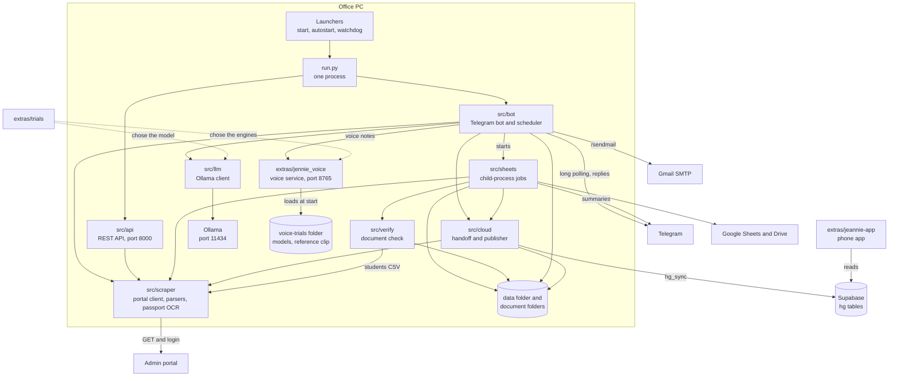

# Project structure

This is the annotated map of the whole repository: every folder, every file of the bot, every document, the extras, and what stays on the office PC and why.

How the facts here were collected:

- **File list.** `git ls-files` in the bot's own repository lists 113 paths. One of them, `test_passport.jpg`, is removed before publishing. That leaves the 112 files of section 3.
- **Line counts.** `wc -l` on each file (it counts newline characters, so an empty file is 0). Counts were taken on the bot's newest commit, before the publishing scrub described in [SCRUB_NOTES.md](SCRUB_NOTES.md). The scrub replaces values inside lines; re-run `wc -l` if an exact count matters.
- **Code references.** `path:line`, with the path relative to the repository root.
- **Commit ids.** The ids in this repository differ from the ids on the office PC. [COMMIT_ID_MAP.md](COMMIT_ID_MAP.md) maps old to new.

Terms used on every page:

| Term | Meaning |
|---|---|
| portal | The agency's admin website, `https://hangeul.com.bd/admin` (`src/config.py:24`). The bot reads it with GET requests and one login POST (`src/scraper/client.py:184`). It never changes anything on it. |
| bot folder | The folder that holds `run.py` and `.env`. The code calls it `BOT_ROOT` and finds it from the file's own location (`src/config.py:6`). On the office PC it is `C:\Hangeul\BOT` (`MIGRATION.md:18`). |
| program | One of the four study programs the code knows by key: `KLP`, `EAP`, `BACHELOR`, `MASTER` (`src/verify/auto_verify.py:58`). |
| intake | The term a student applies for, for example "MARCH 2027" (`src/sheets/stage_report.py:15`). |
| progress sheet | One Google Sheet per program and intake, one row per student, built from the portal (`src/sheets/progress_builder.py:4-5`). |
| OCR | Reading text from a scanned image. The bot uses the EasyOCR library on the PC (`src/scraper/ocr_validator.py:79`, `src/verify/doc_verifier.py:60`). |
| MRZ | The two machine-readable lines at the bottom of a passport page. Their check digits are used to test a passport scan (`src/scraper/ocr_validator.py`). |
| Ollama | A local server that runs a language model on the PC, at `http://127.0.0.1:11434` (`src/config.py:31`). The default model is `qwen3:4b-instruct` (`src/config.py:32`). |
| Supabase | A hosted Postgres database. The bot writes a copy of what it reads there (`src/cloud/`). |
| Jennie | The bot's voice persona: voice notes in, voice notes out (`src/bot/voice.py`, `extras/jennie_voice/`). |
| Jeannie | The phone app (a Next.js web app that installs on a phone). It reads what the bot published to Supabase (`extras/jeannie-app/`). One letter differs from "Jennie"; they are two different programs. |

---

## 1. The project in five lines

1. One Python process, `run.py`, runs on a Windows office PC. It hosts a Telegram bot, 7 scheduled jobs and a REST API on port 8000 (`run.py:79-97`, `src/bot/scheduler.py:435-509`, `src/config.py:80`).
2. It reads the agency's admin portal `hangeul.com.bd/admin` over HTTP. Every request is a GET except the login POST (`src/scraper/client.py:184`).
3. From those reads it builds Google Sheets (one progress sheet per program and intake), downloads the documents of verified students to the PC, checks them with local OCR, and writes two Excel reports, `DOCUMENT CHECK.xlsx` and `FIELD CHECK.xlsx` (`src/verify/auto_verify.py:52-53`).
4. Staff ask it in Telegram: 42 registered command names (`src/bot/telegram_bot.py:2377-2423`), plain-text questions, and, when switched on, voice notes answered through a local language model and a local voice service.
5. When publishing is switched on, every read and report is also copied to Supabase so the phone app can answer from it while the PC is off (`src/cloud/__init__.py:1-7`). The bot writes only through the database function `hg_sync` and the run-log table `hg_runs` (`src/cloud/__init__.py:18-19`). `hg_sync` fills the tables `hg_records` and `hg_chunks`; a database trigger, `hg_log_change`, fills `hg_changes` (`extras/jeannie-app/supabase/migrations/20260929030000_hangeul_context.sql:103-128`).

---

## 2. Top-level layout

```
/
├── README.md                 Overview of the whole repository (new; start here)
├── HANDOFF.md                The bot's handoff note of 25 Sep 2026 (unchanged; partly out of date)
├── MIGRATION.md              How the bot was moved to the current PC, 27 Sep 2026 (unchanged)
├── PC_BUILD.md               A hardware purchase proposal of 26 Sep 2026 (unchanged; not about code)
├── requirements.txt          The bot's 25 pinned Python packages and the install order
├── .env.example              Template of the bot's settings file: names, defaults, comments; no secrets
├── .gitignore                Keeps secrets, student data, logs and virtual environments out of git
├── .gitattributes            Forces CRLF line endings on .bat, .cmd, .vbs, .ps1
├── run.py                    The one long-running process: Telegram bot + scheduler + REST API
├── bootstrap.py              Cold start on a fresh PC, six phases
├── audit_program.py          Passport cross-check of one program, to a CSV file
├── download_passports.py     Save every student's newest passport scan
├── inspect_passports.py      List students that have a passport scan
├── get_consultations.py      Console report of one day's consultation requests
├── compress_docs.py          One-off: shrink files over 1.95 MB in one fixed folder
├── test_system.py            Smoke test script (passes only in mock mode)
├── test_verified.py          Print today's payment-verified students
├── telegram_bot.py           Copy of src/bot/telegram_bot.py (see section 4)
├── config.py                 Copy of src/config.py (see section 4)
├── progress_builder.py       Copy of src/sheets/progress_builder.py (see section 4)
├── *.bat, *.vbs, *.ps1       12 Windows launchers: start, stop, status, autostart, watchdog, installers
├── src/                      The bot's code as a Python package (53 files)
│   ├── api/                  REST API (FastAPI): 11 routes over the portal client
│   ├── bot/                  Telegram handlers, free-text answers, daily brief, scheduler, voice
│   ├── cloud/                Publishing to Supabase
│   ├── llm/                  Client of the local Ollama model, and its one prompt
│   ├── scraper/              Portal HTTP client, HTML parsers, passport OCR
│   ├── sheets/               Google Sheets and Drive: progress sheets, sync, reports
│   └── verify/               Document check: OCR, rules, field comparison, Excel reports
├── tests/                    pytest suite: conftest.py + 24 test modules, 604 test functions
├── tools/                    One PowerShell tool: export Windows certificates for Python
├── .agents/                  One rules file for coding agents (7 guardrails)
├── docs/                     Documentation written for this repository (section 5)
│   ├── programs/             One document per group of Python programs
│   └── reference/            17 long reference documents written earlier
└── extras/                   Code that lives outside the bot folder on the PC (section 6)
    ├── README.md             What the extras are
    ├── jennie_voice/         The local voice service (speech-to-text and text-to-speech)
    ├── trials/               Scripts and results of the model and voice trials
    └── jeannie-app/          The phone app that reads the published data
```

The bot's original `README.md` is not at the root any more. It is kept as [BOT_README.md](BOT_README.md).

---

## 3. The bot: all 112 tracked files

Totals: 112 files, 41,212 lines. 90 of them are Python files (39,638 lines): 12 at the root, 53 under `src/`, 25 under `tests/`.

| Group | Files | Lines |
|---|---|---|
| Root scripts (Python) | 12 | 4,275 |
| Root launchers (`.bat`, `.vbs`, `.ps1`) | 12 | 353 |
| Root documents and config | 8 | 1,137 |
| `src/` top level | 4 | 590 |
| `src/api/` | 8 | 228 |
| `src/bot/` | 8 | 7,396 |
| `src/cloud/` | 11 | 5,051 |
| `src/llm/` | 3 | 295 |
| `src/scraper/` | 5 | 3,236 |
| `src/sheets/` | 8 | 2,409 |
| `src/verify/` | 6 | 2,738 |
| `tests/` | 25 | 13,420 |
| `tools/` | 1 | 41 |
| `.agents/` | 1 | 43 |
| **Total** | **112** | **41,212** |

In the tables below, "started or imported by" names the launcher, the scheduler line or the importing file. "By hand" means a person types the command; nothing in the repository starts it.

### 3.1 Root scripts (12 files)

The first nine are run from the bot folder with the bot's own interpreter, `.venv\Scripts\python.exe`. The last three are copies that are never run (section 4).

| File | Lines | What it is for | Started or imported by |
|---|---|---|---|
| [`run.py`](../run.py) | 110 | The single entry point. One process hosts the REST API (uvicorn) and the Telegram bot (long polling) with its scheduler. Opens `hangeul_bot.log` (`run.py:37`); under `pythonw.exe` it also opens `hangeul_stdout.log` and `hangeul_stderr.log` (`run.py:8-17`). If no bot token is set, only the REST API runs (`run.py:101-103`). | `start.bat:12` (console), `start_background.vbs:13` (no window) |
| [`bootstrap.py`](../bootstrap.py) | 151 | Cold start. Six phases in order (`bootstrap.py:122`): build all progress sheets, refresh the passport issue-date cache, passport audit of four programs, download documents of verified students, check all documents, print how to start the bot. Phases 1 to 5 run child Python processes (phase 3 runs four, one per program, `bootstrap.py:73-76`); phase 6 only prints commands (`bootstrap.py:103-119`). | By hand: `python bootstrap.py`, `--from N`, `--only N`, `--plan` |
| [`audit_program.py`](../audit_program.py) | 232 | Passport cross-check for every student of one program. Compares what staff typed on the portal with the uploaded passport scan and writes `program_audit_<program>_<YYYYMMDD_HHMM>.csv` into the current folder (`audit_program.py:199-200`). Default program: `Bachelor's Degree`. | `run_passport_audit.bat:17`; `bootstrap.py:76` (four programs); imported by `tests/test_integration.py:124` |
| [`download_passports.py`](../download_passports.py) | 51 | Saves every student's newest passport scan into `passports\<uid>_<file name>` (the portal uid, `inspect_passports.py:26`) if it is not there yet. The path is relative to the folder the script is started from (`download_passports.py:15,29`), so its docstring says to run it from the bot folder (`:6-7`). | By hand |
| [`inspect_passports.py`](../inspect_passports.py) | 55 | Lists every student who has a passport scan on the portal. Also supplies the function `passport_students()` (`inspect_passports.py:17`). | By hand; imported by `download_passports.py:12` and `tests/test_integration.py:147` |
| [`get_consultations.py`](../get_consultations.py) | 142 | Console report of the consultation requests of one date, read from the portal page `consult_requests.php` by column position. An older, separate reader; the bot itself reads that page through `src/scraper/parsers.py`. | By hand: `python get_consultations.py [date]` |
| [`compress_docs.py`](../compress_docs.py) | 174 | One-off tool. Rewrites, in place, every PDF or image over 1.95 MB in one folder that is fixed in the code (`compress_docs.py:7-8`). No original is kept. | By hand. No launcher, test or module refers to it |
| [`test_system.py`](../test_system.py) | 145 | A five-part smoke test script: settings, parsers, portal client, LLM client, REST routes. It is a script with one function `run_tests()` (`test_system.py:14`), not a pytest module. It passes only with `MOCK_MODE=true`. | By hand: `python test_system.py` |
| [`test_verified.py`](../test_verified.py) | 36 | Prints the students whose payment was verified today. A script, not a pytest module. | By hand |
| [`telegram_bot.py`](../telegram_bot.py) | 2,437 | Byte-identical copy of `src/bot/telegram_bot.py`. Nothing imports it. See section 4. | Read by `apply_bot_update.bat:11,38` |
| [`config.py`](../config.py) | 147 | Byte-identical copy of `src/config.py`. Nothing imports it. See section 4. | Read by `apply_bot_update.bat:20,44` |
| [`progress_builder.py`](../progress_builder.py) | 595 | Byte-identical copy of `src/sheets/progress_builder.py`. Nothing imports it. See section 4. | Read by `install_sheets.bat:13,22` |

### 3.2 Root launchers (12 files)

Every launcher finds the bot folder from its own location (`%~dp0` in batch files, `$PSScriptRoot` in PowerShell, the script's own path in the `.vbs`). Eleven of the 12 refer to the bot's own interpreter under `<bot folder>\.venv\Scripts\`, to run it or to match its processes. `apply_bot_update.bat` names no interpreter: it calls `stop.bat` (`apply_bot_update.bat:32`) and `start.bat` (`:74`), and those use the venv.

| File | Lines | What it is for | Started by |
|---|---|---|---|
| [`start.bat`](../start.bat) | 20 | Starts the bot in a visible console: `.venv\Scripts\python.exe run.py` (`start.bat:12`). Closing the window stops the bot. | Double-click; `apply_bot_update.bat:74` |
| [`start_background.vbs`](../start_background.vbs) | 13 | Starts the bot with no window: `.venv\Scripts\pythonw.exe run.py`, working directory = bot folder (`start_background.vbs:12-13`). The normal production start. It does not check whether a bot is already running. | The Startup shortcut `HangeulBot.lnk`; `watchdog.ps1:31`; by hand with `wscript.exe` |
| [`stop.bat`](../stop.bat) | 11 | Force-stops this folder's `run.py` process, the real interpreter it starts, and the `-m src.*` job processes that belong to it (`stop.bat:9`). Other Python programs on the PC are left alone. Argument `nopause` skips the final pause. | Double-click; `apply_bot_update.bat:32` |
| [`check_status.bat`](../check_status.bat) | 17 | Shows the bot's processes (same matching as `stop.bat`) and the last 25 lines of `hangeul_bot.log` (`check_status.bat:10,15`). | Double-click |
| [`watchdog.ps1`](../watchdog.ps1) | 31 | Starts the bot through `start_background.vbs` if no `run.py` process of this folder's venv is found. Appends one line per run to `hangeul_watchdog.log` (`watchdog.ps1:13-31`). It checks for a process, not for a bot that answers. | The Windows scheduled task `HangeulBotWatchdog`, every 5 minutes |
| [`install_watchdog.bat`](../install_watchdog.bat) | 33 | Creates that task: `schtasks /Create /TN "HangeulBotWatchdog" ... /SC MINUTE /MO 5 /RL LIMITED /F` (`install_watchdog.bat:14`). | By hand, once |
| [`install_autostart.bat`](../install_autostart.bat) | 22 | Creates the shortcut `HangeulBot.lnk` in the Windows user's Startup folder. It runs `wscript.exe "<bot folder>\start_background.vbs"` at sign-in (`install_autostart.bat:8`). | By hand, once |
| [`build_sheets.bat`](../build_sheets.bat) | 22 | Rebuilds every progress sheet: `python -m src.sheets.progress_builder --all` (`build_sheets.bat:12`). | Double-click |
| [`gauth.bat`](../gauth.bat) | 27 | The one-time Google sign-in. Installs the three Google libraries with pip (unpinned, `gauth.bat:10`), then runs `python -m src.sheets.progress_builder --auth` (`gauth.bat:17`), which opens a browser and saves `token.json`. | Double-click, once |
| [`run_passport_audit.bat`](../run_passport_audit.bat) | 28 | Runs `audit_program.py "Bachelor's Degree"` (`run_passport_audit.bat:17`). | Double-click |
| [`apply_bot_update.bat`](../apply_bot_update.bat) | 82 | Legacy updater. Stops the bot, copies `telegram_bot.py` and `config.py` from the bot folder (or the newest match in the user's Downloads folder) over `src\bot\telegram_bot.py` and `src\config.py`, clears `__pycache__`, checks two text markers, starts `start.bat` (`apply_bot_update.bat:11-74`). See section 4. | Double-click |
| [`install_sheets.bat`](../install_sheets.bat) | 47 | Legacy installer. Truncates `src\sheets\__init__.py` to empty, copies `progress_builder.py` to `src\sheets\progress_builder.py`, installs the Google libraries with pip (`install_sheets.bat:11-33`). See section 4. | Double-click |

### 3.3 Root documents and config (8 files)

| File | Lines | What it is for | Read by |
|---|---|---|---|
| `README.md` (the bot's own) | 118 | The README of the first version. It describes the project as a website-to-API wrapper with a local LLM and a Telegram reporting bot. Most of it no longer matches the code (model name, Python version, folder, schedule). **Published as [BOT_README.md](BOT_README.md)**; the root `README.md` of this repository is a new overview. | People |
| [`HANDOFF.md`](../HANDOFF.md) | 310 | System handoff written 25 September 2026: purpose, architecture, the 15-minute workflow, how a document is checked, known problems. It does not mention the Supabase layer, the voice feature or the REST API, and several line counts and rules in it are out of date. | People |
| [`MIGRATION.md`](../MIGRATION.md) | 249 | How the system was moved to the current PC, updated 27 September 2026: folder layout, what to bring, install order, the cold start phase by phase with timings, start and autostart, retiring the old PC. The most current of the three older documents for operations. | People |
| [`PC_BUILD.md`](../PC_BUILD.md) | 201 | A hardware purchase proposal dated 26 September 2026. Not about the code. | People |
| [`requirements.txt`](../requirements.txt) | 49 | 25 pinned packages and the install order. `torch` must be installed first from the CUDA index (`requirements.txt:3-9`). No test runner is pinned; `tests/` needs `pytest`. | `pip install -r requirements.txt` |
| [`.env.example`](../.env.example) | 144 | Template of `.env`: 24 settings as `NAME=value` lines (defaults and placeholders), 6 more commented out, and explanations. That covers 30 of the 32 settings in `src/config.py`; `BRAIN_ALWAYS_LOADED` and `BRAIN_IDLE_UNLOAD` (`src/config.py:75-76`) are not in it and keep their defaults unless added. Real values are never in git. | The operator copies it to `.env` |
| [`.gitignore`](../.gitignore) | 60 | Keeps secrets (`.env`, `token.json`, `credentials.json`, `*.key`, `*.pem`), student data (`data/`, `passports/`, `*.csv`, `*.xlsx`, `*.zip`, the document folders), logs, virtual environments and caches out of git. | git |
| [`.gitattributes`](../.gitattributes) | 6 | `*.bat`, `*.cmd`, `*.vbs`, `*.ps1` are checked out with CRLF line endings, because `cmd.exe` misreads labels in LF-only batch files (`.gitattributes:1-6`). | git |

### 3.4 `src/` top level (4 files)

| File | Lines | What it is for | Imported by |
|---|---|---|---|
| [`src/__init__.py`](../src/__init__.py) | 79 | Runs whenever anything under `src` is imported. (1) If `data/windows-ca.pem` exists, it points five certificate environment variables at it, so Python trusts the certificates Windows trusts (`src/__init__.py:18-22`). (2) It installs a log filter that replaces the Telegram bot token and Supabase keys in log lines of the `httpx`, `httpcore*` and `hangeul.cloud` loggers (`src/__init__.py:36-79`). | Every `src.*` import; explicitly `bootstrap.py:32` |
| [`src/config.py`](../src/config.py) | 147 | The `Settings` class (pydantic-settings) and the `settings` singleton. Reads `<bot folder>\.env` (`src/config.py:141-145`). Defines `BOT_ROOT` (`:6`), the four folder helpers (`:101-112`) and who may use the bot (`authorized_ids`, `:114-126`). 32 settings with defaults. | Nearly every module: 24 files outside `tests/` (not counting the root copy of `telegram_bot.py`), for example `run.py:30`, `src/scraper/client.py:10`, `src/cloud/publish.py:79` |
| [`src/dates.py`](../src/dates.py) | 259 | Strict, offline date reading. Dates users type (`parse_user_date`, `:149`), the date stamps the portal prints, often without a year (`parse_stamp`, `:204`; `yearless_day_problem`, `:245`), and "today" in the report time zone (`local_today`, `:73`). | In `src/bot/`: `ask.py:37`, `brief.py:54`, `performance.py:95`, `replies.py:151`, `telegram_bot.py:98`, `voice.py:585` (not `__init__.py` or `scheduler.py`). In `src/cloud/`: `backfill.py:99`, `bot_jobs.py:165`, `command_hooks.py:106`, `records.py:112` (the other seven files there, `__init__.py`, `embed.py`, `full_picture.py`, `handoff.py`, `publish.py`, `sheet_hooks.py` and `student_index.py`, do not). `src/scraper/client.py:11`; `src/scraper/parsers.py:581,805,826`; `test_verified.py:11`. The line given is a file's first import of it. The imports in `ask.py`, `brief.py`, `client.py` and `test_verified.py` are at the top of the file; the others are inside functions. |
| [`src/net_fix.py`](../src/net_fix.py) | 105 | Start-up workaround for a network where the DNS answer for `api.telegram.org` cannot be reached. Probes a list of known addresses and, if needed, overrides name resolution for that host inside this process only (`apply_telegram_dns_fix`, `:72`). Switches: `TELEGRAM_DNS_FIX`, `TELEGRAM_API_IP` in the Windows environment. | `run.py:31` |

### 3.5 `src/api/` (8 files): the REST API

A FastAPI application served by uvicorn inside the `run.py` process, on `API_HOST:API_PORT` (defaults `0.0.0.0:8000`, `src/config.py:79-80`). No route requires the caller to sign in or send a key. (`POST /api/auth/login` accepts an optional portal username and password in its body and logs the shared portal client in with them, `src/api/schemas.py:4-6`, `src/api/routes/auth.py:12-15`; that is the portal's login, not a check on the caller.) With the default host `0.0.0.0`, any machine that can reach port 8000 of the PC can call every route.

| File | Lines | What it is for | Started or imported by |
|---|---|---|---|
| [`src/api/__init__.py`](../src/api/__init__.py) | 1 | Package marker (one docstring line). | Implicit |
| [`src/api/main.py`](../src/api/main.py) | 69 | Builds the `app` object, allows any CORS origin, mounts the four routers under `/api`, adds `GET /` and `GET /healthz`. | `run.py:80` (as the string `"src.api.main:app"`); `test_system.py:99` |
| [`src/api/schemas.py`](../src/api/schemas.py) | 76 | Pydantic request and response models. Three are used (`LoginRequest`, `LoginResponse`, `CrawlRequest`). | `src/api/routes/auth.py:2`, `src/api/routes/crawler.py:2` |
| [`src/api/routes/__init__.py`](../src/api/routes/__init__.py) | 1 | Package marker. | `src/api/main.py:8` |
| [`src/api/routes/applications.py`](../src/api/routes/applications.py) | 26 | `GET /api/applications`, `/api/applications/inquiries`, `/api/applications/consultations`. | `src/api/main.py:8` |
| [`src/api/routes/auth.py`](../src/api/routes/auth.py) | 27 | `GET /api/auth/csrf`, `POST /api/auth/login`, `GET /api/auth/status`. | `src/api/main.py:8` |
| [`src/api/routes/crawler.py`](../src/api/routes/crawler.py) | 12 | `POST /api/crawler/parse-page`: fetch any admin path with a GET and return its tables as JSON. | `src/api/main.py:8` |
| [`src/api/routes/dashboard.py`](../src/api/routes/dashboard.py) | 16 | `GET /api/dashboard/stats`, `GET /api/dashboard/alerts`. | `src/api/main.py:8` |

### 3.6 `src/bot/` (8 files): Telegram, answers, jobs, voice

| File | Lines | What it is for | Started or imported by |
|---|---|---|---|
| [`src/bot/__init__.py`](../src/bot/__init__.py) | 1 | Package marker. | Implicit |
| [`src/bot/telegram_bot.py`](../src/bot/telegram_bot.py) | 2,437 | The bot itself. Authorisation (`is_authorized`, `:22`), every command, button and free-text handler, report formatting, the `/sendmail` flow, the passport cross-check commands, the 13-entry command menu (`post_init`, `:2314-2330`), and `build_telegram_application` (`:2367`), which registers 42 command names (`:2377-2423`) and starts the scheduler (`:2436`). | `run.py:32`; `src/bot/voice.py:649,1720` |
| [`src/bot/replies.py`](../src/bot/replies.py) | 165 | Shared sending helpers. Splits long text into pieces of at most 3,900 characters (`CHUNK_CHARS`, `:33`), resends as plain text when Telegram rejects the Markdown, and builds the two stock error replies (unreadable date, portal read failed). | `src/bot/telegram_bot.py`, `ask.py`, `brief.py:52`, `performance.py`, `scheduler.py:16`, `voice.py:664`; `src/sheets/auto_sync.py:340`, `src/sheets/missing_report.py:251` |
| [`src/bot/ask.py`](../src/bot/ask.py) | 1,411 | Free-text questions. `classify` (`:529`) decides which answer a typed or spoken question asks for. The file also builds the live-portal answers no menu command gives: pending payments, window applications under review, dashboard figures, intakes, applied dates, calendar questions, unknown questions. | `src/bot/telegram_bot.py` (5 places, first `:115`); `src/bot/voice.py:748,759,1836`; `src/cloud/backfill.py:268,283` |
| [`src/bot/brief.py`](../src/bot/brief.py) | 687 | The daily brief. Built in code from live portal reads plus the local file `results.json` (`read_document_check`, `:332`). One optional LLM sentence is added only if every claim in it checks out against the code-built facts (`check_summary`, `:519`). | `src/bot/scheduler.py:15`; `src/bot/telegram_bot.py` (17 places, first `:149`); `ask.py`, `performance.py:38`, `voice.py:1136,1309` |
| [`src/bot/performance.py`](../src/bot/performance.py) | 303 | Formats the portal's Consultant Performance page (today or this month) as a Telegram reply, with warnings when the page contradicts itself. | `src/bot/telegram_bot.py:725`; `src/cloud/records.py:816` |
| [`src/bot/scheduler.py`](../src/bot/scheduler.py) | 515 | APScheduler setup (`setup_scheduler`, `:419`) and the 7 jobs: daily brief at `DAILY_REPORT_TIME` (default 18:05), passport-upload watcher every 30 min, portal sync every 15 min, missing-information report 09:05, passport issue-date refresh 08:30, model keep-warm every 10 min, Supabase "full picture" every 60 min (`:435-509`). Also the watcher's logic and its memory file. Heavy jobs run as child processes for at most 1 hour (`_run_module`, `:392-416`). | `src/bot/telegram_bot.py:18,175,2361`; `audit_program.py:72` and `inspect_passports.py:20` (for `passport_scan`, `:74`) |
| [`src/bot/voice.py`](../src/bot/voice.py) | 1,877 | Jennie's voice, bot side. A Telegram voice note goes to the local voice service for speech-to-text (`:167`), the local model routes it to one of the bot's own commands, the reply is condensed to one spoken sentence and sent to the service for text-to-speech (`:191`). Also six pre-rendered filler clips (`:209-215`) and the spoken daily brief. Registered only when `JENNIE_VOICE_ENABLED` is true (`src/bot/telegram_bot.py:2430-2432`). | `src/bot/telegram_bot.py:2431`; `src/bot/scheduler.py:271,310`; `src/bot/brief.py:416,424,524` |

### 3.7 `src/cloud/` (11 files): publishing to Supabase

The whole layer does nothing unless `SUPABASE_URL`, `SUPABASE_SECRET_KEY` and `CLOUD_PUBLISH_ENABLED` are all set (`src/cloud/publish.py:103-107`).

| File | Lines | What it is for | Started or imported by |
|---|---|---|---|
| [`src/cloud/__init__.py`](../src/cloud/__init__.py) | 24 | Package docstring and `JOBS`, the 9 job names the bot writes into `hg_runs.job` (`:23-24`). | Implicit |
| [`src/cloud/records.py`](../src/cloud/records.py) | 1,491 | Pure builders. One function per record kind turns a reader's or a report's output into a Supabase record: key, scope, student columns, data, text, content hash. | `publish.py`, `backfill.py:49`, `bot_jobs.py:40`, `command_hooks.py`, `sheet_hooks.py`, `full_picture.py:51`, `handoff.py:72` |
| [`src/cloud/publish.py`](../src/cloud/publish.py) | 938 | The engine and the publisher process. Keeps the hash state `data/cloud_state.json` so only changed records are sent, calls the `hg_sync` RPC with at most 200 rows and 1,000,000 bytes per call (`:89-91`), writes `hg_runs` rows, holds a one-publisher lock, supports a dry run. | Started as `python -m src.cloud.publish --from <handoff file>` by `src/cloud/handoff.py:112`; imported by `handoff.py:41`, `backfill.py`, `full_picture.py:51`, `sheet_hooks.py` |
| [`src/cloud/handoff.py`](../src/cloud/handoff.py) | 144 | What every job calls. Writes one file `data/cloud/pending/<time>-<job>.json` (`:46,79`) and starts the publisher process without waiting. Removes pending files older than 6 hours (`:48`). | `bot_jobs.py:40`, `command_hooks.py:78,177`, `sheet_hooks.py:59,70`, `publish.py:662` |
| [`src/cloud/command_hooks.py`](../src/cloud/command_hooks.py) | 357 | What the Telegram command and free-text handlers hand to Supabase after their reply. | `src/bot/telegram_bot.py` (12 places, first `:239`); `src/bot/ask.py` (8 places); `src/bot/performance.py:289`; `src/cloud/bot_jobs.py:211` |
| [`src/cloud/bot_jobs.py`](../src/cloud/bot_jobs.py) | 309 | What the bot's own scheduled jobs (daily brief, passport watcher) hand to Supabase. | `src/bot/scheduler.py:17`; `src/cloud/backfill.py:406` |
| [`src/cloud/sheet_hooks.py`](../src/cloud/sheet_hooks.py) | 470 | What the four child-process sheet jobs hand to Supabase as their last step: portal sync, missing report, stage report, issue-date refresh. | `src/sheets/auto_sync.py:322,422`; `missing_report.py:285`; `passport_issue.py:115,138`; `stage_report.py:257` |
| [`src/cloud/backfill.py`](../src/cloud/backfill.py) | 684 | The one-time full copy, and the shared `collect_*` readers (portal and disk) that the hourly full picture reuses. | By hand: `python -m src.cloud.backfill [--dry-run]`; imported by `src/cloud/full_picture.py:51` |
| [`src/cloud/full_picture.py`](../src/cloud/full_picture.py) | 204 | The hourly "full picture": re-reads the main portal pages (GET only) and publishes them. | Started as `python -m src.cloud.full_picture` by `src/bot/scheduler.py:389`, every 60 minutes, first run 7.5 minutes after the bot starts (`:365-366,501-504`) |
| [`src/cloud/embed.py`](../src/cloud/embed.py) | 298 | Text embeddings with the model `thenlper/gte-small` on the CPU, text chunking, the guard that hides the GPU from an embedding process (`prepare_process`, `:60-73`), and a stub embedder for tests. | `publish.py`, `backfill.py:630,678`, `full_picture.py:181,199`, `handoff.py:97` |
| [`src/cloud/student_index.py`](../src/cloud/student_index.py) | 132 | Local index `data/cloud/student_index.json` (`:31`): passport number to portal uid and student id, so records keyed by passport carry stable student ids. | `backfill.py:583`, `sheet_hooks.py:230,278` |

### 3.8 `src/llm/` (3 files): the local model

| File | Lines | What it is for | Imported by |
|---|---|---|---|
| [`src/llm/__init__.py`](../src/llm/__init__.py) | 1 | Package marker. | Implicit |
| [`src/llm/ollama_client.py`](../src/llm/ollama_client.py) | 274 | Async client of the local Ollama server and the singleton `ollama_client` (`:274`). Calls `/api/tags`, `/api/generate`, `/api/chat`, `/api/ps` (`:106-205`). Holds the keep-alive policy and the context-size guard. | `run.py:33`; `src/bot/telegram_bot.py:17`, `ask.py:1043`, `brief.py:55`, `scheduler.py:14`, `voice.py:49`; `test_system.py:86` |
| [`src/llm/prompts.py`](../src/llm/prompts.py) | 20 | The one system prompt for typed questions. The model only names which numbered live facts answer the question; the bot shows those facts word for word (`:1-5`). | `src/llm/ollama_client.py:9` |

### 3.9 `src/scraper/` (5 files): the portal

| File | Lines | What it is for | Imported by |
|---|---|---|---|
| [`src/scraper/__init__.py`](../src/scraper/__init__.py) | 1 | Package marker. | Implicit |
| [`src/scraper/client.py`](../src/scraper/client.py) | 778 | The one HTTP client for the portal and the singleton `admin_client` (`:778`). Login and session, every page read, the all-pages reader of `students.php` (50 students a page, at most 40 pages, `:44-45`), the passport-scan download into `<bot folder>\passports\` (`:675-705`). | Every package that reads the portal: `src/api/*`, `src/bot/*`, `src/sheets/*`, `src/cloud/*`; root scripts `audit_program.py:43`, `download_passports.py:13`, `get_consultations.py:9`, `inspect_passports.py:11`, `test_verified.py:12` |
| [`src/scraper/parsers.py`](../src/scraper/parsers.py) | 1,351 | Turns portal HTML into Python dicts: dashboard, students, consultations, consultant performance, window applications, calendar, progress page. Also decodes the e-mail obfuscation Cloudflare applies to the pages. | `src/scraper/client.py:12`; `src/bot/ask.py`, `brief.py:239`, `performance.py:40`, `telegram_bot.py:805,1578`; `src/cloud/backfill.py`, `records.py`; `src/sheets/stage_report.py:75`, `verified_docs.py:46`; `test_system.py:29` |
| [`src/scraper/ocr_validator.py`](../src/scraper/ocr_validator.py) | 897 | Passport check on the PC. EasyOCR on the CPU (`gpu=False`, `:79`), MRZ parsing with check digits, and a field-by-field comparison of the portal's entries with the scan. | `src/scraper/client.py:38` |
| [`src/scraper/mock_data.py`](../src/scraper/mock_data.py) | 209 | Three fixed demo tables, `MOCK_DASHBOARD_STATS`, `MOCK_APPLICATIONS` and `MOCK_INQUIRIES` (`:3,80,173`). When `MOCK_MODE` is true, four client methods return them instead of reading the portal: `get_dashboard` (`src/scraper/client.py:206-207`), `get_applications` (`:221-227`), `get_admitted_students` (`:253-254`) and `get_inquiries` (`:289-290`). Other client methods have their own mock answers or refuse in mock mode. | `src/scraper/client.py:39` |

### 3.10 `src/sheets/` (8 files): Google Sheets, Drive, reports

The bot signs in to Google as a user, with an OAuth client file `credentials.json` and a saved token `token.json` in the bot folder (`src/sheets/progress_builder.py:46-47`). Scopes: Drive and Sheets (`:49-52`).

| File | Lines | What it is for | Started or imported by |
|---|---|---|---|
| [`src/sheets/__init__.py`](../src/sheets/__init__.py) | 0 | Empty package marker. | Implicit |
| [`src/sheets/progress_builder.py`](../src/sheets/progress_builder.py) | 595 | Pulls the portal's students CSV export and builds or rewrites one Google Sheet per program and intake. Only the main tab is rewritten, so tabs people add survive. Also owns the Google sign-in (`--auth`) and the shared helpers the other sheet modules import as `pb`. | Started by `build_sheets.bat:12`, `gauth.bat:17`, `bootstrap.py:52`; imported by all other files of `src/sheets/` except `__init__.py`, by `src/verify/doc_verifier.py:1121`, `field_check.py:28`, `src/cloud/records.py:641`, `sheet_hooks.py:369` |
| [`src/sheets/auto_sync.py`](../src/sheets/auto_sync.py) | 493 | The 15-minute "portal sync" job. Detects changed students (`data/sheet_state.json`), rebuilds the changed progress sheets, downloads newly verified students' documents, runs the document check, sends Telegram summaries, hands the run to the Supabase publisher. A failing step is tried 3 times, 20 seconds apart (`:370-371`). | Started as `python -m src.sheets.auto_sync` by `src/bot/scheduler.py:347`; imported by `src/cloud/backfill.py:77`, `records.py:642` |
| [`src/sheets/verified_docs.py`](../src/sheets/verified_docs.py) | 437 | Lists document-verified students, downloads each student's documents from the portal as one ZIP, and unpacks the files from it (the ZIP itself is not kept): either into the student's Google Drive folder (`run`, `:142`; unpacked at `:186-191`) or into `<root>/<PROGRAM>/<NAME (PASSPORT)>/` on the PC, shrinking files over 2 MB and keeping the originals (`run_local`, `:330-332`; unpacked at `:383-391`). | `src/sheets/auto_sync.py:39`; started by `bootstrap.py:86` (`--local`); imported by `src/cloud/backfill.py:127` |
| [`src/sheets/missing_report.py`](../src/sheets/missing_report.py) | 358 | The daily "missing information" report: a Telegram text and an Excel file `data/missing_reports/missing_information_<YYYY-MM-DD>.xlsx` (`:43,224`). Also the per-program list behind the `/missing` buttons. | Started by `src/bot/scheduler.py:360` (09:05) and by `src/bot/telegram_bot.py:2205` (`--program`); imported by `src/cloud/sheet_hooks.py:368` |
| [`src/sheets/passport_issue.py`](../src/sheets/passport_issue.py) | 145 | Keeps the cache `data/passport_issue.json` (`:34`): passport number to passport issue date, read from every student's portal edit page. | Started by `src/bot/scheduler.py:354` (08:30, `--refresh`) and `bootstrap.py:61`; imported by `progress_builder.py:326`, `src/verify/auto_verify.py:128`, `field_check.py:172`, `src/cloud/records.py:184`, `sheet_hooks.py:276`, `student_index.py:38` |
| [`src/sheets/stage_report.py`](../src/sheets/stage_report.py) | 270 | The stage report per program and intake behind the `/stage` buttons. | Started by `src/bot/telegram_bot.py:2271,2304`; imported by `src/cloud/backfill.py:138` |
| [`src/sheets/attendance.py`](../src/sheets/attendance.py) | 111 | Reads an office-attendance Google Sheet (tab "Today") and formats who is in and who is late. Its docstring says the 09:05 report uses it, but no module imports it and no job or command starts it. | By hand only: `python -m src.sheets.attendance` |

### 3.11 `src/verify/` (6 files): the document check

| File | Lines | What it is for | Started or imported by |
|---|---|---|---|
| [`src/verify/__init__.py`](../src/verify/__init__.py) | 0 | Empty package marker. | Implicit |
| [`src/verify/auto_verify.py`](../src/verify/auto_verify.py) | 609 | The orchestrator. Decides who needs checking (6 students per pass by default, `DEFAULT_BUDGET`, `:59`), keeps the OCR text of each student so nothing is read twice, runs the document check and the field check, keeps `results.json`, writes `DOCUMENT CHECK.xlsx` and `FIELD CHECK.xlsx` (`:47-53`). | `src/sheets/auto_sync.py:320` (inside the portal sync); started by `bootstrap.py:95`; imported by `src/cloud/sheet_hooks.py:250` |
| [`src/verify/doc_verifier.py`](../src/verify/doc_verifier.py) | 1,241 | Reads each downloaded file (PDF text layer first, EasyOCR when there is none; GPU when available, `:60`), classifies it by file name, runs the per-document rules and the cross-document checks, gives each document and each student a verdict. Also a command-line tool with its own one-off Excel report (`:1175-1203`). | `src/verify/auto_verify.py:177`, `field_check.py:30`; `src/cloud/sheet_hooks.py:303`; by hand |
| [`src/verify/field_check.py`](../src/verify/field_check.py) | 302 | Compares the portal's own field values with the text of the student's documents. Result per field: MATCH, DIFFERS, UNREADABLE, NO DOCUMENT or BLANK. Also a command-line tool. | `src/verify/auto_verify.py:178`; by hand |
| [`src/verify/page_checks.py`](../src/verify/page_checks.py) | 452 | Checks on the scan image itself: colour or black-and-white, QR and barcode decoding, Bangla text without a translation, a visible notary seal, the page structure of an apostilled academic file. | `src/verify/doc_verifier.py:35` |
| [`src/verify/rules.py`](../src/verify/rules.py) | 134 | Constants only: programs, required and optional documents, file-name patterns, thresholds, keyword lists, report titles. | `src/verify/doc_verifier.py:36`, `field_check.py:29`, `page_checks.py:17` |

### 3.12 `tests/` (25 files)

A pytest suite: `conftest.py` and 24 test modules, 13,420 lines, 604 `def test_` functions (parametrised tests expand that number when pytest collects them). There is no `pytest.ini`. Thirteen of the 24 test modules name their own command in their docstring, for example `.venv\Scripts\python.exe -m pytest tests\test_foundation.py -q` (`tests/test_foundation.py:17`). The other eleven (the nine `tests/test_cloud*.py` files, `tests/test_consultations.py` and `tests/test_final_fixes.py`) do not; the same form of command runs them. The tests use fake portal pages, fake Telegram objects and a fake Supabase server built in the test files. Tests marked `slow` load a real model and skip themselves when it is not cached (`tests/conftest.py:3-7`). Test modules import helpers and fixtures from each other by module name (for example `tests/test_brief.py:37`). That relies on pytest putting the test file's folder on the import path, which is pytest's default behaviour and is not stated in the code.

| File | Lines | What it covers | Used by |
|---|---|---|---|
| [`tests/conftest.py`](../tests/conftest.py) | 29 | Puts the bot folder on `sys.path`, registers the `slow` marker, and switches Supabase publishing off for every test (`:24-29`). | pytest, automatically |
| [`tests/test_foundation.py`](../tests/test_foundation.py) | 787 | 38 tests. The date reader, the long-reply splitter, the portal session, the `students.php` reader, `/verified*`, `/admitted`, `/students`. Defines the suite's main fake portal and fake Telegram objects. | pytest; imported by 16 other test modules |
| [`tests/test_consultations.py`](../tests/test_consultations.py) | 138 | 8 tests. `consult_requests.php` parsed by column name; the page builders `_row` and `_page`. | pytest; imported by 7 other test modules |
| [`tests/test_inquiries.py`](../tests/test_inquiries.py) | 343 | 15 tests. `/inquiries_today`, `/inquiries_date`, `/consultations`, `/inquiries` and their free-text routes. | pytest; imported by `test_cloud.py`, `test_cloud_bot_jobs.py`, `test_cloud_commands.py` |
| [`tests/test_freetext.py`](../tests/test_freetext.py) | 686 | 31 tests. Plain-word questions: classification, routing to commands, live dashboard and calendar answers, the LLM fact pick. | pytest; imported by 5 other test modules |
| [`tests/test_brief.py`](../tests/test_brief.py) | 1,053 | 42 tests. The daily brief, its summary checker, and the readers behind it. | pytest; imported by `test_cloud.py`, `test_cloud_all.py`, `test_cloud_bot_jobs.py` |
| [`tests/test_performance.py`](../tests/test_performance.py) | 1,064 | 52 tests. `/performance_today`, `/performance_month`, `/performance` and their free-text routes. | pytest; imported by `test_cloud_performance.py` |
| [`tests/test_crosscheck.py`](../tests/test_crosscheck.py) | 654 | 36 tests. Passport cross-check commands, `/passports`, the OCR and MRZ validator, `audit_student_passport`. | pytest; imported by `test_cloud_commands.py` |
| [`tests/test_jobs.py`](../tests/test_jobs.py) | 849 | 41 tests. Scheduled jobs and sheet reports: passport watcher, portal sync, `/stage`, `/missing`, passport issue dates. | pytest; imported by 4 cloud test modules |
| [`tests/test_watcher_nonblocking.py`](../tests/test_watcher_nonblocking.py) | 483 | 7 tests. The passport watcher's OCR runs on a worker thread and does not freeze the bot. | pytest |
| [`tests/test_integration.py`](../tests/test_integration.py) | 153 | 9 tests. `/alerts`, `/stats`, the `/sendmail` lookup, and the root passport scripts. | pytest |
| [`tests/test_repair.py`](../tests/test_repair.py) | 498 | 15 tests. Regression tests of the repairs of 28 Sep 2026. | pytest |
| [`tests/test_final_fixes.py`](../tests/test_final_fixes.py) | 96 | 8 tests. Last small fixes: date prompt, OCR count, calendar note, model keep-alive. | pytest |
| [`tests/test_voice.py`](../tests/test_voice.py) | 698 | 21 tests. Voice-note handling, voice-service failures, the spoken brief. Defines the voice fakes. | pytest; imported by `test_repair_voice.py`, `test_voice_fast.py` |
| [`tests/test_voice_fast.py`](../tests/test_voice_fast.py) | 872 | 41 tests. Filler clips, one-call routing with per-chat memory, reply checks, Ollama options and warm-up. | pytest; imported by `test_repair_voice.py` |
| [`tests/test_repair_voice.py`](../tests/test_repair_voice.py) | 120 | 7 tests. Spoken dates that do not exist; a failed portal read said in words built in code. | pytest |
| [`tests/test_cloud.py`](../tests/test_cloud.py) | 1,129 | 59 tests. Record builders, hash state, `hg_sync` and `hg_runs` calls, the handoff file and the publisher process, backfill, embeddings, secret redaction, and the check that the three root copies equal their `src/` files (`:1126-1129`). Defines `FakeSupabase` and the `cloud` fixture. | pytest; imported by 8 other cloud test modules |
| [`tests/test_cloud_all.py`](../tests/test_cloud_all.py) | 157 | 5 tests. Where the Supabase hooks meet; the scheduler's seven jobs. | pytest |
| [`tests/test_cloud_bot_jobs.py`](../tests/test_cloud_bot_jobs.py) | 689 | 29 tests. What the passport watcher, the daily brief and the hourly full picture hand to Supabase. | pytest; imported by `test_cloud_fixes.py` |
| [`tests/test_cloud_cf_email.py`](../tests/test_cloud_cf_email.py) | 375 | 18 tests. Cloudflare e-mail obfuscation decoded in every page parse. | pytest |
| [`tests/test_cloud_commands.py`](../tests/test_cloud_commands.py) | 538 | 29 tests. What the command handlers and free-text answers publish. | pytest; imported by `test_cloud_performance.py` |
| [`tests/test_cloud_dry_run.py`](../tests/test_cloud_dry_run.py) | 390 | 17 tests. Regression tests from the Supabase dry run of 29 Sep. | pytest |
| [`tests/test_cloud_fixes.py`](../tests/test_cloud_fixes.py) | 544 | 30 tests. Regression tests from the review of the publish layer. | pytest |
| [`tests/test_cloud_jobs.py`](../tests/test_cloud_jobs.py) | 726 | 26 tests. What the four sheet jobs hand to Supabase. | pytest; imported by `test_cloud_fixes.py` |
| [`tests/test_cloud_performance.py`](../tests/test_cloud_performance.py) | 349 | 20 tests. The Consultant Performance page's copy to Supabase. | pytest; imported by `test_cloud_bot_jobs.py:484` |

### 3.13 `tools/` (1 file)

| File | Lines | What it is for | Started by |
|---|---|---|---|
| [`tools/export_windows_ca.ps1`](../tools/export_windows_ca.ps1) | 41 | Exports the certificates of four Windows certificate stores to `<bot folder>\data\windows-ca.pem` (`:15-39`). Needed when Python cannot verify HTTPS certificates that a browser accepts. `src/__init__.py:18-22` then uses the file. | By hand: `powershell -ExecutionPolicy Bypass -File tools\export_windows_ca.ps1` (`:8`) |

### 3.14 `.agents/` (1 file)

| File | Lines | What it is for | Read by |
|---|---|---|---|
| [`.agents/rules/hangeul_operational_guardrails.md`](../.agents/rules/hangeul_operational_guardrails.md) | 43 | Seven always-on rules for coding agents: (1) the portal is read-only, (2) two "pending" metrics are kept apart, (3) what a verified-student audit must capture, (4) calendar and deadlines, (5) audits use live data, (6) only `students.php` is in scope, never `signed_students.php`, (7) no AI features and no button presses on the portal. | Coding agents; `HANDOFF.md` cites rule 7 |

---

## 4. The three root files that are copies

Three files at the root are byte-identical to files under `src/`:

| Root copy | Same content as | Lines |
|---|---|---|
| `telegram_bot.py` | `src/bot/telegram_bot.py` | 2,437 |
| `config.py` | `src/config.py` | 147 |
| `progress_builder.py` | `src/sheets/progress_builder.py` | 595 |

**Proof.** Git stores each file's content under a hash of that content (the "blob id"). Two paths with the same blob id hold the same bytes. Run this in the repository:

```
git ls-files -s telegram_bot.py src/bot/telegram_bot.py config.py src/config.py progress_builder.py src/sheets/progress_builder.py
```

The output has one line per path: mode, blob id, stage, path. The ids are shown as `<A>`, `<B>`, `<C>` below and not as numbers: an id depends on every byte of the file, so the ids in this repository can differ from those in the bot's own repository on the office PC (see [SCRUB_NOTES.md](SCRUB_NOTES.md)). The shape of the output:

```
100644 <A> 0	config.py
100644 <B> 0	progress_builder.py
100644 <C> 0	src/bot/telegram_bot.py
100644 <A> 0	src/config.py
100644 <B> 0	src/sheets/progress_builder.py
100644 <C> 0	telegram_bot.py
```

What must hold is that each blob id appears twice: once for the root copy, once for its `src/` file. On the bot's own repository, before the scrub, it did.

A test keeps it that way: `test_the_root_staging_copies_are_byte_identical` (`tests/test_cloud.py:1126-1129`) reads the bytes of each pair and fails when they differ.

**What the root copies are for.** They are input files for two legacy launchers, from the time when a code update reached the operator as single files to drop into the bot folder (the updater's own message says so, `apply_bot_update.bat:65`):

1. `apply_bot_update.bat` looks for `telegram_bot.py` and `config.py` in the bot folder first (`apply_bot_update.bat:11,20`). Only if one is absent does it take the newest `telegram_bot*.py` or `config*.py` from the Windows user's Downloads folder (`:13,22`). It stops the bot, copies the files over `src\bot\telegram_bot.py` and `src\config.py` (`:38,44`), clears `__pycache__` (`:52-53`), checks that the two installed files contain the texts `crosscheck_range` and `def authorized_ids` (`:58-59`), and starts `start.bat` (`:74`).
2. `install_sheets.bat` does the same for `progress_builder.py`: the bot folder first (`install_sheets.bat:13`), then Downloads (`:15`), copied to `src\sheets\progress_builder.py` (`:22`).

**What they are not.**

- Nothing imports them. `run.py:32` imports `src.bot.telegram_bot`; modules that need settings import `src.config` (for example `run.py:30`); the sheet modules import `src.sheets.progress_builder` (for example `src/sheets/auto_sync.py:38`).
- They are not runnable where they sit. Each computes the bot folder from its own location as if it were under `src/`: `config.py:6` takes the parent of the file's folder, and `progress_builder.py:45` takes the parent of that. For the root copies those are one and two levels above the bot folder.

**The risk.** Because the launchers prefer the root copy, running `apply_bot_update.bat` or `install_sheets.bat` after a `src/` file has changed, without changing its root copy, overwrites the newer `src/` file with the older root copy. Any change to one of the three `src/` files must be made in both places; the test above fails otherwise. The copies are kept on purpose. The test calls them "staging copies" (`tests/test_cloud.py:1126`), and the commit that added the Supabase layer and that test lists "root config.py kept identical" among its changes (commit `36ae72e` on the office PC; [COMMIT_ID_MAP.md](COMMIT_ID_MAP.md) gives its id in this repository).

---

## 5. `docs/`: one line per document

### Written for this repository

| Document | What it is |
|---|---|
| [PROJECT_STRUCTURE.md](PROJECT_STRUCTURE.md) | This file: the annotated map of every folder and file. |
| [SITE_MAP.md](SITE_MAP.md) | Every place the project reads from or writes to, with the code that does it: the portal's pages, the bot's own surfaces (Telegram, voice notes, scheduled jobs, REST routes, Google, local files, Supabase), and the phone app. |
| [DATA_FLOW.md](DATA_FLOW.md) | Follows every piece of information the bot handles: where it is read, what is done to it on the PC, where it is sent, what staff use it for, how long it stays. |
| [BUILD_AND_RUN.md](BUILD_AND_RUN.md) | How to build, configure, start, stop and test every part of the project. |
| [CODEBASE_GUIDE.md](CODEBASE_GUIDE.md) | How the code is put together: the layers, the processes, flows traced hop by hop, the rules the code follows everywhere, the state it keeps, where to make a change, a glossary. |
| [PYTHON_PROGRAMS.md](PYTHON_PROGRAMS.md) | Index of every Python program, linking into `programs/`. |
| [JEANNIE_APP.md](JEANNIE_APP.md) | The phone app that reads what the bot publishes. |
| [SCRUB_NOTES.md](SCRUB_NOTES.md) | What was replaced or removed before publishing. |
| [COMMIT_ID_MAP.md](COMMIT_ID_MAP.md) | Old commit ids (office PC) to new commit ids (this repository). |
| [BOT_README.md](BOT_README.md) | The bot's original `README.md` (118 lines), kept as it was; largely out of date. |

### `docs/programs/`: one document per group of Python programs

| Document | Group it covers (the index is [PYTHON_PROGRAMS.md](PYTHON_PROGRAMS.md)) |
|---|---|
| [programs/bot_core.md](programs/bot_core.md) | `src/bot/telegram_bot.py`, `src/bot/replies.py`, `src/bot/__init__.py`, `src/__init__.py`, and the root copy `telegram_bot.py`. |
| [programs/bot_answers_and_jobs.md](programs/bot_answers_and_jobs.md) | `src/bot/ask.py`, `brief.py`, `performance.py`, `scheduler.py`, and `src/dates.py`. |
| [programs/voice_and_llm.md](programs/voice_and_llm.md) | `src/bot/voice.py`, `src/llm/`, and the voice service under `extras/jennie_voice/`. |
| [programs/scraper_and_config.md](programs/scraper_and_config.md) | `src/scraper/`, `src/net_fix.py`, `src/config.py` and its root copy, `tools/export_windows_ca.ps1`. |
| [programs/sheets.md](programs/sheets.md) | `src/sheets/` and the root copy `progress_builder.py`. |
| [programs/verify.md](programs/verify.md) | `src/verify/`. |
| [programs/cloud.md](programs/cloud.md) | `src/cloud/`. |
| [programs/api_scripts_launchers.md](programs/api_scripts_launchers.md) | `src/api/`, the root scripts, the launchers. |
| [programs/tests.md](programs/tests.md) | `tests/`. |
| [programs/trials.md](programs/trials.md) | The trial scripts under `extras/trials/`. |

### `docs/reference/`: 17 long reference documents written earlier

These were written as a "reference pack" before this repository was assembled. They go deeper than the documents above and cite the code line by line. Start with the index.

| Document | What it is |
|---|---|
| [reference/00_INDEX.md](reference/00_INDEX.md) | Overview, reading orders, file map, key facts, glossary. |
| [reference/01_ARCHITECTURE.md](reference/01_ARCHITECTURE.md) | Component diagram, processes, external systems, data stores, request flows. |
| [reference/02_ENVIRONMENT_SETUP_AND_OPERATIONS.md](reference/02_ENVIRONMENT_SETUP_AND_OPERATIONS.md) | The PC, the folder tree, a from-scratch install in order, day-to-day operation. |
| [reference/03a_FILES_src_bot.md](reference/03a_FILES_src_bot.md) | Function-by-function map of `src/__init__.py` and `src/bot/`. |
| [reference/03b_FILES_src_scraper_llm_api_config.md](reference/03b_FILES_src_scraper_llm_api_config.md) | The same for `src/config.py`, `src/dates.py`, `src/scraper/`, `src/llm/`, `src/api/`, `src/net_fix.py`. |
| [reference/03c_FILES_sheets_verify_root_scripts.md](reference/03c_FILES_sheets_verify_root_scripts.md) | The same for `src/sheets/`, `src/verify/`, `tools/`, the root scripts and launchers. |
| [reference/03d_FILES_src_cloud.md](reference/03d_FILES_src_cloud.md) | The same for the 11 files of `src/cloud/`. |
| [reference/04_PORTAL_INTEGRATION.md](reference/04_PORTAL_INTEGRATION.md) | The portal page by page: URL, parameters, HTML structure, how it is parsed; the read-only rules. |
| [reference/05_TELEGRAM_COMMANDS_AND_JOBS.md](reference/05_TELEGRAM_COMMANDS_AND_JOBS.md) | Every command and alias, authorisation, the menu, the scheduled jobs. |
| [reference/06_LLM_AND_JENNIE_VOICE.md](reference/06_LLM_AND_JENNIE_VOICE.md) | The model choice, the Ollama client, every prompt, and Jennie's voice in full. |
| [reference/07_SHEETS_REPORTS_AND_DOCUMENT_CHECK.md](reference/07_SHEETS_REPORTS_AND_DOCUMENT_CHECK.md) | Google sign-in, the Drive layout, the sheet columns, the sync, the reports, the document check. |
| [reference/08_HISTORY_STAGE_BY_STAGE.md](reference/08_HISTORY_STAGE_BY_STAGE.md) | The chronological story: decisions, commits and their reasons. |
| [reference/09_BLUEPRINT_RULES_AND_LESSONS.md](reference/09_BLUEPRINT_RULES_AND_LESSONS.md) | The rules a new bot must follow, each with the incident behind it. |
| [reference/10_TESTS_AND_VERIFICATION.md](reference/10_TESTS_AND_VERIFICATION.md) | The pytest suite, how to run it, the fake-portal, fake-Telegram and fake-Supabase patterns. |
| [reference/11_OPEN_ITEMS_AND_KNOWN_LIMITS.md](reference/11_OPEN_ITEMS_AND_KNOWN_LIMITS.md) | What was still open, known limits, pending owner decisions. |
| [reference/12_ADAPTATION_MAP.md](reference/12_ADAPTATION_MAP.md) | What to change to use the bot for another agency. |
| [reference/13_SUPABASE_PUBLISHING.md](reference/13_SUPABASE_PUBLISHING.md) | The Supabase publish layer as a rebuildable specification. |

The three older documents at the root, `HANDOFF.md`, `MIGRATION.md` and `PC_BUILD.md`, are described in section 3.3.

---

## 6. `extras/`: code that lives outside the bot folder

`extras/` holds three things that are not part of the bot's git history. On the office PC they come from four folders under `C:\Hangeul\JARVIS\`:

| In this repository | Folder on the office PC |
|---|---|
| `extras/jennie_voice/` | `C:\Hangeul\JARVIS\jennie_voice` |
| `extras/trials/brain-trial/` | `C:\Hangeul\JARVIS\brain-trial` |
| `extras/trials/voice-trials/` | `C:\Hangeul\JARVIS\voice-trials` |
| `extras/jeannie-app/` | `C:\Hangeul\JARVIS\jeannie-hg` |

[../extras/README.md](../extras/README.md) introduces the folder. Besides that README there are 306 files (18 + 78 + 210).

The counts are those of the extras file list prepared for publishing. They include 13 `.log` files: `bench_stt.log` in `extras/jennie_voice/` and 12 trial logs (named with each trial below: 1 in `brain-trial`, 2 in `chatterbox`, 6 in `cosyvoice`, 3 in `whisper`). These are saved console output of benchmark and trial runs. The logs that the running services write (section 7.4) are not in the list. Note for whoever checks the published tree: the root `.gitignore:35` (`*.log`) matches all 13, and `extras/jennie_voice/.gitignore:4` also matches `bench_stt.log`, so a plain `git add` leaves them out. If they are absent from this repository, the counts are 17 + 66 + 210 = 293.

### 6.1 `extras/jennie_voice/` (18 files): the local voice service

A separate Python program with its own virtual environment. It listens on `127.0.0.1:8765` only (`extras/jennie_voice/service.py:49-50`) and offers three routes: `GET /health`, `POST /stt` (speech-to-text, the faster-whisper library) and `POST /tts` (text-to-speech, the CosyVoice2-0.5B model) (`service.py:4-12`). The bot calls it from `src/bot/voice.py:167,191`. On the PC it is `C:\Hangeul\JARVIS\jennie_voice`.

| File | Lines | What it is |
|---|---|---|
| `service.py` | 1,309 | The service: a FastAPI app. One lock serialises requests. Model folders are constants at the top of the file (`:53-56,88-94`). |
| `README.md` | 305 | The service's own documentation: API, GPU memory policy, measurements, start and stop, how to rebuild the environment. |
| `requirements.txt` | 46 | pip requirements of the service's virtual environment. |
| `constraints.txt` | 9 | pip version constraints: `torch==2.7.1+cu128`, `torchaudio==2.7.1+cu128`, `numpy<2`, `faster-whisper==1.2.1`, and five more. |
| `start_jennie_voice.vbs` | 15 | Starts `service.py` with no window, using this folder's `.venv\Scripts\pythonw.exe`. |
| `stop_jennie_voice.bat` | 12 | Stops only this folder's `service.py` processes. |
| `install_jennie_voice.bat` | 47 | Creates the Startup shortcut `JennieVoice.lnk` and the scheduled task `JennieVoiceWatchdog` (every 5 minutes). |
| `watchdog_jennie_voice.ps1` | 72 | Starts the service when it is not running; restarts it when `/health` fails twice, 20 seconds apart (`:1-6`). |
| `smoke_test.py` | 318 | End-to-end test against a running service. Writes `smoke_test.json`. |
| `offline_test.py` | 223 | Checks of `service.py` that need no model, no service and no port. |
| `bench_stt.py` | 228 | The benchmark that chose the speech-to-text models. |
| `stubs/pyworld.py` | 9 | Stand-in for the `pyworld` package, which has no Windows wheel for Python 3.12. CosyVoice uses it only for training. `service.py:219` puts `stubs/` on the import path. |
| `smoke_test.json` | 321 | Result of the last smoke test: 24 checks, all passed. Text only; the audio it produced is not included. |
| `cpu_test.json` | 55 | Timings of one CPU-only run of the service (`extras/jennie_voice/README.md:173-175`). No script in the folder writes a file of this name. |
| `bench_stt.json` | 1,001 | Result of `bench_stt.py`: four model and device combinations, 21 clips each. |
| `bench_stt_cpu2.json` | 495 | A second benchmark result: the models `small` and `medium` on the CPU, 21 clips each. |
| `bench_stt.log` | 135 | Console output of `bench_stt.py`. |
| `.gitignore` | 4 | Ignores `.venv/`, `models/`, `__pycache__/`, `*.log`. |

### 6.2 `extras/trials/` (78 files): how the model and the voice were chosen

Scratch experiments, kept as a record. The production bot imports none of them. Two scripts go the other way and import the bot's code or settings from the bot folder: `latency_harness.py` and `brief_crosscheck.py`. Many scripts contain fixed paths under `C:\Hangeul\JARVIS\` and expect model weights and audio that are not in this repository (section 7). The outcome of the trials is in the code: the model `qwen3:4b-instruct` (`src/config.py:32`), speech-to-text with faster-whisper and text-to-speech with CosyVoice2-0.5B (`extras/jennie_voice/service.py:11`).

#### `extras/trials/brain-trial/` (15 files): the local language model

| Script | Lines | What it does |
|---|---|---|
| `trial.py` | 347 | Tests candidate Ollama models on routing accuracy, spoken-reply quality, GPU memory and latency. Five default candidates (`:17`). Writes `results_<model>.json`. |
| `latency_harness.py` | 729 | Measures the end-to-end latency of the bot's voice path. It imports the bot's voice code from `C:\Hangeul\BOT` and drives it with fake Telegram objects; nothing is sent to Telegram. It is not an offline test: it uses the real voice service (`127.0.0.1:8765`), the real Ollama (`127.0.0.1:11434`) and real portal reads (GET requests and the login). A guard on `httpx` refuses every other host and every other portal request (`latency_harness.py:11-13`, `:154-170`). It writes `latency_results.json` and `latency_harness.log` beside itself (`:45-46`); neither is included. |
| `brief_crosscheck.py` | 534 | An independent re-read of the portal (GET requests and the login) to check every number in one daily brief. It uses none of the bot's parsers. |
| `registry_check.py` | 48 | Checks each candidate model tag in the Ollama registry: exists, size, licence. Writes `registry.json`. |
| `license_check.py` | 28 | Downloads the licence text of two models and prints the clauses about commercial use. |
| `localhost_check.py` | 17 | Times `localhost` against `127.0.0.1` for Ollama. The comment at `src/config.py:28-31` records the same finding: `localhost` costs about 2 seconds per new connection on this PC. |
| `vram_probe.py` | 43 | Measures the GPU memory one model really uses, with `nvidia-smi`. |

Result files: `results_qwen2.5_7b.json` (356 lines), `results_qwen3_4b.json` (456), `results_qwen3_4b-instruct.json` (356), `registry.json` (49), `trial_instruct.log` (38), `license_qwen2.5_3b.txt` (53), `license_gemma3_4b.txt` (77), `latency_notes/notes.json` (25; the text, language and duration of four test voice notes).

#### `extras/trials/voice-trials/chatterbox/` (11 files): text-to-speech candidate

| Script | Lines | What it does |
|---|---|---|
| `download.py` | 26 | Downloads the Chatterbox multilingual checkpoints into the trial's own cache. |
| `prep_ref.py` | 34 | Builds a 24 kHz reference clip from a MeloTTS Korean sample. |
| `render.py` | 183 | Renders the trial samples on the shared GPU (11 samples in `render_results.json`). |
| `verify.py` | 38 | Checks that each rendered WAV opens, is long enough and is not silent. |
| `asr_check.py` | 57 | Transcribes each sample with Whisper and scores the character error rate. |
| `check_wm_clip.py` | 23 | Counts clipped samples and looks for the Perth watermark in the rendered files. |

Result files: `render_results.json` (139), `verify_results.json` (111), `asr_results.json` (56), `render.log` (602), `asr.log` (2,371).

#### `extras/trials/voice-trials/cosyvoice/` (22 files): text-to-speech, the engine that was chosen

| Script | Lines | What it does |
|---|---|---|
| `synth.py` | 169 | Renders CosyVoice samples in four jobs: `sft`, `v2`, `v2b`, `v3`. Appends one record per render to `renders.jsonl`. |
| `synth_texts.py` | 9 | The test sentences and the two reference sentences. |
| `gpulock.py` | 77 | A lock file and a free-memory check so trials share the GPU one at a time. |
| `gpucheck.py` | 9 | Prints free and total GPU memory; run as a separate process by `gpulock.py`. |
| `smoke.py` | 18 | CPU-only import and model-load test; lists the stock speakers. |
| `exp_sft_lang.py` | 43 | A/B test of a language tag on the stock Korean speaker. |
| `verify.py` | 70 | Checks each sample and scores a Whisper round trip. |
| `textmetrics.py` | 21 | Character-error-rate helper. |
| `summarize.py` | 14 | Prints one line per sample, joining render and verify records. |
| `dl_models.sh` | 17 | Downloads the inference files of CosyVoice-300M-SFT and CosyVoice2-0.5B with `curl`. |
| `dl_v3.sh` | 10 | Downloads the inference files of Fun-CosyVoice3-0.5B with `curl`. |

Other files: `constraints.txt` (3), `req-infer.txt` (24), `sft_speakers.txt` (6), `renders.jsonl` (24), `verify_results.json` (222), `dl_models.log` (26), `dl_v3.log` (16), `synth_sft.log` (72), `synth_v2.log` (85), `synth_v2b.log` (105), `synth_v3.log` (71).

#### `extras/trials/voice-trials/kokoro/` (4 files): text-to-speech candidate

| Script | Lines | What it does |
|---|---|---|
| `check_repo.py` | 42 | Inspects the Kokoro-82M model repository: licence, voices, model card. |
| `meta_check.py` | 38 | Prints package licences, language codes and disk sizes; re-checks the WAV files. |
| `synth.py` | 68 | Renders the English test sentence with Kokoro voices on the CPU. |

Result file: `results.json` (40; 3 voices).

#### `extras/trials/voice-trials/melotts/` (7 files): text-to-speech candidate

| Script | Lines | What it does |
|---|---|---|
| `render_samples.py` | 117 | Renders English and Korean samples on the CPU (6 samples in `render_results.json`). |
| `aegyo_samples.py` | 49 | Renders "cute" Korean variants: speed, pitch, prosody. |
| `bench.py` | 40 | CPU timing benchmark, 3 repetitions per voice; writes no file. |
| `analyze_wavs.py` | 22 | Independent WAV check and a median pitch estimate. |
| `check_licenses.py` | 50 | Fetches licence information for the models and packages used. |
| `check_phonemes.py` | 26 | Prints the phonemes the text front end produces for the test sentences. |

Result file: `render_results.json` (79).

#### `extras/trials/voice-trials/piper/` (9 files): text-to-speech candidate

| Script | Lines | What it does |
|---|---|---|
| `list_voices.py` | 23 | Downloads the Piper voice catalogue (`voices.json`) and lists British English and Korean voices. |
| `fetch_cards.py` | 25 | Downloads the model card of every `en_GB` and `ko_KR` voice. |
| `fetch_licences.py` | 32 | First pass over the licence documents the model cards refer to. |
| `fetch_licences2.py` | 38 | Second licence pass. |
| `fetch_licences3.py` | 31 | Third licence pass and speaker information. |
| `vctk_candidates.py` | 59 | Renders eight candidate speakers of one voice (`:21`) and estimates pitch, to pick one. |
| `render_samples.py` | 68 | Renders the final Piper samples on the CPU and verifies them (4 samples in `render_results.json`). |

Result files: `render_results.json` (61), `voices.json` (8,001; the catalogue as downloaded).

#### `extras/trials/voice-trials/whisper/` (10 files): speech-to-text, the engine that was chosen

| Script | Lines | What it does |
|---|---|---|
| `common.py` | 141 | Shared helpers: expected texts, normalisation, error rate, GPU lock. |
| `download_models.py` | 6 | Downloads two faster-whisper models, `large-v3` and `medium`. |
| `bench.py` | 74 | Speech-to-text latency benchmark on CPU and GPU (14 rows in `bench.json`). |
| `transcribe_all.py` | 121 | Transcribes the voice samples and scores each (28 samples per result file). |

Result files: `bench.json` (169), `bench.log` (29), `results_large-v3_cuda.json` (369), `results_medium_cpu.json` (369), `run_large-v3.log` (67), `run_medium_cpu.log` (64).

### 6.3 `extras/jeannie-app/` (210 files): the phone app

A Next.js 15 web application in TypeScript, for Node 22 (`engines` at `extras/jeannie-app/package.json:19-21`, `"node": "22.x"` at `:20`; `next` `^15.5.26` at `:31`). It installs on a phone as a PWA (a web app with a manifest and a service worker). It never talks to the portal and never writes the `hg_*` tables; its server reads them from Supabase and answers questions from them. A browser that holds the access key also keeps a copy of the data in the phone's IndexedDB database `jeannie-hg` (`src/lib/client/hg-local/db.ts:16`). [JEANNIE_APP.md](JEANNIE_APP.md) describes it in full. All paths below are inside `extras/jeannie-app/`.

| Folder | Files | Lines | What is in it; key files |
|---|---|---|---|
| (root) | 18 | 8,641 | Project config and notes. `package.json` (scripts, dependencies), `package-lock.json` (7,844 lines), `next.config.mjs`, `tsconfig.json`, `tailwind.config.ts`, `vitest.config.mts`, `eslint.config.mjs`, `postcss.config.mjs`, `vercel.json` (framework preset only; it schedules nothing), `.env.example` (39 setting names, placeholders only), `.npmrc`, `.mcp.json`, `.gitignore`, `README.md` (313 lines), `CONTEXT.md`, `CLAUDE.md`, `skills-lock.json`, and `reference` (a 1-byte file; its purpose cannot be determined from the code). |
| `src/app/` | 16 | 1,910 | The one page and the server routes. `page.tsx` (407), `layout.tsx`, `manifest.ts` (the PWA manifest), `globals.css` (750). |
| `src/app/api/` | (12 of the 16) | 683 | One `route.ts` per route: `chat`, `memory`, `search`, `session`, `status`, `tts`, `telegram/webhook`, and five under `hangeul/` (`route.ts`, `ask`, `changes`, `runs`, `snapshot`). The `hangeul` routes serve the bot's published data. |
| `src/components/` | 22 | 4,246 | React components of the screen. For the bot's data: `HangeulSyncPanel.tsx`, `HangeulSyncNotice.tsx`, `TacticalMetrics.tsx`. The phone screen: `AvatarScreen.tsx`, `AvatarStage.tsx`. |
| `src/hooks/` | 15 | 2,168 | React hooks. `useHangeulLocal.ts` (534) schedules the copy of the data to the device; `useJeannieChat.ts` (363) holds the chat state; `useSpeechOutput.ts` (472) plays the voice. |
| `src/lib/hangeul/` | 10 | 4,075 | The server-side reader of the bot's data. `store.ts` (797; read-only reads of `hg_*`), `router.ts` (748; turns a question into a query plan with whole-word rules), `answer.ts` (1,781; builds every figure and table in code), `respond.ts`, `types.ts`, `http.ts` (the access gate). |
| `src/lib/client/hg-local/` | 12 | 1,312 | The copy on the device. `db.ts` (IndexedDB), `sync.ts` (first sync and deltas), `search.ts` (vector search on the device), `embed.worker.ts` and `embedder.ts` (embeddings in a Web Worker), `ask.ts`. |
| `src/lib/client/` (other) | 4 | 715 | `api.ts` (browser fetch wrappers, access-key storage), `reachability.ts`, `speech-text.ts`, `image.ts`. |
| `src/lib/agents/` | 14 | 3,685 | The chat side. `orchestrator.ts` (688; routes each message to one agent), `llm.ts`, `persona.ts`, `search-agent.ts` (770), `edge-tts.ts`, `tts-engine.ts`, and the smaller agents. |
| `src/lib/memory/` | 3 | 609 | The app's own notes memory in Supabase: `store.ts`, `chunk.ts`, `supabase.ts` (a small PostgREST client). |
| `src/lib/avatar/` | 6 | 338 | The avatar clip state machine: `director.ts`, `clips.ts`, and four helpers. |
| `src/lib/` (top level) | 7 | 1,249 | `env.ts` (reads every server setting), `auth.ts` (the shared-secret gate), `telegram.ts` (475; the app's own Telegram webhook handler), `types.ts`, `utils.ts`, `emote.ts`, `abort.ts`. |
| `supabase/migrations/` | 4 | 500 | The database schema. `20260929030000_hangeul_context.sql` (337) creates the four tables `hg_runs`, `hg_records`, `hg_chunks`, `hg_changes`; the trigger function `hg_log_change` (`:103`) with its trigger on `hg_records` (`:126-128`), which fills `hg_changes`; and the functions `hg_sync` (`:137`), `hg_match` (`:244`), `hg_changes_since` (`:286`). This is the schema the bot writes into (`src/cloud/__init__.py:18-19`). `20260928000000_jeannie_memory.sql` (149) creates the app's own tables `memory_documents` (`:11`), `memory_chunks` (`:24`), `jeannie_sessions` (`:51`) and `jeannie_audit_log` (`:58`), and the functions `upsert_memory_document` (`:71`) and `match_memory` (`:113`). `20260928180000_jeannie_memory_revoke_public.sql` (5) revokes the `anon` and `authenticated` roles' rights on those four tables and their sequences; `20260929030100_jeannie_memory_grant_service_role.sql` (9) grants the service role access to them. |
| `supabase/functions/` | 1 | 296 | `hg-embed/index.ts`: a Supabase Edge Function that turns question text into gte-small vectors. |
| `public/` | 3 | 393 | `sw.js` (165; the service worker, which never caches `/api/` responses), `avatar/manifest.json` (the clip list), `audio/.gitkeep`. The media files are not included. |
| `scripts/` | 10 | 753 | `copy-ort.mjs` (copies the ONNX runtime into `public/ort/` before a build), `upload-memory.mjs`, and 8 files under `avatar-clips/` that produce the avatar clips at development time. |
| `assets/` | 1 | 293 | `avatar/kling/clips.json`: a list of candidate clips. The clip files are not included. |
| `tests/` | 41 | 10,958 | Vitest tests: 38 `*.test.ts` files and 3 helpers (`hangeul-fixtures.ts`, `hangeul-postgrest.ts`, `idb-shim.ts`). For the bot's data: `hangeul-*.test.ts`, `hg-local*.test.ts`, `hg-embed.test.ts`. |
| `docs/` | 4 | 126 | `adr/0001-neutral-anchor-is-immutable.md` and three notes under `agents/` about how coding agents work in that repository. |
| `.scratch/` | 19 | 1,489 | Specs and tickets as Markdown. `hangeul-cloud-context/` (10 files): `spec.md` (the approved spec of reading the bot's data), `hangeul-bot-prompt.md` (the prompt that made the bot publish, with the data contract: kinds, keys, scopes), and 8 tickets under `issues/`. `ani-companion/` (9 files): `spec.md` (the spec of the avatar), `audit-kling-release.md` (100 lines; a pre-release audit of the avatar's clip set) and 7 tickets under `issues/`. |

---

## 7. What is on the office PC but not in this repository, and why

The paths below are the ones the code and the settings define. `<bot>` is the bot folder, `C:\Hangeul\BOT` on the office PC (`MIGRATION.md:18`). A file exists only after the code that writes it has run.

### 7.1 Secrets (names only)

| File | Where | What it holds | Why it is not here |
|---|---|---|---|
| `.env` | `<bot>\.env` (`src/config.py:7`) | Every setting, including the portal login, the Telegram bot token, the Gmail app password and the Supabase secret key. `.env.example` lists the names of 30 of the 32 settings; `BRAIN_ALWAYS_LOADED` and `BRAIN_IDLE_UNLOAD` (`src/config.py:75-76`) are only in `src/config.py`. | Live credentials. `.gitignore:4-6` |
| `credentials.json` | `<bot>\credentials.json` (`src/sheets/progress_builder.py:46`) | The Google OAuth client file, downloaded from Google Cloud by a person. | `.gitignore:8-9` |
| `token.json` | `<bot>\token.json` (`src/sheets/progress_builder.py:47`) | The Google token and refresh token saved by `--auth`. | `.gitignore:7` |
| The phone app's env files | Not on the office PC: on 3 Oct 2026 the app's folder `C:\Hangeul\JARVIS\jeannie-hg` held only `.env.example`. The app's `.gitignore` reserves the names `.env`, `.env*.local`, `.env.development` and `.env.production` for a local settings file and keeps `.env.example` (`extras/jeannie-app/.gitignore:13-17`). Where the deployed app's values are kept cannot be determined from the code. | The app's keys. Names are listed in `extras/jeannie-app/.env.example`. | Live credentials; such a file would be ignored by git |

### 7.2 The `data/` folder

`<bot>\data\` is ignored as a whole (`.gitignore:18`) because almost every file in it holds student data.

| Path under `<bot>\data\` | Written by | What it holds |
|---|---|---|
| `sheet_state.json` | `src/sheets/auto_sync.py:44` | The portal sync's memory: for each progress sheet, each student row with a hash, plus failure counters. Full student rows. |
| `auto_sync.lock` | `src/sheets/auto_sync.py:45` | The process id of a running portal sync. |
| `passport_issue.json` | `src/sheets/passport_issue.py:34` | Passport number to passport issue date. |
| `alerted_passport_issues.json` | `src/bot/scheduler.py:31` | The passport watcher's memory: every scan it has checked, keyed `uid\|file name`, with the alert text and whether it was sent. |
| `missing_reports/missing_information_<YYYY-MM-DD>.xlsx` | `src/sheets/missing_report.py:43,224` | The daily missing-information report, one row per incomplete student. |
| `verification/results.json` | `src/verify/auto_verify.py:48` | The document-check store: every document verdict, field result and correction. The folder is the setting `VERIFICATION_DIR`; default `<bot>\data\verification` (`src/config.py:111-112`). |
| `verification/text/<passport number>.json` | `src/verify/auto_verify.py:49,169` | The OCR text of every document of one student, kept so nothing is read twice. |
| `verification/DOCUMENT CHECK.xlsx`, `verification/FIELD CHECK.xlsx` | `src/verify/auto_verify.py:52-53` | The two reports staff open in Excel. |
| `verification/auto_verify.lock` | `src/verify/auto_verify.py:50` | The process id of a running document check. |
| `verification/document_check_<stamp>.xlsx`, `verification/field_check_<stamp>.xlsx` | `src/verify/doc_verifier.py:1179`, `src/verify/field_check.py:282` | One-off reports of the two command-line tools. |
| `verification/apostille.json` | No writer in the repository; read by `src/verify/page_checks.py:295` | Apostille application id to qualification level. |
| `cloud_state.json` | `src/cloud/publish.py:84` | The hash state: which records Supabase already has, by content hash. Record keys include passport numbers. A backfill run with `--ignore-state` keeps the previous one as `cloud_state.json.bak` (`src/cloud/backfill.py:622,648-649`). |
| `cloud/pending/<time>-<job>.json` | `src/cloud/handoff.py:46,79` | One job's records in clear text, waiting for the publisher. Deleted after publishing; leftovers are removed after 6 hours (`:48`). |
| `cloud/publish.lock` | `src/cloud/publish.py:87` | The one-publisher lock. |
| `cloud/dry_run/<run>/NNNN-<label>.json` | `src/cloud/publish.py:86,319-321` | The exact request bodies a dry run would send. |
| `cloud/student_index.json` | `src/cloud/student_index.py:31` | Passport number to portal uid and student id. |
| `jennie_fillers/ko_1.ogg` ... `en_3.ogg`, `fillers.json` | `src/bot/voice.py:209-215` | Six short filler voice clips and their manifest. No student data, but audio. |
| `windows-ca.pem` | `tools/export_windows_ca.ps1:16` | Certificates exported from Windows. Also ignored by `*.pem` (`.gitignore:11`). |

### 7.3 Student documents and scans

| Folder | Where | What it holds | Why it is not here |
|---|---|---|---|
| Downloaded documents | Setting `DOCS_ROOT`; default `<parent of bot>\VERIFIED STUDENT DOCUMENTS` (`src/config.py:101-102`); on the PC `C:\Hangeul\VERIFIED STUDENT DOCUMENTS` (`MIGRATION.md:20`). Layout: `<PROGRAM>\<NAME (PASSPORT)>\` (`src/config.py:96`). | Every verified student's documents, files over 2 MB shrunk. A student folder gets a marker file `.download_complete` when its download is complete (`src/sheets/verified_docs.py:239`). | Personal documents. `.gitignore:25` |
| Originals of shrunk files | Setting `DOCS_ORIGINALS_ROOT`; default `<parent of bot>\VERIFIED STUDENT DOCUMENTS - ORIGINALS OVER 2MB` (`src/config.py:104-106`). | The untouched original of every file that was shrunk. | The same |
| Older downloads | Setting `KONYANG_ROOT`; default `<parent of bot>\KONYANG DOCUMENTS` (`src/config.py:108-109`). The verifier skips the folder when it is absent (`src/verify/doc_verifier.py:40`). `MIGRATION.md:29` says the office PC has no such folder. | Older downloads in the same layout. | `.gitignore:26` |
| Passport scans | `<bot>\passports\<uid>_<file name>`, written by two pieces of code. The portal client builds the path from `BOT_ROOT` (`src/scraper/client.py:675-678`). `download_passports.py` uses `passports\<uid>_<file name>` relative to the current folder (`download_passports.py:15,29`), so it writes into the bot folder only when started from there, as its docstring says (`:6-7`). | One passport scan per student and upload. | `.gitignore:19-20` |
| Passport audit reports | `program_audit_<program>_<YYYYMMDD_HHMM>.csv` in the folder the audit was run from (`audit_program.py:199-200`). | One row per student of the program, with or without problems. Ten columns: `ID`, `Name`, `Passport Scan` (`Yes`, `Yes (unreadable)`, `Not checked (portal or OCR failed)` or `No`, `audit_program.py:159-169`), `Wrong Count`, `Wrong Fields (portal vs passport)`, `Blank-in-Portal Count`, `Blank-in-Portal Fields`, `Check-by-eye Fields`, `Not-on-Scan (info)`, `Verdict` (`audit_program.py:184-195`). | `*.csv`, `.gitignore:21` |
| `test_passport.jpg` | `<bot>\test_passport.jpg` | An image of an identity document. It was tracked in the bot's history; no code, launcher, document or test refers to it. | Removed before publishing; see [SCRUB_NOTES.md](SCRUB_NOTES.md) |

### 7.4 Logs

All are ignored by `*.log` (`.gitignore:35-36`); the header comment there says logs quote student names and portal responses.

| File | Written by | What it holds |
|---|---|---|
| `<bot>\hangeul_bot.log` | `run.py:37` | Every log record of the bot process at INFO and above. |
| `<bot>\hangeul_stdout.log`, `<bot>\hangeul_stderr.log` | `run.py:9,17` | Console output and tracebacks, only when the bot runs without a window (`pythonw.exe`). |
| `<bot>\hangeul_sync.log` | `src/bot/scheduler.py:340-341,401`; `src/cloud/handoff.py:47` | Output of the child-process jobs and of the publisher. |
| `<bot>\hangeul_watchdog.log` | `watchdog.ps1:6,20-30` | One line per 5-minute watchdog run. Never trimmed. |
| `jennie_voice.log` (rotated at 2 MB, 3 backups), `jennie_voice_stdout.log`, `jennie_voice_stderr.log` | `extras/jennie_voice/service.py:36-38,113,150` | The voice service's log, in the service's own folder. |
| `jennie_watchdog.log` | `extras/jennie_voice/watchdog_jennie_voice.ps1:9` | One line per watchdog run of the voice service. |

### 7.5 Python virtual environments and caches

| What | Where | Why it is not here |
|---|---|---|
| The bot's environment | `<bot>\.venv` (Python 3.12). Every launcher uses it (`start.bat:8`, `start_background.vbs:4`). Rebuilt from `requirements.txt`. | Installed packages. `.gitignore:44-45` |
| The voice service's environment | `.venv` in the service's folder (`extras/jennie_voice/start_jennie_voice.vbs:6`). Rebuilt from its `requirements.txt` and `constraints.txt`. | The same; `extras/jennie_voice/.gitignore:1` |
| The trials' environments and download caches | One environment per engine folder under `C:\Hangeul\JARVIS\voice-trials\` (`.venv` or `venv`), plus pip caches. | Installed packages |
| `__pycache__` folders; pytest's cache folder `.pytest_cache` | Beside the code | Generated when the code or the tests run. `__pycache__/` is ignored at `.gitignore:41` |

### 7.6 Model weights

| Model | Where on the PC | Used by |
|---|---|---|
| The Ollama model named by `OLLAMA_MODEL` (default `qwen3:4b-instruct`) | In the Ollama server's own model store. The location is not defined in the bot's code. | `src/llm/ollama_client.py` |
| EasyOCR's models | The code passes no storage folder to `easyocr.Reader` (`src/scraper/ocr_validator.py:79`, `src/verify/doc_verifier.py:60`), so the library's default location applies. That location is not stated in the code. | Passport check, document check |
| `thenlper/gte-small` at the revision pinned in `CLOUD_EMBED_REVISION` (`src/config.py:91-92`) | The Hugging Face cache of the Windows user. It is downloaded once; the embedding process runs offline and downloads nothing (`src/cloud/embed.py:60-73`). | `src/cloud/embed.py` |
| faster-whisper `large-v3-turbo` and `small` | `models\hf\hub\` in the voice service's folder (`extras/jennie_voice/service.py:90,93`) | Voice service, speech-to-text |
| faster-whisper `large-v3` and `medium` | `C:\Hangeul\JARVIS\voice-trials\whisper\hf_home\hub` (`service.py:88-92`) | Voice service (CPU fallback `medium`), whisper trial |
| CosyVoice code and the CosyVoice2-0.5B weights | `C:\Hangeul\JARVIS\voice-trials\cosyvoice\repo\` (`service.py:53-55`) | Voice service, text-to-speech. The service loads them from the trial folder by path. |
| Weights of the other trial engines (Chatterbox, Kokoro, MeloTTS, Piper) | Cache folders inside each engine's trial folder | Trials only |

Weights are binary downloads that can be fetched again. None is in the repository.

### 7.7 Audio

| What | Where on the PC |
|---|---|
| The reference voice clip of Jennie, `ref_v2xl_ko_female.wav` | `C:\Hangeul\JARVIS\voice-trials\cosyvoice\ref\` (`extras/jennie_voice/service.py:56`). The voice service needs it to speak. `extras/trials/voice-trials/cosyvoice/synth.py` made it: it renders three candidates `ref_v2xl_ko_female_s<seed>.wav` and copies the best one to this name (`synth.py:120,128-130`). |
| The other CosyVoice reference clips | The same `cosyvoice\ref\` folder: `ref_sft_ko_female.wav` and `ref_sft_en_female.wav` (`synth.py:87-88`) and the three seed candidates. With Jennie's clip, 6 WAV files on 3 Oct 2026. |
| The rendered trial samples | `C:\Hangeul\JARVIS\voice-samples\`, the shared output folder of most render scripts, for example `extras/trials/voice-trials/cosyvoice/synth.py:27`, `kokoro/synth.py:18`, `melotts/render_samples.py:13`, `chatterbox/render.py:22` and `piper/render_samples.py:12`. 50 WAV files on 3 Oct 2026. |
| The CosyVoice language-tag experiment | `C:\Hangeul\JARVIS\voice-trials\cosyvoice\exp\`, written by `extras/trials/voice-trials/cosyvoice/exp_sft_lang.py:25`. 12 WAV files on 3 Oct 2026. |
| The Piper speaker candidates | `C:\Hangeul\JARVIS\voice-trials\piper\candidates\`, written by `extras/trials/voice-trials/piper/vctk_candidates.py:14`. 8 WAV files on 3 Oct 2026. |
| The Chatterbox reference clip | `C:\Hangeul\JARVIS\voice-trials\chatterbox\ref\melotts_kr_ref_24k.wav`, written by `extras/trials/voice-trials/chatterbox/prep_ref.py:9-11` from a MeloTTS sample. 1 WAV file. |
| Four test voice notes of the latency harness | `C:\Hangeul\JARVIS\brain-trial\latency_notes\*.ogg`. Their manifest `notes.json` is included. |
| The smoke test's voice notes | `test_in_ko.ogg`, `test_out_ko.ogg`, `test_out_en.ogg` in the voice service's folder (`extras/jennie_voice/README.md:304`). |
| The bot's filler clips | `<bot>\data\jennie_fillers\` (section 7.2). |

Audio is left out because it is binary. The result files that describe each clip (duration, error rate, the text spoken) are included.

### 7.8 The phone app's media and generated folders

On the office PC the working copy this repository's `extras/jeannie-app/` was taken from is `C:\Hangeul\JARVIS\jeannie-hg`.

| What | Where in the app's folder | Why it is not here |
|---|---|---|
| Avatar clips and posters, icons | `public/avatar/*.mp4` and `*.jpg`, `public/icons/*`, `public/favicon.ico`, `assets/avatar/` (clip sources). On 3 Oct 2026: 48 `.mp4`, 66 `.jpg`, 4 `.png`, 2 `.webp`, 1 `.ico` under `public/` and `assets/`. | Binary media. The lists that describe them are included: `public/avatar/manifest.json`, `assets/avatar/kling/clips.json`. |
| `node_modules/` | App root | Installed npm packages; rebuilt with `npm install` from `package-lock.json`. Ignored by the app (`extras/jeannie-app/.gitignore:2`). |
| `.next/` | App root | Next.js build output (`extras/jeannie-app/.gitignore:5`). |
| `public/ort/` | App root | The ONNX runtime files, copied from `node_modules` by `scripts/copy-ort.mjs` before each build (`extras/jeannie-app/.gitignore:28`). |
| `.claude/` | App root | Settings of a developer tool. Left out of the published copy. |

---

## 8. How the parts depend on each other

Solid arrows are calls, starts, reads or writes at run time, from the part that begins them. Dotted arrows mean "was used to decide".



What the picture shows, in words:

1. **One process.** A launcher starts `run.py`. `run.py` builds the Telegram application and serves the REST API in the same process (`run.py:79-97`). Both use the same portal client object, `admin_client` (`src/scraper/client.py:778`).
2. **Child processes for heavy work.** The scheduler starts the portal sync, the issue-date refresh, the missing-information report and the hourly full picture as separate `python -m src.<module>` processes, each limited to 1 hour (`src/bot/scheduler.py:392-416`). The `/missing` and `/stage` buttons start `src.sheets.missing_report` and `src.sheets.stage_report` as child processes too (`_run_report_module`, `src/bot/telegram_bot.py:2215`; calls at `:2205,2271,2304`). The stated reason: a problem in a job must never take the bot down (docstring, `src/bot/scheduler.py:393`). The sheet jobs send their own Telegram messages (`src/sheets/auto_sync.py:353`, `src/sheets/missing_report.py:259,270`).
3. **The document check sits inside the sync.** `src/sheets/auto_sync.py:320` imports `src.verify.auto_verify`; there is no separate schedule for it. The check reads the portal itself: `portal_students` (`src/verify/doc_verifier.py:1120-1123`, used at `src/verify/auto_verify.py:476,594`) calls `progress_builder.fetch_all_students`, which downloads the students CSV export through the shared portal client (`src/sheets/progress_builder.py:223-231`).
4. **Publishing is a side step.** Handlers and jobs call `src/cloud` after their own work. Two parts of `src/cloud` read the portal themselves, with the same client class: the hourly full picture and the one-time backfill (`src/cloud/full_picture.py:77`, `src/cloud/backfill.py:503`). `src/cloud/handoff.py` writes a file and starts the publisher process without waiting (`:112`). A failure there is one log line and does not delay Telegram, Sheets or Drive (`src/cloud/__init__.py:5-7`).
5. **Two local services.** Ollama (`127.0.0.1:11434`) and the voice service (`127.0.0.1:8765`) are separate programs. The bot starts without either: at start-up `run.py:48-57` only reports whether Ollama answers, and voice notes are ignored unless `JENNIE_VOICE_ENABLED` is true (`src/config.py:68-69`).
6. **The phone app only reads.** It shares no code with the bot. The two meet at the Supabase schema in `extras/jeannie-app/supabase/migrations/20260929030000_hangeul_context.sql`.
7. **The trials decided, then stopped.** Nothing imports the trial scripts. But the voice service, when it starts, loads the CosyVoice code and weights, Jennie's reference clip (`extras/jennie_voice/service.py:53-56`, `:219-221`) and the faster-whisper `medium` model, its speech-to-text fallback on the CPU (`service.py:88,92,96,808`), from `C:\Hangeul\JARVIS\voice-trials` on the PC. It does this in `Engine.load` (`service.py:773-808`), which `main` calls at start-up (`:1296`). That folder must stay there. In the picture this is the solid arrow to "voice-trials folder"; the dotted arrows from `extras/trials` mean only that the trials chose the model and the engines.
8. **E-mail.** `/sendmail` (also registered as `/email` and `/mail`, `src/bot/telegram_bot.py:2390-2392`) sends mail itself, through Gmail's SMTP server `smtp.gmail.com` on port 465, signed in with the settings `GMAIL_ADDRESS` and `GMAIL_APP_PASSWORD` (`_send_gmail`, `src/bot/telegram_bot.py:1148-1166`). No other part of the project sends e-mail.

### Imports between the bot's packages

This table is the import graph outside `tests/`, read from the `import` and `from` lines of every tracked Python file.

| Package | Imports from |
|---|---|
| `src/config.py` | Nothing in the project. |
| `src/dates.py` | `src.config` |
| `src/net_fix.py` | Nothing in the project. |
| `src/scraper/` | `src.config`, `src.dates` |
| `src/llm/` | `src.config` |
| `src/api/` | `src.config`, `src.scraper` |
| `src/bot/` | `src.config`, `src.dates`, `src.scraper`, `src.llm`, `src.cloud`. It starts `src.sheets` modules as processes and does not import them. |
| `src/sheets/` | `src.config`, `src.scraper`, `src.verify` (`auto_verify`), `src.cloud` (`sheet_hooks`), `src.bot.replies` |
| `src/verify/` | `src.config`, `src.sheets` (`progress_builder`, `passport_issue`) |
| `src/cloud/` | `src.config`, `src.dates`, `src.scraper`, `src.sheets`, `src.verify`, `src.bot` (`ask`, `performance`) |
| Root scripts | `src.config`, `src.net_fix`, `src.bot`, `src.llm`, `src.scraper`, `src.dates`, `src.api` (`test_system.py` only) |

`src/sheets` and `src/verify` import each other, and so do `src/sheets` and `src/cloud`. `src/cloud` also imports `src/verify` and two `src/bot` modules. Of the 29 import lines in those three packages that reach into another of these packages or into `src/bot`, one is at the top of a file (`src/verify/field_check.py:28`). The other 28 are inside functions (for example `src/sheets/auto_sync.py:320`, `src/verify/auto_verify.py:128`, `src/cloud/records.py:641-642`), so they run only when the function is called.

---

## Where to go next

- What each outside surface is: [SITE_MAP.md](SITE_MAP.md).
- How data moves: [DATA_FLOW.md](DATA_FLOW.md).
- How to install and run: [BUILD_AND_RUN.md](BUILD_AND_RUN.md).
- Each Python program in detail: [PYTHON_PROGRAMS.md](PYTHON_PROGRAMS.md).
- The deepest detail, with function signatures: [reference/00_INDEX.md](reference/00_INDEX.md).
