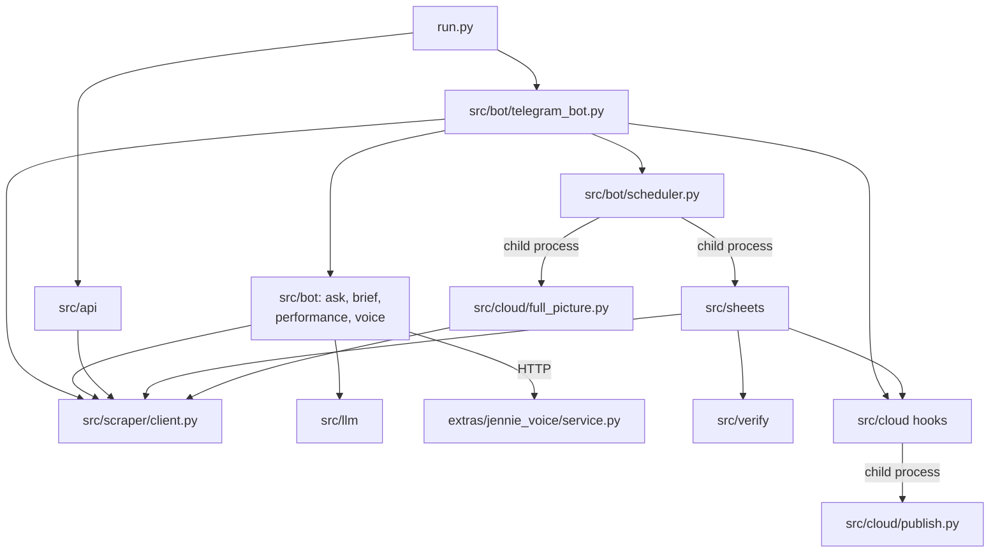

# Python programs

This is the index of every Python file in the repository: 138 files. 90 belong to the bot (12 at the root, 53 under `src/`, 25 under `tests/`); 48 are under `extras/` (5 in the voice service, 42 trial scripts, 1 helper of the phone app). Each row links to the section of the detail page under [programs/](programs/) that describes the file.

## How the programs fit together

`run.py` is the one long-running process. It imports `src/bot/telegram_bot.py`, whose `build_telegram_application` (`src/bot/telegram_bot.py:2367-2437`) registers every Telegram handler and calls `setup_scheduler` in `src/bot/scheduler.py`. The same process serves the REST API in `src/api/` (`run.py:79-97`). Every read of the agency's admin website (the "portal") goes through one client, `admin_client` in `src/scraper/client.py`, which sends GET requests and one login POST.

Heavy work does not run inside the bot process. The scheduler and two Telegram buttons start modules as separate Python processes: `python -m src.sheets.auto_sync`, `src.sheets.passport_issue`, `src.sheets.missing_report`, `src.sheets.stage_report` and `src.cloud.full_picture` (`src/bot/scheduler.py:347`, `:354`, `:360`, `:389`; `src/bot/telegram_bot.py:2205`, `:2271`, `:2304`). The document check in `src/verify/` runs inside the portal-sync process (`src/sheets/auto_sync.py:320`). When Supabase publishing is switched on, the handlers and jobs hand what they read to `src/cloud/`, which starts one more process, `python -m src.cloud.publish`, without waiting for it (`src/cloud/handoff.py:109-115`).

Two local services sit beside the bot: Ollama, reached through `src/llm/ollama_client.py`, and the voice service `extras/jennie_voice/service.py`, reached over HTTP from `src/bot/voice.py`. The root scripts are tools run by hand. `tests/` is the pytest suite. The trial scripts under `extras/trials/` were run once to choose the language model and the voice engines; nothing in the bot imports them.

Read these three first:

1. [`run.py`](../run.py) (110 lines): what starts, and in which order.
2. [`src/bot/scheduler.py`](../src/bot/scheduler.py) (515 lines): the 7 scheduled jobs, and `_run_module` (`:392-416`), which pushes heavy work into child processes.
3. [`src/scraper/client.py`](../src/scraper/client.py) (778 lines): the only way the code reaches the portal, and its read-only rules.

Then read `build_telegram_application` (`src/bot/telegram_bot.py:2367-2437`) for the full list of commands.

How to read the tables:

- "Lines" is the output of `wc -l` for the file.
- "How it is started" names the launcher, the scheduler line or the importing file. "By hand" means a person types the command; nothing in the repository starts it. Commands are run from the bot folder (the repository root) with the bot's own interpreter, `.venv\Scripts\python.exe`, unless the row says otherwise.
- Code is cited as `path:line`, relative to the repository root. A bare `:line` continues the file cited immediately before it.

## Totals

| Group | Files | Lines | Detail page |
|---|---|---|---|
| [Entry point and root scripts](#1-entry-point-and-root-scripts) | 12 | 4,275 | [programs/api_scripts_launchers.md](programs/api_scripts_launchers.md) and three others for the root copies |
| [`src/` top level](#2-src-top-level) | 4 | 590 | [programs/bot_core.md](programs/bot_core.md), [programs/scraper_and_config.md](programs/scraper_and_config.md), [programs/bot_answers_and_jobs.md](programs/bot_answers_and_jobs.md) |
| [`src/api/`](#3-srcapi) | 8 | 228 | [programs/api_scripts_launchers.md](programs/api_scripts_launchers.md) |
| [`src/bot/`](#4-srcbot) | 8 | 7,396 | [programs/bot_core.md](programs/bot_core.md), [programs/bot_answers_and_jobs.md](programs/bot_answers_and_jobs.md), [programs/voice_and_llm.md](programs/voice_and_llm.md) |
| [`src/scraper/`](#5-srcscraper) | 5 | 3,236 | [programs/scraper_and_config.md](programs/scraper_and_config.md) |
| [`src/llm/`](#6-srcllm) | 3 | 295 | [programs/voice_and_llm.md](programs/voice_and_llm.md) |
| [`src/sheets/`](#7-srcsheets) | 8 | 2,409 | [programs/sheets.md](programs/sheets.md) |
| [`src/verify/`](#8-srcverify) | 6 | 2,738 | [programs/verify.md](programs/verify.md) |
| [`src/cloud/`](#9-srccloud) | 11 | 5,051 | [programs/cloud.md](programs/cloud.md) |
| [`tests/`](#10-tests) | 25 | 13,420 | [programs/tests.md](programs/tests.md) |
| [`extras/jennie_voice/`](#11-extrasjennie_voice) | 5 | 2,087 | [programs/voice_and_llm.md](programs/voice_and_llm.md) |
| [`extras/trials/`](#12-extrastrials) | 42 | 3,607 | [programs/trials.md](programs/trials.md) |
| [`extras/jeannie-app/`](#13-extrasjeannie-app) | 1 | 84 | [JEANNIE_APP.md](JEANNIE_APP.md) |
| **Total** | **138** | **45,416** | |

The non-Python files (launchers, settings, documents) are listed in [PROJECT_STRUCTURE.md](PROJECT_STRUCTURE.md).

---

## 1. Entry point and root scripts

The last three files are copies that are never run. `apply_bot_update.bat` and `install_sheets.bat` copy them over their `src/` originals, so each must stay byte-identical to its `src/` file; `tests/test_cloud.py:1126-1129` fails otherwise ([PROJECT_STRUCTURE.md section 4](PROJECT_STRUCTURE.md#4-the-three-root-files-that-are-copies)).

| Program | Lines | What it does | How it is started | Details |
|---|---|---|---|---|
| [`run.py`](../run.py) | 110 | The one long-running process: log files, the Telegram DNS fix, the Ollama check, the Telegram bot with its scheduler, and the REST API on port 8000. If no bot token is set, only the REST API runs. | `start.bat:12` (console window) or `start_background.vbs:13` (no window); the Startup shortcut and the watchdog task use the second | [api_scripts_launchers.md](programs/api_scripts_launchers.md#runpy) |
| [`bootstrap.py`](../bootstrap.py) | 151 | Cold start on a fresh PC in six phases: progress sheets, the passport issue-date cache, passport audits of four programs, documents of verified students, the document check, then it prints how to start the bot. | By hand: `python bootstrap.py [--from N] [--only N] [--plan]` | [api_scripts_launchers.md](programs/api_scripts_launchers.md#bootstrappy) |
| [`audit_program.py`](../audit_program.py) | 232 | Passport cross-check of every student in one program; writes `program_audit_<program>_<YYYYMMDD_HHMM>.csv` into the current folder. | `python audit_program.py "<program name>"`; `run_passport_audit.bat:17`; `bootstrap.py:76` (phase 3) | [api_scripts_launchers.md](programs/api_scripts_launchers.md#audit_programpy) |
| [`download_passports.py`](../download_passports.py) | 51 | Saves every student's newest passport scan into `passports\` when it is not there yet. The path is relative, so it must run from the bot folder. | By hand | [api_scripts_launchers.md](programs/api_scripts_launchers.md#download_passportspy) |
| [`inspect_passports.py`](../inspect_passports.py) | 55 | Lists the students who have a passport scan on the portal; supplies `passport_students()`. | By hand; imported by `download_passports.py:12` | [api_scripts_launchers.md](programs/api_scripts_launchers.md#inspect_passportspy) |
| [`get_consultations.py`](../get_consultations.py) | 142 | Console report of the consultation requests of one date, read from `consult_requests.php` by column position. | By hand: `python get_consultations.py [date]` | [api_scripts_launchers.md](programs/api_scripts_launchers.md#get_consultationspy) |
| [`compress_docs.py`](../compress_docs.py) | 174 | One-off tool: rewrites, in place, every PDF or image over 1.95 MB in one folder fixed in the code. Keeps no original. | By hand. No launcher, test or module refers to it | [api_scripts_launchers.md](programs/api_scripts_launchers.md#compress_docspy) |
| [`test_system.py`](../test_system.py) | 145 | Five-part smoke test script (settings, parsers, portal client, language-model client, REST routes). Not a pytest file. Passes only with `MOCK_MODE=true`. | By hand: `python test_system.py` | [api_scripts_launchers.md](programs/api_scripts_launchers.md#test_systempy) |
| [`test_verified.py`](../test_verified.py) | 36 | Prints the students whose payment was verified today. Not a pytest file. | By hand | [api_scripts_launchers.md](programs/api_scripts_launchers.md#test_verifiedpy) |
| [`telegram_bot.py`](../telegram_bot.py) | 2,437 | Byte-identical copy of `src/bot/telegram_bot.py`. | Never run or imported. `apply_bot_update.bat:38` copies it over the `src/` file | [bot_core.md](programs/bot_core.md#6-telegram_botpy-repository-root) |
| [`config.py`](../config.py) | 147 | Byte-identical copy of `src/config.py`. | Never run or imported. `apply_bot_update.bat:44` copies it over the `src/` file | [scraper_and_config.md](programs/scraper_and_config.md#configpy-repository-root) |
| [`progress_builder.py`](../progress_builder.py) | 595 | Byte-identical copy of `src/sheets/progress_builder.py`. | Never run or imported. `install_sheets.bat:22` copies it over the `src/` file | [sheets.md](programs/sheets.md#4-progress_builderpy-repository-root) |

## 2. `src/` top level

| Program | Lines | What it does | How it is started | Details |
|---|---|---|---|---|
| [`src/__init__.py`](../src/__init__.py) | 79 | Points the certificate environment variables at `data/windows-ca.pem` when that file exists, and installs a log filter that hides the Telegram bot token and the Supabase keys. | Runs on the first import of anything under `src` | [bot_core.md](programs/bot_core.md#5-src__init__py) |
| [`src/config.py`](../src/config.py) | 147 | The `Settings` class: 32 settings read from `<bot folder>\.env`, with defaults; the folder helpers; who may use the bot. | Imported; `settings = Settings()` runs at import (`src/config.py:147`) | [scraper_and_config.md](programs/scraper_and_config.md#srcconfigpy) |
| [`src/dates.py`](../src/dates.py) | 259 | Strict, offline reading of the dates users type and the date stamps the portal prints; "today" in the report time zone. | Imported (library) | [bot_answers_and_jobs.md](programs/bot_answers_and_jobs.md#srcdatespy) |
| [`src/net_fix.py`](../src/net_fix.py) | 105 | Makes `api.telegram.org` reachable when its DNS answer cannot be reached, inside this process only. | Called once by `run.py:71` | [scraper_and_config.md](programs/scraper_and_config.md#srcnet_fixpy) |

## 3. `src/api/`

A FastAPI application served inside the `run.py` process. No route asks the caller for a key.

| Program | Lines | What it does | How it is started | Details |
|---|---|---|---|---|
| [`src/api/__init__.py`](../src/api/__init__.py) | 1 | Package marker. | Imported implicitly | [api_scripts_launchers.md](programs/api_scripts_launchers.md#srcapi__init__py) |
| [`src/api/main.py`](../src/api/main.py) | 69 | Builds the `app` object, allows any CORS origin, mounts the four routers under `/api`, adds `GET /` and `GET /healthz`. | `run.py:79-85` gives `"src.api.main:app"` to uvicorn | [api_scripts_launchers.md](programs/api_scripts_launchers.md#srcapimainpy) |
| [`src/api/schemas.py`](../src/api/schemas.py) | 76 | Pydantic request and response models; three are used. | Imported by `routes/auth.py` and `routes/crawler.py` | [api_scripts_launchers.md](programs/api_scripts_launchers.md#srcapischemaspy) |
| [`src/api/routes/__init__.py`](../src/api/routes/__init__.py) | 1 | Package marker. | Imported implicitly | [api_scripts_launchers.md](programs/api_scripts_launchers.md#srcapiroutes__init__py) |
| [`src/api/routes/auth.py`](../src/api/routes/auth.py) | 27 | `GET /api/auth/csrf`, `POST /api/auth/login`, `GET /api/auth/status`. The login route logs the shared portal client in; it does not check the caller. | Mounted by `src/api/main.py:42` | [api_scripts_launchers.md](programs/api_scripts_launchers.md#srcapiroutesauthpy) |
| [`src/api/routes/dashboard.py`](../src/api/routes/dashboard.py) | 16 | `GET /api/dashboard/stats`, `GET /api/dashboard/alerts`. | Mounted by `src/api/main.py:43` | [api_scripts_launchers.md](programs/api_scripts_launchers.md#srcapiroutesdashboardpy) |
| [`src/api/routes/applications.py`](../src/api/routes/applications.py) | 26 | `GET /api/applications`, `/api/applications/inquiries`, `/api/applications/consultations`. | Mounted by `src/api/main.py:44` | [api_scripts_launchers.md](programs/api_scripts_launchers.md#srcapiroutesapplicationspy) |
| [`src/api/routes/crawler.py`](../src/api/routes/crawler.py) | 12 | `POST /api/crawler/parse-page`: fetches any portal path with a GET and returns its tables as JSON. | Mounted by `src/api/main.py:45` | [api_scripts_launchers.md](programs/api_scripts_launchers.md#srcapiroutescrawlerpy) |

## 4. `src/bot/`

| Program | Lines | What it does | How it is started | Details |
|---|---|---|---|---|
| [`src/bot/__init__.py`](../src/bot/__init__.py) | 1 | Package marker. | Imported implicitly | [bot_core.md](programs/bot_core.md#4-srcbot__init__py) |
| [`src/bot/telegram_bot.py`](../src/bot/telegram_bot.py) | 2,437 | The Telegram bot: who may use it, 42 command names on 27 handler functions, 3 button handlers, the free-text handler, report formatting, the `/sendmail` conversation, the passport cross-check, the 13-entry command menu, and `build_telegram_application` (`:2367`). | Imported by `run.py:32` | [bot_core.md](programs/bot_core.md#2-srcbottelegram_botpy) |
| [`src/bot/replies.py`](../src/bot/replies.py) | 165 | Splits long replies into pieces of at most 3,900 characters (`:33`), resends as plain text when Telegram rejects the Markdown, builds the two stock error replies. | Imported (library) | [bot_core.md](programs/bot_core.md#3-srcbotrepliespy) |
| [`src/bot/ask.py`](../src/bot/ask.py) | 1,411 | Questions in plain words: `classify` (`:529`) picks a route by whole words; the file builds the live answers no command gives (pending payments, window applications under review, dashboard figures, intakes, applied dates, calendar, unknown questions). | Imported by `src/bot/telegram_bot.py`, `src/bot/voice.py`, `src/cloud/backfill.py` | [bot_answers_and_jobs.md](programs/bot_answers_and_jobs.md#srcbotaskpy) |
| [`src/bot/brief.py`](../src/bot/brief.py) | 687 | The daily brief, counted in code from live portal reads and the local file `results.json`. One optional summary from the language model is added only if a checker accepts every claim in it. | Called by the 18:05 job and by `/brief`, `/dailybrief`, `/report` | [bot_answers_and_jobs.md](programs/bot_answers_and_jobs.md#srcbotbriefpy) |
| [`src/bot/performance.py`](../src/bot/performance.py) | 303 | Formats the portal's Consultant Performance page (today or this month) as a Telegram reply, with warnings when the page contradicts itself. | Called by `/performance_today`, `/performance_month`, `/performance` and the free-text performance route | [bot_answers_and_jobs.md](programs/bot_answers_and_jobs.md#srcbotperformancepy) |
| [`src/bot/scheduler.py`](../src/bot/scheduler.py) | 515 | The scheduler and its 7 jobs (`:419-514`); the brief job, the passport-upload watcher, the model warm-up, and `_run_module`, which runs a module as a child process for at most 1 hour. | `setup_scheduler(app)` is called by `build_telegram_application` (`src/bot/telegram_bot.py:2436`) | [bot_answers_and_jobs.md](programs/bot_answers_and_jobs.md#srcbotschedulerpy) |
| [`src/bot/voice.py`](../src/bot/voice.py) | 1,877 | Jennie, the bot side of the voice: a voice note goes to the voice service for speech-to-text, one model call routes it to one of 10 commands, the reply is condensed to one spoken sentence and sent back as a voice note. Also the filler clips and the spoken daily brief. | Its handler is registered only when `JENNIE_VOICE_ENABLED` is true (`src/bot/telegram_bot.py:2430-2432`) | [voice_and_llm.md](programs/voice_and_llm.md#srcbotvoicepy) |

## 5. `src/scraper/`

| Program | Lines | What it does | How it is started | Details |
|---|---|---|---|---|
| [`src/scraper/__init__.py`](../src/scraper/__init__.py) | 1 | Package marker. | Imported implicitly | [scraper_and_config.md](programs/scraper_and_config.md#srcscraper__init__py) |
| [`src/scraper/client.py`](../src/scraper/client.py) | 778 | The one HTTP client for the portal and the shared object `admin_client` (`:778`): login and session, every page read, the `students.php` reader (50 students a page, at most 40 pages, `:44-45`), the passport-scan download. | Imported; importing it builds `admin_client` | [scraper_and_config.md](programs/scraper_and_config.md#srcscraperclientpy) |
| [`src/scraper/parsers.py`](../src/scraper/parsers.py) | 1,351 | Turns portal HTML into Python dicts; first undoes the e-mail hiding Cloudflare applies to the pages. | Imported (pure functions) | [scraper_and_config.md](programs/scraper_and_config.md#srcscraperparserspy) |
| [`src/scraper/ocr_validator.py`](../src/scraper/ocr_validator.py) | 897 | Passport check on the PC: EasyOCR on the CPU, the machine-readable zone with its check digits, a field-by-field comparison with the portal's values. | Imported by `src/scraper/client.py:38`; runs in a worker thread | [scraper_and_config.md](programs/scraper_and_config.md#srcscraperocr_validatorpy) |
| [`src/scraper/mock_data.py`](../src/scraper/mock_data.py) | 209 | Three fixed demo tables used in mock mode. | Imported by `src/scraper/client.py:39` | [scraper_and_config.md](programs/scraper_and_config.md#srcscrapermock_datapy) |

## 6. `src/llm/`

| Program | Lines | What it does | How it is started | Details |
|---|---|---|---|---|
| [`src/llm/__init__.py`](../src/llm/__init__.py) | 1 | Package marker. | Imported implicitly | [voice_and_llm.md](programs/voice_and_llm.md#srcllm__init__py) |
| [`src/llm/ollama_client.py`](../src/llm/ollama_client.py) | 274 | The only client of the local Ollama server, and its shared object `ollama_client` (`:274`); holds the keep-alive policy and the context-size guard. | Imported; the object is created at import | [voice_and_llm.md](programs/voice_and_llm.md#srcllmollama_clientpy) |
| [`src/llm/prompts.py`](../src/llm/prompts.py) | 20 | The one system prompt for typed questions: the model only names which numbered facts answer the question, and the bot shows those facts word for word. | Imported by `src/llm/ollama_client.py:9` | [voice_and_llm.md](programs/voice_and_llm.md#srcllmpromptspy) |

## 7. `src/sheets/`

The bot signs in to Google with `credentials.json` and `token.json` in the bot folder. Every module here except the empty `__init__.py` has a `__main__` block and can also be run by hand with `python -m src.sheets.<name>`.

| Program | Lines | What it does | How it is started | Details |
|---|---|---|---|---|
| [`src/sheets/__init__.py`](../src/sheets/__init__.py) | 0 | Empty package marker. | Imported implicitly | [sheets.md](programs/sheets.md#2-srcsheets__init__py) |
| [`src/sheets/progress_builder.py`](../src/sheets/progress_builder.py) | 595 | Reads the portal's students CSV export and builds or rewrites one Google Sheet per program and intake; only the main tab is rewritten. Also the Google sign-in (`--auth`) and the helpers the other sheet modules import. | `build_sheets.bat:12` (`--all`), `gauth.bat:17` (`--auth`), `bootstrap.py:52`; imported by the other sheet modules | [sheets.md](programs/sheets.md#3-srcsheetsprogress_builderpy) |
| [`src/sheets/auto_sync.py`](../src/sheets/auto_sync.py) | 493 | The 15-minute portal sync: finds changed students, rebuilds the changed sheets, downloads newly verified students' documents, runs the document check, sends Telegram summaries, hands the run to Supabase. | Child process every 15 minutes (`src/bot/scheduler.py:347`) | [sheets.md](programs/sheets.md#5-srcsheetsauto_syncpy) |
| [`src/sheets/verified_docs.py`](../src/sheets/verified_docs.py) | 437 | Lists document-verified students and unpacks each one's document ZIP into a folder on the PC (files over 2 MB shrunk, originals kept) or into Google Drive. | Called by `auto_sync` (local mode); `bootstrap.py:86` (`--local`) | [sheets.md](programs/sheets.md#6-srcsheetsverified_docspy) |
| [`src/sheets/missing_report.py`](../src/sheets/missing_report.py) | 358 | The missing-information report: a Telegram text and an Excel file; also the per-program list behind the `/missing` buttons. | Child process at 09:05 (`src/bot/scheduler.py:360`); the `/missing` buttons (`src/bot/telegram_bot.py:2205`) | [sheets.md](programs/sheets.md#7-srcsheetsmissing_reportpy) |
| [`src/sheets/passport_issue.py`](../src/sheets/passport_issue.py) | 145 | Keeps the cache `data/passport_issue.json`: passport number to passport issue date, read from each student's portal edit page. | Child process at 08:30 with `--refresh` (`src/bot/scheduler.py:354`); `bootstrap.py:61` | [sheets.md](programs/sheets.md#8-srcsheetspassport_issuepy) |
| [`src/sheets/stage_report.py`](../src/sheets/stage_report.py) | 270 | The stage report of one program and intake: students per stage, each student's status and progress. | The `/stage` buttons (`src/bot/telegram_bot.py:2271`, `:2304`) | [sheets.md](programs/sheets.md#9-srcsheetsstage_reportpy) |
| [`src/sheets/attendance.py`](../src/sheets/attendance.py) | 111 | Reads an office attendance Google Sheet and formats who is in and who is late. No job, command or other file uses it. | By hand only: `python -m src.sheets.attendance` | [sheets.md](programs/sheets.md#10-srcsheetsattendancepy) |

## 8. `src/verify/`

| Program | Lines | What it does | How it is started | Details |
|---|---|---|---|---|
| [`src/verify/__init__.py`](../src/verify/__init__.py) | 0 | Empty package marker. | Imported implicitly | [verify.md](programs/verify.md#2-srcverify__init__py) |
| [`src/verify/auto_verify.py`](../src/verify/auto_verify.py) | 609 | The orchestrator: picks the students to check (6 per pass by default, `:59`), caches each file's text, runs the document check and the field check, keeps `results.json`, writes `DOCUMENT CHECK.xlsx` and `FIELD CHECK.xlsx`. | Inside the portal sync (`src/sheets/auto_sync.py:320`); `bootstrap.py:95`; by hand: `python -m src.verify.auto_verify` | [verify.md](programs/verify.md#3-srcverifyauto_verifypy) |
| [`src/verify/doc_verifier.py`](../src/verify/doc_verifier.py) | 1,241 | The document check: reads each file (PDF text layer first, OCR otherwise), classifies it by file name, applies the rules and the cross-document checks, gives each file and each student a verdict. | Imported by `auto_verify.py`, `field_check.py` and `src/cloud/sheet_hooks.py`; by hand: `python -m src.verify.doc_verifier` | [verify.md](programs/verify.md#4-srcverifydoc_verifierpy) |
| [`src/verify/field_check.py`](../src/verify/field_check.py) | 302 | The field check: looks for each portal value in the documents that can carry it; answers MATCH, DIFFERS, UNREADABLE, NO DOCUMENT or BLANK. | Imported by `auto_verify.py`; by hand: `python -m src.verify.field_check` | [verify.md](programs/verify.md#5-srcverifyfield_checkpy) |
| [`src/verify/page_checks.py`](../src/verify/page_checks.py) | 452 | Checks on the page image: colour or black and white, QR codes, Bangla text without a translation, a notary seal, the page order of an apostilled academic file. | Imported by `doc_verifier.py` | [verify.md](programs/verify.md#6-srcverifypage_checkspy) |
| [`src/verify/rules.py`](../src/verify/rules.py) | 134 | Constants only: required documents per program, file-name patterns, thresholds, keyword lists, report titles. | Imported by `doc_verifier.py`, `field_check.py`, `page_checks.py` | [verify.md](programs/verify.md#7-srcverifyrulespy) |

## 9. `src/cloud/`

Publishing to Supabase. Nothing here does any work unless `SUPABASE_URL`, `SUPABASE_SECRET_KEY` and `CLOUD_PUBLISH_ENABLED` are all set (`src/cloud/publish.py:103-107`).

| Program | Lines | What it does | How it is started | Details |
|---|---|---|---|---|
| [`src/cloud/__init__.py`](../src/cloud/__init__.py) | 24 | Package description and `JOBS`, the 9 job names written into `hg_runs.job` (`:23-24`). | Imported with the package | [cloud.md](programs/cloud.md#2-srccloud__init__py) |
| [`src/cloud/records.py`](../src/cloud/records.py) | 1,491 | One builder function per record kind (26 kinds, `:41-47`): turns a reader's or a report's output into a record with key, scope, student columns, data, text and content hash. | Imported by the other cloud modules | [cloud.md](programs/cloud.md#3-srccloudrecordspy) |
| [`src/cloud/publish.py`](../src/cloud/publish.py) | 938 | The publish engine and the publisher process: sends only changed records (hash state `data/cloud_state.json`), calls `hg_sync` with at most 200 rows and 1,000,000 bytes per call, writes `hg_runs` rows, holds a one-publisher lock, supports a dry run. | `python -m src.cloud.publish --from <file>`, started by `src/cloud/handoff.py:112`; also imported | [cloud.md](programs/cloud.md#4-srccloudpublishpy) |
| [`src/cloud/backfill.py`](../src/cloud/backfill.py) | 684 | The one-time full copy to Supabase, and the `collect_*` readers the hourly full picture reuses. | By hand: `python -m src.cloud.backfill [--dry-run]`; imported by `full_picture.py` | [cloud.md](programs/cloud.md#5-srccloudbackfillpy) |
| [`src/cloud/sheet_hooks.py`](../src/cloud/sheet_hooks.py) | 470 | What the four sheet jobs hand to Supabase as their last step: portal sync, missing report, stage report, issue-date refresh. | Called by `src/sheets/auto_sync.py`, `missing_report.py`, `stage_report.py`, `passport_issue.py` | [cloud.md](programs/cloud.md#6-srccloudsheet_hookspy) |
| [`src/cloud/command_hooks.py`](../src/cloud/command_hooks.py) | 357 | What the Telegram command and free-text handlers hand to Supabase after their reply. | Called by `src/bot/telegram_bot.py`, `ask.py`, `performance.py` | [cloud.md](programs/cloud.md#7-srccloudcommand_hookspy) |
| [`src/cloud/bot_jobs.py`](../src/cloud/bot_jobs.py) | 309 | What the daily brief and the passport watcher hand to Supabase. | Called by `src/bot/scheduler.py` | [cloud.md](programs/cloud.md#8-srccloudbot_jobspy) |
| [`src/cloud/embed.py`](../src/cloud/embed.py) | 298 | Text chunking and embeddings with `thenlper/gte-small` on the CPU (384 numbers per chunk); the guard that hides the GPU from an embedding process; a stub embedder for tests. | Imported by `publish.py`, `backfill.py`, `full_picture.py` and `handoff.py` (`handoff.py:97`) | [cloud.md](programs/cloud.md#9-srccloudembedpy) |
| [`src/cloud/handoff.py`](../src/cloud/handoff.py) | 144 | What every job calls: writes one file `data/cloud/pending/<time>-<job>.json` and starts the publisher process without waiting. | Imported by the three hook modules and by `publish.py` | [cloud.md](programs/cloud.md#10-srccloudhandoffpy) |
| [`src/cloud/full_picture.py`](../src/cloud/full_picture.py) | 204 | The hourly full picture: re-reads the main portal pages (GET only) and publishes them from its own process. | Child process every 60 minutes, first run 7.5 minutes after start, only while publishing is on (`src/bot/scheduler.py:365-366`, `:378-389`) | [cloud.md](programs/cloud.md#11-srccloudfull_picturepy) |
| [`src/cloud/student_index.py`](../src/cloud/student_index.py) | 132 | Local index `data/cloud/student_index.json`: passport number to portal uid and student id. | Imported by `backfill.py` and `sheet_hooks.py` | [cloud.md](programs/cloud.md#12-srccloudstudent_indexpy) |

## 10. `tests/`

The pytest suite: `conftest.py` and 24 test modules, 604 test functions, 1,152 cases after parametrisation. Every test module is started by pytest. One file: `.venv\Scripts\python.exe -m pytest tests\<file>.py -q`. The whole suite without the one slow test: `.venv\Scripts\python.exe -m pytest tests -m "not slow" -q`. `pytest` is not in `requirements.txt`; install it first. The suite uses a fake portal, fake Telegram objects and a fake Supabase built in the test files. "Tests" below counts test functions.

| Program | Lines | What it covers | How it is started | Details |
|---|---|---|---|---|
| [`tests/conftest.py`](../tests/conftest.py) | 29 | Puts the bot folder on `sys.path`, registers the `slow` marker, switches Supabase publishing off for every test. | Loaded by pytest automatically | [tests.md](programs/tests.md#2-testsconftestpy) |
| [`tests/test_brief.py`](../tests/test_brief.py) | 1,053 | The daily brief, its summary checker and the page readers behind it. 42 tests. | pytest | [tests.md](programs/tests.md#3-teststest_briefpy) |
| [`tests/test_cloud.py`](../tests/test_cloud.py) | 1,129 | The publish layer: record builders, hash state, `hg_sync` and `hg_runs` calls, handoff, backfill, embeddings, secret redaction, the root-copy check. Defines the fake Supabase. 59 tests. | pytest | [tests.md](programs/tests.md#4-teststest_cloudpy) |
| [`tests/test_cloud_all.py`](../tests/test_cloud_all.py) | 157 | Where the publish hooks meet; the scheduler's seven jobs. 5 tests. | pytest | [tests.md](programs/tests.md#5-teststest_cloud_allpy) |
| [`tests/test_cloud_bot_jobs.py`](../tests/test_cloud_bot_jobs.py) | 689 | What the passport watcher, the daily brief and the hourly full picture hand to Supabase. 29 tests. | pytest | [tests.md](programs/tests.md#6-teststest_cloud_bot_jobspy) |
| [`tests/test_cloud_cf_email.py`](../tests/test_cloud_cf_email.py) | 375 | Cloudflare's e-mail hiding is undone in every page parse. 18 tests. | pytest | [tests.md](programs/tests.md#7-teststest_cloud_cf_emailpy) |
| [`tests/test_cloud_commands.py`](../tests/test_cloud_commands.py) | 538 | What the command handlers and free-text answers publish. 29 tests. | pytest | [tests.md](programs/tests.md#8-teststest_cloud_commandspy) |
| [`tests/test_cloud_dry_run.py`](../tests/test_cloud_dry_run.py) | 390 | Regression tests from the Supabase dry run of 29 September 2026. 17 tests. | pytest | [tests.md](programs/tests.md#9-teststest_cloud_dry_runpy) |
| [`tests/test_cloud_fixes.py`](../tests/test_cloud_fixes.py) | 544 | Regression tests from the review of the publish layer. 30 tests. | pytest | [tests.md](programs/tests.md#10-teststest_cloud_fixespy) |
| [`tests/test_cloud_jobs.py`](../tests/test_cloud_jobs.py) | 726 | What the four sheet jobs hand to Supabase. 26 tests. | pytest | [tests.md](programs/tests.md#11-teststest_cloud_jobspy) |
| [`tests/test_cloud_performance.py`](../tests/test_cloud_performance.py) | 349 | The Consultant Performance page's copy to Supabase (kind `consultant_performance`). 20 tests. | pytest | [tests.md](programs/tests.md#12-teststest_cloud_performancepy) |
| [`tests/test_consultations.py`](../tests/test_consultations.py) | 138 | `consult_requests.php` read by column name; page builders other files reuse. 8 tests. | pytest | [tests.md](programs/tests.md#13-teststest_consultationspy) |
| [`tests/test_crosscheck.py`](../tests/test_crosscheck.py) | 654 | The passport cross-check commands, `/passports`, the OCR and MRZ validator, the passport audit. 36 tests. | pytest | [tests.md](programs/tests.md#14-teststest_crosscheckpy) |
| [`tests/test_final_fixes.py`](../tests/test_final_fixes.py) | 96 | Last small fixes: date prompt, OCR count, calendar note, model keep-alive. 8 tests. | pytest | [tests.md](programs/tests.md#15-teststest_final_fixespy) |
| [`tests/test_foundation.py`](../tests/test_foundation.py) | 787 | The date reader, the long-reply splitter, the portal session, the `students.php` reader, `/verified*`, `/admitted`, `/students`. Defines the main fake portal and fake Telegram objects. 38 tests. | pytest | [tests.md](programs/tests.md#16-teststest_foundationpy) |
| [`tests/test_freetext.py`](../tests/test_freetext.py) | 686 | Plain-word questions: classification, routing, live dashboard and calendar answers, the model's fact pick. 31 tests. | pytest | [tests.md](programs/tests.md#17-teststest_freetextpy) |
| [`tests/test_inquiries.py`](../tests/test_inquiries.py) | 343 | `/inquiries_today`, `/inquiries_date`, `/consultations`, `/inquiries` and their free-text routes. 15 tests. | pytest | [tests.md](programs/tests.md#18-teststest_inquiriespy) |
| [`tests/test_integration.py`](../tests/test_integration.py) | 153 | `/alerts`, `/stats`, the `/sendmail` lookup, the root passport scripts. 9 tests. | pytest | [tests.md](programs/tests.md#19-teststest_integrationpy) |
| [`tests/test_jobs.py`](../tests/test_jobs.py) | 849 | The scheduled jobs and sheet reports: passport watcher, portal sync, `/stage`, `/missing`, passport issue dates. 41 tests. | pytest | [tests.md](programs/tests.md#20-teststest_jobspy) |
| [`tests/test_performance.py`](../tests/test_performance.py) | 1,064 | `/performance_today`, `/performance_month`, `/performance` and their free-text routes. 52 tests. | pytest | [tests.md](programs/tests.md#21-teststest_performancepy) |
| [`tests/test_repair.py`](../tests/test_repair.py) | 498 | Regression tests of the repairs of 28 September 2026. 15 tests. | pytest | [tests.md](programs/tests.md#22-teststest_repairpy) |
| [`tests/test_repair_voice.py`](../tests/test_repair_voice.py) | 120 | Spoken dates that do not exist; a failed portal read said in words built in code. 7 tests. | pytest | [tests.md](programs/tests.md#23-teststest_repair_voicepy) |
| [`tests/test_voice.py`](../tests/test_voice.py) | 698 | Voice-note handling, voice-service failures, the spoken brief. Defines the voice fakes. 21 tests. | pytest | [tests.md](programs/tests.md#24-teststest_voicepy) |
| [`tests/test_voice_fast.py`](../tests/test_voice_fast.py) | 872 | Filler clips, one-call routing with per-chat memory, reply checks, Ollama options and warm-up. 41 tests. | pytest | [tests.md](programs/tests.md#25-teststest_voice_fastpy) |
| [`tests/test_watcher_nonblocking.py`](../tests/test_watcher_nonblocking.py) | 483 | The passport watcher's OCR runs on a worker thread and does not freeze the bot. 7 tests. | pytest | [tests.md](programs/tests.md#26-teststest_watcher_nonblockingpy) |

## 11. `extras/jennie_voice/`

The local voice service, a separate Python program with its own virtual environment in its own folder. Commands in this table use that environment, `.venv\Scripts\python.exe` inside the service's folder. [extras/README.md](../extras/README.md) says where the folder came from.

| Program | Lines | What it does | How it is started | Details |
|---|---|---|---|---|
| [`extras/jennie_voice/service.py`](../extras/jennie_voice/service.py) | 1,309 | The voice service: `GET /health`, `POST /stt` (speech-to-text with faster-whisper), `POST /tts` (text-to-speech with CosyVoice2-0.5B), listening on `127.0.0.1:8765` only (`:49-50`). | `start_jennie_voice.vbs` (no window), or `.venv\Scripts\python.exe service.py` | [voice_and_llm.md](programs/voice_and_llm.md#extrasjennie_voiceservicepy) |
| [`extras/jennie_voice/smoke_test.py`](../extras/jennie_voice/smoke_test.py) | 318 | End-to-end check of a running service; writes `smoke_test.json`. | By hand: `.venv\Scripts\python.exe smoke_test.py` | [voice_and_llm.md](programs/voice_and_llm.md#extrasjennie_voicesmoke_testpy) |
| [`extras/jennie_voice/offline_test.py`](../extras/jennie_voice/offline_test.py) | 223 | Checks of `service.py` that need no model and no port. | By hand: `.venv\Scripts\python.exe offline_test.py` | [voice_and_llm.md](programs/voice_and_llm.md#extrasjennie_voiceoffline_testpy) |
| [`extras/jennie_voice/bench_stt.py`](../extras/jennie_voice/bench_stt.py) | 228 | The benchmark that chose the speech-to-text models. | By hand: `.venv\Scripts\python.exe bench_stt.py [cpu]` | [voice_and_llm.md](programs/voice_and_llm.md#extrasjennie_voicebench_sttpy) |
| [`extras/jennie_voice/stubs/pyworld.py`](../extras/jennie_voice/stubs/pyworld.py) | 9 | Stand-in for the `pyworld` package, which has no Windows build for Python 3.12; CosyVoice uses it only for training. | Imported by CosyVoice after `service.py:219` puts `stubs/` on the import path | [voice_and_llm.md](programs/voice_and_llm.md#extrasjennie_voicestubspyworldpy) |

## 12. `extras/trials/`

The experiments that chose the language model (`brain-trial/`) and the voice engines (`voice-trials/<engine>/`). Each was run by hand from its own folder on the owner's PC, in late September 2026. Most cannot run from this repository as they are: they use absolute paths under `C:\Hangeul\` and need model files, environments and audio that are not published ([trials.md, "Fixed paths"](programs/trials.md#fixed-paths)). The production bot imports none of them.

| Program | Lines | What it does | How it is started | Details |
|---|---|---|---|---|
| [`brain-trial/trial.py`](../extras/trials/brain-trial/trial.py) | 347 | Scores Ollama models on routing, spoken replies, GPU memory and speed. | By hand: `python trial.py [model ...]` | [trials.md](programs/trials.md#extrastrialsbrain-trialtrialpy) |
| [`brain-trial/latency_harness.py`](../extras/trials/brain-trial/latency_harness.py) | 729 | Times the bot's real voice-note path end to end, with fake Telegram objects and the real voice service, Ollama and portal reads. | By hand, with the bot's environment: `python latency_harness.py [--passes N] [--gap S] [--tg-rtt S] [--keep-loaded]` | [trials.md](programs/trials.md#extrastrialsbrain-triallatency_harnesspy) |
| [`brain-trial/brief_crosscheck.py`](../extras/trials/brain-trial/brief_crosscheck.py) | 534 | Re-reads the portal on its own (login and GET requests) and checks every number in one daily brief. | By hand: `python brief_crosscheck.py [brief.txt] [--json OUT.json]` | [trials.md](programs/trials.md#extrastrialsbrain-trialbrief_crosscheckpy) |
| [`brain-trial/registry_check.py`](../extras/trials/brain-trial/registry_check.py) | 48 | Checks five model tags in the Ollama registry: exists, size, licence. Writes `registry.json`. | By hand: `python registry_check.py` | [trials.md](programs/trials.md#extrastrialsbrain-trialregistry_checkpy) |
| [`brain-trial/license_check.py`](../extras/trials/brain-trial/license_check.py) | 28 | Saves the licence of two models and prints the clauses about commercial use. | By hand: `python license_check.py` | [trials.md](programs/trials.md#extrastrialsbrain-triallicense_checkpy) |
| [`brain-trial/localhost_check.py`](../extras/trials/brain-trial/localhost_check.py) | 17 | Times `localhost` against `127.0.0.1` for Ollama. | By hand: `python localhost_check.py` | [trials.md](programs/trials.md#extrastrialsbrain-triallocalhost_checkpy) |
| [`brain-trial/vram_probe.py`](../extras/trials/brain-trial/vram_probe.py) | 43 | Measures the GPU memory one model really uses, with `nvidia-smi`. | By hand: `python vram_probe.py <model> [...]` | [trials.md](programs/trials.md#extrastrialsbrain-trialvram_probepy) |
| [`voice-trials/chatterbox/download.py`](../extras/trials/voice-trials/chatterbox/download.py) | 26 | Downloads the Chatterbox multilingual checkpoints into the trial folder. | By hand: `python download.py [<t3 file>]` | [trials.md](programs/trials.md#extrastrialsvoice-trialschatterboxdownloadpy) |
| [`voice-trials/chatterbox/prep_ref.py`](../extras/trials/voice-trials/chatterbox/prep_ref.py) | 34 | Makes a 24 kHz reference clip from a MeloTTS Korean sample. | By hand: `python prep_ref.py` | [trials.md](programs/trials.md#extrastrialsvoice-trialschatterboxprep_refpy) |
| [`voice-trials/chatterbox/render.py`](../extras/trials/voice-trials/chatterbox/render.py) | 183 | Renders 11 Chatterbox samples, on the GPU when the shared lock and free memory allow. | By hand: `python render.py` | [trials.md](programs/trials.md#extrastrialsvoice-trialschatterboxrenderpy) |
| [`voice-trials/chatterbox/verify.py`](../extras/trials/voice-trials/chatterbox/verify.py) | 38 | Checks that each rendered WAV opens, is long enough and is not silent. | By hand: `python verify.py` | [trials.md](programs/trials.md#extrastrialsvoice-trialschatterboxverifypy) |
| [`voice-trials/chatterbox/asr_check.py`](../extras/trials/voice-trials/chatterbox/asr_check.py) | 57 | Transcribes each sample with Whisper and scores the character error rate. | By hand: `python asr_check.py` | [trials.md](programs/trials.md#extrastrialsvoice-trialschatterboxasr_checkpy) |
| [`voice-trials/chatterbox/check_wm_clip.py`](../extras/trials/voice-trials/chatterbox/check_wm_clip.py) | 23 | Counts clipped samples and reads the Perth watermark score. | By hand: `python check_wm_clip.py` | [trials.md](programs/trials.md#extrastrialsvoice-trialschatterboxcheck_wm_clippy) |
| [`voice-trials/cosyvoice/synth.py`](../extras/trials/voice-trials/cosyvoice/synth.py) | 169 | Renders CosyVoice samples and reference clips in four jobs, `sft`, `v2`, `v2b`, `v3`. Job `v2b` made Jennie's reference clip. | By hand: `python synth.py <job> [cpu]` | [trials.md](programs/trials.md#extrastrialsvoice-trialscosyvoicesynthpy) |
| [`voice-trials/cosyvoice/synth_texts.py`](../extras/trials/voice-trials/cosyvoice/synth_texts.py) | 9 | The test sentences and the reference sentences. | Imported by `synth.py`, `exp_sft_lang.py`, `verify.py` | [trials.md](programs/trials.md#extrastrialsvoice-trialscosyvoicesynth_textspy) |
| [`voice-trials/cosyvoice/gpulock.py`](../extras/trials/voice-trials/cosyvoice/gpulock.py) | 77 | Waits for the shared GPU lock file, checks free GPU memory, holds the lock. | Imported by `synth.py` and `exp_sft_lang.py` | [trials.md](programs/trials.md#extrastrialsvoice-trialscosyvoicegpulockpy) |
| [`voice-trials/cosyvoice/gpucheck.py`](../extras/trials/voice-trials/cosyvoice/gpucheck.py) | 9 | Prints free and total GPU memory. | Run as a child process by `gpulock.py` | [trials.md](programs/trials.md#extrastrialsvoice-trialscosyvoicegpucheckpy) |
| [`voice-trials/cosyvoice/smoke.py`](../extras/trials/voice-trials/cosyvoice/smoke.py) | 18 | CPU-only test that the install imports and a model loads; lists the stock speakers. | By hand: `python smoke.py` | [trials.md](programs/trials.md#extrastrialsvoice-trialscosyvoicesmokepy) |
| [`voice-trials/cosyvoice/exp_sft_lang.py`](../extras/trials/voice-trials/cosyvoice/exp_sft_lang.py) | 43 | A/B test of a language tag on the stock Korean speaker. | By hand: `python exp_sft_lang.py` | [trials.md](programs/trials.md#extrastrialsvoice-trialscosyvoiceexp_sft_langpy) |
| [`voice-trials/cosyvoice/verify.py`](../extras/trials/voice-trials/cosyvoice/verify.py) | 70 | Checks each sample and scores a Whisper round trip. | By hand: `python verify.py [<glob>] [<whisper model>]` | [trials.md](programs/trials.md#extrastrialsvoice-trialscosyvoiceverifypy) |
| [`voice-trials/cosyvoice/textmetrics.py`](../extras/trials/voice-trials/cosyvoice/textmetrics.py) | 21 | Character-error-rate helper. | Imported by `synth.py` and `verify.py` | [trials.md](programs/trials.md#extrastrialsvoice-trialscosyvoicetextmetricspy) |
| [`voice-trials/cosyvoice/summarize.py`](../extras/trials/voice-trials/cosyvoice/summarize.py) | 14 | Prints one comparison line per sample from `renders.jsonl` and `verify_results.json`. | By hand: `python summarize.py` | [trials.md](programs/trials.md#extrastrialsvoice-trialscosyvoicesummarizepy) |
| [`voice-trials/kokoro/check_repo.py`](../extras/trials/voice-trials/kokoro/check_repo.py) | 42 | Reads the Kokoro-82M model repository: licence, voices, model card. | By hand: `python check_repo.py` | [trials.md](programs/trials.md#extrastrialsvoice-trialskokorocheck_repopy) |
| [`voice-trials/kokoro/meta_check.py`](../extras/trials/voice-trials/kokoro/meta_check.py) | 38 | Prints package licences, language codes and disk sizes; re-checks the WAV files. | By hand: `python meta_check.py` | [trials.md](programs/trials.md#extrastrialsvoice-trialskokorometa_checkpy) |
| [`voice-trials/kokoro/synth.py`](../extras/trials/voice-trials/kokoro/synth.py) | 68 | Renders the English test sentence with Kokoro voices on the CPU. | By hand: `python synth.py [voice ...]` | [trials.md](programs/trials.md#extrastrialsvoice-trialskokorosynthpy) |
| [`voice-trials/melotts/render_samples.py`](../extras/trials/voice-trials/melotts/render_samples.py) | 117 | Renders English and Korean samples on the CPU. | By hand: `python render_samples.py [en] [kr]` | [trials.md](programs/trials.md#extrastrialsvoice-trialsmelottsrender_samplespy) |
| [`voice-trials/melotts/aegyo_samples.py`](../extras/trials/voice-trials/melotts/aegyo_samples.py) | 49 | Renders four "cute" Korean variants by speed, pitch and prosody. | By hand: `python aegyo_samples.py` | [trials.md](programs/trials.md#extrastrialsvoice-trialsmelottsaegyo_samplespy) |
| [`voice-trials/melotts/bench.py`](../extras/trials/voice-trials/melotts/bench.py) | 40 | CPU timing benchmark, 3 repetitions per voice; writes no file. | By hand: `python bench.py` | [trials.md](programs/trials.md#extrastrialsvoice-trialsmelottsbenchpy) |
| [`voice-trials/melotts/analyze_wavs.py`](../extras/trials/voice-trials/melotts/analyze_wavs.py) | 22 | Re-checks the MeloTTS WAV files and estimates the median pitch. | By hand: `python analyze_wavs.py` | [trials.md](programs/trials.md#extrastrialsvoice-trialsmelottsanalyze_wavspy) |
| [`voice-trials/melotts/check_licenses.py`](../extras/trials/voice-trials/melotts/check_licenses.py) | 50 | Fetches licence information for the models and packages MeloTTS uses. | By hand: `python check_licenses.py` | [trials.md](programs/trials.md#extrastrialsvoice-trialsmelottscheck_licensespy) |
| [`voice-trials/melotts/check_phonemes.py`](../extras/trials/voice-trials/melotts/check_phonemes.py) | 26 | Prints the phonemes the text front end makes for the test sentences. | By hand: `python check_phonemes.py` | [trials.md](programs/trials.md#extrastrialsvoice-trialsmelottscheck_phonemespy) |
| [`voice-trials/piper/list_voices.py`](../extras/trials/voice-trials/piper/list_voices.py) | 23 | Downloads the Piper voice catalogue (`voices.json`) and lists British English and Korean voices. | By hand: `python list_voices.py` | [trials.md](programs/trials.md#extrastrialsvoice-trialspiperlist_voicespy) |
| [`voice-trials/piper/fetch_cards.py`](../extras/trials/voice-trials/piper/fetch_cards.py) | 25 | Downloads the model card of every `en_GB` and `ko_KR` voice. | By hand: `python fetch_cards.py` | [trials.md](programs/trials.md#extrastrialsvoice-trialspiperfetch_cardspy) |
| [`voice-trials/piper/fetch_licences.py`](../extras/trials/voice-trials/piper/fetch_licences.py) | 32 | First pass over the licence documents behind the voices. | By hand: `python fetch_licences.py` | [trials.md](programs/trials.md#extrastrialsvoice-trialspiperfetch_licencespy) |
| [`voice-trials/piper/fetch_licences2.py`](../extras/trials/voice-trials/piper/fetch_licences2.py) | 38 | Second licence pass. | By hand: `python fetch_licences2.py` | [trials.md](programs/trials.md#extrastrialsvoice-trialspiperfetch_licences2py) |
| [`voice-trials/piper/fetch_licences3.py`](../extras/trials/voice-trials/piper/fetch_licences3.py) | 31 | Third licence pass and the speaker list of one dataset. | By hand: `python fetch_licences3.py` | [trials.md](programs/trials.md#extrastrialsvoice-trialspiperfetch_licences3py) |
| [`voice-trials/piper/vctk_candidates.py`](../extras/trials/voice-trials/piper/vctk_candidates.py) | 59 | Renders eight candidate speakers of one voice and estimates their pitch, to pick one. | By hand: `python vctk_candidates.py` | [trials.md](programs/trials.md#extrastrialsvoice-trialspipervctk_candidatespy) |
| [`voice-trials/piper/render_samples.py`](../extras/trials/voice-trials/piper/render_samples.py) | 68 | Renders and checks the four final Piper samples on the CPU. | By hand: `python render_samples.py` | [trials.md](programs/trials.md#extrastrialsvoice-trialspiperrender_samplespy) |
| [`voice-trials/whisper/common.py`](../extras/trials/voice-trials/whisper/common.py) | 141 | Shared helpers: expected texts, normalisation, character error rate, model paths, GPU lock. | Imported by the three scripts below | [trials.md](programs/trials.md#extrastrialsvoice-trialswhispercommonpy) |
| [`voice-trials/whisper/download_models.py`](../extras/trials/voice-trials/whisper/download_models.py) | 6 | Downloads the faster-whisper models `large-v3` and `medium`. | By hand: `python download_models.py` | [trials.md](programs/trials.md#extrastrialsvoice-trialswhisperdownload_modelspy) |
| [`voice-trials/whisper/bench.py`](../extras/trials/voice-trials/whisper/bench.py) | 74 | Speech-to-text speed benchmark on the CPU and the GPU. | By hand: `python bench.py` | [trials.md](programs/trials.md#extrastrialsvoice-trialswhisperbenchpy) |
| [`voice-trials/whisper/transcribe_all.py`](../extras/trials/voice-trials/whisper/transcribe_all.py) | 121 | Transcribes 28 samples, scores the character error rate, checks language detection. | By hand: `python transcribe_all.py [--device auto/cuda/cpu] [--model large-v3/medium]` | [trials.md](programs/trials.md#extrastrialsvoice-trialswhispertranscribe_allpy) |

Paths in the first column are under `extras/trials/`.

## 13. `extras/jeannie-app/`

The phone app is written in TypeScript. Its one Python file is a development tool for the avatar video clips. It has no connection to the bot or to the published data. No detail page describes it file by file; the avatar work is summarised in [JEANNIE_APP.md section 10.4](JEANNIE_APP.md#104-the-avatar-work).

| Program | Lines | What it does | How it is started | Details |
|---|---|---|---|---|
| [`extras/jeannie-app/scripts/avatar-clips/gate.py`](../extras/jeannie-app/scripts/avatar-clips/gate.py) | 84 | Acceptance check of one avatar clip at development time: compares the clip's frames with an anchor image by peak signal-to-noise ratio, writes the clip's most-changed frame and a contact sheet of every 18th frame for a person to review, and prints the result as JSON (`gate.py:2-11`, `:42-80`). Needs `numpy` and `ffmpeg`. | By hand: `python3 scripts/avatar-clips/gate.py <class> <clip.mp4> <out_dir> [anchor.png]` (`gate.py:4`); `scripts/avatar-clips/ingest-kling.mjs:8` says to re-check every ingested clip with it | [JEANNIE_APP.md](JEANNIE_APP.md#104-the-avatar-work) |

---

## Related documents

- [PROJECT_STRUCTURE.md](PROJECT_STRUCTURE.md): every file, including the launchers and documents.
- [CODEBASE_GUIDE.md](CODEBASE_GUIDE.md): layers, processes and eight flows traced through these programs.
- [SITE_MAP.md](SITE_MAP.md): every portal page, command, job and table these programs touch.
- [BUILD_AND_RUN.md](BUILD_AND_RUN.md): how to install and start them.
- [reference/03a_FILES_src_bot.md](reference/03a_FILES_src_bot.md), [reference/03b_FILES_src_scraper_llm_api_config.md](reference/03b_FILES_src_scraper_llm_api_config.md), [reference/03c_FILES_sheets_verify_root_scripts.md](reference/03c_FILES_sheets_verify_root_scripts.md), [reference/03d_FILES_src_cloud.md](reference/03d_FILES_src_cloud.md): the older function-by-function maps.
