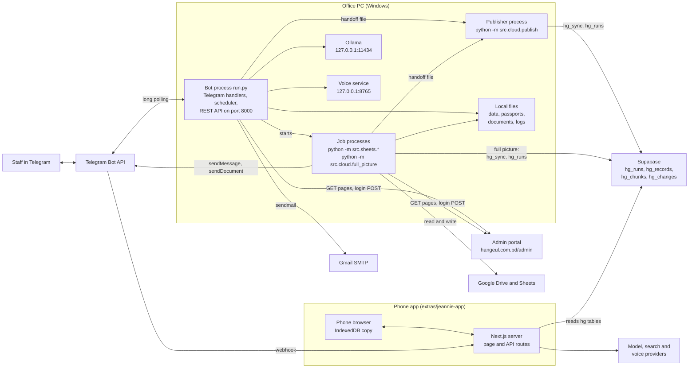

# Site map: every place the system touches

This document lists every place the project reads from or writes to, with the code that does it.
It has three parts:

1. [The portal as the bot sees it](#part-1--the-portal-as-the-bot-sees-it): every portal page the code requests.
2. [The bot's own surfaces](#part-2--the-bots-own-surfaces): Telegram, voice notes, scheduled jobs, REST routes, Google, local files, Supabase.
3. [The phone app](#part-3--the-phone-app-extrasjeannie-app): its pages, API routes, storage and outside services.

Related documents: [DATA_FLOW.md](DATA_FLOW.md) (what moves between these places), [BUILD_AND_RUN.md](BUILD_AND_RUN.md) (settings and launchers), [PYTHON_PROGRAMS.md](PYTHON_PROGRAMS.md) (one entry per Python file), [JEANNIE_APP.md](JEANNIE_APP.md) (the phone app), [PROJECT_STRUCTURE.md](PROJECT_STRUCTURE.md), [CODEBASE_GUIDE.md](CODEBASE_GUIDE.md), the repository [README](../README.md). Older long-form references: [reference/04_PORTAL_INTEGRATION.md](reference/04_PORTAL_INTEGRATION.md), [reference/05_TELEGRAM_COMMANDS_AND_JOBS.md](reference/05_TELEGRAM_COMMANDS_AND_JOBS.md), [reference/13_SUPABASE_PUBLISHING.md](reference/13_SUPABASE_PUBLISHING.md).

## How to read this document

- Code is cited as `path:line`. Paths are relative to the repository root. The bot's code is at the root (`src/...`, `run.py`). The phone app is under `extras/jeannie-app/`. The local voice service is under `extras/jennie_voice/`.
- A bare `:line` continues the file cited immediately before it in the same sentence or table row.
- Settings are named, never shown. A setting is a variable in the bot's `.env` file (read by `src/config.py:141-147`) or in the app's deployment environment.
- No person's name or identifier appears here. Sample values in the code were replaced before publishing; see [SCRUB_NOTES.md](SCRUB_NOTES.md).

Terms used below:

| Term | Meaning | Where defined |
|---|---|---|
| portal | The agency's admin website. Its address is the setting `HANGEUL_BASE_URL`, default `https://hangeul.com.bd/admin`. Every page path below is relative to it. | `src/config.py:24` |
| bot | The Telegram bot process started by `run.py`. It also runs the scheduler and the REST API in the same process. | `run.py:79-97` |
| uid | The portal's numeric student id: the `N` in `student_edit.php?id=N`. | `src/scraper/parsers.py:326` |
| HNG ID | The student ID the portal prints, shaped `HNG-<year>-<number>`. | `src/scraper/parsers.py:330` |
| Direct student | A student whose `Source` column in the CSV export is `direct` (the agency's own student, not a partner's). | `src/sheets/progress_builder.py:256-258` |
| progress sheet | One Google spreadsheet per program and intake, rebuilt from the portal. | `src/sheets/progress_builder.py:462` |
| admin chat | The Telegram chat named by the setting `TELEGRAM_ADMIN_CHAT_ID`. | `src/config.py:46` |
| brief recipients | The chats that get sync summaries and the missing-information report: `TELEGRAM_BRIEF_CHAT_IDS`, or every authorised chat when that is empty. | `src/config.py:128-139` |
| record, kind, key, scope | One row the bot publishes to Supabase. `kind` is its type (26 kinds), `key` identifies it inside the kind, `scope` is the set of rows one complete read covers. | `src/cloud/records.py:41-47` |
| handoff file | A JSON file a job writes for the publisher process, which sends it to Supabase and deletes it. | `src/cloud/handoff.py:70-83` |
| Jennie | The bot's voice persona (voice notes in, voice notes out). | `src/bot/voice.py:1693` |
| Jeannie | The phone app, a Next.js web app that reads what the bot publishes. A different program from Jennie. | `extras/jeannie-app/src/app/page.tsx:40` |

## The whole map

Notes on the diagram:

- The bot never writes to the portal. The only non-GET request is the login form (section 1.8).
- The bot never talks to the phone app. The two meet only in Supabase: the bot writes, the app reads.
- Most jobs reach Supabase through a handoff file and the publisher process. The hourly full picture publishes from its own process, and so does the hand-run backfill, which is not drawn (section 2.8).
- The app's Telegram webhook uses the app's own setting `TELEGRAM_BOT_TOKEN` (`extras/jeannie-app/src/app/api/telegram/webhook/route.ts:12`). The bot uses long polling (`run.py:95`). The code does not say whether the two settings name the same Telegram bot.

---

## Part 1 — The portal as the bot sees it

All portal access goes through one class, `HangeulAdminClient` (`src/scraper/client.py:97`). The bot process uses one shared instance, `admin_client` (`src/scraper/client.py:778`). Each job process imports its own copy of that instance. Four places build an instance of their own instead:

| Where | What it does | Code |
|---|---|---|
| Stage report | a new instance for the student-list read, and another for the `progress.php` reads (the CSV export goes through the shared instance, section 1.6) | `src/sheets/stage_report.py:49`, `:78` |
| Hourly full picture | its own subclass `PortalSession`, which stops trying further pages once the portal did not answer | `src/cloud/full_picture.py:77-92`, `:124` |
| Backfill | a new instance for the whole portal part of the run | `src/cloud/backfill.py:504` |
| Portal sync | replaces the module's shared `admin_client` with a fresh instance before every attempt of every step | `src/sheets/auto_sync.py:89-93`, `:375-381` |

### 1.1 Login and the session

| Step | What happens | Code |
|---|---|---|
| 1 | The client is an `httpx.AsyncClient` with a browser-like `User-Agent`, `follow_redirects=True`, a default timeout of 15 s and `verify=False` (TLS certificates are not checked). Cookies live in memory only. | `src/scraper/client.py:107-118` |
| 2 | `GET login.php` (30 s). The CSRF token is read from `input[name=_csrf]`, else from an input named `csrf_token`, `token`, `_token` or `csrf`, else from `meta[name=csrf-token]`. | `src/scraper/client.py:124-148`, `src/scraper/parsers.py:114-134` |
| 3 | `POST login.php` with three form fields: `_csrf`, `username`, `password`. The username and password come from the settings `HANGEUL_USERNAME` and `HANGEUL_PASSWORD`. | `src/scraper/client.py:176-184` |
| 4 | Success test: the response did not end on `login.php`. A response that ends there is a refused login. | `src/scraper/client.py:93-95`, `:186-188` |
| 5 | Before every read, `portal_get` logs in if there is no session. | `src/scraper/client.py:294-301`, `:325` |
| 6 | Expired session: a read that ended on `login.php` triggers one fresh login and one repeat of the GET. If it ends on `login.php` again, the read fails. | `src/scraper/client.py:328-334` |
| 7 | Any failed read raises `PortalUnavailable`: failed login, HTTP status 400 or above, timeout, refused connection, or a page whose layout is not recognised. Callers show "could not read", never a zero. | `src/scraper/client.py:66-77`, `:303-337` |

The name of the portal's session cookie does not appear in the code.

Timeouts: `portal_get` and `fetch_html` allow 60 s per page by default and at most 10 s to connect (`src/scraper/client.py:48`, `:314-326`). Exceptions are listed per page below.

Some readers do not use `portal_get`. They call the HTTP client (`client.get`) directly, so a status of 400 or above is not turned into `PortalUnavailable`:

| Reader | Timeout | After a redirect to `login.php` | On failure | Code |
|---|---|---|---|---|
| `get_consultation_requests` | 15 s (default) | logs in again by hand, repeats once | returns an empty list | `src/scraper/client.py:269-285` |
| `get_calendar_events` | 15 s (default) | logs in again by hand, repeats once | returns empty lists with an `error` text | `src/scraper/client.py:570-590` |
| `get_student_full_profile` | 15 s (default) | logs in again by hand, repeats once | returns an empty dict | `src/scraper/client.py:592-628` |
| `crawl_page` | 15 s (default) | no retry | returns `{"error": ...}` | `src/scraper/client.py:741-775` |
| CSV export, sheet jobs | 60 s | logs in again by hand, repeats once | `raise_for_status` raises | `src/sheets/progress_builder.py:223-243` |
| CSV export, `/sendmail` lookup | 60 s | logs in again by hand, repeats once | raises when the first row has no `Student ID`; the caller then searches the list pages | `src/bot/telegram_bot.py:1187-1201`, `:1178-1184` |
| `download_docs.php`, local download | 300 s | no retry | raises when the content type is not a ZIP | `src/sheets/verified_docs.py:208-214` |
| `download_docs.php`, Drive mode | 300 s | no retry | the student is counted as failed | `src/sheets/verified_docs.py:178-183` |
| script `get_consultations.py` | 15 s (default) | no retry | on a status other than 200, prints the status and returns an empty result | `get_consultations.py:19-23` |

The backfill's CSV reader does use `portal_get` (`src/cloud/backfill.py:113`), so it gets the fresh login and the HTTP-status check.

Mock mode: when the setting `MOCK_MODE` is true (the code default, `src/config.py:21`), `get_login_page`, `login`, `get_dashboard`, `get_applications`, `get_admitted_students`, `get_inquiries`, `get_calendar_events` and `crawl_page` return fixed sample data (for the calendar, two empty lists) and send nothing (`src/scraper/client.py:127`, `:158`, `:206`, `:221`, `:253`, `:289`, `:572`, `:744`). `read_consultation_view` and `read_consult_performance` refuse to run (`:357`, `:440`). `read_pending_payments` and `read_window_apps_under_review` return `None` (`:556`, `:564`).

Mock mode does not stop every request. The `/start` text calls it "Offline Simulation" (`src/bot/telegram_bot.py:47`), but in mock mode `login` only marks the client as logged in, without a request (`src/scraper/client.py:158-166`). Every reader that has no mock check of its own still sends real GET requests to `HANGEUL_BASE_URL`, without a session cookie:

- everything built on `portal_get` or `fetch_html` (`src/scraper/client.py:294-341`) that has no mock check: `read_students` and every reader on the student list (`/verified*`, `/crosscheck*`, `/passports`, the intake, applied and pending-payment answers; not `/students` or `/admitted`, which use sample data), the free-text dashboard answers and `/alerts` (`src/bot/ask.py:770-772`), `answer_calendar` (`src/bot/ask.py:1403`), the 08:30 issue-date refresh (`src/sheets/passport_issue.py:77`), the stage report's list and `progress.php` reads, and the backfill's reads of the student list, the export, the verified-documents list, `progress.php`, pending payments, window applications, the dashboard and the calendar (`src/cloud/backfill.py:93`, `:113`, `:221`, `:251`, `:270`, `:285`). The consultation and performance readers refuse in mock mode (above).
- `get_consultation_requests` (`src/scraper/client.py:269-285`), which the REST route `GET /api/applications/consultations` calls with no mock check (`src/api/routes/applications.py:21-26`);
- `get_student_full_profile` (`src/scraper/client.py:592-628`) and `audit_student_passport` (`:630-712`);
- the direct readers of the table above: the CSV export and `download_docs.php`.

If the portal answers such a request with its login page, as it does for an expired session (`src/scraper/client.py:93-95`), `portal_get` logs in again (in mock mode, again without a request), repeats the GET once and then raises `PortalUnavailable`. What the direct readers do with a login page is in the table above. How the portal answers a request without a session is decided by the portal, not by this code.

### 1.2 Every page the code requests

"Used by" names Telegram commands (section 2.1), free-text routes (2.2), scheduled jobs (2.4), REST routes (2.5) and root scripts ([programs/api_scripts_launchers.md](programs/api_scripts_launchers.md)).

| Page | Method | Parameters | What is read from it | Function (path:line) | Used by |
|---|---|---|---|---|---|
| `login.php` | GET | none; 30 s | CSRF token and session cookies | `get_login_page` `src/scraper/client.py:124` (GET at `:136`) | every login; REST `GET /api/auth/csrf` |
| `login.php` | POST | form fields `_csrf`, `username`, `password` | the logged-in session | `login` `src/scraper/client.py:150` (POST at `:184`) | every reader below; `/sendmail` lookup calls it directly (`src/bot/telegram_bot.py:1192`); REST `POST /api/auth/login` |
| `index.php` (dashboard) | GET | none; 30 s | the tiles (group, label, value, link) parsed into a fixed set of figures | `get_dashboard` `src/scraper/client.py:202` (GET at `:209`), parser `src/scraper/parsers.py:269` | `/stats`, `/admitted`, daily brief section 3 (`src/bot/brief.py:626`), REST `/api/dashboard/stats` and `/api/dashboard/alerts` |
| `index.php` (dashboard) | GET | none; 30 s | every tile plus five cards: At a glance, Needs attention, Application pipeline, Applications by program, Top universities (`src/bot/ask.py:671`) | `_dashboard` `src/bot/ask.py:770` (GET at `:772`), parser `dashboard_facts` `src/bot/ask.py:683`; `collect_dashboard` `src/cloud/backfill.py:265` | `/alerts`; free-text dashboard topics, "under review" and unrouted questions; full picture; backfill |
| `students.php` (student list, every page) | GET | page 1: none; later pages `pg=2` to `pg=N` | per student: uid, HNG ID, name, university, program, intake, documents status, payment status, stage, applied date, the details block, document file names, paid amount, method, verified income, the "Payment verified by" name and stamp; the pager line | `read_student_pages` `src/scraper/client.py:454`, `read_students` `:501`, parser `src/scraper/parsers.py:413` | `/crosscheck*`, `/passports`, `/admitted`, `/sendmail` fallback, free-text intake and applied, passport watcher (`src/bot/scheduler.py:170`), issue-date refresh (`src/sheets/passport_issue.py:67`), `/stage` report (`src/sheets/stage_report.py:51`), full picture and backfill (`src/cloud/backfill.py:93`), scripts `download_passports.py:20`, `inspect_passports.py:42` |
| `students.php` (first page only) | GET | none | the 50 newest applications | `get_applications` `src/scraper/client.py:214` (`all_pages` false at `:229`) | `/students`; REST `GET /api/applications` without filters. With a `status` or `intake` filter the REST route reads every page and filters in code. |
| `students.php` (every page, read for one day's payment verifications) | GET | as the list; the day is never sent to the portal | students whose own stamp `Payment verified by <name> · <day month>, <time>` is on the day (pattern at `src/scraper/parsers.py:332`) | `read_verified_students` `src/scraper/client.py:522`, `get_verified_students` `:547`, filter `verified_on_day` `src/scraper/parsers.py:862` | `/verified*`, daily brief section 2 (`src/bot/brief.py:621`), script `test_verified.py:25` |
| `students.php` | GET | `status=pending`, then `pg=2` to `pg=N` (every page) | rows whose Payment column says Pending; the portal's own "Pending Payments" badge count | `answer_pending` `src/bot/ask.py:882` (read at `:892`); `collect_pending` `src/cloud/backfill.py:215` | free-text "pending payments"; full picture; backfill |
| `students.php?status=pending` | GET | `status=pending` in the path; first page only | `count`, `listed`, `badge`: the badge when shown, else the rows listed | `read_pending_payments` `src/scraper/client.py:553` (GET at `:558`), parser `src/scraper/parsers.py:890` | daily brief section 3 (`src/bot/brief.py:624`) |
| `students.php` | GET | `source=direct`, `filter_docs=verified`, then `pg=2` to `pg=N` | per row: uid, Full Name, Passport No, Program, and the document file names taken from the row's `view_doc.php?f=` links (the links are read, not fetched) | `fetch_verified_students` `src/sheets/verified_docs.py:71`, parser `_parse_rows` `:44` | portal sync (document download), `verified_docs` command line, backfill (`src/cloud/backfill.py:125`) |
| `students.php` | GET | `prog=<program name>`, then `pg` | the students of one program | `audit_program.py:73` | script `audit_program.py` only |
| `students.php` | GET | `export=csv`; 60 s | a CSV of every student with every column (section 1.6) | `_fetch_all_students_async` `src/sheets/progress_builder.py:223`; `_find_student_in_export` `src/bot/telegram_bot.py:1187`; `collect_export` `src/cloud/backfill.py:107` | progress sheets, portal sync, missing report, stage report, document check; `/sendmail` lookup; backfill |
| `student_edit.php` | GET | `id=<uid>`; 30 s | every filled form field of the student's profile; the page's own `view_doc.php?f=passport_...` link when no scan name was given | `audit_student_passport` `src/scraper/client.py:630` (GET at `:654`), `_profile_fields` `:716` | `/crosscheck*`, `/passports`, passport watcher, script `audit_program.py:151` |
| `student_edit.php` | GET | `id=<uid>`; 15 s | profile fields, used for the e-mail address, name and HNG ID | `get_student_full_profile` `src/scraper/client.py:592` (GET at `:608`) | `/sendmail` fallback lookup (`src/bot/telegram_bot.py:1271`) |
| `student_edit.php` | GET | `id=<uid>`; 60 s | the value of the input named `passport_issue_date` (`src/sheets/passport_issue.py:54`) | `_fetch_async` `src/sheets/passport_issue.py:58` (GET at `:77`) | 08:30 issue-date refresh |
| `view_doc.php` | GET | `f=<file name starting passport_>`; 60 s | the passport scan (image or PDF) | `audit_student_passport` `src/scraper/client.py:688`; script `download_passports.py:32` | `/crosscheck*`, `/passports`, passport watcher, scripts |
| `download_docs.php` | GET | `uid=<uid>`, `zip=1`; 300 s | a ZIP of all the student's documents | `_download_zip` `src/sheets/verified_docs.py:208`; Drive mode `run` `:178` | portal sync (document download), `verified_docs` command line |
| `progress.php` | GET | `uid=<uid>`; 30 s; 4 requests at a time (`src/sheets/stage_report.py:65`) | progress percent, stage, status | `read_progress` `src/sheets/stage_report.py:68` (GET at `:89`), parser `src/scraper/parsers.py:561` | `/stage` intake button; backfill (`src/cloud/backfill.py:135`) |
| `consult_requests.php` | GET | `status=all`, `from=<day>`, `to=<day>` (the same ISO day twice) | that day's status-tab counts and its listed requests | `read_consultation_day` `src/scraper/client.py:382` (parameters at `:399`), parser `consultation_view` `src/scraper/parsers.py:671` | `/inquiries_today`, `/inquiries_date`, `/consultations`, `/inquiries`, daily brief section 1 (`src/bot/brief.py:615`), full picture (yesterday and today), backfill (every day) |
| `consult_requests.php` | GET | `status=all`, `from=<first day>`, `to=<last day>` | the All tab's count for a range, to find the oldest request day | `_range_count` `src/cloud/backfill.py:154` (GET at `:157`) | backfill only |
| `consult_requests.php` | GET | `status=file_opened`, no date | the all-time status-tab counts: All, New, No Answer, Wrong Number, Consulted, File Opened | `read_consultation_totals` `src/scraper/client.py:368` (view constant at `:53`) | the four inquiries commands, daily brief section 1 (`src/bot/brief.py:623`), full picture, backfill |
| `consult_requests.php` | GET | none; 15 s | the whole request table, filtered in code by received date | `get_consultation_requests` `src/scraper/client.py:269` (GET at `:276`); script `get_consultations.py:20` | REST `GET /api/applications/inquiries` and `/api/applications/consultations`; script `get_consultations.py` |
| `consult_performance.php` | GET | `period=today` or `period=month` | tiles, top-performer card, leaderboard rows, sort note, the Score and Points tooltips, the period label | `read_consult_performance` `src/scraper/client.py:425` (GET at `:442`), parser `src/scraper/parsers.py:1088` | `/performance_today`, `/performance_month`, `/performance`, free-text performance, full picture, backfill (`src/cloud/backfill.py:294`) |
| `window_applications.php` | GET | `status=under_review` in the path | table rows (student, window, status); the count of rows whose own status is "under review" | `read_window_apps_under_review` `src/scraper/client.py:561` (GET at `:566`); `collect_window_applications` `src/cloud/backfill.py:245` | free-text "under review" (`src/bot/ask.py:944`), daily brief section 3 (`src/bot/brief.py:625`), full picture, backfill |
| `calendar.php` | GET | none; 15 s | today's reminders and the upcoming timeline | `get_calendar_events` `src/scraper/client.py:570` (GET at `:580`) | bare `/calendar`, `/events`, `/deadlines` (`src/bot/telegram_bot.py:1140`), daily brief section 4 (`src/bot/brief.py:627`) |
| `calendar.php` | GET | none; 60 s | the page's embedded event list, today's reminders and the 45-day timeline, merged | `answer_calendar` `src/bot/ask.py:1395` (GET at `:1403`); `collect_calendar` `src/cloud/backfill.py:280` | `/calendar` with words, free-text calendar questions, full picture, backfill |
| any path the caller names | GET | none; 15 s | every HTML table on the page | `crawl_page` `src/scraper/client.py:741` (GET at `:767`) | REST `POST /api/crawler/parse-page`; script `test_system.py:80`, which asks for `payments.php` (a real request only when `MOCK_MODE` is false) |

`read_consultations` (`src/scraper/client.py:344`) also reads `consult_requests.php` without parameters. Nothing calls it.

`/admitted` is built from two of the rows above: the dashboard's Admitted tile names the stage, then every page of `students.php` is read and filtered in code. The search words never go into a URL (`src/scraper/client.py:236-267`).

### 1.3 Pagination

Only `students.php` is read page by page.

| Rule | Value | Code |
|---|---|---|
| Page parameter | `pg`, sent from page 2 on | `src/scraper/client.py:472` |
| Students per page | 50 | `src/scraper/client.py:44` |
| Page count | read from the page's own line "Page 1 of N · T students" | `src/scraper/parsers.py:325`, `:348` |
| Largest list read | 40 pages; more raises `PortalUnavailable` | `src/scraper/client.py:45`, `:488-490` |
| Full first page without a pager | refused: later pages cannot be found | `src/scraper/client.py:478-481` |
| Wrong page returned | refused | `src/scraper/client.py:484-486` |
| Fewer students than the pager's total | refused | `src/scraper/client.py:496-498` |
| A student shown on two pages | listed once, by uid | `src/scraper/client.py:515-519` |
| Other filters | kept on every page (`status`, `prog`, `source`, `filter_docs`) | `src/scraper/client.py:467` |

`consult_requests.php` is not paged by the bot. The page lists at most the newest 500 requests under its tabs (`src/scraper/client.py:49-52`). The bot avoids that limit by reading one day at a time.

`window_applications.php` is read as one page. The backfill treats a pager on that page as "not a complete read" (`src/cloud/backfill.py:242`, `:258-259`).

### 1.4 Date filters

| What is asked for | How the day is applied | Code |
|---|---|---|
| Consultation requests on a day | The portal filters: `from` and `to` in ISO form. The bot then checks that the page shows the same filter, that every listed row is from that day, and that row counts match the tab counts. | `src/scraper/client.py:397-423` |
| Consultant performance | The portal filters: `period=today` or `period=month`. The page's "Custom range" form is never used. The page must say it shows the period asked for. | `src/scraper/client.py:54-58`, `:437-451` |
| Payment verifications on a day | Filtered in code from each row's stamp. The stamp has no year, so a day a year or more back is refused. | `src/scraper/client.py:522-545`, `src/scraper/parsers.py:814`, `:862` |
| Students who applied on a day or span | Filtered in code from each row's Applied date. | `src/bot/ask.py:1027-1029` |
| Calendar items in a window | Filtered in code from the page's items. | `src/bot/ask.py:1127`, `:1317` |

### 1.5 Document and passport-scan downloads

| Download | Request | Checks | Saved to | Code |
|---|---|---|---|---|
| Passport scan | `view_doc.php?f=<file>` | The file name must match `[A-Za-z0-9._-]+`. Skipped when the same file is already saved (1,000 bytes or more and not HTML). A response that is HTML, or 1,000 bytes or less, is rejected. Written to a `.part` file, then renamed. | `passports/<uid>_<file>` in the bot folder | `src/scraper/client.py:672-705` |
| First image of a PDF scan | none (local) | Extracted once with `pypdf`. | `passports/<uid>_<file base>_extracted.jpg` | `src/scraper/ocr_validator.py:128-150` |
| All documents of a document-verified student | `download_docs.php?uid=<uid>&zip=1` | The response's content type must contain `zip`. Unzipped in memory. PDF, JPG and PNG files over 2 MB are re-encoded to at most 1.95 MB; the original is copied first. A shrunk PNG is saved as a `.jpg` and the `.png` is deleted (`src/sheets/verified_docs.py:320-325`). Other file types are left as they are. | `<DOCS_ROOT>/<PROGRAM>/<FULL NAME> (<PASSPORT NO>)/`; originals under `<DOCS_ORIGINALS_ROOT>/` | `src/sheets/verified_docs.py:208-214`, `:243-245`, `:292-327`, `:379-396` |
| When a student is downloaded again | none | The folder's `.download_complete` file holds the portal's document file names at download time. The names carry the upload time, so a replaced document changes the list and triggers a new download. | `<student folder>/.download_complete` | `src/sheets/verified_docs.py:59-64`, `:239`, `:362-378` |

### 1.6 The CSV export

`students.php?export=csv` returns every student and every column in one request. Three places read it:

| Reader | Timeout | How the answer is checked | Code |
|---|---|---|---|
| Sheet jobs (progress sheets, portal sync, missing report, stage report, document check) | 60 s | HTTP status must be OK; the content type must contain `text/csv` or the first 2,000 characters must contain `Full Name`. Decoded as UTF-8 with a byte-order mark. Read once per process. | `src/sheets/progress_builder.py:223-253` |
| `/sendmail` student lookup | 60 s | The first row must have a `Student ID` column. Columns used: `Student ID`, `Full Name`, `Email`, `DOB`, `Passport No`, `Passport Expiry`. | `src/bot/telegram_bot.py:1187-1226` |
| Backfill | 60 s | Same content test; counted as complete only when the header has `Student ID` and `Full Name` and the rows are at least 90 % of the student list's count. | `src/cloud/backfill.py:107-122`, `src/cloud/records.py:665` |

The progress-sheet layout `COLUMNS` has 36 columns, listed at `src/sheets/progress_builder.py:61-98`. Master's sheets use all 36; the other three programs drop the four university columns and use 32 (`:100`, `:113`, `:119`, `:125`, `:308-312`). 34 of the 36 copy the export column of the same name. Two are built in code (`build_row`, `src/sheets/progress_builder.py:332-339`):

- `IELTS/TOPIK` has no export column of its own. It joins the export's `IELTS/TOEFL` and `Korean Level` values, keeping only real scores (`src/sheets/progress_builder.py:89`, `:191-201`).
- `Passport Issue` takes the export's `Passport Issue Date` column when the export has it, otherwise the issue date stored in `data/passport_issue.json` by the 08:30 refresh, looked up by passport number (`src/sheets/progress_builder.py:92`, `:318-329`).

The full header of the export is decided by the portal and is not in the code.

### 1.7 What the bot never requests

The code names two pages only to say they are not read: `signed_students.php` (`src/sheets/progress_builder.py:224-225`) and the Custom range form of `consult_performance.php` (`src/scraper/client.py:56`).

### 1.8 Does the bot ever write to the portal?

No. The code sends one kind of non-GET request to the portal: the login form.

| Request | Body | Effect on the portal | Code |
|---|---|---|---|
| `POST login.php` | `_csrf`, `username`, `password` | opens a session | `src/scraper/client.py:184` |

Evidence, checked over every tracked Python file:

- The only `.post(` call on the portal's HTTP client is the one above. Every other portal request is a `.get(`.
- Three GET requests are not plain page reads but still change nothing by design: the CSV export, `view_doc.php` and `download_docs.php` (downloads).
- The generic crawler (`crawl_page`, `src/scraper/client.py:741-775`) sends a GET to whatever path the REST caller names. The code does not restrict the path.
- The passport alert tells staff to edit the portal by hand: it carries a link to `student_edit.php?id=<uid>` and the line "Strict Read-Only Alert" (`src/bot/scheduler.py:40`, `:96`).

The other POST, PATCH and upload calls in the code go elsewhere:

| Target | Request | Code |
|---|---|---|
| Ollama on this PC | `POST /api/generate`, `POST /api/chat` | `src/llm/ollama_client.py:139`, `:160`, `:192`, `:205` |
| Voice service on this PC | `POST /stt`, `POST /tts` | `src/bot/voice.py:167`, `:191` |
| Telegram Bot API | `POST sendMessage`, `POST sendDocument` (the sheet jobs call the HTTP API directly) | `src/sheets/auto_sync.py:353`, `src/sheets/missing_report.py:259`, `:270` |
| Supabase | `POST /rest/v1/hg_runs`, `PATCH /rest/v1/hg_runs`, `POST /rest/v1/rpc/hg_sync` | `src/cloud/publish.py:409`, `:442`, `:780` |
| Google Drive and Sheets | create, update, clear and upload calls through the Google client library | `src/sheets/progress_builder.py:415`, `:492`, `:496`, `:506`, `:514`, `:522`; `src/sheets/verified_docs.py:114`, `:137`, `:172`, `:193` |
| Gmail | SMTP over SSL (not HTTP) | `src/bot/telegram_bot.py:1166-1168` |

One script outside the bot makes the same login POST with its own HTTP client: the trial script `extras/trials/brain-trial/brief_crosscheck.py:55`. All its other portal requests are GETs (`extras/trials/brain-trial/brief_crosscheck.py:62-67`).

---

## Part 2 — The bot's own surfaces

### 2.1 Telegram commands

#### Who may use the bot

| Rule | Detail | Code |
|---|---|---|
| Identity checked | The chat ID of the update, compared as text. | `src/bot/telegram_bot.py:22-37` |
| Allowed set | `TELEGRAM_ADMIN_CHAT_ID` plus every ID in `TELEGRAM_AUTHORIZED_CHAT_IDS` (separated by commas, semicolons or spaces). | `src/config.py:114-126` |
| Nothing configured | Everyone is refused and a warning is logged. | `src/bot/telegram_bot.py:30-35` |
| Refused, with a reply | These commands answer "Unauthorized access" and show the caller's chat ID: `/start`, `/report`, `/brief`, `/performance_today`, `/performance_month`, `/performance`, `/verified`, `/passports`, `/calendar`, `/sendmail`, `/crosscheck_range`, `/crosscheck`. | `src/bot/telegram_bot.py:43-45`, `:125-128`, `:166-168`, `:745-748`, `:755-758`, `:767-770`, `:867-870`, `:979-982`, `:1106-1108`, `:1475-1477`, `:1861-1863`, `:1936-1938` |
| Refused, silently | Every other command, typed text and voice notes return without a reply. | `src/bot/telegram_bot.py:235`, `:1989`; `src/bot/voice.py:1726-1729` |
| Refused button tap | The tap is answered with the alert "Not authorized". | `src/bot/telegram_bot.py:2198-2200`, `:2264-2266`, `:2297-2299` |

The check is on the chat, not the person. If a group chat's ID is listed, every member of the group can use the bot. The code does not say whether groups are used.

#### Commands

42 command names are registered, on 27 handler functions (`src/bot/telegram_bot.py:2377-2423`). "Asks for a date" means: with no argument the bot replies with a question and treats the next typed message as the date (`src/bot/telegram_bot.py:2004-2016`).

| Command | Aliases | Handler | What it reads | What it replies |
|---|---|---|---|---|
| `/start` | `/help` | `start_command` `src/bot/telegram_bot.py:39` | settings `MOCK_MODE`, `OLLAMA_MODEL`, `HANGEUL_BASE_URL`; Ollama `GET /api/tags` (`src/llm/ollama_client.py:106`) | Welcome text: mode, model state, portal address, 12 menu commands, 4 example questions |
| `/inquiries_today` | none | `inquiries_today_command` `src/bot/telegram_bot.py:607` | `consult_requests.php` filtered to today, then the all-time tab counts (`:555`, `:562`) | Consultancy inquiries report for today |
| `/inquiries_date [date]` | `/consultations` (`src/bot/telegram_bot.py:780`), `/inquiries` (`:784`) | `inquiries_date_command` `src/bot/telegram_bot.py:614` | the same two reads for the given day; asks for a date | The report for that day, a date error, or "a date in the future" (`:552-553`) |
| `/verified_today` | none | `verified_today_command` `src/bot/telegram_bot.py:650` | every page of `students.php`; today's stamps | Verified-students report: count, amounts, one line per student |
| `/verified_date [date]` | none | `verified_date_command` `src/bot/telegram_bot.py:657` | the same for the given day; asks for a date | the same |
| `/verified [date]` | `/verified_students` | `verified_command` `src/bot/telegram_bot.py:858` (read at `:905`) | the same; the date comes from the arguments or the message text | the same |
| `/crosscheck_today` | none | `crosscheck_today_command` `src/bot/telegram_bot.py:682` | every page of `students.php`; for each student verified today: `student_edit.php` and the passport scan, checked by OCR | Cross-check report, one card per student |
| `/crosscheck_date [date]` | none | `crosscheck_date_command` `src/bot/telegram_bot.py:690` | the same for the given day; accepts a date only; asks for a date | the same |
| `/crosscheck_range [start to end]` | `/crosscheck_between`, `/crosscheck_period` | `crosscheck_range_command` `src/bot/telegram_bot.py:1854` | the same for every student verified in the range; at most 92 days (`:1897-1904`); asks for two dates | the same, sorted by day and time |
| `/crosscheck [date, uid, HNG ID or name]` | `/audit` | `crosscheck_command` `src/bot/telegram_bot.py:1924` (report built at `:1745`) | every page of `students.php`; students picked by day, uid, HNG ID or a name part of 3 letters or more; a name search checks at most 10 students (`:1506`) | Cross-check report |
| `/passports` | `/passport_audit` | `passports_command` `src/bot/telegram_bot.py:969` | every page of `students.php`; OCR check of the first 5 students verified today (`:915`) | Counts of students with and without a passport scan, by Passport Status; today's verdicts |
| `/sendmail [student]` | `/email`, `/mail` | `sendmail_command` `src/bot/telegram_bot.py:1472`, flow `:1354` | student lookup: the CSV export (`:1187-1226`); when the export cannot be read or has no match, every list page (`:1229-1286`), where the matched row's missing e-mail, name or HNG ID is filled in from that student's `student_edit.php` (`:1269-1284`); then the typed subject and brief; a draft from the local model (`:1312`) | Step prompts, the draft, then "Email sent", "Could not send" or cancelled. The mail goes out only after the user confirms by typing one of: send, yes, confirm, ok, okay, send it (`:1443-1446`). |
| `/missing` | none | `missing_command` `src/bot/telegram_bot.py:2180` | nothing until a button is tapped | 4 buttons: KLP, EAP, Bachelor's, Master's (`:2172-2177`) |
| `/stage` | `/stages` | `stage_command` `src/bot/telegram_bot.py:2249` | nothing until a button is tapped | the same 4 program buttons |
| `/performance_today` | `/perf_today` | `performance_today_command` `src/bot/telegram_bot.py:742` | `consult_performance.php?period=today` (`src/bot/performance.py:295`) | Tiles, top performer, leaderboard |
| `/performance_month` | `/perf_month` | `performance_month_command` `src/bot/telegram_bot.py:752` | `consult_performance.php?period=month` | the same for this month |
| `/performance [words]` | none | `performance_command` `src/bot/telegram_bot.py:762` | the words decide: today, this month, or neither (`src/bot/ask.py:395`) | The report, or a note that only today and this month are covered (`src/bot/ask.py:508`) |
| `/pin` | `/commands` | `pin_command` `src/bot/telegram_bot.py:320` | nothing | The command cheat-sheet, pinned to the chat; or a note that the bot lacks the pin permission |
| `/admitted [search words]` | none | `admitted_command` `src/bot/telegram_bot.py:346` | `index.php` (the Admitted tile) and every page of `students.php` | Admitted count, the tile's figure, a roster of up to 12 (`:375`) |
| `/report [date]` | none | `report_command` `src/bot/telegram_bot.py:122` | the daily brief's reads for that day (`src/bot/brief.py:615-628`) | The daily brief for that date |
| `/brief` | `/dailybrief` | `brief_command` `src/bot/telegram_bot.py:163` | the daily brief's reads for today | Today's daily brief |
| `/stats` | none | `stats_command` `src/bot/telegram_bot.py:233` | `index.php` tiles | The tiles, grouped as the portal groups them |
| `/students` | none | `students_command` `src/bot/telegram_bot.py:247` | the first page of `students.php` | Up to 8 recent applications (`:268`) |
| `/calendar [words]` | `/events`, `/deadlines` | `calendar_command` `src/bot/telegram_bot.py:1095` | `calendar.php` | Bare: today's reminders and up to 20 timeline rows (`:1011`). With words: the items that match the dates and words, up to 25 (`src/bot/ask.py:42`). |
| `/alerts` | none | `alerts_command` `src/bot/telegram_bot.py:788` | `index.php`, the "Needs attention" card | That card's lines |

Reply limits: every long reply is split into pieces of at most 3,900 characters (`src/bot/replies.py:33`, `:55`).

#### The 13-entry menu

The menu Telegram shows under "/" is set at start-up with `set_my_commands` (`src/bot/telegram_bot.py:2316-2332`). Entries in order:

| # | Command | Description shown (code line) |
|---|---|---|
| 1 | `inquiries_today` | "Total consultancy inquiries & how many done today" (`src/bot/telegram_bot.py:2317`) |
| 2 | `inquiries_date` | "Total inquiries & how many done (ask specific date)" (`src/bot/telegram_bot.py:2318`) |
| 3 | `verified_today` | "Total verified students today" (`src/bot/telegram_bot.py:2319`) |
| 4 | `verified_date` | "Total verified students (ask specific date each time)" (`src/bot/telegram_bot.py:2320`) |
| 5 | `crosscheck_today` | "Total crosscheck verified students live today" (`src/bot/telegram_bot.py:2321`) |
| 6 | `crosscheck_date` | "Total crosscheck verified live (ask specific date each time)" (`src/bot/telegram_bot.py:2322`) |
| 7 | `crosscheck_range` | "Total crosscheck verified live (ask start date → end date)" (`src/bot/telegram_bot.py:2323`) |
| 8 | `sendmail` | "Email a student (ask ID → subject → brief; AI writes it; you approve)" (`src/bot/telegram_bot.py:2324`) |
| 9 | `brief` | "Run today's full 6:05 PM operational brief now" (`src/bot/telegram_bot.py:2325`) |
| 10 | `missing` | "Progress sheet missing information (KLP / EAP / Bachelor's / Master's)" (`src/bot/telegram_bot.py:2326`) |
| 11 | `stage` | "Student stages — choose program → intake" (`src/bot/telegram_bot.py:2327`) |
| 12 | `performance_today` | "Today: the portal's Consultant Performance page: tiles, top performer, leaderboard" (`src/bot/telegram_bot.py:2328`) |
| 13 | `performance_month` | "This month: the portal's Consultant Performance page: tiles, top performer, leaderboard" (`src/bot/telegram_bot.py:2329`) |

The `/start` text and the pinned cheat-sheet list 12 commands: the menu without `brief` (`src/bot/telegram_bot.py:57-68`, `:285-313`).

#### Callback buttons

Each button runs a report module as a separate process with a 180 s limit and replies with what the process printed (`src/bot/telegram_bot.py:2215-2240`).

| Button data | Handler | What it runs | What it reads | Reply |
|---|---|---|---|---|
| `missing:<KEY>` where KEY is `KLP`, `EAP`, `BACHELOR` or `MASTER` | `missing_button` `src/bot/telegram_bot.py:2192` (pattern `^missing:` at `:2385`) | `python -m src.sheets.missing_report --program <KEY>` | the first tab of every progress sheet (`src/sheets/missing_report.py:109`) and the CSV export (`:65`) | the program's missing-information list as plain text |
| `stage:<KEY>` | `stage_program_button` `src/bot/telegram_bot.py:2260` (pattern `^stage:` at `:2388`) | `python -m src.sheets.stage_report --program <KEY>` | the CSV export (`src/sheets/stage_report.py:144`) | one button per intake with its student count; a blank intake is shown as "No intake set" |
| `stagei:<KEY>` + a vertical bar + `<INTAKE>` | `stage_intake_button` `src/bot/telegram_bot.py:2294` (pattern `^stagei:` at `:2389`) | `python -m src.sheets.stage_report --program <KEY> --intake <INTAKE>` | the CSV export, every page of `students.php`, one `progress.php` page per student (`src/sheets/stage_report.py:178-200`) | the students of that intake grouped by stage, as plain text |

#### Message handlers

| Filter | Handler | Notes |
|---|---|---|
| text that is not a command | `handle_natural_language_message` `src/bot/telegram_bot.py:1973` (registered at `:2426`) | section 2.2 |
| a voice note or an audio file | `handle_voice_message` `src/bot/voice.py:1693` (registered at `src/bot/telegram_bot.py:2432` with `block=False`) | registered only when `JENNIE_VOICE_ENABLED` is true; section 2.3 |

### 2.2 Free-text routes

Every typed message that is not a command goes to `handle_natural_language_message`. Three checks run before the words are read:

| Order | Check | Result | Code |
|---|---|---|---|
| 1 | Chat not authorised | no reply | `src/bot/telegram_bot.py:1989-1990` |
| 2 | A `/sendmail` conversation is open in this chat | the text is the next answer in that conversation | `src/bot/telegram_bot.py:1997-1999` |
| 3 | A date question is open (kinds `inquiries`, `verified`, `crosscheck`, `crosscheck_range`) | the text is read as the date | `src/bot/telegram_bot.py:2004-2016` |

Then `ask.classify` (`src/bot/ask.py:529`) picks one route. It matches whole words, without regard to case, and reads real dates. Routes are tried in the order below; the first match wins. Nothing in `classify` reads the portal.

| # | Route | Trigger words | Handler | Answers from |
|---|---|---|---|---|
| 1 | hello | The whole message is a greeting or thanks: hi, hello, hey, hiya, salam, good morning, afternoon, evening or night, thanks, thank you, thx, ok, okay, cool, great, nice, bye (`src/bot/ask.py:52-54`) | fixed text `ask.HELLO` (`src/bot/telegram_bot.py:2028`) | nothing read |
| 2 | report (early) | text that starts with `/report` or `/brief` (`src/bot/ask.py:565`) | `report_command` (`src/bot/telegram_bot.py:2155`) | the daily brief for the day named |
| 3 | pin | pp pin, pin, pinned, pin it, cheat sheet, command list, list of commands, all commands, commands, menu (`src/bot/ask.py:55-56`) | `pin_command` (`src/bot/telegram_bot.py:2031`) | nothing read |
| 4 | performance | performance and six misspellings of it (performence, perfomance, perfomence, performace, perfromance, preformance), each also in the plural, productivity, leaderboard, performer; "how did the team do" and similar; "team activity", "staff stats" and similar (`src/bot/ask.py:103-109`). Not taken when the words also name another subject, such as pending payments, an intake, a stage or passports (`src/bot/ask.py:490-505`). | today or this month: the performance commands; anything else: a note (`src/bot/telegram_bot.py:2036-2043`) | `consult_performance.php` |
| 5 | crosscheck | cross-check, crosscheck, audit; or father, mother, address, parents, dob, date of birth; or "check" together with a verify word (`src/bot/ask.py:579`) | a range, today, a day, or a student (`src/bot/telegram_bot.py:2073-2103`) | the cross-check commands |
| 6 | passports | passport, passports, mrz (`src/bot/ask.py:63`, `:584`) | today or the day named (`src/bot/telegram_bot.py:2106-2115`); a span of days becomes a range cross-check (`:2049-2052`) | the cross-check commands |
| 7 | pending | unpaid, not paid, not yet paid, payment approval; or a pay word with pending, waiting, awaiting, outstanding, due, unconfirmed or approval (`src/bot/ask.py:65-67`, `:587`) | `answer_pending` (`src/bot/ask.py:882`) | every page of `students.php?status=pending` and the portal's badge; lists up to 30 names (`src/bot/ask.py:41`) |
| 8 | dashboard: a named stage | a stage name such as University Applied, VIN Application, Embassy Submission, Visa Result (`src/bot/ask.py:171-177`, `:197`, `:589-591`) | `_dashboard_answer`, topic `pipeline` (`src/bot/ask.py:837`) | `index.php`, Application pipeline card |
| 9 | dashboard: documents | a document word (doc, document, paper, file, upload) with a state word (review, verified, waiting, pending, approved, rejected, check, unverified, queue), and no "missing" or "incomplete" (`src/bot/ask.py:68-71`, `:592`) | topic `documents` (`src/bot/ask.py:827`) | `index.php`: Rejected documents, Docs approved and Total docs, or Docs to review |
| 10 | inquiries | consult, consultation, consultancy, inquiry, enquiry, lead, counsellor, consultant (`src/bot/ask.py:58-59`, `:594`) | the inquiries commands (`src/bot/telegram_bot.py:2059-2070`) | `consult_requests.php` for one day |
| 11 | dashboard: verified in total | a verify word with "in total", overall, altogether, all time, so far, ever, in all, on record, and no date (`src/bot/ask.py:597-600`) | topic `verified_total` (`src/bot/ask.py:800`) | `index.php`, the Verified tile |
| 12 | verified | any other verify word (`src/bot/ask.py:601-602`) | the verified commands (`src/bot/telegram_bot.py:2119-2130`) | `students.php`, every page |
| 13 | missing | missing, incomplete (`src/bot/ask.py:74`, `:603`) | `missing_command` (`src/bot/telegram_bot.py:2145`) | the program buttons |
| 14 | dashboard: pipeline | pipeline, funnel (`src/bot/ask.py:76`, `:605`) | topic `pipeline` | `index.php`, Application pipeline card |
| 15 | admitted | admit, admitted, admits (`src/bot/ask.py:77`, `:607`) | `admitted_command`; the words left after removing question words are the search (`src/bot/telegram_bot.py:2134-2143`) | `index.php` and `students.php` |
| 16 | stage | stage, stages (`src/bot/ask.py:75`, `:609`) | `stage_command` (`src/bot/telegram_bot.py:2148`) | the program buttons |
| 17 | dashboard: visa | visa, visas (`src/bot/ask.py:82`, `:611`) | topic `visa` (`src/bot/ask.py:846`) | says the portal has no approved-visa count; shows four pipeline stages and the Accepted tile |
| 18 | window_review | under review, in review, being reviewed, reviewing, window application (`src/bot/ask.py:71-73`, `:613`) | `answer_window_review` (`src/bot/ask.py:937`) | `window_applications.php?status=under_review` and the dashboard's Under review tile |
| 19 | dashboard: accepted, submitted | "accepted" or "submitted" with an application word (`src/bot/ask.py:615-617`) | topics `accepted`, `submitted` (`src/bot/ask.py:857`) | `index.php` tiles |
| 20 | dashboard: windows | open, active or draft window (`src/bot/ask.py:81`, `:618`) | topic `windows` (`src/bot/ask.py:857`) | `index.php` tiles Open windows, Draft windows |
| 21 | calendar | calendar, event, deadline, due, dhl, shipping, shipment, ship, courier, reminder, schedule, closing, closes, opening, application window or period, open for applications, accepting applications (`src/bot/ask.py:78-80`, `:620`) | `calendar_command` with the words (`src/bot/telegram_bot.py:2151-2154`) | `calendar.php` |
| 22 | intake | a month name followed by a year 20xx with no day number before it; or intake, batch (`src/bot/ask.py:83-86`, `:624-631`) | `answer_intake` (`src/bot/ask.py:975`) | every page of `students.php`, counted by intake |
| 23 | applied | registered, registration, signed up, joined, enrolled, new students, new applicants, new applications, applied, applications received (`src/bot/ask.py:91-92`, `:632-638`) | with "this week" or "this month", or no date: dashboard topic `applied` (`src/bot/ask.py:820`); with a day or span: `answer_applied` (`src/bot/ask.py:1009`); an unreadable date: a date error (`src/bot/telegram_bot.py:2166-2169`) | `index.php` At a glance, or every page of `students.php` |
| 24 | dashboard: program | a program word (program, course, klp, eap, bachelor, master, degree, phd) with a students word; or "per program", "by program" (`src/bot/ask.py:87-88`, `:639`) | topic `program` (`src/bot/ask.py:804`) | `index.php`, Applications by program card |
| 25 | dashboard: university | university, uni, college with most, top, biggest and similar, or with a students word (`src/bot/ask.py:89`, `:641`) | topic `university` (`src/bot/ask.py:813`) | `index.php`, Top universities card |
| 26 | dashboard: attention | urgent, alert, attention, to-do, action item, needs attention (`src/bot/ask.py:93`, `:644`) | topic `attention` (`src/bot/ask.py:844`) | `index.php`, Needs attention card |
| 27 | dashboard: total students | a students word and nothing else but filler words (`src/bot/ask.py:90`, `:646`) | topic `total_students` (`src/bot/ask.py:794`) | `index.php`, Total students tile and the by-program card |
| 28 | report | report, brief, briefing, summary, summarise, overview, recap, round-up (`src/bot/ask.py:57`, `:648`) | `report_command` (`src/bot/telegram_bot.py:2155-2158`) | the daily brief for the day named |
| 29 | stats | stats, statistics, dashboard, figures, kpi, metrics, numbers (`src/bot/ask.py:94`, `:650`) | `stats_command` (`src/bot/telegram_bot.py:2159`) | `index.php` tiles |
| 30 | unknown | nothing above matched (`src/bot/ask.py:652`) | `answer_unknown` (`src/bot/ask.py:1038`) | `index.php` facts whose whole label the question names; else the facts the local model picks by line number, shown word for word; else a fixed "I can't answer that from the portal yet" with the command list (`src/bot/ask.py:736-757`) |

Two extra rules:

- Consultations, verified payments and passports are answered one day at a time. A question about a span of days gets a request for one day; for passports, a span that has started runs the range cross-check (`src/bot/ask.py:380`, `src/bot/telegram_bot.py:2047-2055`).
- In route 30 the local model does not write a figure. `answer_unknown` asks `answer_agent_query`, which only returns the numbers of the fact lines to show; the bot then shows those lines word for word (`src/bot/ask.py:1038`, `src/llm/ollama_client.py:214-220`). Elsewhere the model does write text that can hold figures: the daily brief's short summary (at most two sentences), dropped unless every claim in it matches a fact (`src/bot/brief.py:519-538`, `:541`, `:648-650`); Jennie's spoken sentence (`src/bot/voice.py:1240`, `:1844`; section 2.3); and the `/sendmail` draft (`src/bot/telegram_bot.py:1312`).

### 2.3 Voice notes

Voice works only when `JENNIE_VOICE_ENABLED` is true and the local voice service is running (section 2.5).

| Step | What happens | Code |
|---|---|---|
| 1 | Authorisation check. An unauthorised chat gets no reply. | `src/bot/voice.py:1726-1729` |
| 2 | Size check: at most 60 seconds and 20 MiB. Otherwise a text note asks for a shorter recording. | `src/bot/voice.py:73-74`, `:1734-1738` |
| 3 | A pre-rendered filler clip is sent at once as a voice note, unless a `/sendmail` conversation is open. | `src/bot/voice.py:1742-1743`, `:310-321` |
| 4 | The audio is downloaded from Telegram into memory. | `src/bot/voice.py:1747-1749` |
| 5 | `POST /stt` to the voice service (60 s limit). The answer has the text and the language. | `src/bot/voice.py:53`, `:163-183` |
| 6 | The bot replies with the text it heard: "🎧 heard: ...". | `src/bot/voice.py:1781` |
| 7 | If a `/sendmail` conversation is open, the note stops here. E-mail answers must be typed. | `src/bot/voice.py:1784-1800` |
| 8 | One call to the local model picks one of 10 commands and a date: `verified_today`, `verified_date`, `inquiries_today`, `inquiries_date`, `calendar`, `passports`, `stats`, `missing_report`, `crosscheck`, `chat`. The model sees the chat's last 3 voice turns. | `src/bot/voice.py:380-381`, `:534`, `:79-80` |
| 9 | The chosen command runs exactly as when typed. Its written answer goes to the chat and is also captured. | `src/bot/voice.py:644-770`, `:1804-1814` |
| 10 | If no command was chosen, the words go to the typed-question routing of section 2.2. | `src/bot/voice.py:1816-1821` |
| 11 | One short sentence is built from the captured answer: at most 32 characters in Korean, 120 in English. | `src/bot/voice.py:65`, `:1240`, `:1844` |
| 12 | `POST /tts` to the voice service (120 s limit). The result is sent as a voice note named `jennie.ogg`. If speech fails, a text note says the answer is in the text above. | `src/bot/voice.py:54`, `:186-199`, `:1851-1860` |
| 13 | The turn is kept in memory only: 6 turns per chat. | `src/bot/voice.py:79`, `:342`, `:1847` |

Where each spoken command goes:

| Spoken command | Runs | Code |
|---|---|---|
| `verified_today`, `verified_date`, `inquiries_today`, `inquiries_date` | the matching today or date command | `src/bot/voice.py:693-705` |
| `crosscheck` | range, today, date, or one student by a 2 to 5 digit number | `src/bot/voice.py:707-730` |
| `passports` | the cross-check for today or the day named | `src/bot/voice.py:732-742` |
| `calendar` | `calendar_command` with the English words | `src/bot/voice.py:744-754` |
| `stats` | the typed route for a specific figure, else `stats_command` | `src/bot/voice.py:756-765` |
| `missing_report` | `missing_command` | `src/bot/voice.py:767-769` |
| `chat` | small talk from the local model, no data read | `src/bot/voice.py:690-691`, `:1845-1846` |

The voice service address must be this PC: a `JENNIE_VOICE_URL` whose host is not `127.0.0.1`, `localhost` or `::1` is refused (`src/bot/voice.py:86`, `:125-131`).

### 2.4 Scheduled jobs

#### Jobs inside the bot process

All seven are registered in `setup_scheduler` (`src/bot/scheduler.py:419`). None is registered when `ENABLE_SCHEDULED_REPORTS` is false (`:421-423`). Clock times use `REPORT_TIMEZONE`, default `Asia/Dhaka` (`:433`, `src/config.py:58`). Every job has `max_instances=1` and `coalesce=True`.

| Job id | Exact trigger | Function | What it does | Sends to |
|---|---|---|---|---|
| `daily_executive_briefing` | `CronTrigger(hour, minute)` from `DAILY_REPORT_TIME`, default 18:05; `misfire_grace_time=600` (`src/bot/scheduler.py:427-444`) | `send_daily_briefing` `src/bot/scheduler.py:248` | Builds the daily brief and sends it. If `JENNIE_VOICE_ENABLED` and `JENNIE_SPOKEN_BRIEF` are both true, also sends a spoken summary as the voice note `jennie-brief.ogg` (`src/bot/voice.py:1863-1872`). Then hands the brief to the Supabase publisher. | admin chat; skipped when `TELEGRAM_ADMIN_CHAT_ID` is empty (`:251-254`) |
| `passport_upload_watcher` | `IntervalTrigger(minutes=30)` (`src/bot/scheduler.py:448-456`) | `check_new_passport_uploads` `src/bot/scheduler.py:158` | Reads every page of `students.php`. Checks by OCR each student's newest passport scan that it has not checked before, newest upload first. Stops starting new checks after 20 minutes (`:35`). Saves its memory after every check. Sends grouped alerts for scans that are invalid with discrepancies. | admin chat; the job does nothing when `TELEGRAM_ADMIN_CHAT_ID` is empty (`:164-166`) |
| `portal_sync` | `IntervalTrigger(minutes=15)` (`src/bot/scheduler.py:459-466`) | `run_portal_sync` `src/bot/scheduler.py:344` | Runs `python -m src.sheets.auto_sync`: rebuilds changed progress sheets, downloads newly verified students' documents, checks up to 6 students' documents (`src/verify/auto_verify.py:59`), sends up to two summaries: "Portal sync — changes found" and "Document check" (`src/sheets/auto_sync.py:331-332`), each only when it has lines to report. | brief recipients (`src/sheets/auto_sync.py:342`) |
| `missing_info_report` | `CronTrigger(hour=9, minute=5)`; `misfire_grace_time=3600` (`src/bot/scheduler.py:469-477`) | `run_missing_report` `src/bot/scheduler.py:357` | Runs `python -m src.sheets.missing_report`: reads every progress sheet, sends the report text and an Excel file. | brief recipients (`src/sheets/missing_report.py:247`) |
| `passport_issue_refresh` | `CronTrigger(hour=8, minute=30)`; `misfire_grace_time=3600` (`src/bot/scheduler.py:480-488`) | `run_issue_date_refresh` `src/bot/scheduler.py:350` | Runs `python -m src.sheets.passport_issue --refresh`: reads every student's edit page and writes `data/passport_issue.json`. | nobody |
| `brain_keep_warm` | `IntervalTrigger(minutes=10)` (`src/bot/scheduler.py:491-498`) | `keep_brain_warm` `src/bot/scheduler.py:317` | Only when the model is pinned (`JENNIE_VOICE_ENABLED` or `BRAIN_ALWAYS_LOADED`, `src/llm/ollama_client.py:37-39`): reloads the Ollama model if it is missing or only partly on the GPU. | nobody |
| `cloud_full_picture` | `IntervalTrigger(minutes=60, start_date=now + 7.5 minutes)` (`src/bot/scheduler.py:365-366`, `:501-509`) | `run_full_picture` `src/bot/scheduler.py:369` | Runs `python -m src.cloud.full_picture`: reads eight groups of portal pages and publishes them to Supabase. Skipped when publishing is off, in mock mode, in or within 5 minutes of a quiet window, while a portal sync runs, or while another publisher holds the lock (`src/cloud/full_picture.py:60`, `:66-74`, `:134-147`; `src/cloud/backfill.py:66-83`). | nobody |

Details that apply to several jobs:

- The four `python -m ...` jobs run as separate processes with a one-hour limit. Their output is appended to `hangeul_sync.log` (`src/bot/scheduler.py:392-416`).
- Quiet windows of the full picture and the backfill: 18:00-18:10, 08:25-08:40, 09:00-09:10 (`src/cloud/backfill.py:57`).
- The three interval jobs without a `start_date` (watcher, sync, keep-warm) do not state their first run time in the code. It is the scheduler library's default.

#### Once at bot start

| Action | Condition | Code |
|---|---|---|
| Set the 13-entry command menu | always | `src/bot/telegram_bot.py:2331-2335` |
| Send the cheat-sheet to the admin chat and pin it, without notification | `TELEGRAM_ADMIN_CHAT_ID` is set | `src/bot/telegram_bot.py:2338-2353` |
| Load the model into the GPU (up to 3 tries, 30 s apart, until it is wholly on the GPU) | the model is pinned: `JENNIE_VOICE_ENABLED` or `BRAIN_ALWAYS_LOADED` is true (`src/llm/ollama_client.py:37-39`) | `src/bot/telegram_bot.py:2359-2362`, `src/bot/scheduler.py:280-306` |
| Render any missing filler clips, after the model load | the model is pinned and `JENNIE_VOICE_ENABLED` is true; `BRAIN_ALWAYS_LOADED` alone loads the model but renders no clips | `src/bot/scheduler.py:308-313` |
| Unload the model | the model is not pinned | `src/bot/telegram_bot.py:2363-2365` |
| Probe Telegram's address and, if needed, override name resolution for `api.telegram.org` | unless the environment variable `TELEGRAM_DNS_FIX` is `0`, `false`, `no` or `off`, and only when `TELEGRAM_API_IP` is not set (next row) | `run.py:71`, `src/net_fix.py:72-100` |
| Use a fixed address for `api.telegram.org`, without probing | the environment variable `TELEGRAM_API_IP` is set (and `TELEGRAM_DNS_FIX` does not turn the fix off) | `src/net_fix.py:81-86` |

`TELEGRAM_DNS_FIX` and `TELEGRAM_API_IP` are read from the process environment (`os.environ`, `src/net_fix.py:77`, `:81`), not from `.env`: the bot reads `.env` only into its settings object (`src/config.py:141-147`).

`post_init` is called in `run.py:94` and is also registered on the application builder (`src/bot/telegram_bot.py:2374`). Whether the library calls it a second time on this start-up path cannot be determined from the code.

#### Windows start-up shortcut and watchdog task

| Item | Created by | Trigger | What it runs |
|---|---|---|---|
| Start-up shortcut `HangeulBot.lnk` in the user's Startup folder | `install_autostart.bat:8` | the Windows user signs in | `wscript.exe "<bot folder>\start_background.vbs"`, which runs `.venv\Scripts\pythonw.exe run.py` hidden (`start_background.vbs:13`) |
| Scheduled task `HangeulBotWatchdog` | `install_watchdog.bat:14` | `schtasks /SC MINUTE /MO 5 /RL LIMITED`: every 5 minutes | `watchdog.ps1`: if no `run.py` process of this folder's venv is running, it starts `start_background.vbs` (`watchdog.ps1:13-31`); one line per run goes to `hangeul_watchdog.log` |
| Start-up shortcut `JennieVoice.lnk` (voice service) | `extras/jennie_voice/install_jennie_voice.bat:15` | the Windows user signs in | `wscript.exe "...\start_jennie_voice.vbs"` |
| Scheduled task `JennieVoiceWatchdog` (voice service) | `extras/jennie_voice/install_jennie_voice.bat:21` | every 5 minutes | `watchdog_jennie_voice.ps1`: restarts the service when `GET /health` fails twice, 20 seconds apart (`extras/jennie_voice/watchdog_jennie_voice.ps1:2`, `:43`) |

Whether these four are installed on the live PC is machine state. It cannot be determined from the code.

### 2.5 REST API routes

#### The bot's REST API (`src/api`)

`run.py` serves the FastAPI app `src.api.main:app` with uvicorn in the same process and event loop as the bot (`run.py:79-97`). It binds to `API_HOST`:`API_PORT`, defaults `0.0.0.0` and `8000` (`src/config.py:79-80`). The code has no authentication on any route, and CORS allows every origin (`src/api/main.py:33-39`). No program in the repository calls these routes except the smoke test `test_system.py`, which calls six of them in-process, without a network port: `GET /`, `GET /healthz`, `GET /api/dashboard/stats`, `GET /api/applications`, `GET /api/applications/inquiries` and `GET /api/auth/status` (`test_system.py:102-138`).

| Method and path | Handler | Portal request it causes | What it returns |
|---|---|---|---|
| `GET /` | `root` `src/api/main.py:48` | none | name, `docs_url`, `mock_mode`, `target_url`, a list of nine route paths |
| `GET /healthz` | `health_check` `src/api/main.py:68` | none | `{"status": "ok", "mock_mode": ...}` |
| `GET /api/auth/csrf` | `get_csrf` `src/api/routes/auth.py:8` | `GET login.php` | `status_code`, `current_url`, `csrf_token`, `cookies` (the shared client's cookie jar, `src/scraper/client.py:142`), `mock` |
| `POST /api/auth/login` | `login` `src/api/routes/auth.py:13` | `GET login.php`, `POST login.php` | body `{username?, password?}`; the login result, or HTTP 401 |
| `GET /api/auth/status` | `auth_status` `src/api/routes/auth.py:21` | none | `authenticated`, `mock_mode`, `base_url` |
| `GET /api/dashboard/stats` | `get_dashboard_stats` `src/api/routes/dashboard.py:7` | `GET index.php` | the parsed dashboard, or `{"error": ...}` |
| `GET /api/dashboard/alerts` | `get_dashboard_alerts` `src/api/routes/dashboard.py:12` | `GET index.php` | `{"alerts": [...]}` from the dashboard's `urgent_alerts` or `alerts` key |
| `GET /api/applications` | `get_applications` `src/api/routes/applications.py:8` | `GET students.php`: page 1, or every page when `status` or `intake` is given | student records; the two query filters match as substrings |
| `GET /api/applications/inquiries` | `get_inquiries` `src/api/routes/applications.py:16` | `GET consult_requests.php` | today's consultation requests; sample leads in mock mode |
| `GET /api/applications/consultations` | `get_consultations` `src/api/routes/applications.py:21` | `GET consult_requests.php` | requests whose received date matches the query `date`, default `today` |
| `POST /api/crawler/parse-page` | `crawl_admin_page` `src/api/routes/crawler.py:8` | `GET <any path>` | body `{path}`; `status_code`, `url`, `tables`, `dashboard_summary` |
| `GET /docs`, `GET /redoc` | added by FastAPI from `docs_url` and `redoc_url` (`src/api/main.py:27-28`) | none | interactive API pages |
| `GET /openapi.json`, `GET /docs/oauth2-redirect` | added by FastAPI's defaults; not written in the repository's code (`src/api/main.py:23-30` passes no `openapi_url`) | none | the machine-readable route description; a helper page |

#### The local voice service (`extras/jennie_voice/service.py`)

A separate program on the same PC. It listens on `127.0.0.1` port `8765` only (`extras/jennie_voice/service.py:49-50`, `:1302-1303`) and refuses requests that come from a browser (`:1145`, `:1189`). The bot is its intended client; the trial script `extras/trials/brain-trial/latency_harness.py:51` also calls it.

| Method and path | Handler | Input | What it returns |
|---|---|---|---|
| `GET /health` | `health` `extras/jennie_voice/service.py:1241` | none | `ok`, `stt` (model name), `tts`, `device` (`cuda` or `cpu`), `tts_on_gpu`, `busy_s`; HTTP 503 with `ok: false` when one request has held the lock longer than `JENNIE_HUNG_S` seconds, default 600 (`:110`, `:1247-1255`) |
| `POST /stt` | `stt` `extras/jennie_voice/service.py:1259` | multipart field `audio`; at most 25 MB and 600 s of audio (`:105-106`) | JSON `text`, `language`, `duration_s`, `seconds` |
| `POST /tts` | `tts` `extras/jennie_voice/service.py:1269` | JSON `text` (at most 600 characters, `:60`), `language` (`en` or `ko`), `style` (`aegyo` or `neutral`) | `audio/ogg` voice note with headers `X-Duration` and `X-Seconds`; HTTP 503 when it cannot answer within `JENNIE_TTS_MAX_S` seconds, default 100 (`:64`) |

The two time limits above are defaults. The voice service reads them from its own process environment: `JENNIE_HUNG_S` (`extras/jennie_voice/service.py:110`) and `JENNIE_TTS_MAX_S` (`:64`). A third one, `JENNIE_LOCK_WAIT_S`, default 120 s, is how long a request waits for the service's single lock before it gets HTTP 503 (`:109`, `:853-855`). The size limits (25 MB, 600 s of audio, 600 characters) are fixed in the code (`:60`, `:105-106`).

### 2.6 Google: spreadsheets, tabs and Drive folders

Access is through the Google client library with two scopes: Drive and Sheets (`src/sheets/progress_builder.py:49-52`). The OAuth client file is `credentials.json` and the token file is `token.json`, both in the bot folder (`:46-47`). The one-time browser sign-in is `python -m src.sheets.progress_builder --auth` (`:369-385`).

| Name or setting | Kind | Read or written | Contents | Code |
|---|---|---|---|---|
| "ALL STUDENTS" (constant `PARENT_FOLDER_ID`) | Drive folder | not written by the progress sheets; it is the parent of the verified-documents folder in Drive mode | holds the four program folders | `src/sheets/progress_builder.py:54-56`, `src/sheets/verified_docs.py:156` |
| `KOREAN LANGUAGE PROGRAM (KLP)`, `EAP (ENGLISH FOR ACADEMIC PURPOSE)`, `BACHELOR'S DEGREE`, `MASTER'S DEGREE` (each a `folder_id` constant) | Drive folders | never created by code; the IDs are fixed in the code | one sub-folder per intake | `src/sheets/progress_builder.py:108-132` |
| `<INTAKE>`, for example an intake named by month and year | Drive folder inside a program folder | looked up; created when missing | that intake's progress sheet | `src/sheets/progress_builder.py:405-418` |
| `<program name> <INTAKE>` | Google spreadsheet (the progress sheet) | looked up by name in the intake folder; created when missing | one sheet per program and intake that has at least one Direct student | `src/sheets/progress_builder.py:209-211`, `:282-290`, `:421-431`, `:496-501` |
| Main tab, titled like the spreadsheet (first 100 characters) | tab | cleared and rewritten: header row plus one row per Direct student; 36 columns for Master's, 32 for the other three programs; Times New Roman 14, bold frozen header | the portal's values | `src/sheets/progress_builder.py:61-98`, `:308-310`, `:479-536` |
| Any other tab of a progress sheet | tab | never read or written | staff's own tabs | `src/sheets/progress_builder.py:483-485` |
| The first tab of each progress sheet | tab | read cell by cell to find hand edits; a differing main tab is rebuilt from the portal | compared with what the portal says | `src/sheets/progress_builder.py:434-454`, `src/sheets/auto_sync.py:249-257` |
| The first tab of each progress sheet | tab | read for the missing-information report | every student row | `src/sheets/missing_report.py:109-128` |
| Folders flagged `appProperties.hangeul_docs_complete = "1"` | Drive folders | listed across Drive by the local document download, to skip students already finished in Drive | folder names only | `src/sheets/verified_docs.py:222-236`, `:345` |
| `VERIFIED STUDENT DOCUMENTS` / `<PROGRAM>` / `<FULL NAME> (<PASSPORT NO>)` under "ALL STUDENTS" | Drive folders and files | created and filled only by the Drive mode of `verified_docs` (run by hand without `--local`); the folder is flagged complete when done. A program that matches none of the four goes under `OTHER PROGRAMS`. | each student's document files | `src/sheets/verified_docs.py:39`, `:83-93`, `:142-205` |
| Attendance spreadsheet (constant `SHEET_ID`), tab `Today` | spreadsheet tab | read only | name, in, out, punches per staff member | `src/sheets/attendance.py:21-22`, `:37-41` |

Nothing schedules the Drive mode of `verified_docs` or the attendance reader. The scheduled portal sync uses the local mode (`src/sheets/auto_sync.py:281`), and no file imports `src/sheets/attendance.py`.

### 2.7 Local files and folders the code writes

`<BOT>` is the bot folder (the one holding `run.py`). `<DOCS_ROOT>`, `<DOCS_ORIGINALS_ROOT>` and `<VERIFICATION_DIR>` are settings; their defaults are `<parent of BOT>/VERIFIED STUDENT DOCUMENTS`, `<parent of BOT>/VERIFIED STUDENT DOCUMENTS - ORIGINALS OVER 2MB` and `<BOT>/data/verification` (`src/config.py:101-112`). `<VOICE>` is the voice service's own folder, the one holding `service.py` (`extras/jennie_voice/` in this repository; `extras/jennie_voice/service.py:32`).

| Path | Written by | Contents |
|---|---|---|
| `<BOT>/hangeul_bot.log` | `run.py:37` | the bot's log |
| `<BOT>/hangeul_stdout.log`, `<BOT>/hangeul_stderr.log` | `run.py:9`, `run.py:17` (only when started without a console) | console output and error traces |
| `<BOT>/hangeul_sync.log` | `src/bot/scheduler.py:340-341`, `:401`; `src/cloud/handoff.py:47`, `:111` | output of the job processes and of the publisher process |
| `<BOT>/hangeul_watchdog.log` | `watchdog.ps1:6`, `:20`, `:26`, `:30` | one line per watchdog run |
| `<BOT>/token.json` | `src/sheets/progress_builder.py:365`, `:384` | the Google OAuth token (secret) |
| `<BOT>/passports/<uid>_<file>` and `.<uid>_<file>.part` | `src/scraper/client.py:675-705` | downloaded passport scans |
| `passports/<uid>_<file>` under the current folder | `download_passports.py:15`, `:29-38` (run by hand from the bot folder) | the same scans, written directly, without a `.part` file; a response that is HTML or 100 bytes or less is not saved |
| `<BOT>/passports/<uid>_<file base>_extracted.jpg` | `src/scraper/ocr_validator.py:144-145` | the first image inside a PDF scan |
| `<BOT>/data/alerted_passport_issues.json` (and `.part`) | `src/bot/scheduler.py:31`, `:63-71` | the passport watcher's memory: one entry per `uid` and scan file name, with status, alert text and whether it was sent |
| `<BOT>/data/sheet_state.json` | `src/sheets/auto_sync.py:44`, `:439`, `:448` | the last synced rows of every progress sheet, with a hash per row, and failure counters |
| `<BOT>/data/auto_sync.lock` | `src/sheets/auto_sync.py:45`, `:417` (removed at `:480`) | the process ID of the running sync |
| `<BOT>/data/passport_issue.json` | `src/sheets/passport_issue.py:34`, `:108-109` | passport number to issue date |
| `<BOT>/data/missing_reports/missing_information_<YYYY-MM-DD>.xlsx` | `src/sheets/missing_report.py:43`, `:220-238` | one row per incomplete student |
| `<BOT>/data/jennie_fillers/ko_1.ogg` to `ko_3.ogg`, `en_1.ogg` to `en_3.ogg`, `fillers.json` | `src/bot/voice.py:209-215`, `:256-267` | six filler voice clips and their list |
| `<BOT>/data/cloud_state.json` (and `.part`) | `src/cloud/publish.py:84`, `:164-168` | per record: content hash, scope and read time of what Supabase accepted; no record data |
| `<BOT>/data/cloud_state.json.bak` | `src/cloud/backfill.py:648-654` (with `--ignore-state`) | the previous state file |
| `<BOT>/data/cloud/publish.lock` | `src/cloud/publish.py:87`, `:215` | lock: one publisher at a time |
| `<BOT>/data/cloud/pending/<time>-<job>.json` (and `.part`) | `src/cloud/handoff.py:70-83` | one job's full records in clear text until published; deleted by the publisher; files older than 6 hours are removed (`:48`, `:59-67`) |
| `<BOT>/data/cloud/dry_run/<run>/NNNN-<label>.json` | `src/cloud/publish.py:86`, `:316-321` | the request bodies a dry run would send |
| `<BOT>/data/cloud/student_index.json` (and `.part`) | `src/cloud/student_index.py:31`, `:124-127` | passport number to uid and HNG ID |
| `<BOT>/data/windows-ca.pem` | `tools/export_windows_ca.ps1:16`, `:39` | certificates exported from the Windows stores; read at `src/__init__.py:18` |
| `<DOCS_ROOT>/<PROGRAM>/<FULL NAME> (<PASSPORT NO>)/<files>`, `<file>.part`, `.download_complete` | `src/sheets/verified_docs.py:357-396`, `:320-325` | each document-verified student's files, shrunk to under 2 MB where possible; a shrunk PNG is replaced by a `.jpg` with the same base name and the `.png` is deleted |
| `<DOCS_ORIGINALS_ROOT>/<PROGRAM>/<student folder>/<file>` | `src/sheets/verified_docs.py:245`, `:316-319` | untouched originals of files that were shrunk |
| `<VERIFICATION_DIR>/results.json` (and `results.tmp`) | `src/verify/auto_verify.py:48`, `:147-151` | every document verdict, field result and the corrections history |
| `<VERIFICATION_DIR>/text/<PASSPORT>.json` | `src/verify/auto_verify.py:49`, `:237-242` | OCR text of one student's documents, kept so nothing is read twice |
| `<VERIFICATION_DIR>/auto_verify.lock` | `src/verify/auto_verify.py:50`, `:468` | the process ID of the running document check |
| `<VERIFICATION_DIR>/DOCUMENT CHECK.xlsx`, `FIELD CHECK.xlsx` | `src/verify/auto_verify.py:52-53`, `:339`, `:384` | the staff reports of the document check |
| `<VERIFICATION_DIR>/document_check_<stamp>.xlsx`, `field_check_<stamp>.xlsx` | `src/verify/doc_verifier.py:1179`, `src/verify/field_check.py:282` (run by hand only) | one-off reports |
| `program_audit_<program>_<stamp>.csv` in the current folder | `audit_program.py:200-201` | per-student passport audit rows |
| The user's Startup folder: `HangeulBot.lnk` | `install_autostart.bat:8` | the start-up shortcut |
| The user's Startup folder: `JennieVoice.lnk` | `extras/jennie_voice/install_jennie_voice.bat:15` | the voice service's start-up shortcut |
| `<VOICE>/jennie_voice.log` and its backups `.1` to `.3` | `extras/jennie_voice/service.py:113`, `:150-151` | the voice service's log, rotated at 2 MB with 3 backups |
| `<VOICE>/jennie_voice_stdout.log`, `<VOICE>/jennie_voice_stderr.log` | `extras/jennie_voice/service.py:35-38` (only when started without a console) | the voice service's console output and error traces |
| `<VOICE>/jennie_watchdog.log` | `extras/jennie_voice/watchdog_jennie_voice.ps1:9`, `:24-26` | one line per watchdog run of the voice service |
| `<BOT>/src/bot/telegram_bot.py`, `<BOT>/src/config.py` | `apply_bot_update.bat:38`, `:44` | code, overwritten from the root copies `telegram_bot.py` and `config.py`; when a root copy is missing, from the newest `telegram_bot*.py` or `config*.py` in the user's Downloads folder (`apply_bot_update.bat:10-26`) |
| `<BOT>/src/sheets/__init__.py`, `<BOT>/src/sheets/progress_builder.py` | `install_sheets.bat:11`, `:22` | code, overwritten from the root copy `progress_builder.py`; when it is missing, from the newest `progress_builder*.py` in the user's Downloads folder (`install_sheets.bat:12-19`) |
| the folder fixed at `compress_docs.py:7` | `compress_docs.py:100` | documents shrunk in place by a one-off script |

Files the code reads but never writes: `<BOT>/.env` (`src/config.py:7`, `:141-145`), `<BOT>/credentials.json` (`src/sheets/progress_builder.py:46`, `:374-382`), `<VERIFICATION_DIR>/apostille.json` (`src/verify/page_checks.py:295`; no code writes it) and the older-downloads folder `<KONYANG_ROOT>` (`src/config.py:108-109`).

Logs and data files hold student data. `.gitignore` excludes `data/`, `passports/`, `**/verification/` and `*.log` (`.gitignore:18-19`, `:29`, `:35`).

### 2.8 Supabase: tables, RPCs and record kinds

Publishing runs only when three settings are all set: `SUPABASE_URL`, `SUPABASE_SECRET_KEY` and `CLOUD_PUBLISH_ENABLED` (`src/cloud/publish.py:103-107`). The URL must start with `https://` (`:405`).

Mock mode is checked by only three of the publishing paths:

| Path | Mock-mode check | Code |
|---|---|---|
| bot jobs (daily brief, passport watcher) | nothing is handed over | `src/cloud/bot_jobs.py:62-64`, `:75-77` |
| Telegram command answers | nothing is handed over | `src/cloud/command_hooks.py:74-84`, `:143` |
| hourly full picture | the run is skipped | `src/cloud/full_picture.py:137-139` |
| sheet jobs (portal sync, missing report, stage report, issue refresh) | none | `src/cloud/sheet_hooks.py:65-77` |
| backfill | none | `src/cloud/backfill.py:614-674` |

So in mock mode the sheet jobs and the backfill still publish what they read. For example, the portal sync can still hand over the document check's records from the local `results.json` (`src/cloud/sheet_hooks.py:203-207`), and the backfill's local-files part publishes whatever is on disk (`src/cloud/backfill.py:581-611`).

The bot only writes: no code of the bot (`src/`, the root scripts) reads rows back from Supabase. The phone app in `extras/jeannie-app` does read them (section 3.4).

There are two ways a job's records reach Supabase:

1. Through a handoff file. Seven jobs (`command`, `daily_brief`, `passport_watcher`, `portal_sync`, `missing_report`, `stage_report`, `issue_refresh`) never call Supabase themselves. Each writes a handoff file and starts the publisher process, `python -m src.cloud.publish --from <file>`, without waiting (`src/cloud/handoff.py:118-140`; called from `src/cloud/bot_jobs.py:81`, `src/cloud/command_hooks.py:178` and `src/cloud/sheet_hooks.py:74`). The publisher runs with the GPU hidden (`src/cloud/handoff.py:93-98`).
2. From their own process. The hourly full picture reads its pages and then publishes them in the same process (`publish.publish_batches`, `src/cloud/full_picture.py:156-158`). The backfill does the same, inside one run named `backfill` (`src/cloud/backfill.py:658-667`, `:482-497`). Both take the publish lock first, so only one publisher runs at a time (`src/cloud/full_picture.py:144`, `src/cloud/backfill.py:658`).

#### What the bot calls

| Name | Kind | Request | Contents | Code |
|---|---|---|---|---|
| `hg_runs` | table | `POST /rest/v1/hg_runs` at the start of a run | `id`, `job`, `started_at`, empty `counts` | `src/cloud/publish.py:399-412` |
| `hg_runs` | table | `PATCH /rest/v1/hg_runs?id=eq.<id>` at the end | `finished_at`, `status` (`ok`, `partial` or `failed`), `note`, `counts` with ten fields: `upserted`, `deleted`, `unchanged`, `older` (records not sent because a newer read of them was already sent), `sent` (rows sent), `failed_reads` and `failed` (lists of reasons), `by_kind` (per-kind counts), `embedded`, `chunks` | `src/cloud/publish.py:423-444`, counts at `:427-429` |
| `hg_sync` | RPC | `POST /rest/v1/rpc/hg_sync` | `p_run`, `p_kind`, `p_scope`, `p_rows`, `p_all_keys`. At most 200 rows and 1,000,000 bytes per call. `p_all_keys` is sent only on the last call of a complete read; Supabase then deletes the scope's other rows. | `src/cloud/publish.py:89-91`, `:766-780` |
| `hg_records` | table | never addressed by the bot; it is where `hg_sync` stores the rows | named only in an error message | `src/cloud/publish.py:750` |

Each row in `p_rows` carries `key`, `student_uid`, `student_hng_id`, `student_name`, `passport_no`, `day`, `data`, `content`, `content_hash`, `source`, `read_at` and `chunks`. A chunk is a piece of the row's text with a 384-number vector made on the CPU by the model named in `CLOUD_EMBED_MODEL` (`src/cloud/embed.py:34-36`, `src/config.py:91-92`). No file content is uploaded: only parsed fields, file names and OCR text.

The request headers carry the secret key as `apikey` and as a bearer token (`src/cloud/publish.py:342-347`). The table and function definitions live in the phone app's migration, `extras/jeannie-app/supabase/migrations/20260929030000_hangeul_context.sql` (section 3.4).

#### Job names (`hg_runs.job`)

Nine names (`src/cloud/__init__.py:23-24`).

"How" says which of the two ways above the job uses.

| Job | Started by | How | Record kinds it publishes | Code |
|---|---|---|---|---|
| `command` | every Telegram command or free-text answer that read the portal, after the reply | handoff file | `student`, `verification`, `consultation`, `consultation_day`, `consultation_totals`, `report` and `report_section` (the inquiries report), `dashboard_fact`, `pending_payment`, `calendar_item`, `passport_audit`, `student_profile`, `consultant_performance` | `src/cloud/command_hooks.py:68`, `:139`, `:183-247` |
| `daily_brief` | the 18:05 job, after the brief was sent | handoff file | `report` (scope `brief`), `report_section`, `brief_fact`, `consultation`, `consultation_day`, `verification`, `consultation_totals`, `dashboard_fact` | `src/bot/scheduler.py:278`, `src/cloud/bot_jobs.py:148-199` |
| `passport_watcher` | the 30-minute watcher, after its checks | handoff file | `student`, `passport_audit`, `passport_alert`, `student_profile`, `notification` | `src/bot/scheduler.py:243`, `src/cloud/bot_jobs.py:270-309` |
| `portal_sync` | the 15-minute sync, as its last step | handoff file | `student_export`, `student_documents`, `report` and `report_section` (`sync_summary`, `document_check`, `field_check`), `doc_verdict`, `field_check`, `doc_page_text`, `doc_check`, `field_correction`, `notification` | `src/sheets/auto_sync.py:475-477`, `src/cloud/sheet_hooks.py:160-213`, `:318-332` |
| `missing_report` | the 09:05 report and the `/missing` button | handoff file | `report`, `report_section`, `notification` | `src/sheets/missing_report.py:314`, `:347`, `:354`; `src/cloud/sheet_hooks.py:341-376` |
| `stage_report` | the `/stage` intake button | handoff file | `student_progress`, `report`, `report_section` | `src/sheets/stage_report.py:256-258`, `src/cloud/sheet_hooks.py:381-413` |
| `issue_refresh` | the 08:30 refresh | handoff file | `passport_issue`, `student_profile` | `src/sheets/passport_issue.py:137-139`, `src/cloud/sheet_hooks.py:418-436` |
| `full_picture` | the hourly job | own process | `student`, `verification`, `pending_payment`, `consultation`, `consultation_day`, `consultation_totals`, `window_application`, `dashboard_fact`, `calendar_item`, `consultant_performance` | `src/cloud/full_picture.py:57`, `:103-110`, `:158` |
| `backfill` | run by hand: `python -m src.cloud.backfill` | own process | 22 of the 26 kinds. From the portal: `student`, `verification`, `student_progress`, `student_export`, `student_documents`, `consultation`, `consultation_day`, `consultation_totals`, `pending_payment`, `window_application`, `dashboard_fact`, `calendar_item`, `consultant_performance`. From the local files: `doc_verdict`, `field_check`, `doc_check`, `field_correction`, `doc_page_text`, `report` and `report_section` (document check, field check, missing report), `passport_alert`, `passport_issue`. It never produces `student_profile`, `passport_audit`, `brief_fact` or `notification`. | `src/cloud/backfill.py:500-578`, `:581-611`, `:614` |

#### The 26 record kinds

The list is `CLOUD_KINDS` (`src/cloud/records.py:41-47`). "Source" is the text stored in the row's `source` column.

| Kind | Key | Scope | Source | Builder |
|---|---|---|---|---|
| `student` | uid | `all` | `students.php` | `src/cloud/records.py:474` |
| `student_export` | the sheet-sync row key | `all` | `students.php?export=csv` | `src/cloud/records.py:637` |
| `student_profile` | uid | the uid | `student_edit.php` | `src/cloud/records.py:680` |
| `student_progress` | uid | `all` | `progress.php` | `src/cloud/records.py:698` |
| `student_documents` | uid | `all` | `students.php?source=direct&filter_docs=verified` | `src/cloud/records.py:610` |
| `verification` | uid | the ISO day of the stamp | `students.php` | `src/cloud/records.py:540` |
| `consultation` | the request's portal id, else a hash of name, contact and received time | the received ISO day | `consult_requests.php?status=all&from=<day>&to=<day>` | `src/cloud/records.py:731` |
| `consultation_day` | the ISO day | `all` | the same | `src/cloud/records.py:769` |
| `consultation_totals` | `all` | `all` | `consult_requests.php?status=file_opened` | `src/cloud/records.py:784` |
| `pending_payment` | uid | `all` | `students.php?status=pending` | `src/cloud/records.py:501` |
| `window_application` | `<student>` + bar + `<window>` | `all` | `window_applications.php?status=under_review` | `src/cloud/records.py:960` |
| `dashboard_fact` | `<group>` + bar + `<label>` | `all` | `index.php` | `src/cloud/records.py:987` |
| `calendar_item` | the portal's event id, else a hash of title, start and note | `all` | `calendar.php` | `src/cloud/records.py:1027` |
| `passport_audit` | `<uid>` + bar + `<scan file name>` | `all` | `view_doc.php + student_edit.php` | `src/cloud/records.py:1058` |
| `passport_alert` | `<uid>` + bar + `<scan file name>` | `all` | `alerted_passport_issues.json` | `src/cloud/records.py:1100` |
| `passport_issue` | passport number | `all` | `passport_issue.json` | `src/cloud/records.py:1127` |
| `doc_verdict` | `<passport>` + bar + `<document>` | the passport number | `results.json` | `src/cloud/records.py:1164` |
| `doc_check` | passport number | `all` | `results.json` | `src/cloud/records.py:1186` |
| `field_check` | `<passport>` + bar + `<field>` | the passport number | `results.json` | `src/cloud/records.py:1222` |
| `field_correction` | a hash of the entry | `all`; never deleted | `results.json` | `src/cloud/records.py:1255` |
| `doc_page_text` | `<passport>` + bar + `<file>` + bar + `p<page>` or `all` | the passport number | `verification/text/<passport>.json` | `src/cloud/records.py:1297` |
| `report` | `<report>` + bar + `<ISO day or run time>` | the report name; never deleted | the report name | `src/cloud/records.py:1360` |
| `report_section` | `<report>` + bar + `<when>` + bar + `<n>` | `<report>` + bar + `<when>` | as the report | `src/cloud/records.py:1374` |
| `brief_fact` | `<ISO day>` + bar + `<n>` | the ISO day | `brief` | `src/cloud/records.py:1390` |
| `notification` | a hash of the text and the sent time | the ISO day sent; never deleted | `auto_sync`, `missing_report` or `passport_watcher` | `src/cloud/records.py:1399` |
| `consultant_performance` | `<period>` + bar + `<first ISO day>` + bar + `<consultant name>`, plus one `summary` key | `<period>` + bar + `<first ISO day>` | `consult_performance.php?period=<period>` | `src/cloud/records.py:847` |

"Bar" is the character `|`. Report names in use: `brief` (`src/cloud/bot_jobs.py:194`), `missing_report` (`src/cloud/records.py:1425`), `missing_program:<KEY>` (`src/cloud/sheet_hooks.py:375`), `stage_report:<KEY>:<INTAKE>` (`src/cloud/sheet_hooks.py:411`), `sync_summary` (`src/cloud/sheet_hooks.py:201`), `inquiries_report` (`src/cloud/command_hooks.py:321`), `document_check` (`src/cloud/records.py:1457`), `field_check` (`src/cloud/records.py:1489`).

### 2.9 Other services the bot calls

| Service | Address | What is sent | Code |
|---|---|---|---|
| Telegram Bot API (through the bot library) | `api.telegram.org` | long polling; replies; voice notes; the command menu; pin requests | `run.py:92-95`, `src/bot/telegram_bot.py:2332`, `:2346` |
| Telegram Bot API (direct HTTP from the sheet jobs) | `https://api.telegram.org/bot<token>/sendMessage` and `/sendDocument` | sync summaries, document-check summaries, the missing-information report and its Excel file | `src/sheets/auto_sync.py:353`, `src/sheets/missing_report.py:259`, `:270` |
| Ollama (local model server) | `OLLAMA_BASE_URL`, default `http://127.0.0.1:11434`: `GET /api/tags`, `GET /api/ps`, `POST /api/generate`, `POST /api/chat` | prompts for e-mail drafts, the brief's summary line, voice routing and replies, fact picking | `src/llm/ollama_client.py:106`, `:139`, `:160`, `:175` |
| Voice service | `JENNIE_VOICE_URL`, default `http://127.0.0.1:8765` | audio to `/stt`; text to `/tts` | `src/bot/voice.py:167`, `:191` |
| Gmail | `smtp.gmail.com` port 465, SSL, 30 s | one e-mail per approved `/sendmail`, from `GMAIL_ADDRESS` with `GMAIL_APP_PASSWORD`; nothing is sent when either is empty | `src/bot/telegram_bot.py:1148-1171` |
| Google Drive v3 and Sheets v4 | Google's API | section 2.6 | `src/sheets/progress_builder.py:388-393` |
| Supabase | `SUPABASE_URL` | section 2.8 | `src/cloud/publish.py:342-347` |

#### Outside services that other programs in the repository contact

These programs are run by hand. None of them is part of the bot process or its scheduled jobs.

| Service | Address | Program | What it does | Code |
|---|---|---|---|---|
| Python Package Index (through `pip`) | pip's default index | `gauth.bat`, `install_sheets.bat` | installs `google-api-python-client`, `google-auth-httplib2` and `google-auth-oauthlib` into the bot's venv | `gauth.bat:10`, `install_sheets.bat:33` |
| Hugging Face Hub | `https://huggingface.co/...` | the Piper trial: `fetch_cards.py`, `fetch_licences.py`, `fetch_licences3.py`, `list_voices.py` | downloads voice lists, model cards and licence files | `extras/trials/voice-trials/piper/fetch_cards.py:6`, `:19`; `extras/trials/voice-trials/piper/fetch_licences.py:6-9`, `:19`; `extras/trials/voice-trials/piper/fetch_licences3.py:23`; `extras/trials/voice-trials/piper/list_voices.py:6-8` |
| Hugging Face Hub (through the `huggingface_hub` library) | the library's default address | the Chatterbox, Kokoro, MeloTTS and Whisper trials | downloads model files (`chatterbox/download.py`, `whisper/common.py`, used by `download_models.py`, `bench.py` and `transcribe_all.py`); reads model metadata and model cards (`kokoro/check_repo.py`, `melotts/check_licenses.py`) | `extras/trials/voice-trials/chatterbox/download.py:13`; `extras/trials/voice-trials/whisper/common.py:91-93`; `extras/trials/voice-trials/kokoro/check_repo.py:13`, `:20`, `:27`, `:38`; `extras/trials/voice-trials/melotts/check_licenses.py:19`, `:27` |
| Ollama model registry | `https://registry.ollama.ai/v2/library` | the model trial: `registry_check.py`, `license_check.py` | reads model manifests and licence layers | `extras/trials/brain-trial/registry_check.py:9`, `:15`; `extras/trials/brain-trial/license_check.py:7`, `:13` |
| GitHub | `api.github.com`, `raw.githubusercontent.com` | the Piper trial: `fetch_licences.py`, `fetch_licences2.py`, `fetch_licences3.py` | downloads licence and README files of voice datasets | `extras/trials/voice-trials/piper/fetch_licences.py:10-12`; `extras/trials/voice-trials/piper/fetch_licences2.py:6-8`, `:11`; `extras/trials/voice-trials/piper/fetch_licences3.py:22` |
| Other licence pages | `www.cstr.ed.ac.uk`, `www.openslr.org`, `datashare.ed.ac.uk` | the Piper trial: `fetch_licences2.py`, `fetch_licences3.py` | downloads licence pages of voice datasets | `extras/trials/voice-trials/piper/fetch_licences2.py:9-10`, `:25`; `extras/trials/voice-trials/piper/fetch_licences3.py:12`, `:21` |

Two more trial scripts load a model through the model's own library, by its Hugging Face name: `extras/trials/voice-trials/kokoro/synth.py:31` and `extras/trials/voice-trials/chatterbox/render.py:126`. Whether these calls download files depends on what is already in the local cache; the code does not show it.

Two launchers also read from a local folder outside the bot folder: `apply_bot_update.bat` and `install_sheets.bat` take the newest `telegram_bot*.py`, `config*.py` or `progress_builder*.py` from the user's Downloads folder when no copy is in the bot folder (`apply_bot_update.bat:10-26`, `install_sheets.bat:12-19`; section 2.7).

---

## Part 3 — The phone app (`extras/jeannie-app`)

The phone app is a Next.js web app that can be installed on a phone's home screen (a PWA). Its code never addresses the portal or the bot (its `readUrl` tool can fetch any public web page the model names, section 3.6). It reads the rows the bot published to Supabase, answers questions about them, and keeps a copy on the phone. Full description: [JEANNIE_APP.md](JEANNIE_APP.md).

Every file of the app is under `extras/jeannie-app/`. Citations in this part give the full path from the repository root.

### 3.1 Access control in one place

The app has no login page, no user accounts and no middleware file. Access is decided per route by three checks.

| Check | Rule | Code |
|---|---|---|
| `requireAccess` | With no `JEANNIE_ACCESS_KEY` set on the server, the route is open. With one set, the caller must send it in the header `x-jeannie-key` or as `Authorization: Bearer`; otherwise HTTP 401. | `extras/jeannie-app/src/lib/auth.ts:39-44`, `extras/jeannie-app/src/lib/types.ts:64` |
| "trusted" caller | A caller that sent the valid access key, or the bearer `CRON_SECRET`. Only trusted callers get the memory notes mixed into answers. An open deployment is never trusted. | `extras/jeannie-app/src/lib/auth.ts:20-33`, `:52-54` |
| `hangeulGate` (and the same rule for memory) | Strict. HTTP 403 when `JEANNIE_ACCESS_KEY` is not set, 401 when it is not presented, 503 when Supabase is not configured. The cron bearer is not accepted. | `extras/jeannie-app/src/lib/hangeul/http.ts:10-22`, `extras/jeannie-app/src/app/api/memory/route.ts:29-41` |
| Telegram webhook | The header `x-telegram-bot-api-secret-token` must equal `TELEGRAM_WEBHOOK_SECRET`. Inside, only the chat named by the app's `TELEGRAM_ADMIN_CHAT_ID` gets answers. | `extras/jeannie-app/src/app/api/telegram/webhook/route.ts:9-25`, `extras/jeannie-app/src/lib/telegram.ts:366-389` |

The access key is one shared secret for every user of the app: the single setting `JEANNIE_ACCESS_KEY` (`extras/jeannie-app/src/lib/env.ts:128`).

### 3.2 Pages and static files

| Path | Method | Source | What it returns | Access |
|---|---|---|---|---|
| `/` | GET | `extras/jeannie-app/src/app/page.tsx:40` inside `extras/jeannie-app/src/app/layout.tsx:32` | the one page of the app: a chat screen with panels on a wide screen, an avatar screen on a phone held upright. It holds no data; everything it shows comes from the API routes. | public |
| the web-app manifest | GET | `extras/jeannie-app/src/app/manifest.ts:6` | name `Jeannie`, start URL `/`, display `standalone`, orientation `portrait`. The URL is generated by the framework and is not written in the app's code. | public |
| `/sw.js` | GET | `extras/jeannie-app/public/sw.js` | the service worker. It is registered only in production builds (`extras/jeannie-app/src/components/ServiceWorkerRegister.tsx:8-9`). | public |
| `/ort/*` | GET | files copied before each build by `extras/jeannie-app/scripts/copy-ort.mjs:18-23` | the ONNX runtime files for the on-device search model | public |
| `/avatar/*`, `/icons/*` | GET | files under `public/`, named by the service worker's cache rule at `extras/jeannie-app/public/sw.js:28`. The published copy holds `extras/jeannie-app/public/avatar/manifest.json` only; media files are not included. | avatar clips, posters and icons | public |

Every response gets four security headers: `X-Content-Type-Options`, `Referrer-Policy`, `X-Frame-Options: DENY` and `Permissions-Policy` (`extras/jeannie-app/next.config.mjs:2-8`, `:24-25`).

### 3.3 API routes

"Edge" and "Node.js" name the runtime the route declares. The time is the route's `maxDuration`.

| Path | Method | Handler | What it returns | Access |
|---|---|---|---|---|
| `/api/status` | GET | `extras/jeannie-app/src/app/api/status/route.ts:16` (Edge) | app name, whether a key is required, model provider and model names, search providers, voice engines, whether memory, Telegram and the Hangeul data are configured, time zone, server time | open on purpose; the Hangeul record count and last runs are added only for a caller with the valid key (`:37`) |
| `/api/chat` | POST | `extras/jeannie-app/src/app/api/chat/route.ts:53` (Edge) | a streamed plain-text answer plus `x-jeannie-*` headers. At most 50 messages of 20,000 characters and one image of 3 MB (`:11-14`). | `requireAccess`; memory for trusted callers (`:79`); Hangeul data only with the access key itself (`:81`) |
| `/api/session` | GET | `extras/jeannie-app/src/app/api/session/route.ts:13` (Edge) | the opening greeting, local time and time zone | `requireAccess` (`:14`); memory in the greeting only for trusted callers (`:17`) |
| `/api/search` | GET, POST | `extras/jeannie-app/src/app/api/search/route.ts:23`, `:37` (Edge) | web search results as JSON; query at most 500 characters, 1 to 10 results (`:9-10`) | `requireAccess` |
| `/api/tts` | POST | `extras/jeannie-app/src/app/api/tts/route.ts:18` (Node.js, 30 s) | `audio/mpeg` speech; text at most 2,000 characters (`:14`) | `requireAccess` |
| `/api/memory` | GET, POST, PATCH, DELETE | `extras/jeannie-app/src/app/api/memory/route.ts:95`, `:105`, `:121`, `:142` (Node.js, 30 s) | list of note documents; store one file of at most 1 MB; pin or unpin; delete | strict gate (`:29-41`) |
| `/api/telegram/webhook` | POST | `extras/jeannie-app/src/app/api/telegram/webhook/route.ts:11` (Node.js, 60 s) | `{ok: true}`; replies go out through the Telegram Bot API | webhook secret; HTTP 503 when the bot token or the secret is not configured (`:13-22`) |
| `/api/hangeul` | GET | `extras/jeannie-app/src/app/api/hangeul/route.ts:13` (Node.js) | state of the Hangeul data: record count, latest runs, latest brief and report keys. No student data. | `hangeulGate` |
| `/api/hangeul/runs` | GET | `extras/jeannie-app/src/app/api/hangeul/runs/route.ts:16` (Node.js) | the bot's recent finished runs: job, times, status, kinds read, failed reads. No student data. | `hangeulGate` |
| `/api/hangeul/snapshot?cursor=` | GET | `extras/jeannie-app/src/app/api/hangeul/snapshot/route.ts:16` (Node.js, 60 s) | one page of the full dump: whole records and their chunks with vectors, cut at about 3,000,000 bytes (`extras/jeannie-app/src/lib/hangeul/store.ts:57`) | `hangeulGate` |
| `/api/hangeul/changes?since=&limit=` | GET | `extras/jeannie-app/src/app/api/hangeul/changes/route.ts:22` (Node.js, 30 s) | the change log after a sequence number: current records and chunks for upserts, keys only for deletes. `limit` 1 to 1,000, default 200 (`:15`, `:30`). | `hangeulGate` |
| `/api/hangeul/ask` | POST | `extras/jeannie-app/src/app/api/hangeul/ask/route.ts:34` (Node.js, 30 s) | an answer built by code from the published rows, with its plan, facts, tables and an "as of" line. Question at most 2,000 characters, at most 24 hits (`:23-28`). | `hangeulGate` |

Hangeul routes answer errors as JSON with a code: 403 `access_key_not_configured`, 401 `access_key_required`, 503 `hangeul_not_configured`, 503 `hangeul_not_migrated`, 502 `hangeul_unavailable`, 400 `invalid_cursor` (`extras/jeannie-app/src/lib/hangeul/http.ts:13-33`).

#### The app's Telegram bridge commands

| Command | Who gets an answer | What it does | Code |
|---|---|---|---|
| `/whoami` | any chat | replies with that chat's ID | `extras/jeannie-app/src/lib/telegram.ts:372-375` |
| `/start`, `/help` | any chat while no admin chat is set; afterwards the admin chat only | greeting or command list | `extras/jeannie-app/src/lib/telegram.ts:376-398` |
| `/status` | admin chat | provider and model names, which features are configured | `extras/jeannie-app/src/lib/telegram.ts:399-401` |
| `/report` | admin chat | the Hangeul daily brief, built by code without a model | `extras/jeannie-app/src/lib/telegram.ts:402-408` |
| `/search <query>` | admin chat | live web search, 5 results | `extras/jeannie-app/src/lib/telegram.ts:409-418` |
| any other text or photo | admin chat | answered by the same orchestrator as `/api/chat`; a photo over 4 MB is refused | `extras/jeannie-app/src/lib/telegram.ts:425-450` |
| anything | any other chat once an admin chat is set | a fixed "private" reply | `extras/jeannie-app/src/lib/telegram.ts:386-389` |

### 3.4 Supabase tables, RPCs and the Edge Function

The app's server reaches Supabase with one server-only secret key, from `SUPABASE_SERVICE_ROLE_KEY` or `SUPABASE_SECRET_KEY` (`extras/jeannie-app/src/lib/env.ts:122`). The browser never talks to Supabase directly. Row-level security is on for every table below and no policy exists, so only the service role gets through (`extras/jeannie-app/supabase/migrations/20260929030000_hangeul_context.sql:321-337`, `extras/jeannie-app/supabase/migrations/20260928000000_jeannie_memory.sql:46-47`, `:66-67`, `:146-149`).

| Name | Kind | Used by the app | Contents | Code |
|---|---|---|---|---|
| `hg_records` | table | read | the latest state of every record the bot published, one row per kind and key | `extras/jeannie-app/src/lib/hangeul/store.ts:188`, `:623`, `:749`, `:766`; defined at `extras/jeannie-app/supabase/migrations/20260929030000_hangeul_context.sql:42` |
| `hg_chunks` | table | read | each record's text pieces and 384-number vectors | `extras/jeannie-app/src/lib/hangeul/store.ts:558`; defined at `extras/jeannie-app/supabase/migrations/20260929030000_hangeul_context.sql:64` |
| `hg_runs` | table | read | one row per bot job run | `extras/jeannie-app/src/lib/hangeul/store.ts:283`, `:289`; defined at `extras/jeannie-app/supabase/migrations/20260929030000_hangeul_context.sql:31` |
| `hg_changes` | table | read | the change log, written by a trigger on `hg_records` | `extras/jeannie-app/src/lib/hangeul/store.ts:338`, `:351`; defined at `extras/jeannie-app/supabase/migrations/20260929030000_hangeul_context.sql:76`, trigger at `:103` and `:126` |
| `hg_match` | RPC | called | the nearest chunks to a question vector, with their records | `extras/jeannie-app/src/lib/hangeul/store.ts:677-678`; defined at `extras/jeannie-app/supabase/migrations/20260929030000_hangeul_context.sql:244` |
| `hg_changes_since` | RPC | called | change rows after a sequence number, with the current record and chunks | `extras/jeannie-app/src/lib/hangeul/store.ts:415-425`; defined at `extras/jeannie-app/supabase/migrations/20260929030000_hangeul_context.sql:286` |
| `hg_sync` | RPC | never called by the app; it is the bot's write call (section 2.8) | upsert rows, replace chunks, delete rows missing from a complete read | defined at `extras/jeannie-app/supabase/migrations/20260929030000_hangeul_context.sql:137` |
| `hg-embed` | Edge Function | called when the phone did not send a vector | turns a question into a 384-number vector; at most 16 texts of 2,000 characters | `extras/jeannie-app/src/lib/env.ts:158`, `extras/jeannie-app/src/lib/hangeul/store.ts:715`, `extras/jeannie-app/supabase/functions/hg-embed/index.ts:23-28` |
| `memory_documents` | table | read and written | one row per uploaded note file | `extras/jeannie-app/src/lib/memory/store.ts:70`, `:79`, `:88`, `:125` |
| `memory_chunks` | table | written and searched inside the two RPCs below | searchable pieces of each note | `extras/jeannie-app/supabase/migrations/20260928000000_jeannie_memory.sql:24` |
| `upsert_memory_document` | RPC | called | replaces a note and its pieces | `extras/jeannie-app/src/lib/memory/store.ts:53` |
| `match_memory` | RPC | called | full-text search over the notes | `extras/jeannie-app/src/lib/memory/store.ts:110` |
| `jeannie_sessions` | table | read and written | per Telegram chat: a reply waiting for approval | `extras/jeannie-app/src/lib/memory/store.ts:219`, `:235` |
| `jeannie_audit_log` | table | written | approval decisions | `extras/jeannie-app/src/lib/memory/store.ts:255` |

### 3.5 What the app stores on the phone

| Store | Name | Contents | Code |
|---|---|---|---|
| IndexedDB | database `jeannie-hg`, version 1, object store `records` | whole published rows: every column, including `data` and `content` | `extras/jeannie-app/src/lib/client/hg-local/db.ts:16-17`, `:180` |
| IndexedDB | `jeannie-hg`, object store `chunks` | each record's vectors (and text) | `extras/jeannie-app/src/lib/client/hg-local/db.ts:181` |
| IndexedDB | `jeannie-hg`, object store `meta` | sync position, model name, last sync time, the bot's runs | `extras/jeannie-app/src/lib/client/hg-local/db.ts:182` |
| localStorage | `jeannie.accessKey` | the access key, as plain text | `extras/jeannie-app/src/lib/client/api.ts:28`, `:57`, `:70-71` |
| localStorage | `jeannie.lang` | language mode | `extras/jeannie-app/src/app/page.tsx:41` |
| localStorage | `jeannie.voice` | voice replies on or off | `extras/jeannie-app/src/app/page.tsx:42` |
| localStorage | `jeannie.view` | manual choice of screen | `extras/jeannie-app/src/lib/avatar/view-mode.ts:6`, `extras/jeannie-app/src/hooks/useViewMode.ts:22`, `:40` |
| localStorage | `jeannie.lastSeen` | time of the last visit | `extras/jeannie-app/src/lib/avatar/view-mode.ts:22`, `extras/jeannie-app/src/hooks/useLastSeen.ts:8`, `:25` |
| localStorage | `jeannie.hg.device` | `auto` or `off`: whether the Hangeul copy may sync to this device | `extras/jeannie-app/src/lib/client/hg-local/device.ts:18`, `:30` |
| Cache Storage | `jeannie-v4` | the page shell, avatar clips, icons, `/_next/static/*`. Never an `/api/` response. | `extras/jeannie-app/public/sw.js:16-17`, `:27-29` |
| Cache Storage | `transformers-cache` | the on-device search model's files, cached by the model library, not by the app's own code | `extras/jeannie-app/public/sw.js:10` |
| Messages between tabs | BroadcastChannel `jeannie-hg-device`; Web Lock `jeannie-hg-sync` | nothing stored: "copy deleted" notices and one sync at a time | `extras/jeannie-app/src/lib/client/hg-local/device.ts:19`, `:67`; `extras/jeannie-app/src/hooks/useHangeulLocal.ts:105` |

The IndexedDB copy holds full student records. It is refreshed only while the server serves the Hangeul data to this browser (access key set and presented), the browser is online and the device setting `jeannie.hg.device` is not `off` (`extras/jeannie-app/src/hooks/useHangeulLocal.ts:94-97`, `:332`). Within that, a refresh starts at four moments:

| Trigger | Code |
|---|---|
| the app opens, or syncing becomes possible again, for example when the phone comes back online | `extras/jeannie-app/src/hooks/useHangeulLocal.ts:404-406` |
| the page regains focus or becomes visible, but not within 30 seconds of the last start | `extras/jeannie-app/src/hooks/useHangeulLocal.ts:44`, `:410-415` |
| every 5 minutes while the page is visible | `extras/jeannie-app/src/hooks/useHangeulLocal.ts:42`, `:418-420` |
| the browser reports a change of network connection (`navigator.connection`) | `extras/jeannie-app/src/hooks/useHangeulLocal.ts:130-133`, `:413`, `:416-417` |

The app asks the browser not to evict the copy (`extras/jeannie-app/src/lib/client/hg-local/db.ts:258`). The chat conversation itself is kept in page memory only and is lost on reload. No cookie and no sessionStorage use was found.

### 3.6 Third-party services the app calls

| Service | Address | What is sent | Why | Code |
|---|---|---|---|---|
| Supabase REST | `<SUPABASE_URL>/rest/v1/...` | filters that can hold a student name, passport number, HNG ID or record key from the question; notes and their pieces | read the published data; memory | `extras/jeannie-app/src/lib/memory/supabase.ts:64` |
| Supabase Edge Function | `<SUPABASE_URL>/functions/v1/hg-embed` | the question text | embed a question on the server side | `extras/jeannie-app/src/lib/env.ts:158` |
| DeepSeek | `DEEPSEEK_BASE_URL` or `https://api.deepseek.com` | the system prompt (with recalled notes and, for a Hangeul answer, the code-built facts with real values), the conversation, an image when it is the vision provider | default language model | `extras/jeannie-app/src/lib/agents/llm.ts:40-51` |
| Anthropic | the SDK's default address | the same content | alternative language model | `extras/jeannie-app/src/lib/agents/llm.ts:53-63` |
| OpenAI or a compatible endpoint | `OPENAI_BASE_URL` or `https://api.openai.com/v1` | the same content | alternative language model | `extras/jeannie-app/src/lib/agents/llm.ts:65-70` |
| Ollama | `OLLAMA_BASE_URL` | the same content | self-hosted alternative | `extras/jeannie-app/src/lib/agents/llm.ts:72-76` |
| DeepSeek web search | `DEEPSEEK_ANTHROPIC_BASE_URL` or `https://api.deepseek.com/anthropic` | the search query | first search provider | `extras/jeannie-app/src/lib/env.ts:164`, `extras/jeannie-app/src/lib/agents/search-agent.ts:604-606` |
| Tavily | `https://api.tavily.com/search` | the search query | second search provider | `extras/jeannie-app/src/lib/agents/search-agent.ts:331` |
| Google Custom Search | `https://www.googleapis.com/customsearch/v1` | the search query | third search provider | `extras/jeannie-app/src/lib/agents/search-agent.ts:357` |
| DuckDuckGo | `api.duckduckgo.com`, `html.duckduckgo.com`, `lite.duckduckgo.com` | the search query | search without a key | `extras/jeannie-app/src/lib/agents/search-agent.ts:508`, `:526-527` |
| Jina Reader | `https://r.jina.ai/<url>` | the address of a web page to read | turn a page into text for the model's `readUrl` tool; given 6 s of the tool's 10 s | `extras/jeannie-app/src/lib/agents/read-url.ts:12-19`, `:195-210` |
| Any public web page | the URL the model passes to its `readUrl` tool: `http` or `https` on port 80 or 443 only; `localhost`, local and internal host names and private or loopback IP addresses are refused, also at each of up to 3 redirects; no public host is excluded | a plain GET with a browser `User-Agent`; at most 2 MB of the answer is read | the app's own fallback when Jina Reader fails or returns no text | `extras/jeannie-app/src/lib/agents/read-url.ts:1-4`, `:17-18`, `:76-98`, `:213-242`, `:251-259`; tool registered at `extras/jeannie-app/src/lib/agents/tools.ts:13` |
| ElevenLabs | `https://api.elevenlabs.io/v1/text-to-speech/<voice id>` | the text to speak | main voice | `extras/jeannie-app/src/lib/agents/tts-engine.ts:89` |
| Microsoft Edge Read Aloud | `wss://speech.platform.bing.com/...` | the text to speak | fallback voice | `extras/jeannie-app/src/lib/agents/edge-tts.ts:17` |
| Telegram Bot API | `https://api.telegram.org` | reply text for the admin chat; photo downloads | Telegram bridge | `extras/jeannie-app/src/lib/telegram.ts:20` |
| Hugging Face Hub (from the browser) | the model library's download address | a download request for the model `Supabase/gte-small`; no question text | on-device search model | `extras/jeannie-app/src/lib/client/hg-local/embed-protocol.ts:9`, `extras/jeannie-app/src/lib/client/hg-local/embed.worker.ts:34` |
| Google Fonts | through `next/font/google` | the font names; when the files are fetched is not stated in the app's code | four fonts | `extras/jeannie-app/src/app/layout.tsx:2-10` |
| The browser's speech recognition | provided by the browser; the service behind it is not named in the code | microphone audio | voice input | `extras/jeannie-app/src/hooks/useSpeechRecognition.ts:38-39` |
| The browser's speech synthesis | on the device | the text to speak | last-resort voice | `extras/jeannie-app/src/hooks/useSpeechOutput.ts:210` |
| Vercel | hosting | the app itself | deployment target named by `vercel.json` | `extras/jeannie-app/vercel.json:3` |

One rule protects student data in the voice path: for an answer from the Hangeul data, the text sent to the voice providers is a fixed line ("The answer is on your screen."), not the answer (`extras/jeannie-app/src/lib/client/speech-text.ts:17-18`). The language model provider does receive real values, because the code-built facts are put in its prompt.

---

## Appendix — other programs that touch these places

These are run by hand. Each is described in [programs/api_scripts_launchers.md](programs/api_scripts_launchers.md), [programs/cloud.md](programs/cloud.md) (the backfill) or [programs/trials.md](programs/trials.md).

| Program | Touches | Code |
|---|---|---|
| `audit_program.py` | `students.php?prog=`, `student_edit.php`, `view_doc.php`; writes a CSV and passport scans | `audit_program.py:73`, `:151`, `:200-201` |
| `download_passports.py` | `students.php` (every page), `view_doc.php`; writes `passports/<uid>_<file>` directly (section 2.7) | `download_passports.py:20`, `:32`, `:37-38` |
| `inspect_passports.py` | `students.php` (every page) | `inspect_passports.py:42` |
| `get_consultations.py` | `consult_requests.php` | `get_consultations.py:20` |
| `test_verified.py` | `students.php` (every page) | `test_verified.py:25` |
| `test_system.py` | Written for mock mode (its checks expect the sample data), but it does not set mock mode: it uses whatever `MOCK_MODE` the `.env` gives and only prints it (`test_system.py:21-24`). With `MOCK_MODE` false it logs in to the live portal and requests `index.php`, the first page of `students.php`, `consult_requests.php` and `payments.php`, in that order (`:64-80`). The script stops at the first failed check. After the portal steps it calls Ollama in either mode (`GET /api/tags`, then one fact-pick request, `:84-95`), then six REST routes in-process (`:102-138`), which call the same readers again. | `test_system.py:21-24`, `:64-95`, `:102-138` |
| `bootstrap.py` | starts the sheet, document and check modules in order | `bootstrap.py:86` |
| `python -m src.cloud.backfill` | the portal: every page of `students.php` (plain, `status=pending`, the verified-documents list), the CSV export, `progress.php` per student, `consult_requests.php` (range counts, every day, totals), `window_applications.php`, `index.php`, `calendar.php`, `consult_performance.php`; the local files: `results.json`, the OCR text caches, the watcher's memory, `passport_issue.json`, the newest missing-information report. Publishes 22 of the 26 kinds as job `backfill`, from its own process (section 2.8). Writes `data/cloud/student_index.json` and, with `--ignore-state`, `data/cloud_state.json.bak`. | `src/cloud/backfill.py:500-578`, `:581-611`, `:614-674` |
| `extras/trials/brain-trial/brief_crosscheck.py` | its own portal session: the login POST, then GETs of `consult_requests.php`, `students.php`, `students.php?status=pending`, `window_applications.php`, `index.php`, `calendar.php` | `extras/trials/brain-trial/brief_crosscheck.py:49-67`, `:89`, `:142-145`, `:195`, `:209-210`, `:226`, `:241` |
| `extras/trials/brain-trial/latency_harness.py` | the bot's own readers, the voice service and Ollama; a guard refuses any portal request that is not a GET or the login POST | `extras/trials/brain-trial/latency_harness.py:51-52`, `:169` |
| `gauth.bat`, `install_sheets.bat` | `pip install` of the three Google libraries from the Python Package Index; `install_sheets.bat` also reads the newest `progress_builder*.py` in the user's Downloads folder | `gauth.bat:10`, `install_sheets.bat:12-19`, `:33` |
| `apply_bot_update.bat` | reads the newest `telegram_bot*.py` and `config*.py` in the user's Downloads folder when the bot folder has no copy; overwrites `src/bot/telegram_bot.py` and `src/config.py` | `apply_bot_update.bat:10-26`, `:38`, `:44` |
| Voice and model trial scripts under `extras/trials/` | Hugging Face, the Ollama model registry, GitHub and dataset licence pages (section 2.9) | listed in section 2.9 |
