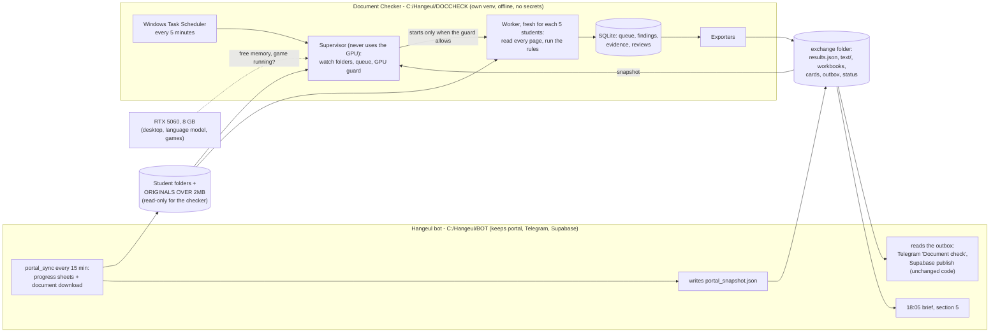

# Plan: a separate program for the OCR document check

Plan for approval, 5 Oct 2026. Nothing has been built, run or installed. It merges the three drafts in this folder. It starts from `draft_reuse.md`, which gets a safe program running soonest, and takes the best parts of `draft_accuracy.md` and `draft_operations.md`.

- Every claim about today was checked against the staging clone `C:/Hangeul/JARVIS/socials/repo` at commit `8317741`, which is the code the live bot runs. `path:line` references are relative to that clone. "REF 07/09/11" are the files in `C:/Hangeul/REFERENCE`.
- *(measured)* marks the owner's figures from this PC.
- All names, numbers and dates in the examples are placeholders.

## Summary

- **What it is.** "Document Checker" is a separate offline program in `C:\Hangeul\DOCCHECK`, with its own Python environment and no passwords or keys. It reads **every page** of each student's current documents and runs today's rules, copied unchanged. It writes the same `results.json`, workbooks and text files the bot uses now, plus a card per student saying what to fix and where.
- **The bot** stops running OCR. It keeps the portal, Telegram and Supabase: it writes a small portal snapshot for the checker and passes on the checker's results using its existing code.
- **What it fixes:** the slowdown and out-of-memory damage (a fresh worker per 5 students, a 3 GB cap, a GPU guard, no half-read text ever saved); a check that reads only 6 pages of shrunk copies; findings with no page or evidence; accuracy that has never been measured.
- **How long:** a first usable version (whole-document reports on demand and at night, bot untouched) in about **10 working days**; takeover from the bot after about **20 working days plus 2 weeks of side-by-side running**; staff review buttons and accuracy upgrades in about **9 more days**.
- **You decide (section 8):** takeover (D1), one small early bot change (D2), what happens when the GPU is busy (D3), whole documents and originals (D4), where staff confirm findings (D5), and six smaller points (D6–D11).

## 1. What the step does today

- **When it runs.** The bot job `portal_sync` runs every 15 minutes (`src/bot/scheduler.py:459-466`). It starts the `auto_sync` child process, which is killed after 3600 s (`:392-416`). After the progress sheets and the downloads, `verify_docs()` calls `auto_verify.run(budget=6)` (`src/sheets/auto_sync.py:315-327, 459-472`; `src/verify/auto_verify.py:59, 453-523`).
  - Bootstrap phase 5 runs one long `--budget 0` process (`bootstrap.py:93-100`).
  - The cold start actually used a loop of 5-student runs (`MIGRATION.md:169-178`).
- **Input:**
  - The student folders `<PROGRAM>/<NAME (PASSPORT)>/`: about 1.4 GB, 158 students on 30 Sep (`src/verify/doc_verifier.py:1100-1117`).
  - Files over 2 MB are re-rendered as JPEG pages (1754 down to 950 px, quality 70 down to 45). The original goes to `... - ORIGINALS OVER 2MB` (`src/sheets/verified_docs.py:249-274, 316-319`).
  - The portal CSV export, fetched live on every pass (`doc_verifier.py:1120-1126`).
- **Queue.** A student is checked again when their files or portal record change. The oldest go first, at most 6 per pass (`auto_verify.py:101-164, 477-480`).
- **Document type** comes from the file name only: 17 types, the longest keyword wins (`src/verify/rules.py:56-74`; `doc_verifier.py:1036-1045`). 9 documents are required, 10 for MASTER (`rules.py:78-87`).
- **Reading:**
  - The PDF text layer is used when it holds more than 80 characters. Otherwise the page is rendered at 150 dpi and EasyOCR reads it in English on the GPU (`doc_verifier.py:52-61, 122-150`).
  - NID, bank and academic files are read again, page by page, at 200 dpi (`:92-119`).
  - Pages under 300 characters are retried at 3 rotations (`:64-89`).
  - The text is cached per file (`auto_verify.py:172-234`).
- **Checks:**
  - 11 per-document checkers (`doc_verifier.py:913-925`);
  - colour, QR and Bangla checks on every file except the photo (`:1076-1080`; `src/verify/page_checks.py:138-184`);
  - the e-Apostille order (`page_checks.py:379-452`);
  - cross-checks of name, date of birth, passport number and affidavit (`doc_verifier.py:956-1032`);
  - 24 portal fields compared with the documents (`src/verify/field_check.py:39-56, 95-218`).
  - A student is INCOMPLETE, else FAIL, else REVIEW, else PASS (`doc_verifier.py:1081-1096`).
- **Outputs:**
  - `results.json`, `DOCUMENT CHECK.xlsx` and `FIELD CHECK.xlsx` (`auto_verify.py:136-151, 339-449`);
  - the Telegram message "Document check", which names only the first problem, cut to 160 characters (`:526-562`, sent at `auto_sync.py:467-471`);
  - Supabase records via `src/cloud/sheet_hooks.py:266-333`: 158 doc_check, 2,717 doc_verdict, 3,490 field_check and 3,469 doc_page_text;
  - section 5 of the brief (`src/bot/brief.py:332-359`).
- **Results** *(measured)*:
  - The first full check of 144 students gave FAIL 61, REVIEW 65, INCOMPLETE 15 and PASS 3. The field check gave 2,801 MATCH and 1 DIFFERS.
  - 47 of the FAILs are "page 1 is not an e-Apostille" (`page_checks.py:404-407`).
  - 57 FLAGs are "apostille not followed by its certificate" (`:420-423`).
  - Speed: about 93 s per student in fresh 5-student processes, about 6 s for a cached re-check, and up to 570 s in one long process.
- **The passport audit is a separate step.** It reads scans on the CPU every 30 minutes (`scheduler.py:449-450`; `src/scraper/ocr_validator.py:79`).

## 2. Problems today

| # | Problem | Evidence | How the new program fixes it |
|---|---|---|---|
| 1 | **Tied to the sync.** OCR runs last in the sync process, under its 3600 s kill. A code fault is only a log line. A pass longer than 15 minutes (with a game, 35+ min) makes the next sync run be skipped. | `auto_sync.py:459-466`; `scheduler.py:409-413, 459-466` | Its own program and schedule. The sync only writes a snapshot and passes on results. |
| 2 | **One long process slows down.** 90 → 570 s per student (7 GB VRAM + 6 GB spilled into RAM). Bootstrap still uses one long process. | *(measured)*; `bootstrap.py:93-100` | Always a fresh worker for at most 5 students. `doccheck drain` replaces bootstrap phase 5. |
| 3 | **Failed reads are stored as final.**<br/>- Rotation retries swallow every error, out-of-memory included, and keep the short text.<br/>- The cache keeps whatever came back, even `[unreadable: …]`.<br/>- A failed first read becomes a stored FLAG "could not read the file", saved with the fingerprint, so it is never retried until a file changes. | `doc_verifier.py:79-82, 133-136, 1066-1071`; `auto_verify.py:198-202, 292-298`; `field_check.py:193-197` | Text is cached only after a complete read. Out-of-memory stops the student, saves nothing, and re-queues them. |
| 4 | **No GPU guard.** The check uses the GPU whenever there is one. A game slowed OCR from 1.8 s to 17 s per page. Grill decision 14 is still open. | `doc_verifier.py:60`; REF 11 B19 | A guard and a 3.0 GB cap per worker (section 4.4). |
| 5 | **Not the whole document.**<br/>- Whole-file text covers 6 pages in the automatic pass (20 on the command line).<br/>- Colour, QR and seal checks see 4 pages.<br/>- Page reads stop at 8, 10 or 20 pages. | `auto_verify.py:191` vs `doc_verifier.py:122`; `page_checks.py:20, 55, 275`; `doc_verifier.py:474, 731` | Every page of every current file, up to 40 pages per file, with a note above that. |
| 6 | **The shrunk copy is read, not the original.** Shrinking drops the text layer, so a computer-made bank PDF looks like a scan and the colour rule hits it. The originals are kept but never read. | `verified_docs.py:256-267, 316-319`; `page_checks.py:40-65, 142-153` | Content is judged on the original. Format and size are judged on the copy that is submitted. |
| 7 | **Files go unseen.** Files with unknown names are never checked or reported. A replaced upload stays in the folder and is still checked, so an old rejected file keeps a student at FAIL. | `doc_verifier.py:1053-1072`; `verified_docs.py:387-388` | Unknown files are listed with a content hint. Replaced files are spotted from the portal's file list in `.download_complete` (`verified_docs.py:395-396`) and shown as a note only. |
| 8 | **Findings are bare text.** There is no rule id, page or evidence. OCR positions are thrown away. Telegram shows only the first FAIL. | `doc_verifier.py:74, 1083-1084`; `auto_verify.py:526-539` | Each finding gets a rule id, page, the text read and its confidence. Plus a card, an evidence page and a "To fix" sheet. |
| 9 | **Weak evidence can give a FAIL:**<br/>- the birth-certificate date only has to match any date on the passport (16 FAILs);<br/>- passport expiry is taken from the portal;<br/>- the NID name check uses the first word only;<br/>- "notarised" is accepted on the word "affidavit" or any red or violet blob;<br/>- the bank minimum uses the highest number in 6 pages. | `doc_verifier.py:309-315, 392-410, 453, 686-696`; `rules.py:92`; `page_checks.py:268-291` | Measured first (section 6). Fixed in phase 6 only where the numbers show false FAILs. |
| 10 | **Accuracy unknown, rules untested.** No test calls a rule. Every false positive so far was found by a manager by eye. Staff cannot mark a finding wrong. | `docs-draft/docs/CODEBASE_GUIDE.md:838`; REF 07 §10.6 | A hand-checked set of 40 students, numbers per rule, a unit test per rule, and Telegram review buttons. |
| 11 | **One rule dominates.** "Page 1 is not an e-Apostille" gives 47 FAILs, and the same cause gives 57 more FLAGs. | `page_checks.py:404-407, 420-423` | The rule **stays FAIL** (decision 18). Reports show it as one action, "re-assemble with the apostille first", with the dependent FLAG folded under it. |
| 12 | **A fragile store.** An unreadable `results.json` is replaced by an empty store, and all history is lost. | `auto_verify.py:136-144, 505` | SQLite with nightly backups. `results.json` becomes an export. The checker refuses to start on an unreadable store. |
| 13 | **Silent failures.** If pyzbar is missing, QR reading quietly falls back to OpenCV, and most apostilles would then FAIL. | `page_checks.py:100-103, 331-334`; REF 09 R25 | A self-test before every run. A failure stops the run and is reported in Telegram. |
| 14 | **Portal and code dependence.** Every pass needs the live portal. A hard-coded skip of one passport number also hides a real student who shares that number. | `doc_verifier.py:1120-1126`; `auto_verify.py:55-56` | A snapshot file from the bot. The skip list moves into the config file. |
| 15 | **Passport false alarm.** The passport-number check digit is trusted on its own, after repairs are tried until one fits. | `ocr_validator.py:248-262, 799, 809-812`; REF 11 §C | Optional phase 7 (D10). |

## 3. What the new program will and will not do

**It will:**
- Read every page of every **current** file, using the original for content where one exists.
- Run today's rules with today's wording:
  - "page 1 is not an e-Apostille" stays FAIL;
  - the solvency-date and "one qualification" rules stay FLAG until proven.
- Give every finding a rule id, page and evidence, and list the files it did not check.
- Write the files the bot already reads, so the brief, the Supabase publisher and the phone app work unchanged.
- Run by itself, wait while the GPU is busy, survive crashes, and report when it is stuck.
- Measure its accuracy per rule. From phase 5, it also learns from staff confirmations.

**It will not:**
- Log in to the portal, download, or hold any password, token or key.
- Send Telegram messages or publish to Supabase. The bot stays the only sender.
- Use cloud OCR or any language model in a verdict.
- Change a severity on its own. Only you do that.
- Open a network port.
- Replace the passport watcher, except in optional phase 7.
- Revive the apostille-subject rule, whose data file has no writer (`page_checks.py:295-311`).
- Judge forgery.

## 4. Design

### 4.1 Overview



### 4.2 Components

| Component | What it does | Built from |
|---|---|---|
| Portal snapshot (bot side, about 40 lines) | Written after the sheets step, from the export already in memory, so it makes no extra portal request. For each passport it holds: the columns the rules read, the program, the field-check row, the issue date and its cache age, and a hash of the whole record. | `pb._ALL_STUDENTS_CACHE` (`auto_sync.py:476`); `progress_builder.py:266-350`; `passport_issue` |
| Supervisor | Started by Task Scheduler every 5 minutes, one copy at a time. It never loads torch. CPU-only jobs go first: field-only changes and re-checks from cached text. It starts workers only when the guard allows. | the loop and "code fault stops the batch" of `auto_verify.run` (`:453-523, 492-500`) |
| Folder watcher | Queues students whose files or snapshot changed. It waits for `.download_complete`, 120 s of quiet, and no `*.part` file. It fingerprints the folder again after the check. | `doc_fingerprint`, `field_fingerprint`, `pending` (`auto_verify.py:101-164`) |
| Queue and store | SQLite: jobs, attempts, timings, findings with evidence, reviews. 14 nightly backups. | new |
| Worker | A fresh process for at most 5 students. Caps its own GPU memory and takes today's date for each student. | `check_one` (`auto_verify.py:252-315`) |
| Reader | One read per page at 200 dpi, or the text layer. It keeps the rotation retry and EasyOCR's word positions and confidence. It reads the original where there is one. A file is cached only when every page completed. | `doc_verifier.py:52-150` |
| Rules | `rules.py` and `page_checks.py` are copied word for word. `doc_verifier.py` and `field_check.py` change only where they were tied to the bot (settings, portal, progress builder, issue cache). | `src/verify/*.py` |
| Rule ids and evidence | A table maps each of today's messages to an id such as `AC-ORD` (about 70 in all), so the rule code is untouched. A locator finds the page and position of the value quoted in each message. Rules can be marked pinned or on trial. | new; ids from the accuracy draft |
| Exporters | `results.json` and `text/` in today's exact shapes; both workbooks plus "To fix" and "Findings" sheets; a text card and an HTML evidence page per student (opened from the folder, no server); the outbox; `status.json`; a labelling sheet. Every file is written to a temporary name, then renamed. | `auto_verify.py:318-562` |
| Self-test and network fence | Runs before every job. It checks that pyzbar decodes a test QR, the models load with downloads off, CUDA is visible, the folders are writable, and outside connections are refused. | new (REF 09 R25) |

The folders live under `C:\Hangeul\DOCCHECK\`:

| Folder | Holds |
|---|---|
| `app\` | the code, in its own git repo outside the GitHub staging tree |
| `.venv\` | Python 3.12 with the bot's OCR versions (`requirements.txt:13-23`) |
| `models\` | the EasyOCR models, copied once; no downloads at run time |
| `config.toml` | paths, limits, the game list and the skip list (no secrets) |
| `data\` | the database, page cache, evidence crops and backups |
| `exchange\` | `in\portal_snapshot.json`, `verification\` (`results.json`, `text\`, both workbooks), `outbox\` and `status.json` |
| `out\` | `cards\` and `students\` (the evidence pages) |
| `logs\` | times, counts and ids only |

### 4.3 Technology choices

| Choice | Why | Rejected |
|---|---|---|
| Python 3.12 in its own venv, with the bot's exact pins (torch 2.11 cu128 first, EasyOCR 1.7.2, PyMuPDF, OpenCV, pyzbar, openpyxl) | Proven on this RTX 5060. The rules are tuned to EasyOCR's text. Neither program's upgrades can break the other. | Sharing the bot's venv. A new OCR engine now (every rule would need re-checking; others are unproven on this card under Windows). |
| Windows Task Scheduler, every 5 minutes, at logon, no overlapping runs | Nothing to keep alive. It keeps working while the bot restarts. No admin service. | A long-running supervisor with a watchdog. Starting it from the bot's sync, where OCR would block the sync again. |
| SQLite (standard library, WAL) | One crash-safe file, easy to query per rule. | A big JSON store (problem 12). Redis or Celery. |
| `nvidia-ml-py` (NVML) and `psutil` | NVML sees free memory on the whole card. psutil sees a running game. | `torch.cuda.mem_get_info`, which once missed the resident model (REF 09 R12). |
| JSON files written by rename for the exchange | About 80 lines on the bot side, with no port. | A local HTTP API. |
| Static HTML evidence pages | Staff see the page with a box drawn on it, with no server. | A local review web screen (section 9). |

### 4.4 Sharing the 8 GB GPU with the bot

| Uses the card | VRAM |
|---|---|
| Windows desktop (the monitor is on the RTX) | 1.0–1.4 GB (REF 11 B6) |
| `qwen3:4b-instruct`, loaded on demand, unloaded after 5 minutes | 2.6–2.8 GB |
| Checker worker | **capped at 3.0 GB**, plus about 0.4 GB of CUDA context (EasyOCR peaks at 3.9 GB uncapped; one profiled student needed 2.2 GB) |
| **Total** | **about 7.6 of 7.96 GB usable**, so the language model can still load during a check |
| A game (3–4 GB), or voice if it is turned back on | does not fit, so the checker waits |

How the checker shares the card:
1. **A worker starts only when all of these hold**, and they are checked again before each student:
   - at least 3.6 GB of the card is free;
   - no program on the game list is running;
   - the bot's own OCR lock is free (until the switch);
   - it is not a quiet window: 08:25–08:40, 09:00–09:10 or 18:00–18:10 (`src/cloud/backfill.py:57`).

   Windows usually does not report memory per program on this kind of card, which is why there is a game list. Phase 0 confirms this.
2. **The worker caps itself at 3.0 GB**, so it fails fast instead of spilling into system RAM. The EasyOCR image size is set from phase 0's measurements.
3. **If it runs out of memory**, it stops the student, saves nothing and retries after 5, 15, then 60 minutes. After 3 failures it records "could not be read" and tells you once.
4. **At most 5 students per worker.** If a game starts mid-batch, the worker finishes the current student (about 2 minutes) and exits.
5. **Bulk re-reads only run 00:00–07:00.** Work that needs no GPU never waits.
6. **It never stops or unloads another process** (REF 09 R38).
7. **Waits are visible.** After 30 minutes the bot's message says "N waiting, GPU busy since HH:MM (reason)". New students need about 10–30 GPU minutes a day, so waiting costs little.

### 4.5 Privacy

- **Offline by construction:**
  - no HTTP library is loaded;
  - a socket fence in every process refuses anything but the local machine;
  - EasyOCR runs with downloads off, from `models\`;
  - the self-test proves all of the above before each run.
  - You can add an outbound firewall rule if you want.
- **No secrets.** It never opens `.env`, `token.json` or `credentials.json`.
- **Student data stays in `C:\Hangeul\DOCCHECK`**, with the same permissions as `C:\Hangeul\BOT`, outside the GitHub staging tree. Logs hold ids, counts and times only (REF 09 R14).
- **No new route to the cloud.** The bot publishes the same record kinds as today. Page images never leave the PC. How much page text goes to Supabase is D9; the default is the same as today.

### 4.6 How the bot changes

One setting, `DOC_CHECK_MODE`, controls everything. Each change is built in a worktree, passes the bot's full test suite, and is deployed by you at a quiet time.

| Mode | Bot | Checker |
|---|---|---|
| `internal` (today; rollback) | runs its own check | not used |
| `shadow` | runs its own check **and** writes the snapshot | checks everyone into its own folder; waits while the bot's OCR runs |
| `external` (after the switch) | **no OCR**: writes the snapshot, passes on the outbox, sends the same "Document check" message. `VERIFICATION_DIR` points at the checker's `exchange\verification`, so the brief, the publisher and the backfill read it unchanged. | the only OCR on the PC |

Details:
- In external mode, `verify_docs()` (`auto_sync.py:315-327`) calls `doccheck_bridge.collect()` instead of `av.run()`. It returns the same shape, so `summary_lines` and `sheet_hooks.verify_batches` run unchanged.
- An outbox item counts as sent only after Telegram accepted it (REF 09 R10).
- The text files are exported under the folder copy's name, size and time, even when the words came from the original. The publisher's page-text matching therefore keeps working (`src/cloud/records.py:1285-1330`).
- A heartbeat: "Document checker not running" is sent from the third missed run, and the recovery is announced once (the pattern at `auto_sync.py:390-408`).
- In external mode, the bot's own `auto_verify` command refuses to run, so it cannot write into the checker's folder.
- `src/verify` stays in the bot, frozen, because the publisher imports it (`src/cloud/sheet_hooks.py:250-251, 302-303`). New rule changes go only into the checker.
- Phase 5 adds Correct / Wrong / Fixed buttons, accepted from authorised chats only (`src/bot/telegram_bot.py:22`), and `/doccheck <name or passport>`, which replies with the student's card.
- **Rollback:** set `internal`, restore `VERIFICATION_DIR`, and restart the bot. The bot resumes from its own frozen `data/verification`.

### 4.7 Reports

| Report | Reader | Where |
|---|---|---|
| Batch message (at most once per 15 minutes) | staff, owner | Telegram, sent by the bot; the phone app via Supabase |
| Student card | staff before submitting; owner | `out\cards\`; `/doccheck` from phase 5 |
| Evidence page (each finding's page with a box drawn on it) | staff at this PC | `out\students\` |
| `DOCUMENT CHECK.xlsx` (+ "To fix", "Findings") and `FIELD CHECK.xlsx` | staff | `exchange\verification\` |
| Weekly line: findings per rule, confirmed or overruled, GPU waits, failed reads | owner | Telegram |
| Brief section 5 | owner | unchanged |

The Telegram message from phase 5 (until then it stays exactly as today):

```
🔍 Documents checked: 3
   • <STUDENT A> (BACHELOR) — FAIL [AC-ORD] (07 Academic Certificate & Transcript: page 1 is not an e-Apostille — the first apostille is on page 3 …) (+1 more FAIL)
   • <STUDENT B> (KLP) — REVIEW, 1 field(s) differ from the portal
   • <STUDENT C> (KLP) — FAIL → REVIEW after re-upload
   2 more waiting — GPU busy since 21:04 (game running).
   [Correct] [Wrong] [Fixed] under each FAIL/FLAG line
```

Student card:

```
DOCUMENT CHECK — <STUDENT A> (<PASSPORT A>) · BACHELOR · checked <DATE> 14:12 · rules v1
Verdict: FAIL — 2 to fix, 2 to look at · 11 files, 38 pages read (2 files from the originals)

MUST BE FIXED
 1. [AC-ORD] 07 Academic — page 1 is not an e-Apostille; the first apostille is on page 3.
    Re-assemble: apostille first, then the certificate and transcript it covers.
    (same cause: the apostille on page 6 has no pages after it)
 2. [FC-AGE] 06 Family Relationship Certificate — issued <DATE> (page 1, "Date: <DATE>"), over 3 months ago.

TO LOOK AT
 3. [BK-DATE, on trial] 08 Bank — solvency dated <DATE 1> (page 1), statement generated <DATE 2> (page 3).
 4. [BC-ONL] 04 Birth Certificate — could not confirm it is the online copy (no QR read).

PORTAL FIELDS   21 match · 1 differs (DOB: portal <DATE>, passport shows <DATE>) · 2 unreadable
NOT CHECKED     <FILE 1> (name not recognised; reads like a bank statement)
                <FILE 2> (superseded by a newer upload)
```

The "To fix" sheet. Its counts are the real FAIL counts per rule on 29 Sep (REF 07 §10.8):

| Action | Rule id | Students | Who fixes |
|---|---|---|---|
| Re-assemble the academic file, e-Apostille first | AC-ORD | 47 | document team |
| Compare the birth-certificate date with the passport | BC-DOB | 16 | document team |
| Ask for a colour scan | SC-COL | 12 | student |
| Get the parent's NID notarised | NID-NOT | 5 | student |
| Renew the trade licence for this fiscal year | FN-FY | 4 | sponsor |

## 5. Build phases

Sizes are working days for one developer with an AI assistant. Phases 0–3 do not touch the live bot, except for the optional snapshot (D2).

| Phase | What you get | Reuses | New | Acceptance test | Days |
|---|---|---|---|---|---|
| **0. Groundwork** | Folder, own venv, models, self-test, a measurement sheet, the 40-student list for section 6 | `requirements.txt:13-23`; lock check (`auto_verify.py:62-97`) | Measurements:<br/>- VRAM and time per page at 3 image sizes under a 3.0 GB cap;<br/>- CPU time per page;<br/>- whether Windows reports GPU memory per program;<br/>- whether the ZIP file names match `.download_complete` | The self-test passes. The sheet is written. Every probe ran only while the bot's lock was free and no game was running. | 2 |
| **1. First usable checker** (bot untouched) | `doccheck check --passport …` and a night `drain`:<br/>- **whole documents** (every page, originals for content);<br/>- rule ids and evidence;<br/>- cards, evidence pages, workbooks with "To fix";<br/>- a compatibility mode that reads exactly like today | `rules.py`, `page_checks.py` word for word; `doc_verifier.py`, `field_check.py` changed only at their ties to the bot; fingerprints, `check_one`, report writers | Snapshot reader (falls back to the bot's `sheet_state.json`, read-only, if D2 is no); reader that saves only complete reads; rule-id table; worker with the cap; comparison tool | (a) **Gate A:** on a copy of the bot's text cache, with the date fixed, compatibility mode gives **0 differing rows** for every unchanged student. Needs the snapshot.<br/>(b) A fake out-of-memory error on page 3 leaves nothing cached or stored.<br/>(c) 20 students at night: speed steady within ±20 %, VRAM within the cap.<br/>(d) The document team lead finds every FAIL of 5 students from the card alone. | 8 |
| **2. Runs by itself** | Scheduled supervisor, queue, folder watcher, full GPU guard, retries, crash resume, outbox, status, network fence, backups, re-checks from cache | `pending` order; code-fault stop (`auto_verify.py:492-500`); quiet windows (`backfill.py:57`) | supervisor, queue, guard, outbox | (a) The worker is killed mid-file 10 times: nothing partial is kept, and the final result is the same.<br/>(b) A dummy 5 GB GPU load: no worker starts; one starts within 5 minutes after the load ends.<br/>(c) Only one supervisor runs after a reboot.<br/>(d) With pyzbar hidden, the self-test fails and says why.<br/>(e) An outside connection is refused. | 4 |
| **3. Shadow run and accuracy** | One night of re-reading everyone from an empty cache (about 4–6 h); 2 weeks beside the bot in `shadow` mode; the hand-checked set labelled; a report explaining every changed verdict | everything above | comparison and labelling exports | The section 6 bar is met, and you say "switch". | 3 + 2 weeks |
| **4. Switch-over** | The bot stops OCR. Telegram, Supabase and the brief run on the checker's results. One backfill republishes them, and rollback is rehearsed. | `summary_lines`, `verify_batches`, the backfill, all unchanged | `doccheck_bridge`; `DOC_CHECK_MODE`; heartbeat | The bot's test suite and the new tests pass. Over 3 live days:<br/>- each checked student appears in Telegram exactly once;<br/>- the Supabase `doc_check` count equals the students in `results.json`;<br/>- the brief shows the checker's numbers. | 3 |
| **5. Review loop** | Correct / Wrong / Fixed buttons, the effective verdict (with the machine verdict kept), `/doccheck`, the weekly line per rule | `records.doc_verdicts` passes new row fields through (`records.py:1172`) | button handler, review table | In a test chat: a tap reaches the checker, the verdict is recomputed, and Excel and Supabase show it at the next run. Only authorised chats are accepted. | 4 |
| **6. Accuracy upgrades** (each only if section 6's numbers call for it) | Changes, each tested on its own:<br/>- a FAIL is held back to FLAG when its deciding text was read badly (never AC-ORD);<br/>- MRZ check digits anchor the date of birth and passport number;<br/>- a second QR reader (zxing-cpp);<br/>- Bangla is detected on scans;<br/>- the field check can report names that differ | MRZ code (`ocr_validator.py:87-412`); `find_dates`, `nid_numbers` | each change behind a version number | On the hand-checked test half: no more false FAILs than before, and no real FAIL lost. | 5 |
| **7. Passport alarm fix** (optional, D10) | The "no chance match" MRZ rule; one-character differences become "check by eye"; the alert names the file, upload date and link | `_line2_at`, `parse_mrz_line2`, `_validate_passport_data`, `_alert_block` (`scheduler.py:91`) | the rule and its tests | The known false alarm gives NOT_READ. The 31 alerts of 28 Sep are re-run, and you get the list of those that still stand. | 3 |

**Total:** phases 0–4 take about 20 days plus 2 weeks of shadow running. Phases 5–6 add 9 days, and phase 7 adds 3.

- **Phase 0** fixes the numbers the rest depends on, such as the memory cap and the image size. It also confirms that replaced files can be spotted from the portal's file list.
- **Phase 1** gives staff a better report at once, while the bot still produces the official results. Gate A proves the rules were copied faithfully before any new reading is trusted.
- **Phase 2** removes people from the loop. The checker keeps up, waits for games and the language model, and recovers after crashes and power cuts.
- **Phase 3** gathers the evidence for the switch. A fresh re-read clears any text cut short by out-of-memory errors, and the hand-checked set compares old and new rule by rule.
- **Phase 4** is a small, reversible bot change. Staff see the same messages, sheets and app.
- **Phase 5** lets staff confirm or overrule findings, and each answer feeds the numbers for that rule.
- **Phase 6** only fixes problems the numbers have shown.
- **Phase 7** reuses the same MRZ code to end the passport false alarm.

## 6. Measuring accuracy and the switch-over bar

**The hand-checked set: about 40 students, chosen in phase 0.**
- It includes:
  - all 3 PASS students;
  - 5 of the 47 "page 1 not an e-Apostille" cases, to check the detection (the rule itself stays);
  - 8 of the 16 birth-certificate date FAILs;
  - 6 of the 12 black-and-white FAILs, including bank files;
  - every other FAIL rule that fired;
  - 8 REVIEW students covering the two rules on trial;
  - 4 INCOMPLETE students;
  - at least 3 MASTER and 3 EAP students;
  - 5 students with shrunk files and 5 with sideways pages.

  These overlap, so the total stays near 40.
- **Split 20 / 20.** Anything tuned is tuned on the first half. Decisions use only the second half.
- **Labelling.** The labeller answers **violated / fine / cannot tell** for each rule on each document. They use the evidence pages, and the machine's verdict is hidden from them.
  - A second person labels 10 of the students, and you settle any disagreements.
  - It takes about 10 minutes per student, about 7 hours in all.
  - Labels are stored by file content, so they survive re-checks.

**Numbers tracked:**

| For | Numbers |
|---|---|
| Each rule, old and new, on the set | times fired; true and false FAILs; misses (a violation the rule passed); share answered "cannot tell" |
| Field check | how often DIFFERS is right; UNREADABLE rate (today 424 of 3,490 rows, REF 07 §10.8) |
| All students (no labels needed) | pages still under 300 characters after rotation; NIDs whose original and translation numbers agree; failed reads; **partial reads cached (must be 0)** |
| Running | seconds per student (median and 95th percentile); GPU waiting time per day; out-of-memory events |
| From phase 5 | confirmed, overruled and fixed, per rule. More than 20 % overruled over at least 10 findings puts the rule on your list. |

**The switch-over bar. All of these must hold:**
1. **Gate A:** compatibility mode gives 0 differing rows.
2. **No new false FAILs.**
   - On the test half, no new false FAIL on a document the old step got right.
   - Every FAIL rule that fired at least 10 times has at most 5 % false FAILs; rules that fired fewer times are checked case by case.
3. **No lost true FAIL**, unless it comes from reading the whole document or the original and you accept it.
4. **The field check is no worse:** the UNREADABLE rate is not higher than the old step's on the same students.
5. **14 days of shadow running:**
   - 0 partial reads cached, 0 lost jobs and no unhandled crash;
   - median 120 s or less per new student, 95th percentile 240 s or less;
   - no student waits more than 2 hours on a working day, except during logged GPU waits.
6. **Rollback has been rehearsed**, and you say "switch".

The **two rules on trial** (`doc_verifier.py:737-742`, `page_checks.py:432-439`) go back to FAIL only on your word. That needs at least 20 labelled cases with at most 1 false FAIL.

## 7. Risks

| Risk | Likelihood | Effect | What we do |
|---|---|---|---|
| Copying the rules subtly changes behaviour | medium | wrong verdicts | Copy word for word and change only the ties to the bot. Gate A runs after every change. |
| The two copies of the rules drift apart | medium | confusing results | Rule edits in the bot are frozen from phase 1. |
| The checker reads a folder that is still downloading | medium | false MISSING or unreadable | Wait for the marker, 120 s of quiet and no `.part` files, then fingerprint the folder again after the check. |
| The GPU is busy (language model, game, voice) | high | slow checks or out-of-memory | The guard, the 3.0 GB cap, fresh workers, and nothing partial is ever stored. Waits are reported. |
| Windows hides how much GPU memory each program uses | high | a game is missed | The game list, plus a check of free memory on the whole card. Confirmed in phase 0. |
| Whole documents and originals change many verdicts | high | staff confusion | The shadow comparison, every change explained, one announcement, and "read from original" on each card. |
| The checker stops unnoticed (reboot, crash) | medium | backlog | It starts at logon and the queue resumes. The heartbeat line appears after 30 minutes. |
| A driver, torch or pyzbar update breaks OCR | low | all checks fail | Exact versions pinned, the self-test before each run, and a Telegram line when it fails. |
| A bot change disturbs production | low | outage | One setting, tested in a worktree, deployed by you at a quiet time, with a one-setting rollback. |
| Review decisions or results are lost | low | staff work lost | SQLite, 14 nightly backups and the `results.json` export. A weekly copy to an encrypted USB drive is your choice. |
| More copies of student data on this PC | certain | wider exposure on the PC | It all stays in one folder, with the same permissions as the bot, outside the GitHub tree, and nothing is sent anywhere. |
| No one labels or reviews | medium | accuracy stays unknown | About 7 hours, booked through D8. A review is one tap. You alone are enough to start. |

## 8. Decisions for the owner

| # | Question | Options | Recommended | Why |
|---|---|---|---|---|
| D1 | Should the new program take over the step? | (a) separate checker; the bot passes on its results after the shadow run<br/>(b) fix the check inside the bot<br/>(c) separate program, started by the bot's sync | **(a)** | OCR leaves the sync, speed stays steady, and its failures are its own. Rollback is one setting. |
| D2 | May the bot write `portal_snapshot.json` from phase 1? (one restart by you) | yes / no: read the bot's `sheet_state.json` until phase 4 | **yes** | It only adds a file. It frees the checker from the portal and passwords. Without it, Gate A waits until phase 4. |
| D3 | What happens when the GPU is busy? (grill decision 14) | (a) wait, then catch up automatically<br/>(b) fall back to the CPU automatically<br/>(c) always use the GPU | **(a)** | A starved read gives wrong text, while a wait costs minutes. A "check this student now on the CPU" command covers urgent cases. Please name the game's program file. |
| D4 | Should it read whole documents (every page, up to 40, with a note above that) and the originals, even though some verdicts will change? | yes / keep 6 pages and shrunk copies / every page of the shrunk copies | **yes**, from the shadow run on | It is what "check whole documents" means, and the originals keep their text layer and resolution. |
| D5 | Where do staff confirm or overrule findings? | Telegram buttons / a web page on this PC / an Excel column | **Telegram buttons** | Staff and you already read the check in Telegram and on the phone. No open port is needed, and the page pictures stay on the PC. |
| D6 | Does an overrule change the verdict that is sent out? | yes, with the machine verdict kept / no, it is only a note | **yes**, with conditions:<br/>- the machine verdict is always shown;<br/>- a FAIL overrule needs a reason;<br/>- it lapses when a new file version arrives;<br/>- you get a weekly overrule list | Otherwise the same false FLAG returns at every check, and the trial rules can never be proven. |
| D7 | Who changes rule severities? | (a) a weekly suggestion list, and you decide<br/>(b) noisy rules are demoted automatically | **(a)**, with AC-ORD pinned at FAIL | Severities are guideline decisions (decisions 7 and 18). With the numbers ready, each takes a minute. |
| D8 | Who labels the 40-student set (about 7 hours), and when? | the document team lead / you / both | **The document team lead during the shadow weeks, a second person for 10 students, and you settling disagreements** | Without labels, nobody can say whether a FAIL is true. |
| D9 | How much page text should go to Supabase now that every page is read? | same as today / every page / none | **same as today** | Reading more must not quietly publish more. Any change is a separate privacy decision. |
| D10 | When should the passport false-alarm fix be built? (you said "not now" on 29 Sep) | phase 7 in the checker, watcher switched later on a separate yes / not now / in the bot now | **phase 7** | It reuses the same MRZ code and tests, and live alerts stay as they are until it is proven. |
| D11 | Should `compress_docs.py` be retired? | retire / keep | **retire** | It has a hard-coded `E:` folder and overwrites files with no backup (`compress_docs.py:7, 74`). The download step already shrinks files and keeps the originals (`verified_docs.py:316-319`). |

## 9. Alternatives considered and why not

- **Fix the check inside the bot.** It is cheaper, but OCR keeps blocking the sync, shares the bot's environment, and stops whenever the bot stops.
- **Let the bot's sync start the checker** (accuracy draft). The sync still waits for OCR, under the 3600 s limit.
- **A long-running supervisor with a local review web page** (operations draft). It means more to keep alive and an open port, and staff would have to sit at this PC. The evidence pages show the picture without a server. A web page can come later if Telegram proves too thin.
- **Choose a new OCR engine now** (PaddleOCR, docTR or Tesseract). The rules are tuned to EasyOCR, and the others are unproven on this card under Windows. Phase 6 can run a comparison if the numbers show misreads causing false FAILs.
- **Classify pages by content with a trained model.** It needs about 900 labelled pages. Version 1 lists unknown and replaced files instead.
- **A vision language model, or cloud OCR.** A model that "corrects" a digit is exactly the failure a checker must not have, and you declined cloud services for privacy.
- **Reuse the bot's old text cache.** It would carry over text cut short by out-of-memory errors.
- **Redis, Celery or a Windows service.** Too much for about 15 students a day on one PC.

## Appendix: corrections to the drafts (checked against the code)

- **The reuse draft:**
  - Its shadow run needs the snapshot, but the snapshot only arrives in its phase 4. Fixed by D2, with a `sheet_state.json` fallback.
  - It deletes `src/verify` from the bot, but the publisher imports it (`sheet_hooks.py:250-251, 302-303`), so it stays.
  - Its 3.6 GB cap plus the desktop and the language model comes to more than the 7.96 GB usable. This plan uses 3.0 GB.
  - Its game detection relies on per-program GPU memory, which Windows usually hides. This plan adds a game list.
- **The accuracy draft:** starting the checker from the bot's sync keeps the sync blocked (problem 1).
- **The operations draft:** a sync run is skipped only when a pass runs longer than 15 minutes.
- **All three drafts:**
  - They miss that an out-of-memory error on a page's **first** read is saved as a final "could not read" result and never retried (`doc_verifier.py:1066-1071`; `auto_verify.py:292-298`).
  - "Unknown files are ignored" is only half true: the field check still reads them (`field_check.py:188-198`), so they cost OCR time while no rule uses them.
