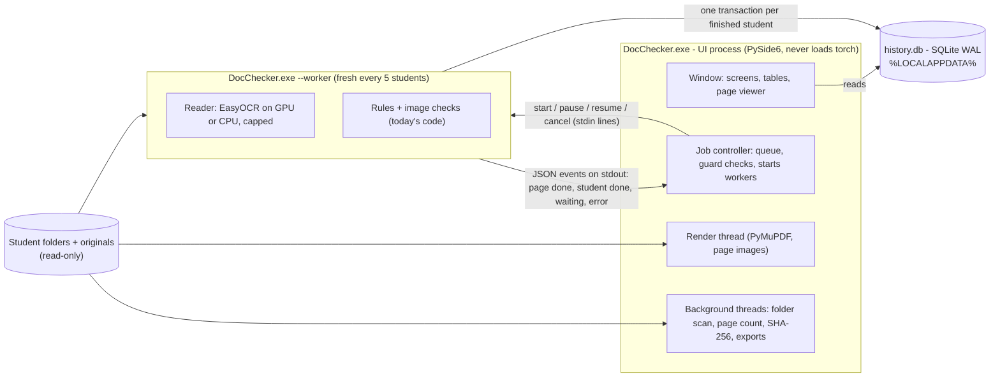

# Draft: the visual app (screens, flows, UI technology)

Draft for `APP_PLAN.md`, 5 Oct 2026. Angle: **the visual app**: what staff see and do, how the window stays responsive while OCR runs, how the app is installed on another office PC, and what it keeps between sessions. The hardware tuning and the engine each have their own draft. This draft only covers how the tuning is **shown and controlled**, and the **contract** the engine must meet for the screens.

- Nothing was built, run or installed for this draft.
- `path:line` refers to the staging clone `C:/Hangeul/JARVIS/socials/repo` at commit `8317741`, the code the live bot runs. "PLAN" is `C:/Hangeul/JARVIS/ocr-checker/PLAN.md`; its sections 1–2 and appendix still hold and are reused here.
- *(measured)* marks the owner's figures from this PC.
- All names, passport numbers, dates, ids and user names in the wireframes are placeholders (`<STUDENT A>`, `<PASSPORT A>`, `<DATE>`, `<UID>`, `<TIME>`, `<USER>`, `<GAME>.exe`).

## Summary

- **What staff get.** A Windows program, "Hangeul Document Checker", with one job: check student documents and show the report. It has two ways in, **Add documents** (files) and **Add student folders** (one, many, or a whole program folder). Then come a progress view, three report views (batch, student, page), export to PDF and Excel, a history, and a small settings screen. It has no Telegram, no portal, no Supabase, no language model, no network, and it never writes into student folders.
- **Technology.** A **PySide6 (Qt 6 Widgets)** desktop window. The OCR engine runs in **separate worker processes** started with `QProcess`, which report progress as one JSON line per event. Results go to a local **SQLite** history. The app is packaged with **PyInstaller (one folder)** and installed with an **Inno Setup** wizard that needs no internet. Section 1.5 says why, and why Tauri/Electron and a browser page (Gradio, Streamlit, FastAPI+HTML) were rejected.
- **Biggest design point found in the code.** Today's rules read **11 portal fields** (name, father, mother, date of birth, passport number and expiry, gender, sponsor, two GPAs, program; section 1.3). The app has no portal. It therefore keeps a **student-details record** per student, filled from the folder name, the passport's MRZ, an optional imported student list, and what staff type. Every rule that cannot run for lack of a value is listed under **"Checks not run"**, so it is never silently skipped (today the code skips silently, for example `doc_verifier.py:452, 590, 965`).
- **Size.** UI work about **28.5 days** for one developer with an AI assistant, on top of about **10 days** of engine work (PLAN phases 0–1, re-aimed at the app). A first usable version (folders in, progress, batch and student report, Excel) takes about **24.5 days** in all.
- **Top owner decisions (section 5):** where student details come from without the portal (A1); PySide6 (A2); which PCs it is installed on, and whether each PC keeps its own history (A3).

## 1. Design

### 1.1 What the app is and is not

| It does | It does not |
|---|---|
| Read the files staff point it at, in place and read-only | Log in to the portal, download, browse students, or hold any password |
| Run today's rules on **every page**, using the original over 2 MB where one exists (PLAN problems 5–6) | Send Telegram messages, publish to Supabase, or feed the bot's brief |
| Show one report: batch → student → page, with the page image and the text the machine read | Shrink, rename, move or delete any student file (today's `shrink_large_files` writes into folders, `verified_docs.py:292-327`; the app never calls it) |
| Detect the PC and choose GPU or CPU, the memory limit and the number of helpers (the hardware draft) | Use cloud OCR, a language model, or any network connection |
| Keep a local history so results and re-checks survive closing the app | Change a rule's severity. AC-ORD ("page 1 is not an e-Apostille", `page_checks.py:404-407`) stays FAIL (decision 18) |

Labels say **"Add"**, not "Upload". The subtitle under both buttons reads "Files stay on this PC. Nothing is uploaded." Staff said they do not want student data in any cloud service, and "upload" suggests otherwise.

### 1.2 Who uses it, and where

- **Users:** the document team (checking before an application goes out) and the owner. A user knows Windows Explorer and Excel, not the command line.
- **This PC:** Ryzen 5 8600G (6 cores / 12 threads), RTX 5060 8 GB, about 16 GB RAM, Windows 10. The Radeon 760M inside the Ryzen is **not usable** for OCR: EasyOCR runs on torch, and the pinned torch build is CUDA, which is NVIDIA only (`requirements.txt:13-14`). The app lists the Radeon as "not used".
- **Another office PC:** unknown. Without an NVIDIA card, or with a driver too old for CUDA 12.8, the app runs in **CPU mode**. That is roughly 10 times slower than this PC and **not measured yet**; step U10 measures it. The screens say so plainly and show the estimate in ranges until the first students give a real number.
- **This PC also runs the live bot,** whose own check uses the same GPU every 15 minutes (`src/bot/scheduler.py:459-466`, budget 6 per pass, `auto_verify.py:59`). Section 1.8 covers how the app avoids colliding with it.

### 1.3 Student details without the portal

Today every student is a portal record (`portal_students`, `doc_verifier.py:1120-1126`, a live portal export). The rules read these fields from it:

| Field | Used by | If it is missing today |
|---|---|---|
| Passport Expiry | passport validity (`doc_verifier.py:309-326`) | falls back to the latest date on the scan |
| Passport No | number on the scan (`:327-331`); cross-check (`:1010-1015`) | both skipped |
| Gender | the "both ears visible" NOTE (`:376-377`) | skipped |
| Full Name | NID name (`:449-464`); family certificate (`:551-557`); academic (`:588-595`); bank holder (`:721-723`); cross-checks (`:961-995`); affidavit (`:1026`) | each skipped |
| Father, Mother | NID names, academic, bank/financial holder (`:722, :816`), cross-checks | each skipped |
| DOB | cross-check of the date of birth (`:997-1008`) | skipped |
| Sponsor | whose bank account (`:721-723`); financial papers (`:815-818`) | the student's name is used, plus a FLAG "sponsor is neither father nor mother" |
| HSC GPA, SSC GPA | GPA on the academic papers (`:596-602`) | skipped |
| Program | which documents are required, and the bank minimum (`rules.py:19, 78-87`), through `program_of` (`:1129-1131`) | **silently treated as KLP** |

The **field check** (`field_check.py:182-218`) needs the whole portal row and the progress-sheet column layout (`pb.target`, `pb.columns_for`, `pb.build_row`, `:184-186`). Without a portal record it cannot run at all.

**The app's student-details record.** Each value carries its source, shown as a small tag on screen. Sources are listed from strongest to weakest:

1. **Student list** (optional, decision A1): a portal CSV export that staff import, or, on this PC only, the bot's portal snapshot read **read-only**. It fills every field and makes the field check possible.
2. **Folder name**: `<NAME> (<PASSPORT>)`, parsed with today's pattern (`doc_verifier.py:1114`). The bot's download names folders with the portal's own name and number (`verified_docs.py:91-93`), so this counts as portal data.
3. **Typed by staff**: program, sponsor, father's and mother's names, GPAs.
4. **Passport MRZ**, read during the check by the passport reader (`ocr_validator.py:375-412`): name, number, date of birth, expiry, sex. A value is used only when its check digit agrees **without repair**. The repair loop (`ocr_validator.py:248-262`) is PLAN problem 15, so a repaired value is shown as "check by eye" and not used.

Two rules keep the record honest:
- **A value read from a document is never used to judge that same document.** If the passport number came from the MRZ, the "portal passport number appears on the scan" check would pass by construction. It is listed as "not an independent check" under *Checks not run*.
- **Program is never guessed silently.** Order: student list → parent folder name (section 1.4.3) → staff choice. A student with no program cannot be started, and the start button tells the user which students still need one. This replaces the silent KLP default at `doc_verifier.py:1131`.

**Edit details and re-run the rules.** When staff fix a value (for example, they type the father's name), the app re-runs only the rules, using the stored page text and image-check results. No page is read again and the GPU is not needed. Today a cached re-check takes about 6 s per student *(measured)*.

### 1.4 Screens and flows

**Window frame.** Minimum size 1024 × 700, designed for 1366 × 768 and up, tested at 100/125/150 % Windows scaling. A left rail holds Home, Add documents, Add folders, Progress, Reports, History and Settings. A top bar shows the hardware badge, for example "GPU: RTX 5060 · ready", "GPU busy · waiting" or "CPU mode". Verdict colours are today's Excel colours (`auto_verify.py:342-343`): PASS `C6EFCE`, FLAG/REVIEW `FFEB9C`, FAIL `FFC7CE`, MISSING/INCOMPLETE `F2F2F2`, NOTE `DDEBF7`. A colour always appears beside its word, never alone. Shortcuts: Ctrl+O add documents, Ctrl+Shift+O add folders, Ctrl+F search history, Ctrl+E export, F5 re-check.

#### 1.4.1 Home

```
+-----------------------------------------------------------------------------------------------+
| Hangeul Document Checker                                    [GPU: RTX 5060 - ready]  [?]      |
+------------+----------------------------------------------------------------------------------+
| > Home     |  Check documents                    Files stay on this PC. Nothing is uploaded.  |
|   Add docs |  +---------------------------------+   +-----------------------------------+      |
|   Add      |  |  Add documents                  |   |  Add student folders              |      |
|   folders  |  |  PDF, JPG or PNG files of one   |   |  One student, several students,   |      |
|   Progress |  |  or more students               |   |  or a whole program folder        |      |
|   Reports  |  |  [ Choose files... ]            |   |  [ Choose folders... ]            |      |
|   History  |  +---------------------------------+   +-----------------------------------+      |
|   Settings |          ...or drop files or folders anywhere on this window                     |
|            |                                                                                  |
|            |  Running now: nothing                                                            |
|            |  Unfinished: 1 batch (MASTER'S DEGREE) paused at 7 of 12 [ Resume ] [ Discard ]    |
|            |                                                                                  |
|            |  Last checks                                                                     |
|            |  <DATE> 14:12  BACHELOR'S DEGREE, 16 students  FAIL 8 REVIEW 5 INC 2 PASS 1 [Open] |
|            |  <DATE> 10:03  <STUDENT A>, re-check           FAIL -> REVIEW              [Open] |
|            |                                                                                  |
|            |  This PC: Ryzen 5 8600G 6c/12t, 16 GB, RTX 5060 8 GB -> GPU mode, ~1.5 min/student|
+------------+----------------------------------------------------------------------------------+
```

- A drop anywhere is sorted at once: folders go to *Add student folders* and files to *Add documents*. A mixed drop opens folders first, then files.
- No other content appears on Home (no portal, chat or brief), as the owner asked.

#### 1.4.2 Add documents (pick or drop files)

Step 1: one row per file, each with a **proposed document type** and a **proposed student** for staff to confirm.

```
Add documents                                                              Step 1 of 2: confirm
+------------------------------------------------------------------------------------------------+
| Drop more files here, or [ Choose files... ]                     6 files, 18 pages, 7.4 MB      |
+----+--------------------------------+-----+------+------------------------+-----------------------+
| #  | File                           |Pages| Size | Document type          | Student               |
+----+--------------------------------+-----+------+------------------------+-----------------------+
| 1  | passport_<UID>_<TIME>.jpeg     |  1  | 0.4  | 01 Passport   [name]   | <STUDENT A>  [folder] |
| 2  | bank_statement_<UID>_<TIME>.pdf|  9  | 1.9  | 08 Bank       [name]   | <STUDENT A>  [folder] |
| 3  | scan0012.pdf                   |  3  | 1.2  | 08 Bank?   [text layer]| <STUDENT A>  [drop]   |
| 4  | IMG_<N>.HEIC                   |  -  | 2.8  | cannot be read: HEIC. Save it as JPG first.    |
| 5  | family_<UID>_<TIME>.pdf        |  2  | 0.8  | 06 Family Cert. [name] | ? [Pick...] [New...]  |
| 6  | photo.png                      |  1  | 0.3  | 02 Photo      [name]   | <STUDENT A>  [drop]   |
+----+--------------------------------+-----+------+------------------------+-----------------------+
| (!) File 5: no student found. Pick one from History or the student list, or create a new one.    |
| (!) File 2: <STUDENT A> already has an 08 Bank file from <DATE>.                                 |
|     (o) The new file replaces it    ( ) Check both                                               |
| (!) File 6: the photo must be JPG (rule PH-FMT). It will be checked as it is and fail that rule. |
|                                  [ Remove selected ]   [ Back ]   [ Next: student details > ]    |
+------------------------------------------------------------------------------------------------+
```

How the type is proposed. It costs a few milliseconds per file and uses no OCR:
1. **By name.** Today's `classify` (`doc_verifier.py:1036-1045`) over `FILE_PATTERNS` (`rules.py:56-74`); the longest keyword wins. The portal's own names carry the type, the uid and the upload time (`verified_docs.py:59-64`), so downloaded files nearly always match. Tag `[name]`.
2. **By text layer.** For an unmatched PDF that has a text layer, the same keywords plus `TITLES` are scored on page 1. Tag `[text layer]`, shown with a "?" until confirmed.
3. **By shape.** For an unmatched JPG/PNG whose ratio is within 0.06 of 35/45, propose 02 Photo (`rules.py:30`, the tolerance used at `doc_verifier.py:347`).
4. Otherwise the type reads "? choose", with the 17 titles in a drop-down (`rules.py:125-134`).

How the student is proposed:
1. **The parent folder** matches `<NAME> (<PASSPORT>)` → that student. Tag `[folder]`.
2. **The drop target**: files dropped on a student's card in History or a report → that student. Tag `[drop]`.
3. **A passport number** in the file name or text layer matches a student in History or the student list. Tag `[number]`.
4. Otherwise "? Pick / New".

Checks before Next:
- **Same file twice.** The same SHA-256 already belongs to another student → warning.
- **Another student's number.** A text layer showing a *different* known student's passport number → "this file may belong to `<STUDENT B>`".
- **Two files of one type.** Allowed, as today: the texts are joined (`doc_verifier.py:1072`). The row says "2 files, read together".
- **Unsupported files** (HEIC, DOCX, ZIP, Outlook attachments dragged straight from the mail window with no file path) get a one-line instruction and are never "checked" silently.

Step 2 is the **student-details** dialog, once per student in the drop:

```
Student details - <STUDENT A>                                                  Step 2 of 2
+------------------------+-----------------------+-------------------------------------------------+
| Value                  | Used                  | From                                            |
+------------------------+-----------------------+-------------------------------------------------+
| Full name              | <STUDENT A>           | folder name                            [edit]   |
| Passport no            | <PASSPORT A>          | folder name                            [edit]   |
| Program                | [ BACHELOR       v ]  | parent folder "BACHELOR'S DEGREE"               |
| Sponsor                | [ Father         v ]  | typed (needed for the bank-holder check)        |
| Father's name          | [                  ]  | not known: father's NID name, academic papers   |
|                        |                       | (father), cross-check (father) will not run     |
| Mother's name          | [                  ]  | not known: 3 checks will not run                |
| HSC GPA / SSC GPA      | [      ] / [      ]   | optional: the 2 GPA checks will not run         |
| Date of birth, expiry, | read from the         | used only if the MRZ check digits agree         |
| gender                 | passport's MRZ        |                                                 |
+------------------------+-----------------------+-------------------------------------------------+
| Student list: not imported (Settings > Student list). With it, these values fill in by themselves.|
|                                      [ Cancel ]   [ Save, check later ]   [ Save and check now ]  |
+--------------------------------------------------------------------------------------------------+
```

#### 1.4.3 Add student folders (pick or drop one or many)

What can be added, and how the app tells the cases apart:

| Picked or dropped | Recognised by | Example (placeholders) |
|---|---|---|
| One student folder | its name matches `(.*?)\s*\(([^)]+)\)$` (`doc_verifier.py:1114`) **and** it is not a program-folder name | `...\BACHELOR'S DEGREE\<STUDENT A> (<PASSPORT A>)` |
| Several student folders | multi-select in the folder dialog, or a multi-folder drop | — |
| A program folder | its name matches a program's tokens (`progress_builder.py:108-131`), and its sub-folders are student folders | `...\BACHELOR'S DEGREE` |
| The whole documents root | its sub-folders are program folders | `C:\Hangeul\VERIFIED STUDENT DOCUMENTS` (`config.py:101-102`) |
| Any other folder | — | offered as "Treat as one student…" with a name and passport typed in |

- **Trap in today's code.** The program folders the download creates are named from `PROGRAMS[...]["name"]` (`verified_docs.py:83-88`, `:357`). Two of them end in brackets: "KOREAN LANGUAGE PROGRAM (KLP)" and "EAP (ENGLISH FOR ACADEMIC PURPOSE)" (`progress_builder.py:110, 116`). Today's `student_folders` treats an empty program folder whose name ends in brackets as a student with "passport" `KLP` (`doc_verifier.py:1109-1112`). The app checks program names **before** the student pattern. The real folder names on disk are confirmed in step U3; the docstring at `verified_docs.py:10` gives short names, but the code gives the long ones.
- **Program from the folder name.** The same tokens as `program_matches` (`progress_builder.py:204-206`): "korean language program"/"klp" → KLP, "eap"/"english for academic" → EAP, "bachelor" → BACHELOR, "master" → MASTER. "OTHER PROGRAMS" (`verified_docs.py:88`) and unknown names → "choose".
- **Originals.** The app looks for the same relative path under the sibling tree `<root> - ORIGINALS OVER 2MB` (`config.py:104-106`; the copy keeps the sub-path, `verified_docs.py:316-319`). The tree can also be set in Settings. Each student row shows how many originals were found. The engine reads the original for content and judges the format and size on the folder copy (PLAN problem 6). A shrunk `.png` became `.jpg` (`verified_docs.py:320`), so originals are matched by stem as well as by full name.
- **Older uploads.** The hidden `.download_complete` marker holds the portal's current file names, joined with `|` (`verified_docs.py:395-396`). Files in the folder but not in that list were replaced on the portal, because a re-download adds files and never deletes old ones (`:387-388`). They are listed as "older upload, not checked" instead of being checked and keeping the student at FAIL (PLAN problem 7). A marker that holds only "ok" or nothing (older downloads, `:373-376`) means "cannot tell". Then all files are checked, and two files of one type are shown with their upload times for staff to choose.
- **Folder still being written.** A `*.part` file (`verified_docs.py:389-391`), or any change in the last 120 s, marks the student "downloading, try later". The checkbox is cleared.
- **Unchanged students.** If the file list (name, size, time, SHA-256) and the rules version equal the last run, the row says "unchanged". It is unticked by default, and a "Check again anyway" box ticks it.
- **Ignored silently but counted:** names starting with "." (as today, `doc_verifier.py:1051`), `Thumbs.db`, `desktop.ini`, `~$*`.

```
Add student folders                                                       Review before checking
+--------------------------------------------------------------------------------------------------+
| Added:     C:\Hangeul\VERIFIED STUDENT DOCUMENTS\BACHELOR'S DEGREE           (a program folder)    |
| Program:   BACHELOR (from the folder name)                                 [ change for all v ]   |
| Originals: C:\Hangeul\VERIFIED STUDENT DOCUMENTS - ORIGINALS OVER 2MB\...  found      [ change ]   |
+----+-------------------+--------------+-------+-------+-------+---------------+----------------------+
|    | Student           | Passport     | Files | Pages | Orig. | Last checked  | Status               |
+----+-------------------+--------------+-------+-------+-------+---------------+----------------------+
| [x]| <STUDENT A>       | <PASSPORT A> |  11   |  38   |   2   | never         | ready                |
| [x]| <STUDENT B>       | <PASSPORT B> |  12   |  41   |   0   | <DATE> FAIL   | 2 files changed      |
| [ ]| <STUDENT C>       | <PASSPORT C> |  10   |  29   |   1   | <DATE> PASS   | unchanged            |
| [!]| <STUDENT D>       | <PASSPORT D> |   9   |   -   |   -   | never         | downloading - later  |
| [x]| <STUDENT E>       | <PASSPORT E> |  13   |  44   |   0   | never         | 1 older upload       |
| [?]| <FOLDER, NO (PASSPORT)>          |   4   |  10   |   -   | -             | [Treat as student...]|
+----+-------------------+--------------+-------+-------+-------+---------------+----------------------+
| 16 ticked, 590 pages. On this PC (GPU): about 25 min. Range 20-35 min until 3 students are done.   |
|                                     [ Only changed ]  [ Student details... ]  [ Back ]  [ Start ]   |
+--------------------------------------------------------------------------------------------------+
```

The page count comes from PyMuPDF's page count (images count as one page), read on a background thread so the window never freezes, even for the whole root (about 158 students and 1.4 GB, PLAN section 1). The time estimate is the hardware draft's calculation; this screen only shows it.

#### 1.4.4 Check progress (per student and per page, time left, pause, cancel)

```
Checking: BACHELOR'S DEGREE - 16 students                                     [ Pause ] [ Cancel ]
+--------------------------------------------------------------------------------------------------+
| ##########################.........................  7 of 16 students   251 of 590 pages           |
| 11 min gone, about 14 min left                                                                   |
| GPU RTX 5060: this check 2.4 of 3.0 GB allowed, card 5.1 of 8 GB in use   CPU 46%   21 pages/min   |
+-------------------+------------------------------------------------------+--------+---------------+
| Student           | Status                                               | Time   | Verdict       |
+-------------------+------------------------------------------------------+--------+---------------+
| <STUDENT A>       | done                                                 | 1:31   | FAIL, 2 to fix|
| <STUDENT B>       | done (re-check: 2 files read, 10 reused)             | 0:22   | REVIEW        |
| <STUDENT E>       | reading 08 Bank, page 6 of 9                         | 1:02   |               |
|   01 Passport [T]   02 Photo [I]   04 Birth [O][O]   05 Father NID [O][R][O]                         |
|   07 Academic [O][O][O][O][O][O][O][O]   08 Bank [T][T][T][T][T][>][ ][ ][ ]                         |
| <STUDENT F>       | waiting                                              |        |               |
| <STUDENT G>       | not finished: out of graphics memory, retry 1 of 3   |        |               |
+-------------------+------------------------------------------------------+--------+---------------+
| T text layer   O read by OCR   R turned upright to read   I image checks only   ! failed   > now    |
| [ Check <STUDENT F> next ]  [ Skip selected ]          Finished students can be opened right away  |
+--------------------------------------------------------------------------------------------------+
```

- **Pause.** The worker finishes the page it is on (about 2 s on the GPU), saves every finished student, and holds. After 2 minutes paused, the worker exits so its graphics memory is free (a game can start); Resume starts a fresh one. Paused batches survive closing the app.
- **Cancel.** The worker stops after the current page. Finished students keep their results, and the student in progress is discarded whole, never half-saved (PLAN problem 3). If the worker has not stopped after 30 s, it is ended.
- **Closing the window during a check** asks "Pause and close" or "Keep checking". "Keep checking" keeps the window open, minimised. The next start offers **Resume** (Home). No tray icon or background service in v1.
- **Sleep.** While a batch runs, the app asks Windows not to sleep (`SetThreadExecutionState`) and releases the request when the batch ends or pauses.
- **Waiting for the GPU** (the guard in the hardware draft and PLAN 4.4) is a banner, not an error:

```
| (!) Waiting since 21:04: the graphics card is busy (<GAME>.exe is running, 1.9 GB free).           |
|     The check continues by itself when the card is free.                                          |
|     [ Keep waiting ]   [ Use the CPU now - about 10 times slower ]   [ Pause the batch ]           |
```

- **Failed reads** show the plain reason (out of graphics memory, file damaged, password-protected PDF, network folder gone) and the retry count. After 3 failures the file moves to "Files not checked" with that reason. A failed read is never stored as a finding (PLAN problem 3; today `doc_verifier.py:1066-1071`).
- **Code faults** stop the batch with "This is a fault in the program, not in the documents". This is today's guard at `auto_verify.py:492-500`, so a report is never silently wrong.
- **Time left** is the remaining pages times the measured seconds per page, kept separate for text-layer and OCR pages, plus image checks. It is a range until 3 students are done, then a single figure.

#### 1.4.5 Report: batch summary (students by verdict)

```
Report - BACHELOR'S DEGREE - 16 students - checked <DATE> 14:12 - rules app-v1 - GPU
+-------------------+-------------------+-------------------+-------------------+-------------------+
| FAIL        8     | REVIEW      5     | INCOMPLETE  2     | PASS        1     | Not finished  0   |
| must be fixed     | a person must look| documents missing | no problem found  |                   |
+-------------------+-------------------+-------------------+-------------------+-------------------+
| What to fix first                                                                     Students   |
| [AC-ORD]  07 Academic: apostille not on page 1 -> re-assemble, apostille first             6      |
| [BC-DOB]  04 Birth certificate: date of birth not found on the passport                    2      |
| [SC-COL]  black-and-white scan -> ask for a colour scan                                    2      |
| [MISSING] 06 Family Relationship Certificate not added                                     2      |
+--------------------------------------------------------------------------------------------------+
| Filter: [ All verdicts v ] [ All programs v ] [ search name or passport ]                         |
+---------------+--------------+---------+------+---------+---------+-------------+----------------+
| Student       | Passport     | Verdict | Fix  | Look at | Missing | Not checked | First problem  |
+---------------+--------------+---------+------+---------+---------+-------------+----------------+
| <STUDENT A>   | <PASSPORT A> | FAIL    |  2   |   2     |   0     |   2         | 07 Academic: ..|
| <STUDENT B>   | <PASSPORT B> | REVIEW  |  0   |   3     |   0     |   0         | 08 Bank: ..    |
| <STUDENT H>   | <PASSPORT H> | INCOMP. |  1   |   1     |   1     |   0         | 06 Family: ..  |
+---------------+--------------+---------+------+---------+---------+-------------+----------------+
|                              [ Export PDF ]  [ Export Excel ]  [ Re-check selected ]               |
+--------------------------------------------------------------------------------------------------+
```

- The verdict is today's `student_verdict` (`doc_verifier.py:1089-1096`): INCOMPLETE, then FAIL, then REVIEW, then PASS. INCOMPLETE students still list their FAILs; today's Telegram line shows only the first missing document (`auto_verify.py:526-539`).
- "What to fix first" groups findings by **rule id** (ids from the accuracy draft, PLAN 4.2). AC-ORD is one line per student with the fix wording. The dependent "apostille not followed by its pages" FLAG (`page_checks.py:420-423`) is folded under it (PLAN problem 11).
- "First problem" reuses `_first_problem`'s choice (`auto_verify.py:526-539`) without the 160-character cut.
- On the measured first full check *(measured)*, this screen would show FAIL 61, REVIEW 65, INCOMPLETE 15, PASS 3, with AC-ORD at 47 at the top of "What to fix first".

#### 1.4.6 Report: one student

```
<STUDENT A> - <PASSPORT A> - BACHELOR - checked <DATE> 14:12 (1 min 31 s, GPU) - rules app-v1
VERDICT: FAIL - 2 to fix - 2 to look at - 11 files, 38 pages read (2 from the originals)
Compared with the check of <DATE>: 1 fixed - 2 still open - 0 new
                                  [ Edit details & re-run rules ]  [ Re-check ]  [ Export PDF ]
----------------------------------------------------------------------------------------------------
MUST BE FIXED
 1  [AC-ORD]  07 Academic Certificate & Transcript: page 1 is not an e-Apostille; the first
              apostille is on page 3. Re-assemble: apostille first, then the certificate and
              transcript it covers. (Same cause: the apostille on page 6 has no pages after it.)
                                                                              [ View page 1 > ]
 2  [FC-AGE]  06 Family Relationship Certificate: issued <DATE>, more than 3 months ago.
                                                                              [ View page 1 > ]
TO LOOK AT
 3  [BK-DATE] 08 Bank: solvency dated <DATE 1> (page 1), statement generated <DATE 2> (page 3).
                                                                              [ View page 1 > ]
 4  [BC-ONL]  04 Birth Certificate: could not confirm it is the online copy (no QR read).
                                                                              [ View page 1 > ]
NOTES (2)                                                                              [ show ]
FIXED SINCE <DATE>
 -  [SC-COL]  05 Mother NID: black-and-white scan. A colour scan was added on <DATE>.
PORTAL FIELDS (student list imported <DATE>)   21 match - 1 differs - 2 unreadable     [ show ]
CHECKS NOT RUN
 -  Mother's name not known: 05 Mother NID name, academic papers (mother), cross-check (mother).
 -  Passport number came from the passport itself: "number on the passport" is not independent.
FILES NOT CHECKED
 -  scan0012.pdf: name not recognised; page 1 reads like a bank statement.  [ Set type... ]
 -  bank_statement_<UID>_<OLD TIME>.pdf: older upload, replaced on the portal on <DATE>.
 -  academic_<UID>_<TIME>.pdf: pages 41-44 not read (limit 40 pages per file).
DOCUMENTS
 01 Passport       passport_<UID>_<TIME>.jpeg        1 page              PASS
 06 Family Cert.   family_<UID>_<TIME>.pdf           2 pages              FAIL
 07 Academic       academic_<UID>_<TIME>.pdf         44 pages, original   FAIL
 ...
----------------------------------------------------------------------------------------------------
```

- Each finding opens the page viewer at the page that shows it.
- "Checks not run" is new. It comes from the engine's `SKIPPED` findings (section 1.6) and closes the silent skips at `doc_verifier.py:452, 553, 590, 598, 965`.
- "Portal fields" appears only when a student list was imported (decision A1). Otherwise there is one line: "Portal fields not compared (no student list)".
- "Files not checked" covers four groups: names not recognised (today never reported, `doc_verifier.py:1053-1058`, yet still read by the field check, `field_check.py:188-198`); older uploads; files unreadable after 3 tries; and pages over the per-file limit.

#### 1.4.7 Page viewer (the page with the problem marked, and the text the machine read)

```
07 Academic Certificate & Transcript - academic_<UID>_<TIME>.pdf - read from: ORIGINAL (4.6 MB)
+-------+-----------------------------------------------------+-------------------------------------+
| Pages |                                                     | Finding 1 of 4    [ < ]  [ > ]      |
|  [1]! |  +-----------------------------------------------+  | FAIL  [AC-ORD]                      |
|  [2]  |  | +===========================================+ |  | Page 1 is not an e-Apostille. The   |
|  [3]A |  | |  HIGHER SECONDARY CERTIFICATE ...         | |  | first apostille is on page 3.       |
|  [4]  |  | |  (whole page outlined: expected the       | |  | Fix: re-assemble the file, apostille|
|  [5]  |  | |   e-Apostille here)                       | |  | first, then its certificate and     |
|  [6]A |  | |                                           | |  | transcript.                         |
|  [7]  |  | +===========================================+ |  | Evidence:                           |
|  [8]  |  +-----------------------------------------------+  |  - page 1 reads as HSC (level rule) |
| A = apostille QR read   ! = finding                         |  - page 3: apostille QR read [show] |
|       [ - ] [ + ] [ fit ] [ turn view ] [ open in viewer ]  +-------------------------------------+
|                                                             | Text read on page 1                 |
|                                                             | OCR, turned 90 deg, mean conf. 0.91 |
|                                                             | HIGHER SECONDARY CERTIFICATE ...    |
|                                                             | (matched words highlighted;         |
|                                                             |  low-confidence words underlined)   |
|                                                             | [ Copy text ]                       |
+-------+-----------------------------------------------------+-------------------------------------+
```

- **Kinds of marking.** The engine reports evidence in four kinds (section 1.6):
  - `text`: a box around the words the rule used, from EasyOCR word boxes (`detail=1`, as `ocr_validator._ocr_items` already does, `:169-187`);
  - `qr`: the decoded code's box;
  - `region`: the area measured, such as the photo's sampled background band (`doc_verifier.py:356-362`), drawn as a translucent overlay;
  - `page`: the whole page is outlined, used for "absence" findings ("no notarisation found on pages 1–3"). The panel then says "nothing found on these pages" and shows the text that *was* read, so staff can see why.
- **Read from** shows ORIGINAL or FOLDER COPY. For "colour" and "photo format" findings it is always the folder copy, because that is what gets submitted.
- **Rendering.** Pages are drawn at screen resolution with PyMuPDF on one dedicated render thread, since a PyMuPDF document must not be shared between threads, and the last 30 pages are cached. If the source file was moved or deleted, the viewer shows the stored evidence crop and the stored text, with "file no longer at <path>".
- **Optional (decision A9):** on an apostille page, staff can set "this apostille covers HSC/SSC/…". This stores the subject by application id, which wakes the dormant subject rule (`page_checks.py:295-311, 442-445`; the operations draft had the same idea). It is off in v1.

#### 1.4.8 Export (PDF and Excel)

```
Export
+--------------------------------------------------------------------------------------------------+
| What:     ( ) This student   (o) This batch (16 students)   ( ) Selected students (3)              |
| Format:   [x] PDF report   [x] Excel workbook                                                      |
| Include:  [x] Must fix and to look at   [ ] Notes   [x] Files not checked   [x] Checks not run      |
|           [ ] Small picture of each finding (page area only)                                       |
|           [ ] Full text read from every page                                                       |
| Save to:  C:\Users\<USER>\Documents\Hangeul Document Checks\<DATE> BACHELOR\        [ Change... ]  |
| (!) These files contain students' personal data. Keep them on office PCs. Do not upload them to    |
|     cloud services.                                                                                |
|                                                                         [ Cancel ]   [ Export ]    |
+--------------------------------------------------------------------------------------------------+
```

- **PDF.** Built with Qt itself (`QTextDocument` printed through `QPdfWriter`), so no browser engine or extra library is needed. Layout: one cover page with the batch counts and "What to fix first", then one section per student with the same parts as screen 1.4.6, at 1–3 pages per student.
- **Excel.** Today's `DOCUMENT CHECK.xlsx` layout, reusing `write_document_report` (`auto_verify.py:339-381`): a Summary sheet, one sheet per program, today's colours, and the `_cell` cleaning (`:318-322`). It adds two sheets: "To fix" (one row per student per rule) and "Findings" (rule id, level, file, page, evidence text, confidence, read from). `FIELD CHECK.xlsx` (`:384-445`) is exported only when a student list was imported.
- Nothing is exported automatically, and nothing is e-mailed or shared by the app.

#### 1.4.9 History

```
History                                                      [ search name or passport            ]
+----------------+------------------------------+------+------+------+-----+------+------+--------+
| Checked        | Batch or student             | Stud.| FAIL | REV. | INC.| PASS | Mode | Rules  |
+----------------+------------------------------+------+------+------+-----+------+------+--------+
| <DATE> 14:12   | BACHELOR'S DEGREE            |  16  |  8   |  5   |  2  |  1   | GPU  | app-v1 |
| <DATE> 10:03   | <STUDENT A> (re-check)       |   1  |  -   |  1   |  -  |  -   | GPU  | app-v1 |
+----------------+------------------------------+------+------+------+-----+------+------+--------+
| <STUDENT A>:  <DATE> FAIL  ->  <DATE> FAIL  ->  <DATE> REVIEW                                     |
|            [ Open ]  [ Re-check ]  [ Export ]  [ Forget this student... ]                         |
| Stored: 412 MB in C:\Users\<USER>\AppData\Local\Hangeul Document Checker   Kept for: 1 year        |
+--------------------------------------------------------------------------------------------------+
```

#### 1.4.10 Settings (small)

```
Settings   [ This PC ]  [ Folders ]  [ Student list ]  [ History & privacy ]  [ Rules ]  [ Self-test ]
+--------------------------------------------------------------------------------------------------+
| THIS PC                                                        [ Detect again ]  [ Measure speed ] |
|  Processor   AMD Ryzen 5 8600G, 6 cores / 12 threads                                              |
|  Memory      16 GB                                                                                |
|  Graphics    NVIDIA GeForce RTX 5060, 8 GB, CUDA ready        -> used for reading (OCR)            |
|              AMD Radeon 760M (inside the processor)           -> not used (OCR needs NVIDIA)       |
|                                                                                                  |
|  Chosen for this PC                                           Change                             |
|  Mode                              GPU                        (o) Automatic  ( ) GPU  ( ) CPU only |
|  Graphics memory for the check     3.0 GB of 8 GB             [ automatic v ]                     |
|  Fresh reader after every          5 students                 [ 5 ]                               |
|  Helpers for images, QR, colour    4 processes                [ automatic v ]                     |
|  Wait when free graphics memory is below 3.6 GB                                                   |
|  Wait while these programs run     <GAME>.exe                 [ Edit list... ]                    |
|  Wait while the bot's own check runs   yes                                                        |
|  While I work on this PC           (o) Normal  ( ) Gentle: lower priority, 2 helpers               |
|  Last measured: 1.8 s per OCR page, 93 s per student (<DATE>)                                     |
+--------------------------------------------------------------------------------------------------+
```

- **This PC.** The numbers and rules here are the hardware draft's. The screen only shows them and lets the owner override. The 3.0 GB limit and the 3.6 GB wait threshold come from PLAN 4.4; "fresh reader after every 5 students" comes from PLAN problem 2 *(measured: 93 s per student in fresh 5-student processes, up to 570 s in one long process)*.
- **Folders.** The default for "Add folders" (`C:\Hangeul\VERIFIED STUDENT DOCUMENTS`), the originals tree, the export folder and the data folder.
- **Student list.** Import a portal CSV, or (this PC only) use the bot's snapshot read-only; shows the last import date and has a Clear button (decision A1).
- **History & privacy.** How long results are kept, whether page text is kept, Forget a student, Back up now, Restore from backup.
- **Rules.** The rules version and a read-only list of rule ids with their levels. AC-ORD is shown as "pinned: FAIL (owner's decision)".
- **Self-test.** The first-run checks, which can be run again at any time:

```
Checking this PC before first use (about 1 minute, no internet needed)
 [ok] Reading models found (English), downloads switched off
 [ok] QR reader works: a test QR was decoded by zbar
 [ok] NVIDIA RTX 5060 usable -> GPU mode
 [ok] Test page read in 1.9 s
 [ok] Data folder can be written
 [ok] No internet connection was attempted
                                                                                   [ Continue ]
```

The QR test matters because today a missing zbar DLL silently falls back to OpenCV, and most apostilles would then FAIL (`page_checks.py:100-103, 331-334`; PLAN problem 13). A failed self-test blocks checking and says what to install.

### 1.5 UI technology

**What it must do.** Stay responsive while OCR runs in separate worker processes; work fully offline; install on another office PC with a normal installer; let staff drop **folders** and keep their real paths (needed for the originals tree, the `.download_complete` marker, and reading in place); show zoomable page images with boxes; export PDF and Excel; and be built by one developer with an AI assistant, reusing a Python engine (EasyOCR, torch, PyMuPDF, OpenCV).

| | **PySide6 (Qt 6 Widgets)** | **Tauri or Electron shell around a Python engine** | **Local browser page (Gradio, Streamlit, FastAPI+HTML)** |
|---|---|---|---|
| Languages and stacks | Python only, the same as the engine | JS/TS UI + Rust (Tauri) or Node (Electron) + a Python sidecar | Python + HTML/JS |
| Responsive while OCR runs | Yes. Workers are separate processes (`QProcess`); events arrive through Qt signals | Yes, through a sidecar and IPC | Gradio/Streamlit re-run or queue models fit long jobs with pause/cancel poorly; FastAPI+HTML works with polling or a WebSocket |
| Folder drop with real paths | Yes: native drag and drop gives local paths of files **and folders** | Electron yes; Tauri through its drag-drop event | **No.** A browser hides paths. Folders must be *uploaded* through the page into a temp copy (1.4 GB for the whole root), and the originals tree and marker cannot be found |
| Page viewer with zoom and boxes | `QGraphicsView`: images, zoom, overlays | canvas or SVG in the web view | canvas or SVG |
| Offline | Yes | Electron yes. Tauri needs the WebView2 runtime, which a clean or older Windows 10 may lack (the offline WebView2 installer must be bundled) | Yes, but it **opens a local port** (PLAN 4.5 promised none) and needs a browser |
| Installer | PyInstaller (one folder) + Inno Setup: one pipeline | **two** pipelines: the shell's installer plus a PyInstaller sidecar | a Python bundle + launcher + "open the browser"; it feels like a website |
| Graphics memory for the UI itself | Qt Widgets draw on the CPU; negligible | Chromium uses GPU drawing by default, on the same 8 GB card | the browser's GPU process uses the same card |
| One developer + AI assistant | One language; Qt Widgets is very well known to AI assistants; mature table/tree/form widgets | Most moving parts; best-looking result | Gradio/Streamlit fastest to start but fight this workflow; FastAPI+HTML is fine for a report site but not for folder intake |
| Licence | LGPL (the official wheels link dynamically; fine for in-house use) | MIT/Apache | Apache/MIT |
| **Verdict** | **Chosen** | Rejected: two stacks and two installers for no feature the app needs | Rejected for v1: no folder paths, an open port, more copies of student data. **FastAPI+HTML is the fallback** if the owner later wants reports readable from other PCs on the office network |

Also rejected: **Tkinter/CustomTkinter** (no proper zoomable image viewer or large tables), and **WPF/WinUI with a Python sidecar** (two languages again). **Qt Quick/QML** is not needed: Widgets suit tables and forms and are simpler to test.

**How the window stays responsive:**



- **The UI process never imports torch or EasyOCR.** It starts in seconds and holds no CUDA context, so it never competes for graphics memory.
- **A worker is the same executable started with `--worker`.** It reads a job file and writes one JSON line per event, for example `{"ev":"page","student":12,"file":40,"page":6,"of":9,"how":"ocr","turned":0,"secs":1.9}`. Commands go in on stdin (`pause`, `resume`, `cancel`, `skip 12`). This beats `multiprocessing` queues inside a frozen app for three reasons: a worker crash cannot take the window down; cancel can end the process after a grace period; and graphics memory goes back to Windows when the worker exits (PLAN problem 2).
- **The worker saves each finished student in one SQLite transaction.** The UI only reads, so there is a single writer per student and nothing half-written.
- **The CPU helpers** (page rendering, colour, QR, seal) are the worker's business, sized by the hardware draft. The UI only shows their CPU use.
- **One copy at a time.** A second start brings the open window forward, through a named pipe (`QLocalServer`), not a network port.

### 1.6 Contract between the engine and the screens

The screens need structured findings, not today's `"LEVEL: text | LEVEL: text"` detail string (`doc_verifier.py:1083-1084`). The engine returns this per student. The engine draft builds it; this draft fixes its shape:

```json
{"student": 12, "verdict": "FAIL", "rules_version": "app-v1", "mode": "gpu", "secs": 91,
 "identity": {"Passport No": {"value": "<PASSPORT A>", "source": "folder"},
              "DOB": {"value": "<DATE>", "source": "mrz", "check_digit": true}},
 "files": [{"id": 40, "doc": "academic", "title": "07 Academic Certificate & Transcript",
            "path": "<folder copy>", "read_from": "original", "pages": 44, "pages_read": 40,
            "status": "checked"}],
 "findings": [
   {"rule": "AC-ORD", "level": "FAIL", "file": 40, "message": "page 1 is not an e-Apostille ...",
    "fix": "Re-assemble: apostille first, then its certificate and transcript",
    "folded": ["AC-FOL"],
    "evidence": [{"page": 1, "kind": "page", "label": "expected the e-Apostille; reads as HSC"},
                 {"page": 3, "kind": "qr", "box": [0.62, 0.71, 0.80, 0.86]}]},
   {"rule": "NID-NAME", "level": "SKIPPED", "file": 41, "reason": "mother's name not known"}],
 "not_checked": [{"name": "scan0012.pdf", "why": "name not recognised", "hint": "bank statement"}]}
```

- Boxes are **fractions of the page** (0–1), so the viewer can draw them at any zoom on any render.
- `SKIPPED` is a new level. It never changes the verdict, just as NOTE never does (`doc_verifier.py:44-45`).
- `message` keeps today's wording. Excel and PDF show the same words staff already know.

### 1.7 Results between sessions (local history)

- **Where.** `%LOCALAPPDATA%\Hangeul Document Checker\` for the Windows user (`history.db`, `backups\`, `crops\`, `logs\`, `settings.toml`). The program files live in `C:\Program Files\Hangeul Document Checker\`, including the OCR models, so nothing is downloaded. The data folder can be moved in Settings.
- **What is kept** (SQLite with write-ahead logging):

| Table | Holds |
|---|---|
| `batch` | when, what was added, counts, mode (GPU/CPU), rules version, status (running/paused/done/cancelled) |
| `student` | the student-details record with each value's source |
| `file` | path, size, modified time, SHA-256, original's path, type and how it was chosen (name/text layer/staff) |
| `page_text` | keyed by the file's SHA-256 + reader settings: text, words with boxes and confidence, turned or not. **Written only when every page of the file completed** (fixes PLAN problem 3) |
| `image_check` | colour, QR, seal and page-code results per file version (today re-rendered every time, map "Image-level results are not cached") |
| `check_run` | one row per student per check: verdict, timings, rules version. Never overwritten |
| `finding` | the contract above, per check run |
| `crop` | small evidence images (page area only), so the viewer still works if the file moves |

- **A student's report** is their latest check run. History shows every earlier run with its verdict.
- **On start:** an unfinished batch shows Resume/Discard on Home. A damaged `history.db` is **never replaced by an empty one** (today an unreadable `results.json` becomes an empty store, `auto_verify.py:136-144`, PLAN problem 12). The app refuses to open it and offers the newest of **14 daily backups**, taken on first start each day.
- **Forget this student** deletes the rows, cached text and crops. Retention is decision A5.
- **Not imported:** the bot's `results.json` and text cache. Those were read 6 pages per file from shrunk copies (PLAN problems 5–6), and the text cache can hold cut-short reads (PLAN problem 3). The app checks everyone fresh.
- **Logs** hold ids, counts, times and error kinds only, never names, numbers or text.

### 1.8 Re-check after a student replaces a file

1. Staff add the student's folder again, or drop the new file on the student (Add documents proposes the student from History).
2. The app compares the file list with the last run by name, size, time and SHA-256, and shows: "Since <DATE>: 1 new file (08 Bank), 1 file older upload (old 08 Bank), 10 unchanged".
   - The portal keeps the old file's name in the folder, because a re-download never deletes (`verified_docs.py:387-388`). The marker decides which file is current (section 1.4.3). With no usable marker, the app asks, defaulting to the newer upload time in the portal file name (`verified_docs.py:59-61`).
3. **Only new or changed files are read.** Unchanged files reuse `page_text` and `image_check` by SHA-256. A renamed but identical file is not read again, unlike today's name+size+time key (`auto_verify.py:195`).
4. **All rules run again for the whole student,** because many compare documents: birth certificate with the passport (`doc_verifier.py:392-410`), NIDs with the passport (`:447-464`), bank holder with the financial papers through the shared `texts` (`:720-723, 811-891`), and the cross-checks (`:956-1032`). This is cheap: seconds, no GPU.
5. **Today's date is taken fresh for each student** (today it is fixed when the module loads, `doc_verifier.py:42`). So an unchanged family certificate can turn FAIL by age; it is tagged "new: time passed", not "new problem in the file".
6. The report shows **Fixed / Still open / New** against the previous run. Findings are matched by (rule id, document type), never by message text, which contains dates and amounts that change.

### 1.9 Sharing this PC with the bot

- While the bot's own check is running, the app **waits**. It reads the bot's lock file `C:\Hangeul\BOT\data\verification\auto_verify.lock` **read-only**: the file exists, is under 4 hours old, and its PID is alive (the logic of `auto_verify.py:83-97`). Unlike that function, it **never deletes** a stale lock (`:96`). It also waits on the free-memory and game rules (PLAN 4.4).
- The app never writes anything under `C:\Hangeul\BOT` and never touches the bot's `results.json`, text cache or workbooks.
- Whether the bot keeps its own 15-minute check is decision A7.

### 1.10 Privacy built into the screens

- The workers make no network connections: models are bundled, EasyOCR runs with downloads switched off, and a socket fence (PLAN 4.5) refuses anything but the local machine. The self-test proves this on first run.
- Student folders are opened read-only. The app's own copies are page text, small crops and the database, in the user's local data folder.
- Exports carry a personal-data warning. There is no "send", "share" or "upload" button anywhere.
- Access control is the Windows login. There is no separate password in v1.

## 2. What is reused and what is new

| From today's code | How the app uses it |
|---|---|
| `src/verify/rules.py` (all) | Copied word for word: file patterns, required documents, thresholds, titles (`:56-134`) |
| `src/verify/page_checks.py` | Copied. Page limits raised from 4 (`:20`, `is_digital` `:55`, `seal_present` `:275`) and 20 (`page_codes` `:327`) to every page up to 40. The settings import (`:16, :295`) is replaced by the app's settings. `inspect`, `colour_check`, `qr_check`, `bangla_check`, `seal_present`, `academic_check`, `level_of` are unchanged |
| `src/verify/doc_verifier.py` | Checkers `check_passport` … `check_income_tax` (`:307-907`), `CHECKS` (`:913-925`), `cross_checks` (`:956-1032`), `classify` (`:1036-1045`, also used for proposals), `student_verdict` (`:1089-1096`), `find_dates`, money parsing, `nid_numbers`, `issue_date`, `statement_date`. Replaced: `read_document`/`read_pages` (`:92-150`) by the new reader; `_ocr_reader` (`:52-61`) by one with the device and cap from the hardware profile and downloads off; `TODAY` (`:42`) taken per student; `DOCS_ROOTS`, `REPORT_DIR` (`:40-41`) from settings; `portal_students` (`:1120-1126`) removed; `program_of` (`:1129-1131`) by the student-details record; the "could not read" FLAG (`:1066-1071`) by a retried, never-stored failure |
| `src/verify/field_check.py` | `check_field` (`:95-158`), `SOURCES` (`:39-56`) and the field constants, used only with an imported student list. `check_student` (`:182-218`) loses the progress-builder layout and keeps just the `SOURCES` fields of the record |
| `src/verify/auto_verify.py` | The fingerprint idea (`:101-117`), extended with SHA-256; `write_document_report` / `write_field_report` and `_cell` for Excel (`:318-445`); the code-fault stop (`:492-500`); `_first_problem` (`:526-539`) for the summary column; the lock-reading logic (`:62-97`) without its delete |
| `src/sheets/verified_docs.py` | Knowledge only, never called: folder naming (`:83-93`), safe names (`:217-219`), the marker (`:239, :362-396`), 2 MB shrink and same-sub-path originals (`:243-274, :316-320`) |
| `src/sheets/progress_builder.py` | The four program token lists and `program_matches` (`:108-131, :204-206`), copied as a 10-line table |
| `src/scraper/ocr_validator.py` | MRZ parsing (`parse_mrz_line1` `:222`, `parse_mrz_line2` `:300`, `parse_mrz_date` `:87-106`, `compute_icao_check_digit` `:109-125`), `_prepare` (`:157-166`), the word-box format of `_ocr_items` (`:169-187`). Not its CPU-only reader (`:79`), and not the repair loop for identity values (`:248-262`) |
| `requirements.txt` | The OCR pins only: torch 2.11.0+cu128 / torchvision 0.26.0+cu128 installed first, easyocr 1.7.2, pymupdf 1.28.2, opencv-python-headless 5.0.0.93, pyzbar 0.1.9, pillow 12.3.0, openpyxl 3.1.5 (`:13-23`). Nothing from `:26-49` (portal, Telegram, FastAPI, Google, Supabase, embeddings) |

**New:**
- the PySide6 UI (12 screens and dialogs);
- the job controller and worker protocol;
- `history.db` and backups;
- intake: folder levels, program detection, originals and markers, file proposals, SHA-256;
- the student-details record and the MRZ hand-off;
- the page viewer with evidence drawing;
- PDF export through Qt;
- showing the hardware detection (the logic is the hardware draft's);
- the self-test screen;
- the PyInstaller spec and the Inno Setup script (with the VC++ runtime that zbar needs, `MIGRATION.md:57` per the code map);
- synthetic test data: generated PDFs with placeholder text and QR codes, never student files.

**Where the code lives:** `C:\Hangeul\DOCCHECK\app\` in its own git repository, outside the GitHub staging tree, with packages `doccheck\engine`, `doccheck\worker`, `doccheck\store`, `doccheck\intake`, `doccheck\ui` and `installer\`.

## 3. Build steps

Sizes are working days for one developer with an AI assistant.

**Engine prerequisites (sized by the engine draft; PLAN phases 0–1 re-aimed): about 10 days.** These cover whole documents, originals, complete-reads-only, rule ids, the evidence locator, the contract of 1.6, and Gate A (today's rules give 0 differing rows in compatibility mode, PLAN section 6). The UI steps below assume a headless `doccheck-engine check <folder>` that returns the contract JSON.

| Step | What you get | Acceptance test | Days |
|---|---|---|---|
| **U0. Packaging spike** (first, to remove the biggest risk early) | An empty PySide6 window plus a `--worker` that loads EasyOCR from bundled models and reads one synthetic page. Frozen with PyInstaller (one folder), installed with Inno Setup on this PC | Install with the network cable out: the window opens in under 3 s; the worker reads the test page on the GPU; the fence logs no connection attempt. The installer size and first-start time are written down | 1.5 |
| **U1. Store, job controller, worker protocol** | `history.db`, the queue, start/pause/resume/cancel, a fresh worker per 5 students, resume after restart | (a) 20 synthetic students: the UI heartbeat timer never stalls over 100 ms while OCR runs. (b) The worker is killed mid-file 10 times: nothing partial is stored, and the final results equal a clean run. (c) Pause holds within one page; cancel discards only the current student. (d) Closing mid-batch and reopening offers Resume, with finished students kept | 3 |
| **U2. Home, Settings › This PC, self-test** | Detection shown, overrides saved, first-run self-test | On this PC: RTX 5060 "used", Radeon 760M "not used". With CUDA hidden from the worker: CPU mode is shown. With the zbar DLL removed from a test copy: the self-test fails and names the fix | 2 |
| **U3. Add student folders** | All four selection levels, program detection, originals, older uploads, downloading, unchanged, page counts, estimate | On a generated folder tree with placeholder names: "(KLP)" and "(ENGLISH FOR ACADEMIC PURPOSE)" are never taken for passports; "OTHER PROGRAMS" asks for a program; a `.part` file marks the student "downloading"; originals are found by the same sub-path and by stem after `.png`→`.jpg`; a marker list hides older uploads; scanning 160 students keeps the window responsive. Then, read-only, the real tree's program folder names are confirmed | 3 |
| **U4. Add documents + student details** | The proposal table, warnings, details dialog, "Edit details & re-run rules" | 30 generated files with portal-style names: every type proposed by name is right; unknown names show "choose"; a text layer with another student's number warns; HEIC/DOCX/ZIP give their instruction. Re-running rules after typing a father's name takes under 10 s and starts no worker | 3 |
| **U5. Progress view** | Per-student and per-page live view, time left, GPU-wait banner, failed-read display | The page strip updates live. After 3 students of a 20-student batch, the estimate is within ±25 % of the real finish. A dummy 5 GB GPU load brings the banner up within 10 s, and it clears by itself when the load ends | 2 |
| **U6. Batch summary + student report** (+ a basic Excel export) | Screens 1.4.5 and 1.4.6, and today's workbook layout | For 10 students, the screens show exactly the engine JSON's findings and verdict (automatic comparison). AC-ORD folds its FLAG. A blank mother's name lists the skipped checks. The document team lead finds every FAIL of 5 students from the report alone | 3 |
| **U7. Page viewer** | Screen 1.4.7 | For every evidence kind, the viewer opens the right file and page. Boxes sit on the quoted words from 50 % to 400 % zoom. The "read from" badge is right. With the file moved away, the crop and text still show | 3 |
| **U8. Export** | PDF and the full Excel (To fix, Findings, field workbook when a list exists) | The PDF opens in Edge and Acrobat at 1–3 pages per student, with no page text unless ticked. The Excel matches today's sheets column for column, plus the two new sheets. 150 students export in under 30 s | 2 |
| **U9. Re-check and history** | Section 1.8; History screen; backups; Forget | Replacing one file in a generated student reads only that file (the worker log shows one file read). Findings are tagged fixed/still open/new. Forget removes all rows and crops. A damaged `history.db` is refused, and restore from backup works | 2 |
| **U10. Installer + second PC** | One installer; a test on an office PC without Python or internet | Install, self-test, check 3 generated students in CPU mode, uninstall (data kept unless "remove my data" is ticked). **The CPU speed per page is measured here**, replacing "unmeasured" | 2 |
| **U11. Pilot** | The document team uses it on real batches on this PC for one week | Issues listed and fixed; the owner signs off | 2 + 1 week |

**Totals:**
- **UI:** 28.5 days.
- **With the engine:** about 38.5 days, plus a one-week pilot.
- **First usable version:** engine + U0–U3 + U5 + U6, about **24.5 days**. Staff can add folders, watch progress, read the batch and student reports, and export Excel. The page viewer, Add documents, PDF and re-check follow in about 10 more days.

## 4. Risks

| Risk | Likelihood | Effect | What we do |
|---|---|---|---|
| PyInstaller + torch (CUDA) packaging breaks, or the installer is very large (torch's CUDA build is several GB) | high | late delivery; slow copying to other PCs | Step U0 first. One folder, not one file, so gigabytes are not unpacked on every start. Measure the size. If too big, a second CPU-only installer (decision A3) |
| An unsigned program trips Windows SmartScreen or antivirus | medium | staff blocked at install | Install from a USB drive with "More info › Run anyway" during the pilot. A code-signing certificate is decision A8 |
| zbar/VC++ runtime missing on another PC | medium | QR rules silently fail | Bundle the VC++ runtime in the installer. The self-test decodes a test QR and blocks checking on failure |
| The app and the bot both use the GPU on this PC | high | out of memory, slow checks | The app waits on the bot's lock (read-only), free memory and the game list. A fresh worker per 5 students with a memory cap. Decision A7 removes the overlap for good |
| Wrong student chosen in Add documents | medium | a wrong report | Explicit confirm step; another student's passport number in the text warns; the student's name is on every report header |
| Weaker checks without a portal record, read as a clean PASS | medium | false confidence | "Checks not run" is always shown. The verdict line says "PASS (limited: no student list)" when identity values are missing |
| The app's verdicts differ from the bot's (whole documents, originals) | high | staff confusion | Each report says "rules app-v1, every page, originals". One announcement at pilot start. The bot's Telegram message stays as it is until decision A7 |
| CPU mode on another PC is too slow to be useful | medium | that PC cannot check a batch | Measured in U10. The screen gives honest estimates and suggests the main PC for big batches |
| The window freezes on huge folders or big pages | low | looks broken | All scanning, hashing and rendering happen off the UI thread. The U1 heartbeat test and the U3 160-student test |
| More copies of student data (page text, crops, exports) | certain | wider exposure on office PCs | Per-user data folder, retention (A5), Forget, a warning on exports, no network, logs without content |
| A long batch is cut by sleep, a power cut or Windows Update | medium | lost time | Keep-awake while running; per-student commits; Resume on next start |
| Outlook attachments dragged straight in have no file path | high (habit) | the drop fails | A clear message: "Save the attachment first" |
| The developer leaves | medium | no one can change it | Own git repository; the rules are copied with a unit test per rule (PLAN problem 10); this plan and the code map |

## 5. Decisions the owner must make

| # | Question | Options | Recommended | Why |
|---|---|---|---|---|
| **A1** | Where do a student's details (name, parents, date of birth, sponsor, program, GPAs) come from without the portal? | (a) Documents only: folder name + passport MRZ + staff typing<br/>(b) (a) **plus** an optional student list: a portal CSV export staff import, or on this PC the bot's snapshot read-only<br/>(c) A student list is required | **(b)** | The app works on any PC with no portal and no password. When a list is there, more rules run and the portal-field comparison appears. What could not be checked is always listed |
| **A2** | UI technology | PySide6 desktop / Tauri or Electron shell + Python / local browser page (Gradio, Streamlit, FastAPI+HTML) | **PySide6**, workers in separate processes, PyInstaller + Inno Setup | One language with the engine. Real folder paths on drop (needed for originals and markers). No open port. One installer |
| **A3** | Which PCs, and do they share results? | (a) This PC only<br/>(b) Any office PC, each with its own history (GPU mode on NVIDIA, CPU mode elsewhere), results moved by export<br/>(c) A shared server with one history | **(b)**, with one installer for all PCs | It matches "according to that PC". There is no server to run or secure. A shared history can come later through the FastAPI fallback |
| A4 | Files: read in place, or copy into the app? | read in place / copy every file into the app's store | **Read in place**; keep only text, small crops and the database | Fewer copies of personal data. The viewer still works from crops if a file moves |
| A5 | How long are results kept? | 6 months / 1 year / until deleted by hand | **1 year**, with "Forget this student" and 14 daily backups | Covers an application cycle without keeping data forever |
| A6 | Is the portal-field check part of the report? | always (needs a list) / only when a list is imported / never | **Only when a list is imported**, in its own collapsed section | You asked for the document-check report. The field comparison is useful, but it needs portal data |
| A7 | Does the bot keep its own 15-minute check on this PC? | keep as is / keep, and the app waits on it / turn it off once the app is proven | **Keep it during the pilot (the app waits on its lock), then turn it off** through PLAN's single setting | Two checkers on one 8 GB card collide. The bot's Telegram message stays until you choose |
| A8 | Buy a code-signing certificate? | buy one / unsigned with "Run anyway" | **Unsigned for the pilot**; decide before more PCs | Saves cost until the app is proven |
| A9 | May staff record which qualification an apostille covers (wakes the dormant subject rule, `page_checks.py:442-445`)? | yes, in the page viewer / no | **No in v1**, revisit after the pilot | It adds a staff step and a new FAIL path. Measure the rest first |
| A10 | When the GPU is busy | wait / ask each time / CPU automatically | **Wait, with a "Use the CPU now" button** (the same as PLAN D3). Please name the game's program file | A starved read gives wrong text; a wait costs minutes |
| A11 | Interface language | English / English and Bangla | **English** for v1 | Today's messages and reports are English; a translation doubles the review work |
| A12 | What may an export contain by default? | report only / plus finding crops / plus full page text | **Report only**; crops and text are opt-in per export | Exports leave the app's control |
