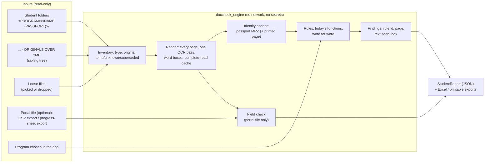

# Draft: the Document Checker app's checking engine and report content

Draft for the owner, 5 Oct 2026. It covers one angle of the desktop "Document Checker" app: **the checking engine and what the report says, with no bot, no portal login and no password.** The screens and the GPU/CPU tuning are covered by the other drafts. Nothing has been built, run or installed.

- Every claim about today was read from the staging clone `C:/Hangeul/JARVIS/socials/repo` (commit `8317741`, the code the live bot runs). `path:line` is relative to that clone. Short forms: `dv` = `src/verify/doc_verifier.py`, `pc` = `src/verify/page_checks.py`, `fc` = `src/verify/field_check.py`, `av` = `src/verify/auto_verify.py`, `R` = `src/verify/rules.py`, `pb` = `src/sheets/progress_builder.py`, `vd` = `src/sheets/verified_docs.py`, `ov` = `src/scraper/ocr_validator.py`.
- What `PLAN.md` sections 1-2 found about today's check still holds and is reused here. Its design (a scheduled service that feeds the bot) is **not** used.
- All names, numbers and dates in examples are placeholders such as `<STUDENT A>`, `<PASSPORT A>`, `<DATE>`.

## Summary

- **The engine** is a Python library, `doccheck_engine`, that the app calls once per student: `check(CheckSet) -> StudentReport`. It has no network code and no secrets, and it never writes into the folders it reads. It works the same on any PC. The PC only changes how fast it runs.
- **Three ways in:** student folders (one or many), loose files, and an optional portal file. **Without a portal file** the engine checks each document on its own and checks the documents against each other. The passport's MRZ, protected by its check digits, is the identity anchor. **With a portal file** that staff export themselves (the portal's CSV export, or a progress-sheet export), it also runs today's 24-field comparison. The program is chosen in the app or read from the folder path. It is never guessed.
- **The rules are copied, not rewritten.** `rules.py` is copied word for word. In `page_checks.py`, `doc_verifier.py` and `field_check.py`, every rule function stays word for word. Only the reading, the settings, the portal and the folder-listing code change. A rule-id table gives about 70 rule ids. Today's messages are kept exactly.
- **Reading:** every page of every file. The content of a shrunk file is read from its original. One OCR pass per page keeps EasyOCR's word boxes. Text is cached only when a whole file was read. Any out-of-memory error, even one that a rule's own `try` swallowed, **taints** the student, and nothing from that run is kept.
- **The report shows only the document check:** the verdict, "must fix", "to look at", the portal fields that differ (when a portal file was given), the files and checks not run and why, the pages read and the time taken. Each finding has a rule id, a page and the text it saw.
- **Proof before trust.** Gate A replays today's `results.json` on the same files and cached text, with the date pinned, and must give **0 differing rows**. Gates B-D measure the reading changes and the documents-only mode. Every changed verdict is explained before staff rely on it.
- **Size:** about **22 working days** for the engine (section 3). Gate A comes first, on day 5-6.

---

## 1. Design

### 1.1 What the engine is



**The engine's contract:**

- **Input:** a `CheckSet` with:
  - `kind`: `folder` or `files`;
  - the files, each with an optional document type chosen by staff;
  - `complete_set` (true for a folder);
  - the program and where it came from;
  - optionally one portal record and the portal file's details;
  - `as_of`: the date the date rules use;
  - `profile`: `full` or `compat`;
  - the reader settings the app's hardware layer chose.
- **Output:** one `StudentReport` (section 1.12), or `NotFinished(reason)`. In the second case nothing is stored and the app offers a retry.
- **Process:**
  - The engine runs in a worker process that the app starts. This follows the measurements: about 93 s per student in fresh 5-student processes, against up to 570 s per student in one long process.
  - The engine holds no global state across students except the OCR reader.
  - `doc_verifier.TODAY` is set before each student (today it is fixed at import, `dv:42`).
- **Guards:**
  - At start-up, a Python audit hook (`sys.addaudithook`) refuses any file opened for writing under an input root.
  - It also refuses any open of `.env`, `token.json` or `credentials.json`, and any socket connect.
  - The same hook is used in the tests.

### 1.2 How today's check depends on the portal: exact fields per check family

Today `verify_student(folder, student, program)` (`dv:1048`) is given a **portal student record**: a row of `students.php?export=csv`, fetched after a login (`pb:223-245`, URL at `pb:230`). The program comes from the same record (`dv:1129-1131`). The table lists every portal value each check reads.

| Check family (rule ids, §1.11) | Portal values read | Where in the code | What happens when the value is blank (today's code) |
|---|---|---|---|
| Required documents (`REQ-MIS`), bank minimum (`BK-MIN`), Master's income tax (`TX-WLT`, and `income_tax` is required) | `Program` → key via `program_key_of` | `dv:1058-1064`, `dv:1129-1131`, `pb:266-270`; `R:19, 78-87`; `dv:686, 899` | An unrecognised program is **checked as KLP** (`dv:1131`): the lowest bank minimum, and no income-tax requirement |
| Passport expiry (`PP-EXP`) | `Passport Expiry` (used only if exactly `YYYY-MM-DD`) | `dv:309-312` | Falls back to the latest date on the scan with a year of at least this year (`dv:313-315`) |
| Passport number on the scan (`PP-NUM`) | `Passport No` | `dv:327-331` | Rule skipped |
| Photo, "both ears" note (`PH-EAR`) | `Gender` | `dv:376-377` | Note skipped |
| NID name (`NID-NAME`) | `Father` / `Mother` / `Full Name` (the first word only) | `dv:449-464` | Rule skipped |
| Family certificate name (`FC-NAME`) | `Full Name` | `dv:551-557` | Rule skipped |
| Academic names and GPAs (`AC-NAME`, `AC-GPA`) | `Full Name`, `Father`, `Mother`, `HSC GPA`, `SSC GPA` | `dv:588-602` | Each one skipped |
| Bank account holder (`BK-HOLD`) | `Sponsor`, `Father`, `Mother`, `Full Name` | `dv:720-723, 756-762` | No sponsor → the expected holder is the **student** |
| Financial papers (`FN-SPON`, `FN-HOLD`, `FN-NAME`) | `Sponsor`, `Father`, `Mother` (+ the holder that `check_bank` put into the shared dict) | `dv:815-826, 873-883` | Uses the bank's holder |
| Birth certificate, colour, QR, Bangla, apostille, family-certificate age, NID numbers, fiscal year, notarisation | none | `dv:381-411`, `pc:138-184, 379-452` | — |
| Cross-checks (`X-NAME`, `X-DOB`, `X-PNO`, `X-AFF`) | `Full Name`, `Father`, `Mother`, `DOB` (only if `YYYY-MM-DD`), `Passport No` | `dv:961-1031` | Each one skipped |
| Field check (24 fields) | Every `SOURCES` field through `build_row`: Full Name, Surname, Given Name, DOB, Gender, District, Address, Father, Mother, SSC Year/GPA/Group/School, HSC Year/GPA/Group/College, CGPA, Previous University (both Master's only), Passport No, Passport Expiry, Passport Issue, Guardian WhatsApp, Sponsor Occupation. Also `Program` and `Intake` (`fc:183-184`) | `fc:39-56, 182-218`; `pb:61-98, 308-350` | `BLANK` |
| Passport issue date (field check) | The CSV column `Passport Issue Date` when the export has it, else the bot's `data/passport_issue.json` cache | `pb:318-329`; `fc:133-137` (expiry fallback reads the raw key `Passport Issue`, then the cache); `fc:164-179, 209-216` (cache age, 26 h downgrade) | — |
| Queue and fingerprints (`auto_verify`) | `Passport No` (key), `Full Name`, every key of the record, the issue cache | `av:120-133, 154-164, 284-285` | A folder with no portal record is **never checked** (`av:158`) |

Two more ties:

- Importing `doc_verifier` imports `src.config`, whose `Settings()` reads the bot's `.env` at import time (`dv:34`, `src/config.py:141-147`). So today the check cannot even load without the portal password entering the process.
- `page_checks` does the same (`pc:16, 295`).

### 1.3 Ways in

| Input | What the engine does |
|---|---|
| **One or more student folders** | One `CheckSet` per folder (`complete_set = true`). A folder is a student folder when it holds files. A folder that holds sub-folders is treated as a program folder or a root and expanded one or two levels, as `student_folders` does (`dv:1100-1117`). That regex (`dv:1114`) is kept to read the passport in the trailing parentheses. Unlike today, **a folder with no parentheses is still checked**: the identity comes from the MRZ. Today such a student is never checked. |
| **Loose files** | One `CheckSet` for the pick (`complete_set = false`, unless staff tick "this is the student's full set"). The type of each file comes from `classify(name)` (`dv:1036-1045`). If no pattern matches, staff choose the type in the app, and the report says "type set by staff". |
| **Portal file** (optional) | One import per session, matched to each `CheckSet` (section 1.5). |
| **Program** | Section 1.6. |

### 1.4 Mode A: documents only (no portal file)

**The identity anchor** is built from the passport file before any rule runs. It is an ordinary dict with the portal's key names, so the rule functions stay word for word. Each value carries its source.

| Key the rules read | Source in documents-only mode, in order of trust | Trust shown in the report |
|---|---|---|
| `Passport No` | The MRZ line-2 number when **its raw read** agrees with its check digit (`ov:265-292`). The check-digit "repair" in `_repair_doc_number` (`ov:248-262`) is **not** accepted alone, because that is PLAN problem 15. A repaired number counts only when the printed number (`visual_passport_no`, `ov:511-516`) or the folder name gives the same number. | "MRZ check digit" / "MRZ + printed page" / "folder name only" |
| `Passport Expiry` | The MRZ expiry when `expiry_ok` (`ov:278-280`), as `YYYY-MM-DD` | MRZ check digit |
| `DOB` | The MRZ date of birth when `dob_ok` | MRZ check digit |
| `Full Name` | MRZ line 1 as `<given names> <surname>` (passport order), only when the MRZ is `valid` and `line1_conf >= 0.3` (`ov:45, 371`). Otherwise the folder name without its parentheses. | "MRZ" / "folder name only" |
| `Gender` | MRZ sex (`ov:273, 288`). No check digit covers it. It is used only by the `PH-EAR` note. | MRZ, no check digit |
| `Father`, `Mother` | The passport's printed page: `parse_visual_text_lines` (`ov:422-535`), only when the labelled line was found | OCR only, no check digit |
| `Sponsor` | Inferred from the bank file: `FATHER` if the father's name tokens are in it, else `MOTHER` if the mother's are, else blank (so the expected holder is the student). The report says "sponsor inferred from the bank file". | inferred |
| `HSC GPA`, `SSC GPA` | none | — |

The MRZ is read by the pure functions lifted from the passport watcher (`ov:87-125, 190-372`), fed with the engine's own OCR words and boxes for the passport pages, at every rotation the reader tried. **Not reused:**

- `get_ocr_reader`, which is CPU-only (`ov:79`);
- `load_passport_image`, which **writes `<name>_extracted.jpg` next to the scan** (`ov:133-145`) and so must never run on a student folder;
- `read_passport_scan`, which has its own reader.

**What each rule does in documents-only mode:**

| Behaviour | Rules |
|---|---|
| **Runs exactly as today** (needs no portal value) | `BC-*`, `NID-NOT`, `NID-PAD`, `NID-NUM`, `FC-AGE`, `FC-ISS`, `FC-NOT`, `FC-IDS`, `AC-QR`, `AC-ORD`, `AC-FOL`, `AC-UNR`, `AC-ONE`, `AC-SUB`, `AC-SIDE`, `AC-PRO`, `AC-NOT`, `BK-MIN` (program), `BK-USD`, `BK-SEAL`, `BK-AGE`, `BK-DATE`, `BK-ONE`, `FN-KIND`, `FN-FY`, `FN-AGE`, `FN-NOT`, `FN-TIN`, `TX-*`, `SC-*`, `PH-*` except `PH-EAR`, `REQ-MIS` (complete sets only) |
| **Runs on the anchor instead of the portal** (a better source for dates and numbers) | `PP-EXP` (MRZ expiry; PLAN problem 9), `X-DOB`, `X-NAME`, `FC-NAME`, `AC-NAME`, `PH-EAR`, `X-AFF` |
| **Runs, but its meaning narrows**, which the report says | `NID-NAME`: the parent's name now comes from the passport, so the "on the passport" half is automatic and the rule becomes "the passport's name for this parent is on this NID". `BK-HOLD`: "the account is in the student's, father's or mother's name". `FN-HOLD` / `FN-NAME`: "the trade licence or TIN is in the same name as the bank account". |
| **Not run, and listed under "checks not run"** | `PP-NUM` and `X-PNO` (the number would be compared with the scan it came from); `AC-GPA` (needs the portal's GPAs); `FN-SPON` (needs the portal's Sponsor); the whole field check (needs portal values) |

**New documents-only checks.** In v1 they can only FLAG or NOTE, never FAIL.

| Id | Level | When |
|---|---|---|
| `ID-SRC` | NOTE | Always in documents-only mode: where each identity value came from |
| `ID-MRZ` | FLAG | A passport file is present, but no MRZ was read, or its check digits fail. The identity then rests on the folder name. |
| `ID-FOLD` | FLAG | The passport number in the folder name differs from a check-digit-valid MRZ number. Either the wrong folder or a portal typo. |
| `X-AFF` guard | FAIL → FLAG | When `Full Name` came from the folder name, an `X-AFF` FAIL is shown as FLAG, with "the applicant's name was not read from the passport". This is the only FAIL that rests on an identity value. |

**Partial sets (loose files):**

- `REQ-MIS` is not run. The verdict line reads "verdict for these files only, not a full set".
- If no passport is among the files, the rules that need it (`BC-DOB`, `NID-NAME`, `X-*`) are listed as "not run: no passport among these files". Today's code would instead FLAG "no passport on file" (`dv:397`, `dv:459`).

### 1.5 Mode B: compare with a portal file (never a login)

**Accepted files.** Staff export these themselves. The app never touches the network.

| File | How staff get it | Columns used | Notes |
|---|---|---|---|
| **Portal CSV export** (recommended) | While logged in to the portal in their own browser, open the export the bot uses (`students.php?export=csv`, `pb:230`) and save the file | The raw portal names the rules read (§1.2), plus `Program`, `Intake`, `Sponsor`, `Gender`, `Passport Issue Date` | Exactly what today's rules receive, so this is the file Gate A uses. Recognised by a `Full Name` header and a `Passport No` header (the bot's own test, `pb:238`). |
| **Progress-sheet export** (XLSX or CSV downloaded from the program's sheet) | From the sheet the bot builds | Headers are the `COLUMNS` sheet names (`pb:61-98`). `Passport Issue` is the issue date. `Program` is present. `Sponsor` is present. | Values are already normalised by `build_row` (`pb:332-350`). Normalising them again changes nothing, so the **field check** gives the same results. But `PP-EXP` and `X-DOB` see an ISO date even where the raw portal value was not ISO. So **document** verdicts can differ from a CSV import for those two rules, and the report says "portal values from a progress sheet". |
| `portal_snapshot.json` | Only if PLAN's D2 is ever built | as PLAN 4.2 | optional |

**What the importer does:**

1. It reads the file into memory and keeps **only** the columns in §1.2. It never copies the file into the app's data. Its SHA-256 hash, its name and its time are recorded in each report (the file's modified time is taken as the "exported at" time and shown).
2. It matches each `CheckSet` to a row:
   - first by the passport in the folder name, upper-cased, as `dv:1114-1116` and `dv:1124-1125` do;
   - then by a check-digit-valid MRZ number;
   - then by full name plus date of birth.

   The report says which match was used. If two rows share a number (a placeholder such as "PENDING" is shared, `src/sheets/passport_issue.py:10-12`), the match is **ambiguous**: staff choose the row, and the engine never picks one.
3. It sets the record key `Passport Issue` to the issue date found in the file, from `Passport Issue Date` or the sheet's `Passport Issue`. `check_field`'s expiry fallback (`fc:133-137`) then finds it without the bot's cache.
4. The 26-hour rule stays (`fc:161, 209-216`). It now measures **the portal file's age** instead of the cache's age. A `DIFFERS` on Passport Issue from a file older than 26 hours becomes `UNREADABLE`, with the text "export a fresh portal file" (in the `compat` profile, today's text is kept).
5. In portal mode, the document rules get the record **exactly as imported**, so they behave as today. The MRZ anchor is still read and shown in the report header, so staff see "portal says / passport MRZ says" side by side. The 24-field comparison is today's `check_field`, unchanged.

### 1.6 Program

| Source | How | Priority |
|---|---|---|
| Chosen in the app (for one student or a whole batch) | Dropdown: KLP / EAP / BACHELOR / MASTER | 1 |
| Portal file | `program_key_of(record)` (`pb:266-270`) | 2 |
| Folder path | The name of the student folder's parent, tested with `program_matches` against each program's `match_tokens` (`pb:204-206, 108-133`). The download names program folders with these same names (`vd:83-88`). `OTHER PROGRAMS` matches none. | 3 |

- If no source gives a program, the student is **not checked** until staff choose one. This replaces today's silent KLP default (`dv:1131`).
- If two sources disagree and none was chosen in the app, staff are asked.
- If staff chose a program, the report shows `PRG-SRC` (NOTE): "folder says X, portal file says Y, checked as Z".
- The program decides the required documents (`R:78-87`), the bank minimum (`R:19`), the Master's income-tax rule (`dv:899`) and the university fields of the field check (`pb:100, 308-315`).

### 1.7 The clean library: what changes and what stays word for word

**Package layout** (in the app's own repository, outside the GitHub staging tree):

```
doccheck_engine/
  rules.py           copy of src/verify/rules.py, unchanged (all 134 lines)
  page_checks.py     copy; 3 seams (settings, page cap, renderer)
  doc_verifier.py    copy; rule functions unchanged; reading, settings and folder code replaced
  field_check.py     copy; check_field unchanged except one expression; check_student re-plumbed
  portal_columns.py  pure helpers copied from progress_builder (no Google folder ids, no login)
  mrz.py             pure MRZ and printed-page functions copied from ocr_validator
  reader.py          NEW: page reader, word boxes, originals, complete-read cache, resource taint
  inventory.py       NEW: files -> types, originals, temp/unknown/superseded/duplicate/locked
  identity.py        NEW: the anchor (§1.4)
  portal_import.py   NEW: §1.5
  ids.py             NEW: rule-id table, severities, fix actions, evidence recipes
  findings.py        NEW: Finding objects, locator, measurements, folding
  engine.py          NEW: check(CheckSet) -> StudentReport; the verify_student variant
  report.py          NEW: report model, JSON schema, Excel export through today's writers
  replay.py          NEW: Gates A-D
  selftest/          NEW: synthetic test pages (no student data) and expected findings
```

**`rules.py`:** everything stays word for word, including the unused constants (`R:16, 28-29, 34-36, 52, 111-112`).

**`doc_verifier.py`:**

| Lines | What | Change |
|---|---|---|
| 44-45, 153-1032 (except as noted), 1036-1045, 1089-1096 | Verdict constants; `norm`, `notarised`, `has_any`, `find_dates`, `money_value`, `find_money_taka`, `months_between`; **every `check_*`**, `nid_numbers`, `issue_date`, `document_date`, `statement_date`, `current_fiscal_year`, `taxpayer_name`, `proprietor_name`, `is_tin`, `CHECKS`, `name_tokens`, `readable`, `name_in`, `cross_checks`, `classify`, `student_verdict`; also the dead `looks_like_statement` and `opening_balance` | **Word for word.** The page caps in rule bodies (`dv:474` 8 pages, `dv:731` 10 pages) stay as written. The new `read_pages` decides what they mean per profile (below). |
| 34, 40-41 | `from src.config import settings`; `DOCS_ROOTS`; `REPORT_DIR` | Replaced by an engine config object. No `.env` is read. |
| 42 | `TODAY = dt.date.today()` | The line stays as a default. The engine assigns `doccheck_engine.doc_verifier.TODAY = as_of` before each student. Rule bodies read the module global when called (`dv:248, 274, 313-317, 520-532, 540, 714, 768, 851`), so no body changes. |
| 49-61 | `_ocr_reader` | Delegates to `reader.py`: the device chosen by the app, the model folder shipped with the app, downloads off. |
| 64-89 | `_ocr_image` | Moves to `reader.py`. It keeps the 300-character threshold and the rotation order (counter-clockwise, clockwise, 180). It calls `readtext(..., detail=1)` and joins the texts with a space, which gives the same string as `detail=0`, and keeps the boxes and confidences. **Resource errors are no longer skipped** in the rotation loop (`dv:79-82`). |
| 92-119, 122-150 | `read_pages`, `read_document` | Thin wrappers with the **same signatures** over one reader (§1.8). So `check_nid`, `check_bank`, `check_academic`, `verify_student` and the field check call them unchanged. |
| 1048-1086 | `verify_student` | Replaced by `engine.verify_student`. Same loop order (`REQUIRED[program] + OPTIONAL`, `dv:1058`), same shared `texts` dict, same row shape. Differences: (a) the file list comes from the inventory instead of `iterdir` (`dv:1050-1054`); (b) each finding list is tagged with its source (checker / colour / QR / Bangla) so rule ids are unambiguous; (c) resource errors are not turned into the FLAG "could not read the file" (`dv:1066-1071`); (d) evidence is recorded; (e) `REQ-MIS` is skipped for partial sets. In the `compat` profile its rows are byte-identical to today's. |
| 1100-1131 | `student_folders`, `portal_students`, `program_of` | Removed. Replaced by `inventory.py`, `portal_import.py` and the program resolver (§1.6). |
| 1134-1241 | `write_report`, `run`, `main` (command line) | Removed. |

**`page_checks.py`:**

| Lines | What | Change |
|---|---|---|
| 40-184, 268-291, 298-452 | `is_digital`, `_clean_code`, `inspect`, `colour_check`, `qr_check`, `bangla_check`, `seal_present`, `apostille_subject`, `APOSTILLE_HOSTS`, `LEVELS`, `page_codes`, `level_of`, `academic_check` | **Word for word.** |
| 16, 295 | `settings` import; `APOSTILLE_SUBJECTS` path | Path taken from the engine config. The file has no writer anywhere (`pc:295-311`), so `AC-SUB` stays dormant, as today. |
| 20-37 | `_pages(path, dpi=250, max_pages=4)` | Body replaced by the engine's renderer: the same dpi, rendered from the content file, with renders shared between `inspect` and `page_codes` (both 250 dpi, so the pixels are identical). `max_pages=4` stays in the signature. The renderer maps it through the profile: `compat` keeps 4, `full` reads every page up to the cap. |
| 327 | `page_codes(path, max_pages=20)` | Default mapped through the profile in the same way. One seam line: `max_pages = cap(max_pages)`. |
| 187-265 | `passport_seal_check`, `annotate` (dead code; `annotate` writes a PNG) | Dropped from the library. |

`is_digital` keeps its "first 4 pages" rule (`pc:55`) in both profiles. A per-page version would be a rule change, not a reading change.

**`field_check.py`:**

| Lines | What | Change |
|---|---|---|
| 36-131, 138-158, 161 | Result constants, `SOURCES`, field sets, `_ocr_variant`, `_docs_for`, `_validity_consistent`, `check_field` (except 133-137), `ISSUE_CACHE_MAX_HOURS` | **Word for word.** `pb.normalize_date` is served by `portal_columns.py` (a copy of `pb:138-171`). |
| 133-137 | Issue date for the expiry fallback, read from `passport_issue.load()` | One expression: `student.get("Passport Issue", "")` only, filled by the importer (§1.5). The bot's cache is never read. |
| 164-179 | `issue_cache_age_hours` | Becomes the portal file's age in hours. |
| 182-218 | `check_student` | `columns_for(PROGRAMS[program])` replaces `pb.target(..., Intake)` (`fc:184`; the intake never changes the columns). It takes the engine's texts, built from the same pages as the document check, instead of reading every file again (`fc:188-198`). In `compat` the texts keep today's titles, unknown files included (stem as title, `fc:192`). The `BLANK` and 26-hour logic stay. |
| 28-32, 221-302 | Imports of `progress_builder` and `doc_verifier` helpers; `write_report`; `main` | Imports point to the library. The command line is removed. |

**Import fence (an acceptance test):**

- Importing `doccheck_engine` must not import `src.*`, `pydantic_settings`, `httpx`, `telegram`, `googleapiclient` or `supabase`.
- A full check of a synthetic student must pass with every socket connect raising.
- No `.env`, `token.json` or `credentials.json` may be opened.

### 1.8 Reading: every page, originals, one pass, boxes, complete reads only

**Content file vs submitted file:**

- The download shrinks every file over 2 MB:
  - PDFs are re-rendered as JPEG pages, 1754 px long side at quality 70, down to 950 px at quality 45 (`vd:249-274`);
  - images are cut to 1300-2400 px and saved as JPEG, and **a `.png` becomes `.jpg`** (`vd:277-289, 320`).
- The untouched file is copied first to `BACKUP_ROOT / <same relative path>` (`vd:316-319`). The default root is the sibling `... - ORIGINALS OVER 2MB` (`src/config.py:104-106`).
- The inventory looks there, in the same `<PROGRAM>/<NAME (PASSPORT)>/` sub-path, for the same name (or the same stem with `.png` for a `.jpg` copy).
- When the folder was picked from somewhere else, it looks for a sibling `<root> - ORIGINALS OVER 2MB`.
- The original is used **for content** (text, QR, colour, seal, apostille order, MRZ) only when its page count equals the copy's. Shrinking keeps one page per page (`vd:257-267`). Otherwise the copy is used, and the "files" section says why.
- **Format and photo rules** (`PH-*`, including `PH-FMT`'s JPG rule) are judged on the **submitted copy**, the file staff will send.
- With the original, a computer-made bank PDF keeps its text layer, so `is_digital` (`pc:40-65`) sees it. The shrunk copy loses that layer and is wrongly held to the colour rule. This is PLAN problem 6.

**Profiles.** The `compat` profile exists only to prove parity. Staff use `full`.

| | `compat` (today's reads) | `full` (the app's default) |
|---|---|---|
| Whole-file text (`read_document`) | First 6 pages (`av:191`). Text layer if more than 80 characters, else OCR at 150 dpi (`dv:142-148`). | Every page up to the cap (D-E9: 40, with `READ-PART` above it) |
| Per-page text (`read_pages`) | 8 / 10 / 20 pages as called (`dv:474, 731, 92`). Text layer if at least 40 characters, else OCR at 200 dpi (`dv:108-115`). | Every page. **One OCR pass per page at 200 dpi serves both views.** Whole-file text = the page texts joined with `\n`, layer used when more than 80 characters. |
| Image checks (`_pages`, `page_codes`, `seal_present`) | 4 / 20 / 4 pages (`pc:20, 327, 275`) | Every page up to the cap |
| Rotation retry on `.jpg`/`.png` files | none (`dv:96-97, 127-131` OCR the path directly) | Same retry as PDF pages |
| OCR of the photo file | Yes (`dv:1067`; its text can reach the `X-PNO` detail, because `dv:1012` scans every key) | No. The photo rules never use its text. |
| Content file | The folder copy | The original when present (above) |

On a typical scanned NID, bank or academic file, `full` usually does **fewer** OCR passes than today. Today those pages are read twice: once at 150 dpi for the whole-file text, and once at 200 dpi page by page (`dv:145` and `dv:110`).

**What the reader keeps for each page:**

- the text and its source (`layer` or `ocr`);
- the rotation used;
- the EasyOCR segments `[text, confidence, x0, y0, x1, y1]`, turned back into the stored page's pixel coordinates at 200 dpi. For text-layer pages these are PyMuPDF word boxes, in points × 200/72.
- the render size;
- whether the page stayed under 300 characters after the rotation retry.

EasyOCR gives a box per text segment, usually a few words. The highlight is drawn on the segment.

**Cache only complete reads:**

- The key is the content's SHA-256 + the page number + the reader version + the profile + the dpi + the device class (`cuda`/`cpu`). Today's key is name:size:mtime:max_pages (`av:195, 215`).
- So the same file copied to a USB stick or another folder is a cache hit, and a changed file never is.
- A file's pages are written in **one SQLite transaction**, only after every page returned.
- A page that fails for a **content** reason (a broken page stream, an unsupported image) is recorded as "unreadable page: <reason>" inside a complete read. It is permanent and safe to cache.
- A **resource** failure is never cached: CUDA out-of-memory, any `RuntimeError` naming CUDA or memory, `MemoryError`, or the worker being killed.

**Resource taint.** Today many places swallow every exception, out-of-memory errors included:

- the rotation retry (`dv:79-82`);
- the NID and bank page reads (`dv:474-476, 731-733`);
- the academic check (`dv:576-577`);
- `inspect` (`pc:89-96, 112-131`);
- `seal_present` (`pc:274-277`). There, an error returns "no seal", so a memory error can become a notarisation **FAIL**.
- the field check (`fc:193-197`);
- the file read in `verify_student` (`dv:1066-1071`). A failed first read is stored as final.

Rather than edit those rule bodies:

1. The reader and the renderer record every resource error in the student's context **before** raising it.
2. After `verify_student` and the field check, a tainted context means the result is dropped, nothing is cached for the affected files, and the engine returns `NotFinished("GPU memory ran out on <FILE> page N")`.
3. The app retries (its tuning layer may switch to the CPU), and the report is only ever made from a clean run. This answers PLAN problem 3.

**The pixel contract with the tuning layer.** The hardware layer may change *how fast* the engine runs, never *what it reads*:

- **Fixed:** the render dpi (150 / 200 / 250); EasyOCR `lang=['en']`, `canvas_size` 2560, `mag_ratio` 1, `paragraph=False`, the greedy decoder; the 300-character retry; the text-layer thresholds.
- **Free:** the device, batch size, worker count, CPU threads, and how many students per worker process. Gate B checks that these do not change the text.
- Lowering the image size to save VRAM would change the text. It needs a new reader version and a fresh Gate B.
- The report records the device used for each page, because EasyOCR on the CPU can give slightly different text from the GPU (risk R7).

### 1.9 File inventory: nothing is skipped silently

Every file under the input appears **exactly once** in the report's `files` list, either "checked" or "not checked" with a reason. This is an invariant test.

| Case | Detection | In the report | Effect on the verdict |
|---|---|---|---|
| Recognised type | `classify(name)` (`dv:1036-1045`, `R:56-74`) | checked | as today |
| Unrecognised name | no pattern | "not checked: name not recognised (reads like: <type>)". The hint scores the file's text against `R` keyword lists and the MRZ shape. Staff can set the type and re-run. | none (today the doc check ignores it and the field check reads it, `fc:188-198`) |
| Download in progress | `*.part` (`vd:321, 389`) | "not checked: unfinished download" | none; the app suggests re-checking later |
| Marker | `.download_complete` (`vd:239`), hidden files | not listed (as today, `dv:1051`) | — |
| Superseded upload | The marker lists the portal's current file names (`vd:63-64, 395-396`; the names carry the upload time). A file of a type that has a newer listed file, and is itself not listed. | "older upload, replaced on the portal" | D-E4. Until name matching is confirmed: checked, and labelled. |
| Same content twice | same SHA-256 | the second is "not checked: same as <FILE>" | none |
| Password-protected PDF | `doc.needs_pass` | "not checked: password-protected" + `FILE-ERR` FLAG | FLAG, as today's "could not read the file" |
| Corrupt or unopenable | open fails | `FILE-ERR` FLAG | as today (`dv:1069-1071`) |
| Unsupported type (`.docx`, `.heic`, `.zip`) | extension | "not checked: file type not supported" | none. A required type with only such a file is still `MISSING`, and the report names the file. |
| Over the page cap | page count above 40 | `READ-PART` FLAG "pages 41-N not read" | FLAG |
| Original not used | page count differs | noted on the file | none |

### 1.10 Findings: rule id, page, the text seen

**A finding** (JSON):

```json
{
  "id": "f-3c9a…",                         // sha1(rule_id | file sha256 | page | value key): stable across re-runs
  "rule_id": "AC-ORD",
  "level": "FAIL",                          // PASS / FLAG / FAIL / NOTE, exactly as today's rule returned it
  "group": "must_fix",                      // must_fix (FAIL, MISSING) / to_look_at (FLAG) / note (NOTE) / passed
  "pinned": true, "trial": false,           // from the severity table below
  "doc_key": "academic", "doc_title": "07 Academic Certificate & Transcript",
  "file": "<FILE>", "read_from": "original",
  "pages": [1, 3],
  "message": "<today's text, unchanged>",
  "action": "Re-assemble the academic file: e-Apostille first, then the certificate and transcript it covers",
  "evidence": [
    {"page": 3, "kind": "qr",   "text": "<first 52 characters of the apostille link>", "box": [x0, y0, x1, y1], "conf": null},
    {"page": 1, "kind": "page", "text": "<first 120 characters read on page 1>",       "box": null,             "conf": 0.91}
  ],
  "folded": [ { "rule_id": "AC-FOL", "level": "FLAG", "pages": [6], "message": "…" } ]
}
```

**How ids are given without touching rule bodies:**

- The engine's `verify_student` knows which list each tuple came from: the document checker, `colour_check`, `qr_check` or `bangla_check` (`dv:1074-1080`).
- Inside a checker's list, the id comes from `(doc_key, level, message pattern)` in `ids.py`. The same wording, such as "notarised (wording or seal found)", is told apart by the document.
- Cross-check rows map by their `doc` label (`dv:985-1031`).
- A tuple that maps to **no** id, or to two, stops the run as a code fault, in the same spirit as today's stop on `NameError` and its kind (`av:492-500`).

**Severity table** (`ids.py`):

- The level is still decided inside the rule body. The table only documents the expected levels.
- A test fails the build if a rule ever returns a level the table does not allow.
- **Pinned:** `AC-ORD` = FAIL (owner decision 18).
- **Trial, stays FLAG until the owner says otherwise:** `BK-DATE` (`dv:737-742`) and `AC-ONE` (`pc:432-439`) (owner decision 7).
- No screen in the app can change a severity.

**Evidence recipes** (per rule family):

| Kind | Rules | How the page and box are found |
|---|---|---|
| Value located | Dates (`PP-EXP`, `FC-AGE`, `BK-AGE`, `BK-DATE`, `BC-DOB`, `FN-AGE`, `X-DOB`), amounts (`BK-MIN`, `TX-*`), numbers (`NID-NUM`, `FN-FY` year), names (`*-NAME`, `*-HOLD`, `X-NAME`) | The value in the message is searched line by line (segments grouped into lines with `ov:196-211` `_rows`) using **the same parser the rule used**: `find_dates`, `find_money_taka`, `nid_numbers` or name tokens. The first matching line gives the page and box. Marked "first place this value was read". |
| Page-native | `AC-ORD`, `AC-FOL`, `AC-ONE`, `AC-UNR`, `AC-SIDE`, `NID-NUM` conflict, `BK-DATE`, `BK-ONE` | The page numbers come from the rule's inputs (apostille page indexes from `page_codes`, `pc:383-385`; the bank's page 1 and the statement page) |
| Measurement | `SC-COL` (coloured-pixel % per page; the page with the highest value), `SC-QR` / `AC-QR` (codes per page), seal (largest violet or red blob share per page, compared with 0.08 % / 0.15 %, `pc:285`), `PH-*` (pixel size, ratio, background RGB, contrast) | Sibling "measure" functions repeat the rule's arithmetic and return the numbers per page. A test checks on the replay set that the measured numbers imply the rule's own decision every time. |
| Absence | `*-NOT`, `BC-ONL`, `BK-USD`, `BK-SEAL`, `AC-QR` "no e-Apostille" | No box. The evidence says which pages were searched, which words were looked for (the `R` list), the best seal measurement, and that both QR decoders ran. |

**Folding:** an `AC-FOL` FLAG on the same file as an `AC-ORD` FAIL is shown under it as "same cause" and not counted separately. PLAN counted 47 `AC-ORD` FAILs and 57 `AC-FOL` FLAGs.

### 1.11 Rule-id catalogue

The "Code" column is today's location. "Doc-only" is the behaviour from §1.4. The "Action" is the fix shown under "must fix", given only for rules that can FAIL or be MISSING.

| Id | Document | Levels today | Code | Portal value | Doc-only | Action when it fails |
|---|---|---|---|---|---|---|
| PP-EXP | 01 Passport | FAIL / PASS / FLAG | `dv:309-326` | Passport Expiry | MRZ expiry | Renew the passport (at least 12 months must remain) |
| PP-NUM | 01 Passport | PASS / FLAG | `dv:327-331` | Passport No | not run | — |
| PH-OPEN, PH-RAT, PH-RES, PH-CON | 02 Photo | FLAG (PASS) | `dv:340-352, 369-373` | — | same | — |
| PH-BG | 02 Photo | PASS / FAIL | `dv:353-368` | — | same | New photo with a white background |
| PH-FMT | 02 Photo | FAIL | `dv:374-375` | — | same (the submitted copy) | Provide the photo as JPG |
| PH-EAR | 02 Photo | NOTE | `dv:376-377` | Gender | MRZ sex | — |
| BC-ONL, BC-ENG | 04 Birth | PASS / FLAG | `dv:383-386, 389-391` | — | same | — |
| BC-NOT | 04 Birth | PASS / FAIL | `dv:387-388` | — | same | Get the birth certificate notarised |
| BC-DOB | 04 Birth | PASS / FLAG / FAIL | `dv:392-410` | — (passport text) | same | Compare the birth date with the passport; correct the certificate if it really differs |
| NID-NOT | 03 / 05 NIDs | PASS / FAIL | `dv:442-443` | — | same | Get the NID copy notarised |
| NID-PAD, NID-NUM | NIDs | PASS / FLAG / NOTE | `dv:444-445, 471-509` | — | same | — |
| NID-NAME | NIDs | PASS / FLAG | `dv:449-464` | Father / Mother / Full Name | narrows | — |
| FC-AGE | 06 Family | PASS / FAIL / FLAG | `dv:538-546` | — | same | Get a family certificate issued within the last 3 months |
| FC-ISS, FC-IDS | 06 Family | PASS / FLAG | `dv:547-548, 558-560` | — | same | — |
| FC-NOT | 06 Family | PASS / FAIL | `dv:549-550` | — | same | Get it notarised through an advocate |
| FC-NAME | 06 Family | PASS / FLAG | `dv:551-557` | Full Name | MRZ name | — |
| AC-QR | 07 Academic | PASS / FAIL | `pc:386-399` | — | same | Re-scan so the apostille QR reads, or apostille through mygov.bd |
| AC-ORD | 07 Academic | FAIL, **pinned** | `pc:404-407` | — | same | Re-assemble: e-Apostille first, then its certificate and transcript |
| AC-FOL | 07 Academic | FLAG (folded under AC-ORD) | `pc:420-423` | — | same | — |
| AC-UNR, AC-SIDE | 07 Academic | NOTE | `pc:424-428`; `dv:572-575` | — | same | — |
| AC-ONE | 07 Academic | FLAG, **trial** | `pc:432-439` | — | same | — |
| AC-SUB | 07 Academic | PASS / FAIL (dormant) | `pc:442-451` | — | same | Use the certificate the apostille was issued for |
| AC-ERR | 07 Academic | FLAG | `dv:576-577` | — | same | — |
| AC-PRO | 07 Academic | FAIL | `dv:583-584` | — | same | The original certificate is needed, not the provisional one |
| AC-NOT | 07 Academic | PASS / FLAG | `dv:585-586` | — | same | — |
| AC-NAME | 07 Academic | PASS / FLAG (×3) | `dv:588-595` | Full Name, Father, Mother | anchor | — |
| AC-GPA | 07 Academic | PASS / FLAG (×2) | `dv:596-602` | HSC GPA, SSC GPA | not run | — |
| BK-MIN | 08 Bank | PASS / FAIL / FLAG | `dv:686-696` | Program | program | A balance of at least <minimum> BDT is needed for <PROGRAM> |
| BK-USD, BK-SEAL, BK-AGE, BK-ONE | 08 Bank | PASS / FLAG | `dv:698-719, 752-754` | — | same | — |
| BK-DATE | 08 Bank | PASS / FLAG **trial** / NOTE | `dv:728-751` | — | same | — |
| BK-HOLD | 08 Bank | PASS / FLAG | `dv:720-723, 756-762` | Sponsor, Father, Mother, Full Name | narrows | — |
| FN-SPON | 09 Financial | FLAG | `dv:815-818` | Sponsor | not run | — |
| FN-HOLD, FN-NAME | 09 Financial | PASS / FLAG | `dv:819-826, 873-883` | Sponsor, Father, Mother | narrows | — |
| FN-KIND, FN-AGE, FN-TIN | 09 Financial | PASS / FLAG | `dv:827-832, 847-854, 885-891` | — | same | — |
| FN-FY | 09 Financial | PASS / FAIL / FLAG | `dv:833-846` | — | same | Renew the trade licence for fiscal year <current> |
| FN-NOT | 09 Financial | PASS / FAIL | `dv:855-857` | — | same | Get the trade licence notarised |
| TX-WLT, TX-PAID, TX-NOT | 09.1 Income tax | PASS / FLAG | `dv:899-907` | Program | same | — |
| SC-COL | every file except the photo | PASS / NOTE / FLAG / FAIL | `pc:138-153` | — | same | Ask for a clear colour scan |
| SC-QR | every file except the photo | PASS / FLAG | `pc:156-172` | — | same | — |
| SC-BN | every file except the photo | FLAG / FAIL | `pc:175-184` | — | same | Attach an English translation on a lawyer's pad |
| DOC-PRES | documents with no rule | PASS | `dv:1073-1075` | — | same | — |
| FILE-ERR | any | FLAG | `dv:1066-1071` | — | content errors only | Ask for a readable copy of <FILE> |
| REQ-MIS | required | MISSING | `dv:1060-1064` | Program | complete sets only | Upload the <document> |
| X-NAME, X-DOB | cross-check | PASS / FLAG | `dv:961-1008` | Full Name, Father, Mother, DOB | anchor | — |
| X-PNO | cross-check | PASS / FLAG | `dv:1010-1015` | Passport No | not run | — |
| X-AFF | cross-check | PASS / FLAG / FAIL | `dv:1017-1031` | Full Name | anchor + guard | The affidavit must be in the applicant's name |
| ID-SRC, ID-MRZ, ID-FOLD, PRG-SRC, READ-PART | new | NOTE / FLAG | — | — | new | — |

Field-check results keep today's five values: `MATCH`, `DIFFERS`, `UNREADABLE`, `NO DOCUMENT`, `BLANK`. They are shown in their own section, with the id `FLD-<field>`, and as today they never change the student verdict.

### 1.12 Verdicts and the report content

**Verdicts are unchanged:**

- A row's verdict is its worst finding (`dv:1081-1082`). A missing required document gives `MISSING`.
- The student's verdict is INCOMPLETE, then FAIL, then REVIEW, then PASS (`dv:1089-1096`).
- A partial set never gets INCOMPLETE and is labelled "these files only".
- A tainted run gets **no** verdict.

**The student report.** These sections are fixed. The app's screens render them, and the printable or exported copy uses the same order.

1. **Header:**
   - student (identity value and its source), passport number, program and its source;
   - mode ("Documents only" or "Compared with portal file `<FILE>` exported `<DATE TIME>`, matched by `<passport in folder name>`");
   - the date the date rules used;
   - rules version, engine version and profile;
   - "Rules proven equal to the bot's check on `<DATE>` (Gate A: N students, 0 differences)".
2. **Verdict line:** `FAIL — 2 to fix, 3 to look at`. In portal mode it adds ` · 1 portal field differs`. A partial set adds ` · these files only`.
3. **Must fix:** every FAIL finding and every MISSING document, ordered by document number, each with:
   - the rule id;
   - the document and file, with "(read from the original)" where true;
   - the pages;
   - today's message;
   - **what was seen**: up to 120 characters, and in the app a page thumbnail with the box drawn;
   - the action;
   - any folded findings under it.
4. **To look at:** every FLAG finding, with the same fields. Trial rules are tagged "on trial". NOTE findings follow under "Worth a glance". They are not counted.
5. **Identity** (both modes): a table of name, date of birth, passport number, expiry, sex, father and mother, each with its value and source (MRZ check digit / printed page / folder name / portal file). In portal mode a "portal says" column is added, and a difference is highlighted. The verdict does not change: it is shown, not judged.
6. **Portal fields** (portal mode only):
   - the `DIFFERS` rows (field, portal value, what the documents show, document and page);
   - counts of MATCH / UNREADABLE / NO DOCUMENT / BLANK, with the UNREADABLE fields named;
   - the 26-hour notice when it applies.

   In documents-only mode this section says "not compared: no portal file".
7. **Files not checked and why:** every "not checked" row from §1.9.
8. **Checks not run and why:** for example "AC-GPA: needs the portal's SSC/HSC GPA (no portal file)", "PP-NUM: the number was read from this same scan", "REQ-MIS: these files only".
9. **Pages read:** for each file:
   - pages in the file and pages read;
   - which pages came from the text layer and which from OCR;
   - original or copy;
   - pages turned upright, and pages still under 300 characters (likely blank or poor);
   - cache hit or fresh read;
   - the device used.
10. **Time taken:** total; inventory / reading / image checks / rules / field check; pages OCR'd and pages read from the text layer; cache hits.
11. **All checks passed** (collapsed): the PASS findings, for anyone who wants to see what was confirmed.

**Example** (placeholders):

```
DOCUMENT CHECK — <STUDENT A> (<PASSPORT A>) · BACHELOR (from folder) · documents only · as of <DATE>
Rules 2026.10-r1 · engine 1.0 · full profile · proven equal to the bot's check on <DATE> (Gate A, <N> students)
Verdict: FAIL — 2 to fix, 2 to look at

MUST FIX
 1. [AC-ORD] 07 Academic, <FILE 1> (read from the original), pages 1 and 3
    page 1 is not an e-Apostille — the first apostille is on page 3. …
    Seen: page 3, QR "<first 52 characters of the apostille link>"
    Action: re-assemble — e-Apostille first, then the certificate and transcript it covers.
    Same cause: [AC-FOL] the e-Apostille on page 6 is not followed by the certificate …
 2. [FC-AGE] 06 Family Relationship Certificate, <FILE 2>, page 1
    issued <DATE> (4 months ago) — older than the 3-month validity
    Seen: page 1, "Date: <DATE>" (OCR 0.88)
    Action: get a family certificate issued within the last 3 months.

TO LOOK AT
 3. [BK-DATE, on trial] 08 Bank, <FILE 3>, pages 1 and 3 — the solvency certificate is dated <DATE 1> but …
 4. [ID-FOLD] the folder name says <PASSPORT A>, the passport MRZ says <PASSPORT B> (check digits valid)
 Worth a glance: [AC-SIDE] page(s) 4 are scanned sideways …

IDENTITY   name: MRZ ✓ · date of birth: MRZ ✓ · passport: MRZ ✓ · expiry: MRZ ✓ · father/mother: printed page (OCR only)
PORTAL     not compared — no portal file
NOT CHECKED  <FILE 4> — name not recognised (reads like a bank statement)
             <FILE 5> — unfinished download (.part)
CHECKS NOT RUN  AC-GPA (needs the portal's GPAs) · FN-SPON (needs the portal's sponsor) · PP-NUM, X-PNO (number taken from this scan)
PAGES      11 files, 41 pages: 9 text layer, 32 OCR (2 turned upright, 1 under 300 characters); 3 files read from originals
TIME       58 s (reading 44 s on the GPU, image checks 9 s, rules 1 s); 2 files from cache
```

**Batch report** (several students):

- One line per student: name, passport, program, verdict, must-fix count, to-look-at count, fields differing, files not checked, time.
- A **"To fix" table across students**, grouped by rule id and action, with the number of students per rule. PLAN §4.7 has the same table with today's numbers.

**Exports** (when staff choose to save them; the app writes only where they choose):

- **Excel.** Today's two workbooks are written by today's writers, `write_document_report` and `write_field_report` (`av:339-449`), fed a store in `results.json` shape. A "To fix" sheet and a "Findings" sheet (one row per finding: rule id, page, text seen) are added.
- **A printable copy of each student report.**
- **The report JSON**, schema `doccheck.report/1`. It also carries `rows_compat`, today's exact `{doc, file, verdict, detail}` rows, which is what the replay compares.

### 1.13 Proving the engine gives today's verdicts

**Inputs.** The developer copies these once into a sandbox inside the app's data folder. The sources stay read-only.

- `BOT/data/verification/results.json`;
- the `text/` folder;
- `BOT/data/passport_issue.json`;
- a portal CSV export that staff save on the same day;
- the student folders, read-only, in place.

From day one of the build, rule edits in the bot are frozen, as PLAN says.

| Gate | What it proves | How | Pass bar |
|---|---|---|---|
| **A — logic parity** | The lifted rules and seams behave exactly like today | `compat` profile. **Text comes only from today's text cache**, under keys `name:size:mtime:6` and `PAGES:name:size:mtime:{8,10,20}` (`av:195, 215`). A cache miss is a harness error, never an OCR run. `TODAY` = the date of the stored `documents[p].checked`; a student checked in the first hour after midnight is also tried with the day before. Image checks re-run on the same files with the same pinned versions (`requirements.txt:13-23`). The Passport Issue staleness is taken from the stored row: if its detail has the stale-cache text, the age is set above 26 h. | **0 differing rows**, in order, on `(doc, file, verdict, detail)` and the student verdict, for every eligible student. The eligible students' FAIL / REVIEW / INCOMPLETE / PASS counts match the store. |
| A-eligibility | The portal record used then is known | (1) `doc_fingerprint(folder)` equals the stored one, so the files are unchanged (`av:114-117`). (2) `field_fingerprint(folder, csv_row + cached issue)` equals the stored one, so the record is byte-identical (`av:120-133`). (3) The document and field checks of that student come from the same `check_one` call: `checked` times within 15 minutes (`av:296, 309`). | A student failing only (2) or (3) gets **partial Gate A**: only the rules that read no portal value are compared (§1.2). |
| **B — reading parity** | The new reader reproduces today's text, and the `detail=1` join equals `detail=0` | `compat` profile, **fresh reads**, on 20 eligible students at night with the card free (B-GPU), and on 5 students on the CPU (B-CPU). Text is compared per cache key, then rows. | The joined `detail=1` text is byte-equal to `detail=0` on the same images. Every differing row traces to a differing page text, and each one is listed: old text cut short (out of memory), CPU vs GPU, and so on. B-CPU's verdicts are the same as B-GPU's, or each difference is listed for the owner. |
| **C — full vs today** | What changes when every page and the originals are read | `full` profile on every student, in one night. Old vs new verdict for each student, and rule counts old vs new. Each changed row is classed: more pages / original instead of copy / one 200-dpi pass / rotation on image files / no photo OCR / superseded or unknown handling. | **Every** change has a cause class. The owner reviews the list. Contested rules are settled on PLAN §6's hand-checked set. |
| **D — documents-only vs portal** | Mode A's effect | Same reads, from the cache, so this costs no OCR. Each student is run with and without its CSV row. | Differences only in rules that §1.4 marks as anchor, narrowed or not run, plus the new ID rules. Every FAIL difference is listed individually. FLAG counts per rule are reported. |

**After the gates:**

- Gate A runs as an automated test against the frozen sandbox **on every engine change**, on the developer's PC only.
- On each new PC, the app runs the **synthetic self-test**. These are about 12 generated pages with fictional data, and no student data:
  - an apostille-style page whose QR holds an `apostille.mygov.bd` link;
  - a black-and-white page and a page with a violet seal;
  - a sideways page;
  - an MRZ specimen with valid check digits;
  - a Bangla text-layer PDF;
  - a password-protected PDF;
  - a 2-page bank-style PDF with matching dates.

  Expected findings are fixed. The self-test also proves that pyzbar decodes (today it falls back silently, `pc:100-103, 331-334`) and that the OCR model loads with downloads off.

---

## 2. What is reused and what is new

| From | Reused as is | Reused with seams | Not reused (why) |
|---|---|---|---|
| `src/verify/rules.py` | the whole file | — | — |
| `src/verify/doc_verifier.py` | every rule and helper function, `CHECKS`, `cross_checks`, `classify`, `student_verdict` | `TODAY` (`:42`), `_ocr_reader`/`_ocr_image` (`:49-89`), `read_pages`/`read_document` (`:92-150`), `verify_student` (`:1048-1086`) | `student_folders`, `portal_students`, `program_of`, report and command line (`:1100-1241`): replaced by inventory, import and the program resolver |
| `src/verify/page_checks.py` | `is_digital`, `inspect`, `colour_check`, `qr_check`, `bangla_check`, `seal_present`, `apostille_subject`, `page_codes`, `level_of`, `academic_check` | settings (`:16, 295`), `_pages` (`:20-37`), `page_codes` cap (`:327`) | `passport_seal_check`, `annotate` (dead; `annotate` writes files) |
| `src/verify/field_check.py` | constants, `SOURCES`, `_ocr_variant`, `_docs_for`, `_validity_consistent`, `check_field` | `fc:133-137`, `issue_cache_age_hours`, `check_student` | `write_report`, `main` |
| `src/verify/auto_verify.py` | `_hash`, `_file_parts`, `doc_fingerprint`, `field_fingerprint` (replay only), `_cell`, `_style_header`, `_programs_in`, `write_document_report`, `write_field_report`, `PROGRAM_ORDER` | — | lock, store, `pending`, the monkey-patched cache, `check_one`, `run`, `summary_lines` (Telegram), `SKIP_PASSPORTS` (a hard-coded staff passport, `:55-56`; staff now pick folders, so it is not needed) |
| `src/sheets/progress_builder.py` | `COLUMNS`, `DATE_COLUMNS`, `UNIVERSITY_COLUMNS`, `PHONE_COLUMNS`, `clean_value`, `normalize_date`, `normalize_phone`, `ielts_topik`, `program_matches`, `program_key_of`, `columns_for`, `build_row` (`pb:61-206, 261-270, 308-350`) | `PROGRAMS` without Google folder ids; `issue_date_for` without the cache branch | login, fetch, Google services |
| `src/sheets/verified_docs.py` | the knowledge, not the code: originals path rule (`:316`), `.png` → `.jpg` (`:320`), `.part` (`:321, 389`), marker contents (`:63-64, 395-396`), `folder_name` and `_safe_path_part` shapes (`:91-93, 217-219`) | — | all download and Drive code |
| `src/scraper/ocr_validator.py` | `parse_mrz_date`, `compute_icao_check_digit`, `_clean_mrz`, `_rows`, `parse_mrz_line1`, `_line2_at`, `parse_mrz_line2`, `_find_mrz`, `parse_visual_text_lines`, `_levenshtein`, `_name_diff`, `compare_names` | `_repair_doc_number` (kept, but a repaired number is not trusted on its own) | `get_ocr_reader` (CPU-only), `load_passport_image` (writes into the folder), `read_passport_scan`, `validate_passport_data` (portal form data) |
| `src/config.py` | — | — | the whole file (it reads `.env` at import, `:141-147`) |

**New code:**

- `reader.py`: renders, one OCR pass, boxes, the complete-read SQLite cache, taint;
- `inventory.py`, `identity.py`, `portal_import.py`;
- `ids.py`: about 70 ids, severities, actions, evidence recipes;
- `findings.py`: locator, measurements, folding;
- `engine.py`, `report.py`: schema, Excel through today's writers, the printable copy;
- `replay.py`: Gates A-D;
- `selftest/`.

**How the engine answers PLAN's problems:**

| PLAN problem | Engine answer |
|---|---|
| 3 failed reads stored as final | complete-read cache plus taint (§1.8) |
| 5 not the whole document | `full` profile |
| 6 shrunk copy read | originals for content (§1.8) |
| 7 files go unseen | inventory invariant (§1.9) |
| 8 bare findings | ids, pages, evidence (§1.10) |
| 9 weak evidence | measured in Gate C; documents-only uses the MRZ expiry and date of birth |
| 10 accuracy unknown | Gates A-D plus the self-test |
| 13 silent pyzbar | self-test blocks the run |
| 14 portal dependence | modes A and B (§1.4-1.5) |
| 15 trusted repaired number | the anchor refuses an uncorroborated repair |

Problems 1, 2 and 4 (process, slowdown, GPU) belong to the app's process and tuning layer. Problem 11 (one dominant rule) is answered by folding and the "To fix" table.

---

## 3. Build steps

Days are working days for one developer with an AI assistant. Steps E0-E2 come first and are the critical path. Nothing is shown to staff before Gate A passes.

| Step | Delivers | Acceptance test | Days |
|---|---|---|---|
| **E0 Baseline sandbox and id table** | A read-only copy of `results.json`, `text/` and `passport_issue.json`, plus a same-day portal CSV, in the app's sandbox. Versions recorded. `ids.py` first cut. | Every finding in the stored `detail` strings, split and matched against the stored row's document, maps to **exactly one** rule id. The 144 students' verdict counts are read back (FAIL 61 / REVIEW 65 / INCOMPLETE 15 / PASS 3). | 1 |
| **E1 Extract the library** | `doccheck_engine` with the files of §1.7 and the seams; `portal_columns.py`, `mrz.py` | The import fence passes: no `src.*`, `pydantic_settings`, `httpx`, `telegram`, `googleapiclient` or `supabase`; no `.env` opened (audit hook); sockets refused. `diff` of each rule function against the bot's file shows no change. | 2.5 |
| **E2 Gate A harness** | `replay.py` (compat profile from the text cache, pinned `TODAY`, eligibility, diff report) | **Gate A: 0 differing rows** for all eligible students. Partial Gate A for the rest, with portal-free rules equal. | 2 |
| **E3 Reader v2** | Every page; originals; one 200-dpi pass; `detail=1` boxes; rotation for image files; content-hash SQLite cache written in one transaction; content vs resource errors; taint | (a) A fake out-of-memory error on page 3 of a file: nothing cached, `NotFinished`, and the retry reads pages 1-3 fresh. (b) The worker killed mid-file 10 times: no partial row ever in the cache. (c) An out-of-memory error raised inside `seal_present`'s render (swallowed by `pc:276`) still taints the student. (d) The original is used for every file whose original has the same page count, and a mismatch is reported. (e) The same file in two folders is one cache entry. | 3 |
| **E4 Findings and evidence** | Id tagging in `engine.verify_student`; severity test; locator; measure functions; folding | Every finding on the replay set has one id. `AC-ORD` is always FAIL; `BK-DATE` and `AC-ONE` are never FAIL. At least 90 % of FAIL and FLAG findings that quote a value are located to a page and box. The measure functions agree with the rule's decision on 100 % of the replay set. The document team lead checks 30 highlights: at least 28 point at the right text. | 3 |
| **E5 Inventory** | §1.9 | One fixture folder per case (`.part`, an unknown name, a password PDF, `.docx`, `.heic`, a zero-byte file, a duplicate, a superseded file per marker, a `.png` original with a `.jpg` copy). Every file appears exactly once in `files`. | 1.5 |
| **E6 Portal-file import and program** | CSV and progress-sheet import, matching, ambiguity, file age, issue date; the program resolver | The CSV import reproduces Gate A's **field** rows. The progress-sheet import gives the same field rows for the same students. A file without `Full Name`/`Passport No` headers is refused with a clear message. A shared passport number gives "ambiguous", never a silent pick. No program means no check (never KLP). | 2 |
| **E7 Identity anchor, documents-only mode and partial sets** | `identity.py`, sponsor inference, the narrowed and not-run lists, ID rules, the `X-AFF` guard, partial sets | On every student with a portal row: the share of check-digit-valid MRZs is measured. Each MRZ-vs-portal disagreement in date of birth, number or expiry is listed, and staff judge each one a portal typo or an OCR error. **Zero** cases where a check-digit-valid value was an OCR error, or the rule is tightened. Gate D's pass bar is met. Two loose files give no `MISSING` rows and the label "these files only". | 3 |
| **E8 Report model and exports** | JSON schema `doccheck.report/1`, Excel through today's writers plus "To fix" and "Findings", the printable copy, the batch report | Schema validation on the whole replay set. Today's two workbooks rebuilt from `rows_compat` are cell-equal to the bot's for Gate-A students. **The document team lead finds every FAIL of 5 students from the report alone.** | 2 |
| **E9 Gates B, C and D** | Two night runs and the explained-differences report | Gate B and D bars met. Gate C: every changed verdict has a cause class, and the owner has reviewed the list. | 2 |

**Total: about 22 working days** for the engine, plus two nights of runs. The screens and the tuning layer can be built in parallel from day 3 against the report schema.

---

## 4. Risks

| # | Risk | Likelihood | Effect | What we do |
|---|---|---|---|---|
| R1 | Few students are Gate-A eligible, because the portal record at check time was never stored (only the field rows' normalised values are) | medium | weaker proof | The eligibility test (§1.13) proves the CSV row is byte-identical to the record used. The rest get partial Gate A on the portal-free rules. The eligible set grows by itself: each new upload makes the bot run both checks in one call. Nothing is run on the live bot for the proof. |
| R2 | A seam changes behaviour quietly: `detail=1` vs `detail=0`, the order of the shared `texts` dict (`dv:1058`), photo text in `X-PNO` (`dv:1012`), `TODAY` at import | medium | wrong verdicts | Gate A on every change. Photo OCR stays in `compat`. The `detail` equality test is in Gate B. |
| R3 | **Reading more pages raises false PASSes in "highest number" rules.** `BK-MIN` takes the highest amount in the text (`dv:687-691`), so a long statement read in full is more likely to contain a big deposit or total. `BC-DOB` passes on any shared date (`dv:401-403`). | high | missed FAILs | Gate C lists every FAIL → PASS move per rule. These two rules are first in line for PLAN phase 6's fixes (the balance read by its label on the solvency page; the date of birth from the MRZ). Until then, a FAIL → PASS move on `BK-MIN` is shown to the owner before `full` becomes the default. |
| R4 | A check-digit-valid MRZ read is still wrong (a single digit with a 1-in-10 chance match; the repair loop raises the odds, `ov:248-262`) | low | a wrong identity value in documents-only mode | No repair without corroboration. Dates use their own check digit. `PP-EXP` remains the only FAIL resting on an anchor value. E7 measures the rate against the portal. |
| R5 | The printed parents' names are noisy (`ov:422-535` is pattern-based) | high | extra FLAGs in documents-only mode (`NID-NAME`, `AC-NAME`, `X-NAME`) | Used only when the labelled line was found. All these rules are FLAG-only. Gate D reports the extra FLAGs per rule. If too noisy, parents' names are not used, and those rules are listed as not run. |
| R6 | The original and the copy disagree (a stale original, a different page count) or the original is missing | low | the wrong content is judged | Page-count test. The "files" section names the source. Missing originals fall back to the copy, with a note. |
| R7 | **Different PCs give different text** (CPU vs GPU, another torch or driver build) | medium | the same student gets another verdict on another PC | Pinned versions, the pixel contract, Gate B-CPU, the device on every page in the report, and the device class in the cache key. |
| R8 | Student data now lives on staff PCs: the text cache, reports and any portal export staff keep | certain | wider exposure | The cache sits in the Windows user's own app-data folder. Text is purged after D-E7's period. The import keeps only the needed columns and is never copied. Logs hold ids, counts and times only. There is no network code, and the fence is tested. Everything else is an owner decision (D-E7). |
| R9 | A partial set is taken as a full approval | medium | wrong submission | The verdict line says "these files only". `REQ-MIS` is listed under checks not run. The batch report keeps partial sets apart. |
| R10 | pyzbar or the zbar DLL is missing on another PC (it needs the VC++ redistributable) | medium | `AC-QR` FAILs for everyone | The self-test decodes a QR before any check, and the app refuses to run otherwise. |
| R11 | The locator highlights the wrong place (the same date printed twice) | medium | staff misled | Labelled "first place this value was read". The 30-highlight hand check in E4. Absence findings never draw a box. |
| R12 | A message variant has no id after a future rule edit | low | run stops | Fail closed, by design. The id table is updated with the rule, in the same change. |
| R13 | Licence: PyMuPDF is AGPL-3.0 | low | a problem only if the app is ever given outside the agency | Note it now. Internal use is unaffected. Revisit before any outside distribution. |

---

## 5. Decisions for the owner

| # | Question | Options | Recommended | Why |
|---|---|---|---|---|
| **D-E1** | **Without a portal file, what is the student's identity taken from?** | (a) The passport MRZ only, by its check digits; nothing else. (b) The MRZ first, the passport's printed page for the parents' names, the folder name as a labelled last resort. (c) Always require a portal file. | **(b)**, with no FAIL resting on a printed-page or folder-name value (`X-AFF` drops to FLAG then) | It gives staff a full check with no password. The check digits make the date of birth, number and expiry trustworthy, and each value's source is shown. (a) loses the parents' names; (c) brings the portal back. |
| **D-E2** | **What should the default reading be?** | (a) `full`: every page (up to 40), originals for content, one 200-dpi pass. (b) Today's reading (6 pages, shrunk copies). (c) `full`, but only after you approve Gate C's list. | **(c)** | It is what "check the documents" means, and it fixes PLAN problems 5 and 6. Some verdicts will change (R3), so you see every change with its cause first. Today's reading stays only inside the replay. |
| **D-E3** | **Where does "compare with portal data" get its data?** | (a) The portal CSV export that staff save from their own browser. (b) A progress-sheet export. (c) The bot's own files (`results.json`, the snapshot). | **(a), with (b) accepted and labelled** | (a) is exactly what today's rules receive, which is why Gate A can use it. (b) is already normalised, so two document rules can differ. (c) ties the app to the bot and is stale. The app never logs in. |
| D-E4 | Uploads replaced on the portal but still in the folder | (a) Check them, as today. (b) Check and list them, but leave them out of the verdict. (c) Ignore them. | **(a) until the marker's names are confirmed to match the files (phase 0), then (b)** | An old rejected file must not keep a student at FAIL, but the matching must be proven first. |
| D-E5 | No program found, or the sources disagree | (a) Ask staff before checking. (b) Default to KLP, as today. | **(a)** | KLP has the lowest bank minimum and no income-tax rule, so a silent default hides real FAILs. |
| D-E6 | Loose files | (a) Check them as a partial set, labelled. (b) Only allow complete folders. | **(a)**, with a "this is the full set" tick | Staff often want one new upload checked. The label stops it being mistaken for full approval. |
| D-E7 | How long is document text kept on a PC? | (a) 30 days, then purged. (b) Until the file changes. (c) Never: reports only. | **(a)** | Re-checks stay fast (about 6 s today from cache) while copies of student text do not pile up. Reports are kept only where staff save them. |
| D-E8 | Can the new documents-only checks (`ID-MRZ`, `ID-FOLD`) or the narrowed ones FAIL? | FLAG only / FAIL allowed | **FLAG only** in v1 | They are unmeasured. The same bar as your decision 7: FAIL only after the numbers. |
| D-E9 | Page cap per file | 40 pages with a `READ-PART` flag / no cap | **40 with the flag** | It covers every real file seen so far and keeps a 200-page upload from blocking the PC. Staff are told what was not read. |
| D-E10 | Show checks that passed? | collapsed / hidden / shown | **collapsed** | You asked for only the report. The confirmations stay one click away when a student disputes a finding. |

Your existing decisions are kept and need nothing new: `AC-ORD` stays FAIL and is pinned (decision 18). `BK-DATE` and `AC-ONE` stay FLAG until you say otherwise (decision 7). No screen in the app can change a severity.
