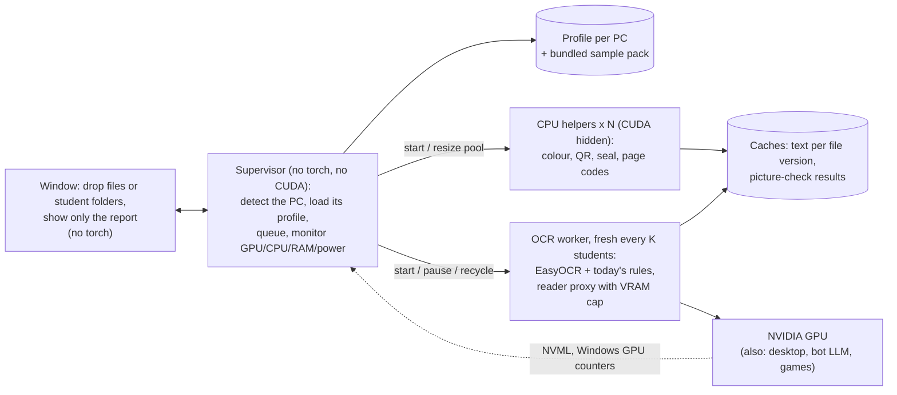
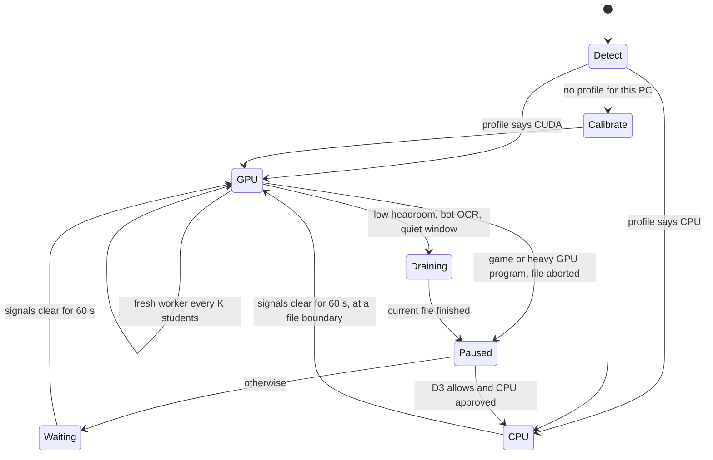

# Draft: Document Checker desktop app, hardware angle ("optimize GPU and CPU according to that PC")

Planning draft, 5 Oct 2026. Nothing has been built, run or installed.

**The owner's request:** "I want UI visual software where there will be an option to upload documents or upload student folders, and it will optimize GPU and CPU according to that PC, and show only the report of the document check."

**What this draft covers.** The hardware layer of that desktop program:
- detecting the PC;
- calibrating on bundled sample pages;
- the auto-tuner;
- live adaptation while it runs;
- PCs without an NVIDIA card;
- packaging.

The window, the report layout and any rule changes belong to other drafts. This one only says what they must give the hardware layer.

**Conventions:**
- `path:line` is relative to the staging clone `C:/Hangeul/JARVIS/socials/repo` (commit `8317741`, the code the live bot runs, as in `PLAN.md`).
- `easyocr/...` means the installed EasyOCR 1.7.2 in the bot's venv, `C:/Hangeul/BOT/.venv/Lib/site-packages/easyocr/`. It was read only.
- *(measured)* marks the owner's figures from this PC, or sizes read from disk on 5 Oct.
- *(est.)* marks an estimate that step H0 replaces with a measurement.
- Names and numbers in examples are placeholders.

`PLAN.md` sections 1–2 still describe today's check correctly. This draft reuses them and does not repeat them.

## Summary

- **One rule makes the tuning safe.** The program changes only settings that cannot change a verdict:
  - process and thread counts;
  - the VRAM cap;
  - recycling workers;
  - running the CPU picture checks next to the GPU reading;
  - caches.

  Every setting that changes the OCR text stays at today's value until a parity test proves the same verdicts. Those settings are the device, the batch size, the image size, the DPI and 8-bit CPU models.
- **Three facts from the code drive the design:**
  1. **The obvious speed setting changes the text.** In EasyOCR 1.7.2, a batch size above 1 on the GPU switches to a different code path, which reads every text box of a page at one common width (`easyocr/easyocr.py:377-410`; `easyocr/recognition.py:186-202`). Today's check always uses batch 1 (`doc_verifier.py:74, 80, 97, 131` pass none).
  2. **On the CPU, EasyOCR converts its models to 8 bits by default** (`easyocr/detection.py:77-81`; `easyocr/recognition.py:168-177`). Today's check would silently do that whenever torch is a CPU build (`doc_verifier.py:60`; the warning in `requirements.txt:3-5`). The passport audit already reads this way (`ocr_validator.py:79`).
  3. **A half-read can be stored today only through `except Exception` handlers.** Examples: the rotation retry (`doc_verifier.py:79-82`) and the "could not read the file" row (`:1066-1071`). Nothing in `src/verify` catches `BaseException` or uses a bare `except:`. A reader that raises its own `BaseException` subclass on out-of-memory therefore passes through every handler, and the rule files can stay word for word.
- **The PC is measured once.** About 3–4 minutes on a GPU, 12–15 minutes on a CPU *(est.)*. Only fake sample pages bundled with the program are used. The result is a profile per PC. From then on, a supervisor that never loads torch watches the card, the CPU, RAM, power and the bot. It pauses, switches to the CPU or recycles the worker between pages. Nothing half-read is ever saved.
- **Expected settings:**

  | | This PC | Office PC, no GPU | PC with a 4 GB NVIDIA card |
  |---|---|---|---|
  | Device | CUDA | CPU (EasyOCR, full precision) | CUDA |
  | VRAM cap | 3.0 GB | — | about 2.6 GB |
  | Fresh worker every | 5 students | 10 students | 3 students |
  | Time per new student | 60–90 s *(est.)* | 10–25 min *(est.)* | 2–4 min *(est.)* |

- **Packaging:** two installers built from one code base, a GPU build of about 5 GB installed (the CUDA torch alone is 4.2 GB *(measured)*) and a CPU build of about 1.3 GB, with the models bundled and nothing ever downloaded.
- **Size:** about 19 working days for this layer. About 5 of them overlap with phases 0–2 of `PLAN.md` (self-test, worker, cap, guard) if both are built.

## 1. Design

### 1.1 Where the hardware layer sits



- **The window and the supervisor never import torch.** A CUDA crash or a driver hang cannot freeze the window, and the window costs no VRAM.
- **The OCR worker is the only process that may touch the GPU.**
  - It runs today's rules (`doc_verifier.verify_student`, `field_check.check_student`) for one student at a time, because the rules interleave reading and checking (`doc_verifier.py:1065-1085`).
  - It is a fresh process every K students (section 1.5).
- **CPU helpers** run the picture checks that need no OCR:
  - `page_checks.inspect`: 250 dpi, 4 pages (`page_checks.py:20, 94`);
  - `seal_present`: 150 dpi, 4 pages (`:275`);
  - `page_codes`: 250 dpi, up to 20 pages (`:327-367`).

  The helpers start them as soon as a student is queued. The worker's patched `PC.inspect`, `PC.seal_present` and `PC.page_codes` then return the helpers' results. These are the same functions on the same file, so the results are identical. The helpers' CPU time no longer adds to the GPU time. Today it is serial and uncached (docs reference, "Image checks are not cached").
- **Helpers and CPU-mode workers hide CUDA before torch can load**, with `CUDA_VISIBLE_DEVICES="-1"`. Not `""`, which Windows drops (`src/cloud/embed.py:41-43, 60-67`). They never create a CUDA context, which costs about 0.4 GB of VRAM each *(est.)*.
- **The processes talk through `multiprocessing` pipes**, which are named pipes on Windows. No network port is opened, so the socket fence of `PLAN.md` 4.5 still holds.
- **Priorities:** workers and helpers run at below-normal priority, and the window at normal.

### 1.2 The core rule: settings that keep the text, and settings that change it

| Setting | Today (code) | Can it change the OCR text? | Who may change it |
|---|---|---|---|
| OCR device (GPU or CPU) | GPU when `torch.cuda.is_available()` (`doc_verifier.py:60`) | **Yes.** The arithmetic differs. On RTX 30/40/50 cards convolutions run in TF32 by default; older cards and CPUs use full float32. | Only a backend that passed the parity gate (1.7), and only on a PC that passed the sample check (1.4). |
| 8-bit CPU models (`quantize`) | EasyOCR default `True` on the CPU (`easyocr/easyocr.py:36`; `easyocr/detection.py:77-81`; `easyocr/recognition.py:168-177`) | **Yes** | Off by default; on only after the gate (D4). |
| Recognizer batch size | 1 (EasyOCR default; no caller passes one) | **Yes.** Above 1 on the GPU, every box of a page is recognised in one list at one common width (`easyocr/easyocr.py:377-410`). Batch 1 reads box by box. | Locked at 1; a candidate after the gate (D4). |
| Image size `canvas_size` / `mag_ratio` | 2560 / 1.0 (`easyocr/easyocr.py:445`) | **Yes** | Locked. |
| Render DPI and page limits | 150 dpi whole file, 200 dpi per page, 250 dpi QR/colour (`doc_verifier.py:110, 145`; `page_checks.py:20, 346`); 6/8/10/20/4 pages (`auto_verify.py:191`; `doc_verifier.py:474, 731`; `page_checks.py:20, 275`) | **Yes** | Locked. Whole documents and originals are an accuracy decision (`PLAN.md` D4), not a tuner choice. |
| Rotation retry under 300 characters | `doc_verifier.py:64-89` | **Yes** | Locked. |
| `cudnn.benchmark`, TF32 | off / torch defaults (`easyocr/detection.py:87`) | slightly | Locked to the reference. |
| Number of CPU helpers | none: picture checks run inline | No: the same function on the same file | Tuner |
| CPU threads per OCR process | torch default | Not in principle; float sums can reorder, so the per-PC sample check confirms it | Tuner |
| VRAM cap | none | No: an overflow aborts the file, never shortens the text | Tuner |
| Students per fresh worker | one process per pass of 6 (`auto_verify.py:59`) | No. A fresh process also takes a fresh date (`TODAY`, fixed at import, `doc_verifier.py:42`). | Tuner |
| `empty_cache` timing, priority, prefetch depth, result caches | none | No | Tuner |
| Pixel cap per rendered page | none | Only for absurd page sizes, which happen in originals. The page then gets a note. | Tuner, with a note on the report |

The tuner works from an **approved list** for each setting that changes text. In version 1 the list holds only today's values: batch 1, canvas 2560, today's DPIs and full precision. A value joins the list only through the parity gate. The tuner may then use it, for example a smaller canvas on 4 GB cards if it is ever approved.

### 1.3 Detection at start-up

It takes under 2 seconds, needs no administrator rights, and creates no CUDA context in the supervisor.

| What | How | Used for |
|---|---|---|
| NVIDIA GPUs | `nvml.dll`, which comes with the driver, through `nvidia-ml-py`. It reads:<br/>- name, total, free and used VRAM;<br/>- driver version and the CUDA version the driver supports;<br/>- compute capability;<br/>- whether a monitor is attached;<br/>- the processes on the card. | the device choice, the VRAM budget, live headroom |
| Can our torch build use the card? | Its compute capability must be in the build's arch list, written at build time from `torch.cuda.get_arch_list()` into `build_info.json`. The first worker then proves it with a small GPU convolution. | If either fails: CPU, and the message "update the NVIDIA driver, or this card is too old for the GPU version" |
| AMD and Intel GPUs | DXGI `EnumAdapters1` through ctypes (vendor id, dedicated and shared memory). WMI `Win32_VideoController` gives the name and driver; its `AdapterRAM` stops at 4 GB, so it is ignored. | listed only in version 1 (1.7) |
| CPU | Name from the registry `ProcessorNameString`. Physical and logical cores from `psutil`. P- and E-cores from `GetLogicalProcessorInformationEx`. AVX2/AVX-512 from `torch.backends.cpu.get_cpu_capability()`, asked inside the worker. | threads, worker count (P-cores only on hybrid Intel CPUs) |
| RAM | `psutil.virtual_memory()` (total, available) and the commit limit (`GlobalMemoryStatusEx`) | CPU workers, helpers, pixel cap |
| Disk | Free space on the program's data drive. `GetDriveType` shows whether the student folders are on a network drive (then the files are read ahead into RAM, never copied to disk). | stop before caches fill the disk (at least 2 GB free) |
| Power | `GetSystemPowerStatus` (mains or battery, %, battery saver). The chassis type from `Win32_SystemEnclosure` shows a laptop. | Gentle mode, pause on low battery |
| Neighbours on this PC | `psutil` process names:<br/>- Ollama (`ollama.exe` and its runner);<br/>- the voice service;<br/>- a game list from the config.<br/><br/>The bot's lock file `<BOT>/data/verification/auto_verify.lock` is read, never written. `SHQueryUserNotificationState` reports a full-screen Direct3D program. | VRAM reserve, yielding to the bot, game detection |
| Windows version | `sys.getwindowsversion()` | EcoQoS exists on Windows 11 only; this PC runs Windows 10. |

**Hardware id.** A hash of:
- the GPU model, VRAM and driver;
- the CPU model and cores;
- RAM, rounded;
- the app and engine versions.

It never includes a PC or user name. The id selects the profile, and "About this PC" shows the result.

### 1.4 First-run calibration on bundled sample pages

**The sample pack** is bundled and holds no real student data: about 25 pages, about 25 MB *(est.)*.

- Made by a script with "SAMPLE" names, placeholder numbers such as `X0000001`, and a specimen-style MRZ.
- It contains:
  - a fake apostille QR whose link contains "apostille", so it matches `APOSTILLE_HOSTS` (`page_checks.py:314`);
  - a violet "NOTARY SAMPLE" stamp;
  - a Bangla-script paragraph;
  - a computer-made PDF with a text layer;
  - a PDF whose page is 60 × 80 inches.
- Printed once and scanned on the office scanner, in colour and in black and white. One page is photographed sideways with a phone (a 4000 × 3000 JPG).
- **Three sample student folders**, `SAMPLE/KLP/SAMPLE STUDENT ONE (X0000001)/` and so on. Each has a fake portal record and a known result: PASS, FAIL on "page 1 is not an e-Apostille" (`page_checks.py:404-407`), and INCOMPLETE.

**Reference outputs.** They are produced once on this PC with the reference engine: RTX 5060, EasyOCR 1.7.2, torch 2.11 cu128, batch 1, canvas 2560. Each page's text and its sha256 are shipped, plus each sample student's rows (verdict and detail). The reference run is made twice to confirm the output is repeatable (risk 13).

**Steps:**

| # | Step | GPU *(est.)* | CPU *(est.)* |
|---|---|---|---|
| 1 | Self-test:<br/>- pyzbar decodes the sample QR;<br/>- the models load with downloads off and match their sha256;<br/>- the network fence refuses an outside address. | 10 s | 10 s |
| 2 | **Parity part:** the 3 sample students through the real rules on the chosen device. Rows must equal the reference. At least 95 % of OCR pages must have identical text, and the rest at most 1 % different characters. These two numbers are set in H1. **No verdict is shown on this PC before this passes.** | 1–2 min | 8–10 min |
| 3 | Speed grid, in the background:<br/>- GPU: helpers 2/3/4/6; seconds per OCR page and per picture page; model load time; peak VRAM per page against its megapixels (fits "VRAM ≈ a + b × MP" for size routing).<br/>- CPU: OCR processes × threads (1 × all, 1 × half, 2 × half/2, as RAM allows); RAM per worker. | 1–2 min | 4–5 min |
| 4 | Candidates, measured but **never switched on**: GPU batch 8 and 16, CPU 8-bit. Time and text are compared with the reference and written to the profile, for D4. | 30 s | 1 min |
| 5 | Write the profile | — | — |

**The profile** (`<data>/profiles/<hardware id>.json`; no student data):

```json
{
  "profile": 1, "hardware_id": "<hash>", "app": "1.0.0",
  "engine": "easyocr 1.7.2 / torch 2.11.0+cu128", "rules": "v1-compat",
  "pc": {"gpu": "NVIDIA GeForce RTX 5060", "vram_gb": 7.96, "other_gpus": ["AMD Radeon 760M"],
         "cpu": "AMD Ryzen 5 8600G", "cores": 6, "threads": 12, "ram_gb": 16,
         "laptop": false, "neighbours": ["ollama", "hangeul-bot"]},
  "device": "cuda", "backend": "torch-cuda-fp32", "verified_on_this_pc": true,
  "gpu": {"vram_cap_gb": 3.0, "start_free_gb": 3.6, "batch_size": 1, "canvas_size": 2560,
          "mag_ratio": 1.0, "vram_per_mp_gb": "<fit>", "vram_base_gb": "<fit>"},
  "cpu": {"ocr_processes": 0, "ocr_threads": 2, "helpers": 4, "quantize": false},
  "render": {"dpi": "locked to today", "max_page_megapixels": 40},
  "recycle": {"students": 5, "vram_growth_gb": 0.8, "slowdown": 1.4, "at_midnight": true},
  "speed": {"ocr_page_s": "<measured>", "picture_page_s": "<measured>", "model_load_s": "<measured>"},
  "candidates": {"gpu_batch8": {"speed_x": "<measured>", "pages_identical": "<measured>"}},
  "calibrated": "<DATE>"
}
```

**Recalibration happens when:**
- the hardware id changes (a new driver, card or RAM);
- the app or engine version changes;
- staff press "Re-test this PC";
- live speed is under half the profile's for 3 sessions in a row while no neighbour was busy.

**While running**, averages of seconds per page by page kind update the time estimates. They never update a setting that changes text.

### 1.5 The auto-tuner

| Setting | How it is chosen | This PC |
|---|---|---|
| **Device** | CUDA when all of these hold:<br/>- an NVIDIA card is present;<br/>- it is in the build's arch list and the test convolution passes;<br/>- the VRAM budget is at least 2.0 GB;<br/>- the PC passed the sample check.<br/><br/>Otherwise the CPU, if the CPU backend is approved. Otherwise "this PC cannot give verdicts; check on the main PC" (D2). | CUDA |
| **VRAM budget** | Card total, minus the desktop (NVML used at start if a monitor is attached), minus the neighbours' reserve, minus 0.4 GB of CUDA context, minus a 0.3 GB margin.<br/><br/>The reserve is 2.8 GB when Ollama is installed (`qwen3:4b`, 2.6–2.8 GB, loads on demand) and 3.4 GB more while the voice service runs (`src/bot/voice.py:56-64`). | 7.96 − 1.4 − 2.8 − 0.4 − 0.3 ≈ **3.0 GB** |
| **VRAM cap** | The lower of the budget and 1.1 × the measured peak. Set at worker start with `torch.cuda.set_per_process_memory_fraction(cap / total)`. | 3.0 GB (the uncapped peak is 3.9 GB *(measured)*) |
| **Free VRAM needed to start a worker** | cap + 0.4 context + 0.2 | 3.6 GB, as in `PLAN.md` 4.4 |
| **Size routing** | A page whose predicted VRAM (from the fit in 1.4) is above the cap goes straight to the CPU when the CPU is approved, instead of failing on the GPU. | rare at 3.0 GB |
| **OCR processes and threads, CPU mode** | P = the lower of (available RAM − 1.5 GB) ÷ RAM per worker, and physical cores ÷ 2, at least 1. Threads = (physical cores − 1) ÷ P. On hybrid Intel CPUs, P-cores only. `torch.set_num_threads` can be changed while running. | in CPU fallback: 2 × 3 |
| **OCR process, GPU mode** | 1 process, 2 torch threads for the pre- and post-processing | 1 × 2 |
| **CPU helpers** | GPU mode: the lowest of (physical cores − 2), available RAM ÷ 0.6 GB, and 6.<br/>CPU mode: 1, or 0 when less than 3 GB of RAM is free.<br/>Each helper uses `cv2.setNumThreads(1)`. | 4 |
| **Image size, batch, DPI** | Approved list only (1.2) | 2560, 1, today's |
| **Pixel cap per rendered page** | 40 MP with 16 GB of RAM or more, 25 MP with 8 GB. A 40 MP colour page is 120 MB, and pyzbar and OpenCV copy it several times. | 40 MP |
| **Students per fresh worker** | From the profile. This PC: 5 *(measured: steady at 93 s per student in 5-student processes, 570 s in one long process)*. Defaults elsewhere: 3 on a GPU, 10 on a CPU. Recycled early when:<br/>- reserved VRAM after `empty_cache` grows more than 0.8 GB above the first student's;<br/>- speed falls below 1/1.4 of the profile for 20 pages;<br/>- a CPU worker's memory passes 2.5 GB;<br/>- at midnight (`TODAY`, `doc_verifier.py:42`). | 5 |
| **Gentle mode** | When staff used the mouse or keyboard in the last 60 s (`GetLastInputInfo`), or Speed is set to Gentle: half the helpers and half the CPU OCR threads. The GPU work is unchanged, because it hardly slows office programs. | when someone is at the PC |

### 1.6 Live adaptation while it runs

The **reader proxy** asks the guard before every `readtext` call, so the checks happen between pages and between rotation retries. The supervisor's monitor runs every 2 seconds.

| Signal | Source | Threshold (this PC) | Action |
|---|---|---|---|
| Little room left on the card | NVML free memory, against the cap minus what the worker has already reserved | under 0.2 GB of headroom | **Soft pause:** finish the current file, then wait or follow D3 |
| A heavy GPU program | Any of:<br/>- the game list;<br/>- Windows `\GPU Process Memory(*)\Dedicated Usage` over 1 GB for a process that is not ours, `dwm.exe`, Ollama or the bot (these counters were already used on this PC, `voice.py:58`);<br/>- a full-screen Direct3D program | any | **Hard pause:** abort the current file and end the worker, so all its VRAM and its context are freed. Then follow D3. |
| The LLM loads | the Ollama runner appears, or NVML "used" jumps by 2 GB or more | the headroom rule | Nothing while the budget holds (it was sized for this). Otherwise a soft pause until it unloads (5 minutes idle, `config.py:75-76`). |
| The bot's own OCR | the bot's lock held by a live process, using the logic of `_pid_alive` / `_lock_held` (`auto_verify.py:62-97`) **without** the delete at `:96` | held | The GPU yields, because two OCR processes once ran this card out of memory (`PLAN.md` 4.4). The CPU may continue. |
| The bot's scheduled jobs | quiet windows (`src/cloud/backfill.py:57`) | inside one | No new GPU worker starts. |
| Other programs' CPU use | `psutil`: the total minus our processes | over 50 % for 15 s | half the helpers, one CPU OCR thread fewer |
| Low RAM | `psutil` available memory | under 1.5 GB / under 0.8 GB | pause the helpers / soft pause everything |
| Battery | `GetSystemPowerStatus` | on battery / under 25 % | Gentle, and ask before a folder of more than 3 students / pause |
| Slowdown, VRAM growth, midnight | the worker's own timings and `torch.cuda.memory_reserved()` | as in 1.5 | recycle after the current student |



**Out-of-memory ladder.** The image is never shrunk, the DPI is never lowered, and a shorter text is never kept.
1. **A first out-of-memory error on a page:** the file is discarded, `torch.cuda.empty_cache()` runs, and the file is read again in the same worker.
2. **A second one on the same file:** the worker exits, which frees all its VRAM, and a fresh worker reads the file again.
3. **A third one:** the file is read on the CPU, if that is approved, and the report says "read on the processor". Otherwise the student shows **"Check not finished: page N is too large for this graphics card"**, with no verdict.
4. **Two out-of-memory errors on different files within 10 minutes:** the session switches to the CPU, or waits, and the status line says why. The GPU is tried again after 10 clear minutes.

**How "nothing half-read is ever saved" is built:**
1. **The reader is injected.** `doc_verifier` builds its reader only when `_reader` is `None` (`doc_verifier.py:49-61`). The worker sets `dv._reader` to a proxy around `easyocr.Reader` with:
   - the chosen device (`gpu="cuda:0"` or `False`; `easyocr/easyocr.py:68-82`);
   - `model_storage_directory=<app>\models` and `download_enabled=False`;
   - `quantize` from the profile, and `verbose=False`.

   The proxy's `readtext` asks the guard first and times the call. It turns `torch.OutOfMemoryError` into `ReadAborted`, a subclass of `BaseException`. `ReadAborted` is also raised on a pause.
2. **The abort passes through every handler that would store a half-read today**, because these all catch `Exception`, never `BaseException`, and there is no bare `except:` in `src/verify`:
   - `doc_verifier.py:79-82` (the rotation retry, which today keeps the shorter text);
   - `:133-136`, `:474-476`, `:576-577`, `:731-733`;
   - `:1066-1071` (today stored as a FLAG "could not read the file");
   - `field_check.py:193-197`;
   - `page_checks.py:95-96, 194-196`.
3. **The picture checks are wrapped.**
   - `PC._pages`, `PC.page_codes`, `PC.inspect` and `PC.seal_present` are cached per file version, the way `install_text_cache` patches module functions (`auto_verify.py:172-234`).
   - A `MemoryError` becomes `ReadAborted`. Today it would become "could not judge whether the scan is in colour" (`page_checks.py:95-96, 146`).
   - OpenCV and pyzbar errors inside `page_checks.py:112-131` cannot be seen from outside. They are prevented instead: the pixel cap, a RAM check before each render, and bounded helper queues.
4. **The text cache uses today's key** (`name:size:mtime:max_pages`, `auto_verify.py:195, 215`) plus the backend id. A student's entries are written only when the student finished without `ReadAborted`, through a temporary file and a rename, as `save_store` does (`auto_verify.py:147-151`).
5. **A verdict exists only when every file was read completely.** Until then the window shows "Check not finished — 2 files waiting (graphics card busy)".
6. **Slow is not wrong.** A spill into shared memory slows the reading but cannot change the text. Only errors can, and every error path aborts.

### 1.7 PCs with no NVIDIA card

- **Version 1: EasyOCR on the CPU.** The same version and rules, with `quantize=False` so that the arithmetic stays full precision like the GPU reference.
  - It must pass the **CPU parity gate** once: the 40-student hand-checked set of `PLAN.md` section 6, run on this PC with CUDA hidden, overnight *(est.)*. The gate is passed when no student verdict changes against the GPU reference, and the owner has seen every changed row.
  - Each office PC must then pass the sample check (1.4).
  - **Speed:** treat it as unmeasured. If the CPU is about 10 times slower than the GPU (1.8 s per page *(measured)*), a page takes about 15–20 s on this PC's Ryzen and 20–40 s on a 4-core office CPU. That is **10–25 minutes per new student** *(est.)*.
  - Computer-made PDFs use the text layer when it has more than 80 characters (`doc_verifier.py:142`), so they cost almost nothing on any PC.
- **8-bit CPU models** (EasyOCR's own CPU default) are perhaps 1.5–2 times faster *(est.)*, but they give different text. They are a candidate only through the gate (D4).
- **ONNX Runtime with DirectML** would serve AMD and Intel GPUs, including this PC's Radeon 760M while the RTX is busy.
  - It needs an ONNX export of EasyOCR's two networks (CRAFT, 83 MB; `english_g2`, 15 MB *(measured)*), keeping EasyOCR's own pre- and post-processing in Python.
  - Microsoft has put DirectML into maintenance; Windows ML is its successor on Windows 11, and this PC runs Windows 10.
  - The 760M shares the 16 GB of system RAM.
  - About 4–6 days plus the gate. Not version 1.
- **OpenVINO** serves Intel CPUs and Intel integrated GPUs. Its CPU plugin also runs on AMD x86 CPUs.
  - It uses the same ONNX export, and is often 1.5–3 times faster than torch on the CPU for networks like CRAFT *(est.)*.
  - It needs the same gate. Not version 1.
- **ONNX Runtime on the CPU** is the simplest of the three, with the same gate. It would be the first spike if office PCs prove too slow (D8).
- **AMD's ROCm for PyTorch on Windows** is still a preview. It is not considered.
- **The rule for every engine other than the reference:** the rules were tuned on EasyOCR's text, so another engine must prove the **same verdicts** on the hand-checked set. Similar text is not enough.

### 1.8 Packaging

**Measured on this PC** (the bot's venv, read only):

| Package | Installed size |
|---|---|
| torch 2.11.0+cu128 | **4.2 GB**, of which:<br/>- `torch_cuda.dll` 774 MB;<br/>- `cublasLt64_12.dll` 643 MB;<br/>- `cudnn_engines_precompiled64_9.dll` 459 MB;<br/>- `cusparse64_12.dll` 362 MB;<br/>- `cufft64_11.dll` 263 MB;<br/>- `torch_cpu.dll` 254 MB. |
| EasyOCR models | 98 MB (`craft_mlt_25k.pth` 83 MB, `english_g2.pth` 15 MB) |
| SciPy | 115 MB |
| OpenCV | 113 MB |
| PyMuPDF | 54 MB |
| NumPy | 34 MB |
| torchvision | 29 MB |
| scikit-image | 25 MB |
| pyzbar | 1.3 MB, including `libzbar-64.dll` and `libiconv.dll` |

| Option | Download / installer *(est.)* | Installed *(est.)* | For | Against |
|---|---|---|---|---|
| A. One installer with both | about 3 GB (split into `setup.exe` + `.bin` parts) | about 5 GB on every PC | one file | Office PCs carry 3.5 GB of CUDA they cannot use. Slow copies. |
| **B. Two installers: "GPU (NVIDIA)" and "Standard"** | GPU about 2.5–3 GB; Standard about 0.5 GB | GPU about 5 GB; Standard about 1.3 GB | Each PC gets what it can use. Both come from one code base, with the same torch version (`2.11.0+cu128` and `2.11.0+cpu`), so the code paths match. | Staff must pick the right one; the program tells them (below). |
| C. A small base + a "GPU pack" from a local file at first run | 0.5 GB + about 2.5 GB | the same as B | one installer for everyone | The CUDA build of torch replaces the CPU build as a whole folder, so the pack is as big as B's GPU installer and adds a version-matching step. No gain. |

**Common to every option:**
- PyInstaller "onedir" (or Python's embeddable package) plus Inno Setup.
- A per-user install, with no administrator rights. Free space is checked first.
- The models sit in `app\models` with a sha256 list. EasyOCR runs with `download_enabled=False`, and the hub variables are set offline. No HTTP library is shipped, and the socket fence is on.
- **The Visual C++ 2013 runtime that pyzbar's DLLs need is bundled.** Without it, QR reading silently falls back to OpenCV (`page_checks.py:100-103`), and most apostilles would FAIL (`PLAN.md` problem 13). The self-test refuses to run until pyzbar works.
- `build_info.json` holds the torch version and its arch list.
- **Every report states the program, engine, device and rules version.**
- The rule files are shipped unchanged, with a small `src/config.py` of the program's own. The rule files import `settings` when they load (`doc_verifier.py:34, 40-41`; `page_checks.py:16, 295`), and the bot's `config.py` would read the bot's `.env` (`src/config.py:6-7, 141-145`). The program's version points the folders at its own data and reads no secrets.
- **When a PC has the wrong build:**
  - The GPU build on a PC without NVIDIA runs on the CPU and says "the Standard version is enough here".
  - The Standard build on a PC with a usable NVIDIA card says "the GPU version would be about N times faster", with N from the calibration.
- **Distribution and updates:** by USB stick or the office share, never a download.
- **Unsigned installers trigger SmartScreen.** Signing is a choice for the owner (risk 14).

### 1.9 Expected settings for three example PCs

| | **This PC** | **Office PC, no GPU** | **PC with a 4 GB NVIDIA card** |
|---|---|---|---|
| Hardware | Ryzen 5 8600G, 6 cores / 12 threads; RTX 5060 8 GB driving the monitor; Radeon 760M; about 16 GB; Windows 10; the bot, Ollama and sometimes a game on the same card *(measured)* | 4 cores (4 or 8 threads), 8 GB, Intel or AMD integrated graphics *(assumed)* | GTX 1650 / RTX 3050 class 4 GB card driving the monitor, 4–6 cores, 16 GB *(assumed)* |
| Installer | GPU | Standard | GPU if the card is in the build's arch list, else Standard |
| Device / engine | CUDA, the reference: torch full precision, TF32 convolutions as today | CPU, torch full precision (`quantize=False`), once the CPU gate is passed | CUDA, if the sample check passes. Turing cards have no TF32, so the text can differ slightly. |
| VRAM budget → cap | 7.96 − 1.4 − 2.8 − 0.4 − 0.3 → **3.0 GB** (4.2 GB only if Ollama is not installed) | — | 4.0 − 0.6 − 0.4 − 0.3 → **about 2.6 GB** (2.8 GB if the monitor is on another adapter) |
| Start a GPU worker at free VRAM of | 3.6 GB | — | 3.2 GB |
| Batch / image size / DPI | 1 / 2560 / today's (locked) | the same (EasyOCR reads box by box on the CPU anyway, `easyocr/easyocr.py:378`) | the same. Pages predicted above 2.6 GB go to the CPU, or show "not finished". |
| OCR processes × threads | 1 × 2 (GPU) | 1 × 3; in Gentle 1 × 2 | 1 × 2 (GPU) |
| CPU helpers | 4 | 1 (0 when free RAM is under 3 GB) | cores − 2 (2–4) |
| Pixel cap per page | 40 MP | 25 MP | 40 MP |
| Fresh worker every | **5 students** *(measured)*, earlier on VRAM growth or slowdown | 10 students, or at 2.5 GB of worker memory | **3 students**, earlier on growth or slowdown |
| Live guard | headroom; game list + Windows GPU counters + full screen; Ollama; the bot's lock; quiet windows | CPU load, staff activity, RAM | headroom; game list + counters + full screen |
| When the GPU is busy | D3 | — | D3 |
| New student | **60–90 s** *(est.)*; 93 s today *(measured)* | **10–25 min** *(est.)* | **2–4 min** *(est.)* |
| Re-check from cache | 1–2 s *(target, with the picture cache)*; about 6 s today *(measured)* | 2–5 s *(target)* | 1–3 s *(target)* |
| A first check of 144 students | 2.5–3.5 h *(est.)* | 1–2.5 days, in night runs *(est.)* | 5–10 h *(est.)* |
| Calibration | 3–4 min | 12–15 min | 4–5 min |

### 1.10 What staff see of all this

Hardware is kept to one line, so the window shows the report and little else.

- **A status line,** for example:
  - "Reading on: NVIDIA RTX 5060 (graphics card) · about 1 min per student";
  - "Reading on: processor · about 15 min per student · the PC stays usable".
- **Before a big drop,** the files are counted first. PDF pages and their text layers are read in milliseconds, which shows how many pages need OCR. The window then says, for example, "36 students, about 45 min on this PC".
- **A paused banner,** for example: "Graphics card busy (a game is running). Continuing on the processor, slower. [Wait for the graphics card instead]".
- **A Speed setting:** Automatic / Gentle / Fastest. Under Advanced: "About this PC" and "Re-test this PC".
- **The report footer:** "Read on GPU (32 pages) and processor (2 pages) · EasyOCR 1.7.2 reference · rules v1".

## 2. Reused from today's code, and new

| Part | Reused (file: function, lines) | New |
|---|---|---|
| Rules | All of `rules.py` and `page_checks.py`. `doc_verifier.py`: `CHECKS`, `verify_student`, `student_verdict`, `cross_checks`, `classify` (`:913-925, 956-1096`). `field_check.py`: `check_student` (`:182-218`). **All files unchanged.** | — |
| Reading | `_ocr_image`, `read_document`, `read_pages` unchanged (`doc_verifier.py:64-150`). The reader choice at `:52-61` is bypassed by setting `_reader`. | the reader proxy: device, models, guard, `ReadAborted`, timing |
| Text cache | The patching pattern and key of `install_text_cache` / `save_text_cache` (`auto_verify.py:172-249`). Both `dv.read_document` and `fc.read_document` are patched (`:230-232`), because `field_check` imports it by name (`field_check.py:30-32`). | backend id in the key; saved only when the student completes |
| Change detection | `doc_fingerprint`, `field_fingerprint` (`auto_verify.py:101-133`) | — |
| Saving | temporary file and rename (`save_store`, `auto_verify.py:147-151`) | the same for profiles and caches |
| Stop on a code fault | `auto_verify.py:492-500`: a rule bug stops the batch | the same rule in the worker loop |
| The bot's lock, read only | `_pid_alive`, `_lock_held` (`auto_verify.py:62-97`), **minus** the delete at `:96` | — |
| Hiding CUDA | `CUDA_VISIBLE_DEVICES="-1"`, set before torch loads (`src/cloud/embed.py:41-43, 60-67`) | used in helpers and CPU workers |
| Quiet windows | `QUIET_WINDOWS` (`src/cloud/backfill.py:57`) | only used when the bot is detected |
| Student folders | the `<NAME (PASSPORT)>` pattern (`doc_verifier.py:1100-1117`); `.download_complete` (`verified_docs.py:239`); `.part` temporary files (`:321-323, 389-391`); the originals tree (`:316-319`); A4 resizing of shrunk copies (`:246-266`), which keeps them a bounded size, while originals can be any size, hence the pixel cap | — |
| Versions | `requirements.txt:13-23`, and the install order at `:3-9` (CUDA torch first) | the Standard build pins `torch==2.11.0+cpu` |
| Neighbours' memory | the LLM 2.6–2.8 GB and voice figures (`src/bot/voice.py:56-64`; `src/config.py:28-42`); an LLM that loads while the card is full lands partly on the CPU and answers slowly (`src/bot/scheduler.py:280-300`) | the VRAM budget formula |
| Passport OCR settings | not merged: `ocr_validator.py` reads on the CPU with its own image size (`:46-47, 79, 157-166`). It is a different engine setup, kept apart. | — |
| — | — | detection; the sample pack and reference outputs; calibration; profiles; the tuner; the monitor and device states; the out-of-memory ladder; the helper pool and picture cache; size routing; the program's own `config.py`; self-test; two installers; status-line texts |

## 3. Build steps

Sizes are working days for one developer with an AI assistant. Every step runs on this PC **only while the bot's lock is free, no game is running, and outside the quiet windows**. Steps use read-only copies of student folders, never the live folders.

| Step | What you get | Acceptance test | Days |
|---|---|---|---|
| **H0. Measure this PC** | A measurement sheet:<br/>1. where today's 93 s per student goes, per function (GPU OCR, rotation retries, `page_codes`, `inspect`, `seal_present`, field check), on 10 students;<br/>2. peak VRAM per page against megapixels at batch 1;<br/>3. CPU seconds per page, full precision and 8-bit, at 1/2/3/6 threads, and RAM per worker;<br/>4. identical-text rates of GPU, CPU full precision, CPU 8-bit and GPU batch 8 on the same pages;<br/>5. model load time;<br/>6. whether NVML or the Windows counters give per-program VRAM;<br/>7. VRAM growth over 15 students in one process, with and without `empty_cache`. | The sheet is complete. Every run was logged with the lock state, and the bot's log shows no error or delay during the runs. | 2 |
| **H1. Sample pack and reference outputs** | The fake pages: scripted, then printed, scanned and photographed by staff in about 1 hour. 3 sample students with fake records. Reference texts, hashes and rows from this PC, run twice. | The owner confirms there is no real data in the pack. Two reference runs agree, or the flicker is documented and the check compares rows instead of text. | 2 |
| **H2. Detection** | The detection module and "About this PC" | On this PC it reports what Task Manager and NVIDIA's tools show (card, VRAM, driver, cores, RAM, Radeon 760M). On a PC without NVIDIA it reports none, without errors. It takes under 2 s, and the supervisor never appears in NVML's process list. | 1.5 |
| **H3. Worker, reader proxy, nothing half-read** | The worker process; the injected reader; `ReadAborted`; the out-of-memory ladder; the VRAM cap; complete-only caches; the wrapped picture checks; the program's own `config.py` | (a) A faked out-of-memory error on page 3, and another inside a rotation retry, leave nothing cached and no row stored. The retry gives rows identical to a clean run.<br/>(b) A faked `MemoryError` in `PC._pages` stores no "could not judge colour" FLAG.<br/>(c) Gate A of `PLAN.md` (0 differing rows on a copy of the bot's text cache) still passes with the proxy in place.<br/>(d) A CPU worker never shows in NVML's process list.<br/>(e) No file is read from or written under `C:/Hangeul/BOT`, except the lock read. | 3 |
| **H4. Helpers and picture cache** | The helper pool; picture checks prepared before the worker needs them; results cached per file version | Rows are identical with 0 and with 4 helpers on 20 students. Time per student falls by at least 20 % (target; H0 shows whether the picture work is big enough). RAM stays within its budget. A re-check from cache takes 2 s or less. | 2 |
| **H5. Calibration, profile, tuner** | The first-run flow; the profile file; recalibration triggers | On this hardware, three simulated PCs get the settings of section 1.9:<br/>- as it is;<br/>- with CUDA hidden and 4 threads (the office PC);<br/>- with the cap forced to 2.6 GB (the 4 GB card).<br/><br/>Calibration takes at most 4 min on the GPU and 15 min on the CPU. A planted wrong reference text marks the PC "not verified", and no verdict is shown. | 2 |
| **H6. Live monitor and device states** | The signals of section 1.6; pause, CPU switch, resume; recycle triggers; Gentle mode; battery rules | (a) A dummy program holding 5 GB of VRAM gives a soft pause before the next file. A dummy listed "game" gives a hard pause within one page, and our VRAM drops to 0 within 10 s. Work resumes within 30 s after the load ends.<br/>(b) A live lock file in a test copy of the bot folder means no GPU worker starts.<br/>(c) 20 students in a row: speed within ±20 %, VRAM never above the cap + 0.4 GB.<br/>(d) A simulated battery state and a midnight rollover give Gentle mode and a recycle. | 2.5 |
| **H7. Two installers and the self-test** | The GPU and Standard builds; bundled models and VC++ runtime; the self-test; the wrong-build messages | (a) On a clean Windows 10 PC with no internet, the Standard build installs without administrator rights, passes the self-test, and gives the reference rows for the sample students.<br/>(b) With the VC++ 2013 runtime removed, the self-test fails and names it.<br/>(c) The GPU build installs beside the bot on this PC, and the bot's venv listing is unchanged.<br/>(d) A firewall log shows no outbound attempt. | 3 |
| **H8. CPU gate and an office trial** | CPU full precision on the 40-student hand-checked set, overnight; one office PC calibrated | 0 changed student verdicts against the GPU reference, with every changed row listed for the owner. The office PC passes its sample check. The owner approves the CPU engine. | 1.5 + one night |

**Total:** about 19.5 days. If the background checker of `PLAN.md` is also built, H3 and H6 share its self-test, worker, cap and guard, which saves about 5 days.

## 4. Risks

| # | Risk | Likelihood | Effect | What we do |
|---|---|---|---|---|
| 1 | The CPU or another card reads slightly different text, so a student gets different verdicts on different PCs | text: certain; verdicts: unknown | staff lose trust; a student is PASS here and FAIL there | The parity gate per engine, the sample check per PC, and the device printed on every report (D2) |
| 2 | Someone turns up batch size or lowers the image size for speed | certain if allowed | silent changes in verdicts | Locked by the approved list. Changes go only through the gate (D4). |
| 3 | CPU-only office PCs are too slow (10–25 min per student *(est.)*) | medium–high | staff stop using it; a full check takes days | A time estimate before starting; text-layer files are instant; night runs; bulk on this PC; the ONNX/OpenVINO spike (D8) |
| 4 | Pages too big for a 4 GB card | medium | files go to the CPU or show "not finished" | Size routing, the CPU gate, and a clear message (never a verdict on partial text) |
| 5 | Windows hides per-program VRAM from NVML | high | a game is missed | The Windows GPU counters (already used on this PC, `voice.py:58`), the full-screen check and the game list |
| 6 | Other programs over-fill the card and Windows moves our memory to system RAM | medium | slow, not wrong (the 570 s case) | The headroom guard, recycling on slowdown, and the optional driver setting (D7) |
| 7 | Sharing the card with the live bot: its own OCR, the LLM, and voice if the Jarvis plan turns it on | high on this PC | out-of-memory errors; slow LLM answers (`scheduler.py:280-300`) | The 3.0 GB cap, yielding to the bot's lock, quiet windows. With voice on, the budget falls under 2 GB, so the GPU is not used and the CPU takes over automatically. |
| 8 | An old card or driver does not work with the cu128 build | medium | no GPU use | The arch list and the test convolution, then the CPU with a message |
| 9 | Installer size (GPU about 5 GB installed) | certain | slow copies; disk space | Two installers, USB or office share, a free-space check (this PC has 576 GB free on C: *(measured)*) |
| 10 | pyzbar's DLLs are missing their runtime on fresh office PCs | medium | apostilles FAIL silently (`page_checks.py:100-103`) | The runtime is bundled, and the self-test blocks every check until pyzbar decodes the sample QR |
| 11 | Memory errors swallowed inside `page_checks` (OpenCV, pyzbar) | low | a false FLAG or FAIL from a failed picture check | Prevention: the pixel cap, the RAM check before rendering, bounded queues |
| 12 | Sample pages are not like real scans | medium | the profile's speed and VRAM figures are off | Live averages correct the estimates, the VRAM fit is refitted on real pages (numbers only), and recycling follows measured growth |
| 13 | The GPU gives slightly different output on repeated runs on the same PC | low | the reference hashes flicker | H1 runs twice. If it flickers, the check compares rows rather than text. |
| 14 | SmartScreen or antivirus blocks a large unsigned bundle of DLLs | medium | the install is blocked or slow | Code signing (a cost), or the PC's administrator allows the folder |
| 15 | Laptops throttle or run on battery | medium | slow | Gentle mode on battery, recycling on slowdown |
| 16 | `TODAY` stays fixed across midnight in a long run | low | dates are judged one day off | Recycling at midnight (`doc_verifier.py:42`) |

## 5. Decisions for the owner

| # | Question | Options | Recommended | Why |
|---|---|---|---|---|
| D1 | How is the program packaged? | (A) one installer with both<br/>(B) two installers, GPU (about 5 GB installed) and Standard (about 1.3 GB)<br/>(C) a small base plus a GPU pack from a local file | **(B)** | Office PCs never carry 3.5 GB of CUDA. (C) saves nothing, because the CUDA build of torch replaces the CPU build whole. One code base and the same torch version keep the two builds consistent. |
| D2 | Which PCs may show a verdict? | (a) only a PC whose engine passed the parity gate and which passed its own sample check; any other PC says "check on the main PC"<br/>(b) any PC, with a warning<br/>(c) only this PC | **(a)** | Staff must get the same verdict on every PC. The checks cost about 2 minutes on a GPU, or 10 on a CPU, once per PC. |
| D3 | The GPU becomes busy (game, LLM, the bot's OCR) during a check a member of staff started. What happens? | (a) wait<br/>(b) continue on the CPU at low priority, if the CPU is approved, with a "wait instead" button<br/>(c) ask every time | **(b)** for one or a few students; **(a)** for whole program folders | With a game running, GPU OCR fell to about 17 s per page *(measured)*, close to the CPU's estimated speed, and it also slows the game. Staff waiting at the desk get a report. Big batches can wait for the card. |
| D4 | Allow speed-ups that change the OCR text (GPU batch mode, 8-bit CPU models, a smaller image size)? | (a) never<br/>(b) each one only after the 40-student gate shows 0 changed verdicts<br/>(c) now | **(b)** | Batch mode may be the biggest speed gain on the GPU (H0 measures it), but it takes a different EasyOCR code path. Until it is proven, the program uses only settings that cannot change a verdict. |
| D5 | How much of this PC's card stays free for the bot's LLM? | (a) always 2.8 GB (cap 3.0 GB)<br/>(b) use about 5 GB while the LLM is not loaded | **(a)** | The LLM loads on demand. With (b), a question during a check would load it partly on the CPU and the answer would be slow (`scheduler.py:280-300`). |
| D6 | When does calibration run? | (a) automatically at first start; verdicts wait only for the parity part, and the speed part runs in the background<br/>(b) only when staff ask | **(a)** | No one has to remember it, and a PC cannot give verdicts before it is verified. |
| D7 | Set the NVIDIA driver's per-program option "CUDA – Sysmem Fallback Policy: Prefer No Sysmem Fallback" for the checker on this PC? You set it yourself; the program never changes system settings. | yes / no | **yes**, after the H6 tests | An over-full card then gives an error that the program handles, instead of the silent 6-times slowdown seen before. |
| D8 | Other engines (ONNX Runtime, DirectML, OpenVINO)? | (a) not in version 1; a spike only if office PCs need more than about 20 minutes per student<br/>(b) now | **(a)** | Each needs an export and the full gate. DirectML is frozen by Microsoft. The CPU EasyOCR path may be enough for walk-in checks. |
| D9 | Laptops on battery? | Gentle mode, ask before a folder of more than 3 students, pause under 25 % / full speed | **Gentle and pause** | It protects the battery and the staff member's work. |
