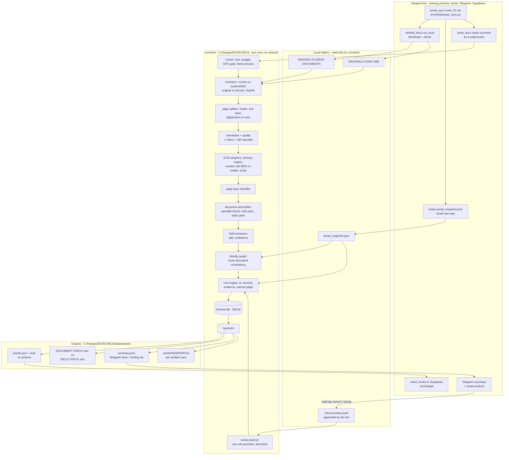

# OCR document checker: a separate program for the "check whole documents and report" step

Draft plan, accuracy angle. Planning only: nothing was run, built or installed.

- Code citations are `path:line` in the staging clone `C:/Hangeul/JARVIS/socials/repo` (HEAD `8317741`, the same code the live bot in `C:/Hangeul/BOT` runs).
- Numbers marked "fact" come from the owner's sessions on this PC, not from the code.
- Every name, passport number, date and amount in the examples is a placeholder.

---

## 1. What the step does today

1. **Inputs.** Each student has a folder `<DOCS_ROOT>/<PROGRAM>/<NAME (PASSPORT)>/`, and the passport number comes from the folder name (`src/verify/doc_verifier.py:40`, `:1100-1117`). `verified_docs.run_local` fills these folders every 15 minutes. Files over 2 MB are re-rendered as JPEG-only PDFs or JPEGs, and the original goes to `... - ORIGINALS OVER 2MB` (`src/sheets/verified_docs.py:249-327`). The portal CSV export is keyed by passport number (`doc_verifier.py:1120-1126`). Fact: about 1.4 GB, 158 students on 30 Sep.
2. **Document types.** There are 17 keys, recognised only from the **file name**, and the longest pattern wins (`src/verify/rules.py:56-74`, `doc_verifier.py:1036-1045`). Nine documents are required, and ten for MASTER (`rules.py:78-87`). A file whose name matches nothing goes to "other" and is never checked (`doc_verifier.py:1053-1058`).
3. **OCR.** If a PDF page has more than 80 characters of text layer, that text is used. Otherwise the page is rendered at 150 dpi and read with EasyOCR 1.7.2, English only, on the GPU (`doc_verifier.py:52-61`, `:122-150`; `requirements.txt:13-17`). For NID, bank and academic files the pages are read a second time, separately, at 200 dpi (`doc_verifier.py:92-119`). A page that gives fewer than 300 characters is OCR'd again at up to 3 rotations (`:64-89`). The passport watcher has its own CPU EasyOCR with ICAO MRZ check digits (`src/scraper/ocr_validator.py:79`, `:248-372`), but the document check does not use it.
4. **Check families.**
   - Per-document rules (`CHECKS`, `doc_verifier.py:913-925`) for passport, photo, birth certificate, NIDs, family certificate, academic file, bank, financial papers and income tax.
   - e-Apostille page structure (`src/verify/page_checks.py:379-452`).
   - Colour, QR and Bangla checks on every file except the photo (`page_checks.py:138-184`, called at `doc_verifier.py:1076-1080`).
   - Cross-document checks of names, date of birth, passport number and affidavit (`doc_verifier.py:956-1032`).
   - A field check of 24 portal fields against the documents (`src/verify/field_check.py:39-56`, `:95-158`).
5. **Verdict levels.**
   - Each finding is PASS, FLAG, FAIL or NOTE.
   - A file's row takes its worst finding, and a required document with no file gives a MISSING row.
   - A student is INCOMPLETE if anything is MISSING, else FAIL, else REVIEW, else PASS (`doc_verifier.py:1060-1096`).
   - Fields are MATCH, DIFFERS, UNREADABLE, NO DOCUMENT or BLANK (`field_check.py:36`, `:205`).
6. **Caches.**
   - `data/verification/text/<PASSPORT>.json` holds the OCR text, keyed `name:size:mtime:max_pages` (`src/verify/auto_verify.py:168-234`).
   - `results.json` is the only store of results (`:136-151`).
   - `auto_verify.lock` allows one pass at a time (`:83-97`).
7. **Outputs.**
   - `DOCUMENT CHECK.xlsx` and `FIELD CHECK.xlsx` (`auto_verify.py:339-449`).
   - A "Document check" Telegram message (`:542-562`, sent by `src/sheets/auto_sync.py:467-471`).
   - Supabase records published by `src/cloud/sheet_hooks.py:266-333`. Fact: 158 `doc_check`, 2717 `doc_verdict`, 3490 `field_check` and 3469 `doc_page_text` records.
8. **How it starts.**
   - The bot's `portal_sync` runs every 15 minutes (`src/bot/scheduler.py:459-466`). It starts an `auto_sync` child, which calls `auto_verify.run(budget=6)` (`auto_verify.py:59`, `:453`). The child is killed after 3600 s (`scheduler.py:409-413`).
   - There is also a command line (`auto_verify.py:565-605`) and bootstrap phase 5 `--recheck --budget 0` (`bootstrap.py:93-100`).
9. **Time (fact).**
   - About 93 s per student in a fresh process per 5 students. One profiled student: `read_document` took 30 s, with a 2.2 GB peak.
   - A cached re-check takes about 6 s.
   - One long process degrades to about 570 s per student (7 GB VRAM plus 6 GB spilled into RAM).
   - Phase 5 took 2 h 26 min for 144 students.
10. **Results (fact).**
    - First full check, 144 students: FAIL 61, REVIEW 65, INCOMPLETE 15, PASS 3.
    - Field check: 2801 MATCH, 1 DIFFERS.
    - 47 of the 61 FAILs come from "page 1 is not an e-Apostille" (`page_checks.py:404-407`). 57 FLAGs say "apostille not followed by its certificate" (`:420-423`).

---

## 2. What is wrong or limiting today

| # | Problem | Evidence |
|---|---|---|
| P1 | **The whole document is not read.** Under the automatic pass the whole-file text covers only the first 6 pages. Image checks cover the first 4 pages. Per-page reads stop at 8 pages (NID), 10 (bank) or 20 (academic). | `auto_verify.py:191` (wrapper default 6, while the command line reads 20, `doc_verifier.py:122`); `page_checks.py:20`, `:30-32`; `doc_verifier.py:474`, `:731`; `page_checks.py:327` |
| P2 | **Document type comes from the file name, and page roles are assumed.** A misfiled upload is checked under the wrong rules. A file whose name matches no pattern is ignored. The bank rule assumes "page 1 = solvency, pages 2+ = statement". | `doc_verifier.py:1036-1058`, `:725-736` |
| P3 | **OCR confidence and positions are thrown away.** Every `readtext` uses `detail=0`, so no finding can say where on the page it looked or how sure the read was. A FAIL can come from a single misread digit. | `doc_verifier.py:74`, `:80`, `:97`, `:131` |
| P4 | **Bangla is invisible on scans.** The reader is English only, so the "Bangla with no translation" FAIL can only fire on a PDF text layer, never on a scanned original. | `doc_verifier.py:60`; `page_checks.py:175-184` |
| P5 | **Orientation is handled by guesswork, and photos are not turned at all.** A page is rotated only when it gives fewer than 300 characters, which costs up to 4 OCR passes. JPG/PNG files go straight to `readtext` with no rotation retry. | `doc_verifier.py:64-89`; `:96-97`, `:127-131` |
| P6 | **Truncated or failed reads are cached as final.** An exception during a rotation retry is swallowed and the shorter text kept. The cache wrapper stores whatever came back, including the `[unreadable: ...]` string. The key is name, size and time, not content, and carries no engine version. Fact: an out-of-memory error during OCR left truncated text cached. | `doc_verifier.py:79-82`, `:135-136`; `auto_verify.py:195-203` |
| P7 | **The same pages are OCR'd more than once.** The whole-file read (150 dpi) and the per-page read (200 dpi) are separate OCR passes. Images are rendered again at 150, 200 and 250 dpi for seals, colour and QR. Image checks are never cached. | `doc_verifier.py:110`, `:145`; `page_checks.py:20`, `:275`, `:346`; docs `programs/verify.md:362-363` |
| P8 | **GPU memory grows and nothing guards the GPU.** Fact: 90 s rose to 570 s per student in one long process. Fact: EasyOCR peaks at 3.9 GB, and a game on the same card made OCR about 10x slower. The VRAM guard was offered but not decided. | REFERENCE 11 B19, 07 §10.1, decision 14 |
| P9 | **Some evidence is too weak for a FAIL.** | |
| | - Birth certificate DOB: PASS if any date, or even any **year**, on the birth certificate equals any date on the passport text, which includes the issue and expiry dates. If none match it is a FAIL, with nothing anchored on the MRZ. 16 FAILs came from this rule (REFERENCE 07 §10.8), and boxed digits are a known OCR failure (`:407`). | `doc_verifier.py:392-410` |
| | - Passport expiry is taken from the **portal** value when it exists, so the rule checks the portal rather than the document. | `doc_verifier.py:309-315` |
| | - Passport number is a substring test on the whole text. | `doc_verifier.py:327-331`, `:1010-1015` |
| | - Bank minimum uses the highest number between 100,000 and 100,000,000 anywhere in the first 6 pages. | `doc_verifier.py:686-696`, `:292-299` |
| | - Notarisation counts the word list, which contains "affidavit", OR any violet or red blob over 0.08% / 0.15% of the page. A bank seal or a red logo therefore counts. | `rules.py:92`; `page_checks.py:268-291` |
| | - NID name check uses the first word of the portal name. For a name beginning with "MD" that test is almost always true, because `name_tokens` (which drops honorifics) is not used here. | `doc_verifier.py:453`, compare `:930-933` |
| | - "Online birth certificate" is PASS on the substrings "online" or "qr" anywhere in the text. | `rules.py:101`; `doc_verifier.py:383-386` |
| P10 | **"Broken" and "could not read" are mixed.** An unreadable apostille QR is a FAIL even when the decoder, not the scan, is weak. pyzbar silently drops out if its DLL is missing. A colour judgement that cannot be made is a FLAG. There is no common rule for when uncertainty may become a FAIL. | `page_checks.py:386-394`, `:100-103`, `:145-146` |
| P11 | **The degraded copy is checked, not the original.** Shrinking re-renders every page as a JPEG at quality 45-70 and 950-1754 px, which **drops the text layer**. `is_digital` then calls a computer-made statement a "scan", so it falls under the colour rule (12 black-and-white FAILs include bank files). QR codes and small print are read off a lower-quality image. The originals are kept but never read. | `verified_docs.py:256-267`, `:316-319`; `page_checks.py:40-65`, `:142-153` |
| P12 | **Replaced uploads stay in the folder and are checked too.** A re-download only adds missing files. Texts of one key are joined, so an old rejected file keeps the student at FAIL. | `verified_docs.py:387-388`; `doc_verifier.py:1072` |
| P13 | **Rules have no identity.** A finding is the string `LEVEL: text` joined with vertical bars. Changing a severity needs a code commit (`f74e45d`). There are no per-rule numbers. One root cause gives two findings: 47 FAILs plus 57 dependent FLAGs from the certificate-then-apostille order. | `doc_verifier.py:1084`; `page_checks.py:404-407`, `:420-423` |
| P14 | **Dormant and dead rules.** Apostille subject mismatch needs `apostille.json`, which was lost. The passport seal check is disabled. The TIN name is unreadable for 17 students. The income-tax "tax paid" rule can only pass on 100,000-999,999. | `page_checks.py:295-311`, `:442-445`; `doc_verifier.py:332-334`, `:898-905`; REFERENCE 11 B18 |
| P15 | **The field check almost never says DIFFERS.** Names, addresses and GPAs can only MATCH or be UNREADABLE. Fact: 1 DIFFERS against 364-424 UNREADABLE. | `field_check.py:158` |
| P16 | **The passport false-alarm mechanism is still in the shared MRZ code.** `_repair_doc_number` tries the leading-letter fix and up to about 10 single swaps until *some* check digit agrees. `passport_no_ok` alone is then trusted as a MISMATCH. Fact: one false alarm on 28 Sep, and the fix is deferred. | `ocr_validator.py:248-262`, `:799`, `:809-812`; REFERENCE 11 §C |
| P17 | **The store is fragile and the rules are untested.** An unreadable `results.json` is silently replaced by a near-empty one. No test calls a rule function. "Every false positive so far was found by the manager looking at a document". | `auto_verify.py:136-144`, `:505`; docs `programs/verify.md:359`, `:1064`; REFERENCE 07 §10.6 |
| P18 | **Smaller traps.** `TODAY` is fixed at import. An unknown program is checked as KLP. One student is hidden by `SKIP_PASSPORTS`. `compress_docs.py` overwrites files in place with no backup and points at a hard-coded `E:` folder. | `doc_verifier.py:42`, `:1131`; `auto_verify.py:55-56`, `:158`; `compress_docs.py:7`, `:73-81` |

**What this means for trust.** Of 144 students only 3 PASS. Staff cannot tell from the report which FAILs are real guideline breaches (decision 18: apostille order is real), which are OCR misreads (likely many of the 16 birth-certificate DOB FAILs), and which come from the copy rather than the document (P11).

---

## 3. Goals and non-goals

**Goals**

- G1. Read every page of every *current* file of a student, and classify each page by its **content**, not by its file name.
- G2. Give every finding a rule id, a rule version, a severity and evidence: file, page, box on the page, the text seen, its confidence, and the engine.
- G3. Never issue a FAIL from a low-confidence read or a poor page. "Cannot judge" is its own outcome, reported separately from "broken".
- G4. Build a cross-document identity matrix (name, father, mother, DOB, passport number, NID numbers) anchored on check-digit-verified MRZ values.
- G5. Let staff confirm or overrule a finding with one tap. Track precision per rule, and demote a noisy FAIL rule to FLAG automatically. Only the owner can promote a rule.
- G6. Prove accuracy on a hand-checked set and on a full parity diff against today's `results.json` before switching.
- G7. Fit this PC: at most 120 s per student cold (p90), at most 10 s cached, at most 3.0 GB VRAM by design (3.5 GB hard bar), and never cache a failed or truncated read.
- G8. Run fully local: no network at run time, and no cloud OCR or cloud model.
- G9. Be a drop-in for the bot: produce the same `results.json` schema, text cache and workbooks, so the brief, Supabase publishing and the phone app keep working with no change to their readers.

**Non-goals for v1**

- N1. No portal login or download. The bot keeps `verified_docs`.
- N2. No Telegram token of its own (R15: one bot instance per token). The bot sends what the checker writes.
- N3. No Supabase publishing and no schema change on the Jeannie side.
- N4. No change to the guideline decisions:
  - "page 1 is not an e-Apostille" stays FAIL (decision 18);
  - the bank date rule and the "one qualification" rule stay FLAG until proven (decision 7).
- N5. The passport watcher (`ocr_validator.py`) is not replaced. Its MRZ code is reused with the false-alarm fix, so the watcher can adopt it later.
- N6. No forgery or authenticity judgement, only consistency and guideline compliance.
- N7. No opening of QR links (apostille or BDRIS) online.
- N8. No desktop GUI. Reports go out through Telegram, Excel and the existing phone app.

---

## 4. The design

### 4.1 Architecture



### 4.2 Components

| Component | What it does | Reuses from today |
|---|---|---|
| Runner | Command line `ocrcheck run --budget 5`, `recheck --rules-only`, `inventory`, `eval`, `parity`. Takes one lock (PID and age, as today). Runs at most 5 students per process (fact: steady at about 93 s per student). Applies the GPU gate (4.6) and handles out-of-memory errors (4.6). | `auto_verify._pid_alive`, `_lock_held` (`auto_verify.py:62-97`), `pending` ordering idea (`:154-164`) |
| Inventory | For each student folder: (1) files, with a sha256 of content; (2) which files are **current**, from the portal file list in `.download_complete` (`verified_docs.py:395-396`) and the upload time in `passport_<uid>_<unixtime>` names; (3) **superseded** files, which give a NOTE and are not checked; (4) the **original** of each shrunk file at the same sub-path under `ORIGINALS OVER 2MB` (`verified_docs.py:316`). Content is judged on the original. Properties of the file staff will upload (format, size, page order) are judged on the copy. | `doc_verifier.student_folders` (`:1100-1117`), `classify` (as a hint only), `verified_docs.LOCAL_DONE_MARKER`, `BACKUP_ROOT` |
| Page splitter | Renders each page **once** at 300 dpi from the original, keeps its text layer, and labels the page *digital-born* (25 or more text words, as `is_digital` does, but per page and on the original) or *scan*. Images are one page each. There is no page cap. | `page_checks.is_digital` (`:40-65`), `_pages` (`:20-37`) |
| Quality and orientation | Upright angle (0/90/180/270) per page from an orientation model or Tesseract OSD, run before OCR, for images too. Blur (variance of the Laplacian), effective dpi, contrast, cut-off text at the page edge, and coloured-pixel share (the same HSV test as today, `page_checks.py:107-111`). Gives a grade A, B or C per page. Grade C makes the rules on that page "cannot judge" and raises one FLAG `Q-SCAN` ("re-scan needed"). | `page_checks.inspect` colour metric, `R.MIN_COLOUR_PERCENT` (`rules.py:42`) |
| QR cascade | zxing-cpp, then pyzbar, then OpenCV, at 300 dpi and again at 2x on the detected QR box. "Unreadable" is reported only when all three fail at both scales on a grade A or B page. Decoded payloads are kept as evidence. Nothing is fetched. | `page_checks._clean_code` (`:68-81`), `page_codes` (`:327-367`), `APOSTILLE_HOSTS` (`:314`) |
| OCR adapters | One interface `read(page_image) -> words[{text, conf, box}]` per engine. Primary engine on the full page, plus a **re-reader** that OCRs only the crops a FAIL would depend on (dates, ID numbers, amounts, MRZ band) at full resolution with a character allowlist. Script detection (Latin or Bengali) per text line. | `doc_verifier._ocr_reader` settings (`verbose=False`, `:57-60`); `ocr_validator._prepare`, `_ocr_items`, `_rows` (`:157-211`) |
| Page classifier | Gives each page a type: e-Apostille, SSC/HSC/Diploma/Bachelor/Master certificate, transcript or marksheet, passport data page, NID card original, NID translation, BDRIS birth certificate, birth translation, family certificate, notary or affidavit page, solvency certificate, bank statement page, trade licence, TIN certificate, tax return or acknowledgement, photo, blank, other. Step 1 is transparent keyword, layout and QR-host rules (MRZ present, `apostille.mygov.bd` host, Bangla share, ID-card aspect ratio, table density). Step 2 is a small scikit-learn logistic regression on OCR tokens and image features, trained on the gold pages. Below 0.7 probability the type is "unknown", which is a FLAG and never guessed. | `page_checks.LEVELS` regexes (`:318-324`), `rules.FILE_PATTERNS` words (`:56-74`) |
| Document assembler | Groups pages into logical documents across file boundaries. (1) Apostille blocks are paired in **both** directions, so a certificate-then-apostille file still shows which qualification each apostille covers. (2) NID original pages are paired with their translation. (3) Bank: the solvency page and the statement pages are found wherever they are. (4) Notary pages are attached to the document they certify. | `page_checks.academic_check` block logic (`:409-451`) |
| Field extractors | One extractor per page type. Each gives `Field{name, raw, normalised, file, page, box, engine, conf_raw, conf_cal, validators, level}`. Validators: ICAO check digits; a passport number shape; NID length 10/13/17; Bangla digits ০-৯ mapped to 0-9; real calendar dates; amount ranges. | `find_dates` (`doc_verifier.py:193-276`), `money_value`, `find_money_taka` (`:279-299`), `nid_numbers` (`:414-437`), `issue_date` (`:513-533`), `statement_date` (`:651-681`), `taxpayer_name`, `proprietor_name` (`:772-803`); MRZ: `compute_icao_check_digit`, `parse_mrz_line1/2`, `_line2_at`, `_find_mrz` (`ocr_validator.py:109-372`) |
| Identity graph | Canonical values per student for name, father, mother, DOB, passport number, expiry, NID numbers and district. MRZ values are the anchor, but only when line 2 is sane (4.3.d). Every document's value is compared to the anchor and to the portal: agrees, one letter off, differs, or not readable. | `name_tokens` (`doc_verifier.py:930-933`), `ocr_validator._HONORIFICS`, `_levenshtein`, `_split_merged`, `_name_diff`, `compare_names` (`:552-672`) |
| Rule engine | A registry of rules (4.3.f). Outcome is PASS, VIOLATION, CANNOT_JUDGE or NOT_APPLICABLE. Severity comes from `rules.toml`. A central **guarded FAIL** applies. Root-cause suppression folds dependent findings. Rule versioning means a rule change re-runs from stored fields in seconds, with no OCR. | every `check_*` in `doc_verifier.py:307-908`, `page_checks.colour_check`, `qr_check`, `bangla_check`, `academic_check`, `cross_checks`, `field_check.check_field`; constants in `rules.py` |
| Review learner | Reads `inbox/reviews.jsonl` written by the bot. Ties each review to a stable finding id. Keeps per-rule stats and applies the demotion policy (4.3.g). | none (new) |
| Reporters | Writes a v1-compatible `results.json` and `text/<PASSPORT>.json` with the same key formats, so `sheet_hooks.py` and `brief.py:332-342` read them unchanged. Also writes workbooks v2, `summary.json` and per-student cards. | `auto_verify.write_document_report`, `write_field_report`, `_cell`, `summary_lines`, `_first_problem` (`:318-562`) |
| Evaluation harness | Gold-set scoring, the engine bake-off, and a parity diff against the bot's `results.json` (read-only). | none (new) |

Reused code is **copied** into `ocrcheck/legacy/` from commit `8317741` with its own tests, not imported from the bot. This way a bot change cannot silently change the checker, and the checker's venv never imports bot settings or `.env`.

### 4.3 What makes whole-document checking trustworthy

#### a. Page splitting and page types replace file names

- The file name stays as a *hint*. When the content disagrees with the slot (for example a bank statement uploaded as `passport_...`), the finding `INV-MIS` (FLAG) says so, and the pages are checked under the type they really are.
- A required document is MISSING only when **no page of that type** exists anywhere in the folder, not when no file name matches (P2).
- No page caps. A 30-page bank statement is read in full (P1).
- Superseded uploads are listed as NOTE `INV-SUP`. They never drive a verdict (P12).

#### b. Orientation and quality first, OCR second

- One orientation decision per page before OCR. This replaces "OCR, then retry 3 rotations if under 300 characters" (P5, P7). Phone photos (JPG/PNG) go through the same step.
- Each page gets a grade. A FAIL may only be raised on a grade A or B page. On grade C the rule gives CANNOT_JUDGE, and the page gets one `Q-SCAN` FLAG with the measured reason, for example "blurred: sharpness 41, needs more than 100" or "page cut at the bottom edge".
- The colour rule runs per page on the **original**. A digital-born page (detected on the original, which still has its text layer) is exempt, as today's code intends but cannot see after shrinking (P11).

#### c. OCR engines: what is used today, the local alternatives, and what I would test

| Engine | Runs here how | English print | Bangla | MRZ | Confidence + boxes | VRAM / CPU | Windows + RTX 5060 (Blackwell, cu128) risk | Licence | Verdict |
|---|---|---|---|---|---|---|---|---|---|
| **EasyOCR 1.7.2** (today) | PyTorch 2.11 cu128 in the bot venv | good on scans, weaker on stamps and tables | has a Bengali model (`['bn','en']`), unused today | works; the passport watcher uses it on CPU | yes (`detail=1`), discarded today | fact: peak 3.9 GB; can drop with a smaller `canvas_size` and batch 1 | none: proven on this PC | Apache-2.0 | **Test (baseline)** |
| **PaddleOCR PP-OCRv5 via RapidOCR (ONNX)** | onnxruntime on the **CPU** (Ryzen 5 8600G, 6 cores / 12 threads); GPU only if a CUDA 12.8 build runs on sm_120 | usually strong on printed documents | must be confirmed for the version tested; do not rely on it | ordinary text recognition, so needs an allowlist and check digits | yes | could be **zero VRAM** on the CPU, which leaves the GPU to the LLM and games | Paddle GPU wheels on Blackwell under Windows uncertain; CPU onnxruntime safe | Apache-2.0 | **Test (CPU / zero-VRAM candidate)** |
| **docTR** (DBNet + CRNN/PARSeq) | PyTorch, same cu128 torch | good on documents; has page and crop orientation models | no | via allowlisted re-read | yes, per word | about 1-2 GB expected; measure | low (torch already proven) | Apache-2.0 | **Test (GPU candidate)** |
| **Tesseract 5** (portable, no admin install) | CPU | good on clean 300 dpi print, weak on photos and stamps | `ben` model; **OSD gives orientation and script per page** | an OCR-B / `mrz` model exists as a second, independent reader | yes (TSV) | zero VRAM, about 0.5-1 s per page | none | Apache-2.0 | **Test (orientation, script, second MRZ reader)** |
| Surya OCR | PyTorch | strong | yes | — | yes | heavier; measure batch sizes | probably works | GPL code; model licence restricts commercial use above a revenue threshold, so read it first | Only if Bangla *reading* turns out to be needed |
| Vision LLMs (Qwen2.5-VL 3B through Ollama, PaddleOCR-VL, GOT-OCR2) | GPU | fluent | some | — | **no reliable confidence** | 2.5-4 GB, and must not sit beside qwen3:4b | varies | varies | **Rejected as text source**: a model that "corrects" a name or digit is exactly the failure a checker must not have. Could come back later as a page-type tie-breaker only. |
| Cloud OCR (any) | — | — | — | — | — | — | — | — | **Excluded** by the owner (privacy) |

**Bake-off (phase 1).** All candidates run on the same gold pages.

- Labelled measures: field accuracy on typed truth values, keyword recall per page type, seconds per page (GPU and CPU), and peak VRAM measured through NVML.
- Label-free measures on all 158 students:
  - the share of passports whose MRZ passes **all** check digits;
  - the share of NIDs whose original and translation numbers agree;
  - the share of date fields that parse to real dates.
- Decision rule: EasyOCR stays primary unless a challenger beats it by at least 3 points of field accuracy, or matches it with at least 40% less time or VRAM. Changing the engine has costs: new failure modes and re-OCR of everything.
- A CPU-only candidate wins the "GPU-free mode" if it reaches at most 150 s per student. That mode would remove the GPU conflict entirely (4.6).

**MRZ design** (fixes P16 for both programs):

1. Find the MRZ band: a passport data page has two 44-character lines at the bottom (TD3, `ocr_validator.py:44`).
2. Read the band twice: the primary engine with allowlist `A-Z0-9<`, and Tesseract with an OCR-B / MRZ model.
3. Line 2 is "sane" only when nationality equals line 1's state, **or** at least 2 check digits agree. This is the deferred plan in REFERENCE 11 §C, applied to `_line2_at` / `parse_mrz_line2` output (`ocr_validator.py:265-321`).
4. A field is HIGH only when it is check-digit valid on a sane line **and** both readers agree, **or** the composite check digit passes.
5. `_repair_doc_number` single swaps (`:257-261`) may only *propose* a reading. A swapped value is never HIGH.
6. A one-character difference from the printed page or the portal is a FLAG that names the position and both characters.
7. Every passport alert names the scan file and its upload date.

**Bangla.**

- Script detection on every line (Tesseract OSD, or the share of Bengali characters from an `['bn','en']` pass). This makes `SC-BN` work on scans (P4).
- Bangla is read for **numbers only**: NID and birth-registration numbers and dates on originals, with ০-৯ mapped to 0-9. That is enough to compare original and translation.
- Full Bangla text reading is not needed for any rule in `rules.py`.

#### d. Per-field confidence

Each field gets a level:

- **HIGH**: (a) a validator proves it, such as ICAO check digits on a sane MRZ line, **or** (b) two independent reads agree (two engines on the same crop, or two documents) **and** the calibrated confidence is at least 0.9.
- **MEDIUM**: one read, calibrated confidence at least 0.8, and the format is valid.
- **LOW**: anything else.

Raw engine confidence is **calibrated** on the gold set: binned against the observed exact-match rate per field type, so "0.9" means 9 in 10 correct on this agency's documents. Calibration is checked again at every engine or model change.

#### e. Cross-document consistency (identity graph)

The anchors are MRZ values on a sane line, with check digits passing: name (line 1, if well formed), DOB, passport number and expiry. Each identity document's extracted values are then compared with the anchor and with the portal:

- Names: tokens with honorifics removed (`_HONORIFICS`, `ocr_validator.py:552`), merged tokens split, and per-token Levenshtein (`_name_diff`, `:595`).
- Results: **agrees**, **one letter off** (FLAG: "spelling or OCR? both readings shown"), **differs** (FLAG, or FAIL only when both sides are HIGH and the affidavit rule applies), **not readable**.
- Staff overrules can record a per-student equivalence, for example "<NAME-SPELLING-1> = <NAME-SPELLING-2> for this student", so the same pair does not raise a flag again. The equivalence is never global.
- The same graph feeds the field check. A name can now **DIFFER** when the document side is HIGH (fixes P15). "UNREADABLE" stays only for LOW reads.

#### f. Rule engine

Each rule is a Python function with metadata. The defaults live in code, and `rules.toml` (read with stdlib `tomllib`) can override severity without a code change:

```toml
# rules.toml - owner-editable; every line says why
[AC-ORD]   # page 1 of the academic file must be the e-Apostille
severity = "FAIL"
pinned   = true          # decision 18: never auto-demoted
[BK-DATE]  # solvency date = statement generation date
severity = "FLAG"        # decision 7: FLAG until proven on real documents
[AC-ONE]   # one qualification per apostille block
severity = "FLAG"        # decision 7
```

Engine guarantees:

1. **Guarded FAIL.** A VIOLATION whose severity is FAIL is issued only if every *deciding field* is HIGH and every deciding page is grade A or B. Otherwise it becomes a FLAG with the text "would be FAIL, but the reading is not certain". The guard counts how often it fires, per rule.
2. **Absence must be proven.** A rule about something missing (no apostille QR, no notarisation, no USD) may FAIL only when the relevant pages were found by type, all were read at grade A or B, and every decoder was tried.
3. **Root-cause suppression.** A rule can declare `suppressed_by = ["AC-ORD"]` for the same file. The 57 "apostille not followed" FLAGs then appear under the one AC-ORD FAIL ("also: the last apostille has no pages after it") instead of as separate FLAGs. They still show in the card, but they do not add to the FLAG count.
4. **Evidence on every finding**: file name, the sha256 prefix of the content, page, box, text seen (up to 120 characters), confidence, engine and version, and a crop path for FLAG and FAIL.
5. **Stable finding id**: `sha1(rule_id | passport | file sha256 | page | evidence key)`. A review stays attached to the same finding across re-runs. A new upload gives a new finding.

**Rule catalogue** (every rule today mapped to an id; severity is the v1 default):

| Id | Rule | Today | v1 severity | What changes |
|---|---|---|---|---|
| PP-EXP | Passport valid at least 12 months | `doc_verifier.py:309-326` | FAIL | Expiry from the MRZ, then the printed page; the portal value only in the field check |
| PP-NUM | Portal passport number on the scan | `:327-331` | FLAG | MRZ number from a sane line 2; one-character difference named |
| PH-RAT / PH-RES / PH-CON | Photo ratio, resolution, contrast | `:346-352`, `:369-371` | FLAG | — |
| PH-BG | Photo background white | `:353-368` | FAIL | Sample above a detected face box, not a fixed top band |
| PH-FMT | Photo is JPG/JPEG | `:374-375` | FAIL | Judged on the file staff will submit; the original upload's format given as a NOTE |
| PH-EAR | Female applicant: both ears visible | `:376-377` | NOTE | — |
| BC-ONL | Online (BDRIS) birth certificate | `:383-386` | FLAG | Page type plus QR host, not the substring "online" or "qr" |
| BC-NOT / NID-NOT / FC-NOT / FN-NOT | Notarised | `:387-388`, `:442-443`, `:549-550`, `:855-857` | FAIL | A notary page or notary stamp on the document or its translation; the bare word "affidavit" and red bank seals no longer count |
| BC-DOB | Birth certificate DOB = passport DOB | `:392-410` | FAIL (guarded) | Anchor is the MRZ DOB; the "same year anywhere" PASS is dropped; boxed digits re-read at full resolution |
| NID-PAD | Translation on a lawyer pad | `:444-445` | FLAG | — |
| NID-NAME | Person's name on NID and passport | `:449-464` | FLAG | All name tokens, honorifics removed (today only the first word, `:453`) |
| NID-NUM | NID number original = translation | `:471-509` | FLAG | Bangla digits read on the original |
| FC-AGE | Family certificate at most 3 months old | `:538-546` | FAIL (guarded) | The issue date field must be HIGH |
| FC-ISS / FC-NAME / FC-IDS | Issuer, name at top, ID numbers | `:547-560` | FLAG | — |
| AC-QR | Apostille QR present and readable | `page_checks.py:386-394` | FAIL (guarded) | QR cascade at two scales on the original before a FAIL |
| AC-ORD | Page 1 is the e-Apostille | `:404-407` | **FAIL, pinned** | One finding per file with the fix: "re-assemble: apostille, then its certificate and transcript" |
| AC-FOL | Apostille followed by its pages | `:420-423` | FLAG | `suppressed_by AC-ORD`; coverage judged in both directions |
| AC-ONE | One qualification per apostille block | `:432-439` | FLAG (decision 7) | Page classifier instead of regex `LEVELS` |
| AC-SUB | Apostille subject = following pages | `:442-445` | FAIL, dormant | Staff enter an apostille id's subject once; no network |
| AC-PRO | Provisional certificate | `doc_verifier.py:583-584` | FAIL (guarded) | Only on a certificate page, not anywhere in the file |
| AC-NOT / AC-NAME(3) / AC-GPA(2) | Notarised, names, GPAs | `:585-602` | FLAG | GPA read from the transcript page with HIGH confidence |
| AC-SIDE | Pages scanned sideways | `:572-575` | NOTE | — |
| BK-MIN | Balance at least the program minimum | `:686-696` | FAIL (guarded) | The balance figure on the solvency page by its label, not the highest number in 6 pages |
| BK-USD / BK-SEAL / BK-AGE / BK-HOLD | USD, seal, account age, holder | `:698-723`, `:756-762` | FLAG | — |
| BK-DATE | Solvency date = statement generation date | `:728-751` | FLAG (decision 7) | Pages found by type, not "page 1" |
| BK-ONE | Bank file has only one page | `:752-754` | FLAG | Becomes "no statement pages found" |
| FN-SPON / FN-HOLD / FN-KIND / FN-AGE / FN-NAME / FN-TIN | Financial papers | `:815-891` | FLAG | TIN name from the classified TIN page |
| FN-FY | Trade licence fiscal year is current | `:833-846` | FAIL (guarded) | — |
| TX-WLT / TX-PAID / TX-NOT | Income tax (MASTER) | `:899-907` | FLAG | Fix the dead "tax paid" logic (`:898`, `:903`) |
| SC-COL | Colour scan | `page_checks.py:138-153` | FAIL / NOTE | Per page, on the original; digital-born detected on the original |
| SC-QR | QR present but unreadable | `:156-172` | FLAG | QR cascade |
| SC-BN | Bangla with no translation | `:175-184` | FAIL (guarded) | Script detection works on scans |
| X-NAME / X-DOB / X-PNO | Cross-document name, DOB, passport number | `doc_verifier.py:961-1015` | FLAG | Identity graph (4.3.e) |
| X-AFF | Affidavit in the applicant's name | `:1017-1031` | FAIL (guarded) | — |
| REQ-MIS | Required document missing | `:1060-1064` | MISSING | By page type present |
| Q-SCAN (new) | Page too poor to judge | — | FLAG | Names the measurement |
| INV-SUP (new) | Superseded upload still in the folder | — | NOTE | — |
| INV-MIS (new) | Content does not match the file-name slot | — | FLAG | — |
| INV-UNK (new) | Page of unknown type | — | FLAG | — |
| OCR-ERR (new) | Page could not be read (out of memory, corrupt file) | — | FLAG, **never cached** | Retried next run |

The student verdict keeps today's order (INCOMPLETE, then FAIL, then REVIEW, then PASS) so the bot and the phone app read it the same way. Two counts are added: "to act on" (FAIL and MISSING) and "not judged" (CANNOT_JUDGE and Q-SCAN).

#### g. Human-review loop and learning

1. **Where staff review.** The bot adds two buttons to each FAIL and FLAG line it sends: **Correct** and **Wrong**. An optional **Fixed** means the student re-uploaded. A tap appends one JSON line `{finding_id, action, reason?, by_chat_id, at}` to `C:/Hangeul/OCRCHECK/data/inbox/reviews.jsonl`. Only the bot writes that file, so there is one writer. The checker reads it at the start of each run. An optional reason can be given: "OCR misread", "rule too strict" or "document is fine".
2. **Effect on the student.** An overruled finding no longer counts toward that student's verdict while the file is unchanged. The card shows "overruled by staff on <DATE>".
3. **Per-rule statistics.** For each rule: confirmed, overruled, fixed, precision, and the Wilson 95% lower bound, plus how often the guarded-FAIL guard fired.
4. **Automatic demotion.**
   - When a FAIL rule has at least 20 reviews and a precision lower bound under 0.80, it is demoted to FLAG in `rules.toml` state.
   - The owner gets one Telegram notice with the numbers.
   - **Promotion back to FAIL is owner-only**, matching decision 7.
   - Pinned rules (AC-ORD, decision 18) are never demoted; the owner only sees their numbers.
   - Demotion never goes below FLAG: a noisy rule still shows its findings.
5. **Learning beyond severity.**
   - Overrules marked "OCR misread" add that page to the labelling pool for the next bake-off round.
   - Threshold rules (colour percentage, photo background level, sharpness) store their measured value with each review. A monthly offline fit **proposes** a new threshold with the numbers, such as "SC-COL: 9 of 9 overruled findings had 0.03-0.06% coloured pixels". It is never applied automatically.
6. **Recall check.** Reviews only measure precision on what fired. Each month, 5 PASS or REVIEW students chosen at random are fully hand-checked to catch missed FAILs.

### 4.4 Technology choices

| Choice | Reason | Rejected alternative, and why |
|---|---|---|
| Python 3.12, **separate venv** in `C:/Hangeul/OCRCHECK` | Same language as the code being reused. torch 2.11 cu128 is already proven on this card (`requirements.txt:1-14`). Its own dependencies cannot break the bot. | Sharing the bot's venv: a Paddle, docTR or Tesseract wrapper could change versions under the bot. A rewrite in another language: loses the reusable parsers. |
| **SQLite** (stdlib, WAL) as the store, plus JSON exports | Atomic per-row writes. Corruption cannot wipe history the way an unreadable `results.json` can (P17). Queries per rule are easy. | One big JSON store (today's failure mode). A database server (one more service on this PC). |
| PyMuPDF 1.28.2 for rendering and text layers | Already pinned and proven. | pypdf: weaker rendering. |
| zxing-cpp + pyzbar + OpenCV for QR | zxing-cpp has no extra DLL; three decoders cut false "QR unreadable" FAILs. | pyzbar alone: it silently drops out when its DLL is missing (`page_checks.py:100-103`). |
| OCR engine chosen by **bake-off** on the gold set (4.3.c) | The decision rests on this agency's documents, not reputation. | Picking a fashionable engine in advance; vision LLMs as text source (hallucination); cloud OCR (owner said no). |
| Tesseract 5 portable for orientation, script and the second MRZ read | CPU, zero VRAM, independent of the primary engine, so its agreement means something. | A second GPU engine for the second read: doubles VRAM. |
| Page types: rules first, then scikit-learn logistic regression | Explainable and fast on the CPU; trains on a few hundred labelled pages. | A VLM classifier (VRAM and hallucination); a CNN (needs far more labels). |
| Rules in Python plus `rules.toml` severities | Each rule unit-tested; severities editable without code (P13). | A YAML rule language: harder to test, and the logic is not simple matching. |
| openpyxl 3.1.5 workbooks | Staff already use these files. | A new format staff must learn. |
| Reviews through the bot's Telegram buttons | Staff and the owner already live in Telegram; one tap. | A local web page (would have to listen on the LAN; `API_HOST=0.0.0.0` is already an accepted risk, REFERENCE 11 B3). A Google Form (a new cloud copy of findings). |
| Called by the bot's existing 15-minute slot | One GPU-heavy job at a time, under the bot's existing lock and 3600 s limit. | A separate Windows scheduled task: a second scheduler competing for the GPU with the bot's pass. (A night task is used only during shadow, 4.8.) |

### 4.5 Data it reads and writes

**Reads** (all read-only):

- `C:/Hangeul/VERIFIED STUDENT DOCUMENTS/<PROGRAM>/<NAME (PASSPORT)>/*` and each folder's `.download_complete` marker.
- `C:/Hangeul/VERIFIED STUDENT DOCUMENTS - ORIGINALS OVER 2MB/...`, at the same sub-path.
- `portal_snapshot.json`, written by the bot. It holds the raw CSV record and the progress-sheet row that `field_check.check_student` builds (`field_check.py:182-186`), keyed by passport. The checker never logs in to the portal and never holds portal credentials.
- `C:/Hangeul/BOT/data/passport_issue.json`, for the Passport Issue field, as today (`field_check.py:135-137`).
- `C:/Hangeul/OCRCHECK/data/inbox/reviews.jsonl`.
- Shadow phase only: `C:/Hangeul/BOT/data/verification/results.json`, for the parity diff.

**Writes** (only under `C:/Hangeul/OCRCHECK/data/`):

- `checker.db`: tables files, pages, ocr_runs, words (gzip JSON per page), fields, findings, reviews, rule_stats, runs.
- `cache/ocr/<sha256>/<page>-<engine>-<version>-<dpi>.json.gz`: written **only** after a complete page read, with a `complete: true` marker.
- `crops/<finding_id>.jpg`: evidence crops, only for FLAG and FAIL.
- `exports/`: `results.json` and `text/<PASSPORT>.json` (v1 schema and key formats), `summary.json`, `DOCUMENT CHECK.xlsx`, `FIELD CHECK.xlsx`, `cards/<PASSPORT>.txt`.
- `logs/ocrcheck.log`: metadata only (counts, timings, ids), never document text (R14).
- `ocrcheck.lock`.

Size estimate: OCR words for about 22 pages x 158 students at about 10 KB each is roughly 35 MB, and crops are about 20 MB. Small next to the 1.4 GB of documents.

### 4.6 Sharing the 8 GB GPU with the bot

**Budget on paper** (R12):

| Consumer | VRAM |
|---|---|
| Windows desktop (the monitor is on the RTX) | 1.0-1.4 GB |
| qwen3:4b-instruct, when loaded on demand (5-minute keep-alive) | about 2.6 GB |
| Checker OCR, target cap | **at most 3.0 GB** (EasyOCR peaks at 3.9 GB today; reduce `canvas_size` to about 1920, batch 1) |
| Total | about 7.0 GB of 7.96 usable |
| A game (3-4 GB) or voice (STT 2.2 + TTS 3.4) | no room left, so the checker waits or switches to the CPU |

**Rules the runner enforces:**

1. **Gate before each student.** It asks NVML (the driver's own count across all processes) how much memory is free, because `torch.cuda.mem_get_info` missed the resident model (R12). With less than 3.5 GB free it postpones the student and records "GPU busy: <x> GB free". After 4 postponed ticks in a row (1 hour) the owner gets one Telegram line. If the CPU engine meets the speed bar, the runner switches to CPU mode instead of waiting (owner decision D6).
2. **Hard cap.** `torch.cuda.set_per_process_memory_fraction(3.0 / 7.96)`, so the checker raises out-of-memory **inside its own budget** instead of spilling into shared RAM or squeezing the LLM.
3. **Out-of-memory handling.** Catch `torch.cuda.OutOfMemoryError`, mark the page `OCR-ERR`, write **nothing** to the cache, call `empty_cache()`, and stop that student (no partial verdict). It is retried next tick. Three failures on the same page: read that page on the CPU.
4. **Fresh process per 5 students** (fact: steady at about 93 s per student). Single pass per page, with no second whole-file read and no rotation retries (P7), so expected time is about 60-90 s per student cold. Estimate: about 22 pages x 1.8 s per page OCR (fact: 1.8 s per A4 page), plus about 15 s of CPU work run in parallel.
5. **Bulk re-checks** (a new engine or a new rule needing OCR) run at night, in batches of 5, never with a game open (REFERENCE 11 B19). A rule-only change needs **no OCR**: `recheck --rules-only` works from stored fields in seconds per student.
6. **Optional GPU-free mode.** If RapidOCR or Tesseract on the Ryzen CPU reaches at most 150 s per student, the checker can run without the RTX at all. Also worth measuring: onnxruntime-DirectML on the Radeon 760M iGPU, if it is enabled. The monitor is on the RTX, so the iGPU is idle, but it shares the 16 GB of system RAM.

### 4.7 Privacy: how it stays local

- No network code in the package: no HTTP client is imported. A test runs the whole pipeline with `socket.socket.connect` patched to raise.
- Models are downloaded once in a controlled setup step into `C:/Hangeul/OCRCHECK/models`, with sha256 pinned. At run time:
  - `easyocr.Reader(..., model_storage_directory=..., download_enabled=False)`;
  - `HF_HUB_OFFLINE=1`;
  - no automatic downloads anywhere.
- Optional and the owner's decision: a Windows Firewall outbound block for the checker's `python.exe`.
- Student data stays under `C:/Hangeul/OCRCHECK/data`. That folder is git-ignored, and it is outside the `JARVIS/socials` staging tree that is being prepared for GitHub.
- Logs carry ids and counts, never document text.
- The checker itself sends nothing anywhere. Whatever reaches the cloud goes through the bot as today:
  - Telegram lines carry names, as they do now.
  - Evidence crops are **not** sent unless the owner allows it (D7).
  - Today the bot publishes full page text to Supabase as `doc_page_text`. Whether that continues is a separate owner decision (D8).

### 4.8 How it fits with the bot

**Phase A: shadow.** The bot is unchanged.

- The checker runs at night (01:00-05:00, batches of 5, gate on) on all 158 students, or on demand, and writes only its own folder.
- Each week a parity diff against the bot's `results.json` is sent to the owner as a file.
- Until the bot writes `portal_snapshot.json`, the snapshot is rebuilt read-only from the bot's `results.json` field rows (`fields[<passport>].rows[].portal`). The Sponsor value is not there, so the bank and financial holder rules run as "cannot judge" in early shadow.

**Phase B: replace inside the tick.** Recommended. Four small, reviewed bot changes:

1. `auto_sync.verify_docs` (`src/sheets/auto_sync.py:315-327`) writes `portal_snapshot.json`, then runs `<OCRCHECK venv>/python -m ocrcheck run --budget 5 --snapshot <file>` as a subprocess with a 40-minute timeout (inside the 3600 s limit) when the setting `OCRCHECK_ENABLED=true`. Otherwise it calls `auto_verify.run` as today.
2. The bot's `VERIFICATION_DIR` setting (`src/config.py:111-112`) points to `C:/Hangeul/OCRCHECK/data/exports`. `sheet_hooks.py:246-333`, `brief.py:332-342` and `backfill.py` then read the v1-compatible files **unchanged**.
3. The bot sends `summary.json` lines (title "Document check", as `auto_sync.py:467-471`) with the Correct and Wrong buttons.
4. A `CallbackQueryHandler` appends the tap to `inbox/reviews.jsonl`. Only authorised chats are accepted (`telegram_bot.py:22-37`).

**Rollback:** set `OCRCHECK_ENABLED=false` and restore `VERIFICATION_DIR`. The old `src/verify` stays installed and untouched for at least a month.

**Rejected: Phase C (both run for good).** Two OCR jobs would compete for the same GPU and staff would get two verdicts.

### 4.9 Reports

| Report | Reader | Format | When |
|---|---|---|---|
| "Document check" message | staff and the owner | Telegram text, sent by the bot, buttons on FAIL and FLAG lines | each tick that checked someone |
| Student card | the owner on the phone; staff before submitting | plain text, sent by the bot on a tap ("show card") or a command; also `cards/<PASSPORT>.txt` | on demand |
| `DOCUMENT CHECK.xlsx` v2 | staff | Excel: today's sheets plus **Findings**, **Actions**, **By rule**, **Consistency** | rebuilt every tick |
| `FIELD CHECK.xlsx` | staff correcting the portal | Excel, as today; DIFFERS now possible for names | every tick |
| Noisy-rule notice | the owner | Telegram, one line per rule changed | on demotion only |
| Weekly accuracy line | the owner | Telegram: per-rule precision from reviews, guard firings, not-judged share | weekly |
| Phone app (Jeannie) | the owner | Supabase `doc_verdict` / `doc_check` from the v1 export. Rule ids appear in the detail text, e.g. `FAIL [AC-ORD]: ...` | as today |

**Example: Telegram message** (placeholders):

```
🔍 Document check: 5 checked, 9 waiting
 • <STUDENT A> (BACHELOR): FAIL
     [AC-ORD] academic file starts with the HSC certificate (p.1); re-assemble it with the apostille first
 • <STUDENT B> (KLP): REVIEW, 2 to look at
     [BK-DATE] solvency <DATE-1> vs statement <DATE-2> (p.1, p.3)
     [X-NAME] mother's name one letter off on 05 Mother NID p.2
 • <STUDENT C> (KLP): PASS (41 pages read, 0 not judged)
 • <STUDENT D> (KLP): REVIEW, 1 page too blurred to judge (06 Family p.2)
 • <STUDENT E> (EAP): INCOMPLETE, no bank statement pages found
   This tick by rule: AC-ORD x1 · BK-DATE x1 · X-NAME x1 · Q-SCAN x1
   [Correct] [Wrong] buttons under each FAIL/FLAG line
```

**Example: student card** (placeholders):

```
DOCUMENT CHECK · <STUDENT A> (<PASSPORT-A>) · BACHELOR
checked <DATE-TIME> · engines easyocr-1.7.2 + tesseract-5 · rules v1.0
Verdict FAIL · 1 to act on · 1 to look at · 0 not judged · 43 pages, 12 files (1 superseded, not checked)

TO ACT ON
 1. FAIL [AC-ORD] Academic file is ordered certificate -> apostille.
    Re-assemble: apostille, then the certificate and transcript it covers.
    evidence: academic_cert_<uid>_<time>.pdf p.1 = HSC certificate (type 0.98);
              p.2 = e-Apostille, QR apostille.mygov.bd/.../<APOSTILLE-ID> (zxing)
    also (same cause): the apostille on p.6 has no pages after it
    coverage: HSC has an apostille (p.2) ✓ · SSC has an apostille (p.6) ✓   <- only the order is wrong
TO LOOK AT
 2. FLAG [BK-DATE] solvency dated <DATE-1> (p.1 "Date: <DATE-1>", conf 0.96, HIGH)
    but statement generated <DATE-2> (p.3 "Generation Date: <DATE-2>", conf 0.71, MEDIUM)
CONSISTENCY   ✓ agrees · ~ one letter · ✗ differs · ? not readable · - not on this document
               Passport(MRZ ok) Birth  FatherNID MotherNID Family Academic Portal
 Name          ✓                ✓      -         -         ✓      ✓        ✓
 Father        ✓                ✓      ✓         -         ✓      ✓        ✓
 Mother        ✓                ✓      -         ✓         ✓      ?        ✓
 DOB           ✓ (check digit)  ✓      -         -         ✓      -        ✓
 Passport no   ✓ (check digit)  -      -         -         -      -        ✓
 NID numbers   -                -      ✓ orig=tr ✓ orig=tr ✓      -        -
PASSED 31 rules · SUPERSEDED: passport_<uid>_<old-time>.pdf (replaced by a newer upload)
```

**Example: `DOCUMENT CHECK.xlsx`, sheet "By rule"** (placeholders):

| Rule | Title | Severity | Students hit | Confirmed | Overruled | Precision (lower bound) | Guard fired | Status |
|---|---|---|---|---|---|---|---|---|
| AC-ORD | Page 1 is the e-Apostille | FAIL (pinned) | <n> | <n> | <n> | <p> (<lb>) | 0 | active |
| BC-DOB | Birth DOB = MRZ DOB | FAIL | <n> | <n> | <n> | <p> (<lb>) | <n> | watch |
| SC-COL | Colour scan | FAIL | <n> | <n> | <n> | <p> (<lb>) | <n> | demoted to FLAG on <DATE> |

Sheet "Findings" columns: Student, Passport, Program, Rule, Severity, Outcome, Document, File, Page, Evidence text, Confidence, Level, Review, Reviewed at.

Sheet "Actions": one row per student with the plain instruction staff must give the student, for example "re-assemble the academic file with the apostille first" or "re-scan the Father NID in colour".

---

## 5. Build plan

Sizes are working days for one developer with an AI assistant. Staff labelling time is listed separately.

| Phase | Deliverable | Reused (file: function) | New | Acceptance test | Days |
|---|---|---|---|---|---|
| 0. Skeleton and inventory | `C:/Hangeul/OCRCHECK` with its own venv (torch cu128 first, as `requirements.txt:3-9`), `ocrcheck inventory`, SQLite schema, lock, no-network test, labelling export | `doc_verifier.py`: `student_folders`, `classify`; `verified_docs.py`: `LOCAL_DONE_MARKER`, `BACKUP_ROOT` paths; `auto_verify.py`: `_pid_alive`, `_lock_held` | current/superseded/original mapping by marker and upload time; sha256 | Lists all 158 students; every file is current, superseded or original-mapped; counts equal the folders; the socket test passes | 2 |
| 1. Pages, OCR cache, bake-off | Single-pass page pipeline; orientation and quality grades; engine adapters (EasyOCR `detail=1`, RapidOCR, docTR, Tesseract); content-hash cache with completeness marker; GPU gate and cap; bake-off report | `doc_verifier.py`: `_ocr_reader` options, `read_pages` page loop; `page_checks.py`: `_pages`, `is_digital`, `inspect` colour test, `_clean_code`, `page_codes` | NVML gate, OOM handling, QR cascade with zxing-cpp | Bake-off table per engine (field accuracy, label-free MRZ and NID rates, s/page, peak VRAM). A simulated OOM writes nothing to the cache. Peak VRAM at most 3.0 GB with EasyOCR. | 5 |
| 2. Page classifier and assembler | Page types with probability; logical documents (apostille blocks both directions, NID pairs, bank parts, notary pages) | `page_checks.py`: `LEVELS`, `APOSTILLE_HOSTS`, `academic_check` block logic; `rules.py`: `FILE_PATTERNS` | keyword and layout rules, scikit-learn model, "unknown" at under 0.7 | Page-type accuracy at least 97% on gold test pages; every gold academic file's apostille coverage correct | 4 |
| 3. Fields, confidence, MRZ | Field extractors per page type; validators; calibration; two-reader MRZ with the sane-line rule | `doc_verifier.py`: `find_dates`, `money_value`, `find_money_taka`, `nid_numbers`, `issue_date`, `statement_date`, `taxpayer_name`, `proprietor_name`; `ocr_validator.py`: `compute_icao_check_digit`, `parse_mrz_date`, `parse_mrz_line1`, `_line2_at`, `parse_mrz_line2`, `_find_mrz`, `_repair_doc_number` (proposal only) | Bangla digit map, calibration bins, field level | HIGH fields at least 99.5% exact on gold. Regression test from REFERENCE 09 R9: a garbled line 2 with a passing document digit gives NOT_READ, a clean different number gives MISMATCH. 0 passport-number false alarms on all 158. | 5 |
| 4. Rule engine and all rules | Registry, `rules.toml`, guarded FAIL, proven absence, root-cause suppression, evidence, stable finding ids; every rule in 4.3.f ported with a unit test | every `check_*` in `doc_verifier.py:307-908`; `page_checks.py`: `colour_check`, `qr_check`, `bangla_check`, `academic_check`; `rules.py` constants | CANNOT_JUDGE, rule versions, `recheck --rules-only` | One test per rule id (today there are none). Parity diff on 158 students: every difference is explained as fixed (P-number) or a bug. Rules-only recheck under 10 s per student. | 5 |
| 5. Identity graph and field check | Consistency matrix; field check from the graph | `doc_verifier.py`: `name_tokens`, `cross_checks` thresholds; `ocr_validator.py`: `_HONORIFICS`, `_levenshtein`, `_split_merged`, `_name_diff`, `compare_names`; `field_check.py`: `SOURCES`, `_validity_consistent`, `_ocr_variant` | per-student name equivalences | The gold identity matrix is correct cell by cell; DIFFERS raised for names only from HIGH reads | 3 |
| 6. Reports | v1 `results.json` and `text/` export; workbooks v2; `summary.json`; cards | `auto_verify.py`: `write_document_report`, `write_field_report`, `_cell`, `_style_header`, `summary_lines`, `_first_problem` | Findings, Actions, By rule and Consistency sheets; card renderer | A **copy** of the bot's test suite for `sheet_hooks` and `brief`, pointed at the export, passes (run in a scratch copy, never against the live bot). The workbooks open in Excel. Telegram text stays under 4096 characters per message. | 3 |
| 7. Review loop | Inbox reader, review store, per-rule stats, demotion policy, weekly accuracy line; bot callback handler (a bot change, reviewed separately) | — | Wilson bound, pinned rules, per-student equivalences | Round trip in a test chat: tap Wrong, the finding is overruled, the student verdict is recomputed, stats update. Demotion fires on synthetic reviews; a pinned rule never demotes. | 4 |
| 8. Shadow, then switch | Night shadow runs; weekly parity diffs; the four bot changes of 4.8; rollback switch | — | parity report | The bar in §6 is met for 2 weeks, then the owner signs off; rollback rehearsed once | 3 + 2-4 weeks of calendar time |
| **Total** | | | | | **about 34 days** |

Staff time: about 2 days of labelling for the gold set (§6), plus one tap per finding afterwards.

---

## 6. How accuracy is measured

**The hand-checked (gold) set**

- **40 students** chosen to cover the problem areas:
  - all 3 PASS students;
  - 10 of the 47 AC-ORD students;
  - all 16 birth-certificate DOB FAILs;
  - all 12 black-and-white FAILs (including the bank files, to test P11);
  - the 4 fiscal-year, 4 apostille-QR, 3 family-certificate-age, 5 NID-notary, 1 bank-minimum and 1 photo-background FAILs;
  - 10 REVIEW and 5 INCOMPLETE students;
  - every program (KLP majority, BACHELOR, EAP, MASTER).
  Several of these overlap; fill to 40 with REVIEW students.
- They are split **20 dev / 20 test**. Thresholds and calibration are tuned only on dev. The switch decision uses only test.
- Labels, done by the owner plus one staff member looking at the **originals**, on this PC, in a local Excel sheet with page thumbnails:
  1. page type for every page of the 40 students (about 900 pages, about 1-2 hours);
  2. the truth for every finding either program raises on them (union of old and new);
  3. a **full** rule checklist for 10 students, to measure missed FAILs;
  4. typed truth values for key fields of 20 students: name, father, mother, DOB, passport number and expiry, NID numbers, family-certificate issue date, solvency balance, trade-licence fiscal year.
- Label-free checks on all 158 students: the MRZ all-check-digits rate, the NID original-equals-translation rate, and the valid-date rate.

**Numbers tracked**

| Level | Numbers |
|---|---|
| Per rule (gold) | true FAILs, false FAILs, missed FAILs, true PASS; precision and recall; the same for FLAG-severity rules; guarded-FAIL firings |
| Per rule (live) | confirmed, overruled and fixed from reviews; precision with Wilson 95% lower bound; status (active, watch, demoted) |
| Per student | verdict agreement with the human verdict; FAIL+MISSING ("to act on"), FLAG ("to look at") and not-judged counts |
| Fields | exact-match rate by field and by level (HIGH, MEDIUM, LOW); calibration curve; MRZ false alarms |
| Pages | page-type confusion matrix; share of grade C pages; OCR-ERR count; cached-incomplete count (must be 0) |
| Running | seconds per student (p50, p90, cold and cached); peak VRAM; postponed ticks |
| Parity | every difference from the old program on 158 students, labelled "fixed P-number", "new true finding" or "regression" |

**Bar for switching from the old step to the new program.** All must hold:

1. **No FAIL-severity rule below 95% precision** on the test set. Where a rule fired fewer than 10 times there, each instance is checked by hand instead. **Zero** false FAILs from BC-DOB, PP-EXP and PP-NUM.
2. **No lost true FAILs**: for each FAIL rule, recall is at least the old program's on the same students.
3. FLAG rows per student are **at most 80% of the old program's** on the same students (old: about 2.5 per student, 370 FLAG rows over 146 students), with the not-judged share reported separately.
4. HIGH fields at least **99.5%** exact; **0** passport-number false alarms across all 158 passports.
5. Student verdict matches the human verdict for at least **95%** of test students.
6. Two weeks of live shadow ticks with no crash, **0** incomplete reads cached, p90 at most 120 s per student cold, peak VRAM at most 3.5 GB.
7. The owner signs off the parity diff for all 158 students.

---

## 7. Risks and how each is handled

| Risk | Handling |
|---|---|
| The gold set is too small or biased, so the switch bar is met by luck | Stratified by FAIL rule (§6); dev/test split; the monthly recall audit and live reviews keep measuring after the switch |
| The new engine is worse on stamps, boxed digits or Bangla | The bake-off decides before any switch. EasyOCR stays the default. The number re-reader and the two-reader MRZ protect the fields that drive a FAIL. |
| Paddle or onnxruntime do not run on Blackwell (sm_120) under Windows | Tested in phase 1 week 1. Fall back to torch engines (EasyOCR, docTR), which are proven on cu128, or the CPU path. |
| GPU contention with the LLM, a game or voice causes slowdown, spill, or out-of-memory | NVML gate, hard per-process cap, fresh process per 5 students, out-of-memory never cached, night bulk runs, optional CPU mode (4.6) |
| The guarded FAIL hides real breaches as FLAGs | The guard firing count is reported per rule. If it fires often, the cause is read quality, and the fix is the re-reader or the scan, not loosening the guard. |
| Automatic demotion hides a real problem | Only FAIL to FLAG, never lower; at least 20 reviews needed; the owner is told; AC-ORD pinned; promotion is owner-only |
| Staff do not review, so there is no learning | One tap in Telegram; the owner alone is enough at first; the weekly line shows the review count |
| Bot integration breaks Supabase, the brief or the phone app | v1-compatible export with the same key formats; the bot's own tests run on a scratch copy; the shadow phase; a one-setting rollback |
| Shrunk copy and original disagree, or the original is missing | Mapped by sub-path and checked by content. If the original is missing, the copy is used and the finding says so. Deliverable properties are always judged on the copy. |
| Privacy leak through crops in Telegram, a git push of `data/`, or logs | Crops are opt-in (D7); `data/` is git-ignored and outside the GitHub staging tree; metadata-only logs; no network test |
| Model download needs the internet once | One controlled setup step, hashes pinned, then offline flags (4.7) |
| Rule meaning drifts between old and new, and staff are confused | The rule-id catalogue maps every old rule (4.3.f); the parity diff is labelled; detail text keeps today's wording plus the id |
| Scope creep: passport watcher, portal, apostille web lookups | Non-goals N1-N8; the passport-watcher switch is a separate later decision |
| Windows traps: cp1252, paths with parentheses, an Excel file locked open, heredocs mangling backslashes | Reuse REFERENCE 09 R13 W3-W5 and W12: UTF-8 stdout, `pathlib` only, write workbooks to a temporary file then rename, code written with file tools |
| One process stays alive past midnight (`TODAY` frozen, `doc_verifier.py:42`) | The date is taken per student, not at import |

---

## 8. Decisions the owner must make

| # | Decision | Options | Recommended | Why |
|---|---|---|---|---|
| D1 | How the program fits with the bot | (a) shadow, then replace inside the 15-minute tick; (b) separate schedule, the bot only reads; (c) keep both | **(a)** | One GPU-heavy job at a time under the bot's lock. Proven against today's results before staff see it. A one-setting rollback. |
| D2 | Where staff confirm or overrule | (a) Telegram buttons through the bot; (b) a review column in a Google Sheet; (c) a local web page | **(a)** | Staff and the owner already read the check in Telegram. One tap. No LAN listener and no new cloud copy. |
| D3 | Automatic demotion of noisy rules | (a) auto FAIL to FLAG at a lower bound under 0.80 after at least 20 reviews, owner told, promotion owner-only, AC-ORD pinned; (b) suggestions only; (c) none | **(a)** | Matches decision 7 (FLAG until proven) without waiting for a code change. Pinning respects decision 18. |
| D4 | OCR engine | (a) decide by the bake-off rule in 4.3.c; (b) keep EasyOCR without testing; (c) switch now | **(a)**, with EasyOCR as the default | Accuracy on this agency's own scans is the only evidence that counts. |
| D5 | Read the originals in `ORIGINALS OVER 2MB` for content | yes / no | **Yes** | The shrunk copies lost their text layer and resolution (P11). The copy is still used for format, size and order. |
| D6 | GPU policy | (a) NVML gate with a 3.0 GB cap, postpone when busy, CPU fallback if fast enough; (b) GPU always; (c) CPU only | **(a)** | Games, the LLM and voice share the card (B19). Postponing a tick costs 15 minutes; spilling costs 6x speed and risks truncated text. |
| D7 | Evidence crops (pictures of the document) in Telegram | (a) never; (b) only on a "show" tap; (c) always | **(b)** | Text evidence is enough most of the time. A picture leaves the PC only when someone asks for it. |
| D8 | Full page text in Supabase (`doc_page_text`, 3469 records today) | keep / verdicts and evidence snippets only | **The owner decides.** I lean to "verdicts and snippets only" for privacy. | The owner declined cloud OCR for privacy. Full document text in the cloud is a bigger exposure than verdicts, but the phone app's document search uses it. |
| D9 | Labelling time for the gold set | owner + 1 staff, about 2 days / owner alone / none | **Owner + 1 staff, about 2 days** | Without a gold set there is no switch bar, and false FAILs would again be found "by the manager looking at a document" (REFERENCE 07 §10.6). |
| D10 | Install Tesseract (portable, in the program folder) | yes / no | **Yes, portable** | Orientation, script detection and an independent MRZ reader at zero VRAM, with no system-wide install. |
| D11 | Where the program lives | `C:/Hangeul/OCRCHECK` (own venv) / inside `C:/Hangeul/BOT` | **`C:/Hangeul/OCRCHECK`** | Its own dependencies and data, out of the bot's folder and out of the GitHub staging tree. |
| D12 | Apply the same MRZ fix to the passport watcher later | later, separately / now / never | **Later, separately** | The fix is built and tested here first (phase 3). Switching the watcher touches live alerts and is its own decision (REFERENCE 11 §C, "not now"). |
