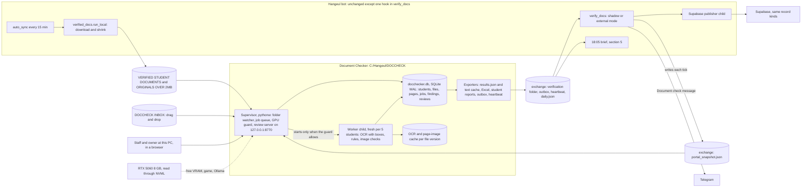

# Document Checker: a separate program for the OCR document check

Draft plan, operations view, 5 Oct 2026. **Planning only: nothing was built, run, installed or changed.**

- Working name: **Document Checker**, in its own folder `C:\Hangeul\DOCCHECK`.
- The question this draft answers: how staff and the owner will use the program every day on this one Windows PC.
- Code citations are `path:line` in the staging clone `C:/Hangeul/JARVIS/socials/repo` (HEAD `8317741`). "07 §x", "09 Rx" and "11 Bx" are files in `C:/Hangeul/REFERENCE`. "programs/verify.md" is `C:/Hangeul/JARVIS/socials/docs-draft/docs/programs/verify.md`.
- Facts marked *(owner sessions)* come from runs on this PC, not from the code.
- No student data appears here. Every name, number and date in the examples is a placeholder.

---

## 1. What the step does today

1. **Where it runs.** It is the last step of the bot's 15-minute `portal_sync` job (`src/bot/scheduler.py:459-466`). That job starts `python -m src.sheets.auto_sync` as a child process and kills it after 3600 s (`:392-416`, `:410-412`). After the sheets and the download, `verify_docs` calls `auto_verify.run(budget=6)` (`src/sheets/auto_sync.py:315-327`, `src/verify/auto_verify.py:59`).
2. **Input.** Student folders `<DOCS_ROOT>/<PROGRAM>/<NAME (PASSPORT)>/` written by `verified_docs.run_local` (`src/sheets/verified_docs.py:330-410`). Files over 2 MB are re-rendered as JPEG pages, and the original goes to `... - ORIGINALS OVER 2MB` (`:249-274`, `:316-319`). The pass also reads the portal CSV export live at its start (`src/verify/doc_verifier.py:1120-1126`). There are about 160 folders, about 1.4 GB in all (07 §4; *owner sessions*).
3. **Queue.** A student is queued when the files' fingerprint (`name:size:mtime`) or the portal record's fingerprint has changed. The oldest folder goes first, 6 students per pass (`auto_verify.py:101-133`, `:154-164`, `:477-480`).
4. **Document types.** 17 keys, recognised by file name only. The longest keyword wins (`src/verify/rules.py:56-74`, `doc_verifier.py:1036-1045`). There are 9 required documents (10 for MASTER) and 7 optional ones (`rules.py:78-89`).
5. **Reading.** If a PDF page has more than 80 characters of text layer, that text is used. Otherwise the page is rendered at 150 dpi and read by EasyOCR 1.7.2 (English, on the GPU when CUDA is visible) (`doc_verifier.py:52-61`, `:122-150`; `requirements.txt:13-17`).
   - The NID, bank and academic files are also read page by page at 200 dpi: up to 8, 10 and 20 pages (`:92-119`, `:474`, `:731`).
   - A page that gives fewer than 300 characters is OCR'd again at three rotations (`:64-89`).
6. **Five check families.**
   - (a) About 50 per-document rules in 11 checkers (`doc_verifier.py:307-907`; table `CHECKS` at `:913-925`).
   - (b) Page-image checks on every file except the photo: colour scan, QR code, untranslated Bangla and notary seal (`page_checks.py:138-184`, `:268-291`; called at `doc_verifier.py:1076-1080`).
   - (c) The e-Apostille structure of the academic file (`page_checks.py:379-452`).
   - (d) Cross-document checks of name, date of birth, passport number and affidavit (`doc_verifier.py:956-1032`).
   - (e) The field check: 24 portal fields looked up in the documents (`field_check.py:39-56`, `:95-158`).
7. **Verdict levels.**
   - A finding is PASS, FLAG, FAIL or NOTE.
   - A file row takes its worst finding. A missing required document gives a MISSING row (`doc_verifier.py:1060-1064`, `:1081-1084`).
   - A student is INCOMPLETE, else FAIL, else REVIEW, else PASS, in that order of precedence (`:1089-1096`).
   - A field is MATCH, DIFFERS, UNREADABLE, NO DOCUMENT or BLANK (`field_check.py:36`, `:205`).
8. **Caches and outputs.**
   - `data/verification/results.json`, the whole store (`auto_verify.py:136-151`).
   - The OCR cache `text/<PASSPORT>.json`, keyed `file:size:mtime:max_pages` (`:168-248`).
   - `DOCUMENT CHECK.xlsx` and `FIELD CHECK.xlsx`, rebuilt in full on each pass (`:339-449`).
   - A Telegram message "Document check" (`:542-562`), sent by `auto_sync.py:459-472`.
   - Section 5 of the 18:05 brief (`src/bot/brief.py:332-359`).
   - Supabase records through `sheet_hooks.verify_batches` (`src/cloud/sheet_hooks.py:266-333`): 2,717 `doc_verdict`, 158 `doc_check`, 3,490 `field_check` and 3,469 `doc_page_text` (07 §10.8).
9. **The passport-scan OCR is a separate path.** The 30-minute watcher and the cross-check commands use `src/scraper/ocr_validator.py` on the CPU (`:79`), with MRZ check digits (`:109-125`, `:248-321`).
10. **Other ways it is started.**
    - The CLI: `python -m src.verify.auto_verify` with `--budget`, `--passport`, `--recheck`, `--rebuild` and others (`auto_verify.py:565-605`).
    - Bootstrap phase 5 runs one `--recheck --budget 0` process (`bootstrap.py:93-100`). The proven bulk method is different: a loop of `--budget 5` processes (07 §10.1).
11. **Results and times.**
    - Cold start (27 Sep), 144 students: FAIL 61, REVIEW 65, INCOMPLETE 15, PASS 3. Fields: 2,801 MATCH and 1 DIFFERS. It took 2 h 26 min in batches of 5, about 93 s per student.
    - A student read for the first time takes 50–90 s. A cached re-check takes about 6 s.
    - OCR takes 1.8 s per A4 page on the GPU, or about 17 s with a game open (07 §10.1-10.2, §10.8; 11 B19).

## 2. What is wrong or limiting today

| # | Problem | Evidence | What staff feel |
|---|---|---|---|
| 1 | OCR blocks the sync | The check runs inside the same child process as the sheets and the downloads. The job is `max_instances=1, coalesce=True` (`src/bot/scheduler.py:459-466`), and the sync lock lasts 2 h (`auto_sync.py:72-86`). | While 6 students are being read (about 10 min, about 35 min or more with a game open), the next sheet sync and download is skipped. |
| 2 | A fixed 6 students per tick; bulk runs are done by hand | `DEFAULT_BUDGET = 6` (`auto_verify.py:59`). A bulk re-check needs a typed PowerShell loop (07 §10.1), and `bootstrap.py:95` does it the slow way. | After a rule change or many re-uploads, results trickle in over hours, and someone must remember the loop. |
| 3 | GPU memory grows inside one long process | *(owner sessions)*: 7 GB VRAM plus 6 GB spilled into system RAM, and 90 s became 570 s per student. Nothing in the code caps memory: it just uses `gpu=torch.cuda.is_available()` (`doc_verifier.py:60`). | Only the 6-per-process budget hides this. |
| 4 | No GPU guard | Grill decision 14 is still open (11 B19). Desktop 1.0–1.4 GB + language model 2.6–2.8 GB + OCR peak 3.9 GB = 7.5–8.1 GB, against 7.96 GB usable (11 B6, 09 R12). A game uses 3–4 GB more. | OCR becomes 10 times slower, or runs out of memory. |
| 5 | Truncated text is cached as final | The rotation retries swallow every exception (`doc_verifier.py:78-82`). The cache wrapper stores whatever comes back, keyed by the file's identity, for good (`auto_verify.py:198-203`). | After an out-of-memory error, a verdict rests on partial text until the file changes, and nothing shows it. |
| 6 | Not the whole document | The automatic pass reads 6 pages (`auto_verify.py:191`); the command line reads 20 (`doc_verifier.py:122`). The colour and QR checks see 4 pages (`page_checks.py:20`, `:94`), and the seal check sees 4 (`:275`). | Rules never see statement pages 7 and later, or transcripts after page 6. The owner asked for **whole** documents. |
| 7 | Files with unknown names are ignored | `verify_student` walks only the required and optional keys. Files grouped as "other" are never reported (`doc_verifier.py:1053-1058`). | A required paper with an odd file name shows as MISSING, and its pages go unchecked. |
| 8 | Replaced documents stay in the folder | A re-download only adds new files (`verified_docs.py:387-388`), and every file of a key is checked (`doc_verifier.py:1065`). | The old, rejected version keeps producing FAILs next to the corrected one. |
| 9 | The shrunk copy is read, not the original | `_shrink_pdf` re-renders pages as JPEG at 1754 px on the long side, which drops the text layer (`verified_docs.py:256-267`). The originals are kept (`:316-319`) but never read. | More OCR and more misreads. A computer-made bank PDF loses `is_digital` (`page_checks.py:40-65`), so the colour rule then applies to it. |
| 10 | Findings are free text with no location | Rows are `LEVEL: text` joined by ` \| ` (`doc_verifier.py:1083-1084`). The OCR boxes are thrown away (`detail=0`, `:74`). | Staff open the PDF and hunt. The per-rule counts in 07 §10.8 were made by hand. |
| 11 | No review loop | Only portal-field corrections are recorded (`auto_verify.py:252-274`), and they mix staff edits with cache refreshes: 85 of 246 entries (11 B18). No one can mark a finding wrong or fixed. | The same false FLAG comes back at every re-check. The two rules on trial (`doc_verifier.py:737-742`, `page_checks.py:432-439`) can never be proven. |
| 12 | One systematic rule dominates the report | "Page 1 is not an e-Apostille" (`page_checks.py:404-407`) gives 47 of the 61 FAILs, and "not followed by its certificate" (`:420-423`) gives 57 FLAGs. `_first_problem` shows only the first FAIL row (`auto_verify.py:526-539`). | Telegram lines look alike, and a student's other FAILs are hidden behind the first one. The rule itself **stays FAIL** (decision 18). |
| 13 | A dormant rule | Nothing writes `apostille.json` (`page_checks.py:295-311`), so the subject-mismatch FAIL (`:442-445`) never fires. | |
| 14 | A fragile store | An unreadable `results.json` becomes an empty store and is overwritten after the first student (`auto_verify.py:136-144`, `:505`). The Corrections history was lost once already (07 §10.7). | |
| 15 | Silent degradations | If pyzbar fails to load, the code falls back to OpenCV without a message (`page_checks.py:100-103`, `:331-334`). No GPU means CPU without a message (`doc_verifier.py:60`). A code fault under the scheduler is one log line, with no Telegram message (`auto_sync.py:462-466`). | |
| 16 | The live portal is needed for every pass | `portal_students()` GETs the CSV each time (`doc_verifier.py:1120-1126`). | No portal, no check. |
| 17 | Students are identified by passport number | `SKIP_PASSPORTS` is hard-coded (`auto_verify.py:55-56`) and hides a real student who shares that number (11 B18). A student with no passport number on the portal is never checked (`doc_verifier.py:1114-1116`). | |
| 18 | Passport checking is weak or false | The document check only tests that the portal number appears in the text (`doc_verifier.py:327-331`). The watcher trusts a single check digit (`ocr_validator.py:799`, `:809-812`) after trying several repair candidates (`:248-262`). This caused the false "passport number mismatch" (11 §C). | |
| 19 | Wasted work | The photo is OCR'd although its text is not used (`doc_verifier.py:1067`). Page images are rendered again at every re-check (`page_checks.py:20-37`). NID, bank and academic scans are OCR'd twice, at 150 and 200 dpi (programs/verify.md §3). | |
| 20 | No tests of the rules | No test calls a rule function (programs/verify.md §10). | Every rule change is a leap of faith. |
| 21 | Excel locking | A workbook open in Excel makes the end-of-pass write fail (09 R13 W12). | |

---

## 3. Goals and non-goals

**Goals**

- **G1. Read every page of every file** in a student's folder, on this PC, with no network. Apply today's rules plus the fixes listed in 4.3, and attach evidence to each finding: the page and, where possible, the place on the page.
- **G2. A review loop.** Staff open a student, see each page with the problems marked, and mark each problem as real, fixed or overruled. The decisions survive re-checks and feed the accuracy numbers.
- **G3. Never stuck, never silently wrong.** A GPU guard, fresh worker processes, resume after a crash or a power cut, and no cached partial reads. Every degradation is visible on the screen and in Telegram.
- **G4. Reports where people already look.**
  - Per batch: a Telegram line, sent by the bot.
  - Daily: section 5 of the brief.
  - Per student: a printable report.
  - Excel: today's layout plus a "Problems" sheet.
  - Supabase: the same record kinds as today.
- **G5. Measured accuracy per rule**, and a written bar for switching over from the old step.
- **G6. One person can run it.** One folder, one config file, one start script, one screen, autostart, a watchdog, and a single setting to roll back.

**Non-goals**

- No cloud OCR and no cloud model (the owner declined both for privacy). No language model in the verdict path (09 R7).
- No downloading from the portal and no writing to it. `verified_docs.run_local` stays in the bot.
- No new OCR engine in version 1. EasyOCR stays; another engine is compared only later, against the hand-checked set.
- No rule changes in version 1 beyond the fixes in 4.3. "Page 1 must be the e-Apostille" stays FAIL (decision 18). The two trial rules stay FLAG until 6.4 is met.
- No user accounts and no internet exposure. It is not a multi-office web app.
- The program does not send to Telegram, Supabase or Google itself. The bot stays the only sender (4.9).

---

## 4. The design

### 4.1 How it is used day to day

**Documents arrive in three ways:**

1. **The bot's download (the main path).** The 15-minute sync writes a student's files through `.part` files, then writes `.download_complete` last (`verified_docs.py:383-396`). The checker polls the documents root every 60 s. A folder is taken only when its marker exists and the folder has not changed for 60 s, so it never reads a half-written download.
2. **A drop folder, `C:\Hangeul\DOCCHECK\INBOX`.** Staff drag in a folder named `<NAME> (<PASSPORT>)`, for example papers a student sent before uploading them to the portal.
   - On the screen they pick the program, and optionally link the folder to a portal student.
   - INBOX checks are **pre-checks**: they stay local and never reach `results.json`, Telegram or Supabase.
3. **"Re-check now".** A button on the student page, or `docchecker check --student <id>` on the command line. It queues the student at high priority.

**A normal day:**

- **08:30.** A staff member double-clicks the desktop shortcut "Document Checker". It opens `http://127.0.0.1:8770` in the browser. The dashboard shows the night's results, the queue (normally empty) and the open problems grouped by rule.
- **11:00.** A student is verified on the portal. Within 15 minutes the bot has downloaded the folder. Within a minute after that the checker sees it. If the GPU is free, a worker reads it in about 1.5–2 minutes. At its next tick the bot posts the usual "Document check" line, now with a hint to open the student on the screen.
- **11:20.** Staff open the student. The academic file is FAIL, with page 3 shown and a box around the apostille QR code. They press "Real problem", and print the student report, which lists only what the student must fix.
- **15:00.** The student uploads a re-assembled academic file. The portal's file list changes, the bot downloads the new file, and the checker re-reads only that file (the others are cached). The old file is shown as "superseded". The finding closes as "resolved by re-upload", and the next Telegram line says the verdict went from FAIL to REVIEW.
- **18:05.** The brief's section 5 now also says how many problems were opened and closed today, and whether the checker waited for the GPU.
- **21:00.** The owner starts a game. The guard sees it and pauses. The dashboard says "waiting: game running since 21:04". The bot's line says "2 more waiting, GPU busy". The checker catches up by itself after the game closes.
- **Power cut.** The BIOS powers the PC back on, Windows signs in automatically, the Startup shortcut starts the supervisor, and the interrupted student is read again from its last fully saved file.

**On the phone, the owner sees the same as today:** the Telegram lines, the brief, and Jeannie reading the same Supabase kinds, now with a review status in each row's data (4.10).

### 4.2 Architecture



**There are two kinds of process:**

- **The supervisor.** One `pythonw.exe` per PC, single instance. It never imports torch, so it holds no GPU memory.
- **Workers.** Short-lived `python.exe` children with no window. Each one reads up to 5 students, then exits. This is the batch size that held a steady 93 s per student *(owner sessions)*.

### 4.3 Components

| Component | What it does | Built from |
|---|---|---|
| **Folder watcher** (in the supervisor) | Every 60 s it lists `DOCS_ROOT` and `INBOX` and compares each folder's file parts (`name:size:mtime`) with the database. It queues new or changed students, and students whose portal-snapshot record changed (field check only). It gates on `.download_complete` plus 60 s of quiet. | `auto_verify._file_parts`, `doc_fingerprint`, `field_fingerprint`, and the oldest-first order of `pending` (`auto_verify.py:101-164`) |
| **File inventory** | Classifies each file by name (today's `classify`). It then marks: **superseded** (on disk but not in the portal's current list in `.download_complete`, `verified_docs.py:395-396`; a shrunk `.png` that became `.jpg` is mapped, `:320`), **unclassified** (no name pattern matched; a content keyword suggests a type), and **has original** (a copy exists under `ORIGINALS OVER 2MB`, `:316-319`). | `doc_verifier.classify` (`:1036-1045`), `rules.FILE_PATTERNS` |
| **Job queue** | SQLite table `jobs`: `queued → waiting_gpu → running → done`, plus `retry` (with back-off) and `failed` (after 3 attempts, shown on the screen and announced once). Priority: re-check now, then new student, then changed files, then portal-only change, then rule-version re-check. | new |
| **GPU guard** | Decides whether a worker may start, and is asked again before each student (4.6). | new (NVML); `_pid_alive` / `_lock_held` logic (`auto_verify.py:62-97`); quiet windows (`src/cloud/backfill.py:57`) |
| **Worker** | Takes up to 5 jobs. For each student: inventory, OCR, rules, image checks, field check, then saves findings in one transaction. Exit codes: 0 done, 3 = out of memory or the guard stopped it (jobs re-queued), 4 = code fault (the queue stops and an alert goes out, as today at `auto_verify.py:492-500`). | the worker CLI is new; the engine is below |
| **OCR layer** | One read per page. The text layer is used when a page has at least 40 real characters; otherwise EasyOCR runs at 200 dpi with `detail=1` (boxes and confidence; the text is the same as `detail=0` joined in the same order). It keeps the rotation retry. **All pages up to 40**, with a NOTE "file has N pages, the first 40 were read" above that. The original is read when there is one. A CUDA out-of-memory error, or any exception during a page, **aborts the whole file read, so nothing is cached**. A file version is cached only when every page completed. The photo is not OCR'd. | `doc_verifier._ocr_image`, `read_pages`, `read_document` (`:64-150`); the item format of `ocr_validator._ocr_items` (`:169`) |
| **Rule engine** | A vendored copy of `rules.py`, `doc_verifier.py`, `page_checks.py` and `field_check.py`, with today's rules and messages, refactored so that each finding is `(rule_id, level, message, page, boxes, read_value, expected_value)`. There are about 70 stable rule ids, for example `academic.apostille_first_page` or `bank.min_amount`. A `RULES_VERSION` string is stored with every finding. | all checkers, `CHECKS`, `cross_checks`, `student_verdict`, `academic_check`, `inspect`, `colour_check`, `qr_check`, `bangla_check`, `seal_present`, `page_codes`, `check_field`, `SOURCES` |
| **Image-check cache** | Results of `inspect`, `page_codes` and `seal_present` per file version, so a re-check never renders pages again. All pages are covered, not 4. | `page_checks.py:20-135`, `:268-367` |
| **Apostille subjects** | On the academic page, staff can set "this apostille covers HSC/SSC/…". The answer is stored by application id and exported as `apostille.json`, which wakes up the dormant subject rule (`page_checks.py:295-311`, `:442-445`). | new screen action and old reader |
| **Passport MRZ** (phase 5) | Runs the MRZ reader on the passport file in the same worker, on the GPU, with the deferred false-alarm fix. | `ocr_validator.read_passport_scan`, `_find_mrz`, `parse_mrz_line1/2`, `_line2_at`, `compute_icao_check_digit`, `compare_names` (`:109-412`, `:626`) |
| **Review server** | FastAPI with server-rendered HTML on `127.0.0.1:8770`. It has no CDN and no external assets. Pages are listed below. | new (FastAPI and uvicorn are already pinned, `requirements.txt:31-32`) |
| **Exporters** | `results.json` and `text/<P>.json` in today's exact shapes; the two workbooks with today's sheets plus "Problems"; student reports (HTML with print CSS); the outbox; `heartbeat.json`; `daily.json`. | `write_document_report`, `write_field_report`, `_cell` (`auto_verify.py:318-449`) |
| **CLI** | `docchecker status`, `check --student/--folder`, `recheck --rule <id>` or `--all`, `export`, `backup`, `selftest`. | new |

**Screens of the review server** (wireframes with placeholder data):

```
Document Checker      GPU free 5.1 GB · worker idle · game: no · bot sync ok     [Health]
Queue: 0 waiting, 0 running · last check 14:12 · today: 6 new students, 4 re-uploads
Open problems: FAIL 71 (47 of them "page 1 is not an e-Apostille") · FLAG 402 · MISSING 19
[Problems by rule]  [Students]  [Pre-checks (INBOX)]  [Label mode]
Filter: [All programs v] [Open FAIL v] [search name or passport]
Student         Program  Verdict  Open FAIL/FLAG  Why queued   Checked
<Student A>     KLP      FAIL     2 / 5           new file     05 Oct 14:12
<Student B>     BACHELOR REVIEW   0 / 3           portal edit  05 Oct 11:40
```

```
< Students   <Student A> (<passport no>)  KLP  Intake <intake>   Verdict: FAIL
             raw FAIL · 2 open FAIL · 5 open FLAG · 1 overruled · rules 2026.10.1
             [Re-check now] [Print report] [Open folder] [Portal profile]
+--------------------+------------------------------------+-------------------------+
| DOCUMENTS          | 07 Academic Certificate&Transcript | PROBLEMS ON THIS FILE   |
| 01 Passport   PASS | academic_cert_<uid>_<time>.pdf     | FAIL page 1 is not an   |
| 02 Photo      PASS | page 3 of 6 (read from original)   |  e-Apostille; the first |
| 04 Birth      FLAG | +--------------------------------+ |  apostille is on page 3 |
| 05 Father NID PASS | |  page image with a red box     | |  Evidence: QR, page 3   |
| 05 Mother NID PASS | |  around the apostille QR       | |  [Real problem] [Fixed] |
| 06 Family     FAIL | +--------------------------------+ |  [Overrule...]          |
| 07 Academic   FAIL | < p1 p2 [p3] p4 p5 p6 >            | FLAG apostille on p 6   |
| 08 Bank       FLAG |                                    |  not followed by its    |
| 09 Financial  PASS |                                    |  certificate            |
| other: 1 file NOTE |                                    | Apostille on p 3 covers:|
| superseded: 1 file |                                    |  [HSC v] [save]         |
+--------------------+------------------------------------+-------------------------+
| FIELD CHECK  DOB: DIFFERS  portal <date>, passport shows <date>  [Portal fixed] [OCR wrong] |
+---------------------------------------------------------------------------------------------+
```

**Review actions and their meaning:**

- **Real problem** (confirmed). The student or staff must act. The finding stays open.
- **Fixed.** Staff say it is dealt with. The next check of that file must agree; if the rule still fires, the finding re-opens with "marked fixed by `<staff>` but still found".
- **Overrule.** The rule is wrong for this file version. It needs a reason code ("OCR misread", "rule does not apply", "owner accepted") and, for a FAIL, a note. It lapses when a new version of that file arrives.
- **Resolved.** Set automatically when a re-upload or a portal edit makes the rule pass.
- **Who did it.** The supervisor stores a staff name, picked once per browser from the list in the config. There are no accounts (see 4.8).

### 4.4 Technology choices

| Need | Choice | Why | Rejected, and why |
|---|---|---|---|
| Runtime | Python 3.12. An own venv `C:\Hangeul\DOCCHECK\.venv` with the bot's pins, torch `2.11.0+cu128` installed first (`requirements.txt:1-23`), and a constraints file made from the bot's freeze (09 R36) | Proven on this RTX 5060. The rules are already Python. | Sharing the bot's venv: one program's upgrade could break the other. The disk (1 TB) is not a limit. |
| OCR | EasyOCR 1.7.2, English, `download_enabled=False`, models copied once into `C:\Hangeul\DOCCHECK\models\easyocr` | Today's rules are tuned to its output, and it is measured on this GPU. It also returns the boxes the review screen needs. | Tesseract (weak on stamped scans, every keyword rule would need retuning), PaddleOCR or docTR (a new CUDA stack, untested on Blackwell), cloud OCR (declined by the owner). An engine interface is kept so a second engine can be compared later on the hand-checked set. |
| PDF and images | PyMuPDF, OpenCV, pyzbar, Pillow, all as today | No retuning. | — |
| Queue and store | SQLite in WAL mode (standard library), plus a nightly `VACUUM INTO` backup | One file, safe across crashes, easy to inspect. Fixes the "unreadable `results.json` wipes everything" problem (#14). `results.json` becomes an export. | A JSON store (#14), Redis or Celery (an extra service), Postgres (too heavy for one PC). |
| GPU state | `nvidia-ml-py` (NVML) and `psutil` | NVML sees the whole card: Ollama, the game and the desktop. `torch.cuda.mem_get_info` missed the resident model once (09 R12). | nvidia-smi parsing (slower, fragile), torch alone. |
| Review screen | FastAPI and uvicorn (already pinned), Jinja2 templates, a little plain JS, static files served locally | Already proven on this PC. The browser shows images and PDFs and prints to PDF. One process, no build step. | PySide6 or Qt desktop (a large new toolkit), Streamlit (heavy, its rerun model fights review state), Electron (a Node stack). |
| Student report | HTML with print CSS; "Print → Save as PDF" in the browser | No PDF library to maintain. | reportlab or wkhtmltopdf (a second layout system). |
| Excel | openpyxl, as today | Staff know the layout. | — |
| Watching folders | Polling every 60 s plus the marker gate | 160 folders take milliseconds. It never fires in the middle of a write. | The `watchdog` package (events arrive while files are still being written). |
| Starting | A Startup-folder shortcut plus a watchdog scheduled task, as the bot does it (`install_autostart.bat`, `install_watchdog.bat`, `watchdog.ps1`) | A known pattern on this PC, with no admin service. CUDA runs in the user's session. | A Windows service (session 0, admin rights, a different pattern from the bot). |

### 4.5 Data read and written

| Data | Read or write | Where | Notes |
|---|---|---|---|
| Student folders | read only | `C:\Hangeul\VERIFIED STUDENT DOCUMENTS\...` | Never modified, moved or renamed. |
| Originals of shrunk files | read only | `...\VERIFIED STUDENT DOCUMENTS - ORIGINALS OVER 2MB\...` | Used for OCR and image checks when present. |
| `.download_complete` | read only | each student folder | The portal's current file list, used for "superseded" and the "ready" gate. |
| Portal snapshot | read | `C:\Hangeul\DOCCHECK\exchange\portal_snapshot.json`, written by the bot | Per student: the CSV record, the program key (`pb.program_key_of`), the progress-sheet row (`pb.build_row`), the passport issue date, and the uid and file list from the verified list. With the progress row precomputed, the checker needs no bot code and no portal login. |
| Bot's old OCR cache and store | read only, once | `C:\Hangeul\BOT\data\verification\` | Seed for compatibility mode and for the comparison during shadow mode. |
| `docchecker.db` | read and write | `C:\Hangeul\DOCCHECK\data\` | Tables `students`, `files`, `pages`, `jobs`, `runs`, `findings`, `field_results`, `reviews`, `apostille_subjects`, `outbox`. |
| OCR and image cache | write | `data\ocr\<student id>\<file sha1>.json`, `data\pages\<student id>\<file sha1>-p<n>.jpg` | About 0.2 GB and 0.8 GB for 160 students (an estimate). Superseded versions are pruned after 90 days. |
| Exports | write | `exchange\verification\` (`results.json`, `text\<P>.json`, both workbooks, `apostille.json`), `exchange\outbox\`, `exchange\heartbeat.json`, `exchange\daily.json`, `out\students\<id>.html` | Every file is written to a temp name and then renamed. If a workbook is open in Excel, the next minute tries again and the Health page shows it (W12). |
| Logs | write | `logs\` | Metadata only (4.11). |

### 4.6 Sharing the 8 GB GPU with the bot

**The budget on paper** (09 R12: write it down first):

| Consumer | VRAM | Source |
|---|---|---|
| Windows desktop and apps (the monitor is plugged into the RTX) | 1.0–1.4 GB | 11 B6 |
| `qwen3:4b-instruct`, loaded on demand, unloaded after 5 min idle | 2.6–2.8 GB | 11 B12, 09 R12 |
| Document OCR worker (EasyOCR) | 2.2 GB typical, 3.9 GB peak | *(owner sessions)* |
| Game (EA SPORTS FC 25) | 3–4 GB | 11 B19 |
| Voice service (switched off) | 3.4 + 2.2 GB | 09 R12 |
| Embeddings for Supabase | 0 (CPU only) | 09 R34 |
| **Usable on the card** | **7.96 GB** | 11 B6 |

Desktop + model + OCR peak = 1.4 + 2.8 + 3.9 = 8.1 GB, which spills. So the worker gets a cap.

**Guard rules.** All must hold before a worker starts, and they are checked again before each student:

| Check | Starting default (to be set from the phase 0 measurement) | How |
|---|---|---|
| Free VRAM on the card | at least 3,600 MB | NVML `nvmlDeviceGetMemoryInfo`, device-wide |
| No game running | an exe list in `config.toml` (the owner names the FC 25 executable) | psutil. Unknown processes holding graphics memory are shown on the Health page but do not block. |
| The bot's own OCR is not running (shadow phase) | `C:\Hangeul\BOT\data\verification\auto_verify.lock` absent, or its PID dead | Read only, with the same test as `_lock_held` (`auto_verify.py:83-97`). Two OCR processes once ran the old PC out of memory (09 R12). |
| Not in a quiet window | 08:25–08:40, 09:00–09:10, 18:00–18:10 | The same windows as `src/cloud/backfill.py:57` (the morning sheet jobs and the 18:05 brief, which loads the model) |
| A memory cap inside the worker | 3,000 MB through `torch.cuda.set_per_process_memory_fraction`, `torch.cuda.empty_cache()` after each file, and a smaller EasyOCR `canvas_size` if phase 0 shows it is needed | The allocator raises "out of memory" instead of growing into shared RAM. With the cap: 1.4 + 2.8 + 3.0, plus about 0.4 of CUDA context, is about 7.6 GB, under 7.96 GB. |

**When the guard says no:**

- The job waits as `waiting_gpu`, with the reason shown on the dashboard and in the heartbeat.
- The bot's Telegram line adds "N waiting, GPU busy since HH:MM (reason)" when the wait is longer than 30 minutes.
- If a game starts during a batch, the worker finishes the current student (at most about 2 minutes at normal speed) and then exits.
- An out-of-memory error aborts the file without caching anything, re-queues the job with back-off (5, 15, 60 min), and is counted on the Health page.

**CPU fallback** is off by default. A per-student button "Check now on the CPU" exists for one urgent student (owner decision D2). The CPU speed is measured in phase 0. The passport OCR already runs on the CPU (`ocr_validator.py:79`).

**What this costs:** about 5–15 new students a day (148 → 160 folders between 29 and 30 Sep, 07 §4) × about 95 s = 8–24 minutes of GPU a day. Waiting for the GPU costs little.

### 4.7 Crashes, power cuts, resume

- **Every unit of work is saved durably.**
  - A file's OCR is cached only when complete, through a temp file and a rename.
  - A student's findings are committed in one SQLite transaction.
  - A job is `done` only after that commit.
- **On start**, the supervisor takes a single-instance lock first (09 R13 W14). Jobs still `running` with a dead worker PID go back to `queued` with `attempts + 1`. After 3 attempts the job is `failed`; the student shows "could not be read: `<error type>`", and one outbox alert goes out.
- **Workers never outlive their batch**, so a memory leak cannot grow: there is a fresh process per 5 students.
- **A per-student time limit of 15 minutes.** The supervisor kills its **own** worker child by PID if the limit is passed. It never touches any other process (09 R38).
- **The watchdog task** starts the supervisor if it is gone. It waits 3 minutes after boot so it does not start a duplicate (11 B24, W14).
- **Stamped versions.** Each finding carries `RULES_VERSION` and the engine version. A version change queues a re-check of everyone at the lowest priority. With cached OCR that takes about 6 s per student, so 160 students take about 16 minutes.

### 4.8 Privacy: nothing leaves the PC through this program

- **No network code.** The worker and the supervisor install a socket fence at start-up that refuses any connection that is not loopback. A self-test proves it, and the Health page shows "network fence: on".
- **No downloads.** EasyOCR runs with `download_enabled=False` and a fixed model folder. `HF_HUB_OFFLINE=1` is set as well.
- **The only outbound paths are the bot's existing ones:** Telegram summary lines, Supabase kinds and the brief. The owner has already accepted them, and Supabase already holds document OCR text (11 B8). The program adds no new cloud destination, unless the owner picks the optional Google Sheets mirror (D7).
- **The review server binds to `127.0.0.1`.** Only someone sitting at this PC can open it. Signing in to Windows is the access control. LAN or phone access is decision D4.
- **The pre-check INBOX** is never exported anywhere.
- **Logs hold no names, passport numbers, OCR text or file contents.** They hold the internal student number, counts, timings, VRAM and outcomes (09 R14).
- **Page images and OCR text are as sensitive as the documents.** They sit on the same disk under `C:\Hangeul\DOCCHECK\data`. BitLocker for C: is an owner decision, outside this program.

### 4.9 Fitting with the bot

**Three modes, switched by one bot setting, `DOC_CHECK_MODE`:**

| Mode | Bot | Checker | Purpose |
|---|---|---|---|
| `internal` (today) | runs `auto_verify.run(6)` | not installed | rollback position |
| `shadow` | runs `auto_verify.run(6)` as today **and** writes `portal_snapshot.json` | reads everything and writes its own `exchange\verification`, which nobody consumes; waits while the bot's OCR runs | comparison and accuracy (section 6) |
| `external` | **no OCR.** Writes the snapshot, reads the outbox, sends the same "Document check" message, publishes the same Supabase kinds | the only OCR on the PC | after the switch |

**The bot change: one function plus two settings.** It is about 60 lines plus tests, made in a worktree and deployed by the owner's full-path `stop.bat` at a quiet moment (09 R38).

- In `verify_docs` (`src/sheets/auto_sync.py:315-327`):
  - In `shadow` and `external` modes, write the snapshot from the export already cached in that process (`pb._ALL_STUDENTS_CACHE`, as used at `:476`).
  - In `external` mode, replace `av.run(...)` with `doccheck_bridge.collect()`. It returns the same dict shape, `{"checked": [...], "waiting": n, "skipped": [...], "store": load_store()}`.
  - `summary_lines` (`auto_verify.py:542-562`), `_first_problem` and `sheet_hooks.verify_batches` (`src/cloud/sheet_hooks.py:266-333`) then work unchanged.
- **Settings:** `DOC_CHECK_MODE` and `DOC_CHECKER_DIR` (next to `src/config.py:96-112`). In external mode, `VERIFICATION_DIR` points at `C:\Hangeul\DOCCHECK\exchange\verification`. The brief (`brief.py:332-342`), `sheet_hooks._page_texts` (`:246-263`) and the backfill then read the checker's exports with no change.
- **The outbox** is a sequence of JSON files. The bot marks an item consumed only after Telegram accepted the message (09 R10). Example item:
  `{"seq": 1042, "at": "<time>", "passport": "<passport no>", "student": "<Student A>", "program": "KLP", "verdict": "FAIL", "raw_verdict": "FAIL", "differs": 1, "corrected": 0}`
  Alerts are separate items: `{"kind": "alert", "text": "..."}`.
- **The heartbeat.** If `heartbeat.json` is older than 30 minutes, the bot adds "Document checker not running (last seen HH:MM)". It uses the existing "report from the third failure, announce recovery once" pattern (`auto_sync.py:390-408`).
- **Extra row keys reach Supabase with no change.** `records.doc_verdicts` builds `data = dict(row, ...)` (`src/cloud/records.py:1172`), so keys added to rows (`rule_ids`, `status`, `overruled_by`) arrive in `data`. Jeannie can read them later.
- **No bot change at all during shadow?** As a fallback, the checker can read the progress rows in `C:\Hangeul\BOT\data\sheet_state.json` (sheets map: it holds every Direct student's full row). It is less exact, because some cells are cleaned (11 B25).
- **After the switch:** the bot's `src/verify` stays in the repo for rollback. It is marked "superseded by DOCCHECK" and receives no rule changes.

### 4.10 Reports

| Report | Who reads it | Format | Delivered by |
|---|---|---|---|
| Batch line, at most once per 15-min tick | staff and owner | Telegram text, today's "Document check" title and layout | the bot, from the outbox |
| Daily summary | owner | three extra lines in section 5 of the 18:05 brief | the bot, from `daily.json` |
| Work list | staff | review screen ("Problems by rule", "Students") and the "Problems" sheet in `DOCUMENT CHECK.xlsx` | checker |
| Per student | staff, and the student (printed) | HTML report; "Save as PDF" from the browser | checker |
| Full lists | staff | `DOCUMENT CHECK.xlsx` and `FIELD CHECK.xlsx`, today's sheets unchanged plus "Problems" and "Rules" | checker |
| Phone app | owner | Supabase kinds `doc_verdict`, `doc_check`, `field_check`, `doc_page_text`, `field_correction`, `report` (unchanged), with `status` in the row data | the bot's publisher |
| Optional mirror | staff | a Google spreadsheet "DOCUMENT CHECK — open problems", text only (D7) | the bot (it holds the Google login) |

**Telegram batch line** (same shape as `auto_verify.py:549-561`, with two additions):

```
Document check
Documents checked: 3
   • <Student A> (KLP) — FAIL (07 Academic Certificate & Transcript: page 1 is not an e-Apostille — …) (+1 more FAIL)
   • <Student B> (BACHELOR) — REVIEW, 1 field(s) differ from the portal
   • <Student C> (KLP) — FAIL → REVIEW after re-upload
   2 more waiting — GPU busy since 21:04 (game running).
   Open on the office PC: Document Checker → Students
```

**Brief section 5:**

```
5) DOCUMENT CHECK (from the Document Checker, not live)
• 162 students: REVIEW 74, FAIL 64, INCOMPLETE 19, PASS 5
• Last check: 05 Oct 2026, 17:41
• Today: 6 new students, 4 re-uploads; problems opened 21, closed 15 (9 resolved by re-upload, 4 fixed, 2 overruled)
• Waited for the GPU 35 min; 0 failed reads
```

**Per-student report** (one A4 page or more):

```
DOCUMENT CHECK — <Student A> (<passport no>) — KLP — intake <intake>
Checked <date> 14:12 · rules 2026.10.1 · 11 files, 38 pages read (every page; 2 files read from the originals)
Verdict: FAIL   (machine verdict FAIL; 1 problem overruled by <staff 1>: "OCR misread")

MUST BE FIXED BEFORE SUBMISSION
 1. 07 Academic Certificate & Transcript — page 1 is not the e-Apostille; the first apostille is on page 3.
    Re-assemble the file: apostille first, then the certificate and transcript it covers.
 2. 06 Family Relationship Certificate — issued <date>, more than 3 months ago. A new certificate is needed.

STAFF TO LOOK AT
 3. 08 Bank — the solvency certificate is dated <date> but the statement was generated on <date> (pages 1 and 2). [rule on trial]
 4. 04 Birth Certificate — could not confirm it is the online copy (no QR read).

PORTAL FIELDS THAT DISAGREE WITH THE DOCUMENTS
    DOB — portal <date>; passport shows <date> (machine-readable line, check digit valid)

NOT CHECKED
    scan_0001.jpg — file name not recognised (its text looks like a bank statement)
    passport_<uid>_<old time>.pdf — superseded by a newer upload
```

The student copy prints sections 1 and 2 only, with no staff notes and no OCR text.

**"Problems" sheet columns:** Student | Passport | Program | Document | File | Page | Rule id | Level | Message | Status | By | When | Note. One row per open or closed FAIL/FLAG/MISSING finding, sorted by program, then rule, then student.

### 4.11 Packaging, starting, logs

```
C:\Hangeul\DOCCHECK\
  app\                      code (its own local git repo), tests, config.example.toml
  .venv\                    Python 3.12; torch cu128 first, then the pins with -c bot_freeze.txt
  models\easyocr\           copied from the profile's .EasyOCR folder; no downloads at run time
  data\                     docchecker.db, ocr\, pages\, backup\ (14 nightly VACUUM INTO copies)
  exchange\                 portal_snapshot.json (in), verification\, outbox\, heartbeat.json, daily.json (out)
  out\students\             per-student HTML reports
  INBOX\                    drag and drop
  logs\                     supervisor.log (5 x 5 MB rotating), worker-<date>-<pid>.log (30 days)
  config.toml               paths, batch size 5, guard thresholds, game exe list, staff names, port 8770
  start_docchecker.vbs      pythonw supervisor, no window (like start_background.vbs)
  stop_docchecker.bat       stops only processes whose path is under DOCCHECK\.venv, plus their children (W6)
  check_status.bat          processes plus the last 25 log lines
  install_autostart.bat     Startup shortcut DocChecker.lnk
  install_watchdog.bat      task HangeulDocCheckWatchdog, every 5 min, 3-min boot grace
  Document Checker.url      desktop shortcut to http://127.0.0.1:8770
```

**Log lines** carry the internal student number, not the name. For example:

```
14:10:02 job 311 student #142 start: 11 files (2 from originals), 38 pages
14:11:38 job 311 done in 96 s: 31 OCR pages, VRAM peak 2,410 MB, FAIL (2 FAIL, 5 FLAG)
21:04:10 guard: waiting (free 2,950 MB < 3,600 MB; game process running)
```

Each process writes its own log file (09 R13 W15). The Health page shows: the GPU, the guard's state, the worker's last run, the queue, failures, the fence self-test, the pyzbar self-test, the model folder, disk space, the backup age and the last 50 log lines.

**What one person does to run it:**

- **Daily:** nothing.
- **Weekly:** glance at the Health page and the overrule list.
- **After a rule change:** bump `RULES_VERSION`; the re-check runs by itself.
- **If Telegram says the checker is not running:** wait 5 minutes for the watchdog, or double-click `start_docchecker.vbs`.

---

## 5. Build plan

The sizes are working days for one developer with an AI assistant. All work happens in `C:\Hangeul\DOCCHECK` and in a bot worktree, never in the live `C:\Hangeul\BOT`.

| Phase | Deliverable | Reused from today | New | Acceptance test | Size |
|---|---|---|---|---|---|
| **0. Groundwork and measurement** | venv, models copied, config, measurement script, the chosen hand-checked set (6.1) | `requirements.txt` pins; the bot's freeze as a constraints file | NVML probe; VRAM per page at `canvas_size` 2560/2000/1600 with memory caps of 2.5 and 3.0 GB; CPU speed per page; pyzbar self-test | `torch.cuda.is_available()` is true; EasyOCR builds with downloads off; pyzbar decodes a test QR; a VRAM/speed table is written; runs only while `auto_verify.lock` is absent | 2 |
| **1. Engine** | `docchecker.engine`: findings with rule ids and evidence; whole-document OCR layer; originals; superseded and unclassified files; out-of-memory-safe cache; snapshot reader | `rules.py` (all constants); `doc_verifier.py`: `find_dates`, `money_value`, `find_money_taka`, `has_any`, `notarised`, every `check_*`, `CHECKS`, `cross_checks`, `classify`, `verify_student`, `student_verdict`, `readable`, `name_in`; `page_checks.py`: `inspect`, `is_digital`, `colour_check`, `qr_check`, `bangla_check`, `seal_present`, `page_codes`, `level_of`, `academic_check`, `apostille_subject`; `field_check.py`: `check_field`, `_validity_consistent`, `_ocr_variant`, `SOURCES`, the issue-cache downgrade (`:209-216`) | Rule-id table (about 70); `Finding` type; `detail=1` OCR with boxes; per-file-version cache; `TODAY` per job; a "compat mode" switch (6 pages, 150/200 dpi, no originals) | (a) **Golden test:** in compat mode, fed the bot's existing text cache with `TODAY` frozen to each student's stored `checked` date, the engine reproduces today's `results.json` rows for all 158 students, verdict and detail, or every difference is listed and explained. (b) Diff report of "new mode" against compat mode per rule, reviewed by the owner. (c) One PASS and one FAIL/FLAG fixture per rule (today there are none). (d) A fake reader that raises out-of-memory during the rotation pass leaves nothing cached and gives `retry`. | 5 |
| **2. Queue, worker, guard, resume** | Supervisor with watcher, SQLite queue, worker CLI, GPU guard, back-off, heartbeat, CLI | Fingerprints and order (`auto_verify.py:101-164`), `_pid_alive`/`_lock_held` (`:62-97`), "a code fault stops the batch" (`:492-500`), `QUIET_WINDOWS` | NVML guard; game list; memory cap; time limit; INBOX | Kill the worker in the middle of a file 10 times: no partial cache, and the same final result. Kill supervisor and worker together ("power cut"): it resumes. A dummy GPU hog of 5 GB means no worker starts; stopping the hog lets a worker start within 2 minutes. 20 students run at 100 s or less each, never above cap + context. | 3 |
| **3. Review screen** | FastAPI app: dashboard, problems by rule, student page with page viewer and boxes, actions, apostille subject, health, label mode | `_cell` cleaning; colours from `write_document_report` (`auto_verify.py:342-343`) | Templates, page-image render cache, review table, effective verdict | A staff member, without help, opens a FAIL student, finds the page, confirms one FAIL and overrules one FLAG with a note; the Excel and `results.json` show it within 1 minute. A request from another LAN PC is refused. The print preview fits A4. | 4 |
| **4. Reports and hand-over to the bot** | Compat exporter, two workbooks plus "Problems"/"Rules", student report, `daily.json`, outbox; the bot change (4.9) | `write_document_report`, `write_field_report`, `summary_lines`, `_first_problem` (`auto_verify.py:339-562`); `records.doc_verdicts` pass-through (`records.py:1172`) | `doccheck_bridge` in the bot; two settings; three brief lines | The bot's suite stays green (1,150 tests, 11 B23) plus new tests. A dry run of `sheet_hooks.verify_batches` over the exported store gives the same kinds and counts as today's store for unchanged students. `records.doc_page_texts` picks the right page text from the exported cache. Brief section 5 renders from the checker's file. | 3 |
| **5. Passport MRZ inside the check** (if D8 is yes) | MRZ findings in the passport row, with the false-alarm fix | `read_passport_scan`, `_find_mrz`, `parse_mrz_line1/2`, `_line2_at`, `_repair_doc_number`, `compute_icao_check_digit`, `compare_names`, `parse_visual_text_lines` (`ocr_validator.py:87-700`) | Trust `passport_no_ok` only when the line-2 nationality equals the line-1 state (`:287`, `:243`) or at least 2 check digits agree (`:291`); a one-character difference on the printed page becomes "check by eye"; the finding names the file, its upload date and a view link (11 §C) | The known false-alarm scan gives NOT_READ, not MISMATCH. The synthetic cases of 09 R9 pass. 30 passports from the hand-checked set give no false MISMATCH. | 2 |
| **6. Packaging and operations** | Launchers, autostart, watchdog, backups, log rotation, socket fence, a one-page runbook | Patterns of `start_background.vbs`, `install_autostart.bat`, `install_watchdog.bat`, `watchdog.ps1`, `stop.bat`, `check_status.bat` | Single-instance lock first; boot grace; `selftest` | After a reboot exactly one supervisor runs. After a killed supervisor it is back within 5 minutes. The fence test refuses an outbound connection. The owner follows the runbook alone. | 2 |
| **7. Shadow run, accuracy, switch** | Comparison report every night; accuracy report (section 6); switch to `external`; 7 days of watching | — | Comparison script old against new | The bar in 6.3 is met, and the owner says "switch". | 3 of work over 2–3 calendar weeks |

**Total: about 24 developer days**, plus about 7 hours of staff time for labelling, plus 2–3 weeks of shadow running.

Order and gates:

- Phases 0–2 can run before any bot change, using the `sheet_state.json` fallback.
- The bot change of phase 4 needs the owner's OK (D6).
- Phase 5 is optional (D8).

---

## 6. How accuracy is measured

### 6.1 The hand-checked set

About **40 students (about 450 files)**, chosen in phase 0 from the 160 on disk:

- **All 3 PASS students.**
- **About 14 FAIL students covering every FAIL rule that fired** (07 §10.8):
  - page 1 not an apostille: 4 of the 47
  - birth-certificate date matches no passport date: 4 of 16
  - black-and-white scan: 3 of 12
  - NID not notarised: 2
  - trade-licence fiscal year: 2
  - apostille QR unreadable: 2
  - family certificate older than 3 months: 2
  - bank below the minimum: 1
  - photo background: 1
  - Some students cover more than one rule.
- **About 12 REVIEW students** covering the most frequent FLAGs: apostille not followed, solvency date, mixed qualifications, account holder, notarisation not found, the passport number not found in the text.
- **About 6 INCOMPLETE students**, and every program: at least 3 MASTER for the income-tax rules, and 3 EAP.
- **30 passport scans** for phase 5, including the known false-alarm case.

**How it is labelled:**

- Label mode on the review screen. A staff member sees the document pages and the rules that apply to that document type, and answers each one: **violated / OK / cannot tell from the scan**.
- The machine's verdict is **hidden** while labelling.
- A second person labels 10 of the students, to measure agreement. The owner settles disagreements.
- About 10 minutes per student, so about 7 hours in all.
- The labels are stored in the database with the file's sha1, so they still count after re-checks.

### 6.2 The numbers tracked

**Per rule id, on the hand-checked set, for both the old step and the new program:**

- times fired as FAIL and as FLAG
- **true FAIL** (labelled violated) and **false FAIL** (labelled OK)
- **missed**: labelled violated, but the rule passed
- **FLAG usefulness**: the share of FLAGs labelled violated or "cannot tell"
- the "cannot tell" rate

**Per field of the field check:**

- MATCH correctness, on a sample of 10 per field
- DIFFERS precision
- the UNREADABLE rate (today 424 of 3,490 field rows, 07 §10.8)

**OCR quality:**

- the share of pages that pass `readable()` (`doc_verifier.py:936`)
- the mean EasyOCR confidence per document type
- pages read sideways
- pages read from the original against pages read from the shrunk copy

**Operations:**

- seconds per student, cold and cached
- minutes of GPU waiting a day
- out-of-memory events, which must be 0 cached truncations
- failed jobs

**In production, every week:**

- per rule: overrule rate (overrules ÷ fires), confirm rate, and "fixed but still found" count
- A rule with more than 20% overrules over at least 10 fires is put on the owner's list.

### 6.3 The bar for switching from the old step

All must hold:

1. **No false FAILs where the old step had none.** On the hand-checked set, no FAIL-level rule has a false FAIL rate above 5%, and the new program adds no false FAIL on a document the old step got right.
2. **No lost problems.** Every true FAIL the old step found is still found, or the difference is explained by reading the original or every page and the owner accepts it.
3. **Reading is at least as good.** The field check's UNREADABLE rate is no higher than the old step's on the same students, and the share of `readable()` pages is at least as high.
4. **14 days of shadow running** without a lost job, a cached partial read or an unhandled crash. The resume tests of phase 2 pass on the real machine.
5. **Speed.** A median of 120 s or less per new student. No student waits more than 2 hours on a working day, except while the guard reports a game or the model is busy.
6. **People.** A named staff member has used the review screen for a week and agrees.

### 6.4 Rules on trial

The solvency-date rule (`doc_verifier.py:737-742`) and the "one qualification" rule (`page_checks.py:432-439`) go back to FAIL **only** if the owner decides so. The evidence needed: at least 20 fires on labelled documents with at most 1 false FAIL. This is the "proven against real documents" of HANDOFF §8.1.

---

## 7. Risks and how each is handled

| Risk | How it is handled |
|---|---|
| The GPU is shared with the model and the game, so out-of-memory errors or spill | The guard (free VRAM, game list, the bot's lock, quiet windows); a per-process memory cap; a fresh worker per 5 students; out of memory means abort, re-queue and never cache; Health page counters. |
| Changing the live bot breaks the bot | One function, gated by a setting; built and tested in a worktree with the full suite; deployed by the owner with the full-path `stop.bat` at a quiet time (09 R38); rollback by setting `DOC_CHECK_MODE=internal` and restoring `VERIFICATION_DIR`. |
| The rules drift between the bot's copy and the checker's copy | The golden test in phase 1; after the switch the bot's `src/verify` is frozen and marked superseded. |
| Reading whole documents and originals changes verdicts and surprises staff | A per-rule diff report before the switch; changes announced in one Telegram message; the student page shows "read from original". |
| Staff do not use the screen | Telegram and the Excel files keep working as today, with the new "Problems" sheet; the screen is optional for reading and needed only to overrule; a 30-minute walkthrough. |
| Overrules hide real problems | A FAIL overrule needs a note; the raw verdict is kept and shown; overrules lapse when a new file version arrives; a weekly overrule list goes to the owner (D3). |
| Loss of the database, which holds human decisions (as the Corrections history was lost once) | WAL; 14 nightly `VACUUM INTO` copies; the `results.json` export can be rebuilt; an off-PC copy (D9). |
| Privacy exposure through the screen | `127.0.0.1` only; the socket fence; no new cloud destination; logs without content. |
| The disk fills with page images | About 1 GB expected on a 1 TB disk; superseded versions pruned after 90 days; free space on the Health page. |
| A torch, EasyOCR or driver upgrade breaks OCR on the Blackwell card | Exact pins and a constraints install; no automatic upgrades; `selftest` after any driver update; the engine interface. |
| A backlog after a rule change or a bulk re-upload | Cached OCR makes re-checks about 6 s; full re-reads are scheduled at night at the lowest priority. |
| The 47 apostille-order FAILs swamp the work list | The "Problems by rule" grouping; one group action "staff told the student to re-assemble" (it confirms all of them with one note); the rule itself stays FAIL (decision 18). |
| The bot's OCR and the checker both run during shadow | The guard waits on the bot's `auto_verify.lock`. Already-read students reuse the bot's text cache, which is read only. |
| The portal snapshot is stale or missing | The checker uses the last snapshot and shows its age. Above 26 hours, field DIFFERS results are downgraded to UNREADABLE, like the issue-cache rule (`field_check.py:161`, `:209-216`). |
| A Windows Update reboots in the middle of a batch | Resume (4.7). |
| One person, one PC (the bus factor) | Same patterns as the bot; one config file; tests per rule; a one-page runbook; this plan. |

---

## 8. Decisions the owner must make

| # | Decision | Recommended answer | Why |
|---|---|---|---|
| **D1** | **Should the new program take over the step?** The bot would stop OCR and only send the checker's results to Telegram and Supabase, after a shadow period. | **Yes.** Two to three weeks of shadow running, then switch with the `DOC_CHECK_MODE` setting. Rollback is the same setting. | One OCR process on the GPU instead of two; the 15-minute sync no longer waits for OCR (problem #1); one owner of the results; Telegram, the brief and Jeannie keep working unchanged. |
| **D2** | **What should happen when a game or other heavy GPU use is on?** This is grill decision 14, still open. | **Wait.** No OCR while a listed game runs or free VRAM is under about 3.6 GB; catch up automatically afterwards. The CPU is used only through a "Check now on the CPU" button for one urgent student. | An out-of-memory error during OCR corrupted cached text before, and OCR runs 10 times slower with the game. New students are about 5–15 a day, so waiting costs little. |
| **D3** | **Does a staff overrule change the verdict sent to Telegram, Excel, the brief and Supabase?** | **Yes, show the effective verdict, and always keep the machine verdict beside it.** A FAIL overrule needs a written reason; an overrule lapses with a new file version; the owner gets a weekly overrule list. | Otherwise the same false FLAG reappears forever (#11), and the trial rules can never be judged. Keeping the raw verdict keeps it honest. |
| D4 | Who can open the review screen? | **This PC only (`127.0.0.1`) in version 1.** Later, if needed: the office LAN with a PIN, or the owner's phone over a private VPN. | Simplest and private. Staff already use this PC for the Excel reports. |
| D5 | Read the originals (over 2 MB) and every page (cap 40), at the cost of more GPU time and some verdict changes? | **Yes.** | It is what "check whole documents" means, and it removes misreads from the shrunk copies (#6, #9). |
| D6 | Allow the small change in the bot (`verify_docs` plus two settings) in phase 4? Shadow mode would come earlier if it is also allowed in phase 1. | **Yes.** | The snapshot frees the checker from the live portal and from portal credentials (#16). Without it, the checker must read `sheet_state.json`, which is less exact. |
| D7 | Mirror the open-problems list into a Google spreadsheet, written by the bot? | **Yes, but after the switch.** Text only, no OCR text. | Staff read Google Sheets; the same kind of student data is already in the progress sheets. |
| D8 | Bring the passport MRZ check, with the deferred false-alarm fix, into the checker as phase 5? On 29 Sep the answer was "not now". | **Yes, in phase 5.** The 30-minute watcher stays as it is until the checker's MRZ results are proven. | The design is ready (11 §C). The checker's GPU worker already reads the passport file, and the document check's own passport rule is weak (#18). |
| D9 | Off-PC copy of the checker's database (it holds the review decisions)? | **A weekly copy to an encrypted USB drive kept in the office;** not cloud. | Human decisions cannot be rebuilt; the Corrections history was lost once with the old PC. |
| D10 | Who labels the hand-checked set (about 7 hours)? | **The staff member who prepares submissions, plus a second person for 10 students; the owner settles disagreements.** | Accuracy needs ground truth from people who know the guidelines. |
| D11 | When can a rule on trial go back to FAIL? | **Only on the owner's word, after at least 20 labelled fires with at most 1 false FAIL.** | It makes HANDOFF §8.1's "proven against real documents" concrete. |
