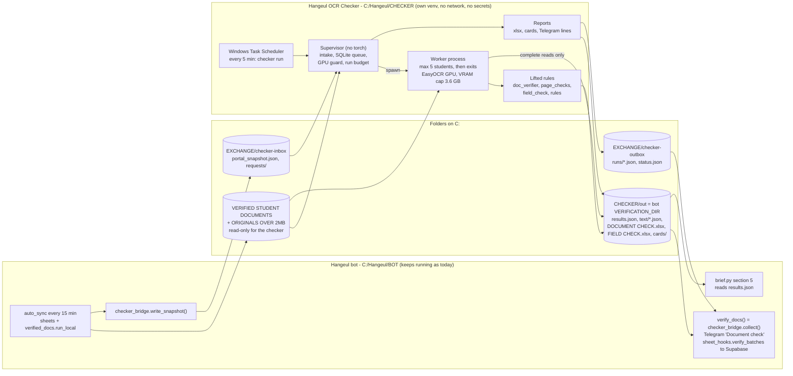
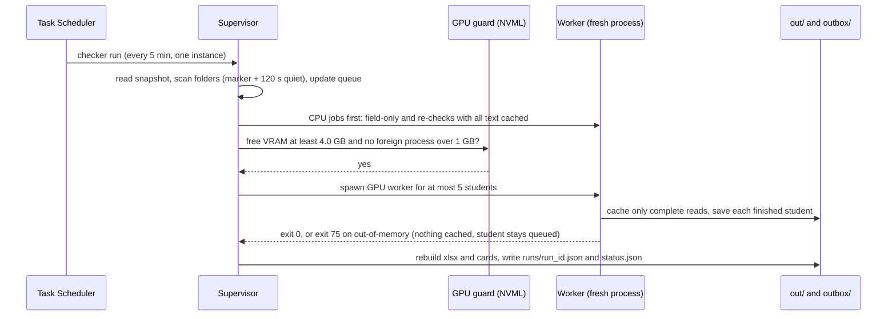

# OCR document checker as its own program: draft plan (reuse first)

**Status:** this is a draft plan for the owner. Nothing has been built, run or installed.
**Angle:** this is the fastest safe path. It lifts the proven checking code into a separate program and changes the checking logic as little as possible.
**Sources:**
- The code is the staging clone `C:/Hangeul/JARVIS/socials/repo` at HEAD `8317741`. It holds the same code as `C:/Hangeul/BOT`. Every `path:line` below is relative to that clone.
- "Owner facts" are figures measured on this PC during the owner's sessions.
- "REF 07/09/11" are `C:/Hangeul/REFERENCE/07_SHEETS_REPORTS_AND_DOCUMENT_CHECK.md`, `09_BLUEPRINT_RULES_AND_LESSONS.md` and `11_OPEN_ITEMS_AND_KNOWN_LIMITS.md`.
- Every person's name and passport number in this file is a placeholder.

**Design in one paragraph.** `src/verify/` is copied almost word for word into a new program called **Hangeul OCR Checker**, under `C:/Hangeul/CHECKER`. It has its own Python environment, its own SQLite queue and its own reports. It never touches the network and holds no secrets. Windows Task Scheduler starts a short supervisor every 5 minutes. The supervisor starts a **fresh worker process for at most 5 students**. Each worker has a hard limit on graphics memory (VRAM), and it saves OCR text only when the read finished completely. The checker writes the **same file formats** the bot already reads: `results.json`, `text/<PASSPORT>.json` and the two workbooks. Because of that, the bot's daily brief, the Supabase publisher and the backfill keep working unchanged. The bot stops running the check. Each sync, it does two small things:
1. It drops a portal snapshot into the checker's inbox.
2. It relays the checker's finished runs to Telegram and Supabase, using its existing code.

---

## 1. What the step does today

1. **How it starts.** The `portal_sync` job runs every 15 minutes (`src/bot/scheduler.py:459-466`). It starts the child process `python -m src.sheets.auto_sync`, which is killed after 3600 s (`src/bot/scheduler.py:392-416`). After the sheets and download steps, `verify_docs()` calls `auto_verify.run(budget=6)` (`src/sheets/auto_sync.py:315-327, 459-472`; `src/verify/auto_verify.py:59`).
   - The cold start uses one `--recheck --budget 0` process (`bootstrap.py:93-100`).
   - The documented procedure is different: a loop of `--budget 5` runs (`MIGRATION.md:169-178`).
2. **Inputs.**
   - Student folders `<DOCS_ROOT>/<PROGRAM>/<NAME (PASSPORT)>/` under `C:/Hangeul/VERIFIED STUDENT DOCUMENTS` (`src/verify/doc_verifier.py:40, 1100-1117`; `src/config.py:101-102`). They hold about 1.4 GB. There were 158 students on 30 Sep (REF 07 §10.8).
   - `verified_docs.run_local` downloads these folders. It shrinks every file over 2 MB and copies the original to `... - ORIGINALS OVER 2MB` first (`src/sheets/verified_docs.py:243-327`).
   - The portal CSV export, read through `portal_students()` → `progress_builder.fetch_all_students()` (`doc_verifier.py:1120-1126`).
   - The cache of passport issue dates (`auto_verify.py:126-131`, `field_check.py:133-137`).
3. **Queue.** A student is queued when their document fingerprint or their field fingerprint has changed, oldest folder first (`auto_verify.py:101-164`).
   - The document fingerprint is a SHA-1 over `name:size:mtime` of every file.
   - The field fingerprint covers the files, every portal field and the issue date.
   - Each pass takes at most 6 students (`:479-480`).
4. **Document types.**
   - There are 17 document keys, recognised from the file name; the longest matching keyword wins (`src/verify/rules.py:56-74`, `doc_verifier.py:1036-1045`).
   - 9 documents are required, 10 for MASTER (`rules.py:78-87`).
   - Files whose names match no keyword are never checked (`doc_verifier.py:1053-1058`).
5. **OCR.**
   - A PDF text layer is used when a page has more than 80 characters of it.
   - Otherwise PyMuPDF renders the page and EasyOCR (English) reads it. The render is 150 dpi for whole-file text and 200 dpi for per-page text. EasyOCR uses the GPU if `torch.cuda.is_available()` (`doc_verifier.py:52-61, 92-150`).
   - A page that yields under 300 characters is retried at 90°, 270° and 180° (`:64-89`).
   - The image checks render pages again at 250 dpi. QR codes are read by pyzbar, falling back to OpenCV (`src/verify/page_checks.py:20-37, 100-103, 327-367`).
6. **Check families.**
   - (a) Per-document rules for 11 document keys (`doc_verifier.py:913-925`).
   - (b) Page checks on every file except the photo: colour scan, QR legibility and untranslated Bangla (`doc_verifier.py:1076-1080`, `page_checks.py:138-184`).
   - (c) The e-Apostille structure of the academic file (`page_checks.py:379-452`).
   - (d) Cross-document checks: name, date of birth, passport number and affidavit (`doc_verifier.py:956-1032`).
   - (e) The field check: 24 portal fields are looked for in the documents (`src/verify/field_check.py:39-56, 95-218`).
7. **Levels.**
   - Each finding is PASS, FLAG, FAIL or NOTE.
   - A file's row takes its worst finding. A required document with no file gets MISSING (`doc_verifier.py:1060-1084`).
   - A student is INCOMPLETE, else FAIL, else REVIEW, else PASS, in that order of precedence (`:1089-1096`).
   - A field is MATCH, DIFFERS, UNREADABLE, NO DOCUMENT or BLANK (`field_check.py:36, 205`).
8. **Caches.**
   - `data/verification/text/<PASSPORT>.json` holds the text of each file, keyed `file:size:mtime:max_pages`. Whole-file text defaults to 6 pages here (`auto_verify.py:172-248`, `:191`).
   - The store `results.json` is written after every student (`:136-151, 505`).
   - A lock file (`:83-97`).
9. **Outputs.**
   - `results.json`, `DOCUMENT CHECK.xlsx` and `FIELD CHECK.xlsx` (`auto_verify.py:339-449`).
   - The Telegram message "🔍 Document check" (`:542-562`, sent by `auto_sync.py:459-472`).
   - Supabase records through `sheet_hooks.verify_batches` (`src/cloud/sheet_hooks.py:266-333`): 158 doc_check, 2,717 doc_verdict, 3,490 field_check and 3,469 doc_page_text records.
   - Section 5 of the daily brief (`src/bot/brief.py:332-342`).
10. **Results.** The first full check covered 144 students: FAIL 61, REVIEW 65, INCOMPLETE 15, PASS 3. The field check gave 2,801 MATCH and 1 DIFFERS (owner facts).
    - 47 of the 61 FAILs come from one rule, "page 1 is not an e-Apostille" (`page_checks.py:404-407`).
    - 57 FLAGs say an apostille is not followed by its certificate (`page_checks.py:420-423`).
11. **Time.**
    - About 93 s per student read for the first time, in a fresh process. One profiled student took 30 s in `read_document` and peaked at 2.2 GB of VRAM (owner facts).
    - About 6 s for a re-check from cached text (`HANDOFF.md:143-144`).
    - The cold-start check took 2 h 26 min (`MIGRATION.md:155`).
    - One long process degrades to about 570 s per student (owner facts).
12. **The passport audit is a separate path.** Every 30 minutes the bot OCRs passport scans on the CPU, inside its own process (`src/scraper/ocr_validator.py:79`, `src/scraper/client.py:711`, `src/bot/scheduler.py:158-246`). It checks the machine-readable lines (MRZ) and trusts a field only when its check digit agrees.

## 2. What is wrong or limiting today

| # | Problem | Evidence |
|---|---|---|
| P1 | **One long OCR process slows down.** GPU memory grows from student to student: 7 GB of VRAM plus 6 GB spilled into system RAM. Each student goes from about 90 s to about 570 s. The scripted cold start still runs one long process. | Owner facts; `MIGRATION.md:169-178`; `bootstrap.py:93-100` uses `--budget 0` in one process; REF 09 R12: `PYTORCH_CUDA_ALLOC_CONF=garbage_collection_threshold` "made it worse". |
| P2 | **A failed or truncated read is cached as final.** The rotation retry swallows every exception, so a CUDA out-of-memory error included, and keeps the shorter text (`doc_verifier.py:78-89`, `except Exception: continue` at `:81-82`). The cache wrapper stores whatever came back, keyed only by name, size and mtime (`auto_verify.py:195-203`). Nothing reads that file again until the file itself changes. An unopenable file is also cached as the text `[unreadable: …]` (`doc_verifier.py:133-136`). | Owner facts: "an out-of-memory error during OCR can leave truncated text cached as if it were final". |
| P3 | **The check is tied to the sync process and its limits.** It runs last in `auto_sync`, under the 3600 s kill (`scheduler.py:409-413`) and the 6-student budget. A code fault in the rules only produces a log line ("Document check could not run", `auto_sync.py:459-466`). The document-check step never counts failures and is never retried (`maps/sheets.md`, auto_sync gotchas). | `auto_sync.py:315-327, 459-472` |
| P4 | **Every pass needs the portal.** Each pass gets its portal records from a live login and CSV fetch; there is no offline mode. | `doc_verifier.py:1120-1126`; `HANDOFF.md:239-240` |
| P5 | **Re-checks are slow.** After a rule change, a re-check of everyone goes through the same 6-per-15-minutes budget: 158 / 6 ≈ 27 ticks ≈ 6.5 h. Image checks are not cached; every page is rendered again. | `auto_verify.py:471-480`; `maps/verify.md` (page_checks gotchas) |
| P6 | **Nothing protects the shared GPU.** The GPU is used whenever it exists. A game on the card made OCR go from 1.8 s to about 17 s per A4 page. A VRAM guard was offered but never decided. | `doc_verifier.py:60`; REF 11 B19; REF 07 §11 decision 14 |
| P7 | **QR decoding can fail silently.** If pyzbar or its zbar DLL is missing, the code quietly falls back to OpenCV, which cannot read most real scans. Every apostille would then FAIL. | `page_checks.py:100-103, 331-334`; REF 09 R25 |
| P8 | **An unreadable `results.json` wipes all history.** The pass starts from an empty store and overwrites the file after the first student. | `auto_verify.py:136-144, 505`; `docs-draft/docs/programs/verify.md:359` |
| P9 | **No test covers any rule**, `cross_checks` or `check_field`. The tests replace `auto_verify.run` with a fake. | `docs-draft/docs/CODEBASE_GUIDE.md:838`; `docs-draft/docs/programs/verify.md:1064` |
| P10 | **Accuracy is unknown, rule by rule.** One rule produces 47 of 61 FAILs. Two rules were lowered to FLAG because of false FAILs and are not yet proven. "Every false positive so far was found by the manager looking at a document." | `doc_verifier.py:737-742`; `page_checks.py:432-439`; REF 07 §10.6 |
| P11 | **The page caps disagree.** Under the automatic pass, whole-file text covers only the first 6 pages, against 20 on the command line. The text rules see only part of long bank and academic files. | `auto_verify.py:191` vs `doc_verifier.py:122` |
| P12 | **Unrecognised files are invisible.** A file whose name matches no keyword is neither checked nor reported. | `doc_verifier.py:1053-1058` |
| P13 | **The checker reads shrunk copies.** PDFs over 2 MB are rendered again as JPEG pages, 1754 px down to 950 px on the long side, at quality 70 down to 45. This hurts QR, colour and OCR. The originals are kept but never read. The separate `compress_docs.py` uses a hard-coded `E:` folder, shrinks in place and keeps no backup. | `verified_docs.py:249-274, 292-327`; `compress_docs.py:7, 25-32, 74, 80` |
| P14 | **The passport check raises false alarms.** A garbled MRZ line 2 passed the passport-number check digit by chance, and the code trusts that digit alone. The alert gives no file name, upload date or document link. | `ocr_validator.py:799, 805-812`; `scheduler.py:91-101`; REF 11 §C |
| P15 | **The reports are hard to act on.** The workbooks live only on this PC: the Telegram message just names the folder. Telegram gives one "first problem" per student, cut to 160 characters. | `auto_verify.py:526-539, 561` |
| P16 | **Data is hard-coded in the code.** One passport number sits in `SKIP_PASSPORTS`, and a real student who shares it is never checked. | `auto_verify.py:55-56`; REF 07 §11 |
| P17 | **The apostille subject rule cannot fire.** Its data file `apostille.json` was lost with the old PC, and no code writes it. | `page_checks.py:295-311, 442-445`; REF 11 B18 |

## 3. Goals and non-goals

**Goals**
- G1. **Same input, same verdict.** Given the same files, the same text and the same date, the checker gives row-for-row identical results to today's code. Phase 1 proves this.
- G2. **The checker owns this step completely:** its own process, its own queue, its own report, its own Python environment. The bot no longer runs document OCR.
- G3. **Steady speed.** No slowdown over long runs. Targets:
  - a student read for the first time: median ≤ 100 s, 95th percentile ≤ 150 s;
  - a re-check from cached text: ≤ 10 s.
- G4. **No failed or partial read is ever stored as final text.**
- G5. **The checker yields the GPU.** It never pushes the language model or a game into system-RAM spill; it postpones its own work instead.
- G6. **Offline and private.** No network, no secrets, local folders only.
- G7. **Stable command line and folder contract**, so the bot (and later the phone app) connect through files only.
- G8. **Measured accuracy.** True and false FAIL counts per rule, on a hand-checked set of documents.
- G9. **A report that says what to fix**, per student and per action, in Telegram and Excel.

**Non-goals**
- No change to any rule threshold or wording in phases 0–4. The two rules on FLAG trial change only by an owner decision backed by data (§6).
- "Page 1 is not an e-Apostille" stays a FAIL (owner decision 18). This plan does not touch it.
- No new OCR engine and no cloud OCR or cloud model.
- No portal login and no document download: that stays in the bot (`verified_docs.run_local`).
- The checker never sends Telegram messages and never publishes to Supabase: the bot keeps doing both.
- No web interface in this plan.
- Rebuilding `apostille.json` is out of scope.

## 4. The design

### 4.1 Architecture





### 4.2 Components

| # | Component | What it does | Code it is built from |
|---|---|---|---|
| 1 | **Snapshot writer** (bot side, new `src/sheets/checker_bridge.py`) | After the sheets step, writes `portal_snapshot.json`. For each passport it holds the CSV record, the program key, the ordered progress-sheet row and the issue date. It also records when the issue cache was last refreshed. | `pb._ALL_STUDENTS_CACHE`, `pb.program_key_of`, `pb.target/columns_for/build_row` (`src/sheets/progress_builder.py:245-353`), `passport_issue.load/CACHE_PATH` |
| 2 | **Intake** | Reads the snapshot and scans `DOCS_ROOT` (and `KONYANG_ROOT` when present). It computes both fingerprints and queues changed students. It skips `*.part` files and dot-files. It takes a folder only when `.download_complete` exists and no file has changed for 120 s. | `student_folders` (`doc_verifier.py:1100-1117`), `doc_fingerprint`/`field_fingerprint`/`pending` (`auto_verify.py:101-164`) |
| 3 | **Queue** (SQLite, `data/checker.db`) | Stores jobs with a kind and a priority: manual request, new student, changed documents, field-only, re-check. Also stores attempts, poison marks (files that keep failing), timings, peak VRAM, postponement reasons and per-rule findings (§6). | new |
| 4 | **Supervisor** (`checker run` / `drain`) | Never imports torch. It runs CPU-only jobs first. It asks the GPU guard before starting a worker. It starts workers of at most 5 students. It stops starting work after 12 minutes (a tick) or at the end of the night window (drain). Then it writes the run file and `status.json`. | the loop of `auto_verify.run` (`:453-523`), including the rule that a code fault stops the batch (`:492-500`) |
| 5 | **GPU guard** | Uses NVML to read free VRAM and how much memory each process holds on the card. It postpones work when the card is busy, see §4.6. | new |
| 6 | **Worker** (fresh process) | Before torch loads, it sets the VRAM limit and installs the network guard. It imports the lifted rules and runs `check_one` for each student. It exits after at most 5 students, or as soon as reserved VRAM passes 3.0 GB. | `check_one` (`auto_verify.py:277-315`), `_record_corrections` (`:252-274`) |
| 7 | **Reader** | Lifts `read_document`, `read_pages`, `_ocr_image` and `_ocr_reader`, plus the caching wrapper. Changes:<br/>- EasyOCR loads its model from a local folder, with downloads switched off;<br/>- resource errors (out of memory) propagate instead of being swallowed;<br/>- only complete reads are cached.<br/>The cache file format stays identical. | `doc_verifier.py:52-150`, `install_text_cache`/`save_text_cache` (`auto_verify.py:172-248`) |
| 8 | **Rules** (lifted unchanged) | `rules.py` and `page_checks.py` are copied word for word. `doc_verifier.py` and `field_check.py` change only at their seams (§4.3). | `src/verify/*.py` |
| 9 | **Store** | Keeps `results.json` as the store, with the same schema. Two additions:<br/>- it refuses to start when the file exists but cannot be read;<br/>- it keeps 7 daily backups. | `load_store`/`save_store` (`auto_verify.py:136-151`) |
| 10 | **Rule-id mapper** | Maps each finding's text to a stable rule id, such as `academic.apostille_page1`, using a regex table. A test checks that every finding text maps to exactly one id. The rule code itself does not change. | new (`rule_ids.py`) |
| 11 | **Reports** | Writes the two workbooks, with today's layout plus a new "To fix" sheet. Also writes one card per student and the Telegram lines. | `write_document_report`/`write_field_report` (`auto_verify.py:339-449`), `summary_lines`/`_first_problem` (`:526-562`) |
| 12 | **Self-test** (`checker selftest`) | Runs before any work. It checks that:<br/>- pyzbar decodes a QR code the self-test makes itself with OpenCV;<br/>- EasyOCR's model files are present and load with downloads off;<br/>- CUDA is visible;<br/>- every output folder can be written;<br/>- a socket to an outside address is refused.<br/>On any failure it exits with code 3 and records it in `status.json`. | new; closes P7 (REF 09 R25) |
| 13 | **Evaluation tools** | `checker parity` compares the checker with today's rows. `checker eval` scores the hand-checked labels (§6). `checker cache-audit` measures how much text each OCR'd page yielded. | new |
| 14 | **Bot bridge** (bot side) | `collect()` reads the run files it has not seen yet. It returns a dict shaped like `auto_verify.run`'s result, so `summary_lines`, the Telegram send and `sheet_hooks.verify_batches` stay unchanged. | `auto_sync.verify_docs` (`:315-327`) |

### 4.3 What is lifted, and how each tie to the bot is cut

The lifted files are copied into `C:/Hangeul/CHECKER/app/hangeul_checker/rules/` and keep their own names. Only the lines below change. None of the changes alters a comparison, a threshold or a message.

| Today's tie | Why it binds the step to the bot | In the checker |
|---|---|---|
| `from src.config import settings` for `DOCS_ROOT`, `KONYANG_ROOT` and `VERIFICATION_DIR` (`doc_verifier.py:34, 40-41`; `page_checks.py:16, 295`; `auto_verify.py:43-53`) | Loads the bot's `.env`, which holds the secrets | `config/checker.toml`, which holds paths only. The checker never opens `.env`. |
| `portal_students()` → `pb.fetch_all_students()` (`doc_verifier.py:1120-1126`) | Portal login and network access | `portal_snapshot.json` from the inbox. If the snapshot is older than 26 h, all work is postponed; this follows REF 09 R21, "never accuse from stale data". |
| `program_of()` → `pb.program_key_of` (`:1129-1131`) | Imports progress_builder, which carries the Google client code | The `program` field of the snapshot. The fallback to "KLP" is kept. |
| `check_student` → `pb.target`, `normalize_intake`, `columns_for`, `build_row` (`field_check.py:183-186`) | Same as above | `sheet_row` in the snapshot, as an ordered list of [header, value] pairs. The order of output rows stays the same. |
| `pb.normalize_date` (`field_check.py:81-82, 104`) | Same as above | `clean_value` and `normalize_date` (about 35 lines, `progress_builder.py:142-171`), copied word for word, plus a test that they give the same output as the bot's copy. |
| `passport_issue.load()` and the cache file's age (`auto_verify.py:126-131`; `field_check.py:133-137, 164-179`) | A data file of the bot | `issue_date` per student and `issue_cache_at` in the snapshot. The rule that downgrades a stale issue-date difference (`field_check.py:209-216`) reads that age. |
| `SKIP_PASSPORTS` written into the code (`auto_verify.py:55-56`) | Data in code | `skip_passports` in the local config file |
| `apostille.json` in the bot's verification folder (`page_checks.py:295-311`) | Lives in the bot's data folder | `config/apostille.json` |
| Telegram text (`summary_lines`, `auto_verify.py:542-562`), sent by `auto_sync.notify` | The token lives in the bot | The checker writes ready-made `lines` into each run file, and the bot sends them. |
| Supabase (`sheet_hooks.verify_batches(result)`, `src/cloud/sheet_hooks.py:266`) | The keys live in the bot | The bot builds the same `result` dict from the run file. |
| Bot code that reads the outputs: `brief.py:332-342`, `sheet_hooks._page_texts` (`:246-263`), `backfill.py:329, 377`, `sheet_hooks.py:303-304` | They read `VERIFICATION_DIR` | Set the bot's `VERIFICATION_DIR` to `C:\Hangeul\CHECKER\out`. The file formats are unchanged, so the cache key parser `records._cache_entry` (`src/cloud/records.py:1285-1294`) keeps working. |

**Parts of `ocr_validator.py` that are lifted, in phase 6 only:**
- `compute_icao_check_digit`, `parse_mrz_date`, `parse_mrz_line1`, `_repair_doc_number`, `_line2_at`, `parse_mrz_line2`, `_rows`, `_clean_mrz`, `_find_mrz`, `_ocr_items`, `read_passport_scan`, `compare_names`, `compare_address` and `_validate_passport_data` (`:87-412, 556-897`).
- The planned "no chance match" rule is added (§5, P6).

**Parts of `verified_docs.py` that are lifted:** conventions only, no download code:
- the `.download_complete` marker (`:239`);
- the `.part` temporary names (`:321-323, 389-391`);
- the path of a file's original copy, `BACKUP_ROOT / f.relative_to(root)` (`:316`);
- the PNG-to-JPG rename when an image is shrunk (`:320, 324-325`).

### 4.4 Stable command line and folder interface

**Folders** (everything on C:, one owner per folder):

```
C:/Hangeul/CHECKER/                 the checker (code, venv, its own state)
  .venv/                            Python 3.12, same OCR pins as the bot (requirements.txt:13-23) + nvidia-ml-py
  app/hangeul_checker/              code
  models/                           EasyOCR model files, copied in (download disabled)
  config/checker.toml               paths, budgets, GPU limits, skip list (no secrets)
  config/apostille.json             {application id: level}, optional
  data/checker.db                   queue, attempts, timings, per-rule findings (SQLite, WAL)
  data/backups/results-YYYYMMDD.json  7 kept
  out/                              = the bot's VERIFICATION_DIR after cut-over
    results.json                    same schema as today (REF 07 §10.7)
    text/<PASSPORT>.json            same key format as today; complete reads only
    DOCUMENT CHECK.xlsx, FIELD CHECK.xlsx
    cards/<PASSPORT>.txt            per-student report card (Telegram-ready)
  logs/checker-YYYYMMDD.log         metadata only (no names, no document text)
C:/Hangeul/EXCHANGE/checker-inbox/  the bot writes, the checker reads
  portal_snapshot.json              {schema, written_at, issue_cache_at, students{...}}
  requests/<stamp>-<passport>.json  "check now" from a Telegram command (optional, P5)
C:/Hangeul/EXCHANGE/checker-outbox/ the checker writes, the bot reads (the bot keeps its own cursor)
  runs/<run_id>.json                one per supervisor run that checked or postponed something
  status.json                       queue sizes, last run, postponed reason, self-test result
Input, read-only: C:/Hangeul/VERIFIED STUDENT DOCUMENTS and "... - ORIGINALS OVER 2MB"
```

All files are written to a temporary name first and then renamed into place. Every exchange file carries a `schema` number, and either side refuses a major version it does not know.

**Commands.** These are run as `C:\Hangeul\CHECKER\.venv\Scripts\python.exe -m hangeul_checker <command>`.

| Command | Does | Exit codes |
|---|---|---|
| `run [--max-minutes 12]` | One supervisor pass. This is what Task Scheduler starts. | 0 done · 2 nothing to do or postponed · 3 self-test or config failure · 4 code fault in the rules (the batch stops, see REF 09 R20) |
| `drain [--until 07:00]` | Bulk work: a fresh worker for every 5 students until the queue is empty or the deadline passes | same |
| `check --passport P1,P2` | Puts these students at the top of the queue and checks them now. Values are trimmed, which fixes today's untrimmed `--passport`. | same |
| `recheck [--all \| --program KLP \| --rule <rule id>]` | Runs the rules again on cached text. It uses the CPU only, unless a read is missing from the cache. | same |
| `pending`, `status [--json]` | Lists the queue and its state; reads only | 0 |
| `rebuild-reports` | Writes the workbooks and cards again from `results.json` | 0 / 3 |
| `selftest` | §4.2 #12 | 0 / 3 |
| `parity --baseline <copy dir>`, `eval --labels <file>`, `cache-audit` | Development and acceptance tools | 0 / 1 when differences are found |

### 4.5 Fixing the slowdown and the truncated text, structurally

**Slowdown (P1):**
- A worker is a fresh process that checks at most 5 students, then exits and frees all of its VRAM. A fresh process per 5 students is the measured setup that holds about 93 s per student (owner facts).
- The worker also exits early once `torch.cuda.memory_reserved()` passes 3.0 GB after a student.
- The supervisor never imports torch, so it never holds any VRAM itself.
- `drain` simply loops over workers. This replaces both `bootstrap.py:93-100` and the PowerShell loop in `MIGRATION.md`.
- Each worker reads today's date when it starts. `doc_verifier.TODAY` is fixed when the module loads (`:42`), so a long-lived process would carry yesterday's date past midnight; a short worker cannot.

**Truncated or failed reads (P2):**
1. **Resource errors propagate.** In the lifted `_ocr_image`, the rotation retry (`doc_verifier.py:79-82`) re-raises `torch.cuda.OutOfMemoryError`, any `RuntimeError` that mentions CUDA or "out of memory", and `MemoryError`. Other errors are still skipped, as today.
2. **Only complete reads are cached.** The cache wrapper (lifted from `auto_verify.py:191-228`) adds an entry only when all of these hold:
   - the read returned without an exception;
   - the file's size and modification time are the same after the read as before it;
   - the text is not an `[unreadable: …]` marker.

   A file that cannot be opened is recorded in SQLite with an attempt count. After 3 failed attempts it gets today's row, FLAG "could not read the file", and it is listed in `status.json`.
3. **Out of memory stops the batch cleanly.** On out-of-memory, the worker stops at once. It saves no store record for the current student, so that student's fingerprint is unchanged and the student stays queued. The worker exits with code 75, and the supervisor waits until the next tick before trying the GPU again.
4. **The VRAM limit fails fast instead of spilling.** The worker calls `torch.cuda.set_per_process_memory_fraction(0.45)`, which is about 3.6 GB. Running out then raises a clean error under rule 3; it does not spill slowly into system RAM.
5. **The checker starts with an empty cache.** It never imports the bot's old cache. The shadow run (P3) reads every file again, which takes about 158 × 93 s ≈ 4.1 h in one night. Text truncated in the past therefore cannot carry over. `cache-audit` compares old and new text per file and counts how many old entries were short (decision D2).
6. **Each page is recorded.** For every OCR'd page, SQLite stores the characters read, the rotation used, the time and the VRAM peak. This makes a suspicious page visible later.

**Two other structural fixes:**
- **Store safety (P8).** If `results.json` exists but cannot be parsed, the checker exits with code 3 and sets `status.json` to "store unreadable". It restores from `data/backups/` and never starts from an empty store.
- **Race with downloads (new once the step is separate).** Today the download and the check run one after the other in a single process (`auto_sync.py:441-472`), so they cannot collide. Once they are separate, the checker could see a folder half-written. A `*.part` file, for example, would be classified as `passport` and cached as unreadable. The checker therefore:
  - skips `*.part` files and every dot-file;
  - takes a folder only when `.download_complete` exists and nothing in it has changed for 120 s;
  - takes the fingerprint again after the check, and discards the result and re-queues the student if the folder changed during the check.

### 4.6 Sharing the 8 GB GPU with the bot

**What uses the card** (figures from the owner facts and REF 11 B6):

| User of the card | VRAM | When |
|---|---|---|
| Windows desktop (the monitor is on the RTX 5060) | 1.0–1.4 GB | always |
| Language model `qwen3:4b-instruct` | about 2.6 GB | when a question arrives, kept 5 minutes while voice is off |
| Checker worker (capped) | 2.2 GB typical, 3.6 GB at most | while checking |
| Total without a game | about 7.6 GB of 7.96 GB usable | fits |
| A game | 3–4 GB | does not fit with OCR: postpone |

**Rules:**
1. **Before a GPU worker starts.**
   - NVML must report at least 4.0 GB of free VRAM.
   - No process outside an allow-list may hold more than 1.0 GB on the card. The allow-list is `ollama.exe`, `llama-server.exe`, `dwm.exe` and the bot's own Python. A game always shows up as such a foreign process.
   - Checking free memory alone is not trusted; this follows REF 09 R12.
2. **Between students.** If free VRAM falls under 0.5 GB, or a foreign process over 1 GB appears, the worker finishes the current student and exits.
3. **Bulk work** (full re-OCR, `recheck --all` with misses) runs only from 00:00 to 07:00 Dhaka time, and only when rule 1 passes. If voice is turned back on (REF 11 B12), live checks also move into this night window.
4. **Work that needs no GPU never waits for it.** That covers field-only jobs and re-checks whose text is all cached. Their workers never import torch.
5. **The checker never touches another process.** It never stops, unloads or restarts Ollama, the bot or a game (REF 11 B28 standing rule).
6. **Postponement is visible.** It appears in `status.json`. Telegram gets one line when it starts and one when it ends, never one every tick.
7. **Optional owner action:** plugging the monitor into the motherboard's video output (the 8600G's built-in graphics) frees about 1 GB (REF 11 B6).

### 4.7 Technology choices

| Choice | Why | Rejected alternative |
|---|---|---|
| Keep EasyOCR 1.7.2, English, with torch 2.11 cu128 and the same versions of pymupdf, OpenCV, pyzbar and pillow (`requirements.txt:13-23`) | The rules were tuned on EasyOCR's typical misreads. For example, `has_any` fuzzy-matches "advocale" as "advocate" (`doc_verifier.py:164-181`). Same engine, same text, same verdicts. | PaddleOCR: every keyword and regex rule would have to be re-validated, and support on Blackwell cu128 is unproven. Tesseract: weaker on stamps and photos. Cloud OCR: the owner declined it for privacy. |
| A separate venv in `C:/Hangeul/CHECKER/.venv` | Upgrading the bot cannot break the checker, and the reverse. The 1 TB drive has room for the second torch install of about 5–6 GB. | Sharing the bot's venv couples their upgrades and keeps torch inside the bot. |
| A short-lived supervisor plus a fresh worker per 5 students | This is the only setup measured to hold a steady speed (owner facts). | One long-lived worker with `empty_cache`: it degrades, and R12 found that allocator tuning made it worse. A thread pool shares one CUDA context, which brings the same growth. |
| Windows Task Scheduler, every 5 minutes, "do not start a new instance", at logon under the owner's account (like the bot's autostart) | Checks keep running while the bot restarts, and it needs no admin service. | The bot's APScheduler: checks would stop when the bot is down, and it uses the bot's Python. A Windows service through NSSM: an extra install, and session-0 GPU questions. |
| SQLite in WAL mode (standard library) for the queue and metrics | Writes are atomic and survive a crash, and `status` can read while a worker writes. It adds no service. | Redis or Celery need a service, which is too much for about 12 students a day. JSON files invite races between reader and writer. |
| Plain JSON files, written by rename, for the exchange | The bot side needs about 80 lines of code and no new library. | A localhost HTTP API: another listening port (the REST API already listens on 0.0.0.0, REF 11 B3) and more code on both sides. |
| `nvidia-ml-py` (NVML) for the GPU guard | Reads free VRAM and each process's use without opening a CUDA context. | `torch.cuda.mem_get_info` creates a context worth hundreds of MB. Parsing `nvidia-smi` output is slow and brittle. |
| openpyxl workbooks with today's layout, plus plain-text cards | Staff keep the format they know, and a card can be pasted straight into Telegram. | An HTML or PDF dashboard can come later, once the cards prove useful. |

### 4.8 Data read and written

| Data | Read by | Written by | Notes |
|---|---|---|---|
| Student document folders and originals | checker (read-only) | the bot (`verified_docs.run_local`) | The checker never writes there. |
| `portal_snapshot.json` | checker | bot, every sync | Full CSV records, which is the same data as the bot's `data/sheet_state.json` |
| `data/checker.db` | checker | checker | Holds passport numbers, never document text |
| `out/results.json`, `out/text/*.json` | checker; after cut-over the bot (brief, sheet_hooks, backfill) | checker | Same formats as today |
| `out/*.xlsx`, `out/cards/*.txt` | staff, the bot's `/doccheck` command | checker | |
| `outbox/runs/*.json`, `status.json` | bot | checker | The bot keeps its read cursor in `BOT/data/checker_cursor.json`. |
| `config/*.toml`, `apostille.json` | checker | owner or developer | No secrets |

### 4.9 Privacy (no cloud)

- **The checker is offline by construction.**
  - EasyOCR loads from `models/` with `download_enabled=False`.
  - `HF_HUB_OFFLINE=1`.
  - No HTTP library is imported.
  - In every process, a socket guard installed at start refuses any connection that is not to the local machine.
  - The self-test proves the guard works.
  - An outbound firewall rule for the checker's `python.exe` is an optional extra, and only the owner sets it.
- **No secrets.** The checker never reads the bot's `.env`, `token.json` or `credentials.json`, and has no Telegram or Supabase keys.
- **The data stays local.** The data on C: is as sensitive as today's `data/verification`. The new folders get the same Windows permissions as `C:/Hangeul/BOT`. Backups are kept locally only.
- **Logs carry no names and no document text.** A student appears as the last 4 characters of the passport number plus an internal id. This follows REF 09 R14, "log metadata, not content".
- **What reaches Supabase does not change.** The bot keeps publishing what it publishes today, including `doc_page_text` (REF 11 B8, decision D1). The checker adds no channel of its own. Stopping the publication of document text would be a separate bot setting; it is not part of this plan.

### 4.10 How it fits with the bot

**The bot stops running this step itself.** It reads the checker's output; it does not call the checker. Changes on the bot side are limited to four places, behind one `.env` switch, `CHECKER_EXTERNAL=true`:
1. **`src/sheets/auto_sync.py:315-327`, `verify_docs()`.** It calls `checker_bridge.collect()` instead of `av.run(budget=6)`.
   - `collect()` returns `{"checked", "waiting", "skipped", "store"}`. The first three come from run files the bot has not read yet; the store is the checker's `results.json`.
   - `cloud["store_ok"]` comes from `store_readable` on that file.
   - Everything downstream is untouched: the "🔍 Document check" Telegram message (`:459-472`) and `sheet_hooks.verify_batches`.
   - The run file carries ready-made `lines`, and the bot sends them as they are.
2. **`src/sheets/auto_sync.py`, after `sync_sheets`.** It calls `checker_bridge.write_snapshot()`. This reuses the CSV export the sync has already read and makes no extra portal request.
3. **`.env`.** `VERIFICATION_DIR=C:\Hangeul\CHECKER\out` (`src/config.py:99, 111-112`). With this, the brief (`brief.py:332-342`), `sheet_hooks._page_texts` and the backfill read the checker's files.
4. **Optional, phase P5:** `/doccheck <name or passport>` replies with `out/cards/<PASSPORT>.txt`, and `/doccheck now <passport>` writes an inbox request.

**Effect on timing.**
- The sync child no longer runs OCR, so it finishes in about 1 minute instead of up to about 10. The 3600 s kill is no longer reached because of OCR.
- A check result reaches Telegram at the next sync, at most 15 minutes after the check. Today it arrives in the same tick.

**Rollback.** Set `CHECKER_EXTERNAL=false`, clear `VERIFICATION_DIR` and restart the bot. The owner does the restart; agents never kill processes (REF 11 B28). The bot's own `data/verification` stays frozen at cut-over, so the bot simply resumes from it. `src/verify/` stays in the bot until two weeks after cut-over.

### 4.11 Reports: who reads them, format and examples

| Report | Reader | Format, where |
|---|---|---|
| Run summary | staff and owner in Telegram, owner in the phone app (as a Supabase notification) | The run file's `lines`, sent by the bot with today's title and layout |
| Pause notice | owner | One Telegram line when a pause starts or ends |
| Student card | staff (`/doccheck`), owner | `out/cards/<PASSPORT>.txt`, at most 3900 characters, plain text |
| Workbooks | staff on this PC (sent by Telegram, see D9) | `DOCUMENT CHECK.xlsx`: today's sheets plus a new "To fix" sheet. `FIELD CHECK.xlsx`: unchanged. |
| Weekly accuracy and operations digest | owner | 6 Telegram lines, from SQLite (§6) |
| `status.json`, logs, parity and eval reports | developer | files |

Run summary (Telegram, unchanged format; placeholder data):

```
🔍 Documents checked: 2
   • <STUDENT A> (BACHELOR) — FAIL (07 Academic Certificate & Transcript: page 1 is not an e-Apostille — the first apostille is on page 3. The file must start with …)
   • <STUDENT B> (KLP) — REVIEW, 1 field(s) differ from the portal
   3 more waiting — they run on the next passes.
   Reports: DOCUMENT CHECK.xlsx / FIELD CHECK.xlsx in C:\Hangeul\CHECKER\out
```

Pause notice:

```
⏸ Document check paused: the graphics card is busy (2.1 GB free, 4.0 GB needed; another program holds 3.4 GB). 3 students waiting; retrying every 5 minutes.
```

Student card (`/doccheck <PASSPORT A>`):

```
DOCUMENT CHECK — <STUDENT A> (<PASSPORT A>) · BACHELOR · checked 05 Oct 2026 10:42
Verdict: FAIL — 2 things to fix, 3 to look at by eye
Files: 11 checked, 1 not recognised (not checked): <file name>

MUST FIX
 1. 07 Academic Certificate & Transcript — page 1 is not an e-Apostille (first apostille on page 3).
    Re-assemble: e-Apostille first, then the certificate and transcript it covers.
 2. 05 Mother NID — looks like a black-and-white scan (0.0% coloured pixels). Upload a colour scan.

LOOK AT BY EYE
 3. 08 Bank — solvency dated <DATE 1>, statement generated <DATE 2> (rule on trial: FLAG).
 4. 05 Father NID — the 10-digit ID number reads differently on two pages; compare by eye.
 5. 04 Birth Certificate — could not confirm it is the ONLINE birth certificate.

PORTAL FIELDS (24 checkable)
 DOB: DIFFERS — the passport shows <DATE ON SCAN> instead of <DATE ON PORTAL>
 20 match · 2 unreadable · 1 blank
```

"To fix" sheet in `DOCUMENT CHECK.xlsx`. Its columns are Action, Rule id, Students, Example finding and Who fixes. The counts below are the FAIL counts per rule from 29 Sep (REF 07 §10.8):

| Action | Rule id | Students | Example finding | Who fixes |
|---|---|---|---|---|
| Re-assemble the academic file with the e-Apostille first | `academic.apostille_page1` | 47 | page 1 is not an e-Apostille — first apostille on page 3 | document team |
| Compare the birth certificate date with the passport | `birth.dob_vs_passport` | 16 | no date on the birth certificate matches any date on the passport | document team |
| Ask for a colour scan | `page.colour_bw` | 12 | looks like a black-and-white scan | student |
| Get the NID notarised | `nid.notarised` | 5 | no notarisation found | student |
| Renew the trade licence for the current fiscal year | `financial.fiscal_year` | 4 | licence fiscal year is not the current fiscal year | sponsor |

Run file (`outbox/runs/<run_id>.json`):

```json
{"schema": 1, "run_id": "20261005-104200-8812", "mode": "tick",
 "started": "2026-10-05T10:42:00", "finished": "2026-10-05T10:51:12",
 "checked": [{"student": "<STUDENT A>", "passport": "<PASSPORT A>", "program": "BACHELOR",
              "verdict": "FAIL", "differs": 0, "corrected": 0, "seconds": 88, "vram_peak_gb": 2.2}],
 "waiting": 3, "skipped": [], "postponed": null,
 "lines": ["🔍 Documents checked: 1", "   • <STUDENT A> (BACHELOR) — FAIL (...)"]}
```

## 5. Build plan in phases

Sizes are days of work for one developer with an AI assistant. **Bot code changes happen only in P4. Until P4 the live bot keeps producing all results.**

| Phase | Deliverable | Reused (files, functions) | New | Acceptance test | Size |
|---|---|---|---|---|---|
| **P0 Baseline** | A frozen copy of today's `results.json` and `text/` (the developer copies them into a sandbox outside `BOT`), plus the rule-id table and the parity harness skeleton. From now on, rule edits are frozen in the bot. | — | `rule_ids.py`; sandbox layout | Every finding text in the baseline maps to exactly one rule id. | 1 |
| **P1 Lift and cut the ties** | The `hangeul_checker` package with `rules/` (word-for-word copies plus the seams in §4.3), `snapshot.py`, `store.py` (with the unreadable-store guard), the lifted reports and `summary_lines`, and the local config | `rules.py`, `page_checks.py` (unchanged); `doc_verifier.py` (`read_*`, `check_*`, `CHECKS`, `cross_checks`, `classify`, `verify_student`, `student_verdict`, `student_folders`); `field_check.py` (`check_field`, `check_student`); `auto_verify.py` (`doc_fingerprint`, `field_fingerprint`, `pending`, `install_text_cache`, `check_one`, `_record_corrections`, `write_*_report`, `summary_lines`) | seam code; `checker parity` | `parity` runs on the cached baseline text with `TODAY` pinned to each student's stored `checked` date and no GPU. It must give **0 differing rows** for every student whose folder fingerprint still equals the stored one (expected: about 158). Unit tests cover the seams (snapshot, `normalize_date` equality, issue-cache age) and the rule-id mapping. | 3 |
| **P2 Process model** | The supervisor, the worker, the SQLite queue, the GPU guard, the out-of-memory-safe reader, the socket guard, the self-test and Task Scheduler instructions for the owner | `_ocr_reader`, `_ocr_image`, `read_document`, `read_pages` (`doc_verifier.py:52-150`); the code-fault stop (`auto_verify.py:492-500`) | `supervisor.py`, `worker.py`, `queue.py`, `gpu.py`, `netguard.py`, `selftest.py` | (a) A fake reader that raises CUDA out-of-memory on page 3 leaves no cache entry. The student stays queued and the worker exits with code 75. (b) A soak test of 30 real students in a sandbox at night: per-student time stays within ±20% of the median from first to last, VRAM never goes over 3.6 GB, and no student exceeds 150 s. (c) The self-test fails cleanly when pyzbar is hidden and when the models folder is empty. (d) With a fake foreign process holding 3.4 GB, the run is postponed. (e) The network guard refuses an outside socket. (f) One student is timed on the CPU, which informs D3. | 4 |
| **P3 Shadow run** | The checker runs alongside the bot on the live folders and writes its own `out/`. The bot is unchanged. One full fresh re-OCR runs at night, then 5 days of live trickle. Owner gets a comparison report. | everything from P1 and P2 | `cache-audit`; a verdict-diff report; the labelling sheet export for §6 | Every student-verdict difference between old and new is explained, by an old truncated read (from `cache-audit`) or a changed file. Gate B and Gate C of §6 are met. | 2 (+5 days elapsed, + staff labelling) |
| **P4 Cut-over** | The bot-side bridge and the `.env` switch. The owner restarts the bot. One backfill run republishes the new results to Supabase, so `doc_check` and `doc_verdict` agree. | `sheet_hooks.verify_batches`, `store_readable`, `backfill.collect_results` and `collect_page_texts` (all unchanged) | `src/sheets/checker_bridge.py` (`write_snapshot`, `collect`); a test that `collect()` gives the same shape as `av.run` and that `tests/test_jobs.py:413` still passes | 3 days live: every checked student appears in Telegram exactly once; Supabase `doc_check` count equals the students in `results.json`; the brief's section 5 shows the checker's numbers. One rollback was rehearsed during P3. | 2 |
| **P5 Better reports** | The "To fix" sheet, student cards, `/doccheck` (bot), the weekly digest and the pause notices. The "not recognised" files appear in cards only (D11). | `write_document_report` (extended) | `cards.py`; the bot command | Staff can act on a FAIL from Telegram alone, without opening Excel. Spot-checked on 10 students. | 2 |
| **P6 Passport audit (optional)** | The checker runs the passport audit. The bot fetches the scan and the profile, as in `audit_student_passport`, and drops a job into the inbox. The checker returns the result, and the bot sends the alert. Also: the "no chance match" fix, a one-character near-match flagged as check-by-eye, and the alert naming the file, its upload date and a `view_doc.php` link (REF 11 §C). | `ocr_validator.py` functions in §4.3; `_alert_block` (`scheduler.py:91-101`, extended in the bot) | `passport_job.py` | A new test: a line 2 with the wrong nationality and failing date check digits, but a passing document digit, must give `NOT_READ`, not `MISMATCH` (REF 09 R9). The 31 alerts of 28 Sep are re-run, and the owner gets a list of which ones still stand. | 3 |
| **P7 Clean-up** | Two weeks after cut-over: delete `src/verify/` from the bot, keeping a small `src/verify_out.py` for paths and `student_folders`. Point `bootstrap.py` phase 5 at `checker drain`. Retire `compress_docs.py` (D10). | — | — | The bot's full test suite passes, and the bot's import graph contains no easyocr or torch from the verify code. | 1 |

Total: about 12 days for the core work, P0 to P4. About 18 days with P5 to P7.

## 6. How accuracy is measured

**Hand-checked set: 40 students**, about 25% of the 158, sampled by strata:
- all 3 PASS students;
- every FAIL finding from the small FAIL rules: NID not notarised (5), fiscal year (4), apostille QR unreadable (4), family certificate older than 3 months (3), bank below minimum (1), photo background (1), birth certificate not notarised (1);
- 5 of 16 birth-certificate date mismatches;
- 5 of 12 black-and-white scans;
- 5 of 47 "page 1 is not an e-Apostille" cases. These check that the detection is right (page 1 really is not an apostille, as opposed to a QR that could not be read). The rule itself stays.
- 10 REVIEW students, chosen to cover the two rules on FLAG trial;
- 5 INCOMPLETE students;
- 5 students with pages scanned sideways;
- 5 students with files shrunk by the 2 MB step.

The strata overlap, so the list covers about 40 students.

**How labels are collected.**
- `checker eval --export` writes a labelling sheet. It has one row per finding, already filled with the checker's level and text. The labeller marks each row *correct*, *wrong* or *unsure*, and writes the true level.
- One extra column per document asks "a problem the checker missed?". This finds false PASSes.
- 20 PASS rows are drawn at random across the rules to estimate misses.
- The labeller is the document team lead (decision D4). It takes about 10 minutes per student, so about 7 hours in all.
- The sheet stays on this PC.

**Numbers tracked per rule id** (in SQLite; the weekly digest shows the top lines):

| Metric | Definition |
|---|---|
| FAIL count | findings at FAIL |
| True FAIL / false FAIL | FAILs the labeller confirmed / rejected |
| FAIL precision | true FAIL ÷ (true + false) |
| Under-calls | FLAG or PASS that should have been FAIL |
| FLAG noise | FLAGs the labeller found fine |
| False PASS rate | sampled PASS rows that hid a real problem |
| Field check | DIFFERS precision; UNREADABLE rate per field (on 29 Sep: 364 of 3,207 checked fields, REF 07 §10.8) |
| OCR health | characters per OCR'd page, share of pages still under 300 characters after rotation, seconds per student (median and 95th percentile), VRAM peak, out-of-memory count, truncated entries (must be 0) |

**The bar for switching from the old step to the new program:**
- **Gate A: the lift is correct.** On identical cached text with the date pinned, parity gives 0 differing rows (P1).
- **Gate B: the new reading is at least as good.** On the hand-checked set, for every rule:
  - false FAILs (new) ≤ false FAILs (old);
  - under-calls (new) ≤ under-calls (old);
  - every student verdict that changed has been reviewed and explained.
- **Gate C: it runs reliably.** Five days of shadow running with:
  - 0 truncated cache entries;
  - median ≤ 100 s and 95th percentile ≤ 150 s per student read for the first time;
  - VRAM ≤ 3.6 GB;
  - no code-fault stop;
  - no student waiting more than one tick, except for logged GPU postponements.
- **Gate D: rollback works.** A rollback was rehearsed once.

**Later uses of the same numbers:**
- A rule on FLAG trial goes back to FAIL only on the owner's word, and only after it shows **at least 95% precision on at least 20 labelled cases** (D7).
- The same harness decides D5 (reading the originals) and D6 (raising the page cap), each as a measured A/B run on the labelled set.

## 7. Risks and how each is handled

| Risk | Handling |
|---|---|
| The lift subtly changes behaviour. Examples: the monkey-patched cache, the order of the shared `texts` dict (`doc_verifier.py:1058`), the fixed `TODAY`. | The rules are copied word for word and only the seams change. The Gate A parity test on all students runs on every change. |
| Two copies of the rules drift apart during the transition | Rule edits are frozen in the bot from P0. After P0 every rule change goes into the checker only. The bot's `src/verify` is deleted in P7. |
| The checker reads a folder while the bot is still downloading it | `*.part` files are skipped; `.download_complete` plus 120 s of quiet is required; the fingerprint is taken again after the check (§4.5). |
| The GPU is busy, from the language model, a game or voice | The admission rule, the 3.6 GB limit and the out-of-memory rule mean a check is postponed and never wrong. The pause is visible. A student who has waited more than 24 h is listed in the brief. |
| The CPU fallback (if chosen) is too slow | It is measured in P2 before decision D3. The default is to postpone, not to fall back. |
| A stale portal snapshot while the bot is down | Work is postponed when the snapshot is more than 26 h old. The issue-cache age travels in the snapshot, so the stale-date downgrade (`field_check.py:209-216`) still works. |
| Supabase falls out of step at cut-over: new verdicts, old `doc_verdict` rows | One backfill run at cut-over. The bridge's cursor starts at cut-over, so the shadow-run results do not flood Telegram. |
| `results.json` is lost or unreadable | The store refuses to start, there are 7 daily backups, and `status.json` shows the alert. |
| pyzbar, its DLL or the EasyOCR models go missing after a Windows update | The self-test runs before each run. It exits with code 3, shows "self-test failed" in status, and sends one Telegram line through the bot. |
| Verdicts change after the fresh re-OCR and confuse staff | The owner gets a comparison report before cut-over. Every changed verdict is listed with its reason in the first post-cut-over message. |
| More copies of private data on disk (snapshot, second cache) | Same folder permissions as `BOT`. No copy leaves C:. The bot's old `data/verification` is deleted after P7 on the owner's word (REF 11 §F asks the same for scratch copies). |
| The disk fills | The second venv takes about 6 GB and the text cache is MBs. The 1 TB drive is fine. Run files are pruned after 30 days and the log keeps 14 days. |
| A Windows reboot or logoff stops the checker | The task starts at logon. The queue is kept in SQLite, so work picks up where it stopped. |
| Someone runs `compress_docs.py` or shrinks files by hand | That changes fingerprints, so the files are re-read, which is correct but may be worse quality. Retire the script (D10). The checker can read originals when present (D5). |
| An agent or developer stops the live bot during deployment | Agents never stop or kill processes they did not start. The owner restarts the bot for P4. |

## 8. Decisions the owner must make

| # | Decision | Recommended answer | Why |
|---|---|---|---|
| **D1** | **Should the bot stop running the check, with the checker running on its own?** That means its own venv in `C:/Hangeul/CHECKER`, started by Task Scheduler every 5 minutes. The bot only writes the snapshot and relays results. | **Yes.** Cut over in P4 behind the `CHECKER_EXTERNAL` switch. Keep the bot's `src/verify` for two weeks as the fallback. | OCR leaves the sync child, which gets fast and no longer meets its 3600 s kill. Checks continue while the bot restarts. Rollback is a two-line `.env` change. |
| **D2** | **Should every student's documents be read again fresh during the shadow run (about 4 h, one night, with the card free)?** The alternative is importing today's cache. | **Yes, re-read everything.** | It is the only way to clear text that an out-of-memory error may have cut short. It also gives the fair old-versus-new comparison the switching bar needs. |
| **D3** | **What GPU policy?** | **Postpone; do not fall back to the CPU.** Start only with at least 4.0 GB free and no foreign process over 1 GB (a game). Hard limit 3.6 GB per worker. Bulk work only from 00:00 to 07:00. Fall back to the CPU only for a student waiting over 24 h, and only if the P2 measurement shows it under about 15 minutes per student. | Postponing is never wrong, but a starved read is. It also protects the language model and the owner's games. |
| D4 | Who labels the 40-student hand-checked set, and when? | The document team lead, during the shadow week, about 7 hours | Without labels, nobody can say whether a FAIL is true. Today false positives are only found by chance (REF 07 §10.6). |
| D5 | Should the checker read the original files kept for documents over 2 MB, instead of the shrunk copies? | Measure in P3. Switch on only if it lowers false "QR unreadable" or "black-and-white" FAILs and adds no new false FAIL. | The shrunk copies are at most 1754 px on the long side and can go down to 950 px at JPEG quality 45 (`verified_docs.py:256`). That can defeat QR and colour checks. |
| D6 | Should whole-file text cover 6 pages (today's automatic pass, `auto_verify.py:191`) or 20 (the command line)? | Keep 6 through cut-over, for parity. Then decide from A/B data on the labelled set, and raise to 20 if it fixes misses without new false FAILs. | Long bank statements and academic files are only partly read today. Changing this before cut-over would hide whether the lift was correct. |
| D7 | What bar should bring the two trial rules back to FAIL? These are the solvency-versus-statement date and the apostille "not all one qualification". | At least 95% precision on at least 20 labelled cases, and the owner's word | They were lowered after false FAILs (`doc_verifier.py:737-742`, `page_checks.py:432-439`). The same mistake must not come back. |
| D8 | Should the 30-minute passport audit move into the checker (P6), with the planned "no chance match" fix? | Yes, after cut-over | It removes CPU OCR from the bot process, fixes the known false alarm and makes alerts name the file. |
| D9 | How do staff get the full workbook? | Telegram `/doccheck` cards (P5), plus the workbook attached once a day to the brief chat. A Google Sheet copy only if staff ask for it. | Today the report only exists on this PC (`auto_verify.py:561`), while staff work in Telegram and Sheets. |
| D10 | Should `compress_docs.py` be retired? | Yes | It has a hard-coded `E:` folder, overwrites files without a backup, and the download step already does the same job safely (`compress_docs.py:7, 74`; `verified_docs.py:316-319`). |
| D11 | Should files the checker does not recognise be reported? | Yes, in cards and the "To fix" sheet only, never in the verdict | Staff should know a file was not checked (`doc_verifier.py:1053-1058`), and `results.json` and Supabase stay unchanged. |
