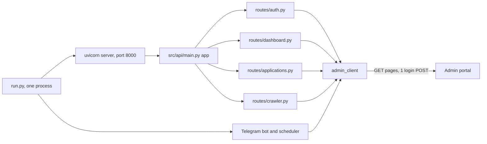
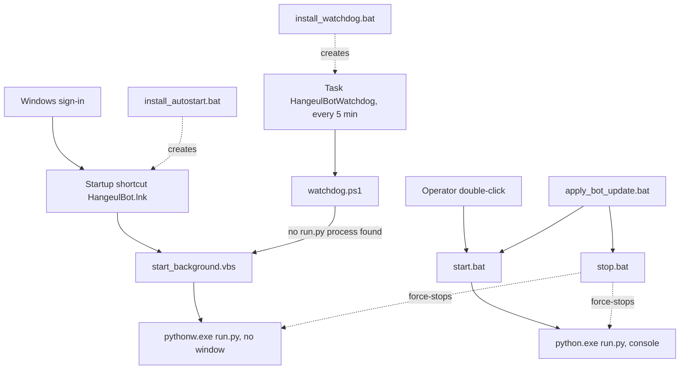

# REST API, root scripts and launchers

Reference for 32 files:

- the REST API package: `src/api/__init__.py`, `src/api/main.py`, `src/api/schemas.py`, `src/api/routes/__init__.py`, `src/api/routes/auth.py`, `src/api/routes/dashboard.py`, `src/api/routes/applications.py`, `src/api/routes/crawler.py`
- nine Python scripts in the repository root: `run.py`, `bootstrap.py`, `audit_program.py`, `compress_docs.py`, `download_passports.py`, `get_consultations.py`, `inspect_passports.py`, `test_system.py`, `test_verified.py`
- three root copies of `src` files: `telegram_bot.py`, `config.py`, `progress_builder.py`
- twelve Windows launchers in the repository root: ten `.bat` files, `start_background.vbs`, `watchdog.ps1`

Index of all programs: [../PYTHON_PROGRAMS.md](../PYTHON_PROGRAMS.md). Every `path:line` below is relative to the repository root. None of these programs was run for this document; every statement comes from reading the code.

## Contents

- [Overview](#overview)
- REST API: [src/api/\_\_init\_\_.py](#srcapi__init__py), [src/api/main.py](#srcapimainpy), [src/api/schemas.py](#srcapischemaspy), [src/api/routes/\_\_init\_\_.py](#srcapiroutes__init__py), [src/api/routes/auth.py](#srcapiroutesauthpy), [src/api/routes/dashboard.py](#srcapiroutesdashboardpy), [src/api/routes/applications.py](#srcapiroutesapplicationspy), [src/api/routes/crawler.py](#srcapiroutescrawlerpy)
- Root scripts: [run.py](#runpy), [bootstrap.py](#bootstrappy), [audit_program.py](#audit_programpy), [compress_docs.py](#compress_docspy), [download_passports.py](#download_passportspy), [get_consultations.py](#get_consultationspy), [inspect_passports.py](#inspect_passportspy), [test_system.py](#test_systempy), [test_verified.py](#test_verifiedpy), [root copies of src files](#root-copies-of-src-files)
- Launchers: [start.bat](#startbat), [start_background.vbs](#start_backgroundvbs), [stop.bat](#stopbat), [check_status.bat](#check_statusbat), [install_autostart.bat](#install_autostartbat), [install_watchdog.bat](#install_watchdogbat), [watchdog.ps1](#watchdogps1), [build_sheets.bat](#build_sheetsbat), [gauth.bat](#gauthbat), [run_passport_audit.bat](#run_passport_auditbat), [apply_bot_update.bat](#apply_bot_updatebat), [install_sheets.bat](#install_sheetsbat)
- [Settings read by this group](#settings-read-by-this-group)
- [Files and folders this group writes](#files-and-folders-this-group-writes)
- [Related documents](#related-documents)

## Overview

Terms used in this document:

| Term | Meaning |
|---|---|
| portal | The agency's admin web site, a set of PHP pages under `HANGEUL_BASE_URL` (default `https://hangeul.com.bd/admin`, `src/config.py:24`). It has no API of its own. |
| bot folder | The folder that holds `run.py` and `.env` (`BOT_ROOT`, `src/config.py:6`). Every launcher finds it from its own location (`%~dp0`, `$PSScriptRoot`), so the folder can sit anywhere. |
| venv | The Python 3.12 virtual environment in `<bot folder>\.venv`. Eight launchers check that `<bot folder>\.venv\Scripts\python.exe` or `pythonw.exe` exists and stop with an error message when it is missing: `start.bat`, `start_background.vbs` (a message box), `install_autostart.bat`, `install_watchdog.bat`, `build_sheets.bat`, `gauth.bat`, `run_passport_audit.bat`, `install_sheets.bat`. The other four do not. `stop.bat` and `check_status.bat` run no venv interpreter; they only compare process paths with `.venv\Scripts\` (`stop.bat:9`, `check_status.bat:10`). `apply_bot_update.bat` has no check of its own: it copies files and clears caches, and only `start.bat`, run at the end (`apply_bot_update.bat:74`), reports a missing interpreter. `watchdog.ps1` writes the missing path to `hangeul_watchdog.log` and shows no message (`watchdog.ps1:24-28`). |
| `admin_client` | The portal client object, built when `src/scraper/client.py` is imported (`src/scraper/client.py:778`). There is one per Python process. Inside the `run.py` process the REST routes and the Telegram bot handlers use the same object and so share one portal login. Every other process builds its own object and logs in on its own: the root scripts `audit_program.py`, `download_passports.py`, `get_consultations.py`, `inspect_passports.py`, `test_system.py` and `test_verified.py`, and the scheduler's `-m src.*` jobs, which run as separate child processes (`src/bot/scheduler.py:392-416`) and get their own object when they import the client. |
| mock mode | `MOCK_MODE=true`: a few client methods return built-in demo data instead of reading the portal. It is not an offline switch (see the sections below). |
| uid | The portal's own numeric id of a student. |
| MRZ | Machine-readable zone: the two coded lines at the bottom of a passport data page. |
| launcher | A `.bat`, `.vbs` or `.ps1` file that staff double-click, or that Windows runs, to start a Python command. |
| redirector | The venv's `python.exe` / `pythonw.exe`. It starts the real Python 3.12 interpreter as a child process with the same arguments (`watchdog.ps1:10-12`). One running bot therefore shows as two processes. |

What the group does together:

1. `run.py` is the one long-running process of the system. It starts the REST API (the `src/api` package, served by uvicorn) and the Telegram bot with its scheduler, in the same process.
2. The `src/api` package exposes a few portal reads as JSON over HTTP on port 8000. It has almost no logic of its own: every route calls a method of `admin_client` or reads its attributes.
3. The launchers start that process (visible or hidden), keep it alive (a Startup shortcut and a 5-minute scheduled task), show its state, and stop it.
4. `bootstrap.py` rebuilds everything on a fresh PC in six phases. The first five run child Python processes; the sixth prints what to do next.
5. The other root scripts are hand-run tools: a passport audit for one program, a passport download, two listings, a consultation brief, a smoke test, and an old one-off file shrinker.
6. Two launchers (`apply_bot_update.bat`, `install_sheets.bat`) and three root copies of `src` files are left from the time code updates were handed over as single files.

| Program | Lines | One-line purpose | How it is started |
|---|---|---|---|
| [`src/api/__init__.py`](../../src/api/__init__.py) | 1 | Package marker (a docstring). | Imported implicitly. |
| [`src/api/main.py`](../../src/api/main.py) | 69 | Builds the FastAPI app, mounts the four routers under `/api`, adds `/` and `/healthz`. | `run.py:79-85` gives `"src.api.main:app"` to uvicorn. |
| [`src/api/schemas.py`](../../src/api/schemas.py) | 76 | Ten Pydantic models; three are used. | Imported by `auth.py` and `crawler.py`. |
| [`src/api/routes/__init__.py`](../../src/api/routes/__init__.py) | 1 | Package marker (a docstring). | Imported implicitly. |
| [`src/api/routes/auth.py`](../../src/api/routes/auth.py) | 27 | `/api/auth/csrf`, `/api/auth/login`, `/api/auth/status`. | Mounted by `src/api/main.py:42`. |
| [`src/api/routes/dashboard.py`](../../src/api/routes/dashboard.py) | 16 | `/api/dashboard/stats`, `/api/dashboard/alerts`. | Mounted by `src/api/main.py:43`. |
| [`src/api/routes/applications.py`](../../src/api/routes/applications.py) | 26 | `/api/applications`, `/api/applications/inquiries`, `/api/applications/consultations`. | Mounted by `src/api/main.py:44`. |
| [`src/api/routes/crawler.py`](../../src/api/routes/crawler.py) | 12 | `/api/crawler/parse-page`: fetch any portal page and return its tables. | Mounted by `src/api/main.py:45`. |
| [`run.py`](../../run.py) | 110 | The one long-running process: logging, Telegram DNS fix, Ollama check, REST server and Telegram bot. | `.venv\Scripts\python.exe run.py` (`start.bat`) or `.venv\Scripts\pythonw.exe run.py` (`start_background.vbs`). |
| [`bootstrap.py`](../../bootstrap.py) | 151 | Cold start: six phases that rebuild sheets, caches, audits, documents and check results from the portal. | By hand: `python bootstrap.py [--from N] [--only N] [--plan]`. |
| [`audit_program.py`](../../audit_program.py) | 232 | Passport cross-check of every student in one program; writes a CSV report. | `python audit_program.py "<program name>"`; `run_passport_audit.bat`; `bootstrap.py` phase 3. |
| [`compress_docs.py`](../../compress_docs.py) | 174 | One-off: shrinks every PDF and image over 1.95 MB in one hard-coded folder, in place. | By hand: `python compress_docs.py`. Nothing calls it. |
| [`download_passports.py`](../../download_passports.py) | 51 | Saves every student's newest passport scan that is not saved yet. | By hand: `.venv\Scripts\python.exe download_passports.py`. |
| [`get_consultations.py`](../../get_consultations.py) | 142 | Console brief of the consultation requests of one date. | By hand: `python get_consultations.py [date]`. |
| [`inspect_passports.py`](../../inspect_passports.py) | 55 | Console list of students who have a passport scan on the portal; also supplies `passport_students()`. | By hand: `.venv\Scripts\python.exe inspect_passports.py`; imported by `download_passports.py`. |
| [`test_system.py`](../../test_system.py) | 145 | Five-part smoke test script (not a pytest file). | By hand: `python test_system.py`. |
| [`test_verified.py`](../../test_verified.py) | 36 | Console list of today's payment-verified students (not a pytest file). | By hand: `.venv\Scripts\python.exe test_verified.py`. |
| [`telegram_bot.py`](../../telegram_bot.py), [`config.py`](../../config.py), [`progress_builder.py`](../../progress_builder.py) (root) | 2437, 147, 595 | Byte-identical copies of `src/bot/telegram_bot.py`, `src/config.py`, `src/sheets/progress_builder.py`. | Not started. Read only by `apply_bot_update.bat` and `install_sheets.bat`. |
| [`start.bat`](../../start.bat) | 20 | Starts the bot in a visible console window. | Double-click; also started by `apply_bot_update.bat:74`. |
| [`start_background.vbs`](../../start_background.vbs) | 13 | Starts the bot with no window. | `wscript.exe "<bot folder>\start_background.vbs"`: by the Startup shortcut, by `watchdog.ps1`, or by hand. |
| [`stop.bat`](../../stop.bat) | 11 | Force-stops this folder's bot and its job processes, nothing else. | Double-click; `call stop.bat nopause` from `apply_bot_update.bat:32`. |
| [`check_status.bat`](../../check_status.bat) | 17 | Shows the bot's processes and the last 25 lines of `hangeul_bot.log`. | Double-click. |
| [`install_autostart.bat`](../../install_autostart.bat) | 22 | Creates the Startup shortcut `HangeulBot.lnk`. | Run once. |
| [`install_watchdog.bat`](../../install_watchdog.bat) | 33 | Creates the scheduled task `HangeulBotWatchdog` (every 5 minutes). | Run once. |
| [`watchdog.ps1`](../../watchdog.ps1) | 31 | Starts the bot when no `run.py` process is found; logs each check. | By the scheduled task, every 5 minutes. |
| [`build_sheets.bat`](../../build_sheets.bat) | 22 | Runs `python -m src.sheets.progress_builder --all`. | Double-click. |
| [`gauth.bat`](../../gauth.bat) | 27 | One-time Google sign-in (`progress_builder --auth`), after a `pip install` of three Google libraries. | Double-click. |
| [`run_passport_audit.bat`](../../run_passport_audit.bat) | 28 | Runs `audit_program.py "Bachelor's Degree"`. | Double-click. |
| [`apply_bot_update.bat`](../../apply_bot_update.bat) | 82 | Old one-click updater: stop, copy two files into `src\`, clear caches, verify, restart. | Double-click. |
| [`install_sheets.bat`](../../install_sheets.bat) | 47 | Old installer of `progress_builder.py` into `src\sheets\` plus the Google libraries. | Double-click. |

The running process and what it serves:



How the bot process gets started, kept alive and stopped:



The REST routes, all in one table. Base address: `http://<API_HOST>:<API_PORT>`, defaults `0.0.0.0` and `8000` (`src/config.py:79-80`). No route asks for a password or a key.

| Method and path | Handler | What it returns |
|---|---|---|
| `GET /` | `root` (`src/api/main.py:48`) | Portal name, `docs_url`, `mock_mode`, `target_url`, and a hand-written list of nine endpoint paths. |
| `GET /healthz` | `health_check` (`src/api/main.py:68`) | `{"status": "ok", "mock_mode": <bool>}`. |
| `GET /api/auth/csrf` | `get_csrf` (`src/api/routes/auth.py:8`) | Live: `status_code`, `current_url`, `csrf_token`, `cookies`, `mock`. Live, when the login page cannot be fetched: `{error, unreachable, mock}`, still with HTTP 200. Mock: a fixed token, `session_active`, `mock`. |
| `POST /api/auth/login` | `login` (`src/api/routes/auth.py:13`) | Body `{username?, password?}`. Reply `{success, message, role, mock, error}`; HTTP 401 on a failed login. |
| `GET /api/auth/status` | `auth_status` (`src/api/routes/auth.py:21`) | `{authenticated, mock_mode, base_url}`. |
| `GET /api/dashboard/stats` | `get_dashboard_stats` (`src/api/routes/dashboard.py:7`) | The parsed dashboard (`index.php`), or `{"error": why}`. |
| `GET /api/dashboard/alerts` | `get_dashboard_alerts` (`src/api/routes/dashboard.py:12`) | `{"alerts": [...]}`. In live mode the list is always empty (see the section). |
| `GET /api/applications` | `get_applications` (`src/api/routes/applications.py:8`) | Student records. Query `status`, `intake` (substring filters). |
| `GET /api/applications/inquiries` | `get_inquiries` (`src/api/routes/applications.py:16`) | Live: today's consultation requests. Mock: three sample leads. |
| `GET /api/applications/consultations` | `get_consultations` (`src/api/routes/applications.py:21`) | Consultation requests whose received date matches query `date` (default `today`). |
| `POST /api/crawler/parse-page` | `crawl_admin_page` (`src/api/routes/crawler.py:8`) | Body `{path}`. Live reply `{status_code, url, tables, dashboard_summary}`. |
| `GET /docs`, `GET /redoc` | none in the repository; added by the FastAPI library because of `docs_url` and `redoc_url` (`src/api/main.py:27-28`) | The two interactive documentation pages. |
| `GET /openapi.json`, `GET /docs/oauth2-redirect` | none in the repository; FastAPI library defaults, not stated in the code | The machine-readable description of every route; a helper page of `/docs`. |

---

## src/api/\_\_init\_\_.py

**Purpose.** Marks `src/api` as a package. The file is one docstring line (`src/api/__init__.py:1`).

**How it is run or who calls it.** Imported implicitly when `src.api.main` is imported.

**What it reads.** Nothing. **What it writes.** Nothing.

**Why it exists.** Packaging only.

**Main functions and classes.** None. **Numbers that matter.** None. **Things to know.** None.

## src/api/main.py

**Purpose.** Defines the FastAPI application object `app`, titled "Hangeul Korean Language & Visa — Admin API", version `1.0.0` (`src/api/main.py:23-30`). It is a thin REST wrapper around `admin_client`.

**How it is run or who calls it.** It is never run on its own. Two things load it:

| Loader | Line | How |
|---|---|---|
| `run.py` | 79-85 | Passes the string `"src.api.main:app"` to `uvicorn.Config` and serves it inside the bot process. |
| `test_system.py` | 99-103 | Imports `app` and calls it in-process through `httpx.ASGITransport`. No socket is opened. |

No other file in the repository imports `src.api`.

**What it reads.**

- Settings `MOCK_MODE` (`src/api/main.py:18`, `:52`, `:69`) and `HANGEUL_BASE_URL` (`:53`).
- It imports `admin_client` (`:7`) and the four route modules (`:8`). It makes no portal request itself.

**What it writes.**

- Log lines under the logger name `hangeul.api` (`:14`): one at start, one at shutdown (`:18`, `:21`).
- JSON replies for `/` and `/healthz`.
- At shutdown the lifespan hook closes the shared portal HTTP client (`:20`).

**Why it exists.** It lets another program on the network read portal figures as JSON instead of parsing HTML. The repository contains no caller of these routes other than `test_system.py`. Whether anything outside the repository uses them cannot be determined from the code.

**Main functions and classes.**

| Name | Line | What it does |
|---|---|---|
| `logging.basicConfig(...)` | 10 | Sets INFO-level logging with the format `time [LEVEL] name: message`. |
| `lifespan(app)` | 17 | Async context manager. Logs the start with the mock-mode flag; after the server stops, awaits `admin_client.close()` and logs the shutdown. |
| `app` | 23 | `FastAPI(title, description, version="1.0.0", docs_url="/docs", redoc_url="/redoc", lifespan=lifespan)`. |
| CORS middleware | 33 | `allow_origins=["*"]`, `allow_credentials=True`, all methods, all headers. |
| router registration | 42-45 | `auth`, `dashboard`, `applications`, `crawler`, each with the prefix `/api`. |
| `root()` | 48 | `GET /`. Returns the portal name, `docs_url`, `mock_mode`, `target_url` and a literal list of nine endpoint paths (`:54-64`). |
| `health_check()` | 68 | `GET /healthz`. Returns `{"status": "ok", "mock_mode": settings.MOCK_MODE}`. |

**Numbers that matter.** None in this file. The bind address and port come from `run.py` (`API_HOST`, default `0.0.0.0`; `API_PORT`, default `8000`).

**Things to know.**

- There is no authentication on any route, and the default bind address is every network interface (`src/config.py:79`; `.env.example:102-104`). `MIGRATION.md:246` records this as known and left as is by choice. Setting `API_HOST=127.0.0.1` limits the API to this PC.
- CORS allows any origin with credentials (`:35-36`).
- The `logging.basicConfig` call at line 10 has no effect under `run.py`. `run.py:41` has already configured the root logger before uvicorn imports this module, and the standard library ignores a second `basicConfig` call.
- The lifespan shutdown closes the same `admin_client` object that the Telegram bot uses (`src/scraper/client.py:778`).
- The endpoint list returned by `/` is a hand-maintained literal. It does not include `/`, `/healthz`, `/docs`, `/redoc` or `/openapi.json`.
- `/openapi.json` is served although the code never names it: `FastAPI(...)` is called without an `openapi_url` argument, and the library's default stays on. This is library behaviour, not stated in the code. The page describes every route, including the field names of the login body.

## src/api/schemas.py

**Purpose.** Pydantic models for the REST API: request bodies and one response shape.

**How it is run or who calls it.** Imported by `src/api/routes/auth.py:2` (`LoginRequest`, `LoginResponse`) and `src/api/routes/crawler.py:2` (`CrawlRequest`). No other importer.

**What it reads.** Nothing. **What it writes.** Nothing.

**Why it exists.** Request validation, and the schema that the `/docs` page shows.

**Main functions and classes.**

| Name | Line | What it does |
|---|---|---|
| `LoginRequest` | 4 | Optional `username`, optional `password`. Used by `POST /api/auth/login`. |
| `LoginResponse` | 8 | `success` (bool), `message` (str, required), `role`, `mock` (default `False`), `error`. Used as the response model of the login route. |
| `CrawlRequest` | 69 | Required `path`: a sub-path inside the admin panel. Used by `POST /api/crawler/parse-page`. |
| `DashboardSummary`, `ActivityItem`, `AlertItem`, `DashboardResponse`, `ApplicationItem`, `InquiryItem`, `CrawlResponse` | 15, 25, 31, 35, 44, 59, 72 | Defined and not referenced anywhere in the repository. |

**Numbers that matter.** Ten models; three are used.

**Things to know.**

- Seven of the ten models are dead code. The list routes return whatever dictionary or list the client produces, with no response model.
- `LoginResponse.message` is required. A failed login never reaches the model, because the route raises HTTP 401 first (`src/api/routes/auth.py:16-17`).
- The unused models describe an early demo data shape (for example `visa_approved_ytd`, `topik_level`). They do not match what the live portal parsers return.

## src/api/routes/\_\_init\_\_.py

**Purpose.** Marks the routes package. One docstring line (`src/api/routes/__init__.py:1`).

**How it is run or who calls it.** `src/api/main.py:8` imports `auth`, `dashboard`, `applications` and `crawler` from it.

**What it reads.** Nothing. **What it writes.** Nothing. **Why it exists.** Packaging only.

**Main functions and classes.** None. **Numbers that matter.** None. **Things to know.** None.

## src/api/routes/auth.py

**Purpose.** Three routes about the portal login: read the login page's CSRF token, log in, report the login state. Router prefix `/auth`, tag "Authentication" (`src/api/routes/auth.py:5`).

**How it is run or who calls it.** Mounted under `/api` by `src/api/main.py:42`.

**What it reads.**

| Route | Client method | Portal request in live mode | Mock mode |
|---|---|---|---|
| `GET /api/auth/csrf` | `admin_client.get_login_page()` (`src/scraper/client.py:124-148`) | `GET login.php`, timeout 30 s (`:136`). The CSRF token is taken from the page. When the GET raises, the method returns `{"error": <reason>, "unreachable": <bool>, "mock": False}` instead (`:145-148`); `unreachable` is true when the exception is an `httpx.TransportError`, that is, the portal did not answer at all. | A fixed mock token; no request (`:127-132`). |
| `POST /api/auth/login` | `admin_client.login(username, password)` (`src/scraper/client.py:150-200`) | `GET login.php` for the token, then `POST login.php` with the form fields `_csrf`, `username`, `password` (`:176-184`). | Sets the logged-in flag and returns success; no request (`:158-165`). |
| `GET /api/auth/status` | attributes `is_authenticated`, `mock_mode`, `base_url` | none | none |

When the request body leaves out `username` or `password`, the client uses the settings `HANGEUL_USERNAME` and `HANGEUL_PASSWORD` (`src/scraper/client.py:155-156`).

**What it writes.** JSON replies only. The login reply is the client's dictionary passed through `LoginResponse`, so only `success`, `message`, `role`, `mock` and `error` are returned. A failed login raises `HTTPException(401)` with the client's reason as `detail` (`src/api/routes/auth.py:16-17`).

**Why it exists.** It lets an API user check or set up the portal session that the other routes depend on.

**Main functions and classes.**

| Name | Line | What it does |
|---|---|---|
| `router` | 5 | `APIRouter(prefix="/auth", tags=["Authentication"])`. |
| `get_csrf()` | 8 | Returns `admin_client.get_login_page()` unchanged. |
| `login(req)` | 13 | Calls `admin_client.login`; HTTP 401 when `success` is false; otherwise returns the result. |
| `auth_status()` | 21 | Returns `{"authenticated", "mock_mode", "base_url"}` from the client's attributes. |

**Numbers that matter.** 30 s for the login page GET (`src/scraper/client.py:136`). The login POST uses the client's default timeout of 15 s (`src/scraper/client.py:116`). HTTP status 401 for a refused login.

**Things to know.**

- In live mode `GET /api/auth/csrf` returns `"cookies": dict(self.client.cookies)` (`src/scraper/client.py:142`): the cookie jar of the shared portal client. After a login that jar holds the portal session cookie. With no API authentication and the `0.0.0.0` default, any machine that can reach port 8000 can read it.
- `POST /api/auth/login` acts on the client that the bot shares. A refused login sets `is_authenticated = False` for the whole process (`src/scraper/client.py:186-188`). A successful login with other credentials replaces the bot's session.
- `POST /api/auth/login` is not the only route that causes a portal POST. In live mode every route that reads a portal page logs in first when the shared client has no session, and that login sends the POST to `login.php` (`src/scraper/client.py:184`):

| Route | Where the login is triggered |
|---|---|
| `POST /api/auth/login` | Directly: `admin_client.login` (`src/api/routes/auth.py:15`). |
| `GET /api/dashboard/stats`, `GET /api/dashboard/alerts` | `get_dashboard` → `fetch_html` → `portal_get` → `_ensure_session` → `login` (`src/scraper/client.py:209`, `:342`, `:325`, `:298`). |
| `GET /api/applications` | `get_applications` → `read_students` → `read_student_pages` → `fetch_html` → `portal_get` (`src/scraper/client.py:229`, `:510`, `:473`). |
| `GET /api/applications/consultations`, `GET /api/applications/inquiries` | `get_consultation_requests` calls `login` when there is no session (`src/scraper/client.py:271-272`), and again when the page ends on `login.php` (`:277-279`). |
| `POST /api/crawler/parse-page` | `crawl_page` calls `login` when there is no session (`src/scraper/client.py:762-763`). |

`portal_get` also logs in once more when a page ends on `login.php`, that is, when the session has expired (`src/scraper/client.py:328-330`). Only `GET /api/auth/csrf` (one GET of `login.php`) and `GET /api/auth/status` (no request) never cause a POST. In mock mode `login` returns before sending anything (`src/scraper/client.py:158-165`), so no route causes a POST. The login POST at `src/scraper/client.py:184` is still the only POST the code base sends to the portal; every other portal request is a GET.

## src/api/routes/dashboard.py

**Purpose.** Two routes that return the portal dashboard as JSON. Router prefix `/dashboard`, tag "Dashboard" (`src/api/routes/dashboard.py:4`).

**How it is run or who calls it.** Mounted under `/api` by `src/api/main.py:43`.

**What it reads.** Both routes call `admin_client.get_dashboard()` (`src/scraper/client.py:202-212`). Live mode: portal `GET index.php`, timeout 30 s, parsed by `parse_hangeul_live_dashboard` (`src/scraper/parsers.py:269`). Mock mode: the built-in `MOCK_DASHBOARD_STATS`.

**What it writes.** JSON replies only.

- `/api/dashboard/stats` returns the dashboard dictionary as it is. In live mode its keys are `status`, `portal`, `last_synced`, `summary`, `live_stats`, `tiles`, `recent_activity` (`src/scraper/parsers.py:302-310`).
- `/api/dashboard/alerts` returns `{"alerts": dash.get("urgent_alerts") or dash.get("alerts", [])}` (`src/api/routes/dashboard.py:15-16`).

**Why it exists.** Headline counts and action items as JSON.

**Main functions and classes.**

| Name | Line | What it does |
|---|---|---|
| `router` | 4 | `APIRouter(prefix="/dashboard", tags=["Dashboard"])`. |
| `get_dashboard_stats()` | 7 | Returns `admin_client.get_dashboard()`. |
| `get_dashboard_alerts()` | 12 | Reads the dashboard and returns only its alert list. |

**Numbers that matter.** 30 s timeout on the dashboard page (`src/scraper/client.py:209`).

**Things to know.**

- `get_dashboard` never raises. A page that cannot be read gives `{"error": why}` (`src/scraper/client.py:210-212`), and `/stats` returns that dictionary as a normal reply, not as an HTTP error.
- In live mode `/api/dashboard/alerts` always returns `{"alerts": []}`. The live dashboard dictionary has neither an `urgent_alerts` key nor an `alerts` key (`src/scraper/parsers.py:302-310`). Only the mock data has `urgent_alerts`. An unreadable dashboard gives the same empty list, so "no alerts" and "could not read" look the same.
- The docstring of the alerts route names embassy appointments, expiring documents and tuition notices (`src/api/routes/dashboard.py:13`). No code reads such items from the portal.

## src/api/routes/applications.py

**Purpose.** Three GET routes for student applications and consultation requests (leads). Router prefix `/applications`, tag "Applications & Leads" (`src/api/routes/applications.py:5`).

**How it is run or who calls it.** Mounted under `/api` by `src/api/main.py:44`.

**What it reads.**

| Route | Query parameters | Client method | Portal request in live mode | Mock mode |
|---|---|---|---|---|
| `GET /api/applications` | `status`, `intake` (both optional) | `get_applications` (`src/scraper/client.py:214-234`) | `GET students.php`. With no filter: the first page only, the 50 newest. With a filter: every page (`?pg=2..N`). Filters are applied in code as case-insensitive substrings of the record's `status` and `target_intake`. | Six built-in sample records, filtered the same way. |
| `GET /api/applications/inquiries` | none | `get_inquiries` (`src/scraper/client.py:287-292`) | The same read as the next row with the date `today`. | Three built-in sample leads. |
| `GET /api/applications/consultations` | `date`, default `today` | `get_consultation_requests` (`src/scraper/client.py:269-285`) | `GET consult_requests.php` with no query parameters; rows are kept when their "received" text contains the date written as `DD Mon YYYY` (`src/scraper/parsers.py:784-788`, `:576-589`). | No mock branch: see "Things to know". |

**What it writes.** JSON replies only: a list of records.

**Why it exists.** The student list and the day's leads as JSON.

**Main functions and classes.**

| Name | Line | What it does |
|---|---|---|
| `router` | 5 | `APIRouter(prefix="/applications", tags=["Applications & Leads"])`. |
| `get_applications(status, intake)` | 8 | Returns `admin_client.get_applications(status=status, intake=intake)`. |
| `get_inquiries()` | 16 | Returns `admin_client.get_inquiries()`. |
| `get_consultations(date)` | 21 | Returns `admin_client.get_consultation_requests(target_date=date)`. Its description names the accepted forms: `today`, `yesterday`, a date such as `10 Sep 2026`, or `2026-09-09`. |

**Numbers that matter.**

- Student list pages hold 50 students; at most 40 pages are read (`src/scraper/client.py:44-45`).
- Each student list page is read through `portal_get`: 60 s per page, 10 s to connect (`src/scraper/client.py:48`, `:314-326`).
- The consultation page is read with the raw client: 15 s (`src/scraper/client.py:116`, `:276`).

**Things to know.**

- `get_applications` raises `PortalUnavailable` when the list cannot be read (`src/scraper/client.py:219-220`). The route does not catch it. FastAPI's default for an unhandled exception is HTTP 500 (library behaviour, not stated in the code).
- `get_consultation_requests` has no mock branch. In mock mode the login is faked, and the code still sends a real `GET consult_requests.php` to the portal host (`src/scraper/client.py:271-276`).
- `get_consultation_requests` catches every exception and returns `[]` (`src/scraper/client.py:283-285`). A failed read, and a `date` value that is not a readable date, both look like "no requests".
- In live mode "inquiries" means today's consultation requests and nothing more (`src/scraper/client.py:292`).
- The handler `get_consultations` shares its name with the root script `get_consultations.py`. They are unrelated code.

## src/api/routes/crawler.py

**Purpose.** One route that fetches any portal page named by the caller and returns its HTML tables as JSON. Router prefix `/crawler`, tag "Generic Table & Page Crawler" (`src/api/routes/crawler.py:5`).

**How it is run or who calls it.** Mounted under `/api` by `src/api/main.py:45`. `test_system.py:80` calls the underlying client method directly.

**What it reads.** `POST /api/crawler/parse-page` with the body `{"path": "<sub-path>"}` calls `admin_client.crawl_page(path)` (`src/scraper/client.py:741-775`).

- Live mode: logs in when there is no session, then sends `GET <HANGEUL_BASE_URL>/<path with leading slashes removed>` with the raw client. The reply text goes through `parse_tables` and `parse_dashboard_metrics`.
- Mock mode: returns a fixed sample table of two rows; no request.

**What it writes.** JSON only. Live: `{status_code, url, tables, dashboard_summary}`, or `{error}` when the request raised. Mock: `{mock, requested_path, status, tables}`.

**Why it exists.** A catch-all for pages that have no route of their own. Its docstring names `payments.php` and `settings.php` as examples (`src/api/routes/crawler.py:9`).

**Main functions and classes.**

| Name | Line | What it does |
|---|---|---|
| `router` | 5 | `APIRouter(prefix="/crawler", tags=[...])`. |
| `crawl_admin_page(req)` | 8 | Returns `admin_client.crawl_page(req.path)`. |

**Numbers that matter.** Client default timeout 15 s (`src/scraper/client.py:116`). No retry.

**Things to know.**

- The path comes from the caller. Only leading `/` characters are removed (`src/scraper/client.py:743`). Nothing limits which page is fetched. The agent rules file limits portal access to a short list of pages (`.agents/rules/hangeul_operational_guardrails.md:41-42`); this route does not enforce that list. The request for the named page is a GET, so the route submits no form on that page. When the shared client has no session, the route first logs in (`src/scraper/client.py:762-763`), and that login is a POST to `login.php` (`:184`).
- It uses the raw client (`src/scraper/client.py:767`), not `portal_get`. There is no expired-session check, so a login page can be parsed and returned as if it were data.
- `dashboard_summary` is always `null` in live mode. `parse_dashboard_metrics` builds its result and ends without a `return` statement (`src/scraper/parsers.py:183-211`).
- The live and mock replies have different shapes. The key `status` exists only in the mock reply.
- The HTTP verb on the bot's API is POST. The request it sends for the named page is a GET; the only POST it can cause is the login described above.

---

## run.py

**Purpose.** The single entry point of the running system. One process hosts the REST API (uvicorn) and the Telegram bot (long polling) together with the bot's scheduler.

**How it is run or who calls it.** No command-line flags.

| Command | Started by | Window |
|---|---|---|
| `"<bot folder>\.venv\Scripts\python.exe" run.py` | `start.bat:12` | Console window. |
| `"<bot folder>\.venv\Scripts\pythonw.exe" run.py` | `start_background.vbs:13` | None. |

`watchdog.ps1`, `stop.bat` and `check_status.bat` recognise the bot by the text `run.py` in a process's command line.

**What it reads.**

- Settings: `MOCK_MODE` (`run.py:63`), `API_PORT` (`:64`, `:82`), `API_HOST` (`:81`), `TELEGRAM_BOT_TOKEN` (`:65`), `OLLAMA_MODEL` (`:53`, `:55`, `:66`).
- Windows environment, through `apply_telegram_dns_fix()` (`run.py:71`): `TELEGRAM_DNS_FIX` and `TELEGRAM_API_IP` (`src/net_fix.py:77`, `:81`). That function also opens TCP connections to `api.telegram.org:443` to test whether Telegram is reachable.
- Ollama (the local model server), through `ollama_client.check_health()` (`run.py:50`): `GET <OLLAMA_BASE_URL>/api/tags` (`src/llm/ollama_client.py:106`).
- Telegram: it starts long polling for updates (`run.py:95`).

**What it writes.**

- `hangeul_stdout.log` and `hangeul_stderr.log` in the bot folder: append mode, line-buffered, UTF-8. These are opened only when `sys.stdout` or `sys.stderr` is `None`, which is the case under `pythonw.exe` (`run.py:8-9`, `:16-17`).
- `hangeul_bot.log` in the bot folder: every log record at INFO and above (`run.py:37`, `:41-45`). The same records also go to stdout (`:38-39`).
- A start-up banner on the console, drawn with the `rich` library (`run.py:60-68`), then one line about the Telegram DNS override when one is active (`:72-73`) and one line about Ollama (`:53-57`).
- Telegram: `post_init` (called at `run.py:94`) sets the bot's command menu of 13 commands, sends and pins the command cheat-sheet in the chat named by `TELEGRAM_ADMIN_CHAT_ID`, and starts a background task that loads or releases the local model (`src/bot/telegram_bot.py:2314-2365`). It loads the model when `JENNIE_VOICE_ENABLED` or `BRAIN_ALWAYS_LOADED` is true and releases it otherwise (`src/llm/ollama_client.py:37-39`, `src/bot/telegram_bot.py:2359-2365`). See [Settings read by this group](#settings-read-by-this-group).
- A listening socket on `API_HOST:API_PORT`.

**Why it exists.** One thing to start and one thing to keep alive. Staff talk to the bot in Telegram, the scheduled jobs run inside it, and the REST API is available on port 8000.

**Main functions and classes.**

| Name | Line | What it does |
|---|---|---|
| module top | 1-22 | Imports `sys`, `os` and `pathlib.Path` (`:1-3`). Sets `LOG_DIR` to the script's folder. Redirects stdout and stderr to log files when they are `None`; otherwise switches them to UTF-8 (`:7-22`). The redirect runs before every other import: `asyncio` at `:24`, then `logging`, `uvicorn`, `rich` and the `src` modules (`:25-33`). |
| `console` | 35 | `rich` console that writes to the current stdout. |
| logging setup | 37-46 | A file handler for `hangeul_bot.log` plus a stream handler for stdout; level INFO; logger name `hangeul.main`. |
| `check_ollama_status()` | 48 | Prints one of three states: model ready; Ollama running but the model named by `OLLAMA_MODEL` not found (suggests `ollama pull <model>`); Ollama not detected. |
| `start_all()` | 59 | Prints the banner. Applies the Telegram DNS fix. Checks Ollama. Builds `uvicorn.Config("src.api.main:app", host, port, log_level="info")` and a `uvicorn.Server`. Calls `build_telegram_application()`. With a bot: enters `async with telegram_app`, awaits `start()`, `post_init()`, `updater.start_polling()`, then `server.serve()`; in `finally` stops the updater and the application (`:90-100`). Without a bot: serves the API alone (`:101-103`). |
| `__main__` block | 105-110 | `asyncio.run(start_all())`. On `KeyboardInterrupt` or `SystemExit` it prints a shutdown line and exits with code 0. |

**Numbers that matter.**

- Ollama health check timeout: 5 s (`src/llm/ollama_client.py:106`).
- Telegram reachability probe: 3 s per address, a list of ten candidate addresses, one of them listed twice (`src/net_fix.py:22`, `:25-36`).
- Defaults: host `0.0.0.0`, port `8000` (`src/config.py:79-80`).
- The scheduler is not started here. It is started inside `build_telegram_application()` (`src/bot/telegram_bot.py:2436`) and registers seven jobs (`src/bot/scheduler.py:435-509`), unless `ENABLE_SCHEDULED_REPORTS` is false (`src/bot/scheduler.py:421-423`). They are described in [bot_answers_and_jobs.md](bot_answers_and_jobs.md).

**Things to know.**

- The Telegram bot lives only as long as `server.serve()` runs. The API server is the main loop (`run.py:96-100`).
- When `TELEGRAM_BOT_TOKEN` is empty or equals the placeholder `your_telegram_bot_token_here`, no bot is built (`src/bot/telegram_bot.py:2369-2372`). Then no scheduler runs either, and only the REST API is served. The banner uses a looser test: any non-empty token that does not contain `your_` is shown as "Active" (`run.py:65`).
- `post_init` is called by hand at `run.py:94`. The same function is also registered on the application builder (`src/bot/telegram_bot.py:2374`); the Telegram library (python-telegram-bot, pinned to 22.8 at `requirements.txt:28`) calls a registered `post_init` only from its own `run_polling()` and `run_webhook()`; `Application.initialize()` and `start()` do not call it. `run.py` uses neither of those two methods, so it calls `post_init` itself (library behaviour, stated in the library's own `telegram/ext/_application.py`, not in this repository).
- Banner text is hard-coded and partly stale. It names "Local Qwen2.5-7B LLM" (`run.py:61`) and "on RTX 5060" (`:66`), while the default model is `qwen3:4b-instruct` (`src/config.py:32`). The "not detected" line names `http://localhost:11434` (`run.py:57`) whatever `OLLAMA_BASE_URL` is. The API-only line names `http://localhost:8000/docs` (`run.py:102`) whatever `API_PORT` is.
- Under `pythonw.exe` each log record is written twice: once to `hangeul_bot.log`, and once through the stdout handler to `hangeul_stdout.log`.
- The exit code is 0 even after `SystemExit` (`run.py:108-110`).
- What happens when port 8000 is already taken (whether the bot also stops) depends on uvicorn and cannot be determined from this code.
- The log files hold student names and portal replies; `.gitignore:33-36` keeps them out of git for that reason.

## bootstrap.py

**Purpose.** "Cold start": bring a fresh PC, or cleared progress sheets, to a fully checked state. It runs six phases in order. Each of the first five starts one or more child Python processes in the bot folder; the sixth only prints instructions.

**How it is run or who calls it.** By hand, from the bot folder. Flags (`bootstrap.py:126-130`):

| Command | Effect |
|---|---|
| `python bootstrap.py` | Every phase, 1 to 6. |
| `python bootstrap.py --from N` | Start at phase N (default 1). |
| `python bootstrap.py --only N` | Run phase N alone. |
| `python bootstrap.py --plan` | Print the module docstring and the list of phases that would run; do nothing. |

`MIGRATION.md:151-153` shows it run as `.venv\Scripts\python.exe bootstrap.py --only 2`, then `--only 1`, then `--only 3`. Nothing in the repository starts it automatically.

**What it reads.**

- Setting `DOCS_ROOT`, through `settings.docs_root()` (`bootstrap.py:36`). Default: `<parent of the bot folder>\VERIFIED STUDENT DOCUMENTS` (`src/config.py:101-102`).
- `import src` (`bootstrap.py:32`) sets the certificate-bundle environment variables from `data\windows-ca.pem` when that file exists (`src/__init__.py:18-22`). The child processes inherit them.
- Everything else (portal pages, Google, local files) is read by the child processes.

**What it writes.** Console output only: a banner before each phase, then "done" or "FAILED (exit N)" with the elapsed seconds, and the total minutes at the end. The children write the sheets, files and reports.

**Why it exists.** A new PC inherits nothing from the old one. This script rebuilds the sheets, the passport-issue cache, the passport audit, the document archive and the check results from the portal, in a fixed order.

**The phases.** The interpreter is `sys.executable`; the working folder of every child is the bot folder (`bootstrap.py:37`, `:43`). The function names do not match the phase numbers.

| Phase | Function (line) | Child command | What the script's banner says it does |
|---|---|---|---|
| 1 | `phase_1` (50) | `python -m src.sheets.progress_builder --all` | Reads every direct student and builds one Google Sheet per program and intake in Drive. Main tabs only. Lists students with no intake at the end. |
| 2 | `phase_1b` (59) | `python -m src.sheets.passport_issue --refresh` | Reads the passport issue date from each student's edit page (the CSV export does not carry it) and caches it. "About 290 read-only page fetches." The bot refreshes it daily at 08:30 afterwards. |
| 3 | `phase_2` (69) | `python audit_program.py "<program>"`, four times: `Korean Language Program (KLP)`, `EAP (English for Academic Purpose)`, `Bachelor's Degree`, `Master's Degree` | Downloads each student's passport scan only and cross-checks name, passport number, date of birth, expiry and parents against the portal, using the MRZ check digits. |
| 4 | `phase_3` (84) | `python -m src.sheets.verified_docs --local "<DOCS_ROOT>"` | Downloads the full document set of every document-verified student into `<DOCS_ROOT>\<PROGRAM>\<NAME (PASSPORT)>\`. Files over 2 MB are shrunk and the original kept. Students already downloaded are skipped. |
| 5 | `phase_4` (93) | `python -m src.verify.auto_verify --recheck --budget 0` | Reads every document (PDF text layer first, OCR for scans), checks it against the programme guidelines, compares the portal's fields with the documents. Writes `DOCUMENT CHECK.xlsx` and `FIELD CHECK.xlsx`. "Allow a few hours the first time." |
| 6 | `phase_5` (103) | none | Prints the command `wscript.exe "<bot folder>\start_background.vbs"` and the two commands `.\install_autostart.bat` and `.\install_watchdog.bat`. |

The modules the children run are described in [sheets.md](sheets.md) (phases 1, 2, 4) and [verify.md](verify.md) (phase 5).

**Main functions and classes.**

| Name | Line | What it does |
|---|---|---|
| `BOT`, `DOCS`, `PY` | 35-37 | The bot folder, the documents folder, the running interpreter. |
| `run(label, args, why)` | 40 | Prints a banner, runs `subprocess.run([PY, *args], cwd=BOT)`, prints the outcome and the elapsed seconds, returns `returncode == 0`. |
| `phase_1()` | 50 | Phase 1. |
| `phase_1b()` | 59 | Phase 2. |
| `phase_2()` | 69 | Phase 3: one `run` per program; the results are combined with `ok &= ...`. |
| `phase_3()` | 84 | Phase 4. |
| `phase_4()` | 93 | Phase 5. |
| `phase_5()` | 103 | Phase 6: prints instructions and returns `True`. |
| `PHASES` | 122 | `{1: phase_1, 2: phase_1b, 3: phase_2, 4: phase_3, 5: phase_4, 6: phase_5}`. |
| `main()` | 125 | Parses the flags. Runs the wanted phases in order. At the first phase that returns `False` it prints `python bootstrap.py --from <n>` and exits with code 1. |

**Numbers that matter.**

- Six phases; four programs in phase 3.
- No timeout on any child. No retry.
- `--budget 0` in phase 5 means "no limit on students in this pass" (`src/verify/auto_verify.py:573`).
- Exit code 1 when a phase fails, and also when an unknown `--only` value raises `KeyError` (see below); 0 otherwise.

**Things to know.**

- Phase 6 does not start the bot, although the docstring says "start the bot" (`bootstrap.py:20`). It only prints the commands (`bootstrap.py:104-118`).
- Success is judged by the child's exit code alone (`bootstrap.py:44`). `progress_builder --all` prints `FAILED — ...` for a sheet it could not build and still ends normally (`src/sheets/progress_builder.py:573-584`). A phase that did nothing useful can therefore count as done. `MIGRATION.md:138-139` warns: do not run `bootstrap.py` unattended.
- Phase 3 runs all four programs even when one fails, then reports the phase as failed (`bootstrap.py:75`).
- Phase 3 opens one CSV file in the default spreadsheet program per program (`audit_program.py:222-224`).
- The flag values are not range-checked (`bootstrap.py:127-132`). What out-of-range values do:

| Value | Result |
|---|---|
| `--only 0` | Treated as "not given" (`if args.only`, `bootstrap.py:132`); the `--from` value decides, so by default every phase runs. |
| `--only N` for any other N that is not 1 to 6, negative numbers included | The script prints its two opening lines (`:139-140`), then `PHASES[n]` raises `KeyError` at `bootstrap.py:143`. Nothing has run. The exception is not caught, so Python prints a traceback and exits with code 1 (Python's default for an uncaught exception). |
| `--from 7` or higher | The phase list is empty (`:132`). The script prints `Cold start — phases ` with nothing after it, the read-only line, and `All phases finished in 0 minutes.` (`:139-147`), then exits with code 0 without running anything. |
| `--from 0` or lower | Every phase runs, as with `--from 1` (`n >= args.start`, `:132`). |
| `--plan` with any of these | Prints the phase list that would run, even an empty or invalid one, and stops before `:143` (`:134-137`). |

- The documented procedure differs from the script in three ways, and the script was not updated to match:

| Point | `bootstrap.py` | `MIGRATION.md` |
|---|---|---|
| Order | Phase 1, then phase 2 (`:122`). | Phase 2 before phase 1, so the Passport Issue column is filled (`MIGRATION.md:146-147`). |
| Phase 4 | No `--include-drive-done` (`:86`). | Direct command with `--include-drive-done`; without it, students once uploaded to Drive are skipped (`MIGRATION.md:154`, `:166-167`). |
| Phase 5 | One long process, `--recheck --budget 0` (`:95`). | Batches of five students, a fresh process each (`--budget 5` in a loop), because one long process slows down as its GPU memory grows (`MIGRATION.md:169-178`). |

- The statement "Portal access is read-only" appears twice (`bootstrap.py:22`, `:140`).

## audit_program.py

**Purpose.** Batch passport cross-check for one program. For every student in the program it compares what staff typed on the portal with what the uploaded passport scan shows, and writes a per-student CSV plus a console total.

**How it is run or who calls it.**

| Caller | Command |
|---|---|
| By hand | `python audit_program.py "<program name>"`. With no argument the program is `Bachelor's Degree` (`audit_program.py:126`). |
| `run_passport_audit.bat:17` | `"<venv python>" audit_program.py "Bachelor's Degree"` |
| `bootstrap.py:75-76` | `python audit_program.py "<program>"` for four programs. |
| `tests/test_integration.py:124-143` | Imports the module and calls `classify` and `fetch_program_student_ids`. |

**What it reads.**

- Portal `GET students.php?prog=<program>` and its further pages (`&pg=2..N`), through `admin_client.read_students({"prog": program})` (`audit_program.py:73`; `src/scraper/client.py:454-520`).
- Per student, through `admin_client.audit_student_passport(uid, form_data, doc_filename)` (`audit_program.py:151`; `src/scraper/client.py:630-713`): portal `GET student_edit.php?id=<uid>`, and `GET view_doc.php?f=<passport file name>` unless this exact file is already saved.
- The folder `<bot folder>\passports\` for scans saved earlier (`src/scraper/client.py:675-686`).
- `passport_scan()` from `src/bot/scheduler.py:74`, which picks a student's newest `passport_...` upload.
- Settings, through the client: `HANGEUL_BASE_URL`, `HANGEUL_USERNAME`, `HANGEUL_PASSWORD`, `MOCK_MODE`.

**What it writes.**

- `program_audit_<program>_<YYYYMMDD_HHMM>.csv` in the current folder, encoding `utf-8-sig` (`audit_program.py:199-204`). In the file name every run of characters other than letters and digits in the program name becomes `_`. Columns, in order (`:184-195`): `ID`, `Name`, `Passport Scan`, `Wrong Count`, `Wrong Fields (portal vs passport)`, `Blank-in-Portal Count`, `Blank-in-Portal Fields`, `Check-by-eye Fields`, `Not-on-Scan (info)`, `Verdict`.
- Passport scans as `<bot folder>\passports\<uid>_<file name>`, written by the client (`src/scraper/client.py:702-705`).
- Console: one progress line per student (`:196-197`) and a "TOTAL REPORT" block (`:206-219`).
- On Windows it opens the CSV with `os.startfile` (`:222-224`).

**Why it exists.** It catches typing mistakes in the portal record: a mistyped passport number, date of birth, expiry date or parent's name. Findings are reported. Nothing is corrected on the portal (the docstring says read-only, `audit_program.py:20`); staff fix the portal by hand.

**Main functions and classes.**

| Name | Line | What it does |
|---|---|---|
| `SECTIONS`, `SECTION_LABEL` | 46-50 | The seven checked fields: `name`, `passport_no`, `dob`, `expiry`, `father_name`, `mother_name`, `address`, and their display labels. |
| `WRONG_STATUSES` | 52 | Field statuses that mean the portal value disagrees with the passport: `MISMATCH`, `TYPO`, `DATE_MISMATCH`, `DISCREPANCY`, `PARTIAL_MATCH`. |
| `CHECK_STATUSES` | 55 | Field statuses that a person must check by eye: `OCR_UNCERTAIN`, `NOT_READ`. |
| `UNCHECKED_STATUSES` | 58 | Audit statuses that mean nothing was checked: `PORTAL_UNREADABLE`, `OCR_UNAVAILABLE`, `ERROR`. |
| `fetch_program_student_ids(program)` | 61 | Returns `[{id, name, doc_filename}]` for every student of the program that has a uid. |
| `classify(audit)` | 80 | Sorts one audit result. Returns `scan` (`ok`, `none`, `unreadable` or `unchecked`), the lists `wrong`, `blank`, `not_on_scan`, `check`, and `best_name`. |
| `main()` | 125 | Fetches the students, audits each one, counts, writes the CSV, prints the totals, opens the CSV, closes the client. |

How `classify` decides (`audit_program.py:92-122`):

| Condition | Result |
|---|---|
| Audit status `MISSING_DOCUMENT` | `scan = "none"`: no scan on file. |
| Audit status in `UNCHECKED_STATUSES` | `scan = "unchecked"`: the portal or the OCR engine failed. |
| Audit status `MRZ_UNREADABLE`, `SCAN_UNREADABLE` or `INVALID_DOCUMENT`, or no field results | `scan = "unreadable"`. |
| Otherwise | `scan = "ok"`. Each of the seven fields goes into `wrong` (status in `WRONG_STATUSES`), `blank` (the portal value is empty), `not_on_scan` (status `NOT_IN_SCAN`) or `check` (status in `CHECK_STATUSES`), or counts as fine. |

Row flags printed per student (`audit_program.py:159-178`): `NO-SCAN`, `UNCHECKD`, `UNREADBL`, `ISSUE` (something wrong or blank), `CHECK` (only check-by-eye fields), `OK`.

**Numbers that matter.**

- Seven fields per student.
- 30 s for the profile page, 60 s for the scan (`src/scraper/client.py:654`, `:688`).
- A saved scan is reused only when the file is at least 1000 bytes and its first non-blank byte is not `<` (`src/scraper/client.py:680-684`). A downloaded scan of 1000 bytes or fewer is rejected (`:694-695`).
- One student at a time. No retry.
- Exit code 1 when the portal cannot be read or the program has no students (`audit_program.py:130-140`); otherwise 0.
- `MIGRATION.md:153` records one real run of all four programs: 326 students in 33 minutes.

**Things to know.**

- The docstring is partly stale. It says to run from `E:\BOT` (`audit_program.py:24`) and gives `KLP (Korean Language Program)` as an example name (`:29`). `bootstrap.py:71-74` states that the portal's own names are `Korean Language Program (KLP)` and `EAP (English for Academic Purpose)`, and that `KLP` or `EAP` alone match no student.
- The docstring says "live EasyOCR". The passport validator builds its OCR reader with `gpu=False` (`src/scraper/ocr_validator.py:79`), so this audit runs OCR on the CPU.
- The CSV lands in whatever the current folder is. `.gitignore:21` ignores `*.csv`. The CSV holds both the portal value and the value read from the scan for every mismatch, so it is personal data.
- A student whose audit raises an exception is recorded with status `ERROR` and counted as "not checked", never as clean (`audit_program.py:152-153`, `:162-164`).
- The line "Students checked" in the total report is the number of students listed, including those not checked (`audit_program.py:208`).
- A scan is reused from disk when a file of the same name is already saved. The file name carries the upload time, so a re-uploaded passport is a new file (`src/scraper/client.py:677-678`).
- The "nothing to check" message asks for `MOCK_MODE=false` (`audit_program.py:137-138`). `read_students` has no mock branch (`src/scraper/client.py:454-520`): in mock mode the login is faked (`:158-165`) and the page reads still go to the portal host.

## compress_docs.py

**Purpose.** One-off utility. It walks one folder and re-encodes every PDF and image larger than 1.95 MB, trying to bring each one under 2 MB.

**How it is run or who calls it.** `python compress_docs.py`. No arguments. No launcher, test or other module refers to it.

**What it reads.** The folder `TARGET_DIR`, a hard-coded path on drive `E:` (`compress_docs.py:7`), walked recursively. No settings. No network.

**What it writes.**

- It overwrites the original files in place with `os.replace` (`compress_docs.py:74`, `:80`, `:102`).
- Temporary files `<file>.tmp.pdf` and `<file>.tmp.jpg` beside the originals.
- A console line per processed file and a summary block (`:162-171`).

**Why it exists.** The code states only the goal: every file strictly under 2.0 MB (comment at `compress_docs.py:8`). Why 2 MB is the limit is not stated in this file. The bot now has its own shrink step in `src/sheets/verified_docs.py:292-293`, which backs up the original first (see [sheets.md](sheets.md)).

**Main functions and classes.**

| Name | Line | What it does |
|---|---|---|
| `TARGET_DIR` | 7 | The one folder the script works on. |
| `MAX_SIZE_BYTES` | 8 | `int(1.95 * 1024 * 1024)`, which is 2,044,723 bytes. |
| `compress_pdf(file_path)` | 10 | Renders every page to a JPEG and rebuilds the PDF, trying one (dpi, JPEG quality) profile after another until the file fits. Returns `(changed, old size, new size)`. |
| `compress_image(file_path)` | 86 | Converts the image to RGB and saves it as JPEG at falling quality until it fits. Returns `(changed, old size, new size)`. |
| `main()` | 111 | Lists every file, processes those over the limit by extension, prints the totals. |

**Numbers that matter.**

- Size limit: 1.95 MB (2,044,723 bytes).
- PDF profiles, in order, as (dpi, JPEG quality): (135, 75), (120, 70), (110, 65), (95, 60), (85, 55), (75, 50) (`compress_docs.py:25-32`). Above 25 pages the first two are skipped; above 15 pages the first one is skipped (`:34-37`).
- PDFs are saved with `deflate=True, garbage=4` (`:57`).
- Image quality: 85, then down in steps of 10 while the quality is at least 30. That is six attempts: 85, 75, 65, 55, 45, 35 (`:95-104`).
- Extensions handled: `.pdf`, `.jpg`, `.jpeg`, `.png` (`:143-146`). Others are skipped.

**Things to know.**

- The folder is hard-coded to a path on drive `E:`. The current default layout is under `C:\Hangeul\` (`MIGRATION.md:16-22`). On a PC without that folder the script finds 0 files and changes nothing.
- No original is kept. PDFs lose their text layer, because every page becomes an image.
- A `.png` file is overwritten with JPEG bytes and keeps its `.png` name (`compress_docs.py:98-102`).
- `compress_pdf` returns success when the last attempt is merely smaller than the original, even if it is still over the limit (`:78-81`). The console line "Successfully compressed" can therefore describe a file above 2 MB.
- Images are not resized, only re-encoded. An image that does not fit at quality 35 is left unchanged.
- A file with an unsupported extension is counted neither as compressed nor as failed (`:147-149`).
- It looks like legacy code: nothing in the repository refers to it. Whether it is still needed cannot be determined from the code.

## download_passports.py

**Purpose.** Saves every student's newest passport scan into a `passports` folder when it is not there yet.

**How it is run or who calls it.** `.venv\Scripts\python.exe download_passports.py`, from the bot folder (docstring, `download_passports.py:6-7`). No arguments. No launcher calls it.

**What it reads.**

- Portal `GET students.php`, every page, through `admin_client.read_students()` (`download_passports.py:20`).
- Per student `GET view_doc.php?f=<passport file name>` through `admin_client.portal_get(..., timeout=60.0)` (`:32`).
- `passport_students` from `inspect_passports.py` (`:12`).

**What it writes.**

- `passports\<uid>_<file name>`, relative to the current folder (`download_passports.py:15`, `:29`, `:37-38`).
- One console line per student: downloaded, already cached, failed, or error; then the count of new files.

**Why it exists.** A local copy of every passport scan, for checking without the portal.

**Main functions and classes.**

| Name | Line | What it does |
|---|---|---|
| `os.makedirs('passports', exist_ok=True)` | 15 | Runs at import time. Creates the folder in the current folder. |
| `download_all_passports()` | 18 | Lists the students with a scan, downloads each scan that is not on disk, rejects web pages and tiny replies. |

**Numbers that matter.**

- 60 s per download (`download_passports.py:32`).
- A reply is rejected as a web page when its first non-blank byte (within the first 200 bytes) is `<`, or when its first 1000 bytes contain `<html` in any letter case (`:34`).
- A reply must be longer than 100 bytes to be saved (`:36`).
- No retry. Files already present are skipped (`:30`, `:46`).

**Things to know.**

- The folder is relative to the current folder. The client's own audit path uses `<bot folder>\passports` (`src/scraper/client.py:675`). The two are the same folder only when the script is run from the bot folder.
- The checks here are weaker than the audit's. The minimum size is 100 bytes here and 1000 bytes there (`src/scraper/client.py:694`). The file name is not validated here; the audit validates it (`src/scraper/client.py:673`). The file is written directly, without the audit's temporary file and rename (`src/scraper/client.py:701-705`).
- It does not close the HTTP client.
- `.gitignore:19-20` ignores `passports/` and `passports_001/`.

## get_consultations.py

**Purpose.** Prints a "consultation requests brief" for one date on the console.

**How it is run or who calls it.** `python get_consultations.py [date]`. The date defaults to `today` (`get_consultations.py:140`). No launcher calls it.

| Date argument | How it is read (`get_consultations.py:31-42`) |
|---|---|
| `today` | The PC's local date, written as `DD Mon YYYY`. |
| `yesterday` | The day before, same form. |
| `YYYY-MM-DD` | Converted to `DD Mon YYYY`. |
| anything else | Used as typed, as the text to look for. |

**What it reads.** `admin_client.login()` (`get_consultations.py:19`), then portal `GET consult_requests.php` with the raw client (`:20`). It parses the first `<table>` with its own BeautifulSoup code, by column position: 0 name, 1 contact, 2 city, 3 program, 4 consultant, 5 details, 6 received, 7 status (`:46-57`).

**What it writes.** Console only (`get_consultations.py:71-136`): an executive summary (total, done with completion percentage, no answer, pending), the workload per consultant, the count per program, and three lists of leads (pending, completed, no answer).

**Why it exists.** A manual check of how many leads came in on a day and who handled them; that is what the report shows.

**Main functions and classes.**

| Name | Line | What it does |
|---|---|---|
| `fetch_consultation_requests(target_date)` | 11 | Logs in, fetches the page, filters rows by date. Returns `(target_str, results)`; `("", [])` when the status is not 200 or no table is found. |
| `print_report(target_str, results)` | 71 | Sorts the rows into three buckets and prints the brief. |

**Numbers that matter.**

- Client default timeout 15 s (`src/scraper/client.py:116`). No retry.
- A row needs at least 8 columns to be read (`get_consultations.py:48`).
- Status buckets (`:91-99`): "done" when the status contains `consulted`, `done` or `file opened`; "no answer" when it contains `no answer`; everything else "pending".

**Things to know.**

- It is a second, separate implementation of a read the bot also has. The bot reads this page through `src/scraper/parsers.py` by column name and through `portal_get`. This script reads by column position and skips the session checks: it does not check that the login worked and does not handle an expired session.
- The date is matched as a substring of the "received" cell (`get_consultations.py:50`).
- "Today" comes from `datetime.now()` (`:31`), the PC's clock, not from the `REPORT_TIMEZONE` setting.
- It removes from the contact cell the literal placeholder text that Cloudflare shows in place of a hidden e-mail address (`:52`). It does not decode the address. `src/scraper/parsers.py` has a decoder (`decode_cf_emails`) that this script does not use.
- The heading of the completed list says "TODAY" whatever date was asked (`:129`).
- In mock mode the login is faked and the GET still goes to the portal host.
- It does not close the HTTP client.
- Whether it is still needed cannot be determined from the code.

## inspect_passports.py

**Purpose.** Lists every student who has a passport scan on the portal. It also supplies the small library function `passport_students()`.

**How it is run or who calls it.** `.venv\Scripts\python.exe inspect_passports.py`, from the bot folder (docstring, `inspect_passports.py:5-6`). No arguments. `passport_students` is imported by `download_passports.py:12` and `tests/test_integration.py:147`.

**What it reads.** Portal `GET students.php`, every page, through `admin_client.read_students()` (`inspect_passports.py:42`). `passport_scan()` from `src/bot/scheduler.py:74`.

**What it writes.** Console only: a count line ("Found X of Y students with uploaded passports") and, per student, the id, name, passport number, expiry date, date of birth and the `view_doc.php?f=...` path (`inspect_passports.py:47-52`).

**Why it exists.** To see at a glance which students have a passport on file.

**Main functions and classes.**

| Name | Line | What it does |
|---|---|---|
| `passport_students(records)` | 17 | Maps student records that have a `passport_...` upload to `{id, name, surname, given_name, dob, passport_no, expiry, doc_url}`. The newest upload is used when there are several. |
| `list_students()` | 40 | Reads the list, prints the count and one entry per student. |

**Numbers that matter.** None of its own. The page limits are the client's: 50 students per page, at most 40 pages (`src/scraper/client.py:44-45`).

**Things to know.**

- It prints personal data to the console.
- A portal that cannot be read prints the reason and stops. It never prints an empty list in that case (`inspect_passports.py:43-45`).
- It does not close the HTTP client.

## test_system.py

**Purpose.** A five-part smoke test script. It is not a pytest file: it defines no function whose name starts with `test_`, and it is run directly.

**How it is run or who calls it.** `python test_system.py`. No arguments. The bot's original README (`docs/BOT_README.md`, section "Run Verification Tests") shows it run after setting `PYTHONIOENCODING` to `utf-8`. Nothing else calls it.

**What it reads.**

| Part | Lines | What it exercises |
|---|---|---|
| 1 | 19-25 | Settings `HANGEUL_BASE_URL`, `MOCK_MODE`, `OLLAMA_MODEL`. |
| 2 | 27-58 | An inline HTML sample through `extract_csrf_token`, `parse_tables`, `parse_dashboard_metrics`. |
| 3 | 60-82 | `admin_client.login()`, `get_dashboard()`, `get_applications()`, `get_inquiries()`, `crawl_page("payments.php")`. |
| 4 | 84-95 | `ollama_client.check_health()`, `_answer_query_fallback`, `answer_agent_query` (a model call when Ollama is reachable). |
| 5 | 97-138 | In-process calls to `GET /`, `/healthz`, `/api/dashboard/stats`, `/api/applications`, `/api/applications/inquiries`, `/api/auth/status` through `httpx.ASGITransport`. |

**What it writes.** Console only, through `rich`.

**Why it exists.** A quick "is the wiring intact" check after an install, from the first version of the project.

**Main functions and classes.**

| Name | Line | What it does |
|---|---|---|
| module top | 5-12 | On Windows switches stdout and stderr to UTF-8; builds a `rich` console. |
| `run_tests()` | 14 | Runs the five parts in order with plain `assert` statements. |

**Numbers that matter.** Part 3 expects at least 5 applications and at least 3 inquiries (`test_system.py:73`, `:77`). The mock data has 6 and 3.

**Things to know.**

- At HEAD the script cannot pass. Part 2 calls `parse_dashboard_metrics` and then indexes the result (`test_system.py:56-57`). That function has no `return` statement (`src/scraper/parsers.py:183-211`), so the result is `None` and line 57 raises `TypeError`. Parts 3 to 5 are not reached. This is read from the code; the script was not run.
- Part 3 was written for mock mode. It asserts `crawl_res["status"] == "success"` (`:81`), a key that exists only in the client's mock branch (`src/scraper/client.py:744-760`), and mock-sized lists. With `MOCK_MODE=false`, parts 3 and 5 would log in to the live portal and read it.
- Part 4 asserts nothing about Ollama. It only prints what it got.
- The final line says all five suites passed. It is printed whenever no assertion fired; it does not count anything.
- The automated tests of the project are the pytest files under `tests/`, described in [tests.md](tests.md).

## test_verified.py

**Purpose.** Prints the students whose payment was verified today. It is not a pytest file.

**How it is run or who calls it.** `.venv\Scripts\python.exe test_verified.py`, from the bot folder (docstring, `test_verified.py:5-6`). No arguments. Nothing calls it.

**What it reads.**

- `local_today()` (`src/dates.py:73`), which uses the setting `REPORT_TIMEZONE`.
- `yearless_day_problem()` (`src/dates.py:245`).
- Portal `GET students.php`, every page, through `admin_client.get_verified_students(target_date=day)` (`test_verified.py:25`; `src/scraper/client.py:547-551`).

**What it writes.** Console only: a count line and each verification record printed as a Python dictionary. The record keys are `student_id`, `uid`, `name`, `program`, `amount`, `paid`, `verified_income`, `method`, `verified_by`, `verified_time` (`src/scraper/parsers.py:833-844`).

**Why it exists.** A manual check of the same read that the Telegram command `/verified_today` uses (docstring, `test_verified.py:1-3`).

**Main functions and classes.**

| Name | Line | What it does |
|---|---|---|
| `main()` | 18 | Gets today's date, checks it, reads the verified students, prints them. Returns 0 on success; 1 when the day cannot be used or the portal cannot be read. |

**Numbers that matter.** Exit codes 0 and 1. No timeout or limit of its own.

**Things to know.**

- `yearless_day_problem(day, local_today())` is called with today against today (`test_verified.py:20`). It can only report a problem if midnight passes between the two calls. The branch is a formality.
- A portal that cannot be read is said so; it is never printed as 0 (`:26-28`).
- It does not close the HTTP client.
- It prints personal data to the console.

## Root copies of src files

Three files in the repository root are byte-identical to files under `src/` at HEAD (compared with `cmp`):

| Root file | Lines | Identical to | Documented in |
|---|---|---|---|
| `telegram_bot.py` | 2437 | `src/bot/telegram_bot.py` | [bot_core.md](bot_core.md) |
| `config.py` | 147 | `src/config.py` | [scraper_and_config.md](scraper_and_config.md) |
| `progress_builder.py` | 595 | `src/sheets/progress_builder.py` | [sheets.md](sheets.md) |

Nothing imports the root copies. The running code is always the `src/` version. The only code that reads the root copies is two old launchers, which look for them first: `apply_bot_update.bat` (`telegram_bot.py`, `config.py`) and `install_sheets.bat` (`progress_builder.py`). Whether the copies are kept on purpose cannot be determined from the code. The risk: when a `src/` file is changed and its root copy is not, running one of those launchers copies the older root file over the newer `src/` file.

---

## start.bat

**Purpose.** Starts the bot in a visible console window.

**How it is run or who calls it.** Double-click. `apply_bot_update.bat:74` also starts it. No arguments.

**What it reads.** Checks that `<bot folder>\.venv\Scripts\python.exe` exists (`start.bat:8-9`).

**What it writes.** Console output. The log files that `run.py` writes.

**Why it exists.** An interactive start, for watching the start-up banner and any error.

**Main functions and classes.** None: a batch file.

| Step or label | Line | What it does |
|---|---|---|
| `cd /d "%~dp0"` | 2 | Makes the bot folder the working folder. |
| venv check | 8-9 | Jumps to `:nopython` when the interpreter is missing. |
| run | 12 | `"%PYTHON_EXE%" run.py`. |
| `pause` | 13 | Keeps the window open after the bot ends. |
| `:nopython` | 16 | Prints the missing path and a pointer to the top of `requirements.txt`; exit code 1. |

**Numbers that matter.** None.

**Things to know.** Closing the console window ends the bot. With a console present, `hangeul_stdout.log` and `hangeul_stderr.log` are not used.

## start_background.vbs

**Purpose.** Starts the bot with no window. This is the normal production start.

**How it is run or who calls it.** `wscript.exe "<bot folder>\start_background.vbs"`. Called by the Startup shortcut (`install_autostart.bat:8`), by `watchdog.ps1:31`, and by hand (`MIGRATION.md:188`).

**What it reads.** Its own folder (`start_background.vbs:3`). Checks that `.venv\Scripts\pythonw.exe` exists (`:4-5`).

**What it writes.** Starts a process: sets the working folder to the bot folder (`:12`) and runs `"<pythonw>" run.py` with window style 0 (hidden) and without waiting (`:13`). When the venv is missing it shows a message box and quits with code 1 (`:6-10`).

**Why it exists.** It runs the bot with `pythonw.exe` and window style 0, so no console window appears. The Startup shortcut and the watchdog both start the bot through it.

**Main functions and classes.** None: a straight-line script of 13 lines.

**Numbers that matter.** Window style 0; wait flag `False`.

**Things to know.**

- It does not check whether a bot is already running. Starting it twice gives two bots that compete for the same Telegram token (`MIGRATION.md:204-205`). `watchdog.ps1` does check first.
- Under `pythonw.exe` there is no console, so `run.py` redirects stdout and stderr to `hangeul_stdout.log` and `hangeul_stderr.log`.

## stop.bat

**Purpose.** Stops this folder's bot and its running job processes. It leaves every other Python process on the PC alone.

**How it is run or who calls it.** Double-click, or `call stop.bat nopause` from `apply_bot_update.bat:32`. The argument `nopause` skips the final `pause` (`stop.bat:11`).

**What it reads.** The Windows process list (`Get-CimInstance Win32_Process`).

**What it writes.** `Stop-Process -Force` on each matched process. Console: "Stopped PID: ..." with the command line per process, or "The bot is not running." (`stop.bat:9`).

**Why it exists.** A stop that cannot kill unrelated Python programs on the same PC.

**Main functions and classes.** None: a batch file with no labels. All of its logic is one inline PowerShell command (`stop.bat:9`). It selects processes in four steps:

1. Processes named `python.exe` or `pythonw.exe` whose executable path starts with `<bot folder>\.venv\Scripts\` (compared without regard to case) and whose command line matches `\brun\.py\b`.
2. Any python process whose parent is one from step 1. This is the real Python 3.12 interpreter that the venv redirector starts.
3. Venv python processes whose command line matches `\s-m\s+src\.` and whose parent is a process from steps 1-2, or whose parent no longer exists.
4. Any python process whose parent is one from step 3.

**Numbers that matter.** None.

**Things to know.**

- It is a forced kill (`Stop-Process -Force`). There is no graceful Telegram shutdown, and a job is stopped wherever it is. `src/cloud/handoff.py:59-60` later removes handoff files that a killed publisher left unfinished.
- Step 3 exists because the bot runs its heavy jobs as separate processes, `python.exe -m src.<module>` (for example `src/bot/scheduler.py:392-416`, with a limit of one hour per job at `:410`).
- A job started by hand from a console (`python -m src...`) is matched only when both of these hold: it was started with the venv interpreter, so that its executable path starts with `<bot folder>\.venv\Scripts\` (the `$venv` filter, `stop.bat:9`), and its parent process (the shell the command was typed in) no longer exists. While that shell is still open the job is left running. A job started with any other Python, for example a system `python` found on `PATH`, is never matched, and neither is its child process. `check_status.bat` uses the same filter (`check_status.bat:10`), so it does not list such a job either.
- With the watchdog installed, the bot is started again within 5 minutes unless the scheduled task is removed first (`MIGRATION.md:204-211`).

## check_status.bat

**Purpose.** Shows whether the bot is running and what it last logged.

**How it is run or who calls it.** Double-click. No arguments.

**What it reads.** The Windows process list. The file `<bot folder>\hangeul_bot.log`, read as UTF-8 (`check_status.bat:15`).

**What it writes.** Console only: a table of `ProcessId`, `ParentProcessId`, `Name`, `CommandLine`, or "The bot is not running."; then the log tail, or "No log file found yet."

**Why it exists.** The operator's "is it alive" button.

**Main functions and classes.** None: a batch file with no labels. Two inline PowerShell commands (`check_status.bat:10`, `:15`). The first uses the same four-step process match as [stop.bat](#stopbat) (its comment at `:9` says so).

**Numbers that matter.** The last 25 lines of the log.

**Things to know.**

- It also lists a bot started in a console, because the match covers both `python.exe` and `pythonw.exe`. The banner text says "Background Status" (`check_status.bat:6`).
- The log tail can quote student names.
- It reports processes, not health. A hung bot is listed as running.

## install_autostart.bat

**Purpose.** Makes the bot start when the Windows user signs in.

**How it is run or who calls it.** Run once: `.\install_autostart.bat` (`MIGRATION.md:189`; printed by `bootstrap.py:116`).

**What it reads.** Checks that `<bot folder>\.venv\Scripts\pythonw.exe` exists (`install_autostart.bat:5`).

**What it writes.** A shortcut `HangeulBot.lnk` in the current user's Startup folder (`install_autostart.bat:8`):

| Shortcut property | Value |
|---|---|
| Target | `wscript.exe` |
| Arguments | `"<bot folder>\start_background.vbs"` |
| Working directory | the bot folder |
| Window style | 7 (minimised) |

**Why it exists.** The bot comes back after a reboot, once someone has signed in.

**Main functions and classes.** None: a batch file.

| Step or label | Line | What it does |
|---|---|---|
| venv check | 5 | Jumps to `:nopython` when `pythonw.exe` is missing. |
| create shortcut | 8 | One inline PowerShell command using the `WScript.Shell` COM object. |
| `:nopython` | 13 | Error message, `pause`, exit code 1. |
| `:failed` | 19 | Error message, `pause`, exit code 1. |

**Numbers that matter.** Exit code 0 on success, 1 on failure.

**Things to know.**

- The shortcut is in the per-user Startup folder. Nothing starts until that user signs in. `MIGRATION.md:193-194` suggests automatic sign-in and a BIOS setting to power on when mains power returns.
- On success the script does not pause (`:10-11`), so a double-clicked window closes at once.
- To undo it, delete the shortcut (`MIGRATION.md:209`).

## install_watchdog.bat

**Purpose.** Creates the Windows scheduled task that starts the bot again after a crash.

**How it is run or who calls it.** Run once: `.\install_watchdog.bat` (`MIGRATION.md:190`; printed by `bootstrap.py:117`).

**What it reads.** Checks that `.venv\Scripts\pythonw.exe` exists (`install_watchdog.bat:11`).

**What it writes.** The scheduled task. The exact command (`install_watchdog.bat:14`):

```
schtasks /Create /TN "HangeulBotWatchdog" /TR "powershell.exe -NoProfile -WindowStyle Hidden -ExecutionPolicy Bypass -File \"<bot folder>\watchdog.ps1\"" /SC MINUTE /MO 5 /RL LIMITED /F
```

**Why it exists.** The Startup shortcut covers a reboot. This task covers a crash.

**Main functions and classes.** None: a batch file.

| Step or label | Line | What it does |
|---|---|---|
| venv check | 11 | Jumps to `:nopython` when `pythonw.exe` is missing. |
| create task | 14 | The `schtasks /Create` command above. |
| success text | 17-18 | Prints the log path and the removal command. |
| `:nopython` | 22 | Error message, exit code 1. |
| `:failed` | 28 | Error message with a hint about a too-long `/TR`, exit code 1. |

**Numbers that matter.**

- Every 5 minutes (`/SC MINUTE /MO 5`).
- Limited (not elevated) run level (`/RL LIMITED`).
- `/F` overwrites an existing task of the same name.
- `schtasks` refuses a `/TR` value longer than 261 characters (comment at `install_watchdog.bat:13`; hint at `:31`). A long bot folder path can cause this.

**Things to know.**

- Remove it with `schtasks /Delete /TN "HangeulBotWatchdog" /F` (`install_watchdog.bat:18`).
- When a PC is retired, the task must be deleted before `stop.bat` is run, or it starts the bot again (`MIGRATION.md:204-211`).
- `MIGRATION.md:193` states that the task, like the Startup shortcut, runs only once someone is signed in.
- Whether the task is installed on a given PC is machine state and cannot be told from the code.

## watchdog.ps1

**Purpose.** Starts the bot when it is not running.

**How it is run or who calls it.** By the scheduled task `HangeulBotWatchdog`, every 5 minutes (`install_watchdog.bat:14`).

**What it reads.** Windows processes named `python.exe` or `pythonw.exe` (`watchdog.ps1:13`).

**What it writes.**

- One line per run, appended to `<bot folder>\hangeul_watchdog.log` in UTF-8 (`watchdog.ps1:20`, `:26`, `:30`). The line starts with the time as `yyyy-MM-dd HH:mm` and then says one of: `running (pid ...)`; `not running - starting it`; `not running - cannot start it, <path> is missing`.
- When the bot is not running: starts `wscript.exe "<bot folder>\start_background.vbs"` hidden, with the bot folder as working directory (`:31`).

**Why it exists.** Recovery from a crash without a person.

**Main functions and classes.** None: a straight-line PowerShell script.

| Step | Line | What it does |
|---|---|---|
| error preference | 4 | `$ErrorActionPreference = "SilentlyContinue"`. |
| paths and time stamp | 6-8 | Log path, venv path, current time. |
| find the bot | 13-17 | "Running" means a venv `python.exe` or `pythonw.exe` with `run.py` in its command line, or a python process whose parent is such a process. |
| running | 19-22 | Logs the process ids; exit code 0. |
| venv missing | 24-28 | Logs the missing path; exit code 1. |
| start | 30-31 | Logs, then starts `start_background.vbs`. |

**Numbers that matter.** Every 5 minutes (set by the task). One log line per run: 288 lines a day.

**Things to know.**

- Errors are hidden (`watchdog.ps1:4`).
- The log is never trimmed.
- It checks for a process, not for a working bot. A hung bot counts as running.
- A bot started in a console by `start.bat` also counts as running (comment at `watchdog.ps1:10-11`).
- It does not look at the `-m src.` job processes. Only `stop.bat` and `check_status.bat` do.

## build_sheets.bat

**Purpose.** Builds all program and intake progress sheets from live portal data.

**How it is run or who calls it.** Double-click. It runs `"<bot folder>\.venv\Scripts\python.exe" -m src.sheets.progress_builder --all` (`build_sheets.bat:12`).

**What it reads.** Checks the venv interpreter (`build_sheets.bat:3-4`). Everything else is read by the module it runs: the portal and the Google sign-in token (see [sheets.md](sheets.md)).

**What it writes.** Nothing itself. The module writes Google Sheets into the "ALL STUDENTS" Drive folder, each into its intake folder (the script's own text, `build_sheets.bat:9-10`, `:14`).

**Why it exists.** A manual rebuild of the sheets without typing a command. It runs the same command as `bootstrap.py` phase 1.

**Main functions and classes.** None: a batch file with one label, `:nopython` (`build_sheets.bat:18`), which prints an error and exits with code 1.

**Numbers that matter.** None.

**Things to know.**

- The on-screen text says "all four program sheets". `--all` builds one sheet for every pair of program and intake found among the Direct students (`all_targets`, `src/sheets/progress_builder.py:282-290`; the loop at `:573-578`). That is more than four sheets when a program has several intakes. A student counts only when all three of these hold:
  1. The student is a Direct student: the `Source` field reads `direct`, ignoring case and any character other than a letter or digit (`_norm_key`, `:138-139`; `direct_students`, `src/sheets/progress_builder.py:273-274`, `INCLUDE_SOURCES` at `:258`). B2B partner students are left out.
  2. The `Program` field matches one of the four program keys `KLP`, `EAP`, `BACHELOR`, `MASTER` (`program_key_of`, `:266-270`).
  3. The intake is not blank after normalising (`:287`).

  Direct students of a known program with no intake are on no sheet; `--all` only lists them at the end of its output (`students_without_intake`, `:293-295`, printed at `:579-583`).
- The script prints "Done." whatever the module reported. A sheet that failed is shown only in the module's own output line `FAILED — ...`.

## gauth.bat

**Purpose.** The one-time Google sign-in that creates `token.json`.

**How it is run or who calls it.** Double-click. `install_sheets.bat:37` names it as step 2 of its instructions.

**What it reads.** Checks the venv interpreter (`gauth.bat:3-4`). The module it runs reads `credentials.json` from the bot folder (`src/sheets/progress_builder.py:46`).

**What it writes.**

- Step 1 (`gauth.bat:10`): `python -m pip install --quiet --disable-pip-version-check google-api-python-client google-auth-httplib2 google-auth-oauthlib`.
- Step 2 (`gauth.bat:17`): `python -m src.sheets.progress_builder --auth`. This opens a browser window for the Google sign-in and saves `token.json` in the bot folder (`src/sheets/progress_builder.py:382-384`, `:566-569`).

**Why it exists.** The bot writes Google Sheets and Drive as a signed-in Google user. The requested scopes are Drive and Sheets (`src/sheets/progress_builder.py:49-52`). The sign-in has to be done once in a browser by a person.

**Main functions and classes.** None: a batch file with one label, `:nopython` (`gauth.bat:23`).

**Numbers that matter.** Two steps. Three packages.

**Things to know.**

- The `pip install` line names no versions and contacts the internet. `requirements.txt:47-49` pins the same three packages, so on a correctly installed venv the line changes nothing.
- The on-screen text (`gauth.bat:12-15`) tells the operator which Google account to choose, how to get past the "Google hasn't verified this app" screen, and to click Allow on both permission screens.
- Success is the module's line "Google login OK" (`src/sheets/progress_builder.py:568`).

## run_passport_audit.bat

**Purpose.** A double-click wrapper for the Bachelor's Degree passport audit.

**How it is run or who calls it.** Double-click. It runs `"<bot folder>\.venv\Scripts\python.exe" audit_program.py "Bachelor's Degree"` (`run_passport_audit.bat:17`).

**What it reads.** Checks the venv interpreter (`run_passport_audit.bat:11-12`). The rest is as [audit_program.py](#audit_programpy).

**What it writes.** As `audit_program.py`. Because the script first changes to the bot folder (`:10`), the CSV lands in the bot folder.

**Why it exists.** Staff can run the audit without typing a command.

**Main functions and classes.** None: a batch file with one label, `:nopython` (`run_passport_audit.bat:24`).

**Numbers that matter.** None of its own.

**Things to know.**

- The note "OCR on ~50 scans -- this takes a few minutes" (`run_passport_audit.bat:15`) is an old figure. `MIGRATION.md:153` reports 326 students in 33 minutes across all four programs.
- For another program the quoted name in line 17 must be edited, or the command typed by hand (`:6-8`).

## apply_bot_update.bat

**Purpose.** An old "one click" updater for two files that used to be handed to the operator outside git: `telegram_bot.py` and `config.py`.

**How it is run or who calls it.** Double-click, or `apply_bot_update.bat` from the bot folder. No arguments. Nothing calls it.

**What it reads.** `telegram_bot.py` and `config.py` in the bot folder. When one is absent there, the newest file matching `telegram_bot*.py` or `config*.py` in `%USERPROFILE%\Downloads` (`apply_bot_update.bat:10-27`).

**What it writes.**

- Copies the files over `src\bot\telegram_bot.py` and `src\config.py` (`:36-47`).
- Deletes `__pycache__` in the bot folder and every `__pycache__` under `src\` (`:52-53`).
- Stops the running bot and starts a new one.

**Why it exists.** To apply a code update without git and restart the bot. Its own text speaks of "the files I sent" (`apply_bot_update.bat:65`): updates were handed over as single files.

**Main functions and classes.** None: a batch file.

| Step or label | Line | What it does |
|---|---|---|
| locate files | 10-27 | Bot folder first, then the newest match in Downloads. Labels `:botdone` (18) and `:cfgdone` (27) end the two searches. |
| stop | 32-33 | `call "%~dp0stop.bat" nopause`, then waits 2 seconds. |
| copy | 36-47 | Copies each file that was found; says so when one was not. |
| clear caches | 52-53 | Removes the `__pycache__` folders. `.venv` is left alone. |
| verify | 57-70 | `src\bot\telegram_bot.py` must contain the text `crosscheck_range`, and `src\config.py` must contain `def authorized_ids`. Otherwise it prints "UPDATE INCOMPLETE" and exits with code 1. |
| start | 74 | `start "" "%~dp0start.bat"`: a new console window. |

**Numbers that matter.** 2 seconds between stopping and copying (`:33`). Two files. Two marker texts.

**Things to know.**

- The repository tracks root-level `telegram_bot.py` and `config.py`, and the script prefers the bot folder over Downloads. Running it after `src\` has moved ahead of the root copies writes the older files over the newer ones. See [Root copies of src files](#root-copies-of-src-files).
- The verification only proves that two marker texts are present. Both are present in the current files, so the check passes for any reasonably recent version.
- It restarts the bot in a visible console (`start.bat`), not in the background.
- The closing message expects "Successfully set 9 ... bot menu commands" (`:78`). The bot now sets 13 (`src/bot/telegram_bot.py:2316-2333`).
- Only two files are handled. Every other module is untouched.

## install_sheets.bat

**Purpose.** An old installer of the progress-sheet feature from a hand-delivered `progress_builder.py`.

**How it is run or who calls it.** Double-click. Nothing calls it.

**What it reads.** `progress_builder.py` in the bot folder; when absent, the newest `progress_builder*.py` in `%USERPROFILE%\Downloads` (`install_sheets.bat:12-19`).

**What it writes.**

- Creates `src\sheets\` when missing (`:10`).
- Empties `src\sheets\__init__.py` (`type nul >`, `:11`).
- Copies the file to `src\sheets\progress_builder.py` (`:22`).
- Runs `pip install` for `google-api-python-client`, `google-auth-httplib2`, `google-auth-oauthlib`, without versions (`:33`).

**Why it exists.** It installs one hand-delivered file as the `src\sheets` package. In a git checkout that package already exists, so the script is not needed there.

**Main functions and classes.** None: a batch file.

| Step or label | Line | What it does |
|---|---|---|
| venv check | 8-9 | Jumps to `:nopython` when the interpreter is missing. |
| package folder | 10-11 | Makes the folder and the empty `__init__.py`. |
| locate file | 12-20 | Bot folder first, then Downloads. Label `:found` (20). |
| copy or fail | 21-29 | Copies, or prints an error and exits with code 1. |
| libraries | 33 | The `pip install` line. |
| next steps | 35-38 | Tells the operator to put `credentials.json` in the folder, then run `gauth.bat`, then `build_sheets.bat`. |
| `:nopython` | 43 | Error message, exit code 1. |

**Numbers that matter.** Three packages. Three next steps.

**Things to know.**

- The repository tracks a root-level `progress_builder.py`, so the same "older root copy overwrites newer `src` copy" risk applies as for `apply_bot_update.bat`.
- `src/sheets/__init__.py` is an empty file at HEAD, so emptying it changes nothing today.
- The `pip install` names no versions and contacts the internet.
- The `src/sheets` package now holds more modules than this one file. The script installs none of the others.

---

## Settings read by this group

Names only. Defaults are from `src/config.py`. "Read at" lists the lines in this group's files. A setting that is read outside this group, but decides what the `run.py` process does at start-up, is listed with the line where it is read (for example in `src/bot/telegram_bot.py` or `src/bot/scheduler.py`). Settings marked "through the client" are read inside `src/scraper/client.py`.

| Setting | Default | Read at | Used for |
|---|---|---|---|
| `MOCK_MODE` | `True` in code (`src/config.py:21`); `.env.example:18` ships `false` | `run.py:63`; `src/api/main.py:18`, `:52`, `:69`; `test_system.py:24` | Banner text, `/` and `/healthz` replies, demo data in the client. |
| `HANGEUL_BASE_URL` | `https://hangeul.com.bd/admin` | `src/api/main.py:53`; `test_system.py:22`; through the client | Portal address. |
| `HANGEUL_USERNAME`, `HANGEUL_PASSWORD` | The literal strings `"admin"` and `"password"` in code (`src/config.py:25-26`); `.env.example:22-23` ships `your_portal_username_here` and `your_portal_password_here` | through the client (`src/scraper/client.py:102-103`, used at `:155-156`) | Portal login. A login request body that leaves a field out falls back to these. |
| `API_HOST` | `0.0.0.0` | `run.py:81` | REST bind address. `127.0.0.1` means this PC only. |
| `API_PORT` | `8000` | `run.py:64`, `:82` | REST port. |
| `TELEGRAM_BOT_TOKEN` | empty | `run.py:65`; `src/bot/telegram_bot.py:2369` | Whether a bot is built. |
| `TELEGRAM_ADMIN_CHAT_ID` | empty | `src/bot/telegram_bot.py:2338` (called from `run.py:94`) | Chat that gets the pinned command list at start. |
| `ENABLE_SCHEDULED_REPORTS` | `True` (`src/config.py:59`); `.env.example:75` ships `true` | `src/bot/scheduler.py:421` (reached from `build_telegram_application`, `src/bot/telegram_bot.py:2436`, called at `run.py:88`) | Whether the scheduler and its seven jobs start inside the `run.py` process. When false, `setup_scheduler` logs one line and returns without adding a job (`src/bot/scheduler.py:421-423`). |
| `JENNIE_VOICE_ENABLED` | `False` (`src/config.py:69`); `.env.example:97` ships `false` | `src/bot/telegram_bot.py:2430` (at build time); `src/llm/ollama_client.py:39` (through `brain_pinned()`, called by `post_init` at `src/bot/telegram_bot.py:2359-2360`) | When true: the bot adds a handler for voice notes and audio (`src/bot/telegram_bot.py:2430-2433`), and `post_init` starts a background task that loads the local model and keeps it loaded (`:2360-2362`). When false and `BRAIN_ALWAYS_LOADED` is false too, `post_init` starts a task that releases the model instead (`:2363-2365`). |
| `BRAIN_ALWAYS_LOADED` | `False` (`src/config.py:75`); not in `.env.example` | `src/llm/ollama_client.py:39` (through `brain_pinned()`, called by `post_init`) | When true, `post_init` loads the local model and keeps it loaded even with the voice off. |
| `OLLAMA_MODEL` | `qwen3:4b-instruct` | `run.py:53`, `:55`, `:66`; `test_system.py:25` | Start-up check and banner. |
| `OLLAMA_BASE_URL` | `http://127.0.0.1:11434` | through `ollama_client` | Address of the health check. |
| `DOCS_ROOT` | `<parent of bot folder>\VERIFIED STUDENT DOCUMENTS` | `bootstrap.py:36` | Target folder of phase 4. |
| `REPORT_TIMEZONE` | `Asia/Dhaka` | `test_verified.py:19` (through `local_today`) | What "today" means. |

Read from the Windows environment only, not from `.env` (`.env.example:136-144`): `TELEGRAM_DNS_FIX` and `TELEGRAM_API_IP` (`src/net_fix.py:77`, `:81`, reached from `run.py:71`); and the certificate-bundle variables that `src/__init__.py:20-22` sets when `data\windows-ca.pem` exists. The batch files use `%USERPROFILE%` and set `BOT_DIR`, `PY` or `PYTHON_EXE` for themselves.

The full list of settings is in [scraper_and_config.md](scraper_and_config.md) and [../BUILD_AND_RUN.md](../BUILD_AND_RUN.md).

## Files and folders this group writes

| Path | Written by | Contents |
|---|---|---|
| `<bot folder>\hangeul_bot.log` | `run.py:37` | Every log record of the bot process, INFO and above. Read by `check_status.bat:15`. |
| `<bot folder>\hangeul_stdout.log`, `hangeul_stderr.log` | `run.py:9`, `:17` (under `pythonw.exe` only) | Console output and tracebacks of the windowless bot. |
| `<bot folder>\hangeul_watchdog.log` | `watchdog.ps1:20`, `:26`, `:30` | One line per 5-minute check. |
| `<current folder>\program_audit_<program>_<YYYYMMDD_HHMM>.csv` | `audit_program.py:199-204` | Per-student passport audit rows. |
| `<bot folder>\passports\<uid>_<file name>` | `src/scraper/client.py:702-705` (through `audit_program.py`) | Passport scans. |
| `<current folder>\passports\<uid>_<file name>` | `download_passports.py:37-38` | Passport scans. |
| The Windows user's Startup folder, `HangeulBot.lnk` | `install_autostart.bat:8` | Shortcut to `wscript.exe "<bot folder>\start_background.vbs"`. |
| Scheduled task `HangeulBotWatchdog` | `install_watchdog.bat:14` | Runs `watchdog.ps1` every 5 minutes. |
| `<bot folder>\src\bot\telegram_bot.py`, `src\config.py` | `apply_bot_update.bat:38`, `:44` | Code, overwritten from the root or Downloads copies. |
| `<bot folder>\src\sheets\progress_builder.py`, `src\sheets\__init__.py` | `install_sheets.bat:11`, `:22` | Code. |
| The hard-coded folder of `compress_docs.py:7` | `compress_docs.py` (in place) | Documents re-encoded to a smaller size. |
| `<bot folder>\token.json` | `gauth.bat:17`, through `progress_builder --auth` | The Google sign-in token. Never in git (`.gitignore:7`). |

Logs, CSV files and the `passports` folder are kept out of git by `.gitignore:19-21` and `:35-36`. `.gitattributes:3-6` forces CRLF line endings on `.bat`, `.cmd`, `.vbs` and `.ps1` files, because `cmd.exe` misreads labels in batch files with LF-only endings.

## Related documents

- [../PYTHON_PROGRAMS.md](../PYTHON_PROGRAMS.md): index of every Python program.
- [scraper_and_config.md](scraper_and_config.md): `admin_client`, the parsers, the passport check, the settings, the Telegram DNS fix.
- [bot_core.md](bot_core.md): `src/bot/telegram_bot.py`, which `run.py` builds and starts.
- [bot_answers_and_jobs.md](bot_answers_and_jobs.md): the scheduler and the seven jobs that run inside the `run.py` process.
- [sheets.md](sheets.md): the modules that `bootstrap.py` phases 1, 2 and 4, `build_sheets.bat` and `gauth.bat` run.
- [verify.md](verify.md): the document check that `bootstrap.py` phase 5 runs.
- [tests.md](tests.md): the pytest suite under `tests/` (the two root `test_*.py` scripts are not part of it).
- [../BUILD_AND_RUN.md](../BUILD_AND_RUN.md): install order, start, stop and keep-alive procedures.
- [../SITE_MAP.md](../SITE_MAP.md): every portal page, REST route and scheduled job in one place.
- [../../MIGRATION.md](../../MIGRATION.md): the bot's own move-to-a-new-PC procedure, cited above for the cold start and the keep-alive steps.
- [../BOT_README.md](../BOT_README.md): the bot's original README, which introduced the REST API and `test_system.py`.
