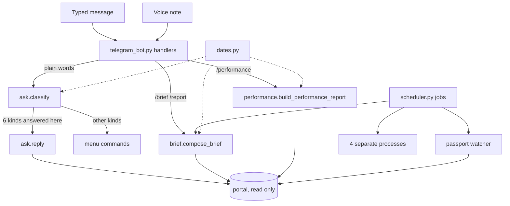
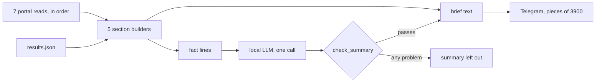

# Bot answers and jobs

Reference for five programs of the Hangeul bot:

- `src/bot/ask.py`
- `src/bot/brief.py`
- `src/bot/performance.py`
- `src/bot/scheduler.py`
- `src/dates.py`

Index of all programs: [../PYTHON_PROGRAMS.md](../PYTHON_PROGRAMS.md). Line numbers are valid at the published HEAD. Paths are relative to the repository root.

## Contents

1. [Overview](#overview)
2. [Terms used in this document](#terms-used-in-this-document)
3. [src/bot/ask.py](#srcbotaskpy)
4. [src/bot/brief.py](#srcbotbriefpy)
5. [src/bot/performance.py](#srcbotperformancepy)
6. [src/bot/scheduler.py](#srcbotschedulerpy)
7. [src/dates.py](#srcdatespy)
8. [Settings read by this group](#settings-read-by-this-group)
9. [Tests that cover this group](#tests-that-cover-this-group)

## Overview

These five files produce most of what staff see from the bot without opening the portal.

- `ask.py` decides what a question typed in ordinary words asks for, and builds the answers that no menu command gives. Each answer is read from the portal at the moment of asking.
- `brief.py` builds the daily brief: one message with the day's consultations, verified payments, live portal figures, calendar reminders and the state of the document check. Every number is counted in Python.
- `performance.py` shows the portal's own Consultant Performance page for today or this month.
- `scheduler.py` registers the 7 background jobs of the bot process. Three run inside the bot process and are written in this file: the daily-brief job, the passport-upload watcher and the LLM keep-warm check. The other four are started as separate processes.
- `dates.py` is the bot's one strict date reader. `ask.py`, `brief.py` and `performance.py` import it; `scheduler.py` does not (its imports are at `src/bot/scheduler.py:1-20`). It reads the dates users type and the date stamps the portal prints.

Every portal read in these files is an HTTP GET made through the client in `src/scraper/client.py`. When the client has no session, it first logs in: a GET of the login page and one POST to `login.php` (`src/scraper/client.py:294-301`, `:150-200`; the login-page GET is at `:134-136`). `get_calendar_events`, which the brief uses, calls `login()` itself (`src/scraper/client.py:575-576`). That login POST is the only POST these reads cause; none of these files writes data to the portal. None of them calls a Google API. No module under `src/api` (the REST API) imports any of them. A portal read that fails is reported as "not available" or as an error reply, never as 0 or an empty list.

| program | lines | one-line purpose | how it is started |
|---|---|---|---|
| `src/bot/ask.py` | 1411 | Routes a plain-words question to an answer (`classify`) and builds the live answers for pending payments, window applications under review, dashboard figures, intakes, applied dates, calendar questions and unknown questions. | Not run directly. Imported by `src/bot/telegram_bot.py`, `src/bot/voice.py` and `src/cloud/backfill.py`. |
| `src/bot/brief.py` | 687 | Builds the daily brief from portal reads and one local file, adds an LLM summary of one or two sentences only if a checker accepts it, and sends the text in pieces. | Not run directly. Called by the scheduled brief job and by `/brief`, `/dailybrief`, `/report`. |
| `src/bot/performance.py` | 303 | Formats the portal's Consultant Performance page (Today, This Month) as a Telegram reply with self-consistency warnings. | Not run directly. Called by `/performance_today`, `/performance_month`, `/performance` and the free-text performance route. |
| `src/bot/scheduler.py` | 515 | Creates the APScheduler instance, registers 7 jobs, and holds the brief job, the passport watcher, the LLM warm-up and the subprocess runner. | Not run directly. `setup_scheduler(app)` is called when the bot process builds its Telegram application (`start.bat` -> `run.py`). |
| `src/dates.py` | 259 | Strict, offline parsing of user-typed dates and portal date stamps; "today" in the report time zone. | Library only. Imported by 12 modules under `src/` and by two root files: the script `test_verified.py` and the root copy of `telegram_bot.py` (see below). |

None of the five has a copy at the repository root. Their main caller does: the root file `telegram_bot.py` is byte-identical to `src/bot/telegram_bot.py` (compared with `cmp`). Nothing imports the root copy; see [bot_core.md](bot_core.md). It is the file `apply_bot_update.bat` installs: the script takes a `telegram_bot.py` found in the bot root (`apply_bot_update.bat:11`; otherwise the newest `telegram_bot*.py` in the Downloads folder, `:12-17`) and copies it over `src/bot/telegram_bot.py` (`:37-38`). Because it is a copy, the root file also imports `src.dates`, on the same 14 lines as the `src` copy (for example `telegram_bot.py:98`). All `telegram_bot.py` line numbers below refer to `src/bot/telegram_bot.py`.



## Terms used in this document

| term | meaning |
|---|---|
| portal | The agency's admin website. The bot reads its pages through `admin_client` in `src/scraper/client.py` ([scraper_and_config.md](scraper_and_config.md)). |
| brief | The daily report message built by `brief.py`. The same builder serves any past day through `/report`. |
| fact | A plain text line holding one figure, for example `Pending payments: N`. The brief produces a list of them; the LLM summary and the spoken brief may only say what the facts say. |
| tile, card | Elements of the portal dashboard (`index.php`). A tile is one labelled figure. A card is a box holding several labelled figures (At a glance, Needs attention, Application pipeline, Applications by program, Top universities). |
| stamp | A date the portal prints, such as `DD Mon, HH:MM`. Payment-verification stamps carry no year. |
| route | The result of `ask.classify`: which answer a question asks for, with the day or span it names. |
| Jennie | The bot's voice persona ([voice_and_llm.md](voice_and_llm.md)). |
| brain | The code's word for the local LLM served by Ollama on the same PC. |
| watcher | The scheduled job that audits newly uploaded passport scans. |
| full picture | The hourly job that reads the main portal pages and publishes them to Supabase ([cloud.md](cloud.md)). |
| handoff | A file the bot process writes for a separate publisher process, which uploads to Supabase. The bot never uploads itself. |

---

## src/bot/ask.py

### Purpose

Two jobs.

1. `classify(text)` turns a question into a `Route` (kind, day, window, topic, words, problem). It uses whole-word regular expressions and strict date parsing. It reads nothing from the portal (`src/bot/ask.py:529-652`).
2. It builds the answers that have no menu command. Each one is built from GET requests made when the question is asked (preceded by the client's login POST when there is no session; see [Overview](#overview)), and names the page each figure came from.

The local LLM is used in one place only, `answer_unknown`. There it only picks which already-read dashboard facts answer the question. The picked facts are shown word for word, so no number in a reply is written by the LLM (`src/bot/ask.py:1038-1062`).

### How it is run or who calls it

There is no command line. The module is imported lazily (inside functions) by:

| caller | what it uses |
|---|---|
| `handle_natural_language_message`, `src/bot/telegram_bot.py:1973`, registered for `filters.TEXT & ~filters.COMMAND` at `:2426` | `ask.classify(query, today)` at `:2021`, then dispatch. The kinds answered in this file end at `ask.reply(update.message, route, query)` at `:2170`. Also `ask.HELLO`, `ask.ONE_DAY_KINDS`, `ask.one_day_reply`, `ask.performance_other_reply`, `ask._CROSS_FIELD_RE`. |
| `parse_user_report_intent`, `src/bot/telegram_bot.py:108` | `classify(...).kind == "report"`. This function has no caller outside the tests at HEAD. |
| `performance_command` (`/performance`), `src/bot/telegram_bot.py:762` | `ask.performance_route`, `ask.performance_other_reply`. |
| `alerts_command` (`/alerts`), `src/bot/telegram_bot.py:788` | `ask.reply(update.message, ask.Route("dashboard", topic="attention"), "/alerts")` at `:796`. |
| `calendar_command` (`/calendar`, `/events`, `/deadlines`), `src/bot/telegram_bot.py:1095` | `ask.calendar_query` at `:1125`, `ask.answer_calendar` at `:1134`. |
| `src/bot/voice.py:748-760` and `:1836-1840` | `ask.calendar_query`, `ask.classify`, `ask.ONE_DAY_KINDS`. A voice note reaches the same routes by calling `handle_natural_language_message(..., query=<English query>)`. |
| `src/cloud/backfill.py:268` and `:283` | `dashboard_facts` and `calendar_items`, reused as parsers for the Supabase copy. |

### What it reads

| input | how | where |
|---|---|---|
| Portal `index.php` | `admin_client.fetch_html("index.php", timeout=30.0)`, parsed by `dashboard_facts` | `src/bot/ask.py:772` |
| Portal `students.php?status=pending`, every page | `admin_client.read_student_pages({"status": "pending"})`; the first page also goes through `parse_pending_payments` for the portal's own badge count | `src/bot/ask.py:892-893` |
| Portal `window_applications.php?status=under_review` | `admin_client.read_window_apps_under_review()` | `src/bot/ask.py:944` |
| Portal `students.php`, every page, no filter | `admin_client.read_students()` | `src/bot/ask.py:983`, `:1022` |
| Portal `calendar.php` | `admin_client.fetch_html("calendar.php")` with the client's default timeout of 60 s (`src/scraper/client.py:339`) | `src/bot/ask.py:1403` |
| `ollama_client`, without an LLM call | `ollama_client._answer_query_fallback(query, lines)`: label matching in Python | `src/bot/ask.py:1052` |
| Ollama `/api/chat` | `ollama_client.answer_agent_query(query, lines)`: one call with a JSON schema, made only when the label matching found nothing | `src/bot/ask.py:1054-1055` |
| Setting `REPORT_TIMEZONE` | through `src.dates.local_today()` | for example `src/bot/ask.py:279`, `:405`, `:559`, `:1017`, `:1131`, `:1401` |
| The Telegram message object | only `message.reply_text` | `src/bot/ask.py:1073` |

It reads no local file, no Google service and nothing from Supabase.

### What it writes

| output | detail |
|---|---|
| Telegram | A status message (`Reading the live portal...`, `src/bot/ask.py:1073`), which is then edited into the first piece of the answer by `replies.reply_long(message, text, edit=status)` (`:1091`). Further pieces are sent as replies. |
| Supabase, indirectly | `cloud.seen(reads, ...)` keeps what was read; `cloud.publish(reads)` (`:1092`) hands it to the publisher after the reply, without waiting. Keys used here: `facts` (`:878`, `:951`, `:1050`), `pending` (`:907`), `students` (`:987`, `:1026`), `calendar` (`:1410`). Nothing happens while publishing is off or the bot is in mock mode (`src/cloud/command_hooks.py:74-84`). |
| Log | Logger `hangeul.ask`. |

It writes no local file.

### Why it exists

Staff ask the bot questions in ordinary words, for example "show pending payments", "any deadlines this week" or "how many students in the <Month YYYY> intake". This file makes sure each such question is answered from the portal as it stands at that moment, with the source page named. Pending payments and window applications under review are always reported as two separate figures and never added together (`src/bot/ask.py:24-25`, `:933`, `:967`).

### Free-text routing order

`classify` tries the kinds in a fixed order and the first match wins. Matching is on whole words and is case-insensitive. The text is first lower-cased and its whitespace collapsed (`src/bot/ask.py:560`).

| # | kind (topic) | condition | `ask.py` line | who answers (`telegram_bot.py` line) |
|---|---|---|---|---|
| 1 | `unknown` | The text is empty. | 561 | `ask.reply` (2170) |
| 2 | `hello` | The whole message is a greeting or thanks (`_HELLO_RE`: hi, hello, hey, salam, good morning, thanks, ok, bye and similar, optionally followed by "jennie", "bot", "there", "so much", "a lot"). | 563 | Sends the fixed text `ask.HELLO` (2028) |
| 3 | `report` | The text starts with `/report` or `/brief`. | 565 | `report_command` (2155) |
| 4 | `pin` | pin, pinned, pin it, pp pin, cheat sheet, command list, list of commands, all commands, commands, menu (`_PIN_RE`). | 567 | `pin_command` (2031) |
| 5 | `performance` | A performance word or phrase (`_PERFORMANCE_RE`: performance and common misspellings of it, productivity, leaderboard, performer; "how did the team / staff / counsellors do"; "team activity / stats / report / summary / scores / results"), and the words do not name another subject (`_names_another_topic`). See [Performance sub-routing](#performance-sub-routing). | 569-577 | `performance_month_command`, `performance_today_command` or `ask.performance_other_reply` (2036-2043) |
| 6 | `crosscheck` | cross-check, crosscheck, audit; or father, mother, address, parents, dob, date of birth; or "check" together with a verify word. A date window is attached only when no 2 to 5 digit number is left after date numbers are removed. | 579-583 | The cross-check commands (2073-2103) |
| 7 | `passports` | passport, passports, mrz. | 584-586 | `crosscheck_today_command` or `crosscheck_date_command` (2106-2115); a past span goes to the range cross-check (2047-2052) |
| 8 | `pending` | unpaid, not (yet) paid, payment approval; or a pay word (pay, pays, paying, payment, payed, paid) together with pending, waiting, awaiting, outstanding, due, unconfirmed or approval. | 587-588 | `ask.reply` -> `answer_pending` |
| 9 | `dashboard` (`pipeline`, with stage names in `words`) | The words name a pipeline stage (`_stage_named`). Seven stage names count on their own; "Payment Verified", "Documents Verified" and "Admitted / Completed" count only when the word "stage" is also present. "applied to/for/at a university" counts as University Applied. | 589-591 | `ask.reply` -> `answer_dashboard` |
| 10 | `dashboard` (`documents`) | A document word (doc, document, paper, file, upload) together with a state word (review, verif..., waiting, pending, approv..., reject..., check, unverified, queue, to verify) or "under review / in review", and no "missing" or "incomplete". | 592-593 | `ask.reply` |
| 11 | `inquiries` | consult, consultation, consultancy, inquiry, enquiry, lead, counsellor, counselor, consultant (`_CONSULT_RE`). | 594-596 | `inquiries_today_command` or `inquiries_date_command` (2059-2070) |
| 12 | `dashboard` (`verified_total`) | A verify word with "in total", "overall", "altogether", "all time", "so far", "ever", "in all" or "on record", and no date hint and no today / yesterday / tonight. | 597-600 | `ask.reply` |
| 13 | `verified` | Any other verify word. | 601-602 | `verified_today_command`, `verified_date_command` or `verified_command` (2119-2130) |
| 14 | `missing` | missing, incomplete. | 603 | `missing_command` (2145) |
| 15 | `dashboard` (`pipeline`) | pipeline, funnel. | 605 | `ask.reply` |
| 16 | `admitted` | admit, admitted, admits. | 607 | `admitted_command` with the leftover words as the search (2134-2142) |
| 17 | `stage` | stage, stages. | 609 | `stage_command` (2148) |
| 18 | `dashboard` (`visa`) | visa, visas. | 611 | `ask.reply` |
| 19 | `window_review` | under review, in review, being reviewed, reviewing; window app(lication)s, admission window app(lication)s. | 613 | `ask.reply` -> `answer_window_review` |
| 20 | `dashboard` (`accepted` or `submitted`) | "accepted" or "submitted" together with app, apps, application(s). | 615-617 | `ask.reply` |
| 21 | `dashboard` (`windows`) | open / active / draft (admission) window(s). | 618 | `ask.reply` |
| 22 | `calendar` | calendar, event, deadline, due, dhl, shipping, shipment, ship, courier, reminder, schedule(d), closing, closes, opening, application window / period, open for applications, accepting applications, admissions / applications (is / are) open (`_CALENDAR_RE`). | 620 | `calendar_command` (2151-2153) |
| 23 | `intake` | A month name followed by a year `20xx` that is not preceded by a day number, or the words intake, intakes, batch, batches. `words` holds the intake as `MONTH YYYY` in capitals when one was named. | 624-631 | `ask.reply` -> `answer_intake` |
| 24 | `applied`, or `dashboard` (`applied`) | registered, registration, registering, signed up, signup, joined, enrolled, new students / applicants / applications, applied, applications received / came (`_APPLIED_RE`). With "this / the / current week or month", or with no date at all: dashboard topic `applied`. With a day, a span or an unreadable date: kind `applied`. | 632-638 | `ask.reply`; an unreadable date gets `date_error_reply` (2166-2169) |
| 25 | `dashboard` (`program`) | A program word (program, programme, course, klp, eap, bachelor, master, degree, phd, language program) with a students word; or "per / by / each / every / across program(s)". | 639 | `ask.reply` |
| 26 | `dashboard` (`university`) | university, uni, college with a "most" word (most, top, biggest, largest, popular, highest, leading, best), or with a students word, or "per / by / each / every universit...". | 641-643 | `ask.reply` |
| 27 | `dashboard` (`attention`) | urgent, alert, attention, to-do, action item, needs attention. | 644 | `ask.reply` |
| 28 | `dashboard` (`total_students`) | A students word (student, applicant, people, enrolment, admission) and nothing else but filler words. | 646 | `ask.reply` |
| 29 | `report` | report, brief, briefing, summary, summarise, summarize, overview, recap, round-up (`_REPORT_RE`). | 648 | `report_command` (2155-2157) |
| 30 | `stats` | stats, statistics, dashboard, figures, kpi, metrics, numbers. | 650 | `stats_command` (2159-2160) |
| 31 | `unknown` | Nothing above matched. | 652 | `ask.reply` -> `answer_unknown` |

Kinds answered in this file by `reply`: `pending`, `window_review`, `dashboard`, `intake`, `applied` and everything else, which is treated as `unknown` (`src/bot/ask.py:1075-1086`). The other kinds are answered by commands in `src/bot/telegram_bot.py` ([bot_core.md](bot_core.md)).

The kinds in `ONE_DAY_KINDS` (`inquiries`, `verified`, `passports`, `src/bot/ask.py:380`) are answered one day at a time. When such a question names a span of days, a passport question whose span starts today or earlier runs the range cross-check; any other is answered with `one_day_reply`, which asks for one day (`src/bot/telegram_bot.py:2047-2055`).

### Performance sub-routing

`performance_route` (`src/bot/ask.py:395-442`) decides which view of the Consultant Performance page is asked for. The result has topic `"today"`, topic `"month"`, or no topic. The checks run in this order:

1. "last / previous / past / next / coming / following ... month(s)", or the word "months": no topic.
2. Any week word (weekly, week, weeks, fortnight, fortnightly, wtd): no topic.
3. A date window that starts on the 1st of the current month and ends today or later (and is either more than one day long or comes with a "month" word): topic `month`, unless the words also name another month or year (`_this_month_route`, `:473`).
4. A single day: topic `today` when that day is today, otherwise no topic and the day is kept.
5. Any other span: no topic and the span is kept.
6. A "month" word (monthly, month, month's, mtd) with no named date: topic `month`, with the same exception as step 3.
7. Another period of the page (all time, overall, lifetime, ever, in total, altogether, ytd, year to date, last year, yearly, annual, year, quarter, custom range): no topic.
8. A bare year (`19xx` or `20xx`): no topic.
9. A date-like part that cannot be read: no topic, with the reason in `problem`.
10. Nothing date-like: topic `today`.

A route with no topic is answered with `performance_other_reply` (`:508`). That reply states that the two commands cover today and this month, and that the portal page itself also offers This Week, All Time and a custom range. The bot reads nothing in that case.

In `classify`, a performance route that names another single day is given up to the later routes when the words also name consultations or verifications and do not contain a performance word themselves (`src/bot/ask.py:575-577`). Example: "how did the counsellors do yesterday" becomes an `inquiries` question for yesterday.

### What each answer contains

| answer | built by | content |
|---|---|---|
| Pending payments | `answer_pending` (`:882`) | The count of students whose own Payment column says Pending, over every page of the pending list. Up to 30 students by name with id, program, intake, applied date and stage. A warning when the page also listed students whose payment is not Pending. A line comparing the count with the portal's own badge: a warning when they differ, a confirmation when they agree. |
| Window applications under review | `answer_window_review` (`:937`) | The count from `window_applications.php`, each row's own status. The dashboard's "Under review" tile is read as a cross-check: a warning when it differs, a confirmation when it agrees. When the page's table is not recognised the count is "not available" and the tile is shown if it could be read. |
| Dashboard topics | `_dashboard_answer` (`:779`) | One block per topic: `total_students`, `verified_total`, `program`, `university`, `applied`, `documents`, `pipeline`, `attention`, `visa`, `accepted`, `submitted`, `windows`. Each figure is shown with the portal's label and the tile group or card it sits in. A figure the page does not show is "not available". Any other topic returns `cant_answer()`. |
| Students per intake | `answer_intake` (`:975`) | Counted from every page of the student list. One intake when the words name one (with a by-program breakdown when no program was named); otherwise all intakes, most frequent first. Limited to one program when the words name KLP, EAP, Bachelor, Master or PhD. |
| Students who applied | `answer_applied` (`:1009`) | The number of students whose Applied date falls in the day or span asked. A warning counts students whose Applied date cannot be read; they are not counted. |
| Unknown question | `answer_unknown` (`:1038`) | First the dashboard facts whose whole label the question names (no LLM). If there are none, the facts the local LLM picks. If there are none again, `cant_answer()`, which lists the commands that can answer. When `index.php` cannot be read, the reply is `cant_answer("the portal dashboard could not be read: <reason>")`, not the portal-error reply the other answers give (`:1045-1049`). |
| Calendar question | `answer_calendar` (`:1395`) -> `calendar_answer` (`:1317`) | A count line and up to 25 items, each with kind, university, date span and how long until it closes or is due. Items marked done on the portal are never counted. They are named in a closing note in two cases only. (1) The question has a date window: the done items in that window, filtered by the same DHL and search words, the first 5 by due date and then "and N more" (`:1366-1377`). (2) A DHL question with no window: the 5 done DHL items with the latest due dates (`:1378-1383`). In every other case done items are left out without a note. For a deadlines question with a closed span, the next deadline after the span is named. |

### Main functions and classes

| name | line | what it does |
|---|---|---|
| `MAX_NAMES_LISTED`, `MAX_CALENDAR_LISTED` | 41-42 | List limits: 30 and 25. |
| `_re` | 47 | Builds a whole-word, case-insensitive regular expression. |
| Word patterns `_HELLO_RE` ... `_CALENDAR_TOPIC_RE` | 52-152 | The vocabulary of `classify` and `performance_route`. `_PERIOD_NAMES` (127) maps period words to the name used in replies. |
| `_FILLER` | 155 | Words any question may contain around its subject. |
| `_PROGRAM_KEYS`, `_PROGRAM_NAMES` | 164-169 | The five programs (KLP, EAP, Bachelor, Master, PhD): pattern, the text a program name must contain, and the display name. |
| `_STAGES`, `_STAGE_ONLY` | 171-177 | The 10 pipeline stage names; the 7 that count without the word "stage". |
| `_words`, `_leftover` | 180, 184 | Tokenise; return the words left after filler and given patterns are removed. |
| `_DAY_NUMBERS_RE` | 192 | Numbers that are part of a date, so they are not taken for a student id. |
| `_stage_named` | 197 | The pipeline stages the words name. |
| `_program_filter` | 211 | The program the words name, or None. |
| `class Window` | 221 | A span of days: `first`, `last` (None means open-ended), `label`. `span()` (226) and `title()` (235) format it. |
| `_NUMBER_WORDS`, `_WEEKDAYS`, `_MONTH_NUMBER`, `_RANGE_RE`, `_SPAN_RE`, `_WEEKDAY_RE`, `_MONTH_ALONE_RE` | 241-255 | Tables and patterns used by `date_window`. |
| `_month_end`, `_day_label` | 258, 262 | Last day of a month; "today", "yesterday", "tomorrow" or a dated label. |
| `date_window` | 266 | Reads the days a text asks about. Returns `(Window, None)`, `(None, None)` when no date is named, or `(None, reason)` when a date-like part cannot be read. |
| `class Route` | 370 | `kind`, `day`, `window`, `topic`, `words`, `problem`. |
| `ONE_DAY_KINDS` | 380 | `("inquiries", "verified", "passports")`. |
| `_when` | 383 | Past-facing day, span or problem for a question. A month without a day cannot be read here. |
| `performance_route` | 395 | Which view of the performance page is asked for. |
| `_period_name`, `_other_period_named`, `_this_month_route` | 445, 453, 473 | Helpers of `performance_route`: the period name said back; another month or year named in the words; the topic `month` decision. |
| `_names_another_topic` | 490 | True when the words name a subject the performance page does not show. |
| `performance_other_reply` | 508 | The fixed reply for a performance question outside today and this month. |
| `classify` | 529 | The router described above. |
| `class Fact` | 657 | One dashboard figure: `group`, `label`, `value` (int or None), `text`, `note`. `line()` (665) gives the one-line form `<label> (<group>): <figure>`. |
| `_CARDS`, `_text`, `_number` | 671-680 | The five card titles; tag text with collapsed whitespace; text to int when it is digits and commas only. |
| `dashboard_facts` | 683 | Every figure on `index.php`: the tiles (through `parsers.parse_hangeul_live_dashboard`) plus the five cards, read with the CSS selectors `.card`, `.card-title`, `.gl` / `.gl-l` / `.gl-v`, `.pipe-row` / `.pipe-top` / `.pipe-c`, `.wf-item` / `.wf-info` / `.wf-count`. Returns `[]` for a page with none of them. |
| `_find`, `_group`, `_fact_line` | 717-729 | Select facts by group and label; format one fact as a reply line. |
| `SOURCE_DASHBOARD`, `CANT_ANSWER`, `HELLO` | 734-750 | Fixed reply texts. |
| `cant_answer` | 753 | The reply for a question the portal's live data cannot answer, with the list of commands that can. |
| `one_day_reply` | 760 | The reply asking for one day when a span was asked of a one-day answer. |
| `_dashboard` | 770 | Fetches and parses `index.php`. Raises `PortalUnavailable` when no fact could be read. |
| `_dashboard_answer` | 779 | The reply text for one dashboard topic. |
| `answer_dashboard`, `answer_pending`, `answer_window_review`, `answer_intake`, `answer_applied`, `answer_unknown` | 870, 882, 937, 975, 1009, 1038 | The six live answers. Each puts its portal read inside a `try` block and returns text when the read fails. The first five return `portal_error_reply(...)` text. `answer_unknown` returns `cant_answer("the portal dashboard could not be read: <reason>")` instead (`:1045-1049`). The code after the read is outside that `try`; an exception there is caught by `reply` (`:1087-1090`). |
| `_intake_key` | 971 | Normalises an intake or program text: collapsed spaces, upper case. |
| `reply` | 1065 | Sends the status message, runs the answer for the route's kind, edits the answer into the status message, then calls `cloud.publish`. Any exception becomes a portal-error reply (`:1087-1090`). |
| `class CalItem` | 1097 | One calendar item: `title`, `kind`, `where`, `start`, `end`, `done`, `note`, `id`. |
| `class CalendarQuery` | 1108 | What a calendar question asks: `window`, `deadlines`, `dhl`, `words`, `problem`, `default`. |
| `_EV_KINDS`, `_CAL_FILLER_RE` | 1117-1124 | Event type names; words that are not search words in a calendar question. |
| `calendar_query` | 1127 | Parses a calendar question. A bare `/calendar`, "deadlines" or "events" sets `default`, which the caller answers with its own today view. |
| `_cal_day`, `_CAL_DATE_RE`, `_cal_range`, `_status_days` | 1147-1206 | Date helpers for calendar rows: the date nearest to today for a yearless "DD Mon"; a range text to two dates; a status such as "Closes in N days" to a date. |
| `_ev_items` | 1209 | Reads the JavaScript array `var EV = [...]` embedded in `calendar.php` (fields `id`, `title`, `type`, `uni`, `start`, `end`, `done`, `notes`). None when the page has none. |
| `_key` | 1239 | Lower-case alphanumeric key of a title, for matching. |
| `calendar_items` | 1243 | Merges the EV list, today's reminders and the upcoming timeline into one de-duplicated list. Returns `(items, layout_ok)`. |
| `_when_due` | 1302 | "closes today", "due tomorrow", "closed ...", "... (N days left)" and similar. |
| `calendar_answer` | 1317 | The reply text for a calendar question. |
| `answer_calendar` | 1395 | Fetches `calendar.php`, builds the items and returns the reply text. A failed read and an unrecognised layout do not reach the caller as exceptions: when the layout was not recognised it raises `PortalUnavailable` inside its own `try` block, which catches it together with every read error and returns `portal_error_reply("The calendar", e)` text (`:1402-1409`). `calendar_answer` runs after that block (`:1411`), and the caller `calendar_command` does not wrap the call in a `try` (`src/bot/telegram_bot.py:1134`). |

### Numbers that matter

| number | value | where |
|---|---|---|
| Pending-payment students listed by name | 30 (`MAX_NAMES_LISTED`) | `src/bot/ask.py:41`, `:911`, `:922` |
| Calendar items listed | 25 (`MAX_CALENDAR_LISTED`) | `src/bot/ask.py:42`, `:1355`, `:1362` |
| Marked-done calendar items named | at most 5, and only in the two cases given under [What each answer contains](#what-each-answer-contains); the window case adds "and N more" | `src/bot/ask.py:1376-1377`, `:1383` |
| "next / past N days or weeks" span | 1 to 400 days; N is at most 3 digits or one of 21 number words (including "few" = 3 and "couple" = 2) | `src/bot/ask.py:241-252`, `:330` |
| `index.php` fetch timeout | 30.0 s | `src/bot/ask.py:772` |
| `calendar.php` fetch timeout | 60.0 s (client default) | `src/scraper/client.py:339` |
| Calendar program note shown | only when at most 40 characters and it matches `parsers._CAL_PROGRAM_RE` | `src/bot/ask.py:1360` |
| Yearless calendar date | resolved to the nearest of last year, this year, next year | `src/bot/ask.py:1152-1160` |
| LLM pick: output tokens, timeout, most facts | 60, 30.0 s, 5 (`AGENT_MAX_TOKENS`, `AGENT_TIMEOUT`, `AGENT_MAX_FACTS`) | `src/llm/ollama_client.py:14-16` |
| Retries | none in this file: no answer retries a failed read. One question can still make several GETs: `answer_window_review` reads `window_applications.php` (`:944`) and `index.php` (`:950`); the pending, intake and applied answers read every page of `students.php`, one GET per page. Inside the client, `portal_get` logs in again once and repeats a GET whose response ended on `login.php` | `src/scraper/client.py:327-334`, `:471-473` |

### Things to know

- **Order decides.** "due" is both a pending-payment word (`_PENDING_WORD_RE`, `:66`) and a calendar word (`_CALENDAR_RE`, `:78`). The pending route is tried first but needs a pay word as well, so "deadlines due this week" is a calendar question and "payments due" is a pending question.
- **The `/report` and `/brief` branch of `classify` (`:565`) is not reached by typed messages.** The text handler excludes commands (`src/bot/telegram_bot.py:2426`). The branch is reached only through `parse_user_report_intent`, which only the tests call, or if a query passed in by the voice path starts with those strings.
- **`date_window` has two directions.** With `forward=True` (calendar questions) "this week" runs from today to Sunday and "this month" from today to the month's end. With `forward=False` (questions about the past) they run from Monday, or from the 1st, to today (`:313-325`).
- **A weekday name.** Forward-facing, "Friday", "this Friday" or "coming Friday" is the next Friday, and is today when today is Friday. Past-facing, it is the most recent Friday before today, which is 7 days back when today is Friday. "last Friday" gives that past day in both directions (`:338-349`).
- **"next" with a weekday or a month name gives no single day or month.** `date_window` returns the open-ended "coming up" window at `:336-337` for any whole word "next" that "next week" (`:309`), "next month" (`:317`) or "next N days / weeks" (`_SPAN_RE`, `:326`) did not already take. The weekday branch (`:338`) and the month branch (`:350`) come after it. So "next Friday", "next Monday" and "next October" all give `Window(today, None, "coming up")`. For example, `/calendar deadlines next friday` counts every deadline from today on that is not marked done, and lists up to 25 of them (`:1320`, `:1326-1329`, `:1355`). The `which == "next"` tests at `:346` and `:357` are never true. No test covers these phrases: the weekday and month cases in `tests/test_freetext.py:258-271` are "on friday" and "in october".
- **A month alone.** With a year it is that month. Without one (`:350-362`):
  - Forward-facing (calendar questions): a month earlier than the current one is next year's; the current month and later months are this year's.
  - Past-facing: a month later than the current one is last year's; the current month and earlier months are this year's.
  - "last <month>", past-facing: always one year back, also when that month has already passed this year (`:359-360`).
  - "last <month>", forward-facing: the test at `:357` is checked before the "last" test. For a month earlier than the current one it adds a year (`:358`), so in October "deadlines last March" means March of next year. For the current month or a later one it subtracts a year (`:359-360`), so in October "last December" means December of last year.
  - "next <month>": see the bullet above; it never reaches this code.
- **"May"** counts as a month only with a year or after "in", "during" or "for" (`:351`). In `_other_period_named` "the month of May" also counts (`:460`).
- **A range read past-facing stays in one year.** When the end of a range would fall before its start because the end was read as last year's, the end is read again forward-facing (`:288-293`).
- **Open-ended window.** "coming up", "upcoming", "soon", "ahead", "from now on", "in the future", "future", or any whole word "next" that an earlier branch did not take (so also "next Friday" and "next October", see above), gives a window with `last = None` (`:336-337`). `_when` drops such a window for questions about the past, so such a question is read as naming no date (`:390-391`).
- **Two pending-payment counts exist in the bot.** `answer_pending` reads every page and counts rows whose Payment column says Pending. The brief uses `admin_client.read_pending_payments`, which makes one GET of the first page and returns the portal's badge when the page shows one (`src/scraper/client.py:553-559`, `src/scraper/parsers.py:890-917`). The two agree only while the portal's badge is right; when it is not, the free-text answer shows its own count and a warning (`src/bot/ask.py:929-930`).
- **`answer_window_review` reads the dashboard only to compare.** A dashboard failure there is logged at info level and ignored (`:954-955`). The tile is used only when exactly one tile is labelled "Under review" (`:953`).
- **`answer_intake` and `answer_applied` read the whole student list** (every page) to produce one count.
- **Visa questions** get the statement that the portal has no count of approved visas, followed by the stage figures VIN Application, Embassy Submission, Visa Result and Admitted / Completed, and the "Accepted" tile, each labelled for what it is (`:846-856`).
- **What the LLM sees in `answer_unknown`.** Only the dashboard fact lines that have a numeric value (`:1051`). No student rows are sent to it.
- **`calendar_items` matching.** An item is matched by the portal's own event id when it has one, else by title, start date and note. Two different ids are never merged. Timeline rows whose status says done or completed are skipped (`:1288-1290`); other done flags come only from the EV list.
- **The "45-day timeline"** is the docstring's description of the portal's upcoming-events list (`:18`, `:1245`). The number is the portal's; no constant in this file sets it.
- **The docstring's "guardrail 2"** (`:25`) is section 2, "Metric Decoupling Invariant", of `.agents/rules/hangeul_operational_guardrails.md:13-16`: pending payments and window applications under review are never summed into one figure.
- The file contains no TODO or FIXME comment.

---

## src/bot/brief.py

### Purpose

Composes the daily brief, and the same brief for any past day, from facts counted in code. The brief has five sections. Each section's numbers come from read-only portal reads, except section 5, which reads one local JSON file and is labelled "not live".

Optionally the local LLM writes one short summary from the fact list. The summary is appended only if `claims_problem` finds every number and every word backed by the facts. Otherwise it is left out.

The file also provides two helpers used across the bot: `esc` (Markdown escaping) and `claims_problem` (the claim checker, also used for Jennie's spoken lines).



### How it is run or who calls it

There is no command line.

| caller | what it uses |
|---|---|
| `send_daily_briefing`, `src/bot/scheduler.py:248` | `compose_brief()` at `:258`, then `_send_brief(...)` at `:259`. The scheduled job. |
| `brief_command` (`/brief`, `/dailybrief`), `src/bot/telegram_bot.py:163` | `compose_daily_brief()` and `_send_brief`, imported through `src.bot.scheduler` at `:175`. |
| `report_command` (`/report [date]` and the free-text `report` route), `src/bot/telegram_bot.py:122` | `compose_daily_brief(day=...)` and `send_brief_text` at `:149-151`. |
| `src/bot/voice.py:1136`, `:1309` | `claims_problem`, to check Jennie's spoken lines. |
| `src/cloud/bot_jobs.py:185` (`brief_batches`) | Consumes the returned `Brief` (text, facts, reads). |
| `src/bot/ask.py` (8 places), `src/bot/performance.py:38`, `src/bot/telegram_bot.py` (16 places) | `esc`. |

### What it reads

The portal reads run one after another, in this order (`src/bot/brief.py:611-628`):

| # | read name | client call | portal page | skipped when |
|---|---|---|---|---|
| 1 | `consultations` | `admin_client.read_consultation_day(day)` | `consult_requests.php?status=all&from=DAY&to=DAY` | the day is in the future |
| 2 | `verified students` | `admin_client.read_verified_students(portal_day, all_pages=True)` | `students.php`, every page | the day is in the future, or `yearless_day_problem` gives a reason |
| 3 | `consultation totals` | `admin_client.read_consultation_totals()` | `consult_requests.php?status=file_opened` (`CONSULT_TOTALS_VIEW`, `src/scraper/client.py:53`) | never |
| 4 | `pending payments` | `admin_client.read_pending_payments()` | `students.php?status=pending`, first page | never |
| 5 | `window applications` | `admin_client.read_window_apps_under_review()` | `window_applications.php?status=under_review` | never |
| 6 | `dashboard` | `admin_client.get_dashboard()` | `index.php` | never |
| 7 | `calendar` | `admin_client.get_calendar_events()` | `calendar.php` | the brief is not for today |

Other inputs:

| input | detail |
|---|---|
| Local file `<verification dir>/results.json` | Read by `read_document_check` (`:332`) in a worker thread (`:628`). The folder is `settings.verification_dir()`: the setting `VERIFICATION_DIR`, or `data/verification` under the bot root when it is empty (`src/config.py:111-112`). Keys used: `documents.*.verdict`, `documents.*.checked`. The file is written by the document-check job ([verify.md](verify.md)). |
| Ollama `/api/chat` | One `ollama_client.chat(...)` call for the summary (`:550-553`). |
| Settings | `REPORT_TIMEZONE` (`:85`, `:632`, `:635`), `VERIFICATION_DIR` (through `settings.verification_dir()`, `:335`). |
| `admin_client.mock_mode` | Recorded in the returned reads (`:657`). |
| Lazy imports | From `src/bot/voice.py`: `_numbers_in` (`:416`), `_WORD_SCALES`, `_WORD_VALUES` (`:424`), `_plain` (`:524`). From `src/scraper/parsers.py`: `payment_text` (`:239`). |

### What it writes

| output | detail |
|---|---|
| Telegram | The brief text, through `send_brief_text` -> `replies.send_pieces(send, text, "Markdown")` (`:677-681`). Pieces hold at most 3900 characters and are split between lines. A piece Telegram cannot parse as Markdown is sent again as plain text (`src/bot/replies.py:92-99`). `_send_brief` sends with `bot.send_message(chat_id=...)` (`:684-687`). |
| Return value | `Brief(text, facts, reads)`. `reads` holds what each portal read returned, for the Supabase copy the scheduler hands over afterwards. This file does not publish. |
| Log | Logger `hangeul.brief`, including one line per brief with the portal read time, total time, character count and whether a summary was added (`:652-655`). |

It writes no local file.

### Why it exists

The owner gets one factual end-of-day message: how many consultation requests came in and who handled them, whose payment was verified and for how much, the live pending and under-review figures, today's calendar reminders and the state of the automated document check. The stated design goal is that nothing is estimated, and that a figure that cannot be read is "not available", never 0 (`src/bot/brief.py:1-11`). Staff also use `/report <date>` to get the same brief for a past day.

### Layout of the brief

The text is legacy Telegram Markdown. Section headings are bold. Emoji are omitted below.

```text
HANGEUL DAILY BRIEF — <DD Month YYYY>, <HH:MM> (<REPORT_TIMEZONE>)
Facts only, read live from the portal (read-only) unless marked otherwise. Nothing is estimated.

1) CONSULTATIONS TODAY
• Received: N  |  Done: N (N consulted, N file opened)
• New / pending: N  |  No answer: N  |  Wrong number: N
• Done by: <staff name> N, <staff name> N
• All time on the portal (its own status counts): N requests, N done (...), N new, N no answer, N wrong number

2) PAYMENT-VERIFIED STUDENTS TODAY
• N students  |  Total: X BDT (<source of the amounts>)
  1. <student name> — <program> — <payment> — verified by <staff name> at HH:MM

3) PORTAL FIGURES (live now)
• Pending payments: N (students.php?status=pending)
• Window applications under review: N (window_applications.php)
  (two separate figures, never added together)
• Dashboard, <tile group>: <label> <figure> · <label> <figure>

4) TODAY'S CALENDAR REMINDERS
• N reminders: <type> N, <type> N
  - <title> — <type> — <date range> — N days left

5) DOCUMENT CHECK (from the last automated check, not live)
• N students: FAIL N, REVIEW N, INCOMPLETE N, PASS N
• Last check: DD Mon YYYY, HH:MM

Summary by the local AI, its numbers checked against the facts: <one or two sentences>
```

For a past day the header reads `HANGEUL BRIEF FOR <DD Month YYYY> — read <DD Mon YYYY>, <HH:MM>` (`:634-635`), the headings of sections 1 and 2 say `ON <date>` instead of `TODAY`, and section 4 says it is shown for today only (`:299-300`).

### The fact list

Each section builder returns its Markdown lines and a list of facts. The facts are the only input of the LLM summary and of the spoken brief. For a past day, "today" in each fact is replaced by "on the day".

| fact line | section | present when |
|---|---|---|
| `Consultation requests received today: N` | 1 | always (`not available` when the page could not be read) |
| `Consultations done today: N`, `Marked Consulted today: N`, `Marked File Opened today: N`, `Requests still new today: N`, `No answer today: N`, `Wrong number today: N` | 1 | at least one request was received (`:182-187`) |
| `Handled today by counsellor <staff name>: N` | 1 | one per named staff member, only when the portal listed every request of the day (`:188-189`) |
| `Students whose payment was verified today: N` | 2 | always |
| `Total amount verified today: X BDT`, or `Total amount verified today (only the rows with an amount): X BDT`, or `... : not available` | 2 | at least one student was verified (`:223-237`) |
| `Pending payments: N` | 3 | always |
| `Window applications under review (a separate figure): N` | 3 | always |
| `Calendar reminders for today: N` | 4 | today's brief only |
| `Calendar reminders for today of type <type>: N` | 4 | one per reminder type, when there are reminders (`:326-327`) |

Section 5 contributes no facts (`:359`). The facts contain counts, one BDT total and staff names with their counts. They contain no student names.

### How the summary is checked

`llm_summary` (`:541`) sends the system prompt `_SUMMARY_SYSTEM` (`:364-374`) and the user message `Facts:` + one `- fact` per line + `Summary:`. No call is made when no fact contains a digit (`:546`). The reply goes through `check_summary` (`:519`):

1. Links, URLs, emoji and Markdown markup are removed (`voice._plain`), surrounding quotes and a leading "Summary:" or "In short:" are removed, and only the first two sentences are kept (`:525-527`).
2. The text is dropped when it is empty or longer than 350 characters (`:528`).
3. For a past-day brief, the text is dropped when it says today, tonight, yesterday, tomorrow, or this morning / afternoon / evening (`:516`, `:530-533`).
4. The text is dropped when `claims_problem` returns a reason.

`claims_problem(text, facts, extra_words)` (`:456-511`) returns the first problem it finds, in this order:

| # | problem | rule |
|---|---|---|
| 1 | `empty` | Nothing left after collapsing whitespace. |
| 2 | `not plain English` | Any character outside ASCII, except typographic quotes, dashes, the ellipsis and the non-breaking space (`_FOREIGN_RE`, `:395`). |
| 3 | off-topic | visa, passport, conversion, intake, rate, percent, percentage, per cent, "prepared by", ytd, or `%` (`_OFF_TOPIC_RE`, `:376`). The brief never reports these. |
| 4 | vague or comparing count word | dozen, half, twice, both, couple, several, few, many, most, all, every, some, any, more, less, average, than, higher, lower, trend, record and similar; the ordinals first to twentieth and five larger ones; and digit ordinals such as `3rd` (`_VAGUE_NUMBER_RE`, `:382-386`). |
| 5 | a negation | not, never, without, cannot, neither, nor, or a word ending in `n't` (`_NEGATION_RE`, `:388`). "no answer" and "not available" are first folded into single tokens so they do not count (`_PHRASES`, `:392-393`). |
| 6 | numbers not in the facts | Every number in the text, in digits or in words, must appear somewhere in the facts (`:482-484`). |
| 7 | decimals not in the facts | Every non-integer decimal must appear in the facts (`:485-487`). |
| 8 | words the facts do not use | Every word must be a fact's word, one of the plain connecting words in `_STOP_TEXT` (`:400-407`), or one of `extra_words`. Plurals are folded (`_stem`, `:428`) and 11 synonyms are mapped to the fact's word, for example inquiry -> request and taka -> bdt (`_SYNONYMS`, `:409-411`). |
| 9 | a number that belongs to no fact | The text is split into clauses at punctuation and at and, but, while, whereas, plus, with, also, then (`_CLAUSE_RE`, `:397`). A clause with a number but no fact keyword is refused. |
| 10 | not the figure of what it describes | For each clause with a number, the facts sharing keywords with the clause are scored. A keyword used by few facts weighs more: each shared keyword adds `1 / (number of facts using it)` (`:502`). Ties are broken by the fact with the fewest keywords the clause does not use. Every number in the clause must be a number of a best-scoring fact. "no", "none", "nothing", "nobody" and "nil" count as the number 0 (`:497-498`). |

A summary that passes is appended as the last line, labelled "Summary by the local AI, its numbers checked against the facts" (`:650`).

### Main functions and classes

| name | line | what it does |
|---|---|---|
| `NA`, `DONE`, `KNOWN_STATUSES`, `VERDICT_ORDER` | 60-63 | `"not available"`; the two statuses that count as done (`Consulted`, `File Opened`); the five known consultation statuses; the verdict order `FAIL, REVIEW, INCOMPLETE, PASS`. |
| `MAX_REMINDERS_LISTED`, `SUMMARY_MAX_TOKENS`, `SUMMARY_TIMEOUT`, `SUMMARY_MAX_CHARS`, `READ_TIMEOUT`, `PORTAL_BUDGET`, `PORTAL_DOWN` | 65-71 | Limits; see [Numbers that matter](#numbers-that-matter-1). |
| `Section` | 73 | Type alias: `(Markdown lines, fact lines)`. |
| `class Brief` | 76 | `text`, `facts`, `reads`. |
| `_now` | 84 | Current time in `REPORT_TIMEZONE`. |
| `esc` | 88 | Escapes text for legacy Telegram Markdown (`escape_markdown(..., version=1)`). |
| `brief_plain` | 93 | The brief as plain text (`replies.markdown_to_plain`). |
| `_fig`, `_plural`, `_amount`, `_day`, `_na` | 99-121 | Small formatters: a figure or "not available"; singular or plural; first number in a text as float; "DD Mon YYYY" to a date; "not available (reason)". |
| `consultation_totals_line` | 126 | The all-time line of section 1, from the portal's own status-tab counts. |
| `section_consultations` | 141 | Section 1 lines and facts. |
| `verified_day_problem` | 196 | Why the student list cannot answer for a day; delegates to `src.dates.yearless_day_problem`. |
| `_clock` | 204 | Extracts `HH:MM` from a verification time. |
| `section_verified` | 210 | Section 2 lines and facts. |
| `_separate_line` | 255 | One of the two "separate figure" lines of section 3, with the dashboard tile as comparison or fallback. |
| `section_portal` | 268 | Section 3 lines and facts. |
| `section_calendar` | 297 | Section 4 lines and facts. |
| `read_document_check` | 332 | Reads `results.json`; returns student count, verdict counts and the latest check time, or None. |
| `section_documents` | 345 | Section 5 lines; no facts. |
| `_SUMMARY_SYSTEM` | 364 | The system prompt of the summary call. |
| Checker vocabulary: `_OFF_TOPIC_RE`, `_ORDINALS`, `_VAGUE_NUMBER_RE`, `_NEGATION_RE`, `_NOTHING_RE`, `_PHRASES`, `_FOREIGN_RE`, `_CLAUSE_RE`, `_STOP_TEXT`, `_SYNONYMS`, `_STOP_WORDS` | 376-436 | The word lists and patterns `claims_problem` uses. |
| `_numbers`, `_number_word`, `_stem`, `_words`, `_keywords`, `_decimals` | 414-453 | Text helpers of the checker: numbers in digits or words; whether a word is a number word; plural and synonym folding; the keywords of a text; decimals. |
| `claims_problem` | 456 | Why a text may not be shown, or None. |
| `_RELATIVE_DAY_RE` | 516 | Words that place a figure on today or a day counted from it. |
| `check_summary` | 519 | Cleans the LLM's reply and returns it, or None when it may not be shown. |
| `llm_summary` | 541 | One LLM call for the summary, then `check_summary`. |
| `class _PortalReads` | 562 | Runs the portal reads in sequence within the time budget. `read(what, job)` (575) returns the result or None and records the reason in `why`, the exception in `errors` and the portal-down state in `down`. |
| `compose_brief` | 600 | Runs the reads, builds the five sections, asks for the summary, returns a `Brief`. |
| `compose_daily_brief` | 665 | The brief's text alone. |
| `split_brief` | 670 | Thin wrapper over `replies.split_text`. |
| `send_brief_text` | 677 | Sends the text piece by piece through a given send function; returns how many messages went out. |
| `_send_brief` | 684 | Sends the brief to a chat id with `bot.send_message`. |

### Numbers that matter

| number | value | where |
|---|---|---|
| Time for one portal read | 75.0 s (`READ_TIMEOUT`) | `src/bot/brief.py:69` |
| Time for all portal reads together | 150.0 s (`PORTAL_BUDGET`) | `src/bot/brief.py:70` |
| Timeout given to each read | the smaller of 75.0 s and the budget left | `src/bot/brief.py:585` |
| Budget left below which the remaining reads are skipped | 1 s | `src/bot/brief.py:580-583` |
| Summary output tokens (`num_predict`) | 120 (`SUMMARY_MAX_TOKENS`) | `src/bot/brief.py:66` |
| Summary call timeout | 30.0 s (`SUMMARY_TIMEOUT`) | `src/bot/brief.py:67` |
| Summary length accepted | at most 350 characters and 2 sentences (`SUMMARY_MAX_CHARS`) | `src/bot/brief.py:68`, `:527-528` |
| Summary length the prompt asks for | at most 280 characters | `src/bot/brief.py:372` |
| Calendar reminders listed | 8 (`MAX_REMINDERS_LISTED`), then "... and N more" | `src/bot/brief.py:65`, `:318-325` |
| Telegram piece size | 3900 characters (`CHUNK_CHARS`; Telegram allows 4096) | `src/bot/replies.py:32-33` |
| Retries | none. A failed read is "not available"; a rejected summary is left out. | |

### Things to know

- **Portal down handling.** When a read raises a timeout, an `httpx.TransportError`, or a `PortalUnavailable` marked `unreachable`, `_PortalReads` records the reason `PORTAL_DOWN` ("the portal did not answer", `:71`) for that read and skips every remaining portal read (`:590-595`). Each skipped read gets the reason "not read: <reason>" (`:576-578`). Any other failure affects only its own section (`:596-597`). The reasons reach the text as follows:
  - Sections 1, 2 and 4, and the all-time line of section 1, show their own read's reason: "not available (<reason>)", for example "not available (not read: the portal did not answer)" (`:639-643`, `_na` at `:120-121`). A read that failed in another way has no recorded reason, and its section shows a fixed default such as "not available (the consultation page could not be read)" (`:150`).
  - Section 3 is given `reads.down` as its reason, not the per-read reasons (`:642`). A figure that was not read, and has no dashboard tile to fall back on, reads "not available (the portal did not answer)" (`:264`), and so does the dashboard-tiles line when no tile was read (`:286`). When the portal is not down but a section 3 read failed in another way, the figure reads "not available" with no reason.
  - When less than 1 s of the 150 s budget is left before a read, the reason is "the portal reads ran out of time" instead (`:580-583`), and it is used in the same places.
- **Reads 6 and 7 catch their own errors.** `admin_client.get_dashboard` catches every error and returns `{"error": reason}` (`src/scraper/client.py:208-212`). `get_calendar_events` catches the errors of its GET and returns a dict with an `error` key (`src/scraper/client.py:587-590`). A failed read of these two therefore does not normally raise, and it is the `asyncio.wait_for` timeout in `_PortalReads.read` that marks the portal as down for them.
- **A future day.** Sections 1 and 2 say "not available (a date in the future)" (`:611-613`). The all-time line of section 1 and section 3 are still built from live portal reads (`:623-626`). Section 4 says it is shown for today only, because the calendar is read only for today (`:627`, `:299-300`). Section 5 is not a portal read: it comes from the local `results.json`, as on any day (`:628`, `read_document_check` at `:332-342`).
- **Verified payments a year or more back** are "not available": the portal prints verification times without a year, so such a day cannot be told apart from the same day and month one year later (`:196-201`; rule in `src/dates.py:245-259`).
- **The total in section 2 is labelled by its source**: "verified income", "verified income, or the amount paid where no income is shown", or "amounts paid" (`:226-228`). The currency text is "BDT". When some rows have no amount, the total covers only the rows that have one and says so (`:230-232`).
- **"Done by" names** come from each done request's "handled by" field. A done request without a name is counted as "no name on the portal" and credited to nobody (`:172-179`). When the portal did not list every request of the day, the line says how many it listed and no per-person facts are produced.
- **Section 3 fallback.** When the page read fails but the dashboard has the tile, the tile's figure is shown and labelled as the dashboard tile (`:261-262`). When both exist and differ, both are shown (`:259-260`). The dashboard tiles "Pending payment..." and "Under review" are left out of the tile list because they are already on their own lines (`:282-283`).
- **Section 3's pending figure is not the free-text figure.** See the note under [ask.py, Things to know](#things-to-know).
- **Section 4 states "not available"** when the calendar page's layout was not recognised, and when the page states a number of reminders but none could be read (`:304-312`).
- **When there is no summary.** No LLM call is made when no fact contains a digit or when `with_summary=False`. When Ollama is down the call is attempted, `chat` returns None (`src/llm/ollama_client.py:151-170`) and the brief goes out without a summary. At HEAD only the tests pass `with_summary=False`.
- **The time in the docstrings.** `_send_brief` and the callers' docstrings say "the 18:05 job" or "6:05 PM". The actual time is the setting `DAILY_REPORT_TIME`; 18:05 is its default.
- **Unused code.** `_day` (`:112`) has no caller. `brief_plain` (`:93`) and `split_brief` (`:670`) are called only from `tests/test_brief.py`.
- The file contains no TODO or FIXME comment.

---

## src/bot/performance.py

### Purpose

Shows the portal's own Consultant Performance page (portal menu Leads > Performance, `consult_performance.php`) for Today or This Month in a Telegram reply. Every figure is shown exactly as the page prints it. Where the page contradicts itself, a warning line says so; nothing is corrected. Nothing is counted from other pages.

### How it is run or who calls it

There is no command line. The only caller of `build_performance_report` is `_send_performance_report(update, kind)` at `src/bot/telegram_bot.py:718`, which serves:

| trigger | handler | registered at |
|---|---|---|
| `/performance_today`, `/perf_today` | `performance_today_command`, `src/bot/telegram_bot.py:742` | `:2395-2396` |
| `/performance_month`, `/perf_month` | `performance_month_command`, `src/bot/telegram_bot.py:752` | `:2397-2398` |
| `/performance [today\|month]` | `performance_command`, `src/bot/telegram_bot.py:762` | `:2399` |
| Free-text `performance` route with topic `today` or `month` | `handle_natural_language_message`, `src/bot/telegram_bot.py:2036-2040` | `:2426` |

`src/cloud/records.py:816` imports `_range_dates` to read the page's range for the Supabase record.

### What it reads

| input | detail |
|---|---|
| Portal `consult_performance.php?period=today` or `?period=month` | One GET through `admin_client.read_consult_performance(kind)` (`src/bot/performance.py:295`). These are the page's own period links. The page's Custom range form is never used. Parsing is done by `parsers.parse_consult_performance` ([scraper_and_config.md](scraper_and_config.md)). |
| Constants from `src/scraper/client.py:57-58` | `PERFORMANCE_PAGE = "consult_performance.php"`, `PERFORMANCE_PERIODS = {"today": "Today", "month": "This Month"}`. |
| `src/scraper/parsers.py:100` | `_label_key`, to compare labels. |
| `src/dates.py` | `local_today()` (setting `REPORT_TIMEZONE`), `MONTHS`, `parse_portal_date`. |

Fields of the parsed page that the formatter uses: `tiles`, `top` (`name`, `label` and `metrics` for the card's lines, `src/bot/performance.py:180-182`; `score`, `conversion`, `files_opened` and `consultancies` for the top-performer check, `_TOP_FIGURES` at `:50`, used at `:140`), `leaderboard` (per row: `rank`, `name`, `top`, the column keys, `extra`), `columns`, `count`, `empty_text`, `period_label`, `range_text`, `scope_note`, `sort_note`, `score_help`, `points_help`.

### What it writes

| output | detail |
|---|---|
| Return value | The reply text. The caller cuts it with `message_pieces` and sends each piece with `replies.reply_long`; the first piece replaces the "please wait" message (`src/bot/telegram_bot.py:737-738`). |
| Supabase, indirectly | `cloud.seen(reads, performance=(kind, page))` (`src/bot/performance.py:299`). The caller then calls `cloud.publish(reads)` (`src/bot/telegram_bot.py:739`), which produces records of kind `consultant_performance` ([cloud.md](cloud.md)). |
| Log | Logger `hangeul.performance`: read time, leaderboard row count, reply length (`:301-302`). |

### Why it exists

The owner asks "performance today" or "performance this month" and wants the portal's own leaderboard without opening the portal: consultancies done, files opened, conversion, documents ready, score and points per consultant, and the top performer.

### Layout of the reply

Built by `format_consult_performance` (`:218-244`), in this order:

1. Title line: `Consultant Performance — Today` or `— This Month`.
2. `Showing <period label>` and the page's own range text.
3. The page's scope note, when it has one.
4. A range warning, when the page's range is not the range the bot expects (see below).
5. A rule line, then one line per tile: label and figure.
6. The top performer card: its label and name, then its figures on an indented line.
7. The leaderboard: a heading with the consultant count, then per consultant a bold `<rank>. <name>` line and indented lines with the other columns, two per line, in the header's order, each with the header's own text as its label. An empty value is shown as `(blank)`.
8. The Score and Points tooltips, when the page has them.
9. Consistency warnings.
10. A footer naming the page read (`consult_performance.php?period=<kind>`) and the portal's sort note.

Warnings produced:

| check | function | warning when |
|---|---|---|
| Range | `_range_warning` (`:108`) | For Today: the range is not today to today. For This Month: the range does not start on the 1st of the current month, or does not end today or on the month's last day. No warning when the range text cannot be read as dates. |
| Top performer | `_top_warnings` (`:126`) | The page has a leaderboard but no top card; a top card but no leaderboard rows; the card's name differs from the crowned row's name; or the two differ on `score`, `conversion`, `files_opened` or `consultancies`. |
| Tile totals | `_total_warnings` (`:146`) | A tile for consultancies, files or docs is a plain number, every leaderboard value in its column is a plain number, and the column's sum differs from the tile. |

### Main functions and classes

| name | line | what it does |
|---|---|---|
| `KINDS` | 44 | `("today", "month")`, from `PERFORMANCE_PERIODS`. |
| `RULE`, `_TILE_EMOJI`, `_TILE_COLUMN`, `_TOP_FIGURES`, `_RANGE_START_RE` | 45-51 | The rule line; a tile's icon by its label's first word; which tile is the total of which leaderboard column; the four figures compared between the top card and the crowned row; the pattern for the start of a range text. |
| `title` | 54 | "Today" or "This Month". Raises `ValueError` for any other kind. |
| `source` | 61 | `consult_performance.php?period=<kind>`. |
| `waiting_text` | 66 | The "please wait" line. |
| `_bold_safe`, `_code`, `_int`, `_same_name` | 71-88 | Make text safe inside bold; wrap a figure as a code span; text to int when it is digits; compare two names ignoring case and spacing. |
| `_range_dates` | 93 | The page's range text as `(first date, last date)`, or None. The start's year is the end's year, or one less when the start month is later than the end month. |
| `_range_warning` | 108 | The range check above. |
| `_top_warnings` | 126 | The top performer check above. |
| `_total_warnings` | 146 | The tile total check above. |
| `_tile_lines`, `_top_lines`, `_row_lines`, `_leaderboard_lines` | 168-215 | The lines of each part of the reply. |
| `format_consult_performance` | 218 | The whole reply text for a parsed page. |
| `message_pieces` | 247 | Cuts the reply into Telegram messages only between records. |
| `build_performance_report` | 281 | Reads the page and formats it. Only the portal read is inside `try` (`:294-298`): a read failure returns `portal_error_reply(...)` text. The docstring says "Never raises", but code outside the `try` can raise: `title(kind)` at `:293` raises `ValueError` for a kind other than `today` or `month`, and `format_consult_performance` (`:300`) and the log line (`:301-302`) are outside it too. The caller catches any exception and replies with an error line (`src/bot/telegram_bot.py:732-736`). |

### Numbers that matter

| number | value | where |
|---|---|---|
| Periods available | 2: `today`, `month` | `src/scraper/client.py:58` |
| Piece size | `replies.CHUNK_CHARS` = 3900 Telegram characters (UTF-16 code units) unless `limit` is given | `src/bot/performance.py:254-255`, `src/bot/replies.py:33`, `:38-40` |
| Leaderboard columns per line | 2 | `src/bot/performance.py:197` |
| Continuation-line indent | 3 spaces | `src/bot/performance.py:199`, `:258` |
| Timeouts, retries | none of its own; the client's apply (default 60 s per page, `src/scraper/client.py:339`) | |

### Things to know

- **How `message_pieces` keeps records whole.** A line that starts with three spaces, or a blank line, is treated as a continuation of the line above (`:258-259`). A consultant's name line and its figure lines therefore always travel in one message. Joining the pieces with a newline gives the text back. A single record longer than the limit is split between its lines by `replies.split_text` (`:265-270`).
- **Mock mode.** `admin_client.read_consult_performance` raises `PortalUnavailable` in mock mode (`src/scraper/client.py:440-441`), so the reply is the portal error text.
- **A wrong period is an error.** The client raises when the page does not say it shows the period asked for (`src/scraper/client.py:447-451`). The page is never shown under another period's title.
- **"today in Dhaka" is fixed text** in the range warning (`:122`). The date itself comes from `REPORT_TIMEZONE`, so the wording is wrong if that setting is changed from its default.
- **The footer shows the page path as escaped text**, not as a code span, because the plain-text fallback would drop an underscore inside a code span (`:238-241`).
- **`title()` raises `ValueError`** for a kind other than `today` or `month`. Callers pass only those two.
- **The docstring's "R6"** (`:19`, `:249`) is a rule label. No file in the repository defines the R-numbered rules; `tests/test_performance.py:578` uses the same label for the test of this behaviour.
- The hourly full-picture job reads both periods separately (`:27-29`; [cloud.md](cloud.md)).
- The file contains no TODO or FIXME comment.

---

## src/bot/scheduler.py

### Purpose

Creates the one `AsyncIOScheduler` of the bot process and registers its 7 background jobs. It implements four things itself: the daily-brief job, the passport-upload watcher (with its memory file and alert messages), the LLM warm-up and keep-warm logic, and a helper that runs other modules as separate processes.

### How it is run or who calls it

There is no command line. The start chain is:

1. `start.bat` runs `.venv\Scripts\python.exe run.py` (`start.bat:8`, `:12`).
2. `run.py:88` calls `build_telegram_application()` inside the coroutine `start_all`, which `asyncio.run` runs (`run.py:107`).
3. `build_telegram_application()` ends with `setup_scheduler(app)` (`src/bot/telegram_bot.py:2436`).
4. `setup_scheduler` adds the jobs and calls `scheduler.start()` (`src/bot/scheduler.py:511`).

Other importers:

| importer | what it uses |
|---|---|
| `post_init`, `src/bot/telegram_bot.py:2359-2362` | Starts `warm_brain()` as a background task at startup, only when the brain is pinned. |
| `brief_command`, `src/bot/telegram_bot.py:175` | Imports `compose_daily_brief` and `_send_brief` from this module. They are re-exported at `src/bot/scheduler.py:15` for that purpose. |
| `inspect_passports.py:20`, `audit_program.py:72` | `passport_scan`. |

### The scheduled jobs

All are registered in `setup_scheduler` (`src/bot/scheduler.py:419-514`). Every job has `replace_existing=True`, `max_instances=1` and `coalesce=True`. The time zone of the cron triggers is `REPORT_TIMEZONE`.

| # | job id | trigger (exact) | function | what it does |
|---|---|---|---|---|
| 1 | `daily_executive_briefing` | `CronTrigger(hour=H, minute=M, timezone=tz)`; H and M from `DAILY_REPORT_TIME` (default `18:05`), split at the colon: a value with no colon such as `18` gives 18:00 (`:429`); a value where `int()` fails, such as an empty one, gives 18:05 (`:430-431`); for an out-of-range value see [Things to know](#things-to-know-3); `misfire_grace_time=600` | `send_daily_briefing` (`:248`) | Composes the brief and sends it to `TELEGRAM_ADMIN_CHAT_ID`; then the spoken brief when voice is on; then the Supabase handoff. |
| 2 | `passport_upload_watcher` | `IntervalTrigger(minutes=30)` | `check_new_passport_uploads` (`:158`) | Audits passport scans not yet in its memory and alerts the admin chat about the ones with issues. |
| 3 | `portal_sync` | `IntervalTrigger(minutes=15)` | `run_portal_sync` (`:344`) | Runs `python -m src.sheets.auto_sync` as a separate process ([sheets.md](sheets.md)). |
| 4 | `missing_info_report` | `CronTrigger(hour=9, minute=5, timezone=tz)`; `misfire_grace_time=3600` | `run_missing_report` (`:357`) | Runs `python -m src.sheets.missing_report` as a separate process ([sheets.md](sheets.md)). |
| 5 | `passport_issue_refresh` | `CronTrigger(hour=8, minute=30, timezone=tz)`; `misfire_grace_time=3600` | `run_issue_date_refresh` (`:350`) | Runs `python -m src.sheets.passport_issue --refresh` as a separate process ([sheets.md](sheets.md)). |
| 6 | `brain_keep_warm` | `IntervalTrigger(minutes=10)` | `keep_brain_warm` (`:317`) | When the brain is pinned and the model is not loaded, or only partly on the GPU, loads it again. Sends nothing. |
| 7 | `cloud_full_picture` | `IntervalTrigger(minutes=60, start_date=now(tz) + 7.5 minutes)` | `run_full_picture` (`:369`) | When Supabase publishing is on and no quiet window or portal sync is in the way, runs `python -m src.cloud.full_picture` as a separate process ([cloud.md](cloud.md)). Sends nothing to Telegram. |

`warm_brain()` also runs once at startup. That run is a background task, not a scheduled job.

### What it reads

| input | detail |
|---|---|
| Settings | `ENABLE_SCHEDULED_REPORTS` (`:421`), `DAILY_REPORT_TIME` (`:427`), `REPORT_TIMEZONE` (`:256`, `:433`), `TELEGRAM_ADMIN_CHAT_ID` (`:164`, `:251`), `JENNIE_VOICE_ENABLED` (`:269`, `:308`), `JENNIE_SPOKEN_BRIEF` (`:269`), `OLLAMA_MODEL` (log text only). `BRAIN_ALWAYS_LOADED` is read indirectly through `brain_pinned()` (`src/llm/ollama_client.py:37-39`). |
| `BOT_ROOT` | From `src/config.py:6`; base of the memory file path. |
| Process environment | `os.environ` is passed to every subprocess (`:406`). |
| Portal, watcher | `admin_client.read_students()`: `students.php`, every page (`:170`). `admin_client.audit_student_passport(uid, form, scan)` (`:206`): reads `student_edit.php?id=<uid>` (30 s timeout) and downloads the scan from `view_doc.php?f=<file name>` (60 s timeout) unless that exact file is already saved, then runs local OCR and the MRZ check-digit check (`src/scraper/client.py:630-688`; [scraper_and_config.md](scraper_and_config.md)). `admin_client.base_url` for the edit link in alerts (`:96`). |
| Portal, brief job | Everything `compose_brief()` reads. |
| Local file | `data/alerted_passport_issues.json` under the bot root (`ALERTED_CACHE_FILE`, `:31`). |
| Ollama | `ollama_client.warm_up()` (POST `/api/generate` with an empty prompt, 120 s timeout), `ollama_client.residency()` (GET `/api/ps`, 5 s timeout), `ollama_client.unload()` (POST `/api/generate` with `keep_alive: 0`, 30 s timeout) (`src/llm/ollama_client.py:172-208`). |
| Voice | `src.bot.voice.send_spoken_brief` (`:271`), `src.bot.voice.prepare_fillers` (`:310`) ([voice_and_llm.md](voice_and_llm.md)). |
| Supabase switch | `bot_jobs.handoff.enabled()` (`:379`, `:513`): true only when `SUPABASE_URL`, `SUPABASE_SECRET_KEY` and `CLOUD_PUBLISH_ENABLED` are all set (`src/cloud/publish.py:103`). `src.cloud.full_picture.skip_reason()` (`:381-382`). |

### What it writes

| output | detail |
|---|---|
| Telegram, to `TELEGRAM_ADMIN_CHAT_ID` | The daily brief as text. Then a voice note named `jennie-brief.ogg` when `JENNIE_VOICE_ENABLED` and `JENNIE_SPOKEN_BRIEF` are both on (`src/bot/voice.py:1863-1873`). Passport audit alert messages in Markdown, grouped. |
| Local file `data/alerted_passport_issues.json` | The watcher's memory. Written to a `.part` file and then moved into place with `os.replace` (`:63-71`). Saved after every audit (`:228`), after every alert message Telegram accepted (`:151`), and once more at the end of a run (`:235`). |
| Local files in `passports/` under the bot root, written by the watcher's audits | Each `admin_client.audit_student_passport` call (`src/bot/scheduler.py:206`) saves the downloaded scan as `passports/<uid>_<file name>`, unless that exact file is already saved there. It writes `.<uid>_<file name>.part` first and moves it into place with `os.replace` (`src/scraper/client.py:675-705`). For a PDF scan, the OCR step also writes `<scan name without .pdf>_extracted.jpg` in the same folder: it writes the PDF's embedded images to that file one by one and stops at the first one OpenCV can open. It skips this when that file already exists and is larger than 1000 bytes (`load_passport_image`, `src/scraper/ocr_validator.py:133-148`). Nothing in `scheduler.py` deletes these files. |
| Local file `hangeul_sync.log` in the bot root | Standard output and standard error of every subprocess job, in append mode (`:340-341`, `:401-405`). |
| Subprocesses | `python -m src.sheets.auto_sync`, `python -m src.sheets.passport_issue --refresh`, `python -m src.sheets.missing_report`, `python -m src.cloud.full_picture`, each run in the bot root. What they write to Google Sheets, Drive, Telegram and Supabase is described in [sheets.md](sheets.md) and [cloud.md](cloud.md). |
| Supabase handoff | Job `daily_brief` through `bot_jobs.hand_over("daily_brief", bot_jobs.brief_batches, composed)` (`:278`). Job `passport_watcher` through `bot_jobs.hand_over("passport_watcher", bot_jobs.watcher_batches, ...)` (`:243-244`). Each waits at most 30 s and never raises (`src/cloud/bot_jobs.py:45`, `:67-89`). |
| Log | Logger `hangeul.scheduler`. |

### Why it exists

It keeps the office informed without anyone asking: an end-of-day brief, an alert soon after a newly uploaded passport scan does not match the portal's form, sheets kept in step with the portal every 15 minutes, a morning missing-information report, and a Supabase copy that stays complete for the phone app ([../JEANNIE_APP.md](../JEANNIE_APP.md)).

### How the passport watcher works

`check_new_passport_uploads` (`src/bot/scheduler.py:158-246`):

1. Return at once when `TELEGRAM_ADMIN_CHAT_ID` is empty.
2. Read every page of `students.php`. On failure, log the reason and return; nothing else happens in this run.
3. Load the memory file. Its shape is `{"version": 2, "scans": {"<uid>|<file name>": entry}}`.
4. For each student, take the newest upload whose file name starts with `passport_` (`passport_scan`, `:74`). "Newest" is by the 9 to 11 digit upload time in the name `passport_<uid>_<unix time>.<ext>` (`_UPLOAD_TIME_RE`, `:36`).
5. Forget every memory entry whose key the portal no longer lists, including alerts not yet sent about them (`:189-190`).
6. Build the to-do list: current scans not in memory, newest upload first (`:191`).
7. Audit them one by one. Stop starting new audits once 1200 s have passed since the audits began (`:193-197`). For each scan:
   - Build the form from the student row's details: `Full Name`, `DOB`, `Passport No`, `Passport Expiry` (`:199-203`).
   - Call `admin_client.audit_student_passport`. An exception counts as failed and the scan is tried again next run.
   - A result whose status is `MISSING_DOCUMENT`, `PORTAL_UNREADABLE` or `OCR_UNAVAILABLE` checked nothing. It is not remembered and is tried again next run (`:213-220`).
   - Otherwise store an entry: `uid`, `student_id`, `status`, `checked` (time), `alert` (None), `sent` (False). When the result is not valid and has discrepancies, `alert` gets the alert text (`:221-225`).
   - Save the memory file.
8. Collect every current scan that has an alert not yet sent, newest upload first, and send them (`_send_alerts`, `:131`). Alerts are packed into as few messages as fit. After Telegram accepts a message, its alerts get `sent = True` and `sent_at`, and the memory is saved. When Telegram refuses a message, sending stops and the rest stay pending for the next run.
9. Save the memory, log one summary line, and hand the run to the Supabase publisher.

One alert block (`_alert_block`, `:91-101`) holds four lines: the student's name with the portal's student id and uid, the validator's status, the discrepancy text, and a link to `<portal base>/student_edit.php?id=<uid>`. A single alert has the header "Automated Document Audit Alert". Several have "Automated Document Audit: N alerts", with "(part i of k)" when they span more than one message. Every message ends with a footer stating that the alert is read-only and that any correction is made by hand in the portal (`:40`, `:120-127`).

### Main functions and classes

| name | line | what it does |
|---|---|---|
| `scheduler` | 24 | The module-level `AsyncIOScheduler()`. |
| `ALERTED_CACHE_FILE`, `WATCHER_CACHE_VERSION`, `WATCHER_BUDGET_SECONDS`, `_UPLOAD_TIME_RE`, `UNCHECKED_STATUSES`, `_ALERT_FOOTER` | 31-40 | The memory file path; its version (2); the watcher's time budget (1200 s); the upload-time pattern; the three statuses that mean nothing was checked; the alert footer. |
| `load_watcher_cache` | 43 | Reads the memory file. A missing file, an unreadable file or an old-format file gives an empty memory. |
| `save_watcher_cache` | 63 | Writes the memory file through a `.part` file. A failure is logged, not raised. |
| `passport_scan` | 74 | A student's newest `passport_...` file name, or None. |
| `_upload_time`, `_plain_name` | 81, 86 | The upload time in a file name (0 when absent); a name with Markdown markers removed. |
| `_alert_block` | 91 | One student's alert text. |
| `_alert_messages` | 104 | Packs alert blocks into as few messages as fit under the limit. Returns `[(keys carried, text)]`. |
| `_send_alerts` | 131 | Sends the packed messages; marks alerts sent only after Telegram accepted them. Returns `(alerts sent, messages sent)`. |
| `check_new_passport_uploads` | 158 | The watcher job. |
| `send_daily_briefing` | 248 | The brief job. |
| `warm_brain` | 280 | Loads the LLM and checks it sits wholly on the GPU; then prepares missing voice filler clips when voice is on. Returns True when the whole model is on the GPU. Never raises. |
| `keep_brain_warm` | 317 | The keep-warm job. |
| `SYNC_LOG_FILE` | 340 | Path of `hangeul_sync.log`. |
| `run_portal_sync`, `run_issue_date_refresh`, `run_missing_report` | 344, 350, 357 | One `_run_module` call each. |
| `FULL_PICTURE_MINUTES`, `FULL_PICTURE_FIRST_MINUTES` | 365-366 | 60 and 7.5. |
| `run_full_picture` | 369 | Checks the publishing switch and `skip_reason()`, then runs the full-picture module. |
| `_run_module` | 392 | Runs `python -m <module> [args]` as a subprocess in the bot root, with output appended to the sync log. |
| `setup_scheduler` | 419 | Registers the jobs, starts the scheduler, logs one summary line, returns the scheduler. |

### Numbers that matter

| number | value | where |
|---|---|---|
| Brief time | `DAILY_REPORT_TIME`, default `18:05`. No colon (`18`): minute 0. `int()` fails: 18:05. Out of range (`25:00`): reaches `CronTrigger` unchecked | `src/config.py:57`, `src/bot/scheduler.py:426-431`, `:437` |
| Brief misfire grace | 600 s (APScheduler's default is 1 s, per the comment at `:434`) | `src/bot/scheduler.py:443` |
| Watcher interval | 30 minutes | `src/bot/scheduler.py:450` |
| Watcher time budget per run | `20 * 60` = 1200 s | `src/bot/scheduler.py:35`, `:196` |
| Portal sync interval | 15 minutes | `src/bot/scheduler.py:461` |
| Missing-information report | 09:05, misfire grace 3600 s | `src/bot/scheduler.py:471`, `:476` |
| Passport issue-date refresh | 08:30, misfire grace 3600 s | `src/bot/scheduler.py:482`, `:487` |
| Keep-warm interval | 10 minutes | `src/bot/scheduler.py:493` |
| Full picture | every 60 minutes; first run 7.5 minutes after the scheduler starts | `src/bot/scheduler.py:365-366`, `:503-504` |
| Full picture quiet windows | 18:00-18:10, 08:25-08:40, 09:00-09:10, plus a 5-minute lead before each; also skipped while `data/auto_sync.lock` is held by a live process | `src/cloud/backfill.py:57`, `:66-80`, `src/cloud/full_picture.py:60`, `:66-74` |
| Subprocess time limit | 3600 s, then `proc.kill()` | `src/bot/scheduler.py:410-413` |
| Windows process flag | `0x08000000` (`CREATE_NO_WINDOW`) | `src/bot/scheduler.py:407` |
| `warm_brain` | up to 3 attempts, 30.0 s apart; `keep_brain_warm` calls it with 1 attempt | `src/bot/scheduler.py:280`, `:335` |
| Alert packing | each block needs its length + 2; reserve of 80 + footer length; limit 3900 | `src/bot/scheduler.py:104-117` |
| Supabase handoff wait | 30.0 s (`HANDOFF_WAIT`) | `src/cloud/bot_jobs.py:45` |
| Memory file version | 2 | `src/bot/scheduler.py:32` |

### Things to know

- **One switch turns off every job.** When `ENABLE_SCHEDULED_REPORTS` is false, `setup_scheduler` returns before adding any job: not only the brief but also the watcher, the portal sync, the missing-information report, the issue-date refresh, the keep-warm job and the full picture (`:421-423`). The scheduler is not started.
- **No Telegram token, no jobs.** `setup_scheduler` has one caller, `build_telegram_application` (`src/bot/telegram_bot.py:2436`). That function returns None before it gets there when the setting `TELEGRAM_BOT_TOKEN` is empty or still the placeholder text (`src/bot/telegram_bot.py:2369-2372`). `run.py` then runs only the REST API server (`run.py:101-103`), and none of the 7 jobs is registered, whatever `ENABLE_SCHEDULED_REPORTS` says.
- **Only the brief's time is a setting.** 09:05 and 08:30 are fixed in the code.
- **An out-of-range brief time is not caught.** The `try` block at `:426-431` only guards the `int()` conversions. A value that converts but is out of range, such as `25:00`, passes it and reaches `CronTrigger(hour=..., minute=...)` at `:437`, which is not inside any `try` block in `setup_scheduler`. Neither `build_telegram_application` nor `run.py:88` catches an exception there. APScheduler is expected to reject such a value with an exception that stops the start-up; this is inferred from the library's behaviour and was not run.
- **Recipients.** The brief and the passport alerts go only to `TELEGRAM_ADMIN_CHAT_ID`. With that setting empty the brief job logs a warning and returns (`:251-254`); the watcher returns silently (`:164-166`). The setting `TELEGRAM_BRIEF_CHAT_IDS` is not read in this file; it concerns the messages the subprocess jobs send themselves ([sheets.md](sheets.md)).
- **First run of the interval jobs.** Jobs 2, 3 and 6 set no `start_date`, so their first run is decided by APScheduler, not by this code. The comment at `:363-364` describes the full picture's 7.5-minute start as "midway between the portal sync's 15-minute and the watcher's 30-minute beats".
- **Watcher memory rules.** The key is the uid and the file name. A re-uploaded passport has a new file name, so it is a new key and is audited again. An unchanged scan is audited once and never again, whether valid or not. A memory file in the old format (a bare list of uids) is discarded and every current scan is audited again (`:55-59`).
- **When an alert is created.** Only when the audit result is not valid and has at least one discrepancy (`:223`). A result that is not valid but lists no discrepancy is remembered without an alert.
- **A watcher run with an empty memory** audits for up to 20 minutes and leaves the oldest uploads for later runs. `max_instances=1` prevents a second run from starting while one is still going (`:446-447`).
- **The spoken brief gets only the fact lines**, not the brief text (`:265-272`). Any failure there skips the voice note and leaves the text brief untouched.
- **Brief job failures.** When composing or sending the brief raises, the error is logged and the job returns; no voice note and no Supabase handoff follow (`:261-263`).
- **`_run_module` after a timeout.** `proc.kill()` is called but the process is not awaited again, so the following log line can print `exit None` (`:410-414`).
- **`pythonw.exe` is replaced by `python.exe`** for subprocesses when the bot itself runs windowless (`:397-399`). The environment gets `PYTHONIOENCODING=utf-8` (`:406`).
- **`SYNC_LOG_FILE` is computed from this file's location** (three directories up), not from `BOT_ROOT` (`:340-341`). Both give the bot root.
- **`keep_brain_warm` does nothing when the brain is not pinned**, that is, when neither `JENNIE_VOICE_ENABLED` nor `BRAIN_ALWAYS_LOADED` is on (`:324-326`).
- **`run_full_picture` is a no-op while publishing is off** (`:379-380`).
- **Historical names.** The job id `daily_executive_briefing`, the comment "Daily Executive Briefing" (`:425`) and the "6:05 PM" in a caller's docstring are older names. The content is the factual brief of `brief.py`.
- The file contains no TODO or FIXME comment.

---

## src/dates.py

### Purpose

The one strict date reader of the bot. It has two parts.

1. Dates users type. The result is a real date, or None with a reason in plain words. It never substitutes another day such as today.
2. The date stamps the portal prints (`DD Mon[ YYYY][, HH:MM]`), including the rule for stamps that carry no year.

The module is pure and offline. Its only setting is the time zone used for "today".

### How it is run or who calls it

Library only; there is no command line. Importers at HEAD:

| importer | names imported |
|---|---|
| `src/bot/ask.py:37`, `:1015` | `has_date_hint`, `local_today`, `parse_user_date`, `user_date_problem`, `parse_portal_date` |
| `src/bot/brief.py:54` | `yearless_day_problem` |
| `src/bot/performance.py:95`, `:290` | `MONTHS`, `parse_portal_date`, `local_today` |
| `src/bot/replies.py:151` | `user_date_problem` |
| `src/bot/telegram_bot.py` (14 import lines, for example `:98`, `:865`, `:1528`, `:1859`) | `has_date_hint`, `local_today`, `parse_user_date`, `parse_stamp`, `user_date_problem`, `yearless_day_problem` |
| `src/bot/voice.py:585` | `MONTH_NAMES`, `parse_user_date`, `user_date_problem` |
| `src/scraper/client.py:11` | `parse_portal_date`, `parse_stamp` |
| `src/scraper/parsers.py:581`, `:805`, `:826` | `parse_user_date`, `user_date_problem`, `parse_portal_date`, `parse_stamp`, `stamp_on_day` |
| `src/cloud/backfill.py:99`, `src/cloud/bot_jobs.py:165`, `:187`, `src/cloud/command_hooks.py:106`, `:258`, `:282`, `src/cloud/records.py:112`, `:567`, `:578` | `parse_stamp`, `yearless_day_problem`, `local_today`, `parse_portal_date` |
| `test_verified.py:11` (root script) | `local_today`, `yearless_day_problem` |
| `telegram_bot.py` (root copy, byte-identical to `src/bot/telegram_bot.py`; the same 14 import lines, for example `:98`) | the same names as the `src` copy. Nothing imports this file; `apply_bot_update.bat:37-38` copies it over `src/bot/telegram_bot.py`. |

### What it reads

- The setting `REPORT_TIMEZONE`, inside `local_today` (`src/dates.py:75-76`).
- The system clock.

Nothing else: no file, no network.

### What it writes

Nothing.

### Why it exists

Staff type dates loosely ("8 Sep", "08/09", "yesterday"). A wrong guess would report the wrong day without anyone noticing, so every command and every free-text route reads dates through this one module and gets either a real date or a reason. The portal prints payment-verification times without a year, so the bot must refuse to answer for a day it cannot tell apart from the same day one year later.

### Date forms read from users

`_USER_DATE_RE` (`src/dates.py:40-56`) has these alternatives:

| form | examples | notes |
|---|---|---|
| ISO, year first | `2026-09-08`, `2026/09/08` | Separators `-`, `/` or `.`. |
| Numeric, day first, with year | `08/09/2026`, `8-9-2026`, `8.9.26` | Day first: `08/09/2026` is 8 September. Year of 2 or 4 digits. |
| Numeric, day first, no year | `08/09` | A slash only, so `5.5` and `1-2` are not dates. |
| Day then month name | `8 Sep`, `8th of September 2026`, `8Sep` | Optional ordinal suffix, optional "of", optional year. |
| Month name then day | `Sep 8`, `Sep 8th 2026`, `September 8, 2026` | Optional year. |
| Relative days | `today`, `tonight`, `yesterday`, `day before yesterday`, `tomorrow` | 0, 0, -1, -2 and +1 days from today (`:144-145`). |

Month names and abbreviations count only as whole words next to a day number.

### Main functions and classes

| name | line | what it does |
|---|---|---|
| `MONTHS` | 27 | Month names and abbreviations (including `sept`) to month numbers. |
| `MONTH_NAMES` | 33 | The 12 full month names. |
| `_MONTH`, `_ORD`, `_YEAR_AFTER_MONTH`, `_USER_DATE_RE` | 36-56 | Pattern parts and the one pattern for user dates. |
| `_HINT_MONTH`, `_DATE_HINT_RE` | 60-64 | The pattern for "anything date-like": a digit, a month name except "may", a weekday name, or one of week, month, year, ago, last, previous, next, tomorrow, fortnight. |
| `class _Found` | 67 | One match: `text`, `day` (None when it names no real day), `problem`. |
| `local_today` | 73 | Today's date in `REPORT_TIMEZONE`. |
| `_days_in` | 79 | Days in a month. February has 29 when the year is unknown or a leap year. |
| `_year` | 85 | A typed year to a number. 2 digits become 2000 + N. 4 digits must be 1900 to 2100. Anything else gives the reason "is not a year". |
| `_make` | 96 | Day, month and optional year to a date, or the reason there is none. |
| `_scan` | 122 | Every date-like match in a text as a `_Found`. |
| `parse_user_date` | 149 | The one date a text names, or None: no date, two different dates, or an impossible one. |
| `user_date_problem` | 164 | Why `parse_user_date` gives None, in plain words, or None when it reads a date. |
| `has_date_hint` | 183 | Whether the text contains anything date-like. |
| `_STAMP_RE` | 191 | The pattern for a portal stamp. |
| `class Stamp` | 196 | `day`, `month`, `year` (None when absent), `time` (`HH:MM` or empty), `text` (the stamp without its year). |
| `parse_stamp` | 204 | The first stamp in a portal text, or None when there is none or the day is impossible. |
| `parse_portal_date` | 218 | The first full `DD Mon YYYY` date in a portal text, or None. |
| `stamp_on_day` | 230 | Whether a stamp is on a given day. |
| `yearless_day_problem` | 245 | Why a yearless stamp cannot answer for a day, or None when it can. |

### Numbers that matter

| number | value | where |
|---|---|---|
| 2-digit year | 2000 + N | `src/dates.py:89-90` |
| 4-digit year accepted | 1900 to 2100 | `src/dates.py:91-92` |
| Day digits accepted before validation | up to 2 in numeric forms, up to 3 next to a month name | `src/dates.py:42-51` |
| Yearless day refused | when the same day and month one year later is today or earlier | `src/dates.py:252-258` |
| Timeouts, retries, intervals | none | |

### Things to know

- **A date without a year is in today's year.** With `prefer_past=True`, a day still to come this year is read as last year's (`:112-115`). Commands that look at the past pass `prefer_past=True`, for example `normalize_date_input` at `src/bot/telegram_bot.py:100`.
- **A yearless 29 February** is checked against the year it resolves to, so it is refused in a year that has none (`:116-118`).
- **Two different dates in one text give None.** The same date written twice is accepted (`:160-161`).
- **Reasons returned by `user_date_problem`** (`:164-180`): the typed words followed by the specific problem (for example that the month has fewer days); "it names more than one date (...)"; "it names a month but no day of it"; "there is no month in it"; "there is no date in it".
- **"may" is not a date hint**, so "may I see ..." is not treated as a failed date (`:59-60`).
- **A day number of up to three digits next to a month name is matched**, so an impossible day yields a reason from `_make` (`:102-111`) instead of being ignored.
- **A number after a month name is not taken as a year** when it is followed by a colon, more digits, or another month name (`:38`).
- **Stamps are read on whole tokens**: a one-digit day is not found inside a two-digit day (`:191-192`).
- **`stamp_on_day` rules** (`:230-242`): the day and month must match. A stamp with a year must have the day's year. A stamp without a year matches unless the student's applied date is after the day. Callers must first check `yearless_day_problem`.
- **`yearless_day_problem` rules** (`:245-259`): a future day gives "a date in the future". A day whose day and month have come round again gives a reason naming both dates. For 29 February the "one year later" date is 1 March of the next year.
- **The docstring names the default time zone** (Asia/Dhaka); the value used is the setting `REPORT_TIMEZONE` (`:73-76`).
- The file contains no TODO or FIXME comment.

---

## Settings read by this group

Names only. Defaults are from `src/config.py`. Setup of the settings file is described in [../BUILD_AND_RUN.md](../BUILD_AND_RUN.md).

| setting | default | used for | read in |
|---|---|---|---|
| `REPORT_TIMEZONE` | `Asia/Dhaka` | The bot's "today" and the time zone of the cron jobs. | `src/dates.py:76`, `src/bot/brief.py:85`, `src/bot/scheduler.py:433` |
| `DAILY_REPORT_TIME` | `18:05` | Hour and minute of the daily brief. | `src/bot/scheduler.py:427` |
| `ENABLE_SCHEDULED_REPORTS` | `True` | When false, no scheduled job is registered. | `src/bot/scheduler.py:421` |
| `TELEGRAM_BOT_TOKEN` | empty | Not read in these files, but without a valid token `setup_scheduler` is never called, so no job is registered either. | `src/bot/telegram_bot.py:2369-2372` |
| `TELEGRAM_ADMIN_CHAT_ID` | empty | The chat that receives the brief and the passport alerts. | `src/bot/scheduler.py:164`, `:251` |
| `JENNIE_VOICE_ENABLED` | `False` | Spoken brief, filler clips, and pinning the LLM in GPU memory. | `src/bot/scheduler.py:269`, `:308` |
| `JENNIE_SPOKEN_BRIEF` | `True` | Speak the daily brief when voice is on. | `src/bot/scheduler.py:269` |
| `BRAIN_ALWAYS_LOADED` | `False` | Pin the LLM even with voice off. | through `brain_pinned()`, `src/llm/ollama_client.py:37-39` |
| `OLLAMA_MODEL` | `qwen3:4b-instruct` | The local LLM; used here in log text. | `src/bot/scheduler.py:293-302`, `:332` |
| `VERIFICATION_DIR` | empty -> `data/verification` | Where `results.json` is read from. | `src/bot/brief.py:335` |
| `SUPABASE_URL`, `SUPABASE_SECRET_KEY`, `CLOUD_PUBLISH_ENABLED` | empty, empty, `False` | All three must be set for any Supabase handoff or the hourly full picture. | through `handoff.enabled()`, `src/cloud/publish.py:103` |
| `MOCK_MODE` | `True` | Recorded in the brief's reads as `admin_client.mock_mode`; mock data is never published. | `src/bot/brief.py:657`, `src/scraper/client.py:104` |

Third-party packages imported directly by these five files, with the versions pinned in `requirements.txt:26-30`: `httpx==0.28.1` (`brief.py`), `beautifulsoup4==4.15.0` (`ask.py`), `python-telegram-bot==22.8` (`brief.py`, `scheduler.py`), `apscheduler==3.11.3` (`scheduler.py`), `tzdata==2026.4` (time zone data for `zoneinfo` in `dates.py`, `brief.py`, `scheduler.py`).

## Tests that cover this group

Details of each test file are in [tests.md](tests.md).

| test file | covers |
|---|---|
| `tests/test_freetext.py` | `ask.classify`, `date_window`, the live answers, `calendar_items`, the LLM fact pick. |
| `tests/test_brief.py` | `compose_brief`, the section builders, `claims_problem`, `check_summary`, sending in pieces, the brief job. |
| `tests/test_performance.py` | `performance.py` and the performance routes of `ask.py`. |
| `tests/test_jobs.py`, `tests/test_watcher_nonblocking.py` | The passport watcher and the scheduled jobs. |
| `tests/test_foundation.py` | `src/dates.py` and the shared reply helpers. |
| `tests/test_cloud_bot_jobs.py`, `tests/test_cloud_commands.py`, `tests/test_cloud_performance.py` | The Supabase handoffs made from these files. |
| `tests/test_final_fixes.py` | `ask.calendar_answer` with `CalItem`, `CalendarQuery` and `Window`; `brief.section_verified`; `scheduler.keep_brain_warm`. |
| `tests/test_repair.py` | `ask.calendar_items`, `brief.section_verified`. |
| `tests/test_cloud.py` | `ask.dashboard_facts` and `ask.calendar_items`, used as parsers for the Supabase copy. |
| `tests/test_cloud_cf_email.py` | `ask.dashboard_facts` on a dashboard card note, and a source check that `ask.py` parses HTML through `decode_cf_emails`. |
| `tests/test_cloud_all.py` | `ask.dashboard_facts`, `scheduler.run_full_picture`, `scheduler.check_new_passport_uploads`. |
| `tests/test_cloud_fixes.py` | `ask.dashboard_facts`, `scheduler.passport_scan`, `scheduler.ALERTED_CACHE_FILE`. |
| `tests/test_voice.py`, `tests/test_voice_fast.py` | `scheduler.send_daily_briefing` and the spoken brief; `scheduler.setup_scheduler`, `warm_brain`, `keep_brain_warm`; `brief.llm_summary`. |

## Related documents

- [bot_core.md](bot_core.md): `telegram_bot.py` and `replies.py`, the callers of everything here.
- [scraper_and_config.md](scraper_and_config.md): `admin_client`, the parsers and the settings.
- [voice_and_llm.md](voice_and_llm.md): the spoken brief and the Ollama client.
- [cloud.md](cloud.md): what happens to the handoffs.
- [../SITE_MAP.md](../SITE_MAP.md): every portal page the bot reads.
- [../DATA_FLOW.md](../DATA_FLOW.md): where each figure comes from and goes to.
- [../reference/05_TELEGRAM_COMMANDS_AND_JOBS.md](../reference/05_TELEGRAM_COMMANDS_AND_JOBS.md): the earlier long reference on commands and jobs.
