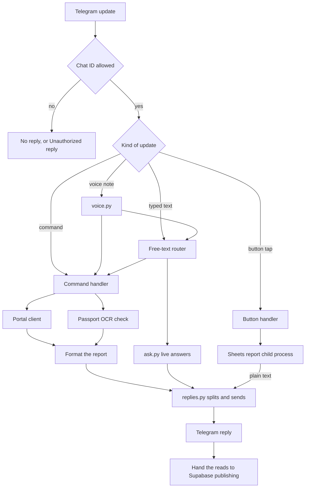
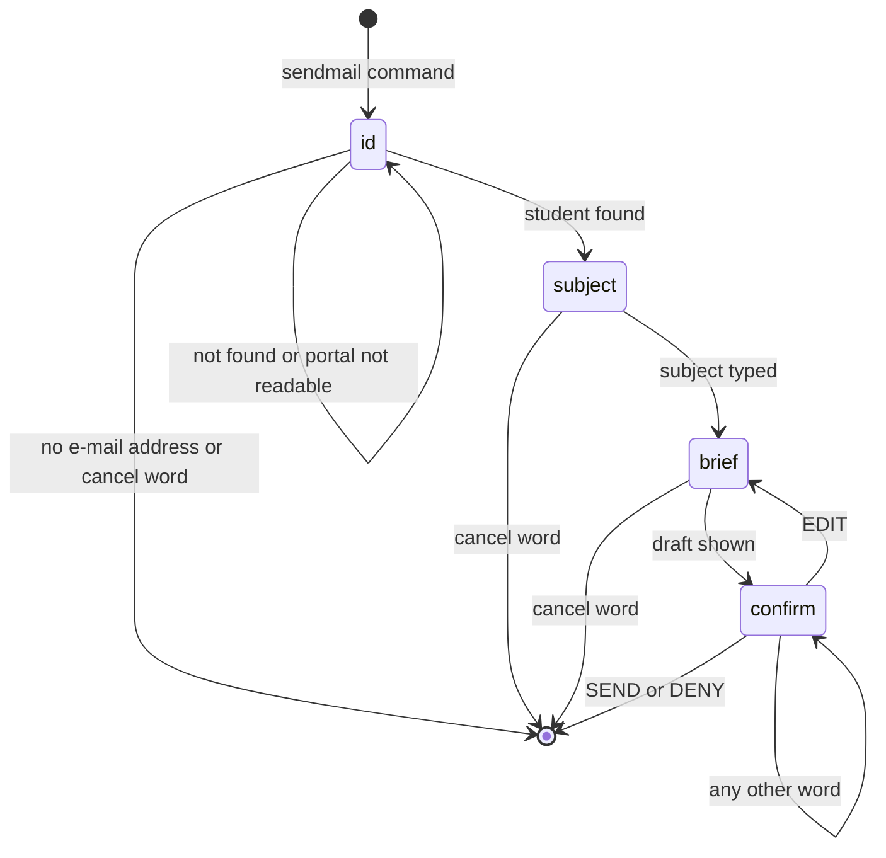

# Bot core: `telegram_bot.py`, `replies.py` and the package files

This document is the reference for five files:

- `src/bot/telegram_bot.py`
- `src/bot/replies.py`
- `src/bot/__init__.py`
- `src/__init__.py`
- `telegram_bot.py` in the repository root (a byte-identical copy of the first file)

Every `path:line` below is relative to the repository root and valid at HEAD.

How to read a bare `:N` (a line number with no path): it is line N of the file named most recently before it, as `path` or `path:line`, in the same table cell or the same sentence. When no file is named there, it is line N of the file the section is about: `src/bot/telegram_bot.py` in section 2, `src/bot/replies.py` in section 3, `src/__init__.py` in section 5. Wherever this rule would point at the wrong file, the full path is written.

## 1. Overview

Together these files are the part of the bot that staff talk to. `src/bot/telegram_bot.py` decides who may use the bot, registers every Telegram command, button and message handler, reads the admin portal live for each request, formats the answer and sends it. `src/bot/replies.py` is the one place that sends long text to Telegram without hitting Telegram's length and Markdown errors. `src/__init__.py` runs once per process, before anything else under `src`, and does two process-wide things: it makes Python trust the certificates Windows trusts, and it removes secrets from log lines. `src/bot/__init__.py` only marks the folder as a Python package. The root `telegram_bot.py` is never executed; it is the file an update script copies over the real one.

| program | lines | one-line purpose | how it is started |
|---|---|---|---|
| [`src/bot/telegram_bot.py`](../../src/bot/telegram_bot.py) | 2437 | The Telegram bot: authorisation, 42 command names, 3 button handlers, the free-text router, report formatting, the `/sendmail` conversation, the passport cross-check, the command menu and the application builder. | Imported by `run.py:32`. `run.py` is started by `start.bat:12` (`.venv\Scripts\python.exe run.py`) or `start_background.vbs:13` (`.venv\Scripts\pythonw.exe run.py`, hidden window). The file has no command line of its own. |
| [`src/bot/replies.py`](../../src/bot/replies.py) | 165 | Split long text under Telegram's 4096-character limit, resend as plain text when Telegram rejects the Markdown, and build the two stock error replies. | Library module. Imported by 8 other source files (listed in section 3). |
| [`src/bot/__init__.py`](../../src/bot/__init__.py) | 1 | Package marker. One docstring line. | Imported implicitly whenever any `src.bot.*` module is imported. |
| [`src/__init__.py`](../../src/__init__.py) | 79 | Process-wide setup: Windows CA bundle for HTTPS, and a log filter that redacts the bot token and Supabase keys. | Runs implicitly on the first import of anything under `src`: the bot, every `python -m src....` job, the tests. |
| [`telegram_bot.py`](../../telegram_bot.py) (root) | 2437 | Byte-identical staging copy of `src/bot/telegram_bot.py`. | Never run and never imported. `apply_bot_update.bat:38` copies it over `src\bot\telegram_bot.py`. |

### How a request moves through these files

### Terms used in this document

| term | meaning |
|---|---|
| portal | The agency's admin website at the address in `HANGEUL_BASE_URL` (default `https://hangeul.com.bd/admin`, `src/config.py:24`). The bot reads its pages with HTTP GET requests. |
| portal ID (`uid`) | The portal's internal number of a student, the `N` in `student_edit.php?id=N`. |
| HNG ID | The agency's student ID, of the form `HNG-YYYY-NNN`. In the code it is `student_id` or the CSV column `Student ID`. |
| verification stamp | The line "Payment verified by NAME · DD Mon, HH:MM" on a student's row of `students.php`. It has no year. A student is "verified on a day" when this stamp is on that day. |
| cross-check | For each chosen student: download the passport scan from the portal, read it with OCR (optical character recognition), and compare it with what staff typed into the portal. |
| card | One student's block in a cross-check report, and the dict it is built from (`_crosscheck_card`, `src/bot/telegram_bot.py:1597`). |
| the brief | The daily operational summary the scheduler sends at the time in `DAILY_REPORT_TIME` (default `18:05`, `src/config.py:57`) and that `/brief` and `/report` produce on demand. It is composed in `src/bot/brief.py`. |
| mock mode | `MOCK_MODE` true. It is the default (`src/config.py:21`). Some portal readers then answer from built-in demo data instead of the live portal. The other readers have no mock branch and still send real requests to `HANGEUL_BASE_URL`; see "Portal pages" in section 2. |
| chat ID | Telegram's number for a chat. The bot authorises by chat ID. |
| reads | A plain dict in which a handler keeps what it read from the portal, so the same data can be published to Supabase after the reply is sent. |
| Jennie | The project's name for the bot's voice and local LLM ("Jennie's brain"). |

---

## 2. `src/bot/telegram_bot.py`

### Purpose

The whole interactive surface of the bot. It:

1. checks the sender's chat ID against the allowed list;
2. registers 42 command names, 3 inline-button handlers, 1 text handler and (optionally) 1 voice handler;
3. reads the portal live for each request and formats the result as Telegram Markdown;
4. runs the step-by-step `/sendmail` conversation, which ends in one e-mail sent through Gmail;
5. orchestrates the passport cross-check (pick students, run OCR one by one, format the cards);
6. sets the Telegram "/" menu and pins a command cheat-sheet at startup;
7. hands the built application to the scheduler (`setup_scheduler(app)`, `src/bot/telegram_bot.py:2436`).

The file has 73 top-level functions (46 of them `async`) and no classes.

### How it is run or who calls it

There is no command line and no `if __name__ == "__main__"` block. The file is imported.

**Start-up path**

1. `start.bat:12` runs `"%PYTHON_EXE%" run.py` in a console window; `PYTHON_EXE` is `.venv\Scripts\python.exe` in the bot folder (`start.bat:8`). `start_background.vbs:13` runs `pythonw.exe run.py` with window style 0 (hidden). `run.py` takes no flags.
2. `run.py:32` imports `build_telegram_application` and `post_init` from this file.
3. `run.py:88` calls `build_telegram_application()`. It returns `None` when `TELEGRAM_BOT_TOKEN` is empty or equals the placeholder `your_telegram_bot_token_here` (`src/bot/telegram_bot.py:2369-2372`). In that case only the REST API is served (`run.py:101-103`).
4. Otherwise `run.py:92-95` does `async with telegram_app:` then `await telegram_app.start()`, `await post_init(telegram_app)`, `await telegram_app.updater.start_polling()`. The bot uses long polling, not a webhook.
5. `run.py:97` then serves the REST API with uvicorn in the same event loop. On exit `run.py:99-100` stops the updater and the application.

**Other importers**

| importer | what it uses |
|---|---|
| `src/bot/voice.py:649` (`_dispatch`) | In `src/bot/voice.py`: `handle_natural_language_message(update, context, query=...)` (`:678`, `:686`, `:762`), `<topic>_today_command` and `<topic>_date_command` for `inquiries` and `verified` through `getattr` (`:695-696`), `crosscheck_range_command` (`:713`), `crosscheck_today_command` (`:718`, `:738`), `crosscheck_date_command` (`:722`, `:729`, `:741`), `crosscheck_command` (`:727`), `calendar_command` (`:753`), `stats_command` (`:764`), `missing_command` (`:768`). |
| `src/bot/voice.py:1720` (`_answer_voice`) | In `src/bot/voice.py`: `is_authorized` (`:1726`), `handle_natural_language_message` as the fallback (`:1820`). |
| 15 test files under `tests/` | `test_brief`, `test_cloud_all`, `test_cloud_commands`, `test_cloud_performance`, `test_crosscheck`, `test_final_fixes`, `test_foundation`, `test_freetext`, `test_inquiries`, `test_integration`, `test_jobs`, `test_performance`, `test_repair`, `test_voice`, `test_voice_fast`. See [tests.md](tests.md). |

**Modules this file imports**

- Third party: `python-telegram-bot` (pinned `22.8`, `requirements.txt:28`): `telegram.Update`, `BotCommand`, `InlineKeyboardButton`, `InlineKeyboardMarkup`, `telegram.error.BadRequest`, `telegram.ext.Application`, `CallbackQueryHandler`, `CommandHandler`, `MessageHandler`, `ContextTypes`, `filters` (`src/bot/telegram_bot.py:4-13`).
- Project, at module level (`:15-18`): `src.config.settings`, `src.scraper.client.admin_client`, `src.llm.ollama_client.ollama_client`, `src.bot.scheduler.setup_scheduler`.
- Project, imported inside functions: `src.bot.replies`, `src.bot.brief` (`compose_daily_brief`, `send_brief_text`, `esc`), `src.bot.scheduler` (`compose_daily_brief`, `_send_brief`, `warm_brain`), `src.bot.ask`, `src.bot.performance`, `src.bot.voice.handle_voice_message`, `src.dates` (`local_today`, `parse_user_date`, `has_date_hint`, `user_date_problem`, `yearless_day_problem`, `parse_stamp`), `src.scraper.client` (`PortalUnavailable`, `portal_error_reason`), `src.scraper.parsers` (`payment_text`, `verification`), `src.cloud.command_hooks`, `src.llm.ollama_client.brain_pinned`.
- Standard library: `logging`, `re`, `typing`, `datetime`, `zoneinfo`, `collections.Counter`, `smtplib`, `ssl`, `email.message`, `csv`, `io`, `json`, `asyncio`, `os`, `sys`.

### What it reads

#### Telegram

- Commands: 42 command names (table in "Commands" below). Arguments come from `context.args`; some handlers fall back to `update.message.text`.
- Inline-button taps (callback queries) whose data starts with `missing:`, `stage:` or `stagei:`.
- Every text message that is not a command (`filters.TEXT & ~filters.COMMAND`, `src/bot/telegram_bot.py:2426`).
- Voice and audio messages (`filters.VOICE | filters.AUDIO`, `:2432`), only when `JENNIE_VOICE_ENABLED` is true. They are handled by `src.bot.voice.handle_voice_message` ([voice_and_llm.md](voice_and_llm.md)).
- `update.effective_chat.id`, for authorisation.

#### Conversation state

Kept in `context.user_data`, which python-telegram-bot stores per Telegram user. No persistence is configured on the builder (`:2374`), so it is in memory only and is lost when the bot restarts.

| key | set at | read / removed at | meaning |
|---|---|---|---|
| `override_text` | free-text router (`:2010`, `:2050`, `:2061`, `:2068`, `:2077`, `:2082`, `:2090`, `:2095`, `:2101`, `:2108`, `:2113`, `:2123`, `:2128`, `:2152`, `:2156`), `crosscheck_today_command` (`:686`), `crosscheck_date_command` (`:714`), `src/bot/voice.py` (`:703`, `:712`, `:721`, `:726`, `:740`, `:749`) | popped by `report_command` (`:132`), `inquiries_date_command` (`:624`), `verified_date_command` (`:664`), `verified_command` (`:876`), `crosscheck_date_command` (`:699`), `calendar_command` (`:1112`), `crosscheck_range_command` (`:1867`), `crosscheck_command` (`:1942`); also popped by `src/bot/voice.py` after every voice dispatch, whether it worked or not (`:1815`) | The words a command should work on instead of its own arguments. |
| `override_date` | `verified_today_command` (`:654`), `verified_date_command` (`:679`) | popped by `verified_command` (`:878`) | A date given to `/verified`, read strictly. |
| `override_query` | free-text router (`:2141`) | popped by `admitted_command` (`:357`) | Search words for `/admitted`. |
| `crosscheck_date_only` | `:687`, `:715` | popped by `crosscheck_command` (`:1935`) | The cross-check accepts only a date, never an ID or a name. |
| `awaiting_date_for` | `:629` (`inquiries`), `:669` (`verified`), `:704` (`crosscheck`), `:1872` (`crosscheck_range`), `:604` (re-armed), `:2053` | popped by the free-text router (`:2004`); `src/bot/voice.py` reads it (`:656`) and pops it when a voice note brings a new request instead of a date (`:681`, `:689`) | A "which date?" question is open. The next typed message is taken as its answer. |
| `date_prompt_answer` (`DATE_PROMPT_KEY`, `:592`) | `:2011` | read at `:603`, removed at `:2015` | Tells the command that the words it got are an answer to its own date question. |
| `email_flow` | `sendmail_command` (`:1479`) | `_handle_email_flow` (`:1356`), removed when the flow ends | A dict with `step` (`id`, `subject`, `brief`, `confirm`), `student`, `subject`, `brief`, `body`. |

#### Portal pages

All paths are relative to `HANGEUL_BASE_URL`. Every request is a GET, except the one login POST. The HTTP work is done by `admin_client` in `src/scraper/client.py` ([scraper_and_config.md](scraper_and_config.md)); only the first row is a request this file builds itself.

Most readers go through `portal_get` / `fetch_html` (`src/scraper/client.py:314-342`). That path logs in first when there is no session, logs in again once and repeats the GET when the response ended on `login.php`, and raises `PortalUnavailable` on an HTTP status of 400 or above, a timeout or a refused connection. Its connect timeout is at most 10 s (`CONNECT_TIMEOUT`, `src/scraper/client.py:48`). Three reads do not use that path and are marked "direct" below.

| portal page | parameters | timeout | called from (this file) | reader | used by |
|---|---|---|---|---|---|
| `students.php` | `export=csv` | 60 s; direct; one re-login and one repeat if the response URL contains `login.php` | `_find_student_in_export` (`:1193-1198`) | built in this file with `admin_client.client.get` | `/sendmail` student lookup. Columns used: `Student ID`, `Full Name`, `Email`, `DOB`, `Passport No`, `Passport Expiry` (`:1211-1225`). |
| `students.php`, every page | page 1: none; then `pg=2` … `pg=N` from the page's own "Page 1 of N" pager. 50 students per page (`STUDENTS_PER_PAGE`, `src/scraper/client.py:44`); refused above 40 pages (`MAX_STUDENT_PAGES`, `src/scraper/client.py:45`) | 60 s per page | `passports_command` (`:992`), `_find_student_on_list_page` (`:1240`), `build_crosscheck_report` (`:1754`) | `read_students` (`src/scraper/client.py:501-520`) | `/passports`, `/sendmail` fallback, every cross-check |
| `students.php`, every page | same | 60 s per page | `verified_command` (`:905`) | `get_verified_students` (`src/scraper/client.py:547-551`) → `read_verified_students` (`src/scraper/client.py:522-545`). The day is matched in code; it is not sent to the portal. | `/verified`, `/verified_today`, `/verified_date` |
| `students.php`, first page only | none | 60 s | `students_command` (`:258`) | `get_applications` (`src/scraper/client.py:214-234`). With no filter it reads page 1 only: the 50 newest applications. | `/students` |
| `index.php`, then `students.php`, every page | none; then `pg=N` as above. The search words never go into a URL. | 30 s; 60 s per page | `admitted_command` (`:364`) | `get_admitted_students` (`src/scraper/client.py:236-267`) | `/admitted` |
| `index.php` | none | 30 s | `stats_command` (`:241`) | `get_dashboard` (`src/scraper/client.py:202-212`). Never raises; an unreadable page comes back as `{"error": why}`. | `/stats` |
| `consult_requests.php` | `status=all&from=YYYY-MM-DD&to=YYYY-MM-DD`, both dates the same day | 60 s | `build_inquiries_report` (`:555`) | `read_consultation_day` (`src/scraper/client.py:382-423`) | the four inquiries commands |
| `consult_requests.php` | `status=file_opened`, no date (`CONSULT_TOTALS_VIEW`, `src/scraper/client.py:53`) | 60 s | `build_inquiries_report` (`:562`) | `read_consultation_totals` (`src/scraper/client.py:368-380`) | the same four commands (all-time status counts) |
| `calendar.php` | none | 15 s (the HTTP client's default, `src/scraper/client.py:116`); direct; returns an `error` key instead of raising | `calendar_command` (`:1140`) | `get_calendar_events` (`src/scraper/client.py:570-590`) | `/calendar` with no words |
| `calendar.php` | none | 60 s | `calendar_command` (`:1134`) | `ask.answer_calendar` (`src/bot/ask.py:1395`, the fetch at `:1403`) | `/calendar` with words |
| `consult_performance.php` | `period=today` or `period=month` | 60 s | `_send_performance_report` (`:733`) | `performance.build_performance_report` (`src/bot/performance.py:281`, the read at `:295`) → `read_consult_performance` (`src/scraper/client.py:425-452`) | `/performance_today`, `/performance_month`, `/performance` |
| `student_edit.php` | `id=<portal ID>` | 15 s; direct; `{}` on failure | `_find_student_on_list_page` (`:1271`) | `get_student_full_profile` (`src/scraper/client.py:592-628`) | `/sendmail` fallback, when the list row lacks the e-mail, name or HNG ID |
| `student_edit.php`, then `view_doc.php` | `id=<portal ID>`; `f=<file name starting passport_>` | 30 s; 60 s. The download is skipped when that exact file is already saved on the PC (`src/scraper/client.py:680-686`). | `_audit_cards` (`:1643`) | `audit_student_passport` (`src/scraper/client.py:630-713`) | every cross-check, `/passports` |
| `login.php` | GET, then POST with form fields `_csrf`, `username`, `password` | GET 30 s (`src/scraper/client.py:136`); POST 15 s (client default) | `_find_student_in_export` (`:1192`, `:1197`) | `login` (`src/scraper/client.py:150-200`) | `/sendmail` lookup directly; every other read indirectly |
| `index.php` | none | 30 s | `alerts_command` (`:796`) | `src.bot.ask` (`src/bot/ask.py:772`) | `/alerts` |

Further live reads happen inside `src.bot.brief.compose_daily_brief` (for `/report` and `/brief`) and `src.bot.ask.reply` (for free-text questions). Those are documented in [bot_answers_and_jobs.md](bot_answers_and_jobs.md).

In mock mode `get_dashboard`, `get_applications`, `get_admitted_students`, `get_calendar_events` and `login` answer from built-in data without an HTTP request (`get_calendar_events` returns an empty calendar), and the consultation and performance readers raise `PortalUnavailable` ("the bot is in mock mode") (`src/scraper/client.py:158`, `:206`, `:221`, `:253`, `:357`, `:440`, `:572`). `read_pending_payments` and `read_window_apps_under_review` return `None`, which their callers show as "not available", also without a request (`src/scraper/client.py:556`, `:564`).

The other readers have no mock branch. `MOCK_MODE` is `True` by default (`src/config.py:21`). In mock mode `login` only sets `is_authenticated = True` and sends nothing (`src/scraper/client.py:158-159`), so the readers below still send a real GET to `HANGEUL_BASE_URL`, without a logged-in session. Most go through `portal_get` (`src/scraper/client.py:325-327`); `get_student_full_profile` and the CSV export call the HTTP client directly.

| reader | commands that reach it in mock mode |
|---|---|
| `read_students` (every page of `students.php`) | `/verified`, `/verified_today`, `/verified_date`, every cross-check, `/passports`, the `/sendmail` list-page lookup; also `/report` and `/brief`, whose brief reads the day's verified students this way (`read_verified_students`, `src/bot/brief.py:620-621`) |
| `audit_student_passport` (`student_edit.php`, `view_doc.php`) | every cross-check, `/passports` |
| `get_student_full_profile` (`student_edit.php`) | the `/sendmail` list-page lookup |
| the CSV export in `_find_student_in_export` (`src/bot/telegram_bot.py:1191-1198`) | `/sendmail` |
| `ask._dashboard` (`index.php`, `src/bot/ask.py:772`) | `/alerts`; free-text questions about dashboard figures, about window applications under review (the dashboard tile beside the count, `src/bot/ask.py:950`), and questions with no route |
| `ask.answer_calendar` (`calendar.php`, `src/bot/ask.py:1403`) | `/calendar` with words |
| `read_students` called from `src.bot.ask` (`src/bot/ask.py:983`, `:1022`) | free-text questions about students per intake and application dates |
| `read_student_pages` with `status=pending`, called from `ask.answer_pending` (`src/bot/ask.py:892`) | free-text questions about pending payments |

None of these readers falls back to demo data. What comes back depends on the portal. When a read through `portal_get` gets the login page, it "logs in" again (in mock mode, only the flag is set) and repeats the GET once; a second login page raises `PortalUnavailable` (`src/scraper/client.py:328-334`). A portal that does not answer also raises `PortalUnavailable`. Most of these commands then reply "Couldn't read the portal"; a free-text question with no route gets "I can't answer that from the portal yet" with the reason (`src/bot/ask.py:1049`). A question about window applications under review gets "Under review: not available" (the mock reader returned `None`) and no dashboard tile, because the failed dashboard read is only logged (`src/bot/ask.py:954-958`). The CSV export does not raise for a login page: it finds no `Student ID` column, raises `RuntimeError` (`src/bot/telegram_bot.py:1199-1201`), and the lookup moves to the list pages.

#### Local LLM (Ollama)

- `ollama_client.check_health()` in `/start` (`:48`).
- `ollama_client.generate_response(prompt, system=system)` to draft the `/sendmail` body (`:1330`).
- At startup: `brain_pinned()` (`:2360`), then `scheduler.warm_brain()` or `ollama_client.unload()` (`:2362`, `:2365`).

#### Child processes

`_run_report_module` (`:2215`) starts these and reads their standard output:

| command line | started from | output |
|---|---|---|
| `<python.exe> -m src.sheets.missing_report --program <KEY>` | `missing_button` (`:2205`) | Plain text, sent as the reply. |
| `<python.exe> -m src.sheets.stage_report --program <KEY>` | `stage_program_button` (`:2271`) | JSON: a list of `{intake, count}`, or an object with `error`. |
| `<python.exe> -m src.sheets.stage_report --program <KEY> --intake <INTAKE>` | `stage_intake_button` (`:2304`) | Plain text, sent as the reply. |

`<KEY>` is one of `KLP`, `EAP`, `BACHELOR`, `MASTER` (`MISSING_PROGRAMS`, `:2172-2177`). `<python.exe>` is `sys.executable`, with a trailing `pythonw.exe` replaced by `python.exe` (`:2222-2224`). The code gives no reason for this swap. The working directory is the bot root. Which Google Sheets those modules read is described in [sheets.md](sheets.md).

#### Settings (by name)

Read through `src.config.settings`. Defaults are from `src/config.py`.

| setting | default | used for | line |
|---|---|---|---|
| `TELEGRAM_BOT_TOKEN` | empty | The bot token. Empty or the placeholder means the bot is not started. | `:2369` |
| `TELEGRAM_ADMIN_CHAT_ID` | empty | First allowed chat; also the chat that gets the cheat-sheet pinned at startup. | `:28` (through `authorized_ids()`), `:2338` |
| `TELEGRAM_AUTHORIZED_CHAT_IDS` | empty | Further allowed chat IDs, separated by commas, semicolons or spaces. | `:28` (through `authorized_ids()`, `src/config.py:114-126`) |
| `MOCK_MODE` | `True` | Shown in `/start`. | `:47` |
| `OLLAMA_MODEL` | `qwen3:4b-instruct` | Shown in `/start`. | `:49` |
| `HANGEUL_BASE_URL` | `https://hangeul.com.bd/admin` | Shown in `/start`. | `:55` |
| `REPORT_TIMEZONE` | `Asia/Dhaka` | The "read at" time in `/passports`; also "today" everywhere, through `src.dates.local_today`. | `:994` |
| `GMAIL_ADDRESS` | empty | Sender of `/sendmail`. | `:1154` |
| `GMAIL_APP_PASSWORD` | empty | Google app password for SMTP. Spaces are removed before use. | `:1155` |
| `JENNIE_VOICE_ENABLED` | `False` | Registers the voice handler. | `:2430` |
| `JENNIE_VOICE_URL` | `http://127.0.0.1:8765` | Only written to the log here. | `:2433` |

Read indirectly: `BRAIN_ALWAYS_LOADED` (through `brain_pinned()`, `src/llm/ollama_client.py:37-39`), `ENABLE_SCHEDULED_REPORTS` (through `setup_scheduler`, `src/bot/scheduler.py:419-423`), and `SUPABASE_URL`, `SUPABASE_SECRET_KEY`, `CLOUD_PUBLISH_ENABLED` (through `command_hooks.active()`, `src/cloud/command_hooks.py:74-84`). The whole process environment is passed to the report child processes, with `PYTHONIOENCODING=utf-8` added (`src/bot/telegram_bot.py:2229`).

#### Not read by this file

No local file is read directly. No Google API is called (the `/missing` and `/stage` child processes do that). No Supabase request is made. The voice service is not contacted from this file.

### What it writes

| output | detail |
|---|---|
| Telegram messages | `reply_text` messages, almost all in legacy `Markdown` parse mode. A "please wait" message is sent first and then edited into the first piece of the answer (through `replies.reply_long(..., edit=...)`) or deleted. |
| Telegram menu | `bot.set_my_commands` with 13 commands, once at startup (`:2332`). |
| Pinned message | `/pin` sends the cheat-sheet and pins it with notification (`:327-333`). At startup the cheat-sheet is sent to `TELEGRAM_ADMIN_CHAT_ID` and pinned silently (`:2341-2350`). |
| Inline keyboards | Program buttons for `/missing` and `/stage`; intake buttons for `/stage`. |
| Callback answers | `query.answer()`, or `query.answer("Not authorized", show_alert=True)` for a sender who is not allowed. |
| E-mail | One message per confirmed `/sendmail`: `smtplib.SMTP_SSL("smtp.gmail.com", 465, timeout=30)`, login with `GMAIL_ADDRESS` and `GMAIL_APP_PASSWORD`, `From` = `GMAIL_ADDRESS`, `To` = the student's e-mail address, plain-text body (`:1148-1171`). |
| Prompt to the local LLM | The student's name, the subject and the manager's brief (`:1323-1330`). |
| Supabase, indirectly | After the reply is sent, each live command calls `cloud.publish(reads)` and does not await it (`:245`, `:277`, `:372`, `:587`, `:739`, `:912`, `:1008`, `:1135`, `:1817`). See "Publishing" below. |
| Local files, indirectly | `audit_student_passport` saves each downloaded scan as `passports/<portal ID>_<file name>` under the bot root (`src/scraper/client.py:675-705`). For a scan whose name ends in `.pdf` (any letter case), the OCR step writes a second file next to it: `<saved scan path without .pdf>_extracted.jpg`. `load_passport_image` (`src/scraper/ocr_validator.py:128-152`) writes each image embedded in the PDF to that path in turn and stops at the first one OpenCV can read; an existing `_extracted.jpg` larger than 1000 bytes is used instead and not written again. The chain is `audit_student_passport` → `validate_passport_data` in a worker thread (`src/scraper/client.py:711-713`) → `_validate_passport_data` (`src/scraper/ocr_validator.py:750`) → `read_passport_scan` (`src/scraper/ocr_validator.py:777`) → `load_passport_image` (`src/scraper/ocr_validator.py:383`). A new scan is first written to `.<portal ID>_<file name>.part` in the same folder and then renamed (`src/scraper/client.py:701-705`). This file writes no file itself. |
| Log | Logger `hangeul.bot` (`:20`). Lines contain chat IDs, the raw date text a user typed, and portal IDs in error lines. The file handler (`hangeul_bot.log` in the bot root) is set up in `run.py:37`. |
| Environment of child processes | `PYTHONIOENCODING=utf-8` (`:2229`). |

#### Publishing (hand-over to Supabase)

Each handler that reads the portal collects what it read with `src.cloud.command_hooks.seen(reads, ...)`. `seen` and `publish` do nothing unless publishing is switched on and the bot is not in mock mode (`src/cloud/command_hooks.py:74-84`). Table names and record building are in `src/cloud`; see [cloud.md](cloud.md) and [../reference/13_SUPABASE_PUBLISHING.md](../reference/13_SUPABASE_PUBLISHING.md).

| key handed over | set by | contents |
|---|---|---|
| `dashboard` | `stats_command` (`:242`), `admitted_command` (`:367`) | The dashboard read. |
| `page` | `students_command` (`:263`) | Page 1 of the student list (never a complete list). |
| `students` | `admitted_command` (`:367`), `passports_command` (`:993`), `build_crosscheck_report` (`:1755`) | The whole student list as read. |
| `consultations` | `build_inquiries_report` (`:559`) | The day's consultation read. |
| `totals`, `totals_error` | `build_inquiries_report` (`:566`) | The all-time status counts, or the reason they could not be read. |
| `inquiries_report` | `build_inquiries_report` (`:568`) | The report text as sent. |
| `verified` | `verified_command` (`:906`) | `(day, verified list)`. |
| `cards` | `passports_command` (`:1002`), `build_crosscheck_report` (`:1799`) | The audited cross-check cards. |
| `performance` | `src/bot/performance.py:299`, with the `reads` dict passed from `src/bot/telegram_bot.py:733` | `(period, page)`: the Consultant Performance page read (record kind `consultant_performance`, named in the docstring at `:724`). |
| `calendar` | `src/bot/ask.py:1410`, with the `reads` dict passed from `src/bot/telegram_bot.py:1134` | The calendar items read. |

Around each OCR audit, `_audit_cards` also calls `cloud.profile_of(uid)` before (`:1641`) and `cloud.audited(card, result, form, profile_before)` after (`:1648`).

### Why it exists

Staff of the agency ask the bot, in Telegram, the questions they would otherwise answer by clicking through the admin portal:

- how many consultation inquiries came in on a day, how many were handled and by whom;
- which students' payments were verified on a day, and the total amount;
- whether each verified student's passport scan matches what was typed into the portal (name, date of birth, passport number, expiry, parents' names, address);
- who is admitted, where and for which intake;
- which deadlines and reminders are coming;
- how the consultants are performing today and this month;
- which information is missing from the progress sheets, and which stage each student is at.

It also lets the manager e-mail a student from Telegram: the local LLM drafts the message from a short brief, and a person approves it before it is sent.

With `MOCK_MODE` off, every figure is read live at the time of the question. A read that fails is reported as "not available" or "Couldn't read the portal", never as zero or "none". With `MOCK_MODE` on (the default), some answers come from built-in demo data and the rest still go to the portal; see "Portal pages" above.

### Authorisation

`is_authorized(update)` (`src/bot/telegram_bot.py:22-37`):

1. No `update.effective_chat`: return `False`.
2. `chat_id = str(update.effective_chat.id).strip()`.
3. `allowed = settings.authorized_ids()` (`src/config.py:114-126`): a set holding `TELEGRAM_ADMIN_CHAT_ID`, if not empty, plus every item of `TELEGRAM_AUTHORIZED_CHAT_IDS`.
4. If the set is empty, refuse everyone and log a warning that tells the operator to set `TELEGRAM_ADMIN_CHAT_ID` and restart.
5. Otherwise return `chat_id in allowed` (exact string match).

It is called at the top of every command handler, every button handler and the free-text handler. The voice handler calls it too (`src/bot/voice.py:1726`).

What a sender who is not allowed sees depends on the handler:

| behaviour | handlers |
|---|---|
| Reply "⛔ Unauthorized access. Your Chat ID is: `<id>`" | `/start` `/help` (`:44`), `/report` (`:127`), `/brief` `/dailybrief` (`:167`), `/performance_today` `/perf_today` (`:746`), `/performance_month` `/perf_month` (`:756`), `/performance` (`:768`), `/verified` `/verified_students` (`:869`), `/passports` `/passport_audit` (`:981`), `/calendar` `/events` `/deadlines` (`:1107`), `/sendmail` `/email` `/mail` (`:1476`), `/crosscheck_range` `/crosscheck_between` `/crosscheck_period` (`:1862`), `/crosscheck` `/audit` (`:1937`) |
| No reply at all | `/stats`, `/students`, `/pin` `/commands`, `/admitted`, `/inquiries_today`, `/inquiries_date` `/consultations` `/inquiries`, `/verified_today`, `/verified_date`, `/crosscheck_today`, `/crosscheck_date`, `/alerts`, `/missing`, `/stage` `/stages`, typed text, voice notes |
| Pop-up alert "Not authorized" | the three button handlers (`:2199`, `:2265`, `:2298`) |

### Commands

Registered in `build_telegram_application` (`src/bot/telegram_bot.py:2377-2423`): 42 `CommandHandler` registrations that point at 27 distinct handler functions.

| command | aliases | handler (line) | what it reads | what it replies |
|---|---|---|---|---|
| `/start` | `/help` | `start_command` (`:39`) | `MOCK_MODE`, `OLLAMA_MODEL`, `HANGEUL_BASE_URL`, Ollama health | Welcome text: mode, LLM status, portal address, 12 menu commands, 4 free-text examples. |
| `/inquiries_today` | — | `inquiries_today_command` (`:607`) | Consultations for today and the all-time status counts | The Consultancy Inquiries Report for today. |
| `/inquiries_date [date]` | `/consultations` (`consultations_command`, `:780`), `/inquiries` (`inquiries_command`, `:784`) | `inquiries_date_command` (`:614`) | The same, for the day given. With no argument it asks "which date?" and waits for the next typed message. | The report for that day, or a date error. |
| `/verified_today` | — | `verified_today_command` (`:650`) → `verified_command` | Every page of `students.php`; today's verification stamps | Student Payment Verifications: count, total amount, one block per student. |
| `/verified_date [date]` | — | `verified_date_command` (`:657`) → `verified_command` | The same for the day given; asks for a date when none is given | Same. |
| `/verified [date]` | `/verified_students` | `verified_command` (`:858`) | The same; the date comes from the arguments or the message text | Same. |
| `/crosscheck_today` | — | `crosscheck_today_command` (`:682`) → `crosscheck_command` | All students; those verified today; OCR of each passport scan | Cross-check report, one card per student. |
| `/crosscheck_date [date]` | — | `crosscheck_date_command` (`:690`) → `crosscheck_command` | The same for the day given. Accepts a date only; asks when none is given. | Same. |
| `/crosscheck_range [start to end]` | `/crosscheck_between`, `/crosscheck_period` | `crosscheck_range_command` (`:1854`) | All students; those verified in the range (at most 92 days); OCR of each scan | Cross-check report for the range, sorted by day and stamp time. |
| `/crosscheck [date, portal ID, HNG ID or name]` | `/audit` | `crosscheck_command` (`:1924`) | All students, picked by day, portal ID, HNG ID or part of a name (at most 10 by name) | Cross-check report. |
| `/passports` | `/passport_audit` | `passports_command` (`:969`) | All students; OCR of the scans of the first 5 students verified today | Counts of students with and without a passport scan (the latter grouped by Passport Status) and today's verdicts. |
| `/sendmail [student]` | `/email`, `/mail` | `sendmail_command` (`:1472`) | Student lookup, then the subject and brief the user types, then the LLM draft | Step prompts, a draft preview, then "Email sent", "Could not send" or a cancellation. |
| `/missing` | — | `missing_command` (`:2180`) | Nothing until a button is tapped | Four program buttons. |
| `/stage` | `/stages` | `stage_command` (`:2249`) | Nothing until a button is tapped | Four program buttons. |
| `/performance_today` | `/perf_today` | `performance_today_command` (`:742`) | Consultant Performance page, `period=today` | Tiles, top performer, leaderboard. |
| `/performance_month` | `/perf_month` | `performance_month_command` (`:752`) | Consultant Performance page, `period=month` | Same, for this month. |
| `/performance [today or month]` | — | `performance_command` (`:762`) | `ask.performance_route` on the words | The today or month report. Any other period gets `ask.performance_other_reply`: what the commands cover and what the portal page itself offers. |
| `/pin` | `/commands` | `pin_command` (`:320`) | Nothing | The cheat-sheet, pinned to the chat, or a note that the bot lacks the pin permission. |
| `/admitted [query]` | — | `admitted_command` (`:346`) | Dashboard, then every page of `students.php` | Admitted count, check against the dashboard's Admitted tile, breakdown, roster of up to 12. |
| `/report [date]` | — | `report_command` (`:122`) | `src.bot.brief.compose_daily_brief(day)` | The factual daily brief for that date. |
| `/brief` | `/dailybrief` | `brief_command` (`:163`) | `compose_daily_brief()` for today | Today's daily brief, sent with `bot.send_message` to the chat. |
| `/stats` | — | `stats_command` (`:233`) | Dashboard tiles | Quick Stats, grouped as the portal groups them. |
| `/students` | — | `students_command` (`:247`) | First page of the student list | Up to 8 recent applications. |
| `/calendar [words]` | `/events`, `/deadlines` | `calendar_command` (`:1095`) | `calendar.php`; the words are parsed by `ask.calendar_query` | With no words: today's reminders and up to 20 timeline rows. With words: the dated or searched answer. |
| `/alerts` | — | `alerts_command` (`:788`) | The dashboard's "Needs attention" card, through `src.bot.ask` | That card's contents, or that the dashboard could not be read. |

The table has 25 rows for 27 handler functions because `consultations_command` and `inquiries_command`, which only call `inquiries_date_command`, are shown as aliases in the `/inquiries_date` row.

A command that is not in this list gets no reply. The text handler excludes commands, and there is no catch-all command handler.

#### The "/" menu

`post_init` sets 13 menu entries, in this order (`src/bot/telegram_bot.py:2316-2330`):

| # | command | description shown in Telegram |
|---|---|---|
| 1 | `inquiries_today` | Total consultancy inquiries & how many done today |
| 2 | `inquiries_date` | Total inquiries & how many done (ask specific date) |
| 3 | `verified_today` | Total verified students today |
| 4 | `verified_date` | Total verified students (ask specific date each time) |
| 5 | `crosscheck_today` | Total crosscheck verified students live today |
| 6 | `crosscheck_date` | Total crosscheck verified live (ask specific date each time) |
| 7 | `crosscheck_range` | Total crosscheck verified live (ask start date → end date) |
| 8 | `sendmail` | Email a student (ask ID → subject → brief; AI writes it; you approve) |
| 9 | `brief` | Run today's full 6:05 PM operational brief now |
| 10 | `missing` | Progress sheet missing information (KLP / EAP / Bachelor's / Master's) |
| 11 | `stage` | Student stages — choose program → intake |
| 12 | `performance_today` | Today: the portal's Consultant Performance page: tiles, top performer, leaderboard |
| 13 | `performance_month` | This month: the portal's Consultant Performance page: tiles, top performer, leaderboard |

#### Button handlers

| callback data | handler (line, registered at) | what it does |
|---|---|---|
| `missing:<KEY>` | `missing_button` (`:2192`, `:2385`) | Runs `src.sheets.missing_report --program <KEY>` and replies with its output as plain text. |
| `stage:<KEY>` | `stage_program_button` (`:2260`, `:2388`) | Runs `src.sheets.stage_report --program <KEY>`, parses the JSON, and shows one button per intake labelled "`<intake> (<count>)`". The intake `NONE` is labelled "No intake set". A JSON object with `error` is shown as a portal error. |
| `stagei:<KEY>`, a vertical bar, `<INTAKE>` | `stage_intake_button` (`:2294`, `:2389`) | Runs `src.sheets.stage_report --program <KEY> --intake <INTAKE>` and replies with its output as plain text. |

#### Message handlers

| filter | handler (line, registered at) | note |
|---|---|---|
| `filters.TEXT & ~filters.COMMAND` | `handle_natural_language_message` (`:1973`, `:2426`) | Every typed message that is not a command. |
| `filters.VOICE` or `filters.AUDIO`, `block=False` | `src.bot.voice.handle_voice_message` (`src/bot/voice.py:1693`, registered at `src/bot/telegram_bot.py:2432`) | Only when `JENNIE_VOICE_ENABLED` is true. `block=False` lets typed commands run while a voice round trip is in progress. |

### Free-text routing

`handle_natural_language_message(update, context, query=None)` (`:1973`) handles typed text. A voice note has no text; `src/bot/voice.py` passes its English wording as `query`. The wording that selects a route is decided by `src.bot.ask.classify(query, today)` ([bot_answers_and_jobs.md](bot_answers_and_jobs.md)); this function only dispatches on the result. The checks run in this order:

1. Sender not allowed: return with no reply (`:1989`).
2. A `/sendmail` flow is open: the message goes to `_handle_email_flow` (`:1997-1999`).
3. A date question is open (`awaiting_date_for` is `inquiries`, `verified`, `crosscheck` or `crosscheck_range`): the message is taken as the date and passed to the matching command (`:2004-2016`).
4. `route = ask.classify(query, today)` (`:2021`). Then, by `route.kind`:

| route kind | what runs | lines |
|---|---|---|
| `hello` | Reply with the fixed greeting `ask.HELLO`. | `:2028` |
| `pin` | `pin_command`. | `:2031` |
| `performance` | Topic `month` → `performance_month_command`; `today` → `performance_today_command`; anything else → `ask.performance_other_reply`. | `:2036-2043` |
| `inquiries`, `verified` or `passports` with a span of days | For `passports` with a span that starts today or earlier: `crosscheck_range_command` for the span, cut at today. Otherwise: reply `ask.one_day_reply` and open a date question. | `:2047-2055` |
| `inquiries` | Unreadable date → `inquiries_date_command` (it says so). No day but the word "date" or "specific" → `inquiries_date_command` (it asks). No day, or today → `inquiries_today_command`. Another day → `inquiries_date_command`. | `:2059-2070` |
| `crosscheck` | Two different dates → range command. A span starting today or earlier → range command. Today → `crosscheck_today_command`. Another date → `crosscheck_date_command`. No date, no field word and no 2-to-5-digit number, but something date-like → `crosscheck_date_command` (it says it cannot read the date). None of those → `crosscheck_date_command` (it asks which date). A field word (father, mother, address, parents, DOB, date of birth; `ask._CROSS_FIELD_RE`, `src/bot/ask.py:61`) or a 2-to-5-digit number → `crosscheck_command` with the words. | `:2073-2103` |
| `passports` | Unreadable date → `crosscheck_date_command`. No day, or today → `crosscheck_today_command`. Another day → `crosscheck_date_command`. | `:2106-2115` |
| `verified` | Today → `verified_today_command`. Another day, or an unreadable date → `verified_date_command`. The word "date" or "specific" → `verified_date_command` (it asks). Otherwise → `verified_command` with the words, which means today. | `:2119-2130` |
| `admitted` | Question words are removed; what is left becomes the search for `admitted_command`. | `:2134-2143` |
| `missing` | `missing_command`. | `:2145` |
| `stage` | `stage_command`. | `:2148` |
| `calendar` | `calendar_command` with the words. | `:2151` |
| `report` | `report_command` with the words. | `:2155` |
| `stats` | `stats_command`. | `:2159` |
| `applied` with an unreadable date | `date_error_reply`. | `:2166-2169` |
| everything else | `ask.reply(update.message, route, query)`. The kinds `pending`, `window_review`, `dashboard`, `intake` and `applied` get live answers for pending payments, window applications under review, dashboard figures, students per intake and application dates. Any other kind (`unknown`, a question no route fits) goes to `ask.answer_unknown` (`src/bot/ask.py:1038`). It reads the dashboard, then: (1) the dashboard facts whose whole label the question names, found without the LLM (`ollama_client._answer_query_fallback`); (2) if there are none, the dashboard facts the local LLM picks (`ollama_client.answer_agent_query`, `src/bot/ask.py:1055`), each shown word for word as the portal has it; (3) if the LLM picks none, or the dashboard cannot be read, the reply "I can't answer that from the portal yet", followed by a list of what the bot can read live and the commands for it (`ask.CANT_ANSWER`). The handler's docstring says the same (`src/bot/telegram_bot.py:1987-1988`). | `:2170` |

### Date handling

`normalize_date_input(text, strict=False)` (`:88`) is the one function the handlers use to turn text into a day.

1. It calls `src.dates.parse_user_date(text, today, prefer_past=True)`. A date typed without a year is the latest such day not after today.
2. If no date was read, it removes command names, punctuation and a fixed list of filler words (`_DATE_FILLER_RE`, `:80-85`).
3. If something is left and either `strict` is true or the rest looks date-like (`has_date_hint`), it returns `None`. The caller then replies with `replies.date_error_reply`.
4. Otherwise the day is today.
5. It returns two strings: `"DD Mon YYYY"` and `"DD Month YYYY"`.

The bot never substitutes another day for a date it cannot read.

The portal's verification stamps have no year. Before a day is matched against stamps, `src.dates.yearless_day_problem(day, today)` is asked (`:894`, `:1909`, `:1958`). It refuses a day in the future and a day whose day-and-month has come round again since (one year back or more).

After a date error, `_ask_date_again` (`:595`) re-opens the date question only when the words were an answer to the bot's own question and either contain a date hint or are at most 2 words long.

### The `/sendmail` conversation

1. `/sendmail` (or `/email`, `/mail`) sets `email_flow = {"step": "id"}` (`:1479`). With an argument, the argument is used as the student at once.
2. **Step `id`**: `_find_student_for_email(text)` (`:1174`).
   - First the CSV export (`_find_student_in_export`, `:1187`): an exact match on `Student ID` (letters and digits only, case ignored), else a match on the end of the `Student ID` when the query is all digits and at least 3 digits long, else a match inside `Full Name` when the query is at least 3 characters and does not start with a digit. The first matching row wins.
   - If the export fails or finds nobody, every page of the student list (`_find_student_on_list_page`, `:1229`): match on portal ID, HNG ID, HNG ID suffix, or name, with the same length rules. When the list row lacks the e-mail, the name or the HNG ID, the student's edit page is read and `_pick_student_email` (`:1289`) picks the address.
   - A portal read error keeps the flow on this step. No match keeps the flow on this step. A match with no e-mail address ends the flow.
3. **Step `subject`**: the typed text is stored as the subject.
4. **Step `brief`**: `_ai_write_email` (`:1312`) asks the local LLM for the body. The draft is used only when it is at least 15 characters long and contains none of four marker phrases of the LLM client's "service is down" fallback (`:1336-1342`). Otherwise a fixed template is used: greeting, the brief as typed, a closing line and the fixed sign-off (`:1347-1351`). The preview (recipient, subject, body) is sent.
5. **Step `confirm`**:
   - `send`, `yes`, `confirm`, `ok`, `okay`, `send it` → `_send_gmail` (`:1148`), then "Email sent" or "Could not send" with the reason. The flow ends either way.
   - `edit`, `rewrite`, `change`, `redo` → back to step `brief`.
   - `deny`, `cancel`, `no`, `stop`, `quit` → the flow ends, nothing is sent.
   - anything else → "Please reply SEND, EDIT, or DENY."
6. At steps `id`, `subject` and `brief`, the words `cancel`, `stop`, `deny` or `quit` end the flow (`:1361`). The same list holds `/cancel`. Typed on its own while a flow is open, `/cancel` is a command and never reaches the flow; it reaches it as the argument of `/sendmail /cancel`, which starts a flow and ends it at once (see "Things to know").

### The cross-check

All cross-check commands share one path:

1. `_crosscheck_query(raw, date_only)` (`:1517`) classifies the request as `date`, `uid`, `hng`, `name` or `error`. Order of the tests: a readable date; nothing left after removing filler words (then today); with `date_only`, an error; an HNG ID (`HNG-` + 4 digits + `-` + digits); a portal ID (1 to 6 digits, an optional `#` before it); something date-like that is not a date (error); fewer than 3 letters (error); otherwise a name.
2. `_crosscheck_run` (`:1803`) sends the waiting message and calls `build_crosscheck_report` (`:1745`).
3. `build_crosscheck_report` reads every page of `students.php`. For a `date` query it first runs `_stamp_guard` (`:1555`), which raises `PortalUnavailable` when there are student rows but none has a verification line, or when a line's date cannot be read. `_verified_between` (`:1571`) picks the students whose stamp is on a day in the range.
4. `_crosscheck_card` (`:1597`) builds one card per picked student from the list row only.
5. `_audit_cards` (`:1621`) runs the OCR check one student after another through `admin_client.audit_student_passport`. A card with no scan on the portal gets the status `MISSING_DOCUMENT` without any check. A check that raises is reported on its own card and the rest continue.
6. `_format_crosscheck_results` (`:1675`) builds the report: a header, then one block per student with program, payment, verifier, scan state, the portal's passport number, expiry and date of birth, the father, mother and address lines from the OCR result, and the verdict.
7. `_send_blocks` (`:1720`) sends the report in as few messages as fit. Blocks are separated by blank lines, and a message holds at most `CHUNK_CHARS` (3900) characters. A block that fits in one message is never cut. A block longer than 3900 characters is split between its lines with `replies.split_text` (`:1735`), as the function's docstring says (`:1723`). The first message replaces the waiting message.
8. `cloud.publish(reads)` is called after the reply (`:1817`).

The header states how many scans were really checked by OCR (`_ocr_note`, `:1661`). A card whose status is one of `""`, `MISSING_DOCUMENT`, `PORTAL_UNREADABLE`, `OCR_UNAVAILABLE`, `ERROR`, `SCAN_UNREADABLE` does not count as checked (`_NOT_OCR_CHECKED`, `:1653`).

The OCR itself is in `src/scraper/ocr_validator.py` ([scraper_and_config.md](scraper_and_config.md)).

### Startup actions (`post_init`)

`post_init(application)` (`:2314`) runs once per start, called from `run.py:94`:

1. `bot.set_my_commands` with the 13 menu entries. A failure is logged as an error and startup continues.
2. If `TELEGRAM_ADMIN_CHAT_ID` is set: send the cheat-sheet to that chat and pin it with `disable_notification=True`. A failure is logged at debug level only.
3. If `brain_pinned()` is true (`JENNIE_VOICE_ENABLED` or `BRAIN_ALWAYS_LOADED`): start the background task `brain-warm-up` (`scheduler.warm_brain()`). Otherwise start the background task `brain-release` (`ollama_client.unload()`), which frees the GPU of a model left loaded by an earlier run.

No scheduled job is defined in this file. `setup_scheduler(app)` in `src/bot/scheduler.py:419` attaches them ([bot_answers_and_jobs.md](bot_answers_and_jobs.md)).

### Main functions and classes

There are no classes. Every top-level function and constant is listed in file order.

| name | line | what it does |
|---|---|---|
| `logger` | 20 | Logger `hangeul.bot`. |
| `is_authorized` | 22 | The chat-ID check described in "Authorisation". |
| `start_command` | 39 | `/start`, `/help`: mode, LLM status, portal address, the 12-item command list, 4 free-text examples. |
| `_DATE_FILLER_RE` | 80 | Regex of command names, punctuation and filler words that may surround a date. |
| `normalize_date_input` | 88 | Text → (`"DD Mon YYYY"`, `"DD Month YYYY"`), or `None` for an unreadable date. See "Date handling". |
| `parse_user_report_intent` | 108 | Whether a text asks for the daily report, and for which date. Called only by `tests/test_freetext.py`. |
| `report_command` | 122 | `/report [date]`: composes the brief for that day and sends it with `brief.send_brief_text`; deletes the waiting message. |
| `brief_command` | 163 | `/brief`, `/dailybrief`: composes today's brief and sends it with `scheduler._send_brief(context.bot, chat_id, text)`. |
| `_fig` | 187 | `None` → the text "not available"; anything else → `str(value)`. |
| `format_stats_report` | 192 | `/stats` text. Live: the dashboard tiles grouped by the portal's own groups. An empty tile list, or neither tiles nor a summary: one "not available" line. Mock mode (a `summary` and no `tiles` key): a layout built from the mock `summary`. |
| `stats_command` | 233 | `/stats`: reads the dashboard, replies, publishes. |
| `students_command` | 247 | `/students`: the first 8 rows of page 1 of the student list (name, intake, program, university, stage). |
| `get_commands_cheatsheet_text` | 279 | The cheat-sheet text: 12 commands with usage examples and a guardrail line. |
| `pin_command` | 320 | `/pin`, `/commands`: sends the cheat-sheet and pins it. |
| `admitted_command` | 346 | `/admitted [query]`: calls `admin_client.get_admitted_students(query=...)`, formats, replies, publishes. |
| `ADMITTED_ROSTER_MAX` | 375 | `12`: students listed in the `/admitted` roster. |
| `format_admitted_report` | 378 | The `/admitted` text: count, comparison with the dashboard's Admitted tile, breakdown (top 4 universities, 3 programs, 6 intakes, case-insensitive), roster. |
| `INQUIRIES_LOG_MAX` | 439 | `10`: requests listed in the inquiries log. |
| `_DONE_STATUSES` | 440 | `("Consulted", "File Opened")`: the statuses counted as "done". |
| `_bold_safe` | 443 | Replaces `*` in portal text so it cannot end a bold entity. |
| `_inquiry_who` | 449 | "(by X)" for a done request, "(last updated by X)" for another status with a name, "(assigned to X)" when only a consultant is named. |
| `format_inquiries_report` | 464 | The inquiries report: all-time status counts, the day's received / done / new / other counts, a "handled by" tally, a log of up to 10 requests. |
| `build_inquiries_report` | 534 | Reads the day and the all-time totals. Handles an unreadable date, a future date and a failed read. Records what was read in `reads`. |
| `_send_inquiries_report` | 572 | Waiting message → report → `cloud.publish`. |
| `DATE_PROMPT_KEY` | 592 | `"date_prompt_answer"`: the `user_data` key set while a typed message answers a date question. |
| `_ask_date_again` | 595 | Re-opens the date question after an unreadable answer. See "Date handling". |
| `inquiries_today_command` | 607 | `/inquiries_today`. |
| `inquiries_date_command` | 614 | `/inquiries_date`: asks for a date when none is given; reads the date strictly. |
| `verified_today_command` | 650 | `/verified_today`: sets `override_date = "today"` and calls `verified_command`. |
| `verified_date_command` | 657 | `/verified_date`: asks for a date when none is given, else calls `verified_command`. |
| `crosscheck_today_command` | 682 | `/crosscheck_today`: calls `crosscheck_command` for today, date only. |
| `crosscheck_date_command` | 690 | `/crosscheck_date`: asks for a date when none is given, else calls `crosscheck_command`, date only. |
| `_send_performance_report` | 718 | Waiting message → `performance.build_performance_report(kind, reads=reads)` → pieces from `performance.message_pieces` → `cloud.publish`. |
| `performance_today_command` | 742 | `/performance_today`, `/perf_today`. |
| `performance_month_command` | 752 | `/performance_month`, `/perf_month`. |
| `performance_command` | 762 | `/performance [today or month]`; another period gets `ask.performance_other_reply`. |
| `consultations_command`, `inquiries_command` | 780, 784 | Aliases: each only calls `inquiries_date_command`. |
| `alerts_command` | 788 | `/alerts`: `ask.reply(message, ask.Route("dashboard", topic="attention"), "/alerts")`. |
| `format_verified_students_report` | 798 | The `/verified` text: count, summed amount as "৳ … BDT" with the source of the sum stated, then name, program, payment, verifier and time per student. |
| `verified_command` | 858 | `/verified`, `/verified_students` and the target of the two menu wrappers: reads the date, applies the yearless-stamp check, reads every page, replies, publishes. |
| `PASSPORTS_OCR_MAX` | 915 | `5`: scans `/passports` checks by OCR. |
| `format_passports_report` | 918 | The `/passports` text: students on the portal, with and without a scan, the Passport Status of those without, today's verified students and their verdicts. |
| `passports_command` | 969 | `/passports`, `/passport_audit`. |
| `CALENDAR_UPCOMING_MAX` | 1011 | `20`: timeline rows in today's `/calendar` view. |
| `format_calendar_report` | 1014 | Today's calendar view: today's reminders and the timeline. Has a search branch for a `filter_query` (`:1030-1059`). |
| `calendar_command` | 1095 | `/calendar`, `/events`, `/deadlines`. `/deadlines <words>` puts the word "deadlines" in front of the words unless they already contain one of the whole words "deadline", "deadlines", "due", "closing", "close" or "closes", in any letter case (the test at `:1117-1118`, the prefix at `:1119`). |
| `_send_gmail` | 1148 | Sends one e-mail through Gmail SMTP. Returns `(ok, info)`. |
| `_find_student_for_email` | 1174 | CSV export first; the list pages when the export fails or finds nobody. |
| `_find_student_in_export` | 1187 | Lookup in `students.php?export=csv`. Raises `RuntimeError` when the response is not that CSV. |
| `_find_student_on_list_page` | 1229 | Lookup in every page of `students.php`; fills gaps from the student's edit page. |
| `_pick_student_email` | 1289 | Picks the student's own e-mail from a profile dict: a field named exactly `email`, else a field with "email" in its name that is not a guardian, parent, father, mother or WhatsApp field, else the first e-mail-shaped value. |
| `_ai_write_email` | 1312 | Draft by the local LLM, with the fixed template as fallback. |
| `_handle_email_flow` | 1354 | The `id → subject → brief → confirm` state machine. |
| `sendmail_command` | 1472 | `/sendmail`, `/email`, `/mail`. |
| `_chunk_message` | 1492 | `replies.split_text(text, 3900)` when the text is longer than 3900; else `[text]`. Used for the e-mail preview. |
| `CROSSCHECK_NAME_MAX` | 1506 | `10`: students one name search checks by OCR. |
| `_CROSSCHECK_WORDS_RE` | 1510 | Regex of the words that may surround what a cross-check asks for. |
| `_crosscheck_query` | 1517 | Classifies a cross-check request. See "The cross-check". |
| `_stamp_guard` | 1555 | Raises `PortalUnavailable` when the verification stamps cannot be read. |
| `_verified_between` | 1571 | `(student, day)` for each student whose stamp is on a day from `first` to `last`. |
| `_stamp_minutes` | 1588 | The stamp's time as minutes after midnight, for sorting; `0` when there is none. |
| `_crosscheck_card` | 1597 | The dict one card is built from: IDs, name, program, date of birth, passport number, expiry, Passport Status, passport file name, receipt flag, payment, verifier, stamp time, and empty `fields`, `verdict`, `status`. |
| `_audit_cards` | 1621 | Runs the OCR audit card by card. |
| `_NOT_OCR_CHECKED` | 1653 | The 6 statuses that do not count as an OCR check. |
| `_ocr_checked`, `_ocr_note` | 1656, 1661 | Count of cards really checked by OCR, and the sentence that states it. |
| `_format_crosscheck_results` | 1675 | The cross-check report text. |
| `_send_blocks` | 1720 | Packs blank-line-separated blocks into as few messages of at most 3900 characters (`CHUNK_CHARS`) as fit. A block that fits is kept whole; a longer block is split between its lines with `split_text` (`:1735`). Each message goes through `replies.reply_long`; the first one replaces the waiting message. Returns the number of messages. Used by the cross-checks and `/passports`. |
| `build_crosscheck_report` | 1745 | Read all students → pick → audit → format. |
| `_crosscheck_run` | 1803 | Waiting message → report → `cloud.publish`. |
| `_parse_date_range` | 1820 | "START to END" → `(start, end, display)` or three `None`. Separators: `to`, `until`, `through`, `thru`, `till`, an en or em dash, `..`, `=>`, `->`, a hyphen with spaces around it. Without a separator: two ISO dates, or two "D Mon [YYYY]" dates. Swaps the dates when reversed. |
| `crosscheck_range_command` | 1854 | `/crosscheck_range`, `/crosscheck_between`, `/crosscheck_period`. |
| `crosscheck_command` | 1924 | `/crosscheck`, `/audit`, and the target of the two menu wrappers. |
| `handle_natural_language_message` | 1973 | The free-text router. |
| `MISSING_PROGRAMS` | 2172 | The 4 program keys and their button labels. Used by `/missing` and `/stage`. |
| `missing_command` | 2180 | `/missing`: the program buttons. |
| `missing_button` | 2192 | A `/missing` program button was tapped. |
| `_run_report_module` | 2215 | Runs a `src.sheets.*` module as a child process and returns its output, or `None` on failure. |
| `_reply_long` | 2243 | `replies.reply_long(message, text, parse_mode=None)`: plain text, split. |
| `stage_command` | 2249 | `/stage`, `/stages`: the program buttons. |
| `stage_program_button` | 2260 | A `/stage` program button was tapped: shows the intakes. |
| `stage_intake_button` | 2294 | A `/stage` intake button was tapped: shows the stage report. |
| `post_init` | 2314 | Startup actions. |
| `build_telegram_application` | 2367 | Builds the `Application`, registers every handler, calls `setup_scheduler(app)`, returns the application or `None`. |

### Numbers that matter

| what | value | where |
|---|---|---|
| Command names registered | 42 | `:2377-2423` |
| Distinct command handler functions | 27 | same |
| Entries in the Telegram "/" menu | 13 | `:2316-2330` |
| Commands listed in `/start` and in the cheat-sheet | 12 (no `/brief`) | `:56-68`, `:285-313` |
| CSV export GET timeout | 60.0 s; one re-login and one repeat | `:1194-1198` |
| Gmail SMTP | `smtp.gmail.com`, port 465, timeout 30 s, no retry | `:1166` |
| Child report process timeout | 180 s | `:2232` |
| Standard error kept in the log when a child process fails | last 500 characters | `:2235` |
| `/students` rows shown | 8 | `:268` |
| `/admitted` roster | 12 (`ADMITTED_ROSTER_MAX`) | `:375` |
| `/admitted` breakdown | 4 universities, 3 programs, 6 intakes | `:414` |
| Inquiries log | 10 requests (`INQUIRIES_LOG_MAX`) | `:439` |
| Date text echoed in the inquiries waiting line | 60 characters | `:646` |
| `/passports` OCR checks | first 5 students verified today (`PASSPORTS_OCR_MAX`) | `:915` |
| `/calendar` timeline rows | 20 (`CALENDAR_UPCOMING_MAX`); the header calls it the "45-day timeline" | `:1011`, `:1080` |
| Cross-check by name | first 10 matches checked (`CROSSCHECK_NAME_MAX`); up to 40 more listed by name and portal ID; then "and N more" | `:1506`, `:1790-1796` |
| Cross-check range | refused above 92 days; an end date after today is cut to today | `:1898`, `:1914-1916` |
| Portal ID in a cross-check command | 1 to 6 digits | `:1543` |
| Number treated as a student in free text | 2 to 5 digits | `:2093` |
| HNG ID pattern | `HNG-`, 4 digits, `-`, digits | `:1540` |
| Name search, minimum | 3 letters | `:1548` |
| `/sendmail` lookup | numeric suffix: at least 3 digits; name: at least 3 characters, not starting with a digit | `:1212-1215`, `:1254-1256` |
| LLM draft accepted | at least 15 characters and none of 4 marker phrases | `:1336-1342` |
| Address shown on a card | first 40 characters, then "..." | `:1709-1710` |
| Message piece size | 3900 characters (`_chunk_message` default; `replies.CHUNK_CHARS`); Telegram's limit is 4096 | `:1492` |
| Date-question re-arm | words with a date hint, or at most 2 words | `:603` |
| Scheduled jobs defined in this file | 0 | — |

Two durations appear only as words in status messages and are not enforced: "about 10 seconds each" for OCR (`:1632`) and "10 to 30 seconds" for the brief (`:171`).

### Things to know

**Start-up**

- `post_init` is registered on the builder (`Application.builder().token(token).post_init(post_init)`, `:2374`) and is also called explicitly by `run.py:94`. In python-telegram-bot 22.8 the builder hook is called only by the library's own `run_polling` / `run_webhook` runner. `run.py` does not use that runner, so `post_init` runs once per start. This was checked in the installed library's source, which is not part of this repository.
- `build_telegram_application` ignores the return value of `setup_scheduler(app)`.
- `apply_bot_update.bat:78` tells the operator to look for "Successfully set 9 ... bot menu commands". The code logs the real count, which is 13 (`src/bot/telegram_bot.py:2333`).

**Authorisation**

- The check is on the chat ID, not the user ID. In a private chat the two are equal. In a group chat the group's ID would have to be listed, and then every member of the group could use the bot. The docstring (`:23-24`) and the comment in `src/config.py:47` speak of "user IDs".
- A sender who is not allowed is shown their own chat ID by the commands in the first row of the table in "Authorisation". The other handlers stay silent.
- With no ID configured, everyone is refused. The comment at `:31-32` records that an earlier version gave the bot to the first sender after each restart.

**Menus and texts that disagree with each other**

- The Telegram menu has 13 entries including `/brief`. The `/start` text and the cheat-sheet list 12 and leave `/brief` out.
- The docstrings call `/performance_today` "Menu 12" and `/performance_month` "Menu 13" (`:743`, `:753`); `/start` numbers them 11 and 12.
- The comment at `:2376` still says "Register the 6 official menu command handlers".
- The cheat-sheet ends with a guardrail line that says the bot is "100% Read-Only" and uses "`students.php` only; Signed Students strictly excluded" (`:317`). That sentence is message text. Nothing in this file enforces it, and the file reads other portal pages, sends e-mail and pins messages.

**Conversation state**

- State is in memory only. A restart drops an open date question and an open `/sendmail` flow.
- While a `/sendmail` flow is open, every typed message goes to the flow (`:1997-1999`). Slash commands still run and leave the flow open.
- While a date question is open, the next typed message is always taken as its answer. It is handed to the command that asked, without being routed (`:2004-2016`). What happens next depends on the words:
  - For `inquiries`, `verified` and `crosscheck`, the words are read strictly. A message that names one readable date, and no second, different date (`src.dates.parse_user_date`, `src/dates.py:149-161`), runs that command for that date, even when the message was a different question. A message made only of the filler words the command strips (`_DATE_FILLER_RE`, `:80-85`; `_CROSSCHECK_WORDS_RE` for the cross-check, `:1510-1514`) gives today (`:100-105`, `:1532-1537`). Anything else, including a new question with no readable date or with two different dates, gets `date_error_reply`.
  - For `crosscheck_range`, the message must hold two dates (`_parse_date_range`). Otherwise the reply is "I couldn't read two dates there…" (`:1886-1894`), not `date_error_reply`.
  - After either error, `_ask_date_again` keeps the question open only for words with a date hint or of at most 2 words (`:603`).
  - A voice note is handled by `src/bot/voice.py` instead: a spoken date answers the question, and a spoken new request that is not small talk drops it (`:681`, `:689`).
- The `/sendmail` flow lists `/cancel` among its cancel words (`:1361`). A `/cancel` typed while a flow is open never reaches the flow: the text handler excludes commands, and no `cancel` command is registered, so it gets no reply and the flow stays open. `/sendmail /cancel` does reach it: `sendmail_command` passes the argument `/cancel` to `_handle_email_flow` at step `id` (`:1478-1481`), and the flow ends at once with "Cancelled". The plain words `cancel`, `stop`, `deny` and `quit` work at steps `id`, `subject` and `brief`.

**`/sendmail`**

- `_send_gmail` is a blocking function and is called directly from the event loop (`:1446`), not in a worker thread. Until it returns, the event loop is blocked and the bot handles no other update. Its socket timeout is 30 s.
- A lookup that matches several students uses the first match and does not ask which one (`:1216`, `:1259-1285`).
- A query of digits is first tried as the end of an HNG ID in the CSV export. It is matched as a portal ID only in the list-page lookup, which runs when the export fails or finds nobody.
- The lookup result keeps the date of birth, passport number and passport expiry in `user_data` (`:1223-1225`, `:1263-1265`). Nothing reads these three afterwards. The flow uses the e-mail address, the name, the `id` (the portal ID, or the HNG ID when the CSV export found the student) and the `hng` value: the name, or `id` when there is no name, labels the recipient in the draft preview (`:1429`); the "no email address" message shows the name or `id`, and the `hng` value or `id` (`:1394`).
- The LLM system prompt and the fallback template hard-code the sender, the job title, the agency name and the sign-off (`:1316-1322`, `:1347-1351`). They are not settings.
- The CSV export request goes through `admin_client.client` directly. It does not check the HTTP status; a response without a `Student ID` column raises `RuntimeError`, which sends the lookup to the list pages.

**Cross-check and `/passports`**

- OCR audits run one after another (`:1635-1648`). A range with many verified students takes minutes; the waiting message says so.
- From free text, a cross-check by name alone is not started. In the router's `crosscheck` branch, a text without a date, a field word or a 2-to-5-digit number goes to `crosscheck_date_command`, which asks for a date (`:2093-2100`). The command `/crosscheck <name>` does search by name.
- The free-text router treats a 2-to-5-digit number as a student, while `/crosscheck` accepts a portal ID of 1 to 6 digits.
- `/passports` checks only the first 5 students verified today. `/crosscheck_today` checks all of them.
- `crosscheck_command` removes `crosscheck_date_only` from the state before it checks authorisation (`:1935-1936`).

**Publishing**

- `/calendar` with no words does not publish (`:1138-1146`); with words it does (`:1130-1135`). `/report` and `/brief` make no publishing call in this file.
- `/students` hands over page 1 only; the comment at `:263` marks it as never a complete list. When the list is empty the handler returns before `cloud.publish` (`:264-266`).
- `cloud.publish` is not awaited. A publishing failure cannot change or delay a reply (`src/cloud/command_hooks.py:139-148`).

**Child processes**

- `_run_report_module` computes the bot root as three directory levels above its own file (`:2221`). That is correct only for the `src/bot/` copy of the file.
- On Windows the child is started with `creationflags=0x08000000` (no console window) (`:2230`).
- After the 180 s timeout the function returns `None`. The code has no call that stops the child process.

**Dead, duplicated or unused code**

- The root `telegram_bot.py` is a byte-identical copy (section 6).
- `parse_user_report_intent` (`:108`) has no caller outside `tests/test_freetext.py`.
- The search branch of `format_calendar_report` (`:1030-1059`) is reached only from tests. `calendar_command` always calls the function without a filter and sends worded questions to `ask.answer_calendar`.
- `BadRequest` is imported at `:5` and not used in this file.
- `missing_button` imports `asyncio`, `os` and `sys` and does not use them (`:2194-2196`). `format_calendar_report` re-imports `re` (`:1020`).
- `brief_command` imports `compose_daily_brief` and `_send_brief` from `src.bot.scheduler`, which re-exports them from `src.bot.brief` (`src/bot/scheduler.py:15`).
- `consultations_command` and `inquiries_command` are identical one-line wrappers.
- There are no TODO or FIXME comments in the file.

**Other**

- `report_command` and `brief_command` send their failure text without a parse mode (`:161`, `:185`), so the backticks around the error show as typed.
- `start_command` shows "Live Mode (Connected to hangeul.com.bd)" as fixed text (`:47`); it does not use `HANGEUL_BASE_URL` for that line.
- `HANDOFF.md:75` gives 1980 lines for this file. It has 2437 at HEAD.

---

## 3. `src/bot/replies.py`

### Purpose

One place for sending text that can grow with the portal's data. It splits text under Telegram's limit, resends a piece as plain text when Telegram rejects its Markdown, and builds the two stock error replies: an unreadable date and a failed portal read.

### How it is run or who calls it

Library module. It has no entry point and no command line.

| importer | names used |
|---|---|
| `src/bot/telegram_bot.py` (imports inside functions) | `reply_long`, `split_text`, `telegram_len`, `CHUNK_CHARS`, `date_error_reply`, `portal_error_reply` |
| `src/bot/ask.py` (`:871`, `:887`, `:940`, `:979`, `:1013`, `:1070`, `:1089`, `:1398`) | `portal_error_reply`, `reply_long` |
| `src/bot/brief.py:52` | `CHUNK_CHARS`, `markdown_to_plain`, `send_pieces`, `split_text` |
| `src/bot/performance.py:254`, `:288` | `CHUNK_CHARS`, `split_text`, `telegram_len`, `portal_error_reply` |
| `src/bot/scheduler.py:16` | `CHUNK_CHARS`, `send_pieces`, `telegram_len` |
| `src/bot/voice.py:664` | `date_error_reply` |
| `src/sheets/auto_sync.py:340` | `split_text` |
| `src/sheets/missing_report.py:251` | `split_text` |

`src/cloud/embed.py` has its own function named `split_text` (`src/cloud/embed.py:139`). It splits by words and is not this one.

Third-party imports: `telegram.error.BadRequest`, `telegram.helpers.escape_markdown` (`src/bot/replies.py:27-28`).

### What it reads

- The text and the Telegram `message`, `bot` or `send` callable handed in by the caller.
- `src.dates.user_date_problem(raw, prefer_past=True)`, for the reason a date is unreadable (`:151-152`).
- `src.scraper.client.portal_error_reason(error)`, for the reason a portal read failed (`:163-164`).

It reads no portal page, file, setting, Google service, Supabase table or LLM.

### What it writes

- Telegram: `message.reply_text` (`:130`), `edit.edit_text` on the waiting message (`:129`), `bot.send_message` (`:136`).
- Log: logger `hangeul.replies`. A warning when a piece is resent as plain text (`:98`) and when the waiting message could not be edited (`:117`).

### Why it exists

Reports grow with the portal's data and can pass 4096 characters. Portal text (names, titles) can break Telegram's legacy Markdown. Without this module staff would get Telegram's "Message is too long" or "Can't parse entities" error instead of an answer. The two stock replies make sure a failed read or an unreadable date is always said in the same words and never shown as a zero, "none" or another day.

### Main functions and classes

There are no classes.

| name | line | what it does |
|---|---|---|
| `logger` | 30 | Logger `hangeul.replies`. |
| `TELEGRAM_LIMIT` | 32 | `4096`: characters a Telegram message may have. |
| `CHUNK_CHARS` | 33 | `3900`: the most one piece gets. |
| `Send` | 35 | Type alias: a coroutine function `send(text, parse_mode)`. |
| `telegram_len` | 38 | Length in UTF-16 code units, the way Telegram counts. An emoji can count as 2. |
| `_cut` | 43 | Where to cut a single overlong line: the last space that keeps the head within the limit; without a space, at the limit. |
| `split_text` | 55 | Pieces of at most `limit` units, split between lines. A blank text gives `[]`. |
| `markdown_to_plain` | 79 | Removes unescaped `*`, `_` and backtick markers, then removes the backslash in front of an escaped `_`, `*`, backtick or `[`. |
| `is_markdown_error` | 86 | True for a `BadRequest` whose text contains "parse" or "entit". |
| `_send_one` | 92 | Sends one piece. On a Markdown error it sends the piece again as plain text. Any other error is raised. |
| `send_pieces` | 102 | Splits and sends every piece through `send`. With `first`, the first piece goes through `first` (the edit of the waiting message). Returns the number of pieces. |
| `reply_long` | 122 | `message.reply_text` for every piece. With `edit=`, that message is edited into the first piece. |
| `send_long` | 134 | `bot.send_message(chat_id=...)` for every piece. |
| `_quoted` | 142 | Collapses whitespace, shortens to 60 characters (59 plus "…"), escapes legacy Markdown. |
| `date_error_reply` | 147 | Two lines. Line 1 is "⚠️ I couldn't read “TEXT” as a date (WHY)." TEXT is the typed text through `_quoted`. WHY is `reason`, else `src.dates.user_date_problem`, else "it is not a date". Both are escaped for legacy Markdown, so they show as typed, with no code style around them (`:153`). Line 2 asks for a date like `12 Sep 2026`, `yesterday` or `2026-09-12` (these three in code style), and, when `command` is given, adds the example "`<command> 12 Sep 2026`", also in code style (`:154-155`). |
| `portal_error_reply` | 159 | "❌ Couldn't read the portal: WHY.", a line break, then "WHAT: not available right now. Please try again in a minute." WHY is `portal_error_reason(error)`, escaped for legacy Markdown, so it shows as plain text with no code style around it (`:164`). WHAT is the caller's own Markdown, for example "Verified students for 12 September 2026". |

### Numbers that matter

| what | value | where |
|---|---|---|
| Telegram message limit | 4096 | `:32` |
| Piece size | 3900 | `:33` |
| Typed text quoted in a date error | 60 characters | `:142` |
| Plain-text retries per piece after a Markdown rejection | 1 | `:92-99` |
| Timeouts | none | — |

### Things to know

- Splitting relies on a convention stated in the module docstring (`:17-18`): bold, italic and code entities never span lines in the bot's messages. A split between lines therefore never cuts an entity.
- `is_markdown_error` matches loosely, on the substrings "parse" and "entit".
- A blank text sends nothing: `split_text` returns no pieces and `send_pieces` returns 0.
- When the edit of the waiting message fails with "not modified", the piece is treated as sent (`:115-116`). Any other `BadRequest` on the edit is logged and the piece is sent as a new message (`:117-118`). An exception that is not a `BadRequest` is not caught.
- `send_long` and `TELEGRAM_LIMIT` have no user in `src/`. They are used only by tests.
- The module carries whatever text the caller passes. That text can contain student data, and `date_error_reply` echoes what the user typed.

---

## 4. `src/bot/__init__.py`

**Purpose.** Marks `src/bot` as a Python package. The file is one line, a docstring: "Telegram bot and scheduler package."

**How it is run or who calls it.** Python imports it implicitly whenever any `src.bot.*` module is imported.

**What it reads.** Nothing.

**What it writes.** Nothing.

**Why it exists.** Python packaging only.

**Main functions and classes.** None.

**Numbers that matter.** None.

**Things to know.** Nothing.

---

## 5. `src/__init__.py`

### Purpose

Process-wide setup that runs on the first import of anything under `src`. It does two things:

1. If the file `data/windows-ca.pem` exists, it makes that file the default certificate bundle for HTTPS, so Python trusts the certificates Windows trusts.
2. It attaches a log filter that replaces the Telegram bot token, the Supabase keys, bearer tokens and JWTs (JSON Web Tokens) in log lines with markers.

It also defines `__version__ = "1.0.0"` (`src/__init__.py:2`).

### How it is run or who calls it

Imported implicitly:

- by `run.py`, through `from src.config import settings` (`run.py:30`);
- by every job started as `python -m src....`, including the report child processes of `/missing` and `/stage`;
- by the tests.

`bootstrap.py:32` imports it explicitly (`import src`) to set the CA bundle before any HTTPS call. `tests/test_cloud.py` calls `src.redact(...)` directly.

### What it reads

- Whether `data/windows-ca.pem` exists under the bot root. The path is `Path(__file__).resolve().parent.parent / "data" / "windows-ca.pem"` (`:18`).
- Every log record that passes through the loggers the filter is attached to.

### What it writes

- Environment variables, only when the PEM file exists and only when the variable is not already set (`os.environ.setdefault`, `:19-22`): `SSL_CERT_FILE`, `REQUESTS_CA_BUNDLE`, `CURL_CA_BUNDLE`, `HTTPX_SSL_CERT_FILE`, `GRPC_DEFAULT_SSL_ROOTS_FILE_PATH`.
- Log records: when a secret is found, `record.msg` is replaced by the redacted message and `record.args` by `()` (`:68-70`).

### Why it exists

1. **Certificates.** The comment at `:7-17` records the cause. On the bot's PC something between Python and the internet (antivirus HTTPS scanning, or the internet provider) presents certificates that chain to a root Windows holds but Python's bundled `certifi` list does not. Every HTTPS call from Python then failed with `CERTIFICATE_VERIFY_FAILED`. On 26 September 2026 this stopped the Google token refreshing and the progress sheets went nine hours without an update.
2. **Secrets in logs.** `httpx` logs every request URL at INFO level, and a Telegram API URL contains the bot token. Anyone able to read `hangeul_bot.log` could take over the bot (`:25-31`). Supabase keys can appear in logged request headers (`:38-40`).

### Main functions and classes

| name | line | what it does |
|---|---|---|
| `__version__` | 2 | `"1.0.0"`. |
| `_CA` | 18 | Path of the exported Windows CA bundle. |
| `_TOKEN_RE` | 36 | Bot token pattern: `bot`, at least 6 digits, a colon or `%3A`, at least 30 token characters. The `%3A` form covers file-download URLs. |
| `_SECRET_PATTERNS` | 41 | 7 (pattern, marker) pairs, listed below. |
| `redact` | 52 | Applies every pattern to a string and returns the result. |
| `_RedactBotToken` | 59 | `logging.Filter` subclass. Its `filter` method (`:63`) redacts the record's message and always returns `True`, so no record is dropped. If the message cannot be formatted the record passes unchanged. |
| `_REDACTOR` | 76 | The one shared filter instance. |
| module-level loop | 77-79 | Attaches the filter to 8 loggers: `httpx`, `httpcore`, `httpcore.connection`, `httpcore.http11`, `httpcore.http2`, `httpcore.proxy`, `httpcore.socks`, `hangeul.cloud`. |

The 7 redaction patterns (`:41-49`):

| # | what is matched | replaced by |
|---|---|---|
| 1 | Telegram bot token in a URL (`_TOKEN_RE`) | `bot<token>` |
| 2 | `Bearer ` followed by 8 or more token characters | `Bearer <redacted>` |
| 3 | `apikey`, a separator (`:`, `=` or `,`), then 8 or more token characters | the prefix, then `<redacted>` |
| 4 | `sb_secret_` followed by 6 or more characters | `sb_secret_<redacted>` |
| 5 | `sb_publishable_` followed by 6 or more characters | `sb_publishable_<redacted>` |
| 6 | `sbp_` followed by 16 or more characters (the Supabase CLI's access token) | `sbp_<redacted>` |
| 7 | Three dot-separated parts starting with `eyJ`, each part 6 or more characters | `<jwt>` |

### Numbers that matter

| what | value | where |
|---|---|---|
| Environment variables set | 5 | `:20-21` |
| Redaction patterns | 7 | `:41-49` |
| Loggers filtered | 8 | `:77-78` |
| Schedules, timeouts, retries | none | — |

### Things to know

- The CA override is silent and conditional. `data/` and `*.pem` are both in `.gitignore`, so `data/windows-ca.pem` is never in the repository. In a fresh clone the file does not exist and this part does nothing.
- The file is built with `tools/export_windows_ca.ps1` (comment at `src/__init__.py:16-17`). That script's own comment says some HTTP clients ignore the environment variables, and gives a second step that appends the bundle to `certifi`'s own file (`tools/export_windows_ca.ps1:10-13`).
- `setdefault` means a variable that is already set wins.
- The filter is attached to named loggers only. A filter on a logger does not see records of its child loggers (comment at `:74-75`), which is why the `httpcore.*` loggers are listed one by one. A secret printed through any other logger, for example `hangeul.bot`, is not redacted.
- The class name `_RedactBotToken` is kept from when it covered the bot token only (`:60-61`).
- The module touches no personal data. It handles secrets only, and writes none of them anywhere.

---

## 6. `telegram_bot.py` (repository root)

**Purpose.** A staging copy of `src/bot/telegram_bot.py`. At HEAD the two files are byte-identical: `git ls-files -s` gives both the same blob hash, and both have 2437 lines. Everything in section 2 describes its content. Read section 2 for the functions, numbers and behaviour.

**How it is run or who calls it.** Nothing imports it and nothing runs it. It has no `__main__` block, so running `python telegram_bot.py` only imports its modules, defines the functions and exits; no bot is started.

`apply_bot_update.bat` uses it as the "fresh" bot file:

1. `apply_bot_update.bat:11` takes `telegram_bot.py` from the bot folder if it exists. Otherwise `apply_bot_update.bat:13` takes the newest `telegram_bot*.py` in the user's Downloads folder.
2. `apply_bot_update.bat:32` stops the running bot (`stop.bat nopause`).
3. `apply_bot_update.bat:38` copies the file over `src\bot\telegram_bot.py`. `apply_bot_update.bat:44` does the same for a fresh `config.py`.
4. `apply_bot_update.bat:52-53` deletes the `__pycache__` folders of the bot's own code.
5. `apply_bot_update.bat:58-59` checks that `src\bot\telegram_bot.py` contains the text `crosscheck_range` and `src\config.py` contains `def authorized_ids`.
6. `apply_bot_update.bat:74` starts `start.bat`.

**What it reads.** Nothing at run time; it is never executed.

**What it writes.** Nothing at run time.

**Why it exists.** It lets a non-technical operator update the bot by putting one file into the bot folder and double-clicking a batch file.

**Main functions and classes.** Identical to `src/bot/telegram_bot.py`.

**Numbers that matter.** None of its own.

**Things to know.**

- `tests/test_cloud.py:1126-1129` (`test_the_root_staging_copies_are_byte_identical`) asserts that three root copies equal their `src` versions: `telegram_bot.py`, `config.py` and `progress_builder.py`. An edit to one copy must be made in the other too.
- If the two copies differ and `apply_bot_update.bat` is run, the root copy overwrites the `src/bot/` copy.
- If this copy were imported from the root, `_run_report_module` would compute the wrong bot root (three directory levels above the root file).

---

## 7. Related documents

| topic | document |
|---|---|
| `src/bot/ask.py`, `src/bot/brief.py`, `src/bot/performance.py`, `src/bot/scheduler.py`, `src/dates.py` | [bot_answers_and_jobs.md](bot_answers_and_jobs.md) |
| `src/bot/voice.py`, `src/llm/ollama_client.py`, the voice service | [voice_and_llm.md](voice_and_llm.md) |
| `src/scraper/client.py`, `src/scraper/parsers.py`, `src/scraper/ocr_validator.py`, `src/config.py`, `tools/export_windows_ca.ps1` | [scraper_and_config.md](scraper_and_config.md) |
| `src/sheets/missing_report.py`, `src/sheets/stage_report.py` | [sheets.md](sheets.md) |
| `src/cloud/command_hooks.py` and the rest of the Supabase publishing | [cloud.md](cloud.md) |
| `run.py`, `start.bat`, `start_background.vbs`, `apply_bot_update.bat` | [api_scripts_launchers.md](api_scripts_launchers.md) |
| The tests that import these files | [tests.md](tests.md) |
| Index of every Python program | [../PYTHON_PROGRAMS.md](../PYTHON_PROGRAMS.md) |
| Every portal page, command and scheduled job in one place | [../SITE_MAP.md](../SITE_MAP.md) |
| Where each piece of data comes from and goes | [../DATA_FLOW.md](../DATA_FLOW.md) |
| Installing and starting the bot | [../BUILD_AND_RUN.md](../BUILD_AND_RUN.md) |
| What was replaced in the published copy of the code | [../SCRUB_NOTES.md](../SCRUB_NOTES.md) |
| Earlier long reference on commands and jobs | [../reference/05_TELEGRAM_COMMANDS_AND_JOBS.md](../reference/05_TELEGRAM_COMMANDS_AND_JOBS.md) |
