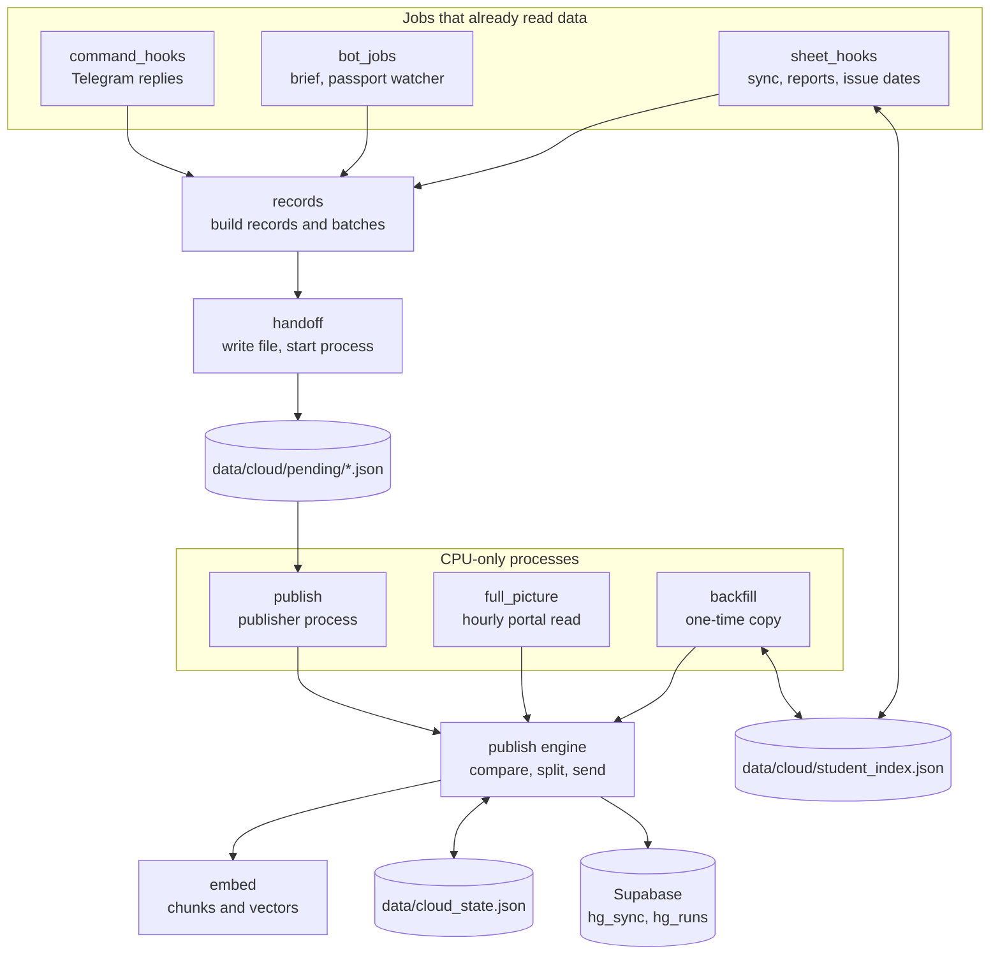

# Supabase publishing programs (`src/cloud/`)

This document is the reference for the eleven Python files in `src/cloud/`. It belongs to the program index in [../PYTHON_PROGRAMS.md](../PYTHON_PROGRAMS.md).

Related documents: [../DATA_FLOW.md](../DATA_FLOW.md) (where each piece of data goes), [../JEANNIE_APP.md](../JEANNIE_APP.md) (the app that reads what these programs write), [tests.md](tests.md) (the nine `tests/test_cloud*.py` files), [../reference/13_SUPABASE_PUBLISHING.md](../reference/13_SUPABASE_PUBLISHING.md) and [../reference/03d_FILES_src_cloud.md](../reference/03d_FILES_src_cloud.md) (older long-form references).

Code is cited as `path:line`. Paths are relative to the repository root.

## 1. What this group of programs does

The bot reads the agency's admin portal, checks documents and builds reports. These programs write a second copy of all of that to the owner's Supabase project. Supabase is a hosted Postgres database with an HTTPS API. The copy lets Jeannie, the owner's assistant app, answer questions while the bot's PC is off (`src/cloud/__init__.py:3-7`).

Each piece of knowledge is sent in three forms (`src/cloud/__init__.py:3-5`):

1. a structured row (the parsed fields),
2. a plain-text form of the same facts,
3. embeddings of that text: lists of 384 numbers made by the model `thenlper/gte-small`, used for search by meaning.

Google Drive, Google Sheets, the `.xlsx` reports and Telegram are not changed by this layer. A failure when writing to Supabase is one log line and the job carries on (`src/cloud/__init__.py:5-7`, `src/cloud/publish.py:30-34`).

Nothing is sent to Supabase unless three settings are set: `SUPABASE_URL`, `SUPABASE_SECRET_KEY` and `CLOUD_PUBLISH_ENABLED` (`src/cloud/publish.py:103-107`). With publishing off, no job builds or hands over anything (`src/cloud/handoff.py:123-124`). The one exception is a dry run of the publisher process, the backfill or the full picture. A dry run skips this check, sends nothing, and writes the request bodies it would send to a local folder (`src/cloud/publish.py:461-462`, `:653-654`, `:883`; `src/cloud/backfill.py:638`; `src/cloud/full_picture.py:134`; see section 4, "Dry run"). Whether the three settings are set on the production PC cannot be told from the code.

### 1.1 Terms used in this document

| Term | Meaning |
|---|---|
| Portal | The agency's admin website the bot reads (pages such as `students.php`). |
| uid | The portal's numeric id of a student. |
| HNG id | The student id the portal prints, starting with `HNG-`. |
| Record | One JSON object describing one thing the bot read: a student, a payment verification, one page of OCR text, one report. Built by `records.make` (`src/cloud/records.py:297`). |
| Kind | The type of a record, for example `student` or `doc_verdict`. There are 26 kinds (`src/cloud/records.py:41-47`). |
| Key | The stable identity of a record inside its kind, for example the uid. |
| Scope | The unit that one whole read covers, for example `all`, one ISO day, or one passport number. Deletions happen per (kind, scope). |
| Complete read | A read that provably saw everything in its scope (every page, counts matched). Only a complete read may delete records in Supabase. |
| Batch | The records of one read, with its kind, scope and `complete` flag. Built by `records.batch` or `records.batches` (`src/cloud/records.py:338`, `:361`). |
| Content hash | sha256 of a record's kind, key, scope, data and text (`src/cloud/records.py:164-167`). A record is sent again only when this changes. |
| Hash state | The local file `data/cloud_state.json`. It remembers the hash, scope and read time of every record Supabase accepted. |
| Handoff | One JSON file in `data/cloud/pending/` holding a job's batches, plus the start of a separate process that publishes it (`src/cloud/handoff.py:118`). |
| Publisher process | `python -m src.cloud.publish --from <handoff file>`. It embeds and uploads one handoff file. |
| Run | One row in the Supabase table `hg_runs` that describes one publisher run: job name, start, end, status, counts. |
| `hg_sync` | The Supabase function (RPC) that takes rows for one (kind, scope). It writes a row, and replaces that row's chunks, only when the row's `content_hash` differs from the stored one. When given the full key list (`p_all_keys`), it deletes the scope's other rows, except for kind `field_correction`, which it never deletes. It is defined in the Jeannie app's migration (`extras/jeannie-app/supabase/migrations/20260929030000_hangeul_context.sql:137-240`); see section 1.8. |
| Chunk | A piece of a record's text, at most 350 words, embedded as one vector. |
| Quiet window | A time of day when a scheduled job reads the portal: 18:00-18:10, 08:25-08:40, 09:00-09:10 (`src/cloud/backfill.py:57`). The bulk readers do not start then. |
| Mock mode | The bot's demo mode (setting `MOCK_MODE`), in which the portal client gives demo figures. Only three paths check it and publish nothing then: the hourly full picture, the Telegram command hooks, and the brief and watcher handoffs. The sheet jobs' hooks and the backfill do not check it (section 1.6). |

### 1.2 How the pieces fit



Two paths lead to Supabase:

1. **Handoff path.** A job that already read something (a Telegram command, the daily brief, the passport watcher, a sheet job) builds records, writes one handoff file and starts the publisher process. The job does not wait for it. This path exists for three reasons: the bot process must keep its event loop free, a button report must print its answer and exit, and these processes can have torch loaded on the GPU, where the embedding model must not run (`src/cloud/handoff.py:3-5`, `src/cloud/sheet_hooks.py:16-19`, `src/cloud/bot_jobs.py:16-19`).
2. **Direct path.** The hourly full picture and the one-time backfill are started as CPU-only processes. They read the portal themselves and call the publish engine in their own process (`src/cloud/full_picture.py:158`, `src/cloud/backfill.py:662`).

### 1.3 The programs

| Program | Lines | One-line purpose | How it is started |
|---|---|---|---|
| `src/cloud/__init__.py` | 24 | Package description and `JOBS`, the tuple of job names. | Imported with the package. |
| `src/cloud/records.py` | 1491 | One builder function per record kind; filler-word rules; batch grouping; completeness checks. | Library. Imported by the other cloud modules. |
| `src/cloud/publish.py` | 938 | The publish engine (hash state, `hg_sync` calls, `hg_runs` rows, body splitting, lock, dry run) and the publisher process. | `python -m src.cloud.publish --from <file> [--timeout SECONDS] [--dry-run]`, started by `handoff.spawn`. Also a library. |
| `src/cloud/backfill.py` | 684 | One-time full copy to Supabase, and the `collect_*` readers reused by the full picture. | `python -m src.cloud.backfill [flags]`, by hand. Also a library. |
| `src/cloud/sheet_hooks.py` | 470 | What the four sheet jobs hand over as their last step. | Called by `src/sheets/auto_sync.py`, `missing_report.py`, `stage_report.py`, `passport_issue.py`. |
| `src/cloud/command_hooks.py` | 357 | What Telegram command and free-text handlers hand over after their reply. | Called by `src/bot/telegram_bot.py`, `src/bot/ask.py`, `src/bot/performance.py`. |
| `src/cloud/bot_jobs.py` | 309 | What the 18:05 brief and the passport watcher hand over. | Called by `src/bot/scheduler.py`, from the brief and the watcher. Both jobs need `ENABLE_SCHEDULED_REPORTS` on and `TELEGRAM_ADMIN_CHAT_ID` set (section 8). |
| `src/cloud/embed.py` | 298 | Text chunking and gte-small embeddings on the CPU; the CPU-only process guard; a test stub. | Library. Used inside the three CPU-only processes. |
| `src/cloud/handoff.py` | 144 | Writes the handoff file and starts the publisher process without waiting. | Library. Called by the three hook modules and by `publish.publish`. |
| `src/cloud/full_picture.py` | 204 | Hourly read of the main portal pages (GET only) and publish. | `python -m src.cloud.full_picture [--dry-run]`, started every 60 minutes by the bot's scheduler, only when `ENABLE_SCHEDULED_REPORTS` is on (section 11). |
| `src/cloud/student_index.py` | 132 | Local index passport number -> (uid, HNG id). | Library. Called by `sheet_hooks` and `backfill`. |

Total: 5051 lines. None of these files has a copy at the repository root.

### 1.4 Job names

Every run row in `hg_runs` carries a job name. The nine names are listed in `JOBS` (`src/cloud/__init__.py:23-24`).

| Job name | Sent by | Where the name is set |
|---|---|---|
| `portal_sync` | The 15-minute portal sync (`src/sheets/auto_sync.py`). | `src/cloud/sheet_hooks.py:41` |
| `missing_report` | The 09:05 missing-information report and the `/missing` button. | `src/cloud/sheet_hooks.py:42` |
| `stage_report` | The `/stage` button report. | `src/cloud/sheet_hooks.py:43` |
| `issue_refresh` | The 08:30 passport issue-date refresh. | `src/cloud/sheet_hooks.py:44` |
| `command` | Telegram commands and free-text answers. Also the default. | `src/cloud/command_hooks.py:68`, `src/cloud/publish.py:96` |
| `daily_brief` | The daily brief. | `src/bot/scheduler.py:278` |
| `passport_watcher` | The passport watcher. | `src/bot/scheduler.py:243` |
| `full_picture` | The hourly full picture. | `src/cloud/full_picture.py:57` |
| `backfill` | The one-time copy. | `src/cloud/backfill.py:662` |

### 1.5 Which program sends which kind

"Complete" means the batch may delete records. "Partial" means it never deletes.

| Kind | Sent by |
|---|---|
| `student` | Full picture and backfill (complete); passport watcher (complete); commands that read every page (complete); `/students`, page 1 only (partial). |
| `verification` | Full picture, backfill and whole-list commands (per stamp day); `/verified` (one day); the brief (one day). |
| `student_export` | Portal sync; backfill. |
| `student_documents` | Portal sync; backfill. |
| `student_progress` | Backfill (complete only when every page was read); `/stage` (partial). |
| `student_profile` | Issue-date refresh; passport watcher; `/passports` and the cross-check report. |
| `consultation`, `consultation_day` | Full picture (yesterday and today); backfill (every day); `/inquiries`; the brief. |
| `consultation_totals` | Full picture; backfill; `/inquiries`; the brief. |
| `pending_payment` | Full picture; backfill; the free-text "pending" answer. |
| `window_application` | Full picture; backfill. |
| `dashboard_fact` | Full picture and backfill (tiles and cards); free-text dashboard answers (tiles and cards); `/stats`, `/admitted` and the brief (tiles only, partial). |
| `calendar_item` | Full picture; backfill; `/calendar` and the free-text calendar answer. Always partial. |
| `consultant_performance` | Full picture; backfill; the performance commands. |
| `passport_audit` | Passport watcher (complete over the scans listed); `/passports` and the cross-check report (partial). |
| `passport_alert` | Passport watcher; backfill. |
| `passport_issue` | Issue-date refresh; backfill. |
| `doc_verdict`, `field_check`, `doc_page_text`, `doc_check`, `field_correction` | Portal sync (after the document check); backfill. |
| `report`, `report_section` | The brief; the missing-information report (daily job, and the newest workbook in the backfill); `/missing`; `/stage`; the sync summary; `/inquiries`; the DOCUMENT CHECK and FIELD CHECK reports (portal sync and backfill). |
| `brief_fact` | The brief. |
| `notification` | Portal sync, missing-information report, passport watcher. |

### 1.6 Settings read (names only)

| Setting | Default in `src/config.py` | Used for |
|---|---|---|
| `SUPABASE_URL` | empty (`src/config.py:86`) | Base URL of the REST calls. Must start with `https://` (`src/cloud/publish.py:405`). |
| `SUPABASE_SECRET_KEY` | empty (`src/config.py:87`) | Sent as the `apikey` header and as the bearer token (`src/cloud/publish.py:343-347`). Never logged. |
| `CLOUD_PUBLISH_ENABLED` | `False` (`src/config.py:88`) | The on/off flag. |
| `CLOUD_EMBED_MODEL` | `thenlper/gte-small` (`src/config.py:91`) | The embedding model. |
| `CLOUD_EMBED_REVISION` | a pinned 40-character revision id (`src/config.py:92`) | The model revision. Each chunk is labelled `<model>@<revision>`. |
| `REPORT_TIMEZONE` | `Asia/Dhaka` (`src/config.py:58`) | The zone of every `read_at` time and of the quiet windows (`src/cloud/records.py:65-68`). |
| `MOCK_MODE` | `True` (`src/config.py:21`) | The bot's demo mode. The full picture stops at once when it is on (`src/cloud/full_picture.py:137-139`). The command hooks and the brief and watcher handoffs read the portal client's copy of it, `admin_client.mock_mode` (`src/scraper/client.py:104`), and keep or hand over nothing when it is on (`src/cloud/command_hooks.py:82`; `src/cloud/bot_jobs.py:62-64`, `:75-77`). `sheet_hooks.hand_over` checks only `handoff.enabled()` (`src/cloud/sheet_hooks.py:65-74`), and the backfill's `main` does not check it at all (`src/cloud/backfill.py:614-674`). So with `MOCK_MODE` on and publishing on, the four sheet jobs still hand over what they read, and the backfill still runs; its disk part (`results.json`, the OCR caches, the watcher memory, the issue dates, the missing-information report) does not use the portal client at all. |
| `ENABLE_SCHEDULED_REPORTS` | `True` (`src/config.py:59`) | Read by the scheduler, not by `src/cloud/`. When it is false, `setup_scheduler` returns before registering any job (`src/bot/scheduler.py:421-423`): no hourly full picture, no brief, no passport watcher, and none of the three scheduled sheet jobs (15-minute portal sync, 09:05 report, 08:30 issue-date refresh). |
| `TELEGRAM_ADMIN_CHAT_ID` | empty (`src/config.py:46`) | Read by the scheduler, not by `src/cloud/`. When it is empty, the passport watcher and the brief return at their start, before any handoff (`src/bot/scheduler.py:164-166`, `:251-254`). |
| `DOCS_ROOT` | empty, meaning `<bot folder's parent>/VERIFIED STUDENT DOCUMENTS` (`src/config.py:96`, `:101-102`) | Student document folders, used only to match OCR cache versions. |
| `VERIFICATION_DIR` | empty, meaning `<bot folder>/data/verification` (`src/config.py:99`, `:111-112`) | `results.json` and the `text/` OCR caches. |

### 1.7 Local files written or read by this layer

Paths are relative to the bot folder (`BOT_ROOT`).

| Path | Written by | Read by | Contents |
|---|---|---|---|
| `data/cloud_state.json` (and `.part`) | `publish.save_state` (`src/cloud/publish.py:164`) | `publish.load_state`, `known_scopes`, `known_keys` | The hash state. Holds record keys, hashes, scopes and read times. No record data. Keys can contain passport numbers and names (see section 3, "Things to know"). |
| `data/cloud_state.json.bak` | `backfill.main` with `--ignore-state` (`src/cloud/backfill.py:648-654`) | nothing | The previous hash state. |
| `data/cloud/publish.lock` | `publish._os_lock` (`src/cloud/publish.py:215`) | same | An operating-system file lock. One publisher at a time. |
| `data/cloud/pending/<YYYYmmdd-HHMMSS-ffffff>-<job>.json` (and `.part`) | `handoff.write` (`src/cloud/handoff.py:70`) | `publish.process_file`, which deletes it (`src/cloud/publish.py:871`) | One job's batches as full records in clear text. |
| `data/cloud/dry_run/<stamp>-<job>-<8 chars>/<NNNN>-<label>.json` | `Run.write` (`src/cloud/publish.py:316`) | the operator | The exact request bodies a dry run would send, embeddings included. |
| `data/cloud/student_index.json` (and `.part`) | `student_index.remember` (`src/cloud/student_index.py:112`) | `student_index.load` | Passport number -> uid and HNG id. |
| `hangeul_sync.log` | Standard output and standard error of the publisher process (`src/cloud/handoff.py:47`, `:104-105`, `:111`) and of the full picture (`src/bot/scheduler.py:401-405`) | the operator | Log lines of logger `hangeul.cloud`. |
| `data/auto_sync.lock` | the portal sync | `backfill.quiet_reason` (`src/cloud/backfill.py:74-80`), read only | The process id of a running portal sync. |
| `<verification dir>/results.json` (default `data/verification/results.json`; setting `VERIFICATION_DIR`) | the document check (`src/verify/auto_verify.py:47-48`) | `backfill.collect_results` (`src/cloud/backfill.py:334`); `sheet_hooks.store_readable`, only to test that it parses (`src/cloud/sheet_hooks.py:149-157`) | The document-check store: verdicts, field checks, corrections. |
| `<verification dir>/text/<passport>.json` | the document check's OCR (`src/verify/auto_verify.py:49`) | `backfill.collect_page_texts` (`src/cloud/backfill.py:384-388`); `sheet_hooks._page_texts` (`src/cloud/sheet_hooks.py:251-257`) | The OCR text cache of one passport's documents. |
| `data/alerted_passport_issues.json` | the passport watcher (`src/bot/scheduler.py:31`) | `backfill.collect_watcher` (`src/cloud/backfill.py:407`) | The watcher's memory (version 2). |
| `data/passport_issue.json` | the issue-date refresh (`src/sheets/passport_issue.py:34`) | `backfill.collect_issue_dates` (`src/cloud/backfill.py:425`) | Passport issue dates by passport number. |
| `data/missing_reports/missing_information_YYYY-MM-DD.xlsx` | the missing-information report (`src/sheets/missing_report.py:43`) | `backfill.collect_missing_report`, newest file only, first sheet from row 2 (`src/cloud/backfill.py:440-451`) | The report's rows. |
| Student document folders, `<DOCS_ROOT>/<program>/<name (passport)>/` (outside the bot folder by default; setting `DOCS_ROOT`) | the portal sync's document download (`src/sheets/auto_sync.py:281`) | `backfill._current_files` (`src/cloud/backfill.py:368`); `sheet_hooks._folder_files`, on the folders that `doc_verifier.student_folders()` lists, which also cover `KONYANG_ROOT` (`src/cloud/sheet_hooks.py:234-243`, `:303-304`; `src/verify/doc_verifier.py:40`) | Only file names, sizes and modification times are read, to pick the matching OCR cache version. |

### 1.8 Supabase endpoints called

All calls are made by `src/cloud/publish.py`. The base URL is `SUPABASE_URL` with a trailing `/` removed. Redirects are not followed. Each call has a 30-second timeout (`src/cloud/publish.py:342-347`, `:92`).

| Call | When | Body | Citation |
|---|---|---|---|
| `POST /rest/v1/hg_runs` with `Prefer: return=minimal` | Start of a run. | `{"id": <uuid4>, "job", "started_at", "counts": {}}` | `src/cloud/publish.py:400`, `:409` |
| `POST /rest/v1/rpc/hg_sync` | For each publish of one (kind, scope), unless nothing changed, no key is gone, and the read is partial or its key-list digest equals that of the last complete publish (`src/cloud/publish.py:736`). So a complete read also calls it with no changed row when a key it held is gone or its key list changed (for example the watcher's `passport_audit` batch). Changed rows are spread over one or more calls (section 4.3, steps 10-11). With no changed row there is one call with an empty `p_rows` (`:758`, `:614`). | `{"p_run", "p_kind", "p_scope", "p_rows": [...], "p_all_keys": [...] or null}` | `src/cloud/publish.py:759`, `:769`, `:780` |
| `PATCH /rest/v1/hg_runs?id=eq.<run id>` with `Prefer: return=minimal` | End of a run. | `{"finished_at", "status", "counts", "note"}` | `src/cloud/publish.py:430`, `:442` |

The bot calls nothing else on Supabase. The table `hg_records` is named only in an error message (`src/cloud/publish.py:750`). The function `hg_match` is named only in a docstring (`src/cloud/student_index.py:4`). Both, and the tables behind `hg_sync`, are defined on the app side in [`extras/jeannie-app/supabase/migrations/20260929030000_hangeul_context.sql`](../../extras/jeannie-app/supabase/migrations/20260929030000_hangeul_context.sql); see [../JEANNIE_APP.md](../JEANNIE_APP.md).

**What `hg_sync` does on the server.** Line numbers below are in that migration file.

1. It refuses the whole call when `p_kind` or `p_scope` is empty, `p_rows` is not a JSON array, there are more than 200 rows, a row lacks a key, a `data` object, `content`, `content_hash`, `source` or `read_at`, a chunk embedding does not have 384 numbers, or the chunks of the call name more than one `embed_model` (`:159-196`). The migration's comment calls the call "all or nothing": one invalid row rejects the whole call (`:134-135`).
2. For each row it inserts on (kind, key). When the row exists, it is updated only when the stored `content_hash` differs (`:198-216`). An unchanged row is counted as `unchanged` and its chunks are left alone (`:218-222`). A written row has its chunks deleted and inserted again from `chunks` (`:223-229`).
3. When `p_all_keys` is not null and the kind is not `field_correction` (the one kind in `append_only`, `:149`), it deletes every row of that (kind, scope) whose key is not in the list (`:232-235`). The chunks of a deleted row go with it (`on delete cascade`, `:72`).
4. It returns `{"upserted", "deleted", "unchanged"}` (`:238`).

A trigger writes every insert, every update that changed `content_hash`, and every delete to the table `hg_changes`, the change log for device sync (`:99-128`). The migration's comment says the bot never writes that table (`:75`), and no code in `src/cloud/` names it.

---

## 2. `src/cloud/__init__.py`

**Purpose.** The package docstring and one constant, `JOBS` (`src/cloud/__init__.py:23-24`).

**How it is run or who calls it.** It runs when any `src.cloud` module is imported. `JOBS` is imported by `tests/test_cloud_all.py:38`, which checks that every job name the hooks use is in the tuple (`tests/test_cloud_all.py:90`). No module in `src/` reads `JOBS`.

**What it reads.** Nothing.

**What it writes.** Nothing.

**Why it exists.** It states the contract: the database schema belongs to the Jeannie app's repository, and this package writes only through the `hg_sync` function and the `hg_runs` table (`src/cloud/__init__.py:18-19`).

**Main functions and classes.**

| Name | Line | What it does |
|---|---|---|
| `JOBS` | 23 | Tuple of the nine `hg_runs.job` values: `portal_sync`, `passport_watcher`, `daily_brief`, `missing_report`, `issue_refresh`, `stage_report`, `command`, `backfill`, `full_picture`. |

**Numbers that matter.** Nine job names.

**Things to know.**

- The comment says the Supabase side does not check job names (`src/cloud/__init__.py:22`). The cloud modules use their own string constants, so `JOBS` is documentation that a test keeps in step.
- The docstring's module list names five modules (`records`, `embed`, `publish`, `handoff`, `backfill`). The other five (`sheet_hooks`, `command_hooks`, `bot_jobs`, `full_picture`, `student_index`) are not listed there.

---

## 3. `src/cloud/records.py`

**Purpose.** Turns what a portal reader or a report builder already returned into records. There is one builder per kind. Nothing is parsed again and nothing is filled in (`src/cloud/records.py:13-15`). The file also defines how records are grouped into batches, and the checks that decide whether a read counts as complete.

**How it is run or who calls it.** Library only. No command line. Importers: `src/cloud/backfill.py:49`, `src/cloud/bot_jobs.py:40`, `src/cloud/full_picture.py:51`, and by local imports inside functions in `publish.py`, `sheet_hooks.py`, `command_hooks.py` and `handoff.py`.

**What it reads.**

- Setting `REPORT_TIMEZONE` (`src/cloud/records.py:65-68`).
- Helper functions from other packages, imported inside the functions that need them: `src.dates.parse_portal_date`, `parse_stamp`, `yearless_day_problem`; `src.sheets.passport_issue.passport_key`; `src.scraper.parsers.payment_text`, `verification`, `_label_key`; `src.sheets.progress_builder.normalize_phone`; `src.sheets.auto_sync._row_key`; `src.bot.performance._range_dates`; `src.scraper.client.PERFORMANCE_PERIODS`.
- No file, no network, no portal, no Supabase.

**What it writes.** Nothing. Every function returns dicts or lists.

**Why it exists.** It gives every piece of the bot's knowledge one stable identity (kind and key), one deletion unit (scope), one searchable text and one hash. Supabase rows are then rewritten only when something changed. Staff do not use it directly; Jeannie reads the result.

### 3.1 The record

`make` (`src/cloud/records.py:297-313`) returns a dict with these fields:

| Field | Content | In the hash |
|---|---|---|
| `kind`, `key`, `scope` | What the record is and the unit a complete read covers. | yes |
| `data` | Every field the reader parsed, with the reader's own keys. | yes |
| `content` | The text form, built from fields that have a value. | yes |
| `content_hash` | sha256 hex of the canonical JSON of `{kind, key, scope, data, content}` (`src/cloud/records.py:160-167`). Canonical means sorted keys, compact separators, non-ASCII kept, no NaN. | - |
| `student_uid`, `student_hng_id`, `student_name`, `passport_no`, `day` | Columns for filtering. `None` when not known. `student_uid` is an integer or `None`. `day` is `YYYY-MM-DD` or `None`. | no |
| `source` | Where the record came from, for example `students.php` or `results.json`. | no |
| `read_at` | When the bot read it: ISO time with the zone offset of `REPORT_TIMEZONE`. | no |

The columns outside the hash are derived only from hashed fields. The reason is that Supabase rewrites a row only when its hash changes (`src/cloud/records.py:23-27`).

### 3.2 The 26 kinds

`CLOUD_KINDS` is at `src/cloud/records.py:41-47`. "Columns" lists which of the five filter columns the builder sets. Line numbers in the "Builder" column are in `src/cloud/records.py`.

| Kind | Key | Scope | What `data` holds | Columns | `source` | Builder |
|---|---|---|---|---|---|---|
| `student` | uid | `all` | Every field of a `students.php` list record except `sl`, `details_text`, `id` and keys starting with `_`; the `details` object; `blank_on_portal`. | uid, HNG id, name, passport, day (applied date) | `students.php` | `student` (`:474`) |
| `pending_payment` | uid | `all` | The same student fields plus `badge`. | uid, HNG id, name, passport, day | `students.php?status=pending` | `pending_payments` (`:501`) |
| `verification` | uid | ISO day of the verification stamp | The result of `parsers.verification()` plus `day`. | uid, HNG id, name, day | `students.php` | `verification` (`:540`) |
| `student_documents` | uid | `all` | The verified-documents list cells plus `files` (file names). | uid, name, passport | `students.php?source=direct&filter_docs=verified` | `student_documents` (`:610`) |
| `student_export` | The sheet sync's row key (`Student ID:...`, else `Passport No:...`, else `NAME:...`) | `all` | Every CSV column, trimmed; `stale_columns`. | HNG id, name, passport, day (`Applied On`) | `students.php?export=csv` | `student_exports` (`:637`) |
| `student_profile` | uid | the uid | Every filled form field of `student_edit.php`, by form name. | uid, name, passport | `student_edit.php` | `student_profile` (`:680`) |
| `student_progress` | uid | `all` | `pct`, `stage`, `status`; `student_id` and `student_name` when known. | uid, HNG id, name | `progress.php` | `student_progress` (`:698`) |
| `consultation` | The request's portal id; else sha1 of name + contact + received | Received ISO day | Every row field. | name, day | `consult_requests.php?status=all&from=<day>&to=<day>` | `consultation` (`:731`) |
| `consultation_day` | ISO day | `all` | `day`, `counts`, `listed`, `complete`. | day | same as above | `consultation_day` (`:769`) |
| `consultation_totals` | `all` | `all` | `counts`. | none | `consult_requests.php?status=file_opened` | `consultation_totals` (`:784`) |
| `consultant_performance` | `<period>\|<first ISO day>\|<consultant name>` and `<period>\|<first ISO day>\|summary` | `<period>\|<first ISO day>` | Row: period, range, first and last day, name, rank and six figures, `top`, `extra`. Summary: tiles, top card, help texts, count. | day (last day of the range) | `consult_performance.php?period=<period>` | `consultant_performance` (`:847`) |
| `window_application` | `<student>\|<window>` | `all` | The row fields. | name | `window_applications.php?status=under_review` | `window_applications` (`:960`) |
| `dashboard_fact` | `<group>\|<label>` | `all` | `group`, `label`, `value`, `text`, `note`. | none | `index.php` | `dashboard_facts` (`:987`) |
| `calendar_item` | The portal's event id; else `t:` + sha1 of title, start and note | `all` | The item fields. | day (end, else start) | `calendar.php` | `calendar_items` (`:1027`) |
| `passport_audit` | `<uid>\|<scan file name>` | `all` | `uid`, `file`, `result`, `form`, `student_id`, `student_name`. | uid, HNG id, name, passport | `view_doc.php + student_edit.php` | `passport_audit` (`:1058`) |
| `passport_alert` | `<uid>\|<scan file name>` | `all` | The watcher memory entry plus `file`. | uid, HNG id, day (`checked`) | `alerted_passport_issues.json` | `passport_alerts` (`:1100`) |
| `passport_issue` | Passport number | `all` | `passport_no`, `issue_date`. | passport | `passport_issue.json` | `passport_issues` (`:1127`) |
| `doc_verdict` | `<passport>\|<document>` | The passport | One document row of `results.json` plus `student`, `program`, and `uid`, `student_id` when known. | uid, HNG id, name, passport, day (`checked`) | `results.json` | `doc_verdicts` (`:1164`) |
| `doc_check` | Passport number | `all` | `student`, `program`, `verdict`, `checked`, `document_rows` (verdict counts), `field_rows` (result counts). | uid, HNG id, name, passport, day | `results.json` | `doc_checks` (`:1186`) |
| `field_check` | `<passport>\|<field>` | The passport | One field row of `results.json` plus `student`, `program`. | uid, HNG id, name, passport, day | `results.json` | `field_checks` (`:1222`) |
| `field_correction` | sha1 of the entry's canonical JSON | `all` | The correction entry as stored. | uid, HNG id, name, passport, day (`noticed`) | `results.json` | `field_corrections` (`:1255`) |
| `doc_page_text` | `<passport>\|<file>\|p<page>` or `<passport>\|<file>\|all` | The passport | `file`, `page`, `pages`, `size`, `mtime`, `sideways`, `words`. The OCR text is in `content`. | uid, HNG id, name, passport | `verification/text/<passport>.json` | `doc_page_texts` (`:1297`) |
| `report` | `<report name>\|<ISO day or run time>` | The report name | `report`, `when`, `facts`. The text as sent is in `content`. | day | The report name or a file name | `report` (`:1360`) |
| `report_section` | `<report name>\|<when>\|<n>` | `<report name>\|<when>` | `report`, `when`, `n`, `heading`, `lines`. | day | as `report` | `report_sections` (`:1374`) |
| `brief_fact` | `<ISO day>\|<n>` | The ISO day | `day`, `n`, `fact`. | day | `brief` | `brief_facts` (`:1390`) |
| `notification` | sha1 of the text and the send time | ISO day sent | `text`, `sent_at`, `source`. | day | The source given, else `telegram` | `notification` (`:1399`) |

A repeated key inside one list gets `#2`, `#3` and so on (`unique_keys`, `src/cloud/records.py:316-335`).

Report names in use (the scope of kind `report`): `brief` (`src/cloud/bot_jobs.py:194`), `missing_report` (`src/cloud/records.py:1425`), `missing_program:<KEY>` (`src/cloud/sheet_hooks.py:375`), `stage_report:<KEY>:<INTAKE>` (`src/cloud/sheet_hooks.py:411`), `sync_summary` (`src/cloud/sheet_hooks.py:201`), `inquiries_report` (`src/cloud/command_hooks.py:321`), `document_check` (`src/cloud/records.py:1457`), `field_check` (`src/cloud/records.py:1489`).

### 3.3 When a read counts as complete

| Kind | Rule | Citation |
|---|---|---|
| `student` | The reader read every page of `students.php` (it raises otherwise). | `src/cloud/backfill.py:97`, `src/cloud/command_hooks.py:269`, `src/cloud/bot_jobs.py:291` |
| `verification` | Every "Payment verified by" stamp could be read. Day scopes inside the last-year window with no record now are then emptied. | `src/cloud/backfill.py:100-102`, `src/cloud/command_hooks.py:270-273` |
| `student_export` | The header has `Student ID` and `Full Name`, and the row count is at least 90 % of the students the list counts. The backfill counts the list it read in the same run; the portal sync counts the `student` keys in the hash state (section 6). | `src/cloud/records.py:665-677`, `src/cloud/backfill.py:523`, `src/cloud/sheet_hooks.py:180` |
| `student_documents` | Complete whenever the verified-documents list was read. In the backfill even a list with no rows is complete (and empties the scope); the portal sync sends the batch only when the list has at least one student. | `src/cloud/backfill.py:132`, `src/cloud/sheet_hooks.py:189-195` |
| `student_progress` | Backfill: complete only when every progress page was read without an error. `/stage`: never, because one program and intake is not every student. | `src/cloud/backfill.py:146-151`, `src/cloud/sheet_hooks.py:393-394` |
| `student_profile` | Complete per uid: each uid is its own scope holding one record. | `src/cloud/sheet_hooks.py:435`, `src/cloud/bot_jobs.py:302`, `src/cloud/command_hooks.py:355` |
| `consultation_totals` | Always complete when the totals were read. | `src/cloud/backfill.py:212`, `src/cloud/command_hooks.py:210`, `src/cloud/bot_jobs.py:175` |
| `pending_payment` | With a badge: rows saying Pending equal the badge. Without a badge: some row says Pending, or the list shows its own empty state. | `src/cloud/records.py:527-537` |
| `window_application` | The page has no pager, and it is an empty table or has a row under review. | `src/cloud/records.py:979-984` |
| `dashboard_fact` | All seven groups are present: `Admissions flow`, `Direct / legacy pipeline`, `At a glance`, `Needs attention`, `Application pipeline`, `Applications by program`, `Top universities`. | `src/cloud/records.py:1016-1024` |
| `consultation` | The portal listed every request of the day (`on_day["complete"]`). | `src/cloud/records.py:761-766` |
| `consultation_day` | Only in a backfill that read every day with no failure. | `src/cloud/backfill.py:202` |
| `consultant_performance` | Right period, readable range, the leaderboard count is present and equals the rows read, every row has a name. | `src/cloud/records.py:923-943` |
| `passport_audit`, `passport_alert` | Complete over a key list taken from the student list (see section 8). | `src/cloud/bot_jobs.py:291-295` |
| `passport_issue` | Complete, except after an issue-date refresh run with `--limit`. The backfill always sends it complete. | `src/cloud/sheet_hooks.py:428`, `src/sheets/passport_issue.py:139`, `src/cloud/backfill.py:434` |
| `doc_verdict`, `field_check`, `doc_page_text` | Complete per passport: each passport sent is a whole scope of its own. The portal sync sends only the passports the document check just checked, plus up to 6 catch-up passports. The backfill sends every passport in `results.json` and every OCR cache file; for `doc_verdict` and `field_check` it also empties each passport scope the hash state knows that `results.json` no longer has (`ALL_SCOPES`, section 5). | `src/cloud/sheet_hooks.py:318-319`, `src/cloud/backfill.py:349-350`, `:395` |
| `doc_check` | Complete (scope `all`). The portal sync sends it only when `results.json` was readable before the check and the store has document entries. | `src/cloud/sheet_hooks.py:321-325`, `src/cloud/backfill.py:351` |
| `report_section`, `brief_fact` | Always complete: the sections (or fact lines) built now are the whole of that report (or day). | `src/cloud/sheet_hooks.py:138`, `:332`, `:349`; `src/cloud/bot_jobs.py:197-198`; `src/cloud/command_hooks.py:324`; `src/cloud/backfill.py:358`, `:458` |
| `calendar_item`, `report`, `notification`, `field_correction` | Never complete. The bot never deletes them. `hg_sync` also never deletes `field_correction`, even when given a key list (section 1.8). | `src/cloud/records.py:1029-1031`, `:1363-1365`; `src/cloud/sheet_hooks.py:144`, `:326` |

**Main functions and classes.**

Values and identity:

| Name | Line | What it does |
|---|---|---|
| `_zone`, `now` | 65, 71 | The business time zone, and the time now in it. |
| `as_read_at` | 75 | A time as ISO text with the zone offset. `None` or unreadable text is now. A time without a zone is taken as the business zone. A date is its midnight. |
| `iso_day` | 96 | A date, datetime, ISO text or portal date text as `YYYY-MM-DD`; `None` when it names no full day. |
| `_long_day` | 117 | `YYYY-MM-DD` as `DD Mon YYYY`. |
| `clean_text` | 125 | Removes NUL characters and repairs unpaired surrogates, so Postgres accepts the text. |
| `jsonable` | 136 | Any value as plain JSON: dates as ISO text, named tuples and mappings as objects, sets as sorted lists, non-finite numbers as `None`. |
| `canonical`, `content_hash`, `sha1` | 160, 164, 170 | Canonical JSON; the sha256 record hash; a sha1 of joined parts used for keys. |
| `_uid` | 174 | A uid as an integer, only when it is digits and 0 < n < 2^31. |
| `_passport`, `_passport_value` | 182, 188 | A passport number as an identity (through `passport_key`), or `""` for a blank or placeholder. |
| `_ids_of` | 285 | (uid, HNG id) from a pair or a dict; `""` for each unknown. |
| `make` | 297 | Builds one cleaned and hashed record. |
| `unique_keys` | 316 | Drops `None`, renames repeated keys to `key#2`, `key#3` and re-hashes them. |
| `batch` | 338 | One (kind, scope) to publish: `{"kind", "scope", "complete", "rows"}` plus optional `all_keys` and `read_at`. |
| `batches` | 361 | One kind with each record in its own scope: `{"kind", "scope": None, "complete", "rows"}` plus optional `scope_range` and `read_at`. |

Filler rules (see "Things to know"):

| Name | Line | What it does |
|---|---|---|
| `FILLER_WORDS`, `STATUS_FIELDS`, `_STATUS_NAME_RE`, `BLANK_ON_PORTAL` | 206-216 | The "no value" words, the fields whose "Pending" is real, and the name of the list of blanked fields. |
| `_filler_key` | 219 | A cell reduced to its case-folded letters and digits. |
| `is_status_field` | 223 | True when a field name contains the word status, stage, result or step, or is in `STATUS_FIELDS`. |
| `is_filler` | 230 | True when a cell holds only a filler word or only punctuation. |
| `_blank_cells`, `_passport_cell`, `_mark_blank`, `_given` | 242, 256, 266, 274 | Blank filler cells, blank a placeholder passport, record the blanked names, return a value or `""`. |
| `FILLED_CONSULTANT`, `FILLED_CALENDAR_KIND`, `FILLED_TILE_GROUP` | 280-282 | Stand-in words written by the readers (`Unassigned`, `Event`, `Dashboard`) that are removed. |

Text helpers: `_sentence` (378), `_paragraph` (383), `_pairs` (387), `_ids` (404), `_joined` (1143), `_uid_text` (1160), `_arrow` (1243), `_was_now` (1249). They join parts that have a value and leave out the rest. `_with_ids` (1148) adds the uid and the HNG id to a passport-keyed record's `data` when they are known, so the record's hash follows them.

Builders and checks:

| Name | Line | What it does |
|---|---|---|
| `student_text` | 416 | The text form of one student list record. It spells out name, ids, program, intake, stage, payment, passport number and expiry, date of birth, gender, mobile, e-mail, guardian contact, parents, address and consultant, then any other details label. |
| `_student_fields` | 459 | A student record as data: volatile fields dropped, fillers blanked. |
| `student`, `students` | 474, 490 | One `student` record; all rows, each uid once. A row without a numeric uid gives no record. |
| `pending_payments` | 501 | `pending_payment` records for rows whose Payment column says Pending. |
| `pending_complete` | 527 | The completeness rule for pending payments. |
| `verification` | 540 | One `verification` record for one day. |
| `verification_window` | 564 | The ISO day range a stamp without a year can be dated in: starts 367 days before today and moves forward while `yearless_day_problem` objects. |
| `verification_day` | 574 | The day a student's payment was verified, from the stamp; `None` when it cannot be dated. |
| `verifications` | 596 | `verification` records for every student whose stamp can be dated. |
| `student_documents` | 610 | `student_documents` records. File names only. |
| `student_exports` | 637 | `student_export` records from CSV rows. |
| `export_complete` | 665 | The completeness rule for the CSV export; returns (complete, reason). |
| `student_profile` | 680 | One `student_profile` record; `None` when the uid is not numeric or the form shows no name. |
| `student_progress` | 698 | `student_progress` records; entries with an `error` are left out. |
| `consultation`, `consultations` | 731, 761 | One `consultation` record; all rows of a day plus the day's `complete` flag. |
| `consultation_day`, `consultation_totals` | 769, 784 | The day's status-tab counts; the all-time counts. |
| `performance_source`, `performance_window`, `performance_scope`, `_performance_title`, `_figures_text` | 807-838 | Helpers for the performance page: source string, range as two ISO days, scope, title, figures text. |
| `consultant_performance` | 847 | One summary record plus one record per leaderboard row. `[]` when the range cannot be read. |
| `performance_complete` | 923 | The completeness rule for the performance page; returns (complete, reason). |
| `consultant_performance_batch` | 946 | The batch for one period, or `(None, [reason])`. |
| `window_applications`, `window_complete` | 960, 979 | Records for rows under review; the completeness rule. |
| `dashboard_facts` | 987 | `dashboard_fact` records. |
| `tile_facts` | 1005 | Converts dashboard tiles to the same fact shape, so one tile is one record whichever job read it. |
| `dashboard_complete` | 1020 | True when all seven groups are present. |
| `calendar_items` | 1027 | `calendar_item` records. |
| `passport_audit` | 1058 | One `passport_audit` record; `None` for an audit that checked nothing. |
| `passport_alerts` | 1100 | One `passport_alert` record per entry of the watcher memory. |
| `passport_issues` | 1127 | One `passport_issue` record per passport with an issue date. |
| `doc_verdicts`, `doc_checks`, `field_checks`, `field_corrections` | 1164, 1186, 1222, 1255 | The document-check records from `results.json`. |
| `_cache_entry` | 1285 | Parses an OCR cache key into (per-page flag, file, size, mtime, max pages). |
| `doc_page_texts` | 1297 | One `doc_page_text` record per readable OCR page. |
| `split_sections` | 1349 | Splits a report text into (first line, other lines) per block between blank lines. |
| `report`, `report_sections` | 1360, 1374 | A whole report; one record per section. |
| `brief_facts` | 1390 | One `brief_fact` per fact line. |
| `notification` | 1399 | One `notification` for a Telegram message a job sent. |
| `missing_report` | 1409 | The missing-information report as a `report` plus one section per incomplete student. |
| `_newest_check_day` | 1430 | The newest `checked` day in a store section. |
| `document_check_report`, `field_check_report` | 1435, 1462 | The content of DOCUMENT CHECK and FIELD CHECK as a `report` plus sections, built from the store. |

**Numbers that matter.**

| Number | Value | Citation |
|---|---|---|
| Kinds | 26 | `src/cloud/records.py:41-47` |
| Export share | 0.9: the CSV export is whole only with at least 90 % of the listed students | `src/cloud/records.py:57` |
| Verification window start | 367 days before today, then forward | `src/cloud/records.py:568-570` |
| uid range | 0 < n < 2^31 | `src/cloud/records.py:177` |
| Filler words | 10 | `src/cloud/records.py:206-207` |
| Status fields listed by name | 5 | `src/cloud/records.py:214` |
| Dashboard groups for a complete read | 7 | `src/cloud/records.py:1016-1017` |
| Performance figures per leaderboard row | 6; the top card shows the first 4 | `src/cloud/records.py:802-804` |
| Audit statuses never published | 4 | `src/cloud/records.py:60` |

**Things to know.**

- **Filler blanking.** A cell is "no value" when its letters and digits, case-folded, are exactly one of `na`, `none`, `null`, `nil`, `pending`, `tbd`, `notavailable`, `notapplicable`, `notprovided`, `emailprotected`, or when it holds only punctuation. The cell becomes `""` in `data`, is left out of the text, and its field name is added to the sorted list `data["blank_on_portal"]` (`src/cloud/records.py:206-271`).
- **"Pending" is kept as data** in a field whose name contains the word status, stage, result or step, or is one of `payment`, `bank certificate`, `bank solvency`, `vin app`, `vin required` (`src/cloud/records.py:214-227`, `:239`).
- Text in another script is a value. `NO`, `NOT YET` and `0` are answers and are kept (`src/cloud/records.py:201-203`).
- `emailprotected` is Cloudflare's stand-in for an e-mail address the page hid and the parser could not decode. A cell holding only that is no value (`src/cloud/records.py:203-205`). The decoding is in `src/scraper/parsers.py`, not here.
- A placeholder passport number is blanked through `passport_key` and named in `blank_on_portal` (`src/cloud/records.py:188-192`, `:256-263`).
- Dropped from a student record: `sl`, `details_text`, `id` and any key starting with `_` (`src/cloud/records.py:52`, `:464-465`). They change without the student changing.
- Export columns `Current Stage`, `Current Status`, `Progress %` stay in `data`, are listed in `data["stale_columns"]` and are left out of the text (`src/cloud/records.py:54`, `:653-655`).
- Passport audits with status `MISSING_DOCUMENT`, `PORTAL_UNREADABLE`, `OCR_UNAVAILABLE` or `ERROR` are not published. They would overwrite a real audit of the same scan (`src/cloud/records.py:58-60`, `:1068-1069`).
- OCR pages whose text is empty or starts with `[unreadable` are left out (`src/cloud/records.py:1282`, `:1335-1336`).
- A consultation without a numeric portal id is keyed by a sha1. Editing its name or contact then looks like a delete plus a new record (`src/cloud/records.py:732-741`).
- The performance scope is `<period>|<first ISO day>`. It does not include the last day, because the portal ends every period at today and the scope would change daily (`src/cloud/records.py:823-829`).
- `field_correction` is keyed by its own data. Its student columns are set only when it is first sent (`src/cloud/records.py:26-27`, `:1257-1260`).
- `doc_page_text` content starts with a one-line heading (`Document <file> of <name> (<passport>), page N:`). `embed.py` repeats that heading on every chunk (`src/cloud/records.py:1341-1342`).
- For an OCR cache file with several versions of the same document, the version used is the one whose size and modification time match the file now in the student's folder; otherwise the newest (`src/cloud/records.py:1320-1321`).
- `passport_alerts` uses the alert's `sent_at`, else `checked`, as `read_at` (`src/cloud/records.py:1121-1122`).
- Keys of kinds `window_application`, `consultant_performance`, `doc_verdict`, `field_check`, `doc_page_text`, `doc_check` and `passport_issue` contain a name or a passport number. A `student_export` key contains a passport number or a name when the row has no Student ID. Keys are stored in clear text in `data/cloud_state.json`.
- `CLOUD_KINDS` (`:41`) is not referenced anywhere else in `src/` or `tests/`. No code checks a kind against it.
- Comments cite rule ids (R1, R2, R4, R5, R8, R11, D10) and "04 §3.3". None of them is defined in `src/cloud/`. The same ids are used in [../reference/09_BLUEPRINT_RULES_AND_LESSONS.md](../reference/09_BLUEPRINT_RULES_AND_LESSONS.md) and [../reference/13_SUPABASE_PUBLISHING.md](../reference/13_SUPABASE_PUBLISHING.md). Section 3.3 of [../reference/04_PORTAL_INTEGRATION.md](../reference/04_PORTAL_INTEGRATION.md) is about `students.php`.

---

## 4. `src/cloud/publish.py`

**Purpose.** The publish engine and the publisher process. It decides which records changed, embeds them, splits them into HTTP calls, calls Supabase, and advances the hash state only for rows Supabase accepted.

**How it is run or who calls it.**

1. As a process:

   ```
   python -m src.cloud.publish --from <handoff file> [--timeout SECONDS] [--dry-run]
   ```

   | Flag | Meaning | Default |
   |---|---|---|
   | `--from` | The handoff file to publish. Required. | - |
   | `--timeout` | The process stops itself after this many seconds. | 3600 |
   | `--dry-run` | Write the request bodies to `data/cloud/dry_run/` and send nothing. | off |

   (`src/cloud/publish.py:911-916`.) It is started by `handoff.spawn` (`src/cloud/handoff.py:109-115`), not by hand in normal use.
2. As a library: `backfill.py` and `full_picture.py` call `publish`, `publish_scopes`, `publish_batches`, `publisher_lock`, `run`, `enabled`, `set_dry_run`, `load_state`, `save_state`. `sheet_hooks.py` calls `known_keys` and `known_scopes`. `handoff.py:41` imports `CHILD_TIMEOUT`, `CLOUD_DIR` and `enabled`.

Startup order when run as a process (`src/cloud/publish.py:60-61`, `:932-938`):

1. Sets `CUDA_VISIBLE_DEVICES=-1` before any other import, so torch cannot see the GPU.
2. Calls `embed.prepare_process()`.
3. Sets logging to INFO and the `httpx` logger to WARNING.
4. Imports itself again as `src.cloud.publish` and runs that module's `main()`. The lock and current-run globals then belong to the real module, not to the `__main__` copy.

**What it reads.**

- Settings `SUPABASE_URL`, `SUPABASE_SECRET_KEY`, `CLOUD_PUBLISH_ENABLED` (`src/cloud/publish.py:106-107`, `:343-344`, `:405`); `BOT_ROOT` from `src/config.py`.
- `data/cloud_state.json` (`src/cloud/publish.py:150`).
- The handoff file given by `--from` (`src/cloud/publish.py:876`).
- `data/cloud/publish.lock` (`src/cloud/publish.py:215-234`).
- Supabase answers: the JSON answer of `hg_sync` with integer fields `upserted`, `deleted`, `unchanged` (`src/cloud/publish.py:786-787`). From an error body only a Postgres `code` matching `^[A-Z0-9]{5,10}$` is read (`src/cloud/publish.py:350-362`).
- The process's peak memory, for a log note: `psapi.GetProcessMemoryInfo` on Windows, `resource.getrusage` elsewhere (`src/cloud/publish.py:483-510`).

**What it writes.**

- Supabase: the three calls in section 1.8.
- `data/cloud_state.json`, through a `.part` file and `os.replace` (`src/cloud/publish.py:164-168`).
- `data/cloud/publish.lock` (created; one byte locked on Windows).
- In a dry run: `data/cloud/dry_run/<YYYYmmdd-HHMMSS>-<job>-<first 8 characters of the run id>/<NNNN>-<label>.json`, with labels `POST-hg_runs`, `rpc-hg_sync-<kind>`, `PATCH-hg_runs` (`src/cloud/publish.py:316-324`, `:402`, `:433`, `:771`).
- Deletes the handoff file when done, sent or not (`src/cloud/publish.py:888-892`).
- Log lines on logger `hangeul.cloud`. A failure is `Supabase publish failed (<kind>): <short reason>` (`src/cloud/publish.py:314`). The end of a run is one INFO line with the counts and the embedding time (`src/cloud/publish.py:446-449`).

**Why it exists.** It keeps the cloud copy correct at low cost: only changed records are embedded and sent, deletions happen only after a whole read, and a Supabase outage never stops a bot job.

### 4.1 The row sent to `hg_sync`

Each row in `p_rows` has: `key`, `student_uid`, `student_hng_id`, `student_name`, `passport_no`, `day`, `data`, `content`, `content_hash`, `source`, `read_at`, `chunks` (`src/cloud/publish.py:538-548`, `:585`).

Each chunk is `{"ord": n, "content": <chunk text>, "embedding": [384 numbers], "embed_model": "<model>@<revision>"}` (`src/cloud/publish.py:580-584`). Each number is written with 8 significant digits (`src/cloud/publish.py:582`).

### 4.2 The hash state file

```
{"version": 1,
 "embed_model": "<model>@<revision>",
 "records": {"<kind>|<key>": {"h": <content_hash>, "s": <scope>, "t": <read_at>}},
 "scopes":  {"<kind>|<scope>": <sha256 of the sorted key list of the last complete publish>},
 "reads":   {"<kind>|<scope>": <read time of the last complete publish>}}
```

(`src/cloud/publish.py:43-48`, `:142-143`, `:192-193`.)

### 4.3 What one `publish(kind, scope, rows, complete)` does

The steps are in `_publish` (`src/cloud/publish.py:678-804`).

1. Clean and re-hash every row (`_normalise`). A row with no key, another kind or scope, no `data` object, no `source`, or a key already seen is left out. If any row was left out, the read is treated as not complete (`:683-687`).
2. Take the publisher lock. Waiting longer than 20 minutes fails this publish (`:691-695`).
3. Load the hash state.
4. If the read is complete but older than the last complete read of this (kind, scope), treat it as not complete. Nothing is deleted (`:700-705`).
5. Pick the changed rows: those whose (hash, scope) differ from the state. A row older than the version last sent is skipped and counted as `older` (`:707-716`).
6. For a complete read, list the keys the state holds in this scope that the read no longer shows. A key that a newer read showed is kept instead (`:720-729`).
7. If nothing changed, nothing is gone, and the read is partial or the scope's key digest is the same as last time, stop here with `skipped = "no changes"`. No `hg_sync` call is made (`:736-738`).
8. If Supabase was already given up on in this run, fail this publish without a call (`:739-742`).
9. If the state's `embed_model` differs from this process's model id, publish nothing and mark the run as down (`:743-753`).
10. Split each changed row's text into chunks, group rows (at most 200 rows and 250 chunks per group), and embed each group (`:755-765`).
11. Split each group into calls of at most 1,000,000 bytes (`_by_size`). `p_all_keys` is set only on the last call of a complete (kind, scope); on every other call it is null (`:766-769`).
12. Before the first call, remove this scope's key digest from the state, and save the state when there was one (`:774-779`). A call that Supabase took but never answered can then not make a later read look already sent.
13. After each accepted call, record each row's hash, scope and read time, and save the state (`:792-793`, `:802-803`).
14. After the last call of a complete read, forget the keys that were deleted, store the new key digest and the read time (`:794-799`). After the last call of a partial read, restore the previous digest (`:800-801`).

A refused or unanswered call ends this publish at once. Rows accepted in earlier calls stay recorded. The others are not recorded, so they are sent again the next time their reader runs.

**Main functions and classes.**

| Name | Line | What it does |
|---|---|---|
| `enabled` | 103 | True only when the three settings are set. |
| `set_dry_run`, `_dry` | 110, 116 | The process-wide dry-run switch and its lookup. |
| `Result` | 121 | The outcome of one publish: `rows`, `changed`, `upserted`, `unchanged`, `deleted`, `calls`, `left_out`, `older`, `older_read`, `ok`, `skipped`, `error`, `delegated`. |
| `_empty_state`, `load_state`, `save_state` | 142, 146, 164 | The hash state: an empty one, load (empty when missing, unreadable or of another version), atomic save. |
| `_split_state_key` | 171 | Splits `<kind>\|<key>` on the first `\|`. |
| `known_scopes`, `known_keys` | 176, 182 | The scopes, or the keys, of a kind in the hash state. Each call reads the file. |
| `_keys_digest` | 192 | sha256 of the sorted, de-duplicated keys joined by newlines. |
| `_when` | 196 | An ISO time with an offset as an aware datetime; `None` otherwise. |
| `_os_lock`, `_os_unlock` | 215, 237 | An OS file lock (`msvcrt.locking` on Windows, `fcntl.flock` elsewhere), polled every 0.25 s. |
| `publisher_lock` | 251 | Context manager around the OS lock. Re-entrant inside one process. Yields whether the lock was got. |
| `_now_iso` | 276 | The time now as a `read_at` text. |
| `Run` | 282 | One job run: job, dry flag, id, counters, failures, the HTTP client. `fail` (307) logs one line, then goes quiet once Supabase is given up on. `write` (316) writes a dry-run file. |
| `current_run`, `current_job` | 330, 334 | The run in progress; its job name or `command`. |
| `_body` | 338 | Compact JSON bytes with no NaN allowed. |
| `_client` | 342 | The `httpx.Client` with the key headers. |
| `_reason` | 353 | A refused response as (short reason, whether to give up on Supabase). |
| `_request` | 375 | One HTTP call; returns (accepted, JSON answer, reason). |
| `_start`, `_finish` | 399, 423 | POST and PATCH of the `hg_runs` row; the end-of-run log line. |
| `_status` | 415 | `failed`, `partial` or `ok`. |
| `run` | 453 | Context manager for one run. A run opened inside another joins the outer one. Yields `None` when publishing is off and it is not a dry run. |
| `_memory_note` | 483 | `", peak memory N.NN GB"` for the log; `""` when it cannot be read. |
| `_normalise` | 518 | Step 1 above. |
| `_groups` | 552 | Step 10: groups of at most 200 rows and 250 chunks. |
| `_embedded` | 566 | Embeds one group and attaches the chunks to the rows. |
| `_by_size` | 589 | Step 11: splits a group into calls under the body limit, leaving room for the key list on the last call. |
| `_can_embed_here` | 634 | True in a CPU-only process or when a test embedder is set. |
| `publish` | 639 | The public entry for one (kind, scope). Never raises. In a process that may not embed, it writes a handoff instead and returns `delegated=True`. |
| `_publish` | 678 | The algorithm of section 4.3. |
| `_model_unavailable` | 807 | Marks this publish and the rest of the run as failed after an `EmbedError`. |
| `publish_scopes` | 817 | One publish per scope found in the rows. With `complete` and a `scope_range`, also publishes empty and complete for every known scope in the range that has no row now. |
| `publish_batches` | 836 | Publishes every batch of a handoff in one run, under the lock. Never raises. |
| `process_file` | 871 | Publishes one handoff file and deletes it. Returns the exit status. |
| `_deadline` | 895 | A timer that logs one line, deletes the handoff file and ends the process with `os._exit(3)`. |
| `main` | 911 | Parses the flags, prepares the process, starts the deadline, calls `process_file`. |

**Numbers that matter.**

| Number | Value | Citation |
|---|---|---|
| `MAX_ROWS` | 200 rows per `hg_sync` call | `src/cloud/publish.py:89` |
| `MAX_CHUNKS` | 250 chunks embedded at a time | `src/cloud/publish.py:90` |
| `MAX_BODY` | 1,000,000 bytes per `hg_sync` body | `src/cloud/publish.py:91` |
| `TIMEOUT` | 30.0 s per HTTP call | `src/cloud/publish.py:92` |
| `LOCK_WAIT` | 1200 s (20 minutes) waiting for another publisher | `src/cloud/publish.py:93` |
| Lock poll | every 0.25 s | `src/cloud/publish.py:234` |
| `CHILD_TIMEOUT` | 3600 s, then the process ends itself | `src/cloud/publish.py:94` |
| `STATE_VERSION` | 1 | `src/cloud/publish.py:95` |
| Embedding precision | 8 significant digits | `src/cloud/publish.py:582` |
| Retries | none | `src/cloud/publish.py:5-7`, `:17-18` |
| Exit codes of `main` | 0 done or publishing off; 1 handoff file unreadable; 2 the process cannot embed; 3 deadline | `src/cloud/publish.py:882-887`, `:924`, `:904` |

The server enforces the 200-row limit as well (`extras/jeannie-app/supabase/migrations/20260929030000_hangeul_context.sql:165-166`).

**Things to know.**

- **Give-up rules** (`_reason`, `src/cloud/publish.py:353-372`; `_request`, `:382-387`). HTTP 401 or 403 ("the key was refused"), 404 ("hg_sync or hg_runs not found: is the Jeannie migration applied?"), any status of 500 or above, a timeout and a connection error all mark the run as down. Later publishes in the run are skipped, with DEBUG lines only. HTTP 409 and other 4xx fail that one publish only.
- **Error reasons hold no server text.** They are built from the HTTP status and the Postgres code only, because a server message can quote a key and keys can hold passport numbers (`src/cloud/publish.py:30-32`).
- **Run status** (`_status`, `src/cloud/publish.py:415-420`). `failed` when there were failures and either Supabase was given up on or the failures are at least as many as the publishes. `partial` when any publish or any read failed. Otherwise `ok`.
- **`hg_runs.counts`** holds `upserted`, `deleted`, `unchanged`, `older`, `sent`, `failed_reads`, `failed`, `by_kind` (`{kind: [upserted, deleted, unchanged]}`), `embedded`, `chunks` (`src/cloud/publish.py:427-429`). `note` is for example "N read(s) failed; M publish(es) failed", or null.
- **A run with no changes still writes its `hg_runs` row.** `run()` posts the row before any publish (`src/cloud/publish.py:469`) and patches it at the end (`:441-442`). Only the `hg_sync` calls are skipped.
- **The start row has no `status` field** (`src/cloud/publish.py:400`). The docstring calls this "status null" (`:39`).
- `_start` refuses a `SUPABASE_URL` that does not start with `https://`; the run is then down (`src/cloud/publish.py:405-408`).
- **Delegation.** In the bot process, or in a job that has torch on the GPU, `publish()` does not publish. It writes a handoff and returns `delegated=True` (`src/cloud/publish.py:661-666`).
- **Model guard.** When the state's `embed_model` differs from this process's model id, nothing is published. The message tells the operator to clear `hg_records` on the Jeannie side and then delete `data/cloud_state.json` (`src/cloud/publish.py:743-753`).
- **Lock timeout in `publish_batches`.** If another publisher holds the lock for over 20 minutes, the whole handoff is dropped with one warning and no `hg_runs` row (`src/cloud/publish.py:845-849`). `process_file` still deletes the file. The records go again when their reader next runs.
- **Oversized row.** A single row whose body would exceed 1,000,000 bytes is sent in a call of its own, with one warning that gives its size and no content (`src/cloud/publish.py:603-607`). A key list that alone exceeds the limit is also sent alone (`:627-629`).
- **Unreadable state file.** `load_state` returns an empty state. Every record is then sent again; Supabase answers "unchanged" for rows it already has (`src/cloud/publish.py:146-158`).
- **Dry run.** It works even when publishing is off (`src/cloud/publish.py:461-462`). It writes the bodies and does not change the hash state (`:770-773`).
- `TRANSPORT` (`src/cloud/publish.py:99`) is a test hook for `httpx.MockTransport`. `None` means the real network.
- `current_run` (`:330`) is not called anywhere in `src/` or `tests/`.
- The hash state stores record keys in clear text, and some keys contain a passport number or a name (section 3, "Things to know").

---

## 5. `src/cloud/backfill.py`

**Purpose.** Two things. First, the one-time copy of everything the bot has read, run by the owner after the feature is switched on. Second, the `collect_*` readers, which return batches plus the reasons of failed reads; the hourly full picture reuses them.

**How it is run or who calls it.**

```
python -m src.cloud.backfill --dry-run
python -m src.cloud.backfill
```

The docstring gives this order: a dry run first, then the real run (`src/cloud/backfill.py:3-4`). It is run by hand. No launcher file and no scheduler job starts it.

| Flag | Meaning | Default |
|---|---|---|
| `--dry-run` | Write the request bodies to `data/cloud/dry_run/`, send nothing. | off |
| `--only <kinds>` | Comma-separated kinds to publish. | every kind |
| `--skip-portal` | Publish only what is on disk. | off |
| `--skip-disk` | Publish only what the portal shows. | off |
| `--days N` | Consultations: only the last N days. | every day since the oldest request |
| `--ignore-state` | Send every record, not only the changed ones. | off |
| `--data-dir <dir>` | Where to read the watcher memory, issue dates and missing reports. | `<bot folder>/data` |
| `--verification-dir <dir>` | Where to read `results.json` and `text/`. | setting `VERIFICATION_DIR` |
| `--docs-root <dir>` | The student document folders. | setting `DOCS_ROOT` |
| `--force` | Run even in a quiet window or during a portal sync. | off |

(`src/cloud/backfill.py:615-628`.)

As a library: `src/cloud/full_picture.py:51` imports it for the `collect_*` functions and `quiet_reason`.

**What it reads.**

Portal pages. All are GET requests through `HangeulAdminClient` with a session of its own; the only other request is the client's login POST (`src/cloud/backfill.py:6-7`).

| Page | Parameters | Becomes | Function | Used by |
|---|---|---|---|---|
| `students.php`, every page | none | `student`, `verification` | `collect_students` (`:88`) | backfill, full picture |
| `progress.php`, one per student, 4 at a time | the uid | `student_progress` | `collect_progress` (`:135`) | backfill |
| `students.php` | `export=csv`, timeout 60 s | `student_export` | `collect_export` (`:107`) | backfill |
| `students.php`, every page | `source=direct&filter_docs=verified` | `student_documents` | `collect_documents` (`:125`) | backfill |
| `consult_requests.php` | `status=all`, `from`, `to` | The count used to find the oldest request day | `_range_count`, `oldest_consultation_day` (`:154`, `:163`) | backfill |
| `consult_requests.php`, one day at a time | the day | `consultation`, `consultation_day` | `collect_consultations` (`:178`) | backfill (every day), full picture (yesterday and today) |
| `consult_requests.php` | `status=file_opened`, as the record's `source` names it (read by `client.read_consultation_totals`) | `consultation_totals` (the all-time status-tab counts) | `collect_totals` (`:206`) | backfill, full picture |
| `students.php`, every page | `status=pending` | `pending_payment` | `collect_pending` (`:215`) | backfill, full picture |
| `window_applications.php` | `status=under_review` | `window_application` | `collect_window_applications` (`:245`) | backfill, full picture |
| `index.php` | timeout 30 s | `dashboard_fact` | `collect_dashboard` (`:265`) | backfill, full picture |
| `calendar.php` | none | `calendar_item` | `collect_calendar` (`:280`) | backfill, full picture |
| `consult_performance.php` | `period=today`, `period=month` | `consultant_performance` | `collect_performance` (`:294`) | backfill, full picture |

Local files:

| File | Becomes | Function |
|---|---|---|
| `<verification dir>/results.json` | `doc_verdict`, `field_check`, `doc_check`, `field_correction`, and the `document_check` and `field_check` reports | `collect_results` (`:329`) |
| `<verification dir>/text/*.json` | `doc_page_text` | `collect_page_texts` (`:377`) |
| `<docs root>/*/*(<passport>)/` (file names, sizes, modification times only) | Picks the matching OCR cache version | `_current_files` (`:362`) |
| `data/alerted_passport_issues.json` (version 2) | `passport_alert` | `collect_watcher` (`:399`) |
| `data/passport_issue.json` | `passport_issue` | `collect_issue_dates` (`:423`) |
| Newest `data/missing_reports/missing_information_YYYY-MM-DD.xlsx`, first sheet from row 2 | `report`, `report_section` | `collect_missing_report` (`:437`) |
| `data/auto_sync.lock` (age and process id) | The "portal sync is running" check | `quiet_reason` (`:66`) |
| `data/cloud/student_index.json` | Student ids for passport-keyed records | through `student_index` (`:589-590`) |

Settings: `VERIFICATION_DIR` and `DOCS_ROOT` through `settings.verification_dir()` and `settings.docs_root()` (`src/cloud/backfill.py:585-586`), and the publish settings through `publish.enabled()`.

**What it writes.**

- Supabase, through `publish.publish` and `publish.publish_scopes`, inside one run with job `backfill` (`src/cloud/backfill.py:662`).
- `data/cloud_state.json`; with `--ignore-state`, also `data/cloud_state.json.bak` (`src/cloud/backfill.py:648-654`).
- `data/cloud/student_index.json`, not in a dry run (`src/cloud/backfill.py:589-590`).
- Dry-run payload files.
- Console lines: progress per kind, counts only, for example `  <kind>: N record(s), M sent: ...` (`src/cloud/backfill.py:463-479`). The docstring states that student data is never printed (`:18`).

**Why it exists.** It seeds Supabase with the full history: every student, every consultation day since the first request, every document check and every page of OCR text. Without it Jeannie would know only what the bot read after the feature was switched on.

**Order of work** (`_portal`, `src/cloud/backfill.py:500-578`; `_disk`, `:581-611`; `main`, `:614-674`):

1. Prepare the process as CPU-only. Stop with exit code 2 when that fails.
2. Stop with exit code 2 when publishing is off and it is not a dry run.
3. Stop with exit code 2 in a quiet window or during a portal sync, unless `--force` or `--skip-portal`. This is the only time the backfill checks (see "Things to know").
4. With `--ignore-state` (not in a dry run): move the hash state to `.bak` and keep only the recorded `embed_model`. This happens before the lock is taken.
5. Take the publisher lock, waiting up to 20 minutes. Exit code 1 when another publisher still holds it.
6. Open one run with job `backfill`.
7. Portal part, unless `--skip-portal`: students; each student's progress page; the CSV export; the verified-documents list; consultations (find the oldest day, then read day by day); totals; pending payments; window applications; dashboard; calendar; performance.
8. Disk part, unless `--skip-disk`: `results.json`; the OCR text caches; the watcher memory; the issue dates; the newest missing-information report.
9. Print `Done in N s; M read(s) failed.` and at most 20 failed reads.

**Main functions and classes.**

| Name | Line | What it does |
|---|---|---|
| `_why` | 61 | A portal error as a short reason (`portal_error_reason`). |
| `quiet_reason` | 66 | Why now is no time to read the portal in bulk: a quiet window, or a live portal sync. `None` when reading is allowed. |
| `collect_students` | 88 | Reads every list page. Returns the `student` batch (complete), the `verification` batches, failed reads, and the students. |
| `collect_export` | 107 | Reads the CSV export. Returns the `student_export` batch. |
| `collect_documents` | 125 | Reads the verified-documents list. Returns `student_documents` (complete). |
| `collect_progress` | 135 | Reads every progress page in a worker thread. Complete only when every page was read. |
| `_range_count` | 154 | How many requests the portal counts between two days. Raises when the page did not apply the date filter. |
| `oldest_consultation_day` | 163 | Binary search on those counts for the day of the oldest request. `None` when there is none since 1 Jan 2015. |
| `collect_consultations` | 178 | One `consultation` batch per day and one `consultation_day` batch. Stops at the first unreachable answer. |
| `collect_totals` | 206 | The `consultation_totals` batch (complete). |
| `collect_pending` | 215 | Every pending page; the `pending_payment` batch with the badge check. |
| `collect_window_applications` | 245 | The `window_application` batch. |
| `collect_dashboard` | 265 | The `dashboard_fact` batch. |
| `collect_calendar` | 280 | The `calendar_item` batch, never complete. |
| `collect_performance` | 294 | One `consultant_performance` batch per period. Stops at the first unreachable answer. |
| `_read_json`, `_mtime` | 318, 322 | Read a JSON file; a file's modification time as `read_at`. |
| `collect_results` | 329 | The document-check batches and reports from `results.json`; also returns the store. |
| `_current_files` | 362 | `{file name: (size, mtime)}` of a student's document folder. |
| `collect_page_texts` | 377 | One complete `doc_page_text` batch per OCR cache file. |
| `collect_watcher` | 399 | The `passport_alert` batch from the watcher memory. |
| `collect_issue_dates` | 423 | The `passport_issue` batch (complete). |
| `collect_missing_report` | 437 | The newest missing-information workbook as `report` and `report_section` batches. |
| `_say` | 463 | Prints one count line for a kind. |
| `publish_all` | 482 | Publishes each batch in the current run and prints its counts. Honours `--only`. |
| `_portal` | 500 | The portal part of the run. |
| `_disk` | 581 | The disk part of the run. |
| `main` | 614 | Flags, checks, lock, run, summary. |

**Numbers that matter.**

| Number | Value | Citation |
|---|---|---|
| `QUIET_WINDOWS` | 18:00-18:10, 08:25-08:40, 09:00-09:10, start included, end excluded | `src/cloud/backfill.py:57`, `:70-73` |
| `SYNC_LOCK_STALE` | 7200 s: a sync lock file older than this is ignored | `src/cloud/backfill.py:58`, `:76` |
| `CONSULT_FLOOR` | 1 January 2015: where the search for the oldest request starts | `src/cloud/backfill.py:55` |
| Reads to find the oldest day | about 13 | `src/cloud/backfill.py:164-165` |
| CSV export timeout | 60 s | `src/cloud/backfill.py:113` |
| `index.php` timeout | 30 s | `src/cloud/backfill.py:270` |
| Progress pages at a time | 4 (`PROGRESS_READERS` in `src/sheets/stage_report.py:65`) | `src/cloud/backfill.py:136` |
| Lock wait | 1200 s (the default of `publisher_lock`) | `src/cloud/backfill.py:658` |
| Failed reads printed | at most 20 | `src/cloud/backfill.py:672` |
| Exit codes | 0 done; 1 another publisher holds the lock; 2 cannot embed, publishing off, or quiet window | `src/cloud/backfill.py:637`, `:641`, `:645`, `:661`, `:674` |

**Things to know.**

- `ALL_SCOPES = ("", chr(0xFFFF))` (`src/cloud/backfill.py:326`) is the scope range for `doc_verdict` and `field_check`. Every passport scope the hash state knows that is no longer in `results.json` is published empty and complete, which deletes it in Supabase (`:349-350`).
- `collect_watcher` without a student list publishes `passport_alert` as not complete. With the list, it is complete over `bot_jobs.watched_scans(students)` (`src/cloud/backfill.py:417-420`).
- `--ignore-state` keeps the recorded `embed_model`, so the model guard of section 4 still applies (`src/cloud/backfill.py:650-653`).
- **`--ignore-state` acts before the lock.** The hash state is moved to `data/cloud_state.json.bak` and a fresh state is saved (`src/cloud/backfill.py:648-654`) before the publisher lock is taken (`:658-661`). If another publisher keeps the lock for 20 minutes, the backfill prints `Another publisher is running; try again later.` and exits with code 1, but the hash state has already been reset. Each record is then sent again the next time any job publishes it. A publisher that holds the lock at the moment of the move may also save the state it loaded before the move over the new file (it loads the state once per publish and saves it after each accepted call: `src/cloud/publish.py:696`, `:779`, `:803`). The reset is then undone.
- **Quiet windows and a running portal sync are checked once, at the start** (`src/cloud/backfill.py:642-645`). `_portal` (`:500-578`) does not check again. A long backfill started shortly before 18:00, 08:25 or 09:00 keeps reading the portal through the quiet window, and through a portal sync that starts meanwhile. The full picture, by contrast, asks before every page group (`src/cloud/full_picture.py:111-115`).
- **Mock mode is not checked.** `main` never reads `MOCK_MODE` (`src/cloud/backfill.py:614-674`). The disk part does not use the portal client, so it publishes the same records in mock mode as in live mode.
- `--days N` makes the `consultation_day` batch partial (`src/cloud/backfill.py:533-535`, `:202`).
- `--only` filters what is published, not what is read. The student list, the CSV export, the verified-documents list and the six later portal pages are read whatever `--only` says. Only the progress pages, the consultation days and the OCR text caches are skipped when their kind is not asked for (`src/cloud/backfill.py:516`, `:532`, `:595`).
- The kinds given to `--only` are not checked against `CLOUD_KINDS` (`src/cloud/backfill.py:646`). A misspelt kind publishes nothing.
- Consultation batches and `doc_page_text` batches are published directly, not through `publish_all` (`src/cloud/backfill.py:554-560`, `:595-602`).
- A window-applications page that has a pager gives a partial batch and no failed-read line (`src/cloud/backfill.py:258-262`). A pager is any match of `_PAGED_RE` in the page's HTML (`src/cloud/backfill.py:242`): the words `Page N of M`, or a link parameter `?pg=`, `&pg=`, `?page=` or `&page=` followed by a digit. Case is ignored.
- The export is accepted as a CSV only when the content type contains `text/csv` or the first 2000 characters contain `Full Name` (`src/cloud/backfill.py:115-116`).
- The missing-information workbook itself is never uploaded, only its rows (`src/cloud/backfill.py:438-439`).
- `_disk` imports `publish` a second time at `src/cloud/backfill.py:599`. It is redundant and harmless.
- The module docstring says only the hourly job reads the performance page (`src/cloud/backfill.py:25-27`). The code also reads it in the backfill (`:568-569`).
- When run as a process, logging is set to WARNING and standard output to UTF-8 (`src/cloud/backfill.py:680-682`).

---

## 6. `src/cloud/sheet_hooks.py`

**Purpose.** The Supabase step of four jobs that run as separate processes. Each job calls one `after_*` function as its last step. The function builds records from what the job already read and hands them over.

**How it is run or who calls it.**

| Caller | Call | Function here | Job name | Schedule of the caller |
|---|---|---|---|---|
| `src/sheets/auto_sync.py:322` | `store_readable` | 149 | - | every 15 minutes (`src/bot/scheduler.py:461`) |
| `src/sheets/auto_sync.py:422-423` | `on()` | 56 | - | same |
| `src/sheets/auto_sync.py:477` | `after_sync(cloud)` | 441 | `portal_sync` | same |
| `src/sheets/missing_report.py:354` | `after_missing_daily` | 446 | `missing_report` | 09:05 daily (`src/bot/scheduler.py:471`) |
| `src/sheets/missing_report.py:347` | `after_missing_failed` | 451 | `missing_report` | same, when the report could not be built |
| `src/sheets/missing_report.py:314` | `after_missing_program` | 456 | `missing_report` | the `/missing` button |
| `src/sheets/stage_report.py:258` | `after_stage` | 462 | `stage_report` | the `/stage` button |
| `src/sheets/passport_issue.py:116` | `on()` | 56 | - | 08:30 daily (`src/bot/scheduler.py:482`) |
| `src/sheets/passport_issue.py:139` | `after_issue_refresh(data, pages, not args.limit)` | 467 | `issue_refresh` | same |

The three `missing_report.py` calls go through its helper `_supabase` (`src/sheets/missing_report.py:280-288`). The callers are described in [sheets.md](sheets.md).

**What it reads.**

- Nothing from the portal. It uses what the job kept in memory.
- `<verification dir>/text/<passport>.json`, the OCR cache of each passport it sends (`src/cloud/sheet_hooks.py:251-257`).
- The listing of a student's document folder, for sizes and modification times (`_folder_files`, `src/cloud/sheet_hooks.py:234-243`). The folders come from `doc_verifier.student_folders()` (`:303-304`).
- `results.json`, only to test that it is readable (`store_readable`, `src/cloud/sheet_hooks.py:149-157`).
- `data/cloud_state.json`, through `publish.known_keys` and `publish.known_scopes` (`src/cloud/sheet_hooks.py:221`, `:292`).
- `data/cloud/student_index.json`, through `student_index`.
- The HTML of the `student_edit.php` pages that the issue refresh kept, parsed with `HangeulAdminClient._profile_fields` (`src/cloud/sheet_hooks.py:431`).

**What it writes.**

- One handoff file per call, through `handoff.submit` (`src/cloud/sheet_hooks.py:74`).
- `data/cloud/student_index.json`, through `student_index.remember` (`src/cloud/sheet_hooks.py:231`).
- One log line on failure.
- It never prints. A button report's standard output is its reply to the user (`src/cloud/sheet_hooks.py:21`).

**Why it exists.** It makes the 15-minute sync, the document check, the missing-information report, the stage report and the passport issue-date refresh visible to Jeannie, without slowing those jobs.

**Main functions and classes.**

| Name | Line | What it does |
|---|---|---|
| `on` | 56 | Whether publishing is on. False on any doubt. |
| `hand_over` | 65 | Calls a builder, drops batches without rows, hands the rest to `handoff.submit`. Never raises, never prints. |
| `reason` | 83 | A failed read as a short reason. URLs are replaced by `<url>` and the text is cut to 200 characters. |
| `_at`, `_today` | 102, 110 | An epoch time as `read_at`; today's ISO day. |
| `line_sections` | 115 | Summary lines as sections: a line at the margin opens a section, indented lines belong to it. |
| `_report` | 130 | A report as two batches: `report` (partial) and `report_section` (complete). |
| `_notification` | 141 | One `notification` batch (partial). |
| `store_readable` | 149 | True when `results.json` is missing or is a readable JSON object. |
| `sync_batches` | 160 | One portal sync run as batches: export, verified documents, sync summary, document check, notices sent. |
| `listed_students` | 216 | How many `student` keys in scope `all` the hash state holds; 0 when unknown. |
| `student_ids` | 226 | Passport -> (uid, HNG id), merged from this run's export and document list into the student index. |
| `_folder_files` | 234 | `{file: (size, mtime)}` of one folder. |
| `_page_texts` | 246 | The `doc_page_text` records of one passport. |
| `verify_batches` | 266 | The document-check batches after `auto_verify.run`. |
| `missing_daily` | 341 | The 09:05 report: `report`, sections, and the notification when Telegram accepted it. |
| `missing_failed` | 355 | The failure notice as a notification, plus a failed read. |
| `missing_program` | 361 | The `/missing` list of one program as report `missing_program:<KEY>` with a section per block of the text. |
| `stage_batches` | 381 | One `/stage` report: `student_progress` of the pages read (partial) and report `stage_report:<KEY>:<INTAKE>`. |
| `issue_batches` | 418 | `passport_issue` and one `student_profile` per edit page read. |
| `after_sync`, `after_missing_daily`, `after_missing_failed`, `after_missing_program`, `after_stage`, `after_issue_refresh` | 441-467 | The six entry points. Each wraps one builder in `hand_over`. |

**Numbers that matter.**

| Number | Value | Citation |
|---|---|---|
| `CATCH_UP_PASSPORTS` | 6 passports per sync run | `src/cloud/sheet_hooks.py:48`, `:299` |
| Failed-read reason length | at most 200 characters | `src/cloud/sheet_hooks.py:99` |

**Things to know.**

- **A scope cannot be emptied from these jobs.** `hand_over` drops every batch with no rows (`src/cloud/sheet_hooks.py:74`). The reason given: an empty list from a page whose layout changed must not empty a scope (`:27-28`).
- **Catch-up.** Besides the passports the document check has now checked, each sync run adds up to 6 passports from the store whose `doc_verdict` and `field_check` scopes the hash state does not know (`src/cloud/sheet_hooks.py:289-299`). This sends the checks made before publishing was switched on, a few per run.
- **`student_export` completeness** uses `listed_students()`: `len(publish.known_keys("student", "all"))`, the number of keys of kind `student` in scope `all` that the hash state holds (`src/cloud/sheet_hooks.py:180`, `:216-223`). 0 means never complete. The docstring calls this the count of the last whole read of the list, but the state holds more than whole reads: rows Supabase accepted are recorded whether the read was complete or not (`src/cloud/publish.py:792-793`), and `/students` publishes page 1 of the list as a partial `student` batch in scope `all` (`src/cloud/command_hooks.py:198`). If only `/students` has published students so far, the count is the number of rows on that page. An export with at least 90 % of that small number then counts as complete and may delete `student_export` rows. After a complete student list has been published, the count is about that list's size, because a complete publish removes the keys it no longer lists (`src/cloud/publish.py:794-797`).
- **Sync summary key.** The `when` of the `sync_summary` report is the run's start time, not a day (`src/cloud/sheet_hooks.py:172`, `:201`). Each sync run that has summary lines makes its own report and its own section scope.
- **Unreadable store.** When `results.json` could not be read before the check, the store-wide kinds (`doc_check`, `field_correction`, the two reports) are not sent, and one failed read says so (`src/cloud/sheet_hooks.py:321-323`).
- **Order.** Per-passport batches come before `doc_check`, so a run cut short never leaves `doc_check` newer than the rows it counts (`src/cloud/sheet_hooks.py:316-319`).
- `passport_issue` is complete only for a refresh with no `--limit` (`src/sheets/passport_issue.py:139`, `src/cloud/sheet_hooks.py:428`).
- **Mock mode is not checked.** `hand_over` checks only `handoff.enabled()` (`src/cloud/sheet_hooks.py:65-74`), and no function in this file reads `MOCK_MODE` or `mock_mode`. With publishing on, the four jobs hand over what they read in mock mode as in live mode.
- `stage_batches` publishes `student_progress` as never complete: one program and intake is not every student (`src/cloud/sheet_hooks.py:393-394`).
- The `*_batches` and `missing_*` functions are pure builders, kept separate so tests can call them (`src/cloud/sheet_hooks.py:19`).

---

## 7. `src/cloud/command_hooks.py`

**Purpose.** Lets Telegram handlers publish what they already parsed, after the reply is sent, without waiting.

**How it is run or who calls it.** A handler keeps a plain dict named `reads`. After each portal read it calls `seen(reads, <name>=<result>)`. After the reply it calls `publish(reads)` (`src/cloud/command_hooks.py:3-9`).

| Handler | Call site | Name kept | Becomes |
|---|---|---|---|
| `stats_command` | `src/bot/telegram_bot.py:242`, `:245` | `dashboard` | `dashboard_fact`, tiles only, partial |
| `students_command` | `src/bot/telegram_bot.py:263`, `:277` | `page` | `student`, partial (page 1 only) |
| `admitted_command` | `src/bot/telegram_bot.py:367`, `:372` | `students`, `dashboard` | `student` complete, `verification` per stamp day, `dashboard_fact` partial |
| `build_inquiries_report`, `_send_inquiries_report` | `src/bot/telegram_bot.py:559-568`, `:587` | `consultations`, `totals`, `totals_error`, `inquiries_report` | `consultation` (day scope), `consultation_day` partial, `consultation_totals` complete, report `inquiries_report` and its sections |
| `build_performance_report`, `_send_performance_report` | `src/bot/performance.py:299`, `src/bot/telegram_bot.py:739` | `performance` | `consultant_performance` in the page's window |
| `verified_command` | `src/bot/telegram_bot.py:906`, `:912` | `verified` | `verification` for one day |
| `passports_command` | `src/bot/telegram_bot.py:993`, `:1002`, `:1008` | `students`, `cards` | `student`, `verification`, `passport_audit` partial, `student_profile` |
| `_audit_cards` | `src/bot/telegram_bot.py:1641`, `:1648` | (calls `profile_of` and `audited`) | adds the audit result to each card |
| `build_crosscheck_report`, `_crosscheck_run` | `src/bot/telegram_bot.py:1755`, `:1799`, `:1817` | `students`, `cards` | as for `/passports` |
| `calendar_command`, `answer_calendar` | `src/bot/telegram_bot.py:1135`, `src/bot/ask.py:1410` | `calendar` | `calendar_item`, partial |
| `answer_dashboard`, `answer_window_review`, `answer_unknown` | `src/bot/ask.py:878`, `:951`, `:1050` | `facts` | `dashboard_fact`, complete only with all seven groups |
| `answer_pending` | `src/bot/ask.py:907` | `pending` | `pending_payment` |
| `answer_intake`, `answer_applied` | `src/bot/ask.py:987`, `:1026` | `students` | `student`, `verification` |
| `reply` (free-text answers) | `src/bot/ask.py:1092` | (calls `publish`) | - |

`src/cloud/bot_jobs.py:211` imports `profile_of`. The handlers are described in [bot_core.md](bot_core.md) and [bot_answers_and_jobs.md](bot_answers_and_jobs.md).

**What it reads.** No file and no network. It reads the portal client's in-memory profile cache (`admin_client._profile_cache`, `src/cloud/command_hooks.py:117`) and its `mock_mode` flag (`:82`). It reads the publish settings through `handoff.enabled()`.

**What it writes.** One handoff file per command, through `handoff.submit("command", batches, failed)` from a worker thread (`src/cloud/command_hooks.py:171-178`). Log lines on failure, with the exception type only.

**Why it exists.** Each question staff ask the bot refreshes the cloud copy of the data that question read, at no extra portal cost.

**Main functions and classes.**

| Name | Line | What it does |
|---|---|---|
| `active` | 74 | True when publishing is on and the portal client's `mock_mode` is exactly `False`. |
| `now` | 87 | The time now in the business zone. |
| `seen` | 93 | Stores read results in `reads`, with the time under `reads["at"]` and today's date under `reads["today"]`. `None` values are not kept. Does nothing when not active. Never raises. |
| `profile_of` | 112 | The `student_edit.php` profile the portal client holds for a uid now, or `None`. |
| `audited` | 124 | After one card's audit: stores the result, the form compared, the time, and the profile the audit read (only when it is a different object from the one held before). |
| `publish` | 139 | Starts the background build and handoff. Returns the task, or `None`. Never raises. |
| `_background` | 151 | With a running event loop: an asyncio task that runs the function in a worker thread; a strong reference is kept in `_tasks`. Without a loop: a daemon thread named `cloud-handoff`. |
| `drain` | 163 | Waits for the handoffs this event loop started. Used by tests. |
| `_build_and_submit` | 171 | Calls `build`, then `handoff.submit`. |
| `build` | 183 | Turns `reads` into batches and failed reads. Keeps batches that have rows or are complete. |
| `_failed` | 250 | A failed read as `<page>: <why>`. |
| `stamps_readable` | 255 | True when the list's verification stamps can be read. |
| `student_list` | 263 | A whole student list as the `student` batch (complete) and the `verification` batches. |
| `verification_day` | 277 | One day's verified list as a `verification` batch. |
| `consultation_batches` | 293 | One day's `consultation` batch and its `consultation_day` counts (partial). |
| `inquiries_report` | 308 | The `/inquiries` text as a `report` (partial) and its sections (complete). |
| `tile_facts` | 327 | A thin wrapper around `records.tile_facts`. |
| `audit_batches` | 335 | Audited cards as `passport_audit` (partial) and one `student_profile` per profile read. |

**Numbers that matter.** None of its own. Nothing is awaited by the handler and there is no timeout. `JOB = "command"` (`src/cloud/command_hooks.py:68`).

**Things to know.**

- **An empty complete batch is kept here.** `build` keeps batches that have rows or are complete (`src/cloud/command_hooks.py:247`). A complete batch with no rows empties its scope, for example a verified day with no rows. This differs from `sheet_hooks.hand_over`, which drops every batch without rows.
- A failed read keeps nothing, so it can never become an empty complete batch (`src/cloud/command_hooks.py:55-56`).
- Pending payments are complete here only when the rows saying Pending equal the badge. Without a badge, only when some row says Pending. The list's own empty state is not kept by this path (`src/cloud/command_hooks.py:228-235`).
- A `/verified` day is complete only when a stamp without a year can be dated on that day (`src/cloud/command_hooks.py:289`).
- A profile that carries `_csrf` (the older full-page read) is never published (`src/cloud/command_hooks.py:351`).
- `passport_audit` from a command is always partial: one check never covers every scan (`src/cloud/command_hooks.py:356`).
- Nothing is kept in mock mode (`src/cloud/command_hooks.py:17-18`, `:82`).
- **Stale docstring.** The docstring writes the performance scope as `<period>|<first day>|<last day>` (`src/cloud/command_hooks.py:47`). The code uses `<period>|<first ISO day>` (`src/cloud/records.py:829`).
- `telegram_bot.py` at the repository root is byte-identical to `src/bot/telegram_bot.py`, so the same call sites appear twice in a search. See [bot_core.md](bot_core.md).

---

## 8. `src/cloud/bot_jobs.py`

**Purpose.** The Supabase copy of what the bot's two in-process scheduled jobs read and send: the daily brief and the passport watcher.

**How it is run or who calls it.** `src/bot/scheduler.py:17` imports it.

| Call site | Call | Purpose |
|---|---|---|
| `src/bot/scheduler.py:154` | `note_sent(accepted, text)` | Keep each alert message Telegram accepted. |
| `src/bot/scheduler.py:174` | `now()` | The time the student list was read. |
| `src/bot/scheduler.py:204` | `profile_now(uid)` | The profile held before an audit. |
| `src/bot/scheduler.py:212` | `keep_profile(profiles, uid, before)` | Keep the profile the audit read. |
| `src/bot/scheduler.py:229` | `now()` | The time of one audit. |
| `src/bot/scheduler.py:243` | `await hand_over("passport_watcher", watcher_batches, ...)` | The watcher's handoff, after it saved its memory. |
| `src/bot/scheduler.py:278` | `await hand_over("daily_brief", brief_batches, composed)` | The brief's handoff, after the brief was sent. |
| `src/bot/scheduler.py:379`, `:513` | `handoff.enabled()` | The feature check for the hourly job and a log line. |
| `src/cloud/backfill.py:406` | `watched_scans` | The key list for `passport_alert`. |

The brief runs at the time in setting `DAILY_REPORT_TIME`, with 18:05 as the fallback (`src/bot/scheduler.py:426-437`). The watcher runs every 30 minutes (`src/bot/scheduler.py:450`). See [bot_answers_and_jobs.md](bot_answers_and_jobs.md).

The scheduler decides whether either job reaches its handoff at all:

1. When `ENABLE_SCHEDULED_REPORTS` is false, `setup_scheduler` returns before registering any job, so neither job runs (`src/bot/scheduler.py:421-423`).
2. When `TELEGRAM_ADMIN_CHAT_ID` is empty, both jobs return at their start (`src/bot/scheduler.py:164-166`, `:251-254`).
3. The brief returns before its handoff when composing or sending the brief fails (`src/bot/scheduler.py:257-263`; the handoff is at `:278`). A failed spoken version does not stop the handoff (`:269-274`).
4. The watcher returns before its handoff when the student list cannot be read (`src/bot/scheduler.py:169-173`). When anything before the handoff raises, the job's own `except` skips it (`:245-246`).

**What it reads.** In memory only:

- The brief object's `text`, `facts` and `reads`. Keys of `reads` used: `day`, `today`, `at`, `mock`, `is_today`, `why`, `errors`, `consultations`, `verified`, `consultation totals`, `pending payments`, `window applications`, `dashboard`, `calendar`, `documents`.
- The watcher's student list, audits, memory, accepted alert messages and profiles.
- The portal client's `mock_mode` flag (`src/cloud/bot_jobs.py:62-64`).

**What it writes.** One handoff file per job run, through `handoff.submit`, from a worker thread. Log lines.

**Why it exists.** The daily brief and every passport alert become searchable history for Jeannie. The watcher's whole student list keeps kind `student` fresh on every watcher run.

**What each job hands over.**

The brief (`brief_batches`, `src/cloud/bot_jobs.py:185-199`):

| Batch | Scope | Complete |
|---|---|---|
| `report` `brief\|<day>` | `brief` | no |
| `report_section` | `brief\|<day>` | yes |
| `brief_fact` | the ISO day | yes |
| `consultation` | the ISO day | when the portal listed every request |
| `consultation_day` | `all` | no |
| `verification` | the ISO day | when every row became a record |
| `consultation_totals` | `all` | yes |
| `dashboard_fact` (tiles only) | `all` | no |

The passport watcher (`watcher_batches`, `src/cloud/bot_jobs.py:270-309`):

| Batch | Scope | Complete |
|---|---|---|
| `student` | `all` | yes |
| `passport_audit` (this run's audits) | `all` | yes, over `listed_scans`: every passport scan file the list shows |
| `passport_alert` (the whole memory) | `all` | yes, over `watched_scans`: each student's newest scan |
| `student_profile`, one per uid | the uid | yes |
| `notification`, one per alert message sent | the day sent | no |

**Main functions and classes.**

| Name | Line | What it does |
|---|---|---|
| `BRIEF_READS` | 48 | The brief's seven reads and the page each one is. |
| `now` | 57 | The time now in the business zone. |
| `_mock` | 62 | Whether the portal client is in mock mode. |
| `hand_over` | 67 | Async. Builds the batches in a worker thread and submits them. Waits at most 30 s. Returns the handoff file or `None`. Never raises. |
| `_reason` | 92 | A failed read as a short reason with no data in it. |
| `brief_failures` | 104 | The brief's reads that failed or were skipped, as `<page>: <why>`. |
| `_brief_figures` | 130 | The brief report's `data`: its fact lines and the figures that have no kind of their own. |
| `brief_reads` | 148 | The brief's portal reads as batches. |
| `brief_batches` | 185 | The whole brief handoff: report, sections, facts, reads. |
| `profile_now` | 204 | The profile the portal client holds for a uid now; `None` while publishing is off. |
| `keep_profile` | 217 | After one watcher audit, keeps (uid, profile, time) when the profile object changed. |
| `note_sent` | 230 | Keeps (text, time) of an alert message Telegram accepted. |
| `listed_scans` | 240 | Every passport scan the list shows, as `uid\|file`. |
| `_UPLOAD_TIME_RE`, `_upload_time` | 249, 252 | The upload time inside a scan's file name. |
| `watched_scans` | 257 | Each listed student's newest passport scan, as `uid\|file`. |
| `watcher_batches` | 270 | The whole watcher handoff. |

**Numbers that matter.**

| Number | Value | Citation |
|---|---|---|
| `HANDOFF_WAIT` | 30.0 s: the job waits at most this long for build and handoff | `src/cloud/bot_jobs.py:45`, `:83-86` |
| Brief reads tracked | 7 | `src/cloud/bot_jobs.py:48-54` |
| Watcher budget | 20 minutes (`WATCHER_BUDGET_SECONDS` in `src/bot/scheduler.py:35`) | `src/cloud/bot_jobs.py:285-286` |
| Upload time in a file name | 9 to 11 digits after `passport_<digits>_` | `src/cloud/bot_jobs.py:249` |

**Things to know.**

- **What the brief reads but does not publish as its own kind:** pending payments (it reads the first page only), window applications (it keeps only the count), calendar items (it gets parsed reminders, not the page). Their figures go into the brief report's `data` as `pending_payments`, `window_apps_under_review`, `calendar_today`, `document_check`, `not_read` (`src/cloud/bot_jobs.py:23-29`, `:130-145`). The hourly full picture publishes those kinds from whole reads.
- **All three main watcher batches carry the list's read time** as `read_at` (`src/cloud/bot_jobs.py:291-295`). The handoff happens only after the audits, up to 20 minutes later. The publisher uses this time to order reads (`src/cloud/publish.py:700-705`).
- **Alerts are deleted only when the portal no longer lists their scan**, never because the watcher's memory lacks them. A lost memory restarts empty and is rebuilt over several runs (`src/cloud/bot_jobs.py:283-288`).
- A file counts as a passport scan when its name starts with `passport_` (`src/cloud/bot_jobs.py:244`, `:264`).
- `_UPLOAD_TIME_RE` duplicates the rule of `scheduler.passport_scan`, so the backfill need not import the scheduler. The comment says a test pins the two together (`src/cloud/bot_jobs.py:247-249`).
- Unlike `command_hooks.publish`, `hand_over` is awaited by the job. It runs after the job's own work is done.
- **All batches are passed on, including a complete batch with no rows.** `hand_over` gives every batch the builder returns to `handoff.submit` (`src/cloud/bot_jobs.py:79-81`), and `submit` drops only empty entries, not batches without rows (`src/cloud/handoff.py:125`). This differs from `sheet_hooks.hand_over`, which drops every batch without rows. Example: the watcher's `passport_audit` batch on a run with no new audits has no rows but carries the full key list (`listed_scans`). The publisher calls `hg_sync` for it only when a key the hash state holds in that scope is no longer listed, or when the key list's digest differs from the last complete publish (`src/cloud/publish.py:736`). It then sends one call with an empty `p_rows` and the key list (`src/cloud/publish.py:758`, `:614`, `:769`), and the server deletes the audits of scans no longer listed (`extras/jeannie-app/supabase/migrations/20260929030000_hangeul_context.sql:232-235`).
- In mock mode nothing is handed over; one INFO line says so (`src/cloud/bot_jobs.py:75-77`).
- A profile that carries `_csrf` is never published (`src/cloud/bot_jobs.py:298`).

---

## 9. `src/cloud/embed.py`

**Purpose.** Splits each record's text into chunks and turns each chunk into a vector of 384 numbers with the model `thenlper/gte-small`, on the CPU only.

**How it is run or who calls it.** Library. Callers: `src/cloud/publish.py` (`get_embedder`, `EmbedError`, `custom_embedder`, `cpu_only_process`, `prepare_process`), `src/cloud/backfill.py:630-634`, `src/cloud/full_picture.py:181-184`, `src/cloud/handoff.py:97` (`NO_GPU`). Tests use `StubEmbedder` through `set_embedder`.

**What it reads.**

- Settings `CLOUD_EMBED_MODEL` and `CLOUD_EMBED_REVISION` (`src/cloud/embed.py:56-57`, `:201-204`).
- The model weights from the local Hugging Face cache. The process is offline (`HF_HUB_OFFLINE=1`), so the pinned model must already be in the cache; nothing is downloaded (`src/cloud/embed.py:62-64`, `:68`).
- The environment variable `CUDA_VISIBLE_DEVICES`.

**What it writes.** The process environment only: `CUDA_VISIBLE_DEVICES=-1`, `HF_HUB_OFFLINE=1`, `HF_HUB_DISABLE_PROGRESS_BARS=1`, `TQDM_DISABLE=1`, and, when not already set, `TRANSFORMERS_VERBOSITY=error` and `TOKENIZERS_PARALLELISM=false` (`src/cloud/embed.py:67-72`). It raises the loggers `sentence_transformers`, `transformers` and `huggingface_hub` to at least WARNING (`src/cloud/embed.py:47`, `:76-84`).

**Why it exists.** Jeannie embeds her questions with the same model (the docstring names its ONNX export, `Supabase/gte-small`), so the vectors must come from exactly this model and revision for search by meaning to work (`src/cloud/embed.py:4-6`). The GPU has 8 GB and is left to the local language model and the document OCR (`src/cloud/embed.py:9-10`).

**How a text becomes chunks** (`chunk_texts`, `src/cloud/embed.py:160-192`):

1. An empty text gives no chunk.
2. A text of at most 350 words that fits the tokenizer limit is one chunk.
3. Otherwise the first line is taken as a heading when a body follows it and the line has at most 40 words.
4. The body is split into paragraphs at blank lines. A paragraph that is too long is split at sentence ends (`.`, `!` or `?` followed by a space) or at line breaks. A sentence that is too long is cut between words.
5. The pieces are packed into chunks. The word budget per chunk is `max(20, 350 - words in the heading)`.
6. The heading is put at the top of every chunk.
7. A chunk that still exceeds 510 tokens is halved again and again until it fits or has 20 words or fewer.

**Main functions and classes.**

| Name | Line | What it does |
|---|---|---|
| `NO_GPU` | 43 | The value `"-1"` for `CUDA_VISIBLE_DEVICES`. |
| `QUIET_LOGGERS` | 47 | The three library loggers kept at WARNING. |
| `EmbedError` | 50 | Raised when the model cannot be loaded or used. The message holds no record text. |
| `model_id` | 54 | `<CLOUD_EMBED_MODEL>@<CLOUD_EMBED_REVISION>`. |
| `prepare_process` | 60 | Makes the process CPU-only and offline. Raises `EmbedError` when torch was imported before CUDA was hidden. |
| `quiet_libraries` | 76 | Raises the library loggers to WARNING when they are lower. |
| `cpu_only_process` | 87 | True when `CUDA_VISIBLE_DEVICES` is `-1`. |
| `_words`, `_cut`, `_units` | 99, 103, 109 | Word count; cut on word boundaries; a text as units with the separator that stood before each. |
| `split_text` | 139 | A text as chunks of at most N words, cut between paragraphs, then sentences or lines, then words. |
| `chunk_texts` | 160 | The seven steps above. |
| `GteSmall` | 197 | The real embedder. `_load` (208) loads the model once, under a lock. `count_tokens` (228) counts tokens with the model's tokenizer. `chunks` (232) calls `chunk_texts`. `embed` (235) returns one checked vector per text. |
| `StubEmbedder` | 247 | For tests: a deterministic 384-number unit vector per text, from its sha256. No torch. Records every text it was given. |
| `_checked` | 269 | Raises `EmbedError` unless the vector has 384 finite numbers. |
| `get_embedder` | 279 | The process's one embedder (a `GteSmall` unless a test set another). |
| `set_embedder` | 289 | Sets another embedder; `None` goes back to gte-small. Returns the old one. |
| `custom_embedder` | 296 | True when a stand-in embedder is set. |

**Numbers that matter.**

| Number | Value | Citation |
|---|---|---|
| `DIMENSIONS` | 384 | `src/cloud/embed.py:34` |
| `MAX_WORDS` | 350 words per chunk | `src/cloud/embed.py:35` |
| `MAX_TOKENS` | 510 (the model's 512 minus two special tokens) | `src/cloud/embed.py:36` |
| `HEADING_WORDS` | 40 | `src/cloud/embed.py:37` |
| `ENCODE_BATCH` | 32 texts per encode batch | `src/cloud/embed.py:38` |
| Smallest chunk budget | 20 words | `src/cloud/embed.py:175`, `:183` |
| Measured cost (from the docstring) | about 14 ms per record, about 1 GB of RAM | `src/cloud/embed.py:12` |

**Things to know.**

- `CUDA_VISIBLE_DEVICES` must be `"-1"` and not `""`. On Windows, a variable set to an empty value is removed from the process's real environment, so torch would still find the GPU (`src/cloud/embed.py:9-11`, `:41-43`).
- The model is loaded with `SentenceTransformer(name, revision=..., device="cpu", model_kwargs={"dtype": torch.float32})` and encoded with `normalize_embeddings=True` (`src/cloud/embed.py:221-222`, `:240-241`). `requirements.txt:38-44` pins `sentence-transformers` and `transformers` because their versions decide how the model loads.
- "Mean pooling" is stated in the docstring (`src/cloud/embed.py:4`). It is the model's own configuration; no code here sets it.
- `GteSmall._load` raises `EmbedError` when the process did not hide CUDA (`src/cloud/embed.py:214-215`).
- `GteSmall.chunks` uses the tokenizer, so chunking a record loads the model.
- How the model weights first reach the Hugging Face cache cannot be determined from `src/cloud/`: every entry point forces offline mode, and no script here downloads them.

---

## 10. `src/cloud/handoff.py`

**Purpose.** The bridge between a job and the publisher process. It writes one JSON file, starts `python -m src.cloud.publish --from <file>`, and returns at once.

**How it is run or who calls it.** Library.

- `submit` is called by `publish.publish` when the process may not embed (`src/cloud/publish.py:664`), by `sheet_hooks.hand_over` (`src/cloud/sheet_hooks.py:74`), by `command_hooks._build_and_submit` (`src/cloud/command_hooks.py:178`) and by `bot_jobs.hand_over` (`src/cloud/bot_jobs.py:81`).
- `enabled` is imported from `publish` and is the feature check used by `sheet_hooks.on`, `command_hooks.active`, `bot_jobs` and `src/bot/scheduler.py:379`.
- `start` is also called by two tests to start a probe the way the publisher is started (`tests/test_cloud_cf_email.py:370`, `tests/test_cloud_dry_run.py:262`).

**What it reads.** `sys.executable`, `os.environ`, and the publish settings through `enabled()`.

**What it writes.**

- `data/cloud/pending/<YYYYmmdd-HHMMSS-ffffff>-<job slug>.json`, through a `.part` file and `os.replace` (`src/cloud/handoff.py:70-83`).
- Deletes pending files older than 6 hours (`src/cloud/handoff.py:59-67`).
- Starts a child process. Its standard output and error are appended to `<bot folder>/hangeul_sync.log` (`src/cloud/handoff.py:47`, `:109-115`).

The file:

```
{"version": 1, "job": "<job>", "created_at": "<ISO time>",
 "failed_reads": ["<page>: <why>", ...],
 "batches": [ ... ]}
```

A batch is `{"kind", "scope", "complete", "rows", "all_keys"?, "read_at"?}` for one scope, or `{"kind", "scope": null, "complete", "rows", "scope_range"?, "read_at"?}` when each row has its own scope (`src/cloud/handoff.py:21-26`, `src/cloud/records.py:353-373`).

**Why it exists.** The bot process must stay light and keep its event loop free, and a button report must print its answer and exit. So no job embeds or uploads by itself (`src/cloud/handoff.py:3-5`).

**Main functions and classes.**

| Name | Line | What it does |
|---|---|---|
| `_slug` | 55 | A job name reduced to letters, digits, `_` and `-`, at most 40 characters. |
| `_prune` | 59 | Removes pending files (`*.json*`) older than 6 hours. |
| `write` | 70 | Writes one handoff file atomically and returns its path. |
| `_python` | 86 | `sys.executable`, with `pythonw.exe` replaced by `python.exe`. |
| `child_env` | 93 | The parent environment plus `PYTHONIOENCODING=utf-8`, `CUDA_VISIBLE_DEVICES=-1`, `HF_HUB_OFFLINE=1`. |
| `start` | 101 | Starts `python <args>` in the bot folder: stdin closed, output to the given log, `close_fds=True`, no window on Windows. |
| `spawn` | 109 | Starts the publisher on a handoff file with `--timeout 3600`, not waiting. Keeps a reference to the process. |
| `submit` | 118 | The one call for jobs: checks `enabled()`, drops empty batch entries, writes the file, starts the process. Returns the path or `None`. Never raises. |
| `submit_async` | 141 | `submit` in a worker thread. |

**Numbers that matter.**

| Number | Value | Citation |
|---|---|---|
| `STALE_HOURS` | 6 | `src/cloud/handoff.py:48` |
| `FORMAT_VERSION` | 1 | `src/cloud/handoff.py:50` |
| `CREATE_NO_WINDOW` | `0x08000000` | `src/cloud/handoff.py:49` |
| Child timeout | 3600 s (`CHILD_TIMEOUT`) | `src/cloud/handoff.py:109-112` |
| Job slug length | at most 40 characters | `src/cloud/handoff.py:56` |
| Retries | none | `src/cloud/handoff.py:14` |

**Things to know.**

- The handoff file holds complete records in clear text, including student fields and OCR text, until the publisher deletes it.
- The child's output never goes to the caller's pipe. A button report's parent reads that pipe to its end, so a child holding it would delay the reply (`src/cloud/handoff.py:11-13`).
- If the process cannot be started, the file is removed and one log line is written (`src/cloud/handoff.py:129-138`).
- One publisher process is started per handoff. They queue on `data/cloud/publish.lock`, each for up to 20 minutes.
- `_children` keeps the process objects so a child is not reaped mid-run (`src/cloud/handoff.py:52`, `:113-114`).
- `submit` returns `None` when there is no batch at all. It does not look at whether batches have rows; each hook module applies its own rule before calling it.
- `submit_async` is called only by a test (`tests/test_cloud.py:872`). No module in `src/` calls it.
- The `version` field is written but `publish.process_file` does not check it (`src/cloud/publish.py:876-886`).

---

## 11. `src/cloud/full_picture.py`

**Purpose.** The hourly whole read. It keeps the cloud copy complete even on a day nobody asks the bot anything.

**How it is run or who calls it.**

```
python -m src.cloud.full_picture [--dry-run]
```

| Flag | Meaning |
|---|---|
| `--dry-run` | Write the request bodies to `data/cloud/dry_run/`, send nothing. |

(`src/cloud/full_picture.py:177-180`.)

The bot's scheduler starts it. The job id is `cloud_full_picture`, with `IntervalTrigger(minutes=60)`, first run 7.5 minutes after the scheduler starts, `max_instances=1`, `coalesce=True` (`src/bot/scheduler.py:365-366`, `:501-509`). The scheduler function `run_full_picture` first checks `handoff.enabled()` and `skip_reason()`, then starts the module as a separate process through `_run_module` (`src/bot/scheduler.py:369-389`). The job is registered only when setting `ENABLE_SCHEDULED_REPORTS` is on: otherwise `setup_scheduler` returns before adding any job, and the full picture never runs (`src/bot/scheduler.py:421-423`). `TELEGRAM_ADMIN_CHAT_ID` plays no part here.

**What it reads.** Portal pages, GET only, with a session of its own (`PortalSession`), in this order (`src/cloud/full_picture.py:103-110`):

1. Every page of `students.php`.
2. Every page of `students.php?status=pending`.
3. `consult_requests.php` for yesterday and today.
4. The all-time totals of `consult_requests.php`.
5. `window_applications.php?status=under_review`.
6. `index.php`.
7. `calendar.php`.
8. `consult_performance.php?period=today` and `?period=month`.

Also: setting `MOCK_MODE` (`src/cloud/full_picture.py:137`), the publish settings, and `data/auto_sync.lock` through `backfill.quiet_reason`.

**What it writes.**

- Supabase, through `publish.publish_batches("full_picture", batches, failed)` in its own process (`src/cloud/full_picture.py:158`). It writes no handoff file, because this process is CPU-only and may embed.
- `data/cloud_state.json`.
- Log lines to its standard error: `logging.basicConfig` is called with no stream (`src/cloud/full_picture.py:201`). `_run_module` appends both standard output and standard error of the process to `hangeul_sync.log` (`src/bot/scheduler.py:401-405`), so the lines reach that file. The lines carry counts only (`src/cloud/full_picture.py:159-160`).
- With `--dry-run`: the full request bodies in `data/cloud/dry_run/`.
- Nothing to Telegram (`src/cloud/full_picture.py:33`).

**Why it exists.** It keeps ten kinds current every hour: `student`, `verification`, `pending_payment`, `consultation`, `consultation_day`, `consultation_totals`, `window_application`, `dashboard_fact`, `calendar_item`, `consultant_performance`. For `window_application` it is the only scheduled or command-driven source; the only other one is the backfill (section 1.5).

**Order of work** (`run`, `src/cloud/full_picture.py:132-161`):

1. Stop (exit 0) when publishing is off and it is not a dry run.
2. Stop (exit 0) when `MOCK_MODE` is on.
3. Stop (exit 0) when `skip_reason()` gives a reason.
4. Take the publisher lock, waiting at most 120 s. Stop (exit 0) when it is not got.
5. Ask `skip_reason()` again.
6. Read the eight page groups. Before each one, ask `skip_reason()` again; when it gives a reason, the remaining groups are not read and one failed read says how many were skipped.
7. Publish every batch in one run with job `full_picture`.
8. Log one summary line.

**Main functions and classes.**

| Name | Line | What it does |
|---|---|---|
| `skip_reason` | 66 | Why the job must not start now: a quiet window now or within 5 minutes, or a portal sync running. `None` when it may start. |
| `PortalSession` | 77 | A portal client whose `portal_get` (84) fails at once for every page after one unreachable answer. |
| `collect` | 95 | Runs the eight `backfill.collect_*` steps in order and joins their batches and failed reads. |
| `_read` | 122 | Opens the session, calls `collect`, closes the session. |
| `run` | 132 | The eight steps above. Returns the exit status. |
| `_deadline` | 164 | A timer that logs one line and ends the process with `os._exit(3)`. |
| `main` | 177 | Parses the flag, prepares the process, starts the deadline, calls `run`. |

**Numbers that matter.**

| Number | Value | Citation |
|---|---|---|
| Interval | 60 minutes, first run after 7.5 minutes | `src/bot/scheduler.py:365-366` |
| `DEADLINE` | 2700 s (45 minutes), then the process ends itself | `src/cloud/full_picture.py:58` |
| `LOCK_WAIT` | 120.0 s, then this hour is skipped | `src/cloud/full_picture.py:59` |
| `LEAD_MINUTES` | 5 minutes before a quiet window | `src/cloud/full_picture.py:60` |
| `portal_get` default timeout | 60.0 s | `src/cloud/full_picture.py:84` |
| Scheduler-side kill | after 3600 s | `src/bot/scheduler.py:409-412` |
| Exit codes | 0 done or skipped; 1 internal error; 2 the process cannot embed; 3 deadline | `src/cloud/full_picture.py:161`, `:193`, `:187`, `:170` |

**Things to know.**

- The quiet windows and the running-sync check are applied four times: by the scheduler before starting the process, at the start of `run`, after the lock is got, and before every page group (`src/cloud/full_picture.py:29-31`).
- The consultation read covers two days, so `consultation_day` is never complete here (`src/cloud/full_picture.py:105`, `src/cloud/backfill.py:202`).
- `_run_module` adds only `PYTHONIOENCODING` to the environment (`src/bot/scheduler.py:406`). The module hides CUDA itself, at `__main__` and through `prepare_process` (`src/cloud/full_picture.py:40-41`, `:199-200`).
- A dry run is still skipped in mock mode, in a quiet window and during a portal sync.
- Locally, only record keys reach `data/cloud_state.json`. Among them are the student name inside each `window_application` key and the consultant name inside each `consultant_performance` key (`src/cloud/records.py:969`, `:918`).
- The first line of the docstring cites "spec step 4". That specification is not in `src/cloud/`.

---

## 12. `src/cloud/student_index.py`

**Purpose.** Remembers which uid and HNG id a passport number belongs to. Passport-keyed records (`doc_verdict`, `doc_check`, `field_check`, `field_correction`, `doc_page_text`) then carry the same student ids, and so the same hash, run after run.

**How it is run or who calls it.** Library. Callers: `sheet_hooks.student_ids` (`src/cloud/sheet_hooks.py:230-231`), `sheet_hooks.verify_batches` (`src/cloud/sheet_hooks.py:278-279`, `load`), `backfill._disk` (`src/cloud/backfill.py:589-590`).

**What it reads.** `data/cloud/student_index.json` (`src/cloud/student_index.py:31`, `:84-94`).

**What it writes.** `data/cloud/student_index.json`, through a `.part` file and `os.replace`, only when the merged index changed and `save` is true (`src/cloud/student_index.py:122-127`). One log line on failure.

The file:

```
{"version": 1, "by_passport": {"<passport number>": {"uid": "<uid>", "hng": "<HNG id>"}}}
```

**Why it exists.** The document check knows a student only by passport number. Supabase's `student_uid` and `student_hng_id` columns want the portal ids. The lists that show both are not read on every run that publishes those records, so what they showed is kept (`src/cloud/student_index.py:3-7`).

**Main functions and classes.**

| Name | Line | What it does |
|---|---|---|
| `_key` | 37 | A passport number as the index key (`passport_key`). |
| `_found` | 42 | (passport, uid, HNG id) readings of one list as `{passport: {"uid"?, "hng"?}}`. A field is present only when the list showed it. It is `""` when the list showed two different values for that passport. |
| `from_students` | 68 | Readings from student list records: `Passport No`, `uid`, `student_id`. |
| `from_documents` | 74 | Readings from the verified-documents list: passport and uid. |
| `from_export` | 79 | Readings from the CSV export: `Passport No` and `Student ID`. No uid. |
| `_read` | 84 | Reads the file. `{}` when missing, cut short, or of another version. |
| `_ids` | 97 | The index as `{passport: (uid, HNG id)}`, leaving out entries with neither. |
| `load` | 102 | The index as kept; `{}` on any failure. |
| `remember` | 112 | Merges readings into the index, saves it when it changed, and returns `{passport: (uid, HNG id)}`. Never raises. |

**Numbers that matter.**

| Number | Value | Citation |
|---|---|---|
| `VERSION` | 1 | `src/cloud/student_index.py:32` |
| uid accepted | digits, 0 < n < 2^31 | `src/cloud/student_index.py:53` |
| HNG id accepted | upper-cased text starting with `HNG-` | `src/cloud/student_index.py:52`, `:55` |

**Things to know.**

- A passport that one list shows for two different students gets `""` for that field: it is given to neither (`src/cloud/student_index.py:14`, `:61-63`).
- A newer reading of a passport replaces the older one. A list that does not show a field leaves that field as it was (`src/cloud/student_index.py:119-121`).
- `remember(..., save=False)` is used in a backfill dry run, so a dry run changes no local file (`src/cloud/backfill.py:589`).
- The file holds passport numbers in clear text. The `data/` folder is not committed to the repository (`src/cloud/student_index.py:17`).
- This docstring is the only place in the bot's code that names `hg_match` (`src/cloud/student_index.py:4`). The bot does not call it.

---

## 13. Root copies and related files

- No file of `src/cloud/` has a copy at the repository root.
- The callers `telegram_bot.py` (root) and `src/bot/telegram_bot.py` are byte-identical; see [bot_core.md](bot_core.md).
- No `.bat`, `.vbs` or `.ps1` launcher at the repository root starts a `src.cloud` module directly. The publisher is started by `handoff.spawn`, the full picture by the bot's scheduler, and the backfill by hand.

## 14. Third-party packages used

| Package | Pinned version | Used for | Citation |
|---|---|---|---|
| `httpx` | 0.28.1 | The Supabase REST calls; exception types in `sheet_hooks.reason` and `bot_jobs._reason`. | `requirements.txt:26`, `src/cloud/publish.py:77` |
| `sentence-transformers` | 6.1.0 | Loads and runs gte-small. | `requirements.txt:43`, `src/cloud/embed.py:219` |
| `transformers` | 5.17.0 | Pulled in by `sentence-transformers`; pinned because its version decides how the model loads. | `requirements.txt:38-44` |
| `torch` | 2.11.0+cu128 | In `src/cloud/` it is imported only by `GteSmall._load`, for `torch.float32`, and runs on the CPU. | `requirements.txt:13`, `src/cloud/embed.py:218` |
| `openpyxl` | 3.1.5 | Reads the newest missing-information workbook in the backfill. | `requirements.txt:23`, `src/cloud/backfill.py:448` |

Everything else is the Python standard library.

## 15. What cannot be determined from this code

- Whether publishing is switched on in the live installation. It depends on three settings whose values were not read.
- Whether the live Supabase project runs the migration in this repository, and which version of it. What `hg_sync` does is in that file (section 1.8); see also [../JEANNIE_APP.md](../JEANNIE_APP.md).
- Whether anything outside this repository removes the kinds the bot never deletes (`report`, `notification`, `field_correction`, `calendar_item`). In the migration, rows of `hg_records` are deleted only inside `hg_sync`, and never for `field_correction` (`extras/jeannie-app/supabase/migrations/20260929030000_hangeul_context.sql:149`, `:232-235`).
- How the gte-small weights are first downloaded into the Hugging Face cache.
