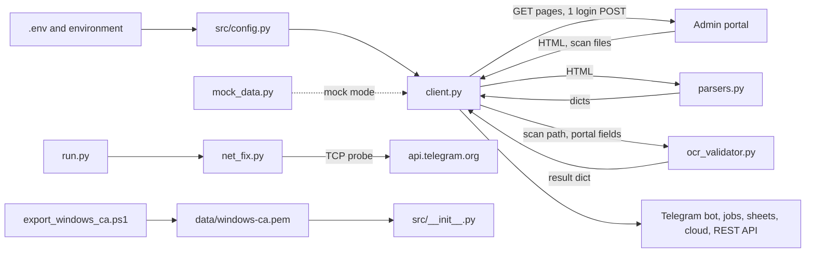
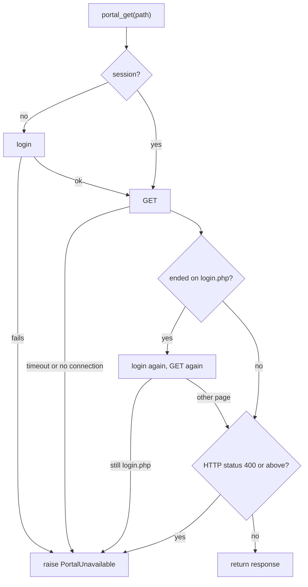

# Portal client, page parsers, passport check and configuration

Reference for nine files:

- `src/scraper/client.py`, `src/scraper/parsers.py`, `src/scraper/mock_data.py`, `src/scraper/ocr_validator.py`, `src/scraper/__init__.py`
- `src/net_fix.py`
- `src/config.py` and its root copy `config.py`
- `tools/export_windows_ca.ps1`

Index of all programs: [../PYTHON_PROGRAMS.md](../PYTHON_PROGRAMS.md). Every `path:line` below is relative to the repository root.

## Overview

Terms used in this document:

| Term | Meaning |
|---|---|
| portal | The agency's admin web site, a set of PHP pages under `HANGEUL_BASE_URL` (default `https://hangeul.com.bd/admin`, `src/config.py:24`). It has no API. The bot reads its HTML pages. |
| session | The portal login, held only as cookies inside one `httpx.AsyncClient` in memory. |
| uid | The portal's own numeric id of a student, taken from the link `student_edit.php?id=N`. |
| HNG id | The student id the agency prints, of the form `HNG-YYYY-N` (`src/scraper/parsers.py:330`). |
| tile | One figure card on the portal dashboard (`index.php`). |
| stamp | The text `Payment verified by <staff name> · DD Mon, HH:MM` on a student's row. It has no year. |
| MRZ | Machine-readable zone: the two 44-character lines at the bottom of a passport page (ICAO 9303, format TD3). |
| mock mode | `MOCK_MODE=true`: a few client methods return built-in demo data instead of reading the portal. |
| `BOT_ROOT` | The folder that holds `run.py` and `.env` (`src/config.py:6`). |
| singleton | One shared object created at import: `admin_client` (`src/scraper/client.py:778`) and `settings` (`src/config.py:147`). |

What the group does together:

1. `src/config.py` reads `.env` and gives every other module one typed `settings` object.
2. `src/scraper/client.py` logs in to the portal, keeps the session, and fetches pages with GET requests. The only POST it ever sends is the login form (`src/scraper/client.py:151-152`).
3. `src/scraper/parsers.py` turns the fetched HTML into Python dictionaries. It refuses to guess: a figure the page does not show is `None` or `""`. A page with an unknown layout is handled in one of three ways, depending on the parser:
   - an error is raised: `parse_students_page` and `parse_progress_page` raise `StudentListLayoutError`; `parse_consult_performance` raises `PerformanceLayoutError`;
   - `None` is returned: `consultation_table`, the `rows` and `tabs` of `consultation_view`, `_consultation_tabs` (as `(None, None)`), `parse_window_applications`, `parse_pending_payments`;
   - `[]` is returned: `consultation_rows` and `parse_consultation_requests` give an empty list when the page has no table or the table has no name or no status column (`src/scraper/parsers.py:619`, `:723-724`). A caller cannot tell this from a list with no requests: the kind of silent 0 that the comment at `:611-613` describes.
4. `src/scraper/ocr_validator.py` reads a downloaded passport scan with local OCR and compares it with what staff typed into the portal.
5. `src/scraper/mock_data.py` holds the demo data for mock mode.
6. `src/net_fix.py` and `tools/export_windows_ca.ps1` are two network workarounds for the PC the bot runs on: one for the DNS answer of `api.telegram.org`, one for HTTPS certificates.

| Program | Lines | One-line purpose | How it is started |
|---|---|---|---|
| [`src/scraper/client.py`](../../src/scraper/client.py) | 778 | The one HTTP client for the portal: login, session, every page read, passport-scan download, the shared `admin_client`. | Imported. Importing it builds `admin_client`. No command line. |
| [`src/scraper/parsers.py`](../../src/scraper/parsers.py) | 1351 | Portal HTML to dictionaries; undoes Cloudflare's e-mail obfuscation. | Imported. Pure functions. No command line. |
| [`src/scraper/mock_data.py`](../../src/scraper/mock_data.py) | 209 | Three hard-coded demo data sets for mock mode. | Imported by `client.py` only. |
| [`src/scraper/ocr_validator.py`](../../src/scraper/ocr_validator.py) | 897 | Passport OCR, MRZ parsing with check digits, field-by-field comparison with the portal. | Imported by `client.py` only, outside the tests (four test files import it too); runs in a worker thread. |
| [`src/scraper/__init__.py`](../../src/scraper/__init__.py) | 1 | Package marker (a docstring). | Imported implicitly. |
| [`src/net_fix.py`](../../src/net_fix.py) | 105 | Makes `api.telegram.org` reachable when the normal DNS answer is dead. | Called once by `run.py:71` at start-up. |
| [`src/config.py`](../../src/config.py) | 147 | `Settings` loaded from `<BOT_ROOT>/.env`; folder helpers; Telegram allow-list helpers. | Imported. `settings = Settings()` runs at import. |
| [`config.py`](../../config.py) (root) | 147 | Byte-identical copy of `src/config.py`. | Not started. Nothing imports it. |
| [`tools/export_windows_ca.ps1`](../../tools/export_windows_ca.ps1) | 41 | Exports the Windows trusted certificates to `data\windows-ca.pem`. | By hand: `powershell -ExecutionPolicy Bypass -File tools\export_windows_ca.ps1` |



Related documents: [../SITE_MAP.md](../SITE_MAP.md) (every portal page in one table), [../DATA_FLOW.md](../DATA_FLOW.md), [../BUILD_AND_RUN.md](../BUILD_AND_RUN.md), [../reference/04_PORTAL_INTEGRATION.md](../reference/04_PORTAL_INTEGRATION.md). The callers are described in [bot_core.md](bot_core.md), [bot_answers_and_jobs.md](bot_answers_and_jobs.md), [sheets.md](sheets.md), [cloud.md](cloud.md) and [api_scripts_launchers.md](api_scripts_launchers.md). Tests are in [tests.md](tests.md).

---

## src/scraper/client.py

**Purpose.** The single gateway to the portal. It logs in, keeps the session, fetches pages, hands the HTML to `parsers.py`, downloads passport scans and starts the passport check. The newer readers, built on `portal_get`, report a failed read as "not available" and never as a 0 or an empty list: that is what the exception `PortalUnavailable` is for (`src/scraper/client.py:66-77`). Four older readers do not follow this rule. On any error `get_consultation_requests` returns `[]` (`:283-285`), `get_student_full_profile` returns `{}` (`:626-628`), `get_calendar_events` returns empty lists with an `error` key and `layout_ok: False` (`:587-590`), and `crawl_page` returns `{"error": ...}` (`:774-775`). See "Things to know" below.

**How it is run or who calls it.** No command line. `import src.scraper.client` builds the shared instance `admin_client = HangeulAdminClient()` (`src/scraper/client.py:778`). Importers outside the tests:

| Importer | Lines | What it takes |
|---|---|---|
| `src/bot/telegram_bot.py` | 16 and function-level imports at 472, 546, 578, 729, 991, 1560, 1627 | `admin_client`, `portal_error_reason`, `PortalUnavailable` |
| `src/bot/brief.py` | 56 | `PortalUnavailable`, `admin_client` |
| `src/bot/scheduler.py` | 13 | `admin_client`, `portal_error_reason` |
| `src/bot/ask.py` | 771, 889, 942, 981, 1016, 1044, 1400 | `admin_client`, `PortalUnavailable`, `portal_error_reason` |
| `src/bot/performance.py` | 39, 291 | `PERFORMANCE_PAGE`, `PERFORMANCE_PERIODS`, `admin_client`, `portal_error_reason` |
| `src/bot/replies.py` | 163 | `portal_error_reason` |
| `src/api/main.py`, `src/api/routes/applications.py`, `auth.py`, `crawler.py`, `dashboard.py` | 7; 3; 3; 3; 2 | `admin_client` |
| `src/cloud/backfill.py` | 62, 156, 503 | `portal_error_reason`, `PortalUnavailable`, `HangeulAdminClient` |
| `src/cloud/bot_jobs.py` | 63, 96 | `admin_client`, `PortalUnavailable`, `portal_error_reason` |
| `src/cloud/command_hooks.py` | 81, 116 | `admin_client` (its `mock_mode` and `_profile_cache`) |
| `src/cloud/full_picture.py` | 53 | `HangeulAdminClient` (subclassed at `:77`), `PortalUnavailable` |
| `src/cloud/records.py` | 834 | `PERFORMANCE_PERIODS` |
| `src/cloud/sheet_hooks.py` | 94, 424 | `PortalUnavailable`, `portal_error_reason`, the static method `HangeulAdminClient._profile_fields` |
| `src/sheets/auto_sync.py` | 92 | the module itself (replaces `admin_client`, see "Things to know") |
| `src/sheets/missing_report.py` | 308, 339 | `portal_error_reason` |
| `src/sheets/passport_issue.py` | 61 | `PortalUnavailable`, `admin_client` |
| `src/sheets/progress_builder.py` | 226 | `admin_client` |
| `src/sheets/stage_report.py` | 46, 74, 240 | `HangeulAdminClient`, `PortalUnavailable`, `portal_error_reason` |
| `src/sheets/verified_docs.py` | 143, 337 | `admin_client` |
| root scripts `audit_program.py`, `download_passports.py`, `get_consultations.py`, `inspect_passports.py`, `test_system.py`, `test_verified.py` | 43 and 131; 13; 9; 11; 62; 12 | `admin_client`, `portal_error_reason` |
| root copies `telegram_bot.py`, `progress_builder.py` | same lines as their `src` versions | same |

Four of these modules (`src/bot/telegram_bot.py`, `src/sheets/progress_builder.py`, `src/sheets/verified_docs.py`, `get_consultations.py`, plus the two root copies) also reach past the client's methods to its raw `httpx.AsyncClient`. See "Requests that bypass `portal_get`" below.

Four places build a client of their own, with its own cookie jar and its own login, instead of using `admin_client`: `src/cloud/backfill.py:504`, `src/cloud/full_picture.py:124` (an instance of the subclass `PortalSession` defined at `:77`), `src/sheets/stage_report.py:49` and `:78`.

**What it reads.**

- Settings, by name (from `src/config.py`): `HANGEUL_BASE_URL`, `HANGEUL_USERNAME`, `HANGEUL_PASSWORD`, `MOCK_MODE` (`src/scraper/client.py:101-104`), and `BOT_ROOT` for the passports folder (`:675`).
- Portal pages. All paths are relative to `HANGEUL_BASE_URL`. All are GET except the login POST.

| Page | Method | Parameters | Timeout | Function (`client.py` line) | What is taken |
|---|---|---|---|---|---|
| `login.php` | GET | none | 30.0 s | `get_login_page` (124, GET at 136) | CSRF token and cookies |
| `login.php` | POST | form fields `_csrf`, `username`, `password` | 15.0 s (client default) | `login` (150, POST at 184) | the logged-in session cookie |
| `index.php` | GET | none | 30.0 s read, 10.0 s connect | `get_dashboard` (202) | dashboard tiles |
| `students.php` | GET | the caller's filters, plus `pg=<n>` for pages 2..N | 60.0 s read, 10.0 s connect | `read_student_pages` (454, GET at 473) | the student list, every page |
| `students.php?status=pending` | GET | query written into the path; first page only | 60.0 / 10.0 s | `read_pending_payments` (553) | pending-payment count |
| `consult_requests.php` | GET | none | 15.0 s | `get_consultation_requests` (269) | all listed requests, filtered in code by date text |
| `consult_requests.php` | GET | none | 60.0 / 10.0 s | `read_consultations` (344) | every listed request |
| `consult_requests.php` | GET | `status=file_opened` | 60.0 / 10.0 s | `read_consultation_totals` (368) | all-time status-tab counts |
| `consult_requests.php` | GET | `status=all`, `from=YYYY-MM-DD`, `to=YYYY-MM-DD` (the same day) | 60.0 / 10.0 s | `read_consultation_day` (382, params at 399) | one day's requests and counts |
| `consult_requests.php` | GET | any caller parameters | 60.0 / 10.0 s | `read_consultation_view` (351) | rows, tab counts, echoed filter |
| `consult_performance.php` | GET | `period=today` or `period=month` | 60.0 / 10.0 s | `read_consult_performance` (425, GET at 442) | consultant performance page |
| `window_applications.php?status=under_review` | GET | query written into the path | 60.0 / 10.0 s | `read_window_apps_under_review` (561) | count of rows under review |
| `calendar.php` | GET | none | 15.0 s | `get_calendar_events` (570) | today's reminders, upcoming events |
| `student_edit.php?id=<uid>` | GET | `id` | 15.0 s in `get_student_full_profile` (592); 30.0 / 10.0 s in `audit_student_passport` (630, GET at 654) | one student's profile form |
| `view_doc.php?f=<file name>` | GET | `f` | 60.0 / 10.0 s | `audit_student_passport` (GET at 688) | the passport scan file (image or PDF) |
| any path the caller gives | GET | none | 15.0 s | `crawl_page` (741, GET at 767) | every table on the page |

Filters that callers pass to `students.php`, as seen in the code: `{"prog": <program>}` (`audit_program.py:73`), `{"status": "pending"}` (`src/bot/ask.py:892`, `src/cloud/backfill.py:221`) and `{"source": "direct", "filter_docs": "verified"}` (`src/sheets/verified_docs.py:77`; it is the query of `LIST_PATH = "students.php?source=direct&filter_docs=verified"` at `:38`, split into a dictionary at `:75`). The docstring also names `{"q": "<text>"}` (`src/scraper/client.py:456`).

Other modules request further pages through this client's `portal_get` / `fetch_html`: `students.php?export=csv` (`src/cloud/backfill.py:113`), `progress.php?uid=<uid>` (`src/sheets/stage_report.py:89`), `student_edit.php?id=<uid>` (`src/sheets/passport_issue.py:77`), `index.php` and `calendar.php` (`src/bot/ask.py:772`, `:1403`; `src/cloud/backfill.py:270`, `:285`), `window_applications.php?status=under_review` (`src/cloud/backfill.py:251`), `view_doc.php` files (`download_passports.py:32`). They are described in those modules' documents.

Requests that bypass `portal_get`. Four modules do not use `portal_get` or `fetch_html`. They call the raw `httpx.AsyncClient` of the shared client (`admin_client.client.get`) themselves, build the URL from `admin_client.base_url`, and call `login()` without checking its result. The two CSV readers also read `admin_client.is_authenticated` to decide whether to log in first, and set it to `False` themselves when a response ended on `login.php`. These requests share the client's cookie jar, run with `verify=False` like every other request of the client, and never raise `PortalUnavailable`.

| Module and function | Page | Parameters | Timeout | Login redirect | What a failure gives |
|---|---|---|---|---|---|
| `src/sheets/progress_builder.py:223` `_fetch_all_students_async` (GET at `:231`, again at `:235`) and the root copy `progress_builder.py` | `students.php?export=csv` | written into the path | 60.0 s | checked: one fresh login and one repeated GET (`:232-235`) | an `httpx` status error from `raise_for_status()` (`:236`); `RuntimeError` when the answer is not the CSV (`:238-239`) |
| `src/bot/telegram_bot.py:1187` `_find_student_in_export` (GET at `:1194`, again at `:1198`) and the root copy `telegram_bot.py` | `students.php?export=csv` | written into the path | 60.0 s | checked, as above (`:1195-1198`) | `RuntimeError` when the first row has no "Student ID" column (`:1200-1201`) |
| `src/sheets/verified_docs.py:178` (inside `run`) and `:209` (`_download_zip`) | `download_docs.php` | `uid=<uid>`, `zip=1` | 300.0 s | not checked | `RuntimeError` when the answer is not a ZIP (`:181-183`, `:211-213`) |
| `get_consultations.py:20` (`fetch_consultation_requests`) | `consult_requests.php` | none | 15.0 s (the client default) | not checked | a status other than 200 prints an error line and returns empty results (`:21-23`) |

Other inputs:

- Local files: an already saved scan `<BOT_ROOT>/passports/<uid>_<file name>` (its size and first bytes, `src/scraper/client.py:680-684`).
- Demo data: `MOCK_DASHBOARD_STATS`, `MOCK_APPLICATIONS`, `MOCK_INQUIRIES` (`src/scraper/client.py:39`).
- It does not call Telegram, Google, Ollama, Supabase or the voice service.

**What it writes.**

- To the portal: nothing except the login POST.
- Files: the folder `<BOT_ROOT>/passports/` (created when missing, `src/scraper/client.py:675-676`); a scan as `<BOT_ROOT>/passports/<uid>_<file name>`, first written as `.<uid>_<file name>.part` and then renamed with `os.replace` (`:702-705`). The folder is git-ignored (`.gitignore:19`).
- Memory only: the session cookies in the `httpx.AsyncClient`; `self._profile_cache`, a dictionary uid -> profile fields (`:600-601`, `:660-662`).
- Log lines on the logger `hangeul.client`, errors only (`:146`, `:198`, `:211`, `:284`, `:589`, `:627`). The file opens no log file itself.

**Why it exists.** Staff ask the bot questions whose answers exist only on portal pages: how many students there are, who was verified as paid today, which consultation requests came in, who is admitted, what is on the calendar, and whether a passport scan agrees with what was typed. The Telegram commands, the daily brief, the sheet sync, the Supabase publisher and the REST API all get these answers through this one file.

**Main functions and classes.**

Module level:

| Name | Line | What it does |
|---|---|---|
| `STUDENTS_PER_PAGE`, `MAX_STUDENT_PAGES`, `CONNECT_TIMEOUT`, `CONSULT_LIST_LIMIT`, `CONSULT_TOTALS_VIEW`, `PERFORMANCE_PAGE`, `PERFORMANCE_PERIODS` | 44-58 | Constants. Values under "Numbers that matter". |
| `_error_text` | 61 | An exception as text that is never empty (falls back to the exception's class name). |
| `PortalUnavailable` | 66 | `RuntimeError` with `.reason` (short plain-English text) and `.unreachable` (true when the portal did not answer at all). Raised for: a failed login, a page that still ends on `login.php` after a fresh login, HTTP status 400 or above, a timeout or refused connection, a layout that is not recognised. |
| `portal_error_reason` | 80 | Any exception as a short reason for a reply: the `PortalUnavailable` reason, "the portal did not answer in time" for a timeout, "could not connect to the portal" for a transport error, else `<type>: <text>`. |
| `_ended_on_login` | 93 | True when the final URL path of a response ends in `login.php` (the session expired and the portal redirected). |
| `HangeulAdminClient` | 97 | The client class. Methods below. |
| `admin_client` | 778 | The shared instance. |

Methods of `HangeulAdminClient`:

| Name | Line | What it does |
|---|---|---|
| `__init__` | 100 | Reads the four settings. Builds `httpx.AsyncClient(headers=..., follow_redirects=True, timeout=15.0, verify=False)` with a Chrome 122 `User-Agent`, an `Accept` and an `Accept-Language` header. Sets `is_authenticated = False`. |
| `close` | 121 | Closes the HTTP client. |
| `get_login_page` | 124 | GET `login.php`. Returns `status_code`, `current_url`, `csrf_token`, `cookies`, `mock`. On failure returns `{"error", "unreachable", "mock"}`. Mock mode: a fixed fake token, no request. |
| `login` | 150 | Gets the CSRF token, POSTs `_csrf`, `username`, `password` to `login.php`. A response that still ends on `login.php` is a refused login. Sets `is_authenticated`. Returns `{"success": True, ...}` or `{"success": False, "error", "unreachable"}`. Mock mode: reports success without any request. |
| `get_dashboard` | 202 | `index.php` through `fetch_html`, parsed by `parse_hangeul_live_dashboard`. Never raises: a failed read returns `{"error": <reason>}`. Mock mode: `MOCK_DASHBOARD_STATS`. |
| `get_applications` | 214 | Students from `students.php`. With no filter: the first page only (the 50 newest). With `status` and/or `intake`: every page, then filtered in code by substring of the record's `status` / `target_intake`. Raises `PortalUnavailable`. Mock mode: filtered `MOCK_APPLICATIONS`. |
| `get_admitted_students` | 236 | Reads the dashboard to find the stage the "Admitted" tile links to (the `stage` query parameter of its `students.php` link; fallback `ADMITTED_STAGE`). Reads every `students.php` page, keeps the students at that stage, then narrows by `query` in code (`student_matches`). Returns `students`, `admitted`, `checked`, `stage`, `tile`, `query`, `listed`, `dashboard`. Mock mode: uses `MOCK_APPLICATIONS` as the list. |
| `get_consultation_requests` | 269 | Older reader. GET `consult_requests.php`, keep rows whose "received" text contains the target date. Returns `[]` on any error. |
| `get_inquiries` | 287 | Mock mode: `MOCK_INQUIRIES`. Otherwise `get_consultation_requests("today")`. |
| `_ensure_session` | 294 | Logs in when there is no session. Raises `PortalUnavailable` when the login fails. |
| `_get_once` | 303 | One GET of `<base>/<path>`. A timeout or transport error becomes `PortalUnavailable(unreachable=True)`. |
| `portal_get` | 314 | "The one way to read a portal page" (docstring). Sequence in the diagram below. Returns the `httpx.Response`. |
| `fetch_html` | 339 | `portal_get(...).text`. |
| `read_consultations` | 344 | The whole `consult_requests.php` table through `consultation_table`, parsed in a worker thread. No caller outside the tests. |
| `read_consultation_view` | 351 | One view of `consult_requests.php` for the given parameters: `rows`, `tabs`, `status`, `from`, `to`, `listed`. Raises when the status tabs or the rows are not recognised. Raises in mock mode. |
| `read_consultation_totals` | 368 | The all-time status-tab counts (`All`, `New`, `No Answer`, `Wrong Number`, `Consulted`, `File Opened`), read from the lightest view (`status=file_opened`). Raises when the page did not open that tab or shows a date filter. |
| `read_consultation_day` | 382 | The requests received on one day, through the portal's own date filter, with five cross-checks (below). Returns `day`, `counts`, `rows`, `complete`. |
| `read_consult_performance` | 425 | The Consultant Performance page for `"today"` or `"month"`. `ValueError` for any other period. Checks that the page says it shows the period asked for. Raises in mock mode. |
| `read_student_pages` | 454 | The HTML of every `students.php` page for the given filters, following the pager and checking completeness (below). |
| `read_students` | 501 | Every student as a `parse_students_page` record, each once. Parsing runs in a worker thread. |
| `read_verified_students` | 522 | Students whose payment was verified on a given day, matched on each row's stamp. Two layout guards (below). |
| `get_verified_students` | 547 | `read_verified_students(target_date, all_pages=True)`. |
| `read_pending_payments` | 553 | `students.php?status=pending` -> `{"count", "listed", "badge"}` or `None`. Mock mode: `None`. |
| `read_window_apps_under_review` | 561 | Count of window applications whose own status reads "under review"; `None` when the page has no table with a Status column. Mock mode: `None`. |
| `get_calendar_events` | 570 | Older reader. `calendar.php` -> `parse_calendar_events`. On an error returns empty lists plus `error` and `layout_ok: False`. Mock mode: two empty lists. |
| `get_student_full_profile` | 592 | Older reader. Every `input`, `textarea` and `select` of `student_edit.php?id=<uid>` as `{name or id: value}`. Stores the result in `_profile_cache`; returns the cached copy only when called with `force_live=False`. Returns `{}` on any error. |
| `audit_student_passport` | 630 | The live passport check. Steps under [ocr_validator.py](#srcscraperocr_validatorpy). |
| `_profile_fields` (static) | 716 | The form of `student_edit.php` as `{field name: value}`. Skips `_csrf` and inputs of type `password`, `submit`, `button`. A select gives its selected option only; a textarea its text. Empty fields are left out; the first value per name wins. |
| `crawl_page` | 741 | GET of any path under the base URL. Returns `status_code`, `url`, `tables` (`parse_tables`) and `dashboard_summary`. Mock mode: a fixed sample table with two rows. |

How `portal_get` works (`src/scraper/client.py:314-337`):



How `read_student_pages` reads the list whole (`src/scraper/client.py:454-499`):

1. Drop empty filter values and any `pg` the caller passed. Request page 1 without `pg`; later pages with `pg=<n>`.
2. A page without `<table` raises `PortalUnavailable`.
3. Read the pager text (`Page X of N · T students`, `student_pager`) and the uids on the page (`student_uids`).
4. On page 1: no pager and 50 or more students on the page raises (later pages cannot be found). With a pager, take `N` and `T`.
5. A page whose pager says another page number than the one asked for raises (the list changed while it was read).
6. The page count may grow while reading (`pages = max(pages, pager pages)`). More than `MAX_STUDENT_PAGES` raises.
7. With `all_pages=False` stop after page 1.
8. After the last page: fewer distinct uids than the total `T` raises.

The five cross-checks of `read_consultation_day` (`src/scraper/client.py:397-423`):

1. The page's search form echoes `from` and `to` equal to the day, and the open tab is `all`. Otherwise the filter was not applied.
2. Every listed row's date is that day (`src.dates.parse_portal_date`).
3. When the page has the caption `<b>N</b> requests · newest first`, `N` equals the number of rows read.
4. The rows are not more than the "All" tab count. Fewer rows than "All" are accepted only when the caption exists or at least `CONSULT_LIST_LIMIT` rows were read.
5. When the rows equal the "All" count (`complete` is true), the count of rows per status equals the other tab counts.

The two layout guards of `read_verified_students` (`src/scraper/client.py:537-544`):

1. Student rows exist but none has a "Payment verified by" line: the wording changed, raise.
2. A row has the line but its date cannot be read (`src.dates.parse_stamp`): raise.

Callers of each reader outside the tests (from a search of the repository):

| Reader | Called from |
|---|---|
| `get_login_page` | `src/api/routes/auth.py:10` |
| `login` (directly) | `src/api/routes/auth.py:15`, `src/bot/telegram_bot.py:1192,1197`, `src/sheets/progress_builder.py:229,234`, `src/sheets/verified_docs.py:145,339`, `get_consultations.py:19`, `test_system.py:64` |
| `get_dashboard` | `src/api/routes/dashboard.py:9,14`, `src/bot/brief.py:626`, `src/bot/telegram_bot.py:241`, `test_system.py:68` |
| `get_applications` | `src/api/routes/applications.py:13`, `src/bot/telegram_bot.py:258`, `test_system.py:72` |
| `get_admitted_students` | `src/bot/telegram_bot.py:364` |
| `get_consultation_requests` | `src/api/routes/applications.py:25` |
| `get_inquiries` | `src/api/routes/applications.py:18`, `test_system.py:76` |
| `read_consultation_view` | `src/cloud/backfill.py:157` |
| `read_consultation_totals` | `src/bot/brief.py:623`, `src/bot/telegram_bot.py:562`, `src/cloud/backfill.py:208` |
| `read_consultation_day` | `src/bot/brief.py:615`, `src/bot/telegram_bot.py:555`, `src/cloud/backfill.py:189` |
| `read_consult_performance` | `src/bot/performance.py:295`, `src/cloud/backfill.py:303` |
| `read_student_pages` | `src/bot/ask.py:892`, `src/cloud/backfill.py:221`, `src/sheets/verified_docs.py:77` |
| `read_students` | `src/bot/ask.py:983,1022`, `src/bot/scheduler.py:170`, `src/bot/telegram_bot.py:992,1240,1754`, `src/cloud/backfill.py:93`, `src/sheets/passport_issue.py:67`, `src/sheets/stage_report.py:51`, `audit_program.py:73`, `download_passports.py:20`, `inspect_passports.py:42` |
| `read_verified_students` | `src/bot/brief.py:621` |
| `get_verified_students` | `src/bot/telegram_bot.py:905`, `test_verified.py:25` |
| `read_pending_payments` | `src/bot/brief.py:624` |
| `read_window_apps_under_review` | `src/bot/ask.py:944`, `src/bot/brief.py:625` |
| `get_calendar_events` | `src/bot/brief.py:627`, `src/bot/telegram_bot.py:1140` |
| `get_student_full_profile` | `src/bot/telegram_bot.py:1271` |
| `audit_student_passport` | `src/bot/scheduler.py:206` (the passport watcher), `src/bot/telegram_bot.py:1643` (the cross-check commands), `audit_program.py:151` |
| `_profile_fields` | `src/cloud/sheet_hooks.py:431` |
| `crawl_page` | `src/api/routes/crawler.py:12`, `test_system.py:80` |
| `read_consultations` | none |

**Numbers that matter.**

| Item | Value | Where |
|---|---|---|
| Default client timeout | 15.0 s | `src/scraper/client.py:116` |
| `login.php` GET timeout | 30.0 s | `:136` |
| `portal_get` / `fetch_html` default timeout | 60.0 s for read, write and pool | `portal_get` `:315`, `fetch_html` `:339`; applied at `:326` |
| Connect timeout inside `portal_get` | `min(timeout, CONNECT_TIMEOUT)`, `CONNECT_TIMEOUT = 10.0` s | `:48`, `:326` |
| Dashboard read | 30.0 s | `:209` |
| Profile read in the passport check | 30.0 s | `:654` |
| Scan download | 60.0 s | `:688` |
| Retries | exactly one fresh login and one repeated GET when a response ends on `login.php`. No retry after a timeout. No back-off. No pause between page requests. | `:328-334`; older readers `:277-280`, `:581-584`, `:609-612` |
| `STUDENTS_PER_PAGE` | 50 | `:44` |
| `MAX_STUDENT_PAGES` | 40, so at most 2,000 students can be read | `:45` |
| `CONSULT_LIST_LIMIT` | 500 (the most requests the portal lists under its tabs) | `:52` |
| `CONSULT_TOTALS_VIEW` | `{"status": "file_opened"}` | `:53` |
| `PERFORMANCE_PERIODS` | `{"today": "Today", "month": "This Month"}` | `:58` |
| Saved scan counts as whole | size at least 1000 bytes and the first non-blank byte of its first 200 bytes is not `<` | `:680-684` |
| Downloaded scan refused | first non-blank byte is `<`, or `<html` occurs in the first 1000 bytes, or the body is 1000 bytes or less | `:691-695` |
| Scan file name allowed | matches `[A-Za-z0-9._-]+` and contains no `..` | `:673` |
| Schedule | none in this file. The passport watcher that calls the check runs every 30 minutes (`IntervalTrigger(minutes=30)`, job id `passport_upload_watcher`, `src/bot/scheduler.py:448-456`). | |

**Things to know.**

- TLS certificate verification is off for the portal: `verify=False` (`src/scraper/client.py:117`). The only comment is "Allow flexible SSL handling". Whether this is deliberate cannot be determined from the code.
- The session is not saved anywhere. Every process, and every separate `HangeulAdminClient()` instance, logs in again.
- `src/sheets/auto_sync.py:89-93` replaces the module-level `admin_client` with a new instance. It does so before every attempt of every sync step (`_with_retries`, `src/sheets/auto_sync.py:375-380`), because each step closes the client when it finishes. Code that did `from src.scraper.client import admin_client` earlier keeps the old object.
- Two generations of readers coexist. The newer ones go through `portal_get` and raise `PortalUnavailable`. The four older ones (`get_consultation_requests`, `get_calendar_events`, `get_student_full_profile`, `crawl_page`) call `self.client.get` directly, call `login()` without checking its result, and turn every error into `[]`, `{}`, empty lists with an `error` key, or `{"error": ...}`. Three of them (`get_consultation_requests`, `get_calendar_events`, `get_student_full_profile`) detect the login redirect with `"login.php" in str(resp.url)`, then log in and send the GET once more (`:277-280`, `:581-584`, `:609-612`). `crawl_page` has no such check and no retry: it logs in when there is no session and sends one GET (`:762-767`).
- `get_consultation_requests` returns `[]` for a date text that cannot be read: `parse_consultation_requests` raises `ValueError` inside the `try`, and the `except` returns the empty list (`:275-285`). The REST route `GET /api/applications/consultations` (`src/api/routes/applications.py:20-25`, mounted under `/api` at `src/api/main.py:44`) therefore cannot tell "no requests" from "bad date" or "portal down".
- Mock mode is not an offline switch. Only these methods have a mock branch: `get_login_page`, `login`, `get_dashboard`, `get_applications`, `get_admitted_students` (the student list only), `get_inquiries`, `read_pending_payments`, `read_window_apps_under_review`, `get_calendar_events`, `crawl_page`. `read_consultation_view` and `read_consult_performance` raise `PortalUnavailable` in mock mode, and so do `read_consultation_totals` and `read_consultation_day`, which are built on the first. Every other reader (`read_student_pages`, `read_students`, `read_consultations`, `read_verified_students` and its wrapper `get_verified_students`, `get_consultation_requests`, `get_student_full_profile`, `audit_student_passport`, `portal_get`, `fetch_html`) still sends real GET requests, after the mock `login()` has reported success without logging in. `.env.example:13-16` says the same.
- `get_login_page` returns the client's cookie jar as `cookies` (`:142`), and the REST route `GET /api/auth/csrf` returns that dictionary to its caller (`src/api/routes/auth.py:7-10`, mounted under `/api` at `src/api/main.py:42`).
- `read_pending_payments` has a docstring that says "None when the page cannot be read". In fact `fetch_html` raises `PortalUnavailable`; `None` comes only from mock mode or from the parser.
- The portal ignores `?status=admitted` and its search does not cover universities or programs (docstring `:238-243`). So admitted students are picked in code, and the search text never goes into a URL.
- `get_student_full_profile` keeps the `_csrf` field and password-type inputs, and for a `<select>` without a `value` attribute it stores the text of all its options joined. `_profile_fields` fixes all three. Both exist.
- `audit_student_passport` changes the caller's `form_data` dictionary in place (`:663-665`). With `force_live=True` (the default) the profile page's values overwrite what the caller passed.
- `_profile_cache` is also read from outside: `src/cloud/command_hooks.py:117`.
- `crawl_page` accepts any path from its caller (the REST route `POST /api/crawler/parse-page`, `src/api/routes/crawler.py:7-12`) with no allow-list and no login-redirect check. Its `dashboard_summary` is always `None`, because `parse_dashboard_metrics` has no `return` statement (see parsers.py).
- `read_students` removes duplicates by `uid`; a row without a uid is keyed by `(student_id, student_name, applied_date)` (`:516`). A duplicate can appear when a new student registers while the pages are being read and rows shift onto the next page.
- `import os` sits inside `audit_student_passport` (`:649`). The argument `live_audit=force_live` is passed to the validator, which ignores it.
- The comment at `:46` and the docstrings give page sizes ("~2 MB" for `consult_requests.php`, "~1 MB" for a `students.php` page). These are notes by the author, not measured by the code.

---

## src/scraper/parsers.py

**Purpose.** Pure HTML-to-dictionary parsing for every portal page the bot reads. It finds things by header names, labels and CSS classes, not by column position. It also puts back the e-mail addresses that Cloudflare hides in the HTML. No network access, no files.

**How it is run or who calls it.** No command line. Imported by `src/scraper/client.py:12-37` and by:

| Importer | Line | Names |
|---|---|---|
| `src/bot/ask.py` | 687, 890, 1250, 1353 | `decode_cf_emails`, `parse_hangeul_live_dashboard`, `StudentListLayoutError`, `parse_pending_payments`, `parse_students_page`, `parse_calendar_events`, `_CAL_PROGRAM_RE` |
| `src/bot/brief.py` | 239 | `payment_text` |
| `src/bot/performance.py` | 40 | `_label_key` |
| `src/bot/telegram_bot.py` | 805, 1578 | `payment_text`, `verification` |
| `src/cloud/backfill.py` | 219, 249 | `StudentListLayoutError`, `parse_pending_payments`, `parse_students_page`, `parse_window_applications` |
| `src/cloud/records.py` | 418, 543, 579, 599, 964 | `payment_text`, `verification`, `_label_key` |
| `src/sheets/stage_report.py` | 75 | `StudentListLayoutError`, `parse_progress_page` |
| `src/sheets/verified_docs.py` | 46 | `decode_cf_emails` |
| `test_system.py` | 29 | `extract_csrf_token`, `parse_tables`, `parse_dashboard_metrics` |

**What it reads.** HTML strings handed in by callers, from `login.php`, `index.php`, `students.php`, `progress.php?uid=N`, `consult_requests.php`, `consult_performance.php`, `window_applications.php`, `calendar.php` and `student_edit.php`. It uses `src.dates` for dates (`parse_user_date`, `user_date_problem`, `parse_portal_date`, `parse_stamp`, `stamp_on_day`). It reads no setting directly, no file and no service.

**What it writes.** Return values only. The logger `hangeul.parsers` is created (`src/scraper/parsers.py:9`) and never used.

**Why it exists.** The portal has no API; staff see these numbers on web pages. The parsers recover them as the portal prints them. The file's comments record why reading by header name matters: the portal changed its consultation table in September 2026, the old fixed-position parser matched nothing, and "every count silently read 0" (`src/scraper/parsers.py:611-613`).

**Main functions and classes.**

Cloudflare e-mail protection (lines 12-97). The portal is served through Cloudflare, which replaces each e-mail address in the HTML with a hex string. A browser script puts the address back; a parser would read the stand-in text "[email protected]".

| Name | Line | What it does |
|---|---|---|
| `_CF_CLASS`, `_CF_LINK`, `_HEX_RE` | 19-21 | Constants: the class name `__cf_email__`, the link prefix `/cdn-cgi/l/email-protection#`, and the pattern `[0-9A-Fa-f]+` that a hidden string must match in full. |
| `_cf_address` | 24 | Decodes the hex string: the first byte is the key, each later byte XOR the key is one byte of UTF-8 text. Returns `""` when the string is shorter than 4 hex characters, has odd length, is not hex, is not UTF-8, has no `@`, or contains a space or control character. |
| `_is_cf_email` | 42 | True for an element with class `__cf_email__` and a `data-cfemail` attribute, or an `<a>` whose `href` contains `/cdn-cgi/l/email-protection#`. |
| `_put_text` | 47 | Replaces the element with plain text and joins it to the text on either side. |
| `decode_cf_emails` | 64 | Rewrites the parsed tree in place. A protected element becomes the plain address; a protected link gets `href="mailto:<address>"`. An element that cannot be decoded is left as it is. Form `value` attributes are not touched. Nothing is fetched. Every parser below calls it right after building the soup. |

General helpers:

| Name | Line | What it does |
|---|---|---|
| `_label_key` | 100 | A label made comparable: lower case, punctuation to spaces, and a plural last word loses its final "s" (only when the word is longer than 3 letters and does not end in "ss", "us" or "is"). |
| `_int_or_none` | 109 | `"1,234"` -> `1234`; anything that is not a plain number -> `None`. |
| `extract_csrf_token` | 114 | The value of `input[name=_csrf]`; else of an input named `csrf_token`, `token`, `_token` or `csrf`; else the `content` of `meta[name=csrf-token]`; else `None`. |
| `parse_tables` | 136 | Every `<table>` as `{table_id, columns, row_count, rows}`. Generic; used by `crawl_page`. |
| `parse_dashboard_metrics` | 183 | A generic scan of card-like and alert-like elements. It has no `return` statement, so it returns `None`. |

Dashboard (`index.php`):

| Name | Line | What it does |
|---|---|---|
| `_DASHBOARD_TILES` | 217 | Summary key -> (tile label, a fragment of the tile's link). 11 keys, listed below. |
| `_dashboard_tiles` | 232 | Every `.stat-card` that has a `.stat-num` and a `.stat-lbl`, as `{group, label, value, text, href}`. `group` is the `.dash-sec` heading before the tile's `.stats-row`. Falls back to an older layout without cards. |
| `_tile_value` | 257 | The figure for one label. When two summary keys share a label, the tile's link decides. `None` when no single tile matches. |
| `parse_hangeul_live_dashboard` | 269 | Returns `status`, `portal`, `last_synced` (the PC's local time now), `summary`, `live_stats` (label -> printed text), `tiles`, `recent_activity` (the text of the first 5 links whose `href` contains `window_application_view`). |

The `summary` keys and the tile each comes from (`src/scraper/parsers.py:217-229`, `:293-294`):

| Summary key | Tile label | Link fragment |
|---|---|---|
| `open_windows` | Open windows | `admission_windows` |
| `draft_windows` | Draft windows | `admission_windows` |
| `submitted_window_apps` | Submitted apps | `window_applications` |
| `window_apps_under_review` | Under review | `window_applications` |
| `window_docs_to_review` | Docs to review | `review_queue` |
| `window_apps_accepted` | Accepted | `window_applications` |
| `total_students` | Total students | `students.php` |
| `pending_payment` | Pending payment | `students.php` |
| `verified_students` | Verified | `students.php` |
| `students_docs_to_review` | Docs to review | `students.php` |
| `admitted` | Admitted | `students.php` |
| `total_applicants` | alias of `total_students` | |
| `pending_document_verification` | alias of `students_docs_to_review` | |

Student list (`students.php`) and progress page:

| Name | Line | What it does |
|---|---|---|
| `ADMITTED_STAGE` | 317 | `"Admitted / Completed"`: the stage the dashboard's Admitted tile links to. |
| `_STUDENT_COLUMNS`, `_REQUIRED_STUDENT_COLUMNS` | 321-324 | Column keys and the header words that identify them. Required: `sl`, `student`, `program`, `stage`. |
| `_PAGER_RE`, `_UID_RE`, `_EMAIL_HIDDEN_RE`, `_EMAIL_HIDDEN_GAP_RE`, `_EMAIL_RE`, `_HNG_RE`, `_STAMP_TEXT`, `_VERIFIED_BY_RE`, `_PAID_RE`, `_INCOME_RE` | 325-334 | Regular expressions for the pager, the uid link, the Cloudflare stand-in, an e-mail address, the HNG id, the stamp, the paid amount and the verified income. |
| `StudentListLayoutError` | 337 | `ValueError` raised when `students.php` or `progress.php` has a layout the parser does not know. |
| `_blank` | 342 | The portal's dash for "nothing" becomes `""`. |
| `student_pager` | 348 | `Page X of N · T students` -> `{page, pages, total}`; each `None` when the page does not say. |
| `student_uids` | 358 | The uids on one page, in order, each once, from `student_edit.php?id=N` links. A regex, not a parse. |
| `_student_details` | 364 | The fields of one details row (class `xp-row`). |
| `parse_students_page` | 413 | One page -> `{students, empty, page, pages, total}`. Raises `StudentListLayoutError` when there is no table, no header row, a required column is missing, or a row cannot be read. |
| `_main_and_sub` | 486 | A cell's own text and the small line under it (class `stu-sub`). |
| `_student_row` | 499 | A list row's own columns. |
| `parse_hangeul_live_students` | 536 | `parse_students_page(html)["students"]`. No caller outside the tests. |
| `is_admitted` | 543 | Whether a student's stage equals the admitted stage (compared with `_label_key`). |
| `student_matches` | 549 | Local search: the query is a substring of the name, HNG id, university, program, intake or one of the application lines. |
| `parse_progress_page` | 561 | `progress.php?uid=N` -> `{pct, stage, status}` from `.pg-ring`, `.pg-now .pg-stage`, `.pg-now .pg-status`. Raises `StudentListLayoutError` when there is no ring with a percentage and a current stage. |

One student record (`parse_students_page`, `src/scraper/parsers.py:413-437`, `:526-533`, `:407-410`):

| Key | Content |
|---|---|
| `uid` | The portal user id; `""` when the row has no link. Taken from `student_edit.php?id=N`, else `showDel(N`, else `progress.php?uid=N`. |
| `sl` | The row's serial number. |
| `student_id`, `id` | The HNG id (both keys hold the same value); `""` before one is given. |
| `student_name` | The name in the Student column (class `stu-name`). |
| `target_university` | The university line (class `stu-uni`). |
| `applications` | The application lines of the University cell (class `upr`), each as shown; `[]` when none. |
| `program`, `target_intake` | The Program cell's own text and its sub-line. |
| `docs_status`, `payment_status` | The Docs and Payment columns as shown. |
| `status`, `applied_date` | The stage, and the date under it. |
| `details` | `{label: value}` of the details row's `.det-item` fields (first of each label). |
| `files` | The file names in `view_doc.php?f=...` links of the details row. |
| `details_text` | The details row's whole text. |
| `verified_line` | Whether the row has a "Payment verified by" line at all. |
| `verified_by`, `verified_stamp` | The staff name and the stamp text as printed (no year). |
| `paid`, `method`, `verified_income` | The row's payment figures and method. |
| `applied_on` | The "Applied On" value with its time. |

How `parse_students_page` classifies each table row (`src/scraper/parsers.py:461-482`):

1. A row with as many cells as the header and a number in the SL column is a student row.
2. A row with class `xp-row`, or a one-cell row directly after a student row, is that student's details row.
3. A row with class `empty-row`, or a one-cell row whose text says "no students", is the list's own empty state.
4. Any other row that has text counts as unread. One or more unread rows raise `StudentListLayoutError`.

Consultation requests (`consult_requests.php`):

| Name | Line | What it does |
|---|---|---|
| `normalize_target_date` | 576 | A user's date as `DD Mon YYYY`. `None` for an empty input; `ValueError` for a text that is not a readable date. |
| `_consult_columns` | 592 | Column index by meaning, from the header words: name ("student" or "name"), contact ("contact" or "phone"), city, program, consultant, details ("detail"), received ("received" or "date"), status, remarks ("remark"). A header containing "update" is skipped. One header can fill two keys (for example a combined city and program column). |
| `consultation_rows` | 608 | Every row of the table. `[]` when there is no table. |
| `consultation_table` | 622 | As above, but `None` when the page has no table or has rows in an unknown layout; `[]` when the table is empty. |
| `_consultation_data_rows` | 635 | The rows below the header, without the portal's own "no requests" row. |
| `CONSULT_STATUSES` | 642 | `("New", "No Answer", "Wrong Number", "Consulted", "File Opened")`. Not referenced anywhere else in the repository. |
| `_consultation_tabs` | 645 | The status-tab counts from `nav.cr-tabs` (count in `.n`, status value from the class `st-<value>`, open tab = class `on` or `aria-current`). `(None, None)` when there are no tabs, no "All" tab, or a count that is not a number. |
| `consultation_view` | 671 | `{rows, tabs, status, from, to, listed}`. `from` and `to` are echoed from the inputs of `form.cr-search`; `listed` comes from the caption `<b>N</b> requests · newest first`. |
| `_without_hidden_email`, `_no_dash` | 707, 713 | Remove the Cloudflare stand-in from a longer text; turn a dash placeholder into `""`. |
| `_consultation_table_rows` | 718 | The row reader. The table needs a name and a status column, else `[]`. |
| `parse_consultation_requests` | 784 | The rows whose `received` text contains the target date. |

One consultation row (`src/scraper/parsers.py:764-780`): `id` (the hidden `id` of the row's forms, when every form agrees on one number), `name` (class `cr-name`), `contact`, `city` (class `city`), `program` (class `prog`), `consultant` (class `cr-cons`; "Unassigned" when blank), `details` (class `crd-body`), `received` (date and time, classes `d` and `t`), `received_date`, `status` (class `stbadge`), `handled_by` (class `cr-by`), `remarks` (the textarea's text).

Payment verifications:

| Name | Line | What it does |
|---|---|---|
| `parse_verified_students` | 791 | One page's students verified on a date: the `verified` list of `scan_verified_students` (`:798`). Only the tests call it (`tests/test_brief.py`). |
| `target_day` | 801 | A date, or "today", "yesterday", or any text `src.dates.parse_user_date` reads -> a `date`. `ValueError` otherwise. |
| `verification` | 814 | One student's verification when it falls on the day: `student_id`, `uid`, `name`, `program`, `amount` (the verified income, else the amount paid), `paid`, `verified_income`, `method`, `verified_by`, `verified_time`. `None` otherwise. |
| `_money`, `payment_text` | 847, 851 | The payment as one line of text. When "paid" and "verified income" differ, both are shown with their labels. |
| `verified_on_day` | 862 | The list form of `verification`. |
| `scan_verified_students` | 868 | One page -> `{verified, students, markers}`: the matches, the number of student rows, and the number of rows that carry a stamp on any date. Its only caller is `parse_verified_students` (`src/scraper/parsers.py:798`); the tests do not call it directly. |

Pending payments and window applications:

| Name | Line | What it does |
|---|---|---|
| `_header_index` | 885 | Column index by label key from a header row. |
| `parse_pending_payments` | 890 | `{count, listed, badge}`. `badge` is the number in a link with `status=pending` that reads "Pending Payments N". `listed` is the number of rows with a number in the SL column. `count` is the badge when there is one, else `listed`. `None` when there is no badge and the list is unreadable or has more than one page. |
| `parse_window_applications` | 920 | Rows `{student, window, status}` from the first table with a Status column (status from `.status-pill`). `None` when no such table exists. |
| `count_under_review` | 948 | The rows whose status reads "under review". |

Consultant performance (`consult_performance.php`):

| Name | Line | What it does |
|---|---|---|
| `PerformanceLayoutError` | 955 | `ValueError` raised when the page is not laid out as the parser knows. |
| `_PERF_COLUMNS`, `_PERF_NUMBER`, `_PERF_SHAPES`, `_PERF_TILE_SHAPE`, `_PERF_DASHES`, `_PERF_TOP_METRICS` | 963-989 | The eight leaderboard column keys and their header tests; what each figure may look like. |
| `_perf_text`, `_perf_value`, `_perf_columns`, `_perf_table`, `_perf_name`, `_perf_top`, `_perf_help` | 992-1085 | Helpers: clean text; accept a figure only when it looks like one; find the columns; find the leaderboard table (a header with a Consultant and a Score column); read a consultant's name; read the top-performer card; read a column's tooltip or legend. |
| `parse_consult_performance` | 1088 | The page as a dictionary (keys below). Every figure is kept as the portal prints it. |

Keys returned by `parse_consult_performance` (`src/scraper/parsers.py:1194-1208`): `period` (the open tab's `period` value), `period_label` (the text in `.pf-showing strong`, else the open tab's text), `range_text` (`.pf-dates`, `""` when hidden), `scope_note` (`.pf-scope`), `tiles` (`{label: figure}` from `.pf-stat`), `top` (the top-performer card: `label`, `name`, `score`, `conversion`, `files_opened`, `consultancies`, `metrics`; or `None`), `columns`, `leaderboard` (rows with `rank`, `name`, `top`, `score`, `conversion`, `files_opened`, `consultancies`, `points`, `docs_ready`, `extra`), `count` (`.pf-count`), `empty_text`, `sort_note` (`.pf-note`), `score_help`, `points_help`.

It raises `PerformanceLayoutError` when: no tiles are found; no leaderboard table is found; any of the eight columns is missing; a row is a single cell that is not the page's own empty state; a row has another number of cells than the header; a row has no name; a figure does not look like a figure; rows and the empty state appear together; the count badge is not a number or differs from the number of rows (`src/scraper/parsers.py:1130-1184`). It also raises from the top-performer card, which `_perf_top` reads at `:1200`: when the card has a name but no score, conversion, files-opened or consultancies figure, or when one of these is not a figure (`:1066-1071`). A page with no card, or a card with no name, gives `top: None` and no error (`:1052-1058`).

Calendar (`calendar.php`):

| Name | Line | What it does |
|---|---|---|
| `_CAL_RANGE_RE`, `_CAL_TIME_RE`, `_CAL_TIME_END_RE`, `_CAL_PROGRESS_RE`, `_CAL_EMPTY_RE`, `_CAL_PROGRAM_RE` | 1211-1217 | Regular expressions for a date range, a time, a time followed by an end date, a progress line, an "empty" message and a program name. |
| `_cal_text`, `_cal_card`, `_cal_sub`, `_cal_id`, `_cal_reminder`, `_cal_upcoming` | 1220-1310 | Helpers: clean text; find the card under a section heading (class `sec-h`); split a line such as "type · dates · time · place · today" into parts; an entry's id from its `edit=N` link or hidden `id`; one reminder; one upcoming row. |
| `parse_calendar_events` | 1313 | Returns `today_reminders`, `upcoming_events`, `layout_ok`, `upcoming_ok`, `skipped_untitled`, `heading_count`. |

A reminder has `id`, `title`, `type`, `date_range`, `time`, `where`, `today`, `progress`, `days_left`, `program`, `note`. An upcoming event has `id`, `date`, `type`, `title`, `university`, `date_range`, `program`, `note`, `status`. `layout_ok` is true when reminder entries (class `rm-item`) were found, or when the card itself says there are none ("0 items" in its heading, or an "empty" message). An entry without a title is dropped and counted in `skipped_untitled`.

**Numbers that matter.** No intervals, timeouts or retries (pure functions). Numbers inside the logic:

| Item | Value | Where |
|---|---|---|
| `recent_activity` entries kept | 5 | `src/scraper/parsers.py:309` |
| Shortest hex string decoded as an address | 4 characters | `:30` |
| Longest staff name accepted in a stamp | 80 characters | `:332` |
| HNG id pattern | `HNG-` + 4 digits + `-` + digits | `:330` |
| Progress percentage | 1 to 3 digits before `%` | `:568` |
| Pending-payments badge | up to 5 non-digit characters between "Pending Payments" and the number | `:899` |
| Plural rule in `_label_key` | last word longer than 3 letters | `:104` |

**Things to know.**

- `parse_dashboard_metrics` (`src/scraper/parsers.py:183-211`) builds `metrics` and `alerts` and then ends without a `return`. Its callers (`crawl_page`, `test_system.py:56`) get `None`.
- A student record has no e-mail key. The address in the Student cell is only removed from the name. The e-mail is available through `details` and `details_text`.
- The verification stamp has no year. `verification` matches on day and month with the year rules of `src.dates.stamp_on_day`; the caller must first reject a day a year or more back with `src.dates.yearless_day_problem` (docstring `:821-825`).
- `parse_pending_payments` reads one page. The portal's badge wins over the row count because the list is paged at 50.
- The consultation status tabs count every request, while the list under them shows at most the newest few hundred (docstring `:681-682`).
- An address that cannot be decoded stays as the stand-in text. The docstring (`:69-71`) says `src.cloud.records.is_filler` treats that text as "no value", so it is never published as an address.
- Forms inside portal pages (remarks, update status, mark done) are only read for their hidden ids; they are never submitted (`:615`, `:761`).
- Names with few or no callers: `parse_hangeul_live_students` is called only by `tests/test_foundation.py`; `parse_verified_students` only by `tests/test_brief.py`; `scan_verified_students` only by `parse_verified_students` in this file (`src/scraper/parsers.py:798`), so it runs only when those tests run; `CONSULT_STATUSES` is referenced nowhere, the tests included. Outside the tests, `normalize_target_date` and `consultation_rows` are used only inside this file, and `consultation_table` only by `client.py:349` (`read_consultations`, which itself has no caller outside the tests).
- Other modules import names that are marked private: `_CAL_PROGRAM_RE` (`src/bot/ask.py:1353`) and `_label_key` (`src/bot/performance.py:40`, `src/cloud/records.py:964`, `src/scraper/client.py:16`).
- `parse_hangeul_live_dashboard` sets `last_synced` with `datetime.now()`: the PC's local clock, with no time zone.

---

## src/scraper/mock_data.py

**Purpose.** Static demo data for mock mode.

**How it is run or who calls it.** Imported only by `src/scraper/client.py:39`. Used by `get_dashboard` (`:207`), `get_applications` (`:222`), `get_admitted_students` (`:254`) and `get_inquiries` (`:290`).

**What it reads.** Nothing. `datetime.now()` is called once at import, for `last_synced` (`src/scraper/mock_data.py:6`).

**What it writes.** Nothing.

**Why it exists.** It lets the REST API and the basic bot lookups answer without a portal login, as a demonstration (`.env.example:10-17`).

**Main functions and classes.** No functions or classes. Three constants:

| Name | Line | Content |
|---|---|---|
| `MOCK_DASHBOARD_STATS` | 3 | A dictionary with the keys `status`, `portal`, `last_synced`, `summary`, `consultations_today`, `performance`, `verified_admissions_today`, `pending_payments`, `recent_activities`, `urgent_alerts`. `summary` holds `total_applicants`, `active_applications`, `visa_approved_ytd`, `pending_document_verification`, `klp_language_students`, `degree_programs`, `monthly_new_inquiries`, `intake_pipeline`. |
| `MOCK_APPLICATIONS` | 80 | 6 records, each with `id`, `student_name`, `email`, `phone`, `program`, `target_university`, `target_intake`, `topik_level`, `visa_type`, `status`, `documents_verified`, `financial_solvency`, `created_at`. |
| `MOCK_INQUIRIES` | 173 | 3 records, each with `id`, `lead_name`, `phone`, `email`, `interested_program`, `status`, `consultant_assigned`, `inquiry_date`. Two of them also have `hsc_passing_year` and `gpa`; the third has `bachelor_cgpa` instead. |

**Numbers that matter.** 6 mock applications, 3 mock inquiries. No intervals or limits.

**Things to know.**

- The mock dashboard does not have the live shape. It has no `tiles` and no `live_stats`, and its `summary` has other keys than the live one. Code written for the live shape finds missing keys in mock mode (noted at `src/bot/telegram_bot.py:212`).
- The mock application records lack keys the live student records have (`uid`, `student_id`, `applications`, `details`, and so on). `is_admitted` and `student_matches` use `.get` and so do not fail on them.
- `last_synced` is fixed at import time, not at the time of the call.
- `date` is imported and not used (`src/scraper/mock_data.py:1`).

---

## src/scraper/ocr_validator.py

**Purpose.** Check a passport scan against what staff typed into the portal, entirely on this PC. It runs OCR on the page, finds and validates the MRZ, reads the printed parent names and address, compares seven fields, and returns a result that separates confirmed differences from "check by eye".

**How it is run or who calls it.** No command line. Outside the tests, only `src/scraper/client.py:38` imports it (`unchecked_result`, `validate_passport_data`). Four test files import it too: `tests/test_crosscheck.py:38`, `tests/test_integration.py:125`, `tests/test_jobs.py:263` and `tests/test_watcher_nonblocking.py:43`. `audit_student_passport` runs `validate_passport_data` in a worker thread (`src/scraper/client.py:711-713`). The audit is called from the passport watcher (`src/bot/scheduler.py:206`), the cross-check commands (`src/bot/telegram_bot.py:1643`) and the root script `audit_program.py:151`.

**What it reads.**

- The scan file whose path the client passes: `<BOT_ROOT>/passports/<uid>_<file name>`, an image or a PDF.
- For a PDF, a cached `<same base name>_extracted.jpg` beside it.
- `form_data` keys: `passport_no` or `passport_number`, `dob`, `passport_expiry`, `name` or `full_name`, `father_name`, `mother_name`, `address`, `district`.
- The EasyOCR model files. The code sets no model folder (`src/scraper/ocr_validator.py:79`), so where they are kept, and whether the first run downloads them, cannot be determined from this file.
- No settings. No network call in this file.

**What it writes.**

- `<scan base name>_extracted.jpg` beside a PDF scan (`src/scraper/ocr_validator.py:134-148`). The code writes each embedded image of the PDF in turn (page by page) to this one file and tries to open it with OpenCV after each write; it stops at the first image that opens. When none opens, the file keeps the bytes of the last image tried, and `cv2.imread` is then called on the PDF itself (`:152`). OpenCV's `imread` reads image formats, not PDF, so this gives `None`: `read_passport_scan` sets `error` to `"image"` (`:383-386`) and the audit reports `SCAN_UNREADABLE` (`:781-783`). When that left-over file is larger than 1000 bytes, the next audit of the same PDF takes it as the cache (`:136-137`) and gets `None` again without extracting anew.
- Log lines on the logger `hangeul.ocr`.
- The result dictionary, which it returns. It stores nothing else.

**Why it exists.** Staff type passport details into the portal by hand. A wrong passport number, date or name spelling breaks a university or visa application. This check finds such errors before the application goes out. To avoid false alarms from OCR misreads, it trusts an MRZ field only when the field's own check digit agrees.

**The passport check, step by step** (`audit_student_passport` in `client.py`, then this file):

1. GET `student_edit.php?id=<uid>` (30.0 s). If it cannot be read, the result is `PORTAL_UNREADABLE`. The form is read with `_profile_fields`. A form with no `name` or `full_name` field also gives `PORTAL_UNREADABLE` ("shows no student profile"). The profile is cached and merged into `form_data` (`src/scraper/client.py:653-665`).
2. The scan's file name is the one the caller passed, or else the first `view_doc.php?f=passport_...` link on the profile page (`:667-669`). With no file name the check continues with no image and ends as `MISSING_DOCUMENT`. An older scan saved on the PC is never used in its place.
3. The file name is validated. The target is `<BOT_ROOT>/passports/<uid>_<file name>`. The file name carries the upload time, so a saved whole file is this very upload and is reused. Otherwise GET `view_doc.php?f=<file name>` (60.0 s); a web page or a body of 1000 bytes or less gives `PORTAL_UNREADABLE`; the bytes are written to a `.part` file and renamed (`:671-705`).
4. In a worker thread, under one process-wide lock: load the image (for a PDF, the first embedded image OpenCV can open; see "What it writes"), scale it down, and OCR the whole page with EasyOCR (English, CPU) upright, then turned 270, 90 and 180 degrees, stopping at the first turn where an MRZ is found (`src/scraper/ocr_validator.py:375-412`).
5. OCR engine missing or failing -> `OCR_UNAVAILABLE`. File not an image -> `SCAN_UNREADABLE`. No MRZ at any turn -> `MRZ_UNREADABLE` (`:777-787`).
6. MRZ line 1 gives the name; it has no check digit of its own. Line 2 gives the passport number, date of birth, sex and expiry date. The MRZ is "valid" when both lines have 44 characters, line 1 is well formed, and every line-2 check digit including the composite agrees (`:232-234`, `:290`, `:371`).
7. Passport number (`:794-816`): `MATCH` when the portal value equals the MRZ number or the number printed on the page. Also `MATCH` when the portal value satisfies the MRZ check digit and is within edit distance 1 of the MRZ read (2 when the MRZ number's own check failed). `MISMATCH`, a discrepancy, when the MRZ number passed its check and differs. Otherwise `NOT_READ`, "check by eye". Blank on the portal -> `MISSING_PORTAL`.
8. Date of birth and expiry (`:753-764`, `:818-839`): string equality with the MRZ date written as `YYYY-MM-DD`. A check-valid date that differs is a discrepancy (`MISMATCH`; for the expiry `DATE_MISMATCH`). A date whose check digit failed and that differs is `NOT_READ`. A blank portal expiry is `INCOMPLETE` and counts as a discrepancy. A blank portal date of birth is `MISSING_PORTAL` and does not.
9. Name (`:841-856`, `compare_names` at `:626`): compared token by token with honorifics set aside and run-together MRZ tokens split. The same names, also when one side has extra ones, are a `MATCH`. For a difference, in this order: if every core token of the portal name is among the words printed on the page, the MRZ reading is blamed (`OCR_UNCERTAIN`). Otherwise the difference is confirmed when the MRZ is trusted (valid, and line-1 OCR confidence at least 0.3 or not reported) or when the printed page spells the differing tokens the same way: `MISMATCH` when the names are far apart and share no token, else `TYPO`. Otherwise a one-letter difference is `OCR_UNCERTAIN` and anything else `NOT_READ`. A missing MRZ name is `NOT_READ`.
10. Father's and mother's names come from the printed text only (`:858-868`). A name is a discrepancy (`MISMATCH`) only when it is far from the portal's and shares no token with it. Every other difference is `OCR_UNCERTAIN`, "check by eye". A name not found on the scan is `NOT_IN_SCAN` and a name blank on the portal is `MISSING_PORTAL`; neither is a discrepancy.
11. Address (`:870-877`, `compare_address` at `:673`): `MATCH` when the portal's district value is one of the words on the scan, or at least 2 words of 3 or more characters overlap. `PARTIAL_MATCH` ("check by eye") for 1 overlapping word. Otherwise `MISMATCH`, a discrepancy.
12. Overall status (`:890-897`): `TYPO` when any discrepancy text contains "Typo" or "spelling"; else `DISCREPANCY` when there is any discrepancy; else `CHECK_BY_EYE` when anything is uncertain; else `MATCH`. `is_valid` is true when there is no discrepancy. A field that could not be compared does not stop a `MATCH`: the statuses `MISSING_PORTAL` and `NOT_IN_SCAN` add neither a discrepancy nor an uncertain entry (`:801-802`, `:820-824`, `:844-845`, `:863-867`, `:873-877`). So a passport number, date of birth or parent's name left blank on the portal, an address left blank together with its district, or a parent's name or address not found on the scan, still gives the overall status `MATCH` with `is_valid` true when nothing else differs. Only the verdict text shows these gaps: it lists such fields under "Blank on the portal" or "Not on the scan", and it says "100% Match across All Fields" only when all seven fields are `MATCH` (`build_verdict`, `:715-737`). A blank name is treated the same way inside `validate_passport_data` (`:844-845`), but through `audit_student_passport` a profile with no name never gets there: step 1 ends it as `PORTAL_UNREADABLE`. A blank expiry is the exception: it is `INCOMPLETE`, a discrepancy (step 8).

Overall statuses a result can have:

| Status | Meaning | Set at |
|---|---|---|
| `PORTAL_UNREADABLE` | The profile or the scan could not be fetched. Nothing was checked. No discrepancy. | `unchecked_result`, `src/scraper/ocr_validator.py:707` |
| `MISSING_DOCUMENT` | No scan file. One discrepancy text ("No passport document scan uploaded on file"). | `:773-775` |
| `OCR_UNAVAILABLE` | EasyOCR could not be loaded or failed. No discrepancy. | `:778-780` |
| `SCAN_UNREADABLE` | The file is not a picture or a PDF with a picture. One discrepancy text. | `:781-783` |
| `MRZ_UNREADABLE` | No MRZ at any of the four turns. One discrepancy text. | `:785-787` |
| `TYPO`, `DISCREPANCY` | Confirmed differences. | `:890-891` |
| `CHECK_BY_EYE` | No confirmed difference, but something could not be read reliably. | `:892-893` |
| `MATCH` | No discrepancy and no uncertain entry; `is_valid` is true. This includes fields that could not be compared at all (`MISSING_PORTAL`, `NOT_IN_SCAN`; see step 12). It does not mean all seven fields matched: only the verdict text "100% Match across All Fields" says that. | `:894-895` |

The passport watcher treats `MISSING_DOCUMENT`, `PORTAL_UNREADABLE` and `OCR_UNAVAILABLE` as "not checked" and tries again on its next run (`src/bot/scheduler.py:39`, `:213-220`).

The result dictionary (`_result`, `src/scraper/ocr_validator.py:700-704`): `student_id`, `status`, `is_valid`, `fields` (one entry per field with `portal`, `doc`, `status`, `verdict`; the `address` entry also has `district`, the portal's district value, `:886-887`; `{}` for the five statuses that end before any comparison), `mrz_data`, `visual_data`, `discrepancies`, `uncertain`, `verdict`. The seven fields are, in order, `name`, `dob`, `passport_no`, `expiry`, `father_name`, `mother_name`, `address` (`FIELD_ORDER`, `:54`). The verdict texts in the code begin with a symbol character; those are left out here.

**Main functions and classes.**

| Name | Line | What it does |
|---|---|---|
| `MRZ_LINE_LEN`, `MRZ_MIN_CONF`, `OCR_WIDTH`, `OCR_MAX_SIDE`, `ROTATIONS`, `MRZ_UNREADABLE_NOTE`, `FIELD_ORDER`, `FIELD_LABELS` | 44-56 | Constants. Values under "Numbers that matter". |
| `_reader`, `_ocr_lock` | 59, 67 | The shared EasyOCR reader (loaded on first use) and a re-entrant lock. The lock makes audits run one at a time, so the reader is never used by two threads and an `_extracted.jpg` is never read while it is being written. |
| `get_ocr_reader` | 70 | Builds `easyocr.Reader(['en'], gpu=False, verbose=False)` once. Returns `None` when that fails. |
| `parse_mrz_date` | 87 | `YYMMDD` -> `YYYY-MM-DD`, or `""` when it is not a real calendar date. |
| `compute_icao_check_digit` | 109 | The ICAO 9303 check digit: weights 7, 3, 1 repeating; digits count as themselves, letters A=10 to Z=35, `<` and anything else 0; sum modulo 10. `"0"` for empty input. |
| `load_passport_image` | 128 | `cv2.imread` for an image. For a `.pdf`: the cached `_extracted.jpg` when it exists and is larger than 1000 bytes. Else, through `pypdf`, it writes each embedded image in turn to that cache name and returns the first one OpenCV can open. When none opens (or `pypdf` fails, logged as a warning), it returns `cv2.imread` of the PDF file itself (`:152`); the cache file then holds the last image tried. |
| `_prepare` | 157 | Scales the page down to at most 1600 pixels wide, then to at most 2400 pixels on its longer side. |
| `_ocr_items` | 169 | EasyOCR `readtext(img, detail=1)` as a list of `{text, conf, box}`. |
| `_clean_mrz` | 190 | OCR text as MRZ characters: upper case, no spaces, the double angle quote as `<<`, the single one as `<`, only `A-Z`, `0-9` and `<` kept. |
| `_rows` | 196 | Groups OCR items into text lines: an item joins a line when their vertical centres differ by at most 0.5 times the taller of the two heights. Each line is sorted left to right. |
| `_L1_RE`, `_NAME_DIGITS`, `_TO_DIGIT`, `_TO_LETTER`, `_SWAPS` | 214-219 | The line-1 pattern and the tables of characters OCR confuses (digit read as letter and the reverse). |
| `parse_mrz_line1` | 222 | Line 1 -> `line1`, `line1_ok`, `state`, `surname`, `given_name`, `full_name`, `name_tokens`; `None` when the text is not a line 1. |
| `_repair_doc_number` | 248 | Accepts the passport number when its check digit agrees. Otherwise tries a leading `4`, `8` or `0` as `A`, then one confusable-character swap at each position. |
| `_line2_at` | 265 | Reads the line-2 fields at their fixed TD3 positions and tests each check digit. Positions below. |
| `_L2_ANCHOR_RE`, `parse_mrz_line2` | 297, 300 | Tries the text at start offsets 0 to 3, and at every place where "3 letters or `<`, 7 digit-like characters, then M, F or `<`" occurs. Keeps the reading with the most agreeing check digits. `None` when no reading has a single agreeing check digit. |
| `_find_mrz` | 324 | Finds line 1, then line 2 in the next two text lines; failing that, any other line with at least 2 agreeing check digits. Returns the MRZ fields and which OCR items were used. `valid = line1_ok and line2_ok`. |
| `read_passport_scan` | 375 | The rotation loop. Returns `mrz`, `printed` (the page's other text), `words` (upper-case words printed on the page), `rotation`, `tried`, `error` (`None`, `"image"` or `"ocr"`). |
| `extract_mrz_from_image` | 415 | `read_passport_scan(path)["mrz"]`, or `None` when the file does not exist. Dead code: nothing in the repository calls it, the tests included. |
| `parse_visual_text_lines` | 422 | From the printed text: `father`, `mother`, `address` (the permanent address), `visual_passport_no` (one letter followed by 8 digits), `has_emergency_page`, `emergency_name`, `emergency_rel`. Its patterns tolerate OCR-garbled labels. |
| `extract_visual_fields_from_image` | 538 | The printed fields of a scan (`parse_visual_text_lines` of the text `read_passport_scan` returns); empty fields when the file does not exist or cannot be read. Dead code: nothing in the repository calls it, the tests included. |
| `_HONORIFICS`, `_FILLER_LIKE` | 552, 553 | 9 tokens set aside when comparing names (MD, MST, MR, MRS, MISS, LATE and three common name prefixes); the 7 characters the MRZ filler `<` is often read as (`<`, K, C, S, L, E, X). |
| `_levenshtein` | 556 | Edit distance between two strings. |
| `_split_merged` | 566 | Splits a token that is two known names run together (the `<` between them read as a letter), or one name followed by filler read as letters. |
| `_name_diff` | 595 | Token-wise comparison -> `kind` ("match", "near": every differing token is one edit away, or "far"), `overlap`, `differing`. |
| `compare_names` | 626 | -> `(status, message)`. Statuses: `MATCH`, `TYPO`, `MISMATCH`, `OCR_UNCERTAIN`, `NOT_READ`, `NOT_IN_SCAN`, `MISSING_PORTAL`. |
| `compare_address` | 673 | -> `(status, message)`. Statuses: `MATCH`, `PARTIAL_MATCH`, `MISMATCH`, `NOT_IN_SCAN`, `MISSING_PORTAL`. |
| `_result` | 700 | Builds the result dictionary. |
| `unchecked_result` | 707 | The `PORTAL_UNREADABLE` result, with the reason in the verdict. |
| `build_verdict` | 715 | The one-line summary. It says "100% Match across All Fields" only when all seven fields have status `MATCH`. |
| `validate_passport_data` | 739 | The public entry. Takes the lock and calls `_validate_passport_data`. |
| `_date_field` | 753 | A portal date against the MRZ date -> `MATCH`, `MISMATCH`, `NOT_READ` or `MISSING_PORTAL`. |
| `_validate_passport_data` | 767 | The audit itself. |

MRZ line 2 positions used by `_line2_at` (characters counted from 1; `src/scraper/ocr_validator.py:270-275`):

| Characters | Field |
|---|---|
| 1-9 | document (passport) number |
| 10 | its check digit |
| 11-13 | nationality |
| 14-19 | date of birth, `YYMMDD` |
| 20 | its check digit |
| 21 | sex |
| 22-27 | expiry date, `YYMMDD` |
| 28 | its check digit |
| 29-42 | personal number |
| 43 | its check digit |
| 44 | composite check digit |

**Numbers that matter.**

| Item | Value | Where |
|---|---|---|
| MRZ line length | 44 characters | `src/scraper/ocr_validator.py:44` |
| OCR confidence below which a line-1 read is "low confidence" | 0.3 | `:45`, used at `:843` |
| Page size for OCR | at most 1600 px wide and 2400 px on the longer side | `:46-47` |
| Rotations tried | 0, 270, 90, 180 degrees, in that order; up to 4 full-page OCR passes per scan | `:49-50` |
| Line 1 candidate | a piece starting with `P`, an optional `<`, `K`, `C` or `(`, then 3 letters; the line text at least 20 characters; at least 2 `<` | `:228`, `:333-336` |
| Line 2 text | at least 28 characters; start offsets 0 to 3 | `:307-309` |
| Line 2 search | the next 2 text lines after line 1; else any line with at least 2 agreeing check digits | `:346`, `:356` |
| Check digits counted in `checks` | 4 (document number, date of birth, expiry, composite) | `:291` |
| Century of an MRZ date | expiry: 20YY when `YY <= current YY + 40`, else 19YY. Birth: 20YY when `YY <= current YY`, else 19YY | `:95-99` |
| Passport number tolerance | edit distance 1 (2 when the MRZ number's check failed), and the portal value must satisfy the MRZ check digit | `:805` |
| Name "near" | every differing token is at most 1 edit from a token on the other side | `:617-622` |
| Address match | the district word present, or at least 2 overlapping words of 3 or more characters; 1 word is a partial match | `:684-693` |
| Printed parent name | the text after the label plus following lines, at most 2 pieces | `:466`, `:484` |
| Printed address | at most 3 pieces | `:500` |
| Emergency-contact block | the 8 lines from its heading | `:441` |
| Cached `_extracted.jpg` reused | when larger than 1000 bytes | `:136` |
| Schedule, timeouts, retries | none in this file | |

**Things to know.**

- The docstring of `get_ocr_reader` says "GPU support or CPU fallback". The code is `gpu=False`: CPU only. The module docstring and the client comment (`src/scraper/client.py:707-710`) agree that it runs on the CPU.
- `live_audit` is accepted and ignored (`src/scraper/ocr_validator.py:743-748`). The module docstring (`:29-30`) records that a pre-audited registry (`AUDIT_REGISTRY`) once lived here and was removed; every result now comes from a live read of the scan.
- Any confirmed name difference is recorded with the text "Name spelling issue". So a full name `MISMATCH` also gives the overall status `TYPO`, not `DISCREPANCY` (`:852-854`, `:891`).
- The dates are compared as strings. The MRZ side is always `YYYY-MM-DD`. The code does not show which format the portal's `dob` and `passport_expiry` fields use; another format would read as a mismatch.
- A PDF's embedded image bytes are written under a `.jpg` name whatever their real format (`:144-145`).
- `_repair_doc_number` is written for one country's numbering: its comment names a Bangladeshi number's leading "A" read as 4, 8 or 0 (`:249-250`).
- `compare_address` tests the portal's district as one whole string against the set of words on the scan (`:688-690`), so a district name of two words can match only through the 2-word overlap rule.
- `has_emergency_page` is true whenever a father's name, a mother's name, an address or an emergency name was found, not only when an emergency-contact heading was seen (`:526`).
- When the emergency contact's relationship says FATHER or MOTHER, its name replaces the parent's name read from the page if that one is missing or shorter (`:519-524`).
- `_rows` keeps the vertical centre and height of the first item of each line; later items do not update them (`:205-210`).
- `extract_mrz_from_image` (`:415`) and `extract_visual_fields_from_image` (`:538`) are dead code. A search of the whole repository, `tests/` included, finds no call to either; the audit uses `read_passport_scan` directly (`:777`).
- Third-party packages: `cv2` and `numpy` at import (`:39-40`); `easyocr` (`:77`) and `pypdf` (`:140`) imported on first use. `requirements.txt` pins `easyocr==1.7.2`, `opencv-python-headless==5.0.0.93`, `pypdf==6.19.0`. It has no `numpy` line; numpy arrives as a dependency of the others.

---

## src/scraper/__init__.py

**Purpose.** Marks `src/scraper` as a package. Its only line is the docstring "Scraper and HTTP session management module."

**How it is run or who calls it.** Imported implicitly with any `src.scraper.*` import.

**What it reads.** Nothing. **What it writes.** Nothing.

**Why it exists.** Python package marker.

**Main functions and classes.** None.

**Numbers that matter.** None.

**Things to know.** The parent package `src/__init__.py` is not part of this group, but it runs first on any `src.*` import and does two things that affect this group: it points the CA-bundle environment variables at `data/windows-ca.pem` (see [export_windows_ca.ps1](#toolsexport_windows_caps1)) and it adds a log filter that replaces the Telegram bot token, the Supabase keys, JWT-shaped strings and the values after "Bearer" and "apikey" with markers (`src/__init__.py:18-22`, `:41-79`). The filter is attached to eight loggers by name: `httpx`, `httpcore`, `httpcore.connection`, `httpcore.http11`, `httpcore.http2`, `httpcore.proxy`, `httpcore.socks` and `hangeul.cloud` (`:77-79`). A filter on a logger does not see its child loggers' records (comment at `:74-75`), so lines from any other logger, this group's `hangeul.client` and `hangeul.ocr` included, are not filtered.

---

## src/net_fix.py

**Purpose.** Keep `api.telegram.org` reachable, without administrator rights, on a network whose DNS answer for that host points at an address that cannot be reached. It probes, and when needed it overrides name resolution for that one host inside this process.

**How it is run or who calls it.** `run.py:31` imports `apply_telegram_dns_fix` and calls it once at start-up (`run.py:71`). When it returns an address, `run.py` prints a warning line with it (`run.py:72-73`). There is no other caller and no command line.

**What it reads.**

- Two Windows environment variables, through `os.environ`: `TELEGRAM_DNS_FIX` (default `"true"`; `0`, `false`, `no` or `off` disables the fix, `src/net_fix.py:77`) and `TELEGRAM_API_IP` (default empty; forces an address, `:81`).
- The normal DNS answers for `api.telegram.org:443`, IPv4 only (`socket.getaddrinfo`, `:52`).
- TCP connection probes to port 443 of each address.

**What it writes.**

- When it chooses an override, it replaces `socket.getaddrinfo` for the whole process with `_patched_getaddrinfo` (`:84`, `:100`) and stores the address in the module global `_chosen_ip`.
- Log lines on the logger `hangeul.netfix`.
- No files.

**Why it exists.** Without it the Telegram side of the bot times out at start-up on this network. The other fix, editing the Windows hosts file, needs administrator rights (module docstring, `src/net_fix.py:1-13`).

**Main functions and classes.**

| Name | Line | What it does |
|---|---|---|
| `TELEGRAM_HOST`, `TELEGRAM_PORT`, `PROBE_TIMEOUT` | 20-22 | `"api.telegram.org"`, `443`, `3.0`. |
| `CANDIDATE_IPS` | 25 | 10 list entries, 9 distinct addresses: `149.154.167.99`, `149.154.167.220` (listed twice), `149.154.166.110`, `149.154.167.50`, `149.154.167.51`, `149.154.167.91`, `149.154.175.50`, `91.108.4.200`, `91.108.56.100`. |
| `_original_getaddrinfo`, `_chosen_ip` | 38-39 | The untouched resolver function; the chosen address (initially `None`). |
| `_tcp_ok` | 42 | True when a TCP connection to the address on port 443 opens within the probe timeout. |
| `_dns_ips` | 50 | The normal DNS answers, each once; `[]` on an error. |
| `_patched_getaddrinfo` | 64 | For `api.telegram.org` (the host may arrive as bytes) it resolves the chosen address as IPv4. Every other host goes to the original resolver unchanged. |
| `apply_telegram_dns_fix` | 72 | The procedure below. Returns the address now used, or `None` when there is no override. |

What `apply_telegram_dns_fix` does, in order (`src/net_fix.py:72-105`):

1. `TELEGRAM_DNS_FIX` is `0`, `false`, `no` or `off`: log it and return `None`.
2. `TELEGRAM_API_IP` is set: use it, patch the resolver and return it. The address is not probed.
3. Probe each normal DNS answer. If one accepts a TCP connection, return `None` (no override).
4. Otherwise probe each entry of `CANDIDATE_IPS` that was not among the DNS answers. The first one that accepts a connection is chosen; patch the resolver and return it.
5. None reachable: log an error ("Bot startup will likely time out") and return `None`.

**Numbers that matter.**

| Item | Value | Where |
|---|---|---|
| Probe timeout | 3.0 s per address | `src/net_fix.py:22` |
| Candidate list | 10 entries | `:25-36` |
| Runs | once, at start-up. No retry later in the process's life. | `run.py:71` |
| Worst case | every DNS answer and every candidate entry probed in turn, each waiting up to 3.0 s (up to 30 s for the 10 candidates alone) | `:89-98` |

**Things to know.**

- The two variables are read from the process environment, not through `Settings`. A value written in `.env` is ignored (`.env.example:136-141`). The module docstring's sentence "Set TELEGRAM_API_IP in .env" (`src/net_fix.py:11`) is therefore out of date.
- Only a TCP connection is tested, not TLS.
- The override forces IPv4 (`AF_INET`) for that host (`:68`).
- The patch affects every library in the process that resolves `api.telegram.org`.
- One candidate address is listed twice; when unreachable it is probed twice.
- Standard library only (`socket`, `os`, `logging`).

---

## src/config.py

**Purpose.** Central configuration. It finds the bot folder, loads `.env`, exposes the typed `settings` object, and provides helpers for local folders and for the Telegram allow-lists.

**How it is run or who calls it.** No command line. `settings = Settings()` runs at import (`src/config.py:147`). Importers outside the tests:

| Importer | Line | Names |
|---|---|---|
| `run.py`, `bootstrap.py`, `test_system.py` | 30; 33; 21 | `settings` |
| `src/api/main.py` | 6 | `settings` |
| `src/bot/brief.py`, `src/bot/telegram_bot.py` | 53; 15 | `settings` |
| `src/bot/scheduler.py`, `src/bot/voice.py` | 12; 48 | `BOT_ROOT`, `settings` |
| `src/cloud/backfill.py`, `src/cloud/publish.py` | 50; 79 | `BOT_ROOT`, `settings` |
| `src/cloud/handoff.py`, `src/cloud/student_index.py` | 42; 27 | `BOT_ROOT` |
| `src/cloud/embed.py`, `src/cloud/full_picture.py`, `src/cloud/records.py` | 56 and 201; 52; 67 | `settings` |
| `src/dates.py` | 75 | `settings` |
| `src/llm/ollama_client.py` | 8 | `settings` |
| `src/scraper/client.py` | 10 | `BOT_ROOT`, `settings` |
| `src/sheets/auto_sync.py`, `missing_report.py`, `verified_docs.py` | 37; 246; 33 | `settings` |
| `src/verify/auto_verify.py`, `doc_verifier.py`, `page_checks.py` | 43; 34; 16 | `settings` |
| root copy `telegram_bot.py` | 15 | `settings` |

**What it reads.**

- The file `<BOT_ROOT>/.env`, as UTF-8 (`src/config.py:141-145`). `BOT_ROOT` is the folder two levels above this file, which is the folder holding `run.py` (`:6`). Keys that `Settings` does not declare are ignored (`extra="ignore"`).
- Process environment variables with the same names. A Windows environment variable overrides the value written in `.env` (`.env.example:5-7`).
- Nothing else. `.env` is created by the operator from `.env.example`; see [../BUILD_AND_RUN.md](../BUILD_AND_RUN.md).

**What it writes.** Nothing.

**Why it exists.** It is the one place where the operator's secrets and choices enter the program: the portal login, the Telegram token and allowed users, the report time, the local model, the voice service, Supabase, and the local folders.

**Main functions and classes.**

| Name | Line | What it does |
|---|---|---|
| `BOT_ROOT` | 6 | `Path(__file__).resolve().parent.parent`. |
| `ENV_PATH` | 7 | `BOT_ROOT / ".env"`. |
| `_folder` | 10 | A folder setting as a path: empty -> the default; a relative path counts from `BOT_ROOT`; an absolute path is used as it is. |
| `Settings` | 19 | A `pydantic_settings.BaseSettings` class with 32 fields (table below) and the six methods below. |
| `Settings.docs_root` | 101 | `DOCS_ROOT`, default `<parent of BOT_ROOT>/VERIFIED STUDENT DOCUMENTS`. |
| `Settings.docs_originals_root` | 104 | `DOCS_ORIGINALS_ROOT`, default `<parent of BOT_ROOT>/VERIFIED STUDENT DOCUMENTS - ORIGINALS OVER 2MB`. |
| `Settings.konyang_root` | 108 | `KONYANG_ROOT`, default `<parent of BOT_ROOT>/KONYANG DOCUMENTS`. |
| `Settings.verification_dir` | 111 | `VERIFICATION_DIR`, default `<BOT_ROOT>/data/verification`. |
| `Settings.authorized_ids` | 114 | The set of Telegram user ids allowed to use the bot: `TELEGRAM_ADMIN_CHAT_ID` plus every id in `TELEGRAM_AUTHORIZED_CHAT_IDS` (split on comma, semicolon or space). Ids are kept as strings. |
| `Settings.brief_recipient_ids` | 128 | The ids in `TELEGRAM_BRIEF_CHAT_IDS` when it is set; otherwise `authorized_ids()`. |
| `Settings.model_config` | 141 | `env_file=<ENV_PATH>`, `env_file_encoding="utf-8"`, `extra="ignore"`. |
| `settings` | 147 | The shared `Settings()` instance. |

The 32 settings. Secrets are named only; their code defaults are empty strings or placeholders.

| Setting | Line | Code default | Meaning | Read at (examples) |
|---|---|---|---|---|
| `MOCK_MODE` | 21 | `True` | Demo data for the basic lookups. `.env.example:18` sets `false`. | `src/scraper/client.py:104` |
| `HANGEUL_BASE_URL` | 24 | `https://hangeul.com.bd/admin` | Portal base URL. | `src/scraper/client.py:101` |
| `HANGEUL_USERNAME` | 25 | a placeholder, not a real login | Portal login name. | `src/scraper/client.py:102` |
| `HANGEUL_PASSWORD` | 26 | a placeholder, not a real login | Portal login password. | `src/scraper/client.py:103` |
| `OLLAMA_BASE_URL` | 31 | `http://127.0.0.1:11434` | The local Ollama server. | `src/llm/ollama_client.py:66` |
| `OLLAMA_MODEL` | 32 | `qwen3:4b-instruct` | The one local language model. | `src/llm/ollama_client.py:67` |
| `OLLAMA_NUM_CTX` | 42 | `3072` | Context window, in tokens, of every Ollama call. | `src/llm/ollama_client.py:68` |
| `TELEGRAM_BOT_TOKEN` | 45 | empty | The bot token. | `src/bot/telegram_bot.py:2369` |
| `TELEGRAM_ADMIN_CHAT_ID` | 46 | empty | The primary admin's Telegram user id. | `src/bot/scheduler.py:164`, `:251` |
| `TELEGRAM_AUTHORIZED_CHAT_IDS` | 50 | empty | Further allowed user ids. | `authorized_ids()`, used at `src/bot/telegram_bot.py:28` |
| `TELEGRAM_BRIEF_CHAT_IDS` | 56 | empty | Who receives the sync summaries and the missing-information report. Empty means everyone allowed. | `brief_recipient_ids()`, used at `src/sheets/auto_sync.py:342`, `src/sheets/missing_report.py:247` |
| `DAILY_REPORT_TIME` | 57 | `18:05` | Time of the daily brief, 24-hour, in `REPORT_TIMEZONE`. | `src/bot/scheduler.py:427` |
| `REPORT_TIMEZONE` | 58 | `Asia/Dhaka` | Time zone of reports and of "today". | `src/bot/scheduler.py:433`, `src/dates.py:76` |
| `ENABLE_SCHEDULED_REPORTS` | 59 | `True` | Switch for the seven APScheduler jobs that `setup_scheduler` adds, the brief included. It does not reach the Windows watchdog task. | `src/bot/scheduler.py:421` |
| `GMAIL_ADDRESS` | 64 | empty | Sender address for the `/sendmail` command. | `src/bot/telegram_bot.py:1154` |
| `GMAIL_APP_PASSWORD` | 65 | empty | Google app password for `/sendmail`. | `src/bot/telegram_bot.py:1155` |
| `JENNIE_VOICE_ENABLED` | 69 | `False` | Answer voice notes through the local voice service. | `src/bot/telegram_bot.py:2430`, `src/llm/ollama_client.py:39` |
| `JENNIE_VOICE_URL` | 70 | `http://127.0.0.1:8765` | Address of the voice service. It must be this PC. | `src/bot/voice.py:127` |
| `JENNIE_SPOKEN_BRIEF` | 71 | `True` | Also speak the daily brief (needs the voice on). | `src/bot/scheduler.py:269` |
| `BRAIN_ALWAYS_LOADED` | 75 | `False` | Keep the model in GPU memory permanently even with the voice off. | `src/llm/ollama_client.py:39` |
| `BRAIN_IDLE_UNLOAD` | 76 | `5m` | Unload the model after this idle time when it is not pinned. | `src/llm/ollama_client.py:44` |
| `API_HOST` | 79 | `0.0.0.0` | REST API bind address. | `run.py:81` |
| `API_PORT` | 80 | `8000` | REST API port. | `run.py:82` |
| `SUPABASE_URL` | 86 | empty | Supabase project URL. | `src/cloud/publish.py:106` |
| `SUPABASE_SECRET_KEY` | 87 | empty | The project's secret key. | `src/cloud/publish.py:106` |
| `CLOUD_PUBLISH_ENABLED` | 88 | `False` | Publishing runs only when this and the two settings above are set. | `src/cloud/publish.py:107` |
| `CLOUD_EMBED_MODEL` | 91 | `thenlper/gte-small` | The embedding model (384 dimensions, CPU, per the comment at `:89-90`). | `src/cloud/embed.py:202` |
| `CLOUD_EMBED_REVISION` | 92 | `17e1f347d17fe144873b1201da91788898c639cd` | The pinned revision of that model. | `src/cloud/embed.py:203` |
| `DOCS_ROOT` | 96 | empty | Folder of downloaded documents. | `docs_root()` |
| `DOCS_ORIGINALS_ROOT` | 97 | empty | Folder of untouched originals of files shrunk below 2 MB. | `docs_originals_root()` |
| `KONYANG_ROOT` | 98 | empty | Folder of older downloads; skipped when absent. | `konyang_root()` |
| `VERIFICATION_DIR` | 99 | empty | OCR text cache, `results.json`, check reports. | `verification_dir()` |

Where the folder helpers are used: `docs_root()` at `bootstrap.py:36`, `src/cloud/backfill.py:586`, `src/sheets/auto_sync.py:46`, `src/sheets/verified_docs.py:421`, `src/verify/doc_verifier.py:40`; `docs_originals_root()` at `src/sheets/verified_docs.py:245`; `konyang_root()` at `src/verify/doc_verifier.py:40`; `verification_dir()` at `src/bot/brief.py:335`, `src/cloud/backfill.py:585`, `src/verify/auto_verify.py:47`, `src/verify/doc_verifier.py:41`, `src/verify/page_checks.py:295`.

**Numbers that matter.** None act in this file. It holds numbers that other modules act on: `DAILY_REPORT_TIME` 18:05, `REPORT_TIMEZONE` Asia/Dhaka, `OLLAMA_NUM_CTX` 3072, `BRAIN_IDLE_UNLOAD` 5m, `API_PORT` 8000.

**Things to know.**

- The code default of `MOCK_MODE` is `True`. A `.env` without that line means demo mode. `.env.example:17-18` says so and sets `false`.
- The code defaults of the portal login are placeholders. The client sends them to the portal only when all of these hold: `MOCK_MODE` is false (in mock mode `login()` reports success without any request, `src/scraper/client.py:158-165`); neither `.env` nor a process environment variable sets `HANGEUL_USERNAME` / `HANGEUL_PASSWORD` (an environment variable wins over `.env`, `.env.example:5-7`); and the caller of `login()` passes no name and password of its own. An empty argument falls back to the setting (`src/scraper/client.py:155-156`); the REST route `POST /api/auth/login` passes the request's own values (`src/api/routes/auth.py:15`).
- `API_HOST` defaults to `0.0.0.0`: the REST API listens on every network interface of the PC.
- `GMAIL_ADDRESS` and `GMAIL_APP_PASSWORD` are read with `getattr(settings, "<name>", "")` (`src/bot/telegram_bot.py:1154-1155`), so a search for `settings.GMAIL_` finds nothing.
- `TELEGRAM_AUTHORIZED_CHAT_IDS` and `TELEGRAM_BRIEF_CHAT_IDS` are never read directly outside this file; only through `authorized_ids()` and `brief_recipient_ids()`.
- When `authorized_ids()` is empty the bot refuses everyone (`src/bot/telegram_bot.py:30-35`).
- The model is "pinned" (kept in GPU memory) only when `JENNIE_VOICE_ENABLED` or `BRAIN_ALWAYS_LOADED` is true (`src/llm/ollama_client.py:37-39`); otherwise each call sends `BRAIN_IDLE_UNLOAD` as its keep-alive (`:42-44`). The comment at `src/config.py:72-74` agrees with this.
- `.env.example` does not list all 32 settings as active lines. 24 are active lines. `BRAIN_ALWAYS_LOADED` and `BRAIN_IDLE_UNLOAD` do not appear in it at all. Six appear only commented out, so a copy of the file leaves them at the code default: `CLOUD_EMBED_MODEL` and `CLOUD_EMBED_REVISION` (`.env.example:117-118`, with a note at `:112-113` to leave them at the defaults), and `DOCS_ROOT`, `DOCS_ORIGINALS_ROOT`, `KONYANG_ROOT`, `VERIFICATION_DIR` (`.env.example:131-134`, with the defaults described at `:121-125`).
- `ENABLE_SCHEDULED_REPORTS=false` returns from `setup_scheduler` (`src/bot/scheduler.py:421-423`) before its seven `add_job` calls (`:435-509`) and before `scheduler.start()` (`:511`). So it switches off every APScheduler job of the bot, not only the brief: `daily_executive_briefing`, `passport_upload_watcher`, `portal_sync`, `missing_info_report`, `passport_issue_refresh`, `brain_keep_warm` and `cloud_full_picture`. `.env.example:72-74` calls this "EVERY scheduled job". It does not stop the Windows scheduled task `HangeulBotWatchdog`, which `install_watchdog.bat:14` creates to run `watchdog.ps1` every 5 minutes; that task does not read the setting.
- `TELEGRAM_DNS_FIX`, `TELEGRAM_API_IP` and the CA-bundle variables are not fields of `Settings`. They are read from the process environment only (see `src/net_fix.py` and `src/__init__.py`).
- `import os` is unused (`src/config.py:1`).
- The default folders sit beside the bot folder, not inside it (`BOT_ROOT.parent`), except `VERIFICATION_DIR`. This file does not create any of them.

---

## config.py (repository root)

**Purpose.** A second copy of `src/config.py`.

**Byte-identical.** `cmp config.py src/config.py` reports no difference, and both files have the git blob hash `8ca063fe798658ca21a2d9ddeca0e82c9cc3eb8a`. Everything in the section [src/config.py](#srcconfigpy) applies, with the same line numbers.

**How it is run or who calls it.** Nothing imports it; the repository has no `import config` or `from config import`. It is an "update drop": `apply_bot_update.bat:20` picks up a `config.py` lying beside the batch file (when there is none, `:21-26` take the newest `config*.py` in the user's Downloads folder), and `apply_bot_update.bat:43-44` copies it over `src\config.py`.

**What it reads / What it writes.** Nothing in normal operation, because it is never executed.

**Why it exists.** Left over from the manual update procedure.

**Main functions and classes.** The same as `src/config.py`.

**Numbers that matter.** None.

**Things to know.**

- If it were imported from the root, `BOT_ROOT = Path(__file__).resolve().parent.parent` would be the parent of the bot folder, one level too high, and `.env` would not be found there.
- The root also holds byte-identical copies of two other source files: `telegram_bot.py` (of `src/bot/telegram_bot.py`) and `progress_builder.py` (of `src/sheets/progress_builder.py`); `cmp` reports no difference for either. They are covered in [bot_core.md](bot_core.md) and [sheets.md](sheets.md).

---

## tools/export_windows_ca.ps1

**Purpose.** Export every certificate in four Windows certificate stores as PEM text into `<repository>\data\windows-ca.pem`.

**How it is run or who calls it.** By hand, from the repository root:

```
powershell -ExecutionPolicy Bypass -File tools\export_windows_ca.ps1
```

It takes no flags. No job and no other program runs it. It is referred to by `src/__init__.py:16-17` and `MIGRATION.md:99`.

**What it reads.** The Windows certificate stores `Cert:\LocalMachine\Root`, `Cert:\CurrentUser\Root`, `Cert:\LocalMachine\CA` and `Cert:\CurrentUser\CA` (`tools/export_windows_ca.ps1:20-21`).

**What it writes.**

- `data\windows-ca.pem` under the repository root; the `data\` folder is created when missing (`:15-17`, `:39`). Each certificate is written once (de-duplicated by thumbprint), with a `# Subject:` comment line before it (`:27-34`).
- Two lines on the console: how many certificates were exported and to which file, and the file size in bytes (`:40-41`).

**Why it exists.** On the PC the bot runs on, antivirus HTTPS scanning or the internet provider re-signs HTTPS traffic with a root certificate that Windows trusts but Python's bundled `certifi` list does not contain. Every HTTPS call from Python then fails with `CERTIFICATE_VERIFY_FAILED`, including `pip` (`tools/export_windows_ca.ps1:3-6`). `src/__init__.py:9-14` records one such outage. With the exported file in place, `src/__init__.py:18-22` sets `SSL_CERT_FILE`, `REQUESTS_CA_BUNDLE`, `CURL_CA_BUNDLE`, `HTTPX_SSL_CERT_FILE` and `GRPC_DEFAULT_SSL_ROOTS_FILE_PATH` to it, unless they are already set.

**Main functions and classes.** A single script with no functions:

| Lines | What it does |
|---|---|
| 15-17 | Works out the repository root (the parent of the script's folder) and the output path; creates `data\`. |
| 19-23 | Prepares a text buffer, the list of four stores, a table of thumbprints already seen, and a counter. |
| 25-37 | For each store, for each certificate not seen before: Base64-encode it with line breaks and append the subject comment, the `BEGIN CERTIFICATE` line, the data and the `END CERTIFICATE` line. A store that cannot be read is skipped silently. |
| 39-41 | Writes the file and prints the count and the size. |

**Numbers that matter.** 4 stores. No intervals, timeouts or retries.

**Things to know.**

- The header recommends a second manual step (`:10-13`): a one-line `python -c` command that appends the PEM file to `certifi`'s own bundle after saving a `.pem.original` backup. The reason given is that `src\__init__.py` only sets environment variables, "which some clients ignore".
- The script's first comment says "trusted root certificates", but it exports the intermediate-authority stores (`CA`) too.
- The output is specific to the machine. `data/` is git-ignored (`.gitignore:18`), so the file is not in the repository.
- Setting the CA-bundle variables in `.env` has no effect; they are taken from the Windows environment or set by `src/__init__.py` (`.env.example:142-144`).
- The portal client does not use the bundle for the portal: it runs with `verify=False` (`src/scraper/client.py:117`).
