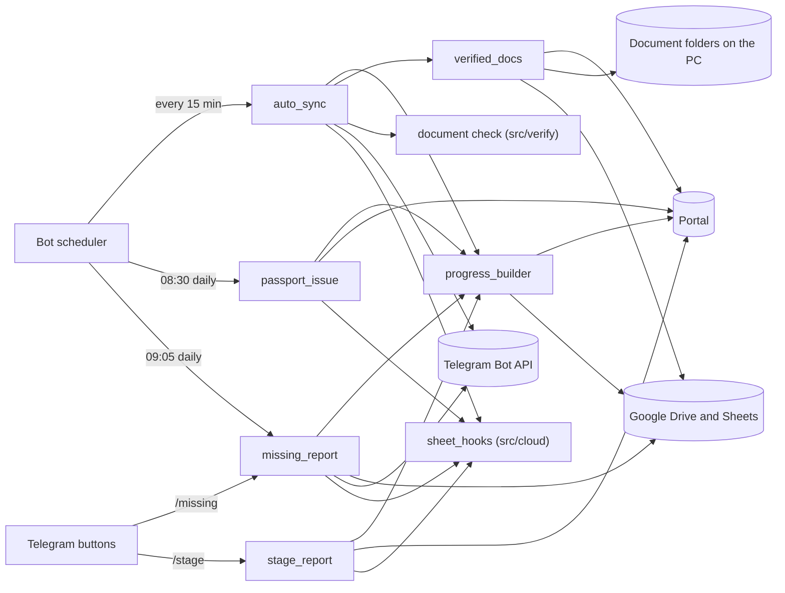
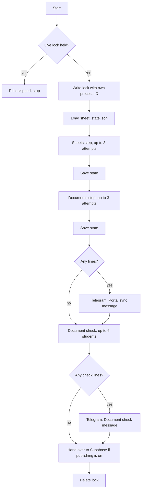

# Google Sheets and report programs (`src/sheets/`)

This document is the reference for the nine files of the sheets group:

- `src/sheets/__init__.py`
- `src/sheets/progress_builder.py`
- `progress_builder.py` (a copy in the repository root)
- `src/sheets/auto_sync.py`
- `src/sheets/verified_docs.py`
- `src/sheets/missing_report.py`
- `src/sheets/passport_issue.py`
- `src/sheets/stage_report.py`
- `src/sheets/attendance.py`

All `path:line` references are relative to the repository root. The index of every Python program is [../PYTHON_PROGRAMS.md](../PYTHON_PROGRAMS.md).

## 1. What this group does

These programs keep three things in step with the agency's admin portal and report on them:

1. **Progress sheets** in Google Drive. One Google spreadsheet per program and intake, one row per student, rewritten from the portal.
2. **Document folders** on the bot's PC. One folder per student whose documents the portal marks as verified. A PDF, JPEG or PNG file over 2 MB is shrunk to at most 1.95 MB when one of the shrink attempts gets it there. A file over 2 MB of another type, one that no attempt gets small enough, or one that fails to compress stays as it is, over 2 MB (section 6).
3. **Reports to staff** in Telegram: what changed on the portal, which students have blank fields, and which pipeline stage each student of an intake is at.

They also keep a small cache of passport issue dates, and they hand everything they read to the Supabase publisher (see [cloud.md](cloud.md)) when publishing is switched on.

None of these programs runs inside the bot's own process. Each is started as a separate Python process, by the bot's scheduler, by a Telegram button, or by a person at a command prompt.

### Terms used in this document

| Term | Meaning |
|---|---|
| Portal | The agency's admin website. Its address is the setting `HANGEUL_BASE_URL`. The programs only send GET requests to it, plus the login POST made by the portal client. |
| `<BOT>` | The bot folder: the folder that holds `run.py`, `.env`, `token.json` and the `data` folder. In code it is `BOT_ROOT` (`src/sheets/progress_builder.py:45`). |
| Program | One of four study programs. The code calls them by key: `KLP`, `EAP`, `BACHELOR`, `MASTER` (`src/sheets/progress_builder.py:108-132`). |
| Intake | The term a student will start in, for example `MARCH 2027`. It is the student's `Intake` field on the portal, upper-cased with single spaces. |
| Direct student | A student whose portal `Source` field is `direct`: the agency's own student. Students with another source (the code comment names `B2B` partner students) are left out of every sheet and report in this group (`src/sheets/progress_builder.py:256-258`). |
| Progress sheet | The Google spreadsheet named `<program name> <INTAKE>`, stored in Drive under the program's folder and the intake's sub-folder. |
| Main tab | The tab of a progress sheet that the bot rewrites: the tab whose title is the sheet's title. Other tabs belong to staff, and the bot does not write them, with one exception: when no tab has the sheet's title, the bot clears and rewrites the first tab, whatever it holds, and renames it (section 3). |
| Target | One program plus one intake, the unit one progress sheet is built from. In code it is a dict made by `target()` (`src/sheets/progress_builder.py:277`). |
| Student ID | The agency's own ID text for a student, shown to staff. A student may not have one yet. |
| uid | The portal's internal numeric id for a student, used in portal URLs such as `progress.php?uid=<uid>`. |
| Document-verified | A student whose documents the portal marks as verified. The portal's student list shows these students with the filter `filter_docs=verified`. |
| Brief recipients | The Telegram chat IDs that receive the scheduled messages. The setting `TELEGRAM_BRIEF_CHAT_IDS` if it is set, otherwise every authorised ID (`TELEGRAM_ADMIN_CHAT_ID` plus `TELEGRAM_AUTHORIZED_CHAT_IDS`) (`src/config.py:128-139`). |
| Hand-over | Passing what a job has read to the Supabase publisher process. It happens only when `SUPABASE_URL`, `SUPABASE_SECRET_KEY` and `CLOUD_PUBLISH_ENABLED` are all set (`src/config.py:82-88`, `src/cloud/sheet_hooks.py:65-77`). |

### The programs at a glance

| Program | Lines | Purpose | How it is started |
|---|---|---|---|
| `src/sheets/__init__.py` | 0 | Empty file that makes `src.sheets` a Python package. | Never run. Imported implicitly. |
| `src/sheets/progress_builder.py` | 595 | Reads the portal's students CSV export and builds or rewrites one Google Sheet per program and intake. Also holds the Google login and the helpers every other file here imports as `pb`. | `python -m src.sheets.progress_builder` with `--auth`, `--all`, `--program`, `--dump-profile`, `--dry-run`. Launchers: `gauth.bat`, `build_sheets.bat`, `bootstrap.py` phase 1. |
| `progress_builder.py` (root) | 595 | Byte-identical copy of the file above. Source file for `install_sheets.bat`. | Not run and not imported. |
| `src/sheets/auto_sync.py` | 493 | The 15-minute "portal sync": finds changed students, rebuilds changed sheets, downloads newly verified students' documents, runs the document check, sends Telegram summaries, hands over to Supabase. | Scheduler job `portal_sync` every 15 minutes; or `python -m src.sheets.auto_sync [--no-notify] [--no-verify]`. |
| `src/sheets/verified_docs.py` | 437 | Lists document-verified Direct students on the portal and copies each student's document ZIP into Google Drive, or into a local folder with files over 2 MB shrunk. | Called by `auto_sync` every 15 minutes (local mode); or `python -m src.sheets.verified_docs [--list] [--limit N] [--local FOLDER] [--include-drive-done]`; `bootstrap.py` phase 4. |
| `src/sheets/missing_report.py` | 358 | Counts blank required fields per student on the progress sheets. Sends a daily Telegram text plus an Excel file, and prints a per-program list for the `/missing` buttons. | Scheduler job `missing_info_report` daily at 09:05; the `/missing` buttons; or `python -m src.sheets.missing_report [--no-notify] [--student ID] [--program KEY]`. |
| `src/sheets/passport_issue.py` | 145 | Keeps a cache of passport number to passport issue date, read from each student's portal edit page. | Scheduler job `passport_issue_refresh` daily at 08:30 with `--refresh`; `bootstrap.py` phase 2; or `python -m src.sheets.passport_issue [--refresh] [--limit N]`. |
| `src/sheets/stage_report.py` | 270 | Stage report for one program and intake: student count per pipeline stage, and each student's status and progress percentage. | The `/stage` buttons; or `python -m src.sheets.stage_report --program KEY [--intake "<INTAKE>"]`. Not scheduled. |
| `src/sheets/attendance.py` | 111 | Reads an office attendance Google Sheet and formats who is in and who is late. | Only `python -m src.sheets.attendance`. No job, command or other file uses it. |

None of the nine files defines a class. Every table below lists functions and module-level constants only.

### Who starts what, and what each one touches



`verified_docs` reaches Google Drive in both of its modes. In local mode, the one the 15-minute sync uses, it asks Drive for the folders flagged complete on every run (`src/sheets/verified_docs.py:345`, `:222-236`), so the documents step also needs the Google token. In Drive mode it creates folders and uploads files (`src/sheets/verified_docs.py:155-195`).

### How the scheduled jobs are started

The three scheduled jobs are registered in `setup_scheduler` (`src/bot/scheduler.py:419`). They exist only when the setting `ENABLE_SCHEDULED_REPORTS` is true (`src/bot/scheduler.py:421-423`; default `True`, `src/config.py:59`).

| Job id | Trigger | Starts | Code |
|---|---|---|---|
| `portal_sync` | `IntervalTrigger(minutes=15)`, `max_instances=1`, `coalesce=True` | `python -m src.sheets.auto_sync` | `src/bot/scheduler.py:459-466`, `:344-347` |
| `missing_info_report` | `CronTrigger(hour=9, minute=5)` in the time zone `REPORT_TIMEZONE`, `misfire_grace_time=3600`, `max_instances=1`, `coalesce=True` | `python -m src.sheets.missing_report` | `src/bot/scheduler.py:469-477`, `:357-360` |
| `passport_issue_refresh` | `CronTrigger(hour=8, minute=30)` in the time zone `REPORT_TIMEZONE`, `misfire_grace_time=3600`, `max_instances=1`, `coalesce=True` | `python -m src.sheets.passport_issue --refresh` | `src/bot/scheduler.py:480-488`, `:350-354` |

`REPORT_TIMEZONE` defaults to `Asia/Dhaka` (`src/config.py:58`).

Each job runs through `_run_module` (`src/bot/scheduler.py:392-416`):

1. It starts `python -m <module>` as its own process, with the bot folder as working directory and no console window. If the bot runs under `pythonw.exe`, the job uses `python.exe` from the same folder.
2. The process's standard output and error are appended to `<BOT>/hangeul_sync.log` (`src/bot/scheduler.py:340-341`, `:401`). The hourly Supabase full-picture job (`src.cloud.full_picture`) is started through the same function, so its output goes to the same file (`src/bot/scheduler.py:389`).
3. If the process has not finished after 3600 seconds it is killed and the bot logs "took over an hour and was stopped" (`src/bot/scheduler.py:410-413`).

The `portal_sync` job is registered without a start time. When its first run happens after the bot starts is decided by the scheduler library and is not stated in this code.

The scheduler itself is described in [bot_answers_and_jobs.md](bot_answers_and_jobs.md).

### How the Telegram buttons start a report

`/missing` and `/stage` (alias `/stages`) show a menu of four program buttons (`src/bot/telegram_bot.py:2180`, `:2249`; registered at `:2384-2389`). Tapping a button runs a report module as a subprocess through `_run_report_module` (`src/bot/telegram_bot.py:2215-2240`):

- The bot waits 180 seconds for the subprocess's output (`src/bot/telegram_bot.py:2232`).
- The bot's reply is the text the subprocess printed. A non-zero exit code or empty output becomes a generic "could not build the report" reply.
- When the 180 seconds run out, `asyncio.wait_for` cancels only the wait for the output (`proc.communicate()`). The `TimeoutError` is caught together with every other exception and turned into `None` (`src/bot/telegram_bot.py:2238-2240`), so the bot sends the generic failure reply. Nothing stops the report process: the function has no `proc.kill()`. If the process finishes later, its last step, the Supabase hand-over (when publishing is on), still runs.

Free text also reaches the menus: a message containing the whole word `missing` or `incomplete` shows the `/missing` menu, and one containing `stage` or `stages` shows the `/stage` menu, when no earlier route matched (`src/bot/ask.py:74-75`, `:603-604`, `:609-610`; `src/bot/telegram_bot.py:2145-2149`). The voice command `missing_report` also shows the `/missing` menu (`src/bot/voice.py:767-768`). The handlers are described in [bot_core.md](bot_core.md).

### Mock mode does not apply here

No file in `src/sheets/` checks the `MOCK_MODE` setting. `.env.example` says the scheduled sheet jobs read the real portal and Google Sheets even when `MOCK_MODE` is on (`.env.example:13-15`).

---

## 2. `src/sheets/__init__.py`

**Purpose.** Makes `src.sheets` a Python package. The file is empty (0 lines, 0 bytes).

**How it is run or who calls it.** It is never run. Python loads it whenever any `src.sheets.*` module is imported. `install_sheets.bat:11` recreates it as an empty file.

**What it reads.** Nothing.

**What it writes.** Nothing.

**Why it exists.** Packaging only.

**Main functions and classes.** None.

**Numbers that matter.** None.

**Things to know.** None.

---

## 3. `src/sheets/progress_builder.py`

**Purpose.** Builds the progress sheets. For each program and intake that has at least one Direct student, it creates or rewrites a Google spreadsheet with one header row and one row per student, filled from the portal. It is also the shared library of this group: the Google login, the Drive and Sheets clients, the portal CSV read, the value, date and phone clean-up functions, and the program registry all live here.

**How it is run or who calls it.**

Command line, run from the bot folder (`main`, `src/sheets/progress_builder.py:556-591`):

| Command | What it does |
|---|---|
| `python -m src.sheets.progress_builder --auth` | One-time Google login in a browser. Writes `<BOT>/token.json`. Prints `Google login OK — token.json saved. You can now build sheets.` |
| `python -m src.sheets.progress_builder --dump-profile <student id>` | Prints every CSV column of one student, each value cut to 60 characters. Used to check column names. |
| `python -m src.sheets.progress_builder --all` | Builds every program and intake sheet. Prints one line per sheet (its URL, or `FAILED — <error>`). Then lists the Direct students that have no intake. |
| `python -m src.sheets.progress_builder --program KLP` | Builds every intake sheet of one program (`KLP`, `EAP`, `BACHELOR` or `MASTER`). An unknown key exits with a message. |
| `--dry-run` (with `--all` or `--program`) | Reads the portal and maps the rows, writes nothing to Drive. |
| no flag | Prints the help text. |

When several flags are given, the first of `--auth`, `--dump-profile`, `--all`, `--program` wins, in that order.

Launchers:

- `gauth.bat:17` runs `--auth`, after a `pip install` of the three Google libraries (`gauth.bat:10`).
- `build_sheets.bat:12` runs `--all`.
- `bootstrap.py:50-52` runs `--all` as "PHASE 1 of 6".

Importers:

| Importer | What it uses |
|---|---|
| `src/sheets/auto_sync.py:38` | whole module as `pb` |
| `src/sheets/missing_report.py:30` | whole module as `pb` |
| `src/sheets/passport_issue.py:30` | whole module as `pb` |
| `src/sheets/stage_report.py:30` | whole module as `pb` |
| `src/sheets/attendance.py:17` | whole module as `pb` |
| `src/sheets/verified_docs.py:34` | `PARENT_FOLDER_ID`, `PROGRAMS`, `_services`, `program_matches` |
| `src/verify/doc_verifier.py:1121`, `:1130` | `fetch_all_students`, `program_key_of` |
| `src/verify/field_check.py:28` | `normalize_date`, `target`, `normalize_intake`, `columns_for`, `build_row` |
| `src/cloud/records.py:641` | `normalize_phone` |
| `src/cloud/sheet_hooks.py:369` | `program_key_of` (`:373`) |

**What it reads.**

| Input | Detail |
|---|---|
| Portal `students.php?export=csv` | One GET returns every student. Timeout 60 seconds (`:230-231`). If the response was redirected to `login.php`, the program logs in again and repeats the GET once (`:232-235`). The body is decoded as `utf-8-sig`. It is rejected unless the content type contains `text/csv` or the text `Full Name` appears in the first 2000 characters (`:237-239`). It is parsed with `csv.DictReader` (`:240`). |
| Portal login | Through the shared portal client, `src.scraper.client.admin_client.login()` (`:226-229`). The client reads the portal address and account from settings; see [scraper_and_config.md](scraper_and_config.md). |
| CSV columns | Every portal column named in `COLUMNS` (`:61-98`), plus `IELTS/TOEFL` and `Korean Level` (`:195`, `:198`), `Source` (`:274`), `Intake` (`:286`), `Program` (`:268`), and `Passport Issue Date` when the export has that column (`:322-323`). |
| `<BOT>/token.json` | The saved Google token (`:47`, `:358-359`). |
| `<BOT>/credentials.json` | The Google OAuth client file, read only by `--auth`. If it is missing, `<BOT>/credentials.json.json` is tried (`:374-381`). |
| `<BOT>/data/passport_issue.json` | Read through `passport_issue.load()`, only when the CSV has no `Passport Issue Date` column (`:324-329`). |
| Google Drive API v3 | `files().list` to find the intake folder (`:408-412`) and to find the spreadsheet by exact name inside it (`:425-430`). The list is ordered by modification time (`orderBy="modifiedTime desc"`, `:428`), so when several spreadsheets have the name, the one modified most recently is used, not the one created last. |
| Google Sheets API v4 | `spreadsheets().get` for the tab list (`:441-442`, `:488`, `:502`); `values().get` of the whole first tab for the drift check (`:443-444`). |
| Settings | None read directly. The portal client it borrows reads `HANGEUL_BASE_URL`, `HANGEUL_USERNAME` and `HANGEUL_PASSWORD`. |

**What it writes.**

| Output | Detail |
|---|---|
| Google Drive | Creates the intake sub-folder inside the program folder when it is missing (`:415-418`). Creates the spreadsheet `<program name> <INTAKE>` in that folder when it is missing (`:496-501`). |
| Google Sheets, main tab | Clears the tab's values (`:492-493`). Sets the tab title, the row count `max(rows + 1, 2)`, the column count and 1 frozen row (`:506-513`). Writes header and rows with `valueInputOption="RAW"` to `A1:<last column><last row>` (`:514-519`). Formats the tab: Times New Roman, size 14, no underline, bold header row, columns auto-resized (`:522-536`). |
| `<BOT>/token.json` | Rewritten after a token refresh (`:365`) and after the interactive login (`:384`). |
| Standard output | Sheet URLs or failure lines (`:574-589`); the `--dump-profile` listing (`:551-553`). |

**Why it exists.** Staff keep one Google Sheet per program and intake as their working list of students. This program makes the main tab an exact copy of what the portal holds, so nobody retypes portal data. Tabs staff add themselves (the code comments call them university sub-sheets) are not touched as long as the main tab keeps its title. When no tab's title equals the sheet title (cut to 100 characters), `build_target` clears the first tab, whatever it holds, rewrites it and renames it to the sheet title (`:490-493`, `:506-513`).

**The sheet layout.**

`COLUMNS` (`:61-98`) is a list of 36 pairs `(sheet header, CSV column)`. The sheet headers, in order:

`Student ID`, `Full Name`, `Surname`, `Given Name`, `Email`, `Mobile`, `Guardian WhatsApp`, `DOB`, `Gender`, `District`, `Address`, `Father`, `Mother`, `Study Status`, `SSC Year`, `SSC GPA`, `SSC Group`, `SSC School`, `HSC Year`, `HSC GPA`, `HSC Group`, `HSC College`, `Previous University`, `Subject`, `Degree`, `CGPA`, `Program`, `IELTS/TOPIK`, `Passport Status`, `Passport No`, `Passport Issue`, `Passport Expiry`, `Visa Rejection History`, `Sponsor`, `Sponsor Occupation`, `Bank Certificate`.

Rules applied to each cell (`build_row`, `:332-350`):

| Header | Rule |
|---|---|
| all | `clean_value`: trimmed; a "no value" marker becomes an empty cell. A value with no `a-z` or `0-9` character also counts as a marker (see `clean_value` below). |
| `IELTS/TOPIK` | Computed by `ielts_topik` from the CSV columns `IELTS/TOEFL` and `Korean Level`. |
| `Passport Issue` | `issue_date_for`, then `normalize_date`. |
| `DOB`, `Passport Expiry` | `normalize_date` (the set `DATE_COLUMNS`, `:99`). |
| `Mobile`, `Guardian WhatsApp` | `normalize_phone` (the set `PHONE_COLUMNS`, `:101`). |
| `Gender` | Upper-cased. |

The program registry `PROGRAMS` (`:108-132`):

| Key | Display name (also the sheet-name prefix and the folder name used for documents) | Match tokens | Columns |
|---|---|---|---|
| `KLP` | `KOREAN LANGUAGE PROGRAM (KLP)` | `korean language program`, `klp` | 32 (the four university columns are dropped) |
| `EAP` | `EAP (ENGLISH FOR ACADEMIC PURPOSE)` | `eap`, `english for academic` | 32 |
| `BACHELOR` | `BACHELOR'S DEGREE` | `bachelor` | 32 |
| `MASTER` | `MASTER'S DEGREE` | `master` | 36 |

The four university columns are `Previous University`, `Subject`, `Degree`, `CGPA` (`UNIVERSITY_COLUMNS`, `:100`). Each registry entry also holds the Drive folder ID of the program's folder, written in the code (`:111`, `:117`, `:123`, `:129`).

A token matches when it appears inside the student's `Program` text after both are reduced to lowercase letters and digits (`program_matches`, `:204-206`). The code uses this test in two different ways:

- **One program per student.** `program_key_of` (`:266-270`) returns the first registry entry, in registry order, that has a matching token. It decides which targets, and so which sheets, exist (`all_targets`, `:282-290`) and which students are listed as having no intake (`students_without_intake`, `:293-295`). The stage report picks a program's students the same way (`src/sheets/stage_report.py:140-141`). `verified_docs.program_folder` applies the same first-match rule to the program text on the portal's student list (`src/sheets/verified_docs.py:83-88`).
- **Every matching student on a sheet.** `fetch_roster` (`:298-305`) puts on a sheet every Direct student of that intake whose `Program` text matches that sheet's own tokens. It does not call `program_key_of`. A student whose `Program` text matches the tokens of two programs (for example, text that names both a bachelor's and a master's degree) is therefore on both programs' sheets for the intake, when both sheets exist. A sheet exists only when at least one student's first match is its program. The 15-minute sync's snapshots (`auto_sync._snapshot`, which uses `fetch_roster`) and the missing report (which reads the sheets) then see that student on both sheets.

**The Google login (`_load_credentials`, `:354-385`).**

1. If `<BOT>/token.json` exists it is loaded with the two scopes in `SCOPES` (`:49-52`): full Google Drive access and Google Sheets access.
2. A valid token is used as it is.
3. An expired token that has a refresh token is refreshed, and the new token is written back to `token.json` (`:362-366`). A failed refresh is logged as a warning and the flow continues to step 4.
4. Without a usable token, a non-interactive caller gets `RuntimeError("Google login required. Run:  python -m src.sheets.progress_builder --auth")` (`:369-372`). Every scheduled job and every report is non-interactive, so they fail with this message until someone runs `--auth`.
5. With `--auth`: the OAuth client file is read, `InstalledAppFlow.run_local_server(port=0)` opens a browser sign-in that redirects to a free local port, and the resulting token is written to `<BOT>/token.json` (`:373-385`).

`.gitignore:7-9` excludes `token.json`, `credentials.json` and `credentials.json.json` from the repository.

**How one sheet is built (`build_target`, `:462-540`).**

1. Read the students of this program and intake from the cached CSV (`fetch_roster`).
2. Build the header and the rows.
3. With `--dry-run`, stop here and return `(dry-run)`.
4. Find the spreadsheet named `<program name> <INTAKE>` in the intake folder. If found, pick the tab whose title equals the sheet title cut to 100 characters, or the first tab when no tab has that title, and clear its values. If not found, create the spreadsheet and use its first tab.
5. Set the tab's title, size and frozen header row.
6. Write the header and rows as raw values.
7. Apply the font, the bold header and the column auto-resize.
8. Return `https://docs.google.com/spreadsheets/d/<id>/edit`.

**Main functions and constants.**

| Name | Line | What it does |
|---|---|---|
| `BOT_ROOT`, `CREDENTIALS_PATH`, `TOKEN_PATH` | 45-47 | The bot folder (three levels above this file), and the two Google files inside it. |
| `SCOPES` | 49 | The two Google OAuth scopes: Drive and Spreadsheets. |
| `PARENT_FOLDER_ID` | 56 | Drive folder ID of the "ALL STUDENTS" folder. This file does not use it; `verified_docs.run` does. |
| `COLUMNS` | 61 | The 36 `(sheet header, CSV column)` pairs. |
| `DATE_COLUMNS`, `UNIVERSITY_COLUMNS`, `PHONE_COLUMNS` | 99-101 | Which headers get date clean-up, which four are the university columns, which get phone clean-up. |
| `PROGRAMS` | 108 | The program registry (table above). |
| `_BLANKS` | 134 | The "no value" markers: empty, `na`, `n/a`, `none`, `null`, `-`, `--`, `—`, `n.a`, `n.a.`, `not provided`, `not applicable`. |
| `_norm_key` | 138 | Lowercases a text and removes everything except `a-z` and `0-9`. |
| `clean_value` | 142 | Trims a value; returns `""` when its `_norm_key` equals the `_norm_key` of a marker in `_BLANKS` (`:145`). `_BLANKS` holds the empty text, whose `_norm_key` is also empty, so every value with no `a-z` or `0-9` character counts as "no value": for example a value written wholly in Bangla script, or punctuation only. |
| `normalize_date` | 150 | Turns `YYYY-M-D` or `D-M-YYYY` (separators `.`, `/` or `-`) into `YYYY-MM-DD`. Anything else is returned unchanged. It checks only that the month is 1-12 and the day 1-31. |
| `normalize_phone` | 174 | Keeps digits only. 11 digits starting `01` get `88` in front; 10 digits starting `1` get `880` in front; 14 digits starting `8800` lose the extra `0`. The result for a Bangladeshi mobile is 13 digits starting `8801`. Any other number keeps its digits. |
| `ielts_topik` | 191 | Joins the two language fields with ` / `. The `IELTS/TOEFL` value is dropped when it is `NO` or `NONE`, and gets the prefix `IELTS ` when it starts with a digit. The `Korean Level` value is kept only when it contains `TOPIK`. |
| `program_matches` | 204 | True when any match token is inside the program text (both reduced by `_norm_key`). |
| `sheet_title` | 209 | `"<program name> <INTAKE>"`. |
| `_run_async` | 215 | Runs a coroutine on a new event loop and closes the loop. |
| `_fetch_all_students_async` | 223 | The CSV export GET described above. Always closes the shared portal client at the end (`:241-242`). |
| `_ALL_STUDENTS_CACHE`, `fetch_all_students` | 245, 248 | The CSV rows, read once per process and kept in a module variable. |
| `INCLUDE_SOURCES` | 258 | `{"direct"}`. |
| `normalize_intake` | 261 | Cleans, upper-cases and collapses spaces. |
| `program_key_of` | 266 | The registry key of a student's program (the first entry that matches), or `None`. |
| `direct_students` | 273 | CSV rows whose `Source` reduces to `direct`. |
| `target` | 277 | A registry entry plus `key` and the normalised `intake`. |
| `all_targets` | 282 | Every program and intake that has at least one Direct student, ordered by registry order and then by intake text. |
| `students_without_intake` | 293 | Direct students of a known program whose `Intake` is blank. |
| `fetch_roster` | 298 | Direct students of one intake whose `Program` text matches this program's tokens, in the CSV's order. It does not use `program_key_of`, so a student can be on the rosters of two programs. |
| `columns_for` | 308 | `COLUMNS` minus the program's `drop_columns`. |
| `_ISSUE_CACHE`, `issue_date_for` | 315, 318 | The passport issue date: the CSV column `Passport Issue Date` when the export has it, otherwise the `passport_issue.json` cache looked up by passport number. |
| `build_row` | 332 | One sheet row, using the cell rules above. |
| `_load_credentials` | 354 | The Google login flow above. |
| `_services` | 388 | Builds the Drive v3 and Sheets v4 clients (`cache_discovery=False`). |
| `_col_letter` | 396 | Column number to A1 letters (1 gives `A`, 27 gives `AA`). |
| `_intake_folder` | 405 | Finds the intake folder inside the program folder, and creates it when it does not exist. |
| `find_sheet` | 421 | The spreadsheet ID of the sheet named `sheet_title` in the intake folder, or `None`. When several match, the one modified most recently is used (`orderBy="modifiedTime desc"`, `:428`). |
| `sheet_drift` | 434 | The number of cells on the sheet's first tab that differ from what the portal says. Returns `-1` when there is no sheet. |
| `build_program` | 457 | Builds every intake sheet of one program; returns the URLs. |
| `build_target` | 462 | Builds or rebuilds one sheet (steps above). |
| `dump_profile` | 543 | Prints one student's CSV fields. |
| `main` | 556 | The command line. |

**Numbers that matter.**

| Number | Value | Where |
|---|---|---|
| CSV request timeout | 60 seconds | `:231`, `:235` |
| CSV repeat after a login redirect | 1 | `:232-235` |
| Characters checked for `Full Name` | first 2000 | `:238` |
| Sheet columns | 36 for `MASTER`, 32 for the other three | `:61-98`, `:113-125` |
| Tab title length | at most 100 characters | `:479` |
| Minimum row count of the tab | 2 | `:509` |
| Frozen rows | 1 | `:510` |
| Font | Times New Roman, size 14 | `:526` |
| `--dump-profile` value length | 60 characters | `:553` |
| Retries of Google calls | none in this file | The caller `auto_sync` retries the whole step. |

**Things to know.**

- The CSV is cached for the life of the process (`:245-253`). Each scheduled job is its own process, so each job makes its own single CSV request.
- `_fetch_all_students_async` closes the shared portal client in a `finally` block (`:241-242`). A caller that needs the portal again in the same process must create a new client. `auto_sync._fresh_portal_client` does that.
- `build_target` rewrites the tab whose title equals the sheet title, falling back to the first tab (`:490-491`). `sheet_drift` (`:441-444`) and `missing_report.read_sheets` always read the **first** tab. If staff move one of their own tabs to the first position while the main tab keeps its title, the drift check and the missing report read the wrong tab, with this result:
  1. On every sync run in which the portal data of that program and intake did not change, `sheet_drift` compares the staff tab with the portal and finds drift.
  2. `auto_sync` then calls `build_target` (`src/sheets/auto_sync.py:252-257`). `build_target` rewrites the correctly titled main tab, not the first tab, so the drift never clears.
  3. The main tab is rebuilt, and the line `🛠 <title>: <n> cell(s) had been changed by hand on the sheet — restored from the portal ...` is sent to Telegram, every 15 minutes, until the main tab is the first tab again.
  4. The missing report takes the staff tab's first row as the header and reads the staff tab as if it were the main tab.
- `find_sheet` calls `_intake_folder`, which creates the intake folder when it does not exist (`:415-418`). So the read-only callers `sheet_drift` and `missing_report.read_sheets` can create a Drive folder.
- Values are written `RAW` (`:517`). Google Sheets does not interpret anything as a formula, number format or date.
- A student with a blank `Intake` is on no sheet (`:293-295`). A student whose `Program` matches no registry token is on no sheet either.
- Program matching is by substring. The first matching registry entry decides a student's one program (`program_key_of`), but a sheet takes every student whose `Program` text matches its own tokens (`fetch_roster`). A student who matches two programs can therefore be on two sheets (see the program registry above).
- `clean_value` blanks every value that has no `a-z` or `0-9` character, because the empty text is one of the markers in `_BLANKS` (`:134`, `:138-139`, `:145`). A value written wholly in Bangla script, or holding punctuation only, is written as an empty cell on the sheet, and the missing report then counts that field as missing. An `Intake` written that way counts as no intake (`normalize_intake`, `:261-263`).
- The comment at `:59-60` says the passport issue column is left blank. That is out of date: `COLUMNS` maps it to `_ISSUE_DATE` (`:92`) and `issue_date_for` fills it.
- `DATE_COLUMNS` (`:99`) does not list `Passport Issue`. That column is normalised through its own branch in `build_row` (`:337-338`).
- `--program` has no error handling around the build (`:585-590`): one failing sheet stops the command with a traceback. `--all` catches each sheet's error and continues (`:574-578`).
- Drive folder IDs are written in the code (`:56`, `:111`, `:117`, `:123`, `:129`). The Google account that logs in must have edit access to those folders. The sharing set-up is not in the code.
- The tests that cover this file are listed in [tests.md](tests.md).

---

## 4. `progress_builder.py` (repository root)

**Purpose.** A byte-identical copy of `src/sheets/progress_builder.py`. See section 3 for everything it contains: the names and line numbers are the same.

**How it is run or who calls it.** Nothing imports it and nothing runs it. `install_sheets.bat` uses it as a source file:

1. `install_sheets.bat:10-11` creates `src\sheets` if needed and recreates an empty `src\sheets\__init__.py`.
2. `install_sheets.bat:13` picks the root `progress_builder.py`. If it is absent, lines `15-17` pick the most recently modified `progress_builder*.py` in the Windows user's Downloads folder (`dir /o-d`).
3. `install_sheets.bat:22` copies the chosen file over `src\sheets\progress_builder.py`.
4. `install_sheets.bat:33` runs `pip install` for `google-api-python-client`, `google-auth-httplib2` and `google-auth-oauthlib`.

**What it reads / what it writes.** The same code as section 3. It is not executed in normal operation.

**Why it exists.** It is left from the time the sheets feature was delivered as one file to drop into the bot folder and install with `install_sheets.bat`.

**Main functions and classes.** Identical to section 3.

**Numbers that matter.** Identical to section 3.

**Things to know.**

- Two tests fail when the two copies differ: `test_the_root_staging_copies_are_byte_identical` in `tests/test_performance.py:1008` and in `tests/test_cloud.py:1126`.
- Any edit to `src/sheets/progress_builder.py` must be copied to the root file. Otherwise the tests fail, and a later run of `install_sheets.bat` would overwrite the package copy with the older root copy.
- The root copy would not work if run from the root. `BOT_ROOT` is computed as three folders above the file (`progress_builder.py:45`). For the root copy that is two folders above the bot folder, so `credentials.json` and `token.json` would not be found.
- The repository root also holds byte-identical copies of `src/bot/telegram_bot.py` and `src/config.py`. They are described in [bot_core.md](bot_core.md) and [scraper_and_config.md](scraper_and_config.md).

---

## 5. `src/sheets/auto_sync.py`

**Purpose.** The scheduled "portal sync". Every 15 minutes it brings the progress sheets and the local document folders up to date with the portal, runs the document check on students whose data changed, and tells staff in Telegram what changed.

**How it is run or who calls it.**

- Scheduler job `portal_sync`, every 15 minutes (section 1). It runs `python -m src.sheets.auto_sync` as its own process.
- Command line, from the bot folder (`main`, `src/sheets/auto_sync.py:483-489`):

| Command | What it does |
|---|---|
| `python -m src.sheets.auto_sync` | One sync run. |
| `python -m src.sheets.auto_sync --no-notify` | The same, without any Telegram message. `MIGRATION.md:156` and `HANDOFF.md:277` use this for a quiet first run. |
| `python -m src.sheets.auto_sync --no-verify` | The same, without the document check. |

- Importers: `src/cloud/backfill.py:77` uses `_pid_alive`; `src/cloud/records.py:642` uses `_row_key`.

**What it reads.**

| Input | Detail |
|---|---|
| Portal `students.php?export=csv` | Through `pb.all_targets` and `pb.fetch_roster`. One request per process. |
| Portal, documents step | Through `verified_docs.run_local`: the login, `students.php?source=direct&filter_docs=verified` (every page), and `download_docs.php?uid=<uid>&zip=1` for each student that needs a download. See section 6. |
| Google Drive and Sheets | `pb.sheet_drift` for every target whose portal data did not change (2 Drive list calls, 1 `spreadsheets.get`, 1 `values.get` each). `pb.build_target` for changed targets. `verified_docs._drive_complete_names` (a Drive list of folders flagged complete). |
| `<BOT>/data/sheet_state.json` | The previous run's snapshot (`:429`). `{}` when the file is absent. |
| `<BOT>/data/auto_sync.lock` | The process ID of a running sync (`:72-86`). |
| `<BOT>/data/passport_issue.json` | Through `pb.issue_date_for`, when the CSV has no `Passport Issue Date` column. Also through the document check, which runs in this same process (`verify_docs` imports `src.verify.auto_verify` and calls `av.run`, `:320-324`). There the cache is read whatever the CSV holds: by `auto_verify.field_fingerprint` (`src/verify/auto_verify.py:128-129`) and by `field_check`, which reads its entries (`src/verify/field_check.py:136`) and the file's age (`src/verify/field_check.py:172-173`). |
| The document check's `results.json` | Only tested for readability, and only when publishing is on (`:321-323`). |
| Settings | `TELEGRAM_BOT_TOKEN` (`:341`); the brief recipients through `settings.brief_recipient_ids()` (`:342`); `DOCS_ROOT` through `settings.docs_root()` (`:46`). Whether publishing is on, through `src.cloud.sheet_hooks.on()` (`:422-424`). |
| Windows API | `kernel32.OpenProcess` and `GetExitCodeProcess`, to test whether the lock's process is alive (`:56-64`). |

**What it writes.**

| Output | Detail |
|---|---|
| Google Sheets | The main tab of every changed or hand-edited sheet, through `pb.build_target` (`:254`, `:260`). |
| `<BOT>/data/sheet_state.json` | Written after the sheets step and again after the documents step, each in a `finally` block (`:439`, `:448`). |
| `<BOT>/data/auto_sync.lock` | Holds this process's ID (`:417`). Deleted in a `finally` block (`:480`). |
| Document folders | Under `DOCS_ROOT`, and backups under `DOCS_ORIGINALS_ROOT`, through `verified_docs.run_local`. |
| Document check outputs | Through `src.verify.auto_verify` (see [verify.md](verify.md)). |
| Telegram | `POST https://api.telegram.org/bot<token>/sendMessage` with `chat_id`, `text` and `disable_web_page_preview=True`, as plain text, to every brief recipient (`:335-363`). Up to two messages per run: one titled `🔄 Portal sync — changes found`, one titled `🔍 Document check` (`:331-332`). |
| Standard output | `[YYYY-MM-DD HH:MM] <lines>` or `[YYYY-MM-DD HH:MM] no changes` (`:449-450`); the document check lines (`:468`); unreported failure counts (`:398`); `Another sync is still running — skipped.` (`:415`). When scheduled, this goes to `<BOT>/hangeul_sync.log`. |
| Supabase (indirect) | `sheet_hooks.after_sync(cloud)` as the last step (`:475-477`). The hook builds the records and starts the publisher process; this run does not wait for it (`src/cloud/sheet_hooks.py:441-443`). |

**Why it exists.** The module docstring (`:1-24`) describes each run as four steps: rebuild the main tab of each sheet whose portal data changed; download the documents of students who became document-verified since the last run and shrink files over 2 MB; send a short Telegram summary of what changed; and check the documents and portal record of every student whose documents or record changed. The code gives no further reason. The effect is that the sheets and the document folders follow the portal every 15 minutes without anyone running a command, and the brief recipients get a message only when something changed.

**One run, step by step (`run_once`, `:412-480`).**



1. **Lock.** The `data` folder is created if missing. If `data/auto_sync.lock` exists, is younger than 2 hours and holds the ID of a live process, the run prints `Another sync is still running — skipped.` and ends. A lock whose process is dead is deleted and the run continues. A lock that is fresh but cannot be read as a number blocks the run (`:72-86`, `:413-417`).
2. **Publish context.** If publishing is on, a dict `cloud` with `run_at`, `title` and `sent` is started. It collects what this run reads and sends. Otherwise it stays `None` and nothing is collected (`:420-427`).
3. **State.** `data/sheet_state.json` is loaded (`:429`).
4. **Sheets step** (`sync_sheets`, `:231-271`), inside `_with_retries`. Described below.
5. The state is saved (`:439`).
6. **Documents step** (`sync_docs`, `:275-286`), inside `_with_retries`. It calls `verified_docs.run_local(DOCS_ROOT)` on a new event loop and turns the result into lines with `doc_lines`.
7. The state is saved again (`:448`).
8. **Telegram message 1.** The lines are printed. If there is at least one line and sending is on, `notify(lines)` sends them under the title `🔄 Portal sync — changes found`. Nothing is sent when nothing changed (`:449-455`).
9. **Document check** (`verify_docs`, `:315-327`), unless `--no-verify`. It calls `src.verify.auto_verify.run(budget=DEFAULT_BUDGET)`; `DEFAULT_BUDGET` is 6 students (`src/verify/auto_verify.py:59`). If the check returns summary lines, they are printed and sent as **Telegram message 2** under the title `🔍 Document check` (`:459-472`). An exception here is logged as a warning and does not fail the sync.
10. **Hand-over.** If publishing is on, the CSV rows are added to `cloud` and `sheet_hooks.after_sync(cloud)` is called (`:475-477`).
11. **Unlock.** The lock file is deleted (`:479-480`).

**The sheets step in detail (`sync_sheets`, `:231-271`).**

1. The targets are every program and intake with a Direct student (`pb.all_targets()`), plus any intake that was tracked in the previous state, had students then, and has none now (`:236-242`). Such an intake is rebuilt empty once.
2. For each target a snapshot is built: `{row key: sheet row}` (`_snapshot`, `:119-130`). The row key is `Student ID:<id>`; without a Student ID it is `Passport No:<number>` (only when the number has at least 6 characters and contains a digit); without that it is `NAME:<name><mobile>` (`_row_key`, `:109-116`). A repeated key gets `#2`, `#3` and so on.
3. Each row gets a SHA-1 hash of its JSON (`_digest`, `:133-134`).
4. The snapshot is compared with the previous one (`sheet_changes`, `:199-228`):

| Case | What happens | Line added to the summary |
|---|---|---|
| Target seen for the first time (no previous snapshot) | The sheet is built. | `📄 <title>: sheet ready (<n> students) — change tracking started` |
| Rows added, removed or edited | The main tab is rebuilt. | `📄 <title>: sheet updated — now <n> students`, then up to three lines `   • <k> new: ...`, `   • <k> removed: ...`, `   • <k> edited: ...` |
| Nothing changed on the portal | `pb.sheet_drift` compares the sheet's first tab with the portal cell by cell. If any cell differs, the tab is rebuilt. | `🛠 <title>: <n> cell(s) had been changed by hand on the sheet — restored from the portal (the main tab always mirrors the portal; type notes in your own tabs instead)` |

5. Each of the three bullet lines names at most 8 students, separated by `; `, then `+<m> more` (`:266-269`). A new or removed entry is the student's full name. An edited entry is `<full name> (<up to 4 changed column names>…)` (`:194-196`, `:228`).
6. The new state keeps every snapshot that is not empty (`:270`).

**How a changed row key is recognised as the same student (`sheet_changes`, `:199-228`).**

A student's row key changes when, for example, a Student ID is assigned or a passport number is filled in. Without pairing, that student would be reported as one removed and one new. The function pairs each new key with a removed key in two passes, surest match first, and each row is paired once:

| Pass | Function | Match rule | Score |
|---|---|---|---|
| 1 | `_same_student` (`:137-146`) | Same Student ID | 3 |
| 1 | | Same passport number (at least 6 characters, with a digit) | 2 |
| 1 | | Same name and mobile | 1 |
| 2 | `_likely_same` (`:164-191`) | Same last 10 digits of the mobile, and the names are alike | 1.0 + full-name similarity |
| 2 | | Same date of birth and identical name | 1.0 |

In pass 2 the names are "alike" when one of these holds (`:187`):

- the similarity (`difflib.SequenceMatcher`) of the two names, after removing the words in `_COMMON_NAME_WORDS`, is at least 0.7;
- they share a word of 3 or more letters that is not in `_COMMON_NAME_WORDS`;
- every word of one name appears in the other.

`_COMMON_NAME_WORDS` (`:150-156`) is a set of name words that many students share, including the most common surnames (per the code comments). One of these words alone does not make two names alike. In pass 2, two rows with two different dates of birth are never paired (`:185-186`). Pass 1 does not look at the date of birth: rows with the same Student ID, the same passport number, or the same name and mobile are paired whatever their dates of birth (`_same_student`, `:137-146`).

A paired row is reported as edited when its hash changed, and not reported at all when nothing in it changed.

**The document lines (`doc_lines`, `:289-311`).**

| Result of `run_local` | Lines |
|---|---|
| `saved` (first downloads) | `📁 <n> newly verified student(s) — documents saved:` then, for the first 16 students, `   • <folder name> — <program>, <n> file(s)` and, when files were shrunk, `, <k> compressed to under 2 MB`. |
| `redownloaded` (portal documents changed), only students who got at least one new file | `📁 <n> student(s) changed their documents on the portal — new files saved:` then, for the first 16, `   • <folder name> — <program>, <n> new file(s)`. |
| `failed` | `⚠️ Could not download documents for <folder name>: <error, first 120 characters> (will retry next run)`, one line per student. |

The folder name is `<FULL NAME> (<PASSPORT NO>)`. A first download that saved no file shows `no new files (already on this PC)`.

**Retries and failure reporting (`:367-409`).**

- `_with_retries` runs a step up to 3 times, with 20 seconds between attempts. Each attempt starts with a new portal client (`_fresh_portal_client`, `:89-93`). After the third failure the error is raised.
- `_failure_line` counts consecutive failed runs per step in `state["failures"]` (keys `sheets` and `docs`). For the first and second failed run it prints `<label> failed (<n> in a row, not reported yet): <error>` and adds no Telegram line. From the third failed run it adds `⚠️ <label> has failed <n> times in a row: <error>`.
- `_failure_cleared` resets the counter after a good run. If the counter had reached 3 or more it adds `✅ <label> is working again (it had failed <n> times in a row).`
- The labels are `Progress-sheet update` and `Document download`.

**Main functions and constants.**

| Name | Line | What it does |
|---|---|---|
| `DATA_DIR`, `STATE_PATH`, `LOCK_PATH` | 43-45 | `<BOT>/data`, `sheet_state.json` and `auto_sync.lock` inside it. |
| `DOCS_ROOT` | 46 | `settings.docs_root()`, read once at import. |
| `LOCK_STALE_SECONDS` | 47 | `2 * 3600`. |
| `MAX_NAMES` | 48 | `8`. |
| `_pid_alive` | 51 | True when a process ID is running. On Windows: `OpenProcess` with access `0x1000`, then exit code 259 means still active. Elsewhere: `os.kill(pid, 0)`. |
| `_lock_held` | 72 | For a lock younger than 2 hours: true when the lock holds the ID of a live process, and also true when its content cannot be read as a number (`:78-81`). False when there is no lock or it is 2 hours old or older. Deletes a lock left by a dead process (or holding no ID) and returns false. |
| `_fresh_portal_client` | 89 | Replaces `src.scraper.client.admin_client` with a new `HangeulAdminClient()`. |
| `_passport_no` | 97 | The row's passport number without spaces, upper-cased, or `""` when it is shorter than 6 characters or has no digit. |
| `_name_mobile` | 104 | Name plus mobile (both reduced by `pb._norm_key`), or `""` when either is empty. |
| `_row_key` | 109 | The row's identity key (see the sheets step). |
| `_snapshot` | 119 | `{row key: sheet row dict}` for one target. |
| `_digest` | 133 | SHA-1 of the row's JSON with sorted keys. |
| `_same_student` | 137 | Pass-1 score: 3, 2, 1 or 0. |
| `_COMMON_NAME_WORDS` | 150 | The set of common name words. |
| `_mobile` | 159 | The last 10 digits of the mobile, or `""` when it has fewer than 10 digits. |
| `_likely_same` | 164 | Pass-2 score, a float; 0 means not the same student. |
| `_changed_columns` | 194 | The first 4 changed column names, with `…` when there are more. |
| `sheet_changes` | 199 | `(new, removed, edited)` lists between two snapshots. |
| `sync_sheets` | 231 | The sheets step. Returns report lines and updates `state["sheets"]`. |
| `sync_docs` | 275 | The documents step. Returns report lines. When publishing is on it stores the verified list and the start time in `cloud`. |
| `doc_lines` | 289 | Turns the `run_local` result into report lines. |
| `verify_docs` | 315 | Runs the document check and returns its summary lines. |
| `SYNC_TITLE`, `CHECK_TITLE` | 331-332 | The two Telegram titles. |
| `notify` | 335 | Sends a title and lines to every brief recipient. Returns true when at least one recipient accepted every piece. |
| `RETRIES`, `RETRY_WAIT`, `REPORT_AFTER_FAILURES` | 370-372 | `3`, `20` seconds, `3`. |
| `_with_retries` | 375 | Runs a step with retries. |
| `_failure_line` | 390 | Counts a failed run and returns the warning line from the third one on. |
| `_failure_cleared` | 403 | Clears the counter and returns the recovery line after a reported outage. |
| `run_once` | 412 | One whole run (steps above). Returns all lines. |
| `main` | 483 | The command line. Sets logging to `WARNING`. |

**Numbers that matter.**

| Number | Value | Where |
|---|---|---|
| Run interval | 15 minutes | `src/bot/scheduler.py:461` |
| Process killed after | 3600 seconds | `src/bot/scheduler.py:410` |
| Lock treated as stale after | 7200 seconds | `:47` |
| Attempts per step | 3 | `:370` |
| Wait between attempts | 20 seconds | `:371` |
| Consecutive failed runs before a Telegram warning | 3 (the code comment says about 45 minutes) | `:372` |
| Names per sheet bullet line | 8 | `:48` |
| Students per document section | 16 (`MAX_NAMES * 2`) | `:302`, `:307` |
| Changed column names shown | 4 | `:196` |
| Error text in a failed-download line | 120 characters | `:310` |
| Telegram HTTP timeout | 30 seconds | `:348` |
| Document check budget | 6 students per run (`DEFAULT_BUDGET`) | `src/verify/auto_verify.py:59` |
| Telegram message piece size | at most 3900 characters (`CHUNK_CHARS`), split between lines | `src/bot/replies.py:33` |
| Name similarity threshold in pass 2 | 0.7 | `:187` |
| Shared-word minimum length | 3 letters | `:175` |

**Things to know.**

- The module docstring lists only `--no-notify`. `--no-verify` also exists (`:487`).
- `data/sheet_state.json` holds the complete sheet row of every Direct student under the key `rec` (`:245`), together with the name and the hash. Its shape is `{"sheets": {"<KEY>|<INTAKE>": {<row key>: {"name", "hash", "rec"}}}, "failures": {"sheets": n, "docs": n}}`.
- While a step keeps failing, the warning line is produced on every run from the third failure on (`:397-400`). That is one Telegram warning every 15 minutes until the step works again.
- A failed sheets step leaves `state["sheets"]` as it was, because `sync_sheets` assigns it only at its end (`:270`). The same changes are found and reported on the next good run. The documents step still runs after a failed sheets step.
- The document check is not retried and does not count toward the failure counter (`:459-466`).
- The Telegram messages are sent with a plain HTTP POST from this process, not through the bot's Telegram application object.
- A message is recorded for Supabase only when `notify` returned true (`:454-455`, `:470-471`).
- The document sections have no `+<m> more` line. Students after the 16th are downloaded but not named in the message.
- The docstring of `_likely_same` says names at least 0.6 alike; the code uses 0.7 on the names without the common words (`:187`).
- If the scheduler kills the process after 3600 seconds, the `finally` block does not run and the lock file stays. The next run finds that the process is dead and deletes the lock (`:82-86`).
- The lock file is also read by `src/cloud/backfill.py:74-80`, which avoids bulk portal reads while a sync is running.
- If staff move one of their own tabs to the first position of a progress sheet, every run in which that sheet's portal data did not change finds drift, rebuilds the main tab and sends a `🛠 ... restored from the portal` line. See section 3, "Things to know".
- The time stamp in the log line uses the PC's local clock (`:449`).
- `HANDOFF.md:71` gives an older line count for this file. The file has 493 lines.

---

## 6. `src/sheets/verified_docs.py`

**Purpose.** Copies the documents of every Direct student the portal marks as document-verified. It has two modes:

- **Drive mode** (`run`): uploads the files into Google Drive.
- **Local mode** (`run_local`): saves the files into a folder on the PC and shrinks every file over 2 MB. This is the mode the 15-minute sync uses.

**How it is run or who calls it.**

- `auto_sync.sync_docs` calls `run_local(DOCS_ROOT)` on every sync run (`src/sheets/auto_sync.py:281`).
- Command line, from the bot folder (`main`, `src/sheets/verified_docs.py:415-433`):

| Command | What it does |
|---|---|
| `python -m src.sheets.verified_docs` | Drive mode: copy every verified student to Drive. |
| `python -m src.sheets.verified_docs --list` | Print `<program folder> / <student folder>` for each verified student. Copies nothing. |
| `python -m src.sheets.verified_docs --limit N` | Only the first N students of the list. |
| `python -m src.sheets.verified_docs --local "<folder>"` | Local mode: save into that folder instead of Drive. |
| `python -m src.sheets.verified_docs --local "<folder>" --include-drive-done` | Local mode, and also download students whose folder is already flagged complete in Drive. |

- `bootstrap.py:84-86` runs `--local <DOCS_ROOT>` as "PHASE 4 of 6". `MIGRATION.md:154` documents `--local ... --include-drive-done`.
- `src/cloud/backfill.py:127` imports `fetch_verified_students`.

**What it reads.**

| Input | Detail |
|---|---|
| Portal `students.php` with `source=direct` and `filter_docs=verified` | Every page (later pages add `pg=<n>`), through the portal client's `read_student_pages` (`src/scraper/client.py:454-499`). From each table row that has a `download_docs.php?uid=<n>` link the program takes the `uid`, the cell after each of the labels `Full Name`, `Passport No` and `Program`, and the file names in the row's `view_doc.php?f=<name>` links (`:44-68`). The `view_doc.php` links are not fetched. |
| Portal `download_docs.php` with `uid=<uid>` and `zip=1` | One ZIP of all the student's documents. Timeout 300 seconds. The response must have a content type containing `zip` (`:178-183`, `:208-214`). |
| Portal login | `client.login()` (`:145`, `:339`). |
| Google Drive API | Folder look-ups (`:101-107`); the file names inside a folder, with paging (`:120-130`); every folder whose `appProperties` has `hangeul_docs_complete` equal to `1` (`:222-236`). |
| Local files | `<student folder>/.download_complete` (`:362-368`); the sizes of the files in a student folder (`:297-300`). |
| Settings | `DOCS_ORIGINALS_ROOT` through `settings.docs_originals_root()` (`:245`). `DOCS_ROOT` through `settings.docs_root()`, only as the example in the `--local` help text (`:420-421`). |

**What it writes.**

| Output | Detail |
|---|---|
| Google Drive (Drive mode only) | Finds or creates the folder `VERIFIED STUDENT DOCUMENTS` inside the "ALL STUDENTS" folder, then `<PROGRAM>` and `<FULL NAME> (<PASSPORT NO>)` inside it (`:156`, `:166`, `:174`). Moves a student folder that sits directly in `VERIFIED STUDENT DOCUMENTS` into its program folder (`:170-173`). Uploads each ZIP member whose name is not already in the folder, as a resumable upload (`:133-138`, `:184-192`). Sets `appProperties.hangeul_docs_complete = "1"` on the student folder when done (`:193-195`). |
| Local files (local mode) | `<root>/<PROGRAM>/<FULL NAME> (<PASSPORT NO>)/<file>`. Each file is written to `<file>.part` and then renamed. A file that already exists is not overwritten (`:383-392`). |
| Local marker | `<student folder>/.download_complete`, holding the portal's document file names sorted and joined with `|`, or `ok` when the list is empty (`:395-396`). |
| Local backups (shrinking) | The untouched original is copied to `<DOCS_ORIGINALS_ROOT>/<PROGRAM>/<student folder>/<file>` if it is not there yet. Then the file is replaced by the smaller version. A shrunk PNG is saved as `.jpg` and the `.png` is deleted (`:316-326`). |
| Standard output | A progress line per student and a `Finished: ...` total. |
| Return value of `run_local` | `{"saved": [...], "redownloaded": [...], "failed": [...], "students": [...]}` (`:350`). `auto_sync` uses it for the Telegram lines and for the Supabase copy. |

**Why it exists.** Once a student's documents are verified on the portal, staff need the whole set at hand, named by student and grouped by program, with files over 2 MB shrunk where the shrink succeeds (see "Shrinking" below for the files that stay over 2 MB). The bot fetches and prepares them without being asked. The code does not state why the limit is 2 MB.

**Local mode, step by step (`run_local`, `:330-412`).**

1. Log in and read the verified list (`fetch_verified_students`). Students are de-duplicated by `uid`.
2. If `limit` is set, keep only the first N students for download.
3. Unless `skip_drive_done` is false, ask Drive for the names of all folders flagged complete (`_drive_complete_names`).
4. For each student:
   1. The folder name is `<FULL NAME> (<PASSPORT NO>)`; without a passport number it is the name alone; without a name it starts with `UID <uid>` (`folder_name`, `:91-93`).
   2. If that name is in the Drive-complete set, skip the student.
   3. The local folder is `<root>/<program folder>/<folder name>`, with the characters `\ / : * ? " < > |` replaced by `-` (`_safe_path_part`, `:217-219`). The program folder is the program's display name, or `OTHER PROGRAMS` when no program matches (`program_folder`, `:83-88`).
   4. If the marker file exists and its content equals the portal's current file-name list, skip the student.
   5. If the marker holds an empty text or `ok` (written by an older version), write the current list into it and skip the student.
   6. Otherwise download the ZIP, write each member that is not on disk yet, run `shrink_large_files`, and write the marker.
5. Print the totals and return the result. The portal client is closed at the end.

The portal puts the upload time in each document's file name (comment at `:59-61`). So the set of file names changes when a student replaces a document, and the marker comparison in step 4.4 detects it.

**Shrinking (`shrink_large_files`, `:292-327`).**

| File type | Method | Attempts |
|---|---|---|
| `.pdf` | `_shrink_pdf` (`:249-274`): every page is rendered to a JPEG and placed on a new page scaled to fit A4 (595 x 842 points, portrait or landscape to match the page). | Long side in pixels and JPEG quality, in order: (1754, 70), (1600, 65), (1400, 60), (1240, 55), (1100, 50), (950, 45). |
| `.jpg`, `.jpeg`, `.png` | `_shrink_image` (`:277-289`): converted to RGB and saved as JPEG. | Long side 2400, 2000, 1600, 1300 pixels; for each, quality 80, 70, 60, 50. |
| any other type | Left as it is, and reported as `type not supported`. | none |

The first attempt that gives a file of at most 1.95 MB is used. When no attempt fits, the file is left as it is and reported as `could not get under 2 MB`. An error while shrinking is reported as `could not compress` and the file is left as it is.

**Main functions and constants.**

| Name | Line | What it does |
|---|---|---|
| `LIST_PATH` | 38 | `students.php?source=direct&filter_docs=verified`. |
| `TARGET_FOLDER_NAME` | 39 | `VERIFIED STUDENT DOCUMENTS`. |
| `FOLDER_MIME` | 40 | The Drive folder MIME type. |
| `_parse_rows` | 44 | Parses one list page (after decoding the portal's e-mail protection with `decode_cf_emails`) into dicts `{uid, name, passport, program, docs}`. |
| `fetch_verified_students` | 71 | Every verified Direct student, one per `uid`. Raises `PortalUnavailable` when the list cannot be read whole; it never returns a partial list. |
| `program_folder` | 83 | The program's display name, or `OTHER PROGRAMS`. |
| `folder_name` | 91 | The student folder name. |
| `_q`, `_find_folder`, `_find_or_create_folder`, `_existing_names`, `_upload` | 97, 101, 110, 120, 133 | Drive helpers: escape a name for a query, find a folder by name and parent, find or create it, list the file names in a folder, upload one file. |
| `run` | 142 | Drive mode. |
| `_download_zip` | 208 | Downloads one student's ZIP and checks the content type. |
| `_safe_path_part` | 217 | Makes a name valid on Windows: replaces the nine forbidden characters with `-`, strips trailing dots and spaces, returns `UNNAMED` when nothing is left. |
| `_drive_complete_names` | 222 | The names of all Drive folders flagged complete. |
| `LOCAL_DONE_MARKER` | 239 | `.download_complete`. |
| `MAX_FILE_BYTES`, `_TARGET_BYTES` | 243-244 | 2 MB (2,097,152 bytes) and 1.95 MB. |
| `BACKUP_ROOT` | 245 | `settings.docs_originals_root()`, read once at import. |
| `_A4` | 246 | `(595, 842)`. |
| `_shrink_pdf`, `_shrink_image` | 249, 277 | Return the smaller file as bytes, or `None` when no attempt fits. |
| `shrink_large_files` | 292 | Shrinks every file over 2 MB in a folder, backing up the original first. Returns one report line per file handled. |
| `run_local` | 330 | Local mode. |
| `main` | 415 | The command line. |

**Numbers that matter.**

| Number | Value | Where |
|---|---|---|
| Called | every 15 minutes, by `auto_sync` | `src/sheets/auto_sync.py:281` |
| ZIP download timeout | 300 seconds | `:180`, `:210` |
| Shrink threshold | files larger than 2 MB | `:243`, `:298` |
| Shrink target | at most 1.95 MB | `:244` |
| PDF attempts | 6 | `:256` |
| Image attempts | up to 16 (4 sizes x 4 qualities) | `:281-284` |
| Retries inside this file | none | A failed student has no marker, so the next run tries again. |
| List reading limits | 50 students per page, at most 40 pages | `src/scraper/client.py:44-45` |

**Things to know.**

- The module docstring describes only the Drive mode. The scheduled use is the local mode.
- Nothing in the repository schedules or launches the Drive mode. It runs only when a person types the bare command.
- Local mode skips every student whose folder **name** is flagged complete in Drive (`:345-356`), unless `--include-drive-done` is given. The 15-minute sync always uses the default, so such a student is not downloaded to the PC by the sync. Whether any such folders exist in Drive today cannot be determined from the code.
- A re-download after changed documents only **adds** files that are not on disk yet (`:387-388`). Documents the student replaced or removed on the portal stay in the folder beside the new ones.
- A PNG that was shrunk is downloaded again on every re-download of that student. Shrinking saves it as `.jpg` and deletes the `.png` (`:320-325`). When the student's portal documents change later, the ZIP's `.png` is no longer on disk, so it is written again and counted as a new file (`:387-392`). `shrink_large_files` then shrinks it again over the existing `.jpg` (`:393`); the backup is not copied a second time (`:318`). The `<n> new file(s)` count in the Telegram line includes these files (`src/sheets/auto_sync.py:304`), so a student can be listed under "new files saved" when no document was added, for example after a removal.
- Local mode needs the Google token on every run, because it asks Drive for the folders flagged complete (`_drive_complete_names`, `:345`, `:222-236`, through `pb._services()`). Without a usable token this call raises the "Google login required" error and the documents step fails.
- A shrunk PDF consists of page images only; its text layer is gone. The original stays in `DOCS_ORIGINALS_ROOT`.
- `--limit` shortens the download list, but `result["students"]` still holds the whole verified list (`:341`, `:350`).
- `--list` always goes through `run(list_only=True)`, even together with `--local` (`:427-431`). It reads the portal and prints the list without calling Google.
- `--include-drive-done` has an effect only together with `--local`.
- Drive mode does not delete or overwrite any file in Drive. It skips a file whose name already exists in the folder. The only change it makes to existing items is moving a loose student folder into its program folder and setting the completion flag.
- The default folders are `<parent of BOT>/VERIFIED STUDENT DOCUMENTS` for `DOCS_ROOT` and `<parent of BOT>/VERIFIED STUDENT DOCUMENTS - ORIGINALS OVER 2MB` for `DOCS_ORIGINALS_ROOT` (`src/config.py:101-106`).

---

## 7. `src/sheets/missing_report.py`

**Purpose.** Reports which required fields are blank for each student on the progress sheets. It has three outputs: the scheduled daily report (a Telegram text plus an Excel file), the full list for one program (the reply to a `/missing` button), and a one-student check for the command line.

**How it is run or who calls it.**

- Scheduler job `missing_info_report`, daily at 09:05 in `REPORT_TIMEZONE` (section 1). It runs `python -m src.sheets.missing_report`.
- The `/missing` program buttons run `python -m src.sheets.missing_report --program <KEY>` and reply with what it prints (`src/bot/telegram_bot.py:2192-2212`).
- Command line, from the bot folder (`main`, `src/sheets/missing_report.py:291-354`):

| Command | What it does |
|---|---|
| `python -m src.sheets.missing_report` | Builds the daily report, writes the Excel file, sends both to Telegram. |
| `python -m src.sheets.missing_report --no-notify` | Builds and prints the report and writes the Excel file. Sends nothing. |
| `python -m src.sheets.missing_report --student <student id>` | Prints one student's missing fields. |
| `python -m src.sheets.missing_report --program KLP` | Prints the full list for one program (`KLP`, `EAP`, `BACHELOR`, `MASTER`). |

`--program` is tested first, then `--student`.

- `src/cloud/sheet_hooks.py:368-372` imports this module and calls `build_report` to rebuild one program's rows for Supabase.

**What it reads.**

| Input | Detail |
|---|---|
| Google Drive and Sheets | `read_sheets` (`:109-128`): for every target from `pb.all_targets()`, the spreadsheet is found with `pb.find_sheet`; then the title of the **first tab** is read with `spreadsheets.get` and the whole tab with `values.get`. The first row is taken as the header. Fully empty rows are skipped. |
| Portal `students.php?export=csv` | Through `pb.all_targets`, `pb.direct_students` and `pb.students_without_intake`. One request per process. |
| Settings | `TELEGRAM_BOT_TOKEN` and the brief recipients (`:246-247`). |
| Local file | The Excel file it wrote, opened again to attach it (`:269`). |

**What it writes.**

| Output | Detail |
|---|---|
| Excel file | `<BOT>/data/missing_reports/missing_information_<YYYY-MM-DD>.xlsx` (`:220-238`). One sheet named `Missing information`. Columns: `Program`, `Intake`, `Student ID`, `Full Name`, `Mobile`, `Missing count`, `Missing fields`. Only students with a count above 0. Sorted by program, then by count, highest first. Bold header, first row frozen. Column widths 34, 15, 15, 32, 16, 14, 120. |
| Telegram | `sendMessage` with the report as plain text, split into pieces between lines; then `sendDocument` with the Excel file and the caption `Every incomplete student with the fields they are missing`. Both go to every brief recipient (`:241-277`). |
| Standard output | The report text and `Excel: <path>`. For `--program`, the program list. For `--student`, one line. |
| Supabase (indirect) | As the last step, through `_supabase` (`:280-288`): `after_missing_daily(lines, rows, sent_at)` (`:354`), `after_missing_failed(notice, sent_at, e)` (`:347`), or `after_missing_program(key, text, data, index)` (`:314`). `_supabase` catches every error and prints nothing. |
| Failure notice | When the daily report cannot be built: one Telegram message `❌ Couldn't build today's missing-information report: <reason>. It will run again tomorrow at 09:05 (or send /missing).`, then exit code 1 (`:338-348`). |

**Why it exists.** The module docstring (`:1-6`) describes it as the daily report, sent at 09:05, that counts which required fields are blank for every student on each progress sheet's main tab, with an Excel file listing every student and what they are missing. `program_report` gives the full list for one program when a `/missing` button asks for it. The code does not say why these fields are required.

**What counts as missing.**

- The 30 fields in `REQUIRED` (`:34-41`): `Student ID`, `Full Name`, `Surname`, `Given Name`, `Email`, `Mobile`, `Guardian WhatsApp`, `DOB`, `Gender`, `District`, `Address`, `Father`, `Mother`, `Study Status`, `SSC Year`, `SSC GPA`, `SSC Group`, `SSC School`, `HSC Year`, `HSC GPA`, `HSC Group`, `HSC College`, `Program`, `Passport Status`, `Passport No`, `Passport Expiry`, `Visa Rejection History`, `Sponsor`, `Sponsor Occupation`, `Bank Certificate`. A field is missing when `pb.clean_value` of its cell is empty.
- The university fields (`_university_fields`, `:50-58`):

| Student | University fields required |
|---|---|
| On a `MASTER` sheet | All four: `Previous University`, `Subject`, `Degree`, `CGPA`. |
| `Study Status` contains both `COMPLETED` and `GRADUATE` | All four. |
| `Study Status` contains `CURRENTLY IN UNDERGRADUATE` | `Previous University` and `Subject` only. |
| Anyone else | None. |

- The `KLP`, `EAP` and `BACHELOR` sheets have no university columns. For their students the university fields are checked on the student's portal CSV record instead (`:93`). The record is found by Student ID, or by name plus mobile for a student without an ID (`portal_index`, `:65-73`; `portal_record`, `:76-83`). When the record cannot be found, the fields are listed as "not checked" (`:99-106`, `:131-137`). They are not counted as missing. So a student whose only gap is these unchecked fields:
  - is counted in `<n>` but not in `<k>`, both in a sheet's `<k> of <n> incomplete` and in the head's `<k> of <n> students have missing information`, because only counted missing fields make a student incomplete (`:159-162`);
  - has `Missing count` 0, so the Excel file leaves the row out (`:232`);
  - is named only in the separate "University fields not checked" warning line;
  - does stop the `✅ Everyone complete` line of the per-program list (`:209`).
- `IELTS/TOPIK` and `Passport Issue` are not counted.

**The daily report text (`build_report`, `:140-181`).**

1. A head: `🗓 Missing-information report — <DD Mon YYYY>`, then `<k> of <n> students have missing information.` (`<k>` counts only students with at least one counted missing field). Then, only when at least one sheet in the report has no university columns (a KLP, EAP or Bachelor's sheet), the note `UNIVERSITY_NOTE` that university fields of KLP, EAP and Bachelor's students are read from the portal (`:178-180`).
2. Per sheet: `📋 <program name> <INTAKE> — <k> of <n> incomplete`, then the 10 students with the most missing fields, each as `   • <Student ID> <Full Name> — <n> missing: <up to 6 field names> +<m> more`. If more than 10 students are incomplete: `   … and <m> more (see the Excel file)`.
3. Per sheet, when needed: `⚠️ University fields not checked for <n> student(s) (not found in the portal export): <up to 10 students>; +<m> more`.
4. At the end, when there are Direct students with no intake: `⚠️ <n> student(s) have NO INTAKE on the portal, so they are on no sheet:` and the first 15 of them.

**The per-program list (`program_report`, `:184-217`).**

A title `📋 Missing information — <program name>`, a time line, the total `<k> of <n> students have missing information.`, and, for every program except `MASTER`, the note `UNIVERSITY_NOTE` (`:194-195`, `:216`). Then for each intake `🗂 <INTAKE> — <k> of <n> incomplete`, **every** incomplete student with **every** missing field, and the "University fields not checked" line when it applies (`:208`). An intake shows `✅ Everyone complete` only when nobody in it has a missing field and nobody has unchecked university fields (`:209-210`). The students of that program with no intake are listed at the end.

**Main functions and constants.**

| Name | Line | What it does |
|---|---|---|
| `REQUIRED` | 34 | The 30 always-required fields. |
| `UNIVERSITY_FIELDS` | 42 | The four university fields. |
| `REPORT_DIR` | 43 | `<BOT>/data/missing_reports`. |
| `UNIVERSITY_NOTE` | 46 | The note shown when a sheet without university columns is in the report. |
| `_university_fields` | 50 | Which university fields a student needs (table above). |
| `_sheet_has_university` | 61 | True when the program's sheet keeps the university columns. |
| `portal_index` | 65 | The portal CSV records keyed `ID:<student id>` or `NM:<name><mobile>`. A key shared by two records is dropped. |
| `portal_record` | 76 | A sheet row's own portal record, or `None`. |
| `missing_fields` | 86 | The required fields a row leaves blank. |
| `unchecked_fields` | 99 | The university fields that are needed but could not be checked. |
| `read_sheets` | 109 | `{"<KEY>|<INTAKE>": [row dicts]}` from every sheet's first tab. A target without a sheet is logged as a warning and left out. |
| `_unchecked_line` | 131 | The "not checked" warning line. |
| `build_report` | 140 | `(summary lines, Excel rows)`. |
| `program_report` | 184 | The full list for one program, as one text. |
| `write_excel` | 220 | Writes the Excel file and returns its path. |
| `send` | 241 | Sends the text, and the Excel file when given, to every brief recipient. Returns true when at least one recipient accepted every text piece. |
| `_supabase` | 280 | Calls one `sheet_hooks` function; never raises, never prints. |
| `main` | 291 | The command line. |

**Numbers that matter.**

| Number | Value | Where |
|---|---|---|
| Scheduled time | 09:05 daily in `REPORT_TIMEZONE` | `src/bot/scheduler.py:471` |
| Misfire grace | 3600 seconds | `src/bot/scheduler.py:476` |
| Required fields | 30 | `:34-41` |
| Students shown per sheet in the daily text | 10 | `:165` |
| Field names shown per student in the daily text | 6 | `:166` |
| No-intake students shown | 15 | `:174` |
| "Not checked" names shown | 10 | `:134` |
| Telegram HTTP timeout | 60 seconds | `:254` |
| `/missing` button subprocess timeout | 180 seconds | `src/bot/telegram_bot.py:2232` |
| Retries | none | |

**Things to know.**

- The report reads the required fields from the **sheets**, not from the portal. It is as fresh as the last sync run that rebuilt the sheet.
- `read_sheets` reads each sheet's first tab. If staff move another tab to the first position, the report reads that tab.
- `read_sheets` can create a missing intake folder in Drive, through `pb.find_sheet`.
- Only the first 15 no-intake students get a row in the Excel file: the rows are added inside the same loop that prints the first 15 (`:174-177`). The header line still gives the full count.
- The Excel rows of no-intake students carry the portal's raw `Program` text, intake `(no intake)`, count 1 and missing field `Intake` (`:176-177`).
- The total in the head counts only students who are on a sheet.
- The docstring of `program_report` names menu commands `/missing_klp`, `/missing_eap`, `/missing_bachelor`, `/missing_master` (`:187`). No such commands are registered. The real interface is `/missing` plus buttons with callback data `missing:<KEY>`.
- The module docstring's command list leaves out `--program`.
- The module docstring says the passport issue date has "no such field on the portal" (`:16`). `passport_issue.py` reads exactly that field from the portal's edit page.
- `--student` compares the Student ID exactly, upper-cased, and prints only the first match. It has no error handling: a portal or Google failure ends with a traceback.
- For `--program`, a failure prints `❌ Couldn't read the progress sheets or the portal: <reason>.` and exits normally (`:307-313`), so the button reply is that text.
- The date in the Excel file name and in the report head is the PC's local date.

---

## 8. `src/sheets/passport_issue.py`

**Purpose.** Keeps a cache `{passport number: passport issue date}`. The date is read from each student's edit page on the portal. Reading several hundred pages is too slow for the 15-minute sync, so it is done once a day and the result is kept in a file.

**How it is run or who calls it.**

- Scheduler job `passport_issue_refresh`, daily at 08:30 in `REPORT_TIMEZONE` (section 1). It runs `python -m src.sheets.passport_issue --refresh`.
- `bootstrap.py:59-61` runs `--refresh` as "PHASE 2 of 6".
- Command line, from the bot folder (`main`, `src/sheets/passport_issue.py:121-141`):

| Command | What it does |
|---|---|
| `python -m src.sheets.passport_issue` | Prints how many dates are cached and the first 10 entries. Reads no portal page. |
| `python -m src.sheets.passport_issue --refresh` | Reads every student's edit page and rewrites the cache. |
| `python -m src.sheets.passport_issue --refresh --limit N` | Reads only the first N passport numbers. |

- Importers of `load`, `passport_key` or `CACHE_PATH`: `src/sheets/progress_builder.py:326-329`, `src/verify/auto_verify.py:128-129`, `src/verify/field_check.py:136`, `:172-173`, `src/cloud/records.py:184`, `src/cloud/sheet_hooks.py:276`, `src/cloud/student_index.py:38`.

**What it reads.**

| Input | Detail |
|---|---|
| Portal `students.php` | Every page, through the portal client's `read_students()` (`:67`). From each student: the `uid` and the `Passport No` in the row's details. |
| Portal `student_edit.php?id=<uid>` | One page at a time, timeout 60 seconds (`:77`). The value of the form input named `passport_issue_date` is taken with a regular expression (`:54`, `:86-88`). |
| `<BOT>/data/passport_issue.json` | The previous cache (`:34`, `:37-44`, `:72`). |
| Publishing switch | `sheet_hooks.on()` (`:113-118`). |

**What it writes.**

| Output | Detail |
|---|---|
| `<BOT>/data/passport_issue.json` | `{"by_passport": {<passport number>: <issue date>}}`, JSON with indent 1 (`:108-109`). |
| Standard output | A progress line every 50 passport numbers (`:97-98`); a line when edit pages did not answer (`:99-100`); the cached count and the first 10 `<passport number>: <date>` pairs (`:131-133`). When scheduled, this goes to `<BOT>/hangeul_sync.log`. |
| Supabase (indirect) | After a refresh: `sheet_hooks.after_issue_refresh(data, pages, complete)` (`:137-141`). `complete` is true when no `--limit` was given. |

**Why it exists.** The passport issue date is needed on the progress sheet and by the field check, which compares issue and expiry dates (see [verify.md](verify.md)). The portal's CSV export used not to include it. The module docstring says the export has had a `Passport Issue Date` column since September 2026 (`:5-6`), and `pb.issue_date_for` uses that column first (`src/sheets/progress_builder.py:322-323`). The field check builds its row with `pb.build_row` as well (`src/verify/field_check.py:184-186`), so the issue date it compares also comes from the CSV column when the export has it. The cache is one of the sources the verify modules read, in three places:

- `auto_verify.field_fingerprint` adds the cached date to a student's field fingerprint, so a changed cache entry makes the student be checked again (`src/verify/auto_verify.py:128-129`).
- `field_check.check_field` uses the cached date as the issue date when it checks a passport expiry date and the record it was given has no `Passport Issue` value (`src/verify/field_check.py:133-137`).
- `field_check.issue_cache_age_hours` reads the age of the cache file (`src/verify/field_check.py:172-173`). When the field check finds a differing issue date and the cache file is missing or older than 26 hours (`ISSUE_CACHE_MAX_HOURS`, `src/verify/field_check.py:161`), the result is reported as unreadable instead (`src/verify/field_check.py:209-216`).

**One refresh, step by step (`_fetch_async`, `:58-103`).**

1. Read the whole student list. Group the students' `uid`s by passport number. A value that is not a passport number (fewer than 6 characters, or no digit) is left out (`passport_key`, `:47-51`).
2. Load the previous cache.
3. For each passport number, read the edit page of each `uid` that has it and collect the non-empty dates.
4. If an edit page does not answer (the portal client raises `PortalUnavailable` with `unreachable` true), count it as unread and keep the previous date for that passport number. At most 10 pages may be unread.
5. Any other portal error (for example a refused login or an HTTP error status), or an 11th page that does not answer, is raised and the refresh stops (`:78-80`). The same happens when the student list in step 1 cannot be read whole. The cache file is then not written, so the old cache stays as it was.
6. A passport number with exactly one date is stored. A passport number shared by several students whose pages show different dates is left out, and a warning is logged. A passport number with no date on any page is not stored.
7. The portal client is closed.

`refresh` (`:106-110`) then writes the result to the cache file.

**Main functions and constants.**

| Name | Line | What it does |
|---|---|---|
| `CACHE_PATH` | 34 | `<BOT>/data/passport_issue.json`. |
| `load` | 37 | The cached mapping. `{}` when the file is missing or unreadable. |
| `passport_key` | 47 | A passport number as a cache key: whitespace removed, upper-cased. `""` unless it has at least 6 characters and a digit. |
| `_ISSUE_RE` | 54 | The pattern `name="passport_issue_date"[^>]*value="([^"]*)"`. |
| `MAX_UNREAD` | 55 | `10`. |
| `_fetch_async` | 58 | The read described above. Returns the new mapping. When `pages` is given, it also stores each page's HTML and read time in it. |
| `refresh` | 106 | Runs `_fetch_async` and writes the cache file. |
| `_supabase_on` | 113 | True when publishing is on; false on any error. |
| `main` | 121 | The command line. |

**Numbers that matter.**

| Number | Value | Where |
|---|---|---|
| Scheduled time | 08:30 daily in `REPORT_TIMEZONE` | `src/bot/scheduler.py:482` |
| Misfire grace | 3600 seconds | `src/bot/scheduler.py:487` |
| Edit page timeout | 60 seconds | `:77` |
| Unread pages tolerated | 10 | `:55`, `:79` |
| Progress line | every 50 passport numbers | `:97` |
| Entries printed | first 10 | `:132` |
| Minimum length of a passport number | 6 characters, with at least one digit | `:51` |
| Process killed after | 3600 seconds | `src/bot/scheduler.py:410` |

**Things to know.**

- `--refresh --limit N` **overwrites** the cache with only those N entries, because `refresh` writes whatever was fetched (`:107-109`).
- The edit pages are read one after another, not in parallel.
- The regular expression needs `name="passport_issue_date"` to come before `value="..."` inside the same tag.
- When publishing is on, the full HTML of every edit page read is held in memory until the profiles are built for Supabase (`:84-85`, `:129`).
- The cache file holds passport numbers in plain text under `<BOT>/data/`. Each scheduled run also prints the first 10 passport number and date pairs into `hangeul_sync.log`.
- The student list is read without a source filter, so the cache covers every student on `students.php`, not only Direct students.
- A refresh that fails ends the process with a traceback and a non-zero exit code. No Telegram message is sent.
- The explanation text that `bootstrap.py` passes to its `run()` helper for phase 2, and prints when the phase starts (`bootstrap.py:60-66`), and the docstring in `src/bot/scheduler.py:351-353` say the issue date is not in the CSV export. That disagrees with this module's docstring (`:5-6`), which says the export has the column.

---

## 9. `src/sheets/stage_report.py`

**Purpose.** Builds the stage report of one program and intake: how many students are at each stage of the portal's pipeline, and for each student the current status and progress percentage.

**How it is run or who calls it.**

- The `/stage` flow in Telegram (`src/bot/telegram_bot.py:2249-2311`):
  1. `/stage` (or `/stages`) shows four program buttons.
  2. A program button runs `python -m src.sheets.stage_report --program <KEY>`, reads the JSON it prints, and shows one button per intake with its student count (`src/bot/telegram_bot.py:2271`).
  3. An intake button runs `python -m src.sheets.stage_report --program <KEY> --intake <INTAKE>` and replies with the printed text (`src/bot/telegram_bot.py:2304`).
- Command line, from the bot folder (`main`, `src/sheets/stage_report.py:232-266`):

| Command | What it prints |
|---|---|
| `python -m src.sheets.stage_report --program KLP` | JSON: `[{"intake": "<INTAKE>", "count": <n>}, ...]`, or `{"error": "<reason>"}`. |
| `python -m src.sheets.stage_report --program KLP --intake "<INTAKE>"` | The stage report text. |
| `python -m src.sheets.stage_report --program KLP --intake NONE` | The report for students with no intake. |

`--program` is required. An unknown program key exits with a message.

- `src/cloud/backfill.py:138` imports `read_progress`.
- It is not scheduled.

**What it reads.**

| Input | Detail |
|---|---|
| Portal `students.php?export=csv` | Through `pb.direct_students`. Used for: which students are in the program and intake, and their `Student ID`, `Full Name` and `Mobile`. |
| Portal `students.php`, every page | With a portal session of its own (`read_listed_students`, `:42-54`). From each list record: `status` (the list's stage column), `student_id`, `student_name`, `uid`, and `Mobile` from the details. |
| Portal `progress.php?uid=<uid>` | With a second portal session of its own, 4 pages at a time, timeout 30 seconds each (`read_progress`, `:68-105`). From each page: `pct`, `stage` and `status`, parsed by `parse_progress_page` (`src/scraper/parsers.py:561`). |

**What it writes.**

| Output | Detail |
|---|---|
| Standard output | The JSON intake list, or the report text, or `❌ Couldn't read the portal: <reason>.` followed by a "not available right now" line. The Telegram reply is this output. |
| Supabase (indirect) | As the last step: `sheet_hooks.after_stage(key, intake, text, reads)` (`:256-261`). A failure is logged as a warning. |

It writes no file.

**Why it exists.** The module docstring (`:1-11`) describes it as the stage report per program and intake for the Telegram `/stage` menu, read live from the portal. Each student's stage comes from the portal's student list, and the status and percentage from the student's own progress page, because the CSV's stage, status and percentage columns were found out of date. The code does not say who uses the report.

**How the report is built (`stage_report`, `:178-229`).**

1. Take the Direct students of the program whose normalised intake equals the requested one (blank for `NONE`).
2. With no students, return the header and `No students.`
3. Read the whole student list and match each CSV row to a list record (`match_listed`, `:108-127`): by Student ID; without an ID match, by exact name (reduced to lowercase letters and digits) among list records whose ID is not already claimed; if several share the name, by the last 10 digits of the mobile. A row with no single match gets `None`.
4. Read the progress page of every matched `uid`.
5. Group the rows by the list record's stage. A row with no match goes under `⚠️ Stage not found on the student list`. A matched record with a blank stage goes under `(no stage)`.
6. Order the groups by `STAGE_ORDER`; unknown stage names come after those, and the not-found group comes last.
7. Print the header, one count line per stage, then per stage the students sorted by Student ID.

`STAGE_ORDER` (`:33-37`) has 11 stages: `Application Received`, `Payment Verified`, `Documents Under Review`, `Documents Verified`, `University Applied`, `Admission & Tuition`, `VIN Application`, `Embassy Submission`, `Visa Result`, `Admitted / Completed`, `Accepted`.

The report text:

```
📊 Stages — <program name> <INTAKE>
(live from the portal, <DD Mon YYYY HH:MM>) — <n> students

• <stage>: <count>
...

🔹 <stage> (<count>)
   <Student ID> <Full Name> — <status> — <pct>%
...
```

- When the progress page names a different stage than the list does, the student's line shows `progress page: <page's stage> · <status> — <pct>%` (`_progress_words`, `:164-175`).
- When a progress page could not be read, the line shows `progress page not read`, and the report ends with `⚠️ <k> of the <n> progress pages could not be read (<most common reason>): those lines show no status or %.`
- When at least one page was read, the last line is `Status and % from each student's own progress page (progress.php), read just now.`

**Main functions and constants.**

| Name | Line | What it does |
|---|---|---|
| `STAGE_ORDER` | 33 | The 11 pipeline stages in order. |
| `NO_INTAKE` | 38 | `NONE`, the intake value for students with no intake. |
| `NOT_FOUND` | 39 | The group label for rows the student list does not have. |
| `read_listed_students` | 42 | Every student on every `students.php` page, with a portal client of its own. Raises `PortalUnavailable` when the list cannot be read whole. |
| `_norm`, `_digits` | 57, 61 | Reduce a text to lowercase letters and digits; the last 10 digits of a text. |
| `PROGRESS_READERS` | 65 | `4`. |
| `read_progress` | 68 | `{uid: {"pct", "stage", "status"}}` or `{uid: {"error": reason}}` for each `uid`. The first page is read alone, so the login happens once; the rest are read 4 at a time. Once the portal stops answering, the pages not yet read get the same reason without a request. |
| `match_listed` | 108 | Each CSV row's list record, or `None`. |
| `_stage_of` | 130 | A list record's stage, `(no stage)` when blank, `None` for no record. |
| `attach_stages` | 134 | Each CSV row paired with its stage. |
| `program_students` | 140 | The Direct students of one program. |
| `intakes_for` | 144 | The program's intakes with student counts, sorted by year then month, with a `NONE` entry last when some students have no intake. |
| `_intake_sort_key` | 154 | `(year, month index)` of an intake such as `MARCH 2027`; `(9999, 99)` when it cannot be read that way. |
| `_progress_words` | 164 | The status and percentage part of a student's line. |
| `stage_report` | 178 | Builds the report text. When `reads` is given it is filled with `matched`, `pages` and `by_stage` for the Supabase copy. |
| `main` | 232 | The command line. |

**Numbers that matter.**

| Number | Value | Where |
|---|---|---|
| Progress pages read at a time | 4 | `:65` |
| Progress page timeout | 30 seconds | `:89` |
| Stages in the pipeline | 11 | `:33-37` |
| Mobile digits compared | last 10 | `:62` |
| Button subprocess timeout | 180 seconds | `src/bot/telegram_bot.py:2232` |
| Retries | none | |

**Things to know.**

- The CSV export also has the columns `Current Stage`, `Current Status` and `Progress %`. The report does not use them. The module docstring records that they were out of date for many students when checked in September 2026 (`:9-11`).
- A report makes one portal request per student for the progress pages, plus the CSV and every list page. Whether a large intake finishes inside the bot's 180-second limit depends on portal speed; this cannot be determined from the code. When it does not, the bot replies with its failure text but the report process keeps running (section 1).
- One report uses three portal sessions: the shared client for the CSV, one new client for the list, one new client for the progress pages.
- A portal failure does not produce an empty report. The intake list becomes `{"error": ...}` and the report becomes the "Couldn't read the portal" text. The process still exits with code 0, so the bot shows that text.
- `attach_stages` (`:134`) is called only by a test (`tests/test_jobs.py:574`). No other code in the repository calls it.
- `--intake` is upper-cased before use (`:242`).
- The time in the report header is the PC's local time.

---

## 10. `src/sheets/attendance.py`

**Purpose.** Reads today's office attendance from a Google Sheet that an office PC keeps updated, and formats the lines of an attendance section: who is in, who is late, who is on time, who has not checked in.

**How it is run or who calls it.** Only its own command line: `python -m src.sheets.attendance` (`main`, `src/sheets/attendance.py:105-107`). It takes no flags. No other file in the repository imports it, and no scheduler job, command or report uses it. `HANDOFF.md:231` says the same.

**What it reads.**

| Input | Detail |
|---|---|
| Google Sheets API | `values().get` of the tab `Today` of one spreadsheet (`:39-41`). The spreadsheet ID is written in the code (`:21`). |
| Google login | Through `pb._services()`, the same `<BOT>/token.json` as the progress sheets. |

How the tab is read (`read_today`, `:37-68`):

1. A row whose first cell is empty is skipped.
2. A row whose first cell starts with `Daily attendance` gives the date label (the other cells of that row).
3. A row whose first cell is `Name` is the header. Rows before it are ignored.
4. Each later row is one person: name, time in, time out, punches (columns 1 to 4).
5. A person is late when the time in is after 09:00 plus the grace minutes. `late_by` is the number of whole minutes.

**What it writes.** Standard output only.

**Why it exists.** It was written for a daily report of who arrived when and who was late. It is not connected to any report.

**Main functions and constants.**

| Name | Line | What it does |
|---|---|---|
| `SHEET_ID` | 21 | The attendance spreadsheet's ID. |
| `TODAY_TAB` | 22 | `Today`. |
| `OFFICE_START` | 23 | 09:00. |
| `GRACE_MINUTES` | 24 | `0`. |
| `_parse_time` | 27 | Reads `H:MM` or `H.MM` at the start of a cell as a time; `None` otherwise. |
| `read_today` | 37 | `(date label, [{name, in, out, punches, late_by}])`. |
| `report_lines` | 71 | The formatted section. Returns one "could not read the attendance sheet" line on any error, and one "nobody has checked in yet" line when there are no rows. |
| `main` | 105 | Prints `report_lines()`. |

The section has these lines: a title `🕘 Attendance — <date label or today's date>`; `<n> in, <k> late (office starts 09:00)`; `⏰ Late:` with one line per late person, latest first; `✅ On time:` with one line per person, earliest first; `❌ No check-in yet: <names>`; and `ℹ️ Not named on the device yet: <names>` for rows whose name is `ID <number>`.

**Numbers that matter.**

| Number | Value | Where |
|---|---|---|
| Office start | 09:00 | `:23` |
| Grace period | 0 minutes | `:24` |
| Schedule, timeouts, retries | none | |

**Things to know.**

- This is unused code. The module docstring says it is "Used by the 09:05 daily report" (`:5`), but nothing calls it.
- Lines `86-87` hold an expression of the form `A if False else B`. Only the second text is ever used.
- The PC's clock plays no part in lateness. `read_today` puts the office start (plus the grace minutes) and the sheet's time in on the same date, `dt.date.today()`, so the date cancels out and only the two times are compared (`:63-66`). The PC's local date is used only in the title, when the sheet has no date label (`:87`). `REPORT_TIMEZONE` is not used.
- The same Google token must have read access to the attendance spreadsheet.

---

## 11. Files and folders these programs use

| Path | Written by | Read by | Contents |
|---|---|---|---|
| `<BOT>/credentials.json` (or `credentials.json.json`) | a person | `progress_builder._load_credentials` | Google OAuth client file. Secret. Not in the repository. |
| `<BOT>/token.json` | `progress_builder._load_credentials` | the same | Google OAuth token. Secret. Not in the repository. |
| `<BOT>/data/sheet_state.json` | `auto_sync.run_once` | `auto_sync.run_once` | The last snapshot of every sheet row, and the failure counters. |
| `<BOT>/data/auto_sync.lock` | `auto_sync.run_once` | `auto_sync._lock_held`, `src/cloud/backfill.py:74-80` | The process ID of the running sync. |
| `<BOT>/data/passport_issue.json` | `passport_issue.refresh` | `passport_issue.load` and its importers | `{"by_passport": {...}}`. |
| `<BOT>/data/missing_reports/missing_information_<YYYY-MM-DD>.xlsx` | `missing_report.write_excel` | `missing_report.send`, `src/cloud/backfill.py:437-440` | One row per incomplete student. |
| `<DOCS_ROOT>/<PROGRAM>/<FULL NAME> (<PASSPORT NO>)/` | `verified_docs.run_local` | the document check in `src/verify` | The student's document files. |
| `<student folder>/.download_complete` | `verified_docs.run_local` | the same | The portal's file-name list at download time, or `ok`. |
| `<student folder>/<file>.part` | `verified_docs.run_local`, `shrink_large_files` | nobody | A temporary file, renamed into place. |
| `<DOCS_ORIGINALS_ROOT>/<PROGRAM>/<student folder>/<file>` | `verified_docs.shrink_large_files` | nobody in these files | The untouched original of a file that was shrunk. |
| `<BOT>/hangeul_sync.log` | the scheduler's `_run_module` | people | Output of every job started through `_run_module`: the three scheduled jobs of this group and the hourly Supabase full-picture job (`src/bot/scheduler.py:347`, `:354`, `:360`, `:389`, `:401`). It contains student names and passport numbers. |

## 12. Settings these programs depend on

Settings are named here; their values live in `<BOT>/.env` and are never written in this documentation.

| Setting | Default in `src/config.py` | Used for |
|---|---|---|
| `TELEGRAM_BOT_TOKEN` | empty | The direct `sendMessage` and `sendDocument` calls. When empty, nothing is sent and a warning is logged. |
| `TELEGRAM_BRIEF_CHAT_IDS` | empty | Who receives the sync summaries and the missing report. Empty means every authorised ID. |
| `TELEGRAM_ADMIN_CHAT_ID`, `TELEGRAM_AUTHORIZED_CHAT_IDS` | empty | The authorised IDs. |
| `DOCS_ROOT` | empty, meaning `<parent of BOT>/VERIFIED STUDENT DOCUMENTS` | Where documents are downloaded. |
| `DOCS_ORIGINALS_ROOT` | empty, meaning `<parent of BOT>/VERIFIED STUDENT DOCUMENTS - ORIGINALS OVER 2MB` | Where originals of shrunk files are kept. |
| `HANGEUL_BASE_URL`, `HANGEUL_USERNAME`, `HANGEUL_PASSWORD` | see `src/config.py` | Read by the portal client these programs use. |
| `REPORT_TIMEZONE` | `Asia/Dhaka` | The time zone of the 08:30 and 09:05 jobs. |
| `ENABLE_SCHEDULED_REPORTS` | `True` | Whether the scheduler registers any job. |
| `SUPABASE_URL`, `SUPABASE_SECRET_KEY`, `CLOUD_PUBLISH_ENABLED` | empty, empty, `False` | Whether the hand-over to Supabase happens. |
| `VERIFICATION_DIR` | empty, meaning `<BOT>/data/verification` | Where the document check that `auto_sync` starts keeps its files. |

Third-party packages these files import: `google-api-python-client`, `google-auth` (installed as a dependency of the pinned Google packages; `requirements.txt:47-49` pins `google-api-python-client`, `google-auth-oauthlib` and `google-auth-httplib2`), `google-auth-oauthlib`, `httpx`, `beautifulsoup4`, `pymupdf`, `pillow`, `openpyxl`.

## 13. Related documents

| Document | What it adds |
|---|---|
| [verify.md](verify.md) | The document check and field check that `auto_sync` starts. |
| [cloud.md](cloud.md) | `src/cloud/sheet_hooks.py` and the publisher that receives the hand-overs. |
| [bot_answers_and_jobs.md](bot_answers_and_jobs.md) | The scheduler that starts the three jobs. |
| [bot_core.md](bot_core.md) | The `/missing` and `/stage` handlers in the Telegram bot. |
| [scraper_and_config.md](scraper_and_config.md) | The portal client and the settings class. |
| [api_scripts_launchers.md](api_scripts_launchers.md) | `bootstrap.py`, `gauth.bat`, `build_sheets.bat`, `install_sheets.bat`. |
| [tests.md](tests.md) | The tests that cover these programs. |
| [../DATA_FLOW.md](../DATA_FLOW.md) | Where each piece of data comes from and goes to. |
| [../SITE_MAP.md](../SITE_MAP.md) | Every portal page the project reads. |
| [../BUILD_AND_RUN.md](../BUILD_AND_RUN.md) | Installing and starting the bot, including the one-time Google login. |
| [../reference/07_SHEETS_REPORTS_AND_DOCUMENT_CHECK.md](../reference/07_SHEETS_REPORTS_AND_DOCUMENT_CHECK.md) | The longer, earlier reference on sheets, reports and the document check. |
| [../reference/13_SUPABASE_PUBLISHING.md](../reference/13_SUPABASE_PUBLISHING.md) | The earlier reference on publishing to Supabase. |
| [../SCRUB_NOTES.md](../SCRUB_NOTES.md) | What was replaced or removed in the published copy of the code. |
