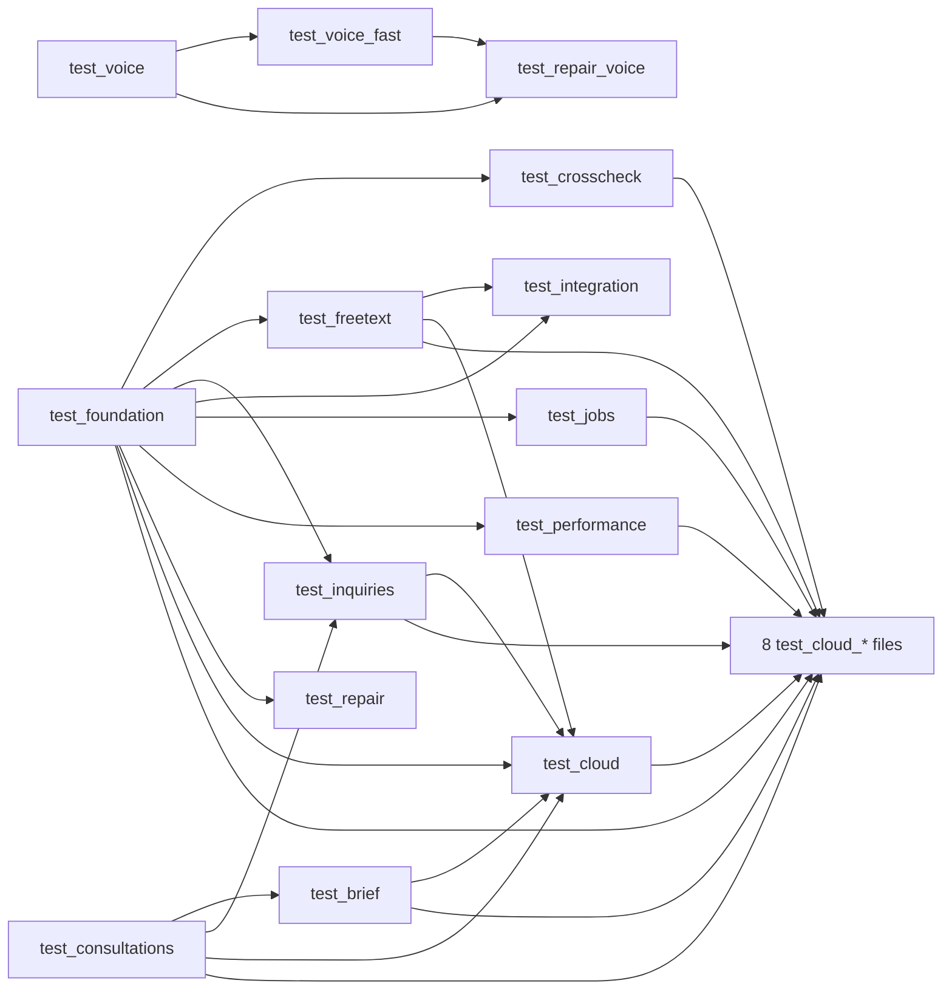

# Test suite (`tests/`)

This document is the reference for the 25 files of the test suite:

- `tests/conftest.py`
- 24 test modules, `tests/test_*.py`

Index of every Python program: [../PYTHON_PROGRAMS.md](../PYTHON_PROGRAMS.md). Older long-form background on testing: [../reference/10_TESTS_AND_VERIFICATION.md](../reference/10_TESTS_AND_VERIFICATION.md).

Every `path:line` below is relative to the repository root. The line numbers were read in the bot's own repository, before personal data was replaced for publishing ([../SCRUB_NOTES.md](../SCRUB_NOTES.md)). The replacement only changes text inside a line, and the published copy was checked for it: no file in any commit gained or lost a line, so every line number here is valid in this repository. In the tables of one program's section, a bare line number or range in a "line" or "lines" column is a line of that section's file.

Each program's "Test functions" table groups the tests by line range. Under it, a collapsed list ("Every test function of this file by name and line") names every test function with the line of its `def` and its number of cases, so a test named in a pytest report can be looked up. A range in the grouped table can start a line or more above the first `def`, at a decorator. `tests/test_final_fixes.py` and `tests/test_repair_voice.py` list their tests by name directly.

No test was run to write this document. Every count comes from reading the files (`wc -l`, `grep`, and a parse of each file's syntax tree).

## 1. What this group does

The suite checks the bot's code without touching anything real. Every test feeds the real parsers, command handlers and jobs with made-up portal pages and catches what they send. The portal, Telegram, the local language model, the voice service, Google and Supabase are all replaced by stand-ins inside the test process.

The tests are written as regression tests. Most blocks pin one behaviour that was found wrong: in the bot's replies, in an independent check of those replies (`tests/test_repair.py:1`, `tests/test_final_fixes.py:1`), in the Supabase publish dry run of 29 September (`tests/test_cloud_dry_run.py:1`, `tests/test_cloud_cf_email.py:1`) or in a review of the publish code (`tests/test_cloud_fixes.py:1`). Examples from the replies: a date typo read as "today", a count taken from page 1 only, a failed portal read reported as "none", an invented number in a spoken answer. The publish-layer blocks name the dry run or the review as their source; for example, they pin that a partial read never deletes rows. A test "pins" a behaviour when it fails as soon as the code stops behaving that way.

Size of the suite:

| What | Number | How it was counted |
|---|---|---|
| Files | 25 | `tests/conftest.py` plus 24 `tests/test_*.py`. There is no `tests/__init__.py`. |
| Lines | 13,420 | `wc -l tests/*.py` |
| Test functions | 604 | top-level `def test_...` in the 24 modules (`grep -c "^def test_"`); none is `async def` |
| Test cases after `@pytest.mark.parametrize` | 1,152 | counted from the parametrize lists in the source, not from a pytest run |
| Tests that can skip themselves | 5 | see [Tests that start a real process](#tests-that-start-a-real-process) |
| Tests marked `slow` | 1 | `tests/test_cloud.py:1083` |

### Terms used in this document

| Term | Meaning |
|---|---|
| Portal | The agency's admin website, a set of PHP pages. The bot reads its HTML. Described in [scraper_and_config.md](scraper_and_config.md). |
| Fake portal | A Python dict of `"page.php?query"` to HTML text, served to the real portal client through `httpx.MockTransport`. A page that is not in the dict answers HTTP 404. Any request that is not a GET fails the test. |
| BOT folder | The folder that holds `run.py` and the `tests` folder, and on the bot's PC also its `.env`. In code it is `BOT_ROOT`. |
| Fixture | A pytest function that prepares something for a test and is asked for by naming it as a test argument. An "autouse" fixture runs for every test without being named. |
| `tmp_path` | pytest's own per-test temporary folder. Tests point the bot's file paths at it so no production file is read or written. Two exceptions: the BOT folder's `.env` is still loaded (see [What the suite does not protect against](#how-the-suite-stays-off-the-network-and-off-real-data)), and one test checks whether the real `data/cloud/pending` folder exists (section 8). |
| Handler | A function in `src/bot/telegram_bot.py` that answers one Telegram command or message. |
| Jennie | The bot's voice persona. See [voice_and_llm.md](voice_and_llm.md). |
| Brain | The code's name for the local language model served by Ollama. |
| Voice service | A separate local HTTP program that does speech-to-text (`/stt`) and text-to-speech (`/tts`). |
| Publish | Copy what the bot read to Supabase so the phone app can show it. See [cloud.md](cloud.md) and [../JEANNIE_APP.md](../JEANNIE_APP.md). |
| Record, kind, scope, key | One published row. `kind` says what it is (for example `student`), `scope` groups rows that are replaced together, `key` identifies the row inside its kind. |
| Complete read | A read that is known to show every row of its scope. Only a complete read may delete rows that are gone. A partial read never deletes. |
| Handoff | One JSON file a job writes for a separate publisher process. The job never waits for that process. |
| Hash state | The local file `cloud_state.json` that remembers what Supabase accepted, so unchanged rows are not sent again. |
| `hg_sync`, `hg_runs` | The Supabase function and table the publisher calls. |
| Stamp | The line "Payment verified by NAME · day month, time" on a student's portal row. It normally carries no year, so a day a year back cannot be told apart from this year's. |
| MRZ | The two machine-readable lines at the bottom of a passport page. |
| Watcher | The scheduled job that checks newly uploaded passport scans every 30 minutes. |
| Full picture | The hourly job (`cloud_full_picture`) that reads the student list, pending payments, two days of consultations and their totals, window applications, the dashboard, the calendar and the performance page, and publishes them in one run. |

### The programs at a glance

Every test module is started the same way: by pytest. The command in the last column is the one written in that file's own docstring where it has one. For the other files the docstring gives no command; the same form works.

| Program | Lines | One-line purpose | How it is started |
|---|---|---|---|
| [`tests/conftest.py`](../../tests/conftest.py) | 29 | Shared pytest settings: repository root on `sys.path`, the `slow` marker, and an autouse fixture that switches Supabase publishing off for every test. 0 tests. | Loaded by pytest automatically for every file under `tests/`. Never run directly. |
| [`tests/test_brief.py`](../../tests/test_brief.py) | 1053 | The factual daily brief, its language-model summary checker and the page readers behind it. 42 tests. | `.venv\Scripts\python.exe -m pytest tests\test_brief.py -q` (`tests/test_brief.py:11-12`) |
| [`tests/test_cloud.py`](../../tests/test_cloud.py) | 1129 | The Supabase publish layer: record builders, hash state, `hg_sync` and `hg_runs` calls, handoff, backfill, embeddings, secret redaction. Defines the fake Supabase. 59 tests. | `.venv\Scripts\python.exe -m pytest tests\test_cloud.py -q` (no command in its docstring) |
| [`tests/test_cloud_all.py`](../../tests/test_cloud_all.py) | 157 | Where the separately built publish hooks meet: one record per dashboard tile, job names, the real scheduler's seven jobs. 5 tests. | `.venv\Scripts\python.exe -m pytest tests\test_cloud_all.py -q` (no command in its docstring) |
| [`tests/test_cloud_bot_jobs.py`](../../tests/test_cloud_bot_jobs.py) | 689 | What the passport watcher, the daily brief and the hourly full picture hand to Supabase. 29 tests. | `.venv\Scripts\python.exe -m pytest tests\test_cloud_bot_jobs.py -q` (no command in its docstring) |
| [`tests/test_cloud_cf_email.py`](../../tests/test_cloud_cf_email.py) | 375 | Cloudflare's e-mail obfuscation is decoded in every portal page parse; one log line when the embedding model is missing. 18 tests. | `.venv\Scripts\python.exe -m pytest tests\test_cloud_cf_email.py -q` (no command in its docstring) |
| [`tests/test_cloud_commands.py`](../../tests/test_cloud_commands.py) | 538 | What the Telegram command handlers and free-text answers publish. 29 tests. | `.venv\Scripts\python.exe -m pytest tests\test_cloud_commands.py -q` (no command in its docstring) |
| [`tests/test_cloud_dry_run.py`](../../tests/test_cloud_dry_run.py) | 390 | Regression tests from the publish dry run: portal filler words, embedding errors, the GPU hidden from the publisher, the request-body size cap. 17 tests. | `.venv\Scripts\python.exe -m pytest tests\test_cloud_dry_run.py -q` (no command in its docstring) |
| [`tests/test_cloud_fixes.py`](../../tests/test_cloud_fixes.py) | 544 | Regression tests from the review of the publish layer: deletes, read order, embed model, completeness rules, what never reaches a log. 30 tests. | `.venv\Scripts\python.exe -m pytest tests\test_cloud_fixes.py -q` (no command in its docstring) |
| [`tests/test_cloud_jobs.py`](../../tests/test_cloud_jobs.py) | 726 | What the four sheet jobs (portal sync, missing report, `/stage`, issue-date refresh) hand to Supabase. 26 tests. | `.venv\Scripts\python.exe -m pytest tests\test_cloud_jobs.py -q` (no command in its docstring) |
| [`tests/test_cloud_performance.py`](../../tests/test_cloud_performance.py) | 349 | The Consultant Performance page's copy to Supabase (kind `consultant_performance`). 20 tests. | `.venv\Scripts\python.exe -m pytest tests\test_cloud_performance.py -q` (no command in its docstring) |
| [`tests/test_consultations.py`](../../tests/test_consultations.py) | 138 | `consult_requests.php` is read by column name. Also the page builder other files reuse. 8 tests. | `.venv\Scripts\python.exe -m pytest tests\test_consultations.py -q` (no command in its docstring) |
| [`tests/test_crosscheck.py`](../../tests/test_crosscheck.py) | 654 | The passport cross-check commands, `/passports`, the OCR and MRZ validator, the passport audit. 36 tests. | `.venv\Scripts\python.exe -m pytest tests\test_crosscheck.py -q` (`tests/test_crosscheck.py:18-19`) |
| [`tests/test_final_fixes.py`](../../tests/test_final_fixes.py) | 96 | Eight last small fixes: date prompt, OCR count, sibling matching, calendar "done" note, brief total wording, brain keep-alive. 8 tests. | `.venv\Scripts\python.exe -m pytest tests\test_final_fixes.py -q` (no command in its docstring) |
| [`tests/test_foundation.py`](../../tests/test_foundation.py) | 787 | The shared base: the date reader, the long-reply splitter, the portal session, the `students.php` reader, `/verified*`, `/admitted`, `/students`. Defines the fake portal and fake Telegram objects most files reuse. 38 tests. | `.venv\Scripts\python.exe -m pytest tests\test_foundation.py -q` (`tests/test_foundation.py:16-17`) |
| [`tests/test_freetext.py`](../../tests/test_freetext.py) | 686 | Plain-word questions: classification, routing to commands, live dashboard and calendar answers, the model's fact pick, Jennie's spoken answers. 31 tests. | `.venv\Scripts\python.exe -m pytest tests\test_freetext.py -q` (`tests/test_freetext.py:16-17`) |
| [`tests/test_inquiries.py`](../../tests/test_inquiries.py) | 343 | `/inquiries_today`, `/inquiries_date`, `/consultations`, `/inquiries` and their free-text routes. 15 tests. | `.venv\Scripts\python.exe -m pytest tests\test_inquiries.py -q` (`tests/test_inquiries.py:13-14`) |
| [`tests/test_integration.py`](../../tests/test_integration.py) | 153 | Leftovers after the fix branches were merged: `/alerts`, `/stats`, the `/sendmail` lookup, one prompt, two root scripts. 9 tests. | `.venv\Scripts\python.exe -m pytest tests\test_integration.py -q` (`tests/test_integration.py:11-12`) |
| [`tests/test_jobs.py`](../../tests/test_jobs.py) | 849 | The scheduled jobs and sheet reports: passport watcher, portal sync, `/stage`, `/missing`, passport issue dates. 41 tests. | `.venv\Scripts\python.exe -m pytest tests\test_jobs.py -q` (`tests/test_jobs.py:19-20`) |
| [`tests/test_performance.py`](../../tests/test_performance.py) | 1064 | `/performance_today`, `/performance_month`, `/performance` and their free-text routes. 52 tests. | `.venv\Scripts\python.exe -m pytest tests\test_performance.py -q` (`tests/test_performance.py:27-28`) |
| [`tests/test_repair.py`](../../tests/test_repair.py) | 498 | Repairs asked for by an independent check on 28 Sep 2026: date re-prompts, `/admitted`, paid versus verified income, OCR wording, calendar ranges, sync edits, a failure notice. 15 tests. | `.venv\Scripts\python.exe -m pytest tests\test_repair.py -q` (`tests/test_repair.py:19-20`) |
| [`tests/test_repair_voice.py`](../../tests/test_repair_voice.py) | 120 | Jennie repairs: spoken dates that do not exist, a failed portal read said in words built in code. 7 tests. | `.venv\Scripts\python.exe -m pytest tests\test_repair_voice.py -q` (`tests/test_repair_voice.py:8-9`) |
| [`tests/test_voice.py`](../../tests/test_voice.py) | 698 | Jennie's voice path: voice-note handling, voice-service failures, the spoken brief, handler registration. Defines the voice fakes. 21 tests. | `.venv\Scripts\python.exe -m pytest tests\test_voice.py -q` (`tests/test_voice.py:8-9`) |
| [`tests/test_voice_fast.py`](../../tests/test_voice_fast.py) | 872 | Fast conversational Jennie: filler clips, one-call routing with per-chat memory, dispatch, reply checks, Ollama options and warm-up. 41 tests. | `.venv\Scripts\python.exe -m pytest tests\test_voice_fast.py -q` (`tests/test_voice_fast.py:8-9`) |
| [`tests/test_watcher_nonblocking.py`](../../tests/test_watcher_nonblocking.py) | 483 | The passport watcher's OCR runs on a worker thread and no longer freezes the bot's event loop. 7 tests. | `.venv\Scripts\python.exe -m pytest tests\test_watcher_nonblocking.py -q` (`tests/test_watcher_nonblocking.py:17-18`) |

Test functions and parametrised cases per file:

| File | Test functions | Cases after parametrize |
|---|---|---|
| `test_brief.py` | 42 | 90 |
| `test_cloud.py` | 59 | 61 |
| `test_cloud_all.py` | 5 | 6 |
| `test_cloud_bot_jobs.py` | 29 | 33 |
| `test_cloud_cf_email.py` | 18 | 28 |
| `test_cloud_commands.py` | 29 | 38 |
| `test_cloud_dry_run.py` | 17 | 17 |
| `test_cloud_fixes.py` | 30 | 32 |
| `test_cloud_jobs.py` | 26 | 26 |
| `test_cloud_performance.py` | 20 | 27 |
| `test_consultations.py` | 8 | 8 |
| `test_crosscheck.py` | 36 | 72 |
| `test_final_fixes.py` | 8 | 8 |
| `test_foundation.py` | 38 | 102 |
| `test_freetext.py` | 31 | 107 |
| `test_inquiries.py` | 15 | 36 |
| `test_integration.py` | 9 | 9 |
| `test_jobs.py` | 41 | 42 |
| `test_performance.py` | 52 | 225 |
| `test_repair.py` | 15 | 19 |
| `test_repair_voice.py` | 7 | 22 |
| `test_voice.py` | 21 | 29 |
| `test_voice_fast.py` | 41 | 105 |
| `test_watcher_nonblocking.py` | 7 | 10 |
| **Total** | **604** | **1,152** |

### How the suite is started

1. Open a command prompt in the BOT folder.
2. Run one file with the command its docstring gives, for example `.venv\Scripts\python.exe -m pytest tests\test_foundation.py -q`.
3. To run everything, point pytest at the folder: `.venv\Scripts\python.exe -m pytest tests -q`. No docstring and no file of the bot writes this command down. It is the ordinary pytest form.
4. To leave out the one test that loads a real model, add `-m "not slow"`. The marker is registered in `tests/conftest.py:20-21`.

Facts about the setup:

- `tests/conftest.py` is the only pytest configuration. The repository tracks no `pytest.ini`, `pyproject.toml`, `setup.cfg` or `tox.ini`.
- pytest is not listed in `requirements.txt`. Which pytest version the suite passes with is not recorded in the repository.
- No launcher (`.bat`) and no CI file runs the tests.
- No test function is `async`. Code that is asynchronous is driven with `asyncio.run(...)` inside an ordinary test, so no pytest plug-in for asyncio is needed.
- The root files `test_system.py` and `test_verified.py` are not part of this suite. They hold no `test_` function. They are stand-alone scripts, described in [api_scripts_launchers.md](api_scripts_launchers.md). pytest does not collect them when it is pointed at `tests`.
- Seventeen test modules put the repository root on `sys.path` themselves (`BOT_ROOT = Path(__file__).resolve().parent.parent`), and `tests/conftest.py:15-17` does it for all of them. The modules import each other by bare name (`from test_foundation import ...`), which works because pytest puts the `tests` folder on `sys.path` and eight modules also insert it themselves.

### How the test files depend on each other

Test modules reuse each other's page builders, fakes and fixtures by importing them. A fixture imported by name into another module works there as if it were defined there. An arrow below means "provides helpers to".

The exact imports:

| Provider | What it provides | Imported by |
|---|---|---|
| `test_foundation.py` | `row`, `page`, `verified`, `dashboard`, `portal` (fixture), `pin_today`, `Sent`, `Chat`, `Message`, `fake_update`, `run`, `student_reads`, `always_login`, `report_of`, `admitted_portal`, `TODAY`, `ADMIN_ID`, `KLP`, `BACHELOR` | 16 files: `test_cloud`, `test_cloud_all`, `test_cloud_bot_jobs`, `test_cloud_cf_email`, `test_cloud_commands`, `test_cloud_dry_run`, `test_cloud_fixes`, `test_cloud_jobs`, `test_cloud_performance`, `test_crosscheck`, `test_freetext`, `test_inquiries`, `test_integration`, `test_jobs`, `test_performance`, `test_repair` |
| `test_consultations.py` | `_row`, `_page` | 7 files: `test_brief`, `test_cloud`, `test_cloud_bot_jobs`, `test_cloud_cf_email`, `test_cloud_commands`, `test_cloud_fixes` (inside one test), `test_inquiries` |
| `test_cloud.py` | `cloud` (fixture), `FakeSupabase` through it, `cloud_warnings`, `state`, `no_placeholder`, `listed`, `student_rows`, `STORE`, `_disk_fixture`, `REAL_SPAWN` | 8 files: `test_cloud_all`, `test_cloud_bot_jobs`, `test_cloud_cf_email`, `test_cloud_commands`, `test_cloud_dry_run`, `test_cloud_fixes`, `test_cloud_jobs`, `test_cloud_performance` |
| `test_freetext.py` | `dashboard_page`, `pending_pages`, `window_page`, `calendar_html` | 5 files: `test_cloud` and `test_cloud_fixes` (inside tests), `test_cloud_bot_jobs` (inside a helper), `test_cloud_commands`, `test_integration` |
| `test_jobs.py` | `Bot`, `bad`, `scan_row`, `watcher` (fixture), `PROGRESS_PAGE`, `csv_rows`, `with_details` | 4 files: `test_cloud_all`, `test_cloud_bot_jobs`, `test_cloud_fixes`, `test_cloud_jobs` |
| `test_brief.py` | `INDEX`, `FakeBot`, `consult_day_key`, `full_portal`, `write_store`, `portal` (imported as `brief_portal`) | 3 files: `test_cloud` and `test_cloud_all` (inside tests), `test_cloud_bot_jobs` |
| `test_inquiries.py` | `TOTALS`, `TOTALS_KEY`, `day_key`, `day_page`, `totals_page`, `inquiry_portal` | 3 files: `test_cloud`, `test_cloud_bot_jobs`, `test_cloud_commands` |
| `test_voice.py` | `ADMIN_ID`, `COLLEAGUE_ID`, `OGG`, `ROUTE_TODAY`, `FakeBot`, `FakeVoice`, `filler_audio`, `voice_update`, fixtures `llm`, `offline`, `service`, `verified_today` | 2 files: `test_voice_fast`, `test_repair_voice` |
| `test_crosscheck.py` | `audits` (fixture), `the_list`, `VERDICT` | `test_cloud_commands` |
| `test_performance.py` | `MONTH_KEY`, `TODAY_KEY`, `SCORE_TIP`, `POINTS_TIP`, `ZERO_TILES`, `perf_page`, `person`, `today_page` | `test_cloud_performance` |
| `test_cloud_commands.py` | `handoffs`, `hooked`, `process`, `same_reply_either_way`, `shape` | `test_cloud_performance` |
| `test_cloud_performance.py` | `MONTH_KEY`, `TODAY_KEY`, `month_html`, `today_html` | `test_cloud_bot_jobs` (inside `full_picture_pages`) |
| `test_cloud_bot_jobs.py` | `full_picture_pages`, `run_watcher` | `test_cloud_fixes` |
| `test_cloud_jobs.py` | `handed`, `sync` (fixture), `telegram` | `test_cloud_fixes` |
| `test_voice_fast.py` | `commands` (fixture), `route` | `test_repair_voice` |

`test_final_fixes.py` and `test_watcher_nonblocking.py` import nothing from other test files, and nothing imports them.

### How the suite stays off the network and off real data

| Real thing | What stands in for it | Where |
|---|---|---|
| Supabase | For every test: the three publish settings are forced off. For a test that asks for the `cloud` fixture: `FakeSupabase`, an in-memory copy of `hg_runs` and `hg_sync`, plugged in as `publish.TRANSPORT`. It rejects any host other than `example.supabase.co`, any other path and any other method. | `tests/conftest.py:24-29`, `tests/test_cloud.py:66-197`, `tests/test_cloud.py:200-223` |
| The publisher process | `handoff.spawn` is replaced by a function that records the handoff file's path and starts nothing. | `tests/test_cloud.py:216-217` |
| The embedding model | `embed.StubEmbedder`, set with `embed.set_embedder`. | `tests/test_cloud.py:218-223` |
| Portal | `admin_client.client` is replaced by an `httpx.AsyncClient` over `httpx.MockTransport` (in `test_watcher_nonblocking.py`, by a `FakePortal` object). In the foundation, brief and voice fixtures `admin_client.login` is replaced by a function that fails the test. A non-GET request fails the test. | `tests/test_foundation.py:108-133`, `tests/test_brief.py:234-262`, `tests/test_voice.py:264-275`, `tests/test_watcher_nonblocking.py:209-235` |
| Telegram (handlers) | Small fake update, message, chat and bot objects that record what was sent. | `tests/test_foundation.py:143-188`, `tests/test_brief.py:285-295`, `tests/test_jobs.py:70-82`, `tests/test_voice.py:45-142` |
| Telegram (the sheet jobs' raw Bot API posts) | A stand-in class in place of `httpx.Client`. | `tests/test_cloud_jobs.py:61-87`, `tests/test_jobs.py:379-403`, `tests/test_repair.py:477-495` |
| The language model (Ollama) | `ollama_client.chat` is replaced by a fake that records the prompt and returns a prepared answer. `ollama_client.client` is replaced by a client that fails on any request, or by a recording stand-in for Ollama's HTTP API. | `tests/test_brief.py:221-231`, `tests/test_voice.py:209-250`, `tests/test_freetext.py:515-521`, `tests/test_voice_fast.py:698-721` |
| Voice service | `voice._http` returns a client over `FakeVoiceService`, which follows the `/stt` and `/tts` contract. | `tests/test_voice.py:145-202`, `tests/test_voice.py:300-309` |
| OCR engine (EasyOCR) | `ocr.get_ocr_reader` returns a stub reader. One test replaces the `easyocr` module in `sys.modules`. | `tests/test_crosscheck.py:383-435`, `tests/test_watcher_nonblocking.py:177-206`, `tests/test_watcher_nonblocking.py:412` |
| Google Sheets and Drive | The functions that reach Google are replaced: `progress_builder.all_targets`, `fetch_roster`, `build_target`, `sheet_drift`, `fetch_all_students`; `missing_report.read_sheets`; `verified_docs.run_local`. No test names a real spreadsheet or folder. | `tests/test_cloud_jobs.py:155-173`, `tests/test_cloud_jobs.py:441-446`, `tests/test_jobs.py:362-365`, `tests/test_jobs.py:534` |
| Files under `data/` | Module path constants are pointed at `tmp_path`. | each file's fixtures, listed per program below |
| The clock | "Today" is pinned to 28 September 2026 in Dhaka. | `tests/test_foundation.py:41`, `tests/test_foundation.py:136-140`, `tests/test_brief.py:39`, `tests/test_voice.py:36` |

What the suite does not protect against:

- A real `.env` in the BOT folder is still loaded. `src/config.py:7` sets `ENV_PATH` to `<BOT folder>/.env`, and `src/config.py:141-147` builds the settings object from it at import time. Only the three Supabase settings are neutralised for every test (`tests/conftest.py:27-29`). Every other setting keeps its `.env` value unless a test overrides it.
- The portal, Telegram, Ollama and voice-service stand-ins are set up per test file, not in `conftest.py`. A new test file that forgets them is not protected.
- `.env` is not tracked (`.gitignore:4`), so a fresh clone has none.

### Tests that start a real process

Seven tests start a real Python child process of the repository's own code. Six of the seven children import `src.config`, which reads the BOT folder's `.env` when one exists. The seventh, the GPU probe of `tests/test_cloud_dry_run.py:235-255`, does not: it imports only `src.cloud.embed` and `torch` and calls `embed.prepare_process()` and `embed.cpu_only_process()`. `src/cloud/embed.py` imports `src.config` only inside `model_id()` (`src/cloud/embed.py:56`) and `GteSmall.__init__` (`src/cloud/embed.py:201`), which the probe never calls, and `src/cloud/__init__.py` imports nothing. The two children that could publish skip themselves when a `.env` exists or Supabase settings are in the environment. The other five publish nothing: they import modules, load the embedding model, or report what they see.

| Test | What it starts | Wait limit | When it skips itself |
|---|---|---|---|
| `test_the_real_publisher_process_starts_and_tidies_up` (`tests/test_cloud.py:888`) | The publisher as the jobs start it: `python -m src.cloud.publish --from <file> --timeout 120`, with an empty handoff file. | 120 s | When the BOT folder has a `.env`, or `SUPABASE_URL`, `SUPABASE_SECRET_KEY` or `CLOUD_PUBLISH_ENABLED` is in the process environment (`tests/test_cloud.py:891-893`). The child would load them and could publish. |
| `test_nothing_in_the_publish_layer_imports_torch_until_it_embeds` (`tests/test_cloud.py:907`) | `python -c` that imports the publish modules and prints whether `torch` was imported. | 120 s | Never. |
| `test_the_real_gte_small_gives_384_unit_float32_numbers_on_the_cpu` (`tests/test_cloud.py:1085`) | `python -c` that loads the real embedding model on the CPU. Marked `slow`. | 600 s | When the pinned model snapshot is not in the Hugging Face cache (`tests/test_cloud.py:1077-1084`). |
| `test_the_real_full_picture_process_does_nothing_while_publishing_is_off` (`tests/test_cloud_bot_jobs.py:617`) | `python -m src.cloud.full_picture`. | 120 s | Same condition as the first row (`tests/test_cloud_bot_jobs.py:618-620`). |
| `test_nothing_the_bot_process_imports_for_supabase_imports_torch` (`tests/test_cloud_bot_jobs.py:627`) | `python -c` that imports `src.bot.scheduler`, `src.cloud.bot_jobs` and `src.cloud.full_picture`. | 120 s | Never. |
| `test_a_missing_model_costs_the_embedding_process_exactly_one_log_line` (`tests/test_cloud_cf_email.py:365`) | A child started with `handoff.start`, with sockets disabled and an empty model cache. | 600 s | When `sentence_transformers` is not installed (`tests/test_cloud_cf_email.py:363-364`). |
| `test_the_publisher_process_started_as_the_handoff_starts_it_sees_no_gpu` (`tests/test_cloud_dry_run.py:259`) | A child started with `handoff.start` that imports `torch` and reports what it sees of the GPU. | 600 s | When `torch` is not installed (`tests/test_cloud_dry_run.py:258`). |

### Third-party packages the tests import

| Package | Used for | Where |
|---|---|---|
| pytest | Runner, fixtures, `monkeypatch`, `caplog`, `capsys`, `tmp_path`, `parametrize`, `skipif`. | every file |
| httpx | `MockTransport`, `AsyncClient`, `Response`, the error classes. | most files |
| python-telegram-bot | `telegram.error.BadRequest` and `NetworkError`, to simulate Telegram refusing a message. | `tests/test_brief.py:26`, `tests/test_foundation.py:29`, `tests/test_jobs.py:34`, `tests/test_performance.py:38`, `tests/test_cloud_bot_jobs.py:156` |
| beautifulsoup4 | Building a parsed page to pass to the decoder. | `tests/test_cloud_cf_email.py:33` |
| opencv (`cv2`) and numpy | Making synthetic scan images. | `tests/test_crosscheck.py:28-30`, `tests/test_watcher_nonblocking.py:31-33` |
| openpyxl | Making one Excel workbook fixture. | `tests/test_cloud.py:999-1005` |
| apscheduler | A real `AsyncIOScheduler` and `IntervalTrigger` to inspect job triggers. | `tests/test_cloud_all.py:106`, `tests/test_cloud_bot_jobs.py:658` |
| torch, sentence_transformers | Only inside child-process scripts, or as an installed-or-not check. | `tests/test_cloud.py:1093`, `tests/test_cloud_dry_run.py:252`, `tests/test_cloud_cf_email.py:363` |

EasyOCR is never imported for real.

### Conventions shared by the test files

- **Fixture data.** Every portal page in the suite is built by a helper function in the test files, laid out like the live page of September 2026; the docstrings call the data synthetic. This document quotes no fixture value. [../SCRUB_NOTES.md](../SCRUB_NOTES.md) says what was changed in the published copy.
- **Read-only portal.** Each fake portal fails the test on any request that is not a GET. Many tests also assert that every recorded request was a GET.
- **"Not available", never zero.** A recurring assertion: when a page cannot be read, the reply starts with `❌ Couldn't read the portal:` and contains no count, no "none found" and no `0`.
- **Root copies.** `telegram_bot.py`, `config.py` and `progress_builder.py` in the repository root are byte-identical copies of `src/bot/telegram_bot.py`, `src/config.py` and `src/sheets/progress_builder.py`. Two tests keep them identical (`tests/test_cloud.py:1126-1129`, `tests/test_performance.py:1008-1011`). The copies are described once, with their `src` versions, in [bot_core.md](bot_core.md), [scraper_and_config.md](scraper_and_config.md) and [sheets.md](sheets.md).
- **Reading order.** `test_foundation.py` and `test_consultations.py` define the builders nearly everything else uses. `test_cloud.py` defines the fake Supabase every `test_cloud_*` file uses. `test_voice.py` defines the voice fakes. Read those four first.

---

## 2. tests/conftest.py

**Purpose.** Suite-wide pytest configuration. It holds no test. It does three things: puts the repository root on `sys.path` (`tests/conftest.py:15-17`), registers the marker `slow` (`tests/conftest.py:20-21`), and switches Supabase publishing off for every test (`tests/conftest.py:24-29`).

**How it is run or who calls it.** pytest loads a file named `conftest.py` automatically for every test file in the same folder. It has no command line and nothing imports it.

**What it reads.** The settings object `src.config.settings`, imported inside the fixture (`tests/conftest.py:26`). Importing it reads the BOT folder's `.env` when one exists (`src/config.py:141-147`).

**What it writes.** Memory only. For the length of each test it sets `SUPABASE_URL` to `""`, `SUPABASE_SECRET_KEY` to `""` and `CLOUD_PUBLISH_ENABLED` to `False` through `monkeypatch`, which puts the old values back after the test.

**Why it exists.** Whatever `.env` or the environment says, no test may send student data to the real Supabase project. With these three settings off, `src.cloud` writes no file, starts no process and sends no request (docstring, `tests/conftest.py:4-7`).

**Main functions and classes**

| Name | Line | What it does |
|---|---|---|
| `BOT_ROOT` and the `sys.path` insert | 15-17 | The parent of the `tests` folder, put first on `sys.path` so `import src...` works from any working directory. |
| `pytest_configure(config)` | 20 | pytest hook. Adds the marker line `slow: loads a real model (skipped when the model is absent)`, so `-m "not slow"` works without a warning. |
| `_no_real_supabase(monkeypatch)` | 25 | Autouse, function-scoped fixture. Forces the three Supabase settings off for every test. |

**Numbers that matter.** Three settings are forced off. One marker is registered. There is no timeout, limit or retry in this file.

**Things to know**

- This is the only guard that covers the whole suite, and it covers Supabase only. See [What the suite does not protect against](#how-the-suite-stays-off-the-network-and-off-real-data).
- A test that needs publishing asks for the `cloud` fixture of `tests/test_cloud.py:200-223`, which switches the three settings back on with made-up values against the fake Supabase.
- `tests/test_cloud.py:801-803` checks the guard itself: with no fixture asked for, `publish.enabled()` is false and `handoff.submit` returns `None`.

---

## 3. tests/test_brief.py

**Purpose.** Pins the factual daily brief: the message the bot sends at 18:05 (the default of `DAILY_REPORT_TIME`), on `/brief`, and for a past day on `/report <date>`. It tests `src/bot/brief.py` (`compose_daily_brief`, `compose_brief`, `check_summary`, `claims_problem`, `split_brief`, `brief_plain`, `_send_brief`, `section_verified`, `section_consultations`, `section_calendar`, `verified_day_problem`), `src/bot/scheduler.py` (`send_daily_briefing`, `setup_scheduler`), `src/bot/telegram_bot.py` (`brief_command`, `report_command`, `format_stats_report`, `format_calendar_report`), `src/bot/voice.py` (`spoken_brief`), `src/scraper/parsers.py` (`parse_hangeul_live_dashboard`, `parse_calendar_events`, `parse_verified_students`, `parse_pending_payments`, `parse_window_applications`, `count_under_review`, `consultation_table`), `src/scraper/client.py` (`fetch_html`, `get_calendar_events`, `read_consultations`, `read_consultation_view`) and `src/llm/ollama_client.py` (`_answer_query_fallback`). 42 test functions, 90 cases.

**How it is run or who calls it.** `.venv\Scripts\python.exe -m pytest tests\test_brief.py -q` from the BOT folder (`tests/test_brief.py:11-12`). Importers: `tests/test_cloud.py:438` and `tests/test_cloud_all.py:45` (`INDEX`), `tests/test_cloud_bot_jobs.py:49-50` (`FakeBot`, `consult_day_key`, `full_portal`, `write_store`, and the `portal` fixture under the name `brief_portal`) and `tests/test_cloud_bot_jobs.py:357` (`INDEX`). It imports `_page` and `_row` from `tests/test_consultations.py` (`tests/test_brief.py:37`).

**What it reads**

- Fake portal pages, GET only: `consult_requests.php?status=all&from=<ISO day>&to=<ISO day>` (one day through the portal's own date filter), `consult_requests.php?status=file_opened` (its status tabs carry the all-time counts), `students.php`, `students.php?pg=2`, `students.php?status=pending`, `window_applications.php?status=under_review`, `index.php`, `calendar.php` (`tests/test_brief.py:198-216`). The unfiltered `consult_requests.php` is in the fake only so a test can prove it is never fetched.
- A temporary document-check store `results.json` under `tmp_path`, found through the setting `VERIFICATION_DIR` (`tests/test_brief.py:258`, `tests/test_brief.py:265-270`).
- Settings set by the fixture or a test: `VERIFICATION_DIR`, `TELEGRAM_ADMIN_CHAT_ID`, `JENNIE_VOICE_ENABLED`, `JENNIE_SPOKEN_BRIEF`, `ENABLE_SCHEDULED_REPORTS`.
- The language model: `FakeBrain.chat` in place of `ollama_client.chat` (`tests/test_brief.py:221-231`, `tests/test_brief.py:261`).

**What it writes.** `results.json` in `tmp_path`. Fake Telegram messages are kept in memory (`FakeBot.messages`).

**Why it exists.** Staff read the brief as fact. Every figure in it must come from a portal page read in code. The tests fail when the brief invents a number, adds two different figures together, shows a number for a page it could not read, or lets the language model's summary say a number that is not in the facts.

**Main functions and classes**

| Name | Line | What it does |
|---|---|---|
| `NOW`, `ADMIN_ID` | 39-40 | The fixed "now" (28 Sep 2026, 18:05, Asia/Dhaka) and a made-up admin chat id. |
| `STUDENTS_HEAD`, `student(...)`, `students_page(...)` | 45, 49, 63 | Build a `students.php` list: header row, one student's list row and details row, the page with an optional "Pending Payments" badge and a "Page N of M" pager. |
| `window_page(*statuses)` | 70 | Builds `window_applications.php` with one row per status, or the portal's own "No applications found." row. |
| `tile`, `dash_sec`, `INDEX` | 79, 84, 88 | Build the dashboard tiles and section titles. `INDEX` is a whole synthetic `index.php` with two tile groups and 11 tiles. |
| `reminder(...)`, `calendar_page(...)`, `REMINDERS` | 103, 121, 145 | Build `calendar.php`: the "Reminders for today" card, a "Completed" card, the "Upcoming · next 45 days" card and a pop-up copy that must not be counted. `REMINDERS` holds three titled entries and one untitled entry. |
| `CONSULT_DAYS`, `CONSULT_TOTALS`, `CONSULTS` | 154, 168, 169 | Consultation rows for two days, the all-time tab counts, and the unfiltered list. |
| `consult_day_key`, `consult_day_page`, `consult_pages` | 172, 177, 183 | The fake-portal key and page for one filtered day, and the dict of every consultation view the brief reads. |
| `KLP`, `VERIFIED_X` | 193-195 | A program name and one verified student's row that appears on both list pages (a row that moved between pages while reading must be counted once). |
| `full_portal()` | 198 | The complete synthetic portal as a dict of page key to HTML. |
| `FakeBrain` | 221 | Stands in for `ollama_client.chat`. Records the system prompt, user prompt and `num_predict` of each call. Answers with `self.reply` (`None` means the model is down). |
| `portal` (fixture) | 235 | The fake portal for this file. Also fixes `brief._now`, points `VERIFICATION_DIR` at `tmp_path`, sets the admin chat id and installs `FakeBrain`. Returns `pages`, `asked`, `brain`, `store`. |
| `write_store(path)` | 265 | Writes a small `results.json` with four checked students. |
| `compose(**kwargs)` | 273 | `asyncio.run(brief.compose_daily_brief(...))`. |
| `section(text, number)` | 277 | The lines of one numbered section of a brief. |
| `FakeBot` | 285 | Records `send_message` calls. Can refuse Markdown with a chosen `BadRequest` text. |
| `FACTS` | 428 | A fact block used by the summary-checker tests. |
| `unbalanced_markdown(text)` | 485 | Lists lines whose `*` or `_` markers do not pair up. |
| `FakeMessage`, `fake_update` | 578, 590 | A minimal Telegram message and update for `/brief` and `/report`. |
| `LIVE_FACTS`, `PAID_FACTS` | 747, 754 | Two fact lists for the claim tests. |
| `brief_students_per_page()` | 924 | Returns `client.STUDENTS_PER_PAGE`. |
| `_silent_portal(monkeypatch, handler)` | 931 | Replaces the portal client by one whose every request goes to `handler`, and records the page names asked. |

**Test functions**

| Lines | Tests (cases) | What they pin |
|---|---|---|
| 300-423 | 7 (7) | The whole brief for a full portal, line for line: the header `📋 *HANGEUL DAILY BRIEF* — <date>, <time> (Asia/Dhaka)` and five sections, `1) CONSULTATIONS TODAY`, `2) PAYMENT-VERIFIED STUDENTS TODAY`, `3) PORTAL FIGURES (live now)`, `4) TODAY'S CALENDAR REMINDERS`, `5) DOCUMENT CHECK (from the last automated check, not live)`. The day is read with the portal's date filter and the all-time counts from the File Opened tab; the unfiltered list is never fetched (`tests/test_brief.py:346-348`). With every page missing, every section says "not available" and holds no digit (`tests/test_brief.py:351-361`). A real "none" is "None received today" or "None today". A calendar that lists entries none of which can be read, or whose layout is unknown, is "not available" with the reason. Pending payments and window applications under review stay two lines and are never summed. A dashboard tile that disagrees with the read figure is shown beside it. A past day gets the header `📋 *HANGEUL BRIEF FOR <date>* — read <date>, <time>` and does not fetch `calendar.php`. |
| 432-480 | 3 (14) | The model's summary is kept only when every number in it is one of the facts' own figures. A rate, a topic the brief never reports, a number word not in the facts, a sum of two figures, an empty answer and an over-long sentence are all dropped. The model call uses `num_predict == brief.SUMMARY_MAX_TOKENS`, a prompt under 2,500 characters and no student name. A summary of a past day that says "today" is dropped. |
| 495-537 | 2 (2) | Markdown characters in portal text are escaped. When Telegram refuses the Markdown, the chunk is resent as plain text. Any other `BadRequest` is raised. A long brief is split between lines into chunks of at most `brief.CHUNK_CHARS`, with nothing lost. |
| 542-626 | 3 (3) | The daily job sends the text brief, then hands Jennie the plain facts, one per line, without dates, clock times, tile figures or all-time counts. A brief that cannot be composed sends nothing and speaks nothing. `/brief` can import `_send_brief` and `compose_daily_brief` from `src.bot.scheduler`. `/report <date>` replies with that day's brief as a reply, not as a new message. |
| 631-673 | 3 (3) | Dashboard reader: tiles are found whatever their case and spacing; the two "Docs to review" tiles are told apart by their link; a missing or non-numeric tile is `None`. `/stats` shows "not available" for missing figures. The no-model fallback picks whole facts only. |
| 678-709 | 3 (3) | Calendar reader: today's reminders card (untitled entries skipped and counted), the upcoming timeline, and an unknown layout reads nothing and reports "not available". |
| 714-741 | 3 (3) | Verified-students reader makes up no amount and no name. Pending-payments reader returns `count`, `listed`, `badge`, or `None` for page 1 of several. Window-applications reader returns the statuses, an empty list for the portal's own empty row, `None` for an unknown table. |
| 759-823 | 4 (38) | `claims_problem` and `check_summary`: 22 sentences that state a figure about the wrong thing are rejected; 9 that state a fact's own figure are kept. Jennie's spoken brief: six invented sentences each lead to a second try and then the fixed fallback line; a checked sentence is spoken with its numbers as words. |
| 828-921 | 7 (10) | An old day is read through the date filter. A day the portal lists only partly keeps the portal's own counts. A day a year back is "not available", because the stamps carry no year. A future day reads nothing. The verified reader checks the stamp's year and the applied date, accepts verifier names with a hyphen or an apostrophe, and says "not available" when its layout is not recognised or a full first page has no pager. |
| 942-1015 | 5 (5) | A portal that times out is tried once; the other reads are skipped and say why. A hanging read is given up at `brief.READ_TIMEOUT`; with no budget left nothing is read. `fetch_html` passes a connect timeout and a read timeout. A calendar timeout is "not available", never "0 items". A reminders card whose entries changed is not read as "none". |
| 1020-1053 | 2 (2) | The consultation page is parsed off the event loop. The job `daily_executive_briefing` is registered with `misfire_grace_time=600`, `coalesce=True`, `max_instances=1`. |

Every test function of this file by name and line (42 functions, 90 cases)

| Test function | Line | Cases |
|---|---|---|
| `test_every_count_is_exact` | 300 | 1 |
| `test_missing_data_says_not_available_and_invents_nothing` | 351 | 1 |
| `test_nothing_today_says_none_not_zero_rows` | 364 | 1 |
| `test_unreadable_calendar_is_not_available_not_counted` | 376 | 1 |
| `test_pending_payments_and_window_applications_are_never_summed` | 386 | 1 |
| `test_a_dashboard_tile_that_disagrees_is_shown_not_hidden` | 405 | 1 |
| `test_a_past_day_counts_that_day_and_skips_the_calendar` | 415 | 1 |
| `test_the_summary_keeps_only_numbers_from_the_facts` | 446 | 12 |
| `test_a_checked_summary_is_added_and_an_invented_one_dropped` | 450 | 1 |
| `test_a_summary_of_a_past_day_that_says_today_is_dropped` | 470 | 1 |
| `test_markdown_escaping_with_a_plain_text_fallback` | 495 | 1 |
| `test_a_long_brief_is_split_between_lines` | 523 | 1 |
| `test_the_daily_job_sends_the_factual_brief_then_the_spoken_one` | 542 | 1 |
| `test_brief_command_no_longer_fails_its_import` | 597 | 1 |
| `test_report_command_uses_the_factual_brief_as_a_reply` | 610 | 1 |
| `test_dashboard_tiles_are_read_whatever_their_case_and_spacing` | 631 | 1 |
| `test_a_missing_tile_is_none_never_a_placeholder` | 647 | 1 |
| `test_stats_and_fallback_answers_show_not_available_for_missing_figures` | 654 | 1 |
| `test_calendar_reminders_are_read_from_the_current_layout` | 678 | 1 |
| `test_an_unknown_calendar_layout_reads_nothing_rather_than_empty_entries` | 699 | 1 |
| `test_the_calendar_command_lists_real_titles` | 706 | 1 |
| `test_verified_students_never_get_a_made_up_amount_or_name` | 714 | 1 |
| `test_pending_payments_reader` | 726 | 1 |
| `test_window_applications_reader` | 736 | 1 |
| `test_a_claim_that_is_not_its_own_facts_figure_is_dropped` | 783 | 22 |
| `test_a_claim_that_is_its_own_facts_figure_is_kept` | 799 | 9 |
| `test_jennie_says_only_the_facts_own_figures` | 812 | 6 |
| `test_jennie_says_a_checked_figure` | 819 | 1 |
| `test_an_older_day_is_read_with_the_portals_own_date_filter` | 828 | 1 |
| `test_a_day_the_portal_lists_only_partly_keeps_its_own_counts` | 852 | 1 |
| `test_a_day_a_year_back_is_not_matched_on_day_and_month` | 869 | 1 |
| `test_a_future_day_reads_nothing_it_cannot_know` | 882 | 1 |
| `test_the_verified_reader_checks_the_year_and_the_applied_date` | 890 | 1 |
| `test_a_verifier_name_with_a_hyphen_or_apostrophe_still_counts` | 902 | 4 |
| `test_the_verified_reader_says_not_available_when_its_layout_is_not_recognised` | 908 | 1 |
| `test_a_portal_that_does_not_answer_skips_the_other_reads` | 942 | 1 |
| `test_a_hanging_read_is_given_up_on_time` | 958 | 1 |
| `test_fetch_html_gives_a_dead_host_a_short_connect_timeout` | 975 | 1 |
| `test_a_calendar_timeout_is_not_available_not_zero_reminders` | 988 | 1 |
| `test_a_reminders_card_whose_entries_changed_is_not_read_as_none` | 1006 | 1 |
| `test_the_consultation_page_is_parsed_and_checked_off_the_event_loop` | 1020 | 1 |
| `test_the_daily_brief_job_survives_a_late_start` | 1039 | 1 |

**Numbers that matter**

| Number | Value | Where |
|---|---|---|
| Fixed "now" | 28 Sep 2026, 18:05, Asia/Dhaka | `tests/test_brief.py:39` |
| Summary prompt size | under 2,500 characters (system plus user) | `tests/test_brief.py:458` |
| Summary length | `brief.SUMMARY_MAX_TOKENS`, which is 120 | `tests/test_brief.py:457`, `src/bot/brief.py:66` |
| Chunk size | at most `brief.CHUNK_CHARS` (3900), below Telegram's 4096 | `tests/test_brief.py:527`, `src/bot/replies.py:32-33` |
| Whole compose when the portal times out | under 5 s | `tests/test_brief.py:949` |
| `READ_TIMEOUT` in the test | patched to 0.3 s (75.0 s in the code); compose under 3 s | `tests/test_brief.py:963-966`, `src/bot/brief.py:69` |
| `PORTAL_BUDGET` in the test | patched to 0.5 s (150.0 s in the code) | `tests/test_brief.py:969`, `src/bot/brief.py:70` |
| `fetch_html` timeouts | connect 10.0 s, read 60.0 s | `tests/test_brief.py:985` |
| Spoken brief tries | the model is asked twice, then the fallback line | `tests/test_brief.py:815` |
| Job options | `misfire_grace_time` 600 s, `coalesce` true, `max_instances` 1 | `tests/test_brief.py:1053` |
| Full list page | `client.STUDENTS_PER_PAGE` rows (50) | `tests/test_brief.py:914`, `src/scraper/client.py:44` |

**Things to know**

- This file's `portal` fixture is not the one in `tests/test_foundation.py`. They share a name. This one also fixes the brief's clock and installs the fake model. `tests/test_cloud_bot_jobs.py:50` imports it as `brief_portal` to use both.
- `FakeBot`, `FakeMessage` and `fake_update` here are separate from the helpers of the same names in `tests/test_voice.py`, `tests/test_foundation.py` and `tests/test_watcher_nonblocking.py`.
- The tests call the job "the 18:05 job" but do not assert its trigger time. The time comes from the setting `DAILY_REPORT_TIME` (default `18:05`, `src/config.py:57`).
- Two tests assert on real elapsed time (`tests/test_brief.py:949`, `tests/test_brief.py:966`). They can fail on a heavily loaded machine.

---

## 4. tests/test_cloud.py

**Purpose.** Pins the Supabase publish layer and defines the fake Supabase every other publish test uses. It tests `src/cloud/records.py`, `src/cloud/publish.py`, `src/cloud/handoff.py`, `src/cloud/backfill.py`, `src/cloud/embed.py`, `src/cloud/student_index.py` (through the fixture), and the log redaction in `src/__init__.py` (`redact`). 59 test functions, 61 cases.

**How it is run or who calls it.** `.venv\Scripts\python.exe -m pytest tests\test_cloud.py -q`. The docstring gives no command. Eight files import from it (see the import table in section 1). It imports from `tests/test_foundation.py`, `tests/test_consultations.py` and `tests/test_inquiries.py` at the top (`tests/test_cloud.py:44-46`) and from `tests/test_freetext.py` and `tests/test_brief.py` inside tests.

**What it reads**

- The fake Supabase (`FakeSupabase`). It accepts only `https://example.supabase.co`, with the key in the `apikey` header and as `Authorization: Bearer <key>`, and only three calls: `POST /rest/v1/hg_runs`, `PATCH /rest/v1/hg_runs?id=eq.<uuid>`, `POST /rest/v1/rpc/hg_sync` (`tests/test_cloud.py:79-99`).
- Fake portal pages through the `portal` fixture of `tests/test_foundation.py`: `students.php` and `?pg=N`, `consult_requests.php?status=all&from=&to=`, `consult_requests.php?status=file_opened`, `students.php?status=pending`, `window_applications.php?status=under_review`, `index.php`, `calendar.php`, `students.php?export=csv`.
- A disk fixture under `tmp_path` built by `_disk_fixture` (`tests/test_cloud.py:988-1007`): `data/verification/results.json`, `data/verification/text/<passport>.json`, `data/alerted_passport_issues.json`, `data/passport_issue.json`, `data/missing_reports/missing_information_<date>.xlsx`, and one student folder under `docs/<program>/`.
- Settings: `SUPABASE_URL`, `SUPABASE_SECRET_KEY`, `CLOUD_PUBLISH_ENABLED`, `CLOUD_EMBED_REVISION`.
- Environment: `CUDA_VISIBLE_DEVICES`, `HF_HUB_CACHE`, `HF_HOME`. The names `SUPABASE_URL`, `SUPABASE_SECRET_KEY` and `CLOUD_PUBLISH_ENABLED` are looked up in `os.environ` only to decide a skip (`tests/test_cloud.py:891-893`).

**What it writes.** Everything goes under `tmp_path` (`tests/test_cloud.py:209-215`): `cloud_state.json`, `cloud/publish.lock`, `cloud/dry_run/*.json`, `cloud/pending/*.json`, `hangeul_sync.log`, `cloud/student_index.json`. Three tests start real child processes (section 1).

**Why it exists.** The phone app shows what the bot publishes. These tests make sure only changed rows are sent, nothing is deleted after a partial read, a Supabase failure never breaks the job that was publishing, and no key and no student data reaches a log line.

**Main functions and classes**

| Name | Line | What it does |
|---|---|---|
| `REAL_SPAWN` | 53 | The real `handoff.spawn`, kept before the fixture replaces it. |
| `URL`, `KEY`, `DHAKA`, `READ_AT` | 54-57 | The fake project address, a made-up key with the `sb_secret_` prefix, the time zone, and one read time. |
| `PLACEHOLDERS` | 58 | Stand-in words that must never appear in a record's text, for example `None`, `N/A`, `Unknown`, `PENDING`. |
| `FakeSupabase` | 66 | In-memory `hg_runs` and `hg_sync`, written to answer as the migration `20260929030000_hangeul_context.sql` does (its docstring, `tests/test_cloud.py:67`; the migration is published under `extras/jeannie-app/supabase/migrations/`). Holds `records`, `chunks`, `runs`, `calls`, `changes` and a `fail` hook. |
| `FakeSupabase.__call__` | 79 | The transport. Checks host, headers, records the call, applies `fail`, routes to the three handlers, fails the test on anything else. |
| `FakeSupabase._error` | 102 | Builds an error response with a Postgres-style `code`. |
| `FakeSupabase._run_insert`, `_run_update` | 105, 117 | Insert and patch a run row. Allowed fields: `id`, `job`, `started_at`, `finished_at`, `status`, `counts`, `note`. `status` must be `ok`, `partial` or `failed`. A patch must name the row by `id=eq.<uuid>`. |
| `FakeSupabase._sync` | 128 | Validates and applies one `hg_sync` call: at most 200 rows; each row needs `key`, a dict `data`, a string `content`, `content_hash`, `source`, and `read_at` with a time-zone offset; `student_uid` must be a positive 32-bit integer; each chunk needs a 384-number embedding, one `embed_model` per call and a unique `ord`; no NUL byte. Deletes rows of the scope that are not in `p_all_keys`, except for kind `field_correction`. Returns `{upserted, deleted, unchanged}`. |
| `FakeSupabase.syncs`, `keys` | 193, 196 | The `hg_sync` bodies sent so far, and the sorted keys stored for a kind and scope. |
| `cloud` (fixture) | 201 | Switches publishing on against the fake, moves the hash state, lock, dry-run, pending and index paths into `tmp_path`, installs the stub embedder and a `spawn` that only records. Yields `fake`, `stub`, `spawned`, `tmp`. |
| `state()` | 226 | The hash state file as a dict, or `None` when it does not exist. |
| `cloud_warnings(caplog)` | 230 | The log records of the logger `hangeul.cloud` at WARNING or above. |
| `no_placeholder(record)` | 234 | Asserts a record's text and data hold no stand-in word and no doubled punctuation. |
| `listed`, `three_students`, `student_rows` | 258, 262, 269 | Parsed students from the foundation's builders, and ready `student` records. |
| `STORE` | 486 | A small document-check store with one student's document rows, field rows and one correction. |
| `_disk_fixture(tmp)` | 988 | Builds the on-disk fixture listed above. Returns the data, verification and docs folders. |
| `_model_cached()` | 1077 | True when the pinned embedding model snapshot is in the Hugging Face cache. |

**Test functions**

| Lines | Tests (cases) | What they pin |
|---|---|---|
| 277-568 | 20 (20) | `content_hash` is the SHA-256 of the canonical JSON of `{kind, key, scope, data, content}` (sorted keys, non-ASCII kept, compact separators). One builder per kind gives the exact key, scope, day and text: `student`, `pending_payment`, `verification`, `student_export`, `student_profile`, `student_progress`, `student_documents`, `consultation`, `consultation_day`, `consultation_totals`, `window_application`, `dashboard_fact`, `calendar_item`, `passport_audit`, `passport_alert`, `passport_issue`, `doc_verdict`, `field_check`, `field_correction`, `doc_check`, `doc_page_text`, `report`, `report_section`, `brief_fact`, `notification`. A student without a uid is no record. A placeholder passport number is no identity. A passport audit that checked nothing is no record. NUL bytes and lone surrogates are cleaned. |
| 573-828 | 20 (22) | Only changed rows are sent; a second identical run sends none. A complete read without one student deletes exactly that one and the hash state forgets it. A partial read sends `p_all_keys = null` and deletes nothing. A list that cannot be read whole publishes nothing. At most 200 rows a call, and the key list only on the last call. A long record gets several chunks of at most 350 words, each led by its heading. Supabase HTTP 500, a timeout or a refused key: the publish returns, one warning line `Supabase publish failed (<kind or hg_runs>): <reason>` is logged without the server's words, and the hash state is not advanced. Every run gets an `hg_runs` row (POST, then PATCH) with status `ok`, `partial` or `failed`. A dry run writes the exact payload files and changes nothing. Nothing happens while publishing is off. One publisher at a time. A process that may not load the model hands the batch over. |
| 833-912 | 5 (5) | `handoff.submit` writes one file named `<date>-<time>-<microseconds>-<job>.json` atomically, with `version` 1, `job`, `batches`, `failed_reads`, `created_at`, and starts `python -m src.cloud.publish --from <file> --timeout <n>` without waiting: never `pythonw.exe`, working directory the BOT folder, stdin closed, stdout and stderr to a log file, `CUDA_VISIBLE_DEVICES=-1`, `PYTHONIOENCODING=utf-8`, no console window on Windows. `submit` never raises. The publisher deletes its file whether it succeeded, failed or could not parse it. The real child starts and tidies up. No publish module imports `torch` before it embeds. |
| 917-1049 | 8 (8) | The backfill's readers: consultation days with their counts and totals, the oldest request found from the portal's own counts, the pending, window, dashboard and calendar readers, progress pages, the CSV export. `backfill.main` with `--dry-run --skip-portal --data-dir --verification-dir --docs-root` prints counts only, never student data; a second real run sends nothing; it returns 2 with "Publishing is off"; `quiet_reason` names the quiet windows and a running sync. |
| 1054-1103 | 4 (4) | Text is split on paragraphs, then sentences, then words. The stub embedder gives 384 numbers of unit length. `GteSmall` refuses to load unless CUDA is hidden. The slow test loads the real model on the CPU: `float32`, 384 dimensions, unit length, CUDA never initialised. |
| 1108-1129 | 2 (2) | Keys with the prefixes `sb_secret_`, `sb_publishable_` and `sbp_`, JWTs, `Bearer` tokens and a bot token inside a Telegram URL never appear in a log line; the line shows `<redacted>` or `bot<token>` instead. The three root copies are byte-identical to their `src` files. |

Every test function of this file by name and line (59 functions, 61 cases)

| Test function | Line | Cases |
|---|---|---|
| `test_the_content_hash_is_sha256_of_the_canonical_json` | 277 | 1 |
| `test_a_student_record_from_every_list_field_without_the_volatile_ones` | 285 | 1 |
| `test_a_student_without_a_uid_is_no_record_and_the_list_is_one_per_uid` | 304 | 1 |
| `test_a_placeholder_passport_is_no_identity` | 310 | 1 |
| `test_pending_payments_are_the_rows_whose_own_payment_is_pending_with_the_badge` | 318 | 1 |
| `test_a_verification_is_dated_by_its_own_stamp_within_the_last_year` | 328 | 1 |
| `test_the_export_rows_keep_every_column_keyed_like_the_sheet_sync` | 346 | 1 |
| `test_a_profile_is_its_own_scope_and_a_page_without_a_name_is_none` | 365 | 1 |
| `test_progress_pages_that_were_not_read_are_left_out` | 373 | 1 |
| `test_the_verified_documents_list_is_file_names_only` | 385 | 1 |
| `test_a_consultation_is_keyed_by_its_portal_id_else_by_what_it_is` | 392 | 1 |
| `test_window_applications_are_the_rows_under_review_only` | 419 | 1 |
| `test_dashboard_facts_are_keyed_by_group_and_label_and_complete_only_with_every_card` | 426 | 1 |
| `test_calendar_items_by_event_id_never_complete` | 442 | 1 |
| `test_a_passport_audit_is_kept_only_when_it_checked_something` | 453 | 1 |
| `test_the_watcher_memory_and_the_issue_dates` | 471 | 1 |
| `test_the_document_check_store_becomes_verdicts_checks_and_corrections` | 502 | 1 |
| `test_ocr_pages_one_record_a_page_with_the_version_on_disk` | 522 | 1 |
| `test_text_postgres_cannot_store_is_cleaned` | 542 | 1 |
| `test_reports_their_sections_brief_facts_and_notifications` | 548 | 1 |
| `test_only_changed_rows_are_sent` | 573 | 1 |
| `test_a_complete_read_without_a_student_deletes_exactly_that_student` | 590 | 1 |
| `test_a_complete_key_list_can_cover_records_not_sent_this_time` | 602 | 1 |
| `test_a_partial_read_sends_no_key_list_and_deletes_nothing` | 620 | 1 |
| `test_a_list_that_cannot_be_read_whole_publishes_nothing` | 627 | 1 |
| `test_the_full_list_is_complete_and_its_verifications_per_day` | 640 | 1 |
| `test_at_most_200_rows_a_call_and_the_key_list_on_the_last_call_only` | 660 | 1 |
| `test_a_long_record_gets_several_chunks_each_led_by_its_heading` | 670 | 1 |
| `test_a_failure_is_one_log_line_the_job_goes_on_and_the_state_stays` | 688 | 3 |
| `test_supabase_failing_mid_run_is_one_line_and_the_rest_of_the_run_is_skipped` | 709 | 1 |
| `test_a_refused_call_after_the_run_started_is_one_line_and_other_kinds_still_go` | 726 | 1 |
| `test_every_run_has_its_hg_runs_row` | 741 | 1 |
| `test_a_run_whose_row_could_not_be_written_publishes_with_no_run` | 756 | 1 |
| `test_records_that_cannot_be_sent_are_left_out_and_nothing_is_deleted` | 764 | 1 |
| `test_a_dry_run_writes_the_exact_payloads_and_changes_nothing` | 774 | 1 |
| `test_nothing_happens_while_publishing_is_off` | 791 | 1 |
| `test_no_test_publishes_for_real_whatever_the_env_says` | 801 | 1 |
| `test_the_append_only_corrections_are_never_given_a_key_list` | 806 | 1 |
| `test_one_publisher_at_a_time` | 811 | 1 |
| `test_a_process_that_may_not_load_the_model_hands_the_batch_over` | 822 | 1 |
| `test_submit_writes_one_file_and_starts_the_publisher_without_waiting` | 833 | 1 |
| `test_submit_never_raises` | 864 | 1 |
| `test_the_publisher_publishes_a_handoff_file_and_deletes_it` | 875 | 1 |
| `test_the_real_publisher_process_starts_and_tidies_up` | 888 | 1 |
| `test_nothing_in_the_publish_layer_imports_torch_until_it_embeds` | 907 | 1 |
| `test_the_consultation_days_their_counts_and_the_totals` | 917 | 1 |
| `test_the_oldest_request_is_found_from_the_portals_own_counts` | 934 | 1 |
| `test_pending_window_dashboard_and_calendar_readers` | 945 | 1 |
| `test_progress_is_complete_only_when_every_page_was_read` | 964 | 1 |
| `test_the_export_is_complete_when_it_came_whole` | 976 | 1 |
| `test_the_backfill_from_disk_in_a_dry_run` | 1010 | 1 |
| `test_the_backfill_for_real_from_disk_then_again_sends_nothing` | 1027 | 1 |
| `test_the_backfill_refuses_when_publishing_is_off_or_in_a_quiet_window` | 1040 | 1 |
| `test_long_text_is_split_on_paragraphs_then_sentences` | 1054 | 1 |
| `test_the_stub_embedder_gives_384_unit_numbers` | 1065 | 1 |
| `test_gte_small_refuses_to_load_where_cuda_is_not_hidden` | 1070 | 1 |
| `test_the_real_gte_small_gives_384_unit_float32_numbers_on_the_cpu` | 1085 | 1 |
| `test_supabase_keys_and_tokens_never_reach_a_log_line` | 1108 | 1 |
| `test_the_root_staging_copies_are_byte_identical` | 1126 | 1 |

**Numbers that matter**

| Number | Value | Where |
|---|---|---|
| Rows per `hg_sync` call | at most 200 | `tests/test_cloud.py:134`, `tests/test_cloud.py:665` |
| Embedding size | 384 numbers | `tests/test_cloud.py:156`, `tests/test_cloud.py:1067` |
| Chunk size | at most 350 words | `tests/test_cloud.py:677` |
| Verification window | the year that ends today: for 28 Sep 2026 it runs from 2025-09-29 to 2026-09-28 | `tests/test_cloud.py:343` |
| Lock wait in the test | 0.3 s | `tests/test_cloud.py:816` |
| Child-process waits | 120 s, and 600 s for the slow test | `tests/test_cloud.py:900-901`, `tests/test_cloud.py:910`, `tests/test_cloud.py:1098` |
| Quiet windows | 18:00-18:10, 08:25-08:40, 09:00-09:10, and while `auto_sync.lock` exists | `tests/test_cloud.py:1043-1049` |
| Exit codes | `publish.main` 0; `publish.process_file` 0, or 1 for an unparsable file; `backfill.main` 0, or 2 when publishing is off | `tests/test_cloud.py:878-885`, `tests/test_cloud.py:1042` |
| Embedding model | `thenlper/gte-small` (setting `CLOUD_EMBED_MODEL`) at the revision in `CLOUD_EMBED_REVISION` | `tests/test_cloud.py:1074`, `src/config.py:91-92` |
| Handoff document version | 1 | `tests/test_cloud.py:850` |

**Things to know**

- `test_the_real_publisher_process_starts_and_tidies_up` skips itself in a BOT folder that has a `.env`. In a working BOT folder, which holds the bot's `.env`, it therefore never runs.
- The redaction test holds key-shaped and token-shaped strings made up for the test. They are not credentials.
- The root-copies test is duplicated in `tests/test_performance.py:1008-1011`.
- `MAX_BODY` is raised to 10^8 in the 200-row test so the row cap alone decides the split (`tests/test_cloud.py:661`). The body cap is tested in `tests/test_cloud_dry_run.py`.
- The `cloud` fixture restores the previous embedder in a `finally` block. A test that sets its own embedder (for example `tests/test_cloud.py:823`) relies on that.

---

## 5. tests/test_cloud_all.py

**Purpose.** Pins the places where the separately written publish hooks meet. It tests `src/cloud/bot_jobs.py` (`brief_reads`), `src/cloud/command_hooks.py` (`build`, `audit_batches`, `tile_facts`), `src/cloud/records.py` (`tile_facts`, `dashboard_facts`), `src/cloud/__init__.py` (`JOBS`), `src/cloud/full_picture.py`, `src/cloud/sheet_hooks.py`, `src/bot/scheduler.py` (`run_full_picture`, `check_new_passport_uploads`) and `src/bot/telegram_bot.py` (`build_telegram_application`). 5 test functions, 6 cases.

**How it is run or who calls it.** `.venv\Scripts\python.exe -m pytest tests\test_cloud_all.py -q`. Nothing imports it. It imports the fixtures `portal` (`tests/test_foundation.py`), `watcher` (`tests/test_jobs.py`) and `cloud` (`tests/test_cloud.py`).

**What it reads.** The synthetic `index.php` of `tests/test_brief.py` and a synthetic `students.php`. The source text of `src/bot/scheduler.py`, searched with a regular expression for `bot_jobs.hand_over("<job>"` (`tests/test_cloud_all.py:87-88`). Settings `TELEGRAM_BOT_TOKEN`, `ENABLE_SCHEDULED_REPORTS`, `JENNIE_VOICE_ENABLED`, `SUPABASE_URL`, `SUPABASE_SECRET_KEY`, `CLOUD_PUBLISH_ENABLED`.

**What it writes.** Handoff files in `tmp_path` through the `cloud` fixture. An APScheduler object in memory, started and shut down inside the test.

**Why it exists.** Two jobs that read the same thing must build the same record, with the same key and hash. Otherwise each would overwrite the other every hour and the phone app would see constant change.

**Main functions and classes**

| Name | Line | What it does |
|---|---|---|
| `DHAKA` | 41 | The time zone `Asia/Dhaka`. |
| `Jobs` | 95 | Wraps a scheduler's job list; `by_id` returns the jobs with one id. |
| `build_the_bot(monkeypatch)` | 103 | Builds the real Telegram application inside an event loop with a made-up token and a fresh `AsyncIOScheduler` in place of the module's. No `initialize`, no polling, no request. Returns the jobs, the start time and the application. |

**Test functions**

| Lines | Tests (cases) | What they pin |
|---|---|---|
| 44-61 | 1 (1) | A dashboard tile becomes the same `dashboard_fact` record (key and `content_hash`) whether it came from the brief, from `/stats` or from a whole `index.php` read. A read of tiles alone is never complete. |
| 64-81 | 1 (1) | A cross-check's audit of an older scan the portal still lists survives the watcher's complete `passport_audit` publish. |
| 84-90 | 1 (1) | Every hook's run name is one of `src.cloud.JOBS`. `passport_watcher` and `daily_brief` are among the names found in the scheduler's source. |
| 125-147 | 1 (2) | With publishing off and with it on, the real bot registers exactly seven job ids: `brain_keep_warm`, `cloud_full_picture`, `daily_executive_briefing`, `missing_info_report`, `passport_issue_refresh`, `passport_upload_watcher`, `portal_sync`. `cloud_full_picture` runs `scheduler.run_full_picture` every 60 minutes, first between 7 and 8 minutes after start, one at a time. |
| 150-157 | 1 (1) | The hourly job starts no process while publishing is off. |

Every test function of this file by name and line (5 functions, 6 cases)

| Test function | Line | Cases |
|---|---|---|
| `test_a_tile_is_one_record_from_the_brief_stats_and_the_whole_page` | 44 | 1 |
| `test_a_cross_checks_audit_of_an_older_listed_scan_survives_the_watcher` | 64 | 1 |
| `test_every_hook_names_its_run_with_one_of_the_known_jobs` | 84 | 1 |
| `test_the_bot_registers_the_hourly_full_picture_exactly_once` | 126 | 2 |
| `test_the_hourly_job_starts_no_process_while_publishing_is_off` | 150 | 1 |

**Numbers that matter**

| Number | Value | Where |
|---|---|---|
| Job ids registered | 7 | `tests/test_cloud_all.py:132-134` |
| `cloud_full_picture` interval | 60 minutes | `tests/test_cloud_all.py:139`, `src/bot/scheduler.py:365` |
| First run of `cloud_full_picture` | 7 to 8 minutes after start (7.5 in the code) | `tests/test_cloud_all.py:141`, `src/bot/scheduler.py:366` |
| `portal_sync` interval | 15 minutes | `tests/test_cloud_all.py:145`, `src/bot/scheduler.py:461` |
| `passport_upload_watcher` interval | 30 minutes | `tests/test_cloud_all.py:146`, `src/bot/scheduler.py:450` |
| `daily_executive_briefing` grace time | 600 s | `tests/test_cloud_all.py:147`, `src/bot/scheduler.py:443` |

**Things to know**

- The scheduler test uses the real wall clock (`tests/test_cloud_all.py:115`, `tests/test_cloud_all.py:140`). No job fires: the scheduler is shut down before the first fire time.
- The trigger times of `missing_info_report` (09:05), `passport_issue_refresh` (08:30) and `brain_keep_warm` (every 10 minutes) are in `src/bot/scheduler.py:471`, `:482`, `:493`. No test asserts them. The suite only checks that those job ids exist.
- `JENNIE_VOICE_ENABLED` is forced off before the application is built (`tests/test_cloud_all.py:110`). `brain_keep_warm` is registered all the same.

---

## 6. tests/test_cloud_bot_jobs.py

**Purpose.** Pins what the bot's own scheduled jobs copy to Supabase. It tests `src/cloud/bot_jobs.py` (`hand_over`, `watcher_batches`, `brief_batches`, `brief_reads`, `profile_now`, `keep_profile`, `note_sent`, `HANDOFF_WAIT`), `src/cloud/full_picture.py` (`collect`, `run`, `skip_reason`, `PortalSession`, `LOCK_WAIT`), `src/cloud/backfill.py` (`quiet_reason`), `src/bot/scheduler.py` (`check_new_passport_uploads`, `send_daily_briefing`, `run_full_picture`, `setup_scheduler`) and `src/bot/brief.py` (`Brief`). 29 test functions, 33 cases.

**How it is run or who calls it.** `.venv\Scripts\python.exe -m pytest tests\test_cloud_bot_jobs.py -q`. `tests/test_cloud_fixes.py:39` imports `full_picture_pages` and `run_watcher` from it.

**What it reads**

- Fake portal pages, GET only (`tests/test_cloud_bot_jobs.py:482-498`): `students.php` and `?pg=2`, `students.php?status=pending` and `&pg=2`, `consult_requests.php?status=all&from=&to=` for two days, `consult_requests.php?status=file_opened`, `window_applications.php?status=under_review`, `index.php`, `calendar.php`, `consult_performance.php?period=today`, `consult_performance.php?period=month`.
- The watcher's memory file (`scheduler.ALERTED_CACHE_FILE`), redirected into `tmp_path` by the `watcher` fixture.
- Settings `CLOUD_PUBLISH_ENABLED`, `MOCK_MODE`, `ENABLE_SCHEDULED_REPORTS`, `SUPABASE_URL`, `SUPABASE_SECRET_KEY`.
- The process environment, in the test that starts `python -m src.cloud.full_picture`. It skips itself when `SUPABASE_URL`, `SUPABASE_SECRET_KEY` or `CLOUD_PUBLISH_ENABLED` is in `os.environ`, or when the BOT folder has a `.env` (`tests/test_cloud_bot_jobs.py:618-620`). It starts the child with the whole environment plus `PYTHONIOENCODING=utf-8` (`env={**os.environ, "PYTHONIOENCODING": "utf-8"}`, `tests/test_cloud_bot_jobs.py:621-622`).

**What it writes.** Handoff files under `tmp_path/cloud/pending`, rows in the fake Supabase, fake Telegram messages. Two tests start real child processes (section 1).

**Why it exists.** The watcher and the brief are the jobs staff rely on. They must send the same Telegram messages and keep the same memory whether Supabase is up, down or slow. The hourly job must stay out of the way of the other jobs.

**Main functions and classes**

| Name | Line | What it does |
|---|---|---|
| `handed(cloud, job)` | 63 | Asserts exactly one handoff file was written, with the given job name and version 1. Returns the path and its JSON. |
| `shape(doc)`, `kind(doc, name)` | 72, 76 | The `(kind, scope, complete)` of every batch, and the one batch of a kind. |
| `slow_submit(monkeypatch, seconds=1.5)` | 82 | Makes `handoff.submit` sleep before it runs. |
| `timed(coro)` | 91 | Awaits a coroutine and returns the seconds it took. |
| `two_scans_page()` | 99 | A `students.php` page with two students, the second of whom also lists an older passport upload. |
| `run_watcher(bot)` | 106 | Runs one watcher cycle and returns the `scans` part of its memory file. |
| `_without_times(memory)` | 241 | The memory without its `checked` and `sent_at` fields, for comparison. |
| `send_brief(bot)` | 306 | Runs the daily brief job once. |
| `full_picture_pages()` | 482 | The dict of every page the full picture reads. |
| `FULL_SHAPE` | 501 | The expected twelve batches, in order. |
| `RecordingScheduler` | 637 | A scheduler stand-in that records `add_job` calls by id. |
| `fire_times(trigger, n)` | 648 | The next `n` fire times of a trigger. |

**Test functions**

| Lines | Tests (cases) | What they pin |
|---|---|---|
| 111-301 | 9 (12) | Watcher handoff, job `passport_watcher`: batches `student` (scope `all`, complete), `passport_audit` (complete, with every scan the list shows as the key list), `passport_alert` (complete, the watcher's memory) and `notification` (the alert text Telegram accepted). A second run with nothing new sends no row. An alert Telegram refused is no `notification`. Only the `student_edit.php` profile an audit just read is published as `student_profile`; an older cached profile or one of the legacy shape (with `_csrf`) is not. While publishing is off, `profile_now`, `keep_profile` and `note_sent` keep nothing. A replaced scan loses its audit and its alert. A list that cannot be read whole hands over nothing. A scan that could not be checked is a `failed_reads` line, never an audit. With Supabase down, a slow handoff, or a bug in the record builder, the Telegram messages and the memory are identical to a run without Supabase, and exactly one warning line is logged. Records are built off the event loop. |
| 310-477 | 10 (11) | Brief handoff, job `daily_brief`: `report` (key `brief\|<day>`, content equal to the text as sent), `report_section`, `brief_fact`, `consultation`, `consultation_day`, `verification`, `consultation_totals`, `dashboard_fact`. Pending payments, window applications and calendar items are figures inside the report's data, not batches. A read that failed publishes nothing of it and is named in `failed_reads` without the exception's text. A capped day and a tile read are never complete. A day whose stamps cannot be told apart publishes no verification. A brief that was not sent, or was composed in mock mode, is not published. Nothing is built while publishing is off. A dashboard tile gets the same key and hash from the brief's read and from a whole `index.php` read. A brief built by hand, without its reads, is published as its text, sections and facts only. |
| 509-632 | 8 (8) | Full picture: `full_picture.collect` reads every page above with GET only and returns the twelve batches of `FULL_SHAPE`. `full_picture.run` publishes them in one run named `full_picture`. A partial read is never complete and deletes nothing. Once the portal does not answer, the other pages are not tried. Nothing is read while publishing is off, in mock mode, in a quiet window, or while another publisher holds the lock. `skip_reason` knows the quiet windows, the five minutes before one, and a running sync. The real `python -m src.cloud.full_picture` process does nothing while publishing is off. Importing `src.bot.scheduler`, `src.cloud.bot_jobs` and `src.cloud.full_picture` does not import `torch`. |
| 657-689 | 2 (2) | The scheduler job `cloud_full_picture` uses an `IntervalTrigger` of 60 minutes, runs one at a time, and over its next 24 fire times stays at least 7 minutes away from every `portal_sync` and `passport_upload_watcher` fire time. The process `src.cloud.full_picture` is started only when publishing is on and no quiet reason applies. |

Every test function of this file by name and line (29 functions, 33 cases)

| Test function | Line | Cases |
|---|---|---|
| `test_the_watcher_hands_over_its_list_its_audits_and_its_memory` | 111 | 1 |
| `test_an_alert_message_telegram_refused_is_no_notification` | 155 | 1 |
| `test_the_profiles_the_watchers_audits_read_are_published` | 165 | 1 |
| `test_nothing_of_a_profile_or_a_message_is_kept_while_publishing_is_off` | 194 | 1 |
| `test_a_replaced_scan_loses_its_audit_and_its_alert` | 203 | 1 |
| `test_a_watcher_that_cannot_read_the_whole_list_hands_over_nothing` | 224 | 2 |
| `test_scans_that_could_not_be_checked_are_a_failed_read_never_an_audit` | 230 | 1 |
| `test_the_watcher_sends_and_remembers_the_same_whatever_supabase_does` | 246 | 3 |
| `test_the_watcher_builds_its_records_off_the_event_loop` | 291 | 1 |
| `test_the_brief_hands_over_itself_and_what_it_read` | 310 | 1 |
| `test_a_dashboard_tile_is_the_same_record_whichever_job_read_it` | 354 | 1 |
| `test_a_brief_read_that_failed_publishes_nothing_of_it_and_is_named` | 366 | 1 |
| `test_a_brief_the_portal_did_not_answer_for_is_the_brief_alone` | 384 | 1 |
| `test_a_capped_day_and_a_tile_read_are_never_complete` | 396 | 1 |
| `test_a_brief_built_by_hand_is_published_as_itself` | 416 | 1 |
| `test_a_day_the_stamps_cannot_tell_apart_publishes_no_verification` | 424 | 1 |
| `test_the_brief_is_the_same_and_on_time_whatever_supabase_does` | 430 | 2 |
| `test_a_brief_that_was_not_sent_or_is_demo_data_is_not_published` | 456 | 1 |
| `test_nothing_is_built_while_publishing_is_off` | 474 | 1 |
| `test_the_full_picture_reads_every_page_of_step_4_get_only` | 509 | 1 |
| `test_the_full_picture_publishes_them_in_one_run` | 522 | 1 |
| `test_a_partial_read_in_the_full_picture_is_never_complete` | 548 | 1 |
| `test_once_the_portal_does_not_answer_the_other_pages_are_not_tried` | 563 | 1 |
| `test_the_full_picture_reads_nothing_when_it_may_not_run` | 580 | 1 |
| `test_the_quiet_windows_just_before_them_and_a_running_sync_are_seen` | 604 | 1 |
| `test_the_real_full_picture_process_does_nothing_while_publishing_is_off` | 617 | 1 |
| `test_nothing_the_bot_process_imports_for_supabase_imports_torch` | 627 | 1 |
| `test_the_full_picture_job_runs_hourly_one_at_a_time_off_the_other_jobs_beat` | 657 | 1 |
| `test_the_full_picture_process_is_started_only_when_it_may_run` | 672 | 1 |

**Numbers that matter**

| Number | Value | Where |
|---|---|---|
| `bot_jobs.HANDOFF_WAIT` in the tests | patched to 0.3 s (30.0 s in the code) | `tests/test_cloud_bot_jobs.py:261`, `tests/test_cloud_bot_jobs.py:441`, `src/cloud/bot_jobs.py:45` |
| Slow handoff | sleeps 1.5 s; the job must return in under 1.2 s | `tests/test_cloud_bot_jobs.py:82`, `tests/test_cloud_bot_jobs.py:285`, `tests/test_cloud_bot_jobs.py:453` |
| `full_picture.LOCK_WAIT` in the test | patched to 0.2 s (120.0 s in the code) | `tests/test_cloud_bot_jobs.py:595`, `src/cloud/full_picture.py:59` |
| Batches of a full picture | 12 | `tests/test_cloud_bot_jobs.py:501-506` |
| Failed-read lines when the portal is down | 8 for the full picture, 7 for the brief | `tests/test_cloud_bot_jobs.py:575`, `tests/test_cloud_bot_jobs.py:392` |
| Quiet windows | 18:00-18:10, 08:25-08:40, 09:00-09:10, plus "less than 5 minutes from now" | `tests/test_cloud_bot_jobs.py:604-614` |
| Distance from other jobs | at least 7 minutes | `tests/test_cloud_bot_jobs.py:669` |
| Child-process wait | 120 s | `tests/test_cloud_bot_jobs.py:622`, `tests/test_cloud_bot_jobs.py:630` |

**Things to know**

- `run_watcher` here is an exact copy of `tests/test_jobs.py:105`. `tests/test_watcher_nonblocking.py:423` has a function of the same name that takes that file's `env` fixture and returns much more.
- The timing assertions (under 1.2 s) use real elapsed time.
- `test_the_real_full_picture_process_does_nothing_while_publishing_is_off` skips itself in a BOT folder that has a `.env`.
- The quiet-window test at 17:54 expects "run" and at 17:57 expects "skip". The boundary is five minutes before a window (`tests/test_cloud_bot_jobs.py:609-612`).

---

## 7. tests/test_cloud_cf_email.py

**Purpose.** Regression tests for two findings of the publish dry run of 29 September: the Cloudflare finding and a minor one (docstring, `tests/test_cloud_cf_email.py:1`). The Cloudflare finding: the portal is served through Cloudflare, which rewrites every e-mail address in a page's HTML into the stand-in text "[email protected]" plus a hex-coded attribute. Before the fix the parsers stored the stand-in. The minor finding: with the embedding model missing, the embedding process must log one line and no more, so the loggers of the model libraries are kept at WARNING (`tests/test_cloud_cf_email.py:19-20`, tests at `tests/test_cloud_cf_email.py:308-375`). The file tests `src/scraper/parsers.py` (`decode_cf_emails`, `_cf_address`, `parse_students_page`, `consultation_view`, `consultation_rows`, `consultation_table`, `parse_progress_page`, `parse_calendar_events`, `parse_window_applications`, `parse_hangeul_live_dashboard`), `src/scraper/client.py` (`HangeulAdminClient._profile_fields`, `get_student_full_profile`), `src/cloud/records.py` (`is_filler`, `student`, `pending_payments`, `student_profile`, `consultation`), `src/cloud/embed.py` (`quiet_libraries`, `prepare_process`, `QUIET_LOGGERS`, `GteSmall`), `src/cloud/handoff.py` (`start`) and `src/bot/ask.py` (`dashboard_facts`). 18 test functions, 28 cases.

**How it is run or who calls it.** `.venv\Scripts\python.exe -m pytest tests\test_cloud_cf_email.py -q`. Nothing imports it.

**What it reads**

- Synthetic HTML with Cloudflare's three forms: `<a class="__cf_email__" data-cfemail="HEX">`, ``, and a link to `/cdn-cgi/l/email-protection#HEX`.
- One fake portal page, `student_edit.php?id=<uid>` (`tests/test_cloud_cf_email.py:164`).
- The text of every `src/**/*.py` file (`tests/test_cloud_cf_email.py:287-298`).
- Environment names set for one test so the change is undone afterwards: `CUDA_VISIBLE_DEVICES`, `HF_HUB_OFFLINE`, `HF_HUB_DISABLE_PROGRESS_BARS`, `TQDM_DISABLE`, `TRANSFORMERS_VERBOSITY`, `TOKENIZERS_PARALLELISM` (`tests/test_cloud_cf_email.py:333-336`). The child script removes `HF_HUB_CACHE`, `HUGGINGFACE_HUB_CACHE`, `SENTENCE_TRANSFORMERS_HOME`, `TRANSFORMERS_CACHE` and `HF_HOME`, then points `HF_HOME` at an empty folder (`tests/test_cloud_cf_email.py:350-352`).

**What it writes.** `tmp_path/hf` (an empty model cache) and `tmp_path/child.log`.

**Why it exists.** The `/sendmail` lookup takes a student's e-mail address from these pages (`tests/test_integration.py:92-105`), and the published records carry contact details for the phone app. A stored "[email protected]" is useless and looks like data. The tests keep every page parse decoding first, and keep an address that cannot be decoded out of every record. The last block keeps a missing embedding model to one warning line in the embedding process's output, with nothing from the model libraries below WARNING.

**Main functions and classes**

| Name | Line | What it does |
|---|---|---|
| `T0`, `ADDRESS`, `OTHER` | 50-52 | A read time and two synthetic addresses on example domains. |
| `STAND_IN_HTML`, `STAND_IN` | 53-54 | The stand-in as Cloudflare writes it in HTML and as a parser reads it. |
| `CF_SCRIPT`, `BAD_HEX` | 55-57 | Cloudflare's decoder script tag, and eight hex strings that are empty, malformed or too short. |
| `hide(address, key=0x5A)` | 60 | Encodes an address as Cloudflare does: the key byte, then every UTF-8 byte XOR the key, in hex. |
| `a_form`, `span_form`, `link_form` | 65, 71, 76 | Build the three Cloudflare forms for an address. |
| `soup_of(html)` | 83 | Parses HTML and runs `decode_cf_emails` on it. |
| `cf_student(...)` | 176 | A `students.php` row whose Student cell and details Email are served as Cloudflare serves them. |
| `cf_request(...)` | 221 | A `consult_requests.php` row whose name, contact line and details are served as Cloudflare serves them, with a hidden `id` input. |
| `library_levels` (fixture) | 311 | Saves and restores the log levels of the model libraries. |
| `MISSING_MODEL` | 343 | The source of a child script. It disables sockets, empties the model cache, tries to embed, and logs the failure. The `no_network` function at line 346 is inside this string. |

**Test functions**

| Lines | Tests (cases) | What they pin |
|---|---|---|
| 89-171 | 7 (17) | `_cf_address` decodes with any key byte, upper or lower case hex, and UTF-8. The `<a>` and `` forms become the address as plain text, joined to the text around them. A protection link gets a `mailto:` href. A malformed or empty hex string, or a decoded value with no `@`, a space or a tab, leaves the element as the page has it (11 cases). Decoding opens no socket and decoding twice changes nothing. A form field's `value` attribute is kept exactly; a stand-in value is blanked in the record and named in `data.blank_on_portal`. |
| 187-305 | 8 (8) | `students.php` (list and details), `consult_requests.php` (table and tabs), `progress.php`, `calendar.php`, `window_applications.php` and `index.php` all decode before reading. A Student cell without its name class never takes the address for the name. An address that cannot be decoded is no value and is named. Every `BeautifulSoup(` construction in `src/` is written `decode_cf_emails(BeautifulSoup(`. The stand-in alone is a filler; a real address, or a longer text that contains the stand-in, is not. |
| 319-375 | 3 (3) | The loggers `sentence_transformers`, `transformers` and `huggingface_hub` log nothing below WARNING. `prepare_process` sets that. With the embedding model missing, the child process logs exactly one line, `[WARNING] hangeul.cloud: Supabase publish failed (test): gte-small could not be loaded...`, and downloads nothing. |

Every test function of this file by name and line (18 functions, 28 cases)

| Test function | Line | Cases |
|---|---|---|
| `test_a_known_address_makes_the_round_trip_with_any_key` | 89 | 1 |
| `test_the_a_form_becomes_the_address_as_plain_text` | 97 | 1 |
| `test_the_span_form_becomes_the_address_as_plain_text` | 107 | 1 |
| `test_the_link_form_gets_a_mailto_href_and_its_text` | 113 | 1 |
| `test_a_malformed_or_empty_hex_leaves_the_element_as_the_page_has_it` | 123 | 11 |
| `test_decoding_needs_no_network_and_twice_is_once` | 134 | 1 |
| `test_student_edit_form_values_are_kept_as_they_are` | 148 | 1 |
| `test_students_php_list_and_details_read_the_real_address` | 187 | 1 |
| `test_a_student_cell_without_its_name_class_never_takes_the_address_for_the_name` | 200 | 1 |
| `test_a_students_address_that_cannot_be_decoded_is_no_value_and_is_named` | 207 | 1 |
| `test_consult_requests_table_and_tabs_read_the_real_addresses` | 233 | 1 |
| `test_a_request_whose_addresses_cannot_be_decoded_publishes_no_stand_in` | 251 | 1 |
| `test_the_other_portal_pages_decode_before_reading` | 262 | 1 |
| `test_every_page_parse_in_src_decodes_right_after_building_its_soup` | 287 | 1 |
| `test_the_stand_in_alone_is_a_filler_and_an_address_is_not` | 301 | 1 |
| `test_the_model_libraries_log_nothing_under_warning` | 319 | 1 |
| `test_prepare_process_quiets_the_model_libraries` | 332 | 1 |
| `test_a_missing_model_costs_the_embedding_process_exactly_one_log_line` | 365 | 1 |

**Numbers that matter**

| Number | Value | Where |
|---|---|---|
| Keys tried in the round trip | 0x00, 0x01, 0x42, 0x5A, 0xA7, 0xFF | `tests/test_cloud_cf_email.py:91` |
| `BeautifulSoup(` constructions in `src/` | 13 in `parsers.py`, 2 in `client.py`, 1 in `ask.py`, 1 in `verified_docs.py` | `tests/test_cloud_cf_email.py:297-298` |
| Child-process wait | 600 s | `tests/test_cloud_cf_email.py:371` |
| Log lines allowed for a missing model | exactly 1 | `tests/test_cloud_cf_email.py:373` |

**Things to know**

- The source-scan test fails when someone adds a `BeautifulSoup(` call that is not wrapped, and also when any of the four counts changes. A new, correctly wrapped page parse still needs the count in the test raised.
- The last test starts a real child through `handoff.start` and is skipped when `sentence_transformers` is not installed.
- The docstring also names `consult_performance.php` among the pages that decode first. That page's decoding is tested in `tests/test_performance.py:279-286`, not here.

---

## 8. tests/test_cloud_commands.py

**Purpose.** Pins what the Telegram command handlers and the free-text answers publish. It tests `src/cloud/command_hooks.py` (`active`, `publish`, `seen`, `build`, `drain`, `STAMP_PROBLEM`) through these handlers of `src/bot/telegram_bot.py`: `verified_date_command`, `inquiries_today_command`, `inquiries_date_command`, `crosscheck_command`, `crosscheck_date_command`, `passports_command`, `students_command`, `stats_command`, `admitted_command`, `calendar_command`, `alerts_command`, `handle_natural_language_message`, and `build_crosscheck_report`. 29 test functions, 38 cases.

**How it is run or who calls it.** `.venv\Scripts\python.exe -m pytest tests\test_cloud_commands.py -q`. `tests/test_cloud_performance.py:39` imports `handoffs`, `hooked`, `process`, `same_reply_either_way` and `shape`.

**What it reads.** Fake portal pages built by other files' helpers: the student list of `tests/test_crosscheck.py` (`the_list`), the consultation views of `tests/test_inquiries.py`, the admitted list of `tests/test_foundation.py`, and the dashboard, calendar, pending and window pages of `tests/test_freetext.py`. The setting `CLOUD_PUBLISH_ENABLED`. The portal client's `mock_mode` and `_profile_cache` attributes.

**What it writes.** Handoff files (job `command`, version 1) in `tmp_path`, and rows in the fake Supabase.

**Why it exists.** A staff member's reply must be the same with publishing on or off, and must never wait for Supabase. A command reads only part of the portal, so the tests fix which reads count as whole and may delete.

**Main functions and classes**

| Name | Line | What it does |
|---|---|---|
| `SCAN`, `DASHBOARD_FACTS` | 51-52 | A scan file-name pattern, and the number of facts the synthetic dashboard yields. |
| `pinned_today` (autouse fixture) | 56 | Pins today to 28 Sep 2026 for every test in this file. |
| `hooked(handler, text, args, user_data)` | 62 | Runs a handler as Telegram would, then waits for the handoff it started with `command_hooks.drain(timeout=60)`. Returns the chat. |
| `ask_bot(text)` | 73 | `hooked` for a typed question. |
| `handoffs(cloud)` | 77 | The JSON of every handoff file written. Asserts job `command` and version 1. |
| `shape(cloud)`, `kinds(cloud)`, `batch_of(cloud, kind)` | 83, 89, 93 | `(kind, scope, complete, keys)` of every batch; the same without keys; the single batch of one kind. |
| `process(cloud)` | 99 | Runs the publisher on every handoff file and asserts each was deleted. |
| `same_reply_either_way(...)` | 105 | Runs a handler with publishing off, then on, and asserts both replies are equal. |
| `live_pages` (fixture) | 402 | The fake portal with the pages the free-text answers read. |

**Test functions**

| Lines | Tests (cases) | What they pin |
|---|---|---|
| 117-133 | 2 (2) | With publishing off or the client in mock mode, nothing is kept and nothing is started. |
| 138-166 | 2 (2) | `/verified_date` publishes `verification` for that ISO day, complete. A later whole read of the day deletes a student who is no longer verified then. A day that was not read publishes nothing. |
| 171-215 | 3 (3) | `/inquiries_today` publishes `consultation` (the day, complete), `consultation_day`, `report` with key `inquiries_report\|<day>` and the text as sent, `report_section`, and `consultation_totals`. A capped day is partial, goes in calls of at most 200 rows, and totals that were not read are a failed read. |
| 220-324 | 7 (9) | `/crosscheck_date` publishes `student` (all, complete), `verification` (a date range, complete) and `passport_audit` (all, partial). Running it again sends no row. An audit that checked nothing is not published. Only the profile an audit just read is published. A list whose stamps cannot be read publishes its verifications as partial with `failed_reads = [command_hooks.STAMP_PROBLEM]`. When no row carries a stamp at all, the list is still published and no verification batch is sent. A list that cannot be read whole publishes nothing. `/passports` publishes the list and today's audits. |
| 329-373 | 4 (4) | `/students` publishes page 1 as a partial list. `/stats` gives the same reply with publishing off and on, and hands over one `dashboard_fact` batch of 11 keys, scope `all`, not complete. One of those tiles, key `Direct / legacy pipeline\|Total students`, is checked to have the same `content_hash` as in the whole-dashboard read a free-text question makes, which is complete and holds `DASHBOARD_FACTS` keys (`tests/test_cloud_commands.py:341-352`); the other ten tiles' hashes are not compared. A dashboard that cannot be read publishes nothing. `/admitted` publishes the whole list and two tiles. |
| 378-396 | 2 (2) | `/calendar <words>` publishes `calendar_item`, never complete. Bare `/calendar` publishes nothing. |
| 417-465 | 5 (10) | Free-text answers publish what they read: pending payments, the student list with its verifications, the whole dashboard (complete only with every card). Pending payments that cannot be read whole publish nothing. `/alerts` publishes the dashboard. |
| 470-538 | 4 (6) | The reply never waits for the handoff. A Supabase failure (HTTP 500, timeout, refused key) or a failing record builder changes nothing the bot sends and costs one log line with no student name. Outside an event loop the handoff runs in a thread of its own. |

Every test function of this file by name and line (29 functions, 38 cases)

| Test function | Line | Cases |
|---|---|---|
| `test_nothing_is_kept_or_started_while_publishing_is_off` | 117 | 1 |
| `test_mock_mode_publishes_nothing` | 129 | 1 |
| `test_verified_publishes_the_days_verifications_complete` | 138 | 1 |
| `test_verified_that_was_not_read_publishes_nothing` | 159 | 1 |
| `test_inquiries_publish_the_day_its_counts_the_totals_and_the_report` | 171 | 1 |
| `test_a_capped_day_is_partial_and_totals_not_read_are_a_failed_read` | 191 | 1 |
| `test_inquiries_that_were_not_read_publish_nothing` | 211 | 1 |
| `test_crosscheck_publishes_the_whole_list_its_verifications_and_the_audits` | 220 | 1 |
| `test_an_audit_that_checked_nothing_is_not_published` | 245 | 3 |
| `test_the_profile_an_audit_read_is_published_and_no_other` | 258 | 1 |
| `test_a_list_whose_stamps_cannot_be_read_has_partial_verifications` | 288 | 1 |
| `test_a_list_that_cannot_be_read_whole_publishes_nothing` | 299 | 1 |
| `test_a_stamp_guard_that_fails_still_publishes_the_list_it_read` | 308 | 1 |
| `test_passports_publish_the_list_and_todays_audits` | 316 | 1 |
| `test_students_publish_page_one_as_a_partial_list` | 329 | 1 |
| `test_stats_publishes_the_tiles_as_partial_facts_the_same_records_as_the_dashboard` | 341 | 1 |
| `test_a_dashboard_that_cannot_be_read_publishes_nothing` | 355 | 1 |
| `test_admitted_publishes_the_whole_list_and_the_tiles` | 362 | 1 |
| `test_calendar_questions_publish_the_items_never_complete` | 378 | 1 |
| `test_the_bare_calendar_view_publishes_nothing` | 391 | 1 |
| `test_free_text_answers_publish_what_they_read` | 424 | 3 |
| `test_free_text_dashboard_answers_publish_the_whole_dashboard` | 437 | 4 |
| `test_alerts_publish_the_dashboard` | 446 | 1 |
| `test_a_dashboard_without_every_card_is_partial` | 452 | 1 |
| `test_pending_payments_that_cannot_be_read_whole_publish_nothing` | 460 | 1 |
| `test_the_reply_never_waits_for_the_handoff` | 470 | 1 |
| `test_a_supabase_failure_changes_nothing_the_bot_sends` | 500 | 3 |
| `test_a_build_that_fails_is_one_line_and_the_reply_stands` | 514 | 1 |
| `test_a_handoff_outside_an_event_loop_runs_in_a_thread_of_its_own` | 530 | 1 |

**Numbers that matter**

| Number | Value | Where |
|---|---|---|
| Wait for the handoff after a handler | `drain(timeout=60)`; 30 in one test | `tests/test_cloud_commands.py:68`, `tests/test_cloud_commands.py:490` |
| Handler must answer while the handoff is held | in under 10 s | `tests/test_cloud_commands.py:485` |
| Thread handoff wait | up to 10 s, polled every 0.05 s | `tests/test_cloud_commands.py:535-537` |
| Rows per call | at most 200 | `tests/test_cloud_commands.py:207` |
| Tiles from `/stats` | 11 | `tests/test_cloud_commands.py:345` |

**Things to know**

- `tests/test_cloud_commands.py:126`, in `test_nothing_is_kept_or_started_while_publishing_is_off`, asserts that `<BOT folder>/data/cloud/pending` does not exist. That is the real folder, not `tmp_path`. The bot creates it and never removes it: `handoff.write` runs `PENDING_DIR.mkdir(parents=True, exist_ok=True)` (`src/cloud/handoff.py:46`, `src/cloud/handoff.py:73`), and `_prune` deletes only handoff files older than `STALE_HOURS` (6), never the folder (`src/cloud/handoff.py:48`, `src/cloud/handoff.py:59-67`). No other code in `src/` deletes it. So once the bot has handed over one batch from a BOT folder (with publishing on, `handoff.submit` calls `write`, `src/cloud/handoff.py:118-128`), this test fails in that folder for good. It passes only where no handoff was ever written, for example in a fresh clone: `data/` is not tracked (`.gitignore:18`). A check of existence only, made on 3 October 2026 while writing this document, found the folder present in the working BOT folder on the bot's PC, so the test fails when the suite is run there.
- `/admitted` hands over no verification batch, because no row of that fixture list carries a stamp. The failed read names the reason (`tests/test_cloud_commands.py:366-371`).

---

## 9. tests/test_cloud_dry_run.py

**Purpose.** One block of tests per finding of the publish dry run of 29 September. It tests `src/cloud/records.py` (`is_filler`, `is_status_field`, `STALE_EXPORT_COLUMNS` and the builders), `src/cloud/publish.py` (`MAX_BODY`, `MAX_ROWS`, `_by_size`, `_body`, `run`, `publish`, `publish_batches`), `src/cloud/embed.py` (`EmbedError`, `cpu_only_process`, `NO_GPU`, `GteSmall`), `src/cloud/handoff.py` (`start`, `child_env`) and `src/sheets/progress_builder.py` (`_BLANKS`). 17 test functions, 17 cases.

**How it is run or who calls it.** `.venv\Scripts\python.exe -m pytest tests\test_cloud_dry_run.py -q`. Nothing imports it.

**What it reads.** Synthetic `students.php` rows with extra details fields. The source text of `src/cloud/publish.py`, `src/cloud/backfill.py` and `src/cloud/full_picture.py` (`tests/test_cloud_dry_run.py:271-274`). The environment name `CUDA_VISIBLE_DEVICES`.

**What it writes.** Dry-run payload files and `probe.log` under `tmp_path`.

**Why it exists.** Portal cells hold typed fillers such as "N/A", "PENDING" and "TBD". The phone app must not show them as values. The publisher must never use the graphics card the language model runs on. No request body may exceed the publisher's size cap.

**Main functions and classes**

| Name | Line | What it does |
|---|---|---|
| `T0`, `BANGLA`, `FILLED` | 40-42 | A read time, a synthetic Bangla phrase, and ten filler words. |
| `with_dets(html, **fields)` | 45 | Adds details fields to a foundation row. In a field name `_` is a space and `__` is a slash. |
| `Unloadable` | 183 | An embedder whose `chunks` raises `EmbedError`, and counts how often it was asked. |
| `PROBE` | 235 | The source of a child script that reports the process's real `CUDA_VISIBLE_DEVICES` (through `GetEnvironmentVariableW` on Windows) and what `torch` sees. `os_value` at line 238 is inside this string. |
| `bodies` (fixture) | 289 | Records the byte size of every `hg_sync` body sent. |
| `bulky(n, words=600, first=600)` | 301 | Student records with a long details field each. |

**Test functions**

| Lines | Tests (cases) | What they pin |
|---|---|---|
| 55-178 | 6 (6) | A filler word counts only as a whole cell. In a status field "Pending" is data, but "N/A" is still a filler. Every marker `progress_builder._BLANKS` blanks is a filler. A Bangla text is a value. Fillers become `""` in the record's data, are left out of its text, and are named in `data.blank_on_portal`; that key is absent when nothing was blanked. The student list and the CSV export blank the same fields. Every other portal kind blanks its filler cells too. |
| 195-230 | 2 (2) | When the embedding model cannot load: one warning line for the whole run, the rest of the run does not try again, nothing is sent, the hash state is not advanced, and the run is closed as `failed`. A failure in the middle of a read keeps what Supabase already accepted. |
| 258-283 | 3 (3) | The publisher child, started as the handoff starts it, sees `CUDA_VISIBLE_DEVICES=-1` in its real environment and no CUDA device. `publish.py`, `backfill.py` and `full_picture.py` each set `"-1"` and never `""`. An empty value is not a CPU-only process. |
| 310-390 | 6 (6) | Every `hg_sync` body is at most `publish.MAX_BODY` bytes, on top of the row cap. The key list goes on the last call and is counted in its size. A partial read split by size sends no key list. One record larger than the cap goes alone, with one log line that gives its size only. A property test of `_by_size` over 300 random inputs keeps every row once, in order. A dry run writes the same split bodies. |

Every test function of this file by name and line (17 functions, 17 cases)

| Test function | Line | Cases |
|---|---|---|
| `test_filler_words_are_whole_cells_and_a_status_keeps_its_pending` | 55 | 1 |
| `test_every_marker_the_sheets_blank_is_a_filler_and_a_bangla_text_is_not` | 73 | 1 |
| `test_a_students_filler_details_are_no_value_in_data_or_text_and_are_named` | 84 | 1 |
| `test_a_record_without_a_filler_has_no_blank_on_portal_key` | 111 | 1 |
| `test_the_export_blanks_the_same_words_as_the_list_and_keeps_its_statuses` | 119 | 1 |
| `test_every_other_portal_kind_blanks_its_filler_cells` | 146 | 1 |
| `test_a_model_that_cannot_load_costs_one_line_for_the_whole_run` | 195 | 1 |
| `test_a_model_that_fails_mid_read_keeps_what_was_accepted_and_is_silent_after` | 214 | 1 |
| `test_the_publisher_process_started_as_the_handoff_starts_it_sees_no_gpu` | 259 | 1 |
| `test_every_entry_point_hides_the_gpu_with_minus_one` | 269 | 1 |
| `test_an_empty_cuda_value_is_not_a_cpu_only_process` | 277 | 1 |
| `test_calls_are_split_to_stay_under_the_body_cap_with_the_key_list_on_the_last` | 310 | 1 |
| `test_a_partial_read_split_by_size_sends_no_key_list` | 325 | 1 |
| `test_the_key_list_is_counted_in_the_last_calls_size` | 331 | 1 |
| `test_a_record_larger_than_the_cap_goes_alone_with_one_line_of_its_size` | 347 | 1 |
| `test_the_split_keeps_every_row_once_in_order_and_every_body_under_the_cap` | 364 | 1 |
| `test_a_dry_run_writes_the_same_split_bodies` | 384 | 1 |

**Numbers that matter**

| Number | Value | Where |
|---|---|---|
| `publish.MAX_BODY` | 1,000,000 bytes | `tests/test_cloud_dry_run.py:315`, `src/cloud/publish.py:91` |
| `publish.MAX_ROWS` | 200 (patched to 2 in one test) | `tests/test_cloud_dry_run.py:220`, `tests/test_cloud_dry_run.py:316`, `src/cloud/publish.py:89` |
| Patched body caps | 120,000, 50,000, 100,000 and 5,000 bytes | `tests/test_cloud_dry_run.py:332`, `:341`, `:348`, `:367` |
| Property-test rounds | 300, random seed 20260929 | `tests/test_cloud_dry_run.py:366-369` |
| GPU-hiding value | `"-1"` (`embed.NO_GPU`) | `tests/test_cloud_dry_run.py:270`, `src/cloud/embed.py:43` |
| Child-process wait | 600 s | `tests/test_cloud_dry_run.py:263` |

**Things to know**

- The GPU test starts a real child that imports `torch`. It is skipped when `torch` is not installed.
- `test_every_entry_point_hides_the_gpu_with_minus_one` (`tests/test_cloud_dry_run.py:269-274`) first asserts `handoff.child_env()["CUDA_VISIBLE_DEVICES"] == embed.NO_GPU == "-1"`. Then, in one loop over `publish.py`, `backfill.py` and `full_picture.py` under `src/cloud/`, it reads each file's source text and makes two substring checks: the text `os.environ["CUDA_VISIBLE_DEVICES"] = "-1"` must be in it, and the text `os.environ["CUDA_VISIBLE_DEVICES"] = ""` must not. These are plain `in` tests on the text, not a parse of the code. Writing the statement another way (other spacing, single quotes) breaks the test even when the behaviour is the same. A comment at the end of that line does not, because the substring is still there; each of the three lines already carries one (`src/cloud/publish.py:61`, `src/cloud/backfill.py:35`, `src/cloud/full_picture.py:41`).

---

## 10. tests/test_cloud_fixes.py

**Purpose.** One block of tests per finding of the review of the publish layer. It tests `src/cloud/publish.py` (`publish`, `publish_scopes`, `publish_batches`, `known_scopes`, `save_state`, `_empty_state`, `_normalise`), `src/cloud/records.py`, `src/cloud/backfill.py` (`collect_pending`, `collect_window_applications`, `collect_watcher`, `main`), `src/cloud/bot_jobs.py` (`watcher_batches`, `watched_scans`), `src/cloud/command_hooks.py` (`build`), `src/cloud/sheet_hooks.py` (`sync_batches`, `verify_batches`, `listed_students`), `src/cloud/student_index.py` (`remember`, `load`, `from_documents`, `from_export`, `from_students`), `src/cloud/full_picture.py` (`collect`, `run`), `src/cloud/embed.py` and `src/sheets/auto_sync.py` (`run_once`). 30 test functions, 32 cases.

**How it is run or who calls it.** `.venv\Scripts\python.exe -m pytest tests\test_cloud_fixes.py -q`. Nothing imports it. It imports the fixtures `cloud`, `sync`, `portal` and `watcher`.

**What it reads.** The fake Supabase and the fake portal. Files under `tmp_path`: `cloud_state.json`, its backup `cloud_state.json.bak` (`tests/test_cloud_fixes.py:220`), `alerted_passport_issues.json`. The setting `MOCK_MODE` and the environment name `CUDA_VISIBLE_DEVICES`.

**What it writes.** The same files under `tmp_path`.

**Why it exists.** These tests guard against losing or corrupting data in Supabase: a row that should be deleted stays known until Supabase confirms the delete, and an older read can never undo a newer one.

**Main functions and classes**

| Name | Line | What it does |
|---|---|---|
| `T0`, `T1`, `T2`, `T3` | 51 | Four read times ten minutes apart. |
| `students_at(at, *uids, names=None)` | 55 | Student records of one list read made at `at`. |
| `timeout_once(fake, commit=False)` | 66 | A `fail` hook: the next `hg_sync` call times out. With `commit`, the fake applies the call first, as a server that worked but never answered. |
| `_pending_page(*rows, badge=None)` | 226 | A pending-payments page, with or without the count badge. |
| `export_rows(n)` | 279 | `n` rows of a CSV export. |

**Test functions**

| Lines | Tests (cases) | What they pin |
|---|---|---|
| 80-133 | 5 (5) | A delete whose call timed out is sent again by the next complete read. A row a partial read added is still deleted later. An emptied day stays a known scope until its delete is accepted. A call Supabase applied but never answered never makes a later read look "already sent". A second identical run counts its records as `unchanged` in `hg_runs.counts`. |
| 138-160 | 1 (3) | An `hg_sync` call that fails alone (timeout, refused key, HTTP 503) leaves the hash state, closes the run as `failed`, and costs one log line without the server's words. |
| 165-192 | 3 (3) | An older complete read published later deletes nothing and rolls nothing back (`older_read`). A complete read never deletes what a newer read showed. The watcher's batches carry the read time of its list. |
| 197-221 | 2 (2) | A process whose embed model differs from the one Supabase's chunks were made with publishes nothing, also when the backfill is run with `--ignore-state`. |
| 234-274 | 3 (3) | Pending payments are complete only when the rows, the badge and the Payment header agree. A command whose pending rows do not match the badge publishes nothing. Window applications none of which reads "under review" are not complete. |
| 284-307 | 2 (2) | The sync's CSV export is complete only when it holds at least 90% of the students the last whole list counted. `listed_students` is that count, from the hash state. |
| 312-355 | 3 (3) | A lost watcher memory deletes no alert. The watched scans are the newest `passport_*` file per student. The backfill publishes the memory as complete only together with the student list. |
| 360-378 | 2 (2) | The full picture stops reading once a quiet window is near, and checks again once it holds the lock. |
| 383-442 | 3 (3) | No stand-in word in any kind built from sparse input. A tile without a group is one record whichever read it came from. A placeholder passport number is no value. |
| 447-495 | 3 (3) | The student index maps a passport number to the student's uid and student ID; a passport two students share belongs to nobody. The kinds keyed by passport (`doc_verdict`, `field_check`, `doc_check`, `field_correction`) carry the student's uid. The sync keeps that link when the list could not be read this time. |
| 500-511 | 1 (1) | A consultation is keyed by the hidden `id` of its row's forms. Two ids that disagree are no id, and the key falls back to a 40-character SHA-1. |
| 516-544 | 2 (2) | An internal error or an embedding failure logs its exception type only, never its text. |

Every test function of this file by name and line (30 functions, 32 cases)

| Test function | Line | Cases |
|---|---|---|
| `test_a_delete_whose_call_failed_is_sent_again_by_the_next_complete_read` | 80 | 1 |
| `test_a_student_a_partial_read_added_is_deleted_even_after_a_failed_call` | 91 | 1 |
| `test_an_emptied_day_whose_delete_failed_stays_known_until_it_is_deleted` | 101 | 1 |
| `test_a_call_supabase_took_but_did_not_answer_never_makes_a_later_read_look_sent` | 113 | 1 |
| `test_a_second_identical_run_counts_its_records_unchanged` | 126 | 1 |
| `test_an_hg_sync_call_that_fails_leaves_the_state_and_closes_the_run_as_failed` | 145 | 3 |
| `test_an_older_complete_read_published_later_deletes_nothing_and_rolls_nothing_back` | 165 | 1 |
| `test_a_complete_read_never_deletes_what_a_newer_read_showed` | 179 | 1 |
| `test_the_watchers_batches_are_dated_by_its_list_read` | 189 | 1 |
| `test_a_process_with_another_embed_model_publishes_nothing` | 197 | 1 |
| `test_the_backfill_that_ignores_the_state_still_checks_the_model` | 213 | 1 |
| `test_pending_payments_are_complete_only_when_the_rows_agree_with_the_page` | 234 | 1 |
| `test_a_command_whose_pending_rows_do_not_match_the_badge_deletes_nothing` | 255 | 1 |
| `test_window_applications_none_of_which_reads_under_review_are_not_complete` | 265 | 1 |
| `test_a_short_export_in_the_sync_is_never_complete` | 284 | 1 |
| `test_the_listed_students_are_the_hash_states_whole_list` | 304 | 1 |
| `test_a_lost_watcher_memory_deletes_no_alert` | 312 | 1 |
| `test_the_watched_scans_are_the_watchers_own_newest_scan_per_student` | 337 | 1 |
| `test_the_backfill_publishes_the_memory_whole_only_with_the_student_list` | 347 | 1 |
| `test_the_full_picture_stops_reading_once_a_quiet_window_is_near` | 360 | 1 |
| `test_the_full_picture_looks_again_once_it_holds_the_lock` | 370 | 1 |
| `test_every_kind_from_sparse_input_has_no_stand_in_word` | 383 | 1 |
| `test_a_tile_without_a_group_is_one_record_whichever_read_it_came_from` | 425 | 1 |
| `test_a_placeholder_passport_is_no_value_in_a_students_data_or_text` | 437 | 1 |
| `test_the_student_index_keeps_what_the_lists_showed` | 447 | 1 |
| `test_the_document_check_records_carry_the_students_uid` | 461 | 1 |
| `test_the_sync_keeps_a_passports_student_when_its_list_could_not_be_read` | 480 | 1 |
| `test_a_consultation_is_keyed_by_the_hidden_id_of_its_forms` | 500 | 1 |
| `test_an_internal_error_logs_its_type_only` | 516 | 1 |
| `test_an_embedding_failure_logs_no_text` | 526 | 1 |

**Numbers that matter**

| Number | Value | Where |
|---|---|---|
| Export completeness threshold | 90% of the listed students | `tests/test_cloud_fixes.py:296` |
| `scheduler.WATCHER_BUDGET_SECONDS` in one test | patched to -1 (1200 in the code) | `tests/test_cloud_fixes.py:320`, `src/bot/scheduler.py:35` |
| Page reads skipped near a quiet window | the last 7 | `tests/test_cloud_fixes.py:365` |
| Fallback consultation key | 40 characters | `tests/test_cloud_fixes.py:511` |

**Things to know**

- Two tests plant a made-up "secret" name (the first also a made-up passport number) where an exception text or a record would carry it, to prove it never reaches a log (`tests/test_cloud_fixes.py:518`, `tests/test_cloud_fixes.py:539`).
- `test_the_backfill_that_ignores_the_state_still_checks_the_model` expects a backup file `cloud_state.json.bak` to exist after the run.

---

## 11. tests/test_cloud_jobs.py

**Purpose.** Pins what the four sheet jobs copy to Supabase. It tests `src/cloud/sheet_hooks.py` (`sync_batches`, `verify_batches`, `line_sections`, `reason`, `listed_students`, `CATCH_UP_PASSPORTS`, the `JOB_*` names), `src/sheets/auto_sync.py` (`run_once`), `src/sheets/missing_report.py` (`main`), `src/sheets/stage_report.py` (`main`), `src/sheets/passport_issue.py` (`main`, `refresh`), and fakes `src/sheets/verified_docs.py` (`run_local`), `src/verify/auto_verify.py` (`run`) and `src/verify/doc_verifier.py` (`student_folders`). 26 test functions, 26 cases.

**How it is run or who calls it.** `.venv\Scripts\python.exe -m pytest tests\test_cloud_jobs.py -q`. `tests/test_cloud_fixes.py:40` imports `handed`, `sync` and `telegram`.

The jobs' own command lines are exercised by setting `sys.argv` and calling `main()` (`run_main`, `tests/test_cloud_jobs.py:451-453`):

| Module | Arguments used in the tests |
|---|---|
| `src.sheets.missing_report` | none; `--program KLP` |
| `src.sheets.stage_report` | `--program KLP --intake "march 2027"`; `--program KLP --intake "MARCH 2027"` |
| `src.sheets.passport_issue` | `--refresh`; `--refresh --limit 1` |
| `src.sheets.auto_sync` | called as `run_once()`, `run_once(verify=False)`, `run_once(send=False)` |

**What it reads**

- Stand-ins for the progress-sheet builder (`all_targets`, `fetch_roster`, `build_target`, `sheet_drift`, `fetch_all_students`), for `missing_report.read_sheets`, for `verified_docs.run_local` and for `auto_verify.run`.
- Fake portal pages `students.php` and `student_edit.php?id=N` (issue refresh). For `/stage`, a stand-in for the portal client class that lists two students and serves `progress.php` by `uid`: one student's page is read, the other's read raises `PortalUnavailable` with an HTTP 500 message.
- Files under `tmp_path`: `data/sheet_state.json`, `data/auto_sync.lock`, `verification/results.json`, `verification/text/<passport>.json`, one student folder with a scan under `docs/`, `passport_issue.json`, `missing_reports/`.
- Settings `TELEGRAM_BOT_TOKEN`, `TELEGRAM_BRIEF_CHAT_IDS`, `CLOUD_PUBLISH_ENABLED`, `SUPABASE_SECRET_KEY`.

**What it writes.** Handoff files under `tmp_path`. Fake Bot API posts (`sendMessage`, `sendDocument`) recorded by the `telegram` context manager.

**Why it exists.** Each sheet job runs as its own process. It must finish its Drive, Sheets and Telegram work first and write one handoff file at its very end. It must never wait for the publisher. A read that failed must send no batch.

**Main functions and classes**

| Name | Line | What it does |
|---|---|---|
| `PASSPORT`, `NAME`, `SCAN` | 54-56 | A synthetic passport number, student name and scan file name. |
| `telegram(status=200, log=None)` | 62 | Context manager. Replaces `httpx.Client` with a class that records each post and answers with `status`. Sets a made-up bot token and one recipient. |
| `handed(cloud_)` | 90 | The one handoff file a job wrote: its document and its batches grouped by kind. |
| `keys(batch)`, `stamped(text)` | 100, 104 | Sorted keys of a batch; text with its `[date time]` stamps replaced. |
| `STORE`, `CHECKED` | 110, 124 | A document-check store for one student, and the matching "checked" list. |
| `sync` (fixture) | 128 | Prepares `auto_sync.run_once` to run over fakes: one sheet, the CSV export, the verified-documents list, a document check of one student, with all paths in `tmp_path`. The test then calls `run_once`. Setting `.export` or `.documents` to an exception makes that read fail. |
| `sheet_rec(sid, name, **more)` | 429 | A complete progress-sheet row. |
| `sheets` (fixture) | 437 | The progress sheets and the CSV export behind the missing report. |
| `run_main(module, monkeypatch, *argv)` | 451 | Sets `sys.argv` and calls the module's `main()`. |
| `pin_job_clock(monkeypatch, at)` | 456 | Fixes the missing report's own clock (`time.time`, `time.strftime`). |
| `stage` (fixture) | 556 | `/stage` over fakes: two students, one progress page read and one whose read raises `PortalUnavailable("progress.php: HTTP 500")`. |
| `stamped_stage(text)` | 610 | Replaces the "(live from the portal, ...)" time in a stage report. |
| `edit_page(uid, name, passport, issued)` | 636 | A `student_edit.php` form with a `_csrf` field and a password field. |
| `issues` (fixture) | 646 | The portal pages and cache path for the issue-date refresh. |

**Test functions**

| Lines | Tests (cases) | What they pin |
|---|---|---|
| 195-424 | 11 (11) | Portal sync, job `portal_sync`: `student_export` (complete only when its header came whole), `student_documents`, a `report` with scope `sync_summary` whose content is the text as sent, its sections, and one `notification` per notice Telegram accepted. After the document check, each checked passport is its own complete scope for `doc_verdict`, `field_check` and `doc_page_text`; then `doc_check`, `field_correction` and the document-check and field-check reports from the whole store. A failed read sends no batch, and its reason goes to the run without the exception's text. A notice counts as sent only when Telegram answered with a status below 400. Supabase down changes nothing the sync returns, prints or sends. The job starts the publisher after Telegram and never waits for it. A hook that breaks costs one log line. An unreadable `results.json` sends only the passports just checked. A check that could not run is a failed read. Passports Supabase never accepted are caught up a few per run. Nothing is built while publishing is off. |
| 466-550 | 5 (5) | Missing report, job `missing_report`: a `report` with key `missing_report\|<day>` and the text as sent, a `report_section` per incomplete student, and a `notification`. Supabase down changes nothing the daily report sends. With `--program KLP` the job prints the same text as without publishing and hands over scope `missing_program:KLP`. A report that cannot be built hands over its failure notice and exits with code 1. A `--program` run that cannot read hands over nothing. |
| 584-631 | 3 (3) | `/stage`, job `stage_report`: `student_progress` for the pages read, never complete, and a `report` with scope `stage_report:KLP:MARCH 2027`. A portal that cannot be read hands over nothing. A hook that breaks changes nothing printed. |
| 657-695 | 4 (4) | Issue refresh, job `issue_refresh`: `passport_issue` (complete only without `--limit`) and `student_profile` for every edit page read. `_csrf` and `password` never appear in the data. With publishing off no page is kept. A refresh that fails hands over nothing. |
| 700-726 | 3 (3) | `line_sections` groups indented lines under their heading line. `reason` holds no URL and no exception text. Every record a job hands over passes the fake Supabase's validation. |

Every test function of this file by name and line (26 functions, 26 cases)

| Test function | Line | Cases |
|---|---|---|
| `test_the_sync_hands_over_what_it_read_and_sent_at_its_very_end` | 195 | 1 |
| `test_a_read_that_failed_sends_no_batch_and_its_reason_goes_to_the_run` | 248 | 1 |
| `test_an_export_without_its_header_or_an_empty_list_is_never_complete` | 271 | 1 |
| `test_a_notice_counts_as_sent_only_once_telegram_accepted_it` | 286 | 1 |
| `test_supabase_down_changes_nothing_the_sync_does_prints_or_sends` | 301 | 1 |
| `test_the_sync_never_waits_for_the_publisher` | 326 | 1 |
| `test_a_hook_that_breaks_is_one_line_and_the_sync_goes_on` | 353 | 1 |
| `test_an_unreadable_store_sends_only_the_passports_just_checked` | 372 | 1 |
| `test_a_check_that_could_not_run_is_a_failed_read` | 384 | 1 |
| `test_passports_supabase_never_accepted_are_sent_a_few_a_run` | 397 | 1 |
| `test_nothing_is_kept_or_built_while_publishing_is_off` | 418 | 1 |
| `test_the_daily_missing_report_hands_over_the_report_its_sections_and_the_text_sent` | 466 | 1 |
| `test_supabase_down_changes_nothing_the_daily_report_sends` | 493 | 1 |
| `test_a_daily_report_that_could_not_be_built_hands_over_its_notice_and_why` | 510 | 1 |
| `test_the_missing_button_prints_the_same_and_hands_over_its_program_list` | 524 | 1 |
| `test_a_missing_button_that_could_not_read_hands_over_nothing` | 543 | 1 |
| `test_the_stage_report_prints_the_same_and_hands_over_progress_never_complete` | 584 | 1 |
| `test_a_stage_report_that_cannot_read_the_portal_hands_over_nothing` | 614 | 1 |
| `test_a_stage_hook_that_breaks_changes_nothing_printed` | 624 | 1 |
| `test_the_refresh_hands_over_the_issue_dates_and_every_profile_it_read` | 657 | 1 |
| `test_a_refresh_with_a_limit_is_not_complete` | 675 | 1 |
| `test_while_publishing_is_off_the_refresh_keeps_no_page` | 682 | 1 |
| `test_a_refresh_that_fails_hands_over_nothing` | 691 | 1 |
| `test_the_summary_lines_become_sections_with_their_indented_lines` | 700 | 1 |
| `test_a_failed_read_reason_holds_no_url_and_no_exception_text` | 707 | 1 |
| `test_every_record_a_job_hands_over_is_one_supabase_accepts` | 716 | 1 |

**Numbers that matter**

| Number | Value | Where |
|---|---|---|
| `auto_sync.RETRY_WAIT` in the fixture | patched to 0 (20 s in the code) | `tests/test_cloud_jobs.py:148`, `src/sheets/auto_sync.py:371` |
| Arguments of the stand-in for `auto_verify.run` | `budget=6, only=None, recheck=False` | `tests/test_cloud_jobs.py:191` |
| `sheet_hooks.CATCH_UP_PASSPORTS` in one test | patched to 1 (6 in the code) | `tests/test_cloud_jobs.py:398`, `src/cloud/sheet_hooks.py:48` |
| A notice counts as sent | Telegram status below 400 | `tests/test_cloud_jobs.py:81`, `tests/test_cloud_jobs.py:286-291` |
| Exit code of a missing report that cannot be built | 1 | `tests/test_cloud_jobs.py:517` |
| Posts of a normal sync | 2 (the sync summary, the document check) | `tests/test_cloud_jobs.py:198` |

**Things to know**

- `telegram` here is a context manager. `tests/test_repair.py:442` has a fixture of the same name that does something else.
- `handed` here takes one argument and returns `(document, batches by kind)`. `tests/test_cloud_bot_jobs.py:63` has a `handed` with two arguments and another return value.
- One test replaces `subprocess.Popen` inside `handoff` with a class whose `wait` fails the test (`tests/test_cloud_jobs.py:329-343`). That is how "never waits for the publisher" is proved.

---

## 12. tests/test_cloud_performance.py

**Purpose.** Pins the Supabase copy of the portal's Consultant Performance page, record kind `consultant_performance`. It tests `src/cloud/records.py` (`consultant_performance`, `consultant_performance_batch`, `performance_complete`, `content_hash`), `src/cloud/command_hooks.py` (`seen`, `build`, `active`), `src/cloud/backfill.py` (`collect_performance`, `_portal`), `src/bot/performance.py` (`build_performance_report`) and the handlers `performance_today_command`, `performance_month_command`, `performance_command` and `handle_natural_language_message`. 20 test functions, 27 cases.

**How it is run or who calls it.** `.venv\Scripts\python.exe -m pytest tests\test_cloud_performance.py -q`. `tests/test_cloud_bot_jobs.py:484` imports `MONTH_KEY`, `TODAY_KEY`, `month_html` and `today_html` inside a helper.

**What it reads.** Two fake portal pages, GET only: `consult_performance.php?period=today` and `consult_performance.php?period=month`, built with the page builder of `tests/test_performance.py` and invented consultant names. The setting `CLOUD_PUBLISH_ENABLED`. The source text of `backfill._portal` (`tests/test_cloud_performance.py:346-349`).

**What it writes.** Handoff files under `tmp_path` and rows in the fake Supabase.

**Why it exists.** The owner sees the leaderboard in the phone app. A consultant who drops off the portal's leaderboard must disappear there too, but only after a read that is known to be whole.

**Main functions and classes**

| Name | Line | What it does |
|---|---|---|
| `READ_AT`, `MONTH_SCOPE`, `TODAY_SCOPE`, `RANGE` | 51-54 | A read time, the two expected scopes, and the month page's range text. |
| Fixture rows, tiles and top cards | 56-67 | Three invented consultants with their figures for the month, two for today, and the matching tiles and top-performer cards. One figure is the portal's "—". |
| `pinned_today` (autouse fixture) | 71 | Pins today to 28 Sep 2026. |
| `month_html`, `today_html` | 75, 79 | The month and today pages as HTML. |
| `month_page(**kw)` | 83 | The month page parsed by `parsers.parse_consult_performance`. |
| `month_keys(*names)` | 87 | The sorted record keys of the month scope for the given names, plus the summary key. |

**Test functions**

| Lines | Tests (cases) | What they pin |
|---|---|---|
| 93-209 | 8 (11) | One record per leaderboard row with key `<period>\|<first ISO day>\|<name>`, and one summary with key `<period>\|<first ISO day>\|summary`. Scope `<period>\|<first ISO day>`. `day` is the range's last day. Source `consult_performance.php?period=<period>`. Figures are kept exactly as printed. The summary holds the tiles, the top performer, the sort note and the two help texts. Today is a scope of its own. An empty leaderboard is the summary alone and counts as a whole read. A read is complete only with the count badge, a readable range and a real name on every row. A range that cannot be read as days publishes nothing (4 cases). The portal's "—" is no figure. A changed figure changes that one record only. |
| 214-308 | 8 (12) | `/performance_month`, `/performance_today`, `/performance` and the free-text routes hand the page over after the reply, as job `command`. A later whole read without one consultant deletes exactly that one. A page that was not read, or a question about another period, reads and publishes nothing. A partial read deletes nothing. Nothing is kept with publishing off or in mock mode. `command_hooks.build` makes exactly the records `records.consultant_performance` makes, hash for hash. |
| 313-349 | 4 (4) | The full picture reads both periods with two GETs. A period that cannot be read is a failed read and the other is still published. The month's scope stays the same while the portal's range grows day by day. The one-time backfill's portal reader calls `collect_performance`. |

Every test function of this file by name and line (20 functions, 27 cases)

| Test function | Line | Cases |
|---|---|---|
| `test_every_leaderboard_row_is_one_record_in_its_period_window` | 93 | 1 |
| `test_the_summary_holds_the_tiles_the_top_performer_the_sort_note_and_the_help_texts` | 116 | 1 |
| `test_today_is_a_window_of_its_own` | 136 | 1 |
| `test_an_empty_leaderboard_is_the_summary_alone_and_a_whole_read` | 148 | 1 |
| `test_the_read_is_complete_only_when_the_page_was_read_whole` | 160 | 1 |
| `test_a_range_that_cannot_be_read_as_days_publishes_nothing` | 184 | 4 |
| `test_a_sparse_page_has_no_stand_in_word` | 191 | 1 |
| `test_a_changed_figure_changes_that_record_only` | 205 | 1 |
| `test_performance_month_hands_the_page_over_after_the_reply` | 214 | 1 |
| `test_today_from_every_route_hands_over_the_today_window` | 239 | 3 |
| `test_this_month_in_words_hands_over_the_month_window` | 248 | 1 |
| `test_a_page_that_was_not_read_publishes_nothing` | 257 | 3 |
| `test_another_period_asked_reads_and_publishes_nothing` | 267 | 1 |
| `test_a_partial_read_publishes_and_deletes_nothing` | 273 | 1 |
| `test_nothing_is_kept_while_publishing_is_off_or_in_mock_mode` | 288 | 1 |
| `test_the_command_hook_builds_the_batch_the_records_build` | 300 | 1 |
| `test_the_full_picture_reads_both_periods_with_two_gets` | 313 | 1 |
| `test_a_period_the_full_picture_cannot_read_is_a_failed_read_and_the_other_still_goes` | 321 | 1 |
| `test_the_month_scope_stays_the_same_as_the_portals_range_grows` | 333 | 1 |
| `test_the_one_time_backfill_reads_the_performance_page_for_both_periods` | 346 | 1 |

**Numbers that matter**

| Number | Value | Where |
|---|---|---|
| GETs per command | 1 | `tests/test_cloud_performance.py:220` |
| GETs by the full picture for this page | 2 (today, then month) | `tests/test_cloud_performance.py:316` |
| Records for a leaderboard of N rows | N + 1 (the summary) | `tests/test_cloud_performance.py:95-96`, `tests/test_cloud_performance.py:317-318` |

**Things to know**

- The scope uses only the first day of the period. That is deliberate: the portal ends "this month" at today, so the range text changes daily while the scope does not (`tests/test_cloud_performance.py:333-343`).
- The last test inspects source text with `inspect.getsource`. Renaming `collect_performance` breaks it.

---

## 13. tests/test_consultations.py

**Purpose.** Pins the column-name reader of `consult_requests.php` and supplies the page builder for that page to seven other files. It tests `src/scraper/parsers.py` (`consultation_rows`, `consultation_view`, `parse_consultation_requests`). 8 test functions, 8 cases.

**How it is run or who calls it.** `.venv\Scripts\python.exe -m pytest tests\test_consultations.py -q`. It has no `sys.path` code of its own and relies on `tests/conftest.py`. `_row` and `_page` are imported by `test_brief`, `test_cloud`, `test_cloud_bot_jobs`, `test_cloud_cf_email`, `test_cloud_commands`, `test_cloud_fixes` and `test_inquiries`.

**What it reads.** Synthetic `consult_requests.php` HTML laid out like the live page: the status tabs in `nav.cr-tabs` with their counts (All, New, No Answer, Wrong Number, Consulted, File Opened), the GET search form (`status`, `q`, `cons`, `from`, `to`), the caption "N requests · newest first", and a table with the headers Student, Consultant, City & program, Received, Status, Remarks, Update status (`tests/test_consultations.py:8-9`, `tests/test_consultations.py:44-61`).

**What it writes.** Nothing.

**Why it exists.** In September 2026 the portal's table changed from eight or more fixed columns to seven named ones, and every consultation count the bot reported silently became 0 (docstring, `tests/test_consultations.py:1-2`). Reading by header name prevents a repeat.

**Main functions and classes**

| Name | Line | What it does |
|---|---|---|
| `HEADER` | 8 | The table's header row. |
| `_row(name, status, day, by=None, consultant=..., city=..., program=...)` | 12 | One request row. `by` adds the "last updated by" element. The row also holds a `<select>` with every status, which must not be read as the row's status. |
| `TAB_VALUES` | 33 | Tab label to query value, for example `File Opened` to `file_opened`. |
| `EMPTY_ROW` | 35 | The portal's own "No consultation requests yet." row. |
| `_statuses(rows)` | 40 | The status badges of the given rows. |
| `_page(*rows, counts=None, status="all", day_from="", day_to="", listed=None)` | 44 | The whole page. Without `counts` the tabs show the listed rows' own counts, as under a date filter. |

**Test functions**

| Lines | Tests (cases) | What they pin |
|---|---|---|
| 64-92 | 3 (3) | Every field of the new layout is read: name, city, program, consultant, who last handled it, received date and time, status (the badge, not the `<select>`), remarks. The portal's "—" is no city and no program. A name behind Cloudflare's e-mail protection is read as a browser shows it; one that cannot be decoded is left as served. |
| 95-116 | 2 (2) | A view returns its own tab counts, its filter and its caption. The portal's own empty row is a real 0. A view it cannot read returns `None` for the tabs or for the rows. |
| 119-138 | 3 (3) | The date filter uses the Received column. Columns are found by name even when they are moved. An unknown layout gives no rows rather than wrong ones. |

Every test function of this file by name and line (8 functions, 8 cases)

| Test function | Line | Cases |
|---|---|---|
| `test_new_layout_reads_every_field` | 64 | 1 |
| `test_the_portals_dash_is_no_city_or_program` | 79 | 1 |
| `test_a_name_behind_cloudflares_email_protection_is_what_a_browser_shows` | 85 | 1 |
| `test_a_view_gives_its_own_status_counts_filter_and_caption` | 95 | 1 |
| `test_a_view_it_cannot_read_says_so` | 110 | 1 |
| `test_date_filter_uses_the_received_column` | 119 | 1 |
| `test_columns_found_by_name_even_when_moved` | 126 | 1 |
| `test_unknown_layout_gives_no_rows_rather_than_wrong_ones` | 136 | 1 |

**Numbers that matter.** Seven named columns and six status tabs. No timeout, limit or retry.

**Things to know**

- `_row` and `_page` start with an underscore, yet seven other test files import them.
- A request with no "last updated by" element has an empty `handled_by`; its assigned consultant is not its handler (`tests/test_consultations.py:75-76`).

---

## 14. tests/test_crosscheck.py

**Purpose.** Pins the passport cross-check. It tests `src/bot/telegram_bot.py` (`_crosscheck_query`, `crosscheck_command`, `crosscheck_today_command`, `crosscheck_date_command`, `crosscheck_range_command`, `passports_command`, `handle_natural_language_message`, `CROSSCHECK_NAME_MAX`), `src/scraper/ocr_validator.py` (`validate_passport_data`, `parse_mrz_line1`, `parse_mrz_line2`, `parse_mrz_date`, `compute_icao_check_digit`, `get_ocr_reader`), `src/scraper/client.py` (`audit_student_passport`) and `src/bot/replies.py` (`telegram_len`, `CHUNK_CHARS`). 36 test functions, 72 cases.

**How it is run or who calls it.** `.venv\Scripts\python.exe -m pytest tests\test_crosscheck.py -q` (`tests/test_crosscheck.py:18-19`). `tests/test_cloud_commands.py:38` imports `audits`, `the_list` and `VERDICT`.

**What it reads.** Fake portal pages, GET only: `students.php` and `students.php?pg=2`, `login.php`, `student_edit.php` (by `id`), `view_doc.php` (by `f`). Test images written with OpenCV under `tmp_path`. A stub in place of the EasyOCR reader (`tests/test_crosscheck.py:383-412`).

**What it writes.** `tmp_path/scan_<n>.png` and `tmp_path/passports/<uid>_<file>`. The second path is reached by pointing `client.BOT_ROOT` at `tmp_path` (`tests/test_crosscheck.py:614`).

**Why it exists.** When staff verify a payment, the bot compares the uploaded passport scan with the portal record. Picking the wrong students (by a date substring) or giving an over-confident OCR verdict would send staff after the wrong student, or make them distrust every alert.

**Main functions and classes**

| Name | Line | What it does |
|---|---|---|
| `with_details(html_row, **items)` | 47 | Adds details fields such as `Passport No` to a foundation row. |
| `without_scan(html_row, uid)` | 54 | Removes the passport link from a row. |
| `the_list()` | 58 | Two `students.php` pages with ten students. Every row carries the transfer-intake select whose options contain month names, the trap of the old substring test. |
| `VERDICT` | 82 | The verdict text the fake audit returns. |
| `audits` (fixture) | 86 | Replaces `audit_student_passport` by a recorder that returns a MATCH. |
| `checked(calls)` | 99 | The uids the recorder was asked to check. |
| `cd`, `PAGE_H`, `PAGE_W` | 369-370 | The check-digit function, and the test page size (400 pixels high, 300 wide). |
| `mrz(surname, given, pno, dob, exp, sex="M")` | 373 | A passport's two MRZ lines, 44 characters each, with correct check digits. |
| `StubReader` | 383 | Stands in for `easyocr.Reader`. A marker column on each test image says which page it is and how it is turned; the stub returns prepared text only when the page is upright. Records which turns the code tried. |
| `engine` (fixture) | 416 | Installs the stub reader and gives a `scan(texts, upright=0)` function that writes a test image. |
| `FORM`, `PASSPORT`, `PRINTED` | 438-442 | A synthetic portal form, the matching MRZ lines, and the printed lines of the page. |
| `check(engine, texts, form=None, upright=0)` | 445 | Runs `validate_passport_data` on a generated scan. |
| `PNG`, `EDIT` | 576-577 | Image bytes for a fake scan download and a fake edit-page form. |
| `audit_env` (fixture) | 583 | A fake portal for `audit_student_passport` with an expiry counter, plus a recorder in place of the validator. |

**Test functions**

| Lines | Tests (cases) | What they pin |
|---|---|---|
| 105-130 | 2 (22) | What a cross-check asks for: a date, a portal uid, a student ID or a name. Month words count only as whole words, so a name that contains a month's letters is still a name. A date that cannot be read is an error, never today, and nothing is read. |
| 135-220 | 7 (13) | A day is picked only by the row's verification stamp, from every page of `students.php`. Days match on whole tokens (the 8th is never the 18th or 28th). The card shows the portal's own values, and the audit receives name, date of birth, passport number, expiry and the scan's file name. A range is answered in day and time order; an end after today stops at today; a day or range a year back is "not available". |
| 225-256 | 3 (9) | IDs and names are found on every page. A student without a scan is listed and not checked. An ID or name with no match says that every student on the list was read. A name many students share checks the first `CROSSCHECK_NAME_MAX` and lists the rest. |
| 261-337 | 4 (6) | An expired session is renewed once. A failed read says `❌ Couldn't read the portal: ...`, never "none found". A long report is split between whole student cards. The date prompt and its typed answer. |
| 342-364 | 2 (2) | `/passports` and `/passport_audit` show live counts and today's live checks. No `AUDIT_REGISTRY` attribute is left in the code. |
| 449-571 | 13 (15) | OCR verdicts. A full match needs all seven fields. Fields not on the scan are named. A turned scan is tried at 0, 270, 90 and 180 degrees. No MRZ at any turn is `MRZ_UNREADABLE` with "couldn't read the MRZ", never "not a valid passport". A file that is no image is `SCAN_UNREADABLE`. MRZ lines are validated (44 characters, check digits) before any field is trusted. A failed check digit or a low-confidence read is `CHECK_BY_EYE`, not a discrepancy. A blank portal field is `MISSING_PORTAL`, never a match. |
| 619-654 | 5 (5) | `audit_student_passport`: the scan download renews an expired session and saves to `passports/<uid>_<file>`. An HTML page in place of the scan is never saved or checked. An unreadable profile is `PORTAL_UNREADABLE`. An old saved scan is never checked in place of the portal's. A file name that could leave the folder is refused. |

Every test function of this file by name and line (36 functions, 72 cases)

| Test function | Line | Cases |
|---|---|---|
| `test_what_a_crosscheck_asks_for` | 114 | 17 |
| `test_a_date_that_cannot_be_read_is_an_error_never_today` | 124 | 5 |
| `test_a_day_is_picked_by_the_verification_stamp_only` | 135 | 1 |
| `test_the_card_shows_the_portals_own_values` | 150 | 1 |
| `test_every_page_is_read_and_days_match_on_whole_tokens` | 168 | 4 |
| `test_crosscheck_today_says_none_only_after_reading_every_page` | 177 | 1 |
| `test_a_range_is_picked_by_the_stamp_in_day_and_time_order` | 190 | 4 |
| `test_a_range_says_what_it_cannot_answer` | 201 | 1 |
| `test_a_day_a_year_back_is_not_available` | 216 | 1 |
| `test_ids_and_names_are_found_on_every_page` | 230 | 7 |
| `test_no_match_says_every_student_was_read` | 242 | 1 |
| `test_a_name_many_students_share_checks_the_first_ten_and_lists_the_rest` | 250 | 1 |
| `test_an_expired_session_is_renewed_not_read_as_no_students` | 261 | 1 |
| `test_a_failed_read_is_said_never_none_found` | 291 | 3 |
| `test_a_long_report_is_split_between_students_cards` | 316 | 1 |
| `test_the_crosscheck_date_prompt_and_its_typed_answer` | 329 | 1 |
| `test_passports_is_live_never_the_old_registry` | 342 | 1 |
| `test_passports_says_when_nobody_was_verified_today_or_the_portal_cannot_be_read` | 357 | 1 |
| `test_a_full_match_needs_all_seven_fields` | 449 | 1 |
| `test_fields_not_on_the_scan_are_named_never_all_fields` | 456 | 1 |
| `test_a_turned_scan_is_read_after_turning_it` | 466 | 3 |
| `test_an_mrz_high_on_the_page_is_found` | 473 | 1 |
| `test_no_mrz_at_any_turn_is_unreadable_not_not_a_passport` | 479 | 1 |
| `test_a_file_that_is_no_picture_is_said_so` | 488 | 1 |
| `test_mrz_lines_are_validated_before_any_field_is_trusted` | 496 | 1 |
| `test_a_field_whose_check_digit_fails_is_check_by_eye_not_a_mismatch` | 512 | 1 |
| `test_a_one_letter_name_difference` | 523 | 1 |
| `test_a_badly_read_mrz_name_is_not_a_discrepancy` | 541 | 1 |
| `test_parent_names_are_check_by_eye_unless_nothing_matches` | 552 | 1 |
| `test_a_name_line_that_was_not_read_is_never_not_on_the_scan` | 561 | 1 |
| `test_a_blank_portal_field_is_never_a_match` | 568 | 1 |
| `test_the_scan_download_renews_an_expired_session` | 619 | 1 |
| `test_a_web_page_instead_of_the_scan_is_never_saved_or_checked` | 628 | 1 |
| `test_an_unreadable_profile_is_said_never_blank_fields` | 636 | 1 |
| `test_an_old_saved_scan_is_never_checked_in_place_of_the_portals` | 643 | 1 |
| `test_a_file_name_that_could_leave_the_folder_is_refused` | 652 | 1 |

**Numbers that matter**

| Number | Value | Where |
|---|---|---|
| `CROSSCHECK_NAME_MAX` | 10 | `tests/test_crosscheck.py:254`, `src/bot/telegram_bot.py:1506` |
| Rotation order | 0, 270, 90, 180 degrees | `tests/test_crosscheck.py:469`, `tests/test_crosscheck.py:482` |
| MRZ line length | 44 characters | `tests/test_crosscheck.py:498` |
| Fields compared for a full match | 7 | `tests/test_crosscheck.py:449-453` |
| Message size | each piece at most `replies.CHUNK_CHARS` | `tests/test_crosscheck.py:321` |
| Edits of the waiting message | 2 (waiting note, progress, report) | `tests/test_crosscheck.py:147` |

**Things to know**

- In `test_a_range_is_picked_by_the_stamp_in_day_and_time_order` the parametrised names `crosscheck_period_command` and `crosscheck_between_command` are used only as message text. The function called is always `crosscheck_range_command` (`tests/test_crosscheck.py:192`). In the bot both command names are registered on that same function (`src/bot/telegram_bot.py:2393-2394`).
- One test sends the text `/crosscheck 527` with the argument list `["917"]` (`tests/test_crosscheck.py:282`). The handler uses the arguments.
- The redirect target in the expired-session test is the real portal's login address (`tests/test_crosscheck.py:272`). It is only a header value inside the mock transport and is never contacted.
- Statuses seen in this file: for a scan `MATCH`, `DISCREPANCY`, `TYPO`, `CHECK_BY_EYE`, `MRZ_UNREADABLE` and `SCAN_UNREADABLE` from the validator, and `PORTAL_UNREADABLE` from `audit_student_passport`; for a field `MATCH`, `TYPO`, `MISMATCH`, `OCR_UNCERTAIN`, `NOT_READ`, `NOT_IN_SCAN`, `MISSING_PORTAL`.

---

## 15. tests/test_final_fixes.py

**Purpose.** Eight single tests for the last cases an independent re-check found partly wrong. It tests `src/bot/telegram_bot.py` (`_ask_date_again`, `DATE_PROMPT_KEY`, `_ocr_checked`), `src/sheets/auto_sync.py` (`_likely_same`), `src/bot/ask.py` (`CalItem`, `CalendarQuery`, `Window`, `calendar_answer`), `src/bot/brief.py` (`section_verified`), `src/llm/ollama_client.py` (`brain_pinned`, `keep_alive`, `_payload`) and `src/bot/scheduler.py` (`keep_brain_warm`). 8 test functions, 8 cases.

**How it is run or who calls it.** `.venv\Scripts\python.exe -m pytest tests\test_final_fixes.py -q`. It imports nothing from other test files and nothing imports it.

**What it reads.** Settings `BRAIN_ALWAYS_LOADED` and `JENNIE_VOICE_ENABLED`, both set by the tests. No portal page and no file.

**What it writes.** Nothing.

**Why it exists.** Each test closes one gap that survived the earlier repairs and would have reached staff as a wrong reply or a wrong "edited" line in the sync summary.

**Main functions and classes.** The file has no helper, no fixture and no class. Its top-level functions are the eight tests:

| Name | Line | What it pins |
|---|---|---|
| `test_a_mistyped_date_answer_keeps_the_question_open` | 14 | A mistyped answer to "which date?" keeps the question open. A whole new question closes it. |
| `test_an_unreadable_scan_is_not_counted_as_checked_by_ocr` | 25 | A scan with status `SCAN_UNREADABLE` is not counted as checked by OCR. |
| `test_a_sibling_with_the_same_mobile_is_not_an_edit` | 30 | Two different people who share a mobile number and a surname score 0.0 in `_likely_same`. A name completed in the same sync still scores above 1.0. |
| `test_a_dated_calendar_answer_says_what_it_left_out_as_done` | 42 | A calendar answer for one day names the items it left out because the portal marks them done. |
| `test_the_briefs_verified_total_says_what_it_adds_up` | 55 | The brief's verified total says whether it adds "verified income" or "amounts paid". |
| `test_the_brain_is_pinned_only_for_the_voice` | 65 | `keep_alive()` is `-1` only when `JENNIE_VOICE_ENABLED` or `BRAIN_ALWAYS_LOADED` is on; otherwise it is `"5m"`. |
| `test_keep_brain_warm_does_nothing_when_the_brain_is_not_pinned` | 77 | `keep_brain_warm` does not even ask Ollama where the model is when the brain is not pinned. |
| `test_the_verifiers_sibling_pairs_and_real_corrections` | 91 | More sibling pairs score 0.0, and spelling corrections of one person's name score above 1.0. |

**Numbers that matter**

| Number | Value | Where |
|---|---|---|
| Ollama `keep_alive` when the brain is not pinned | `"5m"` | `tests/test_final_fixes.py:68-69` |
| Ollama `keep_alive` when pinned | `-1` (kept loaded) | `tests/test_final_fixes.py:71-74` |
| `_likely_same` for two different people | 0.0 | `tests/test_final_fixes.py:33` |
| `_likely_same` for the same person | above 1.0 | `tests/test_final_fixes.py:38-39` |

**Things to know**

- The file has no `sys.path` code and relies on `tests/conftest.py`.
- `tests/test_voice_fast.py` runs with `JENNIE_VOICE_ENABLED` on, so there `keep_alive` is always `-1`. This file is the only place the `"5m"` case is tested.

---

## 16. tests/test_foundation.py

**Purpose.** The shared base of the suite, and the tests of the shared code every command builds on. It tests `src/dates.py` (`parse_user_date`, `has_date_hint`, `user_date_problem`, `parse_stamp`, `stamp_on_day`, `parse_portal_date`, `yearless_day_problem`), `src/bot/replies.py` (`split_text`, `telegram_len`, `reply_long`, `send_long`, `send_pieces`, `markdown_to_plain`, `date_error_reply`, `portal_error_reply`), `src/scraper/client.py` (`fetch_html`, `login`, `read_students`, `get_verified_students`, `get_admitted_students`, `PortalUnavailable`, `portal_error_reason`), `src/scraper/parsers.py` (`parse_students_page`, `parse_hangeul_live_students`, `normalize_target_date`, `StudentListLayoutError`, `ADMITTED_STAGE`) and `src/bot/telegram_bot.py` (`verified_today_command`, `verified_date_command`, `verified_command`, `report_command`, `admitted_command`, `students_command`, `handle_natural_language_message`, `normalize_date_input`, `build_inquiries_report`, `_parse_date_range`, `_chunk_message`). 38 test functions, 102 cases.

**How it is run or who calls it.** `.venv\Scripts\python.exe -m pytest tests\test_foundation.py -q` (`tests/test_foundation.py:16-17`). Sixteen other test files import its builders, fakes and the `portal` fixture (see the import table in section 1).

**What it reads.** Synthetic `students.php` pages laid out like the live page: a list row with the cells Student, University, Program · Intake, Docs, Payment, Stage · Applied, and a details row with the details items, the payment chips, the stamp line, the stage and transfer-intake selects, and links to `view_doc.php?f=<file>`, `student_edit.php?id=<uid>` and `progress.php?uid=<uid>` (`tests/test_foundation.py:53-82`). A pager "Page N of M · T students" (`tests/test_foundation.py:85-91`). A small `index.php` (`tests/test_foundation.py:99-103`) and `login.php`. Query strings used: `?pg=N`, `?q=...`. The setting `TELEGRAM_ADMIN_CHAT_ID`.

**What it writes.** Nothing on disk. Everything is in memory.

**Why it exists.** Every command depends on one strict date reader, one reply splitter and one portal session path. Errors there once produced wrong answers everywhere: a date typo answered with today's figures, and a read of page 1 only reported as "none".

**Main functions and classes**

| Name | Line | What it does |
|---|---|---|
| `TODAY`, `ADMIN_ID`, `KLP`, `BACHELOR` | 41-44 | The pinned day (28 Sep 2026), a made-up admin chat id, and two program names. |
| `HEAD` | 49 | The header row of `students.php`. |
| `row(uid, sl, name, ...)` | 53 | One student as `students.php` lays it out: the list row and its details row. Optional arguments set the student ID, university, program, intake, documents, payment, stage, applied date, verifier, stamp time, paid amount, method and verified income. |
| `page(*rows, pg=1, pages=1, total=None)` | 85 | A whole `students.php` page. With no rows it shows the portal's own "No students found" row. The pager is added when there is more than one page or a total is given. |
| `verified(uid, sl, name, when, ...)` | 94 | A `row` with a student ID, a verifier, a stamp time and a payment. |
| `dashboard(admitted=0, href=...)` | 99 | A small `index.php` with the "Total students" and "Admitted" tiles. |
| `portal` (fixture) | 109 | The fake portal: a dict of page key to HTML, a list of every request, GET only, `login` replaced by a function that fails the test, today pinned, the admin chat id set. Returns `pages` and `asked`. |
| `pin_today(monkeypatch, today=TODAY)` | 136 | Pins `dates.local_today` and `ask.local_today`. Both are needed because `ask` imports the function by name. |
| `Sent` | 143 | A message the bot sent. It can be edited (it refuses text over Telegram's limit) or deleted, and counts its edits. |
| `Chat` | 160 | A list of `Sent` messages; `shown()` gives the text of those not deleted. |
| `Message` | 165 | The incoming message. `reply_text` refuses over-long text and, when asked, refuses Markdown as Telegram does. |
| `fake_update(text, args, user_data)` | 177 | Builds the update, the context and the chat for one handler call. |
| `run(handler, text, args, user_data)` | 185 | Runs a handler with `asyncio.run` and returns the chat and the context. |
| `student_reads(asked)` | 191 | The `students.php` requests among those recorded. |
| `always_login(request)` | 391 | A transport handler for a portal whose every page redirects to its login page. |
| `two_pages_of_verified()` | 526 | Two list pages with students verified on different days. |
| `report_of(chat)` | 546 | All shown messages of a chat joined into one text. |
| `admitted_portal(portal, admitted_tile=1)` | 691 | Fills the fake portal with a dashboard and two list pages, one student of which is at the admitted stage. |

**Test functions**

| Lines | Tests (cases) | What they pin |
|---|---|---|
| 197-284 | 8 (50) | A user date is read exactly in 24 spellings. Twenty texts that are impossible dates or no dates return `None`, never today. Month words count only as whole words next to a day. A date without a year can mean the year just gone when `prefer_past` is set. The reason a date cannot be read is given in words. Portal stamps match on whole tokens and on their own year, and a verification before the application date belongs to another year. `normalize_date_input` never falls back to today for an unreadable date, and every caller says so and reads nothing. |
| 289-352 | 4 (4) | `split_text` splits between lines and counts length as Telegram does (UTF-16 units, so an emoji counts 2). `reply_long` edits the waiting message with the first piece, replies with the rest, falls back to plain text when Markdown is refused, sends anew when the message to edit is gone, and does not hide other errors. `send_long` goes through `bot.send_message`. The two stock error replies have fixed wording. |
| 357-449 | 5 (5) | An expired session logs in again once. A portal that still sends its login page raises `PortalUnavailable` ("kept sending its login page"). A failed login is raised, not ignored. `login` checks where its POST ended and posts the `_csrf` token. A timeout is "unreachable"; HTTP 500 is not a page. Query values are URL-encoded. |
| 454-521 | 5 (9) | A student row is read by the header's column names wherever the columns are. Nothing is made up for a blank cell. An unrecognised list raises `StudentListLayoutError`; an empty list is empty. Every page is read with its query and each student is listed once. A list that cannot be read whole raises (5 cases: a total that does not match, the wrong page sent, a full page with no pager, no table, no stage column). |
| 550-686 | 10 (21) | `/verified*`: every page is read; a day matches on whole tokens; "none" is said only after every page was read; a day a year back or in the future is "not available"; six kinds of failed read are never reported as "no payments"; a long report is split; no amount or method is made up; the date prompt and its typed answer; the free-text routes. |
| 705-787 | 6 (13) | `/admitted` picks students by their stage from every page, and nothing of the query goes into a URL. No admitted student is said plainly, counted from the rows. A dashboard tile that disagrees is shown, and the stage its link names is the one used. A portal that cannot be read is said so. The free-text admitted questions pass their search words on. `/students` shows the real columns of the newest page only, or says why it could not. |

Every test function of this file by name and line (38 functions, 102 cases)

| Test function | Line | Cases |
|---|---|---|
| `test_a_user_date_is_read_exactly` | 209 | 24 |
| `test_an_impossible_or_missing_date_is_none_never_today` | 218 | 20 |
| `test_month_words_count_only_as_whole_words_next_to_a_day` | 222 | 1 |
| `test_a_date_without_a_year_can_mean_the_one_just_gone` | 230 | 1 |
| `test_why_a_date_cannot_be_read` | 237 | 1 |
| `test_portal_stamps_match_whole_tokens_and_their_year` | 245 | 1 |
| `test_normalize_date_input_never_falls_back_to_today` | 263 | 1 |
| `test_every_caller_of_normalize_date_input_says_it_cannot_read_the_date` | 277 | 1 |
| `test_split_text_splits_between_lines_and_counts_like_telegram` | 289 | 1 |
| `test_reply_long_edits_the_waiting_message_then_replies_and_falls_back_to_plain_text` | 303 | 1 |
| `test_send_long_goes_through_bot_send_message` | 333 | 1 |
| `test_the_stock_error_replies` | 344 | 1 |
| `test_an_expired_session_logs_in_again_once` | 357 | 1 |
| `test_a_failed_login_is_raised_not_ignored` | 398 | 1 |
| `test_login_checks_where_the_post_ended` | 411 | 1 |
| `test_a_portal_that_does_not_answer_is_unreachable_and_an_error_status_is_not_a_page` | 430 | 1 |
| `test_query_values_are_url_encoded` | 446 | 1 |
| `test_a_student_row_is_read_by_the_headers_column_names` | 454 | 1 |
| `test_the_columns_are_found_by_name_wherever_they_are` | 479 | 1 |
| `test_an_unrecognised_student_list_raises_and_an_empty_one_is_empty` | 487 | 1 |
| `test_every_page_is_read_with_its_query_and_each_student_listed_once` | 498 | 1 |
| `test_a_list_that_cannot_be_read_whole_raises` | 518 | 5 |
| `test_verified_reads_every_page_of_the_student_list` | 550 | 1 |
| `test_a_day_is_matched_on_whole_tokens` | 561 | 1 |
| `test_today_with_nobody_verified_says_none_only_after_every_page_was_read` | 571 | 1 |
| `test_a_day_a_year_back_is_not_available_not_this_years_students` | 578 | 1 |
| `test_a_failed_read_is_never_reported_as_no_payments` | 589 | 6 |
| `test_a_long_report_is_split_under_telegrams_limit` | 624 | 1 |
| `test_no_amount_or_method_is_ever_made_up` | 637 | 1 |
| `test_the_verified_date_prompt_and_its_typed_answer` | 650 | 1 |
| `test_free_text_verified_questions` | 669 | 7 |
| `test_the_verified_reader_itself` | 675 | 1 |
| `test_admitted_is_picked_by_stage_from_every_page` | 715 | 6 |
| `test_no_admitted_students_is_said_plainly_and_derived_from_the_rows` | 728 | 1 |
| `test_a_dashboard_that_disagrees_is_shown_and_its_stage_is_used` | 740 | 1 |
| `test_admitted_says_when_the_portal_cannot_be_read` | 752 | 1 |
| `test_free_text_admitted_questions` | 763 | 3 |
| `test_students_shows_the_real_columns_or_why_it_could_not` | 779 | 1 |

**Numbers that matter**

| Number | Value | Where |
|---|---|---|
| Pinned today | 28 Sep 2026 | `tests/test_foundation.py:41`, `tests/test_foundation.py:136-140` |
| Piece size | `replies.CHUNK_CHARS` (3900), below `replies.TELEGRAM_LIMIT` (4096) | `tests/test_foundation.py:295`, `src/bot/replies.py:32-33` |
| Length of one emoji | 2 units | `tests/test_foundation.py:297` |
| `send_long` of 100 lines of 100 characters | 3 messages | `tests/test_foundation.py:339-340` |
| Login retries after an expired session | 1 | `tests/test_foundation.py:380` |
| A page of 50 rows without a pager | refused | `tests/test_foundation.py:514` |
| Long-report test | 62 students over two pages (50 and 12) | `tests/test_foundation.py:625-628` |

**Things to know**

- The `portal` fixture makes any login attempt fail the test ("tests must not log in to the portal", `tests/test_foundation.py:124-125`). Tests that need a login replace `admin_client.login` themselves.
- Two redirect targets name the real portal's login address (`tests/test_foundation.py:365`, `tests/test_foundation.py:395`). They are header values inside the mock transport and are never contacted.
- Every `row` carries a transfer-intake `<select>` whose options hold month names and a stage `<select>` whose options hold the admitted stage. They are there on purpose: the readers must not take them for a date or for the student's stage (`tests/test_foundation.py:73-77`).
- The Student cell of every `row` holds a Cloudflare stand-in link with no hex data (`tests/test_foundation.py:59`). The decoder must leave it as it is (`tests/test_cloud_cf_email.py:129-131`).

---

## 17. tests/test_freetext.py

**Purpose.** Pins the answers to typed and spoken questions in plain words. It tests `src/bot/ask.py` (`classify`, `date_window`, `dashboard_facts`, `calendar_items`, `MAX_NAMES_LISTED`), `src/bot/telegram_bot.py` (`handle_natural_language_message`, `calendar_command`, `parse_user_report_intent`), `src/llm/ollama_client.py` (`answer_agent_query`, `_answer_query_fallback`) and `src/bot/voice.py` (`answer_facts`, `_fact_problem`, `_korean_line`, `spoken_reply`, `_dispatch`, `_REPLY_SYSTEM_EN`, `_REPLY_SYSTEM_KO`, `_FALLBACK`). 31 test functions, 107 cases.

**How it is run or who calls it.** `.venv\Scripts\python.exe -m pytest tests\test_freetext.py -q` (`tests/test_freetext.py:16-17`). `dashboard_page`, `pending_pages`, `window_page` and `calendar_html` are imported by `test_cloud`, `test_cloud_bot_jobs`, `test_cloud_commands`, `test_cloud_fixes` and `test_integration`.

**What it reads.** Fake portal pages: a full `index.php` with two tile groups and five cards ("Needs attention", "At a glance", "Application pipeline", "Applications by program", "Top universities") (`tests/test_freetext.py:61-91`); `students.php?status=pending` and its page 2, with a "Pending Payments" badge (`tests/test_freetext.py:94-103`); `window_applications.php?status=under_review`; `calendar.php` with the reminders card, the 45-day timeline and the inline script `var EV = [...]` (`tests/test_freetext.py:131-170`); `students.php` and its page 2.

**What it writes.** Nothing.

**Why it exists.** Staff type questions in their own words. A substring match once sent a question containing "across" to the cross-check and one containing "shipping" to `/pin`. The tests fix whole-word routing, and fix that the language model only picks facts and never writes a number of its own.

**Main functions and classes**

| Name | Line | What it does |
|---|---|---|
| `EAP` | 32 | A program name. |
| `_tile`, `_sec`, `_card`, `_wf`, `_pipe` | 37-56 | Builders for dashboard tiles, section titles, cards, card rows and pipeline rows. |
| `dashboard_page(total, pending, under_review, visa_result)` | 61 | The full synthetic `index.php`. |
| `pending_pages()` | 94 | The two pages of the pending-payments list, with the badge. |
| `window_page(*statuses)` | 106 | `window_applications.php` with one row per status. |
| `rm_item`, `ev_row`, `EV`, `calendar_html(ev=EV, with_ev=True)` | 113, 122, 131, 147 | Builders for calendar reminders and timeline rows, the month's event list, and the whole `calendar.php`. Each entry carries its event id in its edit link. |
| `live` (fixture) | 174 | The fake portal with every page the free-text answers read. |
| `ask_bot(text, user_data=None)` | 191 | Sends a typed message to `handle_natural_language_message`. Returns the reply text, the context and the chat. |
| `commands` (fixture) | 197 | Replaces 17 command handlers by recorders, to see which one a question reaches and with what override text. |
| `_Brain` | 515 | Stands in for `ollama_client.chat` in the fact-pick tests. |
| `FACTS`, `VERIFIED_12`, `INQUIRIES` | 524, 557, 560 | Three fact lines, and two reply texts used to test what Jennie may say. |

**Test functions**

| Lines | Tests (cases) | What they pin |
|---|---|---|
| 218-281 | 4 (37) | 21 questions are classified on whole words into the kinds `dashboard`, `calendar`, `pin`, `unknown`, `report`, `inquiries`, `admitted`, `crosscheck`, `pending`, `window_review`, `intake`, `passports`, `hello`. The day a question names, or the problem with it. Date windows are real dates: "this week" runs from today to Sunday. |
| 286-348 | 4 (24) | Each of 21 questions reaches its command with the right override text. The old substring traps never misroute. A span of days asked of a one-day report makes the bot ask which day. The report route fires only for real report requests. |
| 353-452 | 7 (23) | Live answers: pending payments are read from every page, with names; window applications under review are their own figure; 13 dashboard questions are answered from its live figures; intakes and application dates are counted from every page; a portal that cannot be read is said plainly, never as zero. A question with no answer on the portal gets `🤷 I can't answer that from the portal yet.` The facts the model sees hold one figure a line and no contact data. The facts it picks are shown word for word. |
| 457-510 | 4 (4) | `/calendar` and `/deadlines`: this week's deadlines with real dates, DHL shipments, searches, the three lists (reminders, timeline, `var EV`) merged with each item once, query errors, and the default view. |
| 528-552 | 3 (3) | The model's fact pick: it returns fact numbers only, with `num_predict == 60` and a JSON schema that requires `facts` and `answered`. A fact list too long for the context skips the model. The no-model fallback names whole labels only. |
| 565-686 | 9 (16) | Jennie: `answer_facts` extracts the figures a reply states. She may say only those figures, for their own day. Korean lines are built in code from the headline fact; the model's Korean is never used for a portal answer. A spoken passport question takes the live cross-check. Every live answer fits Telegram's limit. |

Every test function of this file by name and line (31 functions, 107 cases)

| Test function | Line | Cases |
|---|---|---|
| `test_questions_are_read_on_whole_words` | 241 | 21 |
| `test_the_day_a_question_names` | 254 | 7 |
| `test_date_windows_are_real_dates` | 269 | 8 |
| `test_a_week_on_another_day_runs_from_today_to_sunday` | 274 | 1 |
| `test_each_question_reaches_its_command` | 310 | 21 |
| `test_the_old_substring_traps_never_misroute` | 315 | 1 |
| `test_a_span_of_days_for_a_one_day_answer_asks_which_day` | 325 | 1 |
| `test_the_report_route_fires_only_for_real_report_requests` | 341 | 1 |
| `test_pending_payments_are_read_from_every_page_with_names` | 353 | 1 |
| `test_window_applications_under_review_are_their_own_figure` | 364 | 1 |
| `test_dashboard_questions_are_answered_from_its_live_figures` | 396 | 13 |
| `test_intakes_and_application_dates_are_counted_from_every_page` | 405 | 1 |
| `test_a_portal_that_cannot_be_read_is_said_plainly_never_zero` | 422 | 5 |
| `test_a_question_with_no_answer_on_the_portal_is_said_honestly` | 428 | 1 |
| `test_the_facts_the_llm_picks_are_shown_word_for_word` | 445 | 1 |
| `test_deadlines_this_week_apply_real_dates` | 457 | 1 |
| `test_dhl_questions_and_searches` | 468 | 1 |
| `test_calendar_items_merge_the_three_lists` | 484 | 1 |
| `test_calendar_query_errors_and_the_default_view` | 499 | 1 |
| `test_the_llm_only_picks_facts_by_number` | 528 | 1 |
| `test_facts_that_do_not_fit_the_context_skip_the_llm` | 541 | 1 |
| `test_the_fallback_without_the_llm_only_names_whole_labels` | 548 | 1 |
| `test_the_facts_an_answer_states` | 565 | 1 |
| `test_jennie_says_only_the_figures_of_the_facts_for_their_own_day` | 587 | 8 |
| `test_consultations_bind_to_the_inquiry_figures` | 593 | 1 |
| `test_korean_answers_are_built_from_the_headline_fact` | 604 | 1 |
| `test_a_korean_answer_with_no_korean_words_is_left_to_the_text` | 617 | 1 |
| `test_no_example_day_or_figure_leaks_into_the_reply_rules` | 627 | 1 |
| `test_a_spoken_answer_is_for_the_day_it_was_asked` | 633 | 1 |
| `test_voice_passport_questions_take_the_live_crosscheck` | 651 | 1 |
| `test_every_live_answer_fits_telegram` | 679 | 1 |

**Numbers that matter**

| Number | Value | Where |
|---|---|---|
| Fact-pick answer length | `num_predict` 60 | `tests/test_freetext.py:533` |
| Facts that skip the model | 3,000 in the test | `tests/test_freetext.py:544-545` |
| Names listed for pending payments | `ask.MAX_NAMES_LISTED` (30), then "...and N more" | `tests/test_freetext.py:686`, `src/bot/ask.py:41` |
| Calendar timeline | the next 45 days | `tests/test_freetext.py:169` |
| Commands replaced by recorders | 17 | `tests/test_freetext.py:207-211` |

**Things to know**

- The file has no `sys.path` code and relies on `tests/conftest.py`.
- `window_page` here builds a five-column table. `tests/test_brief.py:70` has a function of the same name that builds an eight-column one.
- `rm_item` and `ev_row` here take other arguments than the functions of the same names in `tests/test_repair.py`.
- One test builds its own tiny update and message objects inline instead of using the foundation's (`tests/test_freetext.py:663-672`).

---

## 18. tests/test_inquiries.py

**Purpose.** Pins the consultation ("inquiry") reports. It tests the handlers `inquiries_today_command`, `inquiries_date_command`, `consultations_command`, `inquiries_command` and `handle_natural_language_message` of `src/bot/telegram_bot.py` (also `INQUIRIES_LOG_MAX`), `src/scraper/client.py` (`read_consultation_totals`, `read_consultation_day`) and `src/bot/replies.py` (`reply_long`, `telegram_len`). 15 test functions, 36 cases.

**How it is run or who calls it.** `.venv\Scripts\python.exe -m pytest tests\test_inquiries.py -q` (`tests/test_inquiries.py:13-14`). `TOTALS`, `TOTALS_KEY`, `day_key`, `day_page`, `totals_page` and `inquiry_portal` are imported by `test_cloud`, `test_cloud_bot_jobs` and `test_cloud_commands`.

**What it reads.** Two kinds of fake portal page, GET only: `consult_requests.php?status=all&from=<ISO day>&to=<ISO day>` for one day, and `consult_requests.php?status=file_opened` for the all-time tab counts. `login.php` in the expired-session cases.

**What it writes.** Nothing.

**Why it exists.** `consult_requests.php` lists only its newest 500 requests. Counting its rows gives neither an all-time total nor any day older than about three weeks (docstring, `tests/test_inquiries.py:3-8`). The commands therefore use the page's own date filter and tab counts, and these tests keep them doing so.

**Main functions and classes**

| Name | Line | What it does |
|---|---|---|
| `TOTALS`, `TOTALS_KEY` | 33-34 | The all-time tab counts of the fixture, and the page key they are read from. |
| `day_key(iso)` | 37 | The fake-portal key of one day's filtered view. |
| `day_page(iso, *rows, **kw)` | 41 | The filtered page of one day. |
| `totals_page(totals=None)` | 45 | The File Opened tab's page, whose tabs carry the all-time counts. |
| `TODAY_ROWS` | 50 | Five requests for the pinned day: two consulted, one new, one no answer, one wrong number. |
| `inquiry_portal(portal)` | 59 | Puts the totals page and today's page into the fake portal. |
| `consult_reads(asked)` | 66 | The `consult_requests.php` requests among those recorded. |

**Test functions**

| Lines | Tests (cases) | What they pin |
|---|---|---|
| 72-139 | 5 (10) | Today's report takes its totals from the tab counts and the day's counts from the filtered view, with exactly two GETs. "by" is said only for a handled request; a new one is "assigned to"; the portal's "—" city is shown as "N/A". Six date spellings are read with the portal's own filter. A filter that returned other days' requests is refused. A date a year back is read for that year. A real zero comes only from the portal's own empty list. |
| 144-178 | 3 (7) | A date that cannot be read is an error, never today, and nothing is read. A future day is "not available (a date in the future)". The date prompt and its typed answer; a typed answer that is no date is said so. |
| 183-272 | 3 (10) | Seven failure modes (session cannot be renewed, refused login, timeout, maintenance page, date filter ignored, rows unreadable, statuses that disagree with the tab counts) say `❌ Couldn't read the portal: ...`, never 0. An expired session is renewed once and the report is answered. All-time figures that cannot be read are "not available" while the day is still shown. A day the portal lists only partly keeps the portal's own counts. |
| 277-293 | 1 (1) | A long report is split under the limit, and a piece Telegram refuses for its Markdown is resent as plain text. |
| 298-343 | 3 (8) | Free-text questions read the day they name. A staff member's name that contains a month's letters is not read as a date. A span of days is asked again one day at a time. "On a specific date" gets the date prompt. |

Every test function of this file by name and line (15 functions, 36 cases)

| Test function | Line | Cases |
|---|---|---|
| `test_today_takes_the_day_from_the_date_filter_and_totals_from_the_status_tabs` | 72 | 1 |
| `test_by_is_said_only_for_a_handled_request_and_a_dash_city_is_na` | 91 | 1 |
| `test_a_day_is_read_with_the_portals_own_date_filter` | 107 | 6 |
| `test_8_sep_is_never_18_or_28_sep` | 119 | 1 |
| `test_a_day_with_no_requests_is_a_real_zero_only_from_the_portals_own_empty_list` | 134 | 1 |
| `test_a_date_that_cannot_be_read_is_an_error_never_today` | 151 | 5 |
| `test_a_day_to_come_is_not_available` | 161 | 1 |
| `test_the_date_prompt_and_its_typed_answer` | 167 | 1 |
| `test_a_portal_that_cannot_be_read_says_so_never_zero` | 193 | 8 |
| `test_all_time_figures_that_cannot_be_read_are_not_available_the_day_still_shown` | 248 | 1 |
| `test_a_day_the_portal_lists_only_partly_keeps_its_own_counts` | 262 | 1 |
| `test_a_long_report_is_split_and_markdown_trouble_is_resent_plain` | 277 | 1 |
| `test_free_text_inquiry_questions_read_the_day_they_name` | 306 | 6 |
| `test_free_text_that_is_no_inquiry_date_is_not_read_as_one` | 315 | 1 |
| `test_free_text_asking_for_a_specific_date_gets_the_date_prompt` | 337 | 1 |

**Numbers that matter**

| Number | Value | Where |
|---|---|---|
| GETs per report | 2 (the day, then the totals) | `tests/test_inquiries.py:86` |
| Rows the portal lists at most | 500 | `tests/test_inquiries.py:264-268` |
| `INQUIRIES_LOG_MAX` in one test | patched to 200 (10 in the code) | `tests/test_inquiries.py:279`, `src/bot/telegram_bot.py:439` |
| Session renewals | 1 | `tests/test_inquiries.py:241` |

**Things to know**

- The open date question of the inquiries commands is stored as `awaiting_date_for = "inquiries"` in the chat's `user_data` (`tests/test_inquiries.py:172`).
- `/consultations` and `/inquiries` behave as `/inquiries_date` in these tests: without a date they ask for one.

---

## 19. tests/test_integration.py

**Purpose.** Pins what the merge of the fix branches put right where one branch's change met another's, and the leftovers found after it. It tests the handlers `alerts_command`, `stats_command`, `inquiries_date_command` and `handle_natural_language_message` (the `/sendmail` flow) and `_find_student_on_list_page` of `src/bot/telegram_bot.py`; the root scripts `audit_program.py` (`classify`, `fetch_program_student_ids`) and `inspect_passports.py` (`passport_students`); and `src/scraper/ocr_validator.py` (`unchecked_result`). 9 test functions, 9 cases.

**How it is run or who calls it.** `.venv\Scripts\python.exe -m pytest tests\test_integration.py -q` (`tests/test_integration.py:11-12`). Nothing imports it.

**What it reads.** Fake portal pages, GET only: `index.php`, `students.php` and its page 2, `student_edit.php?id=<uid>`, and `students.php?prog=<program>` with its page 2 (the program filter, URL-encoded).

**What it writes.** Nothing. No e-mail is sent: the `/sendmail` flow is driven only up to its "subject" step.

**Why it exists.** `/alerts` used to say "No urgent alerts" whatever the portal showed. `/stats` could be refused by Telegram as too long. The `/sendmail` lookup read page 1 only when the CSV export failed. Each test keeps one of those fixed.

**Main functions and classes**

| Name | Line | What it does |
|---|---|---|
| `two_pages_of_students()` | 28 | Two `students.php` pages with four students. |
| `stats_update(chat, refuse_markdown=False)` | 54 | An update and context for `/stats`, optionally refusing Markdown. |
| `edit_page(uid, name, email)` | 87 | A `student_edit.php` form with a name, an e-mail and a guardian e-mail on a test domain. |

**Test functions**

| Lines | Tests (cases) | What they pin |
|---|---|---|
| 37-49 | 2 (2) | `/alerts` shows the dashboard's live "Needs attention" card with one GET, and says when the dashboard cannot be read. |
| 61-82 | 2 (2) | `/stats` is resent as plain text when its Markdown is refused, and is split under Telegram's limit when the dashboard has many more tiles. |
| 92-112 | 2 (2) | The `/sendmail` lookup reads every page of `students.php` when the CSV export fails, takes the e-mail from `student_edit.php`, never shows Cloudflare's stand-in, and moves to the "subject" step. When the portal cannot be read it says so and stays at the "id" step. |
| 117-153 | 3 (3) | The `/inquiries_date` prompt has no code span inside italics. `audit_program.classify` sorts OCR results into `unchecked`, `unreadable` and `ok` with a check-by-eye list, and its program list is read on every page with its filter kept. `inspect_passports.passport_students` lists every page. |

Every test function of this file by name and line (9 functions, 9 cases)

| Test function | Line | Cases |
|---|---|---|
| `test_alerts_are_the_dashboards_live_needs_attention_card` | 37 | 1 |
| `test_alerts_say_when_the_dashboard_cannot_be_read` | 46 | 1 |
| `test_stats_markdown_trouble_is_resent_as_plain_text` | 61 | 1 |
| `test_a_long_stats_reply_is_split_under_telegrams_limit` | 69 | 1 |
| `test_the_sendmail_lookup_reads_every_page_when_the_export_fails` | 92 | 1 |
| `test_a_sendmail_lookup_that_cannot_read_the_portal_says_so` | 108 | 1 |
| `test_the_inquiries_date_prompt_has_no_code_inside_italics` | 117 | 1 |
| `test_the_program_audit_script_sorts_the_new_ocr_results_honestly` | 123 | 1 |
| `test_the_passport_scripts_list_every_page` | 146 | 1 |

**Numbers that matter.** 150 extra tiles make the long `/stats` reply (`tests/test_integration.py:72-74`). No timeout, limit or retry of the code is asserted here.

**Things to know**

- Two tests import the root scripts `audit_program` and `inspect_passports` (`tests/test_integration.py:124`, `tests/test_integration.py:147`). Those scripts must therefore import without side effects. They are described in [api_scripts_launchers.md](api_scripts_launchers.md).
- The e-mail flow's state lives in `user_data["email_flow"]["step"]`; the tests see the values `id` and `subject`.

---

## 20. tests/test_jobs.py

**Purpose.** Pins the scheduled jobs and the sheet reports. It tests `src/bot/scheduler.py` (`check_new_passport_uploads`, `ALERTED_CACHE_FILE`, `WATCHER_BUDGET_SECONDS`, `setup_scheduler`), `src/sheets/auto_sync.py` (`sheet_changes`, `_row_key`, `_digest`, `sync_sheets`, `notify`, `doc_lines`), `src/verify/auto_verify.py` (`summary_lines`), `src/sheets/verified_docs.py` (`run_local`, `fetch_verified_students`, `LOCAL_DONE_MARKER`), `src/sheets/stage_report.py` (`stage_report`, `attach_stages`, `read_progress`, `main`), `src/sheets/missing_report.py` (`program_report`, `portal_index`, `missing_fields`, `unchecked_fields`, `build_report`, `write_excel`, `send`, `main`), `src/sheets/passport_issue.py` (`_fetch_async`, `refresh`), `src/sheets/progress_builder.py` (`issue_date_for`, `columns_for`, `build_row`, `PROGRAMS`), `src/scraper/parsers.py` (`parse_progress_page`) and the handler `stage_program_button`. 41 test functions, 42 cases.

**How it is run or who calls it.** `.venv\Scripts\python.exe -m pytest tests\test_jobs.py -q` (`tests/test_jobs.py:19-20`). `Bot`, `bad`, `scan_row`, `watcher`, `PROGRESS_PAGE`, `csv_rows` and `with_details` are imported by `test_cloud_all`, `test_cloud_bot_jobs`, `test_cloud_fixes` and `test_cloud_jobs`.

Two tests run a job's command line by setting `sys.argv` and calling `main()`: `stage_report --program KLP --intake "MARCH 2027"`, `stage_report --program KLP` (`tests/test_jobs.py:677`, `tests/test_jobs.py:688`) and `missing_report --program KLP` (`tests/test_jobs.py:796`).

**What it reads**

- Fake portal pages: `students.php` and `?pg=2`, `students.php?source=direct&filter_docs=verified` and `&pg=2`, `student_edit.php?id=N`. A stand-in portal client for `progress.php` (by `uid`) and `download_docs.php` (by `uid`, a ZIP).
- A stand-in for `httpx.Client` (the Telegram Bot API).
- Files under `tmp_path`: `data/alerted_passport_issues.json`, `passport_issue.json`, document folders with a done-marker file.
- Settings `TELEGRAM_ADMIN_CHAT_ID`, `TELEGRAM_BOT_TOKEN`, `TELEGRAM_BRIEF_CHAT_IDS`, `ENABLE_SCHEDULED_REPORTS`.

**What it writes.** Only under `tmp_path`: the watcher's memory file, the files of downloaded ZIPs, and one Excel report.

**Why it exists.** These jobs run unattended. The docstring gives their rhythm: the watcher every 30 minutes and the portal sync every 15 (`tests/test_jobs.py:3-6`). A silent failure, a duplicate alert or a wrong "new student / removed student" line goes straight to the staff chat.

**Main functions and classes**

| Name | Line | What it does |
|---|---|---|
| `ADMIN`, `MASTER` | 50-51 | A made-up admin chat id and a program name. |
| `with_details(html, **fields)` | 54 | Adds details fields to a foundation row. An empty value is shown as the portal's "—". |
| `scan_row(uid, sl, name, upload=..., ext="jpg", **kw)` | 61 | A student whose passport upload is named `passport_<uid>_<upload>.<ext>`. |
| `Bot` | 70 | Records every `send_message`. `refuse` lists which sends (1-based) raise `error`. Refuses text over Telegram's limit. |
| `watcher` (fixture) | 86 | The fake portal plus a fake `audit_student_passport` whose result per uid can be set, and the memory file in `tmp_path`. |
| `bad(uid, *issues, status="DISCREPANCY")` | 101 | An audit result with discrepancies. |
| `run_watcher(bot)` | 105 | Runs one watcher cycle and returns the `scans` part of its memory file. |
| `two_pages(n=60, **uploads)` | 110 | `n` students with scans over two list pages (50, then the rest). |
| `rec`, `snap` | 310, 314 | A sheet record, and a saved sheet state built from records. |
| `Http`, `http` (fixture) | 379, 398 | A stand-in for `httpx.Client` that records every POST, and the fixture that installs it with a made-up token and recipient. |
| `zip_of(*names)` | 453 | ZIP bytes holding the given file names. |
| `csv_rows(*rows)` | 524 | CSV-export rows as dicts with the export's ten headers. |
| `export` (fixture) | 531 | Replaces `progress_builder.fetch_all_students`; set `.rows`. |
| `listed(*students)` | 538 | Students as the list reader returns them. |
| `PROGRESS_PAGE` | 612 | The summary block of `progress.php` as a format string. |
| `sheet_row`, `portal_rec` | 717, 725 | A complete progress-sheet row, and a CSV-export record with university fields. |
| `issue_page(uid, value)` | 805 | A `student_edit.php` form with the passport issue date. |

**Test functions**

| Lines | Tests (cases) | What they pin |
|---|---|---|
| 118-305 | 12 (13) | Watcher: reads every page, audits each scan once (newest upload first), remembers each by `uid\|file name`, sends nothing when all are clean and reads nothing again next run. Alerts are grouped under the message limit with a "part 1 of N" header and each is sent once. An alert Telegram refused is sent on the next run from memory, without a second OCR. Markdown refused becomes plain text and counts as sent. The validator's own words go into the alert with an edit link. A re-uploaded passport is checked again. The old memory format (a list of uids) is not trusted. An unreadable portal audits and sends nothing. A scan that could not be downloaded or checked is tried again and never alerted or remembered. A run stops at its time budget. The job runs one at a time. |
| 325-519 | 12 (12) | Portal sync: a student given a student ID or a passport number is "edited", never "new" plus "removed". Real joins and leaves are still reported. A placeholder passport number is no identity. A payment verification is one edit line. The document-check message carries its own title. A failed check names the failing rule. A long summary is split between lines. Re-downloads are told apart from first downloads, and empty ones are dropped. The verified-documents list fails loudly on a refused login and reads every page. |
| 543-712 | 8 (8) | `/stage`: the stage comes from the student list; status and percentage come from each student's own `progress.php`, never from the CSV export's stale columns. Students of one name are told apart by mobile. The report uses sessions of its own and closes them. The progress page is read by its own classes. A page on another stage, or not read, is said so. Reading stops after the first unreachable page. Errors are printed plainly, or as JSON `{"error": ...}` for the intake menu. |
| 730-800 | 6 (6) | `/missing`: university fields of the three non-master programs are read from the portal export; a student missing from the export is "not checked", not "complete". Master's students are checked on their own sheet. Students without an ID are matched by name and mobile. The daily report's Excel file and its split messages. A report that cannot read says so. |
| 809-849 | 3 (3) | Issue dates: placeholder passport numbers and shared numbers whose dates disagree are skipped. A refresh that cannot log in keeps the last cache. The sheets take the issue date from the export's own column before the cache. |

Every test function of this file by name and line (41 functions, 42 cases)

| Test function | Line | Cases |
|---|---|---|
| `test_watcher_reads_every_page_and_audits_each_scan_once` | 118 | 1 |
| `test_every_alert_is_sent_grouped_under_the_limit` | 137 | 1 |
| `test_an_alert_telegram_refused_is_sent_on_the_next_run` | 161 | 1 |
| `test_markdown_refused_goes_as_plain_text_and_counts_as_sent` | 182 | 1 |
| `test_the_validators_own_words_go_into_the_alert` | 192 | 1 |
| `test_a_reuploaded_passport_is_checked_again` | 205 | 1 |
| `test_the_old_uid_only_memory_is_not_trusted` | 221 | 1 |
| `test_a_portal_that_cannot_be_read_audits_and_sends_nothing` | 235 | 1 |
| `test_a_scan_that_could_not_be_downloaded_is_tried_again_never_alerted` | 246 | 1 |
| `test_a_scan_the_portal_would_not_serve_is_tried_again_never_remembered` | 259 | 2 |
| `test_a_run_stops_at_its_time_budget_and_the_rest_wait` | 279 | 1 |
| `test_the_watcher_job_runs_one_at_a_time` | 291 | 1 |
| `test_a_student_given_an_id_is_edited_not_new_and_removed` | 325 | 1 |
| `test_a_passport_filled_in_is_matched_by_name_and_mobile` | 332 | 1 |
| `test_real_joins_and_leaves_are_still_reported` | 338 | 1 |
| `test_a_placeholder_passport_is_no_identity` | 344 | 1 |
| `test_sync_reports_a_payment_verification_as_one_edit` | 356 | 1 |
| `test_the_document_check_message_carries_its_own_title` | 406 | 1 |
| `test_a_failed_document_check_says_which_rule_failed` | 413 | 1 |
| `test_a_long_sync_summary_is_split_between_lines` | 431 | 1 |
| `test_redownloads_are_not_newly_verified_and_empty_ones_are_dropped` | 440 | 1 |
| `test_run_local_tells_a_redownload_from_a_first_download` | 461 | 1 |
| `test_the_verified_documents_list_fails_loudly_when_login_is_refused` | 501 | 1 |
| `test_the_verified_documents_list_reads_every_page` | 512 | 1 |
| `test_stage_comes_from_the_student_list_not_the_csv` | 543 | 1 |
| `test_two_students_of_one_name_are_told_apart_by_mobile` | 570 | 1 |
| `test_the_stage_report_reads_every_page_with_its_own_session` | 581 | 1 |
| `test_the_progress_page_is_read_by_its_own_classes` | 618 | 1 |
| `test_a_progress_page_on_another_stage_or_not_read_is_said_so` | 626 | 1 |
| `test_reading_progress_pages_stops_once_the_portal_is_gone` | 648 | 1 |
| `test_a_stage_report_that_cannot_read_the_portal_says_so` | 670 | 1 |
| `test_the_intake_menu_shows_why_it_could_not_load` | 693 | 1 |
| `test_university_fields_of_klp_students_are_read_from_the_portal` | 730 | 1 |
| `test_a_program_with_every_row_complete_but_one_unchecked_is_not_called_complete` | 751 | 1 |
| `test_masters_students_are_still_checked_on_their_own_sheet` | 759 | 1 |
| `test_no_id_students_are_matched_by_name_and_mobile` | 768 | 1 |
| `test_the_daily_report_counts_them_and_its_excel_file_is_only_captured` | 775 | 1 |
| `test_a_missing_report_that_cannot_read_says_so` | 791 | 1 |
| `test_issue_dates_skip_placeholder_passports_and_shared_numbers_that_disagree` | 809 | 1 |
| `test_a_refresh_that_cannot_log_in_keeps_the_last_cache` | 829 | 1 |
| `test_the_sheets_take_the_issue_date_from_the_export_first` | 844 | 1 |

**Numbers that matter**

| Number | Value | Where |
|---|---|---|
| Students in the watcher test | 60 over two pages (50 and 10) | `tests/test_jobs.py:110-115` |
| Alerts in the grouping test | 30, sent in more than 1 and fewer than 30 messages | `tests/test_jobs.py:146-151` |
| `WATCHER_BUDGET_SECONDS` in the test | -1 (stop at once), then 1200 | `tests/test_jobs.py:282`, `tests/test_jobs.py:285` |
| Watcher job options | `max_instances` 1, `coalesce` true | `tests/test_jobs.py:304-305` |
| Progress pages tried when the portal is gone | 1 of 59 | `tests/test_jobs.py:664-667` |
| Verified-documents list in the test | 55 students over two pages (50 and 5) | `tests/test_jobs.py:513-519` |
| Messages of the long missing report | 2 text messages and 1 document | `tests/test_jobs.py:785-788` |

**Things to know**

- `with_details` exists three times with small differences: here, in `tests/test_crosscheck.py:47` and (as `with_dets`) in `tests/test_cloud_dry_run.py:45`. This one writes "—" for an empty value.
- `rec`, `snap` and `listed` are names other test files also define for their own helpers. `run_watcher` here is an exact copy of `tests/test_cloud_bot_jobs.py:106`.
- `Http.posts` is a class attribute. The `http` fixture resets it before each test (`tests/test_jobs.py:399`).
- The stage tests replace the whole class `client.HangeulAdminClient` with a small stand-in (`tests/test_jobs.py:586-602`), so no real session is opened.

---

## 21. tests/test_performance.py

**Purpose.** Pins the Consultant Performance commands. It tests `src/scraper/parsers.py` (`parse_consult_performance`, `PerformanceLayoutError`, `_cf_address`), `src/scraper/client.py` (`read_consult_performance`), `src/bot/performance.py` (`format_consult_performance`, `message_pieces`, `waiting_text`, `RULE`), `src/bot/telegram_bot.py` (`performance_today_command`, `performance_month_command`, `performance_command`, `post_init`, `build_telegram_application`, `get_commands_cheatsheet_text`, `start_command`, `format_inquiries_report`, `handle_natural_language_message`) and `src/bot/ask.py` (`classify`, `performance_route`, `performance_other_reply`, `date_window`, `CANT_ANSWER`). 52 test functions, 225 cases.

**How it is run or who calls it.** `.venv\Scripts\python.exe -m pytest tests\test_performance.py -q` (`tests/test_performance.py:27-28`). `tests/test_cloud_performance.py:41-43` imports the page builder and its constants.

**What it reads.** Two fake portal pages, GET only: `consult_performance.php?period=today` and `consult_performance.php?period=month`. They are laid out like the live page: the period tabs (Today, This Week, This Month, All Time), the Custom range form, the line "Showing <label> <dates>", four tiles, the top performer card, the leaderboard table (#, Consultant, Score, Conversion, Files Opened, Consultancies, Points, Docs Ready) with a count badge and a sort note, and the legend (`tests/test_performance.py:132-182`). Settings `TELEGRAM_BOT_TOKEN` and `ENABLE_SCHEDULED_REPORTS`.

**What it writes.** Nothing.

**Why it exists.** The owner asks for "performance this month". The answer must be the portal's own page, figure for figure. It must never be a count the bot worked out itself, and never another period under the wrong label.

**Main functions and classes**

| Name | Line | What it does |
|---|---|---|
| `TODAY_KEY`, `MONTH_KEY` | 49-50 | The two fake-portal keys. |
| `SCORE_TIP`, `POINTS_TIP` | 51-52 | The help texts of the Score and Points columns. |
| `COLUMNS`, `TH` | 57-58 | The column keys in the page's order, and each column's header cell. |
| `td(key, r)` | 70 | One leaderboard cell as the live page lays it out. |
| `person(rank, name, ...)` | 96 | One leaderboard row as a dict. |
| Month and today fixture rows, tiles and top cards | 102-122 | A seven-row month leaderboard and a three-row today leaderboard with their tiles and top-performer cards. |
| `EMPTY_ROW`, `PORTAL_ERROR_ROW`, `ZERO_TILES` | 124-129 | The page's own empty state, a one-cell row that is a portal error, and four zero tiles. |
| `perf_page(...)` | 132 | The whole page. Arguments choose the period, label, dates, tiles, top card, rows, column order, count badge, scope note and empty state. |
| `today_page(**kw)` | 185 | `perf_page` preset for today. |
| `perf_portal(portal)` | 191 | Puts both pages into the fake portal. |
| `blocks(text)` | 197 | The leaderboard blocks of a reply, by consultant name. |
| `PickySent`, `PickyMessage` | 532, 539 | A message pair that accepts the waiting note but refuses the reply's Markdown. |
| `assert_whole_records(pieces)` | 577 | Asserts that no message piece starts with a record's figure line or ends on a record's name line. |
| `recorded` (fixture) | 903 | Replaces seven command handlers by recorders. |
| `parse_legacy_markdown(text)` | 1016 | A re-implementation of Telegram's legacy Markdown parser. Returns whether the text parses, the error, the rendered text and the entities. |

**Test functions**

| Lines | Tests (cases) | What they pin |
|---|---|---|
| 212-356 | 12 (25) | The parser reads both pages exactly by labels and header texts and keeps every figure as printed. Columns are found by header words in any order; an unknown column is kept under its own header. The crown, the avatar initial and a Cloudflare-hidden name are handled. All Time's hidden placeholder range is no range. A top performer card with no name is no top performer. Only the page's own empty state is an empty leaderboard (3 forms). Twelve unknown-layout cases raise `PerformanceLayoutError` with a reason. A portal error row is never "nobody is listed". |
| 361-388 | 3 (3) | The reader makes one GET of the period link, never uses the form, refuses a page that shows another period, and turns an unknown layout into `PortalUnavailable` with its reason. |
| 393-527 | 9 (16) | The reply: header, tiles, top performer, leaderboard blocks, help texts and a "Read live just now, read-only" footer. No ⚠️ line when the page agrees with itself. Where the page disagrees with itself a ⚠️ line says so and nothing is corrected. A range that is not today is said. Six failure modes give `❌ Couldn't read the portal: ...`, never zeros. Mock mode is no live page. |
| 548-655 | 6 (6) | Markdown refused becomes plain text. A long leaderboard is split under the limit and never splits one consultant's record across two messages. Every reply parses as legacy Markdown. An unknown sender is refused with their chat id and nothing is read. |
| 660-727 | 3 (9) | The command menu has 13 entries, the last two `performance_today` and `performance_month`. `/perf_today` and `/perf_month` are the same handlers. The cheat-sheet and `/start` name the page. `/performance` with words reads today, month, or explains what it cannot give. |
| 732-993 | 17 (164) | Free text: 48 phrasings route to today or month, including misspellings of "performance". Matching is on whole words. A question about another day, month, year or period is told what the two commands cover, and nothing is read. Other questions keep their own routes (24 cases). |
| 998-1003 | 1 (1) | The old self-counted report and its readers are gone from the code. |
| 1008-1011 | 1 (1) | The three root copies are byte-identical to their `src` files. |

Every test function of this file by name and line (52 functions, 225 cases)

| Test function | Line | Cases |
|---|---|---|
| `test_the_month_page_is_parsed_exactly_by_its_labels_and_headers` | 212 | 1 |
| `test_the_today_page_is_parsed_exactly` | 236 | 1 |
| `test_columns_are_found_by_their_header_text_in_any_order` | 245 | 1 |
| `test_header_words_are_matched_by_meaning_and_an_unknown_column_is_kept` | 258 | 1 |
| `test_the_crown_and_the_avatar_initial_are_not_part_of_the_name` | 274 | 1 |
| `test_a_cloudflare_protected_name_is_shown_as_the_browser_shows_it` | 279 | 1 |
| `test_a_hidden_range_placeholder_is_no_range` | 289 | 1 |
| `test_the_empty_state_is_an_empty_leaderboard_not_an_error` | 296 | 1 |
| `test_a_top_card_with_no_name_is_no_top_performer` | 308 | 1 |
| `test_a_layout_the_parser_does_not_know_raises` | 335 | 12 |
| `test_only_the_pages_own_empty_state_is_an_empty_leaderboard` | 346 | 3 |
| `test_a_portal_error_row_is_never_nobody_is_listed` | 351 | 1 |
| `test_one_get_of_the_period_link_and_nothing_else` | 361 | 1 |
| `test_a_page_that_shows_another_period_is_refused` | 373 | 1 |
| `test_an_unknown_layout_is_portal_unavailable_with_its_reason` | 384 | 1 |
| `test_this_month_reply_shows_only_the_pages_data_in_house_style` | 393 | 1 |
| `test_today_reply` | 422 | 1 |
| `test_the_waiting_message_names_the_page` | 434 | 1 |
| `test_where_the_page_disagrees_with_itself_it_is_said_never_corrected` | 448 | 1 |
| `test_the_top_card_and_the_leaderboard_are_checked_against_each_other` | 466 | 3 |
| `test_a_range_that_is_not_today_is_said` | 471 | 1 |
| `test_a_scope_note_is_shown` | 484 | 1 |
| `test_a_page_that_cannot_be_read_says_so_never_zero` | 499 | 6 |
| `test_mock_mode_is_no_live_page` | 524 | 1 |
| `test_a_reply_whose_markdown_is_refused_is_resent_as_plain_text` | 548 | 1 |
| `test_a_long_leaderboard_is_split_under_telegrams_limit` | 559 | 1 |
| `test_a_long_leaderboard_never_splits_a_consultants_record` | 586 | 1 |
| `test_message_pieces_pack_whole_records_under_the_limit` | 609 | 1 |
| `test_every_reply_is_valid_legacy_markdown` | 625 | 1 |
| `test_an_unknown_sender_is_refused_with_their_chat_id` | 647 | 1 |
| `test_the_menu_the_handlers_and_the_cheat_sheet_name_the_page` | 660 | 1 |
| `test_the_welcome_names_the_page` | 704 | 1 |
| `test_the_performance_alias_reads_its_words` | 722 | 7 |
| `test_performance_questions_route_to_the_page` | 756 | 48 |
| `test_performance_words_are_whole_words` | 763 | 5 |
| `test_performance_said_in_so_many_words_for_another_day_is_never_that_days_consultations` | 780 | 11 |
| `test_another_month_or_year_named_with_this_month_is_never_this_months_page` | 798 | 8 |
| `test_the_pages_other_periods_are_never_todays` | 821 | 21 |
| `test_on_the_first_of_a_month_this_month_is_the_month_and_another_month_is_not` | 828 | 1 |
| `test_a_past_facing_range_stays_in_the_order_it_was_written` | 839 | 1 |
| `test_performance_questions_about_other_days_get_no_stand_in_period` | 855 | 7 |
| `test_this_week_is_the_pages_this_week_never_today_even_on_a_monday` | 861 | 1 |
| `test_other_questions_keep_their_own_routes` | 890 | 24 |
| `test_the_counsellors_yesterday_is_that_days_consultations` | 894 | 1 |
| `test_free_text_reaches_the_right_command` | 932 | 18 |
| `test_free_text_performance_for_another_day_is_never_the_inquiries_report` | 942 | 6 |
| `test_the_inquiries_report_is_headed_consultations_not_performance` | 952 | 1 |
| `test_free_text_performance_reads_the_page_live` | 962 | 1 |
| `test_free_text_about_another_day_is_told_what_can_be_read` | 968 | 1 |
| `test_free_text_about_another_period_is_never_answered_with_this_months_page` | 989 | 9 |
| `test_the_self_counted_report_and_its_readers_are_gone` | 998 | 1 |
| `test_the_root_staging_copies_are_byte_identical` | 1008 | 1 |

**Numbers that matter**

| Number | Value | Where |
|---|---|---|
| GETs per command | 1 | `tests/test_performance.py:419`, `tests/test_performance.py:431` |
| Command menu entries | 13, each description 3 to 256 characters | `tests/test_performance.py:678-683` |
| Leaderboards in the split tests | 120 consultants, and 56 consultants | `tests/test_performance.py:560`, `tests/test_performance.py:586-599` |
| Lines per consultant's block | 4 (name line and three figure lines) | `tests/test_performance.py:599` |
| `message_pieces` limit in its own test | 200 | `tests/test_performance.py:612` |
| Unknown-layout cases | 12 | `tests/test_performance.py:313-334` |

**Things to know**

- The file defines `BOT_ROOT` but does not touch `sys.path`. It relies on `tests/conftest.py`.
- `parse_legacy_markdown` sits at the end of the file, after the tests that call it. Its docstring says it copies a re-implementation from "the command audit's tg_markdown.py"; that file is not in the repository.
- The root-copies test is duplicated in `tests/test_cloud.py:1126-1129`. This copy compares with `filecmp.cmp(..., shallow=False)`, the other compares the bytes read.

---

## 22. tests/test_repair.py

**Purpose.** Pins the repairs an independent check asked for on 28 September 2026. It tests the handlers `verified_date_command`, `inquiries_date_command`, `crosscheck_date_command`, `crosscheck_range_command`, `handle_natural_language_message`, `admitted_command` and `calendar_command`, and `_format_crosscheck_results`, `format_passports_report`, `format_calendar_report` of `src/bot/telegram_bot.py`; `src/scraper/parsers.py` (`parse_students_page`, `verified_on_day`, `parse_calendar_events`, `_cal_sub`); `src/bot/ask.py` (`calendar_items`); `src/bot/brief.py` (`section_verified`); `src/sheets/auto_sync.py` (`sheet_changes`, `_row_key`, `_digest`); `src/sheets/missing_report.py` (`main`, `send`); and `src/bot/voice.py` (`answer_facts`). 15 test functions, 19 cases.

**How it is run or who calls it.** `.venv\Scripts\python.exe -m pytest tests\test_repair.py -q` (`tests/test_repair.py:19-20`). Nothing imports it.

**What it reads.** Fake portal pages `students.php`, `index.php` and `calendar.php`. The calendar fixture is a full copy of the page's structure: 18 events in `var EV`, 11 reminders for today and 15 timeline rows (`tests/test_repair.py:209-293`). Settings `TELEGRAM_BOT_TOKEN` and `TELEGRAM_BRIEF_CHAT_IDS` in one test.

**What it writes.** Nothing.

**Why it exists.** Each block fixes one reply that an independent check found wrong: a date question that closed after a typo, a university cell read together with its application lines, a total that did not say what it added up, an "OCR checked" claim for scans OCR never read, calendar ranges cut at the time, and a daily report that failed without telling anyone.

**Main functions and classes**

| Name | Line | What it does |
|---|---|---|
| `say(text, user_data)` | 40 | Sends a typed message in a chat with the given `user_data` and returns the reply text. |
| `uni_cell(university, *applications)` | 104 | The University cell of a list row: the university line and its application lines. |
| `card(status, verdict=...)` | 175 | One cross-check card as a dict. |
| `EV`, `REMINDERS`, `TIMELINE` | 209, 242, 263 | The calendar fixture's three lists, each a list of tuples (18, 11 and 15 entries). |
| `DHL`, `PERIOD`, `SEOUL_TECH` | 240-241 | Two entry type labels and one long university name used several times. |
| `rm_item`, `ev_row`, `live_calendar(timeline=TIMELINE)` | 296, 309, 319 | Builders for one reminder, one timeline row and the whole `calendar.php`. |
| `calendar` (fixture) | 332 | The fake portal with that calendar page. |
| `calendar_reply(text, args)` | 368 | Runs `calendar_command` and returns the reply. |
| `rec`, `snap` | 414, 418 | A sheet record and a saved sheet state. |
| `telegram` (fixture) | 442 | Replaces `missing_report.send` by a recorder. |

**Test functions**

| Lines | Tests (cases) | What they pin |
|---|---|---|
| 48-99 | 3 (3) | A date that cannot be read, typed in answer to "which date?", asks again and keeps the question open, for `awaiting_date_for` values `verified`, `inquiries`, `crosscheck` and `crosscheck_range`. Words that are no attempt at a date close the question. A free-text question with a bad date opens no question. |
| 110-140 | 1 (1) | `/admitted`: the university is the cell's own university line. Application lines ("Applied: ...") are shown apart. The breakdown by university merges names that differ only in case. The search still covers the application lines. |
| 145-170 | 2 (2) | "Paid" and "Verified income" are shown apart when they differ, and the total says whether it sums verified income or amounts paid. |
| 182-202 | 1 (1) | "Checked by OCR just now" is said only of the scans OCR really read, in the cross-check report and in `/passports`. |
| 337-409 | 5 (8) | Calendar: a timeline entry "day · time – day year" is a range. Today's view lists the whole timeline, or cuts it at `CALENDAR_UPCOMING_MAX` and says how many more. Two events with one title stay two, each with its program. `/deadlines <words>` gives deadlines only, and its counts say whether they are still open or already passed. |
| 425-436 | 1 (1) | Sync: a student ID given together with a name or mobile correction is one edit. Different students who share a phone stay a join and a leave. |
| 448-498 | 2 (3) | A daily missing report that cannot be built says so in Telegram, prints the same notice, and exits with code 1. The notice goes as one plain `sendMessage`. |

Every test function of this file by name and line (15 functions, 19 cases)

| Test function | Line | Cases |
|---|---|---|
| `test_a_date_typed_after_an_unreadable_one_answers_the_verified_question` | 48 | 1 |
| `test_the_inquiries_crosscheck_and_range_questions_are_asked_again` | 65 | 1 |
| `test_a_free_text_question_with_a_bad_date_does_not_open_a_date_question` | 96 | 1 |
| `test_the_university_is_the_cells_own_line_and_applications_are_apart` | 110 | 1 |
| `test_paid_and_verified_income_are_shown_apart_when_they_differ` | 145 | 1 |
| `test_a_total_over_paid_amounts_only_says_so` | 165 | 1 |
| `test_checked_by_ocr_is_said_only_of_the_scans_ocr_read` | 182 | 1 |
| `test_a_timeline_time_is_followed_by_the_end_date` | 337 | 1 |
| `test_todays_view_lists_the_whole_timeline` | 350 | 1 |
| `test_two_events_with_one_title_stay_two_with_their_programs` | 372 | 1 |
| `test_deadlines_with_words_are_deadlines_only` | 391 | 4 |
| `test_the_deadlines_counts_say_where_they_stand` | 399 | 1 |
| `test_an_id_given_with_a_name_correction_is_one_edit_not_a_join_and_a_leave` | 425 | 1 |
| `test_a_daily_missing_report_that_cannot_be_built_says_so` | 452 | 2 |
| `test_the_failure_notice_goes_as_one_plain_message` | 474 | 1 |

**Numbers that matter**

| Number | Value | Where |
|---|---|---|
| `CALENDAR_UPCOMING_MAX` | 20 timeline rows listed, then "…and N more" | `tests/test_repair.py:360-365`, `src/bot/telegram_bot.py:1011` |
| Calendar fixture | 18 events, 11 reminders, 15 timeline rows | `tests/test_repair.py:209-293` |
| Exit code of a missing report that cannot be built | 1 | `tests/test_repair.py:468` |
| Time named in the failure notice | 09:05 | `tests/test_repair.py:469-470` |

**Things to know**

- The file has no `sys.path` code and relies on `tests/conftest.py`.
- A comment says the calendar fixture follows the live page of 28 September 2026 (`tests/test_repair.py:207-208`). Its university names and dates are business data, not personal data.
- The `telegram` fixture here replaces `missing_report.send`. `tests/test_cloud_jobs.py:62` has a context manager of the same name that replaces `httpx.Client`.

---

## 23. tests/test_repair_voice.py

**Purpose.** Pins two repairs of Jennie made on 28 September 2026. It tests `src/bot/voice.py` (`route`, `_dispatch`, `spoken_reply`, `_SAID_NOTHING_RE`, `answer_facts`, `_english_line`, `_korean_line`) and `src/bot/replies.py` (`portal_error_reply`). 7 test functions, 22 cases.

**How it is run or who calls it.** `.venv\Scripts\python.exe -m pytest tests\test_repair_voice.py -q` (`tests/test_repair_voice.py:8-9`). It imports fakes and fixtures from `tests/test_voice.py` (`llm`, `offline`, `service`, `FakeVoice`, `voice_update`) and from `tests/test_voice_fast.py` (`commands`, `route`). Nothing imports it.

**What it reads.** The fakes of `tests/test_voice.py`. No portal page and no file of its own.

**What it writes.** Nothing of its own. The imported `offline` fixture writes filler clips under `tmp_path`.

**Why it exists.** A spoken "31 September" used to be answered with the figures of the day the language model made of it. A failed portal read used to be worded by the model as "no pending payments". Both are wrong facts spoken with confidence.

**Main functions and classes.** The file has one constant, `TODAY` (line 22), and no helper. Its top-level functions are the seven tests:

| Name | Line | What it pins |
|---|---|---|
| `test_a_date_that_does_not_exist_is_never_replaced_by_another_day` | 42 | For 7 utterances in English and Korean that name a date that does not exist, `route` returns `date = None` and a `date_problem` that names the words and the reason. |
| `test_the_date_error_is_the_answer_and_nothing_is_read` | 48 | The date error is the reply. No command runs. The reply shows the command's own example, for example `/inquiries_date 12 Sep 2026`. |
| `test_a_bad_date_answering_the_bots_question_keeps_it_open` | 65 | A bad date spoken in answer to "which date?" leaves `awaiting_date_for` set. |
| `test_a_real_date_is_kept` | 89 | 7 cases. A real date is kept. When the words name one date and the model another, the words win. |
| `test_a_failed_read_is_said_in_words_built_here` | 95 | A failed portal read is spoken as a fixed sentence built in code, in English and in Korean. The model is not asked to word it. |
| `test_saying_there_is_nothing_is_a_figure` | 111 | 4 sentences that say "nothing" or "zero" match `_SAID_NOTHING_RE`, so they count as stating a figure. |
| `test_the_dhl_fact_carries_its_status_into_what_jennie_says` | 115 | The DHL fact keeps its "still to send" status in the English and the Korean line. |

**Numbers that matter.** None beyond the case counts above. The file asserts no timeout, limit or retry.

**Things to know**

- The autouse fixture `offline` works here only because it is imported by name (`tests/test_repair_voice.py:16`). Removing that import as "unused" would let the tests reach for the real portal client and model client.
- With `offline` active, `JENNIE_VOICE_ENABLED` is on for every test in this file.

---

## 24. tests/test_voice.py

**Purpose.** Pins Jennie's voice path and defines the voice fakes. It tests `src/bot/voice.py` (`handle_voice_message`, `_Capture`, `_CapturingUpdate`, `_service_error`, `VoiceServiceBusy`, `VoiceServiceError`, `_voice_turn`, `_service_url`, `transcribe`, `send_spoken_brief`, `_speech_text`, `spoken_language`, and the constants `UNAVAILABLE_NOTE`, `EMAIL_FLOW_NOTE`, `MAX_VOICE_SECONDS`, `STT_TIMEOUT`, `VOICE_TURN_WAIT`, `BRIEF_MAX_CHARS`, `ROUTE_COMMANDS`, `FILLER_DIR`), `src/bot/scheduler.py` (`send_daily_briefing`) and `src/bot/telegram_bot.py` (`handle_natural_language_message`, `build_telegram_application`). Two more functions of `src/bot/telegram_bot.py`, `_send_gmail` and `_handle_email_flow`, are not tested here: the tests replace them with stand-ins (`tests/test_voice.py:507`, `tests/test_voice.py:526`) to prove that a voice note never drives the `/sendmail` e-mail flow. 21 test functions, 29 cases.

**How it is run or who calls it.** `.venv\Scripts\python.exe -m pytest tests\test_voice.py -q` (`tests/test_voice.py:8-9`). `tests/test_voice_fast.py` and `tests/test_repair_voice.py` import its fakes and fixtures.

**What it reads**

- The voice-service contract, served by `FakeVoiceService` (`tests/test_voice.py:145-202`): `POST /stt` takes a multipart upload (field `audio`, file name `voice.ogg`) and answers JSON `{text, language, duration_s, seconds}`. `POST /tts` takes JSON `{text, language, style}` and answers `audio/ogg` bytes with the headers `X-Duration` and `X-Seconds`. HTTP 503 means busy. The fake answers 413 for a text over 600 characters and 404 for any other path.
- Settings `TELEGRAM_ADMIN_CHAT_ID`, `TELEGRAM_AUTHORIZED_CHAT_IDS`, `JENNIE_VOICE_ENABLED`, `JENNIE_VOICE_URL`, `JENNIE_SPOKEN_BRIEF`, `TELEGRAM_BOT_TOKEN`, `ENABLE_SCHEDULED_REPORTS`.
- Filler clips and their manifest `fillers.json` in `tmp_path/jennie_fillers` (`tests/test_voice.py:279-286`).

**What it writes.** Files under `tmp_path/jennie_fillers`. Fake Telegram text and voice messages in memory.

**Why it exists.** Staff send voice notes in Korean or English. Jennie must answer in text and in voice, stay silent to strangers, never let a voice failure hide the text answer, and never let a voice note send an e-mail.

**Main functions and classes**

| Name | Line | What it does |
|---|---|---|
| `ADMIN_ID`, `COLLEAGUE_ID`, `STRANGER_ID` | 32-34 | Three made-up chat ids: the admin, an authorised colleague, an unknown sender. |
| `OGG`, `NOW` | 35-36 | The bytes every fake speech clip has, and the fixed "now" (28 Sep 2026, 10:30, Asia/Dhaka). |
| `filler_audio(name)` | 39 | The bytes of one fake filler clip. |
| `FakeChat` | 45 | Everything the bot shows in one chat: `log` of messages, `events` in send order, `visible()` text of messages not deleted. |
| `FakeMessage` | 57 | A Telegram message with `reply_text`, `edit_text`, `delete`. |
| `FakeFile`, `FakeVoice` | 84, 92 | A downloadable file and a voice note with duration, size and MIME type. |
| `FakeBot` | 103 | Records `send_message`, `send_voice` and `send_chat_action`. `replies()` are the spoken answers, `fillers()` the filler clips. Can answer `send_voice` with a file id. |
| `voice_update(chat_id, voice, text)` | 135 | An update, context and chat for one voice note or typed text. |
| `FakeVoiceService` | 145 | The voice-service contract over `httpx.MockTransport`. Can fail `/stt` or `/tts` in chosen ways, delay each request, and counts requests in flight. |
| `ROUTE_TODAY` | 205 | The default routing answer of the fake model. |
| `FakeLLM` | 209 | Stands in for `ollama_client.chat` for the three kinds of voice call: routing (a JSON schema is given), the spoken reply, and the spoken brief. Records every call with its kind. `down = True` makes it return `None`. |
| `_refuse(request)` | 249 | A transport handler that fails the test on any request. |
| `offline` (autouse fixture) | 256 | Known settings, the portal client and the model client replaced by ones that fail on any request, `login` replaced, a fixed "now", ready filler clips in a temporary folder, and empty per-chat memory. |
| `llm` (fixture) | 294 | Installs `FakeLLM`. |
| `service` (fixture) | 301 | Installs `FakeVoiceService` as `voice._http`. |
| `verified_today` (fixture) | 313 | Replaces `admin_client.get_verified_students` with a fixed list of two students. |
| `BRIEF_FACTS`, `_brief_setup` | 606, 610 | Fact lines of a brief, and a helper that replaces `scheduler.compose_brief`. |

**Test functions**

| Lines | Tests (cases) | What they pin |
|---|---|---|
| 332-601 | 15 (22) | An unauthorised sender gets nothing at all: no download, no transcription, no filler clip, no reply. A Korean note is transcribed, routed with one model call whose JSON schema lists `voice.ROUTE_COMMANDS`, answered in text and spoken with the payload `{text, language: "ko", style: "aegyo"}`; the log line holds timings per stage and never the words. An English note takes two model calls (route, reply). `_Capture` collects a command's final text through edits and deletes, also through the real free-text routing. The cross-check route of the typed routing runs. A voice service that fails at `/tts` (503, refused, timeout, not OGG) still leaves the text answers and adds one "unavailable" note. An `/stt` failure gives one short note asking to type instead; 503 or a timeout is "busy", the rest "unavailable", and `_service_error` sorts the service's error replies the same way. With the model down the typed routing answers and Jennie speaks the headline figure. A voice note never drives the `/sendmail` flow, and a `/sendmail` typed while a note is being routed does not receive the note's words. A recording that is too long is not downloaded. Voice flows take turns at the voice service and give up after `VOICE_TURN_WAIT`. The voice-service address must be on this PC. |
| 621-670 | 4 (4) | The spoken brief follows the text brief, reads the plain facts, is cut to `BRIEF_MAX_CHARS` at a sentence end, cannot break the text brief, and is not spoken while `JENNIE_VOICE_ENABLED` or `JENNIE_SPOKEN_BRIEF` is off. |
| 675-698 | 2 (3) | The voice handler is registered only when `JENNIE_VOICE_ENABLED` is on, with `block=False`. Numbers, dates, money and times are turned into speakable words in English and Korean. |

Every test function of this file by name and line (21 functions, 29 cases)

| Test function | Line | Cases |
|---|---|---|
| `test_unauthorized_sender_is_refused` | 332 | 1 |
| `test_korean_voice_is_routed_answered_and_spoken` | 345 | 1 |
| `test_english_voice_is_routed_answered_and_spoken` | 383 | 1 |
| `test_capture_collects_the_commands_final_text` | 396 | 1 |
| `test_crosscheck_route_no_longer_hits_missing_re_import` | 437 | 1 |
| `test_voice_service_down_still_sends_text_answers` | 451 | 4 |
| `test_speech_to_text_failure_gives_one_short_note` | 470 | 5 |
| `test_voice_service_error_replies_are_classified` | 479 | 1 |
| `test_brain_down_still_answers_through_the_typed_routing` | 489 | 1 |
| `test_voice_never_drives_the_email_flow` | 503 | 1 |
| `test_sendmail_typed_during_the_routing_does_not_get_the_voice_query` | 519 | 1 |
| `test_too_long_recording_is_not_downloaded` | 544 | 1 |
| `test_voice_flows_take_turns_at_the_voice_service` | 554 | 1 |
| `test_a_voice_flow_that_never_gets_its_turn_gives_up` | 578 | 1 |
| `test_voice_url_must_stay_on_this_pc` | 593 | 1 |
| `test_spoken_brief_follows_the_text_brief` | 621 | 1 |
| `test_spoken_brief_is_short` | 635 | 1 |
| `test_brief_voice_failure_is_isolated` | 644 | 1 |
| `test_brief_is_not_spoken_while_voice_is_off` | 660 | 1 |
| `test_voice_handler_registered_only_when_enabled` | 676 | 2 |
| `test_text_is_made_speakable` | 688 | 1 |

**Numbers that matter**

| Number | Value | Where |
|---|---|---|
| Longest voice note | `MAX_VOICE_SECONDS` (60), not above `STT_TIMEOUT` (60.0 s) | `tests/test_voice.py:546`, `src/bot/voice.py:73`, `src/bot/voice.py:53` |
| `VOICE_TURN_WAIT` in one test | patched to 0.05 s (240.0 s in the code) | `tests/test_voice.py:579`, `src/bot/voice.py:75` |
| Voice-service requests in flight | at most 1 | `tests/test_voice.py:570` |
| Spoken brief length | at most `BRIEF_MAX_CHARS` (160) | `tests/test_voice.py:631`, `src/bot/voice.py:69` |
| Fake `/tts` text limit | 600 characters, then HTTP 413 | `tests/test_voice.py:198` |
| Voice-service address in the tests | `http://127.0.0.1:8765` | `tests/test_voice.py:262` |
| Addresses accepted | `127.0.0.1`, `localhost`, `[::1]` | `tests/test_voice.py:599-601` |
| Fixed "now" | 28 Sep 2026, 10:30, Asia/Dhaka | `tests/test_voice.py:36` |

**Things to know**

- `offline` is autouse. In this file, and in the two files that import it by name, `JENNIE_VOICE_ENABLED` is on unless a test turns it off.
- `FakeMessage._next_id` is a class counter shared by all tests of a run (`tests/test_voice.py:58`).
- `FakeBot` here is not the `FakeBot` of `tests/test_brief.py` or `tests/test_watcher_nonblocking.py`.
- The clip length from the `X-Duration` header is sent to Telegram rounded to a whole number: 3.4 s becomes `duration` 3 (`tests/test_voice.py:153`, `tests/test_voice.py:378`), and a 1.8 s filler clip becomes 2 (`tests/test_voice_fast.py:53`).

---

## 25. tests/test_voice_fast.py

**Purpose.** Pins fast, conversational Jennie. It tests `src/bot/voice.py` (filler clips: `_pick_filler`, `_send_filler`, `prepare_fillers`, `missing_fillers`, `_filler_wanted`, `FILLER_LINES`; routing: `route`, `_dispatch`, `_query_days`, `_spoken_day`, `_relative_day`, `_iso_day`, `_history`, `HISTORY_TURNS`, `PROMPT_TURNS`, `last_language`; replies: `_speech_text`, `_plain`, `_numbers_in`, `_facts_ok`, `spoken_reply`, `spoken_brief`, `REPLY_MAX_CHARS`, `ANSWER_MAX_CHARS`, `_ROUTER_SYSTEM`, `_REPLY_SYSTEM_KO`, `_FALLBACK`, `_Timings`), `src/llm/ollama_client.py` (`OllamaClient`, `KEEP_ALIVE`, `generate_response`, `chat`, `warm_up`, `prompt_fits`, `_check_used`, `answer_agent_query`, `ANSWER_BUDGET_TOKENS`, `CHARS_PER_TOKEN`), `src/bot/scheduler.py` (`warm_brain`, `keep_brain_warm`, `setup_scheduler`), `src/bot/brief.py` (`llm_summary`) and `src/bot/telegram_bot.py` (`post_init`, `_ai_write_email`). 41 test functions, 105 cases.

**How it is run or who calls it.** `.venv\Scripts\python.exe -m pytest tests\test_voice_fast.py -q` (`tests/test_voice_fast.py:8-9`). `tests/test_repair_voice.py:17` imports `commands` and `route`.

**What it reads.** The fakes of `tests/test_voice.py`. A recording stand-in for Ollama's HTTP API with the paths `/api/ps`, `/api/chat` and `/api/generate` (`tests/test_voice_fast.py:698-721`). Settings `OLLAMA_MODEL`, `OLLAMA_NUM_CTX` and `ENABLE_SCHEDULED_REPORTS`.

**What it writes.** `tmp_path/jennie_fillers/*.ogg` and `fillers.json`, rendered through the fake `/tts`.

**Why it exists.** A voice answer used to take long, and the language model sometimes invented numbers. The tests fix the instant filler clip, the single routing call with memory of the conversation, and the rule that no number outside the answer's own facts is ever spoken.

**Main functions and classes**

| Name | Line | What it does |
|---|---|---|
| `run_note(update, context)` | 29 | Runs `voice.handle_voice_message` once. |
| `route(command, day=None, query="", language="en")` | 33 | A routing answer as the model would give it. |
| `commands` (fixture) | 169 | Replaces 12 command handlers by recorders that answer in the chat. |
| `TODAY`, `YESTERDAY` | 187 | 28 and 27 Sep 2026. |
| `_recording_client(monkeypatch, answer)` | 698 | An `OllamaClient` over a mock transport that records every request body and answers `/api/ps`, `/api/chat` and `/api/generate`. |

**Test functions**

| Lines | Tests (cases) | What they pin |
|---|---|---|
| 39-163 | 7 (7) | The filler clip goes out first, in the language of the chat's last turn (Korean for a chat nobody has spoken in). Nothing waits for it. Missing clips are skipped and rendered after the note is answered, one `/tts` call per line in the `aegyo` style. Rendering fails silently while the service is down. A clip that came out too long is never sent. A changed line is rendered again. After the first upload the clip is sent by Telegram's file id, and uploaded again once if the id is rejected. |
| 190-505 | 16 (63) | Each routed command is dispatched directly with the right override text and the day it ran for (23 cases). Small talk dispatches nothing. Dates are read from the English query (9 cases). Relative days such as "yesterday" or "last Friday", in English and Korean, are worked out in code (10 cases), and a relative word never overrides a calendar date (9 cases). Follow-up questions use the per-chat history. A spoken date or range answers the bot's open date question. Unknown or broken routing, or a failing command, falls back to the typed routing. The history is kept per chat, capped at `HISTORY_TURNS`, with the last `PROMPT_TURNS` in the prompt. |
| 510-693 | 10 (27) | The spoken reply: emoji and markup are stripped; it is one short sentence; a reply that is too long is asked again shorter; a Korean answer with a figure is built in code; small talk never invents a number; a number not in the answer is never spoken, and after two wrong tries the headline figure is said. Numbers are read from digits, English words and Korean words (18 Korean cases). The timing log line lists the stages `filler, download, stt, route, command, reply, tts, voice, total` and holds no words of the conversation. |
| 724-872 | 8 (8) | Every Ollama call sends the same model, `keep_alive == -1`, `options.num_ctx == OLLAMA_NUM_CTX`, `temperature == 0.3` and no `think` key. The routing schema requires `command`, `date`, `english_query`, `language`. Warm-up reports where the model is (`loaded`, `on_gpu`, `num_ctx`). `chat` never raises. A model that landed partly on the CPU is unloaded and loaded again, before the filler clips are prepared. `keep_brain_warm` does nothing when the model sits whole on the GPU, loads it when Ollama lost it, and unloads then loads it when it is split. An over-long prompt is logged before Ollama cuts it. `post_init` starts a task named `brain-warm-up`. The scheduler has the job `brain_keep_warm`. |

Every test function of this file by name and line (41 functions, 105 cases)

| Test function | Line | Cases |
|---|---|---|
| `test_filler_goes_out_first_in_the_language_of_the_last_turn` | 39 | 1 |
| `test_nothing_waits_for_the_filler` | 56 | 1 |
| `test_missing_fillers_are_skipped_then_rendered_after_the_note` | 87 | 1 |
| `test_filler_rendering_skips_silently_while_the_service_is_down` | 116 | 1 |
| `test_a_dragged_out_filler_is_never_sent` | 126 | 1 |
| `test_a_changed_filler_line_is_rendered_again` | 135 | 1 |
| `test_filler_reuses_telegrams_copy` | 141 | 1 |
| `test_each_command_is_dispatched_directly` | 236 | 23 |
| `test_chat_dispatches_nothing` | 244 | 1 |
| `test_dates_are_read_from_the_english_query` | 261 | 9 |
| `test_chat_runs_no_command_and_jennie_just_answers` | 265 | 1 |
| `test_dated_follow_up_uses_the_chat_history` | 280 | 1 |
| `test_english_follow_up_and_yesterday` | 303 | 1 |
| `test_relative_days_are_worked_out_in_code` | 325 | 10 |
| `test_a_relative_word_never_overrides_a_calendar_date` | 340 | 9 |
| `test_the_brains_calendar_date_is_kept_when_a_relative_word_is_also_spoken` | 344 | 1 |
| `test_a_spoken_range_from_a_date_to_today_is_crosschecked_as_a_range` | 352 | 1 |
| `test_a_spoken_range_answers_the_bots_range_question` | 362 | 1 |
| `test_unknown_or_broken_routing_falls_back_to_the_typed_routing` | 398 | 1 |
| `test_a_failing_command_falls_back_with_the_english_query` | 419 | 1 |
| `test_a_spoken_date_answers_the_bots_date_question` | 432 | 1 |
| `test_the_memory_keeps_the_day_that_was_actually_asked_about` | 459 | 1 |
| `test_history_is_kept_per_chat_and_capped` | 487 | 1 |
| `test_emojis_and_markup_are_stripped_from_what_jennie_says` | 510 | 1 |
| `test_reply_is_one_short_sentence` | 518 | 1 |
| `test_a_too_long_korean_reply_is_asked_again_shorter` | 531 | 1 |
| `test_a_korean_answer_is_built_from_its_figure_for_its_day` | 559 | 1 |
| `test_small_talk_never_invents_a_number` | 581 | 1 |
| `test_a_number_not_in_the_answer_is_never_spoken` | 601 | 1 |
| `test_numbers_are_read_from_digits_and_words` | 630 | 1 |
| `test_korean_number_words_are_read` | 662 | 18 |
| `test_a_wrong_korean_number_or_none_is_caught` | 666 | 1 |
| `test_the_timing_line_has_every_stage_and_no_words` | 682 | 1 |
| `test_every_ollama_call_sends_one_num_ctx_and_keeps_the_model_resident` | 724 | 1 |
| `test_warm_up_reports_where_the_model_is` | 759 | 1 |
| `test_the_brain_chat_never_raises` | 768 | 1 |
| `test_warm_brain_reloads_a_model_that_landed_partly_on_the_cpu` | 777 | 1 |
| `test_keep_warm_reloads_a_brain_that_ollama_lost_or_that_sits_partly_on_the_cpu` | 800 | 1 |
| `test_an_over_long_prompt_is_logged_before_ollama_cuts_it` | 822 | 1 |
| `test_post_init_starts_the_brain_warm_up` | 845 | 1 |
| `test_scheduler_keeps_the_brain_warm` | 866 | 1 |

**Numbers that matter**

| Number | Value | Where |
|---|---|---|
| Filler clips | 6 (three Korean, three English lines) | `tests/test_voice_fast.py:121`, `tests/test_voice_fast.py:136-137` |
| A clip too long to send | 8.5 s in the test; the code's limit is `FILLER_MAX_SECONDS` 3.5 s | `tests/test_voice_fast.py:129`, `src/bot/voice.py:214` |
| History kept per chat | `HISTORY_TURNS` (6); `PROMPT_TURNS` (3) go into the prompt | `tests/test_voice_fast.py:497`, `tests/test_voice_fast.py:505`, `src/bot/voice.py:79-80` |
| Spoken reply length | `REPLY_MAX_CHARS`: 32 for Korean, 120 for English | `tests/test_voice_fast.py:525`, `tests/test_voice_fast.py:556`, `src/bot/voice.py:65` |
| Retry prompt for a long Korean reply | "at most 22 characters" | `tests/test_voice_fast.py:553` |
| Tries for the spoken reply | 2, then the headline figure or the fallback line | `tests/test_voice_fast.py:589`, `tests/test_voice_fast.py:620-627` |
| Ollama options | `keep_alive` -1, `temperature` 0.3, `num_ctx` from `OLLAMA_NUM_CTX` | `tests/test_voice_fast.py:747-749` |
| Fact-pick answer length | `num_predict` 60 | `tests/test_voice_fast.py:756` |
| `warm_brain` defaults | `attempts=3`, `retry_after=30.0` | `tests/test_voice_fast.py:803`, `src/bot/scheduler.py:280` |
| Prompt room | `(num_ctx - ANSWER_BUDGET_TOKENS) * CHARS_PER_TOKEN` characters; 512 tokens and 2.4 characters per token in the code | `tests/test_voice_fast.py:827`, `src/llm/ollama_client.py:52`, `src/llm/ollama_client.py:55` |
| Ollama calls checked for one set of options | at least 8 | `tests/test_voice_fast.py:744` |

**Things to know**

- The file has no `sys.path` code and relies on `tests/conftest.py`.
- Because the autouse `offline` fixture is imported, `JENNIE_VOICE_ENABLED` is on in every test here. That is why `keep_alive` is always `-1`; the other case is tested in `tests/test_final_fixes.py:65-74`.
- Two tests replace a module attribute by hand and restore it in a `finally` block instead of using `monkeypatch` (`tests/test_voice_fast.py:569-575`, `tests/test_voice_fast.py:613-618`).
- The `commands` fixture here replaces 12 handlers. The fixture of the same name in `tests/test_freetext.py:197` replaces 17 and records one more value.

---

## 26. tests/test_watcher_nonblocking.py

**Purpose.** Proves that the 30-minute passport watcher no longer freezes the bot. It tests `src/scraper/client.py` (`audit_student_passport`, its hand-off to a worker thread with `asyncio.to_thread`, and the save under a temporary name), `src/scraper/ocr_validator.py` (`validate_passport_data`, `get_ocr_reader`, `_reader`, `compute_icao_check_digit`) and `src/bot/scheduler.py` (`check_new_passport_uploads`). 7 test functions, 10 cases.

**How it is run or who calls it.** `.venv\Scripts\python.exe -m pytest tests\test_watcher_nonblocking.py -q` (`tests/test_watcher_nonblocking.py:17-18`). It is self-contained: it imports nothing from other test files and nothing imports it.

**What it reads.** Its own `FakePortal` in place of the portal client (`tests/test_watcher_nonblocking.py:209-235`), under the made-up base address `https://portal.test/admin`: `students.php`, `student_edit.php?id=<uid>` and `view_doc.php?f=<file>`. A POST fails the test. A stand-in for the EasyOCR reader that burns CPU time (`tests/test_watcher_nonblocking.py:177-206`). The setting `TELEGRAM_ADMIN_CHAT_ID`.

**What it writes.** `tmp_path/passports/<uid>_<file>` (by pointing `client.BOT_ROOT` at `tmp_path`) and `tmp_path/data/alerted_passport_issues.json`.

**Why it exists.** The OCR used to run inside the bot's event loop. For about 3.5 minutes every half hour no Telegram update was handled, voice notes included (docstring, `tests/test_watcher_nonblocking.py:3-11`). A comment in the last test calls this "the freeze the owner saw in the logs" (`tests/test_watcher_nonblocking.py:471`).

**Main functions and classes**

| Name | Line | What it does |
|---|---|---|
| `BASE`, `ADMIN_ID` | 46-47 | The fake portal's base address and a made-up admin chat id. |
| `MAX_GAP_S`, `BURN_S` | 48-49 | The longest silence the event loop may show (0.5 s), and the CPU seconds each fake OCR read burns (0.6 s). |
| `PAGE_H`, `PAGE_W`, `RESULT_KEYS` | 50-51 | The test image size, and the nine keys every audit result must have. |
| `mrz_lines(...)` | 57 | The two MRZ lines of a passport with correct check digits. |
| `STUDENTS`, `MARKERS`, `DOCS` | 69, 104, 105 | Four invented students: one that matches, one whose date of birth differs by a day, one whose "passport" is a flyer, one with no upload. The lookups map marker pixels and file names to them. |
| `row_form(sid)` | 108 | The form data the watcher builds from a list row. |
| `students_page()`, `edit_page(sid)` | 116, 139 | The list page and one edit page. |
| `scan_png(marker)` | 145 | A noisy PNG whose first pixel column carries the marker. |
| `burn(seconds)` | 158 | Busy pure-Python work that holds the interpreter lock, as the real OCR's Python parts do. |
| `page_read(img)` | 167 | Which fake scan an image is, and whether it is upright. |
| `BurningReader` | 177 | Stands in for `easyocr.Reader`: burns CPU, then returns the fake scan's text. Records which threads called it and how many were inside at once. |
| `FakePortal` | 209 | The portal as the object the client calls: `get` records and answers, `post` fails the test. Each `get` sleeps 0.005 s so the loop gets control back. |
| `FakeBot` | 238 | Records `send_message`. |
| `env` (fixture) | 247 | Installs the reader, the portal, the bot, the temporary folders and the admin chat id. |
| `with_ticker(coro, every=0.01)` | 264 | Awaits a coroutine while a second coroutine ticks every 10 ms. Returns the result, the gaps between ticks and the time taken. |
| `run_watcher(env)` | 423 | One watcher cycle with a ticker alongside. Returns what was sent, the requests, the memory, the gaps, the time, the threads and the number of OCR calls. |

**Test functions**

| Lines | Tests (cases) | What they pin |
|---|---|---|
| 293-317 | 2 (2) | While an audit burns CPU the event loop keeps ticking (largest gap under `MAX_GAP_S`) and the OCR runs on a worker thread, reading the page once. A control test runs the same OCR on the loop and shows the freeze the ticker sees. |
| 320-349 | 1 (4) | The audit's result equals the old synchronous call's result for the statuses `MATCH`, `DISCREPANCY`, `MRZ_UNREADABLE` and `MISSING_DOCUMENT`. The result has exactly the keys `student_id`, `status`, `is_valid`, `fields`, `mrz_data`, `visual_data`, `discrepancies`, `uncertain`, `verdict`. |
| 352-401 | 2 (2) | Concurrent audits never use the one OCR reader at the same time. Two audits of a new upload both download it but it is saved once, under `.<uid>_<file>.part`, and then renamed. |
| 404-418 | 1 (1) | The EasyOCR reader is built once even when four threads ask for it together, with the language list `["en"]` and `gpu=False`. |
| 438-483 | 1 (1) | The watcher sends the same alerts in the same words, keeps the same memory and makes the same portal GETs in the same order as the old inline version, without freezing the loop. The next cycle audits nothing and sends nothing. |

Every test function of this file by name and line (7 functions, 10 cases)

| Test function | Line | Cases |
|---|---|---|
| `test_audit_keeps_the_event_loop_running` | 293 | 1 |
| `test_control_the_same_audit_run_on_the_loop_freezes_it` | 306 | 1 |
| `test_audit_result_is_what_the_synchronous_call_returned` | 326 | 4 |
| `test_concurrent_audits_never_share_the_ocr_reader` | 352 | 1 |
| `test_two_audits_of_a_new_upload_save_the_scan_once` | 369 | 1 |
| `test_easyocr_reader_is_loaded_once_even_when_threads_race` | 404 | 1 |
| `test_watcher_sends_the_same_alerts_without_freezing_the_loop` | 438 | 1 |

**Numbers that matter**

| Number | Value | Where |
|---|---|---|
| Largest allowed loop gap | 0.5 s | `tests/test_watcher_nonblocking.py:48` |
| CPU time per fake OCR read | 0.6 s | `tests/test_watcher_nonblocking.py:49` |
| Ticker period | 0.01 s; at least 10 ticks during one audit | `tests/test_watcher_nonblocking.py:264`, `tests/test_watcher_nonblocking.py:302` |
| Smallest scan file | over 1000 bytes | `tests/test_watcher_nonblocking.py:336` |
| OCR calls for three concurrent audits | 6 (one page each; the flyer at all four turns) | `tests/test_watcher_nonblocking.py:364` |
| Reader calls inside at once | at most 1 | `tests/test_watcher_nonblocking.py:365` |
| Threads racing to build the reader | 4; built once | `tests/test_watcher_nonblocking.py:414-417` |
| Watcher cycle duration in the test | at least 5 × 0.6 s | `tests/test_watcher_nonblocking.py:443` |
| Gap seen in the old inline version | at least 2 × 0.6 s × 0.9 | `tests/test_watcher_nonblocking.py:471` |

**Things to know**

- The tests assert on real elapsed time and on event-loop gaps. On a heavily loaded machine they can fail without a code fault.
- The file takes several seconds by design: the watcher test alone burns at least 6 seconds of CPU (two full cycles).
- The watcher never alerts for a student with no upload: status `MISSING_DOCUMENT` is neither sent nor remembered (`tests/test_watcher_nonblocking.py:99-102`, `tests/test_watcher_nonblocking.py:445-446`).
- `run_watcher` and `FakeBot` are names other test files also use for their own helpers.

---

## 27. What the suite covers, by source file

The main test files for each source file. Other test files may touch a source file in passing, for example through a shared builder.

| Source file | Main test files |
|---|---|
| `src/bot/telegram_bot.py` | `test_foundation`, `test_crosscheck`, `test_inquiries`, `test_freetext`, `test_performance`, `test_repair`, `test_integration`, `test_brief`, `test_final_fixes`, `test_voice`, `test_voice_fast`, `test_jobs`, `test_cloud_commands`, `test_cloud_performance`, `test_cloud_all` |
| `src/bot/replies.py`, `src/dates.py` | `test_foundation`; `replies` also in `test_crosscheck`, `test_inquiries`, `test_jobs`, `test_performance`, `test_repair_voice` |
| `src/bot/ask.py` | `test_freetext`, `test_performance`, `test_final_fixes`, `test_repair` |
| `src/bot/brief.py` | `test_brief`, `test_final_fixes`, `test_repair`, `test_cloud_bot_jobs`, `test_voice`, `test_voice_fast` |
| `src/bot/performance.py` | `test_performance`, `test_cloud_performance` |
| `src/bot/scheduler.py` | `test_jobs`, `test_watcher_nonblocking`, `test_brief`, `test_voice`, `test_voice_fast`, `test_final_fixes`, `test_cloud_all`, `test_cloud_bot_jobs`, `test_cloud_fixes` |
| `src/bot/voice.py` | `test_voice`, `test_voice_fast`, `test_repair_voice`, `test_freetext`, `test_brief`, `test_repair` |
| `src/llm/ollama_client.py` | `test_voice_fast`, `test_freetext`, `test_final_fixes`, `test_brief` |
| `src/scraper/client.py` | `test_foundation`, `test_crosscheck`, `test_watcher_nonblocking`, `test_inquiries`, `test_performance`, `test_brief`, `test_jobs`, `test_cloud_cf_email` |
| `src/scraper/parsers.py` | `test_foundation`, `test_consultations`, `test_brief`, `test_performance`, `test_repair`, `test_jobs`, `test_cloud_cf_email` |
| `src/scraper/ocr_validator.py` | `test_crosscheck`, `test_watcher_nonblocking`, `test_integration` |
| `src/sheets/auto_sync.py` | `test_jobs`, `test_repair`, `test_final_fixes`, `test_cloud_jobs`, `test_cloud_fixes` |
| `src/sheets/missing_report.py` | `test_jobs`, `test_repair`, `test_cloud_jobs` |
| `src/sheets/stage_report.py`, `src/sheets/passport_issue.py` | `test_jobs`, `test_cloud_jobs` |
| `src/sheets/verified_docs.py` | `test_jobs` |
| `src/sheets/progress_builder.py` | `test_jobs`, `test_cloud_dry_run` |
| `src/verify/auto_verify.py` | `test_jobs` (`summary_lines` only); its `run` is replaced by a fake in `test_cloud_jobs` |
| `src/verify/doc_verifier.py` | none of its checks; `test_cloud_jobs` replaces its `student_folders` with a fake |
| `src/cloud/*` | the nine `test_cloud*` files |
| `src/__init__.py` (`redact`) | `test_cloud` |
| `audit_program.py`, `inspect_passports.py` (root scripts) | `test_integration` |

No test file imports these directly: every file under `src/api/`, `src/llm/prompts.py`, `src/net_fix.py`, `src/scraper/mock_data.py`, `src/sheets/attendance.py`, `src/verify/rules.py`, `src/verify/page_checks.py`, `src/verify/field_check.py`, and the root scripts `run.py`, `bootstrap.py`, `compress_docs.py`, `download_passports.py`, `get_consultations.py`. In particular the suite holds no test of the document-check rules themselves, and none of the REST API. The REST routes are exercised only by the root script `test_system.py` (see [api_scripts_launchers.md](api_scripts_launchers.md)).

## 28. Known limits of the suite

- It proves behaviour against synthetic pages. When the live portal changes its layout, the tests still pass; the bot then answers "layout not recognised" in production, which is the behaviour the tests pin.
- The fake Supabase is hand-written to follow one migration file. A later change to the database function is not noticed by the tests until the fake is updated.
- Timing-based tests depend on the machine's load: five of the seven tests in `test_watcher_nonblocking.py` (all but `test_audit_result_is_what_the_synchronous_call_returned` and `test_easyocr_reader_is_loaded_once_even_when_threads_race`), two tests in `test_brief.py`, two in `test_cloud_bot_jobs.py` (their "slow handoff" cases) and one in `test_cloud_commands.py`. `test_cloud_all.py` and `test_cloud_bot_jobs.py` also read the wall clock to compute trigger fire times.
- One test depends on the folder the suite runs in: `test_nothing_is_kept_or_started_while_publishing_is_off` (`tests/test_cloud_commands.py:126`) fails in any BOT folder where the bot ever wrote a handoff file, because the bot never removes `data/cloud/pending`. See [section 8](#8-teststest_cloud_commandspy).
- Several helper names are defined in more than one file: `portal` (2 fixtures), `commands` (2 fixtures), `pinned_today` (2 autouse fixtures), `telegram` (a fixture and a context manager), `handed` (2), `run_watcher` (3), `FakeBot` (3), `window_page` (2), `rm_item` and `ev_row` (2 each), `rec` and `snap` (2 each), `listed` (2), `edit_page` (3), `with_details` (2), `fake_update` (2), `FakeMessage` (2), `shape` (2), `ask_bot` (2), `STORE` (2), `students_page` (2). Nearly all have different code. Two pairs are the same: the `run_watcher` copies in `tests/test_jobs.py:105` and `tests/test_cloud_bot_jobs.py:106`, and the `pinned_today` fixtures in `tests/test_cloud_commands.py:56` and `tests/test_cloud_performance.py:71`, each of which only calls `pin_today(monkeypatch)` (the first also has a docstring). Check the import line of a test file before assuming which one it uses.
- Module constants share names across files too. Some hold the same value in every file: `BOT_ROOT` (19 files, always the parent of the `tests` folder), `TODAY` (3 files, always 28 Sep 2026), `DHAKA` (3), `T0` (3), `READ_AT` (2), `KLP` (2), `PAGE_H` and `PAGE_W` (2 each). Others differ. `ADMIN_ID` (4 files) is an integer in `tests/test_brief.py:40`, `tests/test_foundation.py:42` and `tests/test_voice.py:32`, but a string of the same digits in `tests/test_watcher_nonblocking.py:47`. `NOW` is 18:05 in `tests/test_brief.py:39` and 10:30 in `tests/test_voice.py:36`. `TODAY_ROWS` (3 files) holds consultation requests in `tests/test_inquiries.py:50` and leaderboard rows with different figures in `tests/test_performance.py:115` and `tests/test_cloud_performance.py:63`. `TODAY_TILES`, `TODAY_TOP`, `EMPTY_ROW`, `EV`, `FACTS`, `REMINDERS`, `PASSPORT` and `SCAN` (2 files each) also hold different values in each file.
- The run commands in the docstrings assume a virtual environment at `.venv` in the BOT folder and Windows path separators. See [../BUILD_AND_RUN.md](../BUILD_AND_RUN.md) for setting the environment up.
