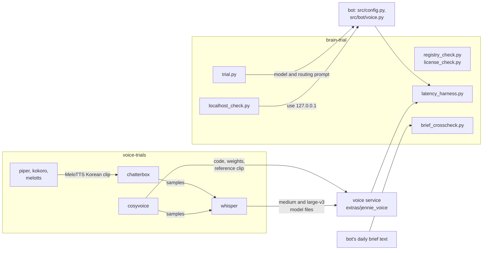
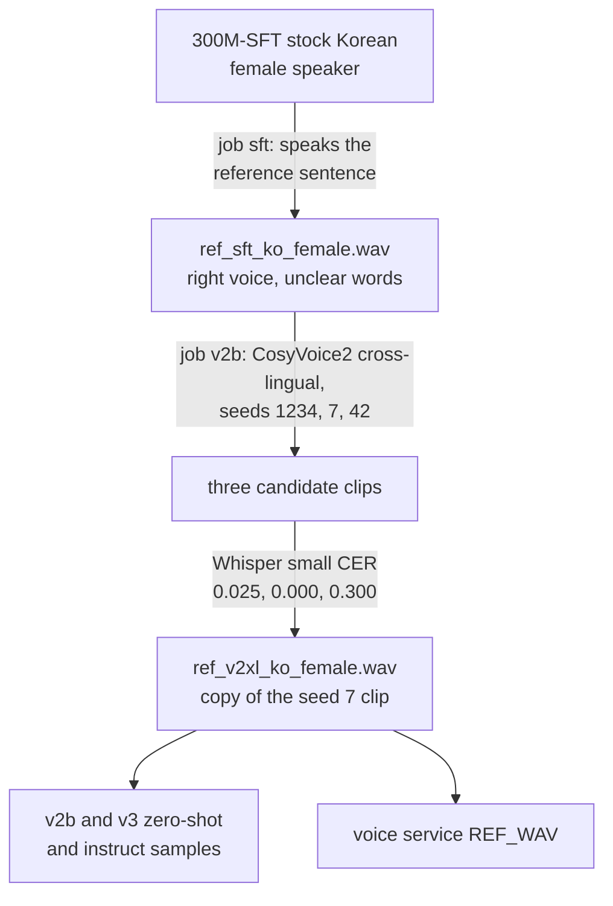

# Trial programs (`extras/trials`)

This page is the reference for every script under [`extras/trials/`](../../extras/trials/): the experiments that chose the local language model (the "brain") and the voice engines of Jennie, the bot's voice assistant, plus one end-to-end latency harness and one independent check of the daily brief. For each script it says what the trial asked, how it was run, what it read and wrote, and what the saved result files show.

Back to the index of all programs: [PYTHON_PROGRAMS.md](../PYTHON_PROGRAMS.md). The production code these trials led to is described in [voice_and_llm.md](voice_and_llm.md). The decisions and the history around them are in [reference/06_LLM_AND_JENNIE_VOICE.md](../reference/06_LLM_AND_JENNIE_VOICE.md) and [reference/08_HISTORY_STAGE_BY_STAGE.md](../reference/08_HISTORY_STAGE_BY_STAGE.md).

## How to read this page

- Code is cited as `path:line`, with the path relative to the repository root, for example `extras/trials/brain-trial/trial.py:17`.
- Result files (`.json`, `.jsonl`, `.log`, `.txt`) are cited the same way.
- Inside the section of one program, a citation that is only `:N` always means line N of that program's file. A line in any other file is cited with that file's name.
- A bare file name such as `gpulock.py:16` is in the same folder as the program of the section, or, in a table cell, in the same folder as the path given earlier in that cell. A short path that starts with an engine folder, such as `chatterbox/render.py:21`, is under `extras/trials/voice-trials/`. Every short form expands to a path relative to the repository root.
- In the "Main functions and classes" tables, the "line" column is a line number in the file the section is about.
- "Lines" in the inventory tables is the number of lines in the file as an editor shows it.
- None of these scripts is imported by the bot, and staff never run them. They were run by hand on the owner's PC in late September 2026 and are published as a record of how the choices were made.
- Most of these scripts cannot run from the published repository as it is: they use absolute paths on the owner's PC (`C:\Hangeul\...`), or need model caches, virtual environments, source checkouts and audio that are not published. See [What is published and what is not](#what-is-published-and-what-is-not) and [Fixed paths](#fixed-paths).
- A few scripts run as they are. With internet access, the five Piper catalogue and licence scripts: `piper/list_voices.py`, `piper/fetch_cards.py` (it reads the published `voices.json`), `piper/fetch_licences.py`, `piper/fetch_licences2.py` and `piper/fetch_licences3.py`. They use only the Python standard library. The three licence scripts only print; the other two write beside themselves (`extras/trials/voice-trials/piper/list_voices.py:7-10`, `extras/trials/voice-trials/piper/fetch_cards.py:7-10`, `extras/trials/voice-trials/piper/fetch_cards.py:23`). `list_voices.py` overwrites the published `voices.json`. `cosyvoice/summarize.py` runs with nothing else: it uses only the standard library and reads the published `renders.jsonl` and `verify_results.json` beside it (`extras/trials/voice-trials/cosyvoice/summarize.py:4-9`). `extras/trials/brain-trial/localhost_check.py` and `extras/trials/brain-trial/vram_probe.py` also use only the standard library and no fixed path, but need Ollama running on the PC; `vram_probe.py` also needs `nvidia-smi` (`extras/trials/brain-trial/vram_probe.py:9`, `extras/trials/brain-trial/vram_probe.py:21`).
- Four other scripts also only fetch from the internet, but do not run as they are. `extras/trials/brain-trial/registry_check.py` and `license_check.py` write into the absolute folder `C:/Hangeul/JARVIS/brain-trial` (`extras/trials/brain-trial/registry_check.py:46`, `extras/trials/brain-trial/license_check.py:23`), so they fail where that folder does not exist. `kokoro/check_repo.py` and `melotts/check_licenses.py` import the third-party package `huggingface_hub` (`extras/trials/voice-trials/kokoro/check_repo.py:6`, `extras/trials/voice-trials/melotts/check_licenses.py:10`), which was installed in their trial environments; `melotts/check_licenses.py` also reads the metadata of the packages installed in the MeloTTS environment (`extras/trials/voice-trials/melotts/check_licenses.py:38-48`).

## Terms used here

| Term | Meaning |
|---|---|
| Jennie | The bot's voice persona. A staff member sends a Telegram voice note; Jennie answers with text and a short spoken voice note (`src/bot/voice.py:1-14`). |
| Brain | The project's word for the local language model: one model served by Ollama (`src/config.py:28-32`). |
| Ollama | A local server program that loads a language model and answers HTTP requests. Here it listens on `http://127.0.0.1:11434` (`extras/trials/brain-trial/trial.py:15`). |
| Routing | Choosing which of the bot's commands a spoken request means, with its date. The trial and the bot use the same 10 command names (`extras/trials/brain-trial/trial.py:24-25`, `src/bot/voice.py:380-381`). |
| Voice service | A separate local HTTP server on `127.0.0.1:8765` that does speech-to-text and text-to-speech for the bot ([`extras/jennie_voice/service.py`](../../extras/jennie_voice/service.py), see [voice_and_llm.md](voice_and_llm.md)). |
| TTS | Text-to-speech. Five engines were tried: Piper, Kokoro, MeloTTS, Chatterbox and CosyVoice. |
| STT | Speech-to-text. The trials used OpenAI Whisper models through three different packages (see the whisper, chatterbox and cosyvoice sections). |
| VRAM | Memory on the graphics card. The owner's card reported 7.93 GB in total (`extras/trials/voice-trials/chatterbox/render.log:1`). The trial scripts print "GB" for bytes divided by 2^30, and their 4.5 GB thresholds use the same unit. The brain, the STT model and the TTS model must share the card. |
| Sample | A WAV file rendered by a TTS trial so a person can listen to it. |
| Sample folder | `C:\Hangeul\JARVIS\voice-samples` on the owner's PC, where every TTS trial wrote its samples. It is not published. |
| Reference clip | A short audio clip whose voice a TTS engine copies. Every reference clip in these trials is itself machine speech made by a TTS engine (`extras/trials/voice-trials/chatterbox/prep_ref.py:1-2`, `extras/trials/voice-trials/cosyvoice/synth_texts.py:7`). |
| Stock speaker | A voice built into a TTS model by its maker. |
| Aegyo | Korean for a cute, playful way of speaking. The trials test a "neutral" and an "aegyo" Korean sentence. |
| CER | Character error rate: the edit distance between the intended text and what a speech recogniser heard, divided by the length of the intended text, after both are normalised. 0.0 is perfect. The normalisation differs by folder. `chatterbox/asr_check.py` and `cosyvoice/textmetrics.py` remove punctuation and all spaces (`extras/trials/voice-trials/chatterbox/asr_check.py:24-28`, `extras/trials/voice-trials/cosyvoice/textmetrics.py:5-7`). `whisper/common.py` removes all spaces only for Korean (`extras/trials/voice-trials/whisper/common.py:62-68`); for English it turns punctuation into spaces and keeps one space between words, so spaces count as characters (`extras/trials/voice-trials/whisper/common.py:56-61`). |
| `rtf` | The field name the result files use for render (or transcription) seconds divided by seconds of audio. Below 1.0 is faster than real time. |
| SFT, zero-shot, cross-lingual, instruct | Four ways CosyVoice makes speech. SFT uses a stock speaker (`inference_sft`). Zero-shot copies a reference clip and is given the clip's transcript (`inference_zero_shot`). Cross-lingual copies a reference clip without its transcript (`inference_cross_lingual`). Instruct copies a reference clip and takes a written instruction about tone (`inference_instruct2`). See `extras/trials/voice-trials/cosyvoice/synth.py:83-164`. |
| GPU lock | The file `C:\Hangeul\JARVIS\voice-trials\gpu.lock`. The chatterbox, cosyvoice and whisper scripts create it while they use the graphics card, so that two trials do not use it at once. See [The GPU lock](#the-gpu-lock). |
| Portal | The agency's admin website. Its address comes from the bot setting `HANGEUL_BASE_URL` (default at `src/config.py:24`). |
| Daily brief | The factual summary the bot sends each day (`src/bot/brief.py`, see [bot_answers_and_jobs.md](bot_answers_and_jobs.md)). |
| Filler clip | A short pre-rendered voice clip the bot sends the moment a voice note arrives (`src/bot/voice.py:204-214`). |
| Supabase | A hosted database. At HEAD the bot publishes what it reads from the portal to it, and the phone app reads it from there (see [cloud.md](cloud.md) and [JEANNIE_APP.md](../JEANNIE_APP.md)). No trial script talks to it directly. |

## What this group does together

The scripts answer seven questions:

1. Which small Ollama models exist, how large are they, and may a business use them? (`registry_check.py`, `license_check.py`)
2. Which model routes a spoken request to the right bot command, writes a short spoken reply that follows the rules, and fits in 3.5 GB of VRAM? (`trial.py`, with `vram_probe.py` and `localhost_check.py` as side checks)
3. How do three small CPU engines sound and how fast are they? (`piper/`, `kokoro/`, `melotts/`)
4. How do two larger GPU engines sound, and can they speak cute Korean? (`chatterbox/`, `cosyvoice/`)
5. Can a speech recogniser understand the samples, and how fast is speech-to-text on this PC? (`chatterbox/asr_check.py`, `cosyvoice/verify.py`, `whisper/`)
6. How long does a staff member wait from sending a voice note to hearing Jennie's answer, and which stage takes the time? (`latency_harness.py`)
7. Is every number in the daily brief backed by what the portal shows? (`brief_crosscheck.py`)

The dated evidence in the published files is from 27 September 2026: `trial.py` fixes "today" at 2026-09-27 (`extras/trials/brain-trial/trial.py:22`), and the CosyVoice logs carry time stamps from 16:42 to 17:01 that day (`extras/trials/voice-trials/cosyvoice/synth_sft.log:18`, `extras/trials/voice-trials/cosyvoice/synth_v3.log:49`).

The diagram shows what each trial fed into. Every arrow is backed by a path, an import or a comment in the code, cited in the sections below. `registry_check.py` and `license_check.py` fed no code; they screened candidates from the list that `trial.py` uses.



Where the outcomes are visible in the code at HEAD:

| Trial outcome | Where the code uses it |
|---|---|
| `qwen3:4b-instruct` as the brain | `OLLAMA_MODEL` default `qwen3:4b-instruct` (`src/config.py:32`) |
| `127.0.0.1` instead of `localhost` for Ollama | `src/config.py:29-31`, the same reason as the comment at `extras/trials/brain-trial/trial.py:13-14` |
| The routing prompt and its 10 commands | `src/bot/voice.py:380-385`; the comment there says the prompt was proven in `trial.py` with 12/12 commands, dates and valid JSON |
| CosyVoice2-0.5B with the reference clip `ref_v2xl_ko_female.wav` and seed 1234 | `extras/jennie_voice/service.py:52-59`; the service loads the CosyVoice code, weights and clip from the cosyvoice trial folder by absolute path |
| faster-whisper `large-v3` and `medium` model files | `extras/jennie_voice/service.py:88-92`; loaded from the whisper trial folder's `hf_home` |
| The final speech-to-text model `large-v3-turbo` | Chosen later by `extras/jennie_voice/bench_stt.py`, not by these trials (`extras/jennie_voice/service.py:95`); see [voice_and_llm.md](voice_and_llm.md) |

The voice service's README warns not to delete the cosyvoice `repo` folder or the whisper `hf_home` folder on the PC, because the service loads from them (`extras/jennie_voice/README.md:15-17`).

## Programs in this group

44 programs: 42 Python scripts and 2 shell scripts. "By hand" means a person ran it from a console on the owner's PC.

### brain-trial

| Program | Lines | One-line purpose | How it is started |
|---|---|---|---|
| [`brain-trial/trial.py`](../../extras/trials/brain-trial/trial.py) | 347 | Scores Ollama models on routing, spoken replies, VRAM and speed | By hand: `python trial.py [model ...]` |
| [`brain-trial/latency_harness.py`](../../extras/trials/brain-trial/latency_harness.py) | 729 | Times the bot's real voice-note path end to end with fake Telegram objects | By hand with the bot's virtual environment: `python latency_harness.py [--passes N] [--gap S] [--tg-rtt S] [--keep-loaded]` |
| [`brain-trial/brief_crosscheck.py`](../../extras/trials/brain-trial/brief_crosscheck.py) | 534 | Re-reads the portal independently and checks every number in a daily brief | By hand: `python brief_crosscheck.py [brief.txt] [--json OUT.json]` |
| [`brain-trial/registry_check.py`](../../extras/trials/brain-trial/registry_check.py) | 48 | Checks five model tags in the Ollama registry: exists, size, licence | By hand: `python registry_check.py` |
| [`brain-trial/license_check.py`](../../extras/trials/brain-trial/license_check.py) | 28 | Saves the full licence of two models and prints the commercial-use sentences | By hand: `python license_check.py` |
| [`brain-trial/localhost_check.py`](../../extras/trials/brain-trial/localhost_check.py) | 17 | Times `localhost` against `127.0.0.1` for Ollama | By hand: `python localhost_check.py` |
| [`brain-trial/vram_probe.py`](../../extras/trials/brain-trial/vram_probe.py) | 43 | Measures one model's real VRAM cost with `nvidia-smi` | By hand: `python vram_probe.py <model> [...]` |

### voice-trials/piper

| Program | Lines | One-line purpose | How it is started |
|---|---|---|---|
| [`piper/list_voices.py`](../../extras/trials/voice-trials/piper/list_voices.py) | 23 | Downloads the Piper voice catalogue and lists British English and Korean voices | By hand: `python list_voices.py` |
| [`piper/fetch_cards.py`](../../extras/trials/voice-trials/piper/fetch_cards.py) | 25 | Downloads the model card of every en_GB and ko_KR voice | By hand: `python fetch_cards.py` |
| [`piper/fetch_licences.py`](../../extras/trials/voice-trials/piper/fetch_licences.py) | 32 | First pass at the licence documents behind the voices | By hand: `python fetch_licences.py` |
| [`piper/fetch_licences2.py`](../../extras/trials/voice-trials/piper/fetch_licences2.py) | 38 | Second licence pass | By hand: `python fetch_licences2.py` |
| [`piper/fetch_licences3.py`](../../extras/trials/voice-trials/piper/fetch_licences3.py) | 31 | Third licence pass and the VCTK speaker list | By hand: `python fetch_licences3.py` |
| [`piper/vctk_candidates.py`](../../extras/trials/voice-trials/piper/vctk_candidates.py) | 59 | Renders 8 VCTK speakers and estimates their pitch, to pick one | By hand: `python vctk_candidates.py` |
| [`piper/render_samples.py`](../../extras/trials/voice-trials/piper/render_samples.py) | 68 | Renders and checks the four final Piper samples on the CPU | By hand: `python render_samples.py` |

### voice-trials/kokoro

| Program | Lines | One-line purpose | How it is started |
|---|---|---|---|
| [`kokoro/check_repo.py`](../../extras/trials/voice-trials/kokoro/check_repo.py) | 42 | Reads the Kokoro-82M model repository: licence, voices, model card | By hand: `python check_repo.py` |
| [`kokoro/meta_check.py`](../../extras/trials/voice-trials/kokoro/meta_check.py) | 38 | Prints package licences, Kokoro language codes, disk sizes; re-checks the WAVs | By hand: `python meta_check.py` |
| [`kokoro/synth.py`](../../extras/trials/voice-trials/kokoro/synth.py) | 68 | Renders the English sentence with Kokoro voices on the CPU | By hand: `python synth.py [voice ...]` |

### voice-trials/melotts

| Program | Lines | One-line purpose | How it is started |
|---|---|---|---|
| [`melotts/render_samples.py`](../../extras/trials/voice-trials/melotts/render_samples.py) | 117 | Renders five English accents and one Korean voice on the CPU | By hand: `python render_samples.py [en] [kr]` |
| [`melotts/aegyo_samples.py`](../../extras/trials/voice-trials/melotts/aegyo_samples.py) | 49 | Renders four "cute" Korean variants by speed, pitch and prosody | By hand: `python aegyo_samples.py` |
| [`melotts/bench.py`](../../extras/trials/voice-trials/melotts/bench.py) | 40 | CPU timing benchmark, 3 repetitions per voice, no files written | By hand: `python bench.py` |
| [`melotts/analyze_wavs.py`](../../extras/trials/voice-trials/melotts/analyze_wavs.py) | 22 | Re-checks the MeloTTS WAVs and estimates the median pitch | By hand: `python analyze_wavs.py` |
| [`melotts/check_licenses.py`](../../extras/trials/voice-trials/melotts/check_licenses.py) | 50 | Fetches licence data for the models and Python packages MeloTTS uses | By hand: `python check_licenses.py` |
| [`melotts/check_phonemes.py`](../../extras/trials/voice-trials/melotts/check_phonemes.py) | 26 | Prints the text front-end's phonemes for the test sentences | By hand: `python check_phonemes.py` |

### voice-trials/chatterbox

| Program | Lines | One-line purpose | How it is started |
|---|---|---|---|
| [`chatterbox/download.py`](../../extras/trials/voice-trials/chatterbox/download.py) | 26 | Downloads the Chatterbox multilingual checkpoints into the trial folder | By hand: `python download.py [<t3 file>]` |
| [`chatterbox/prep_ref.py`](../../extras/trials/voice-trials/chatterbox/prep_ref.py) | 34 | Makes a 24 kHz reference clip from the MeloTTS Korean sample | By hand: `python prep_ref.py` |
| [`chatterbox/render.py`](../../extras/trials/voice-trials/chatterbox/render.py) | 183 | Renders 11 Chatterbox samples, on the GPU when the lock and VRAM allow | By hand: `python render.py` (options by environment variable) |
| [`chatterbox/verify.py`](../../extras/trials/voice-trials/chatterbox/verify.py) | 38 | Checks each rendered WAV opens, has a sane length and is not silent | By hand: `python verify.py` |
| [`chatterbox/asr_check.py`](../../extras/trials/voice-trials/chatterbox/asr_check.py) | 57 | Transcribes each sample with Whisper and scores the CER | By hand: `python asr_check.py` |
| [`chatterbox/check_wm_clip.py`](../../extras/trials/voice-trials/chatterbox/check_wm_clip.py) | 23 | Counts clipped samples and reads the Perth watermark score | By hand: `python check_wm_clip.py` |

### voice-trials/cosyvoice

| Program | Lines | One-line purpose | How it is started |
|---|---|---|---|
| [`cosyvoice/synth.py`](../../extras/trials/voice-trials/cosyvoice/synth.py) | 169 | Renders CosyVoice samples and reference clips in four jobs: `sft`, `v2`, `v2b`, `v3` | By hand: `python synth.py <job> [cpu]` |
| [`cosyvoice/synth_texts.py`](../../extras/trials/voice-trials/cosyvoice/synth_texts.py) | 9 | Holds the three test sentences and the two reference sentences | Imported by `synth.py`, `exp_sft_lang.py`, `verify.py` |
| [`cosyvoice/gpulock.py`](../../extras/trials/voice-trials/cosyvoice/gpulock.py) | 77 | Waits for the GPU lock, checks free VRAM, holds the lock | Imported by `synth.py` and `exp_sft_lang.py` |
| [`cosyvoice/gpucheck.py`](../../extras/trials/voice-trials/cosyvoice/gpucheck.py) | 9 | Prints free and total VRAM | Run as a child process by `gpulock.py` |
| [`cosyvoice/smoke.py`](../../extras/trials/voice-trials/cosyvoice/smoke.py) | 18 | CPU-only test that the install imports and a model loads | By hand: `python smoke.py` |
| [`cosyvoice/exp_sft_lang.py`](../../extras/trials/voice-trials/cosyvoice/exp_sft_lang.py) | 43 | A/B test of the Korean language tag on the stock Korean speaker | By hand: `python exp_sft_lang.py` |
| [`cosyvoice/verify.py`](../../extras/trials/voice-trials/cosyvoice/verify.py) | 70 | Checks each sample and scores a Whisper round trip | By hand: `python verify.py [<glob>] [<whisper model>]` |
| [`cosyvoice/textmetrics.py`](../../extras/trials/voice-trials/cosyvoice/textmetrics.py) | 21 | CER helper | Imported by `synth.py` (job `v2b`) and `verify.py` |
| [`cosyvoice/summarize.py`](../../extras/trials/voice-trials/cosyvoice/summarize.py) | 14 | Prints one comparison line per sample | By hand: `python summarize.py` |
| [`cosyvoice/dl_models.sh`](../../extras/trials/voice-trials/cosyvoice/dl_models.sh) | 17 | Downloads the inference files of CosyVoice-300M-SFT and CosyVoice2-0.5B | By hand in a POSIX shell: `sh dl_models.sh` |
| [`cosyvoice/dl_v3.sh`](../../extras/trials/voice-trials/cosyvoice/dl_v3.sh) | 10 | Downloads the inference files of Fun-CosyVoice3-0.5B-2512 | By hand in a POSIX shell: `sh dl_v3.sh` |

### voice-trials/whisper

| Program | Lines | One-line purpose | How it is started |
|---|---|---|---|
| [`whisper/common.py`](../../extras/trials/voice-trials/whisper/common.py) | 141 | Shared helpers: expected texts, normalisation, CER, model paths, GPU lock | Imported by the three scripts below |
| [`whisper/download_models.py`](../../extras/trials/voice-trials/whisper/download_models.py) | 6 | Downloads the faster-whisper `large-v3` and `medium` models | By hand: `python download_models.py` |
| [`whisper/bench.py`](../../extras/trials/voice-trials/whisper/bench.py) | 74 | Speech-to-text speed benchmark on CPU and GPU | By hand: `python bench.py` |
| [`whisper/transcribe_all.py`](../../extras/trials/voice-trials/whisper/transcribe_all.py) | 121 | Transcribes 28 samples, scores CER and checks language detection | By hand: `python transcribe_all.py [--device auto/cuda/cpu] [--model large-v3/medium]` |

Order of work, as the history documents record it:

1. The CPU engines (Piper, Kokoro, MeloTTS): the first voice trials, done at 15:15 on 27 September 2026 ([reference/08 section 6.2](../reference/08_HISTORY_STAGE_BY_STAGE.md)). The MeloTTS aegyo variants followed at 15:58 (section 6.3).
2. Chatterbox and CosyVoice, with a Whisper round trip to judge intelligibility: the "realistic trial", done at 17:32 the same day (section 6.4). The CosyVoice logs' time stamps, 16:42 to 17:01, fall inside it.
3. The brain trial, from 20:21 to 23:40 that evening (section 6.7).
4. The latency harness, run at 01:45 on 28 September ([reference/06 section 5.5](../reference/06_LLM_AND_JENNIE_VOICE.md)).
5. The live check of the factual daily brief with `brief_crosscheck.py`, at 13:35 on 28 September ([reference/08 section 7.4](../reference/08_HISTORY_STAGE_BY_STAGE.md)).

## What the trials found

A summary of the saved results. Each program's section gives the full numbers.

| Question | What the published result files show | Evidence |
|---|---|---|
| Do the candidate model tags exist, and under which licence? | All five tags exist. Weights: `qwen2.5:7b` 4.68 GB, `qwen2.5:3b` 1.93 GB, `qwen3:4b` 2.5 GB, `gemma3:4b` 3.34 GB, `qwen3:1.7b` 1.36 GB. Licence heads: Apache 2.0 for `qwen2.5:7b`, `qwen3:4b`, `qwen3:1.7b`; "Qwen RESEARCH LICENSE AGREEMENT" for `qwen2.5:3b`; "Gemma Terms of Use" for `gemma3:4b`. | `extras/trials/brain-trial/registry.json:5-45` |
| May a business use `qwen2.5:3b`? | Its licence grants use "FOR NON-COMMERCIAL PURPOSES ONLY" and says a commercial user must request a licence. | `extras/trials/brain-trial/license_qwen2.5_3b.txt:19-20` |
| Which brain? | `qwen3:4b-instruct`: 12/12 commands, 12/12 dates, 12/12 valid JSON, 2.96 GiB, route 0.34 s, reply 0.29 s. `qwen2.5:7b` also scored 12/12 but needs 4.42 GiB, over the 3.5 budget. `qwen3:4b` scored 12/12 on routing but its replies were reasoning text cut at the 200-token cap. | `extras/trials/brain-trial/results_*.json` |
| How fast and how good are the CPU engines? | Piper: 0.034 to 0.159 s of work per second of audio, 22,050 Hz. Kokoro (last run, 3 English voices): 0.38 to 0.42. MeloTTS: 0.264 to 1.065, 44,100 Hz, English and Korean. | `extras/trials/voice-trials/piper/render_results.json`, `kokoro/results.json`, `melotts/render_results.json` |
| How good are the GPU engines in Korean? | Chatterbox: about 0.5 s per second of audio after the first render, 4.3 GB peak VRAM reserved, CER 0.0 in English and 0.041 to 0.136 in Korean. CosyVoice: the stock 300M-SFT Korean speaker is close to unintelligible (CER 0.551 and 0.644); CosyVoice2 and CosyVoice3 zero-shot Korean from a clean synthetic reference scored 0.041 to 0.085; peak VRAM allocated 1.88 to 3.51 GB. | `extras/trials/voice-trials/chatterbox/asr_results.json`, `extras/trials/voice-trials/cosyvoice/verify_results.json`, `extras/trials/voice-trials/cosyvoice/renders.jsonl` |
| How fast is speech-to-text on this PC? | For a clip of about 12 s (11.8 and 11.92 s): faster-whisper `large-v3` on the GPU (float16, beam 5) 1.35 to 1.45 s; `large-v3` on the CPU (int8) 12.83 to 12.84 s at beam 5 and 12.29 to 12.65 s at beam 1, slower than real time in every case; `medium` on the CPU (int8, beam 5) 7.3 to 7.4 s. Both `large-v3` (GPU) and `medium` (CPU) detected the right language for all 28 samples. | `extras/trials/voice-trials/whisper/bench.json`, `extras/trials/voice-trials/whisper/bench.log:8-15`, `bench.log:21-22`, `results_large-v3_cuda.json`, `results_medium_cpu.json` |
| How long does a voice note take end to end? | The harness's result file is not published. The figures from its run on 28 September 2026 are recorded in [reference/06 section 5.5](../reference/06_LLM_AND_JENNIE_VOICE.md). | `extras/trials/brain-trial/latency_harness.py:24-25` names the result files |
| Is the daily brief backed by the portal? | No output of `brief_crosscheck.py` is in the repository. The history document records the run of 28 September 2026: [reference/08](../reference/08_HISTORY_STAGE_BY_STAGE.md). | — |

Several scripts only print to the console and saved nothing, so their findings cannot be determined from the repository: `vram_probe.py`, `localhost_check.py`, `brief_crosscheck.py`, `chatterbox/check_wm_clip.py`, `cosyvoice/smoke.py`, `cosyvoice/exp_sft_lang.py`, `cosyvoice/summarize.py`, `kokoro/check_repo.py`, `kokoro/meta_check.py`, every MeloTTS script except `render_samples.py`, the three `piper/fetch_licences*.py`, `piper/fetch_cards.py` and `piper/vctk_candidates.py`. In particular the repository holds no saved answer to these questions: the Perth watermark result, the licence conclusion for each voice, whether Kokoro supports Korean, and which VCTK speaker had which pitch. The later conclusions are written up in [reference/06 section 5.1](../reference/06_LLM_AND_JENNIE_VOICE.md).

## Things shared by several programs

### What is published and what is not

The published folder [`extras/trials/`](../../extras/trials/) holds the scripts and the result files listed in [Result and data files](#result-and-data-files). On the owner's PC the trial folders also held the following, which are not published. Each name below is taken from the code that uses it.

| Folder (on the PC) | What it held, as far as the code says | Used by |
|---|---|---|
| `C:\Hangeul\JARVIS\voice-samples` | Every TTS sample (WAV) | All render, verify and transcription scripts |
| `brain-trial\latency_notes\*.ogg` | The four test voice notes (only `notes.json` is published) | `extras/trials/brain-trial/latency_harness.py:420-434` |
| `brain-trial\latency_results.json`, `latency_harness.log` | The harness's results and the bot's log lines | `extras/trials/brain-trial/latency_harness.py:45-46` |
| `brain-trial\brief_verify.txt` | The default brief text to check | `extras/trials/brain-trial/brief_crosscheck.py:500` |
| `chatterbox\hf`, `chatterbox\pkuseg_home` | Hugging Face cache; a Chinese word-segmenter's data | `extras/trials/voice-trials/chatterbox/render.py:12-15` |
| `chatterbox\ref` | The reference clip `melotts_kr_ref_24k.wav` | `extras/trials/voice-trials/chatterbox/prep_ref.py:9-11` |
| `cosyvoice\repo` | The CosyVoice source checkout with `third_party\Matcha-TTS` and the model folders under `pretrained_models` | `extras/trials/voice-trials/cosyvoice/synth.py:13-20` |
| `cosyvoice\stubs` | Modules put first on the import path; contents not in the repository | `extras/trials/voice-trials/cosyvoice/synth.py:18` |
| `cosyvoice\ref`, `cosyvoice\exp` | Reference clips; the A/B renders | `extras/trials/voice-trials/cosyvoice/synth.py:28`, `exp_sft_lang.py:25` |
| `cosyvoice\hf`, `ms`, `torchhome`, `whisper_models` | Model caches | `extras/trials/voice-trials/cosyvoice/synth.py:14-16`, `synth.py:117` |
| `kokoro\hf_cache`, `kokoro\repo_info` | Model cache; the downloaded `README.md` and `VOICES.md` | `extras/trials/voice-trials/kokoro/meta_check.py:28`, `check_repo.py:9` |
| `melotts\src` | A patched MeloTTS checkout ("lazy language imports, no Japanese deps") | `extras/trials/voice-trials/melotts/render_samples.py:4`, `render_samples.py:22` |
| `melotts\hf_cache`, `melotts\nltk_data` | Model cache; NLTK data | `extras/trials/voice-trials/melotts/render_samples.py:16-17` |
| `piper\voices`, `piper\candidates`, `piper\model_cards` | Voice models (`.onnx`); VCTK candidate renders; model cards | `extras/trials/voice-trials/piper/render_samples.py:11`, `vctk_candidates.py:14`, `fetch_cards.py:9` |
| `whisper\hf_home` | The faster-whisper model cache | `extras/trials/voice-trials/whisper/common.py:9` |
| Virtual environments in the engine folders | `.venv` (chatterbox, kokoro, melotts) or `venv` (cosyvoice, whisper), as the logs and code show. No published file names an environment for Piper. | `extras/trials/voice-trials/chatterbox/render.log:3`, `kokoro/meta_check.py:29`, `melotts/render_samples.py:3`, `cosyvoice/synth_sft.log:9`, `whisper/common.py:13` |

The published `extras/trials/brain-trial` folder also lacks two records of `trial.py` that existed on the owner's PC: the result file of `qwen3:1.7b` and the console log of the run over the five default candidates. The outcome for all five candidates is tabled in [reference/06 section 1.1](../reference/06_LLM_AND_JENNIE_VOICE.md).

### Fixed paths

Most scripts locate their own folder from `__file__`. These paths are written into the code as absolute paths on the owner's PC:

| Absolute path | Used by |
|---|---|
| `C:/Hangeul/JARVIS/brain-trial` | Output folder of `trial.py:16`, `registry_check.py:46`, `license_check.py:23` (all in `extras/trials/brain-trial/`) |
| `C:\Hangeul\BOT` | The bot's install folder, imported by `extras/trials/brain-trial/latency_harness.py:43`, `latency_harness.py:66` and `extras/trials/brain-trial/brief_crosscheck.py:25-26` |
| `C:\Hangeul\JARVIS\jennie_voice\jennie_voice.log` | The voice service's log, read by `extras/trials/brain-trial/latency_harness.py:47` |
| `C:\Hangeul\JARVIS\voice-samples` | The sample folder, written or read by every TTS and STT script |
| `C:\Hangeul\JARVIS\voice-trials\gpu.lock` | `extras/trials/voice-trials/chatterbox/render.py:21`, `extras/trials/voice-trials/cosyvoice/gpulock.py:13`, `extras/trials/voice-trials/whisper/common.py:23` |
| `C:\Hangeul\JARVIS\voice-trials\chatterbox` | `chatterbox/download.py:6`, `prep_ref.py:9`, `render.py:11`, `verify.py:34`, `asr_check.py:9`, `check_wm_clip.py:5` |
| `C:\Hangeul\JARVIS\voice-trials\kokoro` | `extras/trials/voice-trials/kokoro/meta_check.py:27` |
| `/c/Hangeul/JARVIS/voice-trials/cosyvoice/repo/pretrained_models` | `extras/trials/voice-trials/cosyvoice/dl_models.sh:3`, `dl_v3.sh:2` (a Git Bash style path) |

### The test sentences

Every TTS trial speaks an invented status update: the portal sync has finished, one new student was document-verified, and all seven progress sheets are up to date. It contains no personal data. There are four texts, copied by hand into many files:

| Text | Where it is defined |
|---|---|
| English A: "Good evening! The portal sync just finished. ... Anything else I can check for you?" | `extras/trials/voice-trials/chatterbox/render.py:33-34`, `chatterbox/asr_check.py:18`, `cosyvoice/synth_texts.py:1-2`, `whisper/common.py:26-27` |
| English B: "Good evening. The portal sync finished a minute ago: ... Shall I read you today's missing-information report?" | `extras/trials/voice-trials/kokoro/synth.py:22-26`, `melotts/render_samples.py:53-55`, `melotts/bench.py:23-25`, `piper/render_samples.py:15-17`, `piper/vctk_candidates.py:17-19` |
| Neutral Korean (polite, the same content) | `chatterbox/render.py:35-36`, `chatterbox/asr_check.py:19`, `cosyvoice/synth_texts.py:3-4`, `whisper/common.py:28-29`, `melotts/render_samples.py:56-57`, `melotts/bench.py:26-27`, `melotts/check_phonemes.py:20`, `piper/render_samples.py:18-19` |
| Aegyo Korean (cute, starts with "짜잔! 제니예요!", "Ta-da! It's Jennie!") | `chatterbox/render.py:37-38`, `chatterbox/asr_check.py:20`, `cosyvoice/synth_texts.py:5-6`, `whisper/common.py:30-31`, `melotts/aegyo_samples.py:26-27` |

(Paths in the right column are under `extras/trials/voice-trials/`.) The first-round engines (Piper, Kokoro, MeloTTS) used English B; the second round (Chatterbox, CosyVoice) and the Whisper checks used English A. If one copy were edited, the checks would score the wrong text.

### Sample file names

Every TTS script names its sample `<engine>__<voice or setting>__<text kind>.wav`, with parts joined by two underscores:

| First part | Written by | Middle part | Last part |
|---|---|---|---|
| `piper` | `extras/trials/voice-trials/piper/render_samples.py:35-36` | Model name in lower case, plus `-<speaker>` for VCTK | `en`, `kr` |
| `kokoro` | `extras/trials/voice-trials/kokoro/synth.py:48` | Kokoro voice name | `en` |
| `melotts` | `extras/trials/voice-trials/melotts/render_samples.py:80` | Speaker in lower case (`en-br`, `kr` ...) | `en`, `kr` |
| `aegyo` | `extras/trials/voice-trials/melotts/aegyo_samples.py:47` | Variant (`1_style-only` ... `4_very-cute`) | `kr` |
| `real__chatterbox` | `extras/trials/voice-trials/chatterbox/render.py:133` | `default` or `meloref`, plus a setting suffix | `en`, `kr-neutral`, `kr-aegyo` |
| `real__cosyvoice` | `extras/trials/voice-trials/cosyvoice/synth.py:72` | Model and mode, for example `v2-zeroshot-krfemale` | `en`, `kr-neutral`, `kr-aegyo` |

The `aegyo` files are MeloTTS output; the engine name is not in their names. The word `real` in the Chatterbox and CosyVoice names is not explained anywhere in the code; by the code, those files are machine speech like all the others. A script that runs again with the same name overwrites the earlier file.

### The GPU lock

Three folders take the lock file `C:\Hangeul\JARVIS\voice-trials\gpu.lock` before using the graphics card. They implement it in three different ways:

| | `chatterbox/render.py` | `cosyvoice/gpulock.py` | `whisper/common.py` (`GpuLock`) |
|---|---|---|---|
| How the file is created | Exclusive create (`O_CREAT`, `O_EXCL`), `:60` | Plain open for writing, which overwrites, `:57` | Exclusive create, `:116` |
| File content | `chatterbox`, `:61` | `cosyvoice`, `:58` | `owner=`, `pid=` and `since=` lines, `:120` |
| A lock with its own engine name | Reclaimed and touched, `:70-73` | Treated as free, `:40-41` | Refused (the file exists), `:117-118` |
| Another engine's lock older than 20 minutes | Deleted; the script waits 20 s and tries again, `:74-80`, `:110` | Ignored and overwritten, `:42-44` | Refused; this lock never goes stale |
| Free-VRAM check | In-process `torch.cuda.mem_get_info()` after taking the lock, at least 4.5 GB, `:101-105` | `gpucheck.py` in a child process before taking the lock, at least 4.5 GB, `:20-28`, `:54-56` | `nvidia-smi` before taking the lock, at least 3072 MiB (`bench.py:55-56`, `transcribe_all.py:98-99`) |
| Waiting | Up to 45 minutes, polling every 20 s, 60 s after a low-VRAM check, `:94-112` | Up to 15 minutes, polling every 20 s, `:48-68` | No waiting |
| When the GPU is not available | CPU | CPU | CPU |
| Lock kept fresh while working | Touched before every render, `:138` | No | No |
| Release | Deleted only if its content is `chatterbox`, `:85-91` | Deleted only if its content is `cosyvoice`, `:71-77` | Deleted only if this object created it, `:124-130` |

(File names in the header are under `extras/trials/voice-trials/`; line numbers are in that file.) The lock is cooperative: it only works between these scripts. The production voice service does not use it (`extras/jennie_voice/service.py` does not mention `gpu.lock`). Because the CosyVoice lock is not exclusive and treats a stale foreign lock as absent, two scripts that start at the same moment can both believe they hold the GPU.

### Code repeated across files

| What | Copies | Note |
|---|---|---|
| CER (normalise, then edit distance) | `extras/trials/voice-trials/chatterbox/asr_check.py:24-38`, `extras/trials/voice-trials/cosyvoice/textmetrics.py:5-21`, `extras/trials/voice-trials/whisper/common.py:40-88` | The first two do not convert numerals, so "7개" for "일곱 개" counts as an error. The whisper copy maps English single digits to words and "7개", "1명" to Korean words before comparing (`whisper/common.py:45-51`), and for English it keeps one space between words, so spaces count, while the first two drop every space (`whisper/common.py:56-61`). CER values from different folders are therefore not directly comparable. |
| The MeloTTS Korean tokenizer patch | `extras/trials/voice-trials/melotts/render_samples.py:41-45`, `aegyo_samples.py:14-18`, `bench.py:15-19`, `check_phonemes.py:12-16` | Replaces `g2pkk`'s MeCab check and loader with `python-mecab-ko` |
| `nvidia-smi` memory readers | `extras/trials/brain-trial/vram_probe.py:20-23`, `extras/trials/brain-trial/latency_harness.py:323-332`, `extras/trials/voice-trials/whisper/common.py:96-104` | Different fields and error handling in each |
| Ollama JSON request helper | `extras/trials/brain-trial/trial.py:30-36`, `extras/trials/brain-trial/vram_probe.py:12-17` | Same code, timeouts 600 s and 300 s |
| Ollama registry GET helper | `extras/trials/brain-trial/registry_check.py:13-16`, `extras/trials/brain-trial/license_check.py:11-14` | The first can limit the bytes read |
| GPU lock | See [The GPU lock](#the-gpu-lock) | Three implementations |

## brain-trial programs

The folder [`extras/trials/brain-trial/`](../../extras/trials/brain-trial/) holds the scripts that chose and measured the brain. Five of them use only the Python standard library. `latency_harness.py` and `brief_crosscheck.py` import the bot's own code from `C:\Hangeul\BOT` and need the bot's virtual environment.

### extras/trials/brain-trial/trial.py

**Purpose.** Scores small Ollama models on three tests, to choose Jennie's brain (`extras/trials/brain-trial/trial.py:1-6`):

- A, routing: does the model pick the right bot command and date for a spoken request, as valid JSON?
- B, spoken reply: does it turn the bot's written answer into one or two short, rule-following spoken sentences?
- C, resources: how much VRAM does it take at a 4096-token context, how long does it take to load, and how fast does it answer?

**How it is run or who calls it.** By hand, with any Python 3: `python trial.py [model ...]` (`:3`). Only the standard library is imported (`:7-11`). With no argument it runs the five `CANDIDATES` (`:17`, `:329`). A model that is not installed in Ollama is printed as "not installed, skipped" and recorded as unavailable (`:332-336`). Nothing is downloaded (`:4`). It needs Ollama running on this PC. The published log `trial_instruct.log` is the console output of a run that named `qwen3:4b-instruct` on the command line (`extras/trials/brain-trial/trial_instruct.log:1`), a model that is not in `CANDIDATES`.

**What it reads.**
- Ollama at `http://127.0.0.1:11434` (`:15`): `GET /api/tags` for installed models (`:40`), `GET /api/ps` for loaded models and their sizes (`:44`, `:343`), `POST /api/generate` to load and unload (`:52`, `:294`), `POST /api/chat` for every test call (`:70`).
- The command line (`:329`).
- No files and no bot settings.

**What it writes.**
- `C:/Hangeul/JARVIS/brain-trial/results_<model>.json` for each model run, with `:` in the model name replaced by `_` (`:16`, `:339-340`). The published files are `results_qwen2.5_7b.json`, `results_qwen3_4b.json` and `results_qwen3_4b-instruct.json`.
- Console: one line per test case (`:178-179`, `:281`), a load line per model (`:304`), a JSON summary of all models (`:342`), and the list of models still loaded at the end (`:343`).
- To Ollama it sends the test prompts: the routing system prompt with each utterance and its history (`:155-157`), and the reply system prompt with the fixed written answer (`:273-277`).

**Why it exists.** To pick a model that understands Korean and English office requests and can phrase a short spoken answer, while leaving room on the 8 GB card for the voice models. Staff do not use it. Its routing prompt and command list were carried into the bot (`src/bot/voice.py:380-385`).

**Main functions and classes.**

| Name | Line | What it does |
|---|---|---|
| `OLLAMA`, `OUT_DIR`, `CANDIDATES`, `SEED`, `TEMP`, `NUM_CTX`, `BUDGET_GB`, `TODAY` | 15-22 | Settings of the trial (values under "Numbers that matter") |
| `COMMANDS` | 24-25 | The 10 command names: `verified_today`, `verified_date`, `inquiries_today`, `inquiries_date`, `calendar`, `passports`, `stats`, `missing_report`, `crosscheck`, `chat` |
| `call` | 30 | Sends JSON to Ollama: POST when there is a payload, GET otherwise; returns the parsed JSON |
| `installed` | 39 | Set of installed model names from `/api/tags` |
| `ps` | 43 | The `/api/ps` record of one loaded model, or `None` |
| `unload` | 50 | `POST /api/generate` with `keep_alive: 0`; prints an error instead of raising |
| `chat` | 57 | One non-streamed `/api/chat` call with temperature, seed, context size and token cap; adds `think: False` for model names starting `qwen3`; returns the text, any `thinking` text, wall time, Ollama time, load time, token counts and tokens per second |
| `ROUTER_SYSTEM` | 89-112 | The routing system prompt: the 10 commands with Korean hints, "Today is Sunday 2026-09-27", how to treat follow-ups, and the JSON answer form |
| `ROUTER_SCHEMA` | 114-123 | JSON schema passed to Ollama as `format`: `command` (one of the 10), `date` (string or null), `english_query`, `language` (`ko` or `en`) |
| `KO1`, `EN7`, `KO1_REPLY`, `EN7_REPLY` | 125-128 | The base question "how many students were verified today" in Korean and English, and the earlier Jennie answers used as history |
| `ROUTING_CASES` | 131-144 | The 12 routing cases (see below) |
| `router_user_msg` | 147 | Builds "Conversation so far: ... NEW utterance: ..." |
| `run_routing` | 152 | Runs the 12 cases; checks the JSON, the command, the date and the language; prints one line per case |
| `WRITTEN` | 185-189 | The fixed "written answer" for test B: a verified-students message for 27 September 2026 with 2 students and a total of 28,000.00 BDT, one line per student |
| `REPLY_SYSTEM_KO`, `REPLY_SYSTEM_EN` | 191-220 | The reply rules: one or two short sentences, at most 200 characters, only facts from the written answer, totals rather than names, numbers as Hangul words in Korean, no Markdown, emoji or URLs |
| `REPLY_CASES` | 223-229 | 3 cases: the Korean and English verified questions with `WRITTEN`, and the English "thanks" with no written answer |
| `HANGUL`, `EMOJI`, `MARKDOWN`, `URL` | 231-234 | Regular expressions used by the reply checks |
| `reply_checks` | 237 | Scores one reply (see "Numbers that matter"); returns the measurements with `passed` and `failed` lists |
| `run_replies` | 268 | Runs the 3 reply cases and prints the failed checks |
| `run_model` | 287 | Unloads the model if loaded, cold-loads it, reads its size from `/api/ps`, warms it up, runs A and B, always unloads it, and computes the averages |
| `main` | 328 | Runs every requested model, writes one result file per model, prints the summary |

The 12 routing cases (`:131-144`): 7 Korean and 5 English. Cases 3 and 8 are follow-ups ("and yesterday?") with the earlier question and answer as history; both expect `verified_date` with the date 2026-09-26. Case 2 is case 1 with one word changed to imitate a speech-recognition mistake (`수료` for `서류`). The expected commands are `verified_today` (cases 1, 2, 7), `verified_date` (3, 8), `calendar` (4, 9), `passports` (5), `inquiries_today` (6), `chat` (10, 11) and `stats` (12).

**Numbers that matter.**

| Item | Value | Where |
|---|---|---|
| Candidates | `qwen2.5:7b`, `qwen2.5:3b`, `qwen3:4b`, `gemma3:4b`, `qwen3:1.7b` | `:17` |
| Seed, temperature, context | 42, 0.3, 4096 tokens | `:18-20` |
| VRAM budget | 3.5, compared with sizes in GiB (bytes / 2^30) | `:21`, `:299-303` |
| "Today" | 2026-09-27 (a Sunday) | `:22`, `:105` |
| HTTP timeout | 600 s per call | `:30` |
| `keep_alive` | `"10m"` for test calls and the cold load | `:62`, `:294` |
| Token caps | 160 for routing, 200 for replies, 8 for the warm-up call, 256 default | `:157`, `:277`, `:306`, `:57` |
| Pause after unloading a loaded model | 2 s | `:291` |
| Date format accepted | `YYYY-MM-DD` or null | `:165-166` |
| Reply length | 1 to 200 characters | `:238` |
| Reply sentences | at most 2 | `:242` |
| Korean reply checks | contains Hangul, no run of three or more Latin words, no ASCII digits; facts "two" (`두 명` or `두 분`) and "28,000" (`이만 팔천`) | `:243-252` |
| English reply checks | no Hangul, some Latin letters; facts "two" or "2" and "28,000" or "twenty-eight thousand" | `:253-257` |
| `fits_budget` | fully on the GPU and at most 3.5 | `:302-303` |

**Results in the published files.**

| Model | Load (wall) | VRAM | Fits budget | Command | Date | Valid JSON | Route | Reply | Tokens/s | Source |
|---|---|---|---|---|---|---|---|---|---|---|
| `qwen2.5:7b` | 8.24 s | 4.42 GiB | no | 12/12 | 12/12 | 12/12 | 0.46 s | 0.38 s | 79.3 | `extras/trials/brain-trial/results_qwen2.5_7b.json:3-9` and `:348-355` of that file |
| `qwen3:4b` | 12.8 s | 2.96 GiB | yes | 12/12 | 12/12 | 12/12 | 0.44 s | 1.97 s | 104.2 | `extras/trials/brain-trial/results_qwen3_4b.json:3-9` and `:448-455` of that file |
| `qwen3:4b-instruct` | 2.77 s | 2.96 GiB | yes | 12/12 | 12/12 | 12/12 | 0.34 s | 0.29 s | 119.8 | `extras/trials/brain-trial/results_qwen3_4b-instruct.json:3-9` and `:348-355` of that file |

Reply quality (test B):

- `qwen2.5:7b`: the Korean reply wrote "27" in digits with a wrong month and year in words, and left out the 28,000 total (`results_qwen2.5_7b.json:244`); the English reply also left out the total (`results_qwen2.5_7b.json:284`); the "thanks" reply had three sentences (`results_qwen2.5_7b.json:319`).
- `qwen3:4b`: all three replies are the model's reasoning ("Okay, let's tackle this..."), 693, 770 and 832 characters long, each stopped by the 200-token cap (replies at `results_qwen3_4b.json:244`, `results_qwen3_4b.json:384`, `results_qwen3_4b.json:419`; `gen_tokens` 200 at `results_qwen3_4b.json:377`, `results_qwen3_4b.json:412`, `results_qwen3_4b.json:443`). The `think: False` option did not stop it.
- `qwen3:4b-instruct`: short replies; the two fact replies give the right count of two students but leave out the 28,000 total, and all three end with an emoji (`results_qwen3_4b-instruct.json:244`, `results_qwen3_4b-instruct.json:284`, `results_qwen3_4b-instruct.json:319`). Its two English replies also fail the two-sentence check, only because the emoji after the last "!" is counted as a third sentence.

The console log of the `qwen3:4b-instruct` run shows every routing answer (`extras/trials/brain-trial/trial_instruct.log:2-13`), the replies (`trial_instruct.log:14-16`), the summary (`trial_instruct.log:17-37`) and `still loaded: []` (`trial_instruct.log:38`).

**Things to know.**

- `127.0.0.1` is used on purpose. The comment says `localhost` tried the IPv6 address `::1` first and lost about 2.03 s on every new connection (`:13-14`). The bot's settings carry the same comment (`src/config.py:29-31`).
- The output folder is the absolute path `C:/Hangeul/JARVIS/brain-trial` (`:16`), not the script's own folder.
- The constant is named `BUDGET_GB`, but it is compared with sizes computed as bytes / 2^30, which are GiB (`:299-303`).
- `run_model` always unloads the model in a `finally` block, even if a test fails (`:307-311`).
- The language of each routing answer is recorded as `lang_ok` but is not part of the summary (`:175`, `:314-324`). In the published results `qwen2.5:7b` gave the wrong language on case 8 and `qwen3:4b-instruct` on case 11; the log shows the Korean "thanks" tagged as `en` (`trial_instruct.log:12`).
- A routing answer that gives a date for a "today" command fails the date check, because the expected date is `null` (`:170`, `:174`).
- The `MARKDOWN` check fails a reply that contains any `*`, `#`, backtick, `_` or vertical bar, a line that starts with a dash or bullet, a Markdown link, or a numbered line (`:233`).
- `load_ollama_s` is 0.0 in all three published result files (line 4 of each); the wall-clock `load_wall_s` is the usable load time.
- `qwen2.5:3b` and `gemma3:4b` are in `CANDIDATES` but no result for them is published; [reference/06 section 1.1](../reference/06_LLM_AND_JENNIE_VOICE.md) records them as not installed.

### extras/trials/brain-trial/latency_harness.py

**Purpose.** Measures the real end-to-end time of the bot's "fast Jennie" voice path: the bot's own code in `C:\Hangeul\BOT`, driven with fake Telegram objects, "without touching the bot that runs in production", as its docstring says (`extras/trials/brain-trial/latency_harness.py:1-25`). Against the bot's code at HEAD this no longer fully holds: when publishing is on, the bot's commands it runs publish to Supabase and write into the production bot's folder, and its final unload takes the live bot's brain out of VRAM unless `--keep-loaded` is given (see "Things to know" below). For each test voice note it records the time to the filler clip, to the "heard" message, to the full text answer and to Jennie's voice note, the bot's per-stage timing line, every Ollama, voice-service and portal request, the voice service's own log lines, and GPU memory.

**How it is run or who calls it.** By hand, with the bot's virtual environment (`:27-28`):

```
C:\Hangeul\BOT\.venv\Scripts\python.exe C:\Hangeul\JARVIS\brain-trial\latency_harness.py [--passes N] [--gap S] [--tg-rtt S] [--keep-loaded]
```

| Option | Default | Meaning | Line |
|---|---|---|---|
| `--passes` | 2 | How many times the four notes run | `:724` |
| `--gap` | 3.0 | Seconds between notes | `:725` |
| `--tg-rtt` | 0.0 | Seconds each fake Telegram send takes; 0 leaves Telegram's own time out | `:726-727` |
| `--keep-loaded` | off | Leave the brain in VRAM at the end | `:728` |

It needs: the bot's code at `C:\Hangeul\BOT` (`:43`, `:66`); the voice service on `127.0.0.1:8765` (`:51`); Ollama on `127.0.0.1:11434` with `qwen3:4b-instruct` (`:49`, `:52`); `nvidia-smi` on the PATH (`:326`); and the portal, reached with the bot's own login.

What happens when the module is imported, in order:

1. Sets three environment variables for this process only: `OLLAMA_MODEL=qwen3:4b-instruct`, `JENNIE_VOICE_ENABLED=true`, `TELEGRAM_AUTHORIZED_CHAT_IDS=900000001` (`:62-65`). The docstring says the bot's settings read environment variables before `.env`, and that `.env` is never written (`:5-6`).
2. Puts `C:\Hangeul\BOT` first on the import path (`:66`) and imports `httpx` (`:68`).
3. Replaces `httpx.AsyncClient.send` with a guard (`:183`), see `_guarded_send` below.
4. Imports the bot: `src.config.settings`, `src.bot.telegram_bot`, `src.bot.voice`, `src.llm.ollama_client.ollama_client`, `src.scraper.client.admin_client` (`:185-188`).
5. Takes the portal's host name from `HANGEUL_BASE_URL`, without `www.` (`:190`).

`main` then runs these steps (`:617-715`):

1. Stops with exit code 2 if `OLLAMA_MODEL` is not `qwen3:4b-instruct` or the fake chat is not authorised (`:623-628`).
2. Records the voice service's `/health`, the models loaded in Ollama, and GPU memory (`:632-637`).
3. Makes or reuses the four test notes (`:641`), then sends the first one to `/stt` once outside the runs (`:643-645`), so that an idle TTS model leaves the GPU before the brain loads, as in production (`:439-440`).
4. Warms the brain through the bot's client; if it is only partly on the GPU, unloads it, waits 5 s and warms it again (`:648-653`); then times one short chat (`:654-657`).
5. Reads the bot's filler clips so it can tell a filler from Jennie's reply (`:664-668`).
6. Runs the four notes in order, `--passes` times, in one fake chat so the follow-up has its history (`:670-681`). The results file is written after every run (`:681`).
7. Computes the overview (`:683`).
8. In a `finally` block: counts the production log's new lines, reads `/health` again, unloads the brain unless `--keep-loaded`, records Ollama and GPU state, writes the results again and closes the bot's HTTP clients (`:686-714`).

**What it reads.**
- Bot settings by name: `OLLAMA_MODEL`, `OLLAMA_NUM_CTX`, `JENNIE_VOICE_URL` (`:621-623`), `HANGEUL_BASE_URL` (`:190`), and whatever the bot's imported code reads.
- `latency_notes/notes.json` and `latency_notes/<name>.ogg` beside the script (`:44`, `:410-434`).
- The bot's filler clips `voice.FILLER_DIR/*.ogg` (`:665-666`), which is `C:\Hangeul\BOT\data\jennie_fillers` (`src/bot/voice.py:209`).
- The new part of the voice service's log `C:\Hangeul\JARVIS\jennie_voice\jennie_voice.log` after each run (`:47`, `:505`, `:528`).
- The new part of the production bot's log `C:\Hangeul\BOT\hangeul_bot.log` (`:48`, `:620`, `:687`).
- HTTP: voice service `GET /health` (`:633`, `:696`), `POST /tts` (`:424`) and `/stt` (through `voice.transcribe`, `:442`); Ollama `GET /api/ps` (`:350`); and every call the bot's own code makes during a note (Ollama, voice service, portal).
- `nvidia-smi --query-gpu=memory.used,memory.free,memory.total` (`:326-328`).

**What it writes.**
- `latency_results.json` beside the script: setup, every run, the overview and the production-log counts (`:45`, `:630-631`, `:681`, `:705`). Not published.
- `latency_harness.log` beside the script: every INFO line from Python logging in this process, which includes the bot's loggers (`:46`, `:308-320`). Not published.
- `latency_notes/<name>.ogg` and `latency_notes/notes.json` when a note is missing or its text changed (`:422-433`). Only `notes.json` is published.
- Console: a summary per run and the overview (`:567-587`, `:684-685`, `:706-709`).
- To Telegram: nothing. The fake bot records each send and returns a fake file id (`:252-278`).
- To Supabase: nothing from the harness itself. At HEAD the bot's command handlers it runs may publish, see "Things to know".

**Why it exists.** To know how long a staff member waits for the filler clip, the "heard" text, the written answer and the voice note, and which stage dominates, while the new voice code was not yet deployed (`:1`). Staff do not use it.

**Main functions and classes.**

| Name | Line | What it does |
|---|---|---|
| `HERE`, `BOT_ROOT`, `NOTES_DIR`, `RESULTS_FILE`, `LOG_FILE`, `SERVICE_LOG`, `PROD_LOG`, `BRAIN`, `FAKE_CHAT_ID`, `VOICE_URL`, `OLLAMA_URL` | 42-52 | Paths, the brain name, the fake chat id and the two local URLs |
| `NOTES` | 54-59 | The four test questions: `ko_today`, `ko_followup`, `en_deadlines`, `en_thanks` |
| `RUN_TIMEOUT_S` | 60 | 300 s per run |
| `Recorder` | 73 | Holds events and requests of one run, timed from the moment the note arrives (`begin`, `now`, `event`) |
| `REC` | 92 | The single recorder |
| `_ollama_label` | 95 | Names an Ollama call by its payload: `route` (has a `format`), `reply-ko`, `reply-en`, `brief`, `chat`, `load`, `unload` or `generate` |
| `_record_request` | 113 | Records method, path, status and seconds of a request; for Ollama also context size, `keep_alive`, durations and token counts; for `/tts` the text, language and durations; for `/stt` the language and durations |
| `_PORTAL_DOMAIN`, `_LOCAL`, `_original_send` | 153-155 | Guard state: the portal host, the two local services, the real `send` |
| `Refused` | 158 | Error raised by the guard |
| `_guarded_send` | 162 | The replacement for `httpx.AsyncClient.send`: allows only `127.0.0.1:11434`, `127.0.0.1:8765` and the portal's host or its subdomains; on the portal allows only GET, or POST to a path ending in `/login.php`; records every allowed request |
| `FakeMessage` | 195 | A Telegram message stand-in: `reply_text`, `edit_text` and `delete` record events and optionally sleep `--tg-rtt` |
| `FakeFile`, `FakeVoice` | 232, 240 | A voice note whose `get_file` returns the local OGG bytes; duration rounded, at least 1 s |
| `FakeBot` | 252 | Records `send_voice`, `send_message`, `send_chat_action`; marks a voice as a filler when it is sent by file id or its bytes match a filler clip |
| `fake_update` | 281 | Builds the update object for the fake private chat; the user's first name is "Harness" |
| `Lines`, `LINES` | 291, 305 | Logging handler that keeps the bot's `hangeul.*` log lines of the current run |
| `setup_logging` | 308 | INFO and above to `latency_harness.log`, WARNING and above to the console, `httpx` and `httpcore` quietened |
| `smi` | 323 | Reads used, free and total MiB from `nvidia-smi` |
| `vram_peak` | 335 | Samples `smi` until cancelled and keeps the highest "used" value |
| `ollama_ps` | 347 | Loaded models with size, VRAM, context and expiry |
| `file_mark`, `read_since` | 359, 366 | Remember a log file's size and read what was added since |
| `_SVC_PATTERNS`, `service_events` | 375, 392 | Turn the voice service's log lines into fields (device, seconds, VRAM, "rendered twice" and so on), never the spoken words |
| `make_notes` | 408 | Renders each question once through the voice service's `/tts` with style `neutral` and caches it by its text |
| `preflight_stt` | 438 | One `/stt` call before the runs |
| `_first_lines` | 448 | First 2 non-empty lines of a message, Markdown marks removed, at most 110 characters each |
| `_SUMMARY_RE`, `_stages` | 459, 463 | Parse the bot's "Voice note from ..." stage line into stage names and seconds |
| `analyse` | 472 | Derives the times to filler, "heard", first and last text, and voice note, plus the text heads, from the recorded events |
| `one_run` | 502 | Runs one note through `voice.handle_voice_message` with a 300 s timeout, waits up to 30 s for the bot's background tasks, and gathers everything into one result |
| `_fmt`, `print_run` | 563, 567 | Console report of one run |
| `overview` | 590 | Mean and maximum per stage, each stage's share of the total (filler excluded), mean and maximum time to the voice note, devices used |
| `main` | 617 | The steps above |

**Numbers that matter.**

| Item | Value | Where |
|---|---|---|
| Brain | `qwen3:4b-instruct` | `:49` |
| Fake chat id | 900000001 | `:50` |
| Test notes | 4, run `--passes` times (default 2), 3 s apart | `:54-59`, `:724-725` |
| Timeout per run | 300 s | `:60`, `:517` |
| Wait for the bot's background tasks | up to 30 s | `:523` |
| VRAM sampling | every 0.5 s | `:335` |
| `nvidia-smi` timeout | 10 s | `:328` |
| `/tts` client | 180 s, 5 s to connect | `:417` |
| `/health` and `/api/ps` clients | 5 s | `:349`, `:632`, `:695` |
| Wait for the service's log line | 0.3 s | `:527` |
| Wait before re-warming a brain that is partly on the GPU | 5 s | `:652` |
| Wait after the final unload | 2 s | `:701` |
| Warm-up chat | "Say hello in one word.", 8 tokens | `:655` |
| Kept of each written answer | first 2 lines, 110 characters each | `:448`, `:495` |
| Bot warnings kept | 300 characters each | `:554` |
| Timeline strings | 60 characters; message texts only for status messages starting 🎧, 🔇, ⏳, 🤔 or 💬 | `:556-558` |
| Exit code when a precondition fails | 2 | `:623-628` |

**The test notes** (`extras/trials/brain-trial/latency_notes/notes.json:2-25`): each question was rendered once by the voice service's `/tts`, so the notes are machine speech, not recordings.

| Note | Language | Audio | Render time |
|---|---|---|---|
| `ko_today` ("Jennie, how many students were document-verified today?") | ko | 5.16 s | 5.0 s |
| `ko_followup` ("And yesterday?") | ko | 1.87 s | 2.1 s |
| `en_deadlines` ("Jennie, what deadlines are coming up?") | en | 2.18 s | 2.41 s |
| `en_thanks` ("Thanks Jennie, you're the best!") | en | 1.64 s | 1.99 s |

**Things to know.**

- It is not an offline test. It runs the bot's real code against the real voice service, the real Ollama and the real portal, with the bot's real portal login. The guard keeps the portal side to GET requests and the login POST.
- The guard covers only `httpx.AsyncClient.send` in this process (`:183`). A synchronous `httpx` client, `urllib`, any other HTTP library, or a child process started by the bot's code would not be checked.
- At HEAD this gap matters for Supabase. The bot's command handlers that the notes reach now hand what they read from the portal to the publisher after the reply, for example the verified-students handler (`src/bot/telegram_bot.py:912`). `publish` runs the handoff in a worker thread (`src/cloud/command_hooks.py:139-160`). The handoff writes a file under the bot's `data\cloud\pending` folder and starts a separate publisher process, `python -m src.cloud.publish`, with its output appended to the bot's `hangeul_sync.log` (`src/cloud/handoff.py:46-47`, `src/cloud/handoff.py:109-134`). That process posts to Supabase with a synchronous `httpx.Client` (`src/cloud/publish.py:342-347`). None of this passes the guard.
- This happens only when the bot's `.env` turns publishing on (`SUPABASE_URL`, `SUPABASE_SECRET_KEY` and `CLOUD_PUBLISH_ENABLED` all set, `src/cloud/publish.py:103-107`) and the bot reads the live portal, not mock data (`src/cloud/command_hooks.py:74-83`). Then a new run against HEAD would publish the portal reads of its test notes to Supabase and write into the production bot's folder. The run of 28 September 2026 could not have done this: the command hooks were added on 29 September 2026, in the commit "Publish what the command handlers and free-text answers read, after the reply".
- It depends on bot internals that are not a public interface: `voice._tasks` (`:521`; `src/bot/voice.py:1669`), `voice.FILLER_DIR`, `voice.missing_fillers`, `voice.last_language`, `voice.transcribe`, `voice.handle_voice_message`, `telegram_bot.is_authorized`, `ollama_client.warm_up`, `unload`, `chat` and `client`, and `admin_client.client`. All exist at HEAD (`src/bot/voice.py:163`, `src/bot/voice.py:209`, `src/bot/voice.py:234`, `src/bot/voice.py:352`, `src/bot/voice.py:1693`; `src/bot/telegram_bot.py:22`; `src/llm/ollama_client.py:151`, `src/llm/ollama_client.py:187`, `src/llm/ollama_client.py:202`).
- `_ollama_label` recognises the reply prompts by phrases inside them: "KOREAN voice note", "English voice note" and "evening update" (`:101-106`). These phrases are in the bot's prompts at HEAD (`src/bot/voice.py:792`, `src/bot/voice.py:805`, `src/bot/voice.py:821`). If the prompts change, the calls are labelled `chat`.
- The stage line is parsed from the bot's "Voice note from ..." log message (`:459-460`; the bot writes it at `src/bot/voice.py:1706`).
- The docstring promises that student names stay out of both result files because only the first lines of each written answer are kept (`:24-25`). Other fields keep whole texts: `heard` (the transcript of the test note, `:490`), `spoken` (Jennie's full reply, `:541`) and the `/tts` request records (`:135`, `:546-547`). The log file receives every INFO line in the process (`:310-313`). Whether any of these hold a name depends on what the bot says and logs; it cannot be determined from this file.
- The docstring says the production bot did not use `qwen3:4b-instruct` yet (`:23`). At HEAD the bot's default is that model (`src/config.py:32`). The harness imports the bot's own settings, which read `C:\Hangeul\BOT\.env` (`src/config.py:6-7`, `src/config.py:141-145`), and it overrides only `OLLAMA_MODEL`, `JENNIE_VOICE_ENABLED` and `TELEGRAM_AUTHORIZED_CHAT_IDS` (`:62-65`). So it uses the same `OLLAMA_BASE_URL` as the live bot, whatever `.env` sets (default `http://127.0.0.1:11434`, `src/config.py:31`). The unload at the end (`:699-701`) goes through `ollama_client.unload`, which posts `keep_alive: 0` for the forced model `qwen3:4b-instruct` (`src/llm/ollama_client.py:66-67`, `src/llm/ollama_client.py:202-206`). It therefore takes the live bot's brain out of VRAM on the server the live bot uses; `--keep-loaded` skips it.
- Without `--tg-rtt`, the times do not include Telegram's network time (`:19-20`).
- Because the OGG notes are not published, a new run renders them again through `/tts` (the cache check is at `:422`).
- The results of its run on 28 September 2026 are not published. They are written up in [reference/06 section 5.5](../reference/06_LLM_AND_JENNIE_VOICE.md).

### extras/trials/brain-trial/brief_crosscheck.py

**Purpose.** An independent check of a factual daily brief against the live portal (`extras/trials/brain-trial/brief_crosscheck.py:1-12`). It reads the portal again with its own HTTP session and its own regular expressions, then compares every number in the brief text with what it read, line by line. It deliberately imports none of the bot's parsers (`src/scraper`) and none of its brief code (`src/bot/brief.py`); only the portal address and the login come from the bot's settings (`:4-6`, `:27`).

**How it is run or who calls it.** By hand (`:9`):

```
python brief_crosscheck.py [brief_verify.txt] [--json OUT.json]
```

It imports `httpx` and the bot's `src.config` from `C:\Hangeul\BOT` (`:23-27`), so it needs an interpreter with the bot's packages, in practice the bot's virtual environment. With no brief argument it reads `brief_verify.txt` beside the script (`:500`); that file is not published, so a brief text file must be given. `--json` names an output file (`:496-499`).

**What it reads.**
- Bot settings by name: `HANGEUL_BASE_URL` (`:31`), `HANGEUL_USERNAME` and `HANGEUL_PASSWORD` (`:56-57`).
- Portal pages, all relative to `HANGEUL_BASE_URL`:

| Page | Read by | Line |
|---|---|---|
| `login.php` (GET for the CSRF token, then POST) | `Portal.login` | `:50`, `:55` |
| `consult_requests.php` | `read_consultations` | `:89` |
| `students.php` and `students.php?pg=<k>` for every page | `read_students` | `:142-145` |
| `students.php?status=pending` | `read_pending` | `:195` |
| `window_applications.php?status=under_review` and `window_applications.php` | `read_window_apps` | `:209-210` |
| `index.php` (the dashboard) | `read_dashboard` | `:226` |
| `calendar.php` | `read_calendar` | `:241` |

- The bot's document-check store `C:\Hangeul\BOT\data\verification\results.json` and its modification time (`:25`, `:32`, `:263-270`).
- The brief text file (`:500-501`).

**What it writes.**
- Console: one `[OK ]` or `[BAD]` line per claim with the brief's value and the independent value, the brief lines that no check covers, the red-flag matches, today's consultation rows as read, and the request log (`:519-526`).
- With `--json`: one JSON file with all independent values and the checks (`:527-530`).
- To the portal: only the login form (CSRF token, the bot's username and password, `:55-57`); every other request is a GET.

**Why it exists.** The daily brief is meant to contain only facts read from the portal. This script is a second, independent reading that shows whether every figure in it is backed by the portal, following the project's guardrails. Staff do not run it.

**Main functions and classes.**

| Name | Line | What it does |
|---|---|---|
| `BOT`, `HERE`, `TZ`, `BASE`, `RESULTS_JSON`, `MONTHS`, `DONE_STATUSES` | 25-34 | Bot folder, time zone `Asia/Dhaka`, portal base URL, the document-check store, month names, and the statuses that count as "done" (`consulted`, `file_opened`) |
| `Portal` | 39 | One read-only session. `__init__` (42) makes the `httpx.Client`; `login` (49) posts the login form with the CSRF token; `get` (62) refuses any path containing `signed_students`, raises if sent back to the login page, and logs each request with its time |
| `strip_tags` | 73 | Removes scripts, styles and tags and decodes a few HTML entities |
| `portal_date` | 81 | Parses "27 Sep 2026" style dates |
| `read_consultations` | 88 | Status chips, the "N requests" count, and every request row: id, date, time, selected status, badge, last updated by, consultant; then today's counts by status and by person |
| `_money` | 136 | First number in a text, commas removed |
| `read_students` | 141 | Reads every page of `students.php`; for each student the id, name, program, payment badge and applied date; for rows with a "Payment verified by" line also who, when, amount paid, method and verified income; collects today's verifications and their total |
| `read_pending` | 194 | The "Pending Payments" badge count, the rows listed and their payment badges, and whether the page is paged |
| `read_window_apps` | 207 | Status pills on the filtered "under review" page and on the full list |
| `read_dashboard` | 225 | Every dashboard tile: group heading, label, number and link |
| `read_calendar` | 240 | Today's reminders card: stated count and each item's title, type, date range and days left |
| `read_documents` | 263 | Counts of document-check verdicts and the latest check times from the bot's `results.json` |
| `plain` | 275 | Removes Markdown `*` and `_` and un-escapes the brief text |
| `NUMBER_WORDS` | 280-283 | English number words zero to twenty, plus "no" and "none" as 0 |
| `compare` | 286 | Matches each brief line with a pattern and compares its numbers with the independent values (inner helpers `add`, 290, and `find`, 296); collects unbacked lines and red flags |
| `main` | 493 | Parses the arguments, logs in, runs every reader, compares, prints, and writes the optional JSON |

What `compare` checks, by section of the brief:

| Brief section | Checks | Lines |
|---|---|---|
| Header | The brief's date against today in Asia/Dhaka | `:309-311` |
| 1) Consultations today | Received, done, marked consulted, marked file opened; new, no answer, wrong number; other statuses; "Done by" per person; the "All time" line against the rows on the page and the portal's own all-time chips | `:315-355` |
| 2) Payment-verified students today | The count, the total in BDT, and each numbered student line | `:358-379` |
| 3) Portal figures | Pending payments (badge and rows), window applications under review (filtered page and full list), each dashboard tile, and the number of tiles listed | `:382-409` |
| 4) Today's calendar reminders | The count, the count by type, each listed reminder, and "... and N more" | `:412-435` |
| 5) Document check | Number of students, verdict counts, last check time | `:438-449` |
| Summary by the local AI | Splits the sentence into clauses and checks that every number in a clause equals the fact the clause names | `:452-476` |
| Every line | Lists lines no check used; flags red-flag patterns | `:479-489` |

**Numbers that matter.**

| Item | Value | Where |
|---|---|---|
| HTTP timeout | 120 s, 15 s to connect; redirects followed | `:43-44` |
| Time zone | Asia/Dhaka | `:30` |
| "Done" statuses | `consulted`, `file_opened` | `:34` |
| Most recent verifications kept | 3 | `:188-190` |
| Number words understood | zero to twenty, "no", "none" | `:280-283` |
| Red-flag patterns | a passport-number-like token (0 to 2 capital letters then 7 to 10 digits), an ISO date, "visa", "conversion" or "%", template filler ("prepared by", "operations team", "ytd"), a passport-match claim, the word "sent" | `:483-486` |
| Dashboard tiles not listed one by one | "Pending payment" and "Under review" | `:406` |

**Things to know.**

- TLS certificate checking is turned off (`verify=False`, `:43`).
- The ban on `signed_students` pages is an `assert` (`:63`). Python removes `assert` statements when run with `-O`, so under `-O` the ban is gone.
- The portal shows no year on a "Payment verified by" line. The script treats a verification as today's when day and month match and the year, if shown, is this year (`:175-178`), and sorts recent verifications without a year (`:181-182`).
- Every value comes from regular expressions on raw HTML. If the portal's markup changes, most readers find nothing, the values become 0 or `None`, and the checks report `BAD`. Some changes raise instead: a pending-payments row without a payment cell (`:202`), or a calendar page without the reminders card, whose error result has no `items` for `compare` to read (`:243-244`, `:421`).
- `compare` raises if no document in `results.json` has a check time and the brief has a "Last check" line (`datetime.fromisoformat` on an empty string, `:446`). It also assumes every line that starts "• Dashboard, " contains ": " (`:407`).
- The console output and the JSON file contain student names, staff names and amounts read from the portal. Treat both as private.
  - Student names reach the console through the `[OK ]` and `[BAD]` check lines (`:519-521`). The expected value of each numbered student line is built from the student's name, programme, amount, payment method and verifier (`:376-378`), and the "None today" check adds the most recent verification, with its name, as a note (`:362-363`).
  - Staff names reach the console through the "Done by" check (`:338-340`), the "verified by" part of each student line (`:377`) and today's consultation rows, which are printed whole with their "last updated by" and consultant fields (`:524-525`; rows built at `:103-110`).
  - The JSON file holds all of the independent values and checks, so all of these names (`:528-530`).
- The "guardrails" in the docstring (`:3-7`) are sections 1, 2, 6 and 7 of [`.agents/rules/hangeul_operational_guardrails.md`](../../.agents/rules/hangeul_operational_guardrails.md) (read-only, keep metrics separate, `students.php` only, no AI or actions on the portal).
- No output of this script is in the repository. The history document records a run on 28 September 2026 ([reference/08](../reference/08_HISTORY_STAGE_BY_STAGE.md)).

### extras/trials/brain-trial/registry_check.py

**Purpose.** A read-only look at the Ollama registry for each candidate tag: does it exist, how large is it, and which licence ships with it (`extras/trials/brain-trial/registry_check.py:1-3`). It downloads only the manifest and the small licence and parameter layers, never the weights.

**How it is run or who calls it.** By hand: `python registry_check.py`. Standard library only (`:4-6`). Needs internet access.

**What it reads.** `https://registry.ollama.ai/v2/library/<name>/manifests/<tag>` with the Docker manifest v2 `Accept` header (`:9-10`, `:24`), and the licence and params blobs `.../blobs/<digest>` (`:38`).

**What it writes.** `C:/Hangeul/JARVIS/brain-trial/registry.json` (`:46-47`) and the same JSON on the console (`:48`). Only the tag names are sent out.

**Why it exists.** To rule a model in or out on size and licence before downloading gigabytes of weights.

**Main functions and classes.**

| Name | Line | What it does |
|---|---|---|
| `CANDIDATES`, `REG`, `ACCEPT` | 8-10 | The five tags (the same list as `trial.py`), the registry base URL, the manifest media type |
| `get` | 13 | GET with an optional `Accept` header and an optional byte limit |
| Module loop | 19-44 | For each tag: an HTTP error marks it as not existing; otherwise sums layer sizes, takes the `model` layer as `weights_gb`, and keeps the head of each licence and params layer |

**Numbers that matter.** Timeout 30 s (`:15`). At most 1500 bytes of a licence or params blob are fetched (`:38`) and 300 characters kept (`:40`, `:42`). Sizes are in decimal GB (bytes / 10^9, `:36`, `:43`).

**Results** (`extras/trials/brain-trial/registry.json`):

| Tag | Exists | Weights | Licence head | Where |
|---|---|---|---|---|
| `qwen2.5:7b` | yes | 4.68 GB | Apache License 2.0 | `registry.json:2-10` |
| `qwen2.5:3b` | yes | 1.93 GB | Qwen RESEARCH LICENSE AGREEMENT | `registry.json:11-19` |
| `qwen3:4b` | yes | 2.5 GB | Apache License 2.0 | `registry.json:20-29` |
| `gemma3:4b` | yes | 3.34 GB | Gemma Terms of Use | `registry.json:30-39` |
| `qwen3:1.7b` | yes | 1.36 GB | Apache License 2.0 | `registry.json:40-49` |

**Things to know.**
- `qwen3:4b-instruct`, the model chosen later, is not in the list (`:8`), so this script did not check its licence.
- Only an HTTP error is caught (`:25`); a network error stops the script.

### extras/trials/brain-trial/license_check.py

**Purpose.** Downloads the full licence text of the two candidates that are not Apache 2.0, `qwen2.5:3b` and `gemma3:4b`, and prints the sentences about commercial use (`extras/trials/brain-trial/license_check.py:1-2`).

**How it is run or who calls it.** By hand: `python license_check.py`. Standard library only. Needs internet access.

**What it reads.** The registry manifest and the licence blob of each of the two tags (`:17-22`).

**What it writes.** `C:/Hangeul/JARVIS/brain-trial/license_<name>_<tag>.txt` (`:23-24`), published as `license_qwen2.5_3b.txt` and `license_gemma3_4b.txt`. Console: the length of each text and every sentence containing "commercial", "non-commercial" or "Commercial", cut to 400 characters (`:26-28`).

**Why it exists.** The bot is used by a business, so a research-only licence rules a model out.

**Main functions and classes.**

| Name | Line | What it does |
|---|---|---|
| `REG`, `ACCEPT` | 7-8 | Registry base URL and manifest media type |
| `get` | 11 | GET with an optional `Accept` header |
| Module loop | 17-28 | For each tag: fetch the manifest, save each licence layer, print the commercial-use sentences |

**Numbers that matter.** Timeout 30 s (`:13`). Printed sentences cut to 400 characters (`:28`).

**Results.** The Qwen text is the "Qwen RESEARCH LICENSE AGREEMENT"; it defines "Non-Commercial" as research or evaluation (`extras/trials/brain-trial/license_qwen2.5_3b.txt:16`), grants use "FOR NON-COMMERCIAL PURPOSES ONLY", and says a commercial user must request a licence (`license_qwen2.5_3b.txt:19-20`). The Gemma text is the "Gemma Terms of Use", last modified February 21, 2024 (`extras/trials/brain-trial/license_gemma3_4b.txt:1-3`).

**Things to know.** The saved Gemma text does not contain the word "commercial" in any case, so the sentence filter prints nothing for it. The printed list itself was not saved.

### extras/trials/brain-trial/localhost_check.py

**Purpose.** Answers one question: is the roughly 2 s overhead per call the Windows fallback from `localhost` to the IPv6 address `::1`? (`extras/trials/brain-trial/localhost_check.py:1`).

**How it is run or who calls it.** By hand: `python localhost_check.py`. Needs Ollama running.

**What it reads.** `socket.getaddrinfo("localhost", 11434)` (`:6`), then `GET http://<host>:11434/api/version` four times, alternating `localhost` and `127.0.0.1` (`:7-10`).

**What it writes.** Console only: what `localhost` resolves to (`:6`), the time of each call (`:10`), and whether `httpx` can be imported in this interpreter (`:17`; the import test is `:12-16`).

**Why it exists.** To explain a slow first measurement and fix the address the trials and the bot use.

**Main functions and classes.** None; the module runs top to bottom (`:6-17`).

**Numbers that matter.** Timeout 10 s per call (`:9`).

**Things to know.** No output was saved. The conclusion is recorded only in comments: `localhost` tries `::1` first and loses about 2.03 s on every new connection (`extras/trials/brain-trial/trial.py:13-14`, `src/config.py:29-30`).

### extras/trials/brain-trial/vram_probe.py

**Purpose.** Measures the real VRAM cost of a model at a 4096-token context with `nvidia-smi`: before loading, after loading, and after one generation (when the compute buffers exist), compared with what Ollama's `/api/ps` reports (`extras/trials/brain-trial/vram_probe.py:1-2`).

**How it is run or who calls it.** By hand: `python vram_probe.py <model> [<model> ...]` (`:26`). Needs Ollama, an NVIDIA card and `nvidia-smi` on the PATH.

**What it reads.** `nvidia-smi --query-gpu=memory.used` (`:20-23`); Ollama `POST /api/generate` and `GET /api/ps` (`:28`, `:34`, `:36`).

**What it writes.** One JSON line per model on the console: used MiB before, after loading and after generating, the difference in GiB, Ollama's size and VRAM size, and used MiB after unloading (`:39-43`). It sends "Say hello in Korean." to the model (`:30`) and unloads it at the end (`:37`).

**Why it exists.** Ollama's own size figure can leave out compute buffers, and the card is shared with the voice models.

**Main functions and classes.**

| Name | Line | What it does |
|---|---|---|
| `OLLAMA` | 9 | `http://127.0.0.1:11434` |
| `call` | 12 | JSON request to Ollama (POST with a payload, GET without) |
| `smi` | 20 | Used VRAM in MiB from `nvidia-smi` |
| Module loop | 26-43 | Per model: measure, load, generate, measure, read `/api/ps`, unload, wait, print |

**Numbers that matter.** Timeout 300 s per call (`:16`). `keep_alive` `"2m"`, context 4096, 20 output tokens, temperature 0.3, seed 42 (`:28-31`). `think: False` for `qwen3` names (`:32-33`). 3 s wait after unloading (`:38`).

**Things to know.** No output was saved, so its numbers are not in the repository. `smi` has no timeout and no error handling (`:20-23`). The `/api/ps` lookup matches on `name` only (`:36`).

## voice-trials/piper programs

Piper is a small, fast text-to-speech engine that runs on the CPU from `.onnx` voice files. The scripts in [`extras/trials/voice-trials/piper/`](../../extras/trials/voice-trials/piper/) list the available voices, look up the licences of the data they were trained on, pick one speaker of the many-speaker VCTK voice, and render the final four samples.

### extras/trials/voice-trials/piper/list_voices.py

**Purpose.** Downloads the Piper voice catalogue and lists the British English and Korean voices (`extras/trials/voice-trials/piper/list_voices.py:1`).

**How it is run or who calls it.** By hand: `python list_voices.py`. Standard library only. Needs internet access.

**What it reads.** `https://huggingface.co/rhasspy/piper-voices/resolve/main/voices.json` (`:6`, `:8`).

**What it writes.** `voices.json` beside the script (`:7`, `:10`). Console: the number of voices, every language code, and one line per `en_GB` or Korean voice with quality, speaker count, total size and `.onnx` path (`:12-23`).

**Why it exists.** To see what exists before downloading any voice.

**Main functions and classes.** None; the module runs top to bottom (`:6-23`).

**Numbers that matter.** Timeout 60 s (`:8`).

**Result.** The published `extras/trials/voice-trials/piper/voices.json` (8002 lines) is the catalogue as downloaded: 177 voices in 58 language codes, each keyed by voice name with its language, quality, speaker count, speaker map and files (with sizes and MD5 digests). It lists 11 `en_GB` voices (`alan-low`, `alan-medium`, `alba-medium`, `aru-medium`, `cori-high`, `cori-medium`, `jenny_dioco-medium`, `northern_english_male-medium`, `semaine-medium`, `southern_english_female-low`, `vctk-medium` with 109 speakers) and one Korean voice, `ko_KR-kss-medium`.

**Things to know.** The listing step's console output was not saved; the catalogue file is the record.

### extras/trials/voice-trials/piper/fetch_cards.py

**Purpose.** Downloads the model card of every `en_GB` and `ko_KR` Piper voice and prints it (`extras/trials/voice-trials/piper/fetch_cards.py:1`). A model card names the dataset and licence a voice was trained from.

**How it is run or who calls it.** By hand: `python fetch_cards.py`, after `list_voices.py`. Standard library only. Needs internet access.

**What it reads.** `voices.json` beside the script (`:8`); `https://huggingface.co/rhasspy/piper-voices/resolve/main/<path>/MODEL_CARD` for each matching voice (`:6`, `:16-20`).

**What it writes.** `model_cards/<voice key>.MODEL_CARD.txt` (`:9-10`, `:23`) and the card text on the console (`:24-25`). The `model_cards` folder is not published.

**Why it exists.** To learn which dataset and licence each candidate voice comes from.

**Main functions and classes.** None; the module runs top to bottom (`:6-25`).

**Numbers that matter.** Timeout 60 s (`:19`). A failed download is saved as the text `FETCH ERROR: ...` (`:21-22`).

**Things to know.** The filter is `en_GB` and `ko_KR` (`:14`), slightly narrower than `list_voices.py`, which accepts any code starting `ko` (`list_voices.py:19`).

### extras/trials/voice-trials/piper/fetch_licences.py

**Purpose.** First pass at the primary licence documents that the voices' model cards point to (`extras/trials/voice-trials/piper/fetch_licences.py:1`).

**How it is run or who calls it.** By hand: `python fetch_licences.py`. Standard library only. Needs internet access.

**What it reads.** Seven URLs (`:5-13`): the Hugging Face API record and README of `rhasspy/piper-voices`; the model cards of the `en_US` `lessac` (medium) and `ryan` (low) voices; the GitHub folder listing of the mimic3 `apope_low` voice and the mimic3-voices `LICENSE`; the README of the `jenny-tts-dataset`.

**What it writes.** Console only: the tags and card data of the API record, the file list of the GitHub folder, and the first 4000 characters of every other page (`:24-32`).

**Why it exists.** Piper voices are trained on datasets with their own terms, and some are for research only. The data's licence decides whether a voice may be used by a business.

**Main functions and classes.** None; the module loops over `URLS` (`:15-32`).

**Numbers that matter.** Timeout 60 s (`:19`); 4000 characters printed per page (`:32`). User-Agent `piper-licence-check` (`:18`).

**Things to know.** A failed fetch prints `FETCH ERROR` and continues (`:21-23`). Nothing was saved, so the conclusions are not in the repository.

### extras/trials/voice-trials/piper/fetch_licences2.py

**Purpose.** Second licence pass: the mimic3 `apope` voice, the Lessac Blizzard 2013 licence, OpenSLR 83 and the KSS Korean voice (`extras/trials/voice-trials/piper/fetch_licences2.py:1`).

**How it is run or who calls it.** By hand: `python fetch_licences2.py`. Standard library only. Needs internet access.

**What it reads.** Six URLs (`:5-12`): the `LICENSE`, `README.md` and `SOURCE` of the mimic3 `apope_low` voice on GitHub; the Lessac Blizzard 2013 licence page at `www.cstr.ed.ac.uk`; `https://www.openslr.org/83/`; and `docs/VOICES.md` of `OHF-Voice/piper1-gpl` on GitHub.

**What it writes.** Console only. HTML pages are reduced to text first (`:30-31`). From `VOICES.md` it prints only lines that mention a licence, `en_gb`, Korean, `ko_kr` or "commercial" (`:32-37`); other pages up to 3500 characters (`:38`).

**Why it exists.** To read the terms behind the voices found in the first pass.

**Main functions and classes.**

| Name | Line | What it does |
|---|---|---|
| `URLS` | 5-12 | The six documents |
| `strip_html` | 15 | Drops scripts and styles, replaces tags with spaces, squeezes blank lines and spaces |
| Module loop | 21-38 | Fetch, reduce HTML, print |

**Numbers that matter.** Timeout 60 s (`:25`); 3500 characters printed per page (`:38`).

**Things to know.** Nothing was saved.

### extras/trials/voice-trials/piper/fetch_licences3.py

**Purpose.** Third licence pass: the Lessac research-licence terms, and the VCTK speaker list from one of three mirrors (`extras/trials/voice-trials/piper/fetch_licences3.py:1`).

**How it is run or who calls it.** By hand: `python fetch_licences3.py`. Standard library only. Needs internet access.

**What it reads.** The Lessac Blizzard 2013 licence page again (`:12`), then `speaker-info.txt` from the first mirror that answers: `datashare.ed.ac.uk`, GitHub `nii-yamagishilab/vctk-corpus`, Hugging Face `CSTR-Edinburgh/vctk` (`:20-24`).

**What it writes.** Console only: 250 characters either side of every match of "commercial", "research purposes", "non-commercial", "derivative" or "synthe" in the licence (`:15-17`), then the first 6000 characters of the speaker list (`:28`).

**Why it exists.** To read the exact licence terms and to see the VCTK speakers' attributes before choosing one.

**Main functions and classes.**

| Name | Line | What it does |
|---|---|---|
| `get` | 6 | GET with a browser-like User-Agent, decoded as UTF-8 |
| Module code | 12-31 | Licence context lines, then the first mirror that works |

**Numbers that matter.** Timeout 60 s (`:8`); 250 characters of context (`:16-17`); 6000 characters of the speaker list (`:28`).

**Things to know.** The VCTK speaker list describes dataset speakers by ID; it is printed, not stored. Nothing was saved.

### extras/trials/voice-trials/piper/vctk_candidates.py

**Purpose.** Renders the test sentence with eight VCTK male-speaker candidates and estimates each one's pitch, only to pick one speaker for the final sample set (`extras/trials/voice-trials/piper/vctk_candidates.py:1-4`).

**How it is run or who calls it.** By hand: `python vctk_candidates.py`, with an interpreter that has the `piper` package and `numpy` installed (`:9-10`). Which environment that was is not recorded in the published files. CPU only (`:3`).

**What it reads.** `voices/en_GB-vctk-medium.onnx` beside the script (`:13`, `:47`).

**What it writes.** `candidates/vctk_<speaker>.wav` for `p226`, `p227`, `p232`, `p243`, `p254`, `p258`, `p273` and `p274` (`:14-15`, `:21`, `:52-55`). Console: the model's default inference settings (`:48-49`) and, per speaker, the speaker id, audio length, render time and median pitch (`:59`).

**Why it exists.** The VCTK voice has 109 speakers; one had to be chosen.

**Main functions and classes.**

| Name | Line | What it does |
|---|---|---|
| `TEXT`, `CANDIDATES` | 17-21 | English B and the eight speaker labels |
| `median_f0` | 24 | Median pitch by autocorrelation on 40 ms frames with a 10 ms hop, searching 60 to 400 Hz; frames quieter than 0.03 RMS and weak correlation peaks (0.5 or less) are skipped |
| Module code | 47-59 | Load the voice, render each candidate, print its numbers |

**Numbers that matter.** Pitch range 60 to 400 Hz, frame 40 ms, hop 10 ms, silence threshold 0.03 RMS, correlation threshold 0.5 (`:29-43`).

**Things to know.** The output was not saved. The final script uses `p226` (`extras/trials/voice-trials/piper/render_samples.py:25`).

### extras/trials/voice-trials/piper/render_samples.py

**Purpose.** Renders the final Piper samples on the CPU into the sample folder and checks each one (`extras/trials/voice-trials/piper/render_samples.py:1`).

**How it is run or who calls it.** By hand: `python render_samples.py`, with an interpreter that has the `piper` package and `soundfile` installed (`:7-8`). Which environment that was is not recorded in the published files. CPU only (`use_cuda=False`, `:32`).

**What it reads.** `voices/<model>.onnx` beside the script for the four jobs (`:11`, `:22-27`, `:32`).

**What it writes.** `C:\Hangeul\JARVIS\voice-samples\piper__<voice id>__<en|kr>.wav` (`:12`, `:35-36`, `:43-44`), `render_results.json` beside the script (`:67-68`), and console lines including the Korean phonemes (`:39-40`, `:65`).

**Why it exists.** Piper is the smallest and fastest option; these samples let a person hear it.

**Main functions and classes.**

| Name | Line | What it does |
|---|---|---|
| `EN`, `KR` | 15-19 | English B and the neutral Korean sentence |
| `JOBS` | 22-27 | `en_GB-cori-high`, `en_GB-northern_english_male-medium`, `en_GB-vctk-medium` with speaker `p226`, and `ko_KR-kss-medium` |
| Module loop | 30-65 | Load, render with the stdlib `wave` writer, re-read with `wave` and `soundfile`, check, record |

**Numbers that matter.** A file passes when it has a length, both readers agree on the sample rate, the rate is 8,000 to 48,000 Hz and the peak is above 0.01 (`:56`).

**Results** (`extras/trials/voice-trials/piper/render_results.json`): all four files 22,050 Hz, mono, 16-bit, all verified.

| Voice id | Language | Audio | Load | Render | `rtf` | Peak |
|---|---|---|---|---|---|---|
| `en_gb-cori-high` | en | 10.12 s | 2.54 s | 1.61 s | 0.159 | 1.0 |
| `en_gb-northern_english_male-medium` | en | 10.08 s | 2.21 s | 0.35 s | 0.035 | 1.0 |
| `en_gb-vctk-medium-p226` | en | 11.42 s | 2.15 s | 0.43 s | 0.038 | 1.0 |
| `ko_kr-kss-medium` | kr | 9.71 s | 1.57 s | 0.33 s | 0.034 | 1.0 |

**Things to know.** All four peaks are exactly 1.0 (`render_results.json:13`, `:28`, `:43` and `:58` of that file), so the outputs may touch full scale. The voice id is the model name in lower case plus the speaker label (`:35`).

## voice-trials/kokoro programs

Kokoro-82M is a small text-to-speech model with named stock voices. The scripts in [`extras/trials/voice-trials/kokoro/`](../../extras/trials/voice-trials/kokoro/) look at its repository and licences and render English samples on the CPU.

### extras/trials/voice-trials/kokoro/check_repo.py

**Purpose.** Inspects the `hexgrad/Kokoro-82M` repository on Hugging Face: licence metadata, the voice list and the model card text (`extras/trials/voice-trials/kokoro/check_repo.py:1`).

**How it is run or who calls it.** By hand with the Kokoro trial's virtual environment: `python check_repo.py`. Needs internet access.

**What it reads.** The Hugging Face API `model_info` and `list_repo_files` for the repository (`:12-20`); downloads `README.md` (`:27`) and `VOICES.md` (`:38`).

**What it writes.** `repo_info/README.md` and `repo_info/VOICES.md` beside the script (`:9-10`, `:28`, `:39`), not published. Console: the repository revision, card data, licence tags, the number of files and voices, the voice names, the British voices (prefix `bf` or `bm`), and the README text around the first match of each keyword (`:15-35`).

**Why it exists.** To check the licence and whether Korean is covered before spending time on renders.

**Main functions and classes.** None; the module runs top to bottom (`:12-42`).

**Numbers that matter.** 150 characters either side of each keyword match; only the first match per keyword (`:31-35`).

**Things to know.** The console output was not saved.

### extras/trials/voice-trials/kokoro/meta_check.py

**Purpose.** Prints the licence metadata of the installed packages, Kokoro's language codes, the disk size of the cache and the virtual environment, and an independent re-check of the Kokoro WAVs (`extras/trials/voice-trials/kokoro/meta_check.py:1`).

**How it is run or who calls it.** By hand with the Kokoro trial's virtual environment: `python meta_check.py`.

**What it reads.** Package metadata of `kokoro`, `misaki`, `espeakng-loader`, `phonemizer-fork`, `torch`, `spacy`, `en-core-web-sm`, `soundfile` (`:8-15`); the module `kokoro.pipeline`, its `LANG_CODES` and its source text (`:17-20`); the folders `hf_cache` and `.venv` under `C:\Hangeul\JARVIS\voice-trials\kokoro` (`:27-29`); `C:\Hangeul\JARVIS\voice-samples\kokoro__*.wav` (`:32-38`).

**What it writes.** Console only.

**Why it exists.** To confirm the licences of what Kokoro pulls in, and whether it has a Korean language code at all.

**Main functions and classes.**

| Name | Line | What it does |
|---|---|---|
| Package loop | 8-15 | Version, licence and licence classifiers of each package |
| Language check | 17-20 | Prints `LANG_CODES` and whether the source mentions Korean |
| `du` | 23 | Size of a folder in MB |
| WAV re-check | 31-38 | Rate, channels, length, subtype, RMS, share of near-silent samples, size |

**Numbers that matter.** "Near-silent" means an absolute sample value below 0.005 (`:37`).

**Things to know.** The output was not saved, so the answer on Korean support is not in the repository.

### extras/trials/voice-trials/kokoro/synth.py

**Purpose.** Renders English B with Kokoro-82M voices on the CPU and checks each WAV (`extras/trials/voice-trials/kokoro/synth.py:1`).

**How it is run or who calls it.** By hand with the Kokoro trial's virtual environment: `python synth.py [voice ...]`. Without arguments it renders `bm_george`, `bm_lewis`, `bm_fable`, `bm_daniel` and `bf_emma` (`:28`).

**What it reads.** The model `hexgrad/Kokoro-82M` through `KPipeline` (`:17`, `:31`).

**What it writes.** `C:\Hangeul\JARVIS\voice-samples\kokoro__<voice>__en.wav` (`:18`, `:48-49`), `results.json` beside the script (`:67-68`), and console lines with each voice's phonemes (`:64-65`).

**Why it exists.** To hear a small, fast English voice as a candidate.

**Main functions and classes.** None; the module runs top to bottom:

| Step | Lines | What it does |
|---|---|---|
| Set-up | 13-28 | 6 torch threads, output folder, 24,000 Hz, English B, the voice list |
| Load | 30-33 | `KPipeline(lang_code="b", device="cpu")`, timed |
| Warm-up | 35-37 | One render of "Warm up." with `bm_george` |
| Render loop | 39-65 | Render, write 16-bit WAV, re-read with `wave`, check, record |
| Save | 67-68 | `results.json` with the load time and the results |

**Numbers that matter.** 6 torch threads, with a comment naming the Ryzen 5 8600G with 6 cores and 12 threads (`:13`). 24,000 Hz (`:20`). Speed 1.0 (`:43`). A file passes when it has frames, the right rate, one channel and a peak above 0.01 (`:56`).

**Results** (`extras/trials/voice-trials/kokoro/results.json`): pipeline load 2.23 s; `af_heart` 11.65 s of audio in 4.89 s (`rtf` 0.42); `af_bella` 12.25 s in 4.66 s (0.38); `bf_isabella` 11.43 s in 4.73 s (0.414). All three passed.

**Things to know.**
- `results.json` is overwritten on every run, so it holds only the last run's three voices; the timings of the five default British voices are not kept.
- The pipeline is always created with language code `b` (`:31`), also when the voices given are `af_` ones. `check_repo.py` treats the `bf` and `bm` prefixes as the British voices (`extras/trials/voice-trials/kokoro/check_repo.py:25`).
- The script does not set `HF_HOME`; how the cache came to be under the trial folder's `hf_cache` (measured by `meta_check.py:28`) is not visible in the code.

## voice-trials/melotts programs

MeloTTS is a text-to-speech engine with English accents and a Korean stock voice that runs on the CPU. The scripts in [`extras/trials/voice-trials/melotts/`](../../extras/trials/voice-trials/melotts/) use a patched MeloTTS checkout in the trial folder's `src` (not published, `extras/trials/voice-trials/melotts/render_samples.py:3-4`, `render_samples.py:22`).

All MeloTTS scripts except `analyze_wavs.py` and `check_licenses.py` apply the same patch before importing MeloTTS: the Korean text front-end `g2pkk` on Windows insists on the `eunjeon` package, which needs a C compiler and which it would install by running a bare `pip install`; the patch makes it use `python-mecab-ko` instead by replacing two methods (`melotts/render_samples.py:38-45`).

### extras/trials/voice-trials/melotts/render_samples.py

**Purpose.** Renders MeloTTS samples on the CPU: five English accents and the Korean voice (`extras/trials/voice-trials/melotts/render_samples.py:1-5`).

**How it is run or who calls it.** By hand from the MeloTTS trial folder with its `.venv`: `python render_samples.py [en] [kr]`. With no argument it renders both languages; `en` or `kr` limits it to one (`:59`, `:93`, `:106`).

**What it reads.** The patched checkout in `src` (`:22`); model weights through `HF_HOME` (default `hf_cache` in the trial folder, `:16`); NLTK data in `nltk_data`, downloading `averaged_perceptron_tagger`, `averaged_perceptron_tagger_eng` and `cmudict` on first use unless `HF_HUB_OFFLINE=1` (`:17`, `:26-36`).

**What it writes.** `C:\Hangeul\JARVIS\voice-samples\melotts__<voice>__<en|kr>.wav` (`:13`, `:80-81`), `render_results.json` beside the script (`:115-116`), console lines (`:87`, `:91`, `:96`, `:100`, `:109`, `:112`, `:117`).

**Why it exists.** A light engine that speaks both languages on the CPU, as a baseline.

**Main functions and classes.**

| Name | Line | What it does |
|---|---|---|
| Environment and NLTK set-up | 15-36 | Keeps caches in the trial folder; fetches three NLTK resources when missing |
| Tokenizer patch | 41-45 | `G2p.check_mecab` does nothing; `G2p.get_mecab` returns `mecab.MeCab()` |
| `EN_TEXT`, `KR_TEXT` | 53-57 | English B and the neutral Korean sentence |
| `verify` | 63 | Re-opens a WAV with the stdlib `wave` module and asserts a rate of at least 16,000 Hz and a length above 0.5 s |
| `render` | 74 | Renders one speaker at speed 1.0, writes a 16-bit WAV, verifies it, records time, `rtf` and peak |
| English block | 93-104 | Loads the English model, warms it up with "Warm up." (`EN-BR`), renders `EN-BR`, `EN-US`, `EN-Default`, `EN-AU`, `EN_INDIA` |
| Korean block | 106-113 | Loads the Korean model, warms it up, renders `KR` |

**Numbers that matter.** Speed 1.0 (`:77`). A WAV must be at least 16,000 Hz and longer than 0.5 s (`:70`). `TOKENIZERS_PARALLELISM=false` (`:18`).

**Results** (`extras/trials/voice-trials/melotts/render_results.json`): all six files 44,100 Hz, mono, 16-bit.

| Voice id | Speaker | Audio | Render | `rtf` | Peak |
|---|---|---|---|---|---|
| `en-br` | EN-BR | 10.65 s | 3.23 s | 0.303 | 0.659 |
| `en-us` | EN-US | 11.37 s | 12.09 s | 1.063 | 0.341 |
| `en-default` | EN-Default | 10.12 s | 10.78 s | 1.065 | 0.484 |
| `en-au` | EN-AU | 11.3 s | 11.72 s | 1.037 | 0.652 |
| `en-india` | EN_INDIA | 11.0 s | 2.9 s | 0.264 | 0.444 |
| `kr` | KR | 12.77 s | 4.21 s | 0.329 | 0.717 |

**Things to know.** Each figure is one render after one warm-up per language; `bench.py` repeats the timing three times per voice. The `rtf` of `en-us`, `en-default` and `en-au` (1.037 to 1.065) is 3.4 to 4.0 times that of `en-br` and `en-india` (0.303 and 0.264) from the same loaded model; the code gives no reason. The tokenizer patch is repeated in three other files (see [Code repeated across files](#code-repeated-across-files)).

### extras/trials/voice-trials/melotts/aegyo_samples.py

**Purpose.** Four "aegyo" (cute) Korean samples for Jennie from the MeloTTS Korean stock voice: the playful script, then brighter prosody, a slightly faster speed and a raised pitch (`extras/trials/voice-trials/melotts/aegyo_samples.py:1-2`). It tests whether "cute" can be made from a plain voice by tuning alone.

**How it is run or who calls it.** By hand with the MeloTTS trial's `.venv`: `python aegyo_samples.py`. Offline and CPU only: it sets `HF_HUB_OFFLINE=1`, `TRANSFORMERS_OFFLINE=1` and an empty `CUDA_VISIBLE_DEVICES` (`:9-11`).

**What it reads.** The Korean MeloTTS model from the local cache (`:37`).

**What it writes.** `C:\Hangeul\JARVIS\voice-samples\aegyo__<variant>__kr.wav` (`:25`, `:47-48`), one console line per variant (`:49`).

**Why it exists.** Jennie's replies are meant to sound cute in Korean; this was the cheapest way to try that with an engine already installed, before moving to larger engines.

**Main functions and classes.**

| Name | Line | What it does |
|---|---|---|
| Tokenizer patch | 14-18 | Same as `render_samples.py` |
| `TEXT` | 26-27 | The aegyo Korean sentence |
| `VARIANTS` | 30-35 | Name, speed, pitch shift in semitones, `sdp_ratio` |
| Render loop | 37-49 | Render, pitch-shift with `librosa`, normalise, write |

**Numbers that matter.**

| Variant | Speed | Pitch | `sdp_ratio` |
|---|---|---|---|
| `1_style-only` | 1.00 | 0 | 0.2 |
| `2_bright` | 1.08 | +2 semitones | 0.5 |
| `3_cute` | 1.12 | +3.5 semitones | 0.6 |
| `4_very-cute` | 1.15 | +5 semitones | 0.6 |

Every file is normalised to a peak of 0.8 so the variants sound equally loud (`:45-46`).

**Things to know.** No result file; the script only writes the four WAVs, which are not published. The file names start with `aegyo`, not with the engine name.

### extras/trials/voice-trials/melotts/bench.py

**Purpose.** A CPU timing benchmark with three repetitions per voice; it writes no files (`extras/trials/voice-trials/melotts/bench.py:1`).

**How it is run or who calls it.** By hand with the MeloTTS trial's `.venv`: `python bench.py`. Offline and CPU only (`:10-12`).

**What it reads.** The English and Korean MeloTTS models from the local cache (`:30`).

**What it writes.** Console only: per voice, the audio length, the minimum, median and maximum render time, and the best `rtf` (`:39-40`).

**Why it exists.** To time each voice over three repetitions instead of the single render recorded in `render_results.json`.

**Main functions and classes.** None besides the tokenizer patch (`:15-19`); the loop is `:29-40`.

**Numbers that matter.** Voices `EN-BR`, `EN-US`, `KR` (`:29`). One warm-up render, then 3 timed renders each (`:32-37`).

**Things to know.** The output was not saved. The English model is loaded twice, once per English voice (`:30`).

### extras/trials/voice-trials/melotts/analyze_wavs.py

**Purpose.** An independent check of the MeloTTS WAVs with `soundfile`, plus a median pitch estimate as a hint of each voice's register (`extras/trials/voice-trials/melotts/analyze_wavs.py:1`).

**How it is run or who calls it.** By hand with the MeloTTS trial's `.venv`: `python analyze_wavs.py`.

**What it reads.** `C:\Hangeul\JARVIS\voice-samples\melotts__*.wav` (`:11`).

**What it writes.** Console only: one JSON line per file with rate, channels, subtype, length, RMS and median pitch (`:18-22`).

**Why it exists.** Pitch tells roughly whether a stock voice sounds male or female without trusting its label.

**Main functions and classes.** None; the loop is `:10-22`.

**Numbers that matter.** Audio resampled to 16,000 Hz; `librosa.pyin` between 60 and 400 Hz with a 1024-sample frame (`:15-16`).

**Things to know.** The output was not saved. It does not apply the tokenizer patch because it does not import MeloTTS.

### extras/trials/voice-trials/melotts/check_licenses.py

**Purpose.** Fetches licence information from primary sources: Hugging Face model cards and the metadata of the installed Python packages (`extras/trials/voice-trials/melotts/check_licenses.py:1`).

**How it is run or who calls it.** By hand with the MeloTTS trial's `.venv`: `python check_licenses.py`. Needs internet access.

**What it reads.** For `myshell-ai/MeloTTS-English`, `myshell-ai/MeloTTS-Korean`, `kykim/bert-kor-base` and `google-bert/bert-base-uncased`: the Hugging Face `model_info` and `README.md` (`:13-35`). Package metadata for 15 packages: `g2pkk`, `python-mecab-ko`, `python-mecab-ko-dic`, `g2p_en`, `nltk`, `transformers`, `torch`, `jamo`, `anyascii`, `num2words`, `inflect`, `txtsplit`, `librosa`, `soundfile`, `cached_path` (`:38-48`).

**What it writes.** One JSON document on the console (`:50`).

**Why it exists.** Commercial use must be allowed for the voice and for the helper models it loads (two BERT models).

**Main functions and classes.** None; two loops (`:16-36`, `:41-48`).

**Numbers that matter.** README head 600 characters; licence context 200 characters before and 400 after the first "licen" (`:30-33`); package licence text cut to 120 characters (`:45`).

**Things to know.** The output was not saved. The Chatterbox reference-clip script calls the MeloTTS stock voice "MIT-licensed" (`extras/trials/voice-trials/chatterbox/prep_ref.py:2`).

### extras/trials/voice-trials/melotts/check_phonemes.py

**Purpose.** Prints the MeloTTS text front-end's output for the test sentences, as a sanity check (`extras/trials/voice-trials/melotts/check_phonemes.py:1`).

**How it is run or who calls it.** By hand with the MeloTTS trial's `.venv`: `python check_phonemes.py`. Offline (`:8-9`).

**What it reads.** `melo.text.cleaner.clean_text` from the patched checkout (`:10`, `:18`).

**What it writes.** Console only: per language the normalised text, the number of phonemes, the number of unknown symbols (`_` inside the sequence) and the phonemes (`:22-26`).

**Why it exists.** To see that the Korean sentence and the hyphenated English word "document-verified" become sounds and are not dropped.

**Main functions and classes.** None besides the tokenizer patch (`:12-16`); the loop is `:22-26`.

**Numbers that matter.** None.

**Things to know.** The English text here is only the middle clause of the sentence (`:21`). The output was not saved.

## voice-trials/chatterbox programs

Chatterbox Multilingual (Resemble AI) is a text-to-speech model, run on the GPU here, that can copy a voice from a short audio prompt and takes `exaggeration` and `cfg_weight` settings (`extras/trials/voice-trials/chatterbox/render.py:1`, `render.py:144-150`). The scripts in [`extras/trials/voice-trials/chatterbox/`](../../extras/trials/voice-trials/chatterbox/) download it, build a synthetic reference clip, render 11 samples and check them three ways.

### extras/trials/voice-trials/chatterbox/download.py

**Purpose.** Downloads the Chatterbox multilingual checkpoints into the trial's own Hugging Face cache (`extras/trials/voice-trials/chatterbox/download.py:1`).

**How it is run or who calls it.** By hand with the Chatterbox trial's `.venv`: `python download.py [<t3 file name>]`; the default t3 file is `t3_mtl23ls_v3.safetensors` (`:12`). Needs internet access.

**What it reads.** The Hugging Face repository `ResembleAI/chatterbox`, revision `main`, files `ve.pt`, the t3 file, `s3gen.pt`, `grapheme_mtl_merged_expanded_v1.json`, `conds.pt`, `Cangjie5_TC.json` and `README.md` (`:13-19`).

**What it writes.** The files under `C:\Hangeul\JARVIS\voice-trials\chatterbox\hf` (`:6-7`); console: the snapshot path, each file's size in MB and the total in GB (`:20-26`).

**Why it exists.** To keep the model inside the trial folder, so the whole trial can be deleted in one go.

**Main functions and classes.** None; the module runs top to bottom (`:6-26`).

**Numbers that matter.** `HF_HUB_DISABLE_TELEMETRY=1` (`:8`).

**Things to know.** Nothing else.

### extras/trials/voice-trials/chatterbox/prep_ref.py

**Purpose.** Builds a clean reference clip for Chatterbox to copy, from the MeloTTS Korean stock-voice sample (`extras/trials/voice-trials/chatterbox/prep_ref.py:1-2`). Using another engine's synthetic voice gives a Korean-sounding voice without recording anyone.

**How it is run or who calls it.** By hand with the Chatterbox trial's `.venv`: `python prep_ref.py`, after `melotts/render_samples.py` has made `melotts__kr__kr.wav`. CPU only.

**What it reads.** `C:\Hangeul\JARVIS\voice-samples\melotts__kr__kr.wav` (`:8`).

**What it writes.** `C:\Hangeul\JARVIS\voice-trials\chatterbox\ref\melotts_kr_ref_24k.wav` (`:9-11`, `:33`); console: the source format and the result length (`:14`, `:34`).

**Why it exists.** Chatterbox's voice copying needs a clean, short clip.

**Main functions and classes.** None; the module runs top to bottom:

| Step | Lines | What it does |
|---|---|---|
| Load | 16 | Resample to 24,000 Hz mono |
| Trim | 18 | Remove leading and trailing silence quieter than 35 dB below peak |
| Cut | 20-28 | If longer than 10 s, cut at the quietest point between 8.5 s and 10 s, on 20 ms frames |
| Normalise | 30-32 | Peak to -1 dBFS |
| Write | 33 | 16-bit PCM |

**Numbers that matter.** 24,000 Hz; 35 dB trim; at most 10 s; cut window 8.5 to 10 s; frame 480 samples (20 ms); peak -1 dBFS (`:16-33`). The comment says Chatterbox uses at most 10 s of the prompt for its decoder and 6 s for its T3 stage (`:19`).

**Things to know.** The reference clip is machine speech (a MeloTTS render), not a recording of a person (`:1-2`).

### extras/trials/voice-trials/chatterbox/render.py

**Purpose.** Renders the Jennie trial samples with Chatterbox Multilingual (`extras/trials/voice-trials/chatterbox/render.py:1-3`): English, neutral Korean and aegyo Korean, with the built-in voice and with the voice copied from the MeloTTS reference clip.

**How it is run or who calls it.** By hand with the Chatterbox trial's `.venv` python: `python render.py`. The published log shows it was started from PowerShell with that interpreter; the full command line is cut off in the log (`extras/trials/voice-trials/chatterbox/render.log:6-7`). Options, by environment variable (`:28-30`):

| Variable | Default | Effect |
|---|---|---|
| `CB_T3_MODEL` | `v3` | Which t3 model to load, passed only if the library accepts a `t3_model` argument (`:123-124`) |
| `CB_FORCE_CPU` | unset | `1` forces the CPU |
| `CB_ONLY` | unset | Renders only the samples whose file name contains this text; earlier results for other files are kept (`:134-135`, `:173-176`) |

It needs the downloaded checkpoints and, for the GPU, the GPU lock and at least 4.5 GB of free VRAM.

**What it reads.** The reference clip `ref\melotts_kr_ref_24k.wav` (`:23`); the GPU lock file (`:21`, `:57-82`); its own earlier `render_results.json` when `CB_ONLY` is set (`:173-176`); the model from the trial's `hf` cache (`:12`).

**What it writes.** 11 WAV files `C:\Hangeul\JARVIS\voice-samples\real__chatterbox__<voice><setting>__<kind>.wav` (`:22`, `:133`, `:155-156`); `render_results.json` beside the script (`:172-179`); the GPU lock while it holds the GPU (`:60-62`, `:138`); console lines (`:53-54`).

**Why it exists.** To hear whether Chatterbox speaks English, neutral Korean and cute Korean well enough, with its built-in voice and with a copied Korean voice, and how much VRAM and time it needs.

**Main functions and classes.**

| Name | Line | What it does |
|---|---|---|
| `ROOT`, environment | 11-15 | Trial folder; `HF_HOME` to `hf`; no telemetry; `PKUSEG_HOME` to `pkuseg_home` so a Chinese segmenter does not cache in the user's home folder |
| `LOCK`, `OUT_DIR`, `REF`, `MIN_FREE_GB`, `STALE_S`, `ENGINE` | 21-26 | Lock path, sample folder, reference clip, 4.5 GB, 20 minutes, `chatterbox` |
| `TEXTS` | 32-39 | English A, neutral Korean, aegyo Korean, each with its language code |
| `JOBS` | 42-50 | 11 renders (see below) |
| `log` | 53 | Print and flush |
| `try_acquire_lock` | 57 | Creates the lock exclusively; reclaims its own leftover lock; deletes a foreign lock older than 20 minutes; otherwise reports who holds it |
| `release_lock` | 85 | Deletes the lock only if it says `chatterbox` |
| `get_gpu` | 94 | Returns `cuda` once it holds the lock and at least 4.5 GB is free; otherwise waits and finally returns `cpu` |
| `main` | 115 | Loads the model, renders every job with seed 1234, records time and length, reports peak VRAM, always releases the lock, writes `render_results.json` |

The 11 jobs (`:42-50`): for each of two voices, `default` (built in) and `meloref` (copied from the reference clip), one English and one neutral Korean render at exaggeration 0.5 and `cfg_weight` 0.5, and three aegyo Korean renders at exaggeration/`cfg_weight` 0.5/0.5, 0.8/0.3 and 1.1/0.2. The eleventh job renders neutral Korean with the default voice at `cfg_weight` 0; the comment says the default voice is an English speaker and that the model card advises 0 to reduce accent carry-over when the prompt language differs (`:48-50`).

**Numbers that matter.**

| Item | Value | Where |
|---|---|---|
| Free VRAM needed | 4.5 GB | `:24` |
| Lock stale after | 20 minutes | `:25` |
| Wait for the GPU | up to 45 minutes; poll every 20 s; 60 s after a low-VRAM check | `:94`, `:106-110` |
| Seed | 1234 before every render (CPU and CUDA) | `:139-141` |
| Output | 16-bit PCM at the model's rate | `:156` |

**Results** (`extras/trials/voice-trials/chatterbox/render_results.json`): device `cuda`, t3 model `v3`, model load 19.5 s, peak VRAM reserved 4.3 GB (`render_results.json:2-5`; also `render.log:89` and `render.log:601`). Output 24,000 Hz.

| Sample (middle and last part of the name) | Audio | Render | `rtf` |
|---|---|---|---|
| `default__en` | 7.52 s | 20.67 s | 2.749 |
| `default__kr-neutral` | 8.28 s | 4.27 s | 0.515 |
| `default-ex0.5-cfg0.5__kr-aegyo` | 9.08 s | 4.61 s | 0.507 |
| `default-ex0.8-cfg0.3__kr-aegyo` | 9.88 s | 4.97 s | 0.503 |
| `default-ex1.1-cfg0.2__kr-aegyo` | 10.92 s | 5.64 s | 0.516 |
| `meloref__en` | 10.4 s | 6.22 s | 0.598 |
| `meloref__kr-neutral` | 11.72 s | 6.08 s | 0.519 |
| `meloref-ex0.5-cfg0.5__kr-aegyo` | 12.72 s | 6.84 s | 0.538 |
| `meloref-ex0.8-cfg0.3__kr-aegyo` | 14.52 s | 7.72 s | 0.532 |
| `meloref-ex1.1-cfg0.2__kr-aegyo` | 14.6 s | 7.81 s | 0.535 |
| `default-cfg0__kr-neutral` | 11.8 s | 6.09 s | 0.516 |

**Things to know.**
- The first render is slow (`rtf` 2.749); the other ten take 0.503 to 0.598 s of work per second of audio.
- At the start the card had 6.87 GB free of 7.93 GB (`render.log:1`).
- On this run the library downloaded `spacy_ontonotes.zip` from GitHub into the user's home `.pkuseg` folder (`render.log:16-17`); the script now sets `PKUSEG_HOME` to the trial folder (`:14-15`). The log also shows a warning that the Cangjie mapping could not be loaded (`render.log:13-15`).
- The library loads a Perth watermarker (`render.log:88`); `check_wm_clip.py` tests for its mark.
- If `CB_ONLY` matches nothing, the results file is rewritten with the earlier samples only.

### extras/trials/voice-trials/chatterbox/verify.py

**Purpose.** Checks every rendered Chatterbox sample: it opens, its length, sample rate and loudness, and that it is not silent (`extras/trials/voice-trials/chatterbox/verify.py:1`).

**How it is run or who calls it.** By hand with the Chatterbox trial's `.venv`: `python verify.py`. CPU only.

**What it reads.** `C:\Hangeul\JARVIS\voice-samples\real__chatterbox__*.wav` (`:9-10`).

**What it writes.** `C:\Hangeul\JARVIS\voice-trials\chatterbox\verify_results.json` (`:34-35`); one JSON line per file and a summary on the console (`:32`, `:37`). Exit code 1 if any file fails (`:38`).

**Why it exists.** A quick machine check before anyone listens.

**Main functions and classes.** None; the loop is `:12-32`.

**Numbers that matter.** A file passes when it is longer than 0.5 s and shorter than 40 s, its rate is 8,000 to 48,000 Hz, its peak is above 0.01 and its loudness is above -45 dBFS (`:26`). The silent share is the share of 50 ms frames below -50 dB (`:21-25`).

**Results** (`extras/trials/voice-trials/chatterbox/verify_results.json`): all 11 files pass; 24,000 Hz, mono, 7.52 to 14.6 s, loudness -18.0 to -15.3 dBFS, silent share 0.10 to 0.25. Four files have a peak of exactly 1.0 (`verify_results.json:17`, `:47`, `:97` and `:107` of that file).

**Things to know.** A peak of 1.0 can mean clipping; `check_wm_clip.py` counts clipped samples.

### extras/trials/voice-trials/chatterbox/asr_check.py

**Purpose.** An intelligibility check: transcribes each Chatterbox sample with Whisper `large-v3-turbo` on the CPU and computes the CER against the intended text, which catches skipped or garbled words (`extras/trials/voice-trials/chatterbox/asr_check.py:1-2`).

**How it is run or who calls it.** By hand with the Chatterbox trial's `.venv`; its console output is in `asr.log`. CPU only.

**What it reads.** The 11 sample WAVs (`:44`); the model `openai/whisper-large-v3-turbo` through the `transformers` speech-recognition pipeline, cached in the trial's `hf` folder (`:10`, `:41-42`).

**What it writes.** `asr_results.json` in the trial folder (`:57`); one JSON line per file on the console (`:55`).

**Why it exists.** A length check cannot tell whether the words are right.

**Main functions and classes.**

| Name | Line | What it does |
|---|---|---|
| `TEXTS` | 17-21 | The three intended texts by kind |
| `norm` | 24 | Unicode NFC, lower case, hyphens to spaces, then every non-word character (spaces and punctuation) removed |
| `lev` | 31 | Edit distance |
| Module loop | 41-57 | Load the pipeline, transcribe each file at 16,000 Hz with the language forced by the file's kind, score, save |

**Numbers that matter.** Audio resampled to 16,000 Hz (`:47`). Language forced to English for `en` files and Korean for the rest (`:45-49`). The model runs in float32 on the CPU (`:41-42`).

**Results** (`extras/trials/voice-trials/chatterbox/asr_results.json`):

| Sample | CER |
|---|---|
| `default__en`, `meloref__en` | 0.0, 0.0 |
| `default__kr-neutral`, `default-cfg0__kr-neutral`, `meloref__kr-neutral` | 0.061, 0.041, 0.041 |
| `default-ex0.5-cfg0.5`, `-ex0.8-cfg0.3`, `-ex1.1-cfg0.2` (aegyo) | 0.119, 0.136, 0.119 |
| `meloref-ex0.5-cfg0.5`, `-ex0.8-cfg0.3`, `-ex1.1-cfg0.2` (aegyo) | 0.102, 0.085, 0.102 |

**Things to know.**
- Numerals are not converted, so Whisper writing "7개" for "일곱 개" counts as an error in every Korean file (the transcripts in `asr_results.json` show it).
- With the default voice, the opening "짜잔" of the aegyo sentence was heard as "나잔" in all three aegyo samples.
- `asr.log` (2371 lines) is mostly weight-loading messages; the 11 result lines are at its end (`asr.log:2361-2371`).

### extras/trials/voice-trials/chatterbox/check_wm_clip.py

**Purpose.** Counts clipped samples in each rendered file and reads the Perth watermark score that Chatterbox output carries (`extras/trials/voice-trials/chatterbox/check_wm_clip.py:1`).

**How it is run or who calls it.** By hand with the Chatterbox trial's `.venv`: `python check_wm_clip.py`.

**What it reads.** `real__chatterbox__*.wav` in the sample folder (`:13`) and, as a control that should carry no mark, `melotts__kr__kr.wav` (`:21-23`).

**What it writes.** Console only: per file the clipped-sample count and share and the mean Perth score; then the control's score (`:19`, `:23`).

**Why it exists.** To know whether the output carries an inaudible watermark and whether it distorts.

**Main functions and classes.** None; the loop is `:13-19`, using `perth.PerthImplicitWatermarker().get_watermark` (`:14`, `:18`).

**Numbers that matter.** A sample counts as clipped at an absolute value of 0.999 or more (`:17`).

**Things to know.** The output was not saved, so the watermark result is not in the repository.

## voice-trials/cosyvoice programs

CosyVoice (FunAudioLLM) is a family of text-to-speech models, run on the GPU here. The trial used three: CosyVoice-300M-SFT (stock speakers), CosyVoice2-0.5B and Fun-CosyVoice3-0.5B-2512. The scripts in [`extras/trials/voice-trials/cosyvoice/`](../../extras/trials/voice-trials/cosyvoice/) import the CosyVoice source checkout in the trial folder's `repo`, which is not published (`extras/trials/voice-trials/cosyvoice/synth.py:13`, `synth.py:19-20`). The voice service later reused this folder, its CosyVoice2-0.5B weights and one reference clip made here (`extras/jennie_voice/service.py:52-59`).

How Jennie's reference voice was made, as the code and logs show it (`extras/trials/voice-trials/cosyvoice/synth.py:80-131`, `extras/trials/voice-trials/cosyvoice/synth_v2b.log:45-64`):



### extras/trials/voice-trials/cosyvoice/synth.py

**Purpose.** Renders the CosyVoice trial samples for Jennie, and the reference clips they copy, in four jobs (`extras/trials/voice-trials/cosyvoice/synth.py:1-6`).

**How it is run or who calls it.** By hand from the cosyvoice trial folder with its `venv`. The logs show each job's command line with its output redirected to a log file, for example `.\venv\Scripts\python.exe synth.py sft *> synth_sft.log` (`extras/trials/voice-trials/cosyvoice/synth_sft.log:9`; also `synth_v2.log:7`, `synth_v2b.log:7`, `synth_v3.log:7`). The first argument is the job: `sft`, `v2`, `v2b` or `v3` (`:24`); any other value stops with "unknown job" (`:165-166`). A second argument `cpu` forces the CPU (`:25`). Without it, the script asks `gpulock.acquire()` for the GPU (`:35-39`). The docstring lists only `sft` and `v2` (`:3-5`).

**What it reads.**
- The sentences from `synth_texts.py` (`:33`).
- Model folders under `repo\pretrained_models`: `CosyVoice-300M-SFT` (`:75`), `CosyVoice2-0.5B` (`:91`, `:113`), `Fun-CosyVoice3-0.5B` (`:150`).
- Reference clips in `ref` (`:92-93`, `:114`, `:151`).
- For job `v2b`: the OpenAI Whisper `small` model on the CPU from `whisper_models` (`:117`), and `textmetrics.cer` (`:112`).

**What it writes.**
- Samples `C:\Hangeul\JARVIS\voice-samples\real__cosyvoice__<setting>__<kind>.wav` (`:27`, `:71-72`), 16-bit at the model's sample rate (`:61`).
- Reference clips in `ref`: `ref_sft_ko_female.wav`, `ref_sft_en_female.wav` (`:87-88`), `ref_v2xl_ko_female_s<seed>.wav` and the chosen copy `ref_v2xl_ko_female.wav` (`:120`, `:128-130`). Not published.
- One JSON record per render appended to `renders.jsonl` (`:29`, `:67-68`): file, render seconds, device, sample rate, length, peak VRAM allocated, number of chunks, and the job's model, mode, speaker or reference.
- `sft_speakers.txt`, the stock speaker names (`:78-79`).
- The GPU lock, through `gpulock.py` (`:37`, `:167-169`).

**Why it exists.** To find a clear, cute Korean voice and a matching English voice among CosyVoice's models and modes, and to measure their speed and VRAM.

**The four jobs.**

| Job | Model | What it renders | Lines |
|---|---|---|---|
| `sft` | CosyVoice-300M-SFT | Writes the stock speaker list. The stock Korean female speaker (`韩语女`) speaks neutral and aegyo Korean; the English female speaker (`英文女`) speaks English A. Each also speaks its reference sentence into `ref\ref_sft_ko_female.wav` and `ref\ref_sft_en_female.wav`. | 74-88 |
| `v2` | CosyVoice2-0.5B | Zero-shot neutral and aegyo Korean copying `ref_sft_ko_female`; instruct mode on aegyo Korean with two Chinese instructions, a cute ("sajiao") tone and a very happy tone; cross-lingual English copying the Korean reference; zero-shot English copying the English reference. | 90-107 |
| `v2b` | CosyVoice2-0.5B | Makes a clean Korean reference: cross-lingual renders of the reference sentence with seeds 1234, 7 and 42, each scored by Whisper `small`, the lowest CER copied to `ref_v2xl_ko_female.wav`. Then cross-lingual neutral and aegyo Korean; zero-shot neutral and aegyo Korean again with the clean reference; and instruct "happy" with a `[laughter]` tag before the giggle. | 108-147 |
| `v3` | Fun-CosyVoice3-0.5B-2512 | Zero-shot neutral and aegyo Korean, instruct "happy" and "sajiao", and cross-lingual English, all copying the clean reference, with the prompt prefix "You are a helpful assistant." that this model needs (`:149`). | 148-164 |

**Main functions and classes.**

| Name | Line | What it does |
|---|---|---|
| Environment and import path | 12-20 | `HF_HOME`, `MODELSCOPE_CACHE`, `TORCH_HOME` default to folders in the trial; puts the trial folder, `stubs`, `repo` and `repo\third_party\Matcha-TTS` first on the import path |
| `JOB`, `FORCE_CPU`, `OUT_DIR`, `REF_DIR`, `LOG` | 24-31 | Command-line job, CPU flag, sample folder, reference folder, `renders.jsonl` |
| Device choice | 35-39 | `gpulock.acquire()` unless `cpu`; on the CPU path hides the GPU with an empty `CUDA_VISIBLE_DEVICES` before torch is imported |
| `render` | 50 | Seeds every random generator, runs one generator function, joins its chunks, writes the WAV, records time and peak VRAM, appends to `renders.jsonl` |
| `out` | 71 | Builds the sample path from a setting and a text kind |
| Job blocks | 74-166 | The four jobs above |
| `finally` | 167-169 | Releases the GPU lock if it was taken |

**Numbers that matter.**

| Item | Value | Where |
|---|---|---|
| Default seed per render | 1234 | `:50` |
| Reference candidate seeds | 1234, 7, 42 | `:119` |
| Whisper for the reference choice | `small`, CPU, language `ko`, no fp16, temperature 0.0 | `:117`, `:123` |
| Free VRAM needed | 4.5 GB (in `gpulock.py`) | `extras/trials/voice-trials/cosyvoice/gpulock.py:16` |
| Output sample rate | 22,050 Hz for 300M-SFT, 24,000 Hz for CosyVoice2 and CosyVoice3 | `renders.jsonl` |

**Results** (`extras/trials/voice-trials/cosyvoice/renders.jsonl`, 24 records; CER and pauses from `verify_results.json`, Whisper `small`). All renders ran on `cuda`, each as one chunk. The GPU had 6.87 of 7.93 GB free at the start of every job (line 1 of each `synth_*.log`).

| Sample or clip | Job | Audio | Render | Peak VRAM | CER | Longest pause |
|---|---|---|---|---|---|---|
| `300m-sft-korean-female__kr-neutral` | sft | 10.33 s | 23.11 s | 1.97 GB | 0.551 | 0.58 s |
| `300m-sft-korean-female__kr-aegyo` | sft | 12.65 s | 8.48 s | 2.03 GB | 0.644 | 0.60 s |
| `300m-sft-english-female__en` | sft | 9.8 s | 6.07 s | 1.97 GB | 0.031 | 0.66 s |
| `ref_sft_ko_female.wav` (reference) | sft | 7.26 s | 4.37 s | 1.91 GB | — | — |
| `ref_sft_en_female.wav` (reference) | sft | 5.77 s | 3.42 s | 1.88 GB | — | — |
| `v2-instruct-sajiao-krfemale__kr-aegyo` | v2 | 20.36 s | 12.49 s | 2.88 GB | 0.186 | 1.28 s |
| `v2-instruct-happy-krfemale__kr-aegyo` | v2 | 16.04 s | 9.94 s | 2.76 GB | 0.186 | 1.38 s |
| `v2-crosslingual-krfemale__en` | v2 | 9.08 s | 5.6 s | 2.61 GB | 0.0 | 0.64 s |
| `v2-zeroshot-enfemale__en` | v2 | 10.84 s | 6.52 s | 2.61 GB | 0.0 | 0.58 s |
| `ref_v2xl_ko_female_s1234.wav` (candidate) | v2b | 17.92 s | 28.74 s | 2.80 GB | 0.025 (log) | — |
| `ref_v2xl_ko_female_s7.wav` (candidate) | v2b | 11.44 s | 7.79 s | 2.66 GB | 0.000 (log) | — |
| `ref_v2xl_ko_female_s42.wav` (candidate) | v2b | 26.32 s | 17.83 s | 3.08 GB | 0.300 (log) | — |
| `v2-crosslingual-krfemale__kr-neutral` | v2b | 11.56 s | 7.69 s | 2.66 GB | 0.061 | 0.54 s |
| `v2-crosslingual-krfemale__kr-aegyo` | v2b | 20.8 s | 13.66 s | 2.89 GB | 0.085 | 1.34 s |
| `v2-zeroshot-krfemale__kr-neutral` | v2b | 13.28 s | 9.8 s | 2.80 GB | 0.041 | 0.64 s |
| `v2-zeroshot-krfemale__kr-aegyo` | v2b | 17.2 s | 11.85 s | 2.91 GB | 0.051 | 0.70 s |
| `v2-instruct-happy-laugh-krfemale__kr-aegyo` | v2b | 17.52 s | 12.18 s | 2.92 GB | 0.119 | 0.66 s |
| `v3-zeroshot-krfemale__kr-neutral` | v3 | 12.2 s | 25.06 s | 3.47 GB | 0.041 | 0.46 s |
| `v3-zeroshot-krfemale__kr-aegyo` | v3 | 16.72 s | 16.12 s | 3.51 GB | 0.085 | 0.84 s |
| `v3-instruct-happy-krfemale__kr-aegyo` | v3 | 13.08 s | 10.22 s | 3.43 GB | 0.153 | 0.38 s |
| `v3-instruct-sajiao-krfemale__kr-aegyo` | v3 | 13.48 s | 9.87 s | 3.43 GB | 0.169 | 0.52 s |
| `v3-crosslingual-krfemale__en` | v3 | 11.92 s | 8.67 s | 3.41 GB | 0.0 | 0.76 s |

The candidate CERs come from the `[ref]` lines `synth_v2b.log:45`, `synth_v2b.log:54` and `synth_v2b.log:63`; seed 7 was picked (`synth_v2b.log:64`). The seed-42 candidate scored 0.300 because one of its sentences was missing from what Whisper heard (`synth_v2b.log:63`). The table leaves out the two `v2` zero-shot Korean renders that job `v2b` overwrote (`renders.jsonl:6-7`).

**Things to know.**
- The first render of each job is slow (23.11, 24.39, 28.74 and 25.06 s at lines 1, 6, 12 and 20 of `renders.jsonl`); the other renders took 3.42 to 17.83 s.
- Job `v2b` writes the two `v2-zeroshot-krfemale` Korean samples under the same names as job `v2` (`:95-98`, `:139-142`), so the files on disk, and their CER in `verify_results.json`, are the `v2b` versions with the clean reference.
- The comment at `:109-110` explains the reason for `v2b`: the stock 300M-SFT Korean speaker is barely intelligible (Whisper CER about 0.5 to 0.9), so its clip is usable only as a voice-colour prompt; cross-lingual mode ignores the prompt's transcript and gives clean Korean words.
- Every reference clip is machine speech made from a stock speaker (`:86-88`; `synth_texts.py:7`).
- The logs show that ONNX Runtime had no CUDA provider, so the ONNX parts ran on the CPU (`synth_sft.log:19-21`), and the library printed "no frontend is avaliable" (`synth_sft.log:23`).
- The `lambda` functions in the loops (`:99-103`, `:158-162`) refer to the loop variable, which is safe here only because `render` calls them at once.
- The voice service later used CosyVoice2-0.5B, the clean reference `ref_v2xl_ko_female.wav` with the same reference sentence, and seed 1234 (`extras/jennie_voice/service.py:52-59`).

### extras/trials/voice-trials/cosyvoice/synth_texts.py

**Purpose.** One place for the sentences every CosyVoice script uses, so that renders and checks agree.

**How it is run or who calls it.** Imported by `extras/trials/voice-trials/cosyvoice/synth.py:33`, `exp_sft_lang.py:23` and `verify.py:18`.

**What it reads.** Nothing. **What it writes.** Nothing.

**Why it exists.** To keep the texts identical across the CosyVoice scripts.

**Main functions and classes.**

| Name | Line | What it does |
|---|---|---|
| `EN` | 1-2 | English A |
| `KR_NEUTRAL` | 3-4 | The neutral Korean sentence |
| `KR_AEGYO` | 5-6 | The aegyo Korean sentence |
| `REF_KO_TEXT` | 8 | The Korean reference sentence: Jennie introduces herself and invites questions |
| `REF_EN_TEXT` | 9 | The English reference sentence: "Hi there! I'm Jennie. It's really nice to meet you today. Just ask me anything, anytime." |

**Numbers that matter.** None.

**Things to know.** The comment says the reference lines are spoken by the stock SFT speakers of an Apache-2.0 model and serve as zero-shot prompts (`:7`). The voice service repeats `REF_KO_TEXT` as its `REF_TEXT` (`extras/jennie_voice/service.py:57`). The three test sentences are also copied by hand into other folders (see [The test sentences](#the-test-sentences)).

### extras/trials/voice-trials/cosyvoice/gpulock.py

**Purpose.** "Shared-GPU etiquette" for the voice trials: wait while another engine holds the lock, check free VRAM in a separate process, hold the lock while rendering (`extras/trials/voice-trials/cosyvoice/gpulock.py:1-7`).

**How it is run or who calls it.** Imported by `extras/trials/voice-trials/cosyvoice/synth.py:22` and `exp_sft_lang.py:12`.

**What it reads.** The lock file `C:\Hangeul\JARVIS\voice-trials\gpu.lock`, its content and age (`:13`, `:31-45`); the output of `gpucheck.py`, run as a child process with the same interpreter (`:20-28`).

**What it writes.** The lock file with the content `cosyvoice` (`:57-58`), deleted on release if it is still its own (`:71-75`). Console lines starting `[gpulock]`.

**Why it exists.** Several trial engines share one 8 GB card. The free-VRAM check runs in a child process so the caller can still hide the GPU before it imports torch (`:4-5`).

**Main functions and classes.**

| Name | Line | What it does |
|---|---|---|
| `LOCK`, `ENGINE`, `STALE_S`, `NEED_GB`, `HERE` | 13-17 | Lock path, `cosyvoice`, 20 minutes, 4.5 GB, this folder |
| `_free_gb` | 20 | Runs `gpucheck.py` and returns free and total GB; 0.0 and 0.0 if that fails |
| `_other_lock` | 31 | Returns the holder and age of another engine's lock that is not stale, else `None` |
| `acquire` | 48 | Loops: when no other lock is held and enough VRAM is free, writes the lock and returns `cuda`; after the wait limit returns `cpu` |
| `release` | 71 | Deletes the lock if it says `cosyvoice` |

**Numbers that matter.** Stale after 20 minutes (`:15`); 4.5 GB needed (`:16`); wait up to 15 minutes, polling every 20 s (`:48`, `:64-68`); child-process timeout 180 s (`:22`).

**Things to know.** The lock is written with a plain open for writing, not an exclusive create, so it can overwrite another engine's lock that appeared after the check (`:57`). It treats a lock with its own name as free (`:40-41`). See [The GPU lock](#the-gpu-lock) for how this differs from the other two implementations.

### extras/trials/voice-trials/cosyvoice/gpucheck.py

**Purpose.** Prints the GPU's name and compute capability, then the free and total VRAM in bytes; prints `no-cuda` and `0 0` without a GPU (`extras/trials/voice-trials/cosyvoice/gpucheck.py:1-9`).

**How it is run or who calls it.** Run as a child process by `gpulock._free_gb` (`extras/trials/voice-trials/cosyvoice/gpulock.py:21`).

**What it reads.** `torch.cuda.mem_get_info()` (`:4`). **What it writes.** Two console lines (`:5-6` or `:8-9`).

**Why it exists.** So the parent process does not have to import torch to check VRAM.

**Main functions and classes.** None.

**Numbers that matter.** None. **Things to know.** `gpulock._free_gb` reads the last two numbers of the output (`gpulock.py:24`).

### extras/trials/voice-trials/cosyvoice/smoke.py

**Purpose.** A CPU-only smoke test: the imports work, CosyVoice-300M-SFT loads, and the stock speakers are listed (`extras/trials/voice-trials/cosyvoice/smoke.py:1`).

**How it is run or who calls it.** By hand with the cosyvoice trial's `venv`: `python smoke.py`.

**What it reads.** The model folder `repo\pretrained_models\CosyVoice-300M-SFT` (`:16`).

**What it writes.** Console only: the text front-end object, the sample rate and the speaker names (`:17-18`).

**Why it exists.** To prove the install before using the shared GPU.

**Main functions and classes.** None; the module runs top to bottom (`:5-18`).

**Numbers that matter.** `CUDA_VISIBLE_DEVICES` set empty so the GPU is not used (`:6`).

**Things to know.** It puts `stubs`, the source checkout and `third_party\Matcha-TTS` on the import path (`:10-12`). Its output was not saved. The published `sft_speakers.txt`, written by `synth.py sft`, holds the 7 stock speaker names of this model (`extras/trials/voice-trials/cosyvoice/sft_speakers.txt:1-7`).

### extras/trials/voice-trials/cosyvoice/exp_sft_lang.py

**Purpose.** An A/B test: does the stock Korean speaker of CosyVoice-300M-SFT speak more clearly when the text starts with the Korean language tag `<|ko|>`? (`extras/trials/voice-trials/cosyvoice/exp_sft_lang.py:1`).

**How it is run or who calls it.** By hand with the cosyvoice trial's `venv`: `python exp_sft_lang.py`. It takes the GPU through `gpulock.acquire()` and falls back to the CPU (`:14-16`).

**What it reads.** The 300M-SFT model (`:27`); `synth_texts.py` (`:23`).

**What it writes.** 12 WAV files `exp\sft__<plain|ko>__s<seed>__<kind>.wav`: 2 variants, 3 texts (neutral, aegyo, reference) and 2 seeds (`:25-39`). Console: the token count of the plain text and the first three tokens of the tagged text (`:29-30`), then one line per render (`:40`). The `exp` folder is not published.

**Why it exists.** To see whether the unclear stock Korean speaker could be fixed with a tag before giving up on it.

**Main functions and classes.** None; the module runs top to bottom (`:14-43`).

**Numbers that matter.** Seeds 1234 and 7 (`:34`).

**Things to know.** No result file records the outcome, so whether the tag helped cannot be determined from the repository.

### extras/trials/voice-trials/cosyvoice/verify.py

**Purpose.** Checks every CosyVoice sample (opens, length, rate, not silent, pauses) and runs a Whisper round trip, so garbled or invented speech shows up as a high CER (`extras/trials/voice-trials/cosyvoice/verify.py:1-3`).

**How it is run or who calls it.** By hand with the cosyvoice trial's `venv`: `python verify.py [<glob pattern>] [<whisper model>]`. The defaults are `C:\Hangeul\JARVIS\voice-samples\real__cosyvoice__*.wav` and the model `small` (`:23-24`).

**What it reads.** The matching WAV files (`:34`); `synth_texts.py` (`:18`); the OpenAI Whisper model from `whisper_models` (`:32`).

**What it writes.** `verify_results.json` beside the script (`:69-70`); one JSON line per file on the console (`:66`).

**Why it exists.** An automatic ear: a low CER means the words can be understood.

**Main functions and classes.**

| Name | Line | What it does |
|---|---|---|
| `TEXTS`, `EN_KINDS` | 20-22 | The intended text for each kind, including the reference clips; which kinds are English |
| `PAT`, `WHISPER` | 23-24 | Command-line arguments with defaults |
| Module loop | 32-67 | For each file: read and mix to mono, measure, find pauses, transcribe with Whisper in the expected language, score |

**Numbers that matter.** A file is `ok` when it is longer than 0.5 s, at least 16,000 Hz and has an RMS above 0.005 (`:59`). Pauses are measured on 20 ms frames; a frame is silent when its RMS is below 3 % of the 95th-percentile frame RMS (`:45-48`); it reports leading silence, trailing silence and the longest internal pause (`:50-58`). Whisper runs on the CPU (`:12`, `:32`) with `fp16=False` and temperature 0.0 (`:62`).

**Results** (`extras/trials/voice-trials/cosyvoice/verify_results.json`): all 17 samples are `ok`. CER and pauses are in the results table of [`synth.py`](#extrastrialsvoice-trialscosyvoicesynthpy). The longest internal pauses over 1.2 s are in three v2 aegyo files: instruct "happy" 1.38 s, cross-lingual 1.34 s and instruct "sajiao" 1.28 s (`verify_results.json:88`, `:62` and `:114` of that file).

**Things to know.** The docstring says Whisper runs on the CPU so it never competes with the production bot for VRAM (`:3`). A file whose kind is not in `TEXTS` gets `cer: null` (`:63`).

### extras/trials/voice-trials/cosyvoice/textmetrics.py

**Purpose.** The CER helper used by `synth.py` (job `v2b`) and `verify.py`.

**How it is run or who calls it.** Imported by `extras/trials/voice-trials/cosyvoice/synth.py:112` and `extras/trials/voice-trials/cosyvoice/verify.py:27`.

**What it reads.** Nothing. **What it writes.** Nothing.

**Why it exists.** One definition of the score for the two CosyVoice scripts.

**Main functions and classes.**

| Name | Line | What it does |
|---|---|---|
| `norm` | 5 | Unicode NFC, lower case, every run of non-word characters or underscores removed (so spaces and punctuation go) |
| `cer` | 10 | `cer(ref, hyp)`: edit distance between the normalised texts divided by the reference length (at least 1) |

**Numbers that matter.** None.

**Things to know.** The docstring says numerals are not converted, so Whisper writing "7" for "일곱" counts as an error (`:11-12`). The argument order is `(ref, hyp)`, the opposite of `whisper/common.py`'s `cer(hyp, kind)`.

### extras/trials/voice-trials/cosyvoice/summarize.py

**Purpose.** Prints one comparison line per delivered sample: file, device, render time, length, rate, CER, peak VRAM and `ok`.

**How it is run or who calls it.** By hand: `python summarize.py`.

**What it reads.** `renders.jsonl` (`extras/trials/voice-trials/cosyvoice/summarize.py:6`) and `verify_results.json` (`:9`) beside the script.

**What it writes.** Console only (`:14`).

**Why it exists.** A quick table to compare the CosyVoice settings.

**Main functions and classes.** None; the module runs top to bottom (`:4-14`).

**Numbers that matter.** None.

**Things to know.** It keeps only the last render record per file (`:5-8`), so overwritten renders are dropped, and only files in `voice-samples`, so reference clips are left out (`:11-12`).

### extras/trials/voice-trials/cosyvoice/dl_models.sh and dl_v3.sh

**Purpose.** Download only the files CosyVoice needs for inference, instead of the full model repositories: CosyVoice-300M-SFT and CosyVoice2-0.5B (`extras/trials/voice-trials/cosyvoice/dl_models.sh:2`), and Fun-CosyVoice3-0.5B-2512 (`extras/trials/voice-trials/cosyvoice/dl_v3.sh:3`).

**How it is run or who calls it.** By hand in a POSIX shell with `curl` and GNU `stat`, for example Git Bash on Windows: `sh dl_models.sh`, `sh dl_v3.sh` (`#!/bin/sh` at line 1 of each).

**What it reads.** `https://huggingface.co/<repo>/resolve/main/<file>` (`dl_models.sh:9`, `dl_v3.sh:8`).

**What it writes.** Files under `/c/Hangeul/JARVIS/voice-trials/cosyvoice/repo/pretrained_models/<model>/` (`dl_models.sh:3`, `dl_models.sh:6`, `dl_v3.sh:2`, `dl_v3.sh:5`); one `ok`, `skip` or `FAIL` line per file, and `DONE`. The published logs `dl_models.log` and `dl_v3.log` are that output.

**Why it exists.** The full repositories are larger than what inference needs.

**Main functions and classes.**

| Name | File and line | What it does |
|---|---|---|
| `dl` | `dl_models.sh:4-10` | Downloads one file unless it already exists and is not empty |
| 300M-SFT loop | `dl_models.sh:11-13` | 10 files: `campplus.onnx`, `config.json`, `configuration.json`, `cosyvoice.yaml`, `flow.pt`, `hift.pt`, `llm.pt`, `speech_tokenizer_v1.onnx`, `spk2info.pt`, `README.md` |
| CosyVoice2 loop | `dl_models.sh:14-16` | 15 files: six in `CosyVoice-BlankEN/` plus `campplus.onnx`, `config.json`, `configuration.json`, `cosyvoice2.yaml`, `flow.pt`, `hift.pt`, `llm.pt`, `speech_tokenizer_v2.onnx`, `README.md` |
| CosyVoice3 loop | `dl_v3.sh:4-9` | 15 files: the same six `CosyVoice-BlankEN/` files plus `campplus.onnx`, `config.json`, `configuration.json`, `cosyvoice3.yaml`, `hift.pt`, `speech_tokenizer_v3.onnx`, `flow.pt`, `llm.pt`, `README.md` |

**Numbers that matter.** `curl` retries 3 times (`dl_models.sh:9`, `dl_v3.sh:8`). Every file in both logs is `ok`. The largest files and the totals, in bytes, from the logs:

| Model | Largest files | Total of all files | Where |
|---|---|---|---|
| CosyVoice-300M-SFT | `llm.pt` 1,242,994,835; `speech_tokenizer_v1.onnx` 522,624,269; `flow.pt` 419,900,943 | 2,295,744,169 (10 files) | `dl_models.log:1-10` |
| CosyVoice2-0.5B | `llm.pt` 2,023,316,821; `CosyVoice-BlankEN/model.safetensors` 988,097,824; `speech_tokenizer_v2.onnx` 496,082,973; `flow.pt` 450,575,567 | 4,073,967,444 (15 files) | `dl_models.log:11-25` |
| Fun-CosyVoice3-0.5B-2512 | `llm.pt` 2,024,669,519; `flow.pt` 1,329,116,148; `CosyVoice-BlankEN/model.safetensors` 988,097,824; `speech_tokenizer_v3.onnx` 969,451,503 | 5,427,041,134 (15 files) | `dl_v3.log:1-15` |

`CosyVoice-BlankEN/model.safetensors` is downloaded twice, once for CosyVoice2 and once for CosyVoice3, with the same size (`dl_models.log:14`, `dl_v3.log:4`).

**Things to know.** `dl_v3.sh` downloads to a `.part` file and renames it when complete (`dl_v3.sh:8`); `dl_models.sh` writes straight to the final name (`dl_models.sh:9`), so an interrupted download leaves a partial file that the next run skips because it is not empty (`dl_models.sh:8`). `dl_v3.sh` saves the `Fun-CosyVoice3-0.5B-2512` repository under the folder name `Fun-CosyVoice3-0.5B` (`dl_v3.sh:5`), which is the name `synth.py:150` loads.

**Set-up files beside them.** `constraints.txt` pins `torch==2.7.1+cu128`, `torchaudio==2.7.1+cu128` and `numpy<2` (`extras/trials/voice-trials/cosyvoice/constraints.txt:1-3`). `req-infer.txt` lists 24 inference requirements, among them `openai-whisper==20250625`, `transformers==4.51.3`, `modelscope==1.20.0`, `diffusers==0.29.0` and `lightning==2.2.4` (`extras/trials/voice-trials/cosyvoice/req-infer.txt:1-24`). How they were installed is not recorded.

## voice-trials/whisper programs

The scripts in [`extras/trials/voice-trials/whisper/`](../../extras/trials/voice-trials/whisper/) are the "ears" check (`extras/trials/voice-trials/whisper/common.py:1`): how fast faster-whisper turns speech into text on this PC, and whether it understands the Chatterbox and CosyVoice samples and detects their language by itself. faster-whisper is a reimplementation of OpenAI Whisper on the CTranslate2 engine. The voice service later loaded the `large-v3` and `medium` model files from this folder's `hf_home` (`extras/jennie_voice/service.py:88-92`).

### extras/trials/voice-trials/whisper/common.py

**Purpose.** Shared helpers for the ears check: the expected texts, text normalisation, CER, model download paths, a free-VRAM reading and the GPU lock (`extras/trials/voice-trials/whisper/common.py:1`).

**How it is run or who calls it.** Imported by `download_models.py:1-2`, `bench.py:10-11` and `transcribe_all.py:10-11`. Importing it has side effects: it sets `HF_HOME` to the folder's `hf_home` (`:9`), sets `HF_HUB_DISABLE_SYMLINKS_WARNING=1` if unset (`:10`), and puts the pip-installed CUDA libraries (`cublas`, `cudnn`, `cuda_nvrtc` under `venv\Lib\site-packages\nvidia`) on `PATH` and the DLL search path so CTranslate2 can find them (`:12-21`).

**What it reads.** The Hugging Face repositories `Systran/faster-whisper-large-v3` and `Systran/faster-whisper-medium` through `snapshot_download` (`:34-37`, `:91-93`); `nvidia-smi --query-gpu=memory.free` (`:96-104`); the lock file (`:23`); audio file headers (`:133-136`).

**What it writes.** The model files into `hf_home` (through `snapshot_download`); the lock file `C:\Hangeul\JARVIS\voice-trials\gpu.lock` with `owner=`, `pid=` and `since=` lines (`:114-122`), removed on release (`:124-130`); console lines (`:139-141`).

**Why it exists.** One definition of "expected text" and of "error" for both measuring scripts.

**Main functions and classes.**

| Name | Line | What it does |
|---|---|---|
| `ROOT` | 8 | This folder |
| `GPU_LOCK` | 23 | The shared lock path |
| `EXPECTED` | 25-32 | The three intended texts: `en` (English A), `kr-neutral`, `kr-aegyo` |
| `MODEL_REPOS` | 34-37 | `large-v3` and `medium` to their Hugging Face repositories |
| `_strip_punct` | 40 | Replaces every Unicode punctuation or symbol character with a space |
| `_EN_NUM`, `_KR_NUM_COUNTER` | 46-51 | Digit words for English; "7개" to "일곱개" and "1명" to "한명" for Korean |
| `normalize` | 54 | English: lower case, single digits to words (optional), punctuation and symbols replaced by spaces, then runs of spaces collapsed to one, so one space stays between words and counts in the CER (`:56-61`). Korean: counters mapped (optional), punctuation out, all spaces removed, lower case |
| `levenshtein` | 71 | Edit distance |
| `cer` | 83 | `cer(hyp, kind, numerals=True)`: edit distance between the normalised expected text and transcript, divided by the expected length; 0.0 if the expected text is empty |
| `model_path` | 91 | Downloads (or finds in the cache) a model and returns its folder |
| `gpu_free_mib` | 96 | Free VRAM in MiB from `nvidia-smi`, or 0 on any error |
| `GpuLock` | 107 | `acquire` creates the lock exclusively and returns `False` if it exists; `release` removes it only if this object holds it |
| `audio_seconds` | 133 | Length of an audio file |
| `log` | 139 | Print and flush |

**Numbers that matter.** `nvidia-smi` timeout 20 s (`:101`). Default lock owner `whisper-ears-check` (`:110`).

**Things to know.** The comment at `:45` gives the reason for the numeral mapping: numerals are a formatting choice of the transcriber, not a pronunciation error. The mapping covers only single English digits and the two Korean counters in the test sentences (`:46-51`). This lock never treats an existing file as stale (`:114-118`), unlike the chatterbox and cosyvoice locks.

### extras/trials/voice-trials/whisper/download_models.py

**Purpose.** Downloads the faster-whisper `large-v3` and `medium` models into the folder's `hf_home`.

**How it is run or who calls it.** By hand with the whisper trial's `venv`: `python download_models.py`. Needs internet access.

**What it reads.** The two repositories through `common.model_path` (`extras/trials/voice-trials/whisper/download_models.py:4-5`).

**What it writes.** The model files under `hf_home`; each local path on the console (`:6`).

**Why it exists.** Fetch once, then benchmark from the cache.

**Main functions and classes.** None; the module loops over the two names (`:4-6`).

**Numbers that matter.** None. **Things to know.** The `import common` line exists for its side effect of setting `HF_HOME` (`:1`).

### extras/trials/voice-trials/whisper/bench.py

**Purpose.** A speech-to-text speed benchmark: two clips of about 12 s, faster-whisper `medium` and `large-v3`, on the CPU with int8 weights and, when allowed, on the GPU (`extras/trials/voice-trials/whisper/bench.py:1-4`). It reports the model load time and the median of three warm transcriptions with language auto-detection.

**How it is run or who calls it.** By hand from the whisper folder with its `venv`: `.\venv\Scripts\python.exe bench.py` (`extras/trials/voice-trials/whisper/bench.log:3`).

**What it reads.** Two samples from the sample folder (`:13-16`): `real__chatterbox__default-cfg0__kr-neutral.wav` (Korean) and `real__cosyvoice__v3-crosslingual-krfemale__en.wav` (English); the models through `common.model_path` (`:23`); free VRAM and the lock file (`:55-56`).

**What it writes.** `bench.json` in the folder (`:68-70`); one JSON line per row on the console (`:42`); the GPU lock while the GPU part runs (`:54-64`).

**Why it exists.** To know how long "hearing" a voice note takes on this PC, with and without the GPU.

**Main functions and classes.**

| Name | Line | What it does |
|---|---|---|
| `CLIPS`, `REPS` | 13-17 | The two clips and 3 timed repetitions |
| `bench_one` | 20 | Loads one model with one device and compute type and times it; per clip one warm-up, then 3 timed transcriptions; records load time, median, `rtf` and detected language |
| `main` | 48 | CPU rows: `medium` and `large-v3` at beam 5, `large-v3` at beam 1. If at least 3072 MiB is free, no lock file exists and the lock is taken: GPU rows `medium` and `large-v3` in float16 at beam 5, `large-v3` float16 at beam 1, `large-v3` int8_float16 at beam 5. Writes `bench.json` |

**Numbers that matter.** 3 timed repetitions after 1 warm-up (`:17`, `:29-37`). 6 CPU threads (`:20`, `:24`). Language auto-detected, no conditioning on previous text (`:30`, `:35`). GPU only with at least 3072 MiB free (`:56`). Lock owner `whisper-bench` (`:54`).

**Results** (`extras/trials/voice-trials/whisper/bench.json`). The GPU had 6980 MiB free when the lock was taken (`bench.log:16`). The language was detected correctly in every row.

| Model | Device and compute | Beam | Load | Korean clip, 11.8 s | English clip, 11.92 s |
|---|---|---|---|---|---|
| `medium` | CPU int8 | 5 | 3.87 s | 7.4 s | 7.3 s |
| `large-v3` | CPU int8 | 5 | 6.81 s | 12.83 s | 12.84 s |
| `large-v3` | CPU int8 | 1 | 5.96 s | 12.65 s | 12.29 s |
| `medium` | GPU float16 | 5 | 2.76 s | 1.02 s | 0.99 s |
| `large-v3` | GPU float16 | 5 | 4.86 s | 1.45 s | 1.35 s |
| `large-v3` | GPU float16 | 1 | 3.78 s | 1.28 s | 1.2 s |
| `large-v3` | GPU int8_float16 | 5 | 5.81 s | 1.69 s | 1.59 s |

**Things to know.** The clips are machine speech from the TTS trials, not real voice notes, so speed and accuracy on noisy human speech are not measured. `large-v3` on the CPU is slower than real time (`rtf` 1.03 to 1.09). The model finally used by the voice service, `large-v3-turbo`, is not in this benchmark; it was measured later by `extras/jennie_voice/bench_stt.py` (see [voice_and_llm.md](voice_and_llm.md)).

### extras/trials/voice-trials/whisper/transcribe_all.py

**Purpose.** Transcribes the 28 Chatterbox and CosyVoice samples with faster-whisper, language auto-detected, and scores each one's CER (`extras/trials/voice-trials/whisper/transcribe_all.py:1-4`). It answers two questions at once: which samples are understandable, and whether the recogniser tells Korean from English by itself.

**How it is run or who calls it.** By hand from the whisper folder with its `venv`: `python transcribe_all.py [--device auto|cuda|cpu] [--model large-v3|medium]` (`:3`); defaults `auto` and `large-v3` (`:92-93`). The logs show `--device auto` for the `large-v3` run (`run_large-v3.log:4`) and `--device cpu` for the `medium` run (`run_medium_cpu.log:3`).

**What it reads.** The 28 named samples in the sample folder (`:13-43`); the model through `common.model_path` (`:49`); free VRAM and the lock file (`:98-99`).

**What it writes.** `results_<model>_<device>.json` in the folder (`:83-85`), with per file: path, expected kind, detected language, transcript, CER with and without numeral mapping, language probability, length, transcription time, normalised transcript and a note (`:76-81`). Console lines (`:82`). The GPU lock while on the GPU (`:96-117`).

**Why it exists.** To check that the chosen voices are understandable to a machine, and that the recogniser can be left to detect the language of a staff member's voice note.

**Main functions and classes.**

| Name | Line | What it does |
|---|---|---|
| `SAMPLES`, `FILES` | 13-43 | The sample folder and the 28 files with their text kind: 11 Chatterbox, 17 CosyVoice |
| `load` | 46 | Loads the model: float16 on the GPU; int8 on the CPU with `os.cpu_count()` threads (4 if unknown) |
| `run` | 53 | Transcribes every file; a missing file gets CER 1.0 and the note "FILE MISSING"; notes the language probability, length, time, a wrong language and the raw CER when it differs; writes the result file |
| `main` | 90 | Chooses the device, takes the lock for the GPU, runs, and if the GPU path raises, releases the lock and runs again on the CPU with int8 |

**Numbers that matter.** Beam 5, no voice-activity filter, no conditioning on previous text, language auto-detected (`:64-65`). GPU only with at least 3072 MiB free and no lock file (`:99`).

**Results.** No sample was missing and no language was wrong in either file. Transcription time per clip: 1.33 to 2.03 s on the GPU, except 27.49 s for the first file, which includes start-up work (`results_large-v3_cuda.json:14`); 7.14 to 8.86 s on the CPU with `medium`. The GPU run took the lock with 6981 MiB free (`run_large-v3.log:1`). CER with numeral mapping:

| Sample (middle and last part of the name) | `large-v3`, GPU | `medium`, CPU |
|---|---|---|
| chatterbox `default__en` | 0.0 | 0.0 |
| chatterbox `meloref__en` | 0.0 | 0.0 |
| chatterbox `default__kr-neutral` | 0.0408 | 0.0204 |
| chatterbox `default-cfg0__kr-neutral` | 0.0 | 0.0204 |
| chatterbox `meloref__kr-neutral` | 0.0 | 0.0 |
| chatterbox `default-ex0.5-cfg0.5__kr-aegyo` | 0.0678 | 0.1186 |
| chatterbox `default-ex0.8-cfg0.3__kr-aegyo` | 0.1356 | 0.1186 |
| chatterbox `default-ex1.1-cfg0.2__kr-aegyo` | 0.0847 | 0.1356 |
| chatterbox `meloref-ex0.5-cfg0.5__kr-aegyo` | 0.0678 | 0.0508 |
| chatterbox `meloref-ex0.8-cfg0.3__kr-aegyo` | 0.0508 | 0.0678 |
| chatterbox `meloref-ex1.1-cfg0.2__kr-aegyo` | 0.0678 | 0.0678 |
| cosyvoice `300m-sft-korean-female__kr-neutral` | 0.5306 | 0.5714 |
| cosyvoice `300m-sft-korean-female__kr-aegyo` | 0.6441 | 0.6441 |
| cosyvoice `300m-sft-english-female__en` | 0.0126 | 0.0252 |
| cosyvoice `v2-zeroshot-krfemale__kr-neutral` | 0.0 | 0.0 |
| cosyvoice `v2-zeroshot-krfemale__kr-aegyo` | 0.0339 | 0.0678 |
| cosyvoice `v2-crosslingual-krfemale__kr-neutral` | 0.0 | 0.0 |
| cosyvoice `v2-crosslingual-krfemale__kr-aegyo` | 0.0508 | 0.0508 |
| cosyvoice `v2-instruct-sajiao-krfemale__kr-aegyo` | 0.1186 | 0.1356 |
| cosyvoice `v2-instruct-happy-krfemale__kr-aegyo` | 0.0847 | 0.0847 |
| cosyvoice `v2-instruct-happy-laugh-krfemale__kr-aegyo` | 0.0508 | 0.1017 |
| cosyvoice `v2-crosslingual-krfemale__en` | 0.0 | 0.0 |
| cosyvoice `v2-zeroshot-enfemale__en` | 0.0 | 0.0 |
| cosyvoice `v3-zeroshot-krfemale__kr-neutral` | 0.0 | 0.0204 |
| cosyvoice `v3-zeroshot-krfemale__kr-aegyo` | 0.0508 | 0.0508 |
| cosyvoice `v3-instruct-happy-krfemale__kr-aegyo` | 0.0678 | 0.0508 |
| cosyvoice `v3-instruct-sajiao-krfemale__kr-aegyo` | 0.0508 | 0.1186 |
| cosyvoice `v3-crosslingual-krfemale__en` | 0.0 | 0.0 |

**Things to know.**
- `--device cuda` does not force the GPU: when less than 3072 MiB is free or a lock file exists, it logs "GPU not used" and runs on the CPU (`:97-104`).
- `--model` accepts only `large-v3` or `medium`; any other name fails in `common.model_path` because it is not in `MODEL_REPOS` (`common.py:34-37`, `common.py:93`).
- The lock is released twice on the fallback path (`:113`, `:117`); the second call does nothing.
- The CER here maps numerals; the field `cer_raw` holds the value without mapping. The CERs in `chatterbox/asr_results.json` and `cosyvoice/verify_results.json` do not map numerals and come from other Whisper models (`large-v3-turbo` and `small`), so the three sets are not directly comparable.

## Result and data files

The 34 non-program files published beside the scripts. Paths are under `extras/trials/`.

| File | Lines | Written by | What it holds |
|---|---|---|---|
| `brain-trial/registry.json` | 50 | `registry_check.py` | Five tags: exists, weights, total size, licence head, params head |
| `brain-trial/license_qwen2.5_3b.txt` | 54 | `license_check.py` | The Qwen Research License Agreement as shipped with the tag |
| `brain-trial/license_gemma3_4b.txt` | 77 | `license_check.py` | The Gemma Terms of Use as shipped with the tag |
| `brain-trial/results_qwen2.5_7b.json` | 357 | `trial.py` | Load, size, every routing and reply case, averages |
| `brain-trial/results_qwen3_4b.json` | 457 | `trial.py` | The same for `qwen3:4b` (long replies make it longer) |
| `brain-trial/results_qwen3_4b-instruct.json` | 357 | `trial.py` | The same for `qwen3:4b-instruct` |
| `brain-trial/trial_instruct.log` | 38 | Console of `trial.py qwen3:4b-instruct` | Every routing answer, the replies, the summary |
| `brain-trial/latency_notes/notes.json` | 26 | `latency_harness.make_notes` | Text, language, length and render time of the four test notes |
| `voice-trials/chatterbox/render_results.json` | 140 | `render.py` | Device, t3 model, load time, peak VRAM, 11 samples |
| `voice-trials/chatterbox/render.log` | 602 | Console of `render.py` | Warnings, download progress, one JSON line per sample |
| `voice-trials/chatterbox/verify_results.json` | 112 | `verify.py` | Format, length, peak, loudness and silent share of 11 files |
| `voice-trials/chatterbox/asr_results.json` | 57 | `asr_check.py` | CER and transcript of 11 files |
| `voice-trials/chatterbox/asr.log` | 2371 | Console of `asr_check.py` | Mostly weight-loading messages; the 11 results at the end |
| `voice-trials/cosyvoice/renders.jsonl` | 24 | `synth.py` (appended) | One record per render, all four jobs |
| `voice-trials/cosyvoice/sft_speakers.txt` | 7 | `synth.py sft` | The 7 stock speakers of CosyVoice-300M-SFT |
| `voice-trials/cosyvoice/synth_sft.log`, `synth_v2.log`, `synth_v2b.log`, `synth_v3.log` | 72, 85, 105, 71 | Console of `synth.py` per job | Lock and VRAM lines, warnings, render lines; `synth_v2b.log` has the reference choice |
| `voice-trials/cosyvoice/verify_results.json` | 223 | `verify.py` | Format, pauses, transcript and CER of 17 samples |
| `voice-trials/cosyvoice/dl_models.log`, `dl_v3.log` | 26, 16 | `dl_models.sh`, `dl_v3.sh` | One `ok` line with the byte size per file |
| `voice-trials/cosyvoice/constraints.txt`, `req-infer.txt` | 3, 24 | Written by hand | Package pins for the CosyVoice environment |
| `voice-trials/kokoro/results.json` | 41 | `synth.py` | Load time and 3 voices from the last run |
| `voice-trials/melotts/render_results.json` | 80 | `render_samples.py` | 6 samples with format, length, render time, `rtf`, peak |
| `voice-trials/piper/render_results.json` | 62 | `render_samples.py` | 4 samples with format, load and render time, `rtf`, peak, size |
| `voice-trials/piper/voices.json` | 8002 | `list_voices.py` | The Piper voice catalogue: 177 voices |
| `voice-trials/whisper/bench.json`, `bench.log` | 170, 29 | `bench.py` and its console | 14 rows: 7 configurations by 2 clips |
| `voice-trials/whisper/results_large-v3_cuda.json`, `results_medium_cpu.json` | 370, 370 | `transcribe_all.py` | 28 rows each |
| `voice-trials/whisper/run_large-v3.log`, `run_medium_cpu.log` | 67, 64 | Console of `transcribe_all.py` | One block per file |

The result files hold the test sentences, the models' replies to the fixed test prompts, licence texts, the public Piper voice catalogue (`voices.json`), model parameters (`registry.json`), timings, and tool output: library warnings, download progress, PowerShell error echoes and local install paths (for example `extras/trials/voice-trials/chatterbox/render.log:3-10`, `extras/trials/voice-trials/chatterbox/render.log:16-17`). They hold no personal data. The trials' audio is not published.

## Outside services these programs contact

| Service | What is sent | Programs |
|---|---|---|
| Ollama on this PC (`127.0.0.1:11434`) | Test prompts; in the harness, the bot's own prompts | `trial.py`, `vram_probe.py`, `localhost_check.py`, `latency_harness.py` |
| Voice service on this PC (`127.0.0.1:8765`) | The four test questions as text; the test note audio; Jennie's reply text (through the bot's code) | `latency_harness.py` |
| The portal (address from `HANGEUL_BASE_URL`) | The login form with the bot's username and password, then GET requests | `brief_crosscheck.py`; `latency_harness.py` through the bot's commands |
| Ollama registry (`registry.ollama.ai`) | Model tag names | `registry_check.py`, `license_check.py` |
| Hugging Face | Repository and file names | `piper/list_voices.py`, `piper/fetch_cards.py`, `piper/fetch_licences.py`, `piper/fetch_licences3.py` (one mirror), `kokoro/check_repo.py`, `melotts/check_licenses.py`, `chatterbox/download.py`, `chatterbox/asr_check.py`, `cosyvoice/dl_models.sh`, `cosyvoice/dl_v3.sh`, `whisper/common.py`. The model-loading scripts (for example `kokoro/synth.py`, `melotts/render_samples.py`, `chatterbox/render.py`) name models by Hugging Face repository or load them through a library; whether a run downloads anything depends on the local cache |
| GitHub | Nothing but the request | `piper/fetch_licences.py`, `piper/fetch_licences2.py`, `piper/fetch_licences3.py`; in the published log the Chatterbox library also downloaded one data file from GitHub (`extras/trials/voice-trials/chatterbox/render.log:16-17`) |
| `www.cstr.ed.ac.uk`, `www.openslr.org`, `datashare.ed.ac.uk` | Nothing but the request | `piper/fetch_licences2.py`, `piper/fetch_licences3.py` |
| NLTK data servers | Nothing but the request | `melotts/render_samples.py` (only when the data is missing and `HF_HUB_OFFLINE` is not `1`) |
| Telegram, Google | Nothing. No script contacts them; the harness's fake bot sends nothing to Telegram (`extras/trials/brain-trial/latency_harness.py:252-278`) | — |
| Supabase | Nothing from the scripts themselves, and nothing in the harness's run of 28 September 2026. A new run of `latency_harness.py` against the bot's code at HEAD publishes the portal reads of its test notes through the bot's command handlers, when the bot's `.env` turns publishing on (`SUPABASE_URL`, `SUPABASE_SECRET_KEY`, `CLOUD_PUBLISH_ENABLED`; `src/cloud/publish.py:103-107`). The harness's guard does not stop this; see its section | `latency_harness.py`, through the bot's code |

## Where to read next

- The production code these trials led to (the bot's voice module, the Ollama client and the voice service, with its own STT benchmark): [voice_and_llm.md](voice_and_llm.md).
- The decisions and measured figures as written up at the time, including the unpublished harness results: [reference/06_LLM_AND_JENNIE_VOICE.md](../reference/06_LLM_AND_JENNIE_VOICE.md), sections 1.1, 5.1 and 5.5.
- The day-by-day history of the trials: [reference/08_HISTORY_STAGE_BY_STAGE.md](../reference/08_HISTORY_STAGE_BY_STAGE.md).
- How to install and start the voice service, which still needs the cosyvoice and whisper trial folders on disk: [BUILD_AND_RUN.md](../BUILD_AND_RUN.md).
- Where the trial folders sit in the repository: [PROJECT_STRUCTURE.md](../PROJECT_STRUCTURE.md).
- The daily brief that `brief_crosscheck.py` checks: [bot_answers_and_jobs.md](bot_answers_and_jobs.md).
- The bot's own voice tests: [tests.md](tests.md).
- The short note on everything under `extras/`: [extras/README.md](../../extras/README.md).
