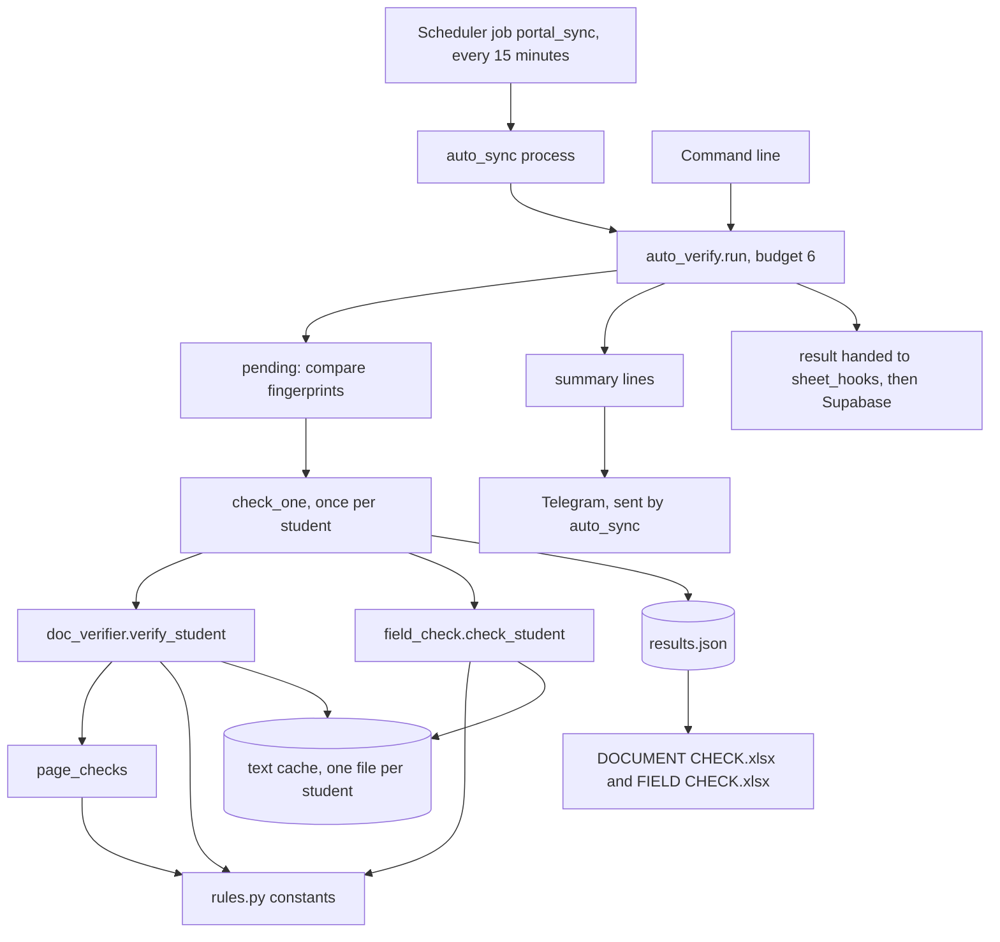

# Document verification programs (`src/verify/`)

This document is the reference for the six files of the verify group:

- `src/verify/__init__.py`
- `src/verify/auto_verify.py`
- `src/verify/doc_verifier.py`
- `src/verify/field_check.py`
- `src/verify/page_checks.py`
- `src/verify/rules.py`

All `path:line` references are relative to the repository root. A reference written as `:123` alone means line 123 of the file named immediately before it, or else of the file the section is about. The index of every Python program is [../PYTHON_PROGRAMS.md](../PYTHON_PROGRAMS.md).

No file in this group has a copy at the repository root.

## 1. What this group does

The bot downloads each student's documents from the agency's admin portal into a folder on the bot's PC (that download is described in [sheets.md](sheets.md)). The verify group then reads those files and answers two questions for staff:

1. **Document check.** Does each uploaded document satisfy the agency's document guideline? Examples: the passport has at least 12 months left, the birth certificate is notarised, the bank file shows at least the minimum amount for the program, the scan is in colour, the academic file starts with a scannable e-Apostille.
2. **Field check.** Does each value typed into the portal agree with what the student's documents say? Example: is the date of birth on the portal the one printed on the passport?

Everything runs on the bot's PC. The group reads files, reads one portal export (through another module), and writes local files. It never writes to the portal, and it makes no call to Telegram, Google, Supabase or the local language model. Other programs pick up its results and send them on (section 9).

### Terms used in this document

| Term | Meaning |
|---|---|
| Portal | The agency's admin website. This group reads it only through `src/sheets/progress_builder.py`, which logs in first when its client is not yet authenticated, then sends one read-only `GET students.php?export=csv`. If that request is redirected to `login.php`, it logs in again and repeats the request once (`src/sheets/progress_builder.py:223-242`, login at `:228-229` and `:233-235`). |
| `<BOT>` | The bot folder: the folder that holds `run.py` and `.env`. In code it is `BOT_ROOT` (`src/config.py:6`). |
| Program | One of four study programs, called by key in the code: `KLP`, `EAP`, `BACHELOR`, `MASTER`. |
| Student folder | One folder per student holding the downloaded files. It sits inside a program folder named with the program's full name, not its key (for example `KOREAN LANGUAGE PROGRAM (KLP)`). Its name ends with the passport number in parentheses: `<student name> (<passport no>)`. The download adds the parentheses only when the portal record has a passport number (`src/sheets/verified_docs.py:91-93`), and the verify group recognises a student only by them, so a student with no passport number on the portal is never checked (section 4, "What it reads"). |
| Document key | The short name the code gives a kind of document, for example `passport`, `birth_cert`, `bank`. A file gets its key from its file name (`classify`, `src/verify/doc_verifier.py:1036`). |
| Text layer | Text stored inside a PDF as text. A PDF made by a computer has one. A scan has none, only a picture of the page. |
| OCR | Optical character recognition: reading text out of a picture. This group uses the EasyOCR package with its English model. |
| Finding | One result of one rule on one file, written as `LEVEL: text`. Levels are `PASS`, `FLAG`, `FAIL`, `NOTE`. |
| Row | One line of the document check: one file (or one missing document, or one cross-check) with a verdict and a detail string made of its findings joined by ` \| `. |
| Verdict | The result level of a row (`PASS`, `FLAG`, `FAIL`, `MISSING`) or of a student (`PASS`, `REVIEW`, `FAIL`, `INCOMPLETE`). |
| Pass | One run of `auto_verify.run()`. Not to be confused with the verdict `PASS`. |
| Budget | The largest number of students one pass may check. The default is 6. |
| Fingerprint | A SHA-1 hash that changes when a student's files or portal record change. It decides whether a student must be checked again. |
| Store | The file `results.json`, which holds every stored result. |
| NID | National identity card of Bangladesh. The code accepts 10, 13 or 17 digit numbers (`src/verify/doc_verifier.py:414-437`). |
| e-Apostille | A government certification page with a QR code that links to an online verification site. The academic file must start with one. |
| Taka, BDT, lakh | Taka (BDT) is the currency of Bangladesh. One lakh is 100,000. "50 lakh" is 5,000,000. |
| Notarised | Carrying a notary's or advocate's wording or seal. |

### The programs at a glance

| Program | Lines | Purpose | How it is started |
|---|---|---|---|
| `src/verify/__init__.py` | 0 | Empty file that makes `src.verify` a Python package. | Never run. Imported implicitly. |
| `src/verify/auto_verify.py` | 609 | The orchestrator. Finds students whose files or portal record changed, runs the document check and the field check on up to 6 of them, caches the text of every file, keeps `results.json`, writes two Excel workbooks, and builds the lines of a Telegram summary. | Called by `src/sheets/auto_sync.py` at the end of the scheduler job `portal_sync` (every 15 minutes). Also `python -m src.verify.auto_verify` with `--budget`, `--passport`, `--pending`, `--rebuild`, `--recheck`, `--recheck-all`. Also `bootstrap.py` phase 5. |
| `src/verify/doc_verifier.py` | 1241 | The document check. Reads each file (text layer first, OCR otherwise), classifies it by file name, runs the rules for that kind of document and the cross-document checks, and gives each file and each student a verdict. | Imported by `auto_verify`, `field_check` and `src/cloud/sheet_hooks.py`. Also `python -m src.verify.doc_verifier` with `--student`, `--passport`, `--all`, `--program`, `--limit`, `--report`. |
| `src/verify/field_check.py` | 302 | The field check. Looks for each portal value in the documents that could carry it and answers `MATCH`, `DIFFERS`, `UNREADABLE`, `NO DOCUMENT` or `BLANK`. | Imported by `auto_verify`. Also `python -m src.verify.field_check` with `--passport`, `--program`, `--report`, `--skip`. |
| `src/verify/page_checks.py` | 452 | Page-level checks. Most look at the rendered page picture: colour or black-and-white, QR codes, a visible notary seal, and the page order of the e-Apostille in the academic file. Two use the document text the caller passes in: the Bangla check counts characters in that text, and the QR check uses it for its TIN skip and its online-wording test. | Never run. Imported by `doc_verifier` as `PC`. |
| `src/verify/rules.py` | 134 | Constants only: required documents per program, file-name patterns, thresholds, keyword lists, report titles. | Never run. Imported as `R` by `doc_verifier`, `field_check` and `page_checks`. |

Total: 2,738 lines.

### How the files work together



### One scheduled pass, step by step

1. The bot's scheduler runs the job `portal_sync` every 15 minutes (`src/bot/scheduler.py:459-466`). The job starts `python -m src.sheets.auto_sync` as its own process (`src/bot/scheduler.py:344-347`, `:392-416`).
2. `auto_sync` syncs the progress sheets, downloads documents and sends its own summary. Then it calls `verify_docs()` (`src/sheets/auto_sync.py:459-461`), which calls `auto_verify.run(budget=6)` (`src/sheets/auto_sync.py:315-327`).
3. `run()` takes a lock file, loads `results.json`, lists the student folders, and gets the portal's student export. If `results.json` cannot be parsed, the pass starts from an empty store and overwrites the file, losing every stored result (section 3, "An unreadable store is lost").
4. `pending()` picks every student whose document fingerprint or field fingerprint differs from the stored one, oldest folder first. The first 6 are checked.
5. For each student, `check_one()` runs the document check if the files changed, then the field check if the files or the portal record changed. Text read from files is kept in the text cache.
6. After each successfully checked student, `results.json` is saved.
7. If at least one student was checked in this pass, or if `DOCUMENT CHECK.xlsx` or `FIELD CHECK.xlsx` does not exist, both Excel workbooks are rebuilt in full from the store. Otherwise they are left as they are (`src/verify/auto_verify.py:514-515`).
8. `run()` returns its result. `auto_sync` turns it into a Telegram message titled "🔍 Document check" and, when publishing is on, hands it to the Supabase publisher.

### Verdict levels

| Level | Where | Meaning | Code |
|---|---|---|---|
| `PASS` | finding, row | The rule is satisfied. | `src/verify/doc_verifier.py:44` |
| `FLAG` | finding, row | A person must look. The evidence is not clear enough to fail. | `src/verify/doc_verifier.py:44` |
| `FAIL` | finding, row | The rule is broken. | `src/verify/doc_verifier.py:44` |
| `NOTE` | finding only | Worth a glance. It never changes a verdict. | `src/verify/doc_verifier.py:45` |
| `MISSING` | row only | A required document has no file. | `src/verify/doc_verifier.py:1060-1064` |
| `PASS`, `REVIEW`, `FAIL`, `INCOMPLETE` | student | See below. | `src/verify/doc_verifier.py:1089-1096` |

- A row's verdict is the worst of its findings: `FAIL` if any finding is `FAIL`, otherwise `FLAG` if any is `FLAG`, otherwise `PASS` (`src/verify/doc_verifier.py:1081-1082`).
- A student's verdict is `INCOMPLETE` if any row is `MISSING`, otherwise `FAIL` if any row is `FAIL`, otherwise `REVIEW` if any row is `FLAG`, otherwise `PASS`. `INCOMPLETE` outranks `FAIL`.

---

## 2. `src/verify/__init__.py`

**Purpose.** An empty file (0 lines). It makes `src.verify` a Python package.

**How it is run or who calls it.** It is never run. Python loads it whenever any `src.verify.*` module is imported.

**What it reads.** Nothing.

**What it writes.** Nothing.

**Why it exists.** Packaging only.

**Main functions and classes.** None.

**Numbers that matter.** None.

**Things to know.** Nothing.

---

## 3. `src/verify/auto_verify.py`

**Purpose.** The automatic pass. It works out which students changed, checks up to a budget of them, keeps every result in one JSON file, rebuilds both Excel workbooks from that file, and produces the lines of the Telegram summary.

### How it is run or who calls it

Scheduled path:

1. Scheduler job `portal_sync`, `IntervalTrigger(minutes=15)`, `max_instances=1`, `coalesce=True` (`src/bot/scheduler.py:459-466`).
2. The job starts `python -m src.sheets.auto_sync` as a separate process (`src/bot/scheduler.py:392-416`).
3. `auto_sync.run_once()` calls `verify_docs()` after the sync summary has been sent (`src/sheets/auto_sync.py:457-472`).
4. `verify_docs()` calls `av.run(budget=av.DEFAULT_BUDGET)` and returns `av.summary_lines(result)` (`src/sheets/auto_sync.py:315-327`).

`python -m src.sheets.auto_sync --no-verify` skips steps 3 and 4 (`src/sheets/auto_sync.py:487-489`).

Command line, run from the `<BOT>` folder (`src/verify/auto_verify.py:565-605`):

| Command | What it does |
|---|---|
| `python -m src.verify.auto_verify` | Check what is pending, up to 6 students. |
| `python -m src.verify.auto_verify --budget N` | Check up to `N` students. `--budget 0` means no limit. |
| `python -m src.verify.auto_verify --passport <passport no>[,<passport no>]` | Check only these students. The budget is forced to 0. |
| `python -m src.verify.auto_verify --pending` | Print how many students are waiting and the first 20 passport numbers, then stop. |
| `python -m src.verify.auto_verify --rebuild` | Rewrite the two workbooks from `results.json`, then stop. Nothing is checked. |
| `python -m src.verify.auto_verify --recheck` | Clear every stored fingerprint, so everyone is tested again against the current rules. Stored findings and the corrections history are kept. |
| `python -m src.verify.auto_verify --recheck-all` | Delete `results.json` first, then run. |

The flags can be combined. `--recheck-all` is applied first, then `--rebuild` or `--pending` if given (each stops the program), otherwise the pass runs.

Other callers:

| Caller | What it uses |
|---|---|
| `bootstrap.py:93-100` | Runs `-m src.verify.auto_verify --recheck --budget 0` as "PHASE 5 of 6 — verify every document" during first-time setup. |
| `src/sheets/auto_sync.py:320-327` | `av.STORE_PATH`, `av.run`, `av.DEFAULT_BUDGET`, `av.summary_lines`. |
| `src/cloud/sheet_hooks.py:250-251` | `av.TEXT_DIR`, to read the text cache for publishing. |
| `tests/test_jobs.py:413`, `tests/test_cloud_jobs.py:51`, `tests/test_cloud_fixes.py:462` | Tests. See "Tests" in section 10. |

### What it reads

| Input | Detail |
|---|---|
| `<VERIFICATION_DIR>/results.json` | The store. Read by `load_store()` (`:136-144`). A missing store gives an empty one. An unreadable store is logged ("results store unreadable, starting fresh") and also replaced by an empty one, and the pass then overwrites the old file. See "An unreadable store is lost" under "Things to know" below. |
| `<VERIFICATION_DIR>/text/<passport no>.json` | The text cache of one student (`:168-186`). |
| `<VERIFICATION_DIR>/auto_verify.lock` | The process ID of a running pass (`:83-97`). |
| Student folders | Through `dv.student_folders()` (`:476`). For fingerprints it reads each file's name, size and modification time, skipping files whose name starts with a dot (`:105-111`). |
| Portal student export | Through `dv.portal_students()` (`:476`), which calls `progress_builder.fetch_all_students()`. Inside the `auto_sync` process that export has normally been fetched already and is reused from memory (`src/sheets/progress_builder.py:245-253`). |
| `<BOT>/data/passport_issue.json` | The cached passport issue date, through `src.sheets.passport_issue.load()`, added to the field fingerprint (`:126-131`). |
| Setting `VERIFICATION_DIR` | Through `settings.verification_dir()` (`:47`). Default `<BOT>/data/verification` (`src/config.py:111-112`). |
| The process table | On Windows, `OpenProcess` and `GetExitCodeProcess` through `ctypes`. On other systems, `os.kill(pid, 0)`. Used to see whether the lock's process is alive (`:62-80`). |

It reads no secret and no environment variable directly.

### What it writes

| Output | Detail |
|---|---|
| `<VERIFICATION_DIR>/results.json` | Written to `results.tmp`, then renamed over the old file (`:147-151`). Saved after every successfully checked student (`:505`). |
| `<VERIFICATION_DIR>/text/<passport no>.json` | Saved after every student, whether or not the check succeeded (`:237-248`, `:314-315`). |
| `<VERIFICATION_DIR>/auto_verify.lock` | Created at the start of a pass with the process ID as text (`:468`). Removed in a `finally` block (`:517`). |
| `<VERIFICATION_DIR>/DOCUMENT CHECK.xlsx` | Rebuilt in full (`:339-381`). |
| `<VERIFICATION_DIR>/FIELD CHECK.xlsx` | Rebuilt in full (`:384-445`). |
| Standard output | One line per student: `[i/n] <student name> <verdict> <n> matched, <n> differ`, plus ` \| <n> portal field(s) changed since last check` when there were corrections (`:510-512`). Under the scheduler this output goes to `<BOT>/hangeul_sync.log` (`src/bot/scheduler.py:340-341`, `:401-405`). |
| Return value of `run()` | `{"checked": [...], "waiting": n, "skipped": [...], "store": <the whole store>}` (`:522-523`). |

It sends nothing to Telegram and nothing to Supabase itself. `summary_lines()` only returns text. `auto_sync` sends that text with the title "🔍 Document check" to the brief recipients (`src/sheets/auto_sync.py:332`, `:467-471`).

### Why it exists

OCR is slow, and the portal changes all day. This file lets staff get, without doing anything:

- a current verdict for every downloaded student;
- an Excel list of what is wrong with which document;
- a second Excel list of portal fields that disagree with the documents;
- a history of which portal fields were changed after a check, and whether the change fixed the result;
- a short Telegram message naming each newly checked student and the first failing rule.

It also makes sure no file is read twice with the same settings, so that a corrected portal field costs only a fast field check.

### Main functions and classes

There are no classes.

| Name | Line | What it does |
|---|---|---|
| `REPORT_DIR`, `STORE_PATH`, `TEXT_DIR`, `LOCK_PATH`, `DOC_REPORT`, `FIELD_REPORT` | 47-53 | Paths under `settings.verification_dir()`. Fixed when the module is imported. |
| `LOCK_STALE_SECONDS` | 51 | `4 * 3600`. A lock older than this is ignored. |
| `SKIP_PASSPORTS` | 56 | A set holding one hard-coded passport number. The comment above it says it belongs to a staff member who is not an applicant. `pending()` never queues it. |
| `PROGRAM_ORDER` | 58 | `KLP`, `EAP`, `BACHELOR`, `MASTER`: the order of the per-program sheets. |
| `DEFAULT_BUDGET` | 59 | `6` students per pass. |
| `_pid_alive(pid)` | 62 | True when that process is still running. |
| `_lock_held(path)` | 83 | True only when the lock file exists, is younger than 4 hours, and names a live process. A fresh lock whose content is not a number counts as held. A lock left by a dead process is deleted. |
| `_hash(parts)` | 101 | SHA-1 of the parts joined by `\|`. |
| `_file_parts(folder)` | 105 | `name:size:mtime` for each non-hidden file, sorted. |
| `doc_fingerprint(folder)` | 114 | Hash of the file parts. Changes when a file is added, removed or renamed, or when a file's size or modification time changes. It does not change when the portal is edited. |
| `field_fingerprint(folder, student)` | 120 | Hash of the file parts, plus every `key=value` of the portal record, plus the cached passport issue date. Changes when a document or any portal field changes. |
| `load_store()` | 136 | Reads `results.json` into `{"documents", "fields", "corrections"}`. |
| `save_store(store)` | 147 | Writes the store through a temporary file. |
| `pending(store, folders, portal)` | 154 | Passport numbers that need checking, oldest folder modification time first. Skips `SKIP_PASSPORTS` and folders with no portal record. |
| `_text_cache_path(pas)` | 168 | `TEXT_DIR/<passport no>.json`. |
| `install_text_cache(pas)` | 172 | Loads the student's text cache and replaces `dv.read_document`, `fc.read_document` and `dv.read_pages` with caching wrappers. Returns a handle. |
| `save_text_cache(handle)` | 237 | Writes the cache file and puts the three original functions back. |
| `_record_corrections(...)` | 252 | For each field whose portal value differs from the one stored at the last check, appends an entry to `store["corrections"]`. Returns the count. |
| `check_one(pas, folder, student, store)` | 277 | Checks one student. Returns `(verdict, "<n> matched, <n> differ", corrections)`. |
| `_cell(v)` | 318 | Strips control characters from a string and cuts it to 32,000 characters, so Excel accepts it. |
| `_style_header(ws)`, `_programs_in(section)` | 326, 333 | Workbook helpers: bold header with a frozen first row; the programs present, in `PROGRAM_ORDER` then alphabetical. |
| `write_document_report(store, path)` | 339 | Builds `DOCUMENT CHECK.xlsx`. |
| `write_field_report(store, path)` | 384 | Builds `FIELD CHECK.xlsx`. |
| `write_reports(store)` | 448 | Calls both. |
| `run(budget, only, recheck)` | 453 | The pass. |
| `_first_problem(result, d)` | 526 | The first `FAIL` finding (or first `MISSING` row) of a student, as `<document>: <text>`, cut to 160 characters. |
| `summary_lines(result)` | 542 | The Telegram text as a list of lines. |
| `main()` | 565 | The command line. |

### The pass in detail (`run`, `:453-523`)

1. Create the report folder. If a live lock exists, print `Another check is already running (pid N) — skipped.` and return `{"checked": [], "waiting": 0, "store": <store>}`.
2. Write the lock with this process ID. Load the store.
3. With `recheck`, set the fingerprint of every stored document record and field record to an empty string.
4. Get the folders and the portal export. The queue is the given passport numbers (upper-cased), or the result of `pending()`. `waiting` is the queue length. If the budget is not 0, keep only the first `budget` entries.
5. For each passport number in the queue that has both a folder and a portal record, call `check_one()`.
   - A `NameError`, `AttributeError`, `ImportError` or `TypeError` is treated as a fault in the rules. The run stops with a `RuntimeError` (`:492-500`). The comment explains why: a `NameError` in `check_bank` once skipped every bank check and the report looked clean.
   - Any other exception skips that student. The student is listed under "could not be read" and stays pending for the next pass.
   - After each successful student, save the store.
6. Rewrite both workbooks if at least one student was checked, or if either workbook does not exist.
7. Remove the lock. Print up to 10 skipped students.
8. Return `checked`, `waiting` (queue length minus students done, never below 0), `skipped` and the store.

What `check_one()` does for one student (`:277-315`):

1. Install the text cache.
2. If the stored document fingerprint differs from the current one: run `dv.verify_student()`, compute `dv.student_verdict()`, and store `{fingerprint, checked, student, program, verdict, rows}` under `documents[<passport no>]`. Otherwise keep the stored verdict.
3. If the stored field fingerprint differs: run `fc.check_student()`. If there were earlier field rows, record corrections. Store `{fingerprint, checked, student, program, rows}` under `fields[<passport no>]`.
4. Save the text cache and restore the original read functions, even if a check raised.

### The store (`results.json`)

```text
{
  "documents": {
    "<passport no>": {
      "fingerprint": "<sha1>", "checked": "<ISO date-time>", "student": "<student name>",
      "program": "KLP", "verdict": "REVIEW",
      "rows": [ {"doc": "<title>", "file": "<file name>", "verdict": "FLAG", "detail": "<findings>"} ]
    }
  },
  "fields": {
    "<passport no>": {
      "fingerprint": "<sha1>", "checked": "<ISO date-time>", "student": "<student name>",
      "program": "KLP",
      "rows": [ {"field": "DOB", "portal": "<portal value>", "result": "MATCH", "detail": "<text>"} ]
    }
  },
  "corrections": [
    {"noticed": "<ISO date-time>", "student": "<student name>", "passport": "<passport no>",
     "program": "KLP", "field": "<field>", "was": "<old portal value>", "now": "<new portal value>",
     "was_result": "DIFFERS", "now_result": "MATCH", "detail": "<text>"}
  ]
}
```

The store is the single source for both workbooks and for section 5 of the daily brief. It is also the source of the Supabase records of verdicts, field results, corrections and reports (section 9). The `doc_page_text` records are the exception: their text comes from the text cache files described next, and the store supplies only the student's name (`src/cloud/sheet_hooks.py:246-263`, `:314-315`; `src/cloud/backfill.py:377-395`, name at `:381`). The scheduled publisher reads the store from the value `run()` returns, not from the file. It holds personal data: names, passport numbers, portal values, and detail strings that quote dates, ID numbers and amounts read from the scans.

### The text cache (`text/<passport no>.json`)

One JSON object per student. Two kinds of key (`:191-228`):

| Key | Value | Made by |
|---|---|---|
| `<file name>:<size>:<mtime>:<max_pages>` | `{"text": <whole-file text>, "sizes": [[w, h], ...]}` | The wrapper around `read_document`. |
| `PAGES:<file name>:<size>:<mtime>:<max_pages>` | `{"pages": [<text of each page>], "sideways": [<page numbers>]}` | The wrapper around `read_pages`. |

A file that is uploaded again or compressed gets a new key, so it is read again. A file that did not change is never read again with the same page limit. The cache holds the full text of every document of the student.

### Workbook 1: `DOCUMENT CHECK.xlsx` (`:339-381`)

| Sheet | Columns | Rows |
|---|---|---|
| `Summary` | Student, Passport, Program, Verdict, Missing, Fail, Flag, Pass, Checked | One per student, sorted by program then name. The Verdict cell is coloured. |
| One per program (`KLP`, `EAP`, `BACHELOR`, `MASTER`, then any other, name cut to 31 characters) | Student, Passport, Student verdict, Document, File, Verdict, Details | One per document row, students sorted by name. Both verdict cells are coloured. |

Cell colours: `PASS` C6EFCE, `FLAG` FFEB9C, `FAIL` FFC7CE, `MISSING` F2F2F2, `NOTE` DDEBF7, `REVIEW` FFEB9C, `INCOMPLETE` F2F2F2. The header row is bold and frozen.

### Workbook 2: `FIELD CHECK.xlsx` (`:384-445`)

| Sheet | Columns | Rows |
|---|---|---|
| `Summary` | Student, Passport, Program, Checked, Match, Differs, Unreadable, No document, Blank, Last checked | One per student. "Checked" is Match + Differs + Unreadable. The Differs cell is red when it is not 0. |
| One per program | Student, Passport, Field, Portal value, Result, Detail | One per stored field result of every student of that program, students sorted by name. This includes the `BLANK` and `NO DOCUMENT` rows, so it is not the same as "Checked" on the `Summary` sheet (`:420-424`; `check_student` writes those rows at `src/verify/field_check.py:204-207` and `check_field` returns `NO DOCUMENT` at `src/verify/field_check.py:99`). The Result cell is coloured. |
| `Corrections` | Noticed, Student, Passport, Program, Field, Was on portal, Now on portal, Was, Now, Detail | One per recorded correction, newest first. "Was" and "Now" are the results before and after, coloured. |

Cell colours: `MATCH` C6EFCE, `DIFFERS` FFC7CE, `UNREADABLE` FFEB9C, `NO DOCUMENT` F2F2F2, `BLANK` FFFFFF.

### The Telegram summary text (`summary_lines`, `:542-562`)

```text
🔍 Documents checked: <n>
   • <student name> (<program>) — <verdict> (<first problem>), <n> field(s) differ from the portal, <n> portal field(s) corrected since last check
   <n> more waiting — they run on the next passes.
   Reports: DOCUMENT CHECK.xlsx / FIELD CHECK.xlsx in <VERIFICATION_DIR>
```

- There is one bullet line per checked student. The `(<first problem>)` part appears only for `FAIL` and `INCOMPLETE`. The two counts appear only when they are not 0.
- The "more waiting" line appears only when the queue is not empty.
- The "Reports" line appears only when a checked student is `FAIL` or `INCOMPLETE` or has a differing field.
- When nothing was checked the function returns an empty list, and `auto_sync` sends no message.

### Numbers that matter

| Number | Value | Code |
|---|---|---|
| Students per pass | 6 (`DEFAULT_BUDGET`). The scheduled pass always uses it. | `:59`, `src/sheets/auto_sync.py:324` |
| Pass interval | Every 15 minutes, as part of `portal_sync` | `src/bot/scheduler.py:459-466` |
| Hard stop of the whole `auto_sync` process | 3600 seconds, then the process is killed | `src/bot/scheduler.py:409-413` |
| Lock considered stale | After `4 * 3600` seconds | `:51` |
| Whole-file text, default page limit of the caching wrapper | 6 pages | `:191` |
| Per-page text, default page limit of the caching wrapper | 20 pages | `:209` |
| Excel cell limit | 32,000 characters | `:322` |
| First-problem text limit | 160 characters (159 plus `…`) | `:538` |
| `--pending` list | First 20 passport numbers | `:596` |
| Skipped list printed | First 10 | `:520` |
| Retries | None in this file. A student that fails stays pending and is tried on the next pass. | `:501-504` |

Timing figures from the project's own notes, not from code: `HANDOFF.md:143-144` gives about 50 seconds for a student read for the first time and about 6 seconds for a cached re-check. `MIGRATION.md:169-178` says one long process keeps growing its GPU memory until each student slows from about 70 seconds to about 570 seconds, and prescribes a PowerShell loop of `--budget 5` runs for the first bulk run. `bootstrap.py:93-100` instead runs one `--recheck --budget 0` process. Which of the two is used in practice cannot be determined from the code.

### Things to know

- **An unreadable store is lost.** This is the most important behaviour of the file that is not obvious from its parts. If `results.json` exists but cannot be parsed, `load_store()` logs a warning and returns an empty store (`:136-144`). `run()` does not stop. With an empty store, `pending()` finds no stored fingerprint for anyone, so every student who has a folder and a portal record is queued (`:477`). After the first student checked successfully, `save_store()` writes this almost empty store over the unreadable file (`:505`). Every stored document verdict, every field result and the whole corrections history are gone at that moment, and no copy is kept. `write_reports()` then rebuilds both workbooks from the same almost empty store (`:514-515`). The following passes check everyone again, 6 at a time. The text cache is a separate set of files and is kept, so those re-checks do not OCR a file again, but the page-picture checks of `page_checks` run again. The lost corrections cannot be recovered, and portal edits made since the last good check are not recorded as corrections either, because a correction is recorded only against field rows stored earlier (`:302-305`, `:256-261`). If no student is checked successfully in that pass, nothing is saved and the unreadable file stays as it is. `--rebuild` with an unreadable store rewrites both workbooks from an empty store and leaves the file itself alone (`:586-589`).
- **The Supabase side guards against this; the pass itself does not.** When publishing to Supabase is on, `auto_sync.verify_docs()` tests, before calling `run()`, whether `results.json` can be read (`src/sheets/auto_sync.py:322-323`, through `src/cloud/sheet_hooks.py:149-157`, whose docstring gives this reason). When it cannot, `verify_batches` sends only the records of the students checked in that pass and leaves out the store-wide records (`src/cloud/sheet_hooks.py:321-323`). That test covers only the pass in which the file was unreadable. From the next pass the file is readable again and holds only what was checked since.
- **The 6-page limit.** `verify_student` and `check_student` call `read_document(path)` with no page argument. Under `auto_verify` that call reaches the caching wrapper, whose default is 6 pages (`:191`). The standalone command lines of `doc_verifier` and `field_check` read 20 pages (`src/verify/doc_verifier.py:122`). So the text rules see only the first 6 pages of a long file during the automatic pass. The code does not say whether this is intended.
- **A scan can be read more than once on its first check.** The whole-file read (150 dpi, 6 pages) and the per-page read (200 dpi; 8 pages for an NID, 10 for the bank file, 20 for the academic file) are separate cache entries. Each is done once.
- **Image checks are not cached.** `page_checks` renders the pages again every time a student's document check runs, including on `--recheck`.
- **The cache file only grows.** Keys of replaced files are never removed by this file.
- **`--recheck` plus `--passport`.** `--recheck` blanks every stored fingerprint, and the store is saved after each checked student. So `--recheck --passport <passport no>` leaves every other student pending for later passes.
- **`--passport` alone may do nothing.** `check_one` runs a part only when its fingerprint differs. For an unchanged student neither part runs, and the student is still reported as checked with the stored verdict.
- **`--passport` ignores `SKIP_PASSPORTS`.** The skip set is applied only in `pending()` (`:158`).
- **`--passport` values are not trimmed.** `main()` splits on commas and `run()` upper-cases each piece (`:600`, `:477`). A space after a comma makes that passport number unmatched, and it is skipped without a message (`:486-487`).
- **`--recheck-all` deletes `results.json` outside the lock** (`:582-584`), including the corrections history. The text cache is kept.
- **`--rebuild` and `--pending` do not take the lock.** `--pending` contacts the portal for the export. `--rebuild` does not.
- **Any portal change triggers a field check.** The field fingerprint hashes every key and value of the portal record (`:132`), not only the 24 checkable fields.
- **What counts as a correction.** A correction is recorded when a field's stored portal value differs from the current one. `HANDOFF.md:224-225` notes that this cannot tell a staff edit from a refresh of the passport issue cache.
- **The skipped passport number.** `HANDOFF.md:226-227` says one real student's portal record carries the same number as the `SKIP_PASSPORTS` entry and is therefore never checked. Whether that is still so cannot be determined from the code.
- **A code fault under the scheduler is quiet.** The `RuntimeError` raised for a fault in the rules is caught by `auto_sync`, which logs `Document check could not run` and sends no Telegram message (`src/sheets/auto_sync.py:459-466`). The workbooks are not rewritten in that pass. Students finished before the fault are already saved.
- **The lock can be left behind.** The lock is written at `:468`, but the `try`/`finally` that removes it starts at `:484`. A failure while listing folders or fetching the export leaves the file. The next run deletes it, because its process is no longer alive.
- **When the lock is held, the returned dict has no `skipped` key.**
- **Paths are fixed at import.** `REPORT_DIR` and the paths built from it are computed once when the module loads. The tests replace `STORE_PATH` and `TEXT_DIR` directly (`tests/test_cloud_jobs.py:177-178`).
- **Not every cell is cleaned.** Header rows and the per-program rows pass through `_cell()`. The data rows of both `Summary` sheets and of `Corrections` do not.
- **Old notes about `E:\` paths are out of date.** `PC_BUILD.md:189` and `HANDOFF.md:237-238` describe hard-coded paths in these files. The current code takes every folder from settings (`:47`, `src/verify/doc_verifier.py:40-41`).

---

## 4. `src/verify/doc_verifier.py`

**Purpose.** The document check. For one student folder it classifies each file by its name, reads its text, runs the rules for that kind of document and the page-level checks, then cross-checks names, date of birth and passport number across the documents. It returns one row per file with a verdict and a detail string.

### How it is run or who calls it

Command line, run from the `<BOT>` folder (`:1203-1237`):

| Command | What it does |
|---|---|
| `python -m src.verify.doc_verifier --student "<part of the name>"` | Every downloaded student whose folder name contains that text. Exits with a message if none matches. |
| `python -m src.verify.doc_verifier --passport <passport no>` | One student. |
| `python -m src.verify.doc_verifier --all` | Every downloaded student. |
| `python -m src.verify.doc_verifier --program KLP` | Every downloaded student of that program (`KLP`, `EAP`, `BACHELOR`, `MASTER`). |
| `--limit N` | Stop after `N` students. |
| `--report <file name>` | Name of the report file. Default `document_check_<YYYY-MM-DD_HHMM>.xlsx`. |

With no selector it prints the help text and stops.

The selectors do not combine. `main()` takes the first one given, in this order (`:1215-1229`):

1. `--passport`: one passport number, trimmed and upper-cased. Any other selector is ignored.
2. `--student`: every folder whose name contains the text. `--all` and `--program` are ignored.
3. `--all` or `--program`: every folder, sorted by passport number. With `--program`, only folders that have a portal record of that program are kept. Giving both flags is the same as `--program` alone.
4. None of these: print the help text and stop.

`--limit` is applied afterwards to whichever list was chosen (`:1230-1231`). The portal export is fetched before any selector is looked at (`:1214`), so every run contacts the portal.

Importers:

| Importer | What it uses |
|---|---|
| `src/verify/auto_verify.py` (as `dv`) | `verify_student`, `student_verdict`, `student_folders`, `portal_students`, `program_of`, `read_document`, `read_pages`. |
| `src/verify/field_check.py:30-32` | `REPORT_DIR`, `classify`, `find_dates`, `find_money_taka`, `norm`, `portal_students`, `program_of`, `read_document`, `readable`, `student_folders`. |
| `src/cloud/sheet_hooks.py:303-304` | `student_folders`. |
| `tests/test_cloud_jobs.py:52` | Replaces `student_folders` in a test. |

### What it reads

| Input | Detail |
|---|---|
| Student folders | `DOCS_ROOTS = [settings.docs_root(), settings.konyang_root()]` (`:40`). A root that does not exist is skipped. Layout: `<root>/<PROGRAM>/<student name> (<passport no>)/`. `<PROGRAM>` is the program's full folder name as the download writes it, not its key: `PROGRAMS[...]["name"]`, or `OTHER PROGRAMS` (`src/sheets/verified_docs.py:83-88`, `:357`). A folder directly under the root is also accepted as a student folder when it has no sub-folders and its own name ends in parentheses (`src/verify/doc_verifier.py:1109-1112`). The passport number is the text in the last parentheses, upper-cased (`src/verify/doc_verifier.py:1114-1116`). Two consequences follow. First, a student whose portal record has no passport number is never checked: the download names the folder without parentheses (`src/sheets/verified_docs.py:91-93`), so `student_folders()` does not list it, and `portal_students()` also drops records with an empty `Passport No` (`src/verify/doc_verifier.py:1124`). Second, two program folder names themselves end in parentheses, `KOREAN LANGUAGE PROGRAM (KLP)` and `EAP (ENGLISH FOR ACADEMIC PURPOSE)` (`src/sheets/progress_builder.py:110`, `:116`). If one of them holds no student folder, it is taken as a "student" whose passport number is the text in its parentheses. The automatic pass ignores it, because no portal record has that passport number (`src/verify/auto_verify.py:158`). `--all` of the command line lists it and `run()` prints a "skipping" warning for it (`src/verify/doc_verifier.py:1184-1185`). |
| Files | Every file in the folder whose name does not start with a dot (`:1050-1052`). `.jpg`, `.jpeg` and `.png` go to EasyOCR directly. Anything else is opened with PyMuPDF. |
| Portal student export | `portal_students()` (`:1120-1126`) calls `progress_builder.fetch_all_students()`. That function logs in to the portal first when its client is not yet authenticated (`src/sheets/progress_builder.py:228-229`), then sends one `GET <portal base>/students.php?export=csv` with a 60 second timeout. If the response was redirected to `login.php`, it logs in again and repeats the GET once (`src/sheets/progress_builder.py:232-235`). The fetch itself is `_fetch_all_students_async` (`src/sheets/progress_builder.py:223-242`); `fetch_all_students` keeps its result in memory for the rest of the process (`src/sheets/progress_builder.py:245-253`). Records are keyed by `Passport No`, upper-cased; records with an empty `Passport No` are dropped (`src/verify/doc_verifier.py:1124`). |
| Portal record fields, by name | `Passport No`, `Passport Expiry`, `Full Name`, `Father`, `Mother`, `Gender`, `DOB`, `Sponsor`, `HSC GPA`, `SSC GPA`, and `Program` (through `progress_builder.program_key_of`, `:1129-1131`). |
| `<VERIFICATION_DIR>/apostille.json` | Indirectly, through `page_checks.academic_check`. |
| Settings, by name | `DOCS_ROOT`, `KONYANG_ROOT`, `VERIFICATION_DIR` (through `src/config.py:96-112`). |
| EasyOCR model files | EasyOCR downloads its English model on first use (comment at `:57-59`). The code sets no model folder; where EasyOCR stores the model is its own default. |

It makes no call to Google, Telegram, Supabase or the language model.

### What it writes

| Output | Detail |
|---|---|
| `<VERIFICATION_DIR>/document_check_<YYYY-MM-DD_HHMM>.xlsx` (or the `--report` name) | Command line only. Sheets `Documents` and `Summary`. Rewritten after every student, so an interrupted run leaves a usable file (`:1134-1200`). |
| Standard output | Command line only: `[i/n] <student name> (<passport no>) — <verdict>`, then a count per verdict and the report path. |
| Return value | When called by `auto_verify`, `verify_student` writes nothing. It returns rows `{doc, file, verdict, detail}`. |

### Why it exists

Before an application goes to a university or an embassy, staff need to know whether each student's uploaded documents satisfy the agency's document guideline, and which documents a person must look at. The rules are deliberately cautious: the docstring of `rules.py` says a rule fails only when the evidence is clear, and anything doubtful becomes a `FLAG` (`src/verify/rules.py:6-7`).

### How one student is checked (`verify_student`, `:1048-1086`)

1. Group the folder's files by document key, using `classify()`. A file whose name matches no pattern goes into a group called `other`.
2. Walk the keys in this order: the program's required documents (`R.REQUIRED[program]`), then the optional ones (`R.OPTIONAL`).
3. A required key with no file gives a `MISSING` row with the detail "required by the guideline but not uploaded". An optional key with no file gives nothing.
4. For each file of the key: read its text with `read_document(path)`. If reading raises, add a `FLAG` row "could not read the file" and go on.
5. Add the text to `texts[key]`. `texts` holds everything read so far for this student and is passed to each checker, so a checker can compare against earlier documents.
6. Run the key's checker from `CHECKS`. A key with no checker gets `PASS: present (no automatic rule for this document)`.
7. For every key except `photo`, add the page-level findings: `PC.inspect`, then `colour_check`, `qr_check`, `bangla_check`.
8. The row's verdict is the worst finding. The detail is the findings joined by ` | `.
9. After all keys, add the cross-check rows from `cross_checks(texts, student)`.

Keys with a checker: `passport`, `photo`, `birth_cert`, `father_nid`, `mother_nid`, `student_nid`, `family_cert`, `academic`, `bank`, `trade_license`, `income_tax` (`:913-925`). Keys without one: `death_cert`, `affidavit`, `personal_statement`, `recommendation`, `eca`, `language_cert`.

### How a file is read

| Function | Used for | Text layer threshold | OCR resolution | Page limit | Sideways retry |
|---|---|---|---|---|---|
| `read_document` (`:122`) | The whole-file text every checker gets | A page with more than 80 characters of text layer uses the layer | 150 dpi | 20 by default | Yes, for PDF pages |
| `read_pages` (`:92`) | Page-by-page text for the NID, bank and academic rules | A page with fewer than 40 characters of text layer is OCR'd | 200 dpi | 20 by default | Yes, for PDF pages; the page number is reported |

- An image file (`.jpg`, `.jpeg`, `.png`) is OCR'd as one page, with no sideways retry.
- The sideways retry (`_ocr_image`, `:67-89`): when a page gives fewer than 300 characters, it is turned 90° counter-clockwise, 90° clockwise and 180°, and the longest text is kept. It stops as soon as a turn gives 300 characters or more.
- `read_document` returns the text `[unreadable: <error>]` and no sizes when PyMuPDF cannot open the file. `read_pages` returns an empty list in that case.
- The OCR reader is created once per process: `easyocr.Reader(["en"], gpu=torch.cuda.is_available(), verbose=False)` (`:52-61`).

### Main functions and classes

There are no classes.

| Name | Line | What it does |
|---|---|---|
| `DOCS_ROOTS`, `REPORT_DIR`, `TODAY` | 40-42 | The two document roots, the report folder, and today's date. All fixed when the module is imported. |
| `PASS`, `FLAG`, `FAIL`, `MISSING`, `NOTE` | 44-45 | The level strings. |
| `_ocr_reader()` | 52 | Builds the EasyOCR reader on first use and keeps it. |
| `_MIN_PAGE_CHARS` | 64 | `300`. Below this a page is retried turned. |
| `_ocr_image(arr, turned)` | 67 | OCR of one page picture with the sideways retry. |
| `read_pages(path, max_pages, sideways)` | 92 | Text of each page separately. |
| `read_document(path, max_pages)` | 122 | Text of the whole file, plus the size of each page. |
| `norm(s)` | 153 | Lower-case, whitespace collapsed to single spaces. |
| `notarised(text, path)` | 157 | True if `NOTARY_WORDS` appear in the text, or `page_checks.seal_present(path)` sees a seal. |
| `has_any(text, words)` | 164 | Substring match first. Then a fuzzy match for OCR misspellings: text words of 4 or more letters against list words of 5 or more letters (first word of a phrase), length difference at most 2, `difflib` ratio at least 0.8. |
| `_MONTHS`, `_DIGIT_LOOKALIKE` | 185, 189 | Month names to numbers; letters that OCR produces for digits. |
| `find_dates(text)` | 193 | Every date it can recognise: `D-M-YYYY`, `YYYY-M-D`, "16 September 2026", "Sep 16, 2026", dotted forms, two-digit years, ordinal days with look-alike letters, and eight digits printed one per box. |
| `money_value(raw)` | 279 | Parses one amount in lakh or western grouping, including a decimal point that OCR wrote as a comma. |
| `find_money_taka(text)` | 292 | Amounts between 100,000 and 100,000,000, largest first. |
| `months_between(a, b)` | 302 | Whole months from `a` to `b`. |
| `check_passport` | 307 | Rules for the passport. |
| `check_photo` | 338 | Rules for the photo. |
| `check_birth_cert` | 381 | Rules for the birth certificate. |
| `nid_numbers(text)` | 414 | 10, 13 or 17 digit numbers in a scan, after joining spaced digit groups. Leaves out `BOILERPLATE_NUMBERS`, numbers of 10 or 13 digits starting `01`, and 13-digit numbers starting `880` (mobile numbers). |
| `check_nid` | 440 | Rules for the student's, father's and mother's NID. |
| `issue_date(text)` | 513 | The issue date of a certificate. It looks at the first `date`, `ref`, `memo` or `serial` label within the first 1,200 characters and the 90 characters after it on the same line: the latest date found there, or eight digits there read as `DDMMYYYY`. Otherwise it takes the latest date anywhere in the text. Only dates within 3 × 365 days of today are accepted. |
| `check_family_cert` | 536 | Rules for the family relationship certificate. |
| `check_academic` | 564 | Rules for the academic certificate and transcript. |
| `looks_like_solvency(text)` | 606 | True if `SOLVENCY_WORDS` appear. |
| `looks_like_statement(text)` | 610 | True if at least 2 of 8 statement words appear. Never called. |
| `document_date(text)` | 617 | `issue_date(text)`, otherwise the latest date in the text. |
| `opening_balance(text)` | 627 | The balance a statement starts from. Never called. |
| `STATEMENT_DATE_LABELS` | 651 | Ten label patterns such as "generation date", "print date", "statement date", "as on". |
| `statement_date(pages)` | 658 | The date beside one of those labels, otherwise the end of a "period ... to ..." range. |
| `check_bank` | 684 | Rules for the bank solvency certificate and statement. |
| `current_fiscal_year()` | 766 | The July to June fiscal year containing today, as `YYYY-YYYY`. |
| `taxpayer_name(text)`, `proprietor_name(text)` | 772, 791 | The person named on a TIN certificate; the proprietor named on a trade licence. Empty string when not found. |
| `is_tin(text)` | 806 | True if the text contains "taxpayers identification", "tin certificate" or "etin". |
| `check_financial` | 811 | Rules for the trade licence, TIN certificate and employment certificate. |
| `check_income_tax` | 895 | Rules for the income tax papers. |
| `CHECKS` | 913 | Document key to checker. |
| `name_tokens(name)` | 930 | Parts of a name longer than 2 letters, without titles such as `md`, `mst`, `mr`, `late`. |
| `readable(text)` | 936 | True when the text has at least 25 words of 3 or more letters and more than 60% of them contain a vowel. |
| `name_in(text, name)` | 946 | True when all but at most one of the name's parts appear in the text. `None` when the name has no usable part. |
| `cross_checks(texts, student)` | 956 | The cross-document rows. |
| `classify(filename)` | 1036 | File name to document key. The longest matching pattern wins. |
| `verify_student(folder, student, program)` | 1048 | The per-student run described above. |
| `student_verdict(rows)` | 1089 | The student's verdict. |
| `student_folders()` | 1100 | `{passport no: (folder, folder name)}` for every downloaded student. |
| `portal_students()` | 1120 | `{passport no: portal record}`. |
| `program_of(student)` | 1129 | The program key, or `KLP` when the program is not recognised. |
| `write_report(all_rows, path)` | 1134 | The one-off Excel report of the command line. |
| `run(passports, report_name)` | 1175 | The command-line run. Skips a passport number with no folder or no portal record, with a warning. |
| `main()` | 1203 | The command line. |

### Every rule and its level

Titles are the report titles from `R.TITLES`. Line numbers are in `src/verify/doc_verifier.py` unless a file is named.

| Document | Rule | Levels | Code |
|---|---|---|---|
| 01 Passport | Expiry date: the portal's `Passport Expiry` when it is `YYYY-MM-DD`, otherwise the latest date on the scan whose year is this year or later. Expired: FAIL. Fewer than 12 months left: FAIL. Otherwise PASS. No date readable: FLAG. | PASS, FAIL, FLAG | `:309-326` |
| 01 Passport | The portal passport number appears in the scan text (spaces ignored): PASS, otherwise FLAG. | PASS, FLAG | `:327-331` |
| 02 Photo | File missing or not inspectable: FLAG. | FLAG | `:340-341`, `:372-373` |
| 02 Photo | Width divided by height within 0.06 of 35/45: PASS, otherwise FLAG. | PASS, FLAG | `:346-350` |
| 02 Photo | Shorter side under 300 pixels: FLAG. | FLAG | `:351-352` |
| 02 Photo | Background sampled above the head (top band and top corners). Lowest average colour channel above 190: PASS, otherwise FAIL. | PASS, FAIL | `:353-368` |
| 02 Photo | Greyscale standard deviation below 30: FLAG (flat, low contrast). | FLAG | `:369-371` |
| 02 Photo | Extension not `.jpg` or `.jpeg`: FAIL. | FAIL | `:374-375` |
| 02 Photo | Portal `Gender` starts with "F": NOTE to check that both ears are visible. | NOTE | `:376-377` |
| 04 Birth Certificate | Online-registration wording found (`ONLINE_BIRTH_WORDS`): PASS, otherwise FLAG. | PASS, FLAG | `:383-386` |
| 04 Birth Certificate | Notarised (wording or seal): PASS, otherwise FAIL. | PASS, FAIL | `:387-388` |
| 04 Birth Certificate | No Latin letter in the text: FLAG (needs a translation). | FLAG | `:389-391` |
| 04 Birth Certificate | Date of birth compared with the passport scan. No passport text: FLAG. No date on one of the two: FLAG. A date in common: PASS. Only a year in common: PASS. Nothing in common: FAIL. | PASS, FLAG, FAIL | `:392-410` |
| 03 Student NID, 05 Father NID, 05 Mother NID | Notarised: PASS, otherwise FAIL. | PASS, FAIL | `:442-443` |
| NIDs | Lawyer-pad wording (`LAWYER_PAD_WORDS`): PASS, otherwise FLAG. | PASS, FLAG | `:444-445` |
| NIDs | First word of the person's portal name. On the NID and on the passport: PASS. On the NID only, or not on the NID: FLAG. No finding when the portal name is empty. | PASS, FLAG | `:449-464` |
| NIDs | ID numbers read page by page (up to 8 pages) and compared only with numbers of the same length. None readable: FLAG. Same length differs between pages: FLAG. Same number on two pages: PASS. Seen on one page only: NOTE. | PASS, FLAG, NOTE | `:471-509` |
| 06 Family Relationship Certificate | Issue date within 3 months: PASS. Older: FAIL. Unreadable: FLAG. | PASS, FAIL, FLAG | `:538-546` |
| 06 Family Relationship Certificate | Issuer wording (`UNION_ISSUER_WORDS`): PASS, otherwise FLAG. | PASS, FLAG | `:547-548` |
| 06 Family Relationship Certificate | Notarised: PASS, otherwise FAIL. | PASS, FAIL | `:549-550` |
| 06 Family Relationship Certificate | A part of the student's name (longer than 2 letters) in the first 1,200 characters: PASS, otherwise FLAG. | PASS, FLAG | `:551-557` |
| 06 Family Relationship Certificate | At least two numbers of 10 to 17 digits: PASS, otherwise FLAG. | PASS, FLAG | `:558-560` |
| 07 Academic | e-Apostille checks from `page_checks.academic_check` (see the next four rows). An exception there: FLAG. | PASS, FAIL, FLAG, NOTE | `:568-577` |
| 07 Academic | No apostille QR decoded: FAIL, with one text when apostille wording is on a page and another when it is not. | FAIL | `src/verify/page_checks.py:386-394` |
| 07 Academic | Apostille QR code(s) read: PASS. | PASS | `src/verify/page_checks.py:396-399` |
| 07 Academic | The first apostille is not on page 1: FAIL. | FAIL | `src/verify/page_checks.py:404-407` |
| 07 Academic | For each apostille and the pages after it. No page follows: FLAG. Following pages name no qualification: NOTE. They name more than one: FLAG. The cached apostille subject differs from the pages: FAIL. It matches, or there is no cached subject: PASS. | PASS, FLAG, FAIL, NOTE | `src/verify/page_checks.py:410-451` |
| 07 Academic | Pages scanned sideways: NOTE with the page numbers. | NOTE | `:572-575` |
| 07 Academic | "provisional" wording: FAIL. | FAIL | `:583-584` |
| 07 Academic | Notarised: PASS, otherwise FLAG. | PASS, FLAG | `:585-586` |
| 07 Academic | Student's, father's and mother's name, one finding each: any part longer than 2 letters on the papers is PASS, otherwise FLAG. | PASS, FLAG | `:588-595` |
| 07 Academic | Portal `HSC GPA` and `SSC GPA`, one finding each: found in the text (also without trailing zeros) is PASS, otherwise FLAG. | PASS, FLAG | `:596-602` |
| 08 Bank | Highest amount in the file at or above the program minimum: PASS. Below: FAIL. No amount readable: FLAG. | PASS, FAIL, FLAG | `:686-696` |
| 08 Bank | Only when the text reads like a solvency certificate: USD wording is PASS, otherwise FLAG. | PASS, FLAG | `:698-701` |
| 08 Bank | Seal or signature wording, or a visible seal: PASS, otherwise FLAG. | PASS, FLAG | `:703-705` |
| 08 Bank | Account opening date, only when found: 6 months old or more is PASS, otherwise FLAG. | PASS, FLAG | `:706-719` |
| 08 Bank | Date of page 1 (the solvency certificate) against the statement's generation date on pages 2 onward (up to 10 pages). Equal: PASS. Different: FLAG. One or both unreadable: NOTE. Only one page in the file: FLAG. | PASS, FLAG, NOTE | `:728-754` |
| 08 Bank | Expected account holder named in the file: PASS, otherwise FLAG. The holder is the father or mother according to the portal `Sponsor`, otherwise the student. | PASS, FLAG | `:720-723`, `:756-762` |
| 09 Financial | Portal `Sponsor` is set and is neither `FATHER` nor `MOTHER`: FLAG. | FLAG | `:815-818` |
| 09 Financial | File is not a TIN certificate: the bank account holder's name found is PASS, otherwise FLAG. | PASS, FLAG | `:820-826` |
| 09 Financial | Kind recognised (trade licence, TIN certificate, employment certificate, salary): PASS, otherwise FLAG. | PASS, FLAG | `:827-832` |
| 09 Financial (trade licence) | Fiscal year equals the current July to June year: PASS. Another year: FAIL. None found: FLAG. | PASS, FAIL, FLAG | `:833-846` |
| 09 Financial (trade licence) | Business start date, only when found: 2 years or more is PASS, otherwise FLAG. | PASS, FLAG | `:847-854` |
| 09 Financial (trade licence) | Notarised: PASS, otherwise FAIL. | PASS, FAIL | `:855-857` |
| 09 Financial | Once per student: the bank account holder is named on this document is PASS, otherwise FLAG. | PASS, FLAG | `:873-883` |
| 09 Financial | Once per student, only when both names were read: the TIN taxpayer name and the trade-licence proprietor name share a word is PASS, otherwise FLAG. | PASS, FLAG | `:885-891` |
| 09.1 Income Tax | `MASTER` only: an amount of 5,000,000 or more found is PASS, otherwise FLAG. | PASS, FLAG | `:899-902` |
| 09.1 Income Tax | An amount below 1,000,000 found: PASS ("tax paid figure"), otherwise FLAG. | PASS, FLAG | `:903-905` |
| 09.1 Income Tax | Notarised: PASS, otherwise FLAG. | PASS, FLAG | `:906-907` |
| Every file except the photo | Colour scan. Typed document or computer-made PDF: PASS. Cannot judge: FLAG. 0.08% coloured pixels or more: PASS. 0.02% or more: NOTE. Below: FAIL. | PASS, FLAG, NOTE, FAIL | `src/verify/page_checks.py:138-153`, called at `:1077-1078` |
| Every file except the photo | QR code. Skipped (no finding at all) for any document whose text contains "taxpayer", "tin certificate" or "etin", anywhere and also inside a longer word. This covers TIN certificates, but also, for example, income-tax papers that mention a taxpayer. A code decoded: PASS. A QR pattern seen but not decoded: FLAG. Birth certificate with no QR and no online wording: FLAG. Otherwise PASS. | PASS, FLAG | `src/verify/page_checks.py:156-172`, called at `:1079` |
| Every file except the photo | Bangla. More than 40 Bangla characters and fewer Latin letters than Bangla ones: translation wording present is FLAG, none is FAIL. | FLAG, FAIL | `src/verify/page_checks.py:175-184`, called at `:1080` |
| CROSS-CHECK name | For the applicant, the father and the mother: the name not matched on 2 or more readable identity documents is FLAG, otherwise PASS. | PASS, FLAG | `:961-995` |
| CROSS-CHECK date of birth | Only when the portal `DOB` is `YYYY-MM-DD`: not found on 2 or more readable documents among passport, student NID, birth certificate, family certificate is FLAG, otherwise PASS. | PASS, FLAG | `:997-1008` |
| CROSS-CHECK passport number | The portal passport number appears in the text of at least one document: PASS, otherwise FLAG. | PASS, FLAG | `:1010-1015` |
| CROSS-CHECK affidavit | Only when a name mismatch was flagged. No affidavit in the folder: FLAG. Affidavit not in the applicant's name: FAIL. In the applicant's name: PASS. | PASS, FLAG, FAIL | `:1017-1031` |
| Any required document | No file: the row verdict is MISSING. | MISSING | `:1060-1064` |

### The one-off report of the command line (`write_report`, `:1134-1172`)

| Sheet | Columns |
|---|---|
| `Documents` | Student, Passport, Program, Student verdict, Document, File, Verdict, Details |
| `Summary` | Student, Passport, Program, Verdict, Missing, Fail, Flag, Pass |

### Numbers that matter

| Number | Value | Code |
|---|---|---|
| Sideways retry threshold | Fewer than 300 characters on a page; up to 3 extra OCR runs | `:64`, `:75-88` |
| Text layer accepted, whole-file read | More than 80 characters on the page | `:142` |
| Text layer accepted, per-page read | 40 characters or more on the page | `:108` |
| Render resolution | 150 dpi whole-file, 200 dpi per-page | `:145`, `:110` |
| Page limits | 20 by default for both readers; 8 for the NID per-page read; 10 for the bank per-page read | `:92`, `:122`, `:474`, `:731` |
| Fuzzy word match | Ratio at least 0.8, length difference at most 2, list word at least 5 letters | `:171-180` |
| Two-digit years | `20xx` when the two digits are at most this year's last two digits plus 15, otherwise `19xx` | `:248` |
| Boxed-digit dates | Year from 1900 to this year plus 15 | `:274` |
| Amount window | 100,000 to 100,000,000 taka | `:297` |
| Passport validity | At least 12 months (`R.PASSPORT_MIN_MONTHS`) | `:320` |
| Photo | Ratio tolerance 0.06; shorter side at least 300 pixels; background channel above 190; contrast at least 30 | `:347-370` |
| Issue-date window | The last 3 × 365 days | `:520`, `:530`, `:532` |
| Family certificate age | At most 3 months (`R.FAMILY_CERT_MAX_MONTHS`) | `:541` |
| Family certificate name search | First 1,200 characters | `:552` |
| Bank minimum | `R.MIN_BANK_TAKA[program]`: 1,800,000 for `KLP` and `EAP`, 2,500,000 for `BACHELOR` and `MASTER` | `:686` |
| Bank account age | At least 6 months (`R.BANK_MIN_ACCOUNT_MONTHS`) | `:715` |
| Business age | At least 2 years (days divided by 365.25) | `:851-852` |
| Net wealth, `MASTER` | At least 5,000,000 (`R.MIN_NET_WEALTH_TAKA`) | `:900` |
| Readable text | At least 25 words of 3 or more letters, more than 60% with a vowel | `:939-943` |
| Name mismatch | 2 or more readable documents without the name | `:983` |
| Retries, sleeps, network timeouts | None in this file | |

### Things to know

- **Files with unrecognised names are ignored.** `verify_student` only walks the required and optional keys. Files grouped under `other` are never checked and never reported (`:1053-1058`).
- **Classification is by file name only.** The longest matching pattern wins (`:1036-1045`). The pattern `tin` for `trade_license` is a 3-letter substring match, so it can match inside another word of a file name when no longer pattern matches. On equal pattern lengths the key listed first in `FILE_PATTERNS` wins.
- **OCR is English only.** The reader is built with `["en"]` (`:60`). Bangla characters can reach `bangla_check` only from a PDF text layer, never from the OCR of a scan.
- **GPU or CPU.** The GPU is used only when `torch.cuda.is_available()` is true. Otherwise EasyOCR runs on the CPU without any message (`:60`). `requirements.txt:3-5` warns that installing `easyocr` before the CUDA build of `torch` causes exactly that.
- **`TODAY` is fixed at import** (`:42`). A process that stays alive past midnight keeps the old date. The scheduled pass runs in a fresh process each time, so this matters only for a run that crosses midnight.
- **Missing parents' NIDs make a student `INCOMPLETE`.** `father_nid` and `mother_nid` are required for every program. A death certificate is optional, has no checker, and does not replace a missing NID. The comment at `src/verify/rules.py:76-77` mentions conditional documents; no code implements a condition.
- **An unknown program is checked as `KLP`** (`:1131`).
- **The same passport number under both roots.** `student_folders` uses `setdefault`, so the folder under `DOCS_ROOT` wins over the one under `KONYANG_ROOT` (`:1116`).
- **The photo is OCR'd for nothing.** `verify_student` calls `read_document` on the photo before `check_photo` runs (`:1067`). The photo rules do not use the text.
- **Page sizes are passed and never used.** Every checker receives `sizes`. None reads it. For PDFs the sizes are in PDF points, not pixels (`:140`).
- **Checkers share state through `texts`.** `check_bank` and `check_financial` store values under keys starting with `_` (`_account_holder`, `_trade_text`, `_tin_name`, `_proprietor_name`, `_financial_name_done`, `_tin_vs_trade_done`). `cross_checks` filters those keys out (`:957`). The order of the keys matters: the passport is read before the birth certificate and the NIDs, and the bank file before the trade licence.
- **Two similar findings on one financial file.** The holder-name rule at `:820-826` and the once-per-student rule at `:873-883` look for the same name in the same text. The first financial file of a student that is not a TIN certificate therefore gets both findings, worded differently.
- **TIN detection differs between two places.** `is_tin` looks for "taxpayers identification" without an apostrophe (`:808`). The kind list looks for "taxpayer's identification" with one (`:827`). Both also look for "tin certificate". `is_tin` also matches the letters "etin" anywhere in the text, including inside a longer word.
- **The "tax paid" rule cannot see small amounts.** `find_money_taka` drops amounts under 100,000, so the rule passes only on an amount from 100,000 to 999,999. Its FLAG text mentions 10,000. The variable `paid` built from `R.MIN_TAX_PAID_TAKA` is never read (`:898`).
- **Name matching is loose by design.** Rules use the first word of a name, or any part longer than 2 letters, as a substring of the text.
- **`has_any` matches short words as plain substrings** of the whole text, so they also match inside longer words. Examples of short words that reach it: "qr" and "online" (`R.ONLINE_BIRTH_WORDS`, `src/verify/rules.py:101`), "usd" (`R.USD_WORDS`, `:108`), "seal" (`R.SEAL_WORDS`, `:107`), "poura" (`R.UNION_ISSUER_WORDS`, `:109-110`), and "adv.", "adv:" and "adv " (`R.LAWYER_PAD_WORDS`, `:95`). List words shorter than 5 letters get no fuzzy match, only this substring test (`src/verify/doc_verifier.py:176-177`).
- **The passport seal-placement check is switched off.** The call is commented out with the reason that it flagged every scan (`:332-334`).
- **Two rules were lowered from FAIL to FLAG** with comments citing `HANDOFF` sections 5.1 and 8.1: the solvency date against the statement date (`:737-742`), and mixed qualifications after an apostille (`src/verify/page_checks.py:432-439`). `HANDOFF.md:207-218` lists four rules that produced false failures, and `HANDOFF.md:305-306` asks for them to be lowered to FLAG. In the current code two of them are these FLAGs, the ID-number rule is also a FLAG (`:495-502`), and the opening-balance rule is not called at all.
- **Dead code.** `looks_like_statement` (`:610`) and `opening_balance` (`:627`) are never called. In `check_academic` the branch for `path is None` (`:578-582`) cannot be reached through `CHECKS`, which always passes a path. In `cross_checks` the variable `wrong` (`:1002`) is never read. `import os` (`:29`) is unused.
- **`cross_checks` has no real docstring.** The string sits after the first statement (`:957-959`).
- **The docstring mentions a flag that does not exist.** The module docstring shows `--all --since <date>` (`:22`). There is no `--since` argument (`:1205-1212`).
- **The command line uses no cache, no lock and no store.** It reads every file again (20 pages), does not apply `SKIP_PASSPORTS`, and writes only its own report.
- **The checker needs the portal.** `portal_students()` fetches the export live. There is no mode that reads a saved CSV (`HANDOFF.md:239-240` says the same).

---

## 5. `src/verify/field_check.py`

**Purpose.** The field check. For each portal value that a document can prove, it looks for that value in the documents that could carry it.

### How it is run or who calls it

Command line, run from the `<BOT>` folder (`:261-298`):

| Command | What it does |
|---|---|
| `python -m src.verify.field_check --passport <passport no>` | One student. |
| `python -m src.verify.field_check --program MASTER` | Every downloaded student of that program who has a portal record. |
| `--report <file name>` | Name of the report file. Default `field_check_<YYYY-MM-DD_HHMM>.xlsx`. |
| `--skip <passport no>,<passport no>` | Passport numbers to leave out. Applies only with `--program`. |

With neither `--passport` nor `--program` it prints the help text and stops.

Importer: `src/verify/auto_verify.py` (as `fc`) uses `check_student` and the result constants. That is the path the bot uses.

### What it reads

| Input | Detail |
|---|---|
| The student folder | Every file whose name does not start with a dot, read with `read_document` (`:188-198`). Under `auto_verify` that name points to the caching wrapper. |
| The portal record | The dict from the CSV export, passed in by the caller. |
| The progress-sheet layout | `pb.target`, `pb.normalize_intake`, `pb.columns_for` and `pb.build_row` from `src/sheets/progress_builder.py`, called in `check_student` (`src/verify/field_check.py:184-186`), and `pb.normalize_date`, called in `_validity_consistent` and `check_field` (`src/verify/field_check.py:81-82`, `:104`). The field check uses the same columns and the same cleaned values as the progress sheet. It does not contact Google. |
| `<BOT>/data/passport_issue.json` | Through `src.sheets.passport_issue.load()` for the issue date (`:135-137`), and its modification time for the cache age (`:164-179`). |
| Setting `VERIFICATION_DIR` | Through `REPORT_DIR`, imported from `doc_verifier`. |
| Portal and folders (command line only) | `student_folders()` and `portal_students()` from `doc_verifier` (`:270`). |

### What it writes

| Output | Detail |
|---|---|
| `<VERIFICATION_DIR>/field_check_<YYYY-MM-DD_HHMM>.xlsx` (or the `--report` name) | Command line only. Sheets `Field check` and `Summary`. Rewritten after every student (`:221-258`, `:282-298`). |
| Standard output | Command line only: `[i/n] <student name> match <n> \| differs <n> \| unreadable <n>`, then the report path. |
| Return value | `check_student` returns rows `{field, portal, result, detail}`. |

### Why it exists

Staff type student data into the portal by hand. The Google progress sheets are built from the portal, so a typing mistake travels into them. The field check proves each value against the student's own documents. Staff then correct the portal, and the next pass shows the correction on the `Corrections` sheet.

### Which fields are checked

`SOURCES` (`:39-56`) maps each checkable field to the report titles of the documents that may carry it. There are 24 fields:

| Field | Documents searched (title prefixes) |
|---|---|
| Full Name | 01 Passport, 03 Student NID, 04 Birth, 06 Family, 07 Academic, 10 Affidavit |
| Surname, Given Name | 01 Passport, 07 Academic, 04 Birth |
| DOB | 01 Passport, 03 Student NID, 04 Birth, 06 Family, 07 Academic |
| Gender | 01 Passport, 03 Student NID, 04 Birth |
| District, Address | 01 Passport, 03 Student NID, 04 Birth, every title starting "05 ", 06 Family |
| Father | 01 Passport, 03 Student NID, 04 Birth, 05 Father, 06 Family, 07 Academic |
| Mother | 01 Passport, 03 Student NID, 04 Birth, 05 Mother, 06 Family, 07 Academic |
| SSC Year, SSC GPA, SSC Group, SSC School, HSC Year, HSC GPA, HSC Group, HSC College, CGPA, Previous University | 07 Academic |
| Passport No, Passport Expiry, Passport Issue | 01 Passport |
| Guardian WhatsApp | 01 Passport, 09 Financial |
| Sponsor Occupation | 09 Financial |

The progress sheet has 36 columns (`src/sheets/progress_builder.py:61-98`). The other 12 are not checked: Student ID, Email, Mobile, Study Status, Subject, Degree, Program, IELTS/TOPIK, Passport Status, Visa Rejection History, Sponsor, Bank Certificate.

For `KLP`, `EAP` and `BACHELOR` the sheet layout drops the four university columns (`src/sheets/progress_builder.py:100`, `:308-312`). So `CGPA` and `Previous University` are checked only for `MASTER`, and the other programs have 22 checked fields.

### How `check_field` decides (`:95-158`)

1. No document that could carry the field is in the folder: `NO DOCUMENT`.
2. Look in each carrying document:
   - **Date fields** (`DOB`, `Passport Expiry`, `Passport Issue`): the date is among the dates found in the text: `MATCH`. Or the text looks like it has a passport's machine-readable lines and the date as `YYMMDD` is among the text's digits: `MATCH`.
   - **Number fields** (`Passport No`, `Guardian WhatsApp`, `SSC Year`, `HSC Year`): the value is in the text with punctuation removed: `MATCH`. Or it is there after replacing letters that OCR confuses with digits (a to 4, o to 0, i and l to 1, s to 5, b to 8): `MATCH`.
   - **GPA fields** (`SSC GPA`, `HSC GPA`, `CGPA`): the value, or the value without trailing zeros followed by any digits, is in the text: `MATCH`.
   - **Any other field**: all but at most one of the value's words longer than 2 letters are in the text: `MATCH`.
3. Not found, and none of the carrying documents is readable (see `readable` in section 4): `UNREADABLE`.
4. `Passport Issue` or `Passport Expiry`: issue date plus 5 or 10 years is within 3 days of the expiry date: `MATCH` (`_validity_consistent`, `:77-92`).
5. A date field: readable documents show other dates: `DIFFERS`, with up to 4 of those dates in the detail. No date readable: `UNREADABLE`.
6. `Sponsor Occupation` containing "business", with trade-licence wording in a readable financial document: `MATCH`.
7. `Passport No`: a different string shaped like a Bangladeshi passport number is on a readable scan: `DIFFERS`, with up to 3 of them in the detail.
8. Anything else: `UNREADABLE`, with the detail "OCR may have missed it".

In `check_student` (`:182-218`):

- A field that is empty on the portal gives the result `BLANK` and is not looked up.
- A `DIFFERS` on `Passport Issue` is changed to `UNREADABLE` when the passport issue cache file is missing or older than 26 hours (`:209-216`). The detail then tells the reader to run `python -m src.sheets.passport_issue --refresh`.

### Main functions and classes

There are no classes.

| Name | Line | What it does |
|---|---|---|
| `MATCH`, `DIFFERS`, `UNREADABLE`, `NO_DOC` | 36 | The result strings `MATCH`, `DIFFERS`, `UNREADABLE`, `NO DOCUMENT`. The fifth result, `BLANK`, is a plain string at `:205`. |
| `SOURCES` | 39 | Field to carrying documents. |
| `DATE_FIELDS`, `NUMBER_FIELDS`, `GPA_FIELDS` | 57-59 | The three special kinds of field. |
| `_OCR_SWAPS`, `_ocr_variant(s)` | 62, 66 | Replace letters that OCR confuses with digits, after removing non-word characters and lower-casing. |
| `_docs_for(field, texts)` | 72 | The texts whose title starts with, or contains, one of the field's prefixes. |
| `_validity_consistent(issue, expiry)` | 77 | The 5-or-10-year rule. Returns an explanation, or an empty string. |
| `check_field(field, value, texts, student)` | 95 | The decision above. Returns `(result, detail)`. |
| `ISSUE_CACHE_MAX_HOURS` | 161 | `26`. |
| `issue_cache_age_hours()` | 164 | Age of `passport_issue.json` in hours, or `None` when the file is missing or cannot be judged. |
| `check_student(pas, folder, student)` | 182 | Reads every file, builds the progress-sheet row, checks each column that is in `SOURCES`. |
| `write_report(rows, path)` | 221 | The one-off Excel report of the command line. |
| `main()` | 261 | The command line. |

### Numbers that matter

| Number | Value | Code |
|---|---|---|
| Passport issue cache considered stale | Older than 26 hours. The comment says the scheduler refreshes it daily at 08:30 (the job `passport_issue_refresh`, `src/bot/scheduler.py:482-483`). | `:161`, `:211` |
| Passport validity tolerance | 3 days around issue plus 5 or 10 years | `:90` |
| Word tolerance for text fields | All but at most 1 word | `:126` |
| Dates listed in a `DIFFERS` detail | Up to 4 | `:145` |
| Passport numbers listed in a `DIFFERS` detail | Up to 3 | `:157` |
| Retries, timeouts | None | |

### Things to know

- **Only two kinds of field can ever be `DIFFERS`.** Date fields and `Passport No`. Every other field that is not found ends as `UNREADABLE`.
- **Matching is by substring.** A short value can match inside a longer word. For example the word "male" is found inside "female".
- **A portal date that cannot be parsed is reported as `DIFFERS`** when a readable document shows any date, because step 2 is skipped for it and step 5 still runs (`:103-106`, `:142-146`).
- **Every file is read, including the photo and files with unrecognised names.** An unrecognised file's title is its file name without the extension (`:191-198`).
- **The "05 " prefix covers three titles**: Father NID, Mother NID and Death Certificate.
- **Where the passport issue date comes from.** `build_row` takes it from the export's own `Passport Issue Date` column when the export has one, otherwise from the cache (`src/sheets/progress_builder.py:318-329`). The 26-hour rule looks only at the cache file's age, whichever source the value came from.
- **The 5-or-10-year fallback for `Passport Expiry` reads the issue date from a different place.** When the portal's expiry date is not found on the passport scan, step 4 above takes the issue date from the raw portal record key `Passport Issue`, and when that is empty, from the cache file `passport_issue.json`, looked up by the upper-cased `Passport No` (`:133-137`). The export column the code knows is named `Passport Issue Date`, not `Passport Issue` (`src/sheets/passport_issue.py:4-6`, `src/sheets/progress_builder.py:322`), and the comment at `src/sheets/progress_builder.py:59-60` says the sheet column `Passport Issue` has no field on the portal. So this fallback in practice always uses the cache, even when the export carries its own `Passport Issue Date`, which `build_row` would prefer. When the two disagree, the `Passport Issue` row and the `Passport Expiry` row of the same student can be judged against different issue dates. For the `Passport Issue` field itself, the fallback uses the value from `build_row` and the portal's `Passport Expiry` (`:134`).
- **An unused import.** `find_money_taka` is imported and not used (`:30`).
- **The command line uses no cache.** It OCRs every file again with the 20-page default.
- **The docstring's count is approximate.** It says the progress sheet holds "~32 fields" (`:4`). The layout has 36 columns.

---

## 6. `src/verify/page_checks.py`

**Purpose.** Page-level checks. Most look at the rendered page picture instead of the text: colour or black-and-white, QR codes and barcodes, a visible notary seal, and the e-Apostille structure of the academic file. Two use the document text that the caller passes in: `bangla_check` counts Bangla and Latin characters in that text and never looks at a picture (`:175-184`), and `qr_check` uses the text for its TIN skip and its online-wording test (`:160-162`, `:169`). The module docstring (`:1-3`) describes the whole file as looking "at the scan itself rather than its text"; for these two parts that is not so.

### How it is run or who calls it

It has no command line. `src/verify/doc_verifier.py:35` imports it as `PC`. The calls are:

| Call | From |
|---|---|
| `PC.seal_present(path)` | `notarised()` (`src/verify/doc_verifier.py:161`) and `check_bank` (`:703`) |
| `PC.academic_check(path, pages)` | `check_academic` (`src/verify/doc_verifier.py:571`) |
| `PC.inspect`, `PC.colour_check`, `PC.qr_check`, `PC.bangla_check` | `verify_student` (`src/verify/doc_verifier.py:1077-1080`) |

### What it reads

| Input | Detail |
|---|---|
| The student's files | PDF pages rendered with PyMuPDF; image files loaded with OpenCV. |
| `<VERIFICATION_DIR>/apostille.json` | A lookup `{<apostille application id>: "<qualification level>"}` (`:295`, `:298-311`). The id is the number of 6 or more digits after the last `/` of the apostille QR link. |
| Setting `VERIFICATION_DIR` | Through `settings.verification_dir()`. |
| The document text | Passed in by the caller for the TIN test, the online-wording test and the Bangla test. |

It makes no network call. QR contents are decoded and compared as text. The link inside an apostille QR is never opened.

### What it writes

Nothing in normal use. `annotate()` would write a PNG file to a path given by its caller, but nothing calls it.

### Why it exists

The module docstring quotes three reviewer rules (`:5-9`): documents must be clear colour scans and black-and-white is not accepted; a document with a QR code must be scanned clearly enough for the code to be scanned; a Bangla document must be translated into English. The file also holds the guideline that the academic papers start with a scannable e-Apostille, followed by the certificate and transcript it covers.

### Main functions and classes

There are no classes.

| Name | Line | What it does |
|---|---|---|
| `_pages(path, dpi, max_pages)` | 20 | Each page as an OpenCV picture. Default 250 dpi, 4 pages. An image file is one page. |
| `is_digital(path)` | 40 | True when at least half of the first 4 pages (rounded up) carry 25 or more real text words. An image file is never digital. |
| `_clean_code(raw)` | 68 | Decodes a barcode payload (tries utf-8, utf-16-le, utf-16-be, latin-1), strips control characters, collapses whitespace. |
| `inspect(path)` | 84 | Returns `{saturation, qr, qr_seen, pages, digital}`. `saturation` is the highest per-page percentage of pixels with HSV saturation above 70 and value above 60. `qr` is the decoded codes. `qr_seen` is true when a QR pattern was detected, decoded or not. |
| `colour_check(info, doc_key)` | 138 | The colour-scan finding. |
| `qr_check(info, required, text)` | 156 | The QR finding. |
| `bangla_check(text)` | 175 | The Bangla finding, or nothing. |
| `passport_seal_check(path)` | 187 | Checks that a red seal does not overlap the passport picture. FAIL when more than 10% of the seal lies inside the passport block. Not called. |
| `annotate(path, out_png)` | 240 | Debug drawing of the passport block and the red pixels. Not called. |
| `seal_present(path)` | 268 | True when a page carries a seal-like coloured area (see the numbers below). |
| `APOSTILLE_SUBJECTS` | 295 | Path of `apostille.json`. |
| `apostille_subject(url)` | 298 | The qualification an apostille covers, from `apostille.json`, or `None`. |
| `APOSTILLE_HOSTS` | 314 | `apostille.mygov.bd`, `mofa-servicedirect`, `apostille`. A decoded code containing any of these is an apostille link. |
| `LEVELS` | 318 | Patterns naming a page's qualification, tested in this order: `HSC`, `SSC`, `DIPLOMA`, `MASTER`, `BACHELOR`. |
| `page_codes(path, max_pages)` | 327 | The codes decoded on each page, in page order. |
| `level_of(text)` | 370 | The first level whose pattern matches, or `None`. |
| `academic_check(path, pages_text)` | 379 | The e-Apostille findings. |

### How `academic_check` works (`:379-452`)

1. Decode the codes on each page with `page_codes`.
2. An apostille page is a page with a code that contains one of `APOSTILLE_HOSTS`.
3. No apostille page: one `FAIL` and stop. The text says the QR could not be read when a page contains the word "apostille", and says there is no e-Apostille otherwise.
4. Otherwise one `PASS` listing up to 3 links, each cut to 52 characters.
5. The first apostille page is not page 1: `FAIL`.
6. Each apostille owns the pages after it, up to the next apostille. For each block:
   - no page in the block: `FLAG`;
   - no page in the block names a qualification: `NOTE`;
   - the pages name more than one qualification: `FLAG`;
   - `apostille.json` gives a subject and it differs from the pages: `FAIL`;
   - it gives a subject and it matches: `PASS`;
   - it gives no subject: `PASS`.

### Numbers that matter

| Number | Value | Code |
|---|---|---|
| `inspect` | 250 dpi, first 4 pages | `:20`, `:94` |
| `seal_present` | 150 dpi, first 4 pages | `:275` |
| `passport_seal_check` | 200 dpi, first 2 pages | `:194` |
| `page_codes` | 250 dpi, first 20 pages | `:327`, `:346` |
| `is_digital` | 25 words per page; first 4 pages | `:55`, `:61` |
| Coloured pixel | HSV saturation above 70 and value above 60 | `:110` |
| Colour bands | 0.08% or more: PASS. 0.02% or more: NOTE. Below: FAIL. From `R.MIN_COLOUR_PERCENT` and a quarter of it. | `:147-153` |
| Violet seal | Hue between 115 and 165, saturation above 60, value above 60; a connected area larger than 0.08% of the page | `:281-282`, `:285-290` |
| Red seal | Saturation above 90, value above 70, hue below 10 or above 170; a connected area larger than 0.15% of the page | `:283-290` |
| Bangla rule | More than 40 Bangla characters, and fewer Latin letters than Bangla characters | `:179` |
| QR text shown in a finding | First 2 codes, 48 characters each | `:165` |
| Apostille id | 6 or more digits at the end of the link | `:310` |
| Retries, timeouts | None | |

### Things to know

- **QR decoding depends on pyzbar.** pyzbar is imported inside a `try`. If it or its zbar library cannot be loaded, the code falls back to OpenCV only, with no message (`:100-103`, `:331-334`). `MIGRATION.md:57` says pyzbar needs the Microsoft Visual C++ Redistributable (x64). `HANDOFF.md:186-189` says OpenCV alone could not find the birth-certificate QR codes. Whether pyzbar works on a given PC cannot be determined from the code.
- **Nothing writes `apostille.json`.** A search of the repository finds only the reader. Without the file `apostille_subject` returns `None`, and the `FAIL` "issued for X but the page is Y" cannot occur.
- **`page_codes` and `inspect` decode differently.** `page_codes` tries pyzbar first and uses OpenCV only when pyzbar found nothing on that page. `inspect` runs both on every page.
- **The TIN skip is a substring test.** `qr_check` returns nothing when the text contains "taxpayer", "tin certificate" or "etin" (`:161-162`). The letters "etin" can also occur inside a longer word.
- **Dead code.** `passport_seal_check` is switched off at `src/verify/doc_verifier.py:332-334`. `annotate` is called by nothing (`HANDOFF.md:230` says the same).
- **Results are not cached.** Pages are rendered again on every document check of a student.
- **Level strings are plain literals here** (`"PASS"`, `"FLAG"`, `"FAIL"`, `"NOTE"`). They match the constants in `doc_verifier.py`.
- **A typed document always passes the colour rule.** `personal_statement`, `recommendation` and `eca` (`R.TYPED_DOCS`) are exempt, and so is any PDF that `is_digital` judges to be computer-made.

---

## 7. `src/verify/rules.py`

**Purpose.** The rule book as data. It holds constants only. The module docstring says the values come from the agency's document guidelines for the four programs (`:1-11`).

**How it is run or who calls it.** It is never run. It is imported as `R` by `src/verify/doc_verifier.py:36`, `src/verify/field_check.py:29` and `src/verify/page_checks.py:17`.

**What it reads.** Nothing.

**What it writes.** Nothing.

**Why it exists.** One place to change a threshold, a keyword or a required document without touching the checking code.

### Constants

There are no functions and no classes.

| Name | Line | Value | Used by |
|---|---|---|---|
| `PROGRAMS` | 16 | `KLP`, `EAP`, `BACHELOR`, `MASTER` | Nothing |
| `MIN_BANK_TAKA` | 19 | `KLP` 1,800,000; `EAP` 1,800,000; `BACHELOR` 2,500,000; `MASTER` 2,500,000 | `check_bank` |
| `MIN_TAX_PAID_TAKA` | 22 | 10,000 | `check_income_tax`, for a variable that is never read |
| `MIN_NET_WEALTH_TAKA` | 23 | 5,000,000 | `check_income_tax` |
| `PASSPORT_MIN_MONTHS` | 25 | 12 | `check_passport` |
| `FAMILY_CERT_MAX_MONTHS` | 26 | 3 | `check_family_cert` |
| `BANK_MIN_ACCOUNT_MONTHS` | 27 | 6 | `check_bank` |
| `BANK_MIN_STATEMENT_MONTHS` | 28 | 6 | Nothing |
| `BANK_RELAXED_STATEMENT_MONTHS` | 29 | 2 | Nothing |
| `PHOTO_RATIO` | 30 | 35 / 45 (3.5 × 4.5 cm) | `check_photo` |
| `PHOTO_FORMATS` | 31 | `.jpg`, `.jpeg` | `check_photo` |
| `MIN_OPENING_BALANCE` | 34 | `KLP` and `EAP` 1,800,000; `BACHELOR` and `MASTER` 2,200,000 | Nothing |
| `PREFERRED_OPENING_MAX` | 36 | `BACHELOR` and `MASTER` 2,600,000 | Nothing |
| `MIN_COLOUR_PERCENT` | 42 | 0.08 (percent of clearly coloured pixels) | `page_checks.colour_check` |
| `IDENTITY_DOCS` | 45 | `passport`, `student_nid`, `birth_cert`, `father_nid`, `mother_nid`, `family_cert`, `academic` | `cross_checks` |
| `QR_DOCS` | 49 | `birth_cert` only | `verify_student` |
| `TRANSLATION_WORDS` | 51 | "translated", "translation", "true copy", "english translation" | `page_checks.bangla_check` |
| `BANGLA_RANGE` | 52 | The first and last character of the Bangla Unicode block | Nothing (`bangla_check` writes the range in its own pattern) |
| `FILE_PATTERNS` | 56-74 | File-name keywords for 17 document keys (table below) | `classify` |
| `REQUIRED` | 78-87 | Required keys per program (below) | `verify_student` |
| `OPTIONAL` | 88 | `student_nid`, `death_cert`, `affidavit`, `personal_statement`, `recommendation`, `eca`, `language_cert` | `verify_student` |
| `NOTARY_WORDS` | 92 | "notar", "advocate", "attested", "authenticated", "affidavit", "judge court" | `notarised` |
| `LAWYER_PAD_WORDS` | 95 | 15 phrases such as "advocate", "adv.", "bar association", "notary public", "translation centre" | `check_nid` |
| `APOSTILLE_WORDS` | 99 | "apostille", "e-apostille", "eapostille", "ministry of foreign affairs", "mofa" | Only the unreachable branch of `check_academic` |
| `PROVISIONAL_WORDS` | 100 | "provisional" | `check_academic` |
| `ONLINE_BIRTH_WORDS` | 101 | "bdris", "birth registration", "online", "qr" | `check_birth_cert`, `page_checks.qr_check` |
| `OPENING_BALANCE_WORDS` | 103 | 10 labels such as "opening balance", "brought forward", "b/f" | Only `opening_balance`, which is never called |
| `SOLVENCY_WORDS` | 106 | "solvency", "to whom it may concern", "certify" | `looks_like_solvency` |
| `SEAL_WORDS` | 107 | "manager", "branch", "signature", "seal", "authorized signature" | `check_bank` |
| `USD_WORDS` | 108 | "usd", "u.s. dollar", "us dollar", "equivalent to usd" | `check_bank` |
| `UNION_ISSUER_WORDS` | 109 | 8 spellings of the local-government issuers, such as "union parishad", "city corporation", "municipality" | `check_family_cert` |
| `REF_NO_WORDS` | 111 | "ref", "memo", "serial", "certificate no", "registration no" | Nothing |
| `TRADE_RUNNING_WORDS` | 112 | "renewal", "valid", "fiscal year", "financial year", "validity" | Nothing |
| `BOILERPLATE_NUMBERS` | 117 | One 10-digit number printed on the form or notary pad of many students' NIDs. It is not a person's number. | `nid_numbers` |
| `TYPED_DOCS` | 122 | `personal_statement`, `recommendation`, `eca` | `page_checks.colour_check` |
| `TITLES` | 125-134 | Document key to report title (in the next table) | `doc_verifier`, `field_check` |

File-name patterns and titles:

| Key | Report title | File-name keywords (lower case) |
|---|---|---|
| `passport` | 01 Passport | "passport" |
| `photo` | 02 Photo | "passport size photo", "picture", "photo" |
| `student_nid` | 03 Student NID | "student nid", "student_nid", "nid card", "id card cv", "id_card" |
| `birth_cert` | 04 Birth Certificate | "birth certificate", "birth_cert" |
| `father_nid` | 05 Father NID | "father nid", "father_nid" |
| `mother_nid` | 05 Mother NID | "mother nid", "mother_nid" |
| `death_cert` | 05 Death Certificate | "death certificate", "death_cert" |
| `family_cert` | 06 Family Relationship Certificate | "family relationship", "family certificate", "family_cert" |
| `academic` | 07 Academic Certificate & Transcript | "academic certificate", "academic_cert", "transcript" |
| `bank` | 08 Bank Solvency & Statement | "bank statement", "bank_statement", "solvency", "sanchay", "savings" |
| `trade_license` | 09 Financial (Trade Licence / TIN / Employment) | "trade license", "trade_license", "tin", "employment certificate" |
| `income_tax` | 09.1 Income Tax | "income tax", "tax certificate", "tax challan", "acknowledgement", "acknowledgment" |
| `affidavit` | 10 Affidavit | "affidavit" |
| `personal_statement` | Personal Statement / Study Plan | "personal statement", "study plan", "personal_statement" |
| `recommendation` | Recommendation Letter | "recommendation" |
| `eca` | Extra Curricular (ECA) | "extra curricular", "eca" |
| `language_cert` | IELTS / TOPIK Certificate | "ielts", "topik", "toefl" |

Required documents:

| Program | Required keys |
|---|---|
| `KLP`, `EAP`, `BACHELOR` | `passport`, `photo`, `birth_cert`, `father_nid`, `mother_nid`, `family_cert`, `academic`, `bank`, `trade_license` (9) |
| `MASTER` | The same 9 plus `income_tax` (10) |

**Numbers that matter.** The thresholds in the table above. Several of them are time limits on documents: `PASSPORT_MIN_MONTHS` 12, `FAMILY_CERT_MAX_MONTHS` 3, `BANK_MIN_ACCOUNT_MONTHS` 6, and the unused `BANK_MIN_STATEMENT_MONTHS` 6 and `BANK_RELAXED_STATEMENT_MONTHS` 2 (`:25-29`). The file has no schedule, interval, timeout or retry.

### Things to know

- **The docstring lists four verdicts** (`PASS`, `FLAG`, `FAIL`, `MISSING`). The code also uses `NOTE` for findings and `REVIEW` and `INCOMPLETE` for students. Those are defined in `doc_verifier.py`.
- **The docstring mentions "each DOCS entry".** There is no constant named `DOCS` in the file.
- **Eight constants are used by nothing in the repository**: `PROGRAMS`, `MIN_OPENING_BALANCE`, `PREFERRED_OPENING_MAX`, `BANK_MIN_STATEMENT_MONTHS`, `BANK_RELAXED_STATEMENT_MONTHS`, `BANGLA_RANGE`, `REF_NO_WORDS`, `TRADE_RUNNING_WORDS`. Three more are used only by code that has no effect: `OPENING_BALANCE_WORDS`, `MIN_TAX_PAID_TAKA`, `APOSTILLE_WORDS`. The code does not say whether the opening-balance and statement-length rules are planned or retired.
- **Why the colour threshold is so low.** The comment at `:38-41` says 0.5% was too strict and called 36 genuine colour scans greyscale.

---

## 8. Files, folders and settings

### Files and folders

| Path | Written by | Read by | Contents |
|---|---|---|---|
| `<DOCS_ROOT>/<PROGRAM>/<student name> (<passport no>)/` | The document download (see [sheets.md](sheets.md)) | `doc_verifier.student_folders`, `verify_student`, `field_check.check_student`, `page_checks`, the fingerprints in `auto_verify` | The student's files (PDF, JPG, PNG). `<PROGRAM>` is the program's full folder name (for example `KOREAN LANGUAGE PROGRAM (KLP)`), or `OTHER PROGRAMS`, not the program key (`src/sheets/verified_docs.py:83-88`). The ` (<passport no>)` part is added only when the portal record has a passport number (`src/sheets/verified_docs.py:91-93`); a folder without it is never checked. An empty program folder whose name ends in parentheses is mistaken for a student folder (section 4, "What it reads"). |
| `<KONYANG_ROOT>/...` | Not these files | `doc_verifier.student_folders`; skipped when the folder does not exist | Older downloads in the same layout. |
| `<VERIFICATION_DIR>/results.json` | `auto_verify.save_store` | `auto_verify.load_store`; `src/bot/brief.py:332-342`; `src/cloud/sheet_hooks.py:149-157` (`store_readable`, called at `src/sheets/auto_sync.py:322-323`), only to test whether the file can be read; `src/cloud/backfill.py:329-342`. `verify_batches` (`src/cloud/sheet_hooks.py:266-333`) does not open the file: it uses the store inside the value `run()` returns (`:281`). | Every document verdict, field result and the corrections history. |
| `<VERIFICATION_DIR>/results.tmp` | `auto_verify.save_store` | Nobody | Temporary file, renamed onto `results.json`. |
| `<VERIFICATION_DIR>/text/<passport no>.json` | `auto_verify.save_text_cache` | `auto_verify.install_text_cache`, `src/cloud/sheet_hooks.py:246-263`, `src/cloud/backfill.py:377` | The cached text of every document of one student. |
| `<VERIFICATION_DIR>/auto_verify.lock` | `auto_verify.run` | `auto_verify._lock_held` | The process ID of the running pass. |
| `<VERIFICATION_DIR>/DOCUMENT CHECK.xlsx` | `auto_verify.write_document_report` | Staff, in Excel | Document verdicts. |
| `<VERIFICATION_DIR>/FIELD CHECK.xlsx` | `auto_verify.write_field_report` | Staff, in Excel | Field results and corrections. |
| `<VERIFICATION_DIR>/apostille.json` | Nothing in the repository | `page_checks.apostille_subject` | Apostille application id to qualification level. |
| `<VERIFICATION_DIR>/document_check_<YYYY-MM-DD_HHMM>.xlsx` | `doc_verifier.run`, command line only | Staff | One-off document report. |
| `<VERIFICATION_DIR>/field_check_<YYYY-MM-DD_HHMM>.xlsx` | `field_check.main`, command line only | Staff | One-off field report. |
| `<BOT>/data/passport_issue.json` | `src/sheets/passport_issue.py` (see [sheets.md](sheets.md)) | `auto_verify.field_fingerprint`, `field_check.check_field`, `field_check.issue_cache_age_hours` | Passport number to issue date. |
| `<BOT>/hangeul_sync.log` | The scheduler redirects the output of the `auto_sync` process (`src/bot/scheduler.py:340-341`, `:401-405`) | People | Includes this group's progress lines and warnings. |

The files under `<VERIFICATION_DIR>` hold personal data (names, passport numbers, portal values, the text of documents). They are not part of the repository: `.gitignore:18` excludes `data/` and `.gitignore:29` excludes any `verification` folder.

### Settings

Settings are named here. Their values live in `<BOT>/.env` and are never written in this documentation.

| Setting | Default (`src/config.py:96-112`) | Used for |
|---|---|---|
| `DOCS_ROOT` | Empty, meaning `<parent of BOT>/VERIFIED STUDENT DOCUMENTS` | The first root searched for student folders. |
| `KONYANG_ROOT` | Empty, meaning `<parent of BOT>/KONYANG DOCUMENTS` | The second root. Skipped when the folder does not exist. |
| `VERIFICATION_DIR` | Empty, meaning `<BOT>/data/verification` | The store, the text cache, the lock, `apostille.json` and all reports. |

A relative value counts from the `<BOT>` folder (`src/config.py:10-16`). `.env.example:120-134` describes the three settings.

Used indirectly: the portal address and login settings read by the portal client when `portal_students()` fetches the export (see [scraper_and_config.md](scraper_and_config.md)), and the Telegram settings used by `auto_sync` to send the summary (see [sheets.md](sheets.md)).

## 9. Where the results go next

The verify group stops at local files and a return value. Other programs carry the results further:

| Destination | Carried by | What is taken |
|---|---|---|
| Telegram message "🔍 Document check" to the brief recipients | `src/sheets/auto_sync.py:459-471` | The lines from `summary_lines()`. |
| Section 5 of the daily brief | `src/bot/brief.py:332-359` | Student count, a count per verdict and the last check time, from `results.json`. See [bot_answers_and_jobs.md](bot_answers_and_jobs.md). |
| Supabase record kinds `doc_verdict`, `field_check`, `doc_page_text` | `src/cloud/sheet_hooks.py:266-319` | The rows and the cached page text of the students checked in this pass, plus up to 6 students whose records Supabase never accepted (`CATCH_UP_PASSPORTS`, `src/cloud/sheet_hooks.py:48`). |
| Supabase record kinds `doc_check`, `field_correction`, `report`, `report_section` | `src/cloud/sheet_hooks.py:324-332` | One record per student, the corrections history, and the content of both workbooks as text, all from the whole store that `run()` returns. Left out of the pass when `results.json` could not be read before it (`src/cloud/sheet_hooks.py:321-323`; see "An unreadable store is lost" in section 3). |
| A one-time full upload of the same kinds | `src/cloud/backfill.py:329`, `:377` | `results.json` and every text cache file. |

The Supabase side is described in [cloud.md](cloud.md). The phone app that reads what the bot publishes is described in [../JEANNIE_APP.md](../JEANNIE_APP.md).

## 10. Packages, hardware and tests

### Third-party packages

| Package | Import name | Used for | Pinned in `requirements.txt` |
|---|---|---|---|
| EasyOCR | `easyocr` | OCR of scanned pages and image files (`src/verify/doc_verifier.py:55-60`) | `easyocr==1.7.2` (line 17) |
| PyTorch | `torch` | `torch.cuda.is_available()`, and the GPU for EasyOCR | `torch==2.11.0+cu128`, `torchvision==0.26.0+cu128` (lines 13-14) |
| PyMuPDF | `pymupdf` | Opening PDFs, reading the text layer, rendering pages | `pymupdf==1.28.2` (line 18) |
| OpenCV | `cv2` | Page rotation, colour analysis, QR detection, connected areas | `opencv-python-headless==5.0.0.93` (line 19) |
| pyzbar | `pyzbar` | QR and barcode decoding; optional at import | `pyzbar==0.1.9` (line 20) |
| Pillow | `PIL` | Photo size, background and contrast | `pillow==12.3.0` (line 21) |
| openpyxl | `openpyxl` | The Excel workbooks | `openpyxl==3.1.5` (line 23) |
| NumPy | `numpy` | Pixel buffers | Not pinned; installed as a dependency |

Standard library modules used: `argparse`, `ctypes`, `datetime`, `difflib`, `hashlib`, `json`, `logging`, `os`, `pathlib`, `re`, `sys` (in `auto_verify.main()`, to switch standard output to UTF-8, `src/verify/auto_verify.py:566-570`), `time`, `typing`. Every file except `__init__.py` also has `from __future__ import annotations` after its docstring. Internal imports: `src.config.settings`, `src.sheets.progress_builder`, `src.sheets.passport_issue`.

### Hardware and outside services

- **GPU.** An NVIDIA GPU with CUDA is used when available. `requirements.txt:1-12` records the tested setup and says `torch` must be installed first from the CUDA package index. `HANDOFF.md:241-242` warns that 8 GB of video memory is tight when EasyOCR shares the card with the local language model.
- **Internet.** Needed once for EasyOCR's model download, and at the start of each pass or command-line run for the portal export. Everything else is local.
- **Windows.** The lock's process test uses Windows API calls on Windows and `os.kill` elsewhere (`src/verify/auto_verify.py:62-80`).
- No Tesseract, no language model, no Google API, no Telegram call and no Supabase call inside `src/verify/`.

Installation and start-up are described in [../BUILD_AND_RUN.md](../BUILD_AND_RUN.md).

### Tests

| Test | What it covers |
|---|---|
| `tests/test_jobs.py:413` | `auto_verify.summary_lines` and the first-problem text. |
| `tests/test_jobs.py:406` | The Telegram title of the document check message (in `auto_sync`). |
| `tests/test_cloud_jobs.py:177-191`, `tests/test_cloud_fixes.py:462-463` | The cloud tests replace `av.STORE_PATH`, `av.TEXT_DIR`, `av.run` and `dv.student_folders` to feed prepared results to the publisher. They do not run a check. |

No test in `tests/` calls the rule functions of `doc_verifier`, `page_checks` or `field_check`, or `auto_verify.run` itself. See [tests.md](tests.md).

## 11. Open questions the code cannot answer

1. What creates `apostille.json`? No code in the repository writes it.
2. Is the 6-page limit on whole-file text during the automatic pass intended?
3. Is it intended that files with unrecognised names are left out of the document check?
4. Have the two rules lowered to `FLAG` been proven against real documents since the comments were written?
5. Are the unused opening-balance and statement-length thresholds planned rules or retired ones?
6. Does a `KONYANG_ROOT` folder exist on the bot's PC? The code skips it silently when it does not.

## 12. Related documents

| Document | What it adds |
|---|---|
| [sheets.md](sheets.md) | `auto_sync`, which starts the pass and sends its summary; the document download; the passport issue cache; the progress-sheet layout the field check reuses. |
| [cloud.md](cloud.md) | `src/cloud/sheet_hooks.py` and the publisher that turns `results.json` into Supabase records. |
| [bot_answers_and_jobs.md](bot_answers_and_jobs.md) | The scheduler that runs `portal_sync`, and the daily brief that reads `results.json`. |
| [scraper_and_config.md](scraper_and_config.md) | The portal client and the settings class. The passport OCR in `src/scraper/ocr_validator.py` is a separate program and is not used by this group. |
| [api_scripts_launchers.md](api_scripts_launchers.md) | `bootstrap.py`, whose phase 5 runs this group. |
| [tests.md](tests.md) | The tests. |
| [../PYTHON_PROGRAMS.md](../PYTHON_PROGRAMS.md) | The index of every Python program. |
| [../DATA_FLOW.md](../DATA_FLOW.md) | Where each piece of data comes from and goes to. |
| [../SITE_MAP.md](../SITE_MAP.md) | Every portal page the project reads. |
| [../BUILD_AND_RUN.md](../BUILD_AND_RUN.md) | Installing the OCR packages and starting the bot. |
| [../JEANNIE_APP.md](../JEANNIE_APP.md) | The phone app that reads what the bot publishes. |
| [../reference/07_SHEETS_REPORTS_AND_DOCUMENT_CHECK.md](../reference/07_SHEETS_REPORTS_AND_DOCUMENT_CHECK.md) | The longer, earlier reference on the document check. |
| [../reference/11_OPEN_ITEMS_AND_KNOWN_LIMITS.md](../reference/11_OPEN_ITEMS_AND_KNOWN_LIMITS.md) | Earlier notes on known limits. |
| [../../HANDOFF.md](../../HANDOFF.md), [../../MIGRATION.md](../../MIGRATION.md) | The bot's own older documents, cited above for timings and known problems. |
| [../SCRUB_NOTES.md](../SCRUB_NOTES.md) | What was replaced or removed in the published copy of the code. |
