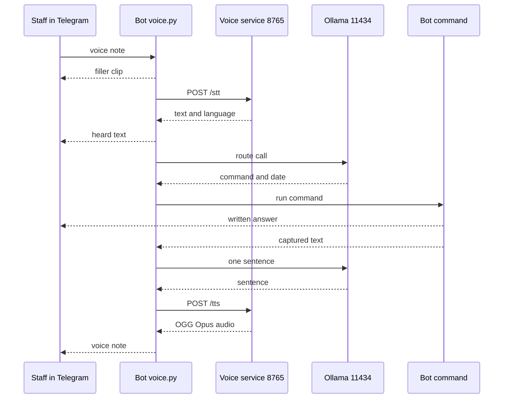
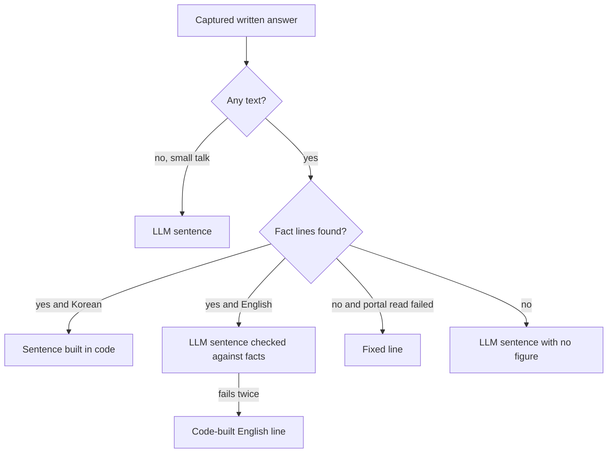

# Voice and LLM programs

Reference for the programs that let the bot listen, think with a local language model, and speak.

Back to the index: [PYTHON_PROGRAMS.md](../PYTHON_PROGRAMS.md). Older long-form background: [reference/06_LLM_AND_JENNIE_VOICE.md](../reference/06_LLM_AND_JENNIE_VOICE.md).

All `path:line` citations are relative to the repository root. Files under `src/` are the bot's code. Files under `extras/jennie_voice/` are the voice service, a separate program that is not tracked in the bot's git repository and is published beside it.

## Terms used here

| Term | Meaning |
|---|---|
| Jennie | The name of the bot's voice persona. Staff talk to "Jennie" in Telegram. |
| Jennie's brain | The code's name for the local LLM: one Ollama model, named by the setting `OLLAMA_MODEL`. |
| LLM | Large language model. The bot reaches it through an Ollama server at the setting `OLLAMA_BASE_URL`, default `http://127.0.0.1:11434` (this PC, `src/config.py:31`). Unlike `JENNIE_VOICE_URL`, the bot does not refuse a non-local Ollama address: `src/llm/ollama_client.py` has no host check. |
| Ollama | A local server program that loads a model and answers HTTP requests. Default address `http://127.0.0.1:11434`. |
| Voice service | A second local HTTP server (`extras/jennie_voice/service.py`) on `127.0.0.1:8765` that does speech-to-text and text-to-speech. |
| STT | Speech-to-text. Done by faster-whisper models inside the voice service. |
| TTS | Text-to-speech. Done by the CosyVoice2-0.5B model inside the voice service. |
| Voice note | A Telegram voice message (OGG/Opus audio). |
| Filler clip | A short pre-rendered voice note ("one moment") that the bot sends the instant a voice note arrives. |
| VRAM | Memory on the graphics card. The LLM, the STT model and the TTS model share one 8 GB card, so the code moves models on and off the card. |
| Pinned | The LLM is kept in VRAM permanently (Ollama `keep_alive: -1`). |
| Routed command | The one existing bot command that the LLM picks to answer a spoken question. |

Do not confuse `jennie_voice` (this voice service) with `jeannie-app` (the phone app, see [JEANNIE_APP.md](../JEANNIE_APP.md)). They are different programs with similar names.

## What this group does together

1. A staff member sends a voice note to the bot in Telegram, in Korean or English.
2. `src/bot/voice.py` sends a filler clip at once, downloads the audio, and posts it to the voice service (`POST /stt`).
3. The voice service returns the words and the language. The bot posts `🎧 heard: <transcript>` in the chat.
4. One LLM call (through `src/llm/ollama_client.py`) picks one of 10 routes and a date.
5. The bot runs its own existing command for that route. The command sends its normal written answer. `voice.py` records that text while it is sent.
6. The bot makes ONE short sentence about the answer. Figures in that sentence are checked against the written answer, or the sentence is built in code.
7. The sentence goes to the voice service (`POST /tts`), which returns an OGG/Opus voice note. The bot sends it.

The same LLM client also serves three jobs that are not voice: picking which dashboard figures answer a typed question, writing a one-sentence summary of the daily brief, and drafting an e-mail body. Those callers live in other files and are listed in the `ollama_client.py` section.

None of these files reads the admin portal, Google or Supabase directly. Portal reads happen inside the bot commands that `voice.py` runs (see [bot_core.md](bot_core.md) and [bot_answers_and_jobs.md](bot_answers_and_jobs.md)).

The second LLM call is skipped in three cases: a Korean answer with figures (the sentence is built in code), a failed portal read (a fixed line is spoken), and a command that sent no text (no spoken reply at all). The details are in the `voice.py` section.

## Programs in this group

| Program | Lines | One-line purpose | How it is started |
|---|---|---|---|
| [`src/bot/voice.py`](../../src/bot/voice.py) | 1877 | Bot side of the voice path: voice note in, routed command, one spoken sentence out; filler clips; spoken daily brief | Imported by the bot. No command line. Handler registered only when `JENNIE_VOICE_ENABLED` is true |
| [`src/llm/__init__.py`](../../src/llm/__init__.py) | 1 | Package marker (one docstring) | Imported implicitly |
| [`src/llm/ollama_client.py`](../../src/llm/ollama_client.py) | 274 | The only client of the local Ollama server; one shared instance `ollama_client` | Created at import time |
| [`src/llm/prompts.py`](../../src/llm/prompts.py) | 20 | One system prompt and one JSON schema for "pick the facts" | Imported by `ollama_client.py` |
| [`extras/jennie_voice/service.py`](../../extras/jennie_voice/service.py) | 1309 | The voice service: `/health`, `/stt`, `/tts` on `127.0.0.1:8765` | `.venv\Scripts\python.exe service.py`, or hidden through `start_jennie_voice.vbs` |
| [`extras/jennie_voice/smoke_test.py`](../../extras/jennie_voice/smoke_test.py) | 318 | End-to-end check of a running voice service | `.venv\Scripts\python.exe smoke_test.py` |
| [`extras/jennie_voice/offline_test.py`](../../extras/jennie_voice/offline_test.py) | 223 | Checks of `service.py` logic with no model and no port | `.venv\Scripts\python.exe offline_test.py` |
| [`extras/jennie_voice/bench_stt.py`](../../extras/jennie_voice/bench_stt.py) | 228 | Benchmark that chose the Whisper models | `.venv\Scripts\python.exe bench_stt.py [cpu]` |
| [`extras/jennie_voice/stubs/pyworld.py`](../../extras/jennie_voice/stubs/pyworld.py) | 9 | Stand-in for the `pyworld` package | Imported by CosyVoice through `sys.path` |
| [`extras/jennie_voice/install_jennie_voice.bat`](../../extras/jennie_voice/install_jennie_voice.bat) | 47 | Creates the autostart shortcut and the watchdog task | Double-click, once |
| [`extras/jennie_voice/start_jennie_voice.vbs`](../../extras/jennie_voice/start_jennie_voice.vbs) | 15 | Starts `service.py` with no window | Startup shortcut, watchdog, or double-click |
| [`extras/jennie_voice/stop_jennie_voice.bat`](../../extras/jennie_voice/stop_jennie_voice.bat) | 12 | Stops this folder's `service.py` processes | Double-click, or `stop_jennie_voice.bat nopause` |
| [`extras/jennie_voice/watchdog_jennie_voice.ps1`](../../extras/jennie_voice/watchdog_jennie_voice.ps1) | 72 | Restarts the service when `/health` fails twice | Windows task `JennieVoiceWatchdog`, every 5 minutes |

Root copies: none of the four `src` files above has a copy in the repository root. The root files `telegram_bot.py` and `config.py` are byte-identical copies of `src/bot/telegram_bot.py` and `src/config.py` (checked with `diff -q`); the root `telegram_bot.py` therefore also imports `ollama_client`. They are described once in [bot_core.md](bot_core.md) and [scraper_and_config.md](scraper_and_config.md).

Tests for the bot side are in `tests/test_voice.py` (21 test functions), `tests/test_voice_fast.py` (41 test functions) and `tests/test_repair_voice.py` (7 test functions); see [tests.md](tests.md). Of these, 3, 5 and 3 functions respectively are parametrized with `@pytest.mark.parametrize` (for example `tests/test_voice.py:450`, `tests/test_voice_fast.py:190`, `tests/test_repair_voice.py:25`), so pytest collects more test cases than functions. The trials that chose the LLM and the voice engines are in [trials.md](trials.md).

---

## src/bot/voice.py

**Purpose.** Everything the bot does for a spoken question. A voice note or audio file from an authorised chat gets four things: a filler clip at once, a text `🎧 heard: <transcript>`, the normal written answer of the bot command that the words ask for, and one spoken sentence in Jennie's voice (English, or Korean when Korean was spoken). The file also speaks a short summary of the daily brief. Module docstring: `src/bot/voice.py:1-26`.

**How it is run or who calls it.** No command line and no `__main__`. Importers:

| Caller | What it uses | When |
|---|---|---|
| `src/bot/telegram_bot.py:2430-2433` (`build_telegram_application`) | `handle_voice_message`, registered as `MessageHandler(filters.VOICE \| filters.AUDIO, handle_voice_message, block=False)` | Only when `JENNIE_VOICE_ENABLED` is true. With the flag false, no voice handler exists and voice notes are ignored |
| `src/bot/scheduler.py:269-274` (`send_daily_briefing`) | `send_spoken_brief` | After the text brief was sent, only when `JENNIE_VOICE_ENABLED` and `JENNIE_SPOKEN_BRIEF` are both true |
| `src/bot/scheduler.py:308-311` (`warm_brain`) | `prepare_fillers` | At bot start (task created in `src/bot/telegram_bot.py:2359-2362`) and on a keep-warm reload, when `JENNIE_VOICE_ENABLED` is true |
| `src/bot/voice.py:1709` (itself) | `_prepare_fillers_later` | After every voice note, in the background |
| `src/bot/brief.py:416`, `:424`, `:524` | `_numbers_in`, `_WORD_SCALES`, `_WORD_VALUES`, `_plain` | The daily brief's own fact checks reuse these helpers |

`block=False` means voice notes run concurrently with typed commands; a voice round trip can take a minute and must not hold up the rest of the bot (`src/bot/telegram_bot.py:2429`).

**What it reads.**

| Input | Detail | Code |
|---|---|---|
| Telegram update | `update.message.voice` or `.audio` (duration, file size, MIME type, file name), `update.effective_chat.id`; the audio bytes through `media.get_file()` and `download_as_bytearray()` | `src/bot/voice.py:1730-1749` |
| Authorisation | `telegram_bot.is_authorized(update)` | `src/bot/voice.py:1726` |
| `context.user_data` | `email_flow` (read), `awaiting_date_for` (read and popped), `override_text` (written for the command, popped afterwards) | `src/bot/voice.py:1742`, `:1784`, `:1797`, `:656-689`, `:703-749`, `:1815` |
| Voice service | `POST /stt` and `POST /tts` at the URL in `JENNIE_VOICE_URL` | `src/bot/voice.py:163-199` |
| Ollama | `ollama_client.chat(...)` in `route` and `_say` | `src/bot/voice.py:541-542`, `:991-992` |
| Settings (by name) | `JENNIE_VOICE_URL`, `REPORT_TIMEZONE`; `BOT_ROOT` from `src/config.py:6`. The switches `JENNIE_VOICE_ENABLED` and `JENNIE_SPOKEN_BRIEF` are read by the callers, not here | `src/bot/voice.py:127`, `:375`, `:209` |
| Local files | `data/jennie_fillers/fillers.json` and `data/jennie_fillers/<lang>_<n>.ogg` | `src/bot/voice.py:220-225`, `:299` |
| Other bot modules (imported inside functions) | `src.bot.telegram_bot` (the commands), `src.bot.ask` (`classify`, `calendar_query`, `ONE_DAY_KINDS`), `src.bot.brief.claims_problem`, `src.bot.replies.date_error_reply`, `src.dates` (`MONTH_NAMES`, `parse_user_date`, `user_date_problem`) | `src/bot/voice.py:585`, `:649`, `:664`, `:748`, `:759`, `:1136`, `:1309`, `:1720`, `:1836` |
| The command's written answer | Captured in memory while the command sends it | `src/bot/voice.py:1533-1611` |

Portal pages: none directly. The commands that `voice.py` runs read the portal themselves.

**What it writes.**

| Output | Detail | Code |
|---|---|---|
| Telegram voice note (filler) | file name `jennie.ogg`, `write_timeout=30` | `src/bot/voice.py:320-321` |
| Telegram text | `🎧 heard: <transcript>`, cut to 3900 characters | `src/bot/voice.py:1781` |
| Telegram text | The routed command's own replies, sent by the command through the capturing stand-in | `src/bot/voice.py:1573-1575` |
| Telegram text (small talk only) | `💬 <Jennie's sentence>` | `src/bot/voice.py:1846` |
| Telegram chat action | `RECORD_VOICE` before the reply is rendered; `TYPING` when an e-mail conversation is open | `src/bot/voice.py:1850`, `:1745` |
| Telegram voice note (reply) | file name `jennie.ogg`, `write_timeout=60` | `src/bot/voice.py:1855-1856` |
| Telegram voice note (spoken brief) | file name `jennie-brief.ogg`, `write_timeout=60` | `src/bot/voice.py:1871-1872` |
| Telegram notices | recording too long (`:1736`), download failed (`:1752`), voice service busy (`:1762`), voice service unavailable (`:1767`), no words heard (`:1774`), `EMAIL_FLOW_NOTE` (`:83`, sent at `:1786`, `:1798`), `UNAVAILABLE_NOTE` (`:82`, sent at `:1860`), `❌ Error: ...` (`:1824`) | as listed |
| Local files | `data/jennie_fillers/<lang>_<n>.ogg` and `data/jennie_fillers/fillers.json`, each written as `<name>.tmp` then `os.replace` | `src/bot/voice.py:241-267` |
| Memory only | per-chat history `_history`; filler cache `_filler_clips` including Telegram's `file_id` | `src/bot/voice.py:335`, `:216` |
| Log (logger `hangeul.voice`) | One INFO line per note: chat id, seconds of audio, language, what ran, stage timings. Never the words | `src/bot/voice.py:1705-1707` |

`data/` is git-ignored (`.gitignore:18`), so the filler clips are never in the repository. No Google, Supabase or e-mail writes happen in this file.

**Why it exists.** Office staff can ask the bot by voice the same things they type ("how many students were verified today?", then "and yesterday?") and hear a short answer while the full written answer appears in the chat. All speech processing stays on the office PC: `_service_url` refuses any voice URL whose host is not `127.0.0.1`, `localhost` or `::1` (`src/bot/voice.py:125-131`).

### The round trip, step by step

`_answer_voice`, `src/bot/voice.py:1719-1860`.

1. No message, or the sender is not authorised: return with no reply. A warning is logged for an unauthorised chat (`:1723-1729`).
2. Recording longer than 60 s or larger than 20 MiB: send the "too long" notice and stop (`:1734-1738`).
3. If no `/sendmail` conversation is open (`email_flow` not set), start a background task that sends a random ready filler clip in the language of this chat's last voice turn. The language is Korean until the chat has spoken once (`:1742-1743`, `last_language` `:352`). If an e-mail conversation is open, only a typing action is sent (`:1745`).
4. Download the audio from Telegram into memory (`:1747-1754`).
5. Take the bot's turn at the voice service and `POST /stt` (`:1756-1770`). A busy service gives the "busy" notice; any other failure gives the "can't listen" notice.
6. Empty transcript: send "couldn't make out any words" and stop (`:1772-1775`).
7. Decide the language with `spoken_language`: Korean when Whisper's code is `ko` or when at least 30 % of the letters are Hangul; otherwise Whisper's code. The reply language is `ko` or else `en` (`:1522-1528`, `:1776-1777`).
8. Send `🎧 heard: ...` in the background (`:1781`).
9. If `email_flow` is set: send `EMAIL_FLOW_NOTE` and stop. This is checked before routing and again after it (`:1784-1800`).
10. ONE LLM call: `route(heard, last turns)` returns `{"command", "date", "english_query", "date_problem"}` or `None` (`:1790-1791`, `route` at `:534-564`).
11. `_dispatch` runs the chosen bot command on a capturing stand-in for the Telegram update. The command sends its normal text and the text is recorded (`:1804-1815`). `override_text` is always removed afterwards (`:1815`).
12. If nothing ran (LLM down, LLM answer unusable, or `_dispatch` returned no command), the typed-question router runs instead: `telegram_bot.handle_natural_language_message(proxy, context, query=english_query or heard)` (`:1816-1826`).
13. If a command ran but sent no text, stop here with no spoken reply (`:1830-1832`).
14. `spoken_reply(...)` makes ONE sentence (`:1844`). For small talk the sentence is also sent as text (`:1846`). The turn is stored in the chat's history (`:1847`).
15. Take the bot's turn again and `POST /tts` with `{"text", "language", "style": "aegyo"}`, then send the voice note (`:1850-1857`). Any failure sends `UNAVAILABLE_NOTE`; the text answer is already in the chat (`:1858-1860`).

The command in step 11 runs outside the voice-service turn, so a slow report does not block other voice notes (`:1802-1803`).

### Routes the LLM may pick

`ROUTE_COMMANDS` has 10 entries (`src/bot/voice.py:380-381`). `_dispatch` (`:644-770`) maps them to commands in `src/bot/telegram_bot.py`:

| Routed command | What runs | Code |
|---|---|---|
| `verified_today`, `verified_date` | `verified_today_command` when the day is today; otherwise `verified_date_command` with `user_data["override_text"]` set to the date as `DD Mon YYYY`. With no date, the date command asks which date | `src/bot/voice.py:693-705` |
| `inquiries_today`, `inquiries_date` | `inquiries_today_command` / `inquiries_date_command`, same pattern | `src/bot/voice.py:693-705` |
| `crosscheck` | Two different dates plus a range word: `crosscheck_range_command`. One date: `crosscheck_today_command` or `crosscheck_date_command`. No date but a 2 to 5 digit number in the query text: `crosscheck_command` with `override_text` = `student <number>`. Otherwise `crosscheck_date_command`, which asks for a date | `src/bot/voice.py:707-730` |
| `passports` | The live cross-check for the day named, today when none: `crosscheck_today_command` or `crosscheck_date_command`. It does not run the `/passports` command | `src/bot/voice.py:732-742` |
| `calendar` | `calendar_command` with `override_text` = the English query. The command reads that text and works out its own date window (`src/bot/telegram_bot.py:1110-1125`). `_dispatch` also calls `ask.calendar_query` on the query, only to record the day or range the answer covers; `spoken_reply` and `_remember` use that day (`src/bot/voice.py:1844`, `:1847`) | `src/bot/voice.py:744-754` |
| `stats` | If `ask.classify` recognises a specific figure, `handle_natural_language_message`; otherwise `stats_command` | `src/bot/voice.py:756-765` |
| `missing_report` | `missing_command` | `src/bot/voice.py:767-769` |
| `chat` | No command. Jennie answers with one sentence, also sent as text | `src/bot/voice.py:690-691`, `:1845-1846` |

Two special cases come before the table above:

| Situation | What happens | Code |
|---|---|---|
| The words name a date that does not exist ("31 September", "the 45th") | The reply is `replies.date_error_reply(...)`. Nothing is read from the portal and no other day is used in its place | `src/bot/voice.py:660-669` |
| The bot asked this chat for a date earlier (`awaiting_date_for` is set) and the note gives one | The date is passed to `handle_natural_language_message` as the answer to that question. A new request that is not small talk drops the open question | `src/bot/voice.py:670-689` |

### How dates in speech are read

The LLM returns a date, but the code overrides or checks it for the six dated routes (`_DATED_COMMANDS`, `src/bot/voice.py:435`, used at `:558-563`):

1. If the words contain no calendar date and exactly one relative expression (today, yesterday, the day before yesterday, or a weekday name, in English or Korean), the code computes the day itself (`_relative_day` `:511`, `_spoken_day` `:516`). A weekday name means the most recent such day before today; if today is that weekday, 7 days ago (`:530`).
2. Otherwise `_words_date` (`:617`) compares the LLM's date with the dates the words name. A date in the words that cannot exist returns no date and a reason. If the words name dates, the LLM's date must be one of them; if not, the words' single date is used, or none when they name several.
3. A date without a year is this year's. A bare Korean day of the month (`25일`) is this month's, or last month's when that day is still to come (`_query_days`, `:466-492`).

"Today" is the current time in `REPORT_TIMEZONE` (`_now`, `:372-377`).

### Prompts defined in this file

All are sent with `ollama_client.chat`, so the model is `OLLAMA_MODEL` and the options are the shared ones described in the `ollama_client.py` section.

| Prompt | Lines | Used by | Output and limits |
|---|---|---|---|
| `_ROUTER_SYSTEM` with `_ROUTER_SCHEMA`. `<TODAY>` and `<DAYS>` (the 7 previous days with weekday names) are filled in. The user message is the last 3 turns plus `NEW utterance: <heard>` | `src/bot/voice.py:385-421`, call at `:538-542` | `route` | JSON with `command` (one of 10), `date` (string or null), `english_query`, `language` (`ko` or `en`). `language` is required by the prompt and the schema (`:406-408`, `:418-420`) but `route` drops it (`:564`). `num_predict` 160, timeout 30 s |
| `_REPLY_SYSTEM_EN`, built from `_CUTE_EN`, `_FACT_RULES`, `_ASK_RULE`, `_DAY_RULE`. `<LIMIT>` is filled with 90 | `src/bot/voice.py:773-801` | `spoken_reply` through `_say` | Plain text, one English sentence. `num_predict` 120, timeout 30 s, at most 2 calls |
| `_REPLY_SYSTEM_KO`. `<LIMIT>` is filled with 22 | `src/bot/voice.py:803-816` | `spoken_reply` through `_say`, only for small talk and for answers with no figure | Plain text, one Korean sentence. Same limits |
| `_BRIEF_SYSTEM_EN`. `<LIMIT>` is filled with 140 (`BRIEF_MAX_CHARS - 20`) | `src/bot/voice.py:818-829`, filled at `:1310` | `spoken_brief` through `_say` | Plain text, one or two English sentences. Same limits |

The comment above `_ROUTER_SYSTEM` (`src/bot/voice.py:383-384`) says the routing prompt was proven in the brain trial; that script is published as [`extras/trials/brain-trial/trial.py`](../../extras/trials/brain-trial/trial.py) (see [trials.md](trials.md)).

### How the spoken sentence is kept free of invented figures

`spoken_reply`, `src/bot/voice.py:1240-1292`.

| Branch | Rule | Code |
|---|---|---|
| Facts | `answer_facts` extracts at most 8 lines from the written answer: `label: figure` lines, `(N items)` headings, and four fixed "No ..." sentences turned into a `: 0` fact. A label that appears on more than one line is treated as a detail and dropped | `src/bot/voice.py:1019-1061` |
| English with facts | The LLM writes the sentence. `_fact_problem` rejects it if it names a day other than the answer's day, says no figure, or fails `brief.claims_problem` (every figure must be the figure of the fact its words describe; only words from the facts, the question and a fixed word list are allowed). One retry with a hint, then `_english_line`, then `_FALLBACK` | `src/bot/voice.py:1122-1138`, `:1271-1281`, `:1225-1237` |
| Korean with facts | The LLM is not used. `_korean_line` builds the sentence from the first matching entry of `_KO_TOPICS` (20 topic patterns). A fact with no Korean wording there falls back to the fixed line "the answer is in the chat" | `src/bot/voice.py:1158-1222`, `:1266-1270` |
| Portal read failed | Written answer matches `couldn't read the portal` or `could not be read`: the fixed `_PORTAL_DOWN_LINE` is spoken | `src/bot/voice.py:943-947`, `:1283-1285` |
| No figure in the answer (for example the bot asked which date) | The LLM sees up to 2000 characters of the written answer. The sentence is rejected if it contains any number not in the question, or says "none" | `src/bot/voice.py:1286-1292` |
| Small talk | The LLM answers freely. Numbers are allowed only if they are in the question | `src/bot/voice.py:1257-1261` |
| LLM down or wrong twice | Fixed lines `_FALLBACK` (4 entries) and `_BRIEF_FALLBACK` | `src/bot/voice.py:832-838` |

Numbers are found in digits, English number words and Korean number words (`_numbers_in`, `:900-927`; `_ko_numbers_in`, `:885-897`).

### Main functions and classes

Voice service access and turn-taking:

| Name | Line | What it does |
|---|---|---|
| `VoiceServiceError` | 89 | The voice service could not be reached, or refused the request |
| `VoiceServiceBusy` | 93 | Subclass: the service timed out, answered 503, or the bot's own turn never came |
| `_voice_turn` | 103 | Async context manager. One `asyncio.Lock` per event loop, so the bot has one request at the voice service at a time. Waits at most 240 s, then raises `VoiceServiceBusy` |
| `_service_url` | 125 | Reads `JENNIE_VOICE_URL`; raises unless the host is `127.0.0.1`, `localhost` or `::1` |
| `_http` | 134 | `httpx.AsyncClient` for the service: given timeout, 5 s connect timeout, `trust_env=False` (no proxy) |
| `_number`, `_service_error`, `_request_error` | 140, 147, 156 | Helpers: parse a float; map HTTP 503 to `VoiceServiceBusy` and other statuses to `VoiceServiceError`; map a read timeout to busy and other request errors to unreachable |
| `transcribe` | 163 | `POST /stt` with multipart field `audio`. Returns `{"text", "language", "duration_s", "seconds"}` |
| `synthesize` | 186 | `POST /tts` with JSON `{"text", "language", "style"}`. Text is cut to 600 characters first. Returns `(OGG bytes, X-Duration)`. Rejects a body that does not start with `OggS` |

Filler clips:

| Name | Line | What it does |
|---|---|---|
| `_filler_manifest` | 220 | Reads `fillers.json`; `{}` on any error |
| `_filler_wanted` | 228 | Yields `(language, file name, line)` for the 6 clips in `FILLER_LINES` |
| `missing_fillers` | 234 | Clips not rendered yet, or rendered for a line that has since changed |
| `_write_atomic` | 241 | Writes `<name>.tmp`, then `os.replace` |
| `prepare_fillers` | 247 | Renders each missing clip through `/tts`, one voice-service turn each. Never raises. Returns how many were rendered |
| `_prepare_fillers_later` | 277 | Starts `prepare_fillers` in the background if no such job is running and clips are missing |
| `_pick_filler` | 284 | A random ready clip in a language, or `None`. Skips clips longer than 3.5 s |
| `_send_filler` | 310 | Sends the clip, first by Telegram `file_id` if known, then by bytes. Stores the `file_id` Telegram returns. Never raises |

Conversation memory:

| Name | Line | What it does |
|---|---|---|
| `_turns` | 338 | The chat's `deque` of turns, at most 6 |
| `_remember` | 342 | Appends `{"user", "language", "command", "date", "jennie"}` |
| `last_language` | 352 | Language of the chat's last turn; `ko` when there is none |
| `_history_text` | 358 | The last 3 turns as prompt text; `(none)` when empty |

Routing and dates:

| Name | Line | What it does |
|---|---|---|
| `_now` | 372 | Now in `REPORT_TIMEZONE`; local time if the zone cannot be loaded |
| `_iso_day` | 426 | Parses `YYYY-MM-DD`; `None` on failure |
| `_mon` | 448 | Month word to month number |
| `_query_days` | 466 | Every date named in a text, in order (ISO, `1 Sep`, `September 1`, `9월 1일`, `25일`, today, yesterday, day before yesterday) |
| `_one_day` | 495 | The single date a text names; `None` when none or several |
| `_span` | 501 | `(first, last)` when a text names two different dates and, by default, a range word |
| `_relative_day`, `_spoken_day` | 511, 516 | The day a relative expression means, when the words name exactly one |
| `route` | 534 | The routing LLM call; parses the JSON (also from text around it); validates the command; cuts `english_query` to 200 characters; reconciles the date. Returns `{"command", "date", "english_query", "date_problem"}`; the model's `language` is not passed on |
| `_ko_number` | 575 | Korean digit or number word to an integer |
| `_words_dates`, `_words_date` | 581, 617 | Which dates the words name, and why a named date cannot exist; the LLM's date checked against them |
| `_portal_day` | 639 | A date as `DD Mon YYYY`, the form the bot's commands read |
| `_dispatch` | 644 | Runs the routed command. Returns `(what ran, the day it ran for)` |

Sentence building and fact checks:

| Name | Line | What it does |
|---|---|---|
| `_clean_reply` | 842 | LLM text to speech-ready text; `""` when Korean was wanted and the text has no Hangul |
| `_ko_sino_value`, `_ko_numbers_in`, `_numbers_in` | 871, 885, 900 | Extract every number from a text (digits, English words, Korean words) |
| `_facts_ok` | 950 | True when every number said is in the sources. Saying "none" is allowed only if the written answer has a 0 or says there is nothing |
| `_said_part` | 965 | The part of the LLM's text that will actually be spoken after cutting to the limit |
| `_say` | 980 | One LLM call for words to speak; one retry with hints (allowed numbers, shorter length). `""` when the LLM is down or wrong twice |
| `answer_facts` | 1036 | The facts a written answer states, at most 8 |
| `_day_words` | 1064 | The answer's day as spoken words ("today", "on 12 September", `9월 12일`); for Korean ranges only "this week", "next week", "last week" or "that period" |
| `_day_problem`, `_without_days` | 1088, 1103 | Detect a wrongly named day; remove date words before the number check |
| `_fact_problem` | 1122 | Why an English sentence about portal facts may not be spoken, or `None` |
| `_checkable` | 1146 | Adjusts wording so `brief.claims_problem` can check an answer's facts |
| `_headline`, `_fact_value` | 1182, 1199 | The fact to speak and its integer value |
| `_korean_line` | 1204 | The Korean sentence built from the headline fact |
| `_english_line` | 1225 | The plain English fallback sentence built from the headline fact |
| `spoken_reply` | 1240 | The one sentence for a voice note |
| `spoken_brief` | 1303 | The spoken evening update from the brief's fact lines |

Text for speech:

| Name | Line | What it does |
|---|---|---|
| `_plain` | 1330 | Telegram Markdown to plain lines: no links, URLs, emojis or markup |
| `_speech_text` | 1341 | Plain text, numbers spelled out, one paragraph, cut to a limit |
| `_fit` | 1354 | Cut to a limit. The cut is at the last sentence end, or else the last space, when that lies at or after one third of the limit; otherwise a hard cut |
| `_is_code` | 1372 | True when the digits start with `0` and there are more than 2 of them, or when there are more than 6 digits and the number was written without a comma (`:1373-1374`). Such numbers are read digit by digit. Numbers longer than 12 digits (English, `:1442`) or 16 digits (Korean, `:1502`) are also read digit by digit |
| `_en_words`, `_en_ordinal`, `_spell_numbers_en` | 1392, 1408, 1419 | English digits to words (dates, clock times, ordinals, amounts, percent) |
| `_ko_sino`, `_ko_native`, `_spell_numbers_ko` | 1460, 1480, 1488 | Korean digits to Hangul words (native numbers before counters, Sino-Korean otherwise) |
| `spoken_language` | 1522 | The language decision described in step 7 |

Capture and Telegram handling:

| Name | Line | What it does |
|---|---|---|
| `_Capture` | 1533 | Ordered list of the texts a command leaves in the chat. An edited message counts with its final text; a deleted one not at all |
| `_text_arg` | 1554 | The text argument of a `reply_text` or `edit_text` call |
| `_CapturingMessage` | 1558 | Stands in for one Telegram message. Forwards every call to the real message and records `reply_text`, `edit_text`, `delete` |
| `_CapturingUpdate` | 1592 | Stands in for the update. `.message` and `.effective_message` capture; everything else is the real update |
| `_Timings` | 1616 | Stage timings for the one log line |
| `_seconds`, `_media_facts`, `_audio_name`, `_voice_duration` | 1639, 1645, 1652, 1665 | Duration and size of the media; file name and MIME type for the upload; whole seconds for Telegram |
| `_background` | 1672 | Creates a task and keeps a reference until it is done |
| `_chat_action`, `_note` | 1679, 1686 | Send a chat action or a short text; never raise |
| `handle_voice_message` | 1693 | The Telegram handler. Never raises. Writes the one log line and starts the background filler render |
| `_answer_voice` | 1719 | The round trip |
| `send_spoken_brief` | 1863 | Speaks the brief summary. Returns `False` on any failure, never raises |

### Numbers that matter

| Name | Value | Meaning | Code |
|---|---|---|---|
| `STT_TIMEOUT` | 60.0 s | Read timeout for `/stt` | `src/bot/voice.py:53` |
| `TTS_TIMEOUT` | 120.0 s | Read timeout for `/tts` | `:54` |
| connect timeout | 5.0 s | For both | `:136` |
| `TTS_MAX_CHARS` | 600 | Text is cut to this before `/tts` | `:55` |
| `REPLY_MAX_CHARS` | ko 32, en 120 | Hard limit of the spoken sentence after clean-up | `:65` |
| `REPLY_TARGET_CHARS` | ko 22, en 90 | Length the prompt asks for | `:66` |
| `BRIEF_MAX_CHARS` | 160 | Hard limit of the spoken brief; the prompt asks for 140 | `:69`, `:1310` |
| `ANSWER_MAX_CHARS` | 2000 | How much written answer the prompt may see | `:70` |
| `MAX_VOICE_SECONDS` | 60 | Longer recordings are refused | `:73` |
| `MAX_DOWNLOAD_BYTES` | 20 MiB | Larger files are refused | `:74` |
| `VOICE_TURN_WAIT` | 240.0 s | Longest wait for the bot's own turn | `:75` |
| `LLM_TIMEOUT` | 30.0 s | One LLM call | `:76` |
| `ROUTE_MAX_TOKENS` | 160 | `num_predict` for routing | `:77` |
| `REPLY_MAX_TOKENS` | 120 | `num_predict` for a sentence | `:78` |
| `HISTORY_TURNS` | 6 | Turns kept per chat | `:79` |
| `PROMPT_TURNS` | 3 | Turns shown to the LLM | `:80` |
| `FILLER_MAX_SECONDS` | 3.5 s | A longer filler clip is never sent | `:214` |
| `ANSWER_FACTS_MAX` | 8 | Facts taken from one answer | `:1033` |
| `_say` attempts | 2 | One call plus one retry | `:990` |
| hint numbers | 20 | Most allowed numbers listed in the retry hint | `:1005` |
| retry length | `0.7 × limit` | Length asked for when the first try was too long | `:1009` |
| `english_query` | 200 chars | Cut length | `:555` |
| heard text | 3900 chars | Cut length of the `🎧 heard` message | `:1781` |
| Hangul share | 0.3 | Fraction of letters that makes a text Korean | `:1526` |
| student number | 2 to 5 digits | Pattern for a spoken student number in the cross-check route | `:724` |
| `send_voice` `write_timeout` | 30 s filler, 60 s reply and brief | Telegram upload | `:321`, `:1856`, `:1872` |

The file has no schedule of its own. The spoken brief follows the daily-brief job in `src/bot/scheduler.py` (see [bot_answers_and_jobs.md](bot_answers_and_jobs.md)).

### Things to know

- The module docstring quotes a filler line (`src/bot/voice.py:4`) that is not one of the six real `FILLER_LINES` (`:210-213`).
- The bot always sends `style: "aegyo"` (`:259`, `:1853`, `:1870`). The voice service accepts the field but renders both styles the same way.
- The `passports` route runs the cross-check commands, not `passports_command` (`:732-742`).
- Conversation memory and the filler `file_id` cache are in RAM only. A bot restart clears them, and the next filler is in Korean again.
- A language other than Korean, even one Whisper is confident about, is answered in English. The log line records the detected language code, not the reply language (`:1776-1778`).
- The LLM's `language` answer is never used. The router prompt and `_ROUTER_SCHEMA` require it (`:406-408`, `:418-420`), but `route` returns only `command`, `date`, `english_query` and `date_problem` (`:564`). The reply language is decided by `spoken_language` from the `/stt` result: Whisper's code and the share of Hangul letters (`:1522-1528`, `:1776-1777`).
- Only text sent through `update.message` or `update.effective_message` is captured (`:1592-1611`). Text a command sends another way (for example `context.bot.send_message`) reaches the chat but is not used for the spoken sentence.
- A voice note never answers a `/sendmail` conversation. A misheard "send" must not e-mail a student (`:1783-1800`).
- The log line and the background filler render happen only for notes that passed the size check (`:1704-1709`); `facts["chat"]` is set at `:1739`.
- `transcribe` returns `duration_s` and `seconds`, but `_answer_voice` uses only `text` and `language`.
- `_voice_turn` uses `asyncio.timeout` (`:113`), which exists from Python 3.11.
- The constants comment (`:56-64`) records how tight VRAM is on the 8 GB card: in some measured runs Korean renders slowed 2 to 7 times.
- Number spelling exists twice: here (`:1367-1519`) and in the voice service (`extras/jennie_voice/service.py:266-473`), with different rules. The bot spells numbers before it sends text, so for bot requests the service's own spelling has no digits left to work on.
- No TODO or FIXME markers in the file.

---

## src/llm/__init__.py

**Purpose.** Package marker. One docstring line (`src/llm/__init__.py:1`).

**How it is run or who calls it.** Imported implicitly by every `from src.llm...` import.

**What it reads / writes.** Nothing.

**Why it exists.** It makes `src/llm` an importable package.

**Main functions and classes.** None.

**Numbers that matter.** None.

**Things to know.** None.

---

## src/llm/ollama_client.py

**Purpose.** The only place in the bot that talks to the local Ollama server. One model, named by `OLLAMA_MODEL` (default `qwen3:4b-instruct`, `src/config.py:32`), serves every LLM job. The module exposes one shared instance: `ollama_client = OllamaClient()` (`src/llm/ollama_client.py:274`).

**How it is run or who calls it.** The instance is created when the module is first imported. No command line. Importers:

| Importer | Line |
|---|---|
| `run.py` | 33 |
| `src/bot/telegram_bot.py` (and its identical root copy `telegram_bot.py`) | 17 |
| `src/bot/scheduler.py` | 14 |
| `src/bot/brief.py` | 55 |
| `src/bot/voice.py` | 49 |
| `src/bot/ask.py` (inside `answer_unknown`) | 1043 |
| `test_system.py` | 86 |
| tests under `tests/` | see [tests.md](tests.md) |

**What it reads.**

| Input | Detail | Code |
|---|---|---|
| Settings read once, at construction | `OLLAMA_BASE_URL`, `OLLAMA_MODEL`, `OLLAMA_NUM_CTX` | `src/llm/ollama_client.py:66-68` |
| Settings read on every call | `JENNIE_VOICE_ENABLED`, `BRAIN_ALWAYS_LOADED`, `BRAIN_IDLE_UNLOAD` | `:39`, `:44` |
| Ollama HTTP | `GET /api/tags`, `GET /api/ps`, `POST /api/generate`, `POST /api/chat` | `:106`, `:175`, `:139`, `:192`, `:205`, `:160` |
| `src/llm/prompts.py` | `SYSTEM_AGENT_CHAT`, `AGENT_SCHEMA` | `:9` |

**What it writes.** HTTP requests to Ollama, and log lines (logger `hangeul.llm`). No files, no Telegram, no Google, no Supabase.

**Why it exists.** It lets the bot use a model served by Ollama (by default on this PC, see `OLLAMA_BASE_URL` below) for five small jobs: route a spoken question, phrase one spoken sentence, summarise the daily brief in a sentence, pick which dashboard figures answer a typed question, and draft an e-mail body. In the fact-picking job the model returns only line numbers and the bot shows the portal's own lines, so the model never writes a figure (`src/llm/ollama_client.py:214-248`).

### Every method that calls Ollama

Every request that names a model names `OLLAMA_MODEL`. `stream: False` is set only in the base payload (`_payload`, `:78-80`), which `generate_response`, `chat`, `warm_up` and, through `chat`, `answer_agent_query` send. `unload` sends only `{"model": ..., "keep_alive": 0}`, with no `stream` field (`:205-206`). `check_health` and `residency` are GET requests with no body.

| Method (line) | Endpoint | What is sent | Timeout | On failure |
|---|---|---|---|---|
| `check_health` (103) | `GET /api/tags` | nothing | 5 s | Returns `{"reachable": False, ...}` |
| `generate_response` (127) | `POST /api/generate`, after a `check_health` | base payload, `prompt`, optional `system` | client default, 60 s | Returns the fixed text of `_fallback_response` |
| `chat` (151) | `POST /api/chat` | base payload, `messages`, optional `format` (the string `json` or a JSON schema), optional `num_predict` | the caller's `timeout`, else 60 s | Returns `None`. Never raises |
| `residency` (172) | `GET /api/ps` | nothing | 5 s | `{"loaded": False, "on_gpu": False}`, plus `"reachable": False` when the request failed |
| `warm_up` (187) | `POST /api/generate` with an empty prompt (loads the model only), then `residency()` | base payload | 120 s | Logs a warning; still returns residency plus `seconds` |
| `unload` (202) | `POST /api/generate` with `{"model", "keep_alive": 0}` | as shown | 30 s | Logs a warning |
| `answer_agent_query` (214) | through `chat` | system `SYSTEM_AGENT_CHAT`; user `Facts:\n1. ...\n\nQuestion: ...\n\nJSON:`; `format=AGENT_SCHEMA`; `num_predict` 60 | 30 s | `None`. Returns `[]` when there are no facts or the model says `answered` is false |

Base payload (`_payload`, `:78-80`): `model`, `stream: False`, `keep_alive`, and `options`. The options (`options`, `:71-76`) are `temperature` 0.3 and `num_ctx` = `OLLAMA_NUM_CTX` (default 3072, `src/config.py:42`), plus `num_predict` only when the caller gives one. The class docstring explains why the options never vary: Ollama reloads the model whenever a load option such as `num_ctx` differs from the loaded copy (`:59-63`).

`keep_alive` (`:42-44`) is `-1` (never unload) when `JENNIE_VOICE_ENABLED` or `BRAIN_ALWAYS_LOADED` is true. Otherwise it is `BRAIN_IDLE_UNLOAD` (default `"5m"`, `src/config.py:76`).

### Every caller of the LLM in non-test code

| Caller | Method | Prompt | Options |
|---|---|---|---|
| `src/bot/voice.py:541` `route` | `chat` | `_ROUTER_SYSTEM` + `_ROUTER_SCHEMA` | `num_predict` 160, 30 s |
| `src/bot/voice.py:991` `_say` (from `spoken_reply`, `spoken_brief`) | `chat` | `_REPLY_SYSTEM_EN`, `_REPLY_SYSTEM_KO` or `_BRIEF_SYSTEM_EN` | `num_predict` 120, 30 s, at most 2 calls |
| `src/bot/brief.py:550` `llm_summary` | `chat` | `_SUMMARY_SYSTEM` (`src/bot/brief.py:364`) | `num_predict` 120 (`SUMMARY_MAX_TOKENS`), 30 s (`SUMMARY_TIMEOUT`), `src/bot/brief.py:66-67` |
| `src/bot/ask.py:1055` `answer_unknown` | `answer_agent_query`, tried only after `_answer_query_fallback` (`src/bot/ask.py:1052`) found nothing | `SYSTEM_AGENT_CHAT` + `AGENT_SCHEMA` | `num_predict` 60, 30 s |
| `src/bot/telegram_bot.py:1330` `_ai_write_email` | `generate_response` | An inline system prompt in that function | defaults (60 s) |
| `src/bot/telegram_bot.py:48` `start_command`, `run.py:50` `check_ollama_status` | `check_health` | none | 5 s |
| `src/bot/scheduler.py:290`, `:300` `warm_brain` | `warm_up`, `unload` | none | 3 attempts, 30 s apart (`src/bot/scheduler.py:280`) |
| `src/bot/scheduler.py:328`, `:334` `keep_brain_warm` | `residency`, `unload`, then `warm_brain(attempts=1)` | none | Job `brain_keep_warm`, every 10 minutes (`src/bot/scheduler.py:491-498`) |
| `src/bot/telegram_bot.py:2359-2365` `post_init` | `warm_brain()` when pinned, else `ollama_client.unload()` | none | Once, at bot start, as a background task |

The manual check script `test_system.py` in the repository root (described in [api_scripts_launchers.md](api_scripts_launchers.md)) is not in the table because it is a test. It uses the client three times: `check_health` (`test_system.py:87`), `_answer_query_fallback` (`:91`, no LLM call) and `answer_agent_query` with a fixed question (`:94`), which sends a real request to Ollama whenever its fact list is not empty and the prompt fits (`src/llm/ollama_client.py:223-231`). The pytest files under `tests/` replace `ollama_client.chat` or its HTTP client with fakes; see [tests.md](tests.md).

### Main functions and classes

| Name | Line | What it does |
|---|---|---|
| `_label_words` | 21 | The telling words of a label or question: lower case, a plural `s` dropped, 15 stop words removed |
| `brain_pinned` | 37 | True when `JENNIE_VOICE_ENABLED` or `BRAIN_ALWAYS_LOADED` |
| `keep_alive` | 42 | The `keep_alive` value every call sends |
| `OllamaClient` | 58 | The client class |
| `OllamaClient.__init__` | 65 | Reads the three settings; creates `httpx.AsyncClient(timeout=60.0)` |
| `OllamaClient.options`, `._payload` | 71, 78 | The one option set and the base payload |
| `OllamaClient.prompt_fits` | 82 | Estimates tokens as `characters / 2.4`. Logs a warning and returns false when the estimate is above `num_ctx - 512` |
| `OllamaClient._check_used` | 94 | After a call: warns when `prompt_eval_count` is at or above `num_ctx - 512` |
| `OllamaClient.check_health` | 103 | Is Ollama reachable, which models are installed, is the target model among them |
| `OllamaClient.generate_response` | 127 | One `/api/generate` call returning text |
| `OllamaClient.chat` | 151 | One `/api/chat` call returning text or `None` |
| `OllamaClient.residency` | 172 | Is the model loaded, and is all of it in VRAM (`size_vram >= size > 0`) |
| `OllamaClient.warm_up` | 187 | Load the model and report residency |
| `OllamaClient.unload` | 202 | Take the model out of VRAM now |
| `OllamaClient.answer_agent_query` | 214 | Which numbered facts answer a typed question. Returns the picked facts in the order given, at most 5 |
| `OllamaClient._answer_query_fallback` | 250 | No LLM: the facts whose whole label is named in the question, at most 5 |
| `OllamaClient._fallback_response` | 265 | The fixed "Ollama is not responding" Markdown text |
| `ollama_client` | 274 | The module's single instance |

### Numbers that matter

| Name | Value | Code |
|---|---|---|
| `AGENT_MAX_TOKENS` | 60 | `src/llm/ollama_client.py:14` |
| `AGENT_TIMEOUT` | 30.0 s | `:15` |
| `AGENT_MAX_FACTS` | 5 | `:16` |
| `KEEP_ALIVE` | -1 | `:34` |
| `TEMPERATURE` | 0.3 | `:45` |
| `ANSWER_BUDGET_TOKENS` | 512 | `:52` |
| `CHARS_PER_TOKEN` | 2.4 | `:55` |
| httpx client timeout | 60.0 s | `:69` |
| health and `/api/ps` timeout | 5.0 s | `:106`, `:175` |
| warm-up timeout | 120.0 s | `:193` |
| unload timeout | 30.0 s | `:206` |
| retries inside the client | none | |

`answer_agent_query` refuses to call the model (returns `None`) when `prompt_fits` says the prompt may not fit (`:228-229`). `generate_response` and `chat` only log the warning and still send the prompt (`:136`, `:159`).

### Things to know

- `base_url`, `model` and `num_ctx` are fixed when the module is imported. `keep_alive` is evaluated on every call.
- Ollama cuts an over-long prompt without any error and keeps about its last half. That is why the size is estimated before sending (comment `src/llm/ollama_client.py:47-51`).
- `generate_response` returns a fixed "Request processed successfully" Markdown text when Ollama is down. A caller must detect it. `_ai_write_email` does (`src/bot/telegram_bot.py:1332-1343`).
- `check_health` treats the model as ready when its name is a substring of any installed model name (`:110`).
- `SYSTEM_AGENT_CHAT` tells the model to pick "at most 4" facts, while the code keeps up to `AGENT_MAX_FACTS` = 5.
- The comment at `:210-212` records that the daily brief is no longer written by the LLM, because it invented figures. The brief is built in code and the LLM adds only one checked summary sentence.
- `.env.example:27-28` says the model "stays loaded in VRAM for good". The code pins it only when `JENNIE_VOICE_ENABLED` or `BRAIN_ALWAYS_LOADED` is true. Otherwise `post_init` unloads it at start and it loads for each question.
- `BRAIN_ALWAYS_LOADED` and `BRAIN_IDLE_UNLOAD` exist in `src/config.py:75-76` but are not listed in `.env.example`.
- `run.py:57` prints `http://localhost:11434` in its "not detected" message, although the default address is `http://127.0.0.1:11434`. `src/config.py:28-30` explains why `127.0.0.1` is used: on this PC `localhost` tries IPv6 first and loses about 2 s on each new connection.
- `TEMPERATURE = 0.3` sits directly under the `keep_alive` function with no blank line (`:44-45`). It is a module constant, not part of the function.

---

## src/llm/prompts.py

**Purpose.** The prompt and the JSON schema for one job: pick which live dashboard facts answer a typed question.

**How it is run or who calls it.** Imported by `src/llm/ollama_client.py:9`. No other importer.

**What it reads / writes.** Nothing.

**Why it exists.** A typed question with no dedicated route is answered by showing portal dashboard figures word for word. The LLM only chooses line numbers (`src/llm/prompts.py:1-5`).

**Main functions and classes.**

| Name | Line | What it is |
|---|---|---|
| `SYSTEM_AGENT_CHAT` | 7 | System prompt: you get numbered facts and a question; pick at most 4 that answer it directly; never answer, calculate or compare; answer with JSON `{"facts": [...], "answered": true or false}` |
| `AGENT_SCHEMA` | 13 | JSON schema: `facts` is an array of integers, `answered` is a boolean, both required |

**Numbers that matter.** "At most 4" in the prompt text (`:9`).

**Things to know.** These are the only prompts in `src/llm`. The voice prompts are in `src/bot/voice.py`, the brief-summary prompt in `src/bot/brief.py`, and the e-mail prompt in `src/bot/telegram_bot.py`.

---

## extras/jennie_voice/service.py

**Purpose.** A local HTTP service that gives the bot speech-to-text and text-to-speech. It listens on `127.0.0.1:8765` only (`extras/jennie_voice/service.py:49-50`).

**How it is run or who calls it.**

- Console: `.venv\Scripts\python.exe service.py` from the service folder. No command-line flags.
- Hidden: `start_jennie_voice.vbs`, which runs `.venv\Scripts\pythonw.exe service.py`.
- Entry point: `main()` (`:1292`), called under `if __name__ == "__main__"` (`:1308-1309`).
- Client: `src/bot/voice.py` (`transcribe`, `synthesize`). The watchdog script calls `/health`.
- `offline_test.py` imports the file as a module. The port is claimed only when the file runs as `__main__` (`:211-216`).

### HTTP contract

| Route | Request | Success | Errors |
|---|---|---|---|
| `GET /health` (`:1241`) | none | 200 `{"ok": true, "stt": <model name>, "tts": "cosyvoice2", "device": "cuda" or "cpu", "tts_on_gpu": bool, "busy_s": float}`. `stt` is `large-v3-turbo` with a GPU and `medium` without | 503 with `"ok": false` and `"error": "hung: ..."` when one request has held the lock longer than 600 s |
| `POST /stt` (`:1259`) | multipart, field `audio` (Telegram OGG/Opus, wav, mp3, m4a) | 200 `{"text", "language", "duration_s", "seconds"}` | 400 empty or undecodable; 413 over 25 MiB or over 600 s; 422 field missing; 503 busy or client gone; 500 unexpected |
| `POST /tts` (`:1269`) | JSON object: `text`, `language` (`en` or `ko`), `style` (`aegyo` or `neutral`; default `neutral`) | 200 `audio/ogg` (Opus, mono, 48 kHz), headers `X-Duration` (seconds of audio) and `X-Seconds` (time taken) | 400 bad JSON, bad field or nothing speakable; 413 text over 600 characters; 503 busy, time limit, a CPU render would not fit, speech cut short, client gone; 500 unexpected |

Every error body is JSON `{"error": "..."}` (`:1192-1209`). FastAPI's docs and OpenAPI routes are switched off (`:1188`).

The request guard `_LocalClientsOnly` (`:1145-1185`) refuses a request before its body is read:

| Status | When |
|---|---|
| 403 | `Host` header is not `127.0.0.1:8765`, `localhost:8765`, `127.0.0.1` or `localhost` |
| 403 | Any `Origin` header (a browser sends one on every POST) |
| 411 | POST without a numeric `Content-Length` |
| 413 | Body over 64 KiB for `/tts`, or over 25 MiB + 1 MiB for `/stt` |
| 415 | `/tts` whose `Content-Type` is not `application/json` |

The guard's docstring gives the reason: listening on `127.0.0.1` alone does not stop a web page open in a browser on the same PC from posting to the service (`:1146-1152`).

### Models

| Job | Model | Details | Code |
|---|---|---|---|
| STT on the GPU | faster-whisper `large-v3-turbo`, `float16` | Used only when at least 3.0 GB of VRAM is free at request time | `:95`, `:97`, `:875` |
| STT on the CPU | faster-whisper `medium`, `int8`, 6 threads | Fallback, always loaded | `:96`, `:100`, `:808-809` |
| STT decoding | beam 5, VAD filter with `min_silence_duration_ms` 500, `condition_on_previous_text=False` | `en` and `ko` (`STT_LANGS`, the languages Jennie speaks) are preferred: an unsure third language (probability under 0.85) is decoded again as the likelier of `en` and `ko`; a third language with probability 0.85 or more is returned unchanged. See step 6 of "One `/stt` request" | `:880-882`, `:102-104`, `:898-916` |
| TTS | CosyVoice2-0.5B | Korean: `inference_zero_shot` with a reference wav and its transcript. English: `inference_cross_lingual` from the same reference. Speaker id `jennie`. Seed 1234; retry seed 1235 | `:55-59`, `:794`, `:978-983`, `:1086` |
| LLM | none | The service has no language model of its own | |

### What it reads

| Input | Detail | Code |
|---|---|---|
| HTTP requests | From the bot, the watchdog and the tests | `:1241-1289` |
| Environment (by name) | `JENNIE_TTS_IDLE_S`, `JENNIE_TTS_MAX_S`, `JENNIE_STT_GPU_KEEP_S`, `JENNIE_GPU`, `JENNIE_LOCK_WAIT_S`, `JENNIE_HUNG_S` | `:63-64`, `:98`, `:108-110` |
| CosyVoice code and weights | `C:\Hangeul\JARVIS\voice-trials\cosyvoice\repo` and its `pretrained_models\CosyVoice2-0.5B` | `:53-55` |
| Reference voice | `C:\Hangeul\JARVIS\voice-trials\cosyvoice\ref\ref_v2xl_ko_female.wav` plus its transcript `REF_TEXT` | `:56-58` |
| Whisper models | `large-v3-turbo` and `small` under the service folder's `models\hf\hub`; `large-v3` and `medium` under `C:\Hangeul\JARVIS\voice-trials\whisper\hf_home\hub` | `:88-94` |
| Stub folder | `stubs` is put first on `sys.path` | `:219` |

The service makes no portal, Google, Supabase, Telegram or Ollama calls. It sets these variables for its own process, only if they are not already set: `HF_HUB_OFFLINE=1`, `TRANSFORMERS_OFFLINE=1`, `HF_HOME`, `MODELSCOPE_CACHE`, `HF_HUB_DISABLE_SYMLINKS_WARNING=1`, `TQDM_DISABLE=1` (`:117-122`). When `JENNIE_GPU=0` it also sets `CUDA_VISIBLE_DEVICES=""` unconditionally, so CosyVoice cannot open a CUDA context (`:123-124`).

### What it writes

| Output | Detail | Code |
|---|---|---|
| HTTP responses | JSON, or OGG/Opus audio | `:1241-1289` |
| `jennie_voice.log` beside the script | Rotating: 2 MiB per file, 3 backups | `:113`, `:150` |
| `jennie_voice_stdout.log`, `jennie_voice_stderr.log` | Only when started without a console (`pythonw.exe`) | `:35-38` |

No audio is saved to disk. Of any transcript or text to speak, only the first 40 characters reach the log (`_snip`, `:169-171`; used at `:963-964`, `:1108-1112`). CosyVoice's own "synthesis text ..." log lines are replaced by their length (`_RedactFilter`, `:129-145`).

**Why it exists.** Speech recognition and speech synthesis for the bot without sending staff or student speech to any cloud service.

### Startup, in order

`main` (`:1292-1305`) and `Engine.load` (`:773-841`).

1. Before any heavy import, bind `127.0.0.1:8765` with `SO_EXCLUSIVEADDRUSE`. If the port is taken, log an error and exit with code 1 (`:196-216`). A second copy therefore exits before it loads any model.
2. Import numpy, soundfile, torch, faster-whisper, FastAPI (`:223-232`). torch is imported before faster-whisper on purpose: it puts the cuBLAS and cuDNN DLLs on the path (`:225`).
3. Set 6 torch threads. Check for CUDA unless `JENNIE_GPU=0` (`:775-785`).
4. Build CosyVoice2 on the CPU, with CUDA hidden while it is built (`:789-791`). Install the two render hooks (`:792`). Register the reference voice as speaker `jennie` (`:794`). Drop the two ONNX sessions that are no longer needed (`:798-799`).
5. Load Whisper `medium` on the CPU and warm it on 3 s of the reference audio (`:805-811`).
6. With a GPU: one warm-up of Whisper on the GPU if 3.0 GB is free, and one warm-up render of the TTS model on the GPU if 3.8 GB is free. Both then leave the GPU (`:814-839`).
7. Start the idle-offload thread and serve with uvicorn on the already bound socket, `workers=1` (`:1300-1303`).

The service's README gives 35 to 60 s for startup, measured ([`extras/jennie_voice/README.md`](../../extras/jennie_voice/README.md), line 71).

### One `/stt` request

`stt` route (`:1259-1266`) and `Engine.stt` (`:918-965`).

1. Read at most 25 MiB + 1 byte. Empty: 400. Over 25 MiB: 413.
2. Decode to 16 kHz. Failure: 400. Longer than 600 s: 413.
3. Wait for the one lock (at most 120 s, then 503).
4. If the TTS model is on the GPU, move it to the CPU now, to leave room for the bot's LLM (`:928-932`).
5. Choose the device. GPU when the Whisper GPU weights are already loaded or 3.0 GB can be made free; otherwise CPU (`:933-944`).
6. Transcribe (`_transcribe`, `:898-916`):
   - Detected language is not `en` or `ko` and its probability is under 0.85: transcribe again, forced to whichever of `en` and `ko` is more probable.
   - Detected language is `en` or `ko` but its probability is under 0.6: also decode as the other language and keep the reading with the higher duration-weighted mean log-probability.
   - Segments that look like non-speech are dropped (`_hallucinated`, `:559-567`).
7. A failure on the GPU is retried once on the CPU (`:950-956`).
8. Unload the Whisper GPU weights right after the request, because `STT_GPU_KEEP_S` is 0 by default (`:957-961`).

### One `/tts` request

`tts` route (`:1269-1289`) and `Engine.tts_request` (`:1048-1113`).

1. Start the clock: the request has `TTS_MAX_S` = 100 s from arrival, lock wait included (`:1271`).
2. Validate the JSON body, the text (non-empty, at most 600 characters), the language and the style (`:1272-1286`).
3. `prepare_text` (`:450-473`) removes CosyVoice control tokens (`:454`), replaces each URL with the word "the link" (English) or "링크" (Korean) (`:455`), removes emoji and other symbol characters (`:456-457`) and markup (`:460-461`), ends every line as a sentence and joins the lines into one text (`:459-464`), then spells numbers (`:465`). After the spelling, brackets and a `/` between two non-digits become commas, a `~` before a space or the end becomes `!` and any other `~` is dropped, and `&` becomes "and" or "그리고" (`:466-469`). Nothing speakable left: 400.
4. Expected speech length = characters × 0.19 s (Korean) or × 0.075 s (English) (`:1052`, `:83`).
5. Wait for the lock.
6. Choose the device. GPU when 3.8 GB is free, or 1.2 GB if the model is already on the GPU; the service first evicts its own idle Whisper weights to make room (`:1056-1063`, `_make_room` `:663-676`).
7. On the CPU, estimate the render time as `10.0 + 5.5 × expected speech seconds`. If that is more than the time left, answer 503 at once (`_cpu_render_fits`, `:1005-1015`).
8. Render (`_render`, `:968-1003`). A CUDA out-of-memory error moves the model to the CPU and renders there, time permitting (`_render_on`, `:1017-1036`).
9. `polish`: trim silence and breath before and after the words, shorten pauses over 0.9 s to 0.5 s, level to -19 dBFS RMS, keep peaks under -1 dBFS (`:485-524`).
10. Length check (`_length_problem`, `:1039-1046`). "long": raw or trimmed length over `2.5 × expected + 2.0 s`. "short": text over 20 characters and trimmed length under `0.35 × expected`.
11. On a length problem, render once more with seed 1235, only on the GPU and only if the time left is at least `1.2 × first render time + 1.0 s` (`:1074-1096`). Speech still short: 503 (`:1097-1098`).
12. Encode as OGG/Opus at 48 kHz and decode it again as a check (`encode_ogg_opus`, `:527-542`).

A render stops early when the request's time is up or the client hung up. Two hooks inside CosyVoice make that possible: one on the language model's token generator, one on the flow decoder's estimator (`_install_hooks`, `:730-763`). The client connection is polled every 0.5 s (`_watch_client`, `:1212-1221`).

### GPU sharing policy

| Rule | Code |
|---|---|
| Both models are built on the CPU and visit the GPU only for a request | `:787-791`, `:813-839` |
| The TTS weights keep their CPU copy for the life of the process; the model only borrows a GPU copy, so moving back allocates nothing | `_tts_to`, `:687-728` |
| A voice note arriving at `/stt` sends an idle TTS model back to the CPU | `:928-932` |
| The TTS model leaves the GPU after 300 idle seconds; idle Whisper GPU weights are unloaded. Checked every 10 s by a daemon thread | `idle_loop`, `:1116-1136` |
| The service evicts only its own idle models to make room, never another program's | `_make_room`, `:663-676` |
| One lock serialises all `/stt` and `/tts` work | `turn`, `:844-865` |

### Main functions and classes

| Name | Line | What it does |
|---|---|---|
| `_env_float` | 41 | Reads a float from the environment with a default |
| `_RedactFilter` | 129 | Log filter: replaces CosyVoice's "synthesis text ..." lines with their length |
| `_setup_logging` | 148 | Rotating file handler; console handler only on a terminal; quiets 6 noisy loggers |
| `_snip` | 169 | First 40 characters of a text, for the log |
| `_MemCounters`, `_ram` | 174, 182 | This process's RAM use through the Windows `kernel32` API, for the log |
| `_claim_port` | 196 | Binds the port early; `None` when another process holds it |
| `ApiError` | 235 | An error with an HTTP status and message |
| `_gb`, `_snapshot`, `_cuda_hidden` | 242, 246, 256 | Bytes to GiB; find a model's snapshot folder holding `model.bin`; hide CUDA while CosyVoice is built |
| `_sino_small`, `ko_sino`, `ko_native` | 278, 287, 301 | Korean number words (Sino-Korean and native) |
| `_ko_number`, `_ko_time`, `_ko_month`, `_ko_date`, `_digits_ko`, `_ko_range`, `_ko_dashed` | 308, 328, 337, 343, 352, 356, 365 | Regex callbacks: numbers with counters, clock times, months, dates, digit-by-digit codes, ranges, dashed digit groups |
| `spell_numbers_ko` | 383 | Applies the Korean rules in order: dates, `~` ranges, times, dashed groups, then plain numbers |
| `_en_words`, `_en_time`, `_en_date`, `_inflect_ordinal` | 394, 402, 417, 445 | English helpers using the `inflect` package (loaded on first use) |
| `spell_numbers_en` | 431 | English dates, times, thousands separators, ordinals, decimals, percent |
| `prepare_text` | 450 | Bot text to what CosyVoice should read |
| `_frame_rms`, `polish` | 477, 485 | Audio clean-up and levelling |
| `encode_ogg_opus` | 527 | Resample to 48 kHz, write OGG/Opus, re-read to prove it decodes |
| `_hallucinated` | 559 | True for a Whisper segment that is not speech: no letters or digits; high no-speech probability with low confidence; a stock subtitle phrase; or a low-confidence "you", "thanks", "bye" |
| `Job` | 571 | One HTTP request: its deadline and whether its client hung up |
| `_Stop` | 592 | Raised when a render is stopped on purpose |
| `_RenderControl` | 596 | Shared by a render and the hooks: records an error from CosyVoice's own thread and the reason for a stop |
| `_is_oom` | 624 | Is this exception a CUDA out-of-memory |
| `Engine` | 628 | Holds the models and the lock. Methods: `free_gb` (648), `_stt_gpu_loaded` (656), `_stt_gpu_unload` (659), `_make_room` (663), `_tts_tensors` (678), `_tts_to` (687), `_install_hooks` (730), `_forget_render` (765), `load` (773), `turn` (845), `busy_s` (867), `_stt_gpu_ready` (873), `_whisper` (879), `_transcribe` (898), `stt` (918), `_render` (968), `_cpu_render_fits` (1005), `_render_on` (1017), `_length_problem` (1039), `tts_request` (1048), `idle_loop` (1116) |
| `engine` | 1139 | The single `Engine` instance |
| `_LocalClientsOnly` | 1145 | ASGI middleware: the request guard |
| `app` | 1188 | The FastAPI application |
| `_error`, `_api_error`, `_http_error`, `_validation_error` | 1192, 1197, 1202, 1207 | Turn every error into JSON `{"error": ...}` |
| `_watch_client` | 1212 | Marks a job when its client disconnects |
| `_job` | 1224 | Runs blocking work in the thread pool while watching the client; unexpected errors become a 500 |
| `health`, `stt`, `tts` | 1242, 1260, 1270 | The three route handlers |
| `main` | 1292 | Load, start the idle thread, serve |

### Numbers that matter

| Name | Value | Meaning | Code |
|---|---|---|---|
| `HOST`, `PORT` | `127.0.0.1`, 8765 | Listening address | `:49-50` |
| `TTS_SEED` | 1234 | Render seed; the retry uses 1235 | `:59`, `:1086` |
| `TTS_MAX_CHARS` | 600 | Longer text: 413 | `:60` |
| `TTS_GPU_NEED_GB` | 3.8 | Free VRAM to bring the TTS model to the GPU | `:61` |
| `TTS_GPU_WORK_GB` | 1.2 | Free VRAM for a render when the model is already there | `:62` |
| `TTS_IDLE_S` | 300 s (`JENNIE_TTS_IDLE_S`) | Idle time before the TTS model leaves the GPU | `:63` |
| `TTS_MAX_S` | 100 s (`JENNIE_TTS_MAX_S`) | A `/tts` answers within this, or 503 | `:64` |
| `TTS_CPU_BASE_S`, `TTS_CPU_RTF` | 10.0, 5.5 | CPU render estimate = base + factor × speech seconds | `:68-69` |
| `TTS_CPU_THREADS` | 6 | torch threads | `:70` |
| `TTS_CHUNK_GAP_S` | 0.12 s | Pause between sentences | `:71` |
| `TTS_BODY_MAX` | 64 KiB | Largest `/tts` body | `:72` |
| `OGG_SAMPLE_RATE` | 48000 | Output sample rate | `:75` |
| `TARGET_RMS_DBFS`, `PEAK_CEILING_DBFS` | -19.0, -1.0 | Loudness target and peak ceiling | `:76-77` |
| `TRIM_PAD_S` | 0.08 s before, 0.15 s after | Silence kept around the speech | `:78` |
| `SOUND_DB`, `SPEECH_PEAK_DB` | -30.0, -18.0 | Thresholds for "sound" and for "words" | `:79-80` |
| `MAX_PAUSE_S`, `KEEP_PAUSE_S` | 0.9 s, 0.5 s | Longer pauses are shortened | `:81-82` |
| `SECONDS_PER_CHAR` | ko 0.19, en 0.075 | Speaking pace | `:83` |
| `RUNAWAY_FACTOR` | 2.5 (plus 2.0 s) | "Too long" test | `:84`, `:1042` |
| `TOO_SHORT_FACTOR` | 0.35, for texts over 20 chars | "Too short" test | `:85`, `:1044` |
| `STT_GPU_MIN_FREE_GB` | 3.0 | Free VRAM needed for GPU transcription | `:97` |
| `STT_GPU_KEEP_S` | 0 (`JENNIE_STT_GPU_KEEP_S`) | Seconds the Whisper weights stay on the GPU | `:98` |
| `STT_CPU_THREADS`, `STT_BEAM` | 6, 5 | Decoding settings | `:100-101` |
| `STT_OTHER_LANG_MIN_PROB` | 0.85 | A confident third language is returned as is | `:103` |
| `STT_UNSURE_PROB` | 0.6 | Below this, `en` and `ko` are both tried | `:104` |
| `STT_MAX_BYTES` | 25 MiB | Largest audio file | `:105` |
| `STT_MAX_AUDIO_S` | 600 s | Longest audio | `:106` |
| `LOCK_WAIT_S` | 120 s (`JENNIE_LOCK_WAIT_S`) | Lock wait before 503 | `:109` |
| `HUNG_AFTER_S` | 600 s (`JENNIE_HUNG_S`) | `/health` reports not ok after this | `:110` |
| `IDLE_CHECK_S` | 10 s | Idle-offload loop interval | `:111` |
| `LOG_TEXT_CHARS` | 40 | Most text characters logged | `:114` |
| `NO_SPEECH_PROB`, `NO_SPEECH_MAX_LOGPROB` | 0.6, -0.5 | Non-speech test | `:551-552` |
| weak phrase log-probability | -0.6 | "you", "thanks", "bye" are dropped below this | `:567` |
| lock poll, client poll | 0.5 s each | | `:849`, `:1216` |
| "hung" log line | at most once per 60 s | | `:1250` |
| log rotation | 2 MiB × 3 backups | | `:150` |
| uvicorn workers | 1 | | `:1302` |

With the formula in step 7, a CPU render of a full 100 s budget covers about 16 s of speech. The README gives that as about 85 Korean or 215 English characters ([README](../../extras/jennie_voice/README.md), lines 101-102).

### Things to know

- The service cannot run from the published repository alone. It loads the CosyVoice code, the CosyVoice2 weights, the reference voice wav and the Whisper `medium` model by absolute path from `C:\Hangeul\JARVIS\voice-trials\...`, and Whisper `large-v3-turbo` from its own `models\` folder (`:53-94`). None of these are published: `extras/trials/voice-trials/` holds trial scripts and result files only, and `models/` and `.venv/` are excluded (`extras/jennie_voice/.gitignore:1-2`).
- `style` is validated and logged but has no effect on the render. The README says the same and explains why: the "instruct" mode made the words less clear in the trials ([README](../../extras/jennie_voice/README.md), lines 64-67).
- The comment at `:929` still describes the bot's LLM as 4.7 GB. The bot's current default model is `qwen3:4b-instruct`, measured at 2.82 GiB at `num_ctx` 3072 (`src/config.py:35`).
- The README section "Working with Ollama on the one 8 GB GPU" (lines 122-143) describes an older setup: a larger model, and the bot asking with `keep_alive: 0`. The bot code now sends `keep_alive: -1` while voice is on (`src/llm/ollama_client.py:34-44`). Treat that README section as out of date.
- `/stt` accepts 600 s of audio, but the bot refuses anything over 60 s.
- The bot's `/stt` timeout is 60 s and the service's lock wait is 120 s, so the bot gives up first. The service notices the closed connection at its next 0.5 s poll and drops the request (`:849-852`, `:885-886`).
- Windows-only parts: the `kernel32` RAM counter (`:185`) and `SO_EXCLUSIVEADDRUSE` (`:201`). The RAM counter falls back to `RAM ?` elsewhere; the socket option is skipped when missing.
- `torch` and `soxr` are imported by `service.py`, and `requests` by `smoke_test.py`, but none of the three is listed in `requirements.txt`. torch is installed first from the cu128 index (see the header of `requirements.txt`). Where `soxr` and `requests` come from is not stated in the code.
- `STT_GPU_UNLOAD_TO_RAM` is `False` (`:99`): the Whisper GPU weights are freed, not parked in RAM.
- `REF_WAV_EN` equals `REF_WAV` (`:58`), so the `jennie_en` speaker branch at `:795-796` and `:982` is not taken.

---

## extras/jennie_voice/smoke_test.py

**Purpose.** End-to-end check of a RUNNING voice service. It never starts or stops the service (`extras/jennie_voice/smoke_test.py:1-11`).

**How it is run.** `.venv\Scripts\python.exe smoke_test.py`, by hand, from the service folder. No flags.

**What it reads.**

| Input | Code |
|---|---|
| The service at `http://127.0.0.1:8765`: `/health`, `/stt`, `/tts`, and `/nope` for the 404 check | `:26`, `:182`, `:305` |
| Three sample wav files under `C:\Hangeul\JARVIS\voice-samples` (not published) | `:27-30` |
| `nvidia-smi --query-gpu=memory.used` for device-wide VRAM | `:82-85` |

**What it writes.** Beside the script: `smoke_test.json` (the report), `test_in_ko.ogg` (an OGG/Opus copy of the Korean sample), `test_out_ko.ogg`, `test_out_en.ogg` (rendered voice notes). The two output files are deleted at the start of each run (`:171-173`). Console lines `[PASS]` or `[FAIL]` per check.

**Why it exists.** It proves the contract the bot relies on: response keys, status codes, audio format, round-trip intelligibility, and that a client giving up frees the lock.

**Main functions and classes.**

| Name | Line | What it does |
|---|---|---|
| `norm` | 65 | Normalise text for comparison: lower case, no punctuation, no spaces |
| `cer` | 71 | Character error rate (edit distance / reference length) |
| `smi_used_mib` | 82 | Used VRAM in MiB from `nvidia-smi` |
| `VramWatch` | 88 | Samples used VRAM every 0.2 s while a request runs |
| `HealthProbe` | 117 | Calls `/health` every 0.5 s while a long request runs |
| `post_stt` | 146 | Posts a file to `/stt`; returns the response, wall time and peak VRAM |
| `audio_stats` | 154 | Sample rate, duration, loudness and leading/trailing silence of a returned voice note |
| `main` | 168 | Runs the checks and writes the report |

**The checks** (24 in total, counted in `main`):

| Group | Count | Pass rule |
|---|---|---|
| `/health` | 1 | 200, the five contract keys, `ok` true, `busy_s` 0 |
| `/stt` on 4 files (Korean wav, Korean OGG copy, 2 English wavs) | 4 | 200, exact key set, right language, CER under 0.1 |
| `/stt` on 3 s of silence | 1 | 200, text of at most 10 characters, language `en` or `ko` |
| `/tts` on 4 texts (Korean, English, short Korean, Korean again) | 4 | 200, `audio/ogg`, sample rate 24000 or 48000, heard back in the right language with CER under 0.15, no `/health` failure during the render |
| Saved OGG files decode | 2 | Format OGG, subtype OPUS, more than 0 frames |
| Korean time and date with a particle attached | 2 | The heard text contains the expected time or date |
| Client gives up after 3 s | 1 | The request timed out and the lock was free in under 12 s |
| Error answers | 9 | 413, 400, 400, 415, 403, 403, 422, 400, 404, each with an `error` key |

**Numbers that matter.** Request timeouts from 3 s to 900 s (`:129`, `:149`, `:214`, `:224`, `:271`); CER limits 0.1 and 0.15; lock-free limit 12 s within a 60 s wait (`:276-284`).

**Things to know.**

- It needs `requests`, `soxr`, `soundfile`, `numpy`, `nvidia-smi` on the PATH, and the sample files. The sample folder is not published, so the script cannot run from the repository alone.
- It is not part of the bot's pytest suite.
- The published `smoke_test.json` is the report of one run: 24 of 24 checks passed.
- `cpu_test.json` in the same folder holds results of a CPU-only run. No script in the folder writes that file; how it was produced is not recorded in the code.

---

## extras/jennie_voice/offline_test.py

**Purpose.** Checks of `service.py` logic that need no model and no running service: text preparation, log redaction, the request guard, the non-speech filter, and the render stop and error capture on a fake model (`extras/jennie_voice/offline_test.py:1-9`).

**How it is run.** `.venv\Scripts\python.exe offline_test.py`. Exit code 0 when every check passes, 1 otherwise (`:222-223`). It is a plain script, not a pytest module: the checks run at import level.

**What it reads.** It imports `service` (`:17`). That import runs the service's module-level code: the environment defaults, `_setup_logging()` (`extras/jennie_voice/service.py:165`) and the heavy library imports. No port is opened and no model is loaded.

**What it writes.**

- Console: one `[PASS]` or `[FAIL]` line per check (`:26-29`), then `ALL PASS` or the number of failed checks (`:222`).
- `jennie_voice.log` beside `service.py`, as a side effect of the import. `_setup_logging()` builds a `RotatingFileHandler` on that file (`extras/jennie_voice/service.py:150`), which opens it in append mode and creates an empty file if none exists. The test then removes all root log handlers and adds a `NullHandler` (`:19-21`), so its own check lines are not written to the file. Until then the handler is live: `_setup_logging()` also turns on `logging.captureWarnings` (`extras/jennie_voice/service.py:160`) before the service's library imports (`extras/jennie_voice/service.py:223-232`), so a Python warning raised by those imports would be written to the file.

**Why it exists.** A fast regression check after editing the service.

**Main functions and classes.**

| Name | Line | What it does |
|---|---|---|
| `check` | 26 | Prints `[PASS]` or `[FAIL]` and counts failures |
| `scope` | 90 | Builds a fake ASGI request scope with headers |
| `through_guard` | 116 | Sends a scope through `_LocalClientsOnly` and proves the body is never read |
| `seg` | 141 | Builds a fake Whisper segment |
| `FakeLLM` | 168 | A token generator that can fail at a chosen token with an out-of-memory error |
| `fake_engine` | 179 | An `Engine` with a fake model, with the real hooks installed |

**The checks** (58 in total, counted in the file):

| Group | Count | Code |
|---|---|---|
| `prepare_text` cases (23 Korean, 6 English) | 29 | `:33-74` |
| Log redaction keeps no chunk text | 2 | `:77-85` |
| Guard decisions (4 accepted, 6 refused) | 10 | `:95-113` |
| Guard answers 403 JSON without reaching the app | 1 | `:133-136` |
| Non-speech filter | 8 | `:145-156` |
| `Job` time limit and client-gone | 3 | `:159-165` |
| Error from CosyVoice's thread is captured and re-raised | 2 | `:189-201` |
| A client leaving stops the token loop and the flow step | 2 | `:204-217` |
| Hooks pass through when no render is in progress | 1 | `:218-220` |

**Numbers that matter.** None beyond the counts above.

**Things to know.** Importing `service` still imports torch, faster-whisper and FastAPI, so the service's venv is required. CosyVoice itself is imported only inside `Engine.load`, which this test never calls.

---

## extras/jennie_voice/bench_stt.py

**Purpose.** The benchmark used to choose the speech-to-text models: `large-v3-turbo` against `large-v3` on the GPU (`float16`), and `large-v3-turbo` against `medium` on the CPU (`int8`) (`extras/jennie_voice/bench_stt.py:1-10`).

**How it is run.**

- `.venv\Scripts\python.exe bench_stt.py` runs all configurations.
- `.venv\Scripts\python.exe bench_stt.py cpu` runs the two CPU configurations only (`:211`).

**What it reads.**

| Input | Code |
|---|---|
| 21 clips under `C:\Hangeul\JARVIS\voice-samples` (13 Korean, 8 English), each with the text it was rendered from | `:28`, `:48-70` |
| Whisper model folders: `large-v3-turbo` under the service's `models\hf\hub`; `large-v3` and `medium` under `C:\Hangeul\JARVIS\voice-trials\whisper\hf_home\hub` | `:29-33` |
| Optional argument `cpu` | `:211` |

It reads no `JENNIE_*` variable. It sets `HF_HUB_OFFLINE=1` and `TQDM_DISABLE=1` for its own process if they are not set (`:21-22`), and loads models with `local_files_only=True` (`:151`).

**What it writes.** Beside the script: `bench_stt.json` (overwritten each run, `:222-223`) and `bench_stt.log` (opened in append mode, `:131`).

**Why it exists.** It is the evidence for the model choice recorded in the service's README.

**Main functions and classes.**

| Name | Line | What it does |
|---|---|---|
| `normalize` | 77 | Text normalisation for scoring. Single English digits become words; two Korean digit-plus-counter forms become words; punctuation is removed |
| `cer` | 89 | Character error rate |
| `snapshot` | 100 | A model's snapshot folder holding `model.bin` |
| `VramSampler` | 108 | Lowest free VRAM seen while running, sampled every 50 ms |
| `log` | 134 | Prints a line and appends it to `bench_stt.log` |
| `gb` | 141 | Bytes to GiB, 2 decimals |
| `run_config` | 145 | Loads one model on one device, warms it on one clip, transcribes all 21 clips, times them, measures VRAM and unload/reload cost on the GPU |
| `main` | 210 | Chooses the configurations and writes the JSON |

**Numbers that matter.** `CPU_THREADS` 6 (`:34`); `GPU_MIN_FREE_GB` 4.0, below which the GPU configurations are skipped (`:35`, `:216-219`); decoding with beam 5, `vad_filter=True` with the library's default VAD parameters, and `condition_on_previous_text=False` (`:155`, `:167`); the "about 12 s clip" figure is the median over clips of 10.5 to 13.5 s (`:199-200`).

Results in the published `bench_stt.json` (mean CER over the Korean and the English clips, and the median time on the 10.5 to 13.5 s clips):

| Model | Device | Korean CER | English CER | Median time |
|---|---|---|---|---|
| `large-v3-turbo` | GPU `float16` | 0.034 | 0.007 | 0.59 s |
| `large-v3` | GPU `float16` | 0.030 | 0.007 | 1.39 s |
| `large-v3-turbo` | CPU `int8` | 0.037 | 0.007 | 10.31 s |
| `medium` | CPU `int8` | 0.042 | 0.013 | 8.12 s |

**Things to know.**

- Every clip is synthetic (rendered by a TTS engine). No real voice notes were benchmarked; the README says accuracy on real recordings will be lower ([README](../../extras/jennie_voice/README.md), lines 170-171).
- The sample folder and the model folders are not published, so the script cannot run from the repository alone.
- The decoding is close to the service's but not the same. The docstring (`:4`) and the README (lines 150-151) call these the same settings as the service. The service also passes `vad_parameters={"min_silence_duration_ms": 500}`, drops non-speech segments with `_hallucinated`, and decodes an unsure language again as `en` or `ko` (`extras/jennie_voice/service.py:880-916`). The benchmark does none of these, so its CER figures do not include the effect of those steps.
- `bench_stt_cpu2.json` in the same folder holds two CPU `int8` rows: `small` (Korean CER 0.066, English CER 0.010, median 2.75 s on the 10.5 to 13.5 s clips) and `medium` (0.042, 0.013, 7.58 s). The published `bench_stt.py` has no `small` entry in `MODEL_DIRS` (`:29-33`) and `main` never selects `small` (`:212-217`), so the script as it stands cannot produce that file. The README lists the file and its `small` row as part of the STT choice ([README](../../extras/jennie_voice/README.md), lines 147-169). How the file was produced is not recorded in the code.
- For how the trials before this benchmark compared engines, see [trials.md](trials.md).

---

## extras/jennie_voice/stubs/pyworld.py

**Purpose.** A stand-in for the `pyworld` package, which has no Windows wheel for Python 3.12 (`extras/jennie_voice/stubs/pyworld.py:1-2`).

**How it is run or who calls it.** `service.py` puts the `stubs` folder first on `sys.path` (`extras/jennie_voice/service.py:219`), so CosyVoice's `import pyworld` finds this file.

**What it reads / writes.** Nothing.

**Why it exists.** CosyVoice imports `pyworld` but uses it only for pitch extraction during training, never during inference. The stub lets the import succeed.

**Main functions and classes.**

| Name | Line | What it does |
|---|---|---|
| `_unavailable` | 5 | Raises `RuntimeError("pyworld stub: not available in this inference-only install")` |
| `harvest`, `dio`, `stonemask` | 9 | All three names point to `_unavailable` |

**Numbers that matter.** None.

**Things to know.** If any code path did call one of the three functions, it would raise at once rather than return wrong data.

---

## Launchers of the voice service

These four files start, stop and supervise `service.py`. They are Windows-only.

### install_jennie_voice.bat

**Purpose.** One-time setup of autostart and the watchdog.

**How it is run.** Double-click, or run from a console. No arguments.

**What it reads.** Checks that `.venv\Scripts\pythonw.exe` exists in its own folder (`extras/jennie_voice/install_jennie_voice.bat:12`). If not, it prints an error and exits with code 1.

**What it writes.**

| Output | Detail | Code |
|---|---|---|
| Startup shortcut `JennieVoice.lnk` in the user's Startup folder | Target `wscript.exe "<folder>\start_jennie_voice.vbs"`, working directory the service folder, minimised window style | `:15` |
| Scheduled task `JennieVoiceWatchdog` | Runs `powershell.exe -NoProfile -WindowStyle Hidden -ExecutionPolicy Bypass -File "<folder>\watchdog_jennie_voice.ps1"` with `/SC MINUTE /MO 5 /RL LIMITED /F` | `:21` |

**Why it exists.** The service comes back after a reboot, a crash or a hang without anyone touching it.

**Main functions.** None. Three labels at the end, `:nopython`, `:noshortcut` and `:notask`, print an error and exit with code 1 (`:30-47`).

**Numbers that matter.** Task interval 5 minutes. `schtasks` refuses a `/TR` longer than 261 characters, so a long folder path makes the task creation fail (`:20`, `:45`).

**Things to know.** The task runs only while the user is signed in and without admin rights (`:18`). Removal, as the script prints: `schtasks /Delete /TN "JennieVoiceWatchdog" /F` and delete `JennieVoice.lnk` from `shell:startup` (`:25-26`). The README's file table marks this script "not run yet"; whether it has been run on the office PC cannot be determined from the code.

### start_jennie_voice.vbs

**Purpose.** Start the service with no window.

**How it is run.** By the Startup shortcut, by the watchdog (`extras/jennie_voice/watchdog_jennie_voice.ps1:72`), or by double-click.

**What it does.** Sets the working directory to its own folder and runs `"<folder>\.venv\Scripts\pythonw.exe" service.py` hidden (`extras/jennie_voice/start_jennie_voice.vbs:14-15`). If `pythonw.exe` is missing it shows a message box and exits with code 1 (`:7-13`).

**What it reads.** Its own location (`WScript.ScriptFullName`), to find the service folder, and whether `.venv\Scripts\pythonw.exe` exists there (`:5-7`).

**What it writes.** Nothing itself. The service it starts writes its own logs: `jennie_voice.log`, and, because `pythonw.exe` has no console, `jennie_voice_stdout.log` and `jennie_voice_stderr.log` (`extras/jennie_voice/service.py:35-38`, `:113`).

**Why it exists.** One place that starts the service with no window, from its own folder, with its own venv. Both the Startup shortcut and the watchdog use it (`:1-2`).

**Main functions.** None. It is a straight script.

**Numbers that matter.** Window style `0` (hidden) and wait flag `False` in `Run ..., 0, False` (`:15`); exit code 1 when `pythonw.exe` is missing (`:12`).

**Things to know.** It does not wait for the service to become ready (`Run ..., 0, False`). The service answers `/health` only after its models have loaded.

### stop_jennie_voice.bat

**Purpose.** Stop the service safely.

**How it is run.** Double-click, or `stop_jennie_voice.bat nopause` to skip the final pause (`extras/jennie_voice/stop_jennie_voice.bat:12`).

**What it does.** One PowerShell command (`:10`) finds `python.exe` and `pythonw.exe` processes whose executable path starts with this folder's `.venv\Scripts\` and whose command line contains `service.py`, adds their child Python processes, and force-stops them. It prints each stopped process id with its command line, or "The Jennie voice service is not running." when it finds none.

**What it reads.** Its own folder (`%~dp0`, `:3`, `:6`) and the Windows process list through `Get-CimInstance Win32_Process` (`:10`).

**What it writes.** Console lines only. Its effect is the force-stop of the matched processes.

**Why it exists.** To stop only this folder's `service.py` processes and leave every other Python process running. The venv's `python.exe` or `pythonw.exe` is a redirector that starts the real Python 3.12 interpreter as its child, so the script stops both the redirector and that child (`:7-10`; the watchdog has the same note at `extras/jennie_voice/watchdog_jennie_voice.ps1:28-30`). Because it matches only processes under this folder's venv, it does not stop the bot's own Python process.

**Main functions.** None. It is a straight script.

**Numbers that matter.** None of its own. The "within 5 minutes" in its comment is the watchdog task's interval (`:8`).

**Things to know.** The watchdog task starts the service again within 5 minutes unless it is disabled first: `schtasks /Change /TN "JennieVoiceWatchdog" /DISABLE` (`:8-9`).

### watchdog_jennie_voice.ps1

**Purpose.** Keep the service alive.

**How it is run.** By the `JennieVoiceWatchdog` scheduled task, every 5 minutes.

**What it reads.** `GET http://127.0.0.1:8765/health` with a 15 s timeout (`extras/jennie_voice/watchdog_jennie_voice.ps1:17`); the Windows process list (`:32`).

**What it writes.** One line per run to `jennie_watchdog.log` beside the script (`:9`, `:25`), and a second line when it cannot start the service because `pythonw.exe` is missing (`:69`). It may force-stop and start the service.

**Why it exists.** So the service comes back by itself after a crash, a hang or a restart of the PC (`:1-4`). A hang is a request that has held the service's lock for over 10 minutes, which the script's comment attributes to a stalled GPU or driver call; `/health` then fails, and the watchdog restarts the service (`:5-6`).

**Procedure.**

1. Call `/health`. If `ok` is true, log "healthy" and exit (`:39-42`).
2. Wait 20 s and call `/health` again. If it is now ok, log and exit (`:43-47`).
3. Look up the service's processes (`:51`). This is done after both checks, so a copy started during the 20 s wait is seen.
4. If a process exists and is younger than 5 minutes, log "still starting up" and exit (`:53-57`).
5. If a process exists and is older, force-stop it and wait 5 s (`:58-62`).
6. Start the service through `wscript.exe start_jennie_voice.vbs` (`:67-72`). If `pythonw.exe` is missing, log that and exit with code 1.

**Main functions.**

| Name | Line | What it does |
|---|---|---|
| `Test-Health` | 15 | True when `/health` answers with `ok` true |
| `Write-Log` | 24 | Appends one timestamped line to the log |
| `Get-ServiceProcesses` | 31 | The venv's `python(w).exe service.py` process and its child Python process |

**Numbers that matter.** Health timeout 15 s; second check after 20 s; grace period 5 minutes (`$graceMinutes`, `:12`); pause after stopping 5 s.

**Things to know.** It writes a "healthy" line on every run, so `jennie_watchdog.log` grows without rotation. A hung service is caught because `/health` then answers 503 with `ok` false.

---

## Other files in extras/jennie_voice

These are not programs. They are listed so the folder is fully accounted for.

| File | Lines | What it is |
|---|---|---|
| [`README.md`](../../extras/jennie_voice/README.md) | 305 | The service's own operating notes: API, how it works, measurements, start and stop, environment variables, rebuild recipe. Its Ollama section (lines 122-143) is out of date, as noted above |
| `requirements.txt` | 46 | pip list for the service's Python 3.12 venv. The header gives the install order |
| `constraints.txt` | 9 | Version pins used with `-c`: `torch==2.7.1+cu128`, `torchaudio==2.7.1+cu128`, `numpy<2`, `setuptools<81`, `transformers==4.51.3`, `huggingface_hub<1.0`, `tokenizers<0.22`, `faster-whisper==1.2.1`, `ctranslate2==4.8.2` |
| `.gitignore` | 4 | Excludes `.venv/`, `models/`, `__pycache__/`, `*.log` |
| `smoke_test.json` | 321 | Report of one smoke-test run |
| `bench_stt.json`, `bench_stt.log`, `bench_stt_cpu2.json` | 1001, 135, 495 | Benchmark results |
| `cpu_test.json` | 55 | Results of a CPU-only run |

Rebuild commands for the service's environment, from the header of `requirements.txt` (lines 1-7):

1. `py -3.12 -m venv .venv`
2. `.venv\Scripts\python.exe -m pip install "setuptools<81" wheel`
3. `.venv\Scripts\python.exe -m pip install torch==2.7.1+cu128 torchaudio==2.7.1+cu128 --index-url https://download.pytorch.org/whl/cu128`
4. `.venv\Scripts\python.exe -m pip install -r requirements.txt -c constraints.txt`

See [BUILD_AND_RUN.md](../BUILD_AND_RUN.md) for the whole project's setup.

---

## Settings that control this group

Bot settings are read from `.env` through `src/config.py`. Voice-service settings are plain environment variables of the service process.

| Setting | Default | Read by | Meaning |
|---|---|---|---|
| `JENNIE_VOICE_ENABLED` | `False` | `src/bot/telegram_bot.py:2430`, `src/bot/scheduler.py:269`, `:308`, `src/llm/ollama_client.py:39` | Master switch: registers the voice handler, pins the LLM, renders filler clips, allows the spoken brief |
| `JENNIE_VOICE_URL` | `http://127.0.0.1:8765` | `src/bot/voice.py:127` | Where the voice service listens. Must be this PC |
| `JENNIE_SPOKEN_BRIEF` | `True` | `src/bot/scheduler.py:269` | Also speak the daily brief, only while voice is enabled |
| `BRAIN_ALWAYS_LOADED` | `False` | `src/llm/ollama_client.py:39` | Pin the LLM even with voice off |
| `BRAIN_IDLE_UNLOAD` | `"5m"` | `src/llm/ollama_client.py:44` | Ollama `keep_alive` when the LLM is not pinned |
| `OLLAMA_BASE_URL` | `http://127.0.0.1:11434` | `src/llm/ollama_client.py:66` | Ollama server address. Not restricted to this PC: the client has no host check |
| `OLLAMA_MODEL` | `qwen3:4b-instruct` | `src/llm/ollama_client.py:67` | The one LLM |
| `OLLAMA_NUM_CTX` | `3072` | `src/llm/ollama_client.py:68` | Context window sent with every call |
| `REPORT_TIMEZONE` | `Asia/Dhaka` | `src/bot/voice.py:375` | "Today" for spoken dates |
| `JENNIE_TTS_IDLE_S` | 300 | `extras/jennie_voice/service.py:63` | Idle seconds before the TTS model leaves the GPU |
| `JENNIE_TTS_MAX_S` | 100 | `extras/jennie_voice/service.py:64` | Time limit of one `/tts` |
| `JENNIE_STT_GPU_KEEP_S` | 0 | `extras/jennie_voice/service.py:98` | Seconds the Whisper weights stay on the GPU |
| `JENNIE_GPU` | `1` | `extras/jennie_voice/service.py:108` | `0` means CPU only |
| `JENNIE_LOCK_WAIT_S` | 120 | `extras/jennie_voice/service.py:109` | Lock wait before 503 |
| `JENNIE_HUNG_S` | 600 | `extras/jennie_voice/service.py:110` | `/health` reports not ok after this |

Defaults of the bot settings are in `src/config.py:31-42` (`OLLAMA_*`), `:58` (`REPORT_TIMEZONE`) and `:69-76` (`JENNIE_*`, `BRAIN_*`). Whether `JENNIE_VOICE_ENABLED` is true on the office PC cannot be determined from the code; the default and `.env.example:97` are false.

## How the timeouts fit together

| Layer | Limit | Effect |
|---|---|---|
| Bot waits for its own turn | 240 s | `VoiceServiceBusy` |
| Bot `/stt` read timeout | 60 s | "voice service is busy" notice |
| Bot `/tts` read timeout | 120 s | `UNAVAILABLE_NOTE` |
| Service `/tts` time limit | 100 s | 503, so the bot gets an answer before its own 120 s timeout |
| Service lock wait | 120 s | 503 |
| Service client-gone poll | 0.5 s | Work for a client that hung up stops |
| Service "hung" threshold | 600 s | `/health` answers 503 |
| Watchdog | every 5 minutes, two checks 20 s apart | Restarts a service that is down or hung |
| Bot LLM call (route, sentence) | 30 s | Route: fall back to typed-question routing. Sentence: a code-built line or a fixed fallback line |
| LLM keep-warm job | every 10 minutes | Reloads a pinned model that Ollama lost or loaded partly on the CPU |

## Where to read next

- The commands that a voice route runs: [bot_core.md](bot_core.md).
- Typed-question routing, the daily brief and the scheduler jobs: [bot_answers_and_jobs.md](bot_answers_and_jobs.md).
- Tests of the voice path and the LLM client: [tests.md](tests.md).
- The trials that chose the model and the voice engines: [trials.md](trials.md).
- How data moves through the whole project: [DATA_FLOW.md](../DATA_FLOW.md).
- What was replaced or removed before publishing: [SCRUB_NOTES.md](../SCRUB_NOTES.md).
