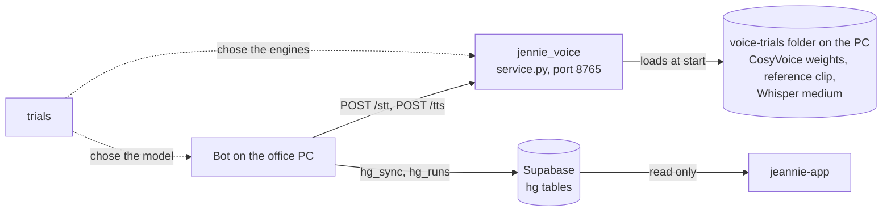

# Extras

This folder holds code that belongs to the Hangeul bot project but is not part of the bot's own git history. On the office PC each part lives in its own folder outside the bot folder (`C:\Hangeul\BOT`), under `C:\Hangeul\JARVIS\`. The copies here were made for reading. None of them is needed to run the bot.

| Folder here | Folder on the office PC | Files | What it is |
|---|---|---|---|
| [`jennie_voice/`](jennie_voice/) | `C:\Hangeul\JARVIS\jennie_voice` | 18 | The local voice service: speech-to-text and text-to-speech for the bot |
| [`trials/brain-trial/`](trials/brain-trial/) | `C:\Hangeul\JARVIS\brain-trial` | 15 | The trials that chose the local language model |
| [`trials/voice-trials/`](trials/voice-trials/) | `C:\Hangeul\JARVIS\voice-trials` | 63 | The trials of six voice engines, one folder per engine |
| [`jeannie-app/`](jeannie-app/) | `C:\Hangeul\JARVIS\jeannie-hg` | 210 | The phone app that reads what the bot publishes |

The counts include 13 `.log` files: saved console output of benchmark and trial runs (`jennie_voice/bench_stt.log` and 12 trial logs). The repository's root `.gitignore` ignores `*.log` (`.gitignore:35`). If a copy of this folder lacks them, the counts are 17, 14, 52 and 210.

Terms used on this page:

| Term | Meaning |
|---|---|
| Jennie | The bot's voice: a staff member sends a Telegram voice note and gets a short spoken answer back (`src/bot/voice.py`). |
| Jeannie | The phone app. One letter differs from "Jennie"; they are two different programs. |
| Supabase | A hosted Postgres database. When publishing is switched on, the bot copies what it reads there; the phone app reads it from there. |
| record kind | The type of one row the bot publishes to Supabase. There are 26 kinds (`src/cloud/records.py:41-47`). |

How the three parts connect to the bot:

Solid arrows happen at run time. Dotted arrows mean "was used to decide".

---

## 1. `jennie_voice/`: the local voice service

**What it is.** A separate Python program with its own virtual environment. It is a FastAPI service that listens on `127.0.0.1:8765` only (`extras/jennie_voice/service.py:49-50`) and has three routes (`extras/jennie_voice/service.py:4-9`):

| Route | What it does |
|---|---|
| `GET /health` | Reports the models and the device, and whether a request has held the service too long |
| `POST /stt` | Speech-to-text with the faster-whisper library |
| `POST /tts` | Text-to-speech with the CosyVoice2-0.5B model; answers with an OGG voice note |

One lock lets one request run at a time (`extras/jennie_voice/service.py:14`).

**How it connects to the bot.** The bot's `src/bot/voice.py` sends the audio of a Telegram voice note to `POST /stt` (`src/bot/voice.py:167`) and the one-sentence reply to `POST /tts` (`src/bot/voice.py:191`). It does this only when the bot setting `JENNIE_VOICE_ENABLED` is true (`src/bot/telegram_bot.py:2430-2432`). The address is the setting `JENNIE_VOICE_URL`, default `http://127.0.0.1:8765` (`src/config.py:70`); the bot refuses any host that is not this PC (`src/bot/voice.py:125-131`).

**It depends on the trial folders on the PC.** At start-up the service loads the CosyVoice source code, the CosyVoice2-0.5B weights and Jennie's reference voice clip from `C:\Hangeul\JARVIS\voice-trials\cosyvoice`, and the faster-whisper `medium` model, its speech-to-text fallback on the CPU, from `C:\Hangeul\JARVIS\voice-trials\whisper\hf_home\hub` (`extras/jennie_voice/service.py:53-56`, `:88-92`). Those folders are not in this repository, so the service cannot start from the published files alone. To run it elsewhere, change the path constants at the top of `service.py`.

**What is here.** The service (`service.py`), its own `README.md`, `requirements.txt` and `constraints.txt`, the launchers (`start_jennie_voice.vbs`, `stop_jennie_voice.bat`, `install_jennie_voice.bat`, `watchdog_jennie_voice.ps1`), three test and benchmark scripts (`smoke_test.py`, `offline_test.py`, `bench_stt.py`), the stand-in module `stubs/pyworld.py`, the folder's `.gitignore`, and five result files of earlier test and benchmark runs (`smoke_test.json`, `cpu_test.json`, `bench_stt.json`, `bench_stt_cpu2.json`, `bench_stt.log`).

**What was left out.**

| Left out | What it is | Why |
|---|---|---|
| `.venv\` | The service's virtual environment | Installed packages; rebuilt from `requirements.txt` and `constraints.txt` |
| `models\` | The Hugging Face and ModelScope caches, with the faster-whisper `large-v3-turbo` and `small` models (`extras/jennie_voice/service.py:90`, `:93`) | Model weights; binary downloads |
| `jennie_voice.log`, `jennie_voice_stdout.log`, `jennie_voice_stderr.log`, `jennie_watchdog.log` | The logs the running service and its watchdog write | Run-time logs |
| `test_in_ko.ogg`, `test_out_ko.ogg`, `test_out_en.ogg` | The smoke test's voice notes | Audio |
| `__pycache__\` | Python's compiled files | Generated |

The folder's own `.gitignore` already names `.venv/`, `models/`, `__pycache__/` and `*.log`.

**Where it is documented.**

- [../docs/programs/voice_and_llm.md](../docs/programs/voice_and_llm.md#extrasjennie_voiceservicepy): the code, request by request.
- [../docs/BUILD_AND_RUN.md section 11](../docs/BUILD_AND_RUN.md#11-the-voice-service-extrasjennie_voice): install, start and stop, settings, tests, the bot flags that switch it on.
- [../docs/SITE_MAP.md section 2.5](../docs/SITE_MAP.md#25-rest-api-routes): the three routes and their limits.
- [jennie_voice/README.md](jennie_voice/README.md): the service's own documentation, with its measurements.

---

## 2. `trials/`: how the model and the voice were chosen

**What it is.** The scripts and result files of experiments run by hand on the owner's PC on 27 and 28 September 2026 ([../docs/programs/trials.md](../docs/programs/trials.md#programs-in-this-group)). They answered which local language model the bot should use, which voice engines Jennie should use, how long a voice note takes end to end, and whether every number in one daily brief matches the portal.

| Folder | Files | Scripts | What it tried | Outcome in the code |
|---|---|---|---|---|
| `brain-trial/` | 15 | 7 Python | Ollama models for routing spoken requests and wording replies; GPU memory; `localhost` against `127.0.0.1`; the end-to-end voice latency; an independent check of one daily brief | The model `qwen3:4b-instruct` and the address `127.0.0.1` (`src/config.py:31-32`) |
| `voice-trials/piper/` | 9 | 7 Python | Piper text-to-speech on the CPU, voices and licences | Not chosen |
| `voice-trials/kokoro/` | 4 | 3 Python | Kokoro-82M text-to-speech on the CPU | Not chosen |
| `voice-trials/melotts/` | 7 | 6 Python | MeloTTS text-to-speech on the CPU, English and Korean | Not chosen |
| `voice-trials/chatterbox/` | 11 | 6 Python | Chatterbox multilingual text-to-speech on the GPU | Not chosen |
| `voice-trials/cosyvoice/` | 22 | 9 Python, 2 shell | CosyVoice text-to-speech in three model versions | CosyVoice2-0.5B, with a reference clip made by `cosyvoice/synth.py` (`extras/jennie_voice/service.py:52-59`) |
| `voice-trials/whisper/` | 10 | 4 Python | faster-whisper speech-to-text on the CPU and the GPU | faster-whisper; the `large-v3` and `medium` model files the trial downloaded (`extras/jennie_voice/service.py:88-92`) |

The voice service's default speech-to-text model, `large-v3-turbo`, was chosen later by `jennie_voice/bench_stt.py`, not by these trials (`extras/jennie_voice/service.py:95`).

**How it connects to the bot.** The bot imports none of these scripts. Two scripts go the other way and import the bot's code or settings from `C:\Hangeul\BOT`: `brain-trial/latency_harness.py` and `brain-trial/brief_crosscheck.py`. The voice service still loads the CosyVoice and Whisper files from the trial folders on the PC (section 1). Most scripts cannot run from this repository as they are: they use absolute paths under `C:\Hangeul\` and need model files, virtual environments and audio that are not here ([../docs/programs/trials.md, "Fixed paths"](../docs/programs/trials.md#fixed-paths)).

**What was left out.**

| Left out | Examples | Why |
|---|---|---|
| Audio | Every rendered sample (`C:\Hangeul\JARVIS\voice-samples\`), the reference clips under `cosyvoice\ref\`, the CosyVoice and Piper experiment renders, the four test voice notes of the latency harness (`latency_notes\*.ogg`; their list `notes.json` is included) | Binary files. The result files that describe each clip (text, duration, error rate) are included |
| Outputs of live runs | The latency harness's `latency_results.json` and `latency_harness.log`; the daily-brief text that `brief_crosscheck.py` checked | Produced by runs against the live portal and the bot's own services |
| Third-party code | The CosyVoice source checkout `cosyvoice\repo\`, a patched MeloTTS checkout `melotts\src\` | Other people's code |
| Model weights and caches | `hf`, `hf_cache`, `hf_home`, `ms`, `whisper_models`, `piper\voices`, `nltk_data` | Binary downloads |
| Virtual environments and pip caches | `.venv` or `venv` in each engine folder | Installed packages |

Two records of `trial.py` that existed on the PC are also not here: the result file of `qwen3:1.7b` and the console log of the run over the five default candidates ([../docs/programs/trials.md](../docs/programs/trials.md#what-is-published-and-what-is-not)).

**Where it is documented.**

- [../docs/programs/trials.md](../docs/programs/trials.md): every script, its inputs and outputs, and what the result files show.
- [../docs/reference/06_LLM_AND_JENNIE_VOICE.md](../docs/reference/06_LLM_AND_JENNIE_VOICE.md): the model choice and the voice decisions.
- [../docs/reference/08_HISTORY_STAGE_BY_STAGE.md](../docs/reference/08_HISTORY_STAGE_BY_STAGE.md): when each trial ran.

---

## 3. `jeannie-app/`: the phone app

**What it is.** Jeannie is a Next.js 15 web application in TypeScript for Node 22 (`extras/jeannie-app/package.json:20`, `:31`). It installs on a phone as a PWA (a website with a manifest and a service worker that the phone can put on its home screen). The owner asks it questions in a chat screen. Questions about the agency's data are answered from the rows the bot published to Supabase.

**Where it came from.** The app has its own separate GitHub repository; the app's README names it in its deploy steps (`extras/jeannie-app/README.md:134`). The part that reads the bot's data was built on a feature branch of that repository. The app's spec names the branch and says the work on it is "not yet merged or deployed" (`extras/jeannie-app/.scratch/hangeul-cloud-context/spec.md:3-5`). This folder is a snapshot of that branch.

**What is here.** Code, tests, database migrations and notes: the project configuration (`package.json`, `package-lock.json`, `next.config.mjs`, `tsconfig.json` and others), `.env.example` with setting names and placeholders only, `src/` (the page, the API routes, components, hooks, libraries), `supabase/` (four migrations and the Edge Function `hg-embed`), `tests/` (38 test files and 3 helpers), `scripts/`, `public/sw.js` and `public/avatar/manifest.json`, `assets/avatar/kling/clips.json`, `docs/`, and `.scratch/` (specs and tickets).

**What was left out.**

| Left out | What it is | Why |
|---|---|---|
| Media files | Avatar clips and posters, icons: on 3 October 2026, 48 `.mp4`, 66 `.jpg`, 4 `.png`, 2 `.webp` and 1 `.ico` under `public/` and `assets/` | Binary media. The lists that describe them, `public/avatar/manifest.json` and `assets/avatar/kling/clips.json`, are included |
| `.claude/` | Settings of a developer tool | Not part of the app |
| `node_modules/`, `.next/`, `public/ort/` | Installed npm packages, build output, the ONNX runtime copied before each build | Generated; rebuilt with `npm install` and `npm run build` (`extras/jeannie-app/package.json:7-10`) |

**Why it is included.** So that the reader can see where the bot's published data is read, and what the phone does with it.

**How it connects to the bot.** The bot and the app share no code and never call each other. They meet in one Supabase project:

1. The bot writes. It calls the database function `hg_sync` and inserts and updates rows of the table `hg_runs` (`src/cloud/publish.py:409`, `:442`, `:780`).
2. The schema it writes into is defined in this app's migration, `extras/jeannie-app/supabase/migrations/20260929030000_hangeul_context.sql`: the tables `hg_runs`, `hg_records`, `hg_chunks` and `hg_changes` (`:31`, `:42`, `:64`, `:76`), and the function `hg_sync` (`:137`). The bot's own docstring says the schema belongs to the app's repository (`src/cloud/__init__.py:18-19`).
3. Both sides list the same 26 record kinds in the same order (`extras/jeannie-app/src/lib/hangeul/types.ts:7-34`, `src/cloud/records.py:41-47`).
4. The app reads. Its server reads the four tables and calls the read functions `hg_match` and `hg_changes_since`; a browser that holds the app's access key also keeps a copy of the data in the phone's own database.

Where the bot's data is read in the app:

| Path under `extras/jeannie-app/` | What it does |
|---|---|
| `src/lib/hangeul/store.ts` | Server-side reads of the `hg_*` tables. Its header says it never calls `hg_sync` and writes nothing (`extras/jeannie-app/src/lib/hangeul/store.ts:1-3`) |
| `src/lib/hangeul/router.ts`, `src/lib/hangeul/answer.ts` | Turn a question into a query plan and build every figure and table in code |
| `src/app/api/hangeul/` | Five API routes: `route.ts`, `ask/`, `changes/`, `runs/`, `snapshot/` |
| `src/lib/client/hg-local/` | The copy on the phone, in the browser database `jeannie-hg` |
| `supabase/migrations/20260929030000_hangeul_context.sql` | The schema the bot writes into |
| `supabase/functions/hg-embed/index.ts` | A Supabase Edge Function that turns question text into vectors |

The app's one Python file, `scripts/avatar-clips/gate.py`, is a development tool for the avatar video clips. It has nothing to do with the bot's data ([../docs/PYTHON_PROGRAMS.md](../docs/PYTHON_PROGRAMS.md#13-extrasjeannie-app)).

**Where it is documented.**

- [../docs/JEANNIE_APP.md](../docs/JEANNIE_APP.md): the app in full: the data path, the copy on the phone, routes and access control, the database, outside services, settings, open items.
- [../docs/BUILD_AND_RUN.md section 13](../docs/BUILD_AND_RUN.md#13-the-phone-app-extrasjeannie-app): build, test and deploy.
- [../docs/SITE_MAP.md part 3](../docs/SITE_MAP.md#part-3--the-phone-app-extrasjeannie-app): its pages, routes, storage and outside services.
- [../docs/DATA_FLOW.md section 3.8](../docs/DATA_FLOW.md#38-from-supabase-to-the-phone-app): what moves from Supabase to the phone.
- [jeannie-app/README.md](jeannie-app/README.md): the app's own README.

---

Back to the repository overview: [../README.md](../README.md). Everything left out of the repository, with the path where it lives on the office PC: [../docs/PROJECT_STRUCTURE.md section 7](../docs/PROJECT_STRUCTURE.md#7-what-is-on-the-office-pc-but-not-in-this-repository-and-why).
